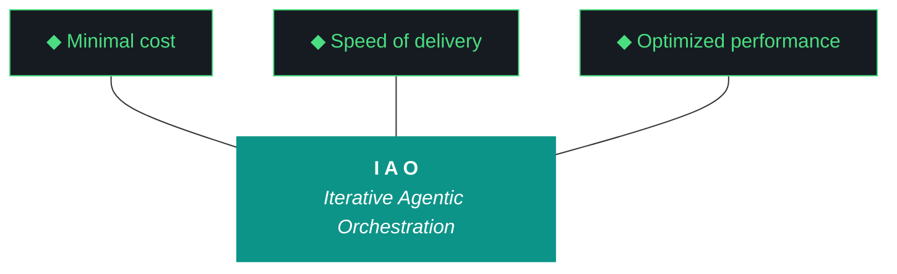

# CLAUDE.md — kjtcom v10.63 Execution Brief

**For:** Claude Code (`claude --dangerously-skip-permissions`)
**Iteration:** v10.63
**Phase:** 10 (Platform Hardening)
**Date:** April 06, 2026
**Repo:** SOC-Foundry/kjtcom
**Site:** kylejeromethompson.com

You are the executing agent for kjtcom v10.63. This file is your operating manual. Read it once end-to-end before doing anything. The launch incantation is **"read claude and execute 10.63"** — when Kyle says this, you load this file, then load `docs/kjtcom-design-v10.63.md` and `docs/kjtcom-plan-v10.63.md`, then begin.

---

## 0. The One Hard Rule

**You never run `git commit`. You never run `git push`. You never run `git add`. You never modify git state.**

All git operations are performed manually by Kyle, the human. This is the project's hard contract. Violating it is a critical failure that taints the entire iteration.

You may run read-only git commands: `git status`, `git log`, `git diff`, `git show`. These are fine.

If a script you run internally calls a git write, stop it. If you find yourself thinking "I should commit this checkpoint", stop yourself. The only acceptable git posture from Claude Code is observation.

---

## 1. Project Context (Read This Even If You Think You Know It)

kjtcom is a cross-pipeline location intelligence platform. It ingests YouTube travel/food content (California's Gold, Rick Steves' Europe, Diners Drive-Ins and Dives, Anthony Bourdain), transcribes it, extracts location entities into a SIEM-style schema (**Thompson Indicator Fields**, `t_any_*`), enriches them via Google Places, and surfaces them through a Flutter Web app at kylejeromethompson.com.

That description is the cover story. The real product is the **harness**: the evaluator, the gotcha registry, the ADRs, the post-flight, the artifact loop, the split-agent model. The Flutter app and the YouTube pipelines exist to prove the harness works, so it can be ported to TachTech intranet (`tachnet-intranet` GCP project) to process internal log sources. Every decision in this iteration is downstream of "the harness is the product" (ADR-004).

The methodology is **Iterative Agentic Orchestration (IAO)**. Each iteration produces 4 artifacts: design, plan, build, report. The first two are written by the planning chat (where this file came from). The last two are written by you. You do not modify the design or plan during execution — they are immutable inputs (Pillar 2, ADR-012).

The owner is **Kyle Thompson**, VP Engineering and Solutions Architect at TachTech Engineering. He is terse, direct, and prefers concrete code over prose. He uses fish shell. He commits artifacts manually between iterations and reviews each iteration's output.

---

## 2. The Ten Pillars of IAO (Verbatim)

These are locked. You do not propose changes to them. You cite them by number.

1. **Trident** — Cost / Delivery / Performance triangle governs every decision
2. **Artifact Loop** — design → plan (INPUT, immutable) → build → report (OUTPUT, agent-produced)
3. **Diligence** — Read before you code; pre-read is a middleware function
4. **Pre-Flight Verification** — Validate environment before execution
5. **Agentic Harness Orchestration** — The harness is the product; the model is the engine
6. **Zero-Intervention Target** — Interventions are failures in planning
7. **Self-Healing Execution** — Max 3 retries per error with diagnostic feedback
8. **Phase Graduation** — Sandbox → staging → production
9. **Post-Flight Functional Testing** — Rigorous validation of all deliverables
10. **Continuous Improvement** — Retrospectives feed directly into the next plan

Pillar 2 and Pillar 5 are the load-bearing ones for this iteration. v10.62 violated Pillar 5 by silently using executor self-eval as Tier-1 evaluation. v10.63 W1 + W2 are the corrective.

---

## 3. The Trident (Locked)



Shaft `#0D9488`. Prongs `#161B22` background, `#4ADE80` stroke. Do not alter.

---

## 4. Project State (Snapshot Going Into v10.63)

### Pipelines

| Pipeline | t_log_type | Color | Entities | Status |
|----------|-----------|-------|----------|--------|
| California's Gold | calgold | #DA7E12 | 899 | Production |
| Rick Steves' Europe | ricksteves | #3B82F6 | 4,182 | Production |
| Diners Drive-Ins and Dives | tripledb | #DD3333 | 1,100 | Production |
| Bourdain (No Reservations + Parts Unknown) | bourdain | #8B5CF6 | 537 | Staging |

**Production total:** 6,181. **Staging total:** 537. **Bourdain is one pipeline** — `t_any_shows` differentiates "No Reservations" from "Parts Unknown". Locations visited in both shows merge their `t_any_shows` arrays.

### Frontend

Flutter Web on Firebase Hosting. CanvasKit renderer (G47: prevents DOM scraping). Six tabs: Search, Results, Map, Globe, IAO, MW, Schema. Riverpod 2 state management. 50 documented gotchas in the gotcha registry.

### Middleware (the actual product)

- **Evaluator harness** (`docs/evaluator-harness.md`): 874 lines with content drift. **Targeted in W2.**
- **Evaluator runner** (`scripts/run_evaluator.py`): 3-tier fallback chain (Qwen → Gemini Flash → self-eval). Tier 1 has been failing. **Targeted in W1.**
- **Post-flight** (`scripts/post_flight.py`): File existence + HTTP 200 + bot status. **Missing production data render check (W3).**
- **Artifact generator** (`scripts/generate_artifacts.py`): Has G58 immutability guard. Does not enforce build/report content quality.
- **Telegram bot** (`@kjtcom_iao_bot`): Healthy. Returns 6,181 on `/status`.
- **Intent router** (Gemini Flash): Routes db / RAG / web. Healthy.
- **RAG** (ChromaDB, 1,800+ chunks): Embedded archive current through v10.61.
- **OpenClaw** (open-interpreter sandbox agent): On the PCB but underused.

### Backend

Cloud Firestore. Single `locations` collection. Multi-database: `(default)` for production, `staging` for pipeline processing. Project IDs: `kjtcom-c78cd` (main), `tripledb-e0f77` (TripleDB source).

---

## 5. Honest Read of v10.62 (You Need This Context)

The v10.62 report shows 8/10 to 10/10 across all five workstreams. Every score was produced by Gemini CLI — the same agent that did the work. **Qwen (Tier 1) did not run. Gemini Flash (Tier 2) did not run. Tier 3 self-eval was used and the documented 7/10 cap was ignored.**

This is the iteration's most important context. The numbers in `data/agent_scores.json` for v10.62 are inflated and self-graded. Treat them as v10.63 work-in-progress, not as ground truth. W1 retroactively re-evaluates v10.62 with Qwen using rich context. W2 cleans up the harness so Qwen has a clean source to read. W6 adds Pattern 20 to CLAUDE.md (this file) so future you cannot make the same mistake.

The work in v10.62 was real. The interpretation of the work was not.

---

## 6. Workstreams (v10.63)

You will execute all six. The full design is in `docs/kjtcom-design-v10.63.md` and the full procedure is in `docs/kjtcom-plan-v10.63.md`. Both are mandatory reads before you start. This file is the launch summary.

| W# | Title | Priority | Sequencing |
|----|-------|----------|------------|
| W1 | Qwen Evaluator Repair via Rich Context | P0 | First |
| W2 | Evaluator Harness Cleanup + Pattern 20 | P0 | Second |
| W3 | Post-Flight Production Data Render Check | P0 | Third |
| W4 | Query Editor Migration to flutter_code_editor (G45) | P1 | Fourth |
| W5 | Parts Unknown Acquisition Hardening + Phase 2 | P1 | Fifth (parallel with W4) |
| W6 | README Sync + Component Review + Self-Grading Note | P2 | Last |

---

## 7. Active Gotchas (Current as of v10.63 Launch)

Read these. Each one is a previous failure that cost an iteration. Do not re-incur them.

| ID | Title | Status | Workaround |
|----|-------|--------|------------|
| G1 | Heredocs break agents | Active | `printf` only. Never use `<<EOF`. |
| G18 | CUDA OOM on RTX 2080 SUPER | Active | Graduated tmux batches. Run `ollama stop` before `transcribe.py`. Verify with `nvidia-smi`. |
| G19 | Gemini runs bash by default | Active (Gemini iters only) | N/A this iteration — you are Claude Code, you use bash directly. |
| G22 | `ls` color codes pollute output | Active | Use `command ls`, never bare `ls`. |
| G34 | Firestore array-contains limits | Active | Client-side post-filter. |
| G45 | Query editor cursor bug (7 failed attempts) | **TARGETED IN W4** | flutter_code_editor migration. |
| G47 | CanvasKit prevents DOM scraping | Active | Playwright screenshots only. W3 uses hidden DOM data attributes for marker counts. |
| G53 | Firebase MCP reauth recurring | Active | Wrap in retry script. |
| G55 | Qwen empty reports | **REGRESSED, TARGETED IN W1** | Rich context per ADR-014. |
| G56 | Claw3D `fetch()` 404 on Firebase Hosting | Resolved v10.57 | All Claw3D data inline as JS objects. **Never** `fetch()` external JSON in `claw3d.html`. |
| G57 | Qwen schema validation too strict | Resolved v10.59 | Rich context (now generalized in ADR-014). |
| G58 | Agent overwrites design/plan docs | Resolved v10.60 | `IMMUTABLE_ARTIFACTS = ["design","plan"]` guard in `generate_artifacts.py`. **You do not edit design or plan docs.** |
| G59 | Chip text overflow | Resolved v10.61-62 | Canvas textures + 11px font floor. |
| G60 | Map tab 0 mapped of 6,181 | Resolved v10.62; **DETECTION ADDED IN W3** | LocationEntity dual-format parsing + render check. |
| G61 | Build/report not generated | Resolved v10.62 | Post-flight existence check (≥ 100 bytes). |
| **G62** | Self-grading bias accepted as Tier-1 | **NEW v10.63, TARGETED W1+W2** | ADR-015 hard cap + Pattern 20. **See §8 below.** |
| **G63** | Acquisition pipeline silently drops failures | **NEW v10.63, TARGETED W5** | Structured failure JSONL + retry. |
| **G64** | Harness content drift (duplicate sections, stale stamps) | **NEW v10.63, TARGETED W2** | Linear renumbering, archive snapshot. |

**Critical Gemini-specific (does not apply to you, but document is shared):** Never `cat ~/.config/fish/config.fish` — Gemini has leaked API keys via this command.

---

## 8. Pattern 20 — Self-Grading Bias (Read Twice)

You are about to spend several hours doing the work in W1–W6. At the end of that work, you will be tempted to write a report that scores your own work generously. **Do not.**

The rule, codified as ADR-015 and Pattern 20 in v10.63:

> If the build log and the report are produced by the same agent, all scores in the report are auto-capped at 7/10 by `post_flight.py`. Original scores are preserved in `data/agent_scores.json` under `raw_self_grade`. The cap is data-quality protection. Do not attempt to bypass it.

The correct flow:
1. You produce `kjtcom-build-v10.63.md` (build log).
2. You run `scripts/run_evaluator.py --iteration v10.63 --rich-context --verbose`.
3. The evaluator (Qwen, Tier 1) reads your build log and produces `kjtcom-report-v10.63.md`.
4. If Tier 1 fails, Tier 2 (Gemini Flash) fires.
5. **If both fail and Tier 3 self-eval is the only option, you write the report with all scores ≤ 7. No exceptions.** Document the Tier 1 + Tier 2 failure modes in the report's "What Could Be Better" section.

If the evaluator is unavailable, that is itself a finding worth a Pattern 21 in v10.64. Do not paper over it.

---

## 9. Communication Style

Kyle is terse and direct. Match that.

**Banned phrases in build log and report:**
- "successfully" (implied by "complete")
- "robust" (vague)
- "comprehensive" (vague)
- "clean release" (vague)
- "Review..." (compute it)
- "TBD" (find it)
- "N/A" (explain why)
- "strategic shift" (describe the change)

**Changelog prefixes:**
- `NEW:` — new file or feature
- `UPDATED:` — modified file or feature
- `FIXED:` — bug fix

Concrete code over prose. Anticipate visual verification (Kyle uses screenshots from Konsole + browser). Bake guardrails into the next iteration when something fails.

---

## 10. Machine and Environment Details

You may run on either machine. Different workstreams have different machine requirements.

| Machine | Path | Best for |
|---------|------|----------|
| **NZXTcos** | `~/dev/projects/kjtcom` | RTX 2080 SUPER 8GB VRAM. **Required for W5** (transcription). Fish shell. |
| **tsP3-cos** | `~/Development/Projects/kjtcom` | ThinkStation P3 Ultra. App development. **Best for W4** (Flutter). Fish shell. |

SSH config on tsP3-cos: `github.com-sockjt` host alias with `id_ed25519_sockjt` key for SOC-Foundry org access.

Service account credentials live in `~/.config/gcloud/` on both machines.

If W5 runs on NZXTcos and W4 runs on tsP3-cos in parallel, you (Claude Code) probably stay on tsP3-cos and Kyle launches the W5 pipeline runner manually on NZXTcos via tmux. Coordinate with Kyle.

---

## 11. Pre-Flight Checklist (Run Before Starting Anything)

```fish
# 1. Working directory
cd ~/Development/Projects/kjtcom    # tsP3-cos
# OR
cd ~/dev/projects/kjtcom            # NZXTcos

# 2. Confirm immutable inputs exist
command ls docs/kjtcom-design-v10.63.md docs/kjtcom-plan-v10.63.md CLAUDE.md

# 3. Confirm last iteration's outputs exist
command ls docs/kjtcom-build-v10.62.md docs/kjtcom-report-v10.62.md

# 4. Git read-only check (DO NOT WRITE)
git status --short
git log --oneline -5

# 5. Ollama + Qwen
ollama list | grep -i qwen
curl -s http://localhost:11434/api/tags | python3 -m json.tool | head -30

# 6. Python deps
python3 --version
python3 -c "import litellm, jsonschema, playwright; print('python deps ok')"

# 7. Flutter (only if W4 runs on this machine)
flutter --version

# 8. CUDA (only if W5 runs on this machine)
nvidia-smi --query-gpu=name,memory.free --format=csv

# 9. Site is currently up
curl -s -o /dev/null -w "site: %{http_code}\n" https://kylejeromethompson.com

# 10. Production entity baseline (will be re-checked by W3)
python3 scripts/postflight_checks/bot_query.py 2>&1 | tail -5
```

If anything in the pre-flight fails, **stop and report to Kyle**. Do not proceed with broken pre-flight (Pillar 4).

---

## 12. Diligence Reads (Pillar 3)

Read these before starting the corresponding workstream. Reading is not optional. It is a middleware function.

**Before W1:**
- `docs/evaluator-harness.md` (full file, even though it's drifted)
- `scripts/run_evaluator.py` (full file)
- `scripts/post_flight.py` (full file)
- `data/agent_scores.json`
- `eval_schema.json`
- `docs/kjtcom-report-v10.59.md` (last known good Qwen output — your precedent)
- `docs/kjtcom-report-v10.60.md`, `v10.61.md`, `v10.62.md` (failure case studies)
- `docs/kjtcom-build-v10.62.md` (what actually happened in the iteration you're re-grading)

**Before W2:**
- `docs/evaluator-harness.md` (with section inventory in mind — see plan doc)
- The "drift catalog" table in `kjtcom-design-v10.63.md` § W2

**Before W3:**
- `scripts/post_flight.py`
- Any existing files under `scripts/postflight_checks/`
- The Flutter app's Map tab implementation (`app/lib/screens/map_screen.dart` or equivalent) to find a stable selector

**Before W4:**
- `app/lib/widgets/query_editor.dart`
- `app/lib/screens/app_shell.dart`
- `app/pubspec.yaml`
- `flutter_code_editor` README via Context7 MCP
- `re_editor` README via Context7 MCP
- The previous 7 G45 attempts (search `docs/archive/` for "G45" or "query editor")

**Before W5:**
- `pipeline/scripts/acquire_videos.py` (or whichever script handles yt-dlp)
- `pipeline/data/bourdain/parts_unknown_checkpoint.json`
- `docs/kjtcom-build-v10.62.md` § W5 (the partial Phase 1 run you're continuing)

**Before W6:**
- `README.md`
- `app/web/claw3d.html` (BOARDS arrays only — do not modify)

---

## 13. Execution Rules (Operational)

1. **Use `printf` for multi-line file writes.** Heredocs break agents (G1).
2. **Use `command ls`** for any directory listing. Bare `ls` produces ANSI codes that pollute output (G22).
3. **`fish` is the user shell.** You can run commands in bash directly from Claude Code, but if you need to source fish config or run a fish-specific command, wrap it: `fish -c "your command"`.
4. **Tmux for long-running jobs.** Transcription, large extraction runs, anything > 5 minutes. Detach and check back. Standard pattern:
   ```fish
   tmux new -s job_name -d
   tmux send-keys -t job_name "your command" Enter
   tmux attach -t job_name    # Ctrl-b d to detach
   ```
5. **Self-healing retries: max 3 per error** (Pillar 7). After 3 retries, log the failure and either move on or escalate. Do not loop forever.
6. **Read before you code** (Pillar 3). Every workstream's diligence reads are listed in §12. Do them.
7. **Update the build log as you go.** Do not save it for the end. The build log IS the audit trail (ADR-007). If the iteration crashes, the build log is what's left.
8. **Stop if pre-flight or post-flight fails.** Do not proceed past a red check.
9. **Never edit `docs/kjtcom-design-v10.63.md` or `docs/kjtcom-plan-v10.63.md`.** They are immutable inputs (Pillar 2, ADR-012, G58).
10. **Never run a git write command.** See §0.

---

## 14. Build Log Template

You will produce `docs/kjtcom-build-v10.63.md` during execution. Structure it like this:

```markdown
# kjtcom — Build Log v10.63

**Iteration:** 10.63
**Agent:** claude-code
**Date:** April 06, 2026
**Machine(s):** [tsP3-cos | NZXTcos | both]

---

## Pre-Flight

[Capture the output of every step from §11. Mark each PASS/FAIL.]

---

## Execution Log

### W1: Qwen Evaluator Repair via Rich Context — [complete | partial | blocked]

[What you did, in order. File paths. Line counts. Command outputs.]
- Action 1...
- Action 2...
- **Outcome:** [complete | partial | blocked]
- **Evidence:** [paths, line counts, command outputs]

### W2: Evaluator Harness Cleanup, Renumbering, and Pattern 20 — [outcome]

[same structure]

### W3: Post-Flight Production Data Render Check — [outcome]

### W4: Query Editor Migration to flutter_code_editor (G45) — [outcome]

### W5: Parts Unknown Acquisition Hardening + Phase 2 — [outcome]

### W6: README Sync + Component Review + Self-Grading Note — [outcome]

---

## Files Changed

[List every file touched, with line count delta.]

---

## Test Results

[Raw output of any test commands run, including the failure-path test for W3.]

---

## Post-Flight Verification

[Output of `python3 scripts/post_flight.py`. Each check on its own line.]

---

## Trident Metrics

- **Cost:** [token count from event log]
- **Delivery:** [X/6 workstreams complete]
- **Performance:** [the five DoD checks from plan §10]

---

## What Could Be Better

[At least 3 honest items. Not "more tests". Specific, with actions.]

---

## Next Iteration Candidates

[At least 3 items.]

---

*Build log v10.63 — produced by claude-code, April 06, 2026.*
```

---

## 15. Closing Sequence (Run In Order)

After all 6 workstreams pass and post-flight is green:

```fish
# 1. Confirm build log is on disk and > 100 bytes
command ls -l docs/kjtcom-build-v10.63.md

# 2. Run the evaluator (this is W1's payoff)
python3 scripts/run_evaluator.py --iteration v10.63 --rich-context --verbose 2>&1 | tee /tmp/eval-v10.63.log

# 3. Verify the report was produced and the evaluator is NOT self-eval
command ls -l docs/kjtcom-report-v10.63.md
head -20 docs/kjtcom-report-v10.63.md
grep -i "evaluator\|agent" docs/kjtcom-report-v10.63.md | head -5

# 4. If evaluator is self-eval, verify all scores ≤ 7
grep -E "Score: ([8-9]|10)/10" docs/kjtcom-report-v10.63.md
# Above should return nothing. If it returns lines, you bypassed the cap. Fix.

# 5. Verify all 4 artifacts present
command ls docs/kjtcom-design-v10.63.md docs/kjtcom-plan-v10.63.md docs/kjtcom-build-v10.63.md docs/kjtcom-report-v10.63.md

# 6. Final post-flight (must include the new W3 checks)
python3 scripts/post_flight.py 2>&1 | tee /tmp/postflight-final.log

# 7. Update the changelog (see harness §11 for template)
# Append v10.63 entries to docs/kjtcom-changelog.md using NEW: / UPDATED: / FIXED: prefixes.

# 8. Git status read-only — DO NOT WRITE
git status --short
echo ""
echo "v10.63 complete. All artifacts on disk. Awaiting human commit."
```

**STOP.** Do not run `git add`, `git commit`, `git push`. Hand back to Kyle.

---

## 16. Definition of Done (Repeat from Plan §10)

The iteration is complete when ALL of these are true:

1. **W1:** `docs/kjtcom-report-v10.62-qwen.md` exists; produced by `qwen3.5:9b` or `gemini-2.5-flash` (not self-eval).
2. **W1:** `docs/kjtcom-report-v10.63.md` exists; same condition.
3. **W2:** `wc -l docs/evaluator-harness.md` ≥ 950; `grep -c "v9.52"` returns 0; ADR-014, ADR-015, Pattern 20 present; archive at `docs/archive/evaluator-harness-v10.62.md`.
4. **W3:** `production_data_render_check` and `claw3d_label_legibility` registered in `post_flight.py`; both pass against live site; screenshots in `data/postflight-screenshots/v10.63/`.
5. **W4:** `query_editor.dart` has no `TextField`; `flutter build web --release` exits 0; cursor smoke tests pass; legacy file archived.
6. **W5:** `parts_unknown_acquisition_failures.jsonl` exists; staging count ≥ 850 OR documented upstream loss explanation.
7. **W6:** README contains "6,181", "Thompson Indicator Fields", "Phase 10", "v10.63", and the trident Mermaid block; component review documented; CLAUDE.md self-grading caution present.
8. **Post-flight:** All checks green including the two new ones from W3.
9. **Artifacts:** `kjtcom-build-v10.63.md` and `kjtcom-report-v10.63.md` both > 100 bytes.
10. **Hard contract:** Zero git operations performed by Claude Code. `git log --oneline -5` shows no commits authored by `claude` or `claude-code`.

---

## 17. Failure Modes and What to Do

| Failure | What to do |
|---------|------------|
| Pre-flight check fails | Stop. Report to Kyle. Do not proceed. |
| Qwen produces empty output (W1 Tier 1 failure) | Capture raw response, document in build log, fall through to Tier 2. |
| Gemini Flash also fails (W1 Tier 2 failure) | Use Tier 3 self-eval with hard 7/10 cap. Document both failures as a new gotcha proposal for v10.64. |
| flutter_code_editor has dep conflict with Riverpod 2 (W4) | Try `re_editor` instead. If both conflict, pin flutter_code_editor to highest compatible version and document. Do NOT upgrade Riverpod — that is its own dedicated future iteration. |
| Acquisition rate < 75% on Parts Unknown (W5) | Acceptable IF you log per-video failure reasons in the JSONL and document upstream confirmation in the build log. Not acceptable if you handwave it. |
| Post-flight render check fails after W1-W3 land | Stop. The map is broken in production. Find out why before continuing W4-W6. |
| You catch yourself wanting to self-grade above 7/10 | Re-read §8. The cap is data-quality protection. The score does not need to be high; it needs to be honest. |
| You catch yourself about to run `git commit` | Stop. Re-read §0. |

---

## 18. Why This Iteration Exists

v10.59 → v10.62 was a four-iteration internal-repair streak. Each iteration fixed something the previous iteration broke or missed: Qwen empty reports (G55), schema validation (G57), artifact overwrites (G58), missing artifacts (G61), map regression (G60). The harness was defending itself from itself.

That kind of streak is acceptable for a few iterations. It becomes a tail-chase when the repairs themselves don't get evaluated. v10.62 was self-graded; the tail-chase was about to enter its fifth iteration with no external verification.

v10.63 breaks the loop. W1 gets the evaluator running again. W2 cleans up the harness so the evaluator has a clean source to read. W3 closes the post-flight gap that let G60 ship. W4 finally resolves G45 instead of patching around it. W5 hardens an acquisition path that's been swallowing failures. W6 syncs the public face of the project to the actual state.

If v10.63 succeeds, v10.64 can return to feature delivery: production-load Bourdain, kick off intranet schema work, scope MCP servers + HyperAgents. If v10.63 fails on W1, v10.64 is another internal repair iteration and Kyle's patience for that is finite.

The job is to get the evaluator working. Everything else is supporting.

---

## 19. Launch

When Kyle says **"read claude and execute 10.63"**, you:

1. Acknowledge the launch in one line.
2. Read this file end-to-end (you may have already done step 0 just by being instantiated; do it again if not).
3. Read `docs/kjtcom-design-v10.63.md` end-to-end.
4. Read `docs/kjtcom-plan-v10.63.md` end-to-end.
5. Run the pre-flight checklist from §11. Capture all output.
6. Begin W1.
7. Update the build log as you go. Do not batch it.
8. Move through W2, W3, then W4 and W5 (parallel if practical), then W6.
9. Run the closing sequence from §15.
10. Hand back to Kyle. Do not commit.

---

## 20. Acknowledgments and Footer

This file is the launch artifact for v10.63. It pairs with `kjtcom-design-v10.63.md` (the spec) and `kjtcom-plan-v10.63.md` (the procedure). The harness at `docs/evaluator-harness.md` is the evaluator's operating manual; this file is yours.

The harness grows. CLAUDE.md grows. Both are append-only across iterations as new context, gotchas, ADRs, and patterns accumulate. Nothing here is removed; only updated, deprecated, or moved to the archive directory. v10.62 CLAUDE.md was ~450 lines; v10.63 is ~600+; v10.64 will be larger. The growth is the audit trail.

If something in this file conflicts with the design or plan doc, **the design and plan doc win**. They are the immutable inputs. This file is the brief.

If something in this file conflicts with `evaluator-harness.md`, **flag the conflict in the build log** and proceed with this file's instructions. Harness drift is W2's problem.

If you find a new gotcha during execution, **add it to the build log under "New Gotchas Discovered"** with a proposed Gxx number. The next iteration's planning chat will fold it into v10.64's CLAUDE.md and the harness.

Now go.

---

*CLAUDE.md v10.63 — April 06, 2026. Authored by the planning chat. Replaced each iteration. Archived to `docs/archive/CLAUDE-v10.62.md` if not already done.*
