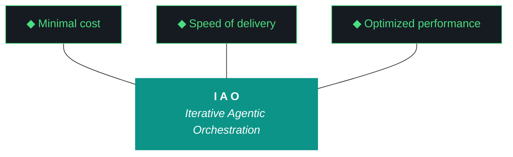

# CLAUDE.md — kjtcom v10.66 Execution Brief

**For:** Claude Code (`claude --dangerously-skip-permissions`)
**Iteration:** v10.66
**Phase:** 10 (Harness Externalization Phase A)
**Date:** April 08, 2026
**Repo:** SOC-Foundry/kjtcom
**Site:** kylejeromethompson.com
**Machine:** NZXTcos (`~/dev/projects/kjtcom`)
**Run mode:** **Bounded fast iteration.** Target: **< 60 minutes**. Cap: **90 minutes**.
**Primary executor for v10.66:** Gemini CLI (see `GEMINI.md`). This is the parallel companion if Kyle pivots to Claude Code.

You are the executing agent for kjtcom v10.66 IF Kyle launches with `claude --dangerously-skip-permissions` instead of `gemini --yolo`. The plan is agent-agnostic; only operational rules differ. Launch incantation: **"read claude and execute 10.66"**.

---

## 0. The One Hard Rule

**You never run `git commit`, `git push`, or `git add`.** Read-only git only.

---

## 1. Zero Intervention (Pillar 6)

You never ask Kyle for permission. Note discrepancies, choose the safest forward path, proceed. Halt only on hard pre-flight failures or destructive irreversible operations.

**v10.66 is short.** If you finish in 30 minutes, that's fine. Ship the 11 workstreams cleanly and close.

**Claude Code's specific failure mode:** you will be tempted to phrase forward decisions as "I notice X is unusual, would you like me to..." That phrasing IS the violation. Convert it to "I noticed X. I chose Y because Z. Proceeding."

**If you exceed 90 minutes:** emit a warning "WALL CLOCK EXCEEDS TARGET" in the build log, skip to W11 closing, document the overrun.

---

## 2. Project Context (Brief)

kjtcom is a multi-pipeline location intelligence platform. The real product is the **harness**. v10.66 begins **Phase A of harness externalization**: the universal components live at `kjtcom/iao-middleware/` and ship via an install script.

Kyle Thompson (VP Engineering at TachTech Engineering) is the owner. Terse, direct, fish shell.

---

## 3. The Ten Pillars of IAO (Verbatim)

1. **Trident** — Cost / Delivery / Performance triangle
2. **Artifact Loop** — design → plan → build → report → context bundle
3. **Diligence** — First action: `python3 scripts/query_registry.py "<topic>"`
4. **Pre-Flight Verification**
5. **Agentic Harness Orchestration**
6. **Zero-Intervention Target**
7. **Self-Healing Execution** (max 3 retries)
8. **Phase Graduation**
9. **Post-Flight Functional Testing** — Build is a gatekeeper
10. **Continuous Improvement**

---

## 4. The Trident (Locked)



---

## 5. Project State (Going Into v10.66)

### Pipelines

| Pipeline | Entities | Status |
|---|---|---|
| calgold | 899 | Production |
| ricksteves | 4,182 | Production |
| tripledb | 1,100 | Production |
| bourdain | 604 | **Production (v10.65 W6)** |

**Production total:** 6,785. **Staging:** 0. **v10.66 makes zero changes. No Bourdain work.**

### Frontend

- Flutter: **v10.65 deployed** (Kyle Apr 7 evening)
- `claw3d.html`: **STALE at v10.64** — G101, fixed by W10

### Middleware health

- Harness: 1,062 lines, 22 ADRs
- Evaluator: Pattern 21 round 3 — Tier 2 hallucinates (G98, fixed W8)
- Script registry: 60 entries v2 schema
- Context bundle: 157 KB v10.65 (bugs, fixed W1)
- `iao-middleware/`: **does not yet exist — W3 creates it**

---

## 6. What v10.66 Is (and Isn't)

**IS:** Phase A iao-middleware externalization, path-agnostic resolution, install.fish + compatibility checker + iao CLI, G97/G98 evaluator fixes, claw3d version sync (G101), context bundle §1-§11 expansion, harness update. **< 60 min target.**

**IS NOT:** Bourdain work, `iao eval` subcommand, page load fix, MW tab check, macOS/Windows install, cross-distro detection.

---

## 7. The 11 Workstreams

Full design: `docs/kjtcom-design-v10.66.md` §8. Full procedure: `docs/kjtcom-plan-v10.66.md` §6.

| W# | Title | Pri | Est. |
|---|---|---|---|
| W1 | Context bundle bug fixes + §1-§11 spec | P0 | 8 min |
| W2 | `iao_paths.py` + v10.65 component refactor (ADR-024) | P0 | 10 min |
| W3 | Create `kjtcom/iao-middleware/` tree + move-with-shims (ADR-023) | P0 | 10 min |
| W4 | `iao-middleware/install.fish` | P0 | 8 min |
| W5 | `COMPATIBILITY.md` + checker | P1 | 4 min |
| W6 | `iao` CLI: project, init, status | P1 | 6 min |
| W7 | G97 synthesis ratio exact-match fix | P0 | 3 min |
| W8 | G98 Tier 2 design-doc anchor fix | P0 | 5 min |
| W9 | GEMINI.md + CLAUDE.md two-harness diligence | P1 | 3 min |
| W10 | claw3d.html + dual deploy checks (ADR-025, G101) | P0 | 5 min |
| W11 | Harness update + closing sequence | P0 | 5 min |

**Strictly sequential. No parallel. No tmux.**

---

## 8. Critical Gotchas

| ID | Title | Action |
|---|---|---|
| G1 | Heredocs break agents | `printf` only |
| G22 | `ls` color codes | `command ls` |
| G83 | Agent overwrites design/plan | You do NOT edit design or plan docs |
| **G97** | **Synthesis ratio substring overcounting** | **TARGETED W7** |
| **G98** | **Tier 2 Gemini Flash workstream hallucination** | **TARGETED W8** |
| **G99** | **Context bundle cosmetic bugs** | **TARGETED W1** |
| **G101** | **claw3d.html version stamp drift** | **TARGETED W10** |

---

## 9. Claude Code Specific Notes

- **Bash tool defaults to bash.** Wrap fish syntax with `fish -c "..."`.
- **Use Edit tool** for code modifications, **Read tool** for diligence, **Write tool** sparingly (prefer Edit).
- **Do NOT use Edit tool on `docs/kjtcom-design-v10.66.md` or `docs/kjtcom-plan-v10.66.md`.** Immutable inputs (G83).
- **Do NOT use Bash tool for any git write command.**
- **No tmux in v10.66.** Every workstream is synchronous.
- **Long-running commands:** there shouldn't be any in v10.66. Flutter build takes ~30s (acceptable). Everything else is sub-10-second.
- **Wall clock awareness:** check elapsed time at start of each workstream. If > 75 min by W8, abbreviate W9-W11.

---

## 10. Pre-Flight Checklist

```
# 0. Set the iteration env var FIRST
export IAO_ITERATION=v10.66   # bash
# OR
set -x IAO_ITERATION v10.66   # fish via fish -c

# 1. Working directory
cd ~/dev/projects/kjtcom

# 2. Immutable inputs (BLOCKER)
command ls docs/kjtcom-design-v10.66.md docs/kjtcom-plan-v10.66.md GEMINI.md CLAUDE.md

# 3. v10.65 outputs (NOTE)
command ls docs/kjtcom-build-v10.65.md docs/kjtcom-report-v10.65.md docs/kjtcom-context-v10.65.md 2>/dev/null \
  || echo "DISCREPANCY NOTED: v10.65 artifacts missing"

# 4. Git read-only
git status --short
git log --oneline -5

# 5. Ollama + Qwen (BLOCKER)
curl -s http://localhost:11434/api/tags > /dev/null && echo "ollama: ok" || echo "BLOCKER: ollama down"
ollama list | grep -i qwen || echo "DISCREPANCY NOTED: qwen not pulled"

# 6. Python deps (BLOCKER)
python3 -c "import litellm, jsonschema, playwright, imagehash, PIL; print('python deps ok')"

# 7. Flutter (BLOCKER for W10)
flutter --version

# 8. Site
curl -s -o /dev/null -w "site: %{http_code}\n" https://kylejeromethompson.com

# 9. v10.65 Flutter app deployed?
curl -s https://kylejeromethompson.com/ 2>/dev/null | grep -o "v10\.65\|v10\.64" | head -1

# 10. claw3d current stale state
curl -s https://kylejeromethompson.com/claw3d.html | grep -o "PCB Architecture v[0-9.]*" | head -1

# 11. Production baseline
python3 -c 'from scripts.firestore_query import execute_query; print(execute_query({}, "count"))' 2>/dev/null \
  || echo "DISCREPANCY NOTED: cannot baseline production count"

# 12. Disk
df -h ~ | tail -1

# 13. Sleep masked
systemctl status sleep.target 2>&1 | grep -i masked || echo "DISCREPANCY NOTED: sleep not masked"

# 14. Firebase CI token (optional)
ls ~/.config/firebase-ci-token.txt 2>/dev/null \
  || echo "DISCREPANCY NOTED: Firebase CI token missing"
```

---

## 11. Execution Rules

1. **`printf` for multi-line file writes** (G1)
2. **`command ls`** for directory listings (G22)
3. **Bash tool defaults to bash.** Wrap fish commands: `fish -c "..."`
4. **NO tmux in v10.66**
5. **Max 3 retries per error** (Pillar 7)
6. **`query_registry.py` first** for diligence (ADR-022)
7. **Update build log as you go**
8. **Never edit design or plan docs** (G83)
9. **Never run git writes**
10. **Set `IAO_ITERATION=v10.66` in pre-flight**
11. **Set `IAO_WORKSTREAM_ID=W<N>` at start of each workstream**
12. **Wall clock awareness at each workstream boundary**

---

## 12. Build Log Template

Produce `docs/kjtcom-build-v10.66.md`:

```markdown
# kjtcom — Build Log v10.66

**EVENING CHECK REQUIRED (if applicable):**
1. python3 scripts/postflight_checks/deployed_flutter_matches.py
2. python3 scripts/postflight_checks/deployed_claw3d_matches.py
3. flutter build web --release && firebase deploy --only hosting

**Iteration:** 10.66
**Agent:** claude-code
**Date:** April 08, 2026
**Machine:** NZXTcos
**Run mode:** Bounded fast iteration, target < 60 min
**Start:** <timestamp>

## Pre-Flight
## Discrepancies Encountered
## Execution Log (W1 - W11 sections)
## Files Changed
## New Files Created
## Wall Clock Log
## Test Results
## Post-Flight Verification
## Iteration Delta Table
## Trident Metrics
## What Could Be Better
## Next Iteration Candidates

**End:** <timestamp>
**Total wall clock:** <duration>

---
*Build log v10.66 — produced by claude-code, April 08, 2026.*
```

---

## 13. Closing Sequence (W11)

```
# 1. Delta table
python3 scripts/iteration_deltas.py --snapshot v10.66
python3 scripts/iteration_deltas.py --table v10.66 > /tmp/delta-table-v10.66.md

# 2. Registry sync
python3 scripts/sync_script_registry.py

# 3. Evaluator
python3 scripts/run_evaluator.py --iteration v10.66 --rich-context --verbose 2>&1 | tee /tmp/eval-v10.66.log

# 4. Trident parity
grep "Delivery:" docs/kjtcom-build-v10.66.md docs/kjtcom-report-v10.66.md

# 5. Context bundle
python3 scripts/build_context_bundle.py --iteration v10.66
command ls -l docs/kjtcom-context-v10.66.md  # > 300 KB required

# 6. Post-flight
python3 scripts/post_flight.py v10.66 2>&1 | tee /tmp/postflight-v10.66.log

# 7. Auto-deploy (conditional; bash syntax)
if [ -f ~/.config/firebase-ci-token.txt ] && grep -q "BUILD GATEKEEPER: PASS" /tmp/postflight-v10.66.log; then
    cd app
    flutter build web --release
    firebase deploy --only hosting --token $(cat ~/.config/firebase-ci-token.txt)
    cd ..
fi

# 8. Write EVENING_DEPLOY_REQUIRED.md if auto-deploy didn't run

# 9. Verify 5 artifacts
command ls docs/kjtcom-{design,plan,build,report,context}-v10.66.md

# 10. Git status read-only
git status --short
git log --oneline -5

# 11. Hand back
echo "v10.66 complete. All 5 artifacts on disk. Awaiting human commit."
```

**STOP.** Do not commit.

---

## 14. Definition of Done

1. Pre-flight: BLOCKERS pass, NOTEs logged
2. W1: Bundle bugs fixed, retroactive v10.65 bundle > 300 KB with §1-§11
3. W2: `iao_paths.py` + unit tests pass
4. W3: `iao-middleware/` tree + `.iao.json` + move-with-shims
5. W4: `install.fish` runs cleanly, idempotent
6. W5: `COMPATIBILITY.md` + checker works
7. W6: `iao` CLI project/init/status working
8. W7: G97 unit test passes, retroactive ratios < 1.0
9. W8: G98 catches v10.65 hallucinated W16 retroactively
10. W9: GEMINI.md + CLAUDE.md updated with §13a
11. W10: claw3d.html v10.66, three post-flight checks exist
12. W11: Harness ≥ 1,100 lines, ADRs 023-025, closing ran
13. 5 artifacts on disk
14. Context bundle > 300 KB
15. Build gatekeeper PASS
16. Zero git writes
17. Wall clock < 90 min (target < 60)

---

## 15. Failure Modes

| Failure | Action |
|---|---|
| Pre-flight BLOCKER | Halt. `PRE-FLIGHT BLOCKED: <reason>`. Exit. |
| Pre-flight NOTE | Log. Proceed. |
| W3 import path breaks | Rollback the specific file. Continue with others. Document. |
| Qwen Tier 1 raises EvaluatorSynthesisExceeded | Expected if W7 incomplete. Tier 2 fires with W8 anchor. If both raise, Tier 3 + auto-cap. |
| W10 Flutter has no `window.IAO_ITERATION` | Add it to `app/web/index.html` as part of W10 |
| Firebase CI token missing | Auto-deploy skipped. Write `EVENING_DEPLOY_REQUIRED.md`. Continue. |
| Wall clock > 75 min by W8 | Abbreviate W9-W11 to essentials. Close. |
| Wall clock > 90 min anywhere | Hard warning. Skip to W11. Document. |
| You want to ask Kyle a question | Re-read §1. Note and proceed. |
| You want to write "would you like me to" | That's the violation. Choose and proceed. |
| You want to commit | Re-read §0. |

---

## 16. Launch

When Kyle says **"read claude and execute 10.66"**:

1. Acknowledge in one line
2. Read this file end-to-end
3. Read `docs/kjtcom-design-v10.66.md` end-to-end
4. Read `docs/kjtcom-plan-v10.66.md` end-to-end
5. Run pre-flight (§10), capture output
6. Begin W1
7. Progress through W2 → W11 sequentially
8. Run W11 closing sequence
9. Hand back to Kyle
10. **STOP.** Do not commit.

Now go.

---

*CLAUDE.md v10.66 — April 08, 2026. Authored by the planning chat.*

## 13a. Two-Harness Diligence Model (NEW v10.66, ADR-023)

Diligence reads consult both harnesses in this order:
1. Universal harness: `iao-middleware/` (Phase A, v10.66+)
2. Project harness: `scripts/`, `data/`, `docs/` (kjtcom-specific)

First action of any diligence: `python3 scripts/query_registry.py "<topic>"`. The
registry reader (now backed by `iao-middleware/lib/query_registry.py`) consults
both harnesses and returns results with source labels (universal vs project).

For gotchas: project-specific gotchas in `data/gotcha_archive.json` take
precedence over universal gotchas in `iao-middleware/data/gotchas.json`.

Install-script-missing failure mode: if `~/iao-middleware/bin` is not on PATH,
run `fish iao-middleware/install.fish`. Do not escalate - log and proceed.

Before invoking `iao` CLI commands, verify `~/iao-middleware/bin` is on PATH.
If `query_registry` returns empty -> fall back to direct file read, log as
v10.67 overlay candidate.

*v10.66 stamp.*
