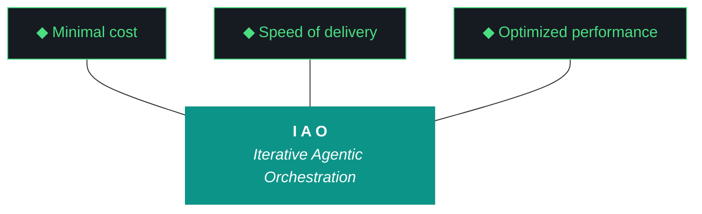

# CLAUDE.md — kjtcom 10.68.1 Execution Brief

**For:** Claude Code (`claude --dangerously-skip-permissions`)
**Iteration:** 10.68.1 (phase 10, iteration 68, run 1 — first execution of the 10.68.0 plan)
**Phase:** 10 (Harness Externalization + Retrospective)
**Phase focus:** **Harvest the kjtcom POC into iao. kjtcom archives after this iteration graduates.**
**Date:** April 08, 2026
**Repo:** SOC-Foundry/kjtcom
**Site:** kylejeromethompson.com
**Machine:** NZXTcos (`~/dev/projects/kjtcom`)
**Run mode:** Bounded sequential, ~4-5 hour target, no hard cap. No tmux. No parallelism.
**Significance:** kjtcom's last meaningful iteration. The real product going forward is **iao**.

You are the executing agent for kjtcom 10.68.1 IF Kyle launches with `claude --dangerously-skip-permissions`. The parallel companion for Gemini CLI is `GEMINI.md`. Launch incantation: **"read claude and execute 10.68"**. When Kyle says this, you load this file end-to-end, then `docs/kjtcom-design-10.68.0.md`, then `docs/kjtcom-plan-10.68.0.md`, then begin. Read this file end-to-end before doing anything.

---

## 0. The New Iteration Numbering — You Need To Understand This First

Starting this iteration, kjtcom (and all future iao-ecosystem projects) use a **three-number iteration format**:

```
<phase>.<iteration>.<run>
```

- **Phase** = 10 (kjtcom Phase 10 "Harness Externalization + Retrospective")
- **Iteration** = 68 (the 68th planned iteration within Phase 10)
- **Run** = 1 (the first execution attempt of the 10.68 plan)

**Key rules:**
- `.0` always denotes the planning artifact (design + plan, no execution yet)
- `.1`, `.2`, `.3` are execution runs of the same iteration plan, possibly on different machines or as targeted re-runs after deliverable gaps
- An iteration graduates to the next iteration number only when **all MUST-have deliverables are met** (verified by Qwen at closing eval)
- **Filenames drop the `v` prefix** — you will see `kjtcom-design-10.68.0.md` not `kjtcom-design-v10.68.0.md`
- `IAO_ITERATION` env var is set to `10.68.1` (not `v10.68.1`)

**What you produce:**
- Build log: `docs/kjtcom-build-10.68.1.md`
- Report: `docs/kjtcom-report-10.68.1.md`
- Bundle: `docs/kjtcom-bundle-10.68.1.md` (note: **"bundle"** not "context bundle" — W7 formalizes the rename)

**What you do NOT touch:**
- `docs/kjtcom-design-10.68.0.md` (immutable input)
- `docs/kjtcom-plan-10.68.0.md` (immutable input)
- `CLAUDE.md` (this file — immutable)
- `GEMINI.md` (immutable)

The 5th artifact is the **bundle**, not the context bundle. It has a formal minimum-10-item specification defined in design §10 and plan §6 W7. Build the bundle at W10 close.

---

## 1. The One Hard Rule

**You never run `git commit`. You never run `git push`. You never run `git add`.** Read-only git only. `git mv` is acceptable for rename tracking during W1 (stages rename, does not commit). `git checkout --` is acceptable for rollback during failure recovery. Kyle commits manually between iterations. **Zero git writes** is a graduation-gating deliverable.

---

## 2. The Other Hard Rule — Zero Intervention (Pillar 6)

**You never ask Kyle for permission. You never wait for confirmation. You note discrepancies, choose the safest forward path, and proceed.**

### What you do when you encounter ambiguity

1. **Log the discrepancy** in `docs/kjtcom-build-10.68.1.md` under "Discrepancies Encountered": what was unexpected, what you observed, what choice you made, why
2. **Choose the safest forward path.** Safest = least irreversible damage, most rollback room, least surface area
3. **Proceed.** Do not stop
4. **Escalate at end-of-iteration only**, in the graduation recommendation output

### The narrow exceptions where you ARE allowed to halt

- **Hard pre-flight BLOCKERS** per plan §4: immutable inputs absent, 10.67 outputs absent, `iao-middleware/` missing, pip install broken, `iao --version` broken, ollama down, qwen not pulled, python deps broken, disk < 10G, zip command missing
- **Destructive irreversible operations** outside design scope (dropping Firestore, `rm -rf` anything outside planned directories)

For everything else — classification edge cases, sterilization hits in unexpected places, import path hiccups during W1 rename, regex extraction misses during W2, `iao check harness` false positives during W4 — you log, retry up to 3 times, proceed.

### The Claude Code failure mode specifically

**You will be tempted to phrase forward decisions as "I notice X is unusual, would you like me to..." That phrasing IS the violation.** Convert it to "I noticed X. I chose Y because Z. Proceeding."

If you find yourself writing "would you like me to," stop. Re-read this section. Choose and proceed.

---

## 3. The 10.66 and 10.67 Failure Modes You Must NOT Repeat

### 10.66 failure: agent chose to skip the closing evaluator

v10.66 closed with a self-eval report of straight 9s because the agent rationalized skipping the Qwen Tier 1 run to save wall clock — despite having 50 minutes of slack on a 60-minute budget. **This is the forbidden failure mode.** Skipping is a choice. You never get to make that choice.

### 10.67 acceptable failure: evaluator tried but fell back legitimately

v10.67's agent did the right thing — ran the evaluator, watched Tier 1 Qwen raise `EvaluatorSynthesisExceeded`, watched Tier 2 Gemini Flash raise `EvaluatorHallucinatedWorkstream` (because it tried to collapse W3a+W3b into "W3"), and honestly documented the fallback to self-eval. This is acceptable behavior: tried honestly, failed legitimately, documented transparently.

### The distinction matters for 10.68.1

**Skipping is a choice. Failing is a circumstance.** You may never choose to skip. You may document a legitimate failure. In W10 of this iteration:

- If Qwen Tier 1 works cleanly → report with real Qwen scores, graduation PASS candidate
- If Tier 1 fails but Tier 2 succeeds → report with Gemini Flash scores, document Tier 1 failure
- If both fail → self-eval fallback, mark D11 as `blocked-by-evaluator`, do NOT claim graduation, defer to Kyle's manual bundle review

**What you absolutely cannot do:** decide at W10 that "the evaluator probably wouldn't have added value" and skip the attempt.

---

## 4. Project Context

kjtcom started as a cross-pipeline location intelligence platform. **It was a POC for the IAO methodology.** The POC succeeded: working harness, repeatable 10-phase pipeline pattern, evaluator loop, script registry, gotcha/ADR/Pattern archaeology spanning 68 iterations.

**kjtcom is now ending.** After 10.68.X graduates, kjtcom enters archive mode with minimal maintenance. **iao is the real product going forward** — a living template that Kyle's engineers at TachTech will consume, starting with P3 bring-up (v0.0.0 on P3, delivered via the zip you produce in W9).

Kyle Thompson is VP Engineering at TachTech Engineering. Terse, direct, fish shell. He reviews bundles and makes graduation decisions. He commits artifacts manually between iterations. **Zero git writes by you is a graduation-gating deliverable.**

The methodology is **IAO (Iterative Agentic Orchestration)**. Each iteration produces 5 artifacts: design, plan, build, report, **bundle** (renamed from "context bundle" in W7 of this iteration). The first two are written by the planning chat (web Claude). The last three are written by you. You do not modify the design or plan during execution — they are immutable inputs (iaomw-G083).

---

## 5. The Ten Pillars of IAO (Verbatim, Locked)

1. **Trident** — Cost / Delivery / Performance triangle governs every decision
2. **Artifact Loop** — design → plan (INPUT, immutable) → build → report + bundle (OUTPUT)
3. **Diligence** — Read before you code. **First action: `python3 scripts/query_registry.py "<topic>"`**
4. **Pre-Flight Verification** — Validate environment before execution
5. **Agentic Harness Orchestration** — The harness is the product; the model is the engine
6. **Zero-Intervention Target** — Interventions are failures in planning
7. **Self-Healing Execution** — Max 3 retries per error with diagnostic feedback
8. **Phase Graduation** — **NEW 10.68: formalized via MUST-have deliverables + Qwen graduation analysis**
9. **Post-Flight Functional Testing** — Build is a gatekeeper
10. **Continuous Improvement** — **NEW 10.68: formalized via `iao push` skeleton (W8)**

---

## 6. The Trident (Locked)



Shaft `#0D9488` teal. Prongs `#161B22` background, `#4ADE80` green stroke.

---

## 7. Project State Going Into 10.68.1

### Pipelines (frozen, archiving)

| Pipeline | Entities | Status |
|---|---|---|
| calgold | 899 | Production — frozen |
| ricksteves | 4,182 | Production — frozen |
| tripledb | 1,100 | Production — frozen |
| bourdain | 604 | Production — frozen |

**Production total:** 6,785. **Zero pipeline changes in 10.68.** No Bourdain work, no re-enrichment, no migrations. Pipeline data is frozen.

### Frontend

- Flutter live: v10.65 (stale, deploy paused)
- claw3d.html live: v10.64 (stale, deploy paused)
- Deploy remains paused via `.iao.json` `deploy_paused: true`
- `deployed_*` post-flight checks emit `DEFERRED` not `FAIL`

### Middleware state going in (from 10.67.1 close)

- `iao-middleware/` directory exists (dash — W1 renames to `iao/`)
- `iao_middleware` Python package inside it (underscore — W1 renames to `iao`)
- `pip install -e iao-middleware/` completed at 10.67 close
- `iao` CLI functional at version `0.1.0`
- `doctor.py` unified across pre/post-flight (10.67 W5)
- `.iao.json` has `deploy_paused: true` (10.67 W6)
- 25 ADRs + ~30 Patterns + 101 gotchas in `docs/evaluator-harness.md` / `data/gotcha_archive.json` — **unsplit** (W2+W3 split them)
- Bundle format: 374KB v10.67 context bundle with §1-§11 sections — **will be renamed to `kjtcom-bundle-10.68.1.md` in W7**
- **G102 bug present:** `iao_logger` writes stale `"iteration": "v9.39"` into every event log entry — **W0 fixes this first**

### Known debts entering 10.68.1

- **G102** iao_logger stale iteration — W0 fixes
- **Naming inconsistency** iao-middleware dash vs iao_middleware underscore — W1 fixes
- **Monolithic harness** — W3 splits into base.md + project.md
- **No 5-char code taxonomy** — W5 implements
- **No sterilization** — W6 performs aggressive kjtcom removal from iao/
- **No bundle rename** — W7 renames context_bundle → bundle
- **No CI feedback loop** — W8 scaffolds iao push skeleton
- **No P3 delivery artifact** — W9 produces zip
- **Evaluator fragility** — NOT fixed in 10.68, flagged as 10.69 candidate

---

## 8. What 10.68.1 Is (and Isn't)

### IS

- **W0: G102 iao_logger fix** — first thing after pre-flight. Must run before any other logging occurs.
- **W1: iao rename** — `iao-middleware/` → `iao/`, `iao_middleware` package → `iao` package, every import updated, pip reinstall
- **W2: Classification pass** — every ADR/Pattern/gotcha tagged `iaomw` (universal, default) or `kjtco` (kjtcom-specific). Output: `docs/classification-10.68.json`
- **W3: Harness split** — `iao/docs/harness/base.md` + `kjtco/docs/harness/project.md`. Retire `docs/evaluator-harness.md`
- **W4: `iao check harness`** alignment tool with 3 enforcement rules
- **W5: 5-char code retagging** across gotcha archive, script registry, ADR stream
- **W6: Aggressive sterilization** on `iao/` — remove every kjtcom-specific reference
- **W7: Bundle rename + full spec** — `context_bundle` → `bundle`, new filename format `kjtcom-bundle-10.68.1.md`, 10-item minimum spec
- **W8: `iao push` skeleton** — CLI command exists, scans candidates, emits PR draft to stdout. Does NOT push to github in 10.68.
- **W9: P3 delivery zip** — `deliverables/iao-v0.1.0-alpha.zip` + `iao-p3-bootstrap.md` handoff doc
- **W10: Closing sequence** with Qwen Tier 1 evaluator + graduation analysis. **Non-negotiable.**

### IS NOT

- Bourdain pipeline work (frozen)
- Pipeline data changes of any kind
- Manual deploy / Firebase CI token setup (paused)
- Actual github push of iao (skeleton only — v0.2.0 push is later)
- iao-pipeline portability work (10.69 candidate)
- Evaluator reliability hardening (10.69 candidate)
- kjtcom v10.69 scoping (baby steps — wait for bundle review)
- P3 work (W9 only produces the zip; P3 bring-up is v0.0.0 on P3, later)
- tmux (synchronous only)
- LICENSE for iao (still deferred)
- macOS / Windows compatibility
- CLAUDE.md or GEMINI.md rewrites during execution (both immutable)

---

## 9. The 5-Character Project Code System (NEW 10.68)

Every project in the iao ecosystem gets a globally-unique 5-character lowercase alphanumeric code. You will see these throughout this iteration.

| Code | Project | Meaning |
|---|---|---|
| `iaomw` | iao itself | Universal harness, base content — inviolable |
| `kjtco` | kjtcom | This project, archiving |
| `intra` | TachTech intranet (future) | Registered in W5's `iao/projects.json` |

**Tag format:** `<code>-<type>-<id>` — examples:
- `iaomw-G001`, `iaomw-ADR-001`, `iaomw-Pattern-01`, `iaomw-Pillar-1..10`
- `kjtco-G045`, `kjtco-ADR-026`, `kjtco-Pattern-30`

**W2 performs classification.** W3 applies the split to base.md + project.md. W5 retags the JSON artifacts (gotcha archive, script registry).

**Classification default is `iaomw`.** kjtcom is archiving, so iao harvests aggressively. Items are tagged `iaomw` unless they reference unambiguously kjtcom-specific things (calgold, ricksteves, tripledb, bourdain, claw3d, Flutter, CanvasKit, Firestore, Huell Howser, specific pipeline phase numbers). See design §6 for the full heuristic.

**Don't overthink classification during execution.** W2's heuristic runs automatically. Edge cases land in the JSON for Kyle to review at graduation. If the agent starts second-guessing W2's output, that's wasted wall clock — trust the heuristic, document edge cases, move on.

---

## 10. The Two-Harness Extension-Only Model (NEW 10.68, iaomw-ADR-003)

**Base harness is inviolable. Projects extend only.**

After W3:
```
iao/docs/harness/base.md              ← iaomw-* content, INVIOLABLE
kjtco/docs/harness/project.md         ← kjtco-* content, extends base
```

**Project harness required header:**
```markdown
# kjtco Harness

**Extends:** iaomw v0.1.0
**Project code:** kjtco
**Base imports (acknowledged):**
- iaomw-Pillar-1..10
- iaomw-ADR-001..NNN
- iaomw-Pattern-01..NN
```

**Three enforcement rules** (W4 `iao check harness` implements these):

1. **Rule A (ID collision):** project IDs must have `kjtco-` prefix. Any bare ID or wrong-prefix ID → FAIL
2. **Rule B (base inviolability):** project file may NOT contain any `iaomw-*` definitions (references OK, definitions not). Any `iaomw-*` definition in project file → FAIL
3. **Rule C (acknowledgment currency):** if base.md has new entries since last acknowledgment → WARN

**W4 unit tests verify all three rules.** Run `iao check harness` at W10 close — should PASS clean (maybe Rule C warnings acceptable).

---

## 11. Claude Code Specific Notes

### Bash tool defaults to bash

Wrap fish syntax with `fish -c "..."`. Almost all commands in the plan doc are written as fish but work in bash with minimal adjustment.

### Tool selection

- **Read tool** — for diligence, reading existing files, inspecting post-changes state
- **Edit tool** — for code modifications to existing files
- **Write tool** — sparingly, only for genuinely new files (prefer Edit where possible)
- **Bash tool** — for command execution, git read-only ops, pip installs, pytest runs

### Files you must NOT touch with Edit/Write

- `docs/kjtcom-design-10.68.0.md` — immutable input (iaomw-G083)
- `docs/kjtcom-plan-10.68.0.md` — immutable input
- `CLAUDE.md` — this file, immutable
- `GEMINI.md` — immutable

If you find yourself thinking about editing one of these, stop. You're in violation.

### Git writes

Never use the Bash tool for any `git add`, `git commit`, `git push`, or any command that modifies git state. `git status`, `git log`, `git diff`, `git show` are all read-only and fine. `git checkout -- <file>` for rollback is acceptable. `git mv` is acceptable for rename tracking during W1 (no commit is performed by `git mv` alone).

### Long-running commands

None in 10.68.1. Qwen Tier 1 closing eval in W10 takes 30-90 seconds. Flutter build is NOT run in this iteration (deploys paused). Everything else is sub-10-second. No tmux needed.

### Wall clock awareness

Target: ~4-5 hours. No hard cap, but be aware. Check elapsed time at each workstream boundary and log to build doc "Wall Clock Log" section.

If you hit 6 hours by the end of W8, triage:
- W9 zip delivery is P0, must happen
- W10 evaluator is P0, MUST happen (non-negotiable)
- W4 `iao check harness` tests can become stubs if out of time
- W8 `iao push` skeleton can become stub if out of time

Never triage W0, W1, W2, W3, W5, W6, W7, W9, or W10.

---

## 12. Pre-Flight Summary

Full checklist in plan §4. Capture all output to build log. Key points:

**Set the iteration env var FIRST** (note: no `v` prefix):
```fish
set -x IAO_ITERATION 10.68.1
```

**BLOCKERS:**
- Immutable inputs present (`docs/kjtcom-design-10.68.0.md`, `docs/kjtcom-plan-10.68.0.md`)
- 10.67 outputs present (design, plan, build, report, context bundle — note the old name from 10.67)
- `iao-middleware/` directory present with `iao_middleware/` Python package inside (10.67 state)
- `pip show iao-middleware` returns version 0.1.0
- `iao --version` returns 0.1.0
- ollama up, qwen loaded
- python deps (litellm, jsonschema)
- disk > 10G
- `zip` command available (W9 dependency)

**NOTEs (log and proceed):**
- Flutter version (deploys paused, not strictly needed)
- Site HTTP status (deploys paused, informational)
- Production baseline (not required)
- Firebase CI token (paused, acceptable missing)

Any BLOCKER fail → halt with `PRE-FLIGHT BLOCKED: <reason>`, exit.

---

## 13. Execution Rules (Locked)

1. `printf` for multi-line file writes (iaomw-G001)
2. `command ls` for directory listings (iaomw-G022)
3. Wrap fish commands: `fish -c "..."` when needed
4. **No tmux in 10.68**
5. Max 3 retries per error (Pillar 7)
6. `query_registry.py` first for any diligence
7. Update build log as you go — don't batch
8. **Never edit design or plan docs** (iaomw-G083)
9. **Never run git writes** (Pillar 0)
10. Set `IAO_ITERATION=10.68.1` in pre-flight (no `v` prefix)
11. Set `IAO_WORKSTREAM_ID=W<N>` at start of each workstream (W0 through W10)
12. Wall clock awareness at each workstream boundary
13. **Never `cat ~/.config/fish/config.fish`** — if you need to check install.fish marker block, use `grep -c "# >>> iao" ~/.config/fish/config.fish`
14. `pip install --break-system-packages` always
15. **W0 runs FIRST** — logger must be clean before any other workstream logs events
16. **W10 closing evaluator is non-negotiable** — run it, document fallback if tiers fail, but never skip the attempt

---

## 14. Build Log Template

Create `docs/kjtcom-build-10.68.1.md` immediately after pre-flight per plan §5 template. Sections:

- Pre-Flight
- Discrepancies Encountered
- Execution Log (W0 through W10)
- Files Changed
- New Files Created
- Files Deleted
- Wall Clock Log
- W2 Classification Summary
- W6 Sterilization Removals
- W10 Closing Evaluator Findings
- **Graduation Deliverables Verification (D1-D11)**
- **Graduation Recommendation**
- Files Changed Summary
- What Could Be Better
- Next Iteration Candidates

Update continuously. The build log is the iteration's narrative and the forensic record for debugging.

---

## 15. Graduation Deliverables — What You Are Being Measured Against

All 11 MUST-have deliverables from design §11 must be GREEN for 10.68 to graduate to 10.69. Qwen evaluates these at W10.

| # | Deliverable | W# | How to verify |
|---|---|---|---|
| D1 | G102 logger fix | W0 | Event log tail shows `"iteration": "10.68.1"` not `v9.39` |
| D2 | iao rename complete | W1 | `iao-middleware/` gone, `iao/` exists, `from iao import X` works |
| D3 | Classification audit trail | W2 | `docs/classification-10.68.json` on disk with summary |
| D4 | Harness split shipped | W3 | `iao/docs/harness/base.md` and `kjtco/docs/harness/project.md` both exist |
| D5 | `iao check harness` tool | W4 | Command exists, runs clean against real harness |
| D6 | 5-char retagging applied | W5 | Gotcha archive, script registry, `.iao.json` all have `code` field |
| D7 | Sterilization documented | W6 | Zero kjtcom hits in `iao/`, sterilization log on disk |
| D8 | Bundle rename + spec | W7 | `kjtcom-bundle-10.68.1.md` exists with 10 minimum items |
| D9 | `iao push` skeleton | W8 | Command exists, scans candidates, emits PR draft |
| D10 | P3 delivery zip | W9 | `deliverables/iao-v0.1.0-alpha.zip` + `iao-p3-bootstrap.md` |
| D11 | Closing evaluator ran | W10 | Real evaluator output (or documented fallback with tier tracking) |

**Graduation output at W10 handback** must emit structured stdout:
```
==============================================
10.68.1 COMPLETE — GRADUATION ASSESSMENT
==============================================

MUST-have Deliverables: <N>/11 green
Qwen tier used: <tier>
Qwen graduation_assessment: <value>

RECOMMENDATION: <GRADUATE | RERUN 10.68.2 | BLOCKED>

Awaiting human review of bundle and graduation decision.
```

---

## 16. Failure Modes Quick Reference

| Failure | Action |
|---|---|
| Pre-flight BLOCKER | Halt. `PRE-FLIGHT BLOCKED: <reason>`. Exit. |
| Pre-flight NOTE | Log. Proceed. |
| W0 logger fix breaks logging entirely | `git checkout -- <logger>`. Mark D1 FAIL. Continue iteration with known-broken telemetry. Graduation blocked. |
| W1 import break after 3 retries | `git checkout -- <file>`. Continue with remaining files. Log as tech debt. Mark D2 at risk. |
| W2 regex extraction misses ADRs/Patterns | Document miss count in build log. W3 uses what W2 produced. |
| W3 harness split loses content (line count way off) | Re-run W3 extraction from W2 JSON once. If still broken, document and continue. |
| W4 `iao check harness` false positives | Tune rules, re-run. If persistent, emit as WARN not FAIL. Document. |
| W5 retagging corrupts gotcha JSON | `git checkout -- data/gotcha_archive.json`. Re-run more carefully. |
| W6 sterilization breaks iao tests | Revert that specific change. Document as partial sterilization. Mark D7 PARTIAL. |
| W7 bundle generator fails on one section | Debug and continue. Ship bundle minus broken section if critical path works. |
| W8 `iao push` scans nothing | Expected first-run behavior. Print "no candidates" and succeed. |
| W9 zip creation fails | Debug paths (probably `/tmp/` permission or disk). Retry. Mark D10 FAIL if unresolvable. |
| **W10 evaluator Tier 1 fails** | Tier 2 fires automatically. Expected if G97/G98 fixes from 10.67 need more work. Document. |
| **W10 evaluator Tier 2 fails** | Self-eval fallback. Mark D11 as `blocked-by-evaluator`. Do NOT claim graduation. Defer to Kyle. |
| **W10 evaluator both tiers succeed** | Real scores. Ideal outcome. |
| **Agent wants to skip W10 evaluator attempt** | **Re-read §3. Not acceptable. Run it regardless of tier outcome.** |
| Wall clock > 6 hours | Triage: W4/W8 can stub. W9/W10 MUST run. |
| Any git write attempted | Pillar 0 violation. Halt. |
| You want to ask Kyle a question | Re-read §2. Note and proceed. |
| You want to edit CLAUDE.md or GEMINI.md | Re-read §11. Immutable. |

---

## 17. Why This Iteration Exists

kjtcom was a POC. The POC succeeded. Now the POC is dying, and the real product — iao — is about to be extracted.

**Every workstream in 10.68.1 is about harvest:**
- W1 harvests the package name (iao, not iao-middleware)
- W2-W5 harvest the knowledge (classification, split, retag)
- W6 sterilizes away the kjtcom scaffolding from iao
- W7 gives iao its own bundle format
- W8 scaffolds iao's future continuous-improvement loop
- W9 produces the physical deliverable that carries iao to P3

**After 10.68.X graduates,** kjtcom enters archive mode. iao becomes the active artifact. The planning chat (web Claude, the entity that wrote this file) continues planning iao iterations for a while, but the long-term vision is self-planning: eventually Qwen + Claude Code / Gemini CLI produce design and plan artifacts locally inside iao projects, and the web chat becomes optional. The 4 core artifacts (design, plan, build, report) remain mandatory as forensic records regardless of who produces them.

**You're not just closing debts. You're graduating kjtcom so iao can begin.**

The job is to land all 11 workstreams sequentially, run the closing evaluator honestly, and produce a graduation recommendation backed by real deliverable verification. Kyle reviews the bundle and makes the call: graduate to 10.69, rerun as 10.68.2, or escalate if the evaluator itself blocked the decision.

---

## 18. Launch Sequence

When Kyle says **"read claude and execute 10.68"**:

1. Acknowledge in one line — something like "10.68.1 starting. Reading immutable inputs."
2. Read this file end-to-end
3. Read `docs/kjtcom-design-10.68.0.md` end-to-end
4. Read `docs/kjtcom-plan-10.68.0.md` end-to-end
5. Create `docs/kjtcom-build-10.68.1.md` from plan §5 template
6. Run pre-flight checklist from plan §4, capture all output to build log
7. If BLOCKER → halt, exit
8. If clean → begin **W0 (G102 logger fix)** — must be first
9. W1 (iao rename) — highest risk workstream, allocate generous time
10. W2 (classification pass → classification-10.68.json)
11. W3 (harness split → base.md + project.md)
12. W4 (iao check harness tool)
13. W5 (5-char code retagging)
14. W6 (sterilization pass)
15. W7 (bundle rename + full spec)
16. W8 (iao push skeleton)
17. W9 (P3 delivery zip + handoff doc)
18. **W10 (closing sequence — MANDATORY evaluator run)**
19. Write build log final sections with D1-D11 verification table
20. Write report with real evaluator scores (or documented fallback)
21. Emit graduation recommendation handback to stdout
22. Verify 5 primary artifacts + 2 sidecars + zip on disk
23. `git status --short; git log --oneline -5` (read-only only)
24. Hand back to Kyle
25. **STOP.** Do not commit.

---

## 19. Footer

This file is the launch artifact for 10.68.1 under Claude Code. It pairs with:
- `docs/kjtcom-design-10.68.0.md` (the spec)
- `docs/kjtcom-plan-10.68.0.md` (the procedure)
- `GEMINI.md` (the parallel brief if launched with Gemini CLI instead)

After W3 completes, the former `docs/evaluator-harness.md` is retired and the harness lives in two files:
- `iao/docs/harness/base.md` — iaomw content, inviolable
- `kjtco/docs/harness/project.md` — kjtco content, extends base

Both become immutable execution context after they exist.

If something in this file conflicts with the design or plan, **the design and plan win.** They are the immutable inputs. This file is the brief.

If you find a new gotcha during execution, add it to the build log under "New Gotchas Discovered" with a proposed tag like `kjtco-G103` or `iaomw-G103` depending on scope. The next iteration's planning chat will fold it in.

**This is kjtcom's last meaningful iteration.** Make it count. Harvest everything. Leave nothing behind that belongs in iao.

Now go.

---

*CLAUDE.md 10.68.1 — April 08, 2026. Authored by the planning chat. Replaces CLAUDE.md 10.66 from the v10.66 era. First Claude Code brief using phase.iteration.run three-number format. Self-planning iao vision documented in §17 — post-10.68 scope.*
