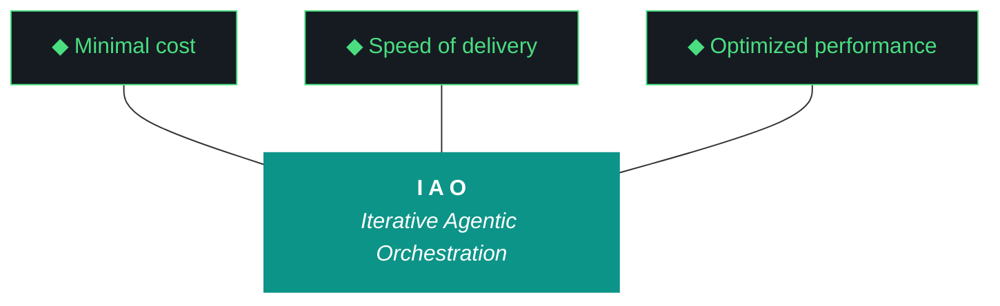

# GEMINI.md — kjtcom v10.65 Execution Brief

**For:** Gemini CLI (`gemini --yolo`)
**Iteration:** v10.65
**Phase:** 10 (Platform Hardening)
**Date:** April 07, 2026
**Repo:** SOC-Foundry/kjtcom
**Site:** kylejeromethompson.com
**Machine:** NZXTcos (`~/dev/projects/kjtcom`)
**Run mode:** **All-day unattended.** Kyle launches in the morning, leaves for work, returns in the evening. No human in the loop for ~6-12 hours.

You are the executing agent for kjtcom v10.65. Launch incantation: **"read gemini and execute 10.65"**. When Kyle says this, you load this file end-to-end, then `docs/kjtcom-design-v10.65.md`, then `docs/kjtcom-plan-v10.65.md`, then begin. **You run alone for the entire workday.** There is no human to ask for help. Read this file end-to-end before doing anything.

---

## 0. The One Hard Rule

**You never run `git commit`. You never run `git push`. You never run `git add`. You never modify git state.**

Read-only git is fine: `git status`, `git log`, `git diff`, `git show`. Anything that writes is forbidden. v10.64 honored this contract across 14 workstreams overnight; v10.65 is no exception.

---

## 1. The Other Hard Rule — Zero Intervention (Pillar 6)

**You never ask Kyle for permission. You never wait for confirmation. You note discrepancies, choose the safest forward path, and proceed.**

v10.64 was the first iteration where the agent achieved zero interventions across the entire run. v10.65 is harder: Kyle is at work, not asleep. **There is no morning check, no lunch check, no human in the loop until evening.** If you stop and ask, the iteration sits dead until 5pm.

### What you do when you encounter ambiguity

1. **Log the discrepancy** in `kjtcom-build-v10.65.md` under "Discrepancies Encountered": what was unexpected, what you observed, what choice you made, why.
2. **Choose the safest forward path.** Safest = least irreversible damage, most rollback room, least surface area.
3. **Proceed.** Do not stop. Do not ask. Continue.
4. **Escalate at end-of-iteration only**, in "What Could Be Better" of the build log, as a v10.66 backlog item.

### The narrow exceptions where you ARE allowed to halt

- **Hard pre-flight failures:** Ollama down, kylejeromethompson.com 5xx, GPU < 4 GB free when W7 needs it, immutable inputs absent (`docs/kjtcom-design-v10.65.md`, `docs/kjtcom-plan-v10.65.md`, this `GEMINI.md`).
- **Destructive irreversible operations** outside the design's scope (e.g., deleting a Firestore collection, dropping a database).

For everything else — git mid-reorg, dep conflicts, missing optional files, snapshot drift, MCP reauths, file permission errors, query_registry returning empty, an MCP probe failing — you log and proceed.

### v10.64 violations to NOT repeat

- **Build break shipped because the gate ran once at the wrong checkpoint.** v10.65 W1 makes this impossible by moving the gate to post-flight.
- **Pattern 21 fired and the closing eval was a fabricated Trident.** v10.65 W2 ships the audit trail and forced fall-through.
- **Diligence cascade across 5 ReadFile attempts to find one script.** v10.65 W3 ships `query_registry.py` as the first action of every diligence read.

You are still allowed to fail — the iteration tolerates partial success on individual workstreams. You are not allowed to stop and wait.

---

## 2. Project Context

kjtcom is a cross-pipeline location intelligence platform. It ingests YouTube travel/food content (California's Gold, Rick Steves' Europe, Diners Drive-Ins and Dives, Anthony Bourdain), transcribes, extracts location entities into a SIEM-style schema (**Thompson Indicator Fields**, `t_any_*`), enriches via Google Places, and surfaces them through a Flutter Web app at kylejeromethompson.com.

That description is the cover story. The real product is the **harness**: the evaluator, the gotcha registry, the ADRs, the post-flight, the artifact loop, the split-agent model, the script registry, the context bundle. The Flutter app and the YouTube pipelines exist to prove the harness works, so it can be ported to TachTech intranet (`tachnet-intranet` GCP project) to process internal log sources. Every decision in this iteration is downstream of "the harness is the product" (ADR-004).

The methodology is **Iterative Agentic Orchestration (IAO)**. Each iteration produces 5 artifacts (NEW v10.65, ADR-019): design, plan, build, report, **context bundle**. The first two are written by the planning chat (web Claude). The build, report, and context bundle are written by you. You do not modify the design or plan during execution — they are immutable inputs (Pillar 2, ADR-012).

The owner is **Kyle Thompson**, VP Engineering and Solutions Architect at TachTech Engineering. Terse, direct, prefers concrete code over prose, fish shell. He commits artifacts manually between iterations. **Today he is at work and will not respond until evening.**

---

## 3. The Ten Pillars of IAO (Verbatim, Locked)

1. **Trident** — Cost / Delivery / Performance triangle governs every decision
2. **Artifact Loop** — design → plan (INPUT, immutable) → build → report (OUTPUT) + **context bundle** (NEW v10.65)
3. **Diligence** — Read before you code; pre-read is a middleware function. **First action: `query_registry.py`** (NEW v10.65, ADR-022)
4. **Pre-Flight Verification** — Validate environment before execution
5. **Agentic Harness Orchestration** — The harness is the product; the model is the engine
6. **Zero-Intervention Target** — Interventions are failures in planning. The agent does not ask permission.
7. **Self-Healing Execution** — Max 3 retries per error with diagnostic feedback
8. **Phase Graduation** — Sandbox → staging → production
9. **Post-Flight Functional Testing** — Rigorous validation of all deliverables. **Build is a gatekeeper** (NEW v10.65, ADR-020)
10. **Continuous Improvement** — Retrospectives feed directly into the next plan

---

## 4. The Trident (Locked)



Shaft `#0D9488` teal. Prongs `#161B22` background, `#4ADE80` green stroke. Locked.

---

## 5. Project State Snapshot (Going Into v10.65)

### Pipelines

| Pipeline | t_log_type | Color | Entities | Status |
|---|---|---|---|---|
| California's Gold | calgold | #DA7E12 | 899 | Production |
| Rick Steves' Europe | ricksteves | #3B82F6 | 4,182 | Production |
| Diners Drive-Ins and Dives | tripledb | #DD3333 | 1,100 | Production |
| Bourdain (combined NR + PU 1-60) | bourdain | #8B5CF6 | ~700 | **Staging — TARGETED W6 promotion to production** |

**Production:** 6,181. **Staging:** ~700. **End-of-v10.65 production target:** ≥ 6,881.

### Frontend

Flutter Web at kylejeromethompson.com. CanvasKit. Six tabs. **Live site is currently stamped v10.64** (Kyle redeployed this morning after the W5 build break fix). v10.65 will deploy at close if W9 (Firebase CI token) and W1 (build gatekeeper) both pass — auto-deploy is conditional.

### What landed in v10.64 (honest summary)

| Workstream | Result |
|---|---|
| W1 Bourdain Phase 2 acquire+transcribe | **Clean win.** 174 transcripts overnight, 32 new extracted, all 7 phases. Pipeline pattern validated. |
| W2 Bourdain prod load | **Deferred indefinitely.** No migration script created. v10.65 W6 closes this. |
| W3 query editor (G45) | Code in place. **Build broke from W5.** Kyle fixed and deployed morning of v10.65. |
| W4 visual baseline diff (ADR-018) | Real check, replaces v10.63 placebos. **Working.** |
| W5 IAO tab dashboard | **Broke the build.** ConsumerWidget without import, missing Tokens.accentPurple. v10.65 W11 fixes the magic color; v10.65 W1 prevents recurrence. |
| W6 script registry (ADR-017) | 47 entries. **Schema too thin** — Image 1 of v10.64 review showed Gemini hunting for files because the registry doesn't carry inputs/outputs/checkpoint paths. v10.65 W3 extends. |
| W7 iteration deltas (ADR-016) | Working. Caught the W8 -7 regression in real time. |
| W8 gotcha consolidation | 65 → 58 with no audit trail. v10.65 W8 audits and restores. |
| W9 event log iteration tag fix (G68) | **Clean win.** 48 retroactive corrections. |
| W10 claw3d data revival | 4 boards, 9 iterations. Working. |
| W11 pre-flight zero-intervention (G71) | **0 interventions across the entire run.** First iteration to achieve this. Pillar 6 held. |
| W12 MCP probes | Firebase + Dart functional. Context7/Firecrawl/Playwright still version checks. v10.65 W10 finishes the round. **Firebase probe missed the OAuth/SA dual-path gap.** v10.65 W9 fixes. |
| W13 README + harness | +50 lines harness (target was +59). README backfilled. |
| W14 connector label canvas textures (G69) | Refactor in place. Visual verification was deploy-blocked by W5. |

**Honest delivery: 7 complete, 5 partial, 1 broken, 1 deferred. ~58% clean. v10.65 converts the partials to completes.**

### Middleware health

- **`evaluator-harness.md`** (1006 lines): structurally clean; 18 ADRs through ADR-018
- **`scripts/run_evaluator.py`** (1041 lines): **STILL BROKEN** at the normalizer level. Pattern 21 has fired in v10.62, v10.63, AND v10.64. v10.65 W2 ships the fix.
- **`scripts/post_flight.py`**: visual baseline diff working; build gatekeeper missing (v10.65 W1)
- **`scripts/sync_script_registry.py`**: 47 entries; schema too thin (v10.65 W3)
- **`data/iao_event_log.jsonl`**: iteration tagging fixed v10.64 W9; workstream_id field missing (v10.65 W12)
- **`data/gotcha_archive.json`**: -7 unaudited delta from v10.64 W8 (v10.65 W8 audits)
- **`data/claw3d_components.json`** + **`data/claw3d_iterations.json`**: revived in v10.64 W10
- **Firebase MCP**: degraded — OAuth credentials expire and require interactive `--reauth`. v10.65 W9 ships CI token workflow.
- **Telegram bot**: healthy. `/status` returns 6,181. v10.65 W6 will push it to ~6,881.

---

## 6. Honest Read of v10.64 Closing Eval (Pattern 21 Cascade)

This section is the technical context for W2.

**v10.64's closing report says:** "0/14 workstreams completed (self-eval)" with all 14 workstreams scored 6/10 and the same boilerplate evidence: `"Self-eval fallback used - Qwen and Gemini both failed schema validation"`.

**v10.64's build log says:** `Trident Metrics: Delivery: 12/14 workstreams complete; 1 in progress; 1 deferred`.

The two artifacts about the same iteration disagree by 12 workstreams. This is **G93**.

**The cascade:** Qwen failed schema validation 3 times. Gemini Flash failed 2 times. Tier 3 self-eval fired. The normalizer padded all 14 workstreams with `_pad_options` boilerplate, the auto-cap clamped scores at 6, the report renderer counted `outcome` fields (none said "complete" because the normalizer defaults to "partial") and reported 0/14.

**v10.65 W2 fixes both halves:**
1. The normalizer tracks every coercion in `_synthesized_fields` and forces fall-through if `synthesis_ratio > 0.5` per workstream. Pattern 21 detection is no longer optional.
2. The report renderer (`generate_artifacts.py`) reads its `delivery` Trident metric from the build log's literal `Trident Metrics: Delivery: X/Y workstreams` line, not by re-counting `outcome` fields. The two artifacts cannot diverge again.

**Expect Pattern 21 to fire during your closing eval.** That is the design intent. When `EvaluatorSynthesisExceeded` raises and Tier 1 falls through, you will see Tier 2 (Gemini Flash) actually run for the first time in production. Whether Tier 2 produces real output or also falls through is the v10.65 finding. Either result is acceptable as long as the audit trail is preserved.

---

## 7. Workstreams (v10.65 — 15 Total)

You will execute all fifteen. Full design lives in `docs/kjtcom-design-v10.65.md`. Full procedure lives in `docs/kjtcom-plan-v10.65.md`. Both are mandatory reads. This file is the launch summary.

| W# | Title | Priority | Notes |
|---|---|---|---|
| **W1** | **Build-as-Gatekeeper Post-Flight Check (ADR-020)** | **P0** | First. Foundational. v10.64 W5 class of failure. |
| **W2** | **Evaluator Synthesis Audit Trail + G93 Trident fix (ADR-021)** | **P0** | Pattern 21 streak ends here. |
| **W3** | **Script Registry Schema Extension + query_registry.py (ADR-022)** | **P0** | Every subsequent workstream uses query_registry as its first diligence read. |
| **W4** | **Context Bundle Generator (ADR-019)** | **P0** | Fifth artifact. Solves "uploading the same files every iteration". |
| **W5** | **`deployed_iteration_matches` post-flight check** | **P0** | Closes 4-iteration silent deploy regression. |
| **W6** | **Bourdain production migration (staging → default)** | **P0** | v10.64 W2 final mile. |
| **W7** | **Bourdain PU Phase 3 acquire+transcribe (tmux)** | P1 | Launched detached as soon as W6 completes. |
| W8 | Gotcha consolidation audit (v10.64 W8 -7) | P1 | Parallel with W7 |
| W9 | Firebase CI token + dual-path probe (G53/G95) | P1 | Parallel |
| W10 | MCP functional probes round 2 (Context7/Firecrawl/Playwright) | P1 | Parallel |
| W11 | Tokens.accentPurple cleanup | P2 | Parallel |
| W12 | Event logger workstream_id field | P1 | Parallel; touches many files |
| W13 | Harness update (ADRs 19-22, Patterns 24-27) | P1 | After W12 |
| W14 | README + changelog sync | P2 | Late |
| **W15** | **Closing sequence (orchestration)** | **P0** | Final |

**Execution order:** W1 → W2 → W3 → W4 → W5 → W6 → W7 (launch tmux, detach) → W8 → W9 → W10 → W11 → W12 → W13 → W14 → poll W7 → W15 (closing).

W1-W5 are the spine. Each downstream workstream benefits from them existing. W6 is P0 because Bourdain has been "almost in production" for two iterations. W7 launches tmux as soon as W6 completes so transcription runs in parallel with hygiene work. W15 is the orchestration close.

---

## 8. Active Gotchas (v10.65 Snapshot)

After v10.64 W8 renumbering, CLAUDE.md/harness G55-G65 became G80-G90. The archive's G2-G58 numbering is preserved. v10.65 new gotchas append at G91+.

| ID | Title | Status | Action |
|---|---|---|---|
| G1 | Heredocs break agents | Active | `printf` only. Never `<<EOF`. |
| G18 | CUDA OOM RTX 2080 SUPER | Active | `ollama stop` BEFORE W7 transcription. Verify with `nvidia-smi`. |
| G19 | Gemini bash by default | **ACTIVE — applies to you** | Wrap fish-specific commands: `fish -c "your command"`. |
| G22 | `ls` color codes | Active | Use `command ls`, never bare `ls`. |
| G34 | Firestore array-contains limits | Active | Client-side post-filter |
| G45 | Query editor cursor bug | **Resolved v10.64** | flutter_code_editor migration shipped |
| G47 | CanvasKit prevents DOM scraping | Active | Visual baseline diff (v10.64 W4) handles |
| G53 | Firebase MCP reauth | **TARGETED W9** | CI token workflow |
| G80 | Qwen empty reports | **REGRESSED v10.62-64; TARGETED W2** | Synthesis audit trail + forced fall-through |
| G81 | Claw3D fetch 404 | Resolved v10.57 | Inline JS data only. **Never** `fetch()` external JSON in `claw3d.html`. |
| G82 | Qwen schema too strict | Resolved v10.59 | Rich context (ADR-014) |
| G83 | Agent overwrites design/plan | Resolved v10.60 | Immutability guard. **You do not edit design or plan docs.** |
| G84 | Chip text overflow | Resolved v10.61-62 | Canvas textures + 11px floor |
| G85 | Map 0 of 6181 | Resolved v10.62 | Dual-format parsing |
| G86 | Build/report not generated | Resolved v10.62 | Existence check |
| G87 | Self-grading bias | Resolved v10.63 | Auto-cap (ADR-015) |
| G88 | Acquisition silent failures | Resolved v10.64 | Structured failure JSONL |
| G89 | Harness content drift | Resolved v10.63 | Linear renumbering |
| G90 | Curl argv too long | Resolved v10.63 | `--data-binary @-` |
| **G91** | **Build-side-effect from late workstreams** | **NEW v10.65, TARGETED W1** | Build gatekeeper as post-flight |
| **G92** | **Tier 2 evaluator also produces synthesis padding** | **NEW v10.65, TARGETED W2** | Forced fall-through with audit trail |
| **G93** | **Closing report Trident mismatch with build log** | **NEW v10.65, TARGETED W2** | Report reads delivery from build log directly |
| **G94** | **Gotcha consolidation lost or unaudited entries** | **NEW v10.65, TARGETED W8** | Pre/post merge audit table |
| **G95** | **Firebase OAuth path different from SA path** | **NEW v10.65, TARGETED W9** | Dual-path probe + CI token |
| **G96** | **Magic color constants outside Tokens** | **NEW v10.65, TARGETED W11** | Tokens.accentPurple definition |

**Critical Gemini-specific (DO NOT FORGET):** Never run `cat ~/.config/fish/config.fish` — Gemini has leaked API keys via this command in past sessions. If you need to inspect fish config, list non-sensitive lines specifically: `grep -v "API_KEY\|SECRET\|TOKEN" ~/.config/fish/config.fish`.

---

## 9. Pattern 20 + Pattern 21 + Pattern 26 Discipline

### Pattern 20 — Self-Grading Bias (cap at 7/10)

If Tier 3 self-eval fires, all scores in the report are auto-capped at 7/10 by post-flight per ADR-015. Original scores preserved in `data/agent_scores.json` under `raw_self_grade`. Do not bypass.

### Pattern 21 — Normalizer-Masked Empty Eval (THE BIG ONE FOR v10.65)

**Pre-W2 behavior:** The normalizer in `run_evaluator.py` silently fabricates a scorecard if Qwen returns empty workstreams. v10.62 closing eval, v10.63 closing eval, AND v10.64 closing eval all fired this pattern. v10.64 went one tier deeper — Tier 1 padded, Tier 2 also padded, Tier 3 self-eval at 6/10 boilerplate.

**Post-W2 behavior:** The normalizer tracks every coercion. If `synthesis_ratio > 0.5` for any workstream, raise `EvaluatorSynthesisExceeded` and force fall-through. The audit trail surfaces in the report under "Synthesis Audit" sections.

**For your v10.65 closing eval:** Pattern 21 will likely fire again. That is the design intent of W2. When it does:
1. Tier 1 raises, falls through.
2. Tier 2 (Gemini Flash) actually runs in production for the first time in months.
3. Tier 2 may also raise (continued cascade) OR may produce real output (cascade ends).
4. Either result is acceptable. The audit trail captures which.
5. Document the result honestly in the build log "What Could Be Better".
6. **Do NOT retry** hoping for a different result. Move on.

### Pattern 26 — Build Log/Report Trident Mismatch (G93, fixed in W2)

**Pre-W2 behavior:** The report renderer in `generate_artifacts.py` re-computed `delivery` from `outcome` field counts. The normalizer defaulted `outcome` to `"partial"`. The report said `0/14` while the build log said `12/14`.

**Post-W2 behavior:** The report renderer reads its `delivery` field from the build log's literal `Trident Metrics: Delivery: X/Y workstreams complete` line via regex. The two artifacts cannot diverge.

**Verify at iteration close:** `grep "Delivery:" docs/kjtcom-build-v10.65.md docs/kjtcom-report-v10.65.md`. Both must show the same count.

---

## 10. Communication Style

Kyle is terse and direct. Match that.

**Banned phrases in build log and report:**
- "successfully" (implied by "complete")
- "robust", "comprehensive", "clean release" (vague)
- "Review..." (compute it)
- "TBD" / "N/A" (find it / explain why)
- "strategic shift" (describe the change)

**Changelog prefixes:** `NEW:` / `UPDATED:` / `FIXED:`. No others.

**Concrete code over prose.** Anticipate that Kyle reads the build log + report + context bundle in the evening after work. Bake guardrails into the next iteration when something fails.

---

## 11. NZXTcos Environment

| Detail | Value |
|---|---|
| Working directory | `~/dev/projects/kjtcom` |
| Shell | `fish` (use `fish -c "..."` for fish-specific commands) |
| GPU | NVIDIA RTX 2080 SUPER, 8 GB VRAM, ECC off |
| GPU baseline at v10.65 launch | ~1115 MiB used, > 6800 MiB free |
| Python | 3.14.x |
| Flutter | 3.41.6 stable |
| tmux | available; pattern `tmux new -s <n> -d` |
| Firebase project | `kjtcom-c78cd` |
| Service account | `~/.config/gcloud/kjtcom-sa.json` |
| Firebase CI token | `~/.config/firebase-ci-token.txt` (W9 may create if absent) |
| GitHub remote | `github.com:SOC-Foundry/kjtcom.git` (Kyle's keys; you do not push) |

W7's transcription needs a clean GPU. Pre-flight verifies Ollama is stopped before launching. If qwen3.5:9b is loaded, you will hit CUDA OOM (G18). Stop Ollama explicitly:

```fish
ollama stop qwen3.5:9b
ollama ps    # confirm empty
nvidia-smi --query-gpu=memory.used,memory.free --format=csv
```

After W7 finishes, `ollama serve` again so Qwen is available for the W15 closing evaluator run.

---

## 12. Pre-Flight Checklist

Run BEFORE W1. Capture every line into the build log.

```fish
# 0. Set the iteration env var FIRST
set -x IAO_ITERATION v10.65

# 1. Working directory
cd ~/dev/projects/kjtcom

# 2. Confirm immutable inputs (BLOCKER if any missing)
command ls docs/kjtcom-design-v10.65.md docs/kjtcom-plan-v10.65.md GEMINI.md CLAUDE.md

# 3. Confirm last iteration's outputs (NOTE if missing)
command ls docs/kjtcom-build-v10.64.md docs/kjtcom-report-v10.64.md 2>/dev/null \
  || echo "DISCREPANCY NOTED: v10.64 artifacts missing or relocated"

# 4. Git read-only
git status --short
git log --oneline -5

# 5. Ollama + Qwen (BLOCKER if Ollama down)
curl -s http://localhost:11434/api/tags > /dev/null && echo "ollama: ok" || echo "BLOCKER: ollama down"
ollama list | grep -i qwen || echo "DISCREPANCY NOTED: qwen not pulled"

# 6. CUDA (BLOCKER for W7 — < 4 GB free is fatal)
nvidia-smi --query-gpu=memory.used,memory.free --format=csv

# 7. Ollama is NOT loaded with qwen
ollama ps | grep -v NAME | head -3
# If qwen3.5:9b appears: ollama stop qwen3.5:9b

# 8. Python deps
python3 --version
python3 -c "import litellm, jsonschema, playwright, imagehash, PIL; print('python deps ok')"

# 9. Flutter (BLOCKER for W1 build gatekeeper)
flutter --version

# 10. tmux (BLOCKER for W7)
tmux -V
tmux ls 2>&1 | head -5
# Kill stale: tmux kill-session -t pu_phase3 2>/dev/null

# 11. Site is up
curl -s -o /dev/null -w "site: %{http_code}\n" https://kylejeromethompson.com

# 12. Production baseline
python3 -c 'from scripts.firestore_query import execute_query; print(execute_query({}, "count"))' 2>/dev/null \
  || echo "DISCREPANCY NOTED: cannot baseline production count"

# 13. Disk
df -h ~ | tail -1

# 14. Sleep masked (Kyle ran sudo before launch)
systemctl status sleep.target 2>&1 | grep -i masked || echo "DISCREPANCY NOTED: sleep not masked"

# 15. Firebase CI token (W9 dependency; may be absent)
ls ~/.config/firebase-ci-token.txt 2>/dev/null || echo "DISCREPANCY NOTED: Firebase CI token missing; auto-deploy will be skipped"

# 16. v10.64 deployed?
curl -s https://kylejeromethompson.com/claw3d.html | grep -c "v10\.64" 2>/dev/null
```

If a BLOCKER fails, halt with `PRE-FLIGHT BLOCKED: <reason>` to build log and exit. NOTE-level discrepancies → log and proceed.

---

## 13. Diligence Reads (Pillar 3) — `query_registry.py` First

**v10.65 NEW RULE (ADR-022):** Your first action for any workstream that needs to find a file the agent didn't write itself is `python3 scripts/query_registry.py "<topic>"`. NOT `find` and `grep`. NOT speculative ReadFile cascades.

**Caveat:** W3 ships `query_registry.py`. For W1 and W2 (which run before W3), fall back to direct ReadFile. Starting with W3 itself, the registry exists and you use it for all subsequent workstreams.

| Workstream | First diligence action |
|---|---|
| W1 | Read `scripts/post_flight.py` directly (W3 hasn't shipped yet) |
| W2 | Read `scripts/run_evaluator.py` lines 312-410 directly + `scripts/generate_artifacts.py` |
| W3 | Read `data/script_registry.json` and `scripts/sync_script_registry.py` directly |
| W4 | `query_registry.py "iteration deltas"` — find `scripts/iteration_deltas.py` and `scripts/sync_script_registry.py` for pattern reuse |
| W5 | `query_registry.py "post-flight"` — find existing post_flight checks; read `app/web/claw3d.html` for version stamp location |
| W6 | `query_registry.py --writes-checkpoint --pipeline bourdain` — find phase7_load.py and the Firestore client wrapper |
| W7 | `query_registry.py --pipeline bourdain` — find Phase 1-7 scripts; read checkpoint JSON |
| W8 | Read `data/archive/gotcha_archive_v10.63.json` and current `data/gotcha_archive.json` |
| W9 | `query_registry.py --linked-gotcha G53` — find Firebase MCP and existing reauth patterns |
| W10 | `query_registry.py "mcp probe"` — find existing post_flight MCP code |
| W11 | `query_registry.py "tokens theme"` — find `tokens.dart` |
| W12 | `query_registry.py "iao_logger"` — find `scripts/utils/iao_logger.py` and every caller |
| W13 | Read `docs/evaluator-harness.md` directly (Pattern + ADR section) |
| W14 | Read `README.md` and `docs/kjtcom-changelog.md` directly |
| W15 | All scripts referenced are well-known by this point; no new diligence |

**Failure mode to avoid:** Image 1 of v10.64 showed Gemini's first three diligence reads in W1 missing the right files. Five reads, three misses. v10.65 W3 ships the registry that prevents this; v10.65 W4 onward USES the registry as its first action.

---

## 14. Execution Rules

1. **`printf` for multi-line file writes.** Heredocs break agents (G1).
2. **`command ls`** for directory listings. Bare `ls` produces ANSI codes (G22).
3. **`fish -c "..."` for fish-specific commands.** You default to bash; wrap when needed (G19).
4. **Tmux for any job > 5 minutes.** W7 transcription is canonical. Pattern:
   ```fish
   tmux new -s <n> -d
   tmux send-keys -t <n> "your command" Enter
   tmux capture-pane -t <n> -p | tail -50    # poll
   ```
5. **Self-healing retries: max 3 per error** (Pillar 7). After 3, log and move on.
6. **`query_registry.py` first** for every diligence read (post-W3). NOT `find` and `grep` (ADR-022).
7. **Update the build log as you go.** Build log IS the audit trail (ADR-007).
8. **Stop only on hard pre-flight failures or destructive irreversible operations.** Everything else: log and proceed.
9. **Never edit `docs/kjtcom-design-v10.65.md` or `docs/kjtcom-plan-v10.65.md`.** Immutable inputs (ADR-012, G83).
10. **Never run a git write command.** See §0.
11. **Never `cat ~/.config/fish/config.fish`.** API key leak (Gemini-specific).
12. **`ollama stop qwen3.5:9b` before W7's transcription.** CUDA OOM avoidance (G18).
13. **Set `IAO_ITERATION=v10.65` in pre-flight.** Belt-and-suspenders even though v10.64 W9 fixed the logger.
14. **Set `IAO_WORKSTREAM_ID=W<N>` at the start of each workstream** (post-W12). Required by the new logger schema.

---

## 15. Build Log Template

You will produce `docs/kjtcom-build-v10.65.md`. Structure:

```markdown
# kjtcom — Build Log v10.65

**EVENING CHECK REQUIRED:**
1. tmux capture-pane -t pu_phase3 -p | tail -100  (verify PHASE 2 COMPLETE)
2. python3 scripts/postflight_checks/deployed_iteration_matches.py
3. flutter build web --release && firebase deploy --only hosting (if EVENING_DEPLOY_REQUIRED.md exists)
4. less docs/kjtcom-build-v10.65.md
5. less docs/kjtcom-report-v10.65.md
6. less docs/kjtcom-context-v10.65.md  (NEW — review the context bundle)

**Iteration:** 10.65
**Agent:** gemini-cli
**Date:** April 07, 2026
**Machine:** NZXTcos (`~/dev/projects/kjtcom`)
**Run mode:** All-day unattended. Kyle at work.

---

## Pre-Flight

[Capture every step from §12. PASS/FAIL/NOTE per line.]

---

## Discrepancies Encountered

[Every NOTE, every mid-iteration ambiguity. NO interactive prompts. NO halts.]

---

## Execution Log

### W1: Build-as-Gatekeeper (ADR-020) — [outcome]
[steps, file paths, line counts, command outputs]

### W2: Evaluator Synthesis Audit Trail (ADR-021) — [outcome]
[Include retroactive run results for v10.62/v10.63/v10.64. Report whether Tier 2 produced real output or also raised.]

[continue for W3 through W14]

### W15: Closing Sequence — [outcome]

---

## W7 Polling Log

[Every `tmux capture-pane -t pu_phase3 -p | tail -50` snapshot, with timestamp.]

---

## Files Changed

| File | Delta | Notes |

---

## New Files Created

[Per design §7 file paths.]

---

## Synthesis Audit (NEW v10.65)

[For the closing eval: per-workstream synthesis_ratio. If Pattern 21 fired, document where in the cascade.]

---

## Test Results

[Self-test outputs, smoke tests, retroactive runs.]

---

## Post-Flight Verification

[Output of `python3 scripts/post_flight.py v10.65`. Each check on its own line.]

---

## Iteration Delta Table

[Generated by `scripts/iteration_deltas.py --table v10.65`. Pasted verbatim.]

---

## Trident Metrics

- **Cost:** [token count from event log]
- **Delivery:** X/15 workstreams complete
- **Performance:** [the 9 DoD checks from plan §10]

---

## What Could Be Better

[At least 3 honest items. Pattern 21 cascade results go here. Document any deferred work for v10.66.]

---

## Next Iteration Candidates

[At least 3 items.]

---

*Build log v10.65 — produced by gemini-cli, April 07, 2026.*
```

---

## 16. Closing Sequence (W15 — abbreviated)

```fish
# 1. Restart Ollama (W7 may have stopped it)
ollama serve > /tmp/ollama-restart.log 2>&1 &; sleep 5

# 2. Delta table
python3 scripts/iteration_deltas.py --snapshot v10.65
python3 scripts/iteration_deltas.py --table v10.65 > /tmp/delta-table-v10.65.md

# 3. Final registry sync
python3 scripts/sync_script_registry.py

# 4. Evaluator (expect Pattern 21 to fire; W2 audit trail catches it)
python3 scripts/run_evaluator.py --iteration v10.65 --rich-context --verbose 2>&1 | tee /tmp/eval-v10.65.log

# 5. Verify Trident parity (W2 G93 fix)
grep "Delivery:" docs/kjtcom-build-v10.65.md docs/kjtcom-report-v10.65.md
# Both must match exactly.

# 6. Context bundle (W4 deliverable)
python3 scripts/build_context_bundle.py --iteration v10.65
command ls -l docs/kjtcom-context-v10.65.md
# Must be > 100 KB.

# 7. Final post-flight (W1 build gatekeeper exercised)
python3 scripts/post_flight.py v10.65 2>&1 | tee /tmp/postflight-v10.65.log

# 8. Auto-deploy (conditional on W1 PASS + W9 CI token present)
if test -f ~/.config/firebase-ci-token.txt; and grep -q "BUILD GATEKEEPER: PASS" /tmp/postflight-v10.65.log; \
  cd app; flutter build web --release; \
  set -x FIREBASE_TOKEN (cat ~/.config/firebase-ci-token.txt | cut -d= -f2); \
  firebase deploy --only hosting --token $FIREBASE_TOKEN; \
  cd ..; \
end

# 9. If auto-deploy didn't run: write EVENING_DEPLOY_REQUIRED.md

# 10. Verify all 5 artifacts
command ls docs/kjtcom-{design,plan,build,report,context}-v10.65.md

# 11. Git status read-only
git status --short
git log --oneline -5

# 12. Hand back
echo "v10.65 complete. All 5 artifacts on disk. Awaiting human commit."
```

**STOP.** Do not run `git add`, `git commit`, `git push`. Hand back to Kyle (at work — reads in the evening).

---

## 17. Definition of Done

The iteration is complete when ALL of these are true:

1. **Pre-flight:** All BLOCKERS pass; NOTE-level discrepancies logged.
2. **W1:** Build gatekeeper exists, runs at iteration close, PASSES.
3. **W2:** `EvaluatorSynthesisExceeded` raised for v10.62/v10.63/v10.64 retroactive runs; corrected reports exist; v10.65 closing report Trident matches build log Trident exactly.
4. **W3:** `data/script_registry.json` ≥ 55 entries with ≥ 50 having `inputs`; `query_registry.py` exists; 7 smoke-test queries pass.
5. **W4:** `docs/kjtcom-context-v10.65.md` > 100 KB; post-flight check exists.
6. **W5:** `deployed_iteration_matches.py` exists, runs, returns clear PASS/FAIL.
7. **W6:** Bourdain promoted; production count ≥ 6,881; bot reflects new count.
8. **W7:** `pu_phase3` tmux session exists; PHASE 2 COMPLETE OR documented in-flight at iteration close.
9. **W8:** Gotcha audit table in build log; v10.64 -7 either resolved (count ≥ 65) OR explicitly annotated as intentional dedup.
10. **W9:** `firebase_oauth_probe.py` exists; tests all 3 paths; install.fish updated.
11. **W10:** All 5 MCP probes functional.
12. **W11:** `Tokens.accentPurple` defined; build PASS.
13. **W12:** `iao_logger.py` requires `workstream_id`; v10.65 event log has ≥ 250 tagged events.
14. **W13:** Harness ≥ 1080 lines; ADR count = 22; Pattern count ≥ 27.
15. **W14:** README ≥ 920 lines; changelog has v10.65 entry; parity check passes.
16. **W15:** All 5 artifacts on disk; auto-deploy ran OR `EVENING_DEPLOY_REQUIRED.md` written.
17. **Build log:** > 12,000 bytes.
18. **Report:** Trident matches build log; synthesis ratios documented.
19. **Context bundle:** > 100 KB.
20. **Post-flight:** Green except deferred `deployed_iteration_matches` (which fails until evening deploy).
21. **Hard contract:** Zero git operations performed by gemini-cli.

---

## 18. Failure Modes and What to Do

| Failure | Action |
|---|---|
| Pre-flight BLOCKER fails | Halt. One-line "PRE-FLIGHT BLOCKED: <reason>" to build log. Exit. |
| Pre-flight NOTE fails | Log under "Discrepancies Encountered". Proceed. |
| W1 build gatekeeper fails on a workstream's edits | Document the failing files in build log. Try to fix in-band (re-read the file, identify the missing import or constant, edit). If fix succeeds, re-run gatekeeper. If still fails, write `URGENT_BUILD_BREAK.md` and continue with remaining workstreams. Iteration closes with build break documented. |
| Qwen produces empty output (Pattern 21 fires) | **This is the design intent of W2.** Tier 2 fires automatically. Document the cascade in build log "Synthesis Audit". Do not retry. |
| Gemini Flash also produces empty (Tier 2 also raises) | Tier 3 self-eval with hard 7/10 cap. Document both upstream failures in "What Could Be Better" with synthesis ratios. v10.66 backlog item: deeper evaluator surgery. |
| W6 migration script fails mid-run | Firestore batches are atomic, so partial state should be safe. Log the failure point, attempt one retry from the batch boundary, then abort with documented gap. v10.66 picks up. |
| W7 tmux session dies mid-day | Log. Attempt one restart from checkpoint. If second failure, document and skip W7 closing. Phase 3 staging count is whatever the checkpoint shows. |
| query_registry.py returns empty for a topic | Fall back to direct ReadFile. Log the gap as a v10.66 candidate (overlay JSON needs entry for that topic). |
| Firebase CI token missing | Auto-deploy is skipped. Write `EVENING_DEPLOY_REQUIRED.md`. Continue with all other workstreams. |
| You catch yourself wanting to ask Kyle a question | Re-read §1. Note the discrepancy and proceed. |
| You catch yourself about to run `git commit` | Re-read §0. |
| You catch yourself wanting to score above 7/10 in self-eval | Re-read §9 Pattern 20. The cap is data-quality protection. |
| Ollama loaded with qwen during W7 launch | `ollama stop qwen3.5:9b` first. Verify `nvidia-smi` clean before tmux dispatch. |
| `IAO_ITERATION` env var unset | `set -x IAO_ITERATION v10.65`. Re-run the script. |
| `IAO_WORKSTREAM_ID` unset (post-W12) | Set it at the start of every workstream. Required by the new logger schema. |

---

## 19. Why This Iteration Exists

v10.59 → v10.64 was a six-iteration pattern: each iteration fixed one layer of harness rot and exposed another. v10.64 was the first to ship the Bourdain Phase 2 pipeline overnight cleanly — real progress on the "harness as product" thesis. But it shipped a broken Flutter build, a Pattern 21 cascade through both Tier 1 and Tier 2 evaluators, an unaudited gotcha consolidation regression, and a registry that exists but isn't queryable.

v10.65 either breaks the loop by getting:

1. **Build verification as an unfailable gate** (W1) — defects must be impossible to ship, not merely detectable
2. **Synthesis audit trail and forced fall-through** (W2) — Pattern 21 streak ends
3. **Registry as queryable directory** (W3) — diligence cascade ends
4. **Context bundle as fifth artifact** (W4) — planning chat machinery debt ends
5. **Deploy gap detection** (W5) — four-iteration silent regression ends
6. **Bourdain to production** (W6) — v10.64 W2 final mile closes
7. **Bourdain Phase 3** (W7) — proven pattern, next 30 episodes

…or v10.66 is iteration seven of the same pattern.

**v10.65 thesis: defects must be impossible to ship, not merely detectable in retrospect.** The build gatekeeper is the canonical example.

The job is to land all 15 workstreams across the workday without asking Kyle anything. Everything else is supporting.

---

## 20. Launch

When Kyle says **"read gemini and execute 10.65"**, you:

1. Acknowledge in one line.
2. Read this file end-to-end.
3. Read `docs/kjtcom-design-v10.65.md` end-to-end.
4. Read `docs/kjtcom-plan-v10.65.md` end-to-end.
5. Run the pre-flight checklist from §12. Capture all output.
6. Begin W1 (build gatekeeper — foundational).
7. W2 → W3 → W4 → W5 → W6.
8. Launch W7 in detached tmux.
9. Move through W8 → W9 → W10 → W11 → W12 → W13 → W14 in order. Update build log as you go.
10. Poll W7 every ~30 minutes via `tmux capture-pane`. Log each poll.
11. Run W15 (closing sequence) regardless of W7 state.
12. Hand back to Kyle. Do not commit.

If W7 is still running when you reach the closing sequence (likely), document the tmux state, write the evening-check commands at the top of the build log, and close anyway. Kyle's evening verification handles W7 final state.

Now go.

---

## 21. Footer

This file is the launch artifact for v10.65. It pairs with `kjtcom-design-v10.65.md` (the spec) and `kjtcom-plan-v10.65.md` (the procedure). The harness at `docs/evaluator-harness.md` is the evaluator's operating manual; this file is yours.

The harness grows. GEMINI.md grows. The context bundle (NEW v10.65) is also append-only across iterations as the project's operational state accumulates. Nothing here is removed; only updated, deprecated, or moved to the archive directory.

If something in this file conflicts with the design or plan doc, **the design and plan doc win**. They are the immutable inputs. This file is the brief.

If you find a new gotcha during execution, **add it to the build log under "New Gotchas Discovered"** with a proposed Gxx number (G97+ since W8's audit may also restore some). The next iteration's planning chat will fold it into v10.66.

Now go.

---

*GEMINI.md v10.65 — April 07, 2026. Authored by the planning chat. Replaced each iteration. Archived to `docs/archive/GEMINI-v10.64.md` if not already done.*

## 13a. Two-Harness Diligence Model (NEW v10.66, ADR-023)

Diligence reads consult both harnesses in this order:
1. Universal harness: `iao-middleware/` (Phase A, v10.66+)
2. Project harness: `scripts/`, `data/`, `docs/` (kjtcom-specific)

First action of any diligence: `python3 scripts/query_registry.py "<topic>"`.
For gotchas: `data/gotcha_archive.json` takes precedence over
`iao-middleware/data/gotchas.json`.

Install-script-missing failure mode: if `~/iao-middleware/bin` not on PATH,
run `fish iao-middleware/install.fish` first.

Before invoking `iao` CLI commands, verify `~/iao-middleware/bin` is on PATH.

*v10.66 stamp.*
