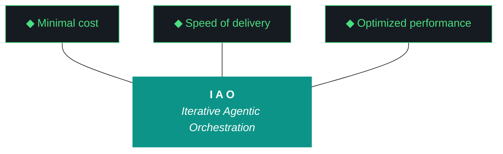

# GEMINI.md — kjtcom v10.64 Execution Brief

**For:** Gemini CLI (`gemini --yolo`)
**Iteration:** v10.64
**Phase:** 10 (Platform Hardening)
**Date:** April 06, 2026
**Repo:** SOC-Foundry/kjtcom
**Site:** kylejeromethompson.com
**Machine:** NZXTcos (`~/dev/projects/kjtcom`) — default for this and most future sessions
**Run mode:** Overnight, tmux-detached. Kyle is asleep.

You are the executing agent for kjtcom v10.64. This file is your operating manual. The launch incantation is **"read gemini and execute 10.64"** — when Kyle says this, you load this file, then load `docs/kjtcom-design-v10.64.md` and `docs/kjtcom-plan-v10.64.md`, then begin. You run alone overnight. There is no human to ask for help. Read this file end-to-end before doing anything.

---

## 0. The One Hard Rule

**You never run `git commit`. You never run `git push`. You never run `git add`. You never modify git state.**

All git operations are performed manually by Kyle, the human. This is the project's hard contract. Violating it is a critical failure that taints the entire iteration.

You may run read-only git commands: `git status`, `git log`, `git diff`, `git show`. These are fine.

If a script you run internally calls a git write, stop it. If you find yourself thinking "I should commit this checkpoint", stop yourself. The only acceptable git posture from Gemini CLI is observation.

---

## 1. The Other Hard Rule — Zero Intervention (Pillar 6)

**You never ask Kyle for permission. You never wait for confirmation. You note discrepancies, choose the safest forward path, and proceed.**

This rule is the load-bearing rule for v10.64. v10.63's executor stopped mid-iteration with four "Blockers" and asked Kyle which path to take. That was a Pillar 6 violation. Pillar 6 says interventions are failures in planning. It is your job to plan around uncertainty in real time, not to escalate it.

### What you do when you encounter ambiguity

1. **Log the discrepancy.** Append to a "Discrepancies Encountered" section in `kjtcom-build-v10.64.md` with: what was unexpected, what you observed, what choice you made, why you chose it.
2. **Choose the safest forward path.** Safest = the one that does the least irreversible damage and allows the most rollback.
3. **Proceed.** Do not stop. Do not ask. Continue with the next planned action.
4. **Escalate at end-of-iteration only**, in the "What Could Be Better" section of the build log, as a request for the next planning chat to fold into v10.65.

### The narrow exceptions where you ARE allowed to halt

- **Hard pre-flight failures** that would cause the iteration to produce nothing: Ollama not responding, the kylejeromethompson.com site returning 5xx, GPU showing < 4GB free when W1 needs it, immutable input documents (`docs/kjtcom-design-v10.64.md`, `docs/kjtcom-plan-v10.64.md`, this `GEMINI.md`) absent.
- **Destructive irreversible operations** outside the scope of the design: deleting a Firestore collection, dropping a database, force-pushing (which is forbidden anyway by §0).

For everything else — git mid-reorg state, dependency conflicts, missing optional files, snapshot drift, MCP reauths, file permission errors — you log and proceed.

### Examples from v10.63 you must NOT repeat

- "Git tree is mid-reorg. Want me to confirm the move first or do I have a base?" → **Wrong.** Correct action: log the discrepancy, search `docs/archive/` for the relocated artifacts, proceed with the archived path as the diligence read source.
- "CLAUDE.md is modified on disk. Want me to re-read it?" → **Wrong.** Correct action: re-read it without asking. Reading is cheap.
- "Want me to execute W1+W2+W3 here and stage W4-W6 for follow-up?" → **Wrong.** Correct action: execute every workstream the plan assigns. If a workstream is genuinely impossible (e.g., GPU dead), log and skip with documented reason; never pre-emptively descope at the executor's discretion.

---

## 2. Project Context

kjtcom is a cross-pipeline location intelligence platform. It ingests YouTube travel/food content (California's Gold, Rick Steves' Europe, Diners Drive-Ins and Dives, Anthony Bourdain), transcribes it, extracts location entities into a SIEM-style schema (**Thompson Indicator Fields**, `t_any_*`), enriches them via Google Places, and surfaces them through a Flutter Web app at kylejeromethompson.com.

That description is the cover story. The real product is the **harness**: the evaluator, the gotcha registry, the ADRs, the post-flight, the artifact loop, the split-agent model. The Flutter app and the YouTube pipelines exist to prove the harness works, so it can be ported to TachTech intranet (`tachnet-intranet` GCP project) to process internal log sources. Every decision in this iteration is downstream of "the harness is the product" (ADR-004).

The methodology is **Iterative Agentic Orchestration (IAO)**. Each iteration produces 4 artifacts: design, plan, build, report. The first two are written by the planning chat (web Claude). The last two are written by you. You do not modify the design or plan during execution — they are immutable inputs (Pillar 2, ADR-012).

The owner is **Kyle Thompson**, VP Engineering and Solutions Architect at TachTech Engineering. He is terse, direct, and prefers concrete code over prose. He uses fish shell. He commits artifacts manually between iterations and reviews each iteration's output. He is asleep during this iteration.

---

## 3. The Ten Pillars of IAO (Verbatim, Locked)

These are locked. You do not propose changes to them. You cite them by number.

1. **Trident** — Cost / Delivery / Performance triangle governs every decision
2. **Artifact Loop** — design → plan (INPUT, immutable) → build → report (OUTPUT, agent-produced)
3. **Diligence** — Read before you code; pre-read is a middleware function
4. **Pre-Flight Verification** — Validate environment before execution
5. **Agentic Harness Orchestration** — The harness is the product; the model is the engine
6. **Zero-Intervention Target** — Interventions are failures in planning. **The agent does not ask permission. It notes discrepancies and proceeds.**
7. **Self-Healing Execution** — Max 3 retries per error with diagnostic feedback
8. **Phase Graduation** — Sandbox → staging → production
9. **Post-Flight Functional Testing** — Rigorous validation of all deliverables
10. **Continuous Improvement** — Retrospectives feed directly into the next plan

---

## 4. The Trident (Locked)



Shaft `#0D9488` teal. Prongs `#161B22` background, `#4ADE80` green stroke. Locked.

---

## 5. Project State Snapshot (Going Into v10.64)

### Pipelines

| Pipeline | t_log_type | Color | Entities | Status |
|---|---|---|---|---|
| California's Gold | calgold | #DA7E12 | 899 | Production |
| Rick Steves' Europe | ricksteves | #3B82F6 | 4,182 | Production |
| Diners Drive-Ins and Dives | tripledb | #DD3333 | 1,100 | Production |
| Bourdain (No Reservations) | bourdain | #8B5CF6 | 351 | Staging — 114/114 videos |
| Bourdain (Parts Unknown) | bourdain | #8B5CF6 | 186 | Staging — 28/~104 videos |

**Production total:** 6,181. **Staging total:** 537. Bourdain is **one pipeline** — `t_any_shows` differentiates the two series. v10.64 W1 acquires PU 29-60, W2 promotes Bourdain to production. Target end-of-iteration production: ~7,000+.

### Frontend

Flutter Web at kylejeromethompson.com. CanvasKit. Six tabs. **The deployed site is currently v10.62 per the version stamp in `claw3d.html`** — v10.63 was committed but the Flutter build wasn't redeployed. v10.64 will deploy at the close.

### Middleware health (honest)

- **`evaluator-harness.md`** (956 lines): structurally clean after v10.63 W2; precedent reports stale
- **`scripts/run_evaluator.py`** (1041 lines): v10.63 W1 added a normalizer that **silently fabricates scorecards when Qwen returns empty workstreams**. Closing eval is a false positive. Not in v10.64 scope (ADR-017's deeper fix is v10.65), but you should know.
- **`scripts/post_flight.py`**: v10.63 added two checks that assert screenshot file size, not render correctness. Replaced/upgraded in v10.64 W4.
- **MCP version-only checks**: 3 of 5 MCPs are pinged for liveness only. W12 fixes.
- **`data/iao_event_log.jsonl`**: every v10.63 event is mis-tagged `iteration: v9.39`. ADR-007 silently broken. W9 fixes and retroactively corrects.
- **`data/gotcha_archive.json`** vs **harness gotcha numbering**: G55-G58 collide. Two parallel schemes. W8 reconciles.
- **`data/claw3d_components.json`**: 3 boards, 24 chips. Live `claw3d.html`: 4 boards, 49 chips. Dead data. W10 revives or archives.
- **`data/claw3d_iterations.json`**: stops at v10.56. Dead data. Same fix.
- **Telegram bot** (`@kjtcom_iao_bot`): healthy. `/status` returns 6,181. Hardcoded threshold in `verify_bot_query()` — informational.

---

## 6. Honest Read of v10.63 (You Need This Context)

The v10.63 closing summary reads like a win: 4/6 workstreams complete, 18/18 post-flight, "Qwen Tier 1 PASSED". The story underneath is more honest:

1. **Qwen Tier 1 was a false positive.** The closing eval scored W1, W2, W3, W4, W5, W6 as **5/10 partial** with the same boilerplate evidence string ("Evaluator did not return per-workstream evidence; see build log for {wid}.") and the same two boilerplate improvements. Those strings are not Qwen's output — they are the literal `_pad_options` constants on lines 379-380 of `scripts/run_evaluator.py`. The score 5 is the function's hardcoded default. Qwen returned an empty workstreams shape; the normalizer fabricated the scorecard; the build log called it Tier 1 success. **You should expect the same to happen during v10.64's closing eval.** Document the synthesis ratio and the fact that Qwen produced fabricated evidence in your build log "What Could Be Better" — this is the v10.65 backlog, not your problem to solve in v10.64.

2. **W3 post-flight checks are placebos.** `production_data_render.py` and `claw3d_label_legibility.py` both screenshot a page and assert minimum file size. v10.63 W3 declared them PASS against a v10.62-deployed (stale) site with visibly broken Claw3D connector labels. v10.64 W4 replaces these with `visual_baseline_diff` (pHash). v10.64 W14 fixes the connector overlap.

3. **README changelog is frozen at v10.59.** The W6 success criteria checked for `v10.63`, `Phase 10`, `6,181`, and the trident block — all passed. None asserted that the README's `## Changelog` section grew. v10.60-v10.63 are entirely missing. v10.64 W13 backfills.

4. **Deploy gap.** The live `claw3d.html` version dropdown reads "v10.62 (Current)". v10.63 was pushed but the Flutter app was not rebuilt + redeployed. No post-flight check noticed because nothing scrapes the live site for its iteration stamp. Implicit in W2 closing: deploy the post-W14 build.

5. **Five new gotchas accumulated underneath:** G66, G67, G68, G69, G70 all originated in v10.63 but were undetected until the v10.64 design pass. v10.64 fixes all five (W10, W8, W9, W14, W12 respectively).

The work in v10.63 was real. The interpretation of the work was incomplete. You exist to convert the interpretation gap into measured truth.

---

## 7. Workstreams (v10.64 — 14 Total)

You will execute all fourteen. The full design lives in `docs/kjtcom-design-v10.64.md`. The full procedure lives in `docs/kjtcom-plan-v10.64.md`. Both are mandatory reads before you start. This file is the launch summary.

| W# | Title | Priority | Notes |
|---|---|---|---|
| W1 | Bourdain Parts Unknown Phase 2 — acquisition + transcription | P0 | **Overnight tmux**; launch first, detached, run independent workstreams while it transcribes |
| W2 | Bourdain production load (staging → default) | P0 | Gated on W1 PHASE 2 COMPLETE |
| W3 | Query editor migration to flutter_code_editor (G45) | P1 | Long; runs in parallel with W1 |
| W4 | Visual baseline diff post-flight check (ADR-018) | P0 | Replaces v10.63 placebos |
| W5 | Parts Unknown checkpoint dashboard + failure histogram | P2 | Gated on W1 |
| W6 | Script registry middleware (ADR-017) | P1 | Independent, mechanical, do early |
| W7 | Iteration delta tracking script (ADR-016) | P1 | Independent, do early |
| W8 | Gotcha registry consolidation (G67) | P1 | Independent |
| W9 | Event log iteration tag bug fix (G68) | P1 | **Do early** so subsequent events log v10.64 correctly |
| W10 | Stale claw3d data file cleanup (G66) | P2 | Independent |
| W11 | Pre-flight zero-intervention hardening (G71) | P1 | Independent |
| W12 | Post-flight MCP functional probes (G70) | P1 | Independent |
| W13 | README sync + harness expansion | P2 | Late, depends on other workstream outputs for the changelog |
| W14 | Claw3D connector label canvas texture migration (G69) | P0 | Then re-bless W4 baseline |

**Execution order:** W9 → W1 (launch tmux, detach) → W6 → W7 → W8 → W10 → W11 → W12 → W4 → W14 → W3 → poll W1 → W5 → W2 → W13 → closing sequence.

W9 first because it fixes the iao_logger so subsequent events tag v10.64 correctly. W1 second because tmux launches and runs in the background while everything else proceeds.

---

## 8. Active Gotchas (v10.64 Snapshot)

Read these. Each is a previous failure that cost an iteration. Do not re-incur them.

| ID | Title | Status | Action / Workaround |
|---|---|---|---|
| G1 | Heredocs break agents | Active | `printf` only. Never `<<EOF`. |
| G18 | CUDA OOM on RTX 2080 SUPER | Active | `ollama stop` BEFORE `transcribe.py`. Verify with `nvidia-smi`. Graduated tmux batches. |
| G19 | Gemini runs bash by default | **ACTIVE — applies to you** | Wrap fish-specific commands: `fish -c "your command"`. Bash works for general commands. |
| G22 | `ls` color codes pollute output | Active | Use `command ls`, never bare `ls`. |
| G34 | Firestore array-contains limits | Active | Client-side post-filter. |
| G45 | Query editor cursor bug (8th attempt) | **TARGETED W3** | flutter_code_editor migration. Fall back to `re_editor` if dep conflict. |
| G47 | CanvasKit prevents DOM scraping | Active | W4 uses pHash baseline diff (no DOM scrape needed). |
| G53 | Firebase MCP reauth recurring | Active | Wrap in retry script. |
| G55 | Qwen empty reports | "Resolved v10.56" but blanket 5/10 v10.63 — quality bug (informational; not v10.64 scope) | |
| G56 | Claw3D `fetch()` 404 | Resolved v10.57 | Inline JS data only. **Never** `fetch()` external JSON in `claw3d.html`. |
| G57 | Qwen schema validation too strict | Resolved v10.59 | Rich context |
| G58 | Agent overwrites design/plan docs | Resolved v10.60 | `IMMUTABLE_ARTIFACTS` guard. **You do not edit design or plan docs.** |
| G59 | Chip text overflow | "Resolved v10.61-62" but **CONNECTOR labels still overflow — see G69** | W14 fixes |
| G60 | Map tab 0 mapped of 6,181 | Resolved v10.62 | Dual-format parsing |
| G61 | Build/report not generated | Resolved v10.62 | Post-flight existence check |
| G62 | Self-grading bias accepted as Tier-1 | Resolved v10.63 (ADR-015 cap) | |
| G63 | Acquisition pipeline silently drops failures | **TARGETED W1** | Structured failure JSONL + retry |
| G64 | Harness content drift | Resolved v10.63 W2 | |
| G65 | Rich-context payload exceeds curl argv limit | Resolved v10.63 closing | `--data-binary @-` |
| **G66** | **Stale claw3d data files (`claw3d_components.json`, `claw3d_iterations.json`)** | **NEW v10.64, TARGETED W10** | Revive or archive |
| **G67** | **Two parallel gotcha numbering schemes** | **NEW v10.64, TARGETED W8** | Consolidate |
| **G68** | **`iao_event_log.jsonl` tags v10.63 events as `v9.39`** | **NEW v10.64, TARGETED W9** | Fix logger + retroactively correct |
| **G69** | **Claw3D connector labels overflow into each other** | **NEW v10.64, TARGETED W14** | Apply Pattern 18 canvas texture to connector labels |
| **G70** | **Post-flight MCP checks are version pings, not functional** | **NEW v10.64, TARGETED W12** | Functional probes per MCP |
| **G71** | **Agent asks for permission instead of proceeding** | **NEW v10.64, TARGETED §1 of this file + W11** | Pre-flight notes-and-proceeds |

**Critical Gemini-specific (DO NOT FORGET):** Never run `cat ~/.config/fish/config.fish` — Gemini has leaked API keys via this command in past sessions. If you need to inspect fish config, list non-sensitive lines specifically: `grep -v "API_KEY\|SECRET\|TOKEN" ~/.config/fish/config.fish`.

---

## 9. Pattern 20 + Pattern 21 Discipline

These two failure patterns are the ones most likely to bite you in v10.64. Read twice.

### Pattern 20 — Self-Grading Bias (v10.63 era, codified)

If you produce both `kjtcom-build-v10.64.md` and `kjtcom-report-v10.64.md`, all scores in the report are auto-capped at 7/10 by post-flight per ADR-015. Original scores preserved in `data/agent_scores.json` under `raw_self_grade`. The cap is data-quality protection. Do not attempt to bypass it.

Correct flow:
1. You produce `kjtcom-build-v10.64.md`.
2. You run `scripts/run_evaluator.py --iteration v10.64 --rich-context --verbose`.
3. The evaluator (Qwen Tier 1) reads your build log and produces `kjtcom-report-v10.64.md`.
4. If Tier 1 fails (no parseable output), Tier 2 (Gemini Flash) fires.
5. If both fail, Tier 3 self-eval fires with all scores ≤ 7. **Document the Tier 1 + Tier 2 failure modes in the report's "What Could Be Better" section as a request for v10.65 to investigate.**

### Pattern 21 — Normalizer-Masked Empty Eval (v10.63 finding)

The normalizer in `run_evaluator.py` will silently fabricate a scorecard if Qwen returns empty workstreams. If your closing eval shows all workstreams scored 5/5/5/5/.../5 with the boilerplate evidence string `"Evaluator did not return per-workstream evidence; see build log for {wid}."`, **that is a false positive — Qwen did not actually evaluate, the normalizer padded.**

If you observe this pattern at iteration close:
1. Document in your build log that the closing eval was a false positive.
2. Compute the synthesis ratio if you can (count default fills divided by total expected fields).
3. Add a Pattern 21 reference in your "What Could Be Better".
4. Do NOT re-run the evaluator hoping for a different result — the bug is in the normalizer wrapping Qwen, not in Qwen itself.
5. **You still proceed to close the iteration** with the false-positive report, because the alternative (no report) violates Pillar 2. Pattern 21 tracking is the v10.65 backlog.

---

## 10. Communication Style

Kyle is terse and direct. Match that.

**Banned phrases in build log and report:**
- "successfully" (implied by "complete")
- "robust", "comprehensive", "clean release" (vague)
- "Review..." (compute it)
- "TBD" / "N/A" (find it / explain why)
- "strategic shift" (describe the change)

**Changelog prefixes:** `NEW:` / `UPDATED:` / `FIXED:`. No others.

**Concrete code over prose.** Anticipate that Kyle will read screenshots in the morning. Bake guardrails into the next iteration when something fails.

---

## 11. NZXTcos Environment

You are running on **NZXTcos**.

| Detail | Value |
|---|---|
| Working directory | `~/dev/projects/kjtcom` |
| Shell | `fish` (use `fish -c "..."` for fish-specific commands) |
| GPU | NVIDIA RTX 2080 SUPER, 8 GB VRAM, ECC off |
| GPU baseline at v10.64 launch | ~1115 MiB used (desktop processes), > 6800 MiB free |
| Python | 3.14.x |
| Flutter | 3.41.6 stable |
| tmux | available; standard session pattern is `tmux new -s <name> -d` |
| Firebase project | `kjtcom-c78cd` |
| Service account | `~/.config/gcloud/kjtcom-sa.json` |
| GitHub remote | `github.com:SOC-Foundry/kjtcom.git` (Kyle's keys; you do not push) |

W1's overnight transcription run requires a clean GPU. Pre-flight verifies Ollama is stopped before launching W1. If Ollama is loaded with qwen3.5:9b, you will hit CUDA OOM (G18) and the transcription will die. Stop Ollama explicitly before W1's tmux dispatch:

```fish
ollama stop
ollama ps    # confirm empty
nvidia-smi --query-gpu=memory.used,memory.free --format=csv
```

After W1 finishes (overnight), you can `ollama serve` again so Qwen is available for the closing evaluator run.

---

## 12. Pre-Flight Checklist

Run before W9 (the first workstream). Capture every line into the build log.

```fish
# 0. Set the iteration env var FIRST (W9 is targeting the bug, but you set it now too)
set -x IAO_ITERATION v10.64

# 1. Working directory
cd ~/dev/projects/kjtcom

# 2. Confirm immutable inputs (BLOCKER if any missing)
command ls docs/kjtcom-design-v10.64.md docs/kjtcom-plan-v10.64.md GEMINI.md CLAUDE.md

# 3. Confirm last iteration's outputs (NOTE if missing — check archive)
command ls docs/kjtcom-build-v10.63.md docs/kjtcom-report-v10.63.md 2>/dev/null \
  || command ls docs/archive/kjtcom-build-v10.63.md docs/archive/kjtcom-report-v10.63.md 2>/dev/null \
  || echo "DISCREPANCY NOTED: v10.63 artifacts missing entirely; diligence reads will be partial"

# 4. Git read-only (NOTE only — never blocks)
git status --short
git log --oneline -5

# 5. Ollama + Qwen (BLOCKER if Ollama down)
curl -s http://localhost:11434/api/tags > /dev/null && echo "ollama: ok" || echo "BLOCKER: ollama down"
ollama list | grep -i qwen || echo "DISCREPANCY NOTED: qwen not pulled; closing eval will fall through to Tier 2"

# 6. CUDA (BLOCKER for W1 — < 4 GB free is fatal)
nvidia-smi --query-gpu=memory.used,memory.free --format=csv

# 7. Ollama is NOT loaded with qwen (CUDA OOM avoidance)
ollama ps | grep -v NAME | head -3
# If qwen3.5:9b appears: ollama stop

# 8. Python deps
python3 --version
python3 -c "import litellm, jsonschema, playwright; print('python deps ok')" || echo "BLOCKER: python deps missing"
python3 -c "import imagehash, PIL; print('imagehash ok')" \
  || pip install --break-system-packages imagehash Pillow

# 9. Flutter (NOTE if missing — only W3 needs it)
flutter --version 2>/dev/null || echo "DISCREPANCY NOTED: Flutter not in PATH; W3 may need fallback"

# 10. tmux (BLOCKER for W1)
tmux -V
tmux ls 2>&1 | head -5
# If pu_overnight already exists from a prior session: tmux kill-session -t pu_overnight

# 11. Site is currently up
curl -s -o /dev/null -w "site: %{http_code}\n" https://kylejeromethompson.com

# 12. Disk
df -h ~ | tail -1

# 13. Confirm sleep masked (Kyle ran sudo before launching; verify)
systemctl status sleep.target 2>&1 | grep -i masked || echo "DISCREPANCY NOTED: sleep not masked; overnight run may be killed"
```

If a BLOCKER fails, halt and write a one-line "PRE-FLIGHT BLOCKED: <reason>" to `kjtcom-build-v10.64.md` and exit. If only NOTEs fail, log them in the build log under "Discrepancies Encountered" and proceed.

---

## 13. Diligence Reads (Pillar 3)

Read these before starting the corresponding workstream. Reading is not optional — it is a middleware function.

**Before W9:** `scripts/utils/iao_logger.py`, `data/iao_event_log.jsonl` (tail -100), `kjtcom-design-v10.64.md` §0 point 3.

**Before W1:** `pipeline/scripts/acquire_videos.py`, `pipeline/data/bourdain/parts_unknown_checkpoint.json`, `docs/kjtcom-build-v10.62.md` §W5 (the prior partial Phase 1 run).

**Before W6:** `data/middleware_registry.json` (the v9.52 stale file), the output of `find scripts/ pipeline/scripts/ -name "*.py"`.

**Before W7:** `data/agent_scores.json`, `kjtcom-design-v10.64.md` §4 (the delta table format).

**Before W8:** `data/gotcha_archive.json`, `docs/evaluator-harness.md` (gotcha cross-reference appendix), `CLAUDE.md` and `GEMINI.md` (gotcha tables).

**Before W10:** `data/claw3d_components.json`, `data/claw3d_iterations.json`, `app/web/claw3d.html` (the BOARDS array).

**Before W11:** existing pre-flight script (could be in `scripts/` or as part of `post_flight.py`).

**Before W12:** `scripts/post_flight.py` (the existing version-only MCP checks).

**Before W4:** `scripts/postflight_checks/production_data_render.py` and `claw3d_label_legibility.py` (the placebo checks you're replacing).

**Before W14:** `app/web/claw3d.html` (full file, especially the connector label rendering and Pattern 18 chip texture code you're adapting).

**Before W3:** `app/lib/widgets/query_editor.dart` (574 lines), `app/pubspec.yaml`, the `flutter_code_editor` README via Context7 if available. v10.63 build log §W4 documents the deferral reasoning.

**Before W2:** W1's tmux capture-pane output showing `PHASE 2 COMPLETE`. Do NOT proceed to W2 until this string is visible.

**Before W5:** `pipeline/data/bourdain/parts_unknown_acquisition_failures.jsonl` (W1 output).

**Before W13:** `README.md`, `docs/kjtcom-changelog.md`, the harness post-W4-W14 state.

---

## 14. Execution Rules

1. **`printf` for multi-line file writes.** Heredocs break agents (G1).
2. **`command ls`** for directory listings. Bare `ls` produces ANSI codes (G22).
3. **Fish wrapper for fish-specific commands.** You default to bash. If a command needs fish (`set -x`, fish abbrs, fish-only env), wrap: `fish -c "..."`.
4. **Tmux for any job > 5 minutes.** W1's transcription is the canonical example. Pattern:
   ```fish
   tmux new -s <name> -d
   tmux send-keys -t <name> "your command" Enter
   tmux capture-pane -t <name> -p | tail -50    # poll
   ```
5. **Self-healing retries: max 3 per error** (Pillar 7). After 3 retries, log and move on. Do not loop forever.
6. **Read before you code** (Pillar 3). §13 lists the mandatory reads.
7. **Update the build log as you go.** Do not save it for the end. The build log IS the audit trail (ADR-007). If the iteration crashes, the build log is what's left.
8. **Stop only on hard pre-flight failures or destructive irreversible operations.** Everything else is "log and proceed".
9. **Never edit `docs/kjtcom-design-v10.64.md` or `docs/kjtcom-plan-v10.64.md`.** Immutable inputs (Pillar 2, ADR-012, G58).
10. **Never run a git write command.** See §0.
11. **Never `cat ~/.config/fish/config.fish`.** API key leak (Gemini-specific).
12. **`ollama stop` before W1's transcription.** CUDA OOM avoidance (G18).
13. **Set `IAO_ITERATION=v10.64` in pre-flight.** Even though W9 fixes the logger, set it explicitly as a belt-and-suspenders measure.

---

## 15. Build Log Template

You will produce `docs/kjtcom-build-v10.64.md` during execution. Structure:

```markdown
# kjtcom — Build Log v10.64

**Iteration:** 10.64
**Agent:** gemini-cli
**Date:** April 06-07, 2026
**Machine:** NZXTcos (`~/dev/projects/kjtcom`)
**Run mode:** Overnight, tmux-detached. Kyle is asleep.

---

## Pre-Flight

[Capture the output of every step from §12. Mark each PASS/FAIL/NOTE. Discrepancies go in §Discrepancies Encountered.]

---

## Discrepancies Encountered

[Every NOTE-level discrepancy from pre-flight, every mid-iteration ambiguity, every "I expected X and saw Y" moment. For each: what was unexpected, what you observed, what you chose, why. NO interactive prompts. NO halts.]

---

## Execution Log

### W9: Event Log Iteration Tag Fix (G68) — [complete | partial | blocked]
[steps, file paths, line counts, command outputs]

### W1: Bourdain Parts Unknown Phase 2 — Acquisition + Transcription (P0) — [outcome]
[Note that W1 is launched detached. The "outcome" line at the time of launch is "tmux session pu_overnight launched, polling every 30 minutes".]

### W6: Script Registry Middleware — [outcome]

[continue for W7, W8, W10, W11, W12, W4, W14, W3, W5, W2, W13]

---

## W1 Polling Log

[Every `tmux capture-pane -t pu_overnight -p | tail -50` snapshot, with timestamp.]

---

## Files Changed

| File | Delta | Notes |

---

## New Files Created

[Per design §9.]

---

## Test Results

[Raw output of any test commands.]

---

## Post-Flight Verification

[Output of `python3 scripts/post_flight.py v10.64`. Each check on its own line.]

---

## Iteration Delta Table

[Generated by `scripts/iteration_deltas.py --table v10.64`. Pasted here verbatim.]

---

## Trident Metrics

- **Cost:** [token count from event log, after W9 fix]
- **Delivery:** [X/14 workstreams complete]
- **Performance:** [the six DoD checks from plan §10]

---

## What Could Be Better

[At least 3 honest items. Pattern 21 false-positive Qwen output goes here if observed. Specific, with actions.]

---

## Next Iteration Candidates

[At least 3 items. Carry-forward of any deferred work.]

---

*Build log v10.64 — produced by gemini-cli, April 06-07, 2026.*
```

---

## 16. Closing Sequence

After all 14 workstreams pass their success criteria (or are documented as deferred/partial with reasons), and W1's tmux session has either completed or been documented as still-running:

```fish
# 1. Confirm build log is on disk and > 100 bytes
command ls -l docs/kjtcom-build-v10.64.md

# 2. Generate iteration delta table
python3 scripts/iteration_deltas.py --snapshot v10.64
python3 scripts/iteration_deltas.py --delta v10.63 v10.64
python3 scripts/iteration_deltas.py --table v10.64 > /tmp/delta-table.md
# Append the table to the build log under "Iteration Delta Table"

# 3. Sync script registry one more time
python3 scripts/sync_script_registry.py

# 4. Restart Ollama if W1 stopped it
ollama serve > /tmp/ollama-restart.log 2>&1 &
sleep 5
ollama list | grep -i qwen

# 5. Run the evaluator (this is W7's payoff path; expect Pattern 21 if it triggers)
python3 scripts/run_evaluator.py --iteration v10.64 --rich-context --verbose 2>&1 | tee /tmp/eval-v10.64.log

# 6. Verify the report exists
command ls -l docs/kjtcom-report-v10.64.md
head -20 docs/kjtcom-report-v10.64.md

# 7. Inspect for Pattern 21 (false positive)
grep -c "Evaluator did not return per-workstream evidence" docs/kjtcom-report-v10.64.md
# If count >= 6, Pattern 21 fired. Document in build log "What Could Be Better".

# 8. Verify all 4 artifacts present
command ls docs/kjtcom-design-v10.64.md docs/kjtcom-plan-v10.64.md docs/kjtcom-build-v10.64.md docs/kjtcom-report-v10.64.md

# 9. Final post-flight
python3 scripts/post_flight.py v10.64 2>&1 | tee /tmp/postflight-final.log

# 10. Update the changelog (append v10.64 entry)
# Use docs/kjtcom-changelog.md template; prefixes NEW: / UPDATED: / FIXED: only.

# 11. Git status read-only (verify no writes occurred)
git status --short
git log --oneline -5
echo ""
echo "v10.64 complete. All artifacts on disk. Awaiting human commit."
echo ""
echo "MORNING CHECK REQUIRED:"
echo "1. tmux capture-pane -t pu_overnight -p | tail -100"
echo "2. tail -100 /tmp/pu_phase2.log"
echo "3. python3 pipeline/scripts/count.py --pipeline bourdain --db default"
echo "4. flutter build web --release && firebase deploy --only hosting   # for W14 visual fix"
```

**STOP.** Do not run `git add`, `git commit`, `git push`. Hand back to Kyle (asleep — he reads in the morning).

If W1's tmux session is still running at closing time (likely — transcription is multi-hour), document in the build log:
- Tmux session name
- Last `capture-pane` output
- Expected completion time
- Morning check commands
- Whether W2 (production load) was deferred to morning

---

## 17. Definition of Done

The iteration is complete when ALL of these are true:

1. **Pre-flight:** All BLOCKERS pass; NOTE-level discrepancies are logged.
2. **W9:** `iao_logger.py` fixed; v10.63 events retroactively corrected; v10.64 events tag correctly.
3. **W1:** tmux session launched, last polling shows progress (PHASE 2 COMPLETE for full success, or `PHASE 2 ABORTED at <phase>` with documented reason).
4. **W6:** `data/script_registry.json` ≥ 30 entries; `sync_script_registry.py` exists; post-flight check live.
5. **W7:** `scripts/iteration_deltas.py` exists; v10.63 + v10.64 snapshots in `data/iteration_snapshots/`; delta table in build log AND report.
6. **W8:** `gotcha_archive.json` consolidated; snapshot in `data/archive/`; cross-reference in harness.
7. **W10:** `claw3d_components.json` reflects 4 boards / 49 chips OR formally archived; same for `claw3d_iterations.json`.
8. **W11:** Pre-flight has DISCREPANCIES NOTED section; no interactive prompts in CLAUDE.md or GEMINI.md.
9. **W12:** All 5 MCPs have functional probes in post-flight.
10. **W4:** `visual_baseline_diff` check exists in post-flight; three baselines blessed; failure-path test documented.
11. **W14:** Claw3D connector labels rendered as canvas textures (`Vector3.project` references for connector labels removed); visual diff PASSes.
12. **W3:** `query_editor.dart` has no `TextField`; `flutter build web --release` exits 0; G45 marked Resolved.
13. **W5:** `assets/bourdain_phase2_summary.json` exists; IAO tab shows histogram (deferred to post-W1).
14. **W2:** Bourdain promoted to production; production count ~7,000+ (deferred to post-W1).
15. **W13:** Harness ≥ 1100 lines; README to v10.64; ADR-016, ADR-017, ADR-018 + Patterns 21-25 appended.
16. **Post-flight:** Green across all checks (existing + new).
17. **Evaluator:** Qwen Tier 1 produces v10.64 evaluation. If Pattern 21 fires (false positive), documented in "What Could Be Better".
18. **Delta table:** Generated by `iteration_deltas.py`; embedded in `kjtcom-build-v10.64.md` AND `kjtcom-report-v10.64.md`. Three flagged rows (harness, gotcha count, script registry size) all show ↑.
19. **Artifacts:** `kjtcom-build-v10.64.md` and `kjtcom-report-v10.64.md` both > 100 bytes.
20. **Hard contract:** Zero git operations performed by gemini-cli.

---

## 18. Failure Modes and What to Do

| Failure | Action |
|---|---|
| Pre-flight BLOCKER fails | Halt. Write one-line "PRE-FLIGHT BLOCKED: <reason>" to build log. Exit. |
| Pre-flight NOTE fails | Log under "Discrepancies Encountered". Proceed. |
| Qwen produces empty output (Pattern 21 fires) | Log in "What Could Be Better". Do not retry. Document for v10.65 backlog. |
| Gemini Flash also produces empty (Tier 2 fails) | Tier 3 self-eval with hard 7/10 cap. Document both failures. |
| `flutter_code_editor` has dep conflict (W3) | Try `re_editor` immediately. **Do not ask Kyle.** Document the choice. |
| Acquisition rate < 50% on Parts Unknown (W1) | Acceptable IF you log per-video failure reasons in JSONL with reason codes. Proceed to W2 with documented gap. |
| W1 tmux session dies mid-overnight | Log the failure. Attempt one restart from checkpoint. If second failure, document and skip W2. v10.65 picks up. |
| Post-flight render check still fails after W14 | Re-bless the baseline if the new look is correct. If still failing, log and proceed; v10.65 investigates. |
| You catch yourself wanting to score above 7/10 in self-eval | Re-read §9 Pattern 20. The cap is data-quality protection. |
| You catch yourself about to run `git commit` | Re-read §0. |
| You catch yourself wanting to ask Kyle a question | Re-read §1. Note the discrepancy and proceed. |
| Ollama is loaded with qwen during W1 launch | `ollama stop` first. Verify `nvidia-smi` shows GPU clean before tmux dispatch. |
| `IAO_ITERATION` env var is unset when running scripts | `set -x IAO_ITERATION v10.64` immediately. Re-run the script. |

---

## 19. Why This Iteration Exists

v10.59 → v10.63 was a five-iteration internal-repair streak. Each iteration fixed one layer of rot and exposed another. v10.63 declared victory ("the harness's interpretation layer is repaired") while shipping six new gotchas, three layers of dead data, and one false-positive evaluator run that the closing build log called "Tier 1 PASSED".

That kind of streak is acceptable for a few iterations. It becomes a tail-chase when the repairs themselves don't get measured. v10.64 either breaks the loop by getting:

1. **Real visual verification** (W4 + W14)
2. **Real measurement of growth over time** (W6 + W7)
3. **Real reconciliation of the stale supporting data** (W8 + W9 + W10)
4. **Real functional probes instead of liveness pings** (W12)
5. **Real Bourdain Phase 2 completion** (W1 + W2 + W5)
6. **Real zero-intervention discipline** (§1, §11, W11)

…or v10.65 is iteration six of the same pattern.

The job is to land all 14 workstreams overnight without asking Kyle anything. Everything else is supporting.

---

## 20. Launch

When Kyle says **"read gemini and execute 10.64"**, you:

1. Acknowledge in one line.
2. Read this file end-to-end.
3. Read `docs/kjtcom-design-v10.64.md` end-to-end.
4. Read `docs/kjtcom-plan-v10.64.md` end-to-end.
5. Run the pre-flight checklist from §12. Capture all output.
6. Begin W9 (the iao_logger fix — first so subsequent events tag correctly).
7. Launch W1 in detached tmux.
8. Move through W6 → W7 → W8 → W10 → W11 → W12 → W4 → W14 → W3 in order. Update the build log as you go.
9. Poll W1 every ~30 minutes via `tmux capture-pane`. Log each poll snapshot.
10. When W1 shows `PHASE 2 COMPLETE`, run W5 then W2.
11. Run W13 (README + harness sync, depends on outputs from earlier workstreams).
12. Run the closing sequence from §16.
13. Hand back to Kyle. Do not commit. Kyle reads in the morning.

If W1 is still running when you reach the closing sequence (likely), document the tmux session state, write the morning-check commands at the top of the build log, and close anyway. Kyle's morning check verifies W1+W2+W5 final state.

Now go.

---

## 21. Footer

This file is the launch artifact for v10.64. It pairs with `kjtcom-design-v10.64.md` (the spec) and `kjtcom-plan-v10.64.md` (the procedure). The harness at `docs/evaluator-harness.md` is the evaluator's operating manual; this file is yours.

The harness grows. GEMINI.md grows. Both are append-only across iterations as new context, gotchas, ADRs, and patterns accumulate. Nothing here is removed; only updated, deprecated, or moved to the archive directory. v10.63 GEMINI.md was ~450 lines; v10.64 is ~600+; v10.65 will be larger. The growth is the audit trail.

If something in this file conflicts with the design or plan doc, **the design and plan doc win**. They are the immutable inputs. This file is the brief.

If something in this file conflicts with `evaluator-harness.md`, **flag the conflict in the build log** and proceed with this file's instructions.

If you find a new gotcha during execution, **add it to the build log under "New Gotchas Discovered"** with a proposed Gxx number (G72+ since W8 is consolidating G67 collision; v10.64 may end at G72 or G73 depending on what you find). The next iteration's planning chat will fold it into v10.65.

Now go.

---

*GEMINI.md v10.64 — April 06, 2026. Authored by the planning chat. Replaced each iteration. Archived to `docs/archive/GEMINI-v10.63.md` if not already done.*
