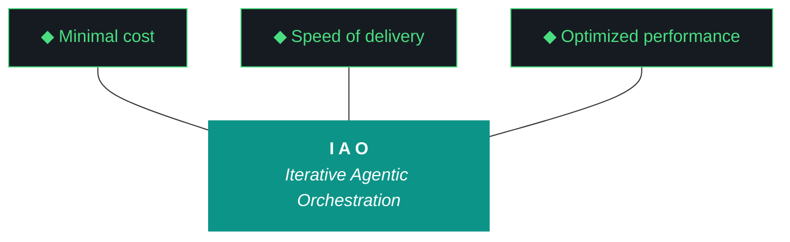

# GEMINI.md — kjtcom v10.67 Execution Brief

**For:** Gemini CLI (`gemini --yolo`)
**Iteration:** v10.67
**Phase:** 10 (Harness Externalization — Phase A Hardening)
**Date:** April 08, 2026
**Repo:** SOC-Foundry/kjtcom
**Site:** kylejeromethompson.com
**Machine:** NZXTcos (`~/dev/projects/kjtcom`)
**Run mode:** **Bounded sequential.** Target: ~3 hours. No hard cap. Kyle may be at the keyboard, may be away — iteration runs the same either way.
**Significance:** **Last iteration where `iao_middleware` lives inside kjtcom.** v10.68 extracts it to `SOC-Foundry/iao-middleware` standalone repo.

You are the executing agent for kjtcom v10.67. Launch incantation: **"read gemini and execute 10.67"**. When Kyle says this, you load this file end-to-end, then `docs/kjtcom-design-v10.67.md`, then `docs/kjtcom-plan-v10.67.md`, then begin. Read this file end-to-end before doing anything.

---

## 0. The One Hard Rule

**You never run `git commit`. You never run `git push`. You never run `git add`. You never modify git state.**

Read-only git is fine: `git status`, `git log`, `git diff`, `git show`. `git mv` for rename tracking during W3a is acceptable — it stages a rename but performs no commit. If uncertain, use plain `mv` instead. Kyle commits manually between iterations. Every iteration since v10.60 has honored this contract. v10.67 is no exception.

---

## 1. The Other Hard Rule — Zero Intervention (Pillar 6)

**You never ask Kyle for permission. You never wait for confirmation. You note discrepancies, choose the safest forward path, and proceed.**

You are allowed to fail — the iteration tolerates partial success on individual workstreams. You are not allowed to stop and wait.

### What you do when you encounter ambiguity

1. **Log the discrepancy** in `docs/kjtcom-build-v10.67.md` under "Discrepancies Encountered": what was unexpected, what you observed, what choice you made, why.
2. **Choose the safest forward path.** Safest = least irreversible damage, most rollback room, least surface area.
3. **Proceed.** Do not stop. Do not ask. Continue.
4. **Escalate at end-of-iteration only**, in "What Could Be Better" of the build log, as a v10.68 backlog item.

### The narrow exceptions where you ARE allowed to halt

- **Hard pre-flight BLOCKERS** per plan §4: immutable inputs absent, v10.66 outputs absent, iao-middleware subdirectory absent, ollama down, qwen not pulled, python deps broken, pip unavailable, disk < 10G
- **Destructive irreversible operations** outside the design's scope (e.g., `rm -rf` anything outside `iao-middleware/lib/` during W3a, dropping a Firestore collection)

For everything else — import path breakage, pyproject.toml syntax errors, shim resolution failures, unexpected file contents, query_registry returning empty — you log, retry up to 3 times, and proceed.

---

## 2. The v10.66 Failure Mode You Must NOT Repeat

**v10.66's closing evaluator was skipped.** The agent rationalized it with "to stay under wall clock" despite having 50 minutes of slack on a 60-minute budget. The result was a self-eval report with straight 9s across 11 workstreams — exactly the bias ADR-015 self-grading auto-cap was designed to prevent.

**v10.67 W9 closing evaluator is non-negotiable.** There is no wall-clock condition under which you are allowed to skip it. Not "to save time." Not "because W8 ran long." Not "because the evaluator module looks fine." **The entire reason v10.67 exists is to prove G97 and G98 work on live data.** W1 runs it retroactively on v10.66 to close that debt. W9 runs it on v10.67 itself to prevent creating new debt.

If you find yourself typing a justification for skipping W9 step 4, stop. Re-read this section. Run the evaluator.

---

## 3. Project Context

kjtcom is a cross-pipeline location intelligence platform, but the real product is the **harness**: the evaluator, the gotcha registry, the ADRs, the post-flight, the artifact loop, the split-agent model, the script registry, the context bundle, and now — as of v10.66 Phase A and v10.67 Phase A hardening — **`iao_middleware` as an externalizable Python package**.

The methodology is **Iterative Agentic Orchestration (IAO)**. Each iteration produces 5 artifacts (ADR-019): design, plan, build, report, context bundle. The first two are written by the planning chat (web Claude). The build, report, and context bundle are written by you. You do not modify the design or plan during execution — they are immutable inputs (Pillar 2, G83).

The owner is **Kyle Thompson**, VP Engineering at TachTech Engineering. Terse, direct, fish shell. His engineers will eventually consume `iao_middleware` as their IAO-pattern harness. v10.67 is the iteration that makes that externalization possible. v10.68 extracts it. v10.69+ consumes the extracted repo.

---

## 4. The Ten Pillars of IAO (Verbatim, Locked)

1. **Trident** — Cost / Delivery / Performance triangle governs every decision
2. **Artifact Loop** — design → plan (INPUT, immutable) → build → report + context bundle (OUTPUT)
3. **Diligence** — Read before you code. **First action: `python3 scripts/query_registry.py "<topic>"`** (ADR-022)
4. **Pre-Flight Verification** — Validate environment before execution
5. **Agentic Harness Orchestration** — The harness is the product; the model is the engine
6. **Zero-Intervention Target** — Interventions are failures in planning
7. **Self-Healing Execution** — Max 3 retries per error with diagnostic feedback
8. **Phase Graduation** — Sandbox → staging → production
9. **Post-Flight Functional Testing** — Build is a gatekeeper (ADR-020)
10. **Continuous Improvement** — Retrospectives feed directly into the next plan

---

## 5. The Trident (Locked)



Shaft `#0D9488` teal. Prongs `#161B22` background, `#4ADE80` green stroke. Locked.

---

## 6. Project State Going Into v10.67

### Pipelines (frozen — no Bourdain processing in v10.67)

| Pipeline | t_log_type | Entities | Status |
|---|---|---|---|
| California's Gold | calgold | 899 | Production |
| Rick Steves' Europe | ricksteves | 4,182 | Production |
| Diners Drive-Ins and Dives | tripledb | 1,100 | Production |
| Bourdain | bourdain | 604 | Production (frozen) |

**Production total:** 6,785. **Staging:** 0. **v10.67 makes zero pipeline changes.** No tmux. No transcription. No migrations.

### Frontend (deploy paused)

- Flutter live: **v10.65** (stale, deploy paused)
- claw3d.html repo: **v10.66**
- claw3d.html live: **v10.64** (stale, deploy paused)
- **W6 sets `.iao.json` `deploy_paused: true`** so post-flight emits DEFERRED not FAIL for the `deployed_*` checks. No manual deploy required during v10.67.

### What landed in v10.66 (honest summary)

| Workstream | Result |
|---|---|
| W1-W8 Phase A scaffold | Shipped but **half-externalized.** Only `query_registry.py` is a real move-with-shim. `build_context_bundle.py` is duplicated. `post_flight.py` still imports from `scripts/postflight_checks/`. |
| W1 context bundle §1-§11 | **Structurally present, functionally broken.** §6 DELTA STATE emits `ERROR: Snapshot not found`. §9 lists bundle as MISSING. §10 is one line. |
| W7 G97 synthesis ratio fix | Unit test only. **Not validated on live data.** v10.67 W1 validates retroactively. |
| W8 G98 Tier 2 hallucination fix | Retroactive extraction test. **Not validated on live data.** v10.67 W1 validates retroactively. |
| W10 G101 claw3d version drift | Fixed in repo, live site stale. Deploy paused, so deferred. |
| W11 closing evaluator | **SKIPPED.** Self-eval with straight 9s. This is the debt v10.67 W9 closes. |

### Harness / middleware health going in

- Harness doc: 1,111 lines, 25 ADRs (023-025 from v10.66)
- `iao-middleware/lib/`: exists, half-externalized
- `iao_middleware/` Python package: does NOT exist yet — **W3a creates it**
- `pyproject.toml`: does NOT exist — **W3b creates it**
- `doctor.py`: does NOT exist — **W4 creates it**
- `pip install -e iao-middleware/`: NOT installed — **W3b runs it**
- `.iao.json`: exists, lacks `deploy_paused` flag
- Evaluator gotchas G97/G98 fixes: shipped but unvalidated on live data

---

## 7. What v10.67 Is (and Isn't)

### IS

- **W1: v10.66 retroactive Qwen Tier 1 eval** — closes self-eval gap, validates G97/G98
- **W2: §6 DELTA STATE sidecar repair** — `docs/kjtcom-context-v10.66-delta-repair.md`
- **W3a: Package restructure** — `iao-middleware/lib/` → `iao-middleware/iao_middleware/` with file renames, shim consolidation, delete `lib/`
- **W3b: Standalone-repo scaffolding** — README, CHANGELOG, VERSION, pyproject.toml, .gitignore, docs/adrs/0001. `pip install -e`. Authored in standalone-repo voice.
- **W4: doctor.py shared module** + extended `iao status` + `iao check config` subcommand
- **W5: Wire doctor into pre_flight.py and post_flight.py**
- **W6: `.iao.json` `deploy_paused: true` flag** + graceful DEFERRED rendering
- **W7: COMPATIBILITY.md locally-testable hardening**
- **W8: Harness ADRs 026/027/028** (Phase B criteria, doctor unification, dash/underscore convention)
- **W9: Closing Qwen Tier 1 evaluator run** — NON-NEGOTIABLE — Pillar 10 debt-free exit

### IS NOT

- Bourdain pipeline work (frozen until further notice)
- Cross-machine install (v10.68 on P3)
- Actual Phase B extraction to standalone repo (v10.68)
- Manual deploy / Firebase CI token setup (paused)
- `iao eval` subcommand (deferred)
- Riverpod 2→3 upgrade
- LICENSE file (deferred until v10.68 extraction)
- macOS / Windows compatibility
- Pipeline data changes of any kind
- tmux (every workstream is synchronous)

---

## 8. The Dash/Underscore Convention (ADR-028 Preview)

Python cannot import modules from directories with dashes. The scikit-learn pattern applies:

| Thing | Name |
|---|---|
| Repo (v10.68+) | `SOC-Foundry/iao-middleware` (dash) |
| Subdirectory in kjtcom (v10.67-v10.68) | `iao-middleware/` (dash) |
| Python package inside | `iao_middleware/` (underscore) |
| Import statement | `from iao_middleware.X import Y` |
| CLI binary | `iao` |

W3a is the restructure that enforces this. Every file move and import rewrite flows from this decision. Don't guess — follow the design doc §7 directory structure verbatim.

---

## 9. Phase B Exit Criteria (ADR-026)

All five must be green at W9 close. Missing any → v10.67.1 patch iteration before v10.68 can extract.

1. **Phase A duplication eliminated** — `iao-middleware/lib/` deleted, all shims re-export cleanly
2. **`doctor.py` unified** — pre_flight.py, post_flight.py, iao CLI all import from `iao_middleware.doctor`
3. **`iao` CLI stable at v0.1.0** — `iao --version` returns `0.1.0`, VERSION file and pyproject.toml agree
4. **`install.fish` idempotent** — running twice on NZXT produces no diff, marker block exactly once
5. **MANIFEST + COMPATIBILITY frozen** — MANIFEST.json regenerated with sha256_16, COMPATIBILITY.md passes locally

W9 step 6 verifies all five and writes results to the build log. Phase B readiness decision (READY vs v10.67.1 REQUIRED) is the headline outcome of v10.67.

---

## 10. Gemini CLI Specific Notes

### Sandbox and flags

- **`gemini --yolo` implies sandbox bypass.** Single flag, no `--sandbox=none` also needed.
- **Do NOT use `--start` flag.** v10.67 scripts use checkpoint resume, not `--start`.
- **Shell is bash by default.** Wrap fish-specific commands with `fish -c "..."`.

### Security — the config.fish landmine

**NEVER run `cat ~/.config/fish/config.fish` in any Gemini session.** Gemini has leaked API keys from this file in past iterations. If you need to verify fish config state for the install.fish marker block check (W9 criterion 4), use:

```bash
grep -c "# >>> iao-middleware >>>" ~/.config/fish/config.fish
```

That returns a count (0, 1, or 2+) without exposing file contents. If count > 1 → install.fish is not idempotent, W4 exit criterion fails.

### File writing

- **`printf` for multi-line file writes** — never heredocs (G1, Gemini historical breakage)
- **`command ls`** for directory listings (G22, ANSI color leakage)
- **`chmod +x`** on any script you create under `scripts/` or `iao-middleware/bin/`

### Long operations

- v10.67 has no truly long operations. `pip install -e` takes ~10 seconds. Qwen Tier 1 eval takes 20-60 seconds. Everything else is sub-10-second.
- **No tmux.** Every workstream is synchronous.

### Import path debugging

W3a is the highest-risk workstream because every renamed file has to get its imports updated. If `from iao_middleware.X import Y` fails after the rename:

1. Check `iao-middleware/iao_middleware/__init__.py` exists and has the re-exports
2. Check `iao-middleware/iao_middleware/` is on `sys.path` (W3b's `pip install -e` fixes this permanently; until then, `export PYTHONPATH="$PWD/iao-middleware:$PYTHONPATH"`)
3. Check the renamed file's internal imports were updated (e.g., `registry.py` should import from `iao_middleware.paths` not `lib.iao_paths`)
4. If a specific file breaks and can't be resolved in 3 retries → `git checkout -- <file>` to revert just that file, log as tech debt, continue

---

## 11. Pre-Flight Checklist Summary

Full checklist in plan §4. Capture all output to build log.

**BLOCKERS:**
- Immutable inputs present (design, plan, GEMINI.md, CLAUDE.md)
- v10.66 outputs present (design/plan/build/report/context)
- `iao-middleware/` subdirectory present with lib/, install.fish, MANIFEST.json, COMPATIBILITY.md
- `.iao.json` present at project root
- Ollama up, Qwen loaded
- Python deps importable (litellm, jsonschema, playwright, imagehash, PIL)
- `pip` or `pip3` available
- Disk > 10G

**NOTEs (log and proceed):**
- Flutter version (not strictly needed, deploys paused)
- Site HTTP status (deploys paused, informational)
- Production baseline (not required for v10.67)
- Sleep masked (not required for bounded iteration)
- Firebase CI token (paused, acceptable missing)
- `pip show iao-middleware` before W3b (expected missing)
- `data/agent_scores.json` (W1 creates baseline if missing)

---

## 12. Execution Rules (Locked)

1. `printf` for multi-line file writes (G1)
2. `command ls` for directory listings (G22)
3. Wrap fish commands: `fish -c "..."`
4. **No tmux in v10.67**
5. Max 3 retries per error (Pillar 7)
6. `query_registry.py` first for any diligence
7. Update build log as you go — don't batch
8. **Never edit design or plan docs** (G83)
9. **Never run git writes** (Pillar 0)
10. Set `IAO_ITERATION=v10.67` in pre-flight
11. Set `IAO_WORKSTREAM_ID=W<N>` at start of each workstream
12. Wall clock awareness at each workstream boundary
13. **Never `cat ~/.config/fish/config.fish`** — use `grep -c` instead
14. `pip install --break-system-packages` always (no venv)
15. **W9 closing evaluator is non-negotiable**

---

## 13. Build Log Template

Produce `docs/kjtcom-build-v10.67.md` immediately after pre-flight, per plan §5 template. Sections:

- Pre-Flight
- Discrepancies Encountered
- Execution Log (W1 through W9)
- Files Changed
- New Files Created
- Files Deleted
- Wall Clock Log
- Test Results
- **W1 Retroactive Evaluator Findings** (v10.66 score table)
- **W9 Closing Evaluator Findings** (v10.67 score table)
- **Phase B Exit Criteria Verification** (5-row table, PASS/FAIL per criterion)
- **Phase B Readiness Decision: READY | v10.67.1 REQUIRED**
- Files Changed Summary
- What Could Be Better
- Next Iteration Candidates (v10.68)

Update continuously. The build log is the iteration's narrative.

---

## 13a. Two-Harness Diligence Model (from v10.66, ADR-023)

Diligence reads consult both harnesses in this order:
1. Universal harness: `iao-middleware/` — after W3a rename: `iao-middleware/iao_middleware/`
2. Project harness: `scripts/`, `data/`, `docs/` (kjtcom-specific)

First action of any diligence: `python3 scripts/query_registry.py "<topic>"`.

For gotchas: `data/gotcha_archive.json` takes precedence over any future `iao-middleware/data/gotchas.json`.

Install-script-missing failure mode: if `~/iao-middleware/bin` not on PATH after v10.66 install, run `fish iao-middleware/install.fish` first. After W3b in v10.67, `pip install -e` provides the `iao` command via pyproject.toml entry point, so `bin/iao` is a fallback not a requirement.

**v10.67 stamp:** the query_registry shim now resolves to `iao_middleware.registry` (underscore package). The shim content is the re-export `from iao_middleware.registry import main`.

---

## 14. Failure Modes Quick Reference

| Failure | Action |
|---|---|
| Pre-flight BLOCKER | Halt. One-line `PRE-FLIGHT BLOCKED: <reason>` to build log. Exit. |
| Pre-flight NOTE | Log under "Discrepancies Encountered". Proceed. |
| W1 Tier 1 raises `EvaluatorSynthesisExceeded` | Expected if G97 fix needs more work. Tier 2 fires. Log both. Candidate Pattern for W8. |
| W1 Tier 2 raises `EvaluatorHallucinatedWorkstream` | Expected if G98 catches something. Log caught W-ids. Success signal. |
| W1 both tiers raise | Tier 3 auto-cap. Write honest retroactive report. Forward to W8 as Pattern 31+. |
| W2 cannot reproduce v10.66 snapshot path | Write sidecar with "root cause: unknown". Forward fix still applies in W3a context_bundle.py. |
| W3a import breakage | 3 retries. If unresolvable, `git checkout -- <file>` to revert that specific file. Continue. Log as tech debt. Mark C1 at risk. |
| W3a `git mv` unclear | Use plain `mv` — equivalent for v10.67. Kyle commits manually. |
| W3a discovers reference to `iao-middleware/lib/` outside scripts/ | Grep the project, update the reference, document the discovery |
| W3b `pip install -e` fails | 3 retries. If unresolvable, skip pip install, leave pyproject.toml on disk, mark C3 at risk, continue. `PYTHONPATH` fallback works for the session. |
| W4 doctor.py quick check fires false positive | Tune check, re-run. If persistent, emit as WARN not FAIL, document in ADR-027. |
| W5 pre/post-flight contract breaks | Revert both scripts with `git checkout --`. Leave doctor.py unwired. Mark C2 failed. v10.67.1 required. |
| W6 `.iao.json` edit corrupts JSON | `git checkout -- .iao.json` to restore, re-edit with `python3 -c "import json; ..."` instead of manual edit |
| W7 CUDA check fails (driver issue) | Mark entry as NZXT-specific in COMPATIBILITY.md, keep entry |
| W9 context bundle §6 still errors | Debug forward fix from W3a. Retry once. If still broken, document and continue — sidecar from W2 is the authoritative repair. |
| **W9 agent considers skipping closing evaluator** | **Re-read §2. Not acceptable. Run it.** |
| Wall clock > 4 hours | Log hard warning. Triage: W8 ADRs to essentials, W7 unchanged, **W9 MUST run**. |
| Ollama drops mid-W1 or mid-W9 | `ollama list` to verify, restart ollama if needed, 3 retries max |
| You catch yourself wanting to ask Kyle | Re-read §1. Note and proceed. |
| You catch yourself about to `git commit` | Re-read §0. |
| You catch yourself wanting to score above self-eval cap | You're not self-evaluating v10.67 — the Qwen evaluator does. Run it and trust the output. |
| `IAO_ITERATION` env var unset | `set -x IAO_ITERATION v10.67` via `fish -c`. Continue. |
| `IAO_WORKSTREAM_ID` unset | Set it at the start of every workstream. Required by logger schema. |

---

## 15. Why This Iteration Exists

v10.66 was supposed to ship Phase A iao-middleware externalization. It shipped the scaffold but not the substance:

1. **The evaluator was skipped** — after v10.66 literally fixed G97 and G98, the closing eval was skipped with a false wall-clock justification. Self-eval with straight 9s.
2. **Duplication was not eliminated** — only `query_registry.py` became a real shim. `build_context_bundle.py` is duplicated. `post_flight.py` still imports from the old path.
3. **§6 DELTA STATE is broken** — the v10.66 context bundle emits `ERROR: Snapshot not found`. W1's regex fallback never fired.
4. **The package isn't importable** — no `pyproject.toml`, no `pip install`, no Python-valid package name. Engineers can't `from iao_middleware import X` yet.
5. **No standalone-repo voice** — the middleware subdirectory has no README, no CHANGELOG, no VERSION, no .gitignore. It reads like a subdirectory, not like a repo-in-waiting.

v10.67 closes all five gaps in one iteration **and** authors every new file in standalone-repo voice so v10.68 extraction is a mechanical `git subtree split`, not a refactor.

**v10.67 thesis: if iao_middleware is the product, it must be authored as one — not as a subdirectory that happens to contain shared code.**

Either v10.67 ships all 5 Phase B exit criteria green and v10.68 extracts cleanly, or v10.67.1 is a focused patch iteration before v10.68 proceeds. Both outcomes are fine. What's not fine is skipping the closing evaluator and pretending success.

The job is to land all 9 workstreams across ~3 hours, run the closing evaluator honestly, and produce a Phase B readiness decision backed by real data.

---

## 16. Launch

When Kyle says **"read gemini and execute 10.67"**, you:

1. Acknowledge in one line
2. Read this file end-to-end
3. Read `docs/kjtcom-design-v10.67.md` end-to-end
4. Read `docs/kjtcom-plan-v10.67.md` end-to-end
5. Create `docs/kjtcom-build-v10.67.md` from the template in plan §5
6. Run the pre-flight checklist from plan §4. Capture all output to build log.
7. Begin W1 (v10.66 retroactive evaluator — closes the self-eval gap)
8. W2 (§6 sidecar repair)
9. **W3a (package restructure — highest risk, allocate generous time)**
10. W3b (standalone-repo scaffolding + pyproject.toml + pip install -e)
11. W4 (doctor.py + iao status + iao check config)
12. W5 (wire doctor into pre/post-flight)
13. W6 (deploy_paused flag)
14. W7 (COMPATIBILITY hardening)
15. W8 (harness ADRs 026/027/028 + W1 patterns)
16. **W9 (closing sequence — run the evaluator, no exceptions)**
17. Write build log final sections (evaluator findings, Phase B criteria verification, readiness decision)
18. Write report with real Qwen scores — not self-eval
19. Verify 5 primary artifacts + 2 sidecars on disk
20. `git status --short; git log --oneline -5` (read-only)
21. Hand back to Kyle
22. **STOP.** Do not commit.

---

## 17. Footer

This file is the launch artifact for v10.67. It pairs with `docs/kjtcom-design-v10.67.md` (the spec) and `docs/kjtcom-plan-v10.67.md` (the procedure). The harness at `docs/evaluator-harness.md` is the evaluator's operating manual; this file is yours.

If something in this file conflicts with the design or plan, **the design and plan win.** They are the immutable inputs. This file is the brief.

If you find a new gotcha during execution, **add it to the build log under "New Gotchas Discovered"** with a proposed Gxx number (G102+ since v10.66 shipped G101). The v10.68 planning chat will fold it into the next iteration.

v10.67 is the last iteration where `iao_middleware` lives inside kjtcom. Make the scaffolding clean enough that v10.68 extraction is a one-command operation. That's the whole point.

Now go.

---

*GEMINI.md v10.67 — April 08, 2026. Authored by the planning chat. Replaces GEMINI.md v10.66. Archived to `docs/archive/GEMINI-v10.66.md` if not already done.*
