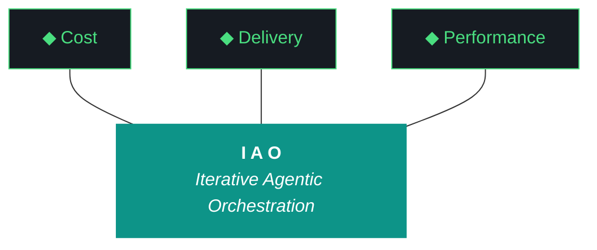

# kjtcom

**Cross-pipeline location intelligence platform built on Iterative Agentic Orchestration (IAO)**

[](https://flutter.dev)
[](https://firebase.google.com)
[](https://ai.google.dev)
[](https://claude.ai)
[](LICENSE)

---

kjtcom extracts entities from YouTube playlists - landmarks, trails, restaurants, destinations - and normalizes them into Thompson Indicator Fields (`t_any_*` universal indicator fields) modeled after [Panther SIEM's](https://docs.panther.com/search/panther-fields) `p_any_*` fields and [Elastic Common Schema](https://www.elastic.co/guide/en/ecs/current/index.html). Three live pipelines serve 6,181 geocoded entities through a unified Flutter Web frontend with a functional NoSQL query system, case-insensitive search, `contains` and `contains-any` operators, result counts, entity detail panel, and cross-dataset query at [kylejeromethompson.com](https://kylejeromethompson.com).

The same normalization patterns power production SIEM migrations at [TachTech Engineering](https://tachtech.net). Built entirely by LLM agents using IAO (Iterative Agentic Orchestration) - a methodology distilled from 48+ production iterations on [TripleDB](https://github.com/TachTech-Engineering/tripledb).

**[kylejeromethompson.com](https://kylejeromethompson.com)** | **Phase 9 v9.32** | **Status: Phase 9 App Optimization IN PROGRESS**

---

## Live App

**[kylejeromethompson.com](https://kylejeromethompson.com)** - Search 6,181 geocoded entities across 3 pipelines:

- **NoSQL query editor** with syntax highlighting, case-insensitive search, `contains` and `contains-any` operators
- **Paginated results** - 20/50/100 per page with page navigation (default 20)
- **Entity detail panel** with t_any_* field cards, Google Places enrichment data, +filter/-exclude query builders
- **Pipeline-colored results** - CalGold (gold), RickSteves (blue), TripleDB (red)
- **Map tab** - OpenStreetMap with pipeline-colored entity markers, click to open detail panel
- **Globe tab** - Stats dashboard with continent cards + country grid, click to filter results
- **IAO tab** - Methodology showcase with trident graphic and 10 pillar cards
- **Gotcha tab** - Full gotcha registry (G1-G44) with status badges, filter toggle (All/Active/Resolved)
- **Schema tab** - 22 Thompson Indicator Fields with query builder - click any field to add it to the query editor
- **Query autocomplete** - Field name suggestions (type `t_any_`) and value suggestions (type inside quotes) from precomputed index
- **Clear button** - Clear query, results, and selected entity with one click
- **Copy JSON** - One-click copy of full entity JSON from detail panel with clipboard confirmation
- **Gothic/cyber visual identity** - Cinzel font headers, green-glow borders, dark SIEM base

---

## Architecture

```
YouTube Playlist (per pipeline)
    | yt-dlp
    v
MP3 Audio
    | faster-whisper (CUDA)
    v
Timestamped Transcripts
    | Gemini 2.5 Flash API + pipeline extraction prompt
    v
Raw Extracted JSON
    | phase4_normalize.py + schema.json (Thompson Indicator Fields)
    v
Normalized JSONL (t_any_* indicator fields populated)
    | Nominatim (1 req/sec)
    v
Geocoded JSONL
    | Google Places API (New)
    v
Enriched JSONL (t_enrichment.google_places + t_enrichment.nominatim)
    | Firebase Admin SDK
    v
Cloud Firestore (kjtcom-c78cd, Blaze)
    | Cloud Functions (search API) + Flutter Web
    v
kylejeromethompson.com
```

### App Query Flow

```
Query Editor (syntax-highlighted input)
    | QueryClause parser (tokenizer + field validation)
    v
Parsed Clauses (field, operator, value)
    | Firestore Provider (Riverpod)
    v
Server-side Query (first clause -> arrayContains / arrayContainsAny)
    | Cloud Firestore
    v
All Matching Results
    | Client-side filtering (additional clauses)
    v
Results Table + Detail Panel
```

---

## Data Architecture

kjtcom utilizes a **single-collection Firestore design** where all entities from all pipelines live together in a single `locations` collection. This allows for unified, cross-dataset search.

- **Discriminator**: The `t_log_type` field acts as the discriminator to filter by pipeline (e.g., `calgold`, `ricksteves`).
- **Querying**: Extensive use of `array-contains` queries enables searching across multiple attributes (keywords, categories, regions) without rigid schemas.
- **Indexes**: Composite indexes are defined in `firestore.indexes.json` to support multi-field filtering and sorting.
- **Environments**: A multi-database setup (`(default)` for production, `staging` for pipeline runs) safely separates work in progress.
- **Pricing**: Powered by the Firebase Blaze plan to support Cloud Functions and multi-database architectures.
- **Enforcement**: The field convention is enforced purely by the pipeline scripts (specifically `phase4_normalize.py`), not by the database itself.

---

## Thompson Indicator Fields (`t_any_*`)

The Thompson Indicator Fields provide universal indicator fields across all pipeline datasets - the same pattern SIEM platforms use to normalize disparate log sources into a single queryable schema.

**Standard Fields** (present on every document):

| Field | Type | Description |
|-------|------|-------------|
| `t_log_type` | string | Pipeline ID (discriminator) |
| `t_row_id` | string | Unique entity ID |
| `t_event_time` | timestamp | Source event time |
| `t_parse_time` | timestamp | Pipeline processing time (UTC) |
| `t_source_label` | string | Human-readable pipeline name |
| `t_schema_version` | int | Schema version for this pipeline |

**Indicator Fields** (universal cross-pipeline arrays):

| Field | Type | Description | Examples |
|-------|------|-------------|----------|
| `t_any_names` | array[string] | All entity names | `["eiffel tower", "la tour eiffel"]` |
| `t_any_people` | array[string] | All people mentioned | `["rick steves", "huell howser"]` |
| `t_any_cities` | array[string] | All city names | `["paris", "los angeles"]` |
| `t_any_states` | array[string] | All state abbreviations | `["ca", "ny"]` |
| `t_any_counties` | array[string] | All county names | `["los angeles county"]` |
| `t_any_countries` | array[string] | All country names (v2) | `["france", "us"]` |
| `t_any_country_codes` | array[string] | ISO 3166-1 alpha-2 codes (v8.24) | `["fr", "it", "us"]` |
| `t_any_regions` | array[string] | Sub-country regions (v2) | `["bavaria", "tuscany"]` |
| `t_any_coordinates` | array[map] | All lat/lon pairs | `[{"lat": 48.85, "lon": 2.29}]` |
| `t_any_geohashes` | array[string] | Geohash prefixes for proximity | `["u09t", "u09tv"]` |
| `t_any_keywords` | array[string] | All searchable terms | `["gothic", "museum", "art"]` |
| `t_any_categories` | array[string] | Normalized category tags | `["landmark", "restaurant"]` |
| `t_any_actors` | array[string] | Named people featured (v3) | `["rick steves", "local guide"]` |
| `t_any_roles` | array[string] | Normalized role types (v3) | `["host", "guide", "historian"]` |
| `t_any_shows` | array[string] | Show name(s) (v3) | `["rick steves' europe", "california's gold"]` |
| `t_any_cuisines` | array[string] | Cuisine categories (v3) | `["french", "italian"]` |
| `t_any_dishes` | array[string] | Specific food items (v3) | `["croissant", "paella"]` |
| `t_any_eras` | array[string] | Historical periods mentioned (v3) | `["medieval", "roman"]` |
| `t_any_continents` | array[string] | Continent(s) (v3) | `["europe", "asia"]` |
| `t_any_urls` | array[string] | Associated URLs | `["https://example.com"]` |
| `t_any_video_ids` | array[string] | Source YouTube video IDs | `["dQw4w9WgXcQ"]` |

**Enrichment** (`t_enrichment.*`): Google Places ratings, open/closed status, websites. Nominatim geocoding. Extensible to any enrichment source via named keys.

**Source** (`source.*`): Pipeline-specific raw data. Schema varies per pipeline, defined in `pipeline/config/{pipeline_id}/schema.json`.

---

## Pipelines

| Pipeline (`t_log_type`) | Source | Entity Type | Videos | Entities | Status |
|-------------------------|--------|-------------|--------|----------|--------|
| `calgold` | California's Gold (Huell Howser) | landmark | 390 | 899 | Phase 7 Production DONE |
| `ricksteves` | Rick Steves' Europe | destination | 1,865 | 4,182 | Phase 7 Production DONE |
| `tripledb` | Diners, Drive-Ins and Dives | restaurant | 805 | 1,100 | Phase 7 Production DONE |
| `bourdain` | Anthony Bourdain: Parts Unknown | destination | 104 | - | Pending onboarding |

Each pipeline requires only 4 config files - no code changes to shared scripts:

```
pipeline/config/{pipeline_id}/
  pipeline.json           # metadata (display name, entity type, icon, color)
  schema.json             # Thompson Indicator Fields indicator mappings
  extraction_prompt.md    # Gemini Flash extraction prompt
  playlist_urls.txt       # YouTube video IDs
```

---

## Query System

The NoSQL query editor supports structured queries against Thompson Indicator Fields:

**Operators:**
- `contains` - array membership (e.g., `t_any_cuisines contains "french"`)
- `contains-any` - array membership for multiple values (e.g., `t_any_cuisines contains-any ["mexican", "italian"]`)
- `==` - equality (e.g., `t_log_type == "tripledb"`)
- `!=` - exclusion (e.g., `t_log_type != "calgold"`) - server-side for scalar, client-side for array

**Features:**
- Case-insensitive search (all values lowercased before dispatch)
- Syntax highlighting (5-color tokenizer: field/operator/value/keyword/collection)
- Result count badge showing true total (no query limit)
- Multi-clause queries (first clause server-side, additional client-side)
- Field validation against 22 known fields
- Parse error feedback for malformed input
- +filter/-exclude buttons in detail panel append to query (dedup prevents duplicate clauses)
- Field name autocomplete (type `t_any_` for suggestions, Tab to accept)
- Value autocomplete inside quotes (precomputed index with 21 fields, 6,878 distinct values)

**Example queries:**

```
locations
| where t_any_cuisines contains "french"

locations
| where t_any_countries contains "italy"

locations
| where t_any_continents contains "europe"

locations
| where t_any_categories contains "restaurant"

locations
| where t_any_cuisines contains-any ["mexican", "italian"]

locations
| where t_log_type == "calgold"

locations
| where t_any_country_codes contains "fr"

locations
| where t_any_keywords contains "museum"
```

---

## IAO Methodology

kjtcom is built using the Iterative Agentic Orchestration (IAO) methodology - a structured approach to running AI coding agents (Claude Code, Gemini CLI) against multi-phase data pipelines with zero-to-minimal human intervention. Distilled from 48+ production iterations on [TripleDB](https://github.com/TachTech-Engineering/tripledb).

IAO maps directly to the "harness engineering" pattern formalized by LangChain, Anthropic, and the broader agent ecosystem in 2026. The core principle: the model contains the intelligence; the harness makes it useful.

### IAO Components

| Component | Purpose | Implementation |
|-----------|---------|----------------|
| Agent Instructions | System prompt per agent | CLAUDE.md, GEMINI.md |
| Pipeline Scripts | Tool definitions | phase1_acquire.py through phase7_load.py |
| Gotcha Registry | Executable middleware (failure prevention) | G1-G44 documented patterns |
| Checkpoint Files | State persistence across agent handoffs | .checkpoint_enrich.json, handoff JSON |
| 4-Artifact Output | Trace analysis and improvement loop | build log, report, changelog, README |
| Split-Agent Model | Cross-provider subagent delegation | Gemini CLI (phases 1-5) + Claude Code (phases 6-7) |

### Split-Agent Execution

kjtcom uses a two-agent model validated across 5+ iterations with decreasing interventions:

- **Gemini CLI** (`gemini --yolo`): Phases 1-5 (acquire, transcribe, extract, normalize, geocode). Free-tier execution for mechanical pipeline work.
- **Claude Code** (`claude --dangerously-skip-permissions`): Phases 6-7 (enrich, load to Firestore) + post-flight validation and artifact production.
- **tmux runner** (`group_b_runner.sh`): Unattended production runs (Phase 5+) replace Gemini CLI for phases 1-5 when no agent reasoning is needed.
- **Handoff:** Gemini produces a checkpoint JSON consumed by Claude. Cross-provider subagent delegation.

**Agent performance across iterations:**

| Iteration | Phases 1-5 Executor | Ph 1-5 Interventions | Claude Interventions |
|-----------|---------------------|---------------------|---------------------|
| v2.9 | Gemini CLI | 3 | N/A (Gemini only) |
| v3.10 | Gemini CLI | 0 | 0 |
| v3.11 | Gemini CLI | 0 | 0 |
| v4.12 | Gemini CLI | 0 | 1 |
| v4.13 | Gemini CLI | 0 | 1 |
| v5.14 | tmux | 1 (CUDA OOM) | 0 |

Zero Gemini interventions across 4 consecutive iterations. Same model, better harness.

---



**Pillar 1 - The IAO Trident.** Every decision is governed by three competing objectives: minimal cost (free-tier LLMs over paid, API scripts over SaaS add-ons, no infrastructure that outlives its purpose), optimized performance (right-size the solution, performance from discovery and proof-of-value testing, not premature abstraction), and speed of delivery (code and objectives become stale, P0 ships, P1 ships if time allows, P2 is post-launch). Cheapest is rarely fastest. Fastest is rarely most optimized. The methodology finds the triangle's center of gravity for each decision.

**Pillar 2 - Artifact Loop.** Every iteration produces four artifacts: design doc (living architecture), plan (execution steps), build log (session transcript), report (metrics + recommendation). Previous artifacts archive to docs/archive/. Agents never see outdated instructions. If an artifact has no consumer, it should not exist.

**Pillar 3 - Diligence.** The methodology does not work if you do not read. Before any iteration touches code, the plan goes through revision - often several revisions. Diligence is investing 30 minutes in plan revision to save 3 hours of misdirected agent execution. The fastest path is the one that doesn't require rework.

**Pillar 4 - Pre-Flight Verification.** Before execution begins, validate: previous docs archived, new design + plan in place, agent instructions updated, git clean, API keys set, build tools verified. Pre-flight failures are the cheapest failures.

**Pillar 5 - Agentic Harness Orchestration.** The primary agent (Claude Code or Gemini CLI) orchestrates LLMs, MCP servers, scripts, APIs, and sub-agents within a structured harness. Agent instructions are system prompts (CLAUDE.md / GEMINI.md). Pipeline scripts are tools. Gotchas are middleware. Agents CAN build and deploy. Agents CANNOT git commit or sudo. The human commits at phase boundaries.

**Pillar 6 - Zero-Intervention Target.** Every question the agent asks during execution is a failure in the plan document. Pre-answer every decision point. Execute agents in YOLO mode, trust but verify. Measure plan quality by counting interventions - zero is the floor.

**Pillar 7 - Self-Healing Execution.** Errors are inevitable. Diagnose -> fix -> re-run. Max 3 attempts per error, then log and skip. Checkpoint after every completed step for crash recovery. Gotcha registry documents known failure patterns so the same error never causes an intervention twice.

**Pillar 8 - Phase Graduation.** Four iterative phases progressively harden the pipeline harness until production requires zero agent intervention. The agent built the harness; the harness runs the work.

**Pillar 9 - Post-Flight Functional Testing.** Three tiers: Tier 1 (app bootstraps, console clean, artifacts produced), Tier 2 (iteration-specific playbook), Tier 3 (hardening audit - Lighthouse, security headers, browser compat).

**Pillar 10 - Continuous Improvement.** The methodology evolves alongside the project. Retrospectives, gotcha registry reviews, tool efficacy reports, trident rebalancing. Static processes atrophy.

---

## Project Status

| Phase | Name | Status | Iteration |
|-------|------|--------|-----------|
| 0 | Scaffold & Environment | DONE | v0.5 |
| 1 | Discovery (30 videos) | DONE | v1.6, v1.7 |
| 2 | Calibration (60 videos) | DONE | v2.8, v2.9 |
| 3 | Stress Test (90 videos) | DONE | v3.10, v3.11 |
| 4 | Validation + Schema v3 (120 videos) | DONE | v4.12, v4.13 |
| 5 | Production Run (full datasets) | DONE | v5.14 |
| 6 | Flutter App | DONE | v6.15-v6.20 |
| 7 | Firestore Load | DONE | v7.21 |
| 8 | Enrichment Hardening | DONE | v8.22-v8.26 |
| 9 | App Optimization | IN PROGRESS | v9.27-v9.32 |
| 10 | Retrospective + Template | Pending | - |

---

## Tech Stack

| Component | Tool | Purpose |
|-----------|------|---------|
| Audio Download | yt-dlp | YouTube -> mp3 |
| Transcription | faster-whisper (CUDA) | mp3 -> timestamped JSON |
| Extraction | Gemini 2.5 Flash API | Transcript -> structured entity JSON |
| Normalization | Python + schema.json | Raw JSON -> Thompson Indicator Fields (t_any_*) |
| Geocoding | Nominatim (OSM) | Address/name -> lat/lon |
| Enrichment | Google Places API (New) | Rating, open/closed, website, phone |
| Database | Cloud Firestore (Blaze) | Denormalized documents, multi-database |
| Search API | Firebase Cloud Functions | Complex cross-dataset queries |
| Frontend | Flutter Web | Unified search, map, list views |
| Hosting | Firebase Hosting | CDN, preview channels, SSL |
| Orchestration | Claude Code (Opus) / Gemini CLI | IAO agent execution |

---

## Hardware

```
NZXTcos (Primary Dev)
CPU:  Intel Core i9-13900K (24-core, 5.8 GHz)
RAM:  64 GB DDR4
GPU:  NVIDIA GeForce RTX 2080 SUPER (8 GB VRAM)
OS:   CachyOS (Arch-based) / KDE Plasma 6.6.2 / Wayland

tsP3-cos (Secondary Dev)
CPU:  Intel Core i9 (ThinkStation P3 Ultra SFF G2)
OS:   CachyOS (Arch-based) / fish shell
```

---

## Cost

| Component | Cost |
|-----------|------|
| All local inference (transcription, normalization) | Free |
| Gemini 2.5 Flash API | Free tier |
| Nominatim geocoding | Free (OSM) |
| Google Places API | Free tier |
| Cloud Firestore (Blaze, pay-as-you-go) | ~$0.50/month |
| Cloud Functions | ~$0.40/month |
| Firebase Hosting | Free |
| **Total** | **~$1-3/month** |

---

## Future Directions

**Meta/Hyperagents integration.** Evaluated in v8.22. HyperAgents (Meta FAIR) for self-improving pipeline optimization is premature at current scale - deferred to Phase 10 retrospective where the IAO artifact loop provides natural fitness signals (extraction success rate, geocoding hit rate, enrichment match rate) that a hyperagent could optimize against.

**Multi-LLM pipeline stages.** Currently Gemini Flash handles extraction. Future iterations will benchmark extraction quality across Claude Sonnet, Gemini Flash, GPT-4o, and local models (Nemotron, Qwen) per pipeline. The schema.json already decouples extraction from normalization - swapping the LLM requires only changing the extraction prompt, not the normalization pipeline.

**Search optimization.** Algolia and Typesense evaluated in v8.22 - deferred unless fuzzy search or full-text search requirements emerge. Firestore-native `arrayContains` and `arrayContainsAny` are sufficient for 6,181 entities with the current query system. Revisit in Phase 9 if query latency becomes an issue.

**SIEM migration tooling.** The Thompson Indicator Fields normalization pipeline is structurally identical to SIEM log normalization. Each `schema.json` is a field mapping artifact - the same deliverable produced during Splunk-to-Panther or Splunk-to-CrowdStrike migrations. Future work explores generating these mappings automatically from source SIEM configurations.

---

## Changelog

**v9.32 (Phase 9 - Shows Fix + Operators + Detail Sort + Quote Rethink)**
- TripleDB t_any_shows lowercased (1,100 entities), comprehensive t_any_* lowercase (1,286/6,181) - G36 permanently resolved
- != operator (server-side scalar, client-side array), unquoted value parsing, no-quotes schema builder
- Detail panel fields sorted alphabetically, autocomplete updated for no-quotes approach
- 12/12 tests pass, 0 analyzer issues, 1 production deploy
- Claude Code interventions: 0

**v9.31 (Phase 9 - Persistent Bug Fix + Playwright Verification)**
- Diagnostic-first approach: 4 persistent bugs investigated with full file reads + grep
- 1000-result limit confirmed resolved via Playwright screenshot (6,181 entities)
- Autocomplete value-mode fix, quote cursor hardened, clear button added
- Playwright verification established (G47: CanvasKit blocks DOM interaction)
- Claude Code interventions: 0

**v9.30 (Phase 9 - App Optimization: Autocomplete + Quote Fix + Limit Verification)**
- Query field + value autocomplete from precomputed index (21 fields, 6,878 values)
- Fixed quote cursor placement via shared TextEditingController provider (G45 resolved)
- Confirmed Firestore limit removal, updated stats footer to 30 iterations
- Claude Code interventions: 0

**v9.29 (Phase 9 - App Optimization: UX Polish - Trident, Limits, Schema, Quotes)**
- Removed Firestore .limit(1000): all matching entities returned, full result counts
- Shortened trident labels for mobile: "Cost", "Delivery", "Performance"
- All 22 schema fields confirmed present
- Claude Code interventions: 0

**v9.28 (Phase 9 - App Optimization: Gotcha Tab + Schema Builder + JSON Copy)**
- 6 tabs: Results | Map | Globe | IAO | Gotcha | Schema
- Gotcha tab with 25 documented failure patterns, status badges, filter toggle
- Schema tab with 22 Thompson Indicator Fields and click-to-query builder
- Copy JSON button on entity detail panel with SnackBar confirmation
- Post-flight deploy testing standard established
- Claude Code interventions: 0

**v9.27 (Phase 9 - App Optimization: Visual Refresh + Tab Wiring)**
- All 4 tabs functional: Results | Map | Globe | IAO
- Gothic/cyber visual refresh: Cinzel font, green-glow borders, hover effects
- Map tab: OpenStreetMap + pipeline-colored markers, click to detail panel
- Globe tab: continent cards + country grid, click to filter results
- IAO tab: trident SVG + 10 pillar cards + stats footer
- Pagination: 20/50/100 dropdown + page navigation
- 2 production deploys. flutter analyze: 0 issues. 9/9 tests pass
- Claude Code interventions: 0

**v8.26 (Phase 8 - Gotcha Registry + Query UX Fix)**
- Removed rotating example queries: editor starts empty, static help text below editor
- Phase 8 COMPLETE across v8.22-v8.26
- Claude Code interventions: 0

**v8.25 (Phase 8 - Filter Fix + README Overhaul)**
- Fixed +filter/-exclude duplicate bug: dedup check + guard flag prevent multiple clauses per click
- Comprehensive README overhaul: Live App section, Query System section, updated project status
- Claude Code interventions: 0

**v8.24 (Phase 8 - UI Fixes + Country Codes)**
- Detail panel fixed: opens on row click at all viewports, shows t_any_* field cards with +filter/-exclude
- Backfilled t_any_country_codes (ISO alpha-2) on 6,161/6,181 entities
- Claude Code interventions: 0

**v8.23 (Phase 8 - NoSQL Query Remediation)**
- All 12 query defects resolved (11 fixed, 1 deferred): case sensitivity, data casing, result counts, truncation, contains-any, validation
- Claude Code interventions: 0

**v7.21 (Phase 7 - Firestore Load + TripleDB Migration)**
- 3 pipelines live in production: 6,181 entities (899 CalGold + 4,182 RickSteves + 1,100 TripleDB)
- TripleDB: cross-project Admin SDK migration from tripledb-e0f77, full schema v3 mapping
- 14 Google Places enrichment fields carried forward, deterministic dedup
- Claude Code interventions: 0

Full changelog: [docs/kjtcom-changelog.md](docs/kjtcom-changelog.md)

---

## Author

**Kyle Thompson** - VP of Engineering & Solutions Architect @ [TachTech Engineering](https://tachtech.net)

Built as a platform for extracting, normalizing, and querying structured data from YouTube content - sharpening the same data pipeline skills used in production SIEM migrations for Fortune 50 customers.

---

## Citing

If you find the IAO methodology or Thompson Indicator Fields useful:

```
@misc{thompson2026iao,
  title={Iterative Agentic Orchestration: A Methodology for Agent-Driven Software Projects},
  author={Kyle Thompson},
  year={2026},
  organization={TachTech Engineering},
  url={https://github.com/TachTech-Engineering/tripledb}
}
```
