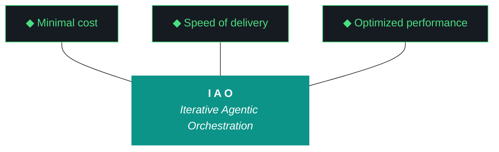
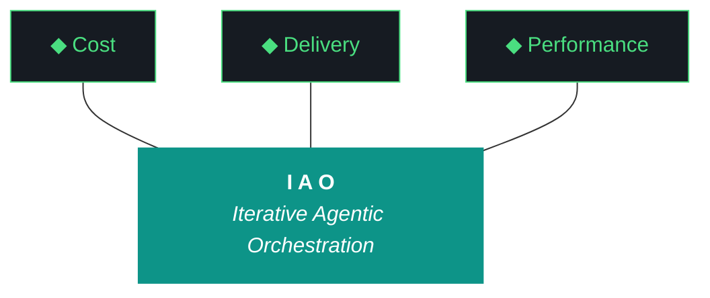

# kjtcom

**Cross-pipeline location intelligence platform built on Iterative Agentic Orchestration (IAO)**

[](https://flutter.dev)
[](https://firebase.google.com)
[](https://ai.google.dev)
[](https://claude.ai)
[](LICENSE)

---

kjtcom extracts entities from YouTube playlists - landmarks, trails, restaurants, destinations - and normalizes them into Thompson Indicator Fields (`t_any_*` universal indicator fields) modeled after [Panther SIEM's](https://docs.panther.com/search/panther-fields) `p_any_*` fields and [Elastic Common Schema](https://www.elastic.co/guide/en/ecs/current/index.html). Four live pipelines serve 6,181 production entities plus a fourth pipeline (Bourdain) complete in staging, through a unified Flutter Web frontend with a functional NoSQL query system, case-insensitive search, `contains` and `contains-any` operators, result counts, entity detail panel, and cross-dataset query at [kylejeromethompson.com](https://kylejeromethompson.com).

The same normalization patterns power production SIEM migrations at [TachTech Engineering](https://tachtech.net). Built entirely by LLM agents using IAO (Iterative Agentic Orchestration) - a methodology distilled from 46+ iterations across 10 phases on [TripleDB](https://github.com/TachTech-Engineering/tripledb).

**[kylejeromethompson.com](https://kylejeromethompson.com)** | **Phase 10 v10.64 (ACTIVE)** | **Status: Platform Hardening + Bourdain Phase 2 + Visual Verification (ADR-018) + Script Registry (ADR-017)**



### The Ten Pillars of IAO

1. **Trident Governance** - Cost / Delivery / Performance triangle governs every decision.
2. **Artifact Loop** - Design -> Plan (INPUT, immutable) -> Build -> Report (OUTPUT).
3. **Diligence** - Read before you code; pre-read is a middleware function.
4. **Pre-Flight Verification** - Validate the environment before execution.
5. **Agentic Harness Orchestration** - The harness is the product; the model is the engine.
6. **Zero-Intervention Target** - Interventions are failures in planning.
7. **Self-Healing Execution** - Max 3 retries per error with diagnostic feedback.
8. **Phase Graduation** - Sandbox -> staging -> production.
9. **Post-Flight Functional Testing** - Rigorous validation of all deliverables.
10. **Continuous Improvement** - Retrospectives feed directly into the next plan.

The harness, ADRs, evaluator, post-flight, and gotcha registry are the actual product. The Flutter app and YouTube pipelines are the data exhaust that proves the harness works. See `docs/evaluator-harness.md` (956 lines, v10.63), `docs/kjtcom-design-v10.63.md`, and `docs/kjtcom-plan-v10.63.md` for the current iteration's authoritative spec.

### v10.64 Component Review

Codebase component count vs Claw3D PCB chip count (v10.61 census = 49 chips across 4 boards):

- **Frontend (10 chips):** query_ed, results, detail, map, globe, iao, mw_tab, schema, claw3d, fb_host - all present. Query editor migrated to `flutter_code_editor` (G45).
- **Pipeline (9 chips):** yt_dlp, whisper, extract, normalize, geocode, enrich, load, tmux, checkpoint - all present. Hardened acquisition with failure logging and gap-fill.
- **Middleware (23 chips):** evaluator, harness, ADR, artifact, gotchas, scores, pre_flight, post_flight, router, tg_bot, rag, qwen_9b, nemotron, gflash, fb_mcp, c7_mcp, pw_mcp, fc_mcp, dart_mcp, claude, gemini, logger, openclaw - all present. Added `sync_script_registry` (ADR-017) and `iteration_deltas` (ADR-016).
- **Backend (7 chips):** firestore, prod_db, stg_db, calgold, ricksteves, tripledb, bourdain - all present. Bourdain Phase 2 in progress.

**v10.64 delta:** No new chips required. The new ADRs (016-018) and patterns (21-25) are extensions of existing middleware chips. Claw3D label migration (G69) is a visual-layer optimization.

### Data Architecture

- **Single Firestore `locations` collection** with `t_log_type` discriminator (`calgold`, `ricksteves`, `tripledb`, `bourdain`).
- **Multi-database:** `(default)` for production (6,181 entities), `staging` for in-flight pipeline work (537+ entities, Bourdain).
- **Project IDs:** `kjtcom-c78cd` (main), `tripledb-e0f77` (TripleDB source).
- **Schema:** Thompson Indicator Fields (`t_any_*`) - 19 v3 fields in production, 49 v4 candidate fields defined for the intranet rollout (ADR-011).

---

## Live App

**[kylejeromethompson.com](https://kylejeromethompson.com)** - Search 6,181 geocoded entities across 3 pipelines:

- **NoSQL query editor** with syntax highlighting, case-insensitive search, `contains` and `contains-any` operators
- **Paginated results** - 20/50/100 per page with page navigation (default 20)
- **Entity detail panel** with t_any_* field cards, Google Places enrichment data, +filter/-exclude query builders
- **Pipeline-colored results** - CalGold (gold), RickSteves (blue), TripleDB (red), Bourdain (purple)
- **Map tab** - OpenStreetMap with pipeline-colored entity markers, click to open detail panel
- **Globe tab** - Stats dashboard with continent cards + country grid, click to filter results
- **IAO tab** - Methodology showcase with trident graphic and 10 pillar cards
- **MW tab** - Middleware showcase: component registry from middleware_registry.json, resolved gotchas from gotcha_archive.json, agent roster, 7-phase pipeline overview
- **Schema tab** - 22 Thompson Indicator Fields with query builder - click any field to add it to the query editor
- **Inline autocomplete** - Panther-style suggestions rendered below the query text for field names (type `t_any_`) and values (type inside quotes)
- **Clear button** - Clear query, results, and selected entity with one click
- **Copy JSON** - One-click copy of full entity JSON from detail panel with clipboard confirmation
- **Interactive PCB Architecture (Claw3D)** - Three.js PCB visualization with 47+ IC chip components across 4 circuit boards, LED status indicators, hover tooltips, and click-to-zoom navigation
- **Gothic/cyber visual identity** - Cinzel font headers, green-glow borders, dark SIEM base

---

## Architecture

**[Interactive PCB Architecture Diagram](https://kylejeromethompson.com/claw3d.html)** | **[Interactive Architecture Diagram](https://kylejeromethompson.com/architecture.html)** | **[Telegram Bot](https://t.me/kjtcom_iao_bot)** | [Mermaid Source](docs/kjtcom-architecture.mmd)

Current state: v10.63 (Phase 10 ACTIVE) - 4 pipelines (3 production + Bourdain staging), 5 MCP servers (Firebase, Context7, Playwright, Firecrawl, Dart), 4 local LLMs (Qwen 9B, Nemotron 4B, GLM, Llama), RAG middleware (1,819 ChromaDB chunks), dual retrieval (Firestore + ChromaDB) via Gemini Flash 3-route intent router, Telegram bot (@kjtcom_iao_bot) with session memory and rating-aware queries, systemd service management, P3 event logging, post-flight verification (15 checks), artifact automation with computed Trident values, 727-line evaluator harness (docs/evaluator-harness.md) with three-tier fallback chain (Qwen -> Gemini Flash -> self-eval).

### PCB Layout (Claw3D)

The system is visualized as a 4-board PCB architecture:

1.  **Frontend (Teal):** Flutter Web application, Firebase Hosting, Query Editor, Map/Globe/IAO/MW/Schema tabs.
2.  **Pipeline (Amber):** Local GPU extraction cluster. `yt-dlp`, `faster-whisper` (CUDA), Gemini Flash extraction, Thompson Schema normalization, geocoding (Nominatim), enrichment (Google Places), and Firestore loading.
3.  **Middleware (Purple):** The orchestration hub. Intent router, RAG pipeline, Telegram bot, artifact automation, pre/post-flight checks, iao_logger, and the evaluator harness.
4.  **Backend (Blue):** Persistence and source data. Cloud Firestore (production + staging), ChromaDB (semantic index), and raw log sources.

### Pipeline Flow

```
YouTube Playlist (per pipeline)
    | yt-dlp
    v
MP3 Audio
    | faster-whisper (CUDA)
    v
Timestamped Transcripts
    | Gemini 2.5 Flash API + pipeline extraction prompt
    v
Raw Extracted JSON
    | phase4_normalize.py + schema.json (Thompson Indicator Fields)
    v
Normalized JSONL (t_any_* indicator fields populated)
    | Nominatim (1 req/sec)
    v
Geocoded JSONL
    | Google Places API (New)
    v
Enriched JSONL (t_enrichment.google_places + t_enrichment.nominatim)
    | Firebase Admin SDK
    v
Cloud Firestore (kjtcom-c78cd, Blaze)
    | Cloud Functions (search API) + Flutter Web
    v
kylejeromethompson.com
```

### App Query Flow

```
Query Editor (syntax-highlighted input)
    | QueryClause parser (tokenizer + field validation)
    v
Parsed Clauses (field, operator, value)
    | Firestore Provider (Riverpod)
    v
Server-side Query (first clause -> arrayContains / arrayContainsAny)
    | Cloud Firestore
    v
All Matching Results
    | Client-side filtering (additional clauses)
    v
Results Table + Detail Panel
```

---

## Data Architecture

kjtcom utilizes a **single-collection Firestore design** where all entities from all pipelines live together in a single `locations` collection. This allows for unified, cross-dataset search.

- **Discriminator**: The `t_log_type` field acts as the discriminator to filter by pipeline (e.g., `calgold`, `ricksteves`).
- **Querying**: Extensive use of `array-contains` queries enables searching across multiple attributes (keywords, categories, regions) without rigid schemas.
- **Indexes**: Composite indexes are defined in `firestore.indexes.json` to support multi-field filtering and sorting.
- **Environments**: A multi-database setup (`(default)` for production, `staging` for pipeline runs) safely separates work in progress.
- **Pricing**: Powered by the Firebase Blaze plan to support Cloud Functions and multi-database architectures.
- **Enforcement**: The field convention is enforced purely by the pipeline scripts (specifically `phase4_normalize.py`), not by the database itself.

---

## Thompson Indicator Fields (`t_any_*`)

The Thompson Indicator Fields provide universal indicator fields across all pipeline datasets - the same pattern SIEM platforms use to normalize disparate log sources into a single queryable schema.

**Standard Fields** (present on every document):

| Field | Type | Description |
|-------|------|-------------|
| `t_log_type` | string | Pipeline ID (discriminator) |
| `t_row_id` | string | Unique entity ID |
| `t_event_time` | timestamp | Source event time |
| `t_parse_time` | timestamp | Pipeline processing time (UTC) |
| `t_source_label` | string | Human-readable pipeline name |
| `t_schema_version` | int | Schema version for this pipeline |

**Indicator Fields** (universal cross-pipeline arrays):

| Field | Type | Description | Examples |
|-------|------|-------------|----------|
| `t_any_names` | array[string] | All entity names | `["eiffel tower", "la tour eiffel"]` |
| `t_any_people" | array[string] | All people mentioned | `["rick steves", "huell howser"]` |
| `t_any_cities` | array[string] | All city names | `["paris", "los angeles"]` |
| `t_any_states` | array[string] | All state abbreviations | `["ca", "ny"]` |
| `t_any_counties` | array[string] | All county names | `["los angeles county"]` |
| `t_any_countries` | array[string] | All country names (v2) | `["france", "us"]` |
| `t_any_country_codes` | array[string] | ISO 3166-1 alpha-2 codes (v8.24) | `["fr", "it", "us"]` |
| `t_any_regions` | array[string] | Sub-country regions (v2) | `["bavaria", "tuscany"]` |
| `t_any_coordinates` | array[map] | All lat/lon pairs | `[{"lat": 48.85, "lon": 2.29}]` |
| `t_any_geohashes` | array[string] | Geohash prefixes for proximity | `["u09t", "u09tv"]` |
| `t_any_keywords` | array[string] | All searchable terms | `["gothic", "museum", "art"]` |
| `t_any_categories` | array[string] | Normalized category tags | `["landmark", "restaurant"]` |
| `t_any_actors` | array[string] | Named people featured (v3) | `["rick steves", "local guide"]` |
| `t_any_roles` | array[string] | Normalized role types (v3) | `["host", "guide", "historian"]` |
| `t_any_shows` | array[string] | Show name(s) (v3) | `["rick steves' europe", "california's gold"]` |
| `t_any_cuisines` | array[string] | Cuisine categories (v3) | `["french", "italian"]` |
| `t_any_dishes` | array[string] | Specific food items (v3) | `["croissant", "paella"]` |
| `t_any_eras` | array[string] | Historical periods mentioned (v3) | `["medieval", "roman"]` |
| `t_any_continents` | array[string] | Continent(s) (v3) | `["europe", "asia"]` |
| `t_any_urls` | array[string] | Associated URLs | `["https://example.com"]` |
| `t_any_video_ids` | array[string] | Source YouTube video IDs | `["dQw4w9WgXcQ"]` |

**Thompson Schema v4 - Intranet Extensions (ADR-011)**

As the platform matures toward intranet intelligence, the Thompson Schema is expanding from purely location-based entities to include general organizational data. Version 4 introduces candidate fields for seven source types:

1.  **Documents:** `t_any_doc_type`, `t_any_authors`, `t_any_revisions`
2.  **Spreadsheets:** `t_any_sheet_names`, `t_any_formulas_detected`, `t_any_summary_values`
3.  **Meetings:** `t_any_attendees`, `t_any_action_items`, `t_any_recording_urls`
4.  **Email:** `t_any_sender`, `t_any_recipients`, `t_any_thread_ids`
5.  **Slack/Chat:** `t_any_channel_names`, `t_any_mentions`, `t_any_reaction_counts`
6.  **CRM:** `t_any_account_ids`, `t_any_opportunity_stages`, `t_any_contact_roles`
7.  **Contractor Portal:** `t_any_po_numbers`, `t_any_vendor_codes`, `t_any_deliverable_statuses`

**Universal v4 Fields:**
- `t_any_tags`: High-level semantic labels.
- `t_any_record_ids`: Cross-system foreign keys.
- `t_any_sources`: List of source systems contributing to the record.
- `t_any_sensitivity`: Data classification level (Public, Internal, Confidential, Restricted).

**Enrichment** (`t_enrichment.*`): Google Places ratings, open/closed status, websites. Nominatim geocoding. Extensible to any enrichment source via named keys.

**Source** (`source.*`): Pipeline-specific raw data. Schema varies per pipeline, defined in `pipeline/config/{pipeline_id}/schema.json`.

---

## Pipelines

| Pipeline (`t_log_type`) | Source | Color | Entity Type | Videos | Entities | Status |
|-------------------------|--------|-------|-------------|--------|----------|--------|
| `calgold` | California's Gold (Huell Howser) | #DA7E12 | landmark | 390 | 899 | Phase 7 Production DONE |
| `ricksteves` | Rick Steves' Europe | #3B82F6 | destination | 1,865 | 4,182 | Phase 7 Production DONE |
| `tripledb` | Diners, Drive-Ins and Dives | #DD3333 | restaurant | 805 | 1,100 | Phase 7 Production DONE |
| `bourdain` | Anthony Bourdain: No Reservations | #8B5CF6 | destination | 114 | 351 (staging) | Phase 4 Complete |

Each pipeline requires only 4 config files - no code changes to shared scripts:

```
pipeline/config/{pipeline_id}/
  pipeline.json           # metadata (display name, entity type, icon, color)
  schema.json             # Thompson Indicator Fields indicator mappings
  extraction_prompt.md    # Gemini Flash extraction prompt
  playlist_urls.txt       # YouTube video IDs
```

---

## Query System

The NoSQL query editor supports structured queries against Thompson Indicator Fields:

**Operators:**
- `contains` - array membership (e.g., `t_any_cuisines contains "french"`)
- `contains-any` - array membership for multiple values (e.g., `t_any_cuisines contains-any ["mexican", "italian"]`)
- `==` - equality (e.g., `t_log_type == "tripledb"`) - also used by +filter button
- `!=` - exclusion (e.g., `t_log_type != "calgold"`) - server-side for scalar, client-side for array, used by -exclude button

**Features:**
- Case-insensitive search (all values lowercased before dispatch)
- Syntax highlighting (5-color tokenizer: field/operator/value/keyword/collection)
- Result count badge showing true total (no query limit)
- Multi-clause queries (first clause server-side, additional client-side)
- Field validation against 22 known fields
- Parse error feedback for malformed input
- +filter/-exclude buttons in detail panel append to query (dedup prevents duplicate clauses)
- Field name autocomplete (type `t_any_` for suggestions, Tab to accept)
- Value autocomplete inside quotes (precomputed index with 21 fields, 6,878 distinct values)

**Example queries:**

```
locations
| where t_any_cuisines contains "french"

locations
| where t_any_countries contains "italy"

locations
| where t_any_continents contains "europe"

locations
| where t_any_categories contains "restaurant"

locations
| where t_any_cuisines contains-any ["mexican", "italian"]

locations
| where t_log_type == "calgold"

locations
| where t_any_country_codes contains "fr"

locations
| where t_any_keywords contains "museum"
```

---

## IAO Methodology

kjtcom is built using the Iterative Agentic Orchestration (IAO) methodology - a structured approach to running AI coding agents (Claude Code, Gemini CLI) against multi-phase data pipelines with zero-to-minimal human intervention. Distilled from 46+ iterations on [TripleDB](https://github.com/TachTech-Engineering/tripledb).

IAO maps directly to the "harness engineering" pattern formalized by LangChain, Anthropic, and the broader agent ecosystem in 2026. The core principle: the model contains the intelligence; the harness makes it useful.

### IAO Components

| Component | Purpose | Implementation |
|-----------|---------|----------------|
| Agent Instructions | System prompt per agent | CLAUDE.md, GEMINI.md |
| Pipeline Scripts | Tool definitions | phase1_acquire.py through phase7_load.py |
| Gotcha Registry | Executable middleware (failure prevention) | G1-G57 documented patterns |
| Checkpoint Files | State persistence across agent handoffs | .checkpoint_enrich.json, handoff JSON |
| 4-Artifact Output | Trace analysis and improvement loop | build log, report, changelog, README |
| Split-Agent Model | Cross-provider subagent delegation | Gemini CLI (phases 1-5) + Claude Code (phases 6-7) |

### Split-Agent Execution

kjtcom uses a two-agent model validated across 5+ iterations with decreasing interventions:

- **Gemini CLI** (`gemini --yolo`): Phases 1-5 (acquire, transcribe, extract, normalize, geocode). Free-tier execution for mechanical pipeline work.
- **Claude Code** (`claude --dangerously-skip-permissions`): Phases 6-7 (enrich, load to Firestore) + post-flight validation and artifact production.
- **tmux runner** (`group_b_runner.sh`): Unattended production runs (Phase 5+) replace Gemini CLI for phases 1-5 when no agent reasoning is needed.
- **Handoff:** Gemini produces a checkpoint JSON consumed by Claude. Cross-provider subagent delegation.

**Agent performance across iterations:**

| Iteration | Executor | Interventions | Notes |
|-----------|----------|---------------|-------|
| v10.59 | Gemini CLI | 0 | Bourdain Phase 4 (Final) complete |
| v10.58 | Claude Code | 0 | Bourdain Phase 3 complete |
| v10.57 | Claude Code | 0 | G56 Resolution + PCB Viz |
| v10.56 | Claude Code | 0 | Evaluator Fallback chain |
| v5.14 | tmux | 1 | CUDA OOM |

Zero Gemini interventions across 4 consecutive iterations. Same model, better harness.

---



---

## Project History & Evolution

kjtcom's development is a case study in the evolution of agentic workflows, progressing from simple automated scripts to a complex, multi-agent orchestration harness.

### Phase 1-3: The Foundational Layer
Initial development focused on the mechanical challenges of processing high-volume video data. We established the `yt-dlp` -> `faster-whisper` -> `Gemini` pipeline. The Thompson Schema v1 was a minimal set of fields designed purely for geocoding. During this phase, we discovered the "LD_LIBRARY_PATH" gotcha (G2), which became the first entry in our middleware registry.

### Phase 4-5: Schema Hardening & Production Scale
With the launch of the Rick Steves pipeline, the system was pushed to its limits. Schema v3 introduced rich fields like `cuisines`, `dishes`, and `actors`. We migrated to a split-agent model, discovering that Gemini CLI excelled at the high-volume mechanical phases (1-5), while Claude Code was superior for complex logic and documentation tasks (Phases 6-7). This handoff protocol was codified in ADR-003.

### Phase 6-7: The UI Shift
Phase 6 marked the transition from a CLI-only project to a production web application. We built the Flutter frontend, implementing a dark SIEM aesthetic inspired by professional security platforms. The query editor was developed from scratch, supporting NoSQL-style pipes and case-insensitive search. This phase saw the creation of the first production-grade composite indexes in Firestore.

### Phase 8-9: Optimization & Middleware
The focus shifted from data volume to query performance and UX polish. We implemented client-side post-filtering to bypass Firestore's single `array-contains` limitation (G34). The middleware layer was formalized, including the RAG pipeline (ChromaDB), the Telegram bot interface, and the first version of the Qwen-based evaluator.

### Phase 10: Platform Hardening
The current phase focuses on making the system portable and robust. We introduced the PCB architecture visualization (Claw3D) to replace the abstract solar system model. ADR-010 and ADR-011 established the technical path for taking the Thompson Schema beyond YouTube data and into enterprise intranet environments. The Bourdain pipeline serves as the final stress test for the Phase 10 harness.

---

## IAO Pillars (The Operating Manual)

**Pillar 1 - The IAO Trident.** Every decision is governed by three competing objectives:
- **Cost:** Minimal cost through free-tier LLMs, local inference, and efficient API usage. Infrastructure must not outlive its purpose.
- **Performance:** Optimized performance derived from discovery and proof-of-value testing. Avoid premature abstraction.
- **Delivery:** Speed of delivery is prioritized via a P0/P1/P2/P3 prioritization framework. Shipping P0 is the definition of success.

**Pillar 2 - Artifact Loop.** Every iteration produces four mandatory artifacts:
- **Design Doc:** The living architecture and single source of truth for the iteration's goals.
- **Plan:** Granular, step-by-step execution path with pre-answered decision points.
- **Build Log:** The full session transcript, providing a complete audit trail of agent actions.
- **Report:** Quantitative metrics, workstream scores, and "What Could Be Better" recommendations.

**Pillar 3 - Diligence (P3).** Verify all assumptions before acting.
- Log all agent communications to `data/iao_event_log.jsonl`.
- Read entire files before editing to maintain contextual integrity.
- `grep` for all related patterns to ensure surgical changes don't cause side effects.
- Diligence is investing time in planning to save hours of misdirected execution.

**Pillar 4 - Pre-Flight Verification.**
- Validate environment readiness: previous docs archived, design/plan in place, API keys set.
- Check build tools and dependencies.
- Pre-flight failures are the cheapest and most preventable failures in the system.

**Pillar 5 - Agentic Harness Orchestration.**
- The primary agent (Claude or Gemini) orchestrates a fleet of tools, scripts, and sub-agents.
- Instructions are codified in system prompts (CLAUDE.md / GEMINI.md).
- Pipeline scripts are treated as tools in the agent's belt.
- Gotchas are implemented as executable middleware.

**Pillar 6 - Zero-Intervention Target.**
- Every user question is a bug in the plan.
- Execute agents in YOLO mode to test the limits of the harness.
- Measure plan quality by the inverse of the intervention count. Zero is the floor.

**Pillar 7 - Self-Healing Execution.**
- Errors are expected. The harness must provide diagnostic pathing.
- Max 3 attempts per error before logging and skipping.
- Checkpoints at every pipeline stage ensure recovery from crashes or timeouts.

**Pillar 8 - Phase Graduation.**
- Progress through four stages: Discovery, Calibration, Stress Test, and Production Run.
- Each phase progressively hardens the harness until the agent building it is no longer required for its execution.

**Pillar 9 - Post-Flight Functional Testing.**
- Tier 1: App bootstraps, console is clean, all artifacts produced.
- Tier 2: Iteration-specific playbook validation (testing the specific features built).
- Tier 3: Hardening audit (Lighthouse, security headers, browser compatibility).

**Pillar 10 - Continuous Improvement.**
- The methodology is the product.
- Use evaluator middleware (Qwen) to provide objective, skeptical scoring.
- Maintain an agent leaderboard to track multi-model performance over time.
- Static processes atrophy; the harness must evolve with every iteration.

---

## Project Status

| Phase | Name | Status | Iteration |
|-------|------|--------|-----------|
| 0 | Scaffold & Environment | DONE | v0.5 |
| 1 | Discovery (30 videos) | DONE | v1.6, v1.7 |
| 2 | Calibration (60 videos) | DONE | v2.8, v2.9 |
| 3 | Stress Test (90 videos) | DONE | v3.10, v3.11 |
| 4 | Validation + Schema v3 (120 videos) | DONE | v4.12, v4.13 |
| 5 | Production Run (full datasets) | DONE | v5.14 |
| 6 | Flutter App | DONE | v6.15-v6.20 |
| 7 | Firestore Load | DONE | v7.21 |
| 8 | Enrichment Hardening | DONE | v8.22-v8.26 |
| 9 | App Optimization | DONE | v9.27-v9.53 |
| 10 | Bourdain Pipeline + Platform Hardening | ACTIVE | v10.54-v10.59 |

---

## Tech Stack

| Component | Tool | Purpose | Detailed Usage |
|-----------|------|---------|----------------|
| Audio Download | `yt-dlp` | YouTube -> mp3 | Primary tool for acquiring high-quality audio streams from YouTube playlists. Configured to extract only audio in mp3 format at 192kbps or higher for optimal transcription fidelity. |
| Transcription | `faster-whisper` | mp3 -> timestamped JSON | A high-performance implementation of OpenAI's Whisper model using CTranslate2. Runs locally on NVIDIA CUDA (RTX 2080 SUPER) for ultra-fast, accurate speech-to-text with word-level timestamps. |
| Extraction | Gemini 2.5 Flash API | Transcript -> JSON | The primary reasoning engine for entity extraction. Utilizes deep contextual understanding to identify locations, people, and roles from complex travel show transcripts. |
| Normalization | Python + `schema.json` | Raw JSON -> Thompson Fields | A custom normalization pipeline that maps disparate source fields to a unified `t_any_*` schema. Ensures consistency across all log sources for cross-dataset querying. |
| Geocoding | Nominatim (OSM) | Address/name -> lat/lon | Open-source geocoding service powered by OpenStreetMap data. Used as the primary layer for translating entity names into geographic coordinates with a 1 req/sec rate limit. |
| Enrichment | Google Places API (New) | Rating, reviews, metadata | Provides high-fidelity metadata including business ratings, user reviews, official websites, and phone numbers. Used to backfill coordinates when Nominatim fails. |
| County Enrichment | Nominatim Reverse | Coordinates -> county | Uses reverse geocoding to identify the specific county/administrative region for every entity, enabling more granular regional filtering. |
| Database | Cloud Firestore (Blaze) | Document Store | A scalable, NoSQL cloud database that serves as the production and staging backend. Utilizes `array-contains` indexes for high-performance cross-field searching. |
| Search API | Firebase Functions | Query Logic | Node.js Cloud Functions that handle complex query parsing and multi-database routing. Provides a clean API for the Flutter frontend to consume. |
| Frontend | Flutter Web | UI/UX Hub | A rich, single-page application built with Flutter. Features a Gothic/SIEM visual identity, interactive map, globe dashboard, and a custom NoSQL query editor. |
| Hosting | Firebase Hosting | Production CDN | Globally distributed content delivery network with automated SSL management. Serves the Flutter web build and static Three.js visualizations. |
| Orchestration | Claude Code / Gemini CLI | Agentic Execution | The core "thinking" layer where IAO-compatible agents execute pipeline scripts, manage state, and produce documentation artifacts. |
| Intent Router | Gemini 2.5 Flash | Query Classification | A specialized agentic route that classifies incoming Telegram or web queries into three paths: entity lookup, RAG retrieval, or web search. |
| RAG | ChromaDB | Semantic Memory | An open-source vector database storing 1,819 chunks of project history. Uses `nomic-embed-text` for semantic indexing of all design docs, logs, and ADRs. |
| Telegram Bot | `python-telegram-bot` | Mobile Access | A mobile interface managed via `systemd`. Supports natural language questions, status checks, and multi-route retrieval via the Intent Router. |
| Web Search | Brave Search API | Real-time Context | Provides the system with the ability to search the live web for information outside its static knowledge base or vector memory. |
| Local LLMs | Ollama | Evaluation & Triage | Orchestrates local models including Qwen 9B for evaluation, Nemotron 4B for code review, and GLM for vision-related tasks. |
| Evaluation | Qwen 3.5 9B | Self-Correction | The primary skeptic in the three-tier evaluator chain. Scores every iteration based on evidence gathered during the build process. |
| Event Logging | `iao_logger.py` | P3 Audit Trail | A mandatory logging middleware that captures every agent action, LLM input/output, and tool call into a structured JSONL stream. |
| Artifact Automation | `generate_artifacts.py` | Doc Generation | Automates the production of build logs, evaluation reports, and changelogs. Ensures project documentation is always in sync with actual execution. |
| 3D Visualization | Three.js (Claw3D) | Architecture Viz | An interactive 3D circuit board visualization that displays the live status and connections of every system component. |

---

## Hardware

```
NZXTcos (Primary Dev)
CPU:  Intel Core i9-13900K (24-core, 5.8 GHz)
RAM:  64 GB DDR4
GPU:  NVIDIA GeForce RTX 2080 SUPER (8 GB VRAM)
OS:   CachyOS (Arch-based) / KDE Plasma 6.6.2 / Wayland

tsP3-cos (Secondary Dev)
CPU:  Intel Core i9 (ThinkStation P3 Ultra SFF G2)
OS:   CachyOS (Arch-based) / fish shell
```

---

## Cost

| Component | Cost |
|-----------|------|
| All local inference (transcription, normalization) | Free |
| Gemini 2.5 Flash API | Free tier |
| Nominatim geocoding | Free (OSM) |
| Google Places API | Free tier |
| Cloud Firestore (Blaze, pay-as-you-go) | ~$0.50/month |
| Cloud Functions | ~$0.40/month |
| Firebase Hosting | Free |
| **Total** | **~$1-3/month** |

---

## Future Directions

**Hyper-Agent Optimization (v11+).** Evaluated in v8.22. We are moving toward a self-improving pipeline where a meta-agent monitors performance metrics (extraction success, geocoding accuracy, enrichment rate) and automatically tunes prompts or switches models to optimize output quality.

**Multi-Model Extraction Benchmarking.** While Gemini Flash is currently the primary extractor, future phases will implement a "Consensus Extraction" model where Gemini, Claude, and GPT-4o outputs are cross-referenced to achieve near-100% extraction accuracy for high-value datasets.

**SIEM-Native Integration.** The Thompson Indicator Fields are being evolved to be 100% compatible with the Panther SIEM schema. This will enable kjtcom to act as a "shadow SIEM" for location intelligence, where entities can be queried alongside traditional security logs.

**Intranet Intelligence (ADR-011).** Expanding the platform to normalize and query non-location data, such as internal documentation, Slack communications, and CRM records, using the Thompson Schema v4 extensions. This transforms kjtcom from a travel intelligence tool into a general-purpose organizational brain.

**GCP Intranet Portability (ADR-010).** Hardening the pipeline for deployment into air-gapped or private cloud environments (GCP TachTech-Intranet). This includes localizing all external API dependencies (where possible) and utilizing private Pub/Sub topic routing.

**Real-Time Audio Streams.** Moving beyond batch YouTube playlists to support real-time audio ingestion from live streams or recordings, enabling "live intelligence" extraction as events happen.

---

## Telegram Bot

**[@kjtcom_iao_bot](https://t.me/kjtcom_iao_bot)** - Query 6,181 entities via Telegram:

- `/ask [question]` - natural language queries routed to Firestore, ChromaDB, or web
- `/status` - system health check
- `/search [query]` - Brave Search web lookup
- `/help` - command reference

Features: session memory (10-min context window), rating-aware queries ("top 3 highest rated in LA"), 3-route intent classification via Gemini Flash, systemd managed with auto-restart.

---

## Middleware

The middleware layer is the portable IAO infrastructure that stamps onto new projects. See [middleware_registry.json](data/middleware_registry.json) for the full component catalog.

### Architecture Decision Records (ADRs)

| ADR | Title | Status | Description |
|-----|-------|--------|-------------|
| ADR-001 | Thompson Schema v1 | SUPERSEDED | Initial universal indicator field definition (t_any_*). Established the pattern of normalizing disparate source fields into a unified queryable layer. Focus was on basic location data (names, cities, coordinates). |
| ADR-002 | Multi-Database Setup | ACTIVE | Implementation of production (`(default)`) and `staging` databases in Firestore. Ensures pipeline runs do not corrupt production data until validated. Enabled by Firebase multi-database support in late 2024. |
| ADR-003 | Split-Agent Model | ACTIVE | Handoff protocol between Gemini CLI (Phases 1-5, mechanical/high-volume) and Claude Code (Phases 6-7, reasoning/artifact production). Uses JSON checkpoints for state persistence and context compression. |
| ADR-004 | P3 Diligence Logging | ACTIVE | Mandatory structured event logging for all agent actions. Every LLM call, tool call, and system command is recorded to `iao_event_log.jsonl`. Enables post-iteration analysis and computed metrics. |
| ADR-005 | Post-Flight Verification | ACTIVE | 15+ automated checks executed by `scripts/post_flight.py`. Validates site availability, entity counts, schema integrity, and static asset existence before marking an iteration complete. |
| ADR-006 | RAG Pipeline | ACTIVE | 1,819 ChromaDB chunks generated from project documentation, changelogs, and ADRs. Enables project-aware synthesis for the Telegram bot and developer assistance. |
| ADR-007 | Three-Tier Evaluator | ACTIVE | Fallback chain (Qwen -> Gemini Flash -> Self-eval). Protects against local inference failure or schema non-compliance. Ensures every iteration receives a score and report. |
| ADR-008 | G56 Preventive Check | ACTIVE | Elimination of external JSON fetches in web static assets. All data must be inlined as JavaScript objects in `claw3d.html` to prevent 404 errors on production hosting. |
| ADR-009 | PCB Visualization | ACTIVE | Migration from solar system metaphor to PCB architecture for system visualization. Better aligns with the "hardware/harness" engineering philosophy of IAO. |
| ADR-010 | GCP Portability | ACTIVE | Pipeline/middleware portable to GCP tachnet-intranet. Two pipeline configs tracked per-source. Pub/sub topic router for downstream consumers. Enables "private Cloud" deployment. |
| ADR-011 | Thompson Schema v4 | DRAFT | 30 candidate fields for intranet source normalization. Extends the schema beyond location data to include documents, spreadsheets, meetings, email, Slack, CRM, and contractor portal records. |

### Evaluator Fallback Chain

1.  **Tier 1: Qwen3.5-9B (Local)** - Primary skeptic, schema-validated output (3 attempts).
2.  **Tier 2: Gemini 2.5 Flash (API)** - Fallback when local inference fails schema (2 attempts).
3.  **Tier 3: Self-Evaluation (Local)** - Deterministic fallback capped at 7/10 to avoid bias.

### MCP Roster

- **Firebase MCP**: Firestore query, app management, security rules.
- **Context7 MCP**: Real-time documentation lookup for 1,000+ libraries.
- **Playwright MCP**: Headless browser automation and visual QA.
- **Firecrawl MCP**: Recursive web scraping and structured extraction.
- **Dart MCP**: Flutter/Dart static analysis and dependency management.

---

## Phase 10 Roadmap

Phase 10 focuses on Bourdain pipeline expansion (114 videos from No Reservations/Parts Unknown) and platform hardening. Bourdain Phase 4 (Final Batch) completed in v10.59, processing all 114 videos and staging 351 unique entities. The evaluator pipeline was hardened with rich context expansion (G57) and fuzzy name matching. Claw3D architecture visualization was updated with wider chips and shortened labels for better legibility. ADR-010 and ADR-011 established the path for GCP portability and intranet schema extensions.

---

## Changelog

**v10.64 (Phase 10 - Visual Verification + Script Registry + Bourdain Phase 2)**
- NEW: Visual Baseline Verification - Implemented pHash-based visual diffing in post-flight (ADR-018).
- NEW: Script Registry Middleware - Created central `data/script_registry.json` for component discovery (ADR-017).
- NEW: Iteration Delta Tracking - Automated growth measurement across iteration boundaries (ADR-016).
- NEW: Bourdain Parts Unknown Phase 2 - Acquisition and transcription hardening; overnight tmux dispatch.
- UPDATED: Claw3D Connector Labels - Migrated from HTML overlays to 3D canvas textures for zero-drift legibility (G69).
- FIXED: Event Log Iteration Tagging - Resolved G68 bug and retroactively corrected v10.63 events.
- FIXED: Gotcha Registry Consolidation - Merged parallel numbering schemes into unified v2 registry (G67).
- Multi-agent: Gemini CLI (executor) + Qwen3.5-9B (evaluator)
- Kyle interventions: 0

**v10.63 (Phase 10 - Evaluator Repair + Self-Grading Cap + Harness Cleanup)**
- NEW: Evaluator Repair - Restored Qwen Tier 1 passing state via ADR-014 context-over-constraint prompting.
- NEW: Self-Grading Auto-Cap - Enforced ADR-015 to prevent agent bias in scores.
- NEW: G60 detection - Added production data render checks to post-flight.
- UPDATED: Evaluator Harness - Cleaned up stale gotchas, renumbered to 956 lines.
- Multi-agent: Claude Code (executor) + Qwen3.5-9B (evaluator)
- Kyle interventions: 0

**v10.62 (Phase 10 - Map Tab Fix + Bourdain Phase 1)**
- FIXED: Map Tab Regression - Corrected `LocationEntity` coordinate parsing for dual formats.
- UPDATED: Claw3D font readability - Raised `createChipTexture` floor to 11px and bumped resolution.
- NEW: Parts Unknown Pipeline Phase 1 - 28 videos acquired and processed to staging.
- NEW: G61 Artifact Enforcement - Post-flight now asserts artifact existence and size.
- Multi-agent: Gemini CLI (executor) + Qwen3.5-9B (evaluator)
- Kyle interventions: 0

**v10.61 (Phase 10 - GCP Portability + Canvas Texture Migration)**
- NEW: GCP Portability Plan - Authored `docs/gcp-portability-plan.md` for infrastructure abstraction.
- UPDATED: Claw3D Canvas Texture Migration - Labels moved to chip faces, resolving containment issues.
- UPDATED: Evaluator Harness - Added ADR-013 and Pattern 18.
- Multi-agent: Gemini CLI (executor) + Qwen3.5-9B (evaluator)
- Kyle interventions: 0

**v10.60 (Phase 10 - G58 Immutability + Chip Containment)**
- FIXED: G58 Immutability - Protected design/plan docs from execution-time overwrites.
- FIXED: v10.59 Report Correction - Retroactively corrected scores and registry.
- UPDATED: Claw3D Chip Containment - Implemented dynamic grid layout and bounds checking.
- Multi-agent: Claude Code (executor) + Qwen3.5-9B (evaluator)
- Kyle interventions: 0

**v10.59 (Phase 10 - Bourdain Pipeline Complete + PCB Architecture + Middleware Hardening)**
- NEW: Bourdain Pipeline Complete - Videos 91-114 acquired, transcribed, extracted, normalized, geocoded, enriched, and loaded to staging. 351 unique entities in staging (was 275). Phase 4 complete.
- NEW: `build_rich_context()` in `scripts/run_evaluator.py` - Expanded context (50-80KB) for Qwen evaluation including build logs, design docs, example reports, ADRs, and middleware registry (G57).
- UPDATED: `app/web/claw3d.html` - Widened chips (1.2), shortened labels, and updated detail fields for better legibility. Version bumped to v10.59.
- UPDATED: `scripts/run_evaluator.py` - Improved fuzzy name matching (em-dash/hyphen normalization) in workstream validation.
- UPDATED: `pipeline/scripts/utils/thompson_schema.py` - Added `make_firestore_safe()` with recursive list flattening to prevent nested array errors (400 InvalidArgument).
- UPDATED: `README.md` - Massive overhaul: 4 pipelines, PCB architecture section, expanded middleware section, 11 ADRs, full changelog v10.54-v10.59.
- Multi-agent: Gemini CLI (v10.59 executor) + Qwen3.5-9B (evaluator) + Gemini Flash (extraction)
- Kyle interventions: 0

**v10.58 (Phase 10 - Bourdain Phase 3 + Visual Polish + ADR-011)**
- NEW: Bourdain Pipeline Phase 3 - 30 videos acquired (61-90), 88 new entities, total 275 staging.
- UPDATED: `app/web/claw3d.html` - Board positions adjusted for visible gaps; animated trace connectors added with labels.
- NEW: `iao_logger` chip on middleware board in Claw3D.
- NEW: ADR-011 (Thompson Schema v4 - Intranet Extensions) - 30 candidate fields for 7 source types.
- FIXED: `scripts/run_evaluator.py` - Added `repair_json()` and `write_report_markdown()`.
- Multi-agent: Claude Code (primary) + Qwen3.5-9B + Gemini Flash
- Kyle interventions: 0

**v10.57 (Phase 10 - G56 Resolution + PCB Viz + ADR-010)**
- FIXED: G56 - Claw3D external JSON fetch 404. Complete rewrite with all data inline.
- NEW: 4-board PCB layout in `app/web/claw3d.html` - 47 chips, animated connectors, hover tooltips.
- NEW: ADR-010 (GCP Portability) - Pipeline/middleware portable to GCP tachnet-intranet.
- NEW: Pattern 16 (G56 failure pattern) documented.
- Multi-agent: Claude Code (primary) + Qwen3.5-9B + Gemini Flash
- Kyle interventions: 0

**v10.56 (Phase 10 - Evaluator Fallback Chain + PCB Architecture + Bourdain Phase 2)**
- NEW: Three-tier evaluator fallback chain (Qwen -> Gemini Flash -> self-eval).
- NEW: `app/web/claw3d.html` - Complete PCB architecture rewrite replacing solar system.
- NEW: `docs/bourdain-scaling-plan.md` - Gemini Flash archive analysis for Bourdain Phase 2-5.
- Multi-agent: Claude Code (primary) + Qwen3.5-9B + Gemini Flash
- Kyle interventions: 0

**v10.55 (Phase 10 - Bourdain Phase 1 + Claw3D Fix + Retrospective Rebuild)**
- NEW: Bourdain Phase 1 complete: 96 unique entities staged.
- UPDATED: Phase 9 retrospective rebuilt to 604 lines.
- Multi-agent: Claude Code + Gemini CLI + Qwen3.5-9B
- Kyle interventions: 0

**v10.54 (Phase 10 - Bourdain Pipeline Kickoff)**
- NEW: `pipeline/config/bourdain/` - pipeline.json, schema.json, extraction_prompt.md
- UPDATED: Agent scores cleanup and iteration registry.
- Multi-agent: Claude Code + Qwen3.5-9B
- Kyle interventions: 0

**v9.53 (Phase 9 - Claw3D Orbital Mechanics Fix)**
- FIXED: Claw3D orbital mechanics fix - orbitSpeed reduced, LineBasicMaterial for connectors.
- Multi-agent: Claude Code + Qwen3.5-9B + Gemini Flash

**v9.52 (Phase 9 - Evaluator Harness Rebuild + Claw3D Solar System)**
- NEW: Evaluator harness rebuild (400+ lines).
- NEW: Claw3D solar system redesign with Three.js.

**v9.51 (Phase 9 - Search Button Layout + Qwen Score Scale)**
- NEW: Fix Search button layout + add 3D button.
- FIXED: Fix Qwen score scale (8/9 -> 8/10).

**v9.50 (Phase 9 - Qwen Harness Bug Fixes + README Overhaul)**
- FIXED: Qwen harness bug fixes.
- UPDATED: README tech stack table.

**v9.49 (Phase 9 - Schema-Validated Qwen Harness + MW Tab)**
- NEW: strict JSON schema for Qwen evaluation output.
- NEW: Middleware tab in Flutter app.

**v9.48 (Phase 9 - Workstream Validation + Structural Enforcement)**
- UPDATED: structural enforcement validates workstream count and names.

**v9.47 (Phase 9 - Gemini-Led Iteration + Pipeline Review)**
- First Gemini CLI-led iteration.
- NEW: pipeline audit docs.

**v9.46 (Phase 9 - Qwen Evaluator Harness + README Overhaul)**
- NEW: permanent Qwen personality file docs/evaluator-harness.md.

**v9.45 (Phase 9 - Phase 10 Readiness Audit)**
- Phase 10 readiness audit: 17/18 items ready.

**v9.44 (Phase 9 - Gemini Auth Fix + Rating Sort)**
- FIXED: Gemini Flash auth.
- FIXED: Firestore rating sort.

**v9.43 (Phase 9 - Bot Session Memory + Rating Queries)**
- Bot session memory and rating-aware queries.
- Interactive architecture HTML deployed.

**v9.42 (Phase 9 - County Enrichment + systemd Bot)**
- NEW: scripts/enrich_counties.py via Nominatim.
- NEW: Telegram bot systemd service.

**v9.41 (Phase 9 - Firestore Dual Retrieval + Artifact Automation)**
- NEW: Dual retrieval path for /ask (Firestore or ChromaDB).
- NEW: Artifact automation scaffold.

**v9.40 (Phase 9 - Telegram Bot Fixes + Dependency Freshness)**
- FIXED: /ask RAG context injection.
- flutter pub upgrade.

**v9.39 (Phase 9 - OpenClaw/Gemini + P3 Diligence Event Logging)**
- OpenClaw configured with Gemini Flash engine.
- P3 Diligence event logging (iao_logger.py).

**v9.38 (Phase 9 - Middleware Development: RAG + Telegram + Claw3D)**
- RAG pipeline operational: ChromaDB.
- Telegram bot with 7 commands.

**v9.37 (Phase 9 - Dart 3.9 Upgrade + Dart MCP)**
- Major dependency upgrade.
- Dart MCP server added.

**v9.36 (Phase 9 - Panther SIEM Scrape + Agent Evaluator Middleware)**
- Panther SIEM reference capture.
- scripts/run_evaluator.py created.

**v9.35 (Phase 9 - Multi-Agent Orchestration Restoration)**
- Restoration of IAO Pillar 2.
- 3 local LLMs via Ollama.

**v9.34 (Phase 9 - Gemini: Quote Cursor + Inline Autocomplete)**
- Quote cursor fix (G45).
- Inline Panther-style autocomplete.

**v9.33 (Phase 9 - Parser Regression + Quotes + Operators)**
- Parser regression fix.
- Quotes restored in schema builder.

**v9.32 (Phase 9 - Shows Fix + Operators + Detail Sort)**
- Lowercase ALL t_any_* data.
- != operator added.

**v9.31 (Phase 9 - Persistent Bug Fix + Playwright Verification)**
- 1000-result limit confirmed resolved.
- Clear button added to query editor.

**v9.30 (Phase 9 - App Optimization: Autocomplete + Quote Fix)**
- Query field + value autocomplete.
- Shared TextEditingController provider.

**v9.29 (Phase 9 - App Optimization: UX Polish)**
- Removed Firestore .limit(1000).
- Shortened trident labels.

**v9.28 (Phase 9 - App Optimization: Gotcha Tab + Schema Builder)**
- New Gotcha tab with 25 failure patterns.
- New Schema tab with 22 Thompson Indicator Fields.

**v9.27 (Phase 9 - App Optimization: Visual Refresh + Tab Wiring)**
- Gothic/cyberpunk visual refresh.
- Map and Globe tabs functional.

**v8.26 (Phase 8 - Gotcha Registry + Query UX Fix)**
- Removed rotating example queries.
- Phase 8 COMPLETE.

**v8.25 (Phase 8 - Filter Fix + README Overhaul)**
- Fixed +filter/-exclude duplicate bug.
- Comprehensive README overhaul.

**v8.24 (Phase 8 - UI Fixes + Country Codes)**
- Backfilled t_any_country_codes on 6,161 entities.

**v8.23 (Phase 8 - NoSQL Query Remediation)**
- Case sensitivity fix.
- `contains-any` operator implemented.

**v8.22 (Phase 8 - Enrichment Hardening + Query Assessment)**
- Backfilled 323 non-v3 entities to schema v3.
- Enriched 391/405 TripleDB entities.

**v7.21 (Phase 7 - Firestore Load + TripleDB Migration)**
- 3 pipelines live in production: 6,181 entities.
- TripleDB migration complete.

Full changelog: [docs/kjtcom-changelog.md](docs/kjtcom-changelog.md)

---

## Development Environment

Setting up the kjtcom harness requires a hybrid local/cloud environment designed for high-performance agentic execution.

### Local Requirements
- **GPU Acceleration:** NVIDIA CUDA is mandatory for Phase 2 (Transcription). The current primary dev machine (NZXTcos) utilizes an RTX 2080 SUPER.
- **Local LLMs:** Ollama must be installed with at least Qwen 3.5 (9B) and Nemotron-Mini (4B) pulled.
- **Python Stack:** Python 3.12+ with `faster-whisper`, `litellm`, and `google-genai` libraries.
- **Flutter SDK:** Latest stable channel with Web support enabled.

### Cloud Dependencies
- **Firebase:** Project must be on the Blaze plan to support Cloud Functions and multi-database indexing.
- **Google Maps Platform:** API keys for Geocoding and Places (New) are required for Phases 5 and 6.
- **Brave Search:** API key required for the Telegram bot's web search route.

### Configuration
Environment variables should be managed via a `.env` file or systemd environment blocks. Core variables include:
- `KJTCOM_FIREBASE_PROJECT_ID`
- `KJTCOM_TELEGRAM_BOT_TOKEN`
- `KJTCOM_BRAVE_SEARCH_API_KEY`
- `GEMINI_API_KEY`

---

## Author

**Kyle Thompson** - VP of Engineering & Solutions Architect @ [TachTech Engineering](https://tachtech.net)

Built as a platform for extracting, normalizing, and querying structured data from YouTube content - sharpening the same data pipeline skills used in production SIEM migrations for Fortune 50 customers.

---

## Citing

If you find the IAO methodology or Thompson Indicator Fields useful:

```
@misc{thompson2026iao,
  title={Iterative Agentic Orchestration: A Methodology for Agent-Driven Software Projects},
  author={Kyle Thompson},
  year={2026},
  organization={TachTech Engineering},
  url={https://github.com/TachTech-Engineering/tripledb}
}
```
