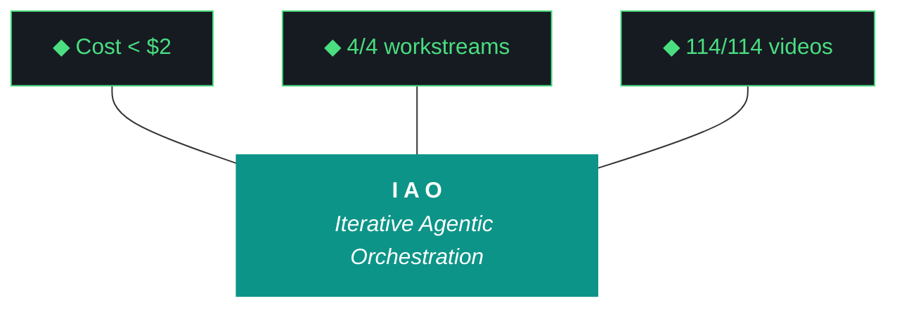

# kjtcom - Design Document v10.59

**Phase:** 10 - Pipeline Expansion & Platform Hardening
**Iteration:** 10.59
**Date:** April 06, 2026
**Previous:** v10.58 (Bourdain Phase 3 complete - 90/114 videos, 275 entities in staging. Claw3D deployed with inline data (G56 resolved). Evaluator 3-tier fallback chain operational. README at 680 lines.)
**Recommended Agent:** Gemini CLI

---

## v10.58 POST-MORTEM

**What worked:**
- Bourdain Phase 3: 90/114 videos processed, 275 entities in staging across 37+ countries. Graduated tmux batches kept CUDA OOM at bay.
- Claw3D G56 fix: all component data inlined as JS objects, zero fetch() calls. Deployed to Firebase Hosting.
- Evaluator 3-tier fallback (Qwen -> Gemini Flash -> self-eval) operational. Schema validation with retry-with-feedback loop.
- Evidence standards (section 12) added to evaluator-harness.md.
- 15/15 post-flight checks passing.

**What needed work:**
- Chip labels still overflowed boxes at default zoom. Labels too long, chips too narrow.
- Qwen context too thin - schema validation failures on all 3 attempts in most iterations. G57 identified: Qwen needs richer context (50-80KB), not stricter rules.
- README stale at 680 lines. Still had solar system references, missing Bourdain pipeline, no PCB architecture docs.
- Video 089 (compilation episode, 38K chars) failed extraction - skipped.

**Metrics:**
- Entity count: 6,181 production + 275 staging = 6,456 total
- Evaluator harness: 727 lines, 11 ADRs, 16 failure patterns
- Cost: ~$1.20 (Gemini API + Google Places)
- Interventions: 0

---

---

## WORKSTREAMS

### W1: Bourdain Pipeline - Phase 4 Final Batch (P1)

**Goal:** Complete the 114-video Bourdain playlist. Videos 91-114 (24 remaining).

**Components:** `yt-dlp` (acquire), `faster-whisper` (CUDA transcription), `Gemini Flash` (entity extraction), `Thompson Schema v3` (normalize), `Nominatim` (geocode), `Google Places` (enrich), `Firebase Admin SDK` (load to staging).

**Success criteria:**
- 114/114 videos acquired and transcribed
- All entities extracted, normalized, geocoded, enriched
- Loaded to staging Firestore (NOT production)
- Checkpoint updated to `phase4_complete`
- Video 089 handled (compilation episode - skip or extract if < 20K chars)

**Risk:** CUDA OOM on RTX 2080 SUPER (G18). Mitigate with graduated tmux batches of 10. Unload Ollama before transcription.

### W2: Claw3D Chip Text Fix (P1)

**Goal:** Fix text overflow in Claw3D IC chip labels at default zoom.

**Approach:**
- Shorten chip IDs (e.g., `query_editor` -> `query_ed`, `firebase_hosting` -> `fb_host`)
- Widen chip geometry from 0.8/1.0 to 1.2/1.5
- Keep full name in `detail` field for hover tooltips
- G56 constraint: all data remains inline, zero fetch() calls

**Success criteria:** Labels readable at default zoom, no overlap, tooltips show full names, G56=0.

### W3: Qwen Context Expansion (P1)

**Goal:** Improve evaluator scoring accuracy by providing richer context (G57).

**Approach:**
- Add `build_rich_context()` to `run_evaluator.py`
- Include: build logs, design docs, example reports (few-shot), middleware registry, gotcha archive, ADRs
- Target 50-80KB context package
- Improve fuzzy name matching (normalize em-dashes, hyphens, colons)

**Success criteria:** Rich context reported in verbose output (50-80KB), improved name matching, fewer schema validation failures.

### W4: README Overhaul (P1)

**Goal:** Bring README up to date with Phase 10 architecture. Target 750+ lines.

**Approach:**
- Replace solar system references with PCB architecture
- Document 4-board layout (Frontend, Pipeline, Middleware, Backend)
- Add Bourdain pipeline stats, all 11 ADRs, middleware component list
- Include Mermaid trident chart
- Prepend changelogs v10.54-v10.59

**Success criteria:** README > 750 lines, accurate project state, 4 pipelines documented, PCB architecture described.

---

## TRIDENT

| Prong | Target |
|-------|--------|
| Cost | < $2.00 total (Gemini API + Google Places). No Claude tokens needed for pipeline work. |
| Delivery | 4/4 workstreams complete. Bourdain 114/114. README 750+ lines. Claw3D labels fixed. |
| Performance | Zero CUDA OOM. Evaluator produces scored report. Claw3D G56=0. |

---

## INFRASTRUCTURE DECISIONS

- **ADR-011 (Thompson Schema v4):** Introduced candidate fields for intranet extensions. Defines t_any_* fields for future source types (Gmail, Slack, CRM).
- **Firestore safety:** Recursive list flattening needed for nested arrays in roles field (discovered during Phase 3 loads).

---

*Design v10.59, April 06, 2026. 4 workstreams. Gemini CLI executor. Bourdain final batch + Claw3D text + Qwen context + README overhaul.*
