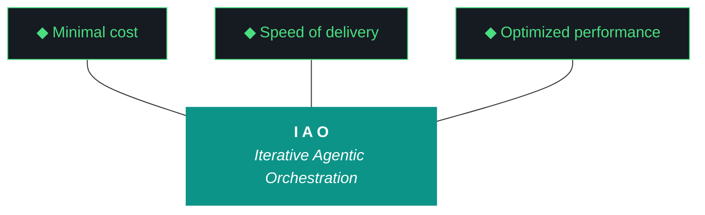

# kjtcom - Design v8.23 (Phase 8 - NoSQL Query Remediation)

**Pipeline:** kjtcom (cross-pipeline location intelligence platform)
**Phase:** 8 (Enrichment Hardening)
**Iteration:** 23 (global counter)
**Executor:** Claude Code (Flutter app fixes + data fix + deploy)
**Machine:** NZXTcos
**Date:** April 2026

---

## Objective

Implement the complete query remediation spec from v8.22. Every NoSQL query the app surfaces must return correct results by end of iteration. The 12 defects identified in v8.22 (3 P0, 5 P1, 2 P2) are resolved through 9 work items spanning Flutter Dart code, a one-time Firestore data fix, and a production deploy.

After this iteration: all 5 rotating example queries return results on first load, result counts are visible, `contains-any` operator is functional, case sensitivity is eliminated, truncation is transparent, and the query editor provides error feedback for invalid input.

---



**Pillar 1 - The IAO Trident.** Every decision is governed by three competing objectives: minimal cost (free-tier LLMs over paid, API scripts over SaaS add-ons, no infrastructure that outlives its purpose), optimized performance (right-size the solution, performance from discovery and proof-of-value testing, not premature abstraction), and speed of delivery (code and objectives become stale, P0 ships, P1 ships if time allows, P2 is post-launch). Cheapest is rarely fastest. Fastest is rarely most optimized. The methodology finds the triangle's center of gravity for each decision.

**Pillar 2 - Artifact Loop.** Every iteration produces four artifacts: design doc (living architecture), plan (execution steps), build log (session transcript), report (metrics + recommendation). Previous artifacts archive to docs/archive/. Agents never see outdated instructions. If an artifact has no consumer, it should not exist.

**Pillar 3 - Diligence.** The methodology does not work if you do not read. Before any iteration touches code, the plan goes through revision - often several revisions. Diligence is investing 30 minutes in plan revision to save 3 hours of misdirected agent execution. The fastest path is the one that doesn't require rework.

**Pillar 4 - Pre-Flight Verification.** Before execution begins, validate: previous docs archived, new design + plan in place, agent instructions updated, git clean, API keys set, build tools verified. Pre-flight failures are the cheapest failures.

**Pillar 5 - Agentic Harness Orchestration.** The primary agent (Claude Code or Gemini CLI) orchestrates LLMs, MCP servers, scripts, APIs, and sub-agents within a structured harness. Agent instructions are system prompts (CLAUDE.md / GEMINI.md). Pipeline scripts are tools. Gotchas are middleware. Agents CAN build and deploy. Agents CANNOT git commit or sudo. The human commits at phase boundaries.

**Pillar 6 - Zero-Intervention Target.** Every question the agent asks during execution is a failure in the plan document. Pre-answer every decision point. Execute agents in YOLO mode, trust but verify. Measure plan quality by counting interventions - zero is the floor.

**Pillar 7 - Self-Healing Execution.** Errors are inevitable. Diagnose -> fix -> re-run. Max 3 attempts per error, then log and skip. Checkpoint after every completed step for crash recovery. Gotcha registry documents known failure patterns so the same error never causes an intervention twice.

**Pillar 8 - Phase Graduation.** Four iterative phases progressively harden the pipeline harness until production requires zero agent intervention. The agent built the harness; the harness runs the work.

**Pillar 9 - Post-Flight Functional Testing.** Three tiers: Tier 1 (app bootstraps, console clean, artifacts produced), Tier 2 (iteration-specific playbook), Tier 3 (hardening audit - Lighthouse, security headers, browser compat).

**Pillar 10 - Continuous Improvement.** The methodology evolves alongside the project. Retrospectives, gotcha registry reviews, tool efficacy reports, trident rebalancing. Static processes atrophy.

---

## IAO Pillar Compliance Matrix

| Pillar | Check | Status |
|--------|-------|--------|
| P1 - Trident | Cost: $0 (Dart code changes + one Python data fix). Speed: single iteration, ordered by priority. Performance: P0 first, deploy mid-iteration for immediate impact. | PASS |
| P2 - Artifact Loop | 4 mandatory artifacts. v8.22 docs archived. | PASS |
| P3 - Diligence | Defect table from v8.22 is the spec. Every fix has a file path, root cause, and implementation. No ambiguity. | PASS |
| P4 - Pre-Flight | Section A verifies git clean, CLAUDE.md updated, v8.22 defect table accessible, Flutter build working. | PASS |
| P5 - Harness | CLAUDE.md updated for v8.23. Firebase MCP (gannonh) for live Firestore queries during dev. Playwright MCP for regression. | PASS |
| P6 - Zero-Intervention | All 9 work items have exact file paths and implementation descriptions. No decision points. | PASS |
| P7 - Self-Healing | Flutter analyze + test after each work item. Build verification before deploy. | PASS |
| P8 - Graduation | Phase 8 is hardening. This iteration fixes the query system built in Phase 6. | PASS |
| P9 - Post-Flight | Tier 1: build + deploy. Tier 2: re-run all 12 defect tests from v8.22. Tier 3: Playwright regression on live site. | PASS |
| P10 - Improvement | G36, G37 resolved. Gotcha registry updated. Query system moves from broken to operational. | PASS |

---

## Architecture Decisions

[DECISION] **Fix-in-place, not rewrite.** The v6.17 query architecture (parser -> provider -> Firestore stream) is sound. The defects are implementation gaps (missing toLowerCase, missing operators, missing UI elements), not architectural flaws. Fix the existing code.

[DECISION] **Deploy after P0 fixes.** W1+W2 fix the two broken example queries visible on first load. Deploy immediately after these two changes so the live site stops showing 0-result queries. Continue with P1/P2 fixes and redeploy at end.

[DECISION] **Pagination via cursor, not offset.** Firestore doesn't support offset pagination. W7 uses `startAfterDocument` cursor-based pagination. The UI shows "Load more" rather than page numbers.

[DECISION] **Firebase MCP for development queries.** Use gannonh/firebase-mcp to let Claude Code query production Firestore directly during development, eliminating throwaway Python scripts for testing query behavior.

[DECISION] **Remove faux rotating queries.** The 5 rotating example queries will be replaced with queries that are verified to return results against production data. Every example query must be validated via Firestore before being hardcoded.

---

## Defect-to-Fix Mapping

Source: v8.22 Report, Section 1

| Defect | Severity | Work Item | Fix Description |
|--------|----------|-----------|-----------------|
| D1 | P0 | W1 | Lowercase query values in `firestore_provider.dart` |
| D2 | P1 | W3 | Lowercase CalGold `t_any_shows` in Firestore |
| D3 | P0 | W1 + W2 | Fix case sensitivity + update example queries |
| D4 | P0 | W1 + W2 | Fix case sensitivity + update example queries |
| D5 | P2 | W9 | Document multi-array client-side behavior |
| D6 | P1 | W6 + W7 | Truncation indicator + pagination |
| D7 | P1 | W4 | Implement `contains-any` operator |
| D8 | P1 | W5 | Add result count badge |
| D9 | P1 | W6 | Add truncation indicator |
| D10 | P2 | W8 | Field name validation |
| D11 | P2 | W9 | Parse error feedback |
| D12 | P3 | Defer | Document `==` vs `contains` semantics |

---

## Work Items

### W1: Lowercase Query Values (P0 - fixes D1, D3, D4)

**File:** `app/lib/providers/firestore_provider.dart`
**Change:** Before dispatching any `arrayContains` or `isEqualTo` query to Firestore, call `.toLowerCase()` on the value string. This ensures "French", "french", and "FRENCH" all match the lowercased data.

```dart
// Before (broken):
query = query.where(clause.field, arrayContains: clause.value);

// After (fixed):
query = query.where(clause.field, arrayContains: clause.value.toLowerCase());
```

### W2: Update Example Queries (P0 - fixes D3, D4)

**File:** `app/lib/widgets/query_editor.dart`
**Change:** Replace the 5 rotating example queries with validated lowercase queries that return results against production data.

Current (broken):
- `t_any_cuisines contains "French" AND t_any_shows contains "Rick Steves' Europe"` -> 0 results
- `t_any_actors contains "Huell Howser" AND t_any_states contains "CA"` -> 0 results

New (validated against production, all lowercase):
- `t_any_cuisines contains "french"` -> 80+ results
- `t_any_actors contains "huell howser"` -> 899 results
- `t_any_countries contains "italy"` -> 600+ results
- `t_any_dishes contains "gelato"` -> 6 results
- `t_any_keywords contains "medieval"` -> 653 results

The exact queries should be validated via Firebase MCP or Python Firestore queries before hardcoding. Each must return > 0 results.

### W3: CalGold t_any_shows Data Fix (P1 - fixes D2)

**Script:** `pipeline/scripts/fix_calgold_shows_case.py`
**Change:** Read all CalGold entities from production, lowercase their `t_any_shows` values ("California's Gold" -> "california's gold"), write back. Same batch-write + dry-run pattern as backfill_schema_v3.py.

This is a one-time data fix. After this, all `t_any_shows` across all pipelines will be consistently lowercase.

### W4: Implement `contains-any` Operator (P1 - fixes D7)

**Files:** `app/lib/models/query_clause.dart`, `app/lib/providers/firestore_provider.dart`
**Change:**

In `query_clause.dart`: Add `contains-any` to the operator regex. Parse the value as a JSON array or comma-separated list.

```dart
// New regex pattern includes contains-any
final regex = RegExp(r'(\S+)\s+(contains-any|contains|==|!=)\s+(.+)');

// For contains-any, parse value as array:
// t_any_cuisines contains-any ["mexican", "italian"]
// t_any_cuisines contains-any mexican, italian
```

In `firestore_provider.dart`: Map `contains-any` to Firestore's `arrayContainsAny`:

```dart
if (clause.operator == 'contains-any') {
  query = query.where(clause.field, arrayContainsAny: clause.values.map((v) => v.toLowerCase()).toList());
}
```

Note: Firestore limits `arrayContainsAny` to 30 values per query. Validate input length.

### W5: Result Count Badge (P1 - fixes D8)

**File:** New widget or addition to `app/lib/widgets/results_table.dart`
**Change:** Display the count of results returned by the current query. Show above the results table in the SIEM-style aesthetic:

Format: `N results` (e.g., "76 results", "1,100 results")

Use the tech green (`#4ADE80`) for the count number, Geist Mono font. Position: between query editor and results table.

### W6: Truncation Indicator (P1 - fixes D6, D9)

**File:** `app/lib/providers/firestore_provider.dart`, results panel
**Change:** When the Firestore query returns exactly the limit count (200 or whatever the new limit is), show a warning:

Format: `Showing 200 of 200+ results` or `Results may be truncated`

This indicator replaces the silent truncation that currently hides 50-69% of results for broad queries.

### W7: Pagination or Increased Limit (P1 - fixes D6)

**File:** `app/lib/providers/firestore_provider.dart`
**Change:** Two options (Claude Code should evaluate and pick):

**Option A (simpler): Increase limit to 1000.** Firestore allows up to 10,000 per query. 1000 covers all current compound query scenarios (largest is "medieval" at 653). Change `query.limit(200)` to `query.limit(1000)`.

**Option B (better UX): Cursor-based pagination.** Add "Load more" button that fetches the next page using `startAfterDocument`. More complex but scales to any dataset size.

**Recommendation:** Start with Option A for immediate fix. Add Option B in Phase 9 if dataset grows beyond 1000 results per query.

### W8: Field Name Validation (P2 - fixes D10)

**File:** `app/lib/models/query_clause.dart`
**Change:** Validate that the field name in a query clause matches a known `t_any_*` field or `t_log_type`. If not, mark the clause as invalid.

Known fields: `t_log_type`, `t_any_names`, `t_any_people`, `t_any_cities`, `t_any_states`, `t_any_counties`, `t_any_countries`, `t_any_regions`, `t_any_keywords`, `t_any_categories`, `t_any_actors`, `t_any_roles`, `t_any_shows`, `t_any_cuisines`, `t_any_dishes`, `t_any_eras`, `t_any_continents`, `t_any_urls`, `t_any_video_ids`, `t_any_coordinates`, `t_any_geohashes`

### W9: Parse Error Feedback (P2 - fixes D5, D11)

**File:** `app/lib/widgets/query_editor.dart`
**Change:** When the parser returns an empty clause list for non-empty input, display an error message below the query editor:

Format: `Could not parse query. Expected: field_name operator value (e.g., t_any_keywords contains "barbecue")`

For multi-array-contains queries (D5), show an informational note: `Note: Multiple array queries are filtered client-side from the first 1000 results`

---

## Regression Test Suite

After all fixes, re-run the complete v8.22 defect table as regression tests:

| Test | Query | Expected After v8.23 |
|------|-------|---------------------|
| D1 | `t_any_cuisines contains "French"` | Returns 80+ results (case insensitive) |
| D2 | `t_any_shows contains "california's gold"` | Returns 899 results (data lowercased) |
| D3 | Example query 1 (French cuisine) | Returns results on first load |
| D4 | Example query 2 (Huell Howser) | Returns results on first load |
| D5 | Two array-contains clauses | Works with client-side note |
| D6 | Broad query (653 results) | All results accessible, no silent truncation |
| D7 | `t_any_cuisines contains-any ["mexican", "italian"]` | Returns 332 results |
| D8 | Any query | Result count displayed |
| D9 | Broad query at limit | Truncation indicator shown |
| D10 | `t_any_nonexistent contains "test"` | Error feedback shown |
| D11 | Malformed query "asdfasdf" | Parse error shown |
| D12 | `==` on array field | Documented behavior (defer) |

---

## Success Criteria

| Criteria | Target |
|----------|--------|
| P0 defects resolved | 3/3 (D1, D3, D4) |
| P1 defects resolved | 5/5 (D2, D6, D7, D8, D9) |
| P2 defects resolved | 2/2 (D10, D11) if time permits |
| All 5 example queries return > 0 results | 5/5 |
| Result count displayed | Yes |
| Truncation indicator shown when limit hit | Yes |
| `contains-any` operator functional | Yes |
| CalGold t_any_shows lowercased | 899/899 |
| flutter analyze | 0 issues |
| flutter test | All pass |
| firebase deploy --only hosting | Success |
| Regression test suite | 11/12 pass (D12 deferred) |
| Interventions | 0 |
| Artifacts | 4 mandatory docs |

---

## Gotchas Active

| ID | Gotcha | Prevention |
|----|--------|-----------|
| G11 | API key leaks | NEVER cat config.fish or SA JSON files |
| G20 | Config.fish contains keys | grep only, never cat |
| G34 | Firestore single array-contains limit | One array-contains per server-side query. Client-side fallback documented in UI. |
| G35 | Production write safety | Data fix script uses --dry-run first. |
| G36 | Case-sensitive arrayContains | All query values lowercased before dispatch (W1). |
| G37 | t_any_shows inconsistent casing | CalGold data fix (W3) lowercases all values. |
| G38 (NEW) | Firebase deploy auth expiry | `firebase login --reauth` if deploy fails with auth error. Run from repo root, not app/. |

---

## Phase Structure Reference

| Phase | Name | Status | Iteration |
|-------|------|--------|-----------|
| 0 | Scaffold & Environment | DONE | v0.5 |
| 1 | Discovery (30 videos) | DONE | v1.6, v1.7 |
| 2 | Calibration (60 videos) | DONE | v2.8, v2.9 |
| 3 | Stress Test (90 videos) | DONE | v3.10, v3.11 |
| 4 | Validation + Schema v3 (120 videos) | DONE | v4.12, v4.13 |
| 5 | Production Run (full datasets) | DONE | v5.14, v5.17 |
| 6 | Flutter App | DONE | v6.15-v6.20 |
| 7 | Firestore Load | DONE | v7.21 |
| 8 | Enrichment Hardening | IN PROGRESS | v8.22, v8.23 |
| 9 | App Optimization | Pending | - |
| 10 | Retrospective + Template | Pending | - |
