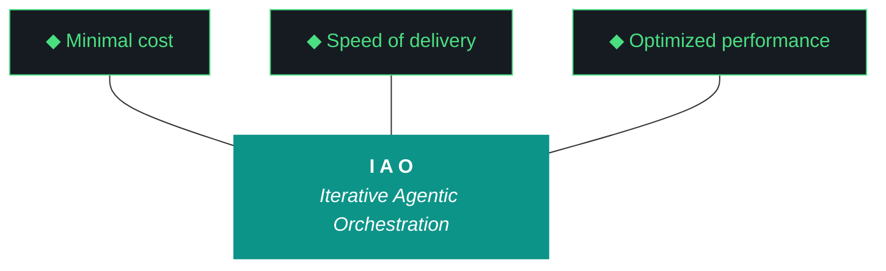

# kjtcom - Design v8.24 (Phase 8 - UI Fixes + Country Codes)

**Pipeline:** kjtcom (cross-pipeline location intelligence platform)
**Phase:** 8 (Enrichment Hardening)
**Iteration:** 24 (global counter)
**Executor:** Claude Code (Flutter app fixes + data backfill + deploy)
**Machine:** NZXTcos
**Date:** April 2026

---

## Objective

Fix 4 remaining UI/data issues that prevent the app from functioning as a production-quality portfolio piece:

1. **Detail panel broken:** Clicking a result row does not open the entity detail panel with t_any_* field cards and JSON payload. This is core functionality built in v6.17 that regressed or never worked against production data.
2. **"staging" badge:** Top-right badge still says "staging" - the app now queries the production (default) database since v7.21. Remove or change to "production".
3. **Cursor alignment:** The cursor in the query editor doesn't track where typing actually occurs. Line numbers and cursor position are misaligned.
4. **Country codes:** Add `t_any_country_codes` field with ISO 3166-1 alpha-2 codes to all 6,181 entities. Non-breaking additive field.

After this iteration: clicking a result shows the full entity detail panel, the staging badge is gone, cursor alignment is fixed, and every entity has ISO country codes for standardized querying.

---

**Pillar 1 - The IAO Trident.** Every decision is governed by three competing objectives: minimal cost (free-tier LLMs over paid, API scripts over SaaS add-ons, no infrastructure that outlives its purpose), optimized performance (right-size the solution, performance from discovery and proof-of-value testing, not premature abstraction), and speed of delivery (code and objectives become stale, P0 ships, P1 ships if time allows, P2 is post-launch). Cheapest is rarely fastest. Fastest is rarely most optimized. The methodology finds the triangle's center of gravity for each decision.

**Pillar 2 - Artifact Loop.** Every iteration produces four artifacts: design doc (living architecture), plan (execution steps), build log (session transcript), report (metrics + recommendation). Previous artifacts archive to docs/archive/. Agents never see outdated instructions. If an artifact has no consumer, it should not exist.

**Pillar 3 - Diligence.** The methodology does not work if you do not read. Before any iteration touches code, the plan goes through revision - often several revisions. Diligence is investing 30 minutes in plan revision to save 3 hours of misdirected agent execution. The fastest path is the one that doesn't require rework.

**Pillar 4 - Pre-Flight Verification.** Before execution begins, validate: previous docs archived, new design + plan in place, agent instructions updated, git clean, API keys set, build tools verified. Pre-flight failures are the cheapest failures.

**Pillar 5 - Agentic Harness Orchestration.** The primary agent (Claude Code or Gemini CLI) orchestrates LLMs, MCP servers, scripts, APIs, and sub-agents within a structured harness. Agent instructions are system prompts (CLAUDE.md / GEMINI.md). Pipeline scripts are tools. Gotchas are middleware. Agents CAN build and deploy. Agents CANNOT git commit or sudo. The human commits at phase boundaries.

**Pillar 6 - Zero-Intervention Target.** Every question the agent asks during execution is a failure in the plan document. Pre-answer every decision point. Execute agents in YOLO mode, trust but verify. Measure plan quality by counting interventions - zero is the floor.

**Pillar 7 - Self-Healing Execution.** Errors are inevitable. Diagnose -> fix -> re-run. Max 3 attempts per error, then log and skip. Checkpoint after every completed step for crash recovery. Gotcha registry documents known failure patterns so the same error never causes an intervention twice.

**Pillar 8 - Phase Graduation.** Four iterative phases progressively harden the pipeline harness until production requires zero agent intervention. The agent built the harness; the harness runs the work.

**Pillar 9 - Post-Flight Functional Testing.** Three tiers: Tier 1 (app bootstraps, console clean, artifacts produced), Tier 2 (iteration-specific playbook), Tier 3 (hardening audit - Lighthouse, security headers, browser compat).

**Pillar 10 - Continuous Improvement.** The methodology evolves alongside the project. Retrospectives, gotcha registry reviews, tool efficacy reports, trident rebalancing. Static processes atrophy.

---

## IAO Pillar Compliance Matrix

| Pillar | Check | Status |
|--------|-------|--------|
| P1 - Trident | Cost: $0 (Dart fixes + Python backfill). Speed: single iteration, 4 focused fixes. Performance: detail panel is core UX, not polish. | PASS |
| P2 - Artifact Loop | 4 mandatory artifacts. v8.23 docs archived. | PASS |
| P3 - Diligence | All 4 issues identified from live testing with screenshots. Root causes documented. | PASS |
| P4 - Pre-Flight | Git clean, CLAUDE.md updated, Flutter builds verified. | PASS |
| P5 - Harness | CLAUDE.md updated for v8.24. Playwright MCP for regression. | PASS |
| P6 - Zero-Intervention | All fixes have exact file paths and implementation descriptions. | PASS |
| P7 - Self-Healing | flutter analyze + flutter test after each change. Dry-run for data backfill. | PASS |
| P8 - Graduation | Phase 8 hardening - fixing regressions and adding a data field. | PASS |
| P9 - Post-Flight | Tier 1: build + deploy. Tier 2: click a result -> detail panel opens. Tier 3: all v8.23 regression tests still pass. | PASS |
| P10 - Improvement | G39 added for detail panel state management. | PASS |

---

## Architecture Decisions

[DECISION] **Detail panel fix is diagnostic-first.** The detail panel was built and tested in v6.17 against staging data. It may have regressed due to provider changes in v8.23 (QueryResult refactor) or it may never have worked against production. Claude Code must first diagnose the root cause before fixing.

[DECISION] **Country codes are additive (Option A).** New field `t_any_country_codes` with ISO 3166-1 alpha-2 values. Existing `t_any_countries` with full names is preserved. Both fields are queryable. This is non-breaking.

[DECISION] **Remove "staging" badge entirely.** The v6.17 design had "staging" as a status tone element. Now that the app queries production, the badge is misleading. Remove it rather than changing to "production" - the app shouldn't need to declare which database it queries.

[DECISION] **Cursor fix is CSS/layout, not parser.** The query editor cursor misalignment is a Flutter TextField positioning issue relative to the line number gutter, not a parser problem. The fix is in `query_editor.dart` layout code.

---

## Work Items

### W1: Fix Detail Panel (P0)

**Root cause investigation required.** The detail panel (`app/lib/widgets/detail_panel.dart`) is wired to `selectedEntityProvider`. When a user clicks a row in `results_table.dart`, it should set `selectedEntityProvider` to the clicked entity, and the detail panel should render.

Possible causes:
- `selectedEntityProvider` not being updated on row tap (results_table.dart)
- Detail panel not visible in the widget tree (app_shell.dart layout)
- Provider refactor in v8.23 (QueryResult wrapper) broke the entity selection chain
- Detail panel renders but is hidden behind results table (z-index/layout)
- Firestore document structure in production differs from what detail_panel.dart expects

**Fix approach:**
1. Read `detail_panel.dart`, `results_table.dart`, `app_shell.dart`, and all providers
2. Trace the tap handler from results table row -> selectedEntityProvider -> detail panel render
3. Identify the break point
4. Fix and verify: tap a row -> detail panel opens with t_any_* field cards

The detail panel should display:
- Entity name (header)
- Pipeline badge (CG/RS/TD)
- All populated t_any_* fields as labeled cards
- +filter/-exclude buttons on each field value
- t_enrichment data (Google Places rating, website, status)

### W2: Remove "staging" Badge (P0)

**File:** `app/lib/widgets/app_shell.dart` (likely)

Find the "staging" text/badge widget and remove it. The app queries the production (default) database since v7.21 - this badge is incorrect.

### W3: Fix Cursor Alignment (P1)

**File:** `app/lib/widgets/query_editor.dart`

The cursor in the query editor doesn't align with where text is being typed. The line number gutter and the TextField input area have mismatched offsets. 

Possible causes:
- Line number width not matching TextField padding
- Multiple TextField widgets creating multiple cursors (the "three cursors" bug from screenshots)
- Overlay/Stack positioning mismatch

Fix: ensure the TextField's cursor position matches the visible text position. If multiple cursors exist, there are likely multiple TextField widgets being rendered - reduce to one.

### W4: Add t_any_country_codes Field (P1)

**Script:** `pipeline/scripts/backfill_country_codes.py`

Create a Python script that:
1. Reads all 6,181 entities from production
2. For each entity, maps `t_any_countries` values to ISO 3166-1 alpha-2 codes
3. Writes `t_any_country_codes` array to each entity
4. Uses batch writes (500 per batch) with --dry-run flag

**Country name to ISO 3166-1 alpha-2 mapping:**

The mapping must handle the lowercased country names stored in t_any_countries. Common mappings include:

| t_any_countries value | ISO code |
|----------------------|----------|
| us | US |
| france | FR |
| italy | IT |
| spain | ES |
| germany | DE |
| united kingdom | GB |
| greece | GR |
| turkey | TR |
| austria | AT |
| switzerland | CH |
| czech republic | CZ |
| netherlands | NL |
| ireland | IE |
| portugal | PT |
| croatia | HR |
| hungary | HU |
| poland | PL |
| belgium | BE |
| denmark | DK |
| norway | NO |
| sweden | SE |
| iceland | IS |
| romania | RO |
| bulgaria | BG |
| slovenia | SI |
| slovakia | SK |
| bosnia and herzegovina | BA |
| montenegro | ME |
| israel | IL |
| palestine | PS |
| iran | IR |
| egypt | EG |
| ethiopia | ET |
| vatican city | VA |
| san marino | SM |
| malta | MT |
| guatemala | GT |
| mexico | MX |
| finland | FI |
| scotland | GB |
| england | GB |
| wales | GB |
| northern ireland | GB |

Note: Scotland, England, Wales, and Northern Ireland all map to GB. The script should use the `pycountry` library as primary lookup and the hardcoded table above as fallback for edge cases.

**After backfill:**
- Update `query_clause.dart` knownFields to include `t_any_country_codes`
- Update `pipeline/config/*/schema.json` to include the new field
- Add `t_any_country_codes` to `location_entity.dart` model

Store codes as **lowercase** to match t_any_* convention: `["fr", "it", "us"]`.

---

## Success Criteria

| Criteria | Target |
|----------|--------|
| Detail panel opens on row click | Yes - shows t_any_* fields |
| "staging" badge removed | Yes |
| Cursor aligned with typing position | Yes - single cursor, correct position |
| t_any_country_codes populated | 6,181/6,181 entities |
| ISO codes queryable | `t_any_country_codes contains "fr"` returns results |
| flutter analyze | 0 issues |
| flutter test | All pass |
| firebase deploy | Success |
| v8.23 regression tests still pass | 11/12 |
| Interventions | 0 |
| Artifacts | 4 mandatory docs |

---

## Gotchas Active

| ID | Gotcha | Prevention |
|----|--------|-----------|
| G11 | API key leaks | NEVER cat config.fish or SA JSON files |
| G20 | Config.fish contains keys | grep only, never cat |
| G35 | Production write safety | Backfill uses --dry-run first |
| G36 | Case-sensitive arrayContains | All data and queries lowercased |
| G38 | Firebase deploy auth expiry | firebase login --reauth if needed. Deploy from repo root. |
| G39 (NEW) | Detail panel provider chain | selectedEntityProvider must be updated on row tap AND detail_panel must be in the widget tree. Test after any provider refactor. |

---

## Phase Structure Reference

| Phase | Name | Status | Iteration |
|-------|------|--------|-----------|
| 0 | Scaffold & Environment | DONE | v0.5 |
| 1 | Discovery (30 videos) | DONE | v1.6, v1.7 |
| 2 | Calibration (60 videos) | DONE | v2.8, v2.9 |
| 3 | Stress Test (90 videos) | DONE | v3.10, v3.11 |
| 4 | Validation + Schema v3 (120 videos) | DONE | v4.12, v4.13 |
| 5 | Production Run (full datasets) | DONE | v5.14, v5.17 |
| 6 | Flutter App | DONE | v6.15-v6.20 |
| 7 | Firestore Load | DONE | v7.21 |
| 8 | Enrichment Hardening | IN PROGRESS | v8.22, v8.23, v8.24 |
| 9 | App Optimization | Pending | - |
| 10 | Retrospective + Template | Pending | - |
