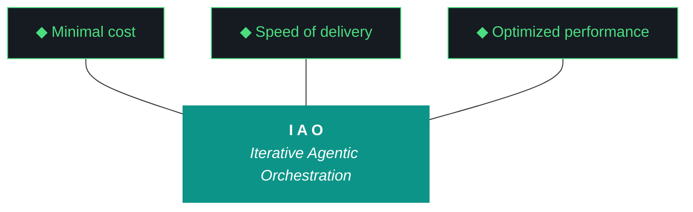

# kjtcom - Design v8.25 (Phase 8 - Filter Fix + README Overhaul)

**Pipeline:** kjtcom (cross-pipeline location intelligence platform)
**Phase:** 8 (Enrichment Hardening)
**Iteration:** 25 (global counter)
**Executor:** Claude Code
**Machine:** NZXTcos
**Date:** April 2026

---

## Objective

Two workstreams:

**Workstream A - Fix +filter/-exclude duplicate bug.** The detail panel's +filter and -exclude buttons add duplicate query lines on each click (sometimes 1, sometimes 2, sometimes 4). This is a rebuild-triggered event handler bug that must be resolved for the query UX to be trustworthy.

**Workstream B - Comprehensive README overhaul.** The README has received superficial updates across 5 iterations (v7.21 through v8.24) but the body text still reads like the project is at v2.9. The entire README must be rewritten to reflect the current state: 6,181 entities across 3 live pipelines, functional NoSQL query system with case-insensitive search, contains-any, result counts, detail panel, country codes, and Phase 8 complete.

After this iteration: +filter adds exactly one line per click, and the README accurately represents the production state of the platform.

---

**Pillar 1 - The IAO Trident.** Every decision is governed by three competing objectives: minimal cost (free-tier LLMs over paid, API scripts over SaaS add-ons, no infrastructure that outlives its purpose), optimized performance (right-size the solution, performance from discovery and proof-of-value testing, not premature abstraction), and speed of delivery (code and objectives become stale, P0 ships, P1 ships if time allows, P2 is post-launch). Cheapest is rarely fastest. Fastest is rarely most optimized. The methodology finds the triangle's center of gravity for each decision.

**Pillar 2 - Artifact Loop.** Every iteration produces four artifacts: design doc (living architecture), plan (execution steps), build log (session transcript), report (metrics + recommendation). Previous artifacts archive to docs/archive/. Agents never see outdated instructions. If an artifact has no consumer, it should not exist.

**Pillar 3 - Diligence.** The methodology does not work if you do not read. Before any iteration touches code, the plan goes through revision - often several revisions. Diligence is investing 30 minutes in plan revision to save 3 hours of misdirected agent execution. The fastest path is the one that doesn't require rework.

**Pillar 4 - Pre-Flight Verification.** Before execution begins, validate: previous docs archived, new design + plan in place, agent instructions updated, git clean, API keys set, build tools verified. Pre-flight failures are the cheapest failures.

**Pillar 5 - Agentic Harness Orchestration.** The primary agent (Claude Code or Gemini CLI) orchestrates LLMs, MCP servers, scripts, APIs, and sub-agents within a structured harness. Agent instructions are system prompts (CLAUDE.md / GEMINI.md). Pipeline scripts are tools. Gotchas are middleware. Agents CAN build and deploy. Agents CANNOT git commit or sudo. The human commits at phase boundaries.

**Pillar 6 - Zero-Intervention Target.** Every question the agent asks during execution is a failure in the plan document. Pre-answer every decision point. Execute agents in YOLO mode, trust but verify. Measure plan quality by counting interventions - zero is the floor.

**Pillar 7 - Self-Healing Execution.** Errors are inevitable. Diagnose -> fix -> re-run. Max 3 attempts per error, then log and skip. Checkpoint after every completed step for crash recovery. Gotcha registry documents known failure patterns so the same error never causes an intervention twice.

**Pillar 8 - Phase Graduation.** Four iterative phases progressively harden the pipeline harness until production requires zero agent intervention. The agent built the harness; the harness runs the work.

**Pillar 9 - Post-Flight Functional Testing.** Three tiers: Tier 1 (app bootstraps, console clean, artifacts produced), Tier 2 (iteration-specific playbook), Tier 3 (hardening audit - Lighthouse, security headers, browser compat).

**Pillar 10 - Continuous Improvement.** The methodology evolves alongside the project. Retrospectives, gotcha registry reviews, tool efficacy reports, trident rebalancing. Static processes atrophy.

---

## IAO Pillar Compliance Matrix

| Pillar | Check | Status |
|--------|-------|--------|
| P1 - Trident | Cost: $0. Speed: focused 2-workstream iteration. Performance: fixes UX-breaking bug + refreshes public-facing documentation. | PASS |
| P2 - Artifact Loop | 4 mandatory artifacts. v8.24 docs archived. | PASS |
| P3 - Diligence | Bug is diagnosed (rebuild event handler). README gaps cataloged. | PASS |
| P4 - Pre-Flight | Git clean, CLAUDE.md updated, Flutter builds. | PASS |
| P5 - Harness | CLAUDE.md for v8.25. No MCP needed (Dart fix + markdown). | PASS |
| P6 - Zero-Intervention | Bug fix approach pre-specified. README sections pre-defined. | PASS |
| P7 - Self-Healing | flutter analyze + test after fix. | PASS |
| P8 - Graduation | Final Phase 8 polish before Phase 9. | PASS |
| P9 - Post-Flight | Tier 2: click +filter 5 times -> exactly 5 lines added. | PASS |
| P10 - Improvement | G41 added for rebuild event handlers. | PASS |

---

## Architecture Decisions

[DECISION] **Filter fix is debounce + dedup, not architectural change.** The detail panel's +filter handler fires multiple times because the widget rebuilds when the query provider updates. Fix with: (1) check if clause already exists before appending, and (2) use a guard flag to prevent re-entry during the same event loop tick.

[DECISION] **README is a complete rewrite, not incremental update.** The current README has accumulated 24 iterations of incremental edits. Sections are inconsistent, the changelog is too long for the body (move to CHANGELOG.md or truncate to last 5), and the project description doesn't mention the query system, detail panel, or country codes. Start from scratch using the current README as reference.

---

## Workstream A: Fix +filter/-exclude Bug

### Root Cause

The `+filter` and `-exclude` buttons in `detail_panel.dart` call a handler that modifies `queryProvider.notifier.state`. This state change triggers a rebuild of any widget watching `queryProvider`, which may include the detail panel itself (if it reads the query to determine button state). Each rebuild can re-fire the handler if the tap event is still processing.

### Fix Requirements

1. **Dedup check:** Before appending a new clause, check if the exact string already exists in the current query text. If it does, do not append.

2. **Guard flag:** Add a `_isAppending` boolean flag. Set to true on entry, false on exit (use try/finally). If already true, return immediately. This prevents re-entry from rebuild-triggered re-fires.

3. **Single line per click:** After fix, clicking +filter on `t_any_continents: "europe"` must add exactly ONE line: `| where t_any_continents contains "europe"` - regardless of how many rebuilds occur.

4. **Test:** Click +filter on the same field 3 times rapidly. Should produce exactly 3 lines (or 1 if dedup prevents duplicates of identical clauses - design choice for Kyle).

### Design Choice: Allow Duplicate Clauses?

**Option A:** Prevent identical clauses entirely. Clicking +filter on "europe" twice adds it once, second click is no-op. Simpler but might confuse users who intentionally want to repeat.

**Option B:** Allow duplicate clauses but ensure each click adds exactly one. Multiple "europe" lines are valid (Firestore ignores duplicates in arrayContains anyway).

**Recommendation:** Option A - prevent identical clauses. If the clause `t_any_continents contains "europe"` already exists in the query, the +filter button should be a no-op (or show a subtle flash indicating "already added"). This matches SIEM query builder behavior.

---

## Workstream B: README Overhaul

### Current Problems

1. **Status line** says "Phase 7 v7.21" - should be "Phase 8 v8.24 DONE"
2. **Intro paragraph** doesn't mention the query system, detail panel, or that the app is live
3. **Architecture diagram** is still the pipeline-only view - doesn't show the Flutter app query flow
4. **Thompson Indicator Fields table** is good but missing t_any_country_codes
5. **Pipelines table** is current but could show enrichment rates
6. **IAO section** is excellent - keep as-is with mermaid chart and 10 pillars
7. **Project Status table** shows Phase 8 as "Pending" - should be "DONE"
8. **Changelog** in README body is too long (every iteration). Truncate to last 3-5 iterations. Full changelog lives in docs/kjtcom-changelog.md
9. **Hardware section** only shows NZXTcos - add tsP3-cos
10. **Future Directions** mentions HyperAgents and multi-LLM - update with v8.22 assessment conclusions
11. **No "Live App" section** - should prominently link to kylejeromethompson.com with a description of what visitors can do
12. **No "Query System" section** - the functional NoSQL query editor is a major feature that's undocumented

### README Structure (Target)

1. Title + badges + intro paragraph (updated)
2. **Live App** (NEW) - link to kylejeromethompson.com, what you can do there
3. Architecture (pipeline + app query flow)
4. Data Architecture (keep from v7.21)
5. Thompson Indicator Fields (add t_any_country_codes)
6. Pipelines (current, with enrichment rates)
7. **Query System** (NEW) - operators, example queries, result counts, detail panel
8. IAO Methodology (keep as-is, mermaid + 10 pillars)
9. IAO Components + Split-Agent tables (keep)
10. Project Status (updated through Phase 8 DONE)
11. Tech Stack (current)
12. Hardware (add tsP3-cos)
13. Cost (current)
14. Future Directions (updated)
15. Changelog (truncated to last 5 iterations, link to full changelog)
16. Author + Citing

---

## Success Criteria

| Criteria | Target |
|----------|--------|
| +filter adds exactly 1 line per click | Yes |
| Duplicate clause prevented | Yes (Option A) |
| -exclude adds exactly 1 line per click | Yes |
| README reflects current state (Phase 8 DONE, 6,181 entities) | Yes |
| README has Live App section | Yes |
| README has Query System section | Yes |
| README t_any_country_codes in field table | Yes |
| README changelog truncated to last 5 | Yes |
| flutter analyze | 0 issues |
| flutter test | All pass |
| firebase deploy | Success |
| Interventions | 0 |
| Artifacts | 4 mandatory docs |

---

## Gotchas Active

| ID | Gotcha | Prevention |
|----|--------|-----------|
| G38 | Firebase deploy auth expiry | firebase login --reauth if needed. Deploy from repo root. |
| G39 | Detail panel provider chain | Resolved in v8.24. |
| G40 | Compound country names | Documented. 6 unmapped. |
| G41 (NEW) | Rebuild-triggered event handlers | Any onPressed that modifies a provider watched by the same widget MUST guard against re-entry. Use _isAppending flag + dedup check. |

---

## Phase Structure Reference

| Phase | Name | Status | Iteration |
|-------|------|--------|-----------|
| 0 | Scaffold & Environment | DONE | v0.5 |
| 1 | Discovery (30 videos) | DONE | v1.6, v1.7 |
| 2 | Calibration (60 videos) | DONE | v2.8, v2.9 |
| 3 | Stress Test (90 videos) | DONE | v3.10, v3.11 |
| 4 | Validation + Schema v3 (120 videos) | DONE | v4.12, v4.13 |
| 5 | Production Run (full datasets) | DONE | v5.14, v5.17 |
| 6 | Flutter App | DONE | v6.15-v6.20 |
| 7 | Firestore Load | DONE | v7.21 |
| 8 | Enrichment Hardening | DONE | v8.22-v8.25 |
| 9 | App Optimization | Pending | - |
| 10 | Retrospective + Template | Pending | - |
