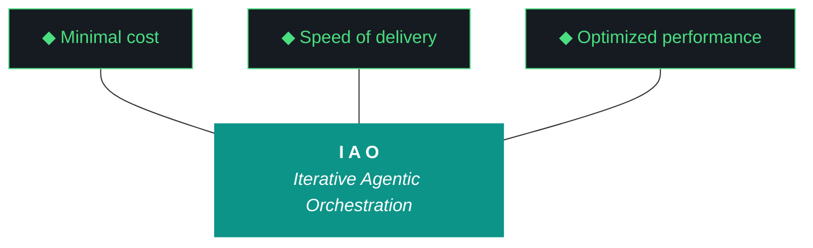

# kjtcom - Design v8.26 (Phase 8 - Gotcha Registry + Query UX Fix)

**Pipeline:** kjtcom (cross-pipeline location intelligence platform)
**Phase:** 8 (Enrichment Hardening)
**Iteration:** 26 (global counter)
**Executor:** Claude Code
**Machine:** NZXTcos
**Date:** April 2026

---

## Objective

Two focused fixes:

1. **Remove rotating example queries.** The 5 rotating queries (6-second cycle) interrupt active searching. When a user is mid-query, the rotation overwrites their input. Remove the rotation entirely. Replace with static placeholder text or an empty editor ready for input.

2. **Establish gotcha registry as mandatory design doc section.** Every design doc from this iteration forward must carry the complete gotcha registry - not just "active" gotchas, but the full living registry with status (ACTIVE, RESOLVED, DOCUMENTED). This ensures no agent ever encounters a known failure pattern without the prevention already in context.

After this iteration: query editor no longer interrupts user input, and the gotcha registry standard is established for all future iterations.

---



**Pillar 1 - The IAO Trident.** Every decision is governed by three competing objectives: minimal cost (free-tier LLMs over paid, API scripts over SaaS add-ons, no infrastructure that outlives its purpose), optimized performance (right-size the solution, performance from discovery and proof-of-value testing, not premature abstraction), and speed of delivery (code and objectives become stale, P0 ships, P1 ships if time allows, P2 is post-launch). Cheapest is rarely fastest. Fastest is rarely most optimized. The methodology finds the triangle's center of gravity for each decision.

**Pillar 2 - Artifact Loop.** Every iteration produces four artifacts: design doc (living architecture), plan (execution steps), build log (session transcript), report (metrics + recommendation). Previous artifacts archive to docs/archive/. Agents never see outdated instructions. If an artifact has no consumer, it should not exist.

**Pillar 3 - Diligence.** The methodology does not work if you do not read. Before any iteration touches code, the plan goes through revision - often several revisions. Diligence is investing 30 minutes in plan revision to save 3 hours of misdirected agent execution. The fastest path is the one that doesn't require rework.

**Pillar 4 - Pre-Flight Verification.** Before execution begins, validate: previous docs archived, new design + plan in place, agent instructions updated, git clean, API keys set, build tools verified. Pre-flight failures are the cheapest failures.

**Pillar 5 - Agentic Harness Orchestration.** The primary agent (Claude Code or Gemini CLI) orchestrates LLMs, MCP servers, scripts, APIs, and sub-agents within a structured harness. Agent instructions are system prompts (CLAUDE.md / GEMINI.md). Pipeline scripts are tools. Gotchas are middleware. Agents CAN build and deploy. Agents CANNOT git commit or sudo. The human commits at phase boundaries.

**Pillar 6 - Zero-Intervention Target.** Every question the agent asks during execution is a failure in the plan document. Pre-answer every decision point. Execute agents in YOLO mode, trust but verify. Measure plan quality by counting interventions - zero is the floor.

**Pillar 7 - Self-Healing Execution.** Errors are inevitable. Diagnose -> fix -> re-run. Max 3 attempts per error, then log and skip. Checkpoint after every completed step for crash recovery. Gotcha registry documents known failure patterns so the same error never causes an intervention twice.

**Pillar 8 - Phase Graduation.** Four iterative phases progressively harden the pipeline harness until production requires zero agent intervention. The agent built the harness; the harness runs the work.

**Pillar 9 - Post-Flight Functional Testing.** Three tiers: Tier 1 (app bootstraps, console clean, artifacts produced), Tier 2 (iteration-specific playbook), Tier 3 (hardening audit - Lighthouse, security headers, browser compat).

**Pillar 10 - Continuous Improvement.** The methodology evolves alongside the project. Retrospectives, gotcha registry reviews, tool efficacy reports, trident rebalancing. Static processes atrophy.

---

## IAO Pillar Compliance Matrix

| Pillar | Check | Status |
|--------|-------|--------|
| P1 - Trident | Cost: $0. Speed: 2 focused changes. Performance: removes UX-breaking behavior. | PASS |
| P2 - Artifact Loop | 4 mandatory artifacts. v8.25 docs archived. | PASS |
| P3 - Diligence | Both issues identified from live user testing. | PASS |
| P4 - Pre-Flight | Git clean, CLAUDE.md updated, Flutter builds. | PASS |
| P5 - Harness | CLAUDE.md for v8.26. | PASS |
| P6 - Zero-Intervention | Both fixes have exact file paths and clear requirements. | PASS |
| P7 - Self-Healing | flutter analyze + test after changes. | PASS |
| P8 - Graduation | Final Phase 8 fix. | PASS |
| P9 - Post-Flight | Tier 2: type a query mid-rotation -> input preserved. | PASS |
| P10 - Improvement | Full gotcha registry established as design doc standard. | PASS |

---

## Architecture Decisions

[DECISION] **Remove rotation entirely, not pause-on-focus.** A pause-on-focus approach adds complexity and still risks edge cases. The rotation was a Phase 6 visual flourish - the app now has 6,181 entities and a functional query system. Users should see an empty editor ready for input, not a demo loop.

[DECISION] **Keep example queries as static help text.** Instead of rotating through the editor, show example query syntax as static placeholder/hint text below the editor or as a help tooltip. The examples are still valuable for teaching syntax - they just shouldn't be injected into the input field.

[DECISION] **Full gotcha registry in every design doc going forward.** The gotcha registry is IAO middleware (Pillar 7). Carrying only "active" gotchas means resolved gotchas get forgotten and can re-emerge. The full registry with status ensures institutional memory persists across all iterations.

---

## Work Items

### W1: Remove Rotating Example Queries (P0)

**Files:** `app/lib/widgets/query_editor.dart`, `app/lib/providers/query_provider.dart`

The current behavior:
- 5 example queries defined in `query_editor.dart`
- A Timer cycles through them every 6 seconds
- Each cycle overwrites `queryProvider.notifier.state` with the next example
- This fires a Firestore query, updates results, and replaces whatever the user was typing

Remove:
1. The Timer that cycles example queries
2. The example query list (or move to static help text)
3. The `initialExampleQuery` in `query_provider.dart` - the editor should start empty
4. Any `ref.listen` or `ref.watch` that feeds rotation state into the query provider

Replace with:
- Empty query editor on load (no pre-populated query)
- Optional: static hint text below the editor showing 2-3 example query syntaxes (NOT injected into the input field):
  ```
  Examples: t_any_cuisines contains "french" | t_any_countries contains "italy" | t_any_country_codes contains-any ["fr", "it"]
  ```

The entity count row ("6,181 entities across N countries") should still display on load with the total count, not query-dependent.

### W2: Establish Full Gotcha Registry Standard

No code change. The report artifact for v8.26 must include the complete gotcha registry with status, and the design doc template going forward must include it.

This design doc establishes the standard by including the full registry below.

---

## Complete Gotcha Registry

| ID | Gotcha | Prevention | Status |
|----|--------|-----------|--------|
| G1 | Heredocs in fish shell | Use printf blocks, never heredocs | ACTIVE |
| G2 | CUDA LD_LIBRARY_PATH | source ~/.config/fish/config.fish before transcription. Permanently resolved on NZXTcos. | RESOLVED |
| G11 | API key leaks in catted files | NEVER cat config.fish or SA JSON files. grep only. | ACTIVE |
| G18 | Gemini 5-minute command timeout | Use background job execution for long-running commands | ACTIVE |
| G19 | Gemini runs bash by default | Wrap commands in `fish -c` | ACTIVE |
| G20 | Config.fish contains API keys | grep only, never cat. Print only SET/NOT SET for key checks. | ACTIVE |
| G21 | CUDA OOM on simultaneous transcription | Sequential processing, not parallel. Graduated timeout passes. | ACTIVE |
| G22 | Fish `ls` color codes break file parsing | Use `command ls` to avoid color codes | ACTIVE |
| G23 | LD_LIBRARY_PATH fix for CUDA path via Gemini | Set in config.fish, source before runs | RESOLVED (by G2 fix) |
| G24 | Checkpoint staleness on re-extraction | Reset checkpoints when re-extracting with new prompts | ACTIVE |
| G30 | Cross-project SA permissions | Verify both SA files exist and have Firestore read/write before migration | ACTIVE |
| G31 | TripleDB schema drift | Inspect actual Firestore data before migration. Schema from past conversations may be outdated. | RESOLVED (v7.21) |
| G32 | Production Firestore rules | Admin SDK bypasses rules. Verify project-level IAM. | ACTIVE |
| G33 | Duplicate entity IDs | Deterministic t_row_id (hash of name+city+pipeline). Check before write. | ACTIVE |
| G34 | Firestore single array-contains limit | One array-contains per server-side query. Multi-clause uses client-side filtering. Document in UI. | ACTIVE |
| G35 | Production write safety | All production update scripts use --dry-run flag. Verify on 5 entities before full run. | ACTIVE |
| G36 | Case-sensitive arrayContains | All t_any_* data MUST be lowercased. All query input lowercased before dispatch. | RESOLVED (v8.23 W1) |
| G37 | t_any_shows inconsistent casing | CalGold had title case from v5.14. All lowercased in v8.23 W3. | RESOLVED (v8.23 W3) |
| G38 | Firebase deploy auth expiry | `firebase login --reauth` if deploy fails. Deploy from repo root, not app/. | ACTIVE |
| G39 | Detail panel provider chain | selectedEntityProvider must be updated on row tap AND detail_panel must be in widget tree at all viewports. | RESOLVED (v8.24 W1) |
| G40 | Compound country names | Names like "france / spain" not parseable by pycountry. Require manual split. 6 unmapped. | DOCUMENTED |
| G41 | Rebuild-triggered event handlers | Any onPressed that modifies a provider watched by the same widget MUST guard against re-entry. Use dedup + guard flag. | RESOLVED (v8.25 W-A) |
| G42 (NEW) | Rotating queries overwrite user input | Timer-based query injection into the editor overwrites active user typing. Remove rotation entirely. | RESOLVED (v8.26 W1) |

---

## Success Criteria

| Criteria | Target |
|----------|--------|
| Rotating queries removed | Yes - no Timer, no auto-injection |
| Query editor starts empty | Yes |
| Example syntax shown as static help text | Yes (not injected into editor) |
| Entity count row still shows total on load | Yes |
| User can type without interruption | Yes |
| Full gotcha registry in report | Yes (G1-G42) |
| flutter analyze | 0 issues |
| flutter test | All pass |
| firebase deploy | Success |
| Interventions | 0 |
| Artifacts | 4 mandatory docs |

---

## Phase Structure Reference

| Phase | Name | Status | Iteration |
|-------|------|--------|-----------|
| 0 | Scaffold & Environment | DONE | v0.5 |
| 1 | Discovery (30 videos) | DONE | v1.6, v1.7 |
| 2 | Calibration (60 videos) | DONE | v2.8, v2.9 |
| 3 | Stress Test (90 videos) | DONE | v3.10, v3.11 |
| 4 | Validation + Schema v3 (120 videos) | DONE | v4.12, v4.13 |
| 5 | Production Run (full datasets) | DONE | v5.14, v5.17 |
| 6 | Flutter App | DONE | v6.15-v6.20 |
| 7 | Firestore Load | DONE | v7.21 |
| 8 | Enrichment Hardening | IN PROGRESS | v8.22-v8.26 |
| 9 | App Optimization | Pending | - |
| 10 | Retrospective + Template | Pending | - |
