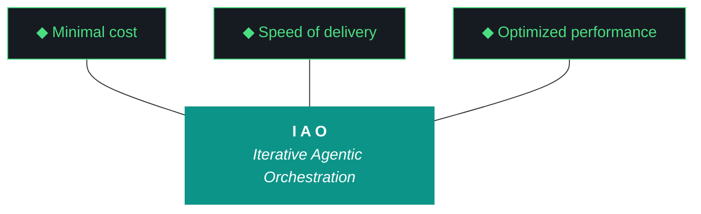

# kjtcom - Design v9.27 (Phase 9 - App Optimization: Visual Refresh + Tab Wiring)

**Pipeline:** kjtcom (cross-pipeline location intelligence platform)
**Phase:** 9 (App Optimization)
**Iteration:** 27 (global counter)
**Executor:** Claude Code
**Machine:** NZXTcos
**Date:** April 2026

---

## Objective

Phase 9 opens with a comprehensive app optimization iteration across 5 workstreams:

1. **Gothic + cyberpunk visual refresh** - selective flourishes on the dark SIEM base. Gothic typography accents, ornamental borders, subtle neon glow effects on interactive elements. Not a full redesign - an evolution.

2. **IAO Pillar tab** - new tab alongside Results/Map/Globe. Renders the mermaid trident graphic and all 10 pillars as styled visual cards. This is the methodology showcase for portfolio visitors.

3. **Map tab fix** - currently non-functional. Wire to production entity coordinates. Render geocoded entities as map markers using flutter_map (OpenStreetMap) or google_maps_flutter_web. Clicking a marker should open the detail panel.

4. **Globe tab fix** - currently non-functional. The globe_hero.jpg is a static background image. Either wire to a Three.js interactive globe via HtmlElementView, or replace with a styled SVG/canvas globe showing entity distribution by country. Clicking a country region should filter results.

5. **Search results layout** - pin results below query fields. Default to 20 results visible with expandable pagination (20/50/100 selector). Current behavior shows all results in a single scroll.

After this iteration: all 4 tabs functional (Results, Map, Globe, IAO), visual identity evolved to gothic/cyber, and search results paginated.

---

**Pillar 1 - The IAO Trident.** Every decision is governed by three competing objectives: minimal cost (free-tier LLMs over paid, API scripts over SaaS add-ons, no infrastructure that outlives its purpose), optimized performance (right-size the solution, performance from discovery and proof-of-value testing, not premature abstraction), and speed of delivery (code and objectives become stale, P0 ships, P1 ships if time allows, P2 is post-launch). Cheapest is rarely fastest. Fastest is rarely most optimized. The methodology finds the triangle's center of gravity for each decision.

**Pillar 2 - Artifact Loop.** Every iteration produces four artifacts: design doc (living architecture), plan (execution steps), build log (session transcript), report (metrics + recommendation). Previous artifacts archive to docs/archive/. Agents never see outdated instructions. If an artifact has no consumer, it should not exist.

**Pillar 3 - Diligence.** The methodology does not work if you do not read. Before any iteration touches code, the plan goes through revision - often several revisions. Diligence is investing 30 minutes in plan revision to save 3 hours of misdirected agent execution. The fastest path is the one that doesn't require rework.

**Pillar 4 - Pre-Flight Verification.** Before execution begins, validate: previous docs archived, new design + plan in place, agent instructions updated, git clean, API keys set, build tools verified. Pre-flight failures are the cheapest failures.

**Pillar 5 - Agentic Harness Orchestration.** The primary agent (Claude Code or Gemini CLI) orchestrates LLMs, MCP servers, scripts, APIs, and sub-agents within a structured harness. Agent instructions are system prompts (CLAUDE.md / GEMINI.md). Pipeline scripts are tools. Gotchas are middleware. Agents CAN build and deploy. Agents CANNOT git commit or sudo. The human commits at phase boundaries.

**Pillar 6 - Zero-Intervention Target.** Every question the agent asks during execution is a failure in the plan document. Pre-answer every decision point. Execute agents in YOLO mode, trust but verify. Measure plan quality by counting interventions - zero is the floor.

**Pillar 7 - Self-Healing Execution.** Errors are inevitable. Diagnose -> fix -> re-run. Max 3 attempts per error, then log and skip. Checkpoint after every completed step for crash recovery. Gotcha registry documents known failure patterns so the same error never causes an intervention twice.

**Pillar 8 - Phase Graduation.** Four iterative phases progressively harden the pipeline harness until production requires zero agent intervention. The agent built the harness; the harness runs the work.

**Pillar 9 - Post-Flight Functional Testing.** Three tiers: Tier 1 (app bootstraps, console clean, artifacts produced), Tier 2 (iteration-specific playbook), Tier 3 (hardening audit - Lighthouse, security headers, browser compat).

**Pillar 10 - Continuous Improvement.** The methodology evolves alongside the project. Retrospectives, gotcha registry reviews, tool efficacy reports, trident rebalancing. Static processes atrophy.

---

## IAO Pillar Compliance Matrix

| Pillar | Check | Status |
|--------|-------|--------|
| P1 - Trident | Cost: $0 (flutter_map is free/OSM, no paid map APIs). Speed: single iteration, 5 parallelizable workstreams. Performance: map/globe become functional, not just visual. | PASS |
| P2 - Artifact Loop | 4 mandatory artifacts. v8.26 docs archived. | PASS |
| P3 - Diligence | All 5 workstreams specified with file paths and implementation approach. | PASS |
| P4 - Pre-Flight | Git clean, CLAUDE.md updated, Flutter builds, new dependencies installable. | PASS |
| P5 - Harness | CLAUDE.md for v9.27. Playwright MCP for tab functional testing. | PASS |
| P6 - Zero-Intervention | Map library choice pre-decided (flutter_map). Globe approach pre-decided. Visual direction specified. | PASS |
| P7 - Self-Healing | flutter analyze + test after each workstream. Incremental deploys. | PASS |
| P8 - Graduation | Phase 9 is optimization - polishing what Phase 6-8 built. | PASS |
| P9 - Post-Flight | All 4 tabs clickable and rendering content. Pagination working. Visual refresh applied. | PASS |
| P10 - Improvement | G43-G44 added for map/globe considerations. | PASS |

---

## Architecture Decisions

[DECISION] **flutter_map + OpenStreetMap for Map tab.** Free, no API key required, works with Flutter Web. The `flutter_map` package renders OpenStreetMap tiles. Entity coordinates from `t_any_coordinates` are rendered as markers. This avoids Google Maps API costs and key management.

[DECISION] **SVG/Canvas globe for Globe tab, not Three.js.** Three.js via HtmlElementView adds heavy JS interop complexity and may conflict with Flutter's CanvasKit renderer. Instead, render a styled SVG globe (or custom-painted Canvas) showing entity distribution by continent/country. Use the `t_any_continents` and `t_any_country_codes` data to color regions. Interactive hover/click filters by country. If the SVG approach proves too limited, fall back to a simple stats dashboard showing entity counts by continent/country with the globe_hero.jpg as background.

[DECISION] **Gothic/cyber is additive, not replacement.** Keep the dark surface (#0D1117), tech green (#4ADE80), and Geist Sans/Mono. Add: ornamental border treatments on card containers (thin double-line borders, corner accents), subtle glow effects on hover states (green glow on interactive elements), and one gothic display font for section headers in the IAO tab. Consider: Cinzel, Cormorant Garamond, or EB Garamond for pillar headers. The query editor and results table remain clean/functional - gothic touches go on the IAO tab and structural chrome.

[DECISION] **Results pagination via dropdown selector, not infinite scroll.** A dropdown above the results table lets users choose 20/50/100 results per page. Default is 20 (fast initial load). The Firestore query limit stays at 1000 (from v8.23 W7) but the UI paginates client-side from the fetched results. Next/Previous buttons for page navigation.

[DECISION] **IAO tab is a scroll view with styled cards.** The trident mermaid chart renders as a styled SVG (not markdown - Flutter can't render mermaid natively). Each pillar is a card with the pillar number, title, and description text. Cards use the gothic border treatment. The tab scrolls vertically.

---

## Workstream 1: Gothic + Cyberpunk Visual Refresh

### Design Token Updates

**Keep (unchanged):**
- Dark surface: #0D1117
- Tech green: #4ADE80
- Accent orange: #FFA657
- Pipeline colors: CalGold gold, RickSteves blue, TripleDB red
- Geist Sans (body text)
- Geist Mono (query editor, code, counts)

**Add:**
- Gothic display font: Cinzel (Google Fonts - already using google_fonts package) for IAO pillar headers and section titles
- Border treatment: double-line borders (1px + 3px gap + 1px) in tech green (#4ADE80) at 30% opacity on card containers
- Corner accents: small right-angle decorations at card corners (SVG or BoxDecoration)
- Glow effect: `BoxShadow(color: Color(0x334ADE80), blurRadius: 8)` on hover for interactive elements
- Divider style: thin horizontal rules with center ornament (diamond or dot) between sections

### Files to Modify

- `app/lib/theme/tokens.dart` - add gothic tokens (font, border styles, glow)
- `app/lib/theme/theme.dart` - update ThemeData with new tokens
- `app/lib/widgets/app_shell.dart` - apply border treatment to main containers
- `app/lib/widgets/results_table.dart` - subtle border treatment on table container
- `app/lib/widgets/detail_panel.dart` - border treatment on panel container

### Constraint

The visual refresh must not break any existing functionality. All v8.23 regression tests (query defects D1-D12) must still pass. The query editor must remain clean and functional - no ornamental borders on the input field itself.

---

## Workstream 2: IAO Pillar Tab

### New File: `app/lib/widgets/iao_tab.dart`

A new widget rendered when the "IAO" tab is selected. Contains:

1. **Trident graphic** - SVG rendering of the IAO trident:
   - Central shaft: "I A O - Iterative Agentic Orchestration" in teal (#0D9488)
   - Three prongs: "Minimal cost", "Speed of delivery", "Optimized performance" in tech green on dark
   - Styled with gothic border frame

2. **10 Pillar cards** - scrollable list of cards, each containing:
   - Pillar number (large, Cinzel font, tech green)
   - Pillar title (Cinzel font, white)
   - Pillar description (Geist Sans, secondary text color)
   - Gothic double-line border with corner accents
   - Subtle green glow on hover

3. **Project stats footer** - below the pillars:
   - Total entities: 6,181
   - Pipelines: 3
   - Iterations: 26
   - Zero-intervention streak count
   - Styled as a compact stat row

### Tab Bar Update

**File:** `app/lib/widgets/kjtcom_tab_bar.dart`

Add "IAO" as the 4th tab: Results | Map | Globe | IAO

---

## Workstream 3: Map Tab Fix

### Current State

The Map tab exists in the tab bar but renders nothing (or a placeholder). Entity coordinates exist in `t_any_coordinates` on ~95% of entities.

### Implementation

**New dependency:** `flutter_map` + `latlong2` in `pubspec.yaml`

**New file:** `app/lib/widgets/map_tab.dart`

The map view:
1. Renders an OpenStreetMap tile layer (free, no API key)
2. Reads entities from the current query results (same `queryResultProvider` as Results tab)
3. For each entity with `t_any_coordinates`, renders a marker:
   - Marker color matches pipeline (gold/blue/red)
   - Marker size: small dot (8px)
   - On tap: sets `selectedEntityProvider` -> opens detail panel
4. Initial viewport: world view (zoom level ~2, centered on Europe since most entities are European)
5. If query results change, markers update automatically (Riverpod watch)
6. Cluster markers at low zoom levels to avoid overwhelming the map (use `flutter_map_marker_cluster` if available, otherwise skip clustering for v9.27)

### Map Constraints

- No Google Maps API key required (OpenStreetMap tiles are free)
- Map tiles load via HTTPS from tile.openstreetmap.org
- Entity count on map may differ from results table (entities without coordinates are excluded)

---

## Workstream 4: Globe Tab Fix

### Current State

The Globe tab renders nothing (or the globe_hero.jpg background). The original v6.15 design envisioned a Three.js rotating globe but this was never implemented.

### Implementation (Option A: Stats Dashboard with Globe Background)

**New file:** `app/lib/widgets/globe_tab.dart`

Rather than full 3D globe interactivity (heavy Three.js interop), render a visually compelling stats dashboard:

1. **Globe hero background** - globe_hero.jpg at 15% opacity (already exists as asset)
2. **Continent breakdown cards** - one card per continent showing:
   - Continent name (Cinzel font)
   - Entity count
   - Country count
   - Top 3 countries by entity count
   - Click -> filters results to that continent
3. **Country grid** - below continent cards, show all countries with entity counts
   - Sorted by count descending
   - Click -> filters results to that country
   - Show ISO flag emoji or country code badge
4. **Pipeline distribution** - pie chart or bar showing CalGold/RickSteves/TripleDB split

This approach is achievable in pure Flutter/Dart without Three.js interop, renders fast, and provides genuine analytical value.

### Globe Constraints

- No external JS libraries
- Must work with CanvasKit renderer
- Data sourced from `t_any_continents`, `t_any_countries`, `t_any_country_codes`
- Clicking a continent/country appends a filter clause to the query editor

---

## Workstream 5: Search Results Pagination

### Current Behavior

All results (up to 1000) render in a single scrollable table. For broad queries (e.g., 653 "medieval" results), this creates a very long page.

### New Behavior

1. **Pagination dropdown** above results table: `Show: 20 | 50 | 100` (default: 20)
2. **Page navigation** below results table: `< Previous | Page 1 of 33 | Next >`
3. Client-side pagination from the Firestore result set (query still fetches up to 1000)
4. Page state managed via Riverpod provider
5. Changing the pagination size resets to page 1

### Files to Modify

- `app/lib/widgets/results_table.dart` - pagination dropdown, page controls, sliced entity list
- `app/lib/providers/` - new `paginationProvider` for page size and current page state

---

## Success Criteria

| Criteria | Target |
|----------|--------|
| Gothic/cyber visual tokens applied | Border treatments, glow effects, Cinzel font on headers |
| IAO tab renders trident + 10 pillars | Styled cards, scrollable |
| Map tab renders entity markers on OSM | Pipeline-colored, clickable |
| Globe tab renders continent/country stats | Clickable filters |
| Results default to 20 per page | Dropdown: 20/50/100, page nav |
| All existing queries still work | v8.23 regression pass |
| Detail panel works from all tabs | Row click (Results), marker click (Map), country click (Globe) |
| flutter analyze | 0 issues |
| flutter test | All pass |
| firebase deploy | Success |
| Interventions | 0 |
| Artifacts | 4 mandatory docs |

---

## Complete Gotcha Registry

| ID | Gotcha | Prevention | Status |
|----|--------|-----------|--------|
| G1 | Heredocs in fish shell | Use printf blocks, never heredocs | ACTIVE |
| G2 | CUDA LD_LIBRARY_PATH | source ~/.config/fish/config.fish before transcription | RESOLVED |
| G11 | API key leaks in catted files | NEVER cat config.fish or SA JSON files. grep only. | ACTIVE |
| G18 | Gemini 5-minute command timeout | Use background job execution | ACTIVE |
| G19 | Gemini runs bash by default | Wrap in `fish -c` | ACTIVE |
| G20 | Config.fish contains API keys | grep only, never cat | ACTIVE |
| G21 | CUDA OOM on simultaneous transcription | Sequential processing, graduated timeouts | ACTIVE |
| G22 | Fish `ls` color codes | Use `command ls` | ACTIVE |
| G23 | LD_LIBRARY_PATH CUDA path | Set in config.fish | RESOLVED (by G2) |
| G24 | Checkpoint staleness on re-extraction | Reset checkpoints for new prompts | ACTIVE |
| G30 | Cross-project SA permissions | Verify both SA files before migration | ACTIVE |
| G31 | TripleDB schema drift | Inspect actual data before migration | RESOLVED (v7.21) |
| G32 | Production Firestore rules | Admin SDK bypasses rules, verify IAM | ACTIVE |
| G33 | Duplicate entity IDs | Deterministic t_row_id, check before write | ACTIVE |
| G34 | Firestore single array-contains limit | One per query, client-side for additional | ACTIVE |
| G35 | Production write safety | --dry-run before full run | ACTIVE |
| G36 | Case-sensitive arrayContains | All data + input lowercased | RESOLVED (v8.23) |
| G37 | t_any_shows inconsistent casing | All lowercased | RESOLVED (v8.23) |
| G38 | Firebase deploy auth expiry | firebase login --reauth, deploy from repo root | ACTIVE |
| G39 | Detail panel provider chain | Must be in widget tree at all viewports | RESOLVED (v8.24) |
| G40 | Compound country names | Manual split required, 6 unmapped | DOCUMENTED |
| G41 | Rebuild-triggered event handlers | Dedup + guard flag on provider-modifying handlers | RESOLVED (v8.25) |
| G42 | Rotating queries overwrite input | Removed rotation entirely | RESOLVED (v8.26) |
| G43 (NEW) | Flutter Web map tile CORS | OpenStreetMap tiles may have CORS issues in CanvasKit mode. Test in both CanvasKit and HTML renderer. If CORS blocks tiles, add `--web-renderer html` to build. | ACTIVE |
| G44 (NEW) | flutter_map version compatibility | Verify flutter_map version compatible with current Flutter SDK (3.41.6). Check pub.dev for latest stable. | ACTIVE |

---

## Phase Structure Reference

| Phase | Name | Status | Iteration |
|-------|------|--------|-----------|
| 0 | Scaffold & Environment | DONE | v0.5 |
| 1 | Discovery (30 videos) | DONE | v1.6, v1.7 |
| 2 | Calibration (60 videos) | DONE | v2.8, v2.9 |
| 3 | Stress Test (90 videos) | DONE | v3.10, v3.11 |
| 4 | Validation + Schema v3 (120 videos) | DONE | v4.12, v4.13 |
| 5 | Production Run (full datasets) | DONE | v5.14, v5.17 |
| 6 | Flutter App | DONE | v6.15-v6.20 |
| 7 | Firestore Load | DONE | v7.21 |
| 8 | Enrichment Hardening | DONE | v8.22-v8.26 |
| 9 | App Optimization | IN PROGRESS | v9.27 |
| 10 | Retrospective + Template | Pending | - |
