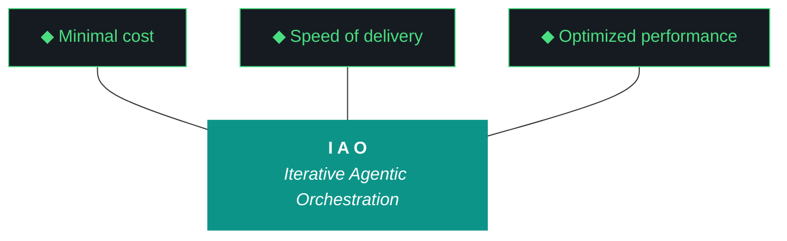

# kjtcom - Design v9.28 (Phase 9 - Gotcha Tab + Schema Builder + JSON Copy)

**Pipeline:** kjtcom (cross-pipeline location intelligence platform)
**Phase:** 9 (App Optimization)
**Iteration:** 28 (global counter)
**Executor:** Claude Code
**Machine:** NZXTcos
**Date:** April 2026

---

## Objective

Four work items building on the v9.27 tab infrastructure:

1. **Gotcha tab** - new tab displaying the full gotcha registry (G1-G42) as styled cards with status badges. Portfolio visitors see the failure pattern documentation that makes zero-intervention execution possible.

2. **Schema tab with query builder** - new tab listing all Thompson Indicator Fields. Each field is clickable - clicking a field adds it to the query editor as a pre-formatted clause stub. This is the "query builder" UX that makes the NoSQL editor accessible to visitors who don't know the field names.

3. **Copy JSON button on detail panel** - when the detail panel opens for an entity, a copy icon at the top copies the full entity JSON payload to clipboard. One-click access to the raw data.

4. **Post-flight deploy testing** - every iteration must include `flutter build web` + `firebase deploy --only hosting` + live site verification as part of the execution steps, not just a suggestion.

After this iteration: 6 tabs (Results, Map, Globe, IAO, Gotcha, Schema), JSON copy on detail panel, and schema-driven query building.

---



**Pillar 1 - The IAO Trident.** Every decision is governed by three competing objectives: minimal cost (free-tier LLMs over paid, API scripts over SaaS add-ons, no infrastructure that outlives its purpose), optimized performance (right-size the solution, performance from discovery and proof-of-value testing, not premature abstraction), and speed of delivery (code and objectives become stale, P0 ships, P1 ships if time allows, P2 is post-launch). Cheapest is rarely fastest. Fastest is rarely most optimized. The methodology finds the triangle's center of gravity for each decision.

**Pillar 2 - Artifact Loop.** Every iteration produces four artifacts: design doc (living architecture), plan (execution steps), build log (session transcript), report (metrics + recommendation). Previous artifacts archive to docs/archive/. Agents never see outdated instructions. If an artifact has no consumer, it should not exist.

**Pillar 3 - Diligence.** The methodology does not work if you do not read. Before any iteration touches code, the plan goes through revision - often several revisions. Diligence is investing 30 minutes in plan revision to save 3 hours of misdirected agent execution. The fastest path is the one that doesn't require rework.

**Pillar 4 - Pre-Flight Verification.** Before execution begins, validate: previous docs archived, new design + plan in place, agent instructions updated, git clean, API keys set, build tools verified. Pre-flight failures are the cheapest failures.

**Pillar 5 - Agentic Harness Orchestration.** The primary agent (Claude Code or Gemini CLI) orchestrates LLMs, MCP servers, scripts, APIs, and sub-agents within a structured harness. Agent instructions are system prompts (CLAUDE.md / GEMINI.md). Pipeline scripts are tools. Gotchas are middleware. Agents CAN build and deploy. Agents CANNOT git commit or sudo. The human commits at phase boundaries.

**Pillar 6 - Zero-Intervention Target.** Every question the agent asks during execution is a failure in the plan document. Pre-answer every decision point. Execute agents in YOLO mode, trust but verify. Measure plan quality by counting interventions - zero is the floor.

**Pillar 7 - Self-Healing Execution.** Errors are inevitable. Diagnose -> fix -> re-run. Max 3 attempts per error, then log and skip. Checkpoint after every completed step for crash recovery. Gotcha registry documents known failure patterns so the same error never causes an intervention twice.

**Pillar 8 - Phase Graduation.** Four iterative phases progressively harden the pipeline harness until production requires zero agent intervention. The agent built the harness; the harness runs the work.

**Pillar 9 - Post-Flight Functional Testing.** Three tiers: Tier 1 (app bootstraps, console clean, artifacts produced), Tier 2 (iteration-specific automated playbook), Tier 3 (hardening audit - Lighthouse, security headers, browser compat).

**Pillar 10 - Continuous Improvement.** The methodology evolves alongside the project. Retrospectives, gotcha registry reviews, tool efficacy reports, trident rebalancing. Static processes atrophy.

---

## IAO Pillar Compliance Matrix

| Pillar | Check | Status |
|--------|-------|--------|
| P1 - Trident | Cost: $0. Speed: 4 focused additions on existing tab infra. Performance: schema builder improves UX for non-technical visitors. | PASS |
| P2 - Artifact Loop | 4 mandatory artifacts. v9.27 docs archived. | PASS |
| P3 - Diligence | All 4 items scoped from live user testing feedback. | PASS |
| P4 - Pre-Flight | Git clean, CLAUDE.md updated, Flutter builds, Firebase auth. | PASS |
| P5 - Harness | CLAUDE.md for v9.28. | PASS |
| P6 - Zero-Intervention | All items have file paths, data sources, and UI specs. | PASS |
| P7 - Self-Healing | flutter analyze + test after each change. Build + deploy mandatory. | PASS |
| P8 - Graduation | Phase 9 optimization - adding UX features to existing tabs. | PASS |
| P9 - Post-Flight | MANDATORY: flutter build web + firebase deploy + live site functional test. | PASS |
| P10 - Improvement | Post-flight deploy testing now standard for all future iterations. | PASS |

---

## Architecture Decisions

[DECISION] **Tab bar: Results | Map | Globe | IAO | Gotcha | Schema.** Six tabs. The tab bar may need horizontal scrolling on mobile if it overflows. Use TabBar with `isScrollable: true` if needed.

[DECISION] **Gotcha data is hardcoded in Dart, not fetched from Firestore.** The gotcha registry is a development methodology artifact, not pipeline data. It changes only at iteration boundaries (when Kyle commits). Hardcode the registry as a Dart list of objects in the widget file. Update it each iteration alongside CLAUDE.md.

[DECISION] **Schema tab field list is hardcoded from the known fields list.** The 22 known Thompson Indicator Fields are already defined in `query_clause.dart` (`knownFields` set). The Schema tab reads from this same source. Each field shows its type, description, and example values. Clicking a field appends a clause stub to the query editor.

[DECISION] **JSON copy uses Dart's Clipboard API.** `Clipboard.setData(ClipboardData(text: jsonEncode(entity.rawData)))` copies the full entity document. Show a brief "Copied!" toast/snackbar confirmation.

[DECISION] **Post-flight deploy is MANDATORY.** Every iteration from v9.28 forward must include `flutter build web` and `firebase deploy --only hosting` as explicit execution steps, with live site verification documented in the build log. No iteration is complete without a deployed verification.

---

## Work Items

### W1: Gotcha Tab

**New file:** `app/lib/widgets/gotcha_tab.dart`
**Update:** `app/lib/widgets/kjtcom_tab_bar.dart`

The Gotcha tab displays the full gotcha registry as a scrollable list of styled cards.

**Card structure:**
- ID badge (e.g., "G33") in tech green, Cinzel font
- Title: gotcha name (bold, Geist Sans)
- Prevention: description text (Geist Sans, secondary color)
- Status badge: ACTIVE (green outline), RESOLVED (dimmed with strikethrough on title), DOCUMENTED (orange outline)
- Gothic border treatment (matching IAO tab cards)

**Data source:** Hardcoded Dart list. Example structure:

```dart
class Gotcha {
  final String id;
  final String title;
  final String prevention;
  final String status; // 'active', 'resolved', 'documented'
  final String? resolvedIn; // e.g., 'v8.23'
}

final gotchaRegistry = [
  Gotcha(id: 'G1', title: 'Heredocs in fish shell', prevention: 'Use printf blocks, never heredocs', status: 'active'),
  Gotcha(id: 'G2', title: 'CUDA LD_LIBRARY_PATH', prevention: 'source ~/.config/fish/config.fish before transcription', status: 'resolved', resolvedIn: 'v3.10'),
  // ... all 42 gotchas
];
```

**Include all gotchas G1-G42 from the registry in the design doc below.**

**Header:** "Gotcha Registry" in Cinzel font with a subtitle "Failure patterns documented across 26 iterations. Each gotcha prevented at least one intervention."

**Filter:** Optional toggle at top: "Show all | Active only | Resolved" - defaults to "Show all"

### W2: Schema Tab with Query Builder

**New file:** `app/lib/widgets/schema_tab.dart`
**Update:** `app/lib/widgets/kjtcom_tab_bar.dart`

The Schema tab lists all Thompson Indicator Fields with descriptions and clickable query builder.

**Field card structure:**
- Field name in Geist Mono (e.g., `t_any_cuisines`)
- Type badge: "array[string]" in secondary color
- Description (Geist Sans)
- Example values (Geist Mono, dimmed): e.g., `["french", "italian", "mexican"]`
- **"+ Add to query" button** (tech green) - on click:
  - Appends `| where {field_name} contains ""` to the query editor
  - Places cursor between the quotes (or as close as Flutter TextField allows)
  - Switches to Results tab automatically

**Field list (22 fields):**

| Field | Type | Description | Examples |
|-------|------|-------------|----------|
| t_log_type | string | Pipeline ID | calgold, ricksteves, tripledb |
| t_any_names | array[string] | Entity names | eiffel tower, mama's soul food |
| t_any_people | array[string] | People mentioned | rick steves, huell howser |
| t_any_cities | array[string] | City names | paris, memphis |
| t_any_states | array[string] | State codes | ca, ny, tn |
| t_any_counties | array[string] | County names | los angeles county |
| t_any_countries | array[string] | Country names | france, italy, us |
| t_any_country_codes | array[string] | ISO 3166-1 alpha-2 | fr, it, us |
| t_any_regions | array[string] | Sub-country regions | bavaria, tuscany |
| t_any_keywords | array[string] | Searchable terms | gothic, museum, barbecue |
| t_any_categories | array[string] | Category tags | landmark, restaurant |
| t_any_actors | array[string] | Featured people | guy fieri, rick steves |
| t_any_roles | array[string] | Role types | host, guide, chef |
| t_any_shows | array[string] | Show names | california's gold, diners drive-ins and dives |
| t_any_cuisines | array[string] | Cuisine types | french, mexican, barbecue |
| t_any_dishes | array[string] | Food items | gelato, fried chicken |
| t_any_eras | array[string] | Historical periods | medieval, roman |
| t_any_continents | array[string] | Continents | europe, north america |
| t_any_urls | array[string] | URLs | youtube links, websites |
| t_any_video_ids | array[string] | YouTube video IDs | dQw4w9WgXcQ |
| t_any_coordinates | array[map] | Lat/lon pairs | {"lat": 48.85, "lon": 2.29} |
| t_any_geohashes | array[string] | Geohash prefixes | u09t, u09tv |

**For `t_log_type` (string, not array):** the builder should append `| where t_log_type == ""` instead of `contains`.

**For `t_any_coordinates` and `t_any_geohashes`:** these aren't directly queryable via the text editor. Show them as "view only" without the "Add to query" button.

**Header:** "Thompson Indicator Fields" in Cinzel font with subtitle "22 universal fields across all pipeline datasets. Click any field to build a query."

### W3: Copy JSON Button on Detail Panel

**File:** `app/lib/widgets/detail_panel.dart`

Add a copy icon button at the top of the detail panel (next to the entity name / close button).

**Implementation:**
- Icon: copy/clipboard icon (from `lucide_icons` if available, otherwise `Icons.copy` from Material)
- On tap: `Clipboard.setData(ClipboardData(text: jsonEncode(entity.toMap())))` where `toMap()` returns the raw Firestore document data
- Show a SnackBar or brief tooltip: "JSON copied to clipboard" for 2 seconds
- The copied JSON should be the complete entity document including all t_any_* fields, t_enrichment, source data, etc.

**LocationEntity model update:** If `toMap()` or `rawData` doesn't exist, add a `Map<String, dynamic> rawData` field that preserves the original Firestore document data. This should be populated in the factory constructor from Firestore snapshot.

### W4: Post-Flight Deploy Testing Standard

No code change. This is a process standard:

**Every iteration from v9.28 forward must include these steps in the plan:**

```
## Post-Flight Deploy + Live Verification (MANDATORY)

1. flutter build web
2. firebase deploy --only hosting (from repo root)
3. Open kylejeromethompson.com in browser
4. Verify each new feature on the live site
5. Document verification results in build log
6. If any feature fails on live site: diagnose, fix, rebuild, redeploy
```

This is baked into the plan doc Section B below.

---

## Success Criteria

| Criteria | Target |
|----------|--------|
| Gotcha tab renders all 42 gotchas | Yes, with status badges |
| Gotcha tab filter (all/active/resolved) works | Yes |
| Schema tab renders all 22 fields | Yes, with types and examples |
| Schema field click adds clause to query | Yes, switches to Results tab |
| t_log_type click uses == operator | Yes |
| Copy JSON button on detail panel | Yes, copies full entity |
| SnackBar confirmation on copy | Yes |
| Live site deployment verified | Yes |
| All 6 tabs functional | Results, Map, Globe, IAO, Gotcha, Schema |
| flutter analyze | 0 issues |
| flutter test | All pass |
| firebase deploy | Success |
| Interventions | 0 |
| Artifacts | 4 mandatory docs |

---

## Complete Gotcha Registry

| ID | Gotcha | Prevention | Status |
|----|--------|-----------|--------|
| G1 | Heredocs in fish shell | Use printf blocks, never heredocs | ACTIVE |
| G2 | CUDA LD_LIBRARY_PATH | source ~/.config/fish/config.fish before transcription | RESOLVED |
| G11 | API key leaks in catted files | NEVER cat config.fish or SA JSON files. grep only. | ACTIVE |
| G18 | Gemini 5-minute command timeout | Use background job execution | ACTIVE |
| G19 | Gemini runs bash by default | Wrap in `fish -c` | ACTIVE |
| G20 | Config.fish contains API keys | grep only, never cat | ACTIVE |
| G21 | CUDA OOM on simultaneous transcription | Sequential processing, graduated timeouts | ACTIVE |
| G22 | Fish `ls` color codes | Use `command ls` | ACTIVE |
| G23 | LD_LIBRARY_PATH CUDA path | Set in config.fish | RESOLVED (by G2) |
| G24 | Checkpoint staleness on re-extraction | Reset checkpoints for new prompts | ACTIVE |
| G30 | Cross-project SA permissions | Verify both SA files before migration | ACTIVE |
| G31 | TripleDB schema drift | Inspect actual data before migration | RESOLVED (v7.21) |
| G32 | Production Firestore rules | Admin SDK bypasses rules, verify IAM | ACTIVE |
| G33 | Duplicate entity IDs | Deterministic t_row_id, check before write | ACTIVE |
| G34 | Firestore single array-contains limit | One per query, client-side for additional | ACTIVE |
| G35 | Production write safety | --dry-run before full run | ACTIVE |
| G36 | Case-sensitive arrayContains | All data + input lowercased | RESOLVED (v8.23) |
| G37 | t_any_shows inconsistent casing | All lowercased | RESOLVED (v8.23) |
| G38 | Firebase deploy auth expiry | firebase login --reauth, deploy from repo root | ACTIVE |
| G39 | Detail panel provider chain | Must be in widget tree at all viewports | RESOLVED (v8.24) |
| G40 | Compound country names | Manual split required, 6 unmapped | DOCUMENTED |
| G41 | Rebuild-triggered event handlers | Dedup + guard flag | RESOLVED (v8.25) |
| G42 | Rotating queries overwrite input | Removed rotation | RESOLVED (v8.26) |
| G43 | Flutter Web map tile CORS | Test CanvasKit + HTML renderer for OSM tiles | ACTIVE |
| G44 | flutter_map version compatibility | Check pub.dev for Flutter SDK compat | ACTIVE |

---

## Phase Structure Reference

| Phase | Name | Status | Iteration |
|-------|------|--------|-----------|
| 0 | Scaffold & Environment | DONE | v0.5 |
| 1 | Discovery (30 videos) | DONE | v1.6, v1.7 |
| 2 | Calibration (60 videos) | DONE | v2.8, v2.9 |
| 3 | Stress Test (90 videos) | DONE | v3.10, v3.11 |
| 4 | Validation + Schema v3 (120 videos) | DONE | v4.12, v4.13 |
| 5 | Production Run (full datasets) | DONE | v5.14, v5.17 |
| 6 | Flutter App | DONE | v6.15-v6.20 |
| 7 | Firestore Load | DONE | v7.21 |
| 8 | Enrichment Hardening | DONE | v8.22-v8.26 |
| 9 | App Optimization | IN PROGRESS | v9.27, v9.28 |
| 10 | Retrospective + Template | Pending | - |
