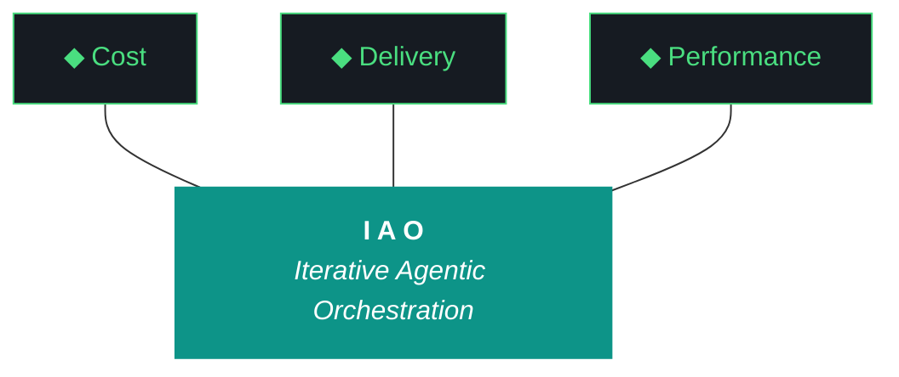

# kjtcom - Design v9.29 (Phase 9 - UX Polish: Trident, Limits, Schema, Quotes)

**Pipeline:** kjtcom (cross-pipeline location intelligence platform)
**Phase:** 9 (App Optimization)
**Iteration:** 29 (global counter)
**Executor:** Claude Code
**Machine:** NZXTcos
**Date:** April 2026

---

## Objective

Four targeted fixes from live testing:

1. **Mobile trident labels** - "Optimized performance" truncates on mobile. Shorten all three prong labels to: "Cost", "Delivery", "Performance".
2. **Remove 1000-result Firestore limit** - we have 6,181 entities, not millions. Remove the query limit entirely. Fetch all matching results from Firestore, but paginate the UI to show 20 at a time (client-side). The Firestore query should return the complete result set.
3. **Missing schema fields** - t_any_cuisines and potentially others are missing from the Schema tab. Audit the schema_tab.dart field list against the 22 known fields in query_clause.dart and fix any gaps.
4. **Quote cursor placement in schema builder** - clicking "+ Add to query" on a schema field appends a clause like `| where t_any_states contains ""` but the cursor doesn't land between the quotes. Users end up typing outside the quotes (e.g., `ca""` or `san diego"`). Fix the clause format and cursor positioning.

---



**Pillar 1 - The IAO Trident.** Every decision is governed by three competing objectives: minimal cost (free-tier LLMs over paid, API scripts over SaaS add-ons, no infrastructure that outlives its purpose), optimized performance (right-size the solution, performance from discovery and proof-of-value testing, not premature abstraction), and speed of delivery (code and objectives become stale, P0 ships, P1 ships if time allows, P2 is post-launch). Cheapest is rarely fastest. Fastest is rarely most optimized. The methodology finds the triangle's center of gravity for each decision.

**Pillar 2 - Artifact Loop.** Every iteration produces four artifacts: design doc (living architecture), plan (execution steps), build log (session transcript), report (metrics + recommendation). Previous artifacts archive to docs/archive/. Agents never see outdated instructions. If an artifact has no consumer, it should not exist.

**Pillar 3 - Diligence.** The methodology does not work if you do not read. Before any iteration touches code, the plan goes through revision - often several revisions. Diligence is investing 30 minutes in plan revision to save 3 hours of misdirected agent execution. The fastest path is the one that doesn't require rework.

**Pillar 4 - Pre-Flight Verification.** Before execution begins, validate: previous docs archived, new design + plan in place, agent instructions updated, git clean, API keys set, build tools verified. Pre-flight failures are the cheapest failures.

**Pillar 5 - Agentic Harness Orchestration.** The primary agent (Claude Code or Gemini CLI) orchestrates LLMs, MCP servers, scripts, APIs, and sub-agents within a structured harness. Agent instructions are system prompts (CLAUDE.md / GEMINI.md). Pipeline scripts are tools. Gotchas are middleware. Agents CAN build and deploy. Agents CANNOT git commit or sudo. The human commits at phase boundaries.

**Pillar 6 - Zero-Intervention Target.** Every question the agent asks during execution is a failure in the plan document. Pre-answer every decision point. Execute agents in YOLO mode, trust but verify. Measure plan quality by counting interventions - zero is the floor.

**Pillar 7 - Self-Healing Execution.** Errors are inevitable. Diagnose -> fix -> re-run. Max 3 attempts per error, then log and skip. Checkpoint after every completed step for crash recovery. Gotcha registry documents known failure patterns so the same error never causes an intervention twice.

**Pillar 8 - Phase Graduation.** Four iterative phases progressively harden the pipeline harness until production requires zero agent intervention. The agent built the harness; the harness runs the work.

**Pillar 9 - Post-Flight Functional Testing.** Three tiers: Tier 1 (app bootstraps, console clean, artifacts produced), Tier 2 (iteration-specific automated playbook), Tier 3 (hardening audit - Lighthouse, security headers, browser compat).

**Pillar 10 - Continuous Improvement.** The methodology evolves alongside the project. Retrospectives, gotcha registry reviews, tool efficacy reports, trident rebalancing. Static processes atrophy.

---

## Work Items

### W1: Shorten Mobile Trident Labels (P1)

**File:** `app/lib/widgets/iao_tab.dart`

The three prong labels ("Minimal cost", "Speed of delivery", "Optimized performance") truncate on mobile. Change to:
- "Cost"
- "Delivery"
- "Performance"

The full descriptions remain in the Pillar 1 card text. The prongs are just labels.

Also update the mermaid chart in future design docs to use the short labels (already done in this doc above).

### W2: Remove Firestore Query Limit (P0)

**File:** `app/lib/providers/firestore_provider.dart`

Current: `query.limit(1000)` caps all Firestore queries.

Change: Remove the `.limit()` call entirely. With 6,181 total entities, even the broadest query (`t_any_keywords contains "medieval"` = 653 results) is well within Firestore's capabilities.

The pagination UI (Show: 20/50/100 dropdown from v9.27) already handles client-side slicing. It just needs the full result set to slice from.

Update the truncation indicator logic: since there's no limit, the "1000+ results" warning should never trigger. The result count badge should always show the true total.

Update `QueryResult` class: `isTruncated` should always be `false` now. Consider simplifying or removing the truncation indicator widget.

### W3: Fix Missing Schema Fields (P1)

**File:** `app/lib/widgets/schema_tab.dart`

Audit the hardcoded field list in `schema_tab.dart` against the 22 known fields in `query_clause.dart` `knownFields` set. Specifically verify t_any_cuisines is present.

The full list that MUST be in schema_tab.dart:

1. t_log_type
2. t_any_names
3. t_any_people
4. t_any_cities
5. t_any_states
6. t_any_counties
7. t_any_countries
8. t_any_country_codes
9. t_any_regions
10. t_any_keywords
11. t_any_categories
12. t_any_actors
13. t_any_roles
14. t_any_shows
15. t_any_cuisines
16. t_any_dishes
17. t_any_eras
18. t_any_continents
19. t_any_urls
20. t_any_video_ids
21. t_any_coordinates (view only)
22. t_any_geohashes (view only)

If any are missing, add them with type, description, and example values.

### W4: Fix Quote Cursor Placement in Schema Builder (P0)

**Files:** `app/lib/widgets/schema_tab.dart`, `app/lib/providers/query_provider.dart`

Current behavior when clicking "+ Add to query" on a schema field:
- Appends: `| where t_any_states contains ""`
- Cursor does NOT land between the quotes
- User types outside quotes: `ca""` or `san diego"`

The problem is the `appendClause` method appends the full clause with empty quotes, then the TextField cursor stays at the end of the entire query text. The user's next keystrokes go after the closing quote.

**Fix approach:** Instead of appending a complete clause with empty quotes, append an incomplete clause WITHOUT the closing quote:

```
| where t_any_states contains "
```

The user types their value, then manually closes the quote. This is how SIEM query builders work - they give you the syntax stub and you complete it.

Alternatively, if we want to keep the closing quote: after appending, programmatically set the TextField cursor position to be INSIDE the quotes (one character before the closing quote). This requires access to the TextEditingController's selection.

**Recommended: Option 1 (no closing quote).** Simpler, more intuitive, matches how developers actually type queries. The parser should handle a missing closing quote gracefully (treat end-of-line as implicit close).

Update `query_clause.dart` parser to accept a value without a closing quote at end of line: `t_any_states contains "san diego` should parse the same as `t_any_states contains "san diego"`.

---

## Success Criteria

| Criteria | Target |
|----------|--------|
| Trident labels fit on mobile | "Cost", "Delivery", "Performance" |
| No Firestore query limit | All matching results returned |
| Result count shows true total | Not capped at 1000 |
| All 22 schema fields present | Including t_any_cuisines |
| Schema builder quote placement works | User can type value naturally |
| flutter analyze | 0 issues |
| flutter test | All pass |
| firebase deploy + live verify | Success |
| Interventions | 0 |
| Artifacts | 4 mandatory docs |

---

## Complete Gotcha Registry

| ID | Gotcha | Prevention | Status |
|----|--------|-----------|--------|
| G1 | Heredocs in fish shell | Use printf blocks, never heredocs | ACTIVE |
| G2 | CUDA LD_LIBRARY_PATH | source ~/.config/fish/config.fish before transcription | RESOLVED |
| G11 | API key leaks in catted files | NEVER cat config.fish or SA JSON files. grep only. | ACTIVE |
| G18 | Gemini 5-minute command timeout | Use background job execution | ACTIVE |
| G19 | Gemini runs bash by default | Wrap in `fish -c` | ACTIVE |
| G20 | Config.fish contains API keys | grep only, never cat | ACTIVE |
| G21 | CUDA OOM on simultaneous transcription | Sequential processing, graduated timeouts | ACTIVE |
| G22 | Fish `ls` color codes | Use `command ls` | ACTIVE |
| G23 | LD_LIBRARY_PATH CUDA path | Set in config.fish | RESOLVED (by G2) |
| G24 | Checkpoint staleness on re-extraction | Reset checkpoints for new prompts | ACTIVE |
| G30 | Cross-project SA permissions | Verify both SA files before migration | ACTIVE |
| G31 | TripleDB schema drift | Inspect actual data before migration | RESOLVED (v7.21) |
| G32 | Production Firestore rules | Admin SDK bypasses rules, verify IAM | ACTIVE |
| G33 | Duplicate entity IDs | Deterministic t_row_id, check before write | ACTIVE |
| G34 | Firestore single array-contains limit | One per query, client-side for additional | ACTIVE |
| G35 | Production write safety | --dry-run before full run | ACTIVE |
| G36 | Case-sensitive arrayContains | All data + input lowercased | RESOLVED (v8.23) |
| G37 | t_any_shows inconsistent casing | All lowercased | RESOLVED (v8.23) |
| G38 | Firebase deploy auth expiry | firebase login --reauth, deploy from repo root | ACTIVE |
| G39 | Detail panel provider chain | Must be in widget tree at all viewports | RESOLVED (v8.24) |
| G40 | Compound country names | Manual split required, 6 unmapped | DOCUMENTED |
| G41 | Rebuild-triggered event handlers | Dedup + guard flag | RESOLVED (v8.25) |
| G42 | Rotating queries overwrite input | Removed rotation | RESOLVED (v8.26) |
| G43 | Flutter Web map tile CORS | Test CanvasKit + HTML renderer for OSM tiles | ACTIVE |
| G44 | flutter_map version compatibility | Check pub.dev for Flutter SDK compat | ACTIVE |
| G45 (NEW) | Schema builder cursor placement | Append clause WITHOUT closing quote. Parser must accept unclosed quotes at end of line. | ACTIVE |

---

## Phase Structure Reference

| Phase | Name | Status | Iteration |
|-------|------|--------|-----------|
| 0 | Scaffold & Environment | DONE | v0.5 |
| 1 | Discovery (30 videos) | DONE | v1.6, v1.7 |
| 2 | Calibration (60 videos) | DONE | v2.8, v2.9 |
| 3 | Stress Test (90 videos) | DONE | v3.10, v3.11 |
| 4 | Validation + Schema v3 (120 videos) | DONE | v4.12, v4.13 |
| 5 | Production Run (full datasets) | DONE | v5.14, v5.17 |
| 6 | Flutter App | DONE | v6.15-v6.20 |
| 7 | Firestore Load | DONE | v7.21 |
| 8 | Enrichment Hardening | DONE | v8.22-v8.26 |
| 9 | App Optimization | IN PROGRESS | v9.27-v9.29 |
| 10 | Retrospective + Template | Pending | - |
