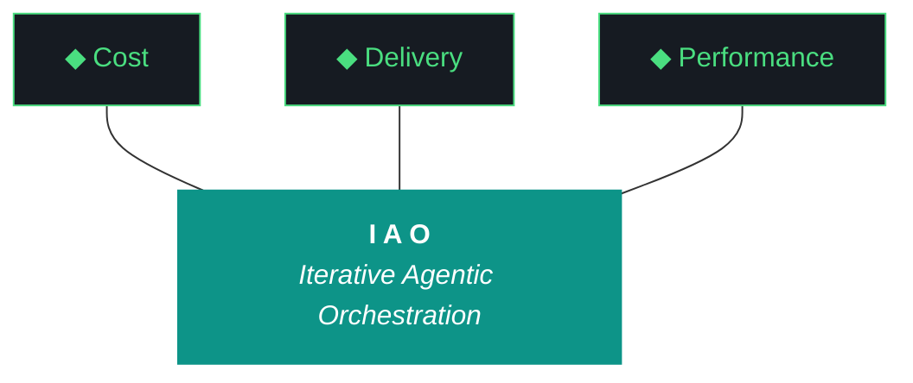

# kjtcom - Design v9.30 (Phase 9 - Autocomplete + Quote Fix + Limit Fix)

**Pipeline:** kjtcom (cross-pipeline location intelligence platform)
**Phase:** 9 (App Optimization)
**Iteration:** 30 (global counter)
**Executor:** Claude Code
**Machine:** NZXTcos
**Date:** April 2026

---

## Objective

Four work items addressing persistent UX issues and a major new feature:

1. **Query field autocomplete** - as the user types `t_any_`, show a dropdown of matching schema fields. After selecting a field and typing inside quotes, show matching values from a precomputed value index. Tab to accept suggestions.

2. **Fix quote typing (3rd attempt)** - users STILL cannot type inside quotes after schema builder appends a clause. Previous approaches (remove closing quote, cursor positioning) failed. New approach: expose the TextEditingController via a provider so the schema builder can set cursor position explicitly after appending.

3. **Fix 1000-result limit (2nd attempt)** - the limit was supposedly removed in v9.29 but the UI still shows "Showing 1000 of 1000+ results" and caps at 1000. Diagnose why the fix didn't take effect and actually remove the limit.

4. **Consistent mobile/web trident labels** - v9.29 was supposed to shorten labels but the web version still shows full labels. Apply "Cost", "Delivery", "Performance" on ALL viewports.

---



**Pillar 1 - The IAO Trident.** Every decision is governed by three competing objectives: minimal cost (free-tier LLMs over paid, API scripts over SaaS add-ons, no infrastructure that outlives its purpose), optimized performance (right-size the solution, performance from discovery and proof-of-value testing, not premature abstraction), and speed of delivery (code and objectives become stale, P0 ships, P1 ships if time allows, P2 is post-launch). Cheapest is rarely fastest. Fastest is rarely most optimized. The methodology finds the triangle's center of gravity for each decision.

**Pillar 2 - Artifact Loop.** Every iteration produces four artifacts: design doc (living architecture), plan (execution steps), build log (session transcript), report (metrics + recommendation). Previous artifacts archive to docs/archive/. Agents never see outdated instructions. If an artifact has no consumer, it should not exist.

**Pillar 3 - Diligence.** The methodology does not work if you do not read. Before any iteration touches code, the plan goes through revision - often several revisions. Diligence is investing 30 minutes in plan revision to save 3 hours of misdirected agent execution. The fastest path is the one that doesn't require rework.

**Pillar 4 - Pre-Flight Verification.** Before execution begins, validate: previous docs archived, new design + plan in place, agent instructions updated, git clean, API keys set, build tools verified. Pre-flight failures are the cheapest failures.

**Pillar 5 - Agentic Harness Orchestration.** The primary agent (Claude Code or Gemini CLI) orchestrates LLMs, MCP servers, scripts, APIs, and sub-agents within a structured harness. Agent instructions are system prompts (CLAUDE.md / GEMINI.md). Pipeline scripts are tools. Gotchas are middleware. Agents CAN build and deploy. Agents CANNOT git commit or sudo. The human commits at phase boundaries.

**Pillar 6 - Zero-Intervention Target.** Every question the agent asks during execution is a failure in the plan document. Pre-answer every decision point. Execute agents in YOLO mode, trust but verify. Measure plan quality by counting interventions - zero is the floor.

**Pillar 7 - Self-Healing Execution.** Errors are inevitable. Diagnose -> fix -> re-run. Max 3 attempts per error, then log and skip. Checkpoint after every completed step for crash recovery. Gotcha registry documents known failure patterns so the same error never causes an intervention twice.

**Pillar 8 - Phase Graduation.** Four iterative phases progressively harden the pipeline harness until production requires zero agent intervention. The agent built the harness; the harness runs the work.

**Pillar 9 - Post-Flight Functional Testing.** Three tiers: Tier 1 (app bootstraps, console clean, artifacts produced), Tier 2 (iteration-specific automated playbook), Tier 3 (hardening audit - Lighthouse, security headers, browser compat).

**Pillar 10 - Continuous Improvement.** The methodology evolves alongside the project. Retrospectives, gotcha registry reviews, tool efficacy reports, trident rebalancing. Static processes atrophy.

---

## Architecture Decisions

[DECISION] **TextEditingController exposed via provider.** The query editor's TextEditingController must be accessible from schema_tab.dart (and any other widget that programmatically modifies query text). Create a `textControllerProvider` that holds the controller instance. The schema builder uses this to: (1) insert text at cursor position, (2) set cursor position after insertion.

[DECISION] **Value autocomplete from precomputed index.** A one-time Python script queries production Firestore and extracts distinct values for each `t_any_*` array field. Output: `app/assets/value_index.json` - a JSON file mapping field names to sorted value arrays. The Flutter app loads this on startup and uses it for autocomplete suggestions. This avoids runtime Firestore queries for autocomplete.

[DECISION] **Autocomplete is overlay-based.** Use Flutter's `OverlayEntry` or `CompositedTransformFollower` to position a dropdown below the cursor in the query editor. Suggestions filter as the user types. Tab or click accepts the suggestion. Escape dismisses.

[DECISION] **Remove Firestore limit by reading the code, not guessing.** The v9.29 fix may not have landed. Claude Code must `grep -n "limit\|\.limit" app/lib/providers/firestore_provider.dart` and remove EVERY instance. The total entity count must come from the actual result length, not a cap.

---

## Work Items

### W1: Fix 1000-Result Limit (P0 - 2nd attempt)

**File:** `app/lib/providers/firestore_provider.dart`

This was supposed to be fixed in v9.29 but the UI still shows "1000+" and "Showing 1000 of 1000+ results".

**Diagnostic steps (MUST be executed first):**
1. `grep -n "limit\|\.limit\|_queryLimit\|1000" app/lib/providers/firestore_provider.dart`
2. Read the entire file and identify every place a limit is applied
3. Remove ALL limit calls
4. Update `QueryResult.isTruncated` logic - should always be false
5. Remove or update the truncation indicator widget in results_table.dart
6. The result count badge should show the true count from `entities.length`

If removing the limit causes Firestore performance issues (unlikely at 6,181 entities), re-add with a very high cap (50000) and document.

### W2: Fix Quote Typing (P0 - 3rd attempt)

**Files:** `app/lib/widgets/query_editor.dart`, `app/lib/providers/query_provider.dart`, `app/lib/widgets/schema_tab.dart`

Previous approaches failed because:
- v9.28: appended `contains ""` but cursor landed after closing quote
- v9.29: appended without closing quote but parser couldn't handle it, or the fix didn't deploy correctly

**New approach: TextEditingController cursor positioning.**

1. Create a `textControllerProvider` (or expose the existing controller from query_editor):

```dart
final textControllerProvider = Provider<TextEditingController>((ref) {
  return TextEditingController();
});
```

2. Query editor uses this controller instead of creating its own.

3. Schema builder (and +filter/-exclude) use this controller to:
   - Get current text
   - Append clause with empty quotes: `| where field contains ""`
   - Calculate cursor position: end of text minus 1 (inside the closing quote)
   - Set selection: `controller.selection = TextSelection.collapsed(offset: cursorPos)`

```dart
void addFieldToQuery(String field, String operator, WidgetRef ref) {
  final controller = ref.read(textControllerProvider);
  final clause = '| where $field $operator ""';
  final current = controller.text.trimRight();
  final newText = current.isEmpty ? clause : '$current\n$clause';
  controller.text = newText;
  // Place cursor between quotes
  controller.selection = TextSelection.collapsed(
    offset: newText.length - 1,
  );
  // Update provider state to match controller
  ref.read(queryProvider.notifier).state = newText;
}
```

4. This must also fix the +filter/-exclude buttons in detail_panel.dart - they should use the same controller to place the cursor correctly.

### W3: Query Field Autocomplete (P1)

**New files:**
- `app/lib/widgets/query_autocomplete.dart` - autocomplete overlay widget
- `app/assets/value_index.json` - precomputed distinct values per field
- `pipeline/scripts/generate_value_index.py` - one-time script to build the index

**Step 1: Generate value index**

Create `pipeline/scripts/generate_value_index.py`:
- Read all 6,181 entities from production Firestore
- For each `t_any_*` array field, collect all distinct values
- Sort alphabetically
- Cap at 500 values per field (to keep the JSON manageable)
- Output: `app/assets/value_index.json`

```json
{
  "t_any_cuisines": ["american", "asian fusion", "barbecue", "cajun", ...],
  "t_any_countries": ["austria", "belgium", "bosnia and herzegovina", ...],
  "t_any_actors": ["guy fieri", "huell howser", "rick steves"],
  "t_any_cities": ["amsterdam", "athens", "barcelona", ...],
  ...
}
```

Also include `t_log_type` values: `["calgold", "ricksteves", "tripledb"]`

**Step 2: Load index in Flutter**

Load `value_index.json` on app startup via `rootBundle.loadString`. Parse into a `Map<String, List<String>>` and store in a provider.

**Step 3: Field name autocomplete**

When the user types on a new line and the text starts with `t_` or `t_any_`:
- Show dropdown of matching field names from `knownFields`
- Filter as user types (e.g., `t_any_c` shows: t_any_categories, t_any_cities, t_any_continents, t_any_countries, t_any_country_codes, t_any_cuisines)
- Tab or click to accept -> inserts full field name + ` contains "`

**Step 4: Value autocomplete**

When the user is typing inside quotes (after `contains "` or `== "`):
- Detect which field name precedes the quotes
- Look up that field's values from value_index.json
- Filter by prefix match (e.g., `t_any_cuisines contains "me"` shows: "mediterranean", "mexican", "mexican american")
- Tab or click to accept -> replaces the partial value with the full value
- Down arrow to navigate suggestions

**Autocomplete UI:**
- Positioned overlay below the current cursor line
- Dark background (#1C2128), tech green border, Geist Mono text
- Max 8 suggestions visible, scrollable if more
- Highlighted current selection
- Dismiss on Escape or clicking outside

### W4: Consistent Trident Labels (P1)

**File:** `app/lib/widgets/iao_tab.dart`

The v9.29 fix may have used responsive breakpoints (short on mobile, full on desktop). Change to use short labels on ALL viewports:
- "Cost" (not "Minimal cost")
- "Delivery" (not "Speed of delivery")
- "Performance" (not "Optimized performance")

Remove any `MediaQuery` or `LayoutBuilder` conditional logic for the prong labels.

---

## Success Criteria

| Criteria | Target |
|----------|--------|
| No Firestore query limit | True total count shown (not 1000+) |
| Quote typing works | Cursor lands between quotes, user can type values |
| Field autocomplete | Type `t_any_c` -> dropdown of matching fields |
| Value autocomplete | Type `t_any_cuisines contains "me"` -> mexican, mediterranean |
| Tab accepts suggestion | Yes |
| Trident labels consistent | "Cost", "Delivery", "Performance" on all viewports |
| value_index.json generated | All t_any_* fields with distinct values |
| flutter analyze | 0 issues |
| flutter test | All pass |
| firebase deploy + live verify | Success |
| Interventions | 0 |
| Artifacts | 4 mandatory docs |

---

## Complete Gotcha Registry

| ID | Gotcha | Prevention | Status |
|----|--------|-----------|--------|
| G1 | Heredocs in fish shell | Use printf blocks, never heredocs | ACTIVE |
| G2 | CUDA LD_LIBRARY_PATH | source ~/.config/fish/config.fish | RESOLVED |
| G11 | API key leaks | NEVER cat config.fish or SA JSON | ACTIVE |
| G18 | Gemini 5-minute timeout | Background job execution | ACTIVE |
| G19 | Gemini runs bash by default | Wrap in fish -c | ACTIVE |
| G20 | Config.fish contains keys | grep only, never cat | ACTIVE |
| G21 | CUDA OOM | Sequential processing, graduated timeouts | ACTIVE |
| G22 | Fish ls color codes | Use command ls | ACTIVE |
| G23 | LD_LIBRARY_PATH CUDA | Set in config.fish | RESOLVED (by G2) |
| G24 | Checkpoint staleness | Reset for new prompts | ACTIVE |
| G30 | Cross-project SA permissions | Verify SA files before migration | ACTIVE |
| G31 | TripleDB schema drift | Inspect actual data | RESOLVED (v7.21) |
| G32 | Production Firestore rules | Verify IAM | ACTIVE |
| G33 | Duplicate entity IDs | Deterministic t_row_id | ACTIVE |
| G34 | Firestore single array-contains | Client-side for additional clauses | ACTIVE |
| G35 | Production write safety | --dry-run first | ACTIVE |
| G36 | Case-sensitive arrayContains | All lowercased | RESOLVED (v8.23) |
| G37 | t_any_shows casing | All lowercased | RESOLVED (v8.23) |
| G38 | Firebase deploy auth | firebase login --reauth | ACTIVE |
| G39 | Detail panel provider | Widget tree at all viewports | RESOLVED (v8.24) |
| G40 | Compound country names | Manual split, 6 unmapped | DOCUMENTED |
| G41 | Rebuild-triggered handlers | Dedup + guard flag | RESOLVED (v8.25) |
| G42 | Rotating queries overwrite | Removed rotation | RESOLVED (v8.26) |
| G43 | Map tile CORS | Test CanvasKit + HTML renderer | ACTIVE |
| G44 | flutter_map compatibility | Check pub.dev | ACTIVE |
| G45 | Schema builder cursor | Expose TextEditingController via provider, set cursor explicitly | ACTIVE |
| G46 (NEW) | Firestore limit not removed | grep for ALL limit/1000 references in provider. Multiple code paths may apply limits. | ACTIVE |

---

## Phase Structure Reference

| Phase | Name | Status | Iteration |
|-------|------|--------|-----------|
| 0 | Scaffold & Environment | DONE | v0.5 |
| 1 | Discovery (30 videos) | DONE | v1.6, v1.7 |
| 2 | Calibration (60 videos) | DONE | v2.8, v2.9 |
| 3 | Stress Test (90 videos) | DONE | v3.10, v3.11 |
| 4 | Validation + Schema v3 (120 videos) | DONE | v4.12, v4.13 |
| 5 | Production Run (full datasets) | DONE | v5.14, v5.17 |
| 6 | Flutter App | DONE | v6.15-v6.20 |
| 7 | Firestore Load | DONE | v7.21 |
| 8 | Enrichment Hardening | DONE | v8.22-v8.26 |
| 9 | App Optimization | IN PROGRESS | v9.27-v9.30 |
| 10 | Retrospective + Template | Pending | - |
