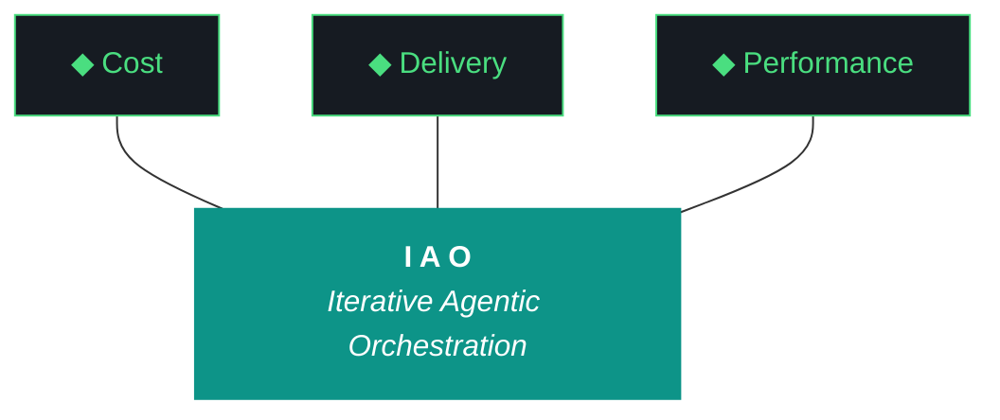

# kjtcom - Design v9.31 (Phase 9 - Persistent Bug Fix + Playwright Verification)

**Pipeline:** kjtcom (cross-pipeline location intelligence platform)
**Phase:** 9 (App Optimization)
**Iteration:** 31 (global counter)
**Executor:** Claude Code
**Machine:** NZXTcos
**Date:** April 2026

---

## Objective

Six bugs have persisted across 2-3 iterations despite being "confirmed fixed" in build logs. The root cause is that fixes are implemented, analyzed, and tested in isolation but never verified against the live deployed site. This iteration takes an aggressive diagnostic-first approach: read every line of every relevant file, print diagnostics, deploy, then use Playwright MCP to scrape the live site and verify.

**Persistent bugs (MUST be fixed this iteration):**

1. **1000-result limit (attempt #4)** - UI still shows "Showing 1000 of 1000+ results" and "1000 entities". The limit exists SOMEWHERE - in the Firestore provider, the entity count widget, the results table, or the Firestore query itself. Find it by reading every file.

2. **Quote cursor placement (attempt #4)** - typing inside quotes still doesn't work. The shared TextEditingController approach may have been implemented but isn't functioning in the deployed build.

3. **Autocomplete not showing** - the value_index.json and overlay widget were created but autocomplete dropdown doesn't appear when typing.

4. **TripleDB results not populating** - TripleDB entities exist in production (1,100) but queries may not return them. Diagnose whether this is a query issue, a rendering issue, or a data issue.

**New features:**

5. **Clear button** - add a clear/reset button between "locations" and "All time" in the query editor chrome. Clicking it clears the query text and results.

6. **Flutter dependency update** - update Flutter SDK and all pub dependencies in pre-flight. Bake this into every future iteration's pre-flight.

**Post-flight verification:**

7. **Playwright MCP scrapes** - after deploy, use Playwright MCP to navigate to kylejeromethompson.com, execute test queries, capture screenshots, and verify results. If any test fails on the live site, the iteration is not complete.

---



**Pillar 1 - The IAO Trident.** Every decision is governed by three competing objectives: minimal cost, optimized performance, and speed of delivery. The methodology finds the triangle's center of gravity for each decision.

**Pillar 2 - Artifact Loop.** Every iteration produces four artifacts. Previous artifacts archive to docs/archive/. If an artifact has no consumer, it should not exist.

**Pillar 3 - Diligence.** The methodology does not work if you do not read. Diligence is investing 30 minutes in plan revision to save 3 hours of misdirected agent execution.

**Pillar 4 - Pre-Flight Verification.** Before execution begins, validate everything. Pre-flight failures are the cheapest failures.

**Pillar 5 - Agentic Harness Orchestration.** Agents CAN build and deploy. Agents CANNOT git commit or sudo.

**Pillar 6 - Zero-Intervention Target.** Every question the agent asks during execution is a failure in the plan document.

**Pillar 7 - Self-Healing Execution.** Diagnose -> fix -> re-run. Gotcha registry documents known failure patterns.

**Pillar 8 - Phase Graduation.** The agent built the harness; the harness runs the work.

**Pillar 9 - Post-Flight Functional Testing.** Three tiers including Playwright MCP live site verification.

**Pillar 10 - Continuous Improvement.** Static processes atrophy.

---

## CRITICAL: Diagnostic-First Approach

Previous iterations "fixed" these bugs by reading the design doc, writing code, running flutter analyze, and declaring victory. The bugs persisted because:

1. `flutter analyze` checks syntax, not runtime behavior
2. `flutter test` runs unit tests, not integration tests against production data
3. Build logs say "VERIFY ON LIVE" but Claude Code can't open a browser
4. The deploy may succeed but cache invalidation, state management, or rendering issues cause the fix to not take effect

**This iteration's approach:**

For EACH bug:
1. **Read the ENTIRE relevant file** (not just the function). Print line count and key sections.
2. **grep for ALL related patterns** across the entire app/ directory. Not just one file.
3. **Add debug prints** (`debugPrint()`) to trace execution at runtime.
4. **Fix the actual root cause** based on what the diagnostic reveals.
5. **Build and deploy.**
6. **Use Playwright MCP to scrape the live site** and verify the fix.
7. **Capture screenshot evidence** that the bug is resolved.

If Playwright MCP is not available, use Python + requests/selenium to verify, or document exact manual verification steps for Kyle.

---

## Work Items

### W1: Fix 1000-Result Limit (P0 - attempt #4)

**The limit is NOT in firestore_provider.dart** (confirmed removed in v9.29). It's somewhere else.

**Diagnostic - grep EVERY file in app/lib/:**
```fish
grep -rn "1000\|limit\|truncat\|isTruncated\|serverCount\|totalCount" app/lib/
```

Suspects:
- `app/lib/widgets/entity_count_row.dart` - may have its own query with a limit
- `app/lib/providers/firestore_provider.dart` - may have been re-added or may use `.limit()` in a different provider
- `app/lib/widgets/results_table.dart` - may still display "1000+" text
- The entity count row ("1000 entities across 30 countries") likely uses a DIFFERENT Firestore query than the results table

**Read each file completely. Print the total line count and every line containing 1000, limit, or truncat.**

The entity count row at the top ("1000 entities across 30 countries") is likely fetching from a SEPARATE provider that still has a limit. This is NOT the same as the results table limit.

### W2: Fix Quote Cursor (P0 - attempt #4)

**Diagnostic:**
```fish
grep -rn "controller\|TextEditingController\|selection\|collapsed\|cursor" app/lib/widgets/query_editor.dart
grep -rn "controller\|TextEditingController\|selection\|collapsed" app/lib/providers/query_provider.dart
grep -rn "controller\|TextEditingController\|selection\|collapsed" app/lib/widgets/schema_tab.dart
```

Read ALL THREE files completely. Trace the flow:
1. Schema tab "+ Add to query" -> what exact code runs?
2. Does it set controller.text?
3. Does it set controller.selection AFTER setting text?
4. Does query_editor's ref.listen override the selection?

**The most likely cause:** ref.listen in query_editor resets cursor to end of text whenever queryProvider changes, AFTER schema_tab sets the cursor position. The fix must either: (a) skip cursor reset in ref.listen when the text matches, or (b) use a microtask delay on the selection set so it fires after the listener.

### W3: Fix Autocomplete (P1)

**Diagnostic:**
```fish
grep -rn "AutocompleteOverlay\|valueIndex\|value_index\|OverlayEntry\|CompositedTransform" app/lib/widgets/query_editor.dart
grep -rn "AutocompleteOverlay\|valueIndex\|value_index" app/lib/widgets/query_autocomplete.dart
```

Check:
1. Is `value_index.json` actually registered in `pubspec.yaml` assets?
2. Is the `valueIndexProvider` loading successfully?
3. Is the overlay being created and inserted?
4. Is the `onKeyEvent` handler intercepting Tab?
5. Is the `AutocompleteContext.detect()` returning the right mode?

Add `debugPrint` statements at each decision point to trace why the overlay isn't showing.

### W4: Fix TripleDB Results (P1)

**Diagnostic:**
```fish
python3 -u -c "
from google.cloud import firestore
import os
os.environ.setdefault('GOOGLE_APPLICATION_CREDENTIALS', os.path.expanduser('~/.config/gcloud/kjtcom-sa.json'))
db = firestore.Client(project='kjtcom-c78cd')
count = 0
for doc in db.collection('locations').where('t_log_type', '==', 'tripledb').limit(5).stream():
    count += 1
    d = doc.to_dict()
    print(f'{doc.id}: {d.get(\"t_any_names\", [])[:1]}, cuisines={d.get(\"t_any_cuisines\", [])[:2]}')
print(f'Sample: {count}')
total = sum(1 for _ in db.collection('locations').where('t_log_type', '==', 'tripledb').stream())
print(f'Total tripledb: {total}')
"
```

If TripleDB entities exist in Firestore, the issue is in the Flutter app's query parsing or rendering. Test:
- `t_log_type == "tripledb"` should return 1,100 results
- `t_any_cuisines contains "barbecue"` should return TripleDB results (the majority are BBQ joints)

### W5: Add Clear Button (P1)

**File:** `app/lib/widgets/query_editor.dart`

Add a clear/X button in the query editor chrome bar (between "locations" and "All time", or as a separate button next to Search).

On click:
- Clear queryProvider state to empty string
- Clear the TextEditingController
- Reset selectedEntityProvider to null (close detail panel)

### W6: Flutter Dependency Update (process)

**Bake into pre-flight for this and all future iterations:**

```fish
cd ~/dev/projects/kjtcom/app
flutter upgrade --force  # if needed
flutter pub upgrade --major-versions  # careful - review changes
flutter pub get
flutter analyze
flutter test
```

For v9.31: only run `flutter pub upgrade` (compatible versions within constraints). Do NOT run `--major-versions` (riverpod 2->3, firebase 3->4 are breaking changes that need dedicated iterations).

---

## Post-Flight: Playwright MCP Verification (MANDATORY)

After `firebase deploy --only hosting`, use Playwright MCP to:

1. Navigate to `https://kylejeromethompson.com`
2. Wait for app to load (CanvasKit bootstrap ~5-10s)
3. Take screenshot: landing page state
4. Type query: `t_any_cuisines contains "barbecue"`
5. Click Search (or press Enter)
6. Wait for results
7. Take screenshot: results showing count, pipeline dots, pagination
8. Verify result count is NOT "1000+" (should be actual count)
9. Verify TripleDB results appear (red TD dots)
10. Click Schema tab
11. Click "+ Add to query" on t_any_countries
12. Verify cursor is between quotes
13. Type "france"
14. Take screenshot: query with "france" typed correctly inside quotes
15. Click Search
16. Verify French results appear

If Playwright MCP cannot interact with Flutter Web (CanvasKit renders on canvas, not DOM), document this limitation and provide manual verification steps for Kyle with expected screenshots.

**G47 (NEW): Flutter Web CanvasKit blocks Playwright DOM interaction.** Flutter Web CanvasKit renders to a `<canvas>` element, not DOM nodes. Playwright's `page.click()` and `page.type()` may not work. Use Playwright's `page.mouse.click(x, y)` with pixel coordinates if needed, or fall back to screenshot-only verification.

---

## Success Criteria

| Criteria | Target |
|----------|--------|
| Result count shows true total (NOT 1000) | Yes |
| Quote cursor between quotes | Yes - type value successfully |
| Autocomplete dropdown appears | Yes - field + value modes |
| TripleDB results appear | Yes - red TD dots |
| Clear button works | Yes |
| Playwright screenshots capture evidence | Yes (or documented limitation) |
| flutter analyze | 0 issues |
| flutter test | All pass |
| firebase deploy + live verify | Success |
| Interventions | 0 |

---

## Complete Gotcha Registry

| ID | Gotcha | Prevention | Status |
|----|--------|-----------|--------|
| G1 | Heredocs in fish shell | Use printf blocks | ACTIVE |
| G2 | CUDA LD_LIBRARY_PATH | source config.fish | RESOLVED |
| G11 | API key leaks | NEVER cat config.fish or SA JSON | ACTIVE |
| G18 | Gemini 5-min timeout | Background jobs | ACTIVE |
| G19 | Gemini runs bash | Wrap in fish -c | ACTIVE |
| G20 | Config.fish has keys | grep only | ACTIVE |
| G21 | CUDA OOM | Sequential, graduated timeouts | ACTIVE |
| G22 | Fish ls colors | command ls | ACTIVE |
| G23 | LD_LIBRARY_PATH | config.fish | RESOLVED |
| G24 | Checkpoint staleness | Reset for new prompts | ACTIVE |
| G30 | Cross-project SA | Verify SA files | ACTIVE |
| G31 | TripleDB schema drift | Inspect data first | RESOLVED |
| G32 | Production rules | Verify IAM | ACTIVE |
| G33 | Duplicate IDs | Deterministic t_row_id | ACTIVE |
| G34 | Single array-contains | Client-side additional | ACTIVE |
| G35 | Production write safety | --dry-run first | ACTIVE |
| G36 | Case-sensitive arrayContains | All lowercased | RESOLVED |
| G37 | t_any_shows casing | All lowercased | RESOLVED |
| G38 | Firebase deploy auth | login --reauth | ACTIVE |
| G39 | Detail panel provider | All viewports | RESOLVED |
| G40 | Compound country names | Manual split | DOCUMENTED |
| G41 | Rebuild handlers | Dedup + guard | RESOLVED |
| G42 | Rotating queries | Removed | RESOLVED |
| G43 | Map tile CORS | Test both renderers | ACTIVE |
| G44 | flutter_map compat | Check pub.dev | ACTIVE |
| G45 | Schema cursor | Shared controller + explicit selection | ACTIVE (3 attempts) |
| G46 | Firestore limit not removed | Multiple providers may apply limits | ACTIVE (3 attempts) |
| G47 (NEW) | Flutter CanvasKit blocks Playwright DOM | Use mouse.click(x,y) or screenshot-only verification | ACTIVE |
| G48 (NEW) | "Fix confirmed" without live verification | NEVER mark a bug fixed without Playwright or manual live-site evidence | ACTIVE |

---

## Phase Structure Reference

| Phase | Name | Status | Iteration |
|-------|------|--------|-----------|
| 0-8 | All previous phases | DONE | v0.5-v8.26 |
| 9 | App Optimization | IN PROGRESS | v9.27-v9.31 |
| 10 | Retrospective + Template | Pending | - |
