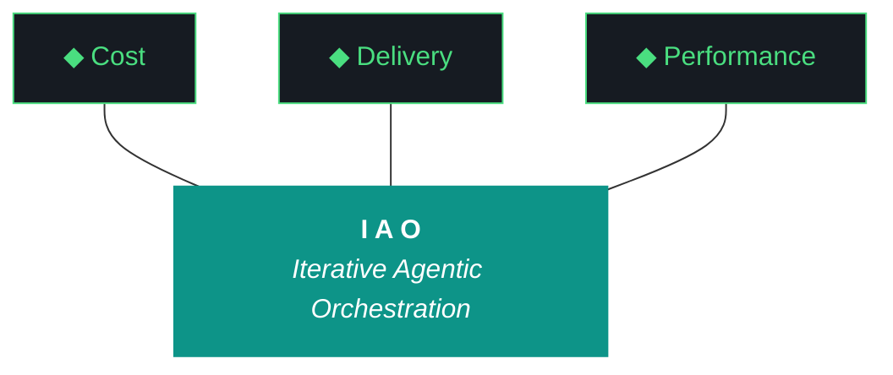

# kjtcom - Design v9.33 (Phase 9 - Parser Regression + Quotes + Operators)

**Pipeline:** kjtcom (cross-pipeline location intelligence platform)
**Phase:** 9 (App Optimization)
**Iteration:** 33 (global counter)
**Executor:** Claude Code
**Machine:** NZXTcos
**Date:** April 2026

---

## CRITICAL REGRESSION

v9.32 W4 introduced a parser regression. The change to support unquoted values broke the existing quoted value parser. Valid queries like `t_any_keywords contains "geology"` now fail with "Could not parse query" and the app shows all 6,181 entities unfiltered.

This regression was NOT caught because the v9.32 report verified queries via Python Firestore (server-side), not the Flutter query parser (client-side). G48 (fix without live verification) failed to prevent this.

**This is the #1 priority. Fix the parser regression FIRST, verify it works on live site, THEN proceed to other work items.**

---

## Objective

Five work items in strict priority order:

1. **(P0) Fix parser regression** - the v9.32 unquoted value regex broke quoted value parsing. Revert or fix the regex so `t_any_keywords contains "geology"` parses correctly again. This MUST be verified on the live site.

2. **(P0) Restore quotes in schema builder + fix cursor** - the v9.32 no-quotes approach was the wrong call. Restore `| where field contains ""` with cursor between quotes. Use the _isProgrammaticUpdate flag to prevent ref.listen from overriding cursor position. FINAL ATTEMPT - if this fails, next iteration uses Gemini CLI.

3. **(P0) +filter uses ==, -exclude uses !=** - detail panel buttons should use equality/exclusion operators, not contains.

4. **(P1) Fix query feedback message** - the "Could not parse query" hint says `t_any_keywords contains "barbecue"` but with the parser fix, both quoted and unquoted should work. Update the hint to show the correct syntax.

5. **(P1) Flutter dependency upgrade** - update pubspec.yaml constraints and migrate breaking changes. Defer if migration is too large.

---



**Pillar 1 - The IAO Trident.** Every decision is governed by three competing objectives: minimal cost, optimized performance, and speed of delivery.

**Pillar 2 - Artifact Loop.** Every iteration produces four artifacts.

**Pillar 3 - Diligence.** The methodology does not work if you do not read.

**Pillar 4 - Pre-Flight Verification.** Pre-flight failures are the cheapest failures.

**Pillar 5 - Agentic Harness Orchestration.** Agents CAN build and deploy. Agents CANNOT git commit or sudo.

**Pillar 6 - Zero-Intervention Target.** Every question the agent asks during execution is a failure in the plan document.

**Pillar 7 - Self-Healing Execution.** Diagnose -> fix -> re-run. Gotcha registry documents known failure patterns.

**Pillar 8 - Phase Graduation.** The agent built the harness; the harness runs the work.

**Pillar 9 - Post-Flight Functional Testing.** Three tiers including live site verification.

**Pillar 10 - Continuous Improvement.** Static processes atrophy.

---

## Architecture Decisions

[DECISION] **Parser must support BOTH quoted and unquoted values.** The regex must try quoted first (greedy match on `"..."`) then fall back to unquoted (rest of line). The v9.32 regex likely had the unquoted match first, which consumed the opening quote as part of the value.

[DECISION] **Quotes are mandatory in the UX.** Users need quotes for clarity when sharing/reading queries. The no-quotes approach from v9.32 was wrong. Schema builder appends `| where field contains ""` with cursor between quotes.

[DECISION] **Flag-based cursor protection.** A shared `_isProgrammaticUpdate` boolean prevents ref.listen from overriding cursor position when schema builder or +filter/-exclude sets it programmatically. The flag lives on a provider so it's accessible from all widgets.

[DECISION] **+filter = ==, -exclude = !=.** These are the natural semantics: "show me entities where this field equals this value" and "exclude entities where this field equals this value."

---

## Work Items

### W1: Fix Parser Regression (P0 - DEPLOY IMMEDIATELY AFTER)

**File:** `app/lib/models/query_clause.dart`

**Diagnostic:** cat the ENTIRE file. Find the regex patterns. The v9.32 change added unquoted value support but broke quoted parsing.

**The regex MUST match in this order:**
1. Try quoted value first: `field operator "value"` (captures text between quotes)
2. Then try unquoted value: `field operator value` (captures to end of line)

Example correct regex:
```dart
// Quoted: captures value between double quotes
static final _quotedPattern = RegExp(
  r'^\s*\|?\s*where\s+([\w]+)\s+(contains-any|contains|==|!=)\s+"([^"]*)"',
  caseSensitive: false,
);

// Unquoted: captures value to end of line (fallback)
static final _unquotedPattern = RegExp(
  r'^\s*\|?\s*where\s+([\w]+)\s+(contains-any|contains|==|!=)\s+(\S.*?)$',
  caseSensitive: false,
);

static QueryClause? parse(String line) {
  // Try quoted first
  var match = _quotedPattern.firstMatch(line);
  if (match != null) {
    return QueryClause(field: match[1]!, operator: match[2]!, value: match[3]!);
  }
  // Fallback to unquoted
  match = _unquotedPattern.firstMatch(line);
  if (match != null) {
    return QueryClause(field: match[1]!, operator: match[2]!, value: match[3]!.trim());
  }
  return null;
}
```

**After fix: flutter analyze + flutter test + build + deploy IMMEDIATELY.**

**Verify on live site:** `t_any_keywords contains "geology"` must return results (not "Could not parse").

### W2: Restore Quotes + Fix Cursor (P0)

**Files:** query_editor.dart, query_provider.dart, schema_tab.dart

**Step 1:** Create a shared programmatic update flag:
```dart
// In query_provider.dart
final programmaticUpdateProvider = StateProvider<bool>((ref) => false);
```

**Step 2:** Update ref.listen in query_editor.dart:
```dart
ref.listen(queryProvider, (_, next) {
  // SKIP if this update was triggered programmatically (schema builder, +filter)
  if (ref.read(programmaticUpdateProvider)) return;
  if (controller.text != next) {
    controller.text = next;
    // DO NOT set selection
  }
});
```

**Step 3:** Schema builder (schema_tab.dart) restores quotes:
```dart
void _addFieldToQuery(String field, String op, WidgetRef ref) {
  // Set flag BEFORE any changes
  ref.read(programmaticUpdateProvider.notifier).state = true;
  
  final controller = ref.read(queryTextControllerProvider);
  final clause = '| where $field $op ""';
  final current = controller.text.trimRight();
  final newText = current.isEmpty ? clause : '$current\n$clause';
  
  controller.text = newText;
  controller.selection = TextSelection.collapsed(offset: newText.length - 1);
  ref.read(queryProvider.notifier).setText(newText);
  
  // Clear flag after microtask (next event loop tick)
  Future.microtask(() {
    ref.read(programmaticUpdateProvider.notifier).state = false;
  });
  
  // Switch to Results tab
  ref.read(activeTabProvider.notifier).state = 0;
}
```

**Step 4:** Add debugPrint in ref.listen:
```dart
debugPrint('ref.listen: programmatic=${ref.read(programmaticUpdateProvider)}, textMatch=${controller.text == next}');
```

This debugPrint will show in Chrome DevTools console. Kyle can verify the flag is working.

### W3: +filter Uses ==, -exclude Uses != (P0)

**File:** detail_panel.dart

Find the +filter onPressed handler. Change operator from `contains` to `==`.
Find the -exclude onPressed handler. Change operator from `contains` to `!=`.

Both handlers should also use the programmaticUpdateProvider flag from W2 to protect cursor position.

### W4: Fix Query Feedback Message (P1)

**File:** query_editor.dart

Update the parse error hint text to show both valid syntaxes:
```
Expected: field_name operator "value" (e.g., t_any_keywords contains "barbecue")
```

### W5: Flutter Dependency Upgrade (P1)

Update pubspec.yaml constraints. Run `flutter pub upgrade --major-versions`. Fix breaking changes.

**Key migrations:**
- firebase_core 3->4: check initialization
- cloud_firestore 5->6: check query API
- flutter_riverpod 2->3: StateProvider -> NotifierProvider if needed
- flutter_map 7->8: check API changes

**If migration requires >50 lines of changes: DEFER to dedicated iteration.** Document what needs to change and skip.

---

## Success Criteria

| Criteria | Target |
|----------|--------|
| `t_any_keywords contains "geology"` returns results | NOT "Could not parse" |
| Schema builder adds quotes with cursor between them | User types value inside quotes |
| +filter uses == | Yes |
| -exclude uses != | Yes |
| debugPrint shows flag working | Yes (visible in DevTools) |
| Dependencies upgraded | Yes (or documented deferral) |
| flutter analyze | 0 issues |
| flutter test | All pass |
| firebase deploy + live verify | Parser works on live site |

---

## Complete Gotcha Registry

| ID | Gotcha | Prevention | Status |
|----|--------|-----------|--------|
| G1 | Heredocs in fish | printf blocks | ACTIVE |
| G2 | CUDA LD_LIBRARY_PATH | config.fish | RESOLVED |
| G11 | API key leaks | NEVER cat | ACTIVE |
| G18 | Gemini timeout | Background jobs | ACTIVE |
| G19 | Gemini bash default | fish -c | ACTIVE |
| G20 | Config.fish keys | grep only | ACTIVE |
| G21 | CUDA OOM | Sequential | ACTIVE |
| G22 | Fish ls colors | command ls | ACTIVE |
| G23 | LD_LIBRARY_PATH | config.fish | RESOLVED |
| G24 | Checkpoint staleness | Reset | ACTIVE |
| G30 | Cross-project SA | Verify files | ACTIVE |
| G31 | TripleDB schema drift | Inspect data | RESOLVED |
| G32 | Production rules | Verify IAM | ACTIVE |
| G33 | Duplicate IDs | Deterministic t_row_id | ACTIVE |
| G34 | Single array-contains | Client-side additional | ACTIVE |
| G35 | Production write safety | --dry-run | ACTIVE |
| G36 | Case-sensitive arrayContains | All lowercased permanently | RESOLVED (v9.32) |
| G37 | t_any_shows casing | All lowercased | RESOLVED (v9.32) |
| G38 | Firebase deploy auth | login --reauth | ACTIVE |
| G39 | Detail panel provider | All viewports | RESOLVED |
| G40 | Compound country names | Manual split | DOCUMENTED |
| G41 | Rebuild handlers | Dedup + guard | RESOLVED |
| G42 | Rotating queries | Removed | RESOLVED |
| G43 | Map tile CORS | Test renderers | ACTIVE |
| G44 | flutter_map compat | Check pub.dev | ACTIVE |
| G45 | Schema cursor | Use programmaticUpdateProvider flag | ACTIVE (attempt #6) |
| G46 | Firestore limit | Removed | RESOLVED |
| G47 | CanvasKit Playwright | mouse.click or screenshots | ACTIVE |
| G48 | Fix without live verify | Require evidence | ACTIVE |
| G49 | TripleDB shows title case | Lowercased | RESOLVED (v9.32) |
| G50 (NEW) | Parser regression from unquoted values | Regex MUST try quoted pattern FIRST, unquoted as fallback. Test both patterns after any regex change. | ACTIVE |
