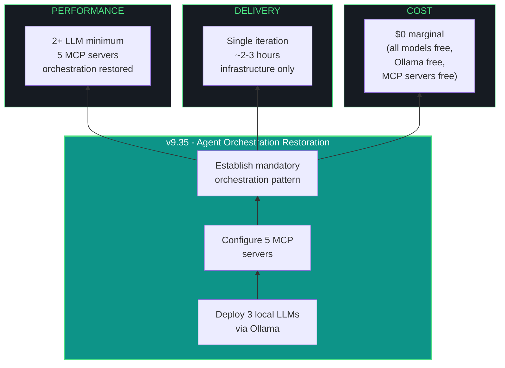

# kjtcom - Design Document v9.35

**Phase:** 9 - App Optimization
**Iteration:** 35
**Date:** April 4, 2026
**Author:** Kyle Thompson (via claude.ai Opus 4.6 session)
**Focus:** Multi-Agent Orchestration Restoration + LLM/MCP Infrastructure

---

## MANDATORY AMENDMENT - MULTI-AGENT ORCHESTRATION (EFFECTIVE v9.35+)

This amendment is permanently appended to all future kjtcom design documents. Violation of these requirements is a BLOCKING failure.

### Minimum Agent Requirement

Every iteration MUST consult at least TWO (2) LLMs before executing changes. The executing agent (Claude Code or Gemini CLI) counts as one. The second MUST be a local model (Qwen3.5-9B, Nemotron 3 Nano 4B, or GLM-4.6V-Flash) or a different cloud agent. Document which agents were consulted, what they were asked, and how their input shaped the iteration in the build log.

### Mandatory MCP Server Usage

Every iteration MUST interact with at least the following MCP servers where applicable:

| MCP Server | Mandatory Use |
|------------|---------------|
| Firebase MCP | Validate Firestore queries, inspect documents, verify security rules |
| Firecrawl MCP | Scrape reference UIs (Panther SIEM, competitor query editors) |
| Context7 MCP | Fetch current Flutter/Dart/Riverpod documentation before API calls |
| Playwright MCP | Post-deploy smoke tests (screenshot comparison, navigation checks) |
| Dart/Flutter MCP | Code analysis, widget tree inspection (when available) |

If an MCP server is unavailable or not applicable to the iteration's scope, document the reason for skipping in the build log.

### Orchestration Pattern

```
1. Problem Analysis    -> Consult local LLM (Qwen3.5-9B) for approach options
2. Documentation Check -> Context7 MCP for current API docs
3. Data Validation     -> Firebase MCP for production Firestore state
4. Execution           -> Primary agent (Claude Code or Gemini CLI)
5. Code Review         -> Local LLM (Nemotron 4B or GLM) reviews diff
6. Reference Check     -> Firecrawl MCP for UI/UX comparison
7. Smoke Test          -> Playwright MCP for post-deploy verification
8. Artifact Update     -> Document all agent consultations in build log
```

### Enforcement

The report artifact for each iteration MUST include an "Agent Orchestration" section listing:
- Which LLMs were consulted (minimum 2)
- Which MCP servers were used
- Key decisions influenced by multi-agent input
- Any MCP servers skipped and why

---

## 1. EXECUTIVE SUMMARY

v9.35 restores IAO Pillar 2 (Agentic Orchestration) by deploying three local LLMs via Ollama and five MCP servers. This is an infrastructure iteration - no Flutter app changes. The deliverable is a functioning multi-agent harness that all future iterations will use.

**Problem statement:** Phases 6-9 (19 iterations) degraded from multi-agent orchestration to single-agent delegation. Claude Code handled all Flutter work with zero local LLM consultation. This directly caused the G45 cursor bug (7 failed attempts from a single agent's approach before a different agent resolved it in v9.34).

**Solution:** Deploy Qwen3.5-9B, Nemotron 3 Nano 4B, and GLM-4.6V-Flash via Ollama on NZXTcos. Configure Firebase, Context7, Firecrawl, Playwright, and Dart/Flutter MCP servers for Claude Code. Establish the mandatory orchestration pattern above.

---

## 2. REPORT HIGHLIGHTS (v9.34 State)

### Production State

| Metric | Value |
|--------|-------|
| Total entities | 6,181 |
| Pipelines | 3 (CalGold 899, RickSteves 4,182, TripleDB 1,100) |
| Thompson fields | 22 (t_any_* universal schema, v3) |
| Autocomplete values | 6,878 across 21 fields |
| Flutter LOC | ~4,200 across 25 Dart files |
| Iterations completed | 34 (v0.5 through v9.34) |
| Archived artifacts | 128 docs in docs/archive/ |
| Gotchas documented | 44 (G1-G50, some skipped) |

### Resolved in Phase 9

- G45 quote cursor (7 attempts, resolved v9.34 via Gemini CLI)
- G36 case sensitivity (resolved v9.32)
- G37 TripleDB shows casing (resolved v9.32)
- G44 flutter_map compatibility (resolved v9.27)
- G46 1000-result Firestore limit (resolved v9.31)

### Active Technical Debt

- Riverpod 2.x -> 3.x migration (~50 lines across 13 files)
- No full-text search (exact array membership only)
- CanvasKit blocks Playwright DOM interaction (G47)
- Single server-side array operation limit (G34)
- No query history, saved queries, boolean OR, sorting, or aggregations

### Agent Orchestration Failure Log

| Phase | Iterations | Primary Agent | Second Agent | Orchestration |
|-------|-----------|---------------|-------------|---------------|
| 1-5 | v0.5-v5.14 | Gemini CLI | Claude Code | ACTIVE |
| 6 | v6.15-v6.20 | Claude Code | Gemini CLI | PARTIAL |
| 7 | v7.21 | Claude Code | None | NONE |
| 8 | v8.22-v8.26 | Claude Code | None | NONE |
| 9 | v9.27-v9.33 | Claude Code | None | NONE |
| 9 | v9.34 | Gemini CLI | Claude Code | RESTORED |

19 of 34 iterations ran with zero orchestration. This ends at v9.35.

---

## 3. LOCAL LLM DEPLOYMENT

### Hardware Constraints

| Resource | Available | Notes |
|----------|-----------|-------|
| GPU | RTX 2080 SUPER | 8 GB VRAM |
| RAM | 64 GB DDR4 | Ample for CPU offload |
| CPU | i9-13900K (24 cores) | Fast CPU inference fallback |
| OS | CachyOS (Arch) | Fish shell, CUDA installed |

### Model Selection

Models run sequentially via Ollama, not simultaneously. Only one model loaded in VRAM at a time.

| Model | VRAM (Q4) | Speed | Role | Ollama Tag |
|-------|-----------|-------|------|------------|
| Qwen3.5-9B | ~5.1 GB | 54-58 t/s | Primary local - code review, approach analysis, documentation | `qwen3.5:9b` |
| Nemotron 3 Nano 4B | ~3 GB | fast | Tool use, agentic reasoning, fast second opinion | `nemotron3-nano` (see notes) |
| GLM-4.6V-Flash | ~5 GB | 50+ t/s | Vision-capable, screenshot analysis, UI review | `glm4.6v-flash` (verify tag) |

### Nemotron Pull Fix

The `nemotron3-nano:4b` tag failed. Correct resolution:

```fish
# Check available Nemotron tags
ollama search nemotron

# If not in Ollama registry, pull via Hugging Face GGUF
# Option A: Direct Ollama (if tag exists)
ollama pull nemotron-nano:4b

# Option B: Manual GGUF via Modelfile
# Download from huggingface.co/nvidia/Nemotron-3-Nano-4B-Instruct-GGUF
# Create Modelfile:
#   FROM ./nemotron-3-nano-4b-instruct.Q4_K_M.gguf
# ollama create nemotron-nano -f Modelfile
```

### Qwen3.5-9B Thinking Mode

v9.35 observation: thinking mode fired by default, consuming tokens for trivial queries. Disable for non-reasoning tasks:

```fish
# Disable thinking for fast responses
ollama run qwen3.5:9b "/set parameter think false"

# Or via API
curl http://localhost:11434/api/chat -d '{
  "model": "qwen3.5:9b",
  "messages": [{"role": "user", "content": "Review this code..."}],
  "options": {"num_predict": 2048}
}'
```

For complex reasoning (architecture decisions, bug analysis), enable thinking mode explicitly.

### Ollama Service Configuration

```fish
# Ensure Ollama runs on boot
sudo systemctl enable ollama
sudo systemctl start ollama

# Verify GPU detection
ollama run qwen3.5:9b --verbose "test" 2>&1 | grep -i "gpu\|cuda\|nvidia"

# Set environment for fish shell (add to config.fish)
set -gx OLLAMA_HOST "http://localhost:11434"
```

---

## 4. MCP SERVER CONFIGURATION

### Firebase MCP (P1 - Critical)

Provides Firestore document reads, security rule validation, index inspection, and project config.

```json
// ~/dev/projects/kjtcom/.mcp.json (Claude Code)
{
  "mcpServers": {
    "firebase": {
      "command": "npx",
      "args": ["-y", "firebase-tools@latest", "experimental:mcp"],
      "env": {
        "GOOGLE_APPLICATION_CREDENTIALS": "~/.config/gcloud/kjtcom-sa.json"
      }
    }
  }
}
```

For Gemini CLI, add to `.gemini/settings.json`:
```json
{
  "mcpServers": {
    "firebase": {
      "command": "npx",
      "args": ["-y", "firebase-tools@latest", "experimental:mcp"]
    }
  }
}
```

### Context7 MCP (P1 - Critical)

Provides up-to-date library documentation. Prevents hallucinated API calls.

```json
{
  "context7": {
    "command": "npx",
    "args": ["-y", "@upstash/context7-mcp@latest"]
  }
}
```

### Firecrawl MCP (P2)

Web scraping for reference UI capture (Panther SIEM query editor, competitor UIs).

```json
{
  "firecrawl": {
    "command": "npx",
    "args": ["-y", "firecrawl-mcp"],
    "env": {
      "FIRECRAWL_API_KEY": "<from env>"
    }
  }
}
```

### Playwright MCP (P2)

Browser automation for post-deploy smoke tests. Note G47: CanvasKit blocks DOM interaction, but screenshot comparison and navigation verification still work.

```json
{
  "playwright": {
    "command": "npx",
    "args": ["-y", "@anthropic/mcp-playwright"]
  }
}
```

### Dart/Flutter MCP (P3 - Experimental)

Code analysis and widget tree inspection. Still early-stage.

```json
{
  "dart": {
    "command": "npx",
    "args": ["-y", "@anthropic/mcp-dart"]
  }
}
```

---

## 5. IAO TRIDENT



---

## 6. TEN PILLARS - v9.35 APPLICATION

| # | Pillar | v9.35 Application |
|---|--------|--------------------|
| P1 | Trident (Cost/Delivery/Performance) | $0 cost, single iteration, full orchestration |
| P2 | Artifact Loop | Design + Plan + Build + Report (this doc is artifact 1) |
| P3 | Diligence | Verify each LLM loads in VRAM, each MCP connects |
| P4 | Pre-Flight | Ollama installed, CUDA verified, SA JSON present |
| P5 | Agentic Harness | 3 local LLMs + 5 MCP servers = harness restored |
| P6 | Zero-Intervention | All model tags, MCP configs pre-specified |
| P7 | Self-Healing | If model pull fails, fallback to GGUF Modelfile |
| P8 | Phase Graduation | Infrastructure iteration - no app changes |
| P9 | Post-Flight Testing | Verify each model responds, each MCP tool callable |
| P10 | Continuous Improvement | This iteration IS the improvement - methodology restored |

---

## 7. KEY FILES

| File | Purpose |
|------|---------|
| .mcp.json | Claude Code MCP server configuration |
| .gemini/settings.json | Gemini CLI MCP server configuration |
| CLAUDE.md | Agent instructions (update with orchestration mandate) |
| GEMINI.md | Agent instructions (update with orchestration mandate) |
| docs/kjtcom-design-v9.35.md | This document |
| docs/kjtcom-plan-v9.35.md | Execution plan |

---

## 8. CONVENTIONS

- Fish shell throughout. pip --break-system-packages. python3 -u.
- No em-dashes. Use " - " instead. Use "->" for arrows.
- "pipelines" and "log types," never "tables" or "datasets"
- Deploy from repo root, never app/
- Kyle manually handles all git. Agents never touch git.
- Terse, direct communication. No padding.
- 4 artifacts per iteration. Mermaid + 10 pillars in every design doc.
- **NEW: Minimum 2 LLMs per iteration. 5 MCP servers mandatory.**

---

*Design document generated from claude.ai Opus 4.6 session, April 4, 2026.*
