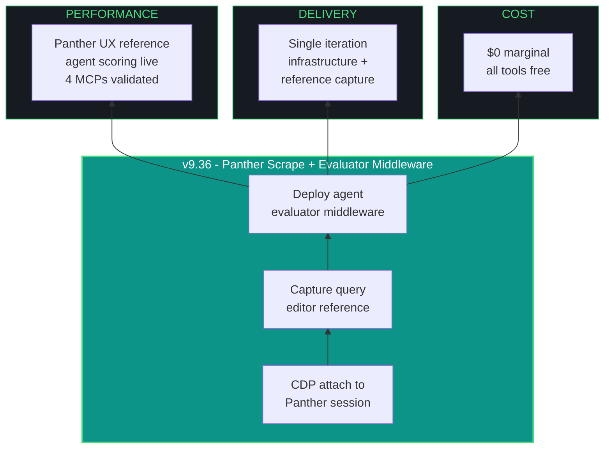

# kjtcom - Design Document v9.36

**Phase:** 9 - App Optimization
**Iteration:** 36
**Date:** April 4, 2026
**Author:** Kyle Thompson (via claude.ai Opus 4.6 session)
**Focus:** Panther SIEM Scrape + Agent Evaluator Middleware + MCP Validation

---

## MANDATORY AMENDMENTS (v9.35+ - PERMANENT)

### Multi-Agent Orchestration

Every iteration MUST consult at least TWO (2) LLMs. Document in build log.

### MCP Server Usage

Every iteration MUST use applicable MCP servers: Firebase, Firecrawl, Context7, Playwright, Dart/Flutter. Document skips with reasons.

### install.fish Living Document

Every iteration that introduces a new dependency MUST update `docs/install.fish`. The report artifact MUST confirm this was done or state "No new dependencies."

---

## 1. EXECUTIVE SUMMARY

v9.36 has three workstreams:

| # | Workstream | Priority | Description |
|---|-----------|----------|-------------|
| W1 | Panther SIEM Scrape | P1 | Capture query editor UI from Kyle's live authenticated Panther session via Playwright CDP |
| W2 | Agent Evaluator Middleware | P1 | Scoring system for LLM/agent performance, merged with Gotcha Registry |
| W3 | MCP Validation | P2 | First live test of all 4 MCP servers configured in v9.35 |

No Flutter app changes. Infrastructure + reference capture iteration.

---

## 2. PANTHER SIEM SCRAPE (W1)

### Context

Kyle has a live authenticated Panther SIEM session open in Chrome right now. The Search tab is Chrome Process ID 151239 (visible in Chrome Task Manager). The session is cookie-authenticated - MFA was already completed. Do NOT attempt to re-authenticate or relaunch Chrome.

### Method: Playwright CDP Attach to Existing Chrome

Chrome must have remote debugging enabled to allow Playwright attachment. If Chrome was NOT launched with `--remote-debugging-port`, the agent must:

1. Check if remote debugging is already active:
   ```fish
   curl -s http://localhost:9222/json/version 2>/dev/null
   ```
2. If active - proceed with CDP connection
3. If NOT active - Kyle closes Chrome and relaunches with debug flag. Cookie session persists across restart. No MFA needed:
   ```fish
   google-chrome-stable --remote-debugging-port=9222
   ```
   Kyle navigates back to tachtech.runpanther.net Investigate -> Search. Session cookies restore the authenticated state.

### CDP Connection

```javascript
// Playwright CDP connection to existing Chrome
const browser = await chromium.connectOverCDP('http://localhost:9222');
const contexts = browser.contexts();

// Find Panther tab by URL
const pages = contexts.flatMap(c => c.pages());
const pantherPage = pages.find(p =>
  p.url().includes('runpanther.net') ||
  p.url().includes('panther')
);
```

### Capture Targets

| # | Target | Selector Hint | Purpose |
|---|--------|---------------|---------|
| 1 | Full page screenshot | `page.screenshot({fullPage: true})` | Visual reference |
| 2 | Query editor area | `.search-editor`, `[data-testid*="search"]`, or similar | Input component structure, syntax highlighting |
| 3 | Field sidebar | "SELECTED FIELDS", "AVAILABLE FIELDS" sections | How Panther presents p_any_* field lists |
| 4 | Autocomplete/dropdown | Trigger by typing in search bar, capture popup DOM | Suggestion layout, keyboard behavior |
| 5 | Time range selector | Top-right time picker | UI pattern reference |
| 6 | Results header | "100 events", "Summarize with AI" button area | Count display, action buttons |
| 7 | CSS custom properties | `getComputedStyle(document.documentElement)` | Color tokens, spacing, typography |
| 8 | Log Type field chips | Sidebar field tags with colored dots | How Panther renders pipeline badges |

### Output

Save all captures to `docs/panther-reference/`:
- `panther-search-full.png` - full page screenshot
- `panther-query-editor.html` - query editor DOM extract
- `panther-field-sidebar.html` - field list DOM extract
- `panther-css-tokens.json` - computed CSS variables
- `panther-scrape-notes.md` - observations and mapping to kjtcom equivalents

### Security

- Do NOT capture customer alert/detection data in result rows
- Capture ONLY UI structure, CSS, and layout elements
- If customer data is visible in screenshots, mask or crop before saving
- Do NOT commit Panther session cookies, tokens, or auth state

### G47 Does NOT Apply

G47 (CanvasKit blocks Playwright DOM interaction) applies to kylejeromethompson.com. Panther SIEM is a React web app - Playwright CDP has full DOM access.

---

## 3. AGENT EVALUATOR MIDDLEWARE (W2)

### Architecture

```
Iteration execution completes
    |
    v
Collect all agent outputs (build log, code diffs, consultations)
    |
    v
EVALUATOR (Qwen3.5-9B - permanent role) scores each agent
    |
    v
Scores written to agent_scores.json (cumulative, append-only)
    |
    v
Gotcha Registry updated with agent attribution
    |
    v
Report includes Agent Scorecard section
```

### Why Qwen3.5-9B as Permanent Evaluator

| Criterion | Qwen3.5-9B | Nemotron Mini 4B | GLM-4.6V-Flash |
|-----------|-----------|------------------|----------------|
| Reasoning | Best at 9B | Limited at 4B | Comparable but 10x slower |
| Code comprehension | HumanEval leader for 8GB tier | Adequate | Weaker |
| Speed | 54-58 t/s | Fastest | 5.4 t/s |
| Context | 256K | 4K default | 128K |

### Score Dimensions (0-10 each, max 50)

| Dimension | What it measures |
|-----------|-----------------|
| Problem Analysis | Did the agent correctly identify the problem and propose viable approaches? |
| Code Correctness | Were code suggestions accurate, functional, and regression-free? |
| Efficiency | Tokens consumed vs value delivered. Did it waste tokens on irrelevant output? |
| Gotcha Avoidance | Did the agent avoid repeating known failure patterns from the Gotcha Registry? |
| Novel Contribution | Did the agent surface an approach or insight that others missed? |

### Score Schema (agent_scores.json)

```json
{
  "iterations": [
    {
      "iteration": "v9.35",
      "date": "2026-04-04",
      "evaluator": "qwen3.5:9b",
      "scores": [
        {
          "agent": "claude-code-opus",
          "role": "primary_executor",
          "problem_analysis": 0,
          "code_correctness": 0,
          "efficiency": 0,
          "gotcha_avoidance": 0,
          "novel_contribution": 0,
          "total": 0,
          "notes": ""
        }
      ],
      "gotcha_events": []
    }
  ]
}
```

### Gotcha Registry Integration

Extend existing gotcha entries with agent attribution:

| New Field | Type | Description |
|-----------|------|-------------|
| caused_by | string | Agent that introduced the failure |
| caught_by | string | Agent that detected it |
| recurrence_count | int | Times this pattern recurred |

### Implementation in v9.36

1. Create `agent_scores.json` at repo root
2. Create `docs/evaluator-prompt.md` with the scoring prompt template
3. Run Qwen3.5-9B evaluator against v9.35 build log (retroactive scoring)
4. Add Agent Scorecard section to v9.36 report

---

## 4. MCP VALIDATION (W3)

First live test of MCP servers configured in v9.35.

| Server | Test Command | Expected |
|--------|-------------|----------|
| Firebase MCP | "Get 3 documents from locations collection" | Returns 3 Firestore docs with t_any_* fields |
| Context7 MCP | "Look up flutter_riverpod StateProvider docs" | Returns current Riverpod API reference |
| Firecrawl MCP | "Scrape docs.panther.com/search" | Returns Panther search documentation |
| Playwright MCP | "Screenshot kylejeromethompson.com" | Returns PNG of live site (G47: CanvasKit renders, no DOM) |

---

## 5. REPORT HIGHLIGHTS (v9.35 State)

| Metric | Value |
|--------|-------|
| Total entities | 6,181 |
| Pipelines | 3 (CalGold 899, RickSteves 4,182, TripleDB 1,100) |
| Local LLMs deployed | 3 (qwen3.5:9b, nemotron-mini:4b, haervwe/GLM-4.6V-Flash-9B) |
| MCP servers configured | 4 (Firebase, Context7, Firecrawl, Playwright) |
| flutter analyze | 0 issues |
| flutter test | 15/15 pass |

---

## 6. IAO TRIDENT



---

## 7. TEN PILLARS - v9.36 APPLICATION

| # | Pillar | v9.36 Application |
|---|--------|--------------------|
| P1 | Trident | $0 cost, reference capture + middleware deployment |
| P2 | Artifact Loop | Design + Plan + Build + Report + agent_scores.json + evaluator-prompt.md |
| P3 | Diligence | Verify CDP connection before scraping, validate MCP responses |
| P4 | Pre-Flight | Chrome debug port check, Ollama running, MCP servers loading |
| P5 | Agentic Harness | 3 LLMs + 4 MCPs + evaluator middleware |
| P6 | Zero-Intervention | 1 expected (Chrome debug port check) |
| P7 | Self-Healing | If CDP fails, fallback to manual screenshots |
| P8 | Phase Graduation | Infrastructure iteration - no app changes |
| P9 | Post-Flight | MCP connections verified, Panther captures saved, scores seeded |
| P10 | Continuous Improvement | Evaluator middleware IS the improvement system |

---

## 8. CONVENTIONS

- Fish shell throughout. pip --break-system-packages. python3 -u.
- No em-dashes. Use " - " instead. Use "->" for arrows.
- "pipelines" and "log types," never "tables" or "datasets"
- Deploy from repo root, never app/
- Kyle manually handles all git. Agents never touch git.
- Minimum 2 LLMs per iteration. MCP servers mandatory.
- Update docs/install.fish when new dependencies added.

---

*Design document generated from claude.ai Opus 4.6 session, April 4, 2026.*
