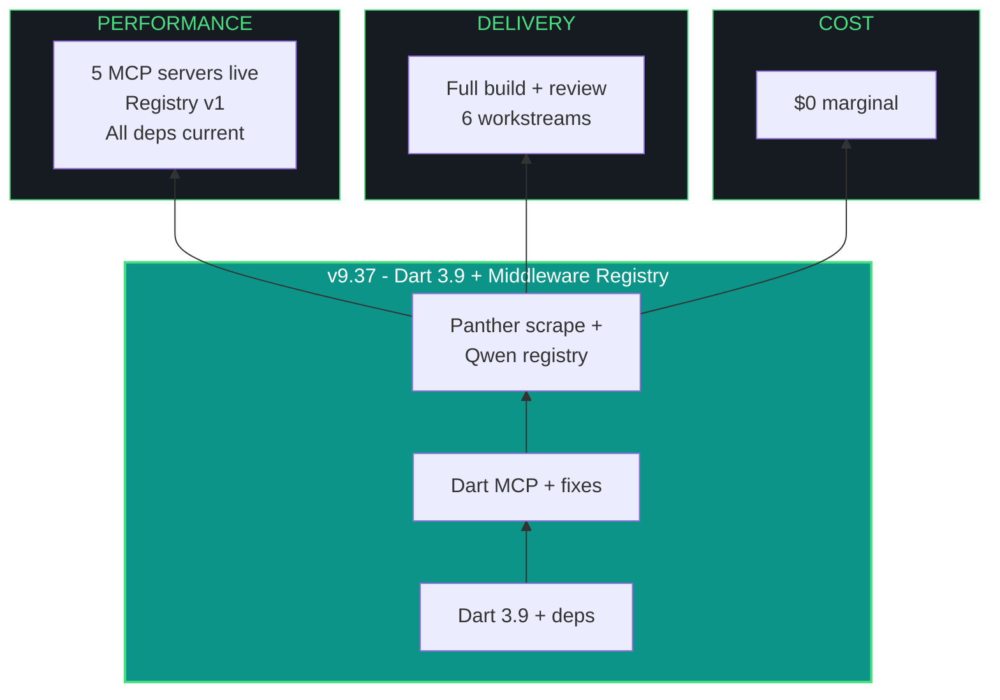

# kjtcom - Design Document v9.37

**Phase:** 9 - App Optimization
**Iteration:** 37
**Date:** April 5, 2026
**Author:** Kyle Thompson (via claude.ai Opus 4.6 session)
**Focus:** Dart 3.9 Upgrade + Dart MCP + Middleware Registry + Panther Scrape + MCP Fixes

---

## MANDATORY AMENDMENTS (v9.35+ - PERMANENT)

### Multi-Agent Orchestration
Every iteration MUST consult at least TWO (2) LLMs. Document in build log.

### MCP Server Usage
Every iteration MUST use applicable MCP servers. Document skips with reasons.

### install.fish Living Document
Every iteration MUST update docs/install.fish if new dependencies added. Report MUST confirm.

### Agent Evaluator Middleware (v9.36+)
Qwen3.5-9B is permanent evaluator. Run evaluator at end of every iteration. Scores append to agent_scores.json. Report MUST include Agent Scorecard. agent_scores.json per-iteration data is folded into the report's Agent Scorecard section.

---

## 1. EXECUTIVE SUMMARY

v9.37 is the biggest iteration since Phase 6. Six workstreams:

| # | Workstream | Priority | Description |
|---|-----------|----------|-------------|
| W1 | Dart 3.9 + dependency upgrade | P1 | Update Dart SDK, all pubspec deps, flutter build web, comprehensive review |
| W2 | Dart MCP server | P1 | Install official Dart/Flutter MCP (requires Dart 3.9) |
| W3 | MCP fixes (G52, G53) | P1 | Firebase reauth, Firecrawl debug |
| W4 | Panther SIEM scrape | P1 | Complete W1 from v9.36 - CDP attach, DOM capture |
| W5 | Qwen middleware registry | P2 | Ingest docs/archive, build iteration efficacy registry |
| W6 | GCP middleware architecture | P3 | Design only - portable evaluator LLM concept |

---

## 2. DART 3.9 + DEPENDENCY UPGRADE (W1)

### Current State

| Component | Current | Target |
|-----------|---------|--------|
| Dart SDK | ^3.11.4 (pubspec constraint) | 3.9+ (required for Dart MCP) |
| flutter_riverpod | ^2.6.1 | Latest 2.x (3.x is separate iteration) |
| cloud_firestore | ^5.6.0 | Latest 5.x |
| firebase_core | ^3.13.0 | Latest 3.x |
| flutter_map | ^7.0.2 | Latest 7.x |
| google_fonts | ^6.2.1 | Latest 6.x |
| latlong2 | ^0.9.1 | Latest 0.9.x |

### Upgrade Process

```fish
cd ~/dev/projects/kjtcom/app

# 1. Check current Dart version
dart --version

# 2. Update Flutter/Dart SDK (if Dart < 3.9)
# CachyOS: yay -S flutter-bin (gets latest stable)

# 3. Update all dependencies
flutter pub upgrade --major-versions

# 4. Check for breaking changes
flutter pub outdated

# 5. Fix any analysis issues
flutter analyze

# 6. Run tests
flutter test

# 7. Build web
flutter build web

# 8. Local preview
cd ~/dev/projects/kjtcom && firebase serve --only hosting
```

### Comprehensive Functionality Review

After build, verify ALL 6 tabs:

| Tab | Verify |
|-----|--------|
| Results | Query executes, pagination works, detail panel opens, +filter/-exclude works |
| Map | OpenStreetMap tiles load, pipeline-colored markers render, click -> detail |
| Globe | Continent cards, country grid, pipeline distribution stats |
| IAO | Trident graphic, 10 pillar cards, stats footer |
| Gotcha | 47 patterns render, status badges, filter toggle |
| Schema | 22 fields, "+ Add to query" buttons, autocomplete triggers |

Also verify: syntax highlighting, autocomplete (field + value modes), contains-any operator, != operator, clear button, copy JSON, pagination (20/50/100).

---

## 3. DART MCP SERVER (W2)

### Prerequisites
- Dart SDK 3.9 or later (installed in W1)

### Installation

```fish
# For Claude Code - project-level
claude mcp add --transport stdio dart -- dart mcp-server

# For Gemini CLI - add to .gemini/settings.json
# {
#   "mcpServers": {
#     "dart": {
#       "command": "dart",
#       "args": ["mcp-server"]
#     }
#   }
# }

# Also add to .mcp.json for Claude Code
# {
#   "dart": {
#     "command": "dart",
#     "args": ["mcp-server"]
#   }
# }
```

### Capabilities
- Analyze and fix errors in project code
- Resolve symbols, fetch documentation and signatures
- Introspect running Flutter app (widget tree, runtime errors)
- Search pub.dev for packages
- Manage pubspec.yaml dependencies
- Run tests and analyze results
- Format code (dart format)
- Hot reload/restart running app

### Verification
```fish
# Test via Claude Code:
# "Analyze the app/lib/widgets/query_editor.dart file for issues"
# "Search pub.dev for flutter_code_editor package"
# "Run flutter test and report results"
```

---

## 4. MCP FIXES (W3)

### G53: Firebase MCP Auth

```fish
firebase login --reauth
# Complete browser auth flow
# Verify: firebase projects:list (should show kjtcom-c78cd)
```

Then test Firebase MCP: "Get 3 documents from locations collection"

### G52: Firecrawl MCP Not Loading

Debug steps:
1. Check API key: `echo $FIRECRAWL_API_KEY | head -c 5` (show first 5 chars only)
2. Test npx directly: `npx firecrawl-mcp --help`
3. Check .mcp.json syntax for firecrawl entry
4. If package issue, try: `npx firecrawl-mcp@3.11.0`
5. If still failing, check npm cache: `npm cache clean --force`

---

## 5. PANTHER SIEM SCRAPE (W4)

Complete the blocked W1 from v9.36.

### Pre-requisite
Kyle relaunches Chrome with debug port:
```fish
google-chrome-stable --remote-debugging-port=9222
```
Navigate to tachtech.runpanther.net -> Investigate -> Search. MFA if session expired.

### Execution
Run the prepared script from v9.36:
```fish
python3 scripts/panther_scrape.py
```

Save captures to docs/panther-reference/. Create panther-scrape-notes.md mapping Panther elements to kjtcom equivalents.

---

## 6. QWEN MIDDLEWARE REGISTRY (W5)

### Concept

Qwen3.5-9B ingests the 128 archived artifacts in docs/archive/ and builds a structured iteration efficacy registry. This is the first version of what becomes a portable middleware component.

### Architecture

```
docs/archive/ (128 files)
    |
    v
Batch processor (Python script)
    - Groups files by iteration (v0.5 through v9.36)
    - Extracts: agents used, interventions, gotchas, pass/fail, key decisions
    |
    v
Per-iteration summary fed to Qwen3.5-9B
    |
    v
Qwen produces structured JSON per iteration
    |
    v
iteration_registry.json (new file)
    - Contains: efficacy scores, problems, failures, successes, improvement areas
    - Integrates gotcha registry events
    - Links to agent_scores.json
```

### Processing Approach

128 files won't fit in Qwen's 256K context simultaneously. Process in batches:

1. Group archive files by iteration (4 files per iteration: design, plan, build, report)
2. For each iteration, concatenate the 4 files (typically 5-15K tokens total)
3. Feed to Qwen with extraction prompt
4. Qwen returns structured JSON per iteration
5. Merge all iteration JSONs into iteration_registry.json

### Registry Schema

```json
{
  "iterations": [
    {
      "version": "v9.34",
      "date": "2026-04-04",
      "phase": 9,
      "focus": "Quote cursor + inline autocomplete",
      "agents": {
        "primary": "gemini-cli",
        "consulted": ["claude-code"],
        "local_llms": [],
        "mcp_servers": []
      },
      "outcomes": {
        "interventions": 0,
        "gotchas_created": [],
        "gotchas_resolved": ["G45"],
        "flutter_analyze": "0 issues",
        "flutter_test": "15/15",
        "deploys": 1
      },
      "efficacy": {
        "plan_quality": 0,
        "execution_quality": 0,
        "orchestration_quality": 0,
        "overall": 0,
        "notes": ""
      },
      "failures": [],
      "successes": [],
      "improvements": []
    }
  ],
  "gotcha_registry": [
    {
      "id": "G45",
      "title": "Quote cursor placement",
      "status": "RESOLVED",
      "created_in": "v9.29",
      "resolved_in": "v9.34",
      "attempts": 7,
      "agents_involved": ["claude-code (6 failures)", "gemini-cli (1 success)"],
      "caused_by": "TextField + Stack architecture",
      "resolution": "addPostFrameCallback"
    }
  ]
}
```

### Future: GCP Middleware LLM (Design Only - Do Not Execute)

The iteration_registry.json + agent_scores.json + gotcha_registry become the state store for a cloud-deployed Qwen instance that serves as an MCP server itself. Any IAO project can connect to this middleware for:

- Historical pattern matching ("has this bug pattern appeared before?")
- Agent recommendation ("which agent handles this task type best?")
- Gotcha warnings ("watch out for X based on similar past failures")
- Efficacy benchmarking ("how does this iteration compare to historical averages?")

Architecture: Qwen (quantized) in GCP Cloud Run + CloudSQL/Firestore for state + MCP server endpoint. Projects connect via MCP client config. This is Phase 10 / post-Phase 10 scope.

### Qwen vs RAG for Middleware

| Approach | Pros | Cons | Verdict |
|----------|------|------|---------|
| Qwen direct (batch) | Simple, no infra, works now | Can't hold full archive in context | v9.37 (this iteration) |
| RAG + Qwen | Full archive searchable, scales | Needs chromadb/embedding infra | v9.38+ |
| Dedicated RAG agent | Separation of concerns | Another model to maintain | GCP deployment |

For v9.37: Qwen processes batches, builds registry. For GCP: RAG indexes the registry, Qwen queries RAG and evaluates.

---

## 7. INTER-AGENT COMMUNICATION

### Current Method
- **File-based:** Artifacts on disk (CLAUDE.md, build logs, design docs)
- **Ollama HTTP API:** localhost:11434 for local LLM queries
- **MCP stdio:** MCP servers communicate via standard I/O with the active agent
- **No direct agent-to-agent:** Claude Code and Gemini CLI never run simultaneously

### Assessment
The current approach works for IAO's sequential iteration model. Each iteration has one primary agent. The harness (CLAUDE.md + launch prompt) is the communication protocol between sessions.

Token efficiency: Local LLM queries via Ollama API are free (no cloud token cost). MCP servers add tool-call overhead to the primary agent's context but provide high-value responses. The main token spend is Claude Code's context window holding the CLAUDE.md + artifacts.

### When to Build a Message Bus
Not yet. The trigger for a message bus is when we need:
- Simultaneous agent execution (parallel workstreams)
- Real-time agent-to-agent negotiation (consensus on approach)
- Persistent agent memory across sessions (beyond file artifacts)

None of these are needed in Phase 9. Revisit for GCP deployment.

---

## 8. IAO TRIDENT



---

## 9. TEN PILLARS

| # | Pillar | v9.37 Application |
|---|--------|--------------------|
| P1 | Trident | $0 cost, 6 workstreams, full dep upgrade |
| P2 | Artifact Loop | Design + Plan + Build + Report + registry + agent_scores |
| P3 | Diligence | Verify every dep upgrade, test all 6 tabs |
| P4 | Pre-Flight | Dart version check, Chrome debug port, Firebase auth |
| P5 | Agentic Harness | 3 LLMs + 5 MCPs (Dart MCP new) + evaluator + registry |
| P6 | Zero-Intervention | 2 expected (Firebase reauth, Chrome debug port) |
| P7 | Self-Healing | If dep upgrade breaks build, pin to last working version |
| P8 | Phase Graduation | Dep upgrade + infrastructure, app review |
| P9 | Post-Flight | All tabs functional, all MCPs connected, registry seeded |
| P10 | Continuous Improvement | Registry IS the improvement tracking system |

---

## 10. CONVENTIONS

- Fish shell throughout. pip --break-system-packages. python3 -u.
- No em-dashes. Use " - " instead. Use "->" for arrows.
- "pipelines" and "log types," never "tables" or "datasets"
- Deploy from repo root, never app/
- Kyle manually handles all git. Agents never touch git.
- Minimum 2 LLMs per iteration. MCP servers mandatory.
- Update docs/install.fish when new dependencies added.
- agent_scores.json per-iteration data folded into report Agent Scorecard.

---

*Design document generated from claude.ai Opus 4.6 session, April 4, 2026.*
