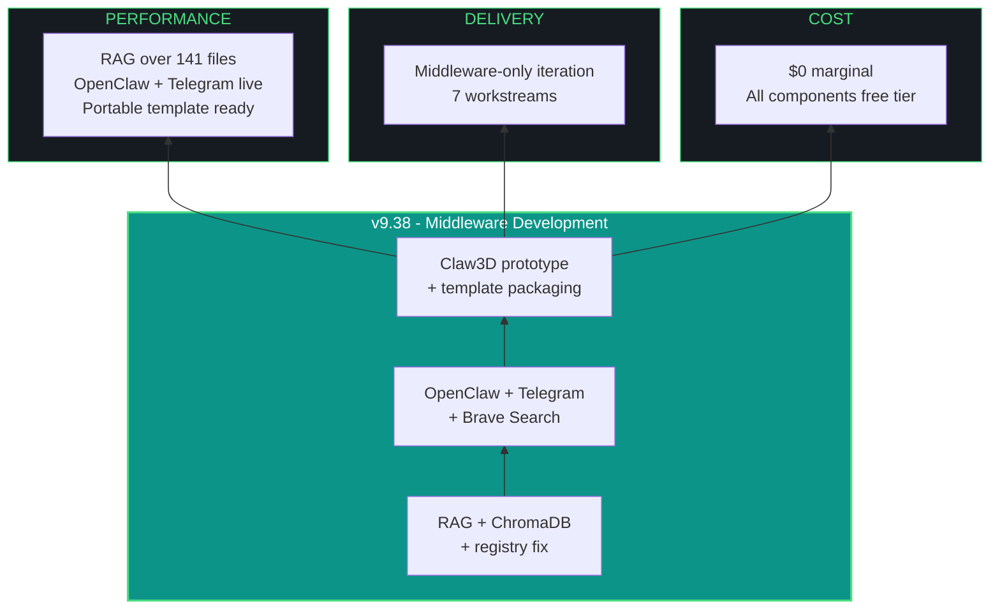

# kjtcom - Design Document v9.38

**Phase:** 9 - App Optimization
**Iteration:** 38
**Date:** April 5, 2026
**Author:** Kyle Thompson (via claude.ai Opus 4.6 session)
**Focus:** Middleware Development - RAG, OpenClaw/Telegram, Claw3D, Brave Search, Evaluator Fix

---

## MANDATORY AMENDMENTS (v9.35+ - PERMANENT)

### Multi-Agent Orchestration
Every iteration MUST consult at least TWO (2) LLMs. Document in build log.

### MCP Server Usage
Every iteration MUST use applicable MCP servers. Document skips with reasons.

### install.fish Living Document
Every iteration MUST update docs/install.fish if new dependencies added. Report MUST confirm.

### Agent Evaluator Middleware (v9.36+)
Qwen3.5-9B is permanent evaluator. Scores append to agent_scores.json with token tracking. Report includes Agent Scorecard.

### Living Architecture Chart (v9.38+)
The architecture mermaid chart lives at `docs/kjtcom-architecture.mmd`. README.md links to it. Every iteration that changes architecture (new agents, MCPs, components, pipelines) MUST update the .mmd file. The report MUST confirm the chart was updated or state "No architecture changes."

---

## 1. EXECUTIVE SUMMARY

v9.38 is the middleware development iteration. No Flutter UI changes except README. Seven workstreams focused entirely on making kjtcom's middleware portable:

| # | Workstream | Priority | Description |
|---|-----------|----------|-------------|
| W1 | RAG middleware | P1 | nomic-embed-text + ChromaDB + embed 141 archive files + fix registry |
| W2 | OpenClaw + Telegram | P1 | Install OpenClaw, configure Telegram BotFather interface, test sandbox |
| W3 | Brave Search API | P1 | Replace/augment web search with Brave Search API for agent queries |
| W4 | Claw3D prototype | P2 | Three.js IAO workspace visualization (Tab 7 or standalone) |
| W5 | Evaluator enhancements | P1 | Token tracking, gotcha merge, cumulative leaderboard |
| W6 | Architecture chart | P1 | Living .mmd file in docs/, linked from README |
| W7 | Portable template packaging | P2 | Consolidate all IAO components into stampable structure |

---

## 2. RAG MIDDLEWARE (W1)

### Why the v9.37 Registry Builder Failed

Exit code 144 = SIGKILL. The script tried to load Qwen for each of 33 iterations with 300s timeout, feeding entire file contents directly. OOM from Python + Ollama model + intermediate data exceeding available memory.

### Fix: Separate Embedding from Evaluation

```
Step 1: Pull nomic-embed-text (270 MB, tiny)
Step 2: Install ChromaDB (pip, pure Python)
Step 3: Embed all 141 archive files into ChromaDB
        - nomic-embed-text handles this (no Qwen needed)
        - Batch chunking: 1000 chars per chunk, 200 char overlap
        - Metadata: filename, iteration version, file type (design/plan/build/report)
Step 4: Rebuild iteration_registry.json
        - For each iteration: query ChromaDB for relevant chunks
        - Feed chunks (not full files) to Qwen with /no_think
        - Qwen scores with limited context (2-4K tokens per iteration)
Step 5: Add token tracking to agent_scores.json
        - prompt_tokens, eval_tokens, total_tokens per agent
```

### Stack

| Component | Version | VRAM/RAM |
|-----------|---------|----------|
| nomic-embed-text | via Ollama | ~270 MB VRAM |
| ChromaDB | latest pip | RAM only (~50-200 MB depending on corpus) |
| Qwen3.5-9B | already deployed | ~5.1 GB VRAM (loads after embedding completes) |

nomic-embed-text and Qwen do NOT need to be loaded simultaneously. Embed first (tiny model), unload, then load Qwen for scoring.

---

## 3. OPENCLAW + TELEGRAM (W2)

### OpenClaw

OpenClaw is the open-source autonomous agent framework (146K+ GitHub stars). It executes multi-step tasks in a sandboxed environment.

```fish
# Install OpenClaw
pip install open-interpreter --break-system-packages
# Or clone from GitHub for latest
git clone https://github.com/OpenInterpreter/open-interpreter.git
```

### NemoClaw Security Layer

NemoClaw wraps OpenClaw with file isolation, network policies, and audit trails. Alpha-stage from NVIDIA.

```fish
# NemoClaw requires Docker
# Install and configure sandbox policies
pip install nemoclaw --break-system-packages
```

### Telegram BotFather Interface

Telegram is the OpenClaw user interface. Users message a bot, the bot routes to OpenClaw for execution.

```fish
# 1. Create bot via Telegram BotFather
#    Message @BotFather on Telegram
#    /newbot -> name: "kjtcom IAO Agent" -> username: kjtcom_iao_bot
#    Save the bot token (NEVER commit to repo)

# 2. Set environment variable
set -gx TELEGRAM_BOT_TOKEN "your-bot-token-here"  # in config.fish

# 3. Install python-telegram-bot
pip install python-telegram-bot --break-system-packages

# 4. Create bot script that routes messages to OpenClaw
# scripts/telegram_bot.py
```

### Bot Capabilities

| Command | Action |
|---------|--------|
| /status | Show Ollama model status, MCP server health |
| /query [text] | Run a kjtcom Firestore query |
| /evaluate [version] | Run Qwen evaluator against an iteration |
| /gotcha | List active gotchas |
| /scores | Show agent leaderboard |
| /ask [question] | RAG-powered Q&A over archive |

### Security

- Bot token in environment variable ONLY (G10/G11 pattern)
- NemoClaw sandbox isolates agent file access
- Telegram bot restricted to authorized user IDs
- No customer data exposed through bot

---

## 4. BRAVE SEARCH API (W3)

Brave Search API replaces generic web search for agent research tasks. Free tier: 2,000 queries/month.

```fish
# Get API key from https://brave.com/search/api/
set -gx BRAVE_SEARCH_API_KEY "your-key-here"  # in config.fish

# Install
pip install requests --break-system-packages  # likely already installed

# Usage from agent scripts
# curl -s "https://api.search.brave.com/res/v1/web/search?q=flutter+riverpod+3" \
#   -H "X-Subscription-Token: $BRAVE_SEARCH_API_KEY" \
#   -H "Accept: application/json"
```

### Integration Points

| Consumer | Use Case |
|----------|----------|
| Claude Code (via MCP or script) | Research during iterations |
| Qwen3.5-9B (via Python script) | Context enrichment for evaluations |
| OpenClaw/Telegram bot | /search command for users |
| RAG pipeline | Augment archive with web context |

---

## 5. CLAW3D PROTOTYPE (W4)

### Concept

A Three.js visualization of the IAO workspace showing agent status, pipeline progress, and MCP connections. Reference: github.com/iamlukethedev/Claw3D.

### Implementation Options

| Option | Approach | Effort |
|--------|----------|--------|
| A | New Flutter tab (Tab 7) with flutter_gl or webview | High - Three.js in Flutter is complex |
| B | Standalone HTML page served alongside Flutter app | Medium - pure Three.js, no Flutter integration |
| C | React artifact in docs/ for prototyping | Low - fastest to validate concept |

### Recommendation for v9.38

Option C first. Build a standalone HTML/Three.js prototype in `docs/claw3d-prototype/` that visualizes:
- Agent nodes (Qwen, Nemotron, GLM, Claude Code, Gemini CLI) as 3D objects
- MCP server connections as edges
- Pipeline flow as animated particles
- Status colors (green = active, gray = idle, red = error)

Port to Flutter tab in a later iteration after the visualization concept is validated.

---

## 6. EVALUATOR ENHANCEMENTS (W5)

### Token Tracking

Add to agent_scores.json per agent per iteration:

```json
{
  "agent": "Claude Code (Opus 4.6)",
  "prompt_tokens": 45000,
  "eval_tokens": 12000,
  "total_tokens": 57000,
  "notes": "..."
}
```

Ollama API returns token counts in response metadata. Claude Code token usage available via session stats.

### Gotcha Registry Merge

Merge the gotcha registry (G1-G53) into iteration_registry.json with agent attribution:

```json
{
  "gotcha_registry": [
    {
      "id": "G45",
      "title": "Quote cursor placement",
      "created_in": "v9.29",
      "resolved_in": "v9.34",
      "attempts": 7,
      "caused_by": "TextField architecture",
      "agents_failed": ["claude-code (6x)"],
      "resolved_by": "gemini-cli",
      "resolution": "addPostFrameCallback"
    }
  ]
}
```

### Cumulative Leaderboard

Build from agent_scores.json history:

```
Agent                  | Iterations | Avg Score | Best | Worst | Trend
Claude Code (Opus 4.6) | 3          | 39.0/50   | 44   | 32    | +12
Qwen3.5-9B             | 3          | 31.3/50   | 33   | 28    | +5
Nemotron Mini 4B        | 1          | 14.0/50   | 14   | 14    | -
GLM-4.6V-Flash          | 1          | 14.0/50   | 14   | 14    | -
```

---

## 7. ARCHITECTURE CHART (W6)

### Living .mmd File

Create `docs/kjtcom-architecture.mmd` with the full mermaid chart. This is a living document updated every iteration that changes architecture.

### README Integration

Add to README.md:

```markdown
## Architecture

See the [living architecture chart](docs/kjtcom-architecture.mmd) for the full system diagram.

Current state: v9.38 - 3 pipelines, 5 MCP servers, 3 local LLMs, RAG middleware, OpenClaw + Telegram.
```

GitHub renders .mmd files natively in the web UI. For local viewing, any mermaid-compatible editor works.

### Update Process

Every iteration report MUST include:
- "Architecture chart updated: [list of changes]" OR
- "No architecture changes this iteration"

---

## 8. PORTABLE TEMPLATE PACKAGING (W7)

### Directory Structure

Create `template/` at repo root containing the stampable IAO components:

```
template/
  CLAUDE.md.template        # Agent instructions (placeholder project name)
  GEMINI.md.template        # Agent instructions
  launch-prompt.md.template # Launch prompt skeleton
  install.fish.template     # Environment setup (core deps, Ollama, MCP)
  .mcp.json.template        # 5 MCP server configs
  .gemini/settings.json.template
  evaluator/
    evaluator-prompt.md     # Qwen scoring template
    run_evaluator.py        # Automation script
    agent_scores.json       # Empty seed
  rag/
    embedder.py             # ChromaDB + nomic-embed ingest script
    query_rag.py            # RAG query interface
  schema/
    thompson_schema.md      # Thompson Schema spec
    schema.json.template    # Field mapping template
  gotcha/
    gotcha_registry.json    # Empty seed with schema
  README.md                 # Template usage instructions
```

---

## 9. IAO TRIDENT



---

## 10. TEN PILLARS

| # | Pillar | v9.38 Application |
|---|--------|--------------------|
| P1 | Trident | $0 cost, 7 workstreams, middleware focus |
| P2 | Artifact Loop | Design + Plan + Build + Report + .mmd + template/ |
| P3 | Diligence | Verify each component before integrating |
| P4 | Pre-Flight | Ollama running, ChromaDB installable, Telegram bot token set |
| P5 | Agentic Harness | 3 LLMs + 5 MCPs + RAG + OpenClaw + Telegram + Brave |
| P6 | Zero-Intervention | 1 expected (Telegram BotFather token creation) |
| P7 | Self-Healing | If OpenClaw install fails, document and defer to v9.39 |
| P8 | Phase Graduation | Middleware iteration, no app UI changes |
| P9 | Post-Flight | RAG queries return results, Telegram bot responds, .mmd renders |
| P10 | Continuous Improvement | Template IS the portability mechanism |

---

## 11. CONVENTIONS

- Fish shell throughout. pip --break-system-packages. python3 -u.
- No em-dashes. Use " - " instead. Use "->" for arrows.
- "pipelines" and "log types," never "tables" or "datasets"
- Minimum 2 LLMs per iteration. MCP servers mandatory.
- Update docs/install.fish when new dependencies added.
- Update docs/kjtcom-architecture.mmd when architecture changes.
- agent_scores.json includes token tracking (v9.38+).

---

*Design document generated from claude.ai Opus 4.6 session, April 5, 2026.*
