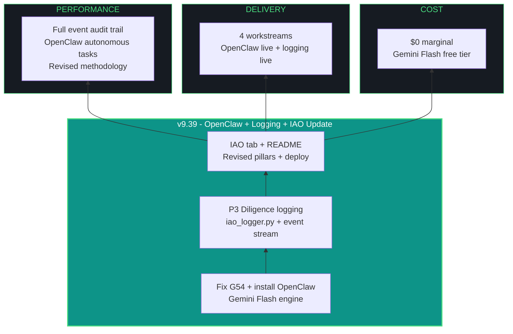

# kjtcom - Design Document v9.39

**Phase:** 9 - App Optimization
**Iteration:** 39
**Date:** April 5, 2026
**Author:** Kyle Thompson (via claude.ai Opus 4.6 session)
**Focus:** OpenClaw/Gemini Setup + P3 Diligence Event Logging + IAO Tab Update

---

## MANDATORY AMENDMENTS (v9.35+ - PERMANENT)

### Multi-Agent Orchestration (v9.35+)
Every iteration MUST consult at least TWO (2) LLMs. Document in build log.

### MCP Server Usage (v9.35+)
Every iteration MUST use applicable MCP servers. Document skips with reasons.

### install.fish + Architecture Chart Living Documents (v9.38+)
Update docs/install.fish and docs/kjtcom-architecture.mmd when changes occur. Report confirms.

### Agent Evaluator (v9.36+)
Qwen3.5-9B permanent evaluator. Token tracking. Agent Scorecard in report.

### P3 DILIGENCE - EVENT LOGGING (v9.39+ - NEW AMENDMENT)

**Pillar 3 (Diligence) is expanded from "verify assumptions before acting" to include structured event logging of all agent communications and system interactions.**

Every script that calls an LLM, MCP server, external API, or executes a system command MUST log a structured event to `data/iao_event_log.jsonl`.

#### Event Schema

```json
{
  "timestamp": "2026-04-05T14:32:01.123Z",
  "iteration": "v9.39",
  "event_type": "llm_call | mcp_call | api_call | file_op | command | agent_msg",
  "source_agent": "claude-code | qwen3.5-9b | nemotron-mini | openclaw | telegram-bot",
  "target": "qwen3.5:9b | firebase-mcp | brave-search | chromadb | firestore | filesystem",
  "action": "chat | embed | query | scrape | screenshot | read | write | search | evaluate",
  "input_summary": "First 200 chars of prompt or command",
  "output_summary": "First 200 chars of response or result",
  "tokens": {"prompt": 401, "eval": 167, "total": 568},
  "latency_ms": 7293,
  "status": "success | error | timeout | empty_response",
  "error": null,
  "gotcha_triggered": null
}
```

#### Logger Module

`scripts/utils/iao_logger.py` provides:

```python
from utils.iao_logger import log_event

# Every LLM call
log_event("llm_call", "claude-code", "qwen3.5:9b", "chat",
          input_summary="Review this .mcp.json...",
          output_summary="3 points: firebase version...",
          tokens={"prompt": 401, "eval": 167, "total": 568},
          latency_ms=7293, status="success")

# Every MCP tool call
log_event("mcp_call", "claude-code", "firebase-mcp", "query",
          input_summary="Get 3 docs from locations",
          output_summary="[101 Cafe, 101 Freeway, ...]",
          latency_ms=1200, status="success")

# Every API call
log_event("api_call", "telegram-bot", "brave-search", "search",
          input_summary="flutter riverpod 3",
          output_summary="3 results: ...",
          latency_ms=450, status="success")
```

#### What the Event Log Feeds

| Consumer | How It Uses Events |
|----------|-------------------|
| Evaluator (Qwen) | Real token counts, real latency, error rates per agent |
| Iteration registry | Automated extraction instead of narrative interpretation |
| Agent leaderboard | Actual performance data, not estimated scores |
| Gotcha detector | Pattern matching: "this agent failed 3x on similar prompts" |
| Telegram bot /status | Real-time event counts and health metrics |
| Report artifact | "Agent Communication Summary" section with event stats |

#### Enforcement

Every iteration report MUST include an "Event Log Summary" section showing:
- Total events logged
- Events by type (llm_call, mcp_call, api_call, etc.)
- Events by agent
- Error rate
- Total tokens consumed

---

## 1. EXECUTIVE SUMMARY

v9.39 has four workstreams:

| # | Workstream | Priority | Description |
|---|-----------|----------|-------------|
| W1 | OpenClaw + Gemini engine | P1 | Fix G54 (tiktoken), install OpenClaw, configure Gemini Flash as engine |
| W2 | P3 Diligence event logging | P1 | iao_logger.py, wrap all existing scripts, JSONL event stream |
| W3 | IAO tab update | P2 | Update iao_tab.dart with revised 10 pillars (P3 expanded), deploy |
| W4 | README update | P2 | Revised pillar descriptions, architecture chart, current state |

---

## 2. OPENCLAW + GEMINI ENGINE (W1)

### Fix G54: tiktoken on Python 3.14

tiktoken 0.12.0 has CP314 wheels. open-interpreter pins to 0.7.0 which didn't. Fix: pre-install newer tiktoken.

```fish
pip install tiktoken==0.12.0 --break-system-packages
pip install open-interpreter --break-system-packages
```

If open-interpreter still fails, use `--no-deps` and install dependencies manually:
```fish
pip install open-interpreter --no-deps --break-system-packages
pip install tiktoken>=0.12.0 litellm pyyaml rich --break-system-packages
```

### Gemini Flash as OpenClaw Engine

OpenClaw supports multiple LLM backends. Configure Gemini Flash API:

```fish
# OpenClaw uses GEMINI_API_KEY (already in config.fish)
# Configure via interpreter settings:
python3 -c "
from interpreter import interpreter
interpreter.llm.model = 'gemini/gemini-2.5-flash'
interpreter.llm.api_key = '$GEMINI_API_KEY'
interpreter.auto_run = True
interpreter.chat('What is 2+2?')
"
```

### Why Gemini Flash, Not Qwen

| Factor | Gemini Flash | Qwen3.5-9B |
|--------|-------------|------------|
| Reliability | Zero failures across 37 iterations | G51 regression - empty responses |
| VRAM | Zero (cloud API) | 5.1 GB (competes with other models) |
| Cost | Free tier (generous) | Free (local) |
| Speed | Very fast | 54 t/s when working |
| Autonomous agent quality | Strong instruction following | Inconsistent JSON output |

### Agent Role Split (Definitive)

| Agent | Role | Engine |
|-------|------|--------|
| Claude Code | Primary executor (Flutter, architecture) | Claude API (Pro sub) |
| Gemini CLI | Pipeline executor (Phases 1-5) | Gemini API (free) |
| OpenClaw | Autonomous task worker (Telegram bot backend) | Gemini Flash API (free) |
| Qwen3.5-9B | Evaluator + code reviewer (when G51 fixed) | Local Ollama |
| Nemotron Mini 4B | Fast triage | Local Ollama |
| GLM-4.6V-Flash | Vision + screenshots | Local Ollama |
| nomic-embed-text | Embeddings only | Local Ollama |

### Telegram Bot Integration

Update `scripts/telegram_bot.py` to route commands through OpenClaw when appropriate:

| Command | Handler |
|---------|---------|
| /status | Direct (Python, no LLM) |
| /query | OpenClaw (Gemini) -> Firestore |
| /evaluate | Qwen evaluator (local) |
| /gotcha | Direct (read JSON) |
| /scores | Direct (read JSON) |
| /ask | RAG (ChromaDB) -> OpenClaw (Gemini) for answer synthesis |
| /search | Brave Search API -> OpenClaw (Gemini) for summary |

### NemoClaw Security

If NemoClaw is installable (alpha), configure sandbox policies:
- File system: read-only except data/ and docs/
- Network: localhost:11434 (Ollama), Brave Search API, Gemini API only
- No git operations
- Audit trail to data/iao_event_log.jsonl (feeds P3 Diligence)

---

## 3. P3 DILIGENCE EVENT LOGGING (W2)

### Create iao_logger.py

```python
# scripts/utils/iao_logger.py
import json, os
from datetime import datetime, timezone

LOG_PATH = os.path.join(os.path.dirname(__file__), '..', '..', 'data', 'iao_event_log.jsonl')

def log_event(event_type, source_agent, target, action,
              input_summary="", output_summary="",
              tokens=None, latency_ms=None,
              status="success", error=None, gotcha_triggered=None):
    event = {
        "timestamp": datetime.now(timezone.utc).isoformat(),
        "iteration": os.environ.get("IAO_ITERATION", "unknown"),
        "event_type": event_type,
        "source_agent": source_agent,
        "target": target,
        "action": action,
        "input_summary": str(input_summary)[:200],
        "output_summary": str(output_summary)[:200],
        "tokens": tokens,
        "latency_ms": latency_ms,
        "status": status,
        "error": str(error)[:500] if error else None,
        "gotcha_triggered": gotcha_triggered
    }
    os.makedirs(os.path.dirname(LOG_PATH), exist_ok=True)
    with open(LOG_PATH, 'a') as f:
        f.write(json.dumps(event) + '\n')
```

### Wrap Existing Scripts

Every script that makes an external call gets logging added:

| Script | Calls to Wrap |
|--------|--------------|
| run_evaluator.py | Ollama chat (Qwen evaluation) |
| query_rag.py | Ollama embed (nomic-embed), ChromaDB query |
| embed_archive.py | Ollama embed (nomic-embed), ChromaDB add |
| build_registry_v2.py | Ollama chat (Qwen), ChromaDB query |
| brave_search.py | Brave Search API HTTP call |
| telegram_bot.py | All command handlers (LLM, RAG, search, direct) |
| generate_leaderboard.py | File read (agent_scores.json) |

### Event Log Analysis Script

Create `scripts/analyze_events.py`:
- Reads data/iao_event_log.jsonl
- Outputs: total events, by type, by agent, error rate, token totals, latency percentiles
- Used by report generator and Telegram /status command

---

## 4. IAO TAB UPDATE (W3)

### Revised 10 Pillars

Update `app/lib/widgets/iao_tab.dart` to reflect the expanded P3:

| # | Pillar | Description (updated) |
|---|--------|-----------------------|
| P1 | Trident | Every iteration balances Cost, Delivery, Performance |
| P2 | Artifact Loop | Design, plan, build, report per iteration. Living documents maintained. |
| **P3** | **Diligence** | **Verify assumptions before acting. Log all agent communications and system interactions to structured event stream. Every LLM call, MCP tool call, API call, and system command is recorded.** |
| P4 | Pre-Flight | Validate environment, auth, tools before execution |
| P5 | Agentic Harness | Agent instructions (CLAUDE.md/GEMINI.md), launch prompts, MCP configs, OpenClaw sandbox |
| P6 | Zero-Intervention | Pre-answer every decision. Count interventions. |
| P7 | Self-Healing | Max 3 attempts per error, then log and skip |
| P8 | Phase Graduation | Start small, graduate to scale |
| P9 | Post-Flight | 3-tier testing + event log analysis |
| P10 | Continuous Improvement | Evaluator middleware, agent scoring, iteration registry, leaderboard |

### Flutter Code Change

In `app/lib/widgets/iao_tab.dart`, update the P3 pillar card:

```dart
// Before:
PillarCard(
  number: 3,
  title: 'Diligence',
  description: 'Verify assumptions before acting.',
),

// After:
PillarCard(
  number: 3,
  title: 'Diligence',
  description: 'Verify assumptions before acting. Log all agent communications to structured event stream.',
),
```

Also update P5 and P10 descriptions to reflect current state (OpenClaw, evaluator, leaderboard).

### Deploy

```fish
cd ~/dev/projects/kjtcom/app && flutter build web
cd ~/dev/projects/kjtcom && firebase deploy --only hosting
```

---

## 5. README UPDATE (W4)

Update the IAO Methodology section in README.md:
- Revised P3 description with logging mandate
- Updated P5 to mention OpenClaw + Telegram
- Updated P10 to mention evaluator middleware + leaderboard
- Current state: v9.39, 47 gotchas, 5 MCP servers, 4 local models (including nomic-embed)
- Architecture chart link confirmed

---

## 6. G51 INVESTIGATION

G51 (Qwen empty responses) needs investigation in this iteration:

```fish
# Check Ollama version
ollama --version

# Try fresh Qwen pull
ollama rm qwen3.5:9b
ollama pull qwen3.5:9b

# Test with explicit no-think
curl -s http://localhost:11434/api/chat -d '{
  "model": "qwen3.5:9b",
  "messages": [{"role": "user", "content": "/no_think What is 2+2? Reply with just the number."}],
  "stream": false,
  "options": {"num_predict": 100}
}' | python3 -c "import sys,json; r=json.load(sys.stdin); print(f'Content: [{r[\"message\"][\"content\"]}] Tokens: {r.get(\"eval_count\",0)}')"

# If still empty, try think:false option (newer Ollama)
curl -s http://localhost:11434/api/chat -d '{
  "model": "qwen3.5:9b",
  "messages": [{"role": "user", "content": "What is 2+2?"}],
  "stream": false,
  "think": false,
  "options": {"num_predict": 100}
}' | python3 -c "import sys,json; r=json.load(sys.stdin); print(f'Content: [{r[\"message\"][\"content\"]}]')"
```

---

## 7. IAO TRIDENT



---

## 8. TEN PILLARS (REVISED)

| # | Pillar | v9.39 Application |
|---|--------|--------------------|
| P1 | Trident | $0 cost, 4 workstreams, OpenClaw + logging |
| P2 | Artifact Loop | Design + Plan + Build + Report + event log |
| P3 | **Diligence (EXPANDED)** | **Event logging of all agent communications. iao_logger.py wraps all scripts.** |
| P4 | Pre-Flight | Ollama, MCP servers, API keys, tiktoken version |
| P5 | Agentic Harness | 4 LLMs + 5 MCPs + OpenClaw + Telegram + Brave |
| P6 | Zero-Intervention | 1 expected (G51 investigation may need manual testing) |
| P7 | Self-Healing | If OpenClaw install still fails, use Python 3.13 venv |
| P8 | Phase Graduation | Logging wraps existing scripts first, then new ones |
| P9 | Post-Flight | Event log analysis, all tabs functional, OpenClaw responds |
| P10 | Continuous Improvement | Event log feeds evaluator, registry, leaderboard |

---

## 9. CONVENTIONS

- Fish shell throughout. pip --break-system-packages. python3 -u.
- No em-dashes. Use " - " instead. Use "->" for arrows.
- Set IAO_ITERATION env var before running scripts: `set -gx IAO_ITERATION v9.39`
- All scripts use iao_logger.py for external calls.
- Update install.fish, architecture.mmd, README when architecture changes.
- agent_scores.json includes token tracking. Event log is append-only JSONL.

---

*Design document generated from claude.ai Opus 4.6 session, April 5, 2026.*
