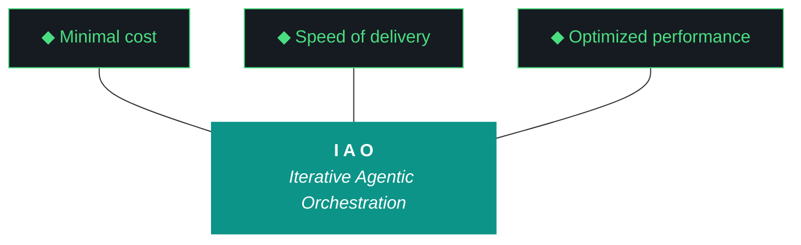

# kjtcom - Plan Document v10.55

**Phase:** 10 - Pipeline Expansion & Platform Hardening
**Iteration:** 10.55
**Date:** April 05, 2026
**Machine:** NZXTcos (W1 Bourdain pipeline) + tsP3-cos (W3-W5 app fixes)

---

## MERMAID TRIDENT



---

## 10 IAO PILLARS

**Pillar 1 - The IAO Trident.** Every decision is governed by three competing objectives: minimal cost (free-tier LLMs over paid, API scripts over SaaS add-ons, no infrastructure that outlives its purpose), optimized performance (right-size the solution, performance from discovery and proof-of-value testing, not premature abstraction), and speed of delivery (code and objectives become stale, P0 ships, P1 ships if time allows, P2 is post-launch). Cheapest is rarely fastest. Fastest is rarely most optimized. The methodology finds the triangle's center of gravity for each decision.

**Pillar 2 - Artifact Loop.** Every iteration produces four artifacts: design doc (living architecture), plan (execution steps), build log (session transcript), report (metrics + recommendation). Previous artifacts archive to docs/archive/. Agents never see outdated instructions. If an artifact has no consumer, it should not exist.

**Pillar 3 - Diligence.** The methodology does not work if you do not read. Before any iteration touches code, the plan goes through revision - often several revisions.

**Pillar 4 - Pre-Flight Verification.** Validate the environment before execution.

**Pillar 5 - Agentic Harness Orchestration.** The harness is the product; the model is the engine.

**Pillar 6 - Zero-Intervention Target.** Interventions are failures in planning.

**Pillar 7 - Self-Healing Execution.** Max 3 retries per error with diagnostic feedback.

**Pillar 8 - Phase Graduation.** Harden the harness progressively across iterations.

**Pillar 9 - Post-Flight Functional Testing.** Rigorous validation of all deliverables.

**Pillar 10 - Continuous Improvement.** Retrospectives feed directly into the next plan.

---

## EXECUTION PLAN

### Pre-Flight Checklist

```
[ ] Verify NZXTcos: ollama list shows qwen3.5:9b, nemotron-mini:4b, nomic-embed-text
[ ] Verify NZXTcos: GPU available (nvidia-smi shows RTX 2080 SUPER)
[ ] Verify NZXTcos: Sleep masked (systemctl status sleep.target shows masked)
[ ] Verify NZXTcos: ~/dev/projects/kjtcom exists and is on main branch
[ ] Verify tsP3-cos: ~/Development/Projects/kjtcom exists and is on main branch
[ ] Verify Firebase: firebase projects:list shows kjtcom-c78cd
[ ] Verify Gemini API key: echo $GEMINI_API_KEY (non-empty)
[ ] Verify Google Places API key: echo $GOOGLE_PLACES_API_KEY (non-empty)
[ ] Verify yt-dlp: yt-dlp --version (installed)
[ ] Verify faster-whisper: python3 -c "from faster_whisper import WhisperModel; print('OK')"
```

---

### STEP 1: W3 — Fix Claw3D (30 min, Claude Code on tsP3-cos)

**Diagnostic first.** Do not blindly rewrite.

```
1. Open app/web/claw3d.html in editor
2. Check Three.js CDN URL - verify it resolves:
   curl -sI https://cdnjs.cloudflare.com/ajax/libs/three.js/r128/three.min.js | head -1
   (Must return HTTP/2 200)
3. Check data/claw3d_iterations.json:
   python3 -c "import json; json.load(open('data/claw3d_iterations.json')); print('VALID')"
4. Check the fetch path in claw3d.html - does it use a relative path that works
   on Firebase Hosting? Firebase serves from app/web/ root, so the path should
   be relative to that, NOT to the repo root.
   grep -n "fetch\|\.json" app/web/claw3d.html
5. Look for JS errors:
   - Unclosed template literals
   - Missing semicolons after object definitions
   - Undefined variables (check all Three.js class names match r128 API)
   - IMPORTANT: THREE.OrbitControls is NOT in r128 core. If used, it needs
     a separate CDN import or must be removed.
   - IMPORTANT: THREE.CapsuleGeometry does NOT exist in r128. Use
     CylinderGeometry or SphereGeometry instead.
6. Serve locally and test:
   cd app/web && python3 -m http.server 8080
   # Open http://localhost:8080/claw3d.html in browser
   # Check browser console (F12) for errors
```

**Fix approach:**
- If CDN URL is wrong: fix it
- If JSON path is wrong: fix the relative path for Firebase Hosting
- If Three.js API mismatch (r128 vs newer features): downgrade to r128-compatible APIs
- If OrbitControls imported incorrectly: either import from CDN addon or remove
- Default to STATIC layout — no animation on load
- All nodes visible in one viewport, labeled, readable

**Deploy:**
```
cd app && flutter build web
firebase deploy --only hosting
```

**Verify:**
```
# Playwright MCP screenshot or manual browser check
# Browser console: 0 errors
```

---

### STEP 2: W1 — Bourdain Pipeline Phase 1 (3-4 hours, Gemini CLI on NZXTcos)

**This is the longest workstream. Run on NZXTcos with GPU.**

#### 2a. Create pipeline directory structure

```fish
mkdir -p data/bourdain/audio data/bourdain/transcripts data/bourdain/extracted data/bourdain/normalized data/bourdain/geocoded data/bourdain/enriched
```

#### 2b. Phase 1 — Acquire (yt-dlp)

```fish
# Download first 30 videos as MP3
yt-dlp --playlist-items 1-30 \
  -x --audio-format mp3 \
  -o "data/bourdain/audio/%(playlist_index)03d_%(title)s.%(ext)s" \
  "https://www.youtube.com/playlist?list=PLEVfhwFNb44fPn5N3OXk-aEHFvLOPzXKo"
```

Note unavailable videos. Expect some to be region-locked or removed.

#### 2c. Phase 2 — Transcribe (faster-whisper, CUDA)

**CRITICAL: Use graduated tmux batches (G18 — CUDA OOM on RTX 2080 SUPER 8GB VRAM)**

```fish
# Batch 1: first 10 videos, 600s timeout
tmux new-session -d -s batch1
tmux send-keys -t batch1 "python3 -u scripts/phase2_transcribe.py --pipeline bourdain --start 1 --end 10 --timeout 600" Enter

# Monitor:
tmux attach -t batch1
# Wait for completion, then:

# Batch 2: videos 11-20
tmux new-session -d -s batch2
tmux send-keys -t batch2 "python3 -u scripts/phase2_transcribe.py --pipeline bourdain --start 11 --end 20 --timeout 600" Enter

# Batch 3: videos 21-30
tmux new-session -d -s batch3
tmux send-keys -t batch3 "python3 -u scripts/phase2_transcribe.py --pipeline bourdain --start 21 --end 30 --timeout 600" Enter
```

**DO NOT run batches simultaneously — G18 CUDA OOM.**

#### 2d. Phase 3 — Extract (Gemini 2.5 Flash API)

```fish
python3 -u scripts/phase3_extract.py --pipeline bourdain
```

The extraction prompt must handle Bourdain-specific content:
- Multi-show awareness: No Reservations, Parts Unknown, A Cook's Tour, The Layover
- `t_any_shows` must capture the specific show name per entity
- High entity density expected (restaurants, markets, neighborhoods, street food vendors)
- `t_any_cuisines` and `t_any_dishes` will be heavily populated
- `t_any_people` should capture chefs, owners, guides mentioned

#### 2e. Phase 4 — Normalize

```fish
python3 -u scripts/phase4_normalize.py --pipeline bourdain
```

Verify schema v3 compliance: all `t_any_*` fields present.

#### 2f. Phase 5 — Geocode

```fish
python3 -u scripts/phase5_geocode.py --pipeline bourdain
```

Nominatim at 1 req/sec. Expect lower hit rate on international street food vendors — Google Places backfill will catch these in Phase 6.

#### 2g. Phase 6 — Enrich

```fish
python3 -u scripts/phase6_enrich.py --pipeline bourdain
```

#### 2h. Phase 7 — Load to staging

```fish
python3 -u scripts/phase7_load.py --pipeline bourdain --database staging
```

**DO NOT load to production. Staging only for Phase 1.**

#### 2i. Checkpoint

Record: videos acquired, transcribed, entities extracted, geocoding %, enrichment %, entities loaded. Save to `data/bourdain/checkpoint.json`.

---

### STEP 3: W2 — Phase 9 Retrospective Rebuild (60 min, Claude Code)

```
1. List all files in docs/archive/:
   command ls docs/archive/ | grep "v9\." | sort

2. For each iteration v9.27 through v9.53:
   - Read the report: docs/archive/kjtcom-report-v9.XX.md
   - Read the build log: docs/archive/kjtcom-build-v9.XX.md
   - Extract: workstream names, priorities, outcomes, evidence, intervention count

3. Build the workstream inventory table — EVERY row must have an actual
   outcome. If the report file is missing, mark "MISSING REPORT" — do
   NOT mark "Unknown".

4. Compute metrics:
   - Total workstreams: count all W rows across all iterations
   - Completion rate: complete / total
   - Completion by priority: group by P0/P1/P2/P3
   - Completion by category: classify each workstream and group
   - Multi-iteration bugs: trace quote cursor, 1000-result limit, autocomplete
     across iterations with attempt counts
   - Intervention rate per iteration

5. Write pattern analysis with specific iteration citations.

6. Write gotcha analysis: list every G## introduced in Phase 9,
   resolved vs. active, resolution durability.

7. Write IAO methodology assessment with evidence, not generalities.

8. Save to docs/phase9-retrospective.md
   Verify: wc -l >= 300
```

---

### STEP 4: W4 — Fix agent_scores.json (30 min, Claude Code)

```
1. cat agent_scores.json | python3 -m json.tool
   - Does it match the canonical schema? (iterations array with 5-dimension scores)
   - If malformed, rebuild from scratch with correct schema

2. grep -rn "agent_scores" scripts/
   - Trace read/write paths in run_evaluator.py and generate_artifacts.py
   - Verify file path is correct (repo root, not scripts/ or data/)

3. Fix run_evaluator.py to:
   - Read existing agent_scores.json
   - Append new iteration entry to iterations array
   - Write back (append-only pattern)
   - Handle first-run case (create file if missing)

4. Test:
   python3 scripts/run_evaluator.py --iteration v10.55
   cat agent_scores.json | python3 -m json.tool
```

---

### STEP 5: W5 — Post-Flight Enhancement (15 min, Claude Code)

```
1. Open scripts/post_flight.py
2. Add after existing checks:
   
   # Static asset checks
   STATIC_ASSETS = [
       "app/web/claw3d.html",
       "app/web/architecture.html"
   ]
   for asset in STATIC_ASSETS:
       assert os.path.exists(asset), f"FAIL: {asset} missing"
       content = open(asset).read()
       assert "<html" in content.lower() or "<!doctype" in content.lower(), \
           f"FAIL: {asset} missing HTML structure"
       assert "<script" in content.lower(), \
           f"FAIL: {asset} missing script tags"
       print(f"PASS: {asset} exists and has valid structure")

   # JSON data file checks
   JSON_ASSETS = [
       "data/claw3d_iterations.json"
   ]
   for asset in JSON_ASSETS:
       assert os.path.exists(asset), f"FAIL: {asset} missing"
       import json
       json.load(open(asset))
       print(f"PASS: {asset} is valid JSON")

3. Run post_flight.py and verify new checks pass
```

---

### STEP 6: Post-Flight + Living Docs

```
1. python3 scripts/post_flight.py
2. Update docs/kjtcom-changelog.md with v10.55 entry
3. Update README.md version to v10.55
4. Run evaluator: python3 scripts/run_evaluator.py --iteration v10.55
5. Verify agent_scores.json has v10.55 entry
6. Archive v10.54 artifacts to docs/archive/
```

---

## LAUNCH CHECKLIST

```
[ ] Pre-flight passes on both machines
[ ] W3: Claw3D loads at kylejeromethompson.com/claw3d.html (screenshot evidence)
[ ] W1: Bourdain Phase 1 entities in staging Firestore
[ ] W1: Checkpoint saved to data/bourdain/checkpoint.json
[ ] W2: docs/phase9-retrospective.md >= 300 lines, zero "Unknown" rows
[ ] W4: agent_scores.json valid JSON with v10.55 entry
[ ] W5: post_flight.py includes static asset checks
[ ] Post-flight passes
[ ] Changelog updated
[ ] README version bumped
[ ] All files committed (manually by Kyle)
```

---

## CLAUDE.md PRINTF BLOCK

Paste this into the active CLAUDE.md before launching:

```
printf '## v10.55 WORKSTREAMS

W1 (P1): Bourdain Pipeline Phase 1 Discovery
- Playlist: https://www.youtube.com/playlist?list=PLEVfhwFNb44fPn5N3OXk-aEHFvLOPzXKo
- 30 of 114 videos. yt-dlp -> faster-whisper (CUDA, graduated tmux batches) -> Gemini Flash extract -> normalize -> geocode -> enrich -> load to staging
- Pipeline ID: bourdain, t_log_type: bourdain, t_source_label: Anthony Bourdain
- Multi-show: No Reservations, Parts Unknown, A Cooks Tour, The Layover
- DO NOT load to production. Staging only.
- G18: graduated tmux batches, never simultaneous transcription

W2 (P1): Phase 9 Retrospective Rebuild
- Read EVERY report and build log in docs/archive/ for v9.27-v9.53
- Rebuild docs/phase9-retrospective.md from scratch
- Every workstream row must have actual outcome (complete/partial/failed/deferred)
- Zero Unknown rows. If report missing, mark MISSING REPORT
- Minimum 300 lines. Quantitative metrics required.

W3 (P1): Fix Claw3D
- app/web/claw3d.html stuck on Loading Static Solar System
- Diagnostic first: check Three.js CDN (r128), JSON fetch path, JS errors
- THREE.OrbitControls NOT in r128 core. THREE.CapsuleGeometry does NOT exist in r128.
- Static by default. All nodes visible. Labels readable.
- Deploy and verify: browser console 0 errors

W4 (P2): Fix agent_scores.json Pipeline
- Canonical schema: iterations array, 5 dimensions per agent (0-10 each, max 50)
- Dimensions: problem_analysis, code_correctness, efficiency, gotcha_avoidance, novel_contribution
- run_evaluator.py must append to iterations array (append-only)
- v10.55 entry must exist after evaluation

W5 (P2): Post-Flight Static Asset Checks
- Add file existence + HTML structure checks for claw3d.html and architecture.html
- Add JSON validation for claw3d_iterations.json
- Run post_flight.py and verify new checks pass
'
```

---

## GEMINI.md PRINTF BLOCK (for W1 only)

```
printf '## v10.55 W1: Bourdain Pipeline Phase 1 Discovery

Execute Phase 1 (Discovery batch) for the Bourdain pipeline.
Playlist: https://www.youtube.com/playlist?list=PLEVfhwFNb44fPn5N3OXk-aEHFvLOPzXKo
Videos: 1-30 of 114

Steps:
1. yt-dlp --playlist-items 1-30 -x --audio-format mp3
2. faster-whisper transcription (CUDA, graduated tmux batches per G18)
   - Batch 1: videos 1-10, timeout 600s
   - Batch 2: videos 11-20, timeout 600s  
   - Batch 3: videos 21-30, timeout 600s
   - NEVER run simultaneous batches (RTX 2080 SUPER 8GB VRAM)
3. Gemini 2.5 Flash extraction with Bourdain prompt
   - t_any_shows: capture specific show (No Reservations, Parts Unknown, etc.)
   - High entity density expected (restaurants, markets, street food)
4. phase4_normalize.py --pipeline bourdain (schema v3)
5. phase5_geocode.py --pipeline bourdain (Nominatim 1 req/sec)
6. phase6_enrich.py --pipeline bourdain (Google Places)
7. phase7_load.py --pipeline bourdain --database staging
   DO NOT LOAD TO PRODUCTION

Pipeline config:
- t_log_type: bourdain
- t_source_label: Anthony Bourdain
- Pipeline color: #8B5CF6 (purple)
- Output: data/bourdain/

Save checkpoint: data/bourdain/checkpoint.json
Record: videos acquired, transcribed, entities extracted, geocoding pct, enrichment pct
'
```

---

*Plan v10.55, April 05, 2026. 5 workstreams, 2 machines, Bourdain Phase 1 kickoff.*
