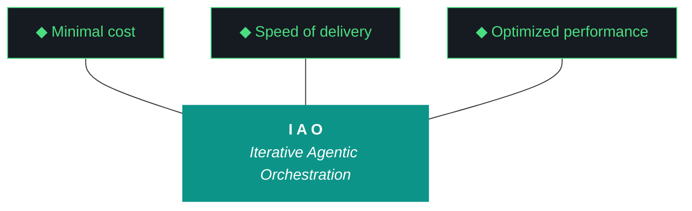

# kjtcom - Plan Document v10.56

**Phase:** 10 - Pipeline Expansion & Platform Hardening
**Iteration:** 10.56
**Date:** April 06, 2026
**Machines:** NZXTcos (W1 evaluator + W3 Bourdain pipeline) + tsP3-cos (W2 Claw3D + W4 README)

---

## MERMAID TRIDENT



---

## 10 IAO PILLARS

**Pillar 1 - The IAO Trident.** Every decision is governed by three competing objectives: minimal cost (free-tier LLMs over paid, API scripts over SaaS add-ons, no infrastructure that outlives its purpose), optimized performance (right-size the solution, performance from discovery and proof-of-value testing, not premature abstraction), and speed of delivery (code and objectives become stale, P0 ships, P1 ships if time allows, P2 is post-launch).

**Pillar 2 - Artifact Loop.** Every iteration produces four artifacts: design doc (living architecture), plan (execution steps), build log (session transcript), report (metrics + recommendation). Previous artifacts archive to docs/archive/.

**Pillar 3 - Diligence.** The methodology does not work if you do not read. Before any iteration touches code, the plan goes through revision.

**Pillar 4 - Pre-Flight Verification.** Validate the environment before execution.

**Pillar 5 - Agentic Harness Orchestration.** The harness is the product; the model is the engine.

**Pillar 6 - Zero-Intervention Target.** Interventions are failures in planning.

**Pillar 7 - Self-Healing Execution.** Max 3 retries per error with diagnostic feedback.

**Pillar 8 - Phase Graduation.** Harden the harness progressively across iterations.

**Pillar 9 - Post-Flight Functional Testing.** Rigorous validation of all deliverables.

**Pillar 10 - Continuous Improvement.** Retrospectives feed directly into the next plan.

---

## PRE-FLIGHT CHECKLIST

```
[ ] NZXTcos: ollama list shows qwen3.5:9b, nemotron-mini:4b, nomic-embed-text
[ ] NZXTcos: nvidia-smi shows RTX 2080 SUPER available
[ ] NZXTcos: systemctl status sleep.target shows masked
[ ] NZXTcos: ~/dev/projects/kjtcom on main branch, clean working tree
[ ] tsP3-cos: ~/Development/Projects/kjtcom on main branch
[ ] Firebase: firebase projects:list shows kjtcom-c78cd
[ ] Gemini API key: echo $GEMINI_API_KEY (non-empty)
[ ] Google Places API key: echo $GOOGLE_PLACES_API_KEY (non-empty)
[ ] yt-dlp: yt-dlp --version
[ ] faster-whisper: python3 -c "from faster_whisper import WhisperModel; print('OK')"
[ ] Qwen responsive: curl -s http://localhost:11434/api/chat -d '{"model":"qwen3.5:9b","messages":[{"role":"user","content":"ping"}],"stream":false}' | python3 -c "import sys,json; print(json.load(sys.stdin)['message']['content'])"
```

---

## EXECUTION PLAN

### STEP 1: W1 — Fix Qwen Evaluator + Fallback Chain (60 min, NZXTcos)

This is P0. Nothing else matters if the evaluator is broken.

#### 1a. Diagnose `run_evaluator.py`

```
wc -l scripts/run_evaluator.py
grep -n "def " scripts/run_evaluator.py
grep -n "ollama\|qwen\|build.*log\|json.*load\|schema\|validate\|fallback" scripts/run_evaluator.py
```

Trace the execution path:
1. How does the script find the build log? (argument? hardcoded path? glob?)
2. Does it read the file content and embed it in the Ollama prompt?
3. Does it set `think:false` in the Ollama options? (G51)
4. Does it validate the JSON response against `data/eval_schema.json`?
5. On validation failure: does it retry with the error message? Or silently write an empty template?
6. Where does it write the output? (docs/ or docs/drafts/?)

Run the evaluator manually against v10.55 with verbose output:
```
python3 -u scripts/run_evaluator.py --iteration v10.55 --verbose 2>&1 | tee /tmp/evaluator_debug.log
```

Check the output:
- Did Qwen receive the build log content? (look for the prompt in verbose output)
- Did Qwen return JSON? (look for raw response)
- Did validation pass? (look for schema check result)
- What got written to the report file?

#### 1b. Implement fallback chain

Edit `run_evaluator.py` to add the three-tier fallback:

```python
def evaluate(build_log_path, design_doc_path, event_log_path, iteration):
    build_log = open(build_log_path).read()
    design_doc = open(design_doc_path).read()
    
    prompt = build_evaluator_prompt(build_log, design_doc, iteration)
    
    # Tier 1: Qwen (3 attempts)
    for attempt in range(3):
        print(f"[EVAL] Qwen attempt {attempt+1}/3")
        result = call_ollama("qwen3.5:9b", prompt, think=False)
        if result and validate_schema(result):
            print(f"[EVAL] Qwen succeeded on attempt {attempt+1}")
            return result, "qwen3.5:9b"
        print(f"[EVAL] Qwen attempt {attempt+1} failed: {get_validation_error(result)}")
    
    # Tier 2: Gemini Flash (2 attempts)
    for attempt in range(2):
        print(f"[EVAL] Gemini Flash attempt {attempt+1}/2 (Qwen fallback)")
        result = call_gemini_flash(prompt)
        if result and validate_schema(result):
            print(f"[EVAL] Gemini Flash succeeded on attempt {attempt+1}")
            return result, "gemini-flash (qwen-fallback)"
        print(f"[EVAL] Gemini Flash attempt {attempt+1} failed: {get_validation_error(result)}")
    
    # Tier 3: Self-eval (always succeeds)
    print("[EVAL] All LLM evaluators failed. Generating self-eval.")
    result = generate_self_eval(build_log, design_doc, iteration)
    return result, "self-eval (fallback)"
```

`generate_self_eval()` must:
- Parse workstream names from the design doc
- Check build log for evidence of each workstream
- Score conservatively (cap at 7/10 per workstream)
- Produce valid JSON matching `data/eval_schema.json`
- Fill all required fields (summary, scorecard, trident, event log, gotchas, next candidates)

#### 1c. Test the fallback chain

```
# Test Qwen path (should work if pipeline is fixed)
python3 -u scripts/run_evaluator.py --iteration v10.55 --verbose

# Test Gemini fallback (force Qwen failure)
python3 -u scripts/run_evaluator.py --iteration v10.55 --test-fallback gemini

# Test self-eval fallback (force all LLM failure)
python3 -u scripts/run_evaluator.py --iteration v10.55 --test-fallback self-eval

# Verify output report is non-empty
grep -c "^| W" docs/kjtcom-report-v10.55.md
# Must be >= 1
```

#### 1d. Qwen archive analysis for Bourdain scaling

Once the evaluator is working, run the archive analysis:

```
# Collect all Phase 1-5 reports
command ls docs/archive/ | grep -E "report-v[0-9]+\.(5|6|7|8|9|1[0-4])" | sort > /tmp/archive_files.txt

# Feed to Qwen with scaling prompt
python3 -u scripts/run_archive_analysis.py --output docs/bourdain-scaling-plan.md
```

If `run_archive_analysis.py` doesn't exist, create it:
- Read all Phase 1-5 reports from `docs/archive/`
- Concatenate into a single context (Qwen has 256K context)
- Prompt: analyze iteration counts per phase, failure patterns, parallelization opportunities, optimal batch sizes, entity yield per video, and produce a concrete plan for Bourdain Phase 2-5 in minimum iterations
- Save to `docs/bourdain-scaling-plan.md`

---

### STEP 2: W3 — Bourdain Pipeline Phase 2-5 (3-4 hours, Gemini CLI on NZXTcos)

**Start this on NZXTcos after W1 Step 1b is done.** W1 Step 1d (archive analysis) can run after W3 starts.

**If `docs/bourdain-scaling-plan.md` exists:** follow Qwen's recommendations.

**Default plan (Phase 2 — videos 31-60):**

#### 2a. Acquire

```fish
yt-dlp --playlist-items 31-60 \
  -x --audio-format mp3 \
  -o "data/bourdain/audio/%(playlist_index)03d_%(title)s.%(ext)s" \
  "https://www.youtube.com/playlist?list=PLEVfhwFNb44fPn5N3OXk-aEHFvLOPzXKo"
```

#### 2b. Transcribe (graduated tmux batches — G18)

```fish
# Batch 1: videos 31-40, timeout 600s
tmux new-session -d -s b1
tmux send-keys -t b1 "python3 -u scripts/phase2_transcribe.py --pipeline bourdain --start 31 --end 40 --timeout 600" Enter
# Wait for completion before starting batch 2

# Batch 2: videos 41-50
tmux new-session -d -s b2
tmux send-keys -t b2 "python3 -u scripts/phase2_transcribe.py --pipeline bourdain --start 41 --end 50 --timeout 600" Enter

# Batch 3: videos 51-60
tmux new-session -d -s b3
tmux send-keys -t b3 "python3 -u scripts/phase2_transcribe.py --pipeline bourdain --start 51 --end 60 --timeout 600" Enter
```

**NEVER run simultaneous batches. Sequential only.**

#### 2c. Extract → Normalize → Geocode → Enrich → Load

```fish
python3 -u scripts/phase3_extract.py --pipeline bourdain
python3 -u scripts/phase4_normalize.py --pipeline bourdain
python3 -u scripts/phase5_geocode.py --pipeline bourdain
python3 -u scripts/phase6_enrich.py --pipeline bourdain
python3 -u scripts/phase7_load.py --pipeline bourdain --database staging
```

**DO NOT load to production. Staging only.**

#### 2d. Checkpoint

Update `data/bourdain/checkpoint.json`:
```json
{
  "pipeline": "bourdain",
  "phase": 2,
  "videos_acquired": 60,
  "videos_transcribed": 60,
  "entities_extracted": 0,
  "entities_unique": 0,
  "geocoding_pct": 0,
  "enrichment_pct": 0,
  "countries": 0,
  "schema_version": 3,
  "database": "staging",
  "last_updated": "2026-04-06"
}
```

Fill in actual numbers after each step.

---

### STEP 3: W2 — Claw3D PCB Redesign (2-3 hours, Claude Code on tsP3-cos)

**Can run in parallel with W3 on tsP3-cos.**

#### 3a. Create component data file

Create `data/claw3d_components.json` with the full schema from CLAUDE.md W2 (3 boards, 24 chips, 5 connectors).

Validate: `python3 -c "import json; d=json.load(open('data/claw3d_components.json')); print(len(d['boards']), 'boards,', sum(len(b['components']) for b in d['boards']), 'chips')"`

Expected output: `3 boards, 24 chips`

#### 3b. Rewrite `app/web/claw3d.html`

Complete rewrite. Do not patch the solar system code — start fresh.

Structure:
```html
<!DOCTYPE html>
<html>
<head>
  <title>kjtcom - PCB Architecture</title>
  <style>
    /* Dark background, monospace labels, tooltip styles */
    body { margin: 0; background: #0D1117; overflow: hidden; }
    #tooltip { position: absolute; display: none; background: #161B22;
               border: 1px solid #4ADE80; padding: 8px 12px; border-radius: 4px;
               font: 12px monospace; color: #C9D1D9; pointer-events: none; z-index: 100; }
    #tooltip .status-dot { display: inline-block; width: 6px; height: 6px;
                           border-radius: 50%; margin-right: 6px; }
    #controls { position: absolute; top: 12px; left: 12px; z-index: 50; }
    /* ... iteration dropdown, back button */
  </style>
</head>
<body>
  <div id="tooltip"></div>
  <div id="controls">
    <button id="backBtn" style="display:none">All boards</button>
    <select id="iterationSelect"><!-- populated from JSON --></select>
  </div>
  <script src="https://cdnjs.cloudflare.com/ajax/libs/three.js/r128/three.min.js"></script>
  <script>
    // Load JSON data, build scene, render loop
  </script>
</body>
</html>
```

Key implementation details:

**Scene setup:**
```javascript
const scene = new THREE.Scene();
scene.background = new THREE.Color(0x0D1117);
const camera = new THREE.PerspectiveCamera(50, w/h, 0.1, 1000);
camera.position.set(0, 8, 12); // Overview position
camera.lookAt(0, 0, 0);
```

**Board creation (PlaneGeometry with border):**
```javascript
function createBoard(boardData, yPosition) {
    const group = new THREE.Group();
    // Board surface
    const plane = new THREE.PlaneGeometry(10, 4);
    const mat = new THREE.MeshBasicMaterial({ color: 0x0D1117, side: THREE.DoubleSide });
    const mesh = new THREE.Mesh(plane, mat);
    mesh.rotation.x = -Math.PI / 2;
    mesh.position.y = yPosition;
    group.add(mesh);
    // Border
    const edges = new THREE.EdgesGeometry(plane);
    const lineMat = new THREE.LineBasicMaterial({ color: boardData.color });
    const border = new THREE.LineSegments(edges, lineMat);
    border.rotation.x = -Math.PI / 2;
    border.position.y = yPosition;
    group.add(border);
    return group;
}
```

**Chip creation (BoxGeometry with LED):**
```javascript
function createChip(chipData, x, z, boardY) {
    const group = new THREE.Group();
    // Chip body
    const box = new THREE.BoxGeometry(1.0, 0.1, 0.6);
    const chipColor = chipData.color || '#1F2937';
    const mat = new THREE.MeshBasicMaterial({ color: chipColor });
    const mesh = new THREE.Mesh(box, mat);
    mesh.position.set(x, boardY + 0.05, z);
    mesh.userData = chipData; // For raycaster tooltip
    group.add(mesh);
    // LED
    const ledColor = chipData.status === 'active' ? 0x4ADE80 :
                     chipData.status === 'degraded' ? 0xEF9F27 : 0x444444;
    const led = new THREE.Mesh(
        new THREE.SphereGeometry(0.04),
        new THREE.MeshBasicMaterial({ color: ledColor })
    );
    led.position.set(x + 0.45, boardY + 0.12, z - 0.25);
    group.add(led);
    return group;
}
```

**Hover tooltip (raycaster):**
```javascript
const raycaster = new THREE.Raycaster();
const mouse = new THREE.Vector2();
const tooltip = document.getElementById('tooltip');

function onMouseMove(e) {
    mouse.x = (e.clientX / window.innerWidth) * 2 - 1;
    mouse.y = -(e.clientY / window.innerHeight) * 2 + 1;
    raycaster.setFromCamera(mouse, camera);
    const intersects = raycaster.intersectObjects(chipMeshes);
    if (intersects.length > 0) {
        const data = intersects[0].object.userData;
        const statusColor = data.status === 'active' ? '#4ADE80' :
                           data.status === 'degraded' ? '#EF9F27' : '#666';
        tooltip.innerHTML = `<span class="status-dot" style="background:${statusColor}"></span>
                            <strong>${data.label}</strong><br>${data.detail}`;
        tooltip.style.display = 'block';
        tooltip.style.left = Math.min(e.clientX + 12, window.innerWidth - 200) + 'px';
        tooltip.style.top = Math.min(e.clientY + 12, window.innerHeight - 60) + 'px';
    } else {
        tooltip.style.display = 'none';
    }
}
```

**Click-to-zoom (camera lerp):**
```javascript
let targetPos = new THREE.Vector3(0, 8, 12); // default overview
let targetLookAt = new THREE.Vector3(0, 0, 0);
let isLerping = false;

function zoomToBoard(boardId) {
    const boardPositions = {
        frontend:   { pos: new THREE.Vector3(0, 4, 5),  look: new THREE.Vector3(0, 2, 0) },
        middleware:  { pos: new THREE.Vector3(0, 2, 5),  look: new THREE.Vector3(0, 0, 0) },
        backend:    { pos: new THREE.Vector3(0, 0, 5),  look: new THREE.Vector3(0, -2, 0) }
    };
    targetPos = boardPositions[boardId].pos;
    targetLookAt = boardPositions[boardId].look;
    isLerping = true;
    document.getElementById('backBtn').style.display = 'block';
}

function zoomOut() {
    targetPos = new THREE.Vector3(0, 8, 12);
    targetLookAt = new THREE.Vector3(0, 0, 0);
    isLerping = true;
    document.getElementById('backBtn').style.display = 'none';
}

// In render loop:
function animate() {
    requestAnimationFrame(animate);
    if (isLerping) {
        camera.position.lerp(targetPos, 0.05);
        if (camera.position.distanceTo(targetPos) < 0.01) isLerping = false;
    }
    camera.lookAt(targetLookAt);
    // Animate inter-board trace dashOffset
    interBoardLines.forEach(line => {
        line.material.dashOffset -= 0.02;
    });
    renderer.render(scene, camera);
}
```

#### 3c. Deploy and verify

```fish
cd app && flutter build web
firebase deploy --only hosting
```

Verify:
- Open kylejeromethompson.com/claw3d.html
- Browser console: 0 errors
- All 3 boards visible
- Hover any chip → tooltip shows
- Click any board → zooms in
- Click "All boards" → zooms out
- Playwright screenshot for evidence

---

### STEP 4: W4 — README Overhaul (30 min, Claude Code on tsP3-cos)

After W2 and W3 complete so entity counts and PCB links are current.

```
1. Read current README.md fully
2. Update version line: Phase 10 v10.56 (ACTIVE)
3. Add Bourdain to pipeline table:
   | Anthony Bourdain | bourdain | #8B5CF6 | [count] | Phase 2 (staging) |
4. Update entity counts
5. Replace solar system references with PCB architecture
6. Update Architecture section "Current state:" line
7. Add evaluator fallback chain to middleware description
8. Ensure Mermaid trident chart is present
9. Verify: wc -l README.md
```

---

### STEP 5: Post-Flight + Living Docs + Report

```
1. python3 scripts/post_flight.py — all checks must pass
2. Update docs/kjtcom-changelog.md with v10.56 entry
3. Update README.md version if not already done in W4
4. Archive v10.55 artifacts to docs/archive/
5. Run evaluator WITH FALLBACK CHAIN:
   python3 -u scripts/run_evaluator.py --iteration v10.56 --verbose
6. CHECK THE REPORT:
   grep -c "^| W" docs/kjtcom-report-v10.56.md
   # If 0 rows: the fallback chain failed. Produce report manually.
7. Verify agent_scores.json has v10.56 entry:
   python3 -c "import json; d=json.load(open('agent_scores.json')); print([e['iteration'] for e in d['iterations']])"
8. Append G55 + fallback chain ADR to docs/evaluator-harness.md
   Verify: wc -l docs/evaluator-harness.md (must be >= 528)
```

---

## LAUNCH CHECKLIST

```
[ ] Pre-flight passes on both machines
[ ] W1: run_evaluator.py fallback chain implemented and tested
[ ] W1: docs/bourdain-scaling-plan.md exists
[ ] W1: Evaluator produces non-empty report for v10.56
[ ] W2: claw3d.html loads PCB layout, 0 JS errors
[ ] W2: Hover tooltips work on all chips
[ ] W2: Click-to-zoom works on all 3 boards
[ ] W2: data/claw3d_components.json valid, 24 chips
[ ] W3: Bourdain entity count increased in staging
[ ] W3: data/bourdain/checkpoint.json updated
[ ] W4: README.md overhauled, Bourdain listed, PCB referenced
[ ] post_flight.py passes all checks (including non-empty report check)
[ ] docs/kjtcom-changelog.md updated
[ ] docs/evaluator-harness.md >= 528 lines (G55 + ADR appended)
[ ] agent_scores.json has v10.56 entry
[ ] All 4 artifacts produced: design, plan, build, report
```

---

*Plan v10.56, April 06, 2026. 4 workstreams, 2 machines, PCB architecture + evaluator fallback chain.*
