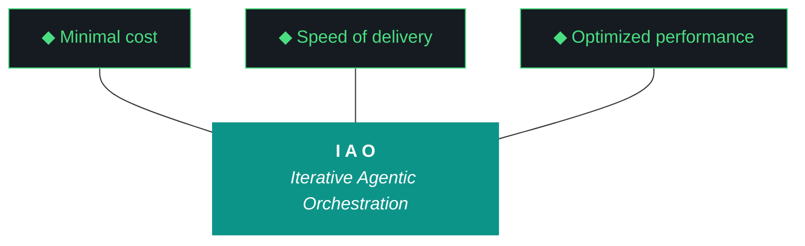

# kjtcom - Plan Document v10.57

**Phase:** 10 - Pipeline Expansion & Platform Hardening
**Iteration:** 10.57
**Date:** April 06, 2026
**Machines:** NZXTcos (W2 Bourdain) + tsP3-cos (W1 Claw3D, W3 harness, W4 post-flight)

---



---

## PRE-FLIGHT

```
[ ] NZXTcos: ollama list (qwen3.5:9b loaded)
[ ] NZXTcos: nvidia-smi (RTX 2080 SUPER available)
[ ] NZXTcos: systemctl status sleep.target (masked)
[ ] NZXTcos: ~/dev/projects/kjtcom on main
[ ] tsP3-cos: ~/Development/Projects/kjtcom on main
[ ] Firebase: firebase projects:list (kjtcom-c78cd)
[ ] Gemini API key: non-empty
[ ] yt-dlp --version
```

---

## STEP 1: W1 — Claw3D 4-Board PCB (2-3 hours, tsP3-cos)

#### 1a. Delete external JSON files from Claw3D dependency

The files `data/claw3d_components.json` and `data/claw3d_iterations.json` can stay in the repo for reference, but `claw3d.html` must NOT reference them.

```
grep -n "fetch" app/web/claw3d.html
# If any fetch calls exist, they must ALL be removed
```

#### 1b. Complete rewrite of `app/web/claw3d.html`

Start fresh. Do not patch v10.56 code. The entire file must be self-contained.

Structure:
```html
<!DOCTYPE html>
<html>
<head>
  <title>kjtcom - PCB Architecture</title>
  <style>
    body { margin:0; background:#0D1117; overflow:hidden; font-family:monospace; }
    #tooltip { position:absolute; display:none; background:#161B22;
      border:1px solid #4ADE80; padding:8px 12px; border-radius:4px;
      font:12px monospace; color:#C9D1D9; pointer-events:none; z-index:100; }
    .status-dot { display:inline-block; width:6px; height:6px; border-radius:50%; margin-right:6px; }
    #controls { position:absolute; top:12px; left:12px; z-index:50; }
    #controls button, #controls select { background:#161B22; color:#C9D1D9;
      border:1px solid #4ADE80; padding:4px 10px; border-radius:4px;
      font:12px monospace; cursor:pointer; margin-right:8px; }
    #backBtn { display:none; }
    #title { position:absolute; bottom:12px; left:12px; color:#4ADE80;
      font:14px monospace; z-index:50; }
  </style>
</head>
<body>
  <div id="tooltip"></div>
  <div id="controls">
    <button id="backBtn" onclick="zoomOut()">All boards</button>
    <select id="iterSelect" onchange="selectIteration(this.value)">
      <!-- populated by JS from inline ITERATIONS -->
    </select>
  </div>
  <div id="title">kjtcom PCB Architecture v10.57</div>
  <script src="https://cdnjs.cloudflare.com/ajax/libs/three.js/r128/three.min.js"></script>
  <script>
    // === INLINE DATA (G56: never fetch external JSON) ===
    const BOARDS = [ /* ... full board data from CLAUDE.md ... */ ];
    const CONNECTORS = [ /* ... */ ];
    const ITERATIONS = [ /* ... */ ];
    
    // === SCENE SETUP ===
    // ... Three.js init, camera, renderer
    
    // === BOARD CREATION ===
    // PlaneGeometry + EdgesGeometry borders
    // Middleware: size [12, 6] — visibly larger
    // FE: size [5, 3] at [-3, 3, 0]
    // PL: size [5, 3] at [3, 3, 0]
    // BE: size [12, 3] at [0, -6.5, 0]
    
    // === CHIP CREATION ===
    // BoxGeometry(w, 0.1, h) per chip
    // LED: SphereGeometry(0.04) at corner
    // userData = chip data for raycaster
    
    // === CONNECTORS ===
    // LineDashedMaterial between boards
    // computeLineDistances() required for dashes
    // Animate dashOffset in render loop
    
    // === RAYCASTER + TOOLTIP ===
    // mousemove → raycaster.intersectObjects(chipMeshes)
    // Show/hide tooltip div with chip.userData
    
    // === CLICK-TO-ZOOM ===
    // Click board plane → set targetPos/targetLookAt
    // Lerp camera in render loop
    // Escape key → zoomOut()
    
    // === RENDER LOOP ===
    function animate() {
      requestAnimationFrame(animate);
      if (isLerping) camera.position.lerp(targetPos, 0.05);
      camera.lookAt(currentLookAt);
      connectorLines.forEach(l => { l.material.dashOffset -= 0.02; });
      renderer.render(scene, camera);
    }
  </script>
</body>
</html>
```

**Key sizing (Three.js units):**
- Frontend: width=5, height=3, position [-3, 3, 0]
- Pipeline: width=5, height=3, position [3, 3, 0]
- Middleware: width=12, height=6, position [0, -1.5, 0] ← LARGE
- Backend: width=12, height=3, position [0, -6.5, 0]
- Camera overview: position [0, 2, 18], lookAt [0, -1, 0]

**All 4 board data from CLAUDE.md W1 must be embedded inline.** Copy the `BOARDS` array verbatim from CLAUDE.md into the script block.

#### 1c. Deploy and verify

```fish
cd app && flutter build web
firebase deploy --only hosting
```

Verify:
```fish
# G56 check
grep -c "fetch.*\.json" app/web/claw3d.html
# Must return 0

# Live site check
curl -sI https://kylejeromethompson.com/claw3d.html | head -1
# Must return 200
```

Manual browser check or Playwright screenshot. All 4 boards visible, MW largest, hover works, zoom works, 0 console errors.

---

## STEP 2: W2 — Bourdain Phase 3 (3-4 hours, NZXTcos)

**Start in parallel with W1.** Unload Ollama models before transcription.

#### 2a. Acquire

```fish
yt-dlp --playlist-items 61-90 \
  -x --audio-format mp3 \
  -o "data/bourdain/audio/%(playlist_index)03d_%(title)s.%(ext)s" \
  "https://www.youtube.com/playlist?list=PLEVfhwFNb44fPn5N3OXk-aEHFvLOPzXKo"
```

#### 2b. Unload Ollama + Transcribe

```fish
# Free GPU memory (G18)
curl -s http://localhost:11434/api/generate -d '{"model":"qwen3.5:9b","keep_alive":0}'

# Batch 1: videos 61-70
tmux new-session -d -s b1
tmux send-keys -t b1 "python3 -u scripts/phase2_transcribe.py --pipeline bourdain --start 61 --end 70 --timeout 600" Enter
# Wait, then batch 2 (71-80), then batch 3 (81-90)
```

#### 2c. Extract through Load

```fish
python3 -u scripts/phase3_extract.py --pipeline bourdain
python3 -u scripts/phase4_normalize.py --pipeline bourdain
python3 -u scripts/phase5_geocode.py --pipeline bourdain
python3 -u scripts/phase6_enrich.py --pipeline bourdain
python3 -u scripts/phase7_load.py --pipeline bourdain --database staging
```

Update `data/bourdain/checkpoint.json` with Phase 3 counts.

---

## STEP 3: W3 — ADR-010 + Harness Update (30 min)

```
1. Open docs/evaluator-harness.md
2. Append ADR-010 (GCP Portability) — full text in CLAUDE.md W3
3. Append Pattern 16 (G56: External JSON fetch on Firebase Hosting)
4. Append evidence standards for Claw3D (grep for fetch+json, screenshot, console errors)
5. Verify: wc -l docs/evaluator-harness.md > 601
```

---

## STEP 4: W4 — Post-Flight Hardening (15 min)

```
1. Open scripts/post_flight.py
2. Add G56 check:
   import re
   content = open("app/web/claw3d.html").read()
   fetches = re.findall(r'fetch\s*\([^)]*\.json', content)
   assert len(fetches) == 0, f"FAIL: G56 - {len(fetches)} external JSON fetches"
   print(f"PASS: claw3d_no_external_json (0 fetches)")
3. Run: python3 scripts/post_flight.py
```

---

## STEP 5: Post-Flight + Living Docs + Report

```
1. python3 scripts/post_flight.py — all checks pass including G56
2. Archive v10.56 artifacts to docs/archive/
3. Update docs/kjtcom-changelog.md
4. Run evaluator with fallback chain:
   python3 -u scripts/run_evaluator.py --iteration v10.57 --verbose
5. CHECK REPORT: grep -c "^| W" docs/kjtcom-report-v10.57.md (must be >= 1)
6. If empty: produce report manually per fallback tier 3
7. Verify agent_scores.json has v10.57 entry
```

---

## LAUNCH CHECKLIST

```
[ ] Pre-flight passes
[ ] W1: claw3d.html loads — 4 boards visible, MW largest
[ ] W1: 0 fetch+json in HTML, 0 console errors
[ ] W1: Hover tooltips + click-to-zoom work
[ ] W2: Bourdain Phase 3 in staging, checkpoint updated
[ ] W3: ADR-010 + G56 pattern in harness (> 601 lines)
[ ] W4: post_flight.py has G56 check
[ ] Post-flight passes all checks
[ ] Report has scored workstreams
[ ] Changelog updated
[ ] 4 artifacts produced
```

---

*Plan v10.57, April 06, 2026. 4 workstreams. G56 root cause fix. 4-board PCB per Kyle's sketch.*
