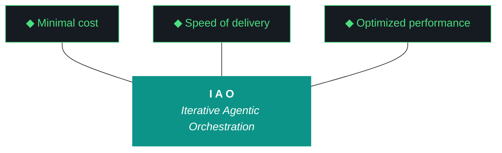

# kjtcom - Plan Document v10.58

**Phase:** 10 - Pipeline Expansion & Platform Hardening
**Iteration:** 10.58
**Date:** April 06, 2026
**Machines:** NZXTcos (W2 Bourdain) + tsP3-cos (W1 Claw3D, W3 evaluator, W4 ADR)

---



---

## PRE-FLIGHT

```
[ ] NZXTcos: ollama list, nvidia-smi, sleep masked, repo on main
[ ] tsP3-cos: repo on main
[ ] Firebase: kjtcom-c78cd accessible
[ ] Gemini API key + Google Places API key: non-empty
[ ] yt-dlp, faster-whisper: installed
```

---

## STEP 1: W2 — Bourdain Phase 3 (3-4 hours, NZXTcos)

**Start first — longest workstream. Runs parallel with W1 on tsP3-cos.**

```fish
# Unload Ollama first (G18)
curl -s http://localhost:11434/api/generate -d '{"model":"qwen3.5:9b","keep_alive":0}'

# Acquire videos 61-90
yt-dlp --playlist-items 61-90 -x --audio-format mp3 \
  -o "data/bourdain/audio/%(playlist_index)03d_%(title)s.%(ext)s" \
  "https://www.youtube.com/playlist?list=PLEVfhwFNb44fPn5N3OXk-aEHFvLOPzXKo"

# Transcribe — graduated tmux (3 batches of 10, sequential)
tmux new-session -d -s b1
tmux send-keys -t b1 "python3 -u scripts/phase2_transcribe.py --pipeline bourdain --start 61 --end 70 --timeout 600" Enter
# Wait for b1, then b2 (71-80), then b3 (81-90)

# Extract → normalize → geocode → enrich → load
python3 -u scripts/phase3_extract.py --pipeline bourdain
python3 -u scripts/phase4_normalize.py --pipeline bourdain
python3 -u scripts/phase5_geocode.py --pipeline bourdain
python3 -u scripts/phase6_enrich.py --pipeline bourdain
python3 -u scripts/phase7_load.py --pipeline bourdain --database staging
```

**DO NOT load to production.** Dedup against 188 existing. Update checkpoint.

---

## STEP 2: W1 — Claw3D Gaps + Connectors + Logger (1 hour, tsP3-cos)

**Patch, don't rewrite.** v10.57 Claw3D works — just needs position adjustments and a new chip.

#### 2a. Adjust board positions for gaps

Find the board position definitions in `app/web/claw3d.html` and update:

```javascript
// OLD (boards touching):
// Frontend:  [-3, 3, 0]     Pipeline: [3, 3, 0]
// Middleware: [0, -1.5, 0]   Backend: [0, -6.5, 0]

// NEW (with gaps for connectors):
// Frontend:  [-3, 5.5, 0]   Pipeline: [3, 5.5, 0]
//   ↕ gap ~2 units
// Middleware: [0, 0, 0]
//   ↕ gap ~2 units
// Backend:   [0, -5.5, 0]
```

#### 2b. Add animated connectors in each gap

For each gap, add a `THREE.Line` with `LineDashedMaterial`:

```javascript
// FE → MW connector
const feToMw = createConnector(
  new THREE.Vector3(-3, 3.8, 0),  // bottom of FE board
  new THREE.Vector3(-3, 2.8, 0),  // top of MW board
  0x0D9488, "Riverpod / Firestore stream"
);

// PL → MW connector
const plToMw = createConnector(
  new THREE.Vector3(3, 3.8, 0),
  new THREE.Vector3(3, 2.8, 0),
  0xDA7E12, "Pipeline scripts / checkpoint"
);

// MW → BE connector
const mwToBe = createConnector(
  new THREE.Vector3(0, -3.2, 0),
  new THREE.Vector3(0, -3.8, 0),
  0x8B5CF6, "Admin SDK / Ollama / ChromaDB"
);

function createConnector(start, end, color, label) {
  const points = [start, end];
  const geo = new THREE.BufferGeometry().setFromPoints(points);
  const mat = new THREE.LineDashedMaterial({
    color: color, dashSize: 0.2, gapSize: 0.1, linewidth: 1
  });
  const line = new THREE.Line(geo, mat);
  line.computeLineDistances();
  scene.add(line);
  connectorLines.push(line); // for dashOffset animation in render loop
  // Add label as HTML overlay at midpoint
  addLabel((start.x+end.x)/2, (start.y+end.y)/2, label, color);
  return line;
}
```

#### 2c. Add iao_logger chip to middleware board

Add to the middleware chips array (inline data):
```javascript
{id:"iao_logger", status:"active", detail:"JSONL event log, P3 diligence"}
```

#### 2d. Adjust camera overview position

With boards spread further apart, the camera needs to be further back:
```javascript
// Overview camera
camera.position.set(0, 1, 22); // was 18, now 22 for wider view
```

#### 2e. Deploy and verify

```fish
grep -c "fetch.*\.json" app/web/claw3d.html  # Must be 0
cd app && flutter build web && firebase deploy --only hosting
```

Manual check: visible gaps, animated traces in gaps, labels readable, logger chip present.

---

## STEP 3: W3 — Fix Evaluator Schema Validation (45 min)

#### 3a. Diagnose

```fish
cat data/eval_schema.json | python3 -m json.tool | head -60
python3 -u scripts/run_evaluator.py --iteration v10.57 --verbose 2>&1 | tee /tmp/eval_debug.log
grep "validation\|error\|fail\|schema" /tmp/eval_debug.log
```

#### 3b. Identify mismatches

Common issues:
- **String length limits:** Summary capped too short (500 chars?) — LLMs write longer
- **Enum values:** Priority enum missing P0 (fixed in v10.56 — verify still present)
- **Required fields:** Schema may require fields the LLM omits (e.g. `gotcha_events`)
- **Type mismatches:** LLM returns string "7" instead of int 7 for scores
- **Markdown fences:** LLM wraps JSON in \`\`\`json blocks

#### 3c. Fix

1. **Relax string limits** — bump max lengths to 2000 chars for summary, 500 for evidence
2. **Make `gotcha_events` optional** — most iterations have none
3. **Add JSON repair** before validation:
```python
def repair_json(raw):
    # Strip markdown fences
    raw = re.sub(r'^```json\s*', '', raw, flags=re.MULTILINE)
    raw = re.sub(r'^```\s*$', '', raw, flags=re.MULTILINE)
    # Fix trailing commas
    raw = re.sub(r',\s*([}\]])', r'\1', raw)
    return raw.strip()
```
4. **Add concrete example to prompt** — show the exact JSON structure expected:
```
Output ONLY valid JSON matching this exact structure (no markdown, no preamble):
{"summary":"2-4 sentence plain text","scorecard":[{"workstream":"W1","name":"exact name from design","priority":"P1","outcome":"complete","score":7,"evidence":"specific file paths and counts"}],"trident":{"cost":"token count","delivery":"N/N workstreams","performance":"specific metric"},"gotcha_events":[],"next_candidates":["item 1","item 2"]}
```
5. **Ensure self-eval writes the markdown report** — not just `agent_scores.json`. The `generate_self_eval()` function must call `write_report_markdown()` as its final step.

#### 3d. Test

```fish
python3 -u scripts/run_evaluator.py --iteration v10.57 --verbose
# Verify: docs/kjtcom-report-v10.58.md exists
grep -c "^| W" docs/kjtcom-report-v10.58.md  # Must be >= 1
```

---

## STEP 4: W4 — ADR-011 Thompson Schema v4 (20 min)

Append to `docs/evaluator-harness.md`:

```markdown
### ADR-011: Thompson Schema v4 — Intranet Extensions
- **Context:** kjtcom schema v3 was designed for YouTube content (locations, food, 
  travel). The intranet deployment will process documents, spreadsheets, meeting 
  transcripts, email, Slack, CRM data, and contractor records. Each source type 
  requires fields the current schema does not have.
- **Decision:** Define candidate t_any_* fields per source type. Fields are added 
  to the schema when the first pipeline consuming that source type goes live. The 
  schema grows monotonically — fields are never removed, only added. Fields not 
  relevant to a source are left empty arrays (not omitted). This mirrors how SIEM 
  platforms (Panther p_any_*, ECS) evolve their schemas.
- **New fields by source type:**
  - Documents: t_any_authors, t_any_titles, t_any_dates, t_any_orgs, t_any_topics
  - Spreadsheets: t_any_columns, t_any_metrics, t_any_units
  - Meetings: t_any_speakers, t_any_action_items, t_any_decisions
  - Email: t_any_senders, t_any_recipients, t_any_subjects, t_any_attachments
  - Slack: t_any_channels, t_any_threads, t_any_reactions
  - CRM: t_any_accounts, t_any_contacts, t_any_deals, t_any_stages, t_any_values
  - Contractors: t_any_certifications, t_any_skills, t_any_projects, t_any_contractors
- **Universal fields (all intranet sources):**
  - t_any_tags — user-applied taxonomy tags
  - t_any_record_ids — external system IDs for cross-referencing
  - t_any_sources — originating system (gmail, slack, crm, etc.)
  - t_any_sensitivity — classification (public, internal, confidential)
- **Rationale:** Defining fields ahead of implementation ensures the extraction 
  prompt for each source type has a clear target schema. The pipeline team (or 
  agent) can reference this ADR when writing new extraction prompts.
- **Consequences:** schema.json must be versioned (v3 = kjtcom YouTube, v4 = 
  intranet baseline). Each new source type's extraction prompt documents which 
  t_any_* fields it populates. The pub/sub topic router (future ADR) will key 
  on t_any_sources for downstream routing to tachtrack.com portals.
```

**Evidence:** `grep "ADR-011" docs/evaluator-harness.md` returns a match. `wc -l` shows growth.

---

## STEP 5: Post-Flight + Living Docs + Report

```
1. python3 scripts/post_flight.py (all checks including G56)
2. Archive v10.57 to docs/archive/
3. Update docs/kjtcom-changelog.md
4. Run evaluator: python3 -u scripts/run_evaluator.py --iteration v10.58 --verbose
5. CHECK: docs/kjtcom-report-v10.58.md exists with scored workstreams
6. If empty: produce report manually per fallback tier 3
7. Verify agent_scores.json has v10.58 entry
```

---

## CHECKLIST

```
[ ] W1: Visible gaps between all board pairs
[ ] W1: Animated connectors with labels in each gap
[ ] W1: iao_logger chip on middleware board
[ ] W1: 0 console errors, hover/zoom work
[ ] W2: Bourdain Phase 3 in staging (videos 61-90)
[ ] W2: checkpoint updated, entity count increased
[ ] W3: Evaluator produces valid report markdown
[ ] W3: grep -c "^| W" report >= 1
[ ] W4: ADR-011 in evaluator-harness.md
[ ] Post-flight passes, changelog updated, 4 artifacts
```

---

*Plan v10.58, April 06, 2026. 4 workstreams. Claw3D polish, Bourdain Phase 3, evaluator fix, schema v4 design.*
