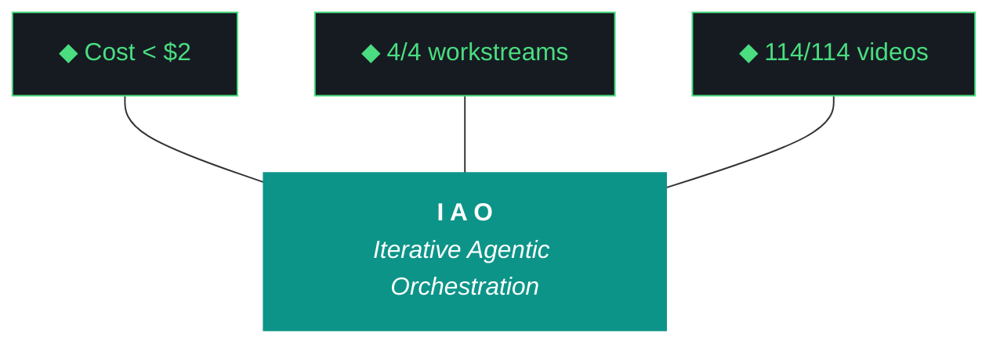

# kjtcom - Plan Document v10.59

**Phase:** 10 - Pipeline Expansion & Platform Hardening
**Iteration:** 10.59
**Date:** April 06, 2026
**Machine:** NZXTcos (GPU required) + tsP3-cos
**Executing Agent:** Gemini CLI

---



---

## 10 IAO PILLARS

1. **Trident** - Cost / Delivery / Performance triangle governs every decision.
2. **Artifact Loop** - design -> plan -> build -> report. 4 artifacts per iteration, no exceptions.
3. **Diligence** - Read before you code. Pre-read is a middleware function.
4. **Pre-Flight Verification** - Validate the environment before execution.
5. **Agentic Harness Orchestration** - The harness is the product; the model is the engine.
6. **Zero-Intervention Target** - Interventions are failures in planning.
7. **Self-Healing Execution** - Max 3 retries per error with diagnostic feedback.
8. **Phase Graduation** - Prove it small (sandbox), then scale (staging), then ship (production).
9. **Post-Flight Functional Testing** - Rigorous validation of all deliverables.
10. **Continuous Improvement** - Retrospectives feed directly into the next plan.

---

## PRE-FLIGHT

```
[ ] Repo on main, clean working tree (git status)
[ ] NZXTcos available with RTX 2080 SUPER
[ ] Ollama running (qwen3.5:9b loaded for later eval)
[ ] yt-dlp installed and functional
[ ] faster-whisper CUDA ready
[ ] Firebase CLI authenticated (G53 check)
[ ] Bourdain checkpoint at phase3 / 90 videos
```

---

## STEP 1: W1 - Bourdain Phase 4 Final Batch (2-3 hours)

#### 1a. Acquire videos 91-114
```bash
yt-dlp --playlist-items 91-114 -x --audio-format mp3 \
  -o "data/bourdain/audio/%(playlist_index)03d_%(title)s.%(ext)s" \
  "https://www.youtube.com/playlist?list=PLEVfhwFNb44fPn5N3OXk-aEHFvLOPzXKo"
```

#### 1b. Unload Ollama (G18 - free GPU for whisper)
```bash
curl -s http://localhost:11434/api/generate -d '{"model":"qwen3.5:9b","keep_alive":0}'
sleep 5 && nvidia-smi  # Verify VRAM freed
```

#### 1c. Transcribe in graduated tmux batches (SEQUENTIAL, not parallel)
- Batch 1: videos 91-100 (10 videos)
- Batch 2: videos 101-110 (10 videos)
- Batch 3: videos 111-114 (4 videos)
- Check CUDA memory between batches. If OOM, reduce batch size.

#### 1d. Handle video 089 (compilation episode)
- If transcript > 20K chars: skip, note in build log
- If transcript < 20K chars: re-run extraction

#### 1e. Extract -> Normalize -> Geocode -> Enrich -> Load
Run phases 3-7 sequentially. Load to staging ONLY.

#### 1f. Update checkpoint to phase4_complete

**Evidence:** Entity count, checkpoint JSON, country count, any failures.

---

## STEP 2: W2 - Claw3D Chip Text Fix (30 min)

#### 2a. Shorten chip IDs in BOARDS array
See GEMINI.md for full mapping table (28 renames).

#### 2b. Widen chip geometry
Change BoxGeometry width from 0.8/1.0 to 1.2/1.5 in getChipLayout.

#### 2c. Update version string to v10.59

#### 2d. G56 check + deploy
```bash
grep -c "fetch.*\.json" app/web/claw3d.html  # Must be 0
cd app && flutter build web && firebase deploy --only hosting
```

#### 2e. Verify at live URL
Labels readable, no overlap, tooltips functional.

---

## STEP 3: W3 - Qwen Context Expansion (45 min)

#### 3a. Implement build_rich_context() in run_evaluator.py
Target 50-80KB context including build logs, design docs, example reports, middleware registry, gotcha archive, ADRs.

#### 3b. Update evaluator prompt to use rich context
Include few-shot examples from v10.56 and v10.58 reports.

#### 3c. Improve fuzzy name matching
Normalize em-dashes, en-dashes, hyphens, colons in workstream name comparison.

#### 3d. Test with previous iteration (v10.58)
```bash
python3 -u scripts/run_evaluator.py --iteration v10.58 --verbose
grep "Rich context" /tmp/eval_test.log  # Target 50-80KB
```

---

## STEP 4: W4 - README Overhaul (45 min)

#### 4a. Rewrite header (Phase 10 v10.59 ACTIVE)
#### 4b. Update pipeline table (4 rows, add Bourdain)
#### 4c. Replace solar system with PCB architecture
#### 4d. Expand middleware section (components, agents, MCPs, ADRs)
#### 4e. Prepend changelogs v10.54-v10.59
#### 4f. Verify > 750 lines

---

## STEP 5: Post-Flight + Report

```bash
# Post-flight
python3 scripts/post_flight.py

# Archive v10.58
mkdir -p docs/archive
cp docs/kjtcom-build-v10.58.md docs/archive/
cp docs/kjtcom-report-v10.58.md docs/archive/

# Run evaluator
python3 -u scripts/run_evaluator.py --iteration v10.59 --verbose

# Verify report
grep -c "^| W" docs/kjtcom-report-v10.59.md  # Must be >= 1
```

---

## COMPLETION CHECKLIST

```
[ ] W1: Bourdain Phase 4 complete (videos 91-114)
[ ] W1: Total entity count documented
[ ] W1: checkpoint.json phase4_complete
[ ] W2: Chip labels readable, no overlap
[ ] W2: Wider chips (1.2/1.5), shorter labels, tooltips show full names
[ ] W2: G56=0, 0 console errors
[ ] W3: build_rich_context() in run_evaluator.py
[ ] W3: Context size 50-80KB in verbose output
[ ] W4: README > 750 lines
[ ] W4: 4 pipelines, PCB architecture, middleware section
[ ] Report has scored workstreams
[ ] Post-flight passes
[ ] Changelog updated
[ ] 4 artifacts: design, plan, build, report
```

---

*Plan v10.59, April 06, 2026. Gemini CLI executor. 4 workstreams. Bourdain final batch + Claw3D text + Qwen context + README overhaul.*
