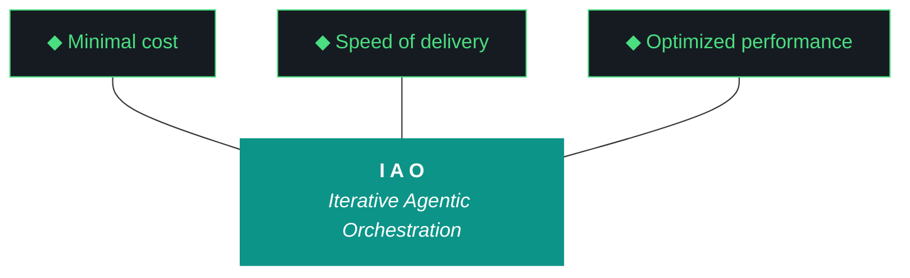

# kjtcom - Plan Document v10.60

**Phase:** 10 - Pipeline Expansion & Platform Hardening
**Iteration:** 10.60
**Date:** April 06, 2026
**Machine:** NZXTcos + tsP3-cos

---



---

## 10 IAO PILLARS

1. **Trident** — Cost / Delivery / Performance triangle governs every decision.
2. **Artifact Loop** — design → plan → build → report. Design and plan are INPUT (immutable). Build and report are OUTPUT (agent-produced).
3. **Diligence** — Read before you code. Pre-read is a middleware function.
4. **Pre-Flight Verification** — Validate the environment before execution.
5. **Agentic Harness Orchestration** — The harness is the product; the model is the engine.
6. **Zero-Intervention Target** — Interventions are failures in planning.
7. **Self-Healing Execution** — Max 3 retries per error with diagnostic feedback.
8. **Phase Graduation** — Prove it small (sandbox), then scale (staging), then ship (production).
9. **Post-Flight Functional Testing** — Rigorous validation of all deliverables.
10. **Continuous Improvement** — Retrospectives feed directly into the next plan.

---

## PRE-FLIGHT

```
[ ] Repo on main, clean working tree
[ ] Ollama available (qwen3.5:9b)
[ ] Original v10.59 design/plan docs available (uploaded files or git history)
```

---

## STEP 1: W1 — Fix generate_artifacts.py (30 min)

#### 1a. Add immutability check

```bash
grep -n "def.*generate\|design\|plan" scripts/generate_artifacts.py | head -20
```

Find where design and plan docs are generated. Add guard:

```python
IMMUTABLE = ["design", "plan"]
for atype in ["design", "plan", "build", "report"]:
    path = f"docs/kjtcom-{atype}-{iteration}.md"
    if atype in IMMUTABLE and os.path.exists(path):
        print(f"[ARTIFACT] SKIP {atype} — immutable (G58)")
        continue
    # ... generate only build and report
```

#### 1b. Fix self-eval build log path

```bash
grep -n "build.*log\|build.*path\|kjtcom-build\|evidence" scripts/run_evaluator.py | head -20
```

Ensure `generate_self_eval()` reads from `docs/kjtcom-build-{iteration}.md`. If the build log hasn't been written yet at eval time, also check `docs/drafts/`. If neither exists, parse the filesystem for evidence (entity counts, file modification times, git diff).

#### 1c. Test

```bash
# Create a dummy design doc, run generate_artifacts, verify it's not overwritten
echo "# test" > /tmp/test-design.md
cp /tmp/test-design.md docs/kjtcom-design-v10.60.md
python3 scripts/generate_artifacts.py --iteration v10.60 --dry-run
# Verify: design doc unchanged, build/report generated
```

---

## STEP 2: W3 — Restore Original v10.59 Docs (15 min)

```bash
# Check git history for the originals
git log --oneline docs/kjtcom-design-v10.59.md | head -5
git log --oneline docs/kjtcom-plan-v10.59.md | head -5

# If the originals were committed before Gemini overwrote:
git show HEAD~1:docs/kjtcom-design-v10.59.md > /tmp/design-original.md
git show HEAD~1:docs/kjtcom-plan-v10.59.md > /tmp/plan-original.md

# Compare to current (Gemini's overwritten versions):
diff /tmp/design-original.md docs/kjtcom-design-v10.59.md
diff /tmp/plan-original.md docs/kjtcom-plan-v10.59.md

# If originals are better (they will be), restore:
cp /tmp/design-original.md docs/kjtcom-design-v10.59.md
cp /tmp/plan-original.md docs/kjtcom-plan-v10.59.md
```

If git doesn't have the originals (Kyle committed after Gemini's overwrite), reconstruct from:
- GEMINI.md (which WAS the planning artifact and wasn't overwritten)
- The uploaded files in this chat session (the original versions)

Verify restored docs contain: Mermaid trident, 10 IAO pillars, detailed execution steps, pre-flight checklist, completion checklist.

---

## STEP 3: W5 — Claw3D Chip Containment (1 hour)

#### 3a. Audit current state

```bash
wc -l app/web/claw3d.html
grep -c "id:" app/web/claw3d.html  # Count chips
```

Open in browser, identify which chips overflow which boards.

#### 3b. Shorten labels to hard max

| Board | Max chars | Chips to fix |
|-------|-----------|-------------|
| Frontend (small) | 8 | query_ed, fb_host — verify all ≤8 |
| Pipeline (small) | 8 | normalize→norm, geocode→geo, checkpoint→chkpt |
| Middleware (large) | 10 | evaluator, pre_flight, post_flight — verify all ≤10 |
| Backend (wide) | 10 | all should fit |

#### 3c. CSS overflow clamp on HTML labels

Find the chip label styling. Add:
```css
.chip-label {
    font: 10px monospace;
    white-space: nowrap;
    overflow: hidden;
    text-overflow: ellipsis;
    max-width: 70px;
    text-align: center;
}
```

#### 3d. Grid layout computation

Verify chip grid fits inside each board:
```javascript
// Per board: usable width = board.size[0] - 2*padding
// cols = floor((usableW + gap) / (chipW + gap))
// rows = ceil(chipCount / cols)  
// Verify: rows * (chipH + gap) <= usable height
```

If middleware has 22 chips and the board is 12 wide: with 1.2-wide chips and 0.3 gaps, that's 8 columns × 3 rows = 24 slots for 22 chips. Verify 3 rows fit vertically.

#### 3e. FE/PL horizontal gap

Push FE to x=-3.8, PL to x=3.8. Verify camera overview captures both.

#### 3f. Deploy and verify

```bash
grep -c "fetch.*\.json" app/web/claw3d.html  # Must be 0
cd app && flutter build web && firebase deploy --only hosting
```

Screenshot at default zoom. Confirm: all labels inside chips, all chips inside boards, board titles inside borders.

---

## STEP 4: W2 — Corrected v10.59 Report (20 min)

Write `docs/kjtcom-report-v10.59-corrected.md` based on the build log evidence:

| W# | Workstream | Score | Evidence |
|----|-----------|-------|----------|
| W1 | Bourdain Phase 4 Final | 8/10 | 114/114 videos, 351 entities, 44 countries, nested array fix, 1 skip (089) |
| W2 | Claw3D Chip Text Fix | 7/10 | Labels shortened, chips widened, deployed, still overflows (fixed in v10.60) |
| W3 | Qwen Context Expansion | 7/10 | build_rich_context() added, fuzzy matching, but all 3 tiers still failed |
| W4 | README Overhaul | 8/10 | 759 lines, 4 pipelines, PCB architecture, 11 ADRs |

Update `agent_scores.json` v10.59 entry with corrected scores.

---

## STEP 5: W4 — Harness Update (15 min)

Append ADR-012 (Artifact Immutability) and Pattern 17 (G58) to `docs/evaluator-harness.md`. Full text in CLAUDE.md W4.

Verify: `wc -l docs/evaluator-harness.md` > 727.

---

## STEP 6: Post-Flight + Report

```bash
python3 scripts/post_flight.py
# Archive v10.59 artifacts (including corrected report)
# Update changelog
# Run evaluator: python3 -u scripts/run_evaluator.py --iteration v10.60 --verbose
# Verify report: grep -c "^| W" docs/kjtcom-report-v10.60.md >= 1
```

---

## CHECKLIST

```
[ ] W1: generate_artifacts.py skips existing design/plan (immutability)
[ ] W1: Self-eval finds build log evidence
[ ] W2: v10.59 corrected report with real scores
[ ] W2: agent_scores.json updated
[ ] W3: Original v10.59 design doc restored (Mermaid trident present)
[ ] W3: Original v10.59 plan doc restored (10 pillars present)
[ ] W4: ADR-012 + Pattern 17 in harness
[ ] W4: Harness > 727 lines
[ ] W5: All chip labels inside chip boxes (screenshot)
[ ] W5: All chips inside board borders
[ ] W5: Board titles inside borders
[ ] W5: FE/PL horizontal gap
[ ] W5: Hover tooltips show full names
[ ] Report for v10.60 scored
[ ] Post-flight passes, changelog, 4 artifacts
```

---

*Plan v10.60, April 06, 2026. 5 workstreams. G58 fix. Claw3D containment. v10.59 report correction.*
