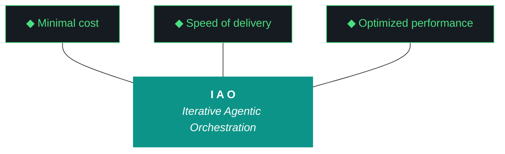

# kjtcom - Plan Document v10.61

**Phase:** 10 - Pipeline Expansion & Platform Hardening
**Iteration:** 10.61
**Date:** April 06, 2026
**Machines:** NZXTcos (W1 Parts Unknown via Gemini CLI) + tsP3-cos (W3 Claw3D)

---



---

## 10 IAO PILLARS

1. **Trident** — Cost / Delivery / Performance.
2. **Artifact Loop** — design → plan (INPUT, immutable) → build → report (OUTPUT, agent-produced).
3. **Diligence** — Read before you code.
4. **Pre-Flight Verification** — Validate environment.
5. **Agentic Harness Orchestration** — The harness is the product.
6. **Zero-Intervention Target** — Interventions = planning failures.
7. **Self-Healing Execution** — 3 retries with feedback.
8. **Phase Graduation** — Sandbox → staging → production.
9. **Post-Flight Functional Testing** — Rigorous validation.
10. **Continuous Improvement** — Retrospectives → next plan.

---

## PRE-FLIGHT

```
[ ] NZXTcos: ollama list, nvidia-smi, sleep masked, repo on main
[ ] tsP3-cos: repo on main
[ ] Firebase: kjtcom-c78cd
[ ] API keys: GEMINI_API_KEY, GOOGLE_PLACES_API_KEY
[ ] yt-dlp --version
[ ] faster-whisper CUDA ready
[ ] Parts Unknown playlist accessible
```

---

## STEP 1: W3 — Claw3D Canvas Texture Rewrite (2 hours, tsP3-cos)

**P0. Four consecutive failures. Fundamental approach change.**

#### 1a. Replace HTML overlay labels with canvas textures

The core change: instead of positioning `<div>` labels via `Vector3.project()` (which has no geometry awareness), render text directly onto each chip's face using `CanvasTexture`.

```javascript
function createChipTexture(label, status, w, h) {
    const canvas = document.createElement('canvas');
    const res = 64; // pixels per Three.js unit
    canvas.width = w * res;
    canvas.height = h * res;
    const ctx = canvas.getContext('2d');
    
    // Background
    ctx.fillStyle = '#1F2937';
    ctx.fillRect(0, 0, canvas.width, canvas.height);
    
    // Border (color by status)
    ctx.strokeStyle = status==='active' ? '#4ADE80' : 
                      status==='degraded' ? '#EF9F27' : '#555';
    ctx.lineWidth = 2;
    ctx.strokeRect(1, 1, canvas.width-2, canvas.height-2);
    
    // Label — MEASURE and AUTO-SHRINK to fit
    ctx.fillStyle = '#C9D1D9';
    ctx.textAlign = 'center';
    ctx.textBaseline = 'middle';
    let fs = 16;
    ctx.font = fs + 'px monospace';
    while (ctx.measureText(label).width > canvas.width - 12 && fs > 7) {
        fs--;
        ctx.font = fs + 'px monospace';
    }
    ctx.fillText(label, canvas.width/2, canvas.height/2);
    
    // LED dot (top-right)
    ctx.beginPath();
    ctx.arc(canvas.width-10, 10, 5, 0, Math.PI*2);
    ctx.fillStyle = status==='active' ? '#4ADE80' : 
                    status==='degraded' ? '#EF9F27' : '#555';
    ctx.fill();
    
    const tex = new THREE.CanvasTexture(canvas);
    tex.needsUpdate = true;
    return tex;
}

// Use in chip creation:
function createChip(chipData, x, z, boardY, chipW, chipH) {
    const tex = createChipTexture(chipData.id, chipData.status, chipW, chipH);
    const mat = new THREE.MeshBasicMaterial({ map: tex });
    const geo = new THREE.BoxGeometry(chipW, 0.08, chipH);
    const mesh = new THREE.Mesh(geo, mat);
    mesh.position.set(x, boardY + 0.05, z);
    mesh.userData = chipData;  // for raycaster tooltip
    return mesh;
}
```

**Why this works:** `ctx.measureText(label).width` measures the actual pixel width of the text. The `while` loop shrinks the font until it fits within `canvas.width - 12` (12px padding). The text is rendered directly onto the chip surface. It CANNOT overflow because the canvas IS the chip face.

#### 1b. Remove ALL HTML overlay label divs

Delete the `.chip-label` / `.label-overlay` CSS and the label positioning JS that runs in the render loop. Keep ONLY the tooltip overlay (temporary popup on hover).

#### 1c. Component review pass

Verify all components are on the correct board. Add OpenClaw to middleware:
```javascript
{id:"openclaw", status:"active", detail:"Local sandbox agent, open-interpreter"}
```

Full middleware chip list (23 chips):
evaluator, harness, ADR, artifact, gotchas, scores, pre_flight, post_flight, router, tg_bot, rag, qwen, nemotron, gflash, fb_mcp, c7_mcp, pw_mcp, fc_mcp, dart_mcp, claude, gemini, logger, **openclaw**

#### 1d. Grid layout verification

After placing all chips, verify bounds:
```javascript
chips.forEach(c => {
    const b = c.mesh.position;
    const hw = chipW/2, hh = chipH/2;
    if (b.x - hw < boardLeft || b.x + hw > boardRight ||
        b.z - hh < boardTop  || b.z + hh > boardBottom) {
        console.error('OVERFLOW:', c.id, 'on', board.id);
    }
});
```

#### 1e. Deploy and verify

```bash
grep -c "fetch.*\.json" app/web/claw3d.html  # Must be 0
grep -c "label-overlay\|chip-label" app/web/claw3d.html  # Must be 0 (removed)
cd app && flutter build web && firebase deploy --only hosting
```

Screenshot. Every label inside every chip. Every chip inside every board.

---

## STEP 2: W1 — Parts Unknown Phase 1 (3-4 hours, Gemini CLI on NZXTcos)

**Gemini CLI runs this. Parallel with W3.**

#### 2a. Count playlist videos
```bash
yt-dlp --flat-playlist --print "%(playlist_index)s %(title)s" \
  "https://www.youtube.com/watch?v=6PQB1S5sZQ0&list=PLfLND2Lym9knKTVU7lHYROAGWmTH2kEFo" | wc -l
```

#### 2b. Acquire first 30 (or all if fewer)
```bash
yt-dlp --playlist-items 1-30 -x --audio-format mp3 \
  -o "pipeline/data/bourdain/audio/pu_%(playlist_index)03d_%(title)s.%(ext)s" \
  "https://www.youtube.com/watch?v=6PQB1S5sZQ0&list=PLfLND2Lym9knKTVU7lHYROAGWmTH2kEFo"
```

#### 2c. Unload Ollama + transcribe
```bash
curl -s http://localhost:11434/api/generate -d '{"model":"qwen3.5:9b","keep_alive":0}'
# Graduated tmux: pu_01-10, pu_11-20, pu_21-30 (sequential)
```

#### 2d. Update extraction prompt

Edit `pipeline/config/bourdain/extraction_prompt.md` to handle both shows:
- If audio filename starts with `pu_`: set `t_any_shows: ["Parts Unknown"]`
- Otherwise: keep `t_any_shows: ["No Reservations"]`
- Alternatively: add a `--show` flag to the extraction script

#### 2e. Extract → normalize → geocode → enrich → load staging

Dedup against existing 351 entities. Entities appearing in both shows get merged `t_any_shows` arrays.

#### 2f. Checkpoint
Create or update `pipeline/data/bourdain/parts_unknown_checkpoint.json` (separate from No Reservations checkpoint).

---

## STEP 3: W2 — GCP Portability Plan (45 min)

After W1 so pipeline analysis includes Parts Unknown results.

Write `docs/gcp-portability-plan.md` per CLAUDE.md W2 specification:
1. Registry artifacts scrub/transfer table
2. GCP resource build order (5 phases: VPC → Compute → Storage → Middleware → Pipelines)
3. Harness readiness checklist (10 items)
4. Pipeline config analysis (v1 vs v2, Bourdain as intranet template)

---

## STEP 4: W4 — Harness Updates (20 min)

Append to `docs/evaluator-harness.md`:
- ADR-013: Pipeline Configuration Portability
- Pattern 18: G59 chip text overflow (HTML overlays vs canvas textures)
- Component review checklist section

Verify: `wc -l docs/evaluator-harness.md` > 761.

---

## STEP 5: Post-Flight + Report

```bash
python3 scripts/post_flight.py
# Archive v10.60
# Update changelog
# Run evaluator with rich context
python3 -u scripts/run_evaluator.py --iteration v10.61 --verbose
# Verify report scored: grep -c "^| W" docs/kjtcom-report-v10.61.md >= 1
```

---

## GEMINI.md UPDATE

Paste into GEMINI.md before launching:
```
## v10.61 W1: Parts Unknown Phase 1 Discovery

Bourdain pipeline, second show. t_any_shows: ["Parts Unknown"].
Playlist: https://www.youtube.com/watch?v=6PQB1S5sZQ0&list=PLfLND2Lym9knKTVU7lHYROAGWmTH2kEFo

1. Count playlist size: yt-dlp --flat-playlist
2. Acquire first 30: yt-dlp --playlist-items 1-30 (prefix pu_ on filenames)
3. Unload Ollama, graduated tmux transcription (3 batches of 10)
4. Update extraction prompt for Parts Unknown show flag
5. Extract → normalize → geocode → enrich → load staging
6. Dedup against 351 existing Bourdain entities (merge t_any_shows arrays)
7. Update parts_unknown_checkpoint.json
DO NOT load to production. Staging only.
```

---

## CHECKLIST

```
[ ] W1: Parts Unknown Phase 1 entities in staging
[ ] W1: t_any_shows: ["Parts Unknown"] verified
[ ] W1: Dedup tested (multi-show merge)
[ ] W2: docs/gcp-portability-plan.md (4 sections)
[ ] W2: Pipeline analysis v1 vs v2
[ ] W3: Canvas texture labels — all text inside chips
[ ] W3: All chips inside board boundaries
[ ] W3: OpenClaw on middleware board
[ ] W3: HTML overlay labels REMOVED (tooltip only)
[ ] W3: Component review: 23 MW chips verified
[ ] W3: 0 console errors, G56=0
[ ] W4: ADR-013, Pattern 18, component review section
[ ] W4: Harness > 761 lines
[ ] Report scored, post-flight passes, changelog, 4 artifacts
```

---

*Plan v10.61, April 06, 2026. 4 workstreams. Parts Unknown + GCP portability + canvas texture Claw3D + OpenClaw.*
