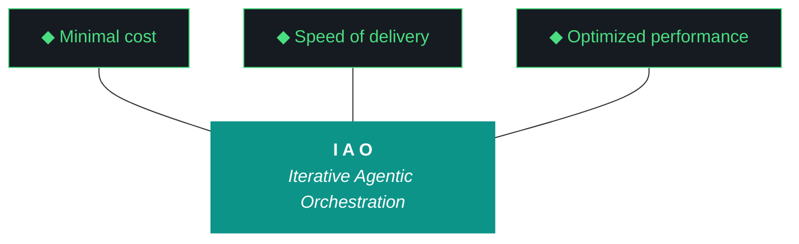

# kjtcom - Plan Document v10.62

**Phase:** 10 - Pipeline Expansion & Platform Hardening
**Iteration:** 10.62
**Date:** April 06, 2026
**Executor:** Gemini CLI (`gemini --yolo`)
**Machines:** NZXTcos (W5 Parts Unknown GPU work) + tsP3-cos (W1 map, W2 Claw3D)

---



---

## 10 IAO PILLARS

1. **Trident** — Cost / Delivery / Performance.
2. **Artifact Loop** — design → plan (INPUT, immutable) → build → report (OUTPUT, agent-produced).
3. **Diligence** — Read before you code.
4. **Pre-Flight Verification** — Validate environment.
5. **Agentic Harness Orchestration** — The harness is the product.
6. **Zero-Intervention Target** — Interventions = planning failures.
7. **Self-Healing Execution** — 3 retries with feedback.
8. **Phase Graduation** — Sandbox → staging → production.
9. **Post-Flight Functional Testing** — Rigorous validation.
10. **Continuous Improvement** — Retrospectives → next plan.

---

## PRE-FLIGHT

```
[ ] NZXTcos: ollama list (qwen3.5:9b available)
[ ] NZXTcos: nvidia-smi (RTX 2080 SUPER, VRAM free)
[ ] NZXTcos: systemctl status sleep.target (masked)
[ ] NZXTcos: ~/dev/projects/kjtcom on main, clean working tree
[ ] tsP3-cos: ~/Development/Projects/kjtcom on main
[ ] Firebase: kjtcom-c78cd accessible
[ ] echo $GEMINI_API_KEY (non-empty)
[ ] echo $GOOGLE_PLACES_API_KEY (non-empty)
[ ] yt-dlp --version
[ ] python3 -c "from faster_whisper import WhisperModel; print('OK')"
[ ] Original v10.62 design + plan docs on disk (do NOT overwrite — G58)
```

---

## EXECUTION SEQUENCE

| Step | Workstream | Machine | Duration | Notes |
|------|-----------|---------|----------|-------|
| 1 | W5: Parts Unknown Phase 1 | NZXTcos GPU | 3-4h | Start FIRST. Longest. Unload Ollama. Graduated tmux. |
| 2 | W1: Map tab fix | tsP3-cos | 45m | Parallel with W5 transcription |
| 3 | W2: Claw3D font fix | tsP3-cos | 20m | Parallel — quick patch |
| 4 | W3: Build/report enforcement | tsP3-cos | 45m | Includes retroactive v10.61 artifacts |
| 5 | W4: Component review + harness | NZXTcos | 20m | After W5 (need Ollama back) |
| 6 | Build log + report + post-flight | NZXTcos | 15m | HARD verification of files on disk |

**Total estimated:** 5-6 hours.

---

## STEP 1: W5 — Parts Unknown Phase 1 (3-4 hours, NZXTcos)

**Start first. Longest workstream. Runs in tmux while W1/W2/W3 happen on tsP3-cos.**

### 1a. Count playlist + acquire

```bash
yt-dlp --flat-playlist --print "%(playlist_index)s %(title)s" \
  "https://www.youtube.com/watch?v=6PQB1S5sZQ0&list=PLfLND2Lym9knKTVU7lHYROAGWmTH2kEFo" | wc -l

yt-dlp --playlist-items 1-30 -x --audio-format mp3 \
  -o "pipeline/data/bourdain/audio/pu_%(playlist_index)03d_%(title)s.%(ext)s" \
  "https://www.youtube.com/watch?v=6PQB1S5sZQ0&list=PLfLND2Lym9knKTVU7lHYROAGWmTH2kEFo"
```

### 1b. Unload Ollama (G18)

```bash
curl -s http://localhost:11434/api/generate -d '{"model":"qwen3.5:9b","keep_alive":0}'
sleep 5
nvidia-smi  # Verify VRAM freed
```

### 1c. Transcribe — graduated tmux SEQUENTIAL

```bash
# Batch 1 (videos 1-10)
python3 -u scripts/phase2_transcribe.py --pipeline bourdain --pattern "pu_00*" --timeout 600
# Wait for completion, then batch 2 (11-20)
python3 -u scripts/phase2_transcribe.py --pipeline bourdain --pattern "pu_01*" --timeout 600
# Wait, then batch 3 (21-30)
python3 -u scripts/phase2_transcribe.py --pipeline bourdain --pattern "pu_02*" --timeout 600
```

**DO NOT run batches in parallel.** CUDA OOM kills the run.

### 1d. Update extraction prompt for show flag

Edit `pipeline/config/bourdain/extraction_prompt.md` so files matching `pu_*` get:
```json
"t_any_shows": ["Parts Unknown"]
```
Existing No Reservations files keep `["No Reservations"]`.

### 1e. Extract → normalize → geocode → enrich → load

```bash
python3 -u scripts/phase3_extract.py --pipeline bourdain --filter "pu_*"
python3 -u scripts/phase4_normalize.py --pipeline bourdain
python3 -u scripts/phase5_geocode.py --pipeline bourdain
python3 -u scripts/phase6_enrich.py --pipeline bourdain
python3 -u scripts/phase7_load.py --pipeline bourdain --database staging
```

**STAGING ONLY. Dedup against 351 existing.** Locations in both shows get merged `t_any_shows` arrays.

### 1f. Update checkpoint

```bash
python3 -c "
import json, os
path = 'pipeline/data/bourdain/parts_unknown_checkpoint.json'
cp = json.load(open(path)) if os.path.exists(path) else {}
cp['phase'] = 1
cp['videos_acquired'] = 30
cp['show'] = 'Parts Unknown'
json.dump(cp, open(path, 'w'), indent=2)
"
```

---

## STEP 2: W1 — Fix Map Tab (45 min, tsP3-cos parallel with W5)

### 2a. Read map widget

```bash
wc -l app/lib/widgets/map_tab.dart
cat app/lib/widgets/map_tab.dart
```

### 2b. Trace data path

```bash
grep -n "provider\|ref.watch" app/lib/widgets/map_tab.dart
grep -rn "t_any_coordinates\|coordinates" app/lib/providers/
```

### 2c. Sample real entity

```bash
python3 -c "
import firebase_admin
from firebase_admin import credentials, firestore
firebase_admin.initialize_app()
db = firestore.client()
docs = db.collection('locations').limit(3).get()
for doc in docs:
    data = doc.to_dict()
    coords = data.get('t_any_coordinates', 'MISSING')
    print(f'{doc.id[:20]}: {str(coords)[:120]}')
"
```

### 2d. Check flutter_map version

```bash
grep "flutter_map" app/pubspec.yaml
git log --oneline -- app/pubspec.yaml | head -10
```

### 2e. Apply fix (most likely)

flutter_map 8.x: rename `builder:` → `child:` on every `Marker` constructor.

```dart
// OLD: Marker(point: LatLng(lat, lon), builder: (ctx) => widget)
// NEW: Marker(point: LatLng(lat, lon), child: widget)
```

### 2f. Build + deploy

```bash
fish -c "cd app && flutter analyze"
fish -c "cd app && flutter build web"
fish -c "firebase deploy --only hosting"
```

### 2g. Verify

Open kylejeromethompson.com → Map. Markers should render. Header shows count > 0.

---

## STEP 3: W2 — Claw3D Font Fix (20 min, tsP3-cos)

### 3a. Locate function

```bash
grep -n "createChipTexture\|measureText\|fs > 6" app/web/claw3d.html
```

### 3b. Apply patch

Replace `createChipTexture()` per GEMINI.md W2. Key changes:
- `const res = 64;` → `const res = 96;`
- `while (... && fs > 6)` → `while (... && fs > 11)`
- Add label truncation block after the shrink loop

### 3c. Update version

Title and iterations dropdown: v10.61 → v10.62.

### 3d. Verify and deploy with W1

```bash
grep "fs > 11" app/web/claw3d.html
grep "res = 96" app/web/claw3d.html
grep -c "fetch.*\.json" app/web/claw3d.html  # 0
fish -c "cd app && flutter build web && firebase deploy --only hosting"
```

---

## STEP 4: W3 — Build/Report Enforcement (45 min)

### 4a. Diagnose

```bash
grep -A2 "IMMUTABLE_ARTIFACTS" scripts/generate_artifacts.py
command ls docs/kjtcom-*-v10.61.md 2>/dev/null
```

### 4b. Fix immutability list

Must be exactly `IMMUTABLE_ARTIFACTS = ["design", "plan"]`. Remove `"build"` or `"report"` if present.

### 4c. Add post-flight artifact check

Append to `scripts/post_flight.py`:

```python
import os, sys

def check_artifacts(iteration):
    failures = []
    for atype in ["build", "report"]:
        path = f"docs/kjtcom-{atype}-{iteration}.md"
        if not os.path.exists(path):
            failures.append(f"FAIL: {path} missing")
            continue
        size = os.path.getsize(path)
        if size < 100:
            failures.append(f"FAIL: {path} too small ({size} bytes)")
            continue
        print(f"PASS: {atype} ({size} bytes)")
    return failures

artifact_failures = check_artifacts(iteration)
if artifact_failures:
    for f in artifact_failures: print(f)
    sys.exit(1)
```

### 4d. Produce retroactive v10.61 build + report

Write `docs/kjtcom-build-v10.61.md` and `docs/kjtcom-report-v10.61.md` based on v10.61 execution evidence. Score:
- W1 Parts Unknown: 0/10 deferred
- W2 GCP plan: 8/10
- W3 Canvas textures: 7/10 (G59 partial)
- W4 Harness: 8/10 (874 lines)

Update `agent_scores.json`.

### 4e. Verify

```bash
test -f docs/kjtcom-build-v10.61.md && echo "EXISTS" || echo "MISSING"
test -f docs/kjtcom-report-v10.61.md && echo "EXISTS" || echo "MISSING"
```

---

## STEP 5: W4 — Component Review + Harness (20 min)

### 5a. Audit components

```bash
command ls scripts/*.py
git log --since="2 days ago" --name-only -- scripts/ | grep -E "scripts/.+\.py$" | sort -u
```

Add any new components to Claw3D middleware chip list.

### 5b. Append Pattern 19 to harness

```markdown
### Pattern 19: Iteration completes without build/report artifacts (G61)

- **Failure:** Agent runs all workstreams, passes post-flight, but generate_artifacts.py never called or silently skips build/report
- **Impact:** No audit trail. Scores lost. Cannot evaluate retroactively without filesystem archaeology.
- **Detection:** Post-flight file existence + minimum size check
- **Prevention:** Post-flight FAILS if either kjtcom-build-v{X.XX}.md or kjtcom-report-v{X.XX}.md missing or under 100 bytes
- **Resolution:** Reconstruct from execution log + filesystem evidence
```

### 5c. Verify

```bash
wc -l docs/evaluator-harness.md  # > 874
grep "Pattern 19" docs/evaluator-harness.md
```

---

## STEP 6: Build Log + Report + Post-Flight + Hard Verification

### 6a. Produce v10.62 build log

`docs/kjtcom-build-v10.62.md` documenting all 5 workstreams with file paths, counts, and evidence.

### 6b. Run post-flight

```bash
python3 scripts/post_flight.py 10.62
# MUST show PASS for build and report artifact existence
```

### 6c. Run evaluator (try Qwen first, fall through chain)

```bash
python3 -u scripts/run_evaluator.py --iteration v10.62 --verbose
```

If all 3 tiers fail, write the report manually. **Iteration cannot end without report on disk.**

### 6d. HARD VERIFICATION

```bash
test -f docs/kjtcom-build-v10.62.md && echo "BUILD EXISTS" || (echo "BUILD MISSING" && exit 1)
test -f docs/kjtcom-report-v10.62.md && echo "REPORT EXISTS" || (echo "REPORT MISSING" && exit 1)
wc -l docs/kjtcom-build-v10.62.md docs/kjtcom-report-v10.62.md
```

### 6e. Archive + changelog

```bash
mkdir -p docs/archive
for f in design plan build report; do
    cp docs/kjtcom-$f-v10.61.md docs/archive/ 2>/dev/null
done
# Append v10.62 entry to docs/kjtcom-changelog.md
```

---

## CHECKLIST

```
[ ] W5: Parts Unknown 30 videos in staging
[ ] W5: t_any_shows: ["Parts Unknown"] verified
[ ] W5: Dedup tested (multi-show merge)
[ ] W5: parts_unknown_checkpoint.json updated
[ ] W1: Map tab shows markers (count > 0)
[ ] W1: Coordinate field contract documented
[ ] W2: Claw3D labels readable (min 11px)
[ ] W2: Long labels truncated with '..'
[ ] W2: Canvas resolution 96px/unit
[ ] W2: G56=0
[ ] W3: IMMUTABLE_ARTIFACTS = ["design", "plan"] only
[ ] W3: Post-flight checks build+report file existence
[ ] W3: docs/kjtcom-build-v10.61.md exists (retroactive)
[ ] W3: docs/kjtcom-report-v10.61.md exists (retroactive)
[ ] W3: agent_scores.json has v10.61 entry
[ ] W4: Component review pass complete
[ ] W4: Pattern 19 in harness
[ ] W4: Harness > 874 lines
[ ] docs/kjtcom-build-v10.62.md EXISTS ON DISK (size > 100)
[ ] docs/kjtcom-report-v10.62.md EXISTS ON DISK (size > 100)
[ ] Post-flight passes ALL checks including artifact existence
[ ] v10.61 archived to docs/archive/
[ ] Changelog updated with v10.62
[ ] No git operations performed (Rule 1)
```

---

*Plan v10.62, April 06, 2026. Gemini CLI executor. 5 workstreams. Parts Unknown + Map fix + Claw3D font + Build/report enforcement + Component review.*
