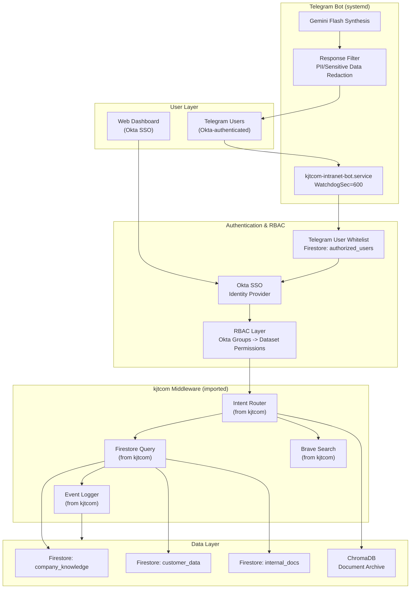

# Intranet Update - kjtcom v9.42

**Date:** April 5, 2026
**From:** kjtcom middleware team
**To:** Intranet project integration

---

## Middleware Components Ready for Adoption

The following kjtcom middleware components are validated and ready to stamp onto the intranet project:

### 1. Intent Router (scripts/intent_router.py)
- **What:** Gemini Flash-powered query classification with 3 routes: firestore, chromadb, web
- **Version:** v9.42 (added web route)
- **Dependencies:** litellm, schema_reference.json
- **Intranet adaptation:** Replace schema_reference.json with intranet schema. Add RBAC layer between router and data access.

### 2. Firestore Query Module (scripts/firestore_query.py)
- **What:** Firebase Admin SDK query executor with G34 (single array-contains) workaround
- **Version:** v9.41
- **Intranet adaptation:** Point to intranet Firestore project. Add dataset-level permission filtering.

### 3. Artifact Generator (scripts/generate_artifacts.py)
- **What:** Qwen-powered draft generation with --promote, --validate-only, execution cross-check
- **Version:** v9.42
- **Intranet adaptation:** Use as-is. Update template paths.

### 4. Gotcha Archive (data/gotcha_archive.json)
- **What:** 15 resolved gotchas with root cause categories and prevention patterns
- **Version:** v9.42
- **Intranet adaptation:** Start fresh gotcha archive for intranet. Copy the schema structure.

### 5. Middleware Registry (data/middleware_registry.json)
- **What:** Component catalog with version tracking and dependency mapping
- **Version:** v9.42
- **Intranet adaptation:** Fork as intranet-middleware-registry.json. Track which kjtcom components are imported.

### 6. Event Logger (scripts/utils/iao_logger.py)
- **What:** Structured JSONL event logging for all agent/API/LLM calls
- **Version:** v9.39
- **Intranet adaptation:** Use as-is. Critical for audit compliance.

---

## Telegram Bot systemd Pattern

kjtcom v9.42 moved the Telegram bot from tmux to systemd with:
- **Type=notify** with sd_notify("READY=1") on startup
- **WatchdogSec=600** with periodic WATCHDOG=1 pings every 5 minutes
- **Restart=always, RestartSec=30** for automatic recovery
- **EnvironmentFile** for API keys (outside repo)

This pattern is directly portable to the intranet bot. Service file: `kjtcom-telegram-bot.service`

---

## RBAC Approach for Intranet

kjtcom is a public project - no RBAC needed. The intranet bot WILL need:

### Recommended Architecture

```
Telegram User -> Bot -> Auth Layer -> Intent Router -> Data Access
                          |
                    Okta SSO Lookup
                    (Telegram ID -> Okta user -> groups)
```

### Implementation Layers

1. **Telegram User Whitelist:** Map Telegram user IDs to Okta identities. Store in Firestore `authorized_users` collection.

2. **Okta Group -> Dataset Permissions:**
   - `intranet-admin` -> all datasets
   - `intranet-engineering` -> company_knowledge, internal_docs
   - `intranet-sales` -> customer_data, company_knowledge
   - `intranet-readonly` -> company_knowledge only

3. **Dataset-Level Filtering:** Intent router output includes dataset target. Auth layer checks user's Okta groups against required dataset before executing query.

4. **Outbound Response Filtering:** Before sending response to Telegram, scan for sensitive patterns (SSN, API keys, internal IPs). Redact matches.

5. **Audit Logging:** Every query logged via iao_logger.py with user identity, dataset accessed, and response summary. Required for compliance.

---

## OpenClaw Deployment Lessons

OpenClaw (open-interpreter 0.4.3 + Gemini Flash) deployed in v9.39:
- **Python 3.14 compatibility:** Required patching 7 files for pkg_resources removal (G54)
- **Engine:** Gemini Flash via litellm is the recommended engine (not OpenAI)
- **tiktoken workaround:** Pre-install tiktoken 0.12.0 before open-interpreter to avoid version conflict
- **Intranet note:** OpenClaw is useful for synthesis but should NOT have direct data access in intranet. Route through the auth/RBAC layer.

---

## Updated Intranet Architecture



---

## Middleware Registry as Stamping Manifest

The `data/middleware_registry.json` file catalogs every middleware component with version and dependency info. When stamping onto intranet:

1. Read middleware_registry.json
2. For each component with `"type": "routing"` or `"type": "data_access"`, copy to intranet project
3. Update dependencies for intranet environment
4. Create intranet-specific middleware_registry.json tracking imported components

---

*Cross-project update v9.42, April 5, 2026.*
