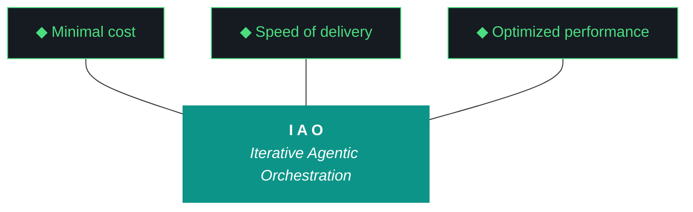
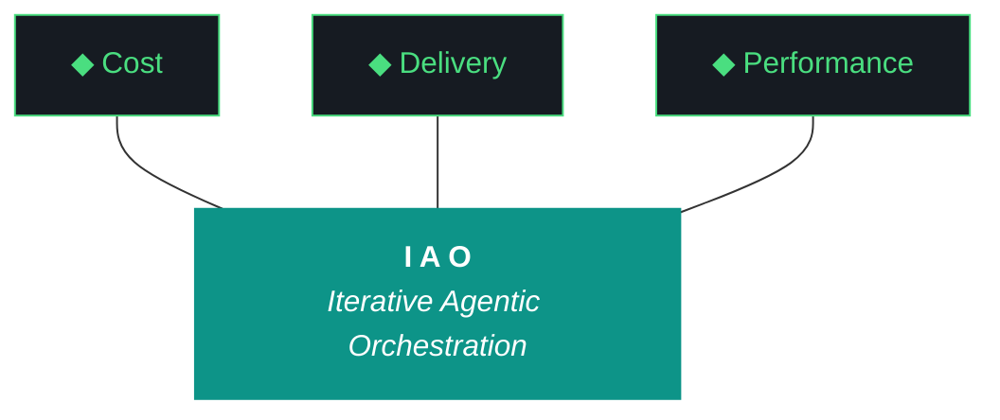

# kjtcom - Bundle 10.68.1

**Generated:** 2026-04-08T20:05:06.348013Z
**Iteration:** 10.68.1
**Project code:** kjtco
**Project root:** /home/kthompson/dev/projects/kjtcom

---

## §1. Design

### DESIGN (kjtcom-design-10.68.0.md)
```markdown
# kjtcom — Design 10.68.0

**Iteration:** 10.68.0 (phase.iteration.run — `.0` = planning draft)
**Phase:** 10 (Harness Externalization + Retrospective)
**Phase focus:** Harvest the kjtcom POC into iao. kjtcom enters archive mode after this iteration.
**Date:** April 08, 2026
**Repo:** SOC-Foundry/kjtcom
**Machine:** NZXTcos (`~/dev/projects/kjtcom`)
**Wall clock target:** ~4-5 hours, no hard cap
**Run mode:** Sequential, bounded, no tmux
**Significance:** **Last kjtcom-authored iteration that matters.** After 10.68.X graduates, kjtcom enters archive mode with minimal maintenance. iao becomes the active artifact moving forward.

---

## 1. The Three-Number Iteration System (NEW 10.68.0)

Starting this iteration, all kjtcom (and future project) artifacts use the format `<phase>.<iteration>.<run>`:

- **Phase** — project phase (10 for kjtcom "Harness Externalization + Retrospective")
- **Iteration** — planned iteration within phase, each with explicit MUST-have deliverables
- **Run** — individual execution attempt. `.0` is the planning draft. `.1`, `.2`, `.3` are subsequent runs, revisions, or parallel executions on different machines.

**Graduation rule:** an iteration graduates to the next iteration number only when **all MUST-have deliverables are met** as verified by the closing Qwen evaluator. Until then, additional runs stay at the same iteration number with incremented run suffix.

**Examples:**
- `10.68.0` — this planning artifact, not yet executed
- `10.68.1` — first execution of the 10.68 plan on NZXT
- `10.68.2` — second run if first didn't meet deliverables (or run on a different machine)
- `10.69.0` — next iteration's planning draft, produced only after 10.68.X graduates

**iao's own counter is separate.** iao uses `<phase>.<iteration>.<run>` too, where Phase 0 is always "project/component setup and build-out." iao's first iteration is `0.0.0` — phase 0, iteration 0, planning draft. Phase 1 begins after bring-up completes.

**Filenames drop the `v` prefix.** All artifacts from 10.68.0 forward use bare version numbers: `kjtcom-design-10.68.0.md`, `kjtcom-plan-10.68.0.md`, etc.

---

## 2. Why 10.68 Exists

kjtcom was a proof-of-concept for the IAO methodology. The POC succeeded: it produced a working harness (iao_middleware, now renaming to iao), a repeatable 10-phase pipeline pattern, an evaluator loop, a script registry, and a gotcha/ADR/pattern archaeology spanning 60+ iterations.

kjtcom the project is ending. **iao the living template is the real product going forward.** 10.68 exists to harvest every reusable piece of kjtcom into iao before kjtcom enters archive mode. Everything that has generalization potential moves up. Only genuinely pipeline-specific kjtcom artifacts (Huell Howser transcripts, CalGold/RickSteves/TripleDB/Bourdain specifics, claw3d rendering) stay behind.

This iteration also:
1. Renames `iao-middleware/` → `iao/` and `iao_middleware` package → `iao` package, eliminating the dash/underscore inconsistency from 10.67
2. Implements the 5-character project code taxonomy (`iaomw` = iao itself, `kjtco` = kjtcom, `intra` = future TachTech intranet middleware)
3. Splits the single `evaluator-harness.md` into `iao/docs/harness/base.md` and `kjtco/docs/harness/project.md` with enforced extension-only semantics
4. Produces `iao-v0.1.0-alpha.zip` as the physical deliverable for P3 bring-up (Phase 0 iteration 0 on P3 starts from this zip)
5. Fixes the inherited G102 iao_logger stale iteration bug as W0 so telemetry is clean from the start
6. Renames the 5th artifact from "context bundle" to just "bundle" (`kjtcom-bundle-10.68.1.md`) and expands it to the 10-item minimum specification
7. Scaffolds `iao push` as a skeleton workflow for the future continuous-improvement feedback loop

---

## 3. The Trident (Locked)



---

## 4. The Ten Pillars of IAO (Verbatim)

1. **Trident** — Cost / Delivery / Performance triangle
2. **Artifact Loop** — design → plan → build → report → bundle
3. **Diligence** — First action: `python3 scripts/query_registry.py "<topic>"`
4. **Pre-Flight Verification**
5. **Agentic Harness Orchestration**
6. **Zero-Intervention Target**
7. **Self-Healing Execution** (max 3 retries)
8. **Phase Graduation** — now formalized via MUST-have deliverables + Qwen graduation analysis
9. **Post-Flight Functional Testing** — Build is a gatekeeper
10. **Continuous Improvement** — formalized via `iao push` loop starting this iteration

---

## 5. Project State Going Into 10.68.0

### Pipelines (frozen, archiving)

| Pipeline | Entities | Status |
|---|---|---|
| calgold | 899 | Production — frozen |
| ricksteves | 4,182 | Production — frozen |
| tripledb | 1,100 | Production — frozen |
| bourdain | 604 | Production — frozen |

**Production total:** 6,785. **Zero pipeline changes in 10.68.** No Bourdain processing, no re-enrichment, no migrations.

### Frontend

- Flutter live: v10.65 (stale, deploy paused)
- claw3d.html live: v10.64 (stale, deploy paused)
- Deploy remains paused via `.iao.json` `deploy_paused: true`

### Middleware state going in (from 10.67.1)

- `iao-middleware/` directory exists (dash)
- `iao_middleware` Python package exists (underscore) inside it
- `pip install -e` completed, `iao` CLI functional
- `doctor.py` unified across pre/post-flight
- Phase B exit criteria all green at 10.67 close
- `iao_middleware` has README, CHANGELOG, VERSION (0.1.0), pyproject.toml, docs/adrs/0001
- 25 ADRs in `docs/evaluator-harness.md` (unsplit)
- ~30 Patterns in harness doc
- 101 gotchas in `data/gotcha_archive.json`
- 67 scripts in registry
- Bundle format: 374KB v10.67 context bundle with §1-§11 sections

### Known debts entering 10.68.0

- **G102:** `iao_logger.py` writes stale `"iteration": "v9.39"` into every event log entry regardless of `IAO_ITERATION` env var (fixed in W0)
- **Evaluator fragility:** Tier 1 Qwen still sensitive to synthesis ratios; Tier 2 Gemini Flash still hallucinates workstream groupings on sub-lettered IDs like W3a/W3b (not fixed in 10.68, flagged for next iteration)
- **Bundle naming:** `kjtcom-context-v10.67.md` should have been `kjtcom-bundle-10.67.1.md` (renamed in W7)
- **Harness is monolithic:** single `docs/evaluator-harness.md` mixes universal pillars with kjtcom-specific ADRs (split in W3)
- **Naming inconsistency:** `iao-middleware/` vs `iao_middleware` dash/underscore leak throughout docs, imports, logs (fixed in W1 rename)

---

## 6. The 5-Character Project Code System (NEW 10.68.0, iaomw-ADR-002)

**Rule:** every project in the iao ecosystem has a globally-unique 5-character lowercase alphanumeric code registered in `iao/projects.json` at the iao repo root.

| Code | Project | Status |
|---|---|---|
| `iaomw` | iao itself (living template) | Phase B+ |
| `kjtco` | kjtcom | Live, archiving after 10.68 |
| `intra` | TachTech intranet GCP middleware | Planned |

**Tag format:** `<code>-<type>-<id>`

- Gotchas: `iaomw-G001`, `kjtco-G045`, `intra-G003`
- ADRs: `iaomw-ADR-001`, `kjtco-ADR-026`
- Patterns: `iaomw-Pattern-01`, `kjtco-Pattern-30`
- Pillars: `iaomw-Pillar-1` through `iaomw-Pillar-10` (the 10 IAO Pillars)

**W5 performs the retroactive retagging pass** across the existing 25 ADRs, ~30 Patterns, and 101 gotchas, producing `docs/classification-10.68.json` for human review before W3 commits to the splits.

**Classification default (important — reflects kjtcom's POC status):** items default to `iaomw-*` (universal) unless they are unambiguously kjtcom-pipeline-specific. In prior planning I had the default flipped the other way; 10.68 flips it because kjtcom is archiving and iao should harvest aggressively.

**Examples of expected classifications:**

| Current | Proposed | Rationale |
|---|---|---|
| ADR-004 "harness is the product" | `iaomw-ADR-001` | Universal methodology principle |
| ADR-014 "context over constraint prompting" | `iaomw-ADR-002` | Universal evaluator pattern |
| ADR-020 "build is a gatekeeper" | `iaomw-ADR-003` | Universal methodology |
| ADR-023 "Phase A externalization" | `kjtco-ADR-023` | kjtcom-specific historical record |
| ADR-028 "dash/underscore convention" | `kjtco-ADR-028` | Historical, resolved by rename |
| Pattern 01 "heredocs break agents" | `iaomw-Pattern-01` | Universal agent gotcha |
| Pattern 30 "claw3d version drift" | `kjtco-Pattern-30` | kjtcom-specific frontend artifact |
| G45 "query editor cursor bug" | `kjtco-G045` | kjtcom Flutter-specific |
| G83 "agent overwrites design/plan" | `iaomw-G083` | Universal agent discipline |
| G97/G98 "evaluator synthesis / hallucination" | `iaomw-G097`/`iaomw-G098` | Universal evaluator pattern |

W2 produces the full classification as JSON for review. W3 applies the splits after review.

---

## 7. The Two-Harness Model with Extension-Only Semantics (NEW 10.68.0, iaomw-ADR-003)

**Locked interpretation: base harness is inviolable. Projects extend only.**

### File layout post-10.68

```
iao/docs/harness/base.md          ← iaomw-Pillars 1-10, iaomw-ADRs, iaomw-Patterns, Trident
kjtco/docs/harness/project.md     ← kjtco-ADRs, kjtco-Patterns (extends base)
```

The original `docs/evaluator-harness.md` at project root is retired. W3 writes a stub pointer at the old location that redirects to the new locations.

### Project harness required header format

```markdown
# kjtco Harness

**Extends:** iaomw v0.1.0
**Base imports (acknowledged):**
- iaomw-Pillar-1..10
- iaomw-ADR-001..012
- iaomw-Pattern-01..15
- iaomw-G001..G050

*Acknowledging base imports means this project has read them and agrees to operate under them. New base entries added after last acknowledgment will be flagged by `iao check harness` until re-acknowledged in the next iteration.*
```

### `iao check harness` enforcement (W4)

1. **Parse base.md** — extract all `iaomw-*` IDs at current version
2. **Parse project.md** — extract local IDs and acknowledged base IDs from header
3. **Rule A (ID collision):** project IDs must have `<code>-` prefix matching project's own code. Bare IDs or wrong-prefix IDs → FAIL
4. **Rule B (base inviolability):** project file MAY NOT contain any `iaomw-*` definitions. It may only reference them. Any `iaomw-*` definition in a project file → FAIL
5. **Rule C (acknowledgment currency):** if base.md grew since last acknowledgment, emit WARN listing new items. Project's next iteration must re-acknowledge or explicitly reject-with-reason.

### Why extension-only (not shadowing like gotchas)

Gotchas and ADRs are experiential knowledge — project experience legitimately overrides universal assumptions. But the evaluator harness is the *rulebook*. If kjtco silently redefines iaomw-Pattern-01, kjtco's evaluator results become incomparable with intra's evaluator results, and the cross-project learning loop collapses. The harness is a shared language; only extensions are project-specific.

---

## 8. The Continuous Improvement Loop (NEW 10.68.0, iaomw-ADR-004)

**The `iao push` workflow** is the CI mechanism. At iteration close, each project's closing sequence runs `iao push` which:

1. Scans for new entries added to `kjtco/docs/harness/project.md` since the last push
2. Filters for entries explicitly tagged with `scope: universal-candidate` in their metadata
3. Generates a single PR draft against `tachtech-engineering/iao` with all candidate entries
4. Hands the PR URL back to the human
5. Human reviews in github UI — accepts (merges to base.md with `origin: <code> <iteration>` metadata footer) or rejects (entry stays project-local permanently)

**One PR per iteration per project.** No per-entry pushes.

**Promoted entries preserve provenance.** When `intra-Pattern-05` gets promoted to `iaomw-Pattern-16`, its metadata includes `origin: intra 0.4.1, promoted to iaomw v0.9`. The universal IDs are renumbered sequentially; the origin is archaeological record.

**Rejected entries stay project-local forever.** No re-promotion attempts without explicit human decision. This prevents accidental re-submission loops.

**v10.68 ships the skeleton only.** `iao push` scaffolds the workflow (CLI command exists, scans for candidates, prints the PR draft to stdout). It does NOT actually push to github in 10.68. github push happens in a later iteration once the workflow is validated locally.

---

## 9. Target Directory Structure Post-10.68

```
~/dev/projects/kjtcom/                              ← dying POC, archiving after 10.68
├── iao/                                            ← renamed from iao-middleware/
│   ├── README.md                                   ← updated from standalone-repo voice
│   ├── CHANGELOG.md                                ← v0.1.0 entry updated
│   ├── VERSION                                     ← 0.1.0
│   ├── .gitignore
│   ├── pyproject.toml                              ← package name → "iao"
│   ├── install.fish                                ← updated paths
│   ├── MANIFEST.json                               ← regenerated
│   ├── COMPATIBILITY.md
│   ├── projects.json                               ← NEW W5, 5-char code registry
│   ├── bin/
│   │   └── iao                                     ← dispatcher updated for new module
│   ├── iao/                                        ← Python package, renamed from iao_middleware
│   │   ├── __init__.py
│   │   ├── paths.py
│   │   ├── registry.py
│   │   ├── bundle.py                               ← renamed from context_bundle.py
│   │   ├── compatibility.py
│   │   ├── doctor.py
│   │   ├── cli.py
│   │   ├── logger.py                               ← G102 FIX in W0
│   │   ├── push.py                                 ← NEW W8, iao push skeleton
│   │   ├── harness.py                              ← NEW W4, iao check harness
│   │   └── postflight/
│   │       └── (7 check modules, unchanged content, updated imports)
│   ├── docs/
│   │   ├── harness/
│   │   │   └── base.md                             ← NEW W3, extracted iaomw-* content
│   │   └── adrs/
│   │       └── 0001-phase-a-externalization.md
│   └── tests/
│       ├── test_paths.py
│       ├── test_doctor.py
│       └── test_harness.py                         ← NEW W4
├── kjtco/                                          ← NEW, kjtcom's own harness location
│   └── docs/
│       └── harness/
│           └── project.md                          ← NEW W3, extracted kjtco-* content
├── scripts/                                        ← shims all updated for new imports
│   ├── query_registry.py
│   ├── build_bundle.py                             ← renamed from build_context_bundle.py
│   ├── pre_flight.py
│   ├── post_flight.py
│   └── ...
├── docs/
│   ├── kjtcom-design-10.68.0.md                    ← this file
│   ├── kjtcom-plan-10.68.0.md
│   ├── kjtcom-build-10.68.1.md                     ← produced at run time
│   ├── kjtcom-report-10.68.1.md
│   ├── kjtcom-bundle-10.68.1.md                    ← RENAMED, 10-item minimum
│   ├── classification-10.68.json                   ← NEW W2, retag audit trail
│   └── evaluator-harness.md                        ← stub pointer after W3
├── .iao.json                                       ← project_code added
└── deliverables/                                   ← NEW W9
    └── iao-v0.1.0-alpha.zip                        ← physical P3 bring-up package
```

---

## 10. Bundle Specification (NEW 10.68.0, iaomw-ADR-005)

The 5th artifact is renamed **bundle** (previously "context bundle"). Filename: `<project>-bundle-<iteration>.md`.

**Minimum required set (10 items) — MUST be in every bundle:**

1. Current iteration design doc
2. Current iteration plan doc
3. Current iteration build log
4. Current iteration report
5. Base harness (`iao/docs/harness/base.md`, full) + project harness (`<project>/docs/harness/project.md`, full) — **counts as one item post-W3**
6. Project README.md (full)
7. Project CHANGELOG.md (full)
8. CLAUDE.md (full)
9. GEMINI.md (full)
10. `.iao.json` (verbatim)

**Iteration-dependent (included when present):**

11. Sidecar files for this iteration (retroactive reports, delta repairs)
12. Relevant ADR documents modified this iteration
13. Gotcha registry (full)
14. Script registry (full)
15. `iao/MANIFEST.json`
16. `iao/install.fish` (full)
17. `iao/COMPATIBILITY.md` (full)
18. `iao/projects.json` (NEW 10.68.0)

**Diagnostic tails:**

19. Event log tail (last ~500 entries)
20. Evaluator log tail (last run)
21. Post-flight log tail (last run)
22. Pre-flight log tail (last run)

**Computed sections:**

23. File inventory with sha256_16
24. Delta state (if available)
25. Pipeline state snapshot
26. Environment snapshot (python, ollama, flutter, gpu, disk)

**Exclusions (never bundle):**

- `~/.config/fish/config.fish` (G-gemini-leak)
- SA credential files
- Firebase CI token
- Any `.env` files
- Raw Firestore exports
- Pipeline data (transcripts, location.json dumps)

**Bundle size target:** 600KB-1MB post-expansion. Larger than 10.67's 340KB but well within planning-chat upload limits.

**Shim for old name:** `scripts/build_context_bundle.py` becomes a thin re-export of `scripts/build_bundle.py` with a deprecation warning printed to stderr. Removed in a future iteration.

---

## 11. Graduation Deliverables (NEW 10.68.0 format)

**Phase 10 Objectives (inherited from phase charter):**
- Harness externalized as `iao` Python package with standalone-repo authoring
- Phase B exit criteria achieved (met at 10.67.1 close)
- kjtcom POC lessons harvested into iao
- iao ready for P3 bring-up delivery

### Iteration 10.68 MUST-Have Deliverables

All of these must be GREEN at the closing Qwen evaluator's analysis for 10.68 to graduate to 10.69.

| # | Deliverable | Evidence | Gating |
|---|---|---|---|
| D1 | G102 iao_logger fix | Event log entries in post-W0 runs show `iteration: 10.68.1` not `v9.39` | W0 |
| D2 | iao rename complete | `iao-middleware/` gone; `iao/` exists; `from iao import X` works; all imports updated | W1 |
| D3 | Classification audit trail | `docs/classification-10.68.json` on disk with all 25 ADRs + ~30 Patterns + 101 gotchas classified | W2 |
| D4 | Harness split shipped | `iao/docs/harness/base.md` and `kjtco/docs/harness/project.md` both on disk with correct tagging | W3 |
| D5 | `iao check harness` alignment tool | Command exists, detects all 3 rule violations, returns exit 0 on clean | W4 |
| D6 | 5-char code retagging applied | Gotcha archive, ADR stream, Pattern stream, script registry all tagged with `iaomw-*` or `kjtco-*` | W5 |
| D7 | Sterilization pass documented | `iao/` contains zero kjtcom-specific references; sterilization log in build doc enumerates removals | W6 |
| D8 | Bundle rename + full spec | `kjtcom-bundle-10.68.1.md` exists; all 10 minimum items present; all applicable 11-26 items included | W7 |
| D9 | `iao push` skeleton | Command exists, scans for universal-candidates, emits PR draft to stdout | W8 |
| D10 | P3 delivery zip | `deliverables/iao-v0.1.0-alpha.zip` exists; `iao-p3-bootstrap.md` handoff doc complete | W9 |
| D11 | Closing evaluator ran | Real Qwen Tier 1 output (not self-eval fallback) in report, with graduation analysis | W10 |

### Graduation Decision Criteria

- **All D1-D11 green** → I produce `10.69.0` planning artifact on Kyle's review + approval
- **Any D1-D11 red** → I produce `10.68.<N+1>` planning artifact with targeted scope to close the gap
- **D11 red specifically (evaluator fell back to self-eval)** → graduation decision deferred to human review of the bundle; evaluator tooling itself becomes next iteration's W1

Qwen's closing analysis (part of D11) explicitly produces a `graduation_assessment` field in its JSON output with values `graduated`, `needs-rerun`, or `blocked-by-evaluator`. This is the machine-checkable graduation signal.

---

## 12. Workstreams

Sequential. No tmux. No parallelism.

| W# | Title | Pri | Est. | Deliverable |
|---|---|---|---|---|
| W0 | G102 iao_logger stale iteration fix | P0 | 15 min | D1 |
| W1 | iao rename (dir, package, imports, manifest, pip reinstall) | P0 | 45 min | D2 |
| W2 | Classification pass → `classification-10.68.json` for human review | P0 | 40 min | D3 |
| W3 | Harness split: `base.md` + `project.md`, retire evaluator-harness.md | P0 | 35 min | D4 |
| W4 | `iao check harness` alignment tool + unit tests | P0 | 25 min | D5 |
| W5 | 5-char code retagging across gotcha archive, ADRs, Patterns, script registry | P0 | 30 min | D6 |
| W6 | Aggressive sterilization pass on `iao/` + sterilization log | P0 | 40 min | D7 |
| W7 | Bundle rename + full spec implementation | P0 | 30 min | D8 |
| W8 | `iao push` skeleton command | P0 | 20 min | D9 |
| W9 | Produce P3 delivery zip + handoff doc | P0 | 25 min | D10 |
| W10 | Closing sequence with Qwen Tier 1 evaluator + graduation analysis | P0 | 20 min | D11 |

**Sum:** ~5h 5min. Slack on the 4-5 hour target but within acceptable bounds.

### W0 — G102 iao_logger Stale Iteration Fix

**Goal:** Every event log entry written during 10.68.1 execution shows the correct iteration, not `v9.39`.

**Root cause hypothesis:** `iao_logger.py` reads iteration from a hardcoded default, cached state file, or stale `.iao.json current_iteration` field, rather than from `IAO_ITERATION` env var.

**Steps:**
1. Read `scripts/utils/iao_logger.py` (or wherever the logger lives post-10.67 rename) to identify iteration source
2. Add precedence: `IAO_ITERATION` env var → `.iao.json current_iteration` → error (no silent default)
3. Update `.iao.json current_iteration` to `10.68.1` as part of pre-flight step zero
4. Write unit test that sets env var and verifies log output
5. Run one test log event, grep log for iteration tag, confirm matches

**Success:** D1 green. Event log entries from here forward have correct iteration.

### W1 — iao Rename

**Goal:** Eliminate the `iao-middleware` / `iao_middleware` dash/underscore inconsistency. Everything becomes `iao`.

**Steps:**
1. `mv iao-middleware iao`
2. `mv iao/iao_middleware iao/iao` (Python package rename)
3. Update `iao/pyproject.toml`: `name = "iao"`, `[project.scripts] iao = "iao.cli:main"`, `packages.find include = ["iao*"]`
4. Update every internal import: `from iao_middleware.X` → `from iao.X` (search and replace across `iao/iao/`, `scripts/`, any tests)
5. Update `iao/bin/iao` dispatcher: `python3 -m iao.cli "$@"`
6. Update `iao/install.fish` path references
7. Update `scripts/` shims to re-export from `iao.X` instead of `iao_middleware.X`
8. `pip uninstall iao-middleware -y --break-system-packages`
9. `pip install -e iao/ --break-system-packages`
10. Verify: `pip show iao` → 0.1.0, `python3 -c "import iao; print(iao.__version__)"` → 0.1.0, `iao --version` → 0.1.0
11. Regenerate `iao/MANIFEST.json`
12. Run `iao check config` → clean

**Failure recovery:** if any import breaks and can't be fixed in 3 retries, revert only the broken file with `git checkout --`, document, continue.

**Success:** D2 green. No more dash/underscore inconsistency. `iao` is the single name.

### W2 — Classification Pass

**Goal:** Classify every existing ADR, Pattern, and gotcha as `iaomw-*` (universal, moves to base.md) or `kjtco-*` (project-specific, stays in project.md).

**Default:** items are `iaomw-*` unless unambiguously kjtcom-specific. kjtcom is archiving, iao harvests aggressively.

**Steps:**
1. Read `docs/evaluator-harness.md` fully — extract all ADRs and Patterns with their full text
2. Read `data/gotcha_archive.json` — extract all 101 gotchas
3. For each item, apply classification heuristic:
   - References kjtcom pipeline names (calgold, ricksteves, tripledb, bourdain, claw3d) → `kjtco-*`
   - References kjtcom tech stack specifics (Firestore schema, Flutter widgets, CanvasKit, specific Riverpod patterns) → `kjtco-*`
   - References methodology (pillars, trident, artifact loop, build gatekeeper) → `iaomw-*`
   - References universal agent patterns (heredocs, command ls, API key leaks, printf) → `iaomw-*`
   - References evaluator mechanics (synthesis ratios, Tier 1/2/3, rich context, Qwen prompting) → `iaomw-*`
   - Ambiguous → `iaomw-*` (default bias)
4. Write `docs/classification-10.68.json`:
   ```json
   {
     "iteration": "10.68.1",
     "generated_at": "2026-04-08T...",
     "summary": {
       "iaomw_count": <N>,
       "kjtco_count": <M>,
       "total": <N+M>
     },
     "adrs": [
       {"original_id": "ADR-004", "new_id": "iaomw-ADR-001", "rationale": "..."},
       {"original_id": "ADR-023", "new_id": "kjtco-ADR-023", "rationale": "..."}
     ],
     "patterns": [...],
     "gotchas": [...]
   }
   ```
5. Print summary to build log
6. **NO writes to base.md or project.md yet — W3 does that after human review signal via the classification JSON being on disk**

**Success:** D3 green. Classification audit trail on disk.

### W3 — Harness Split

**Goal:** Create `iao/docs/harness/base.md` and `kjtco/docs/harness/project.md` using the classification from W2. Retire `docs/evaluator-harness.md`.

**Steps:**
1. Create `iao/docs/harness/` directory
2. Create `kjtco/docs/harness/` directory
3. Read `docs/classification-10.68.json`
4. Write `iao/docs/harness/base.md`:
   - Header section with Trident, 10 Pillars (renumbered as `iaomw-Pillar-1` through `iaomw-Pillar-10`)
   - All `iaomw-ADR-*` entries with full text
   - All `iaomw-Pattern-*` entries with full text
   - Metadata footer: iaomw version, last updated, next expected growth vector
5. Write `kjtco/docs/harness/project.md`:
   - Required header with `Extends: iaomw v0.1.0` and acknowledgment list
   - All `kjtco-ADR-*` entries with full text
   - All `kjtco-Pattern-*` entries with full text
   - Metadata footer: kjtco iteration, status: archiving
6. Retire `docs/evaluator-harness.md` → replace content with stub:
   ```markdown
   # evaluator-harness.md — RETIRED at 10.68.1

   This file has been split into:
   - `iao/docs/harness/base.md` (universal iaomw-* content)
   - `kjtco/docs/harness/project.md` (kjtcom-specific kjtco-* content)

   Split rationale: see `docs/classification-10.68.json`.
   See also: `iaomw-ADR-003` (two-harness extension-only semantics).
   ```
7. Verify line counts: base.md + project.md should approximately equal original evaluator-harness.md (give or take header/footer overhead)

**Success:** D4 green. Split harness on disk. Old harness file is a redirect stub.

### W4 — `iao check harness` Alignment Tool

**Goal:** Implement the enforcement mechanism for the two-harness model.

**Steps:**
1. Create `iao/iao/harness.py` with:
   - `parse_base_harness(path) -> dict` extracting all `iaomw-*` IDs
   - `parse_project_harness(path) -> dict` extracting local IDs and acknowledged base IDs
   - `check_alignment(base, project, project_code) -> list[tuple[severity, message]]`
2. Implement three rules:
   - Rule A: ID collision — every project ID prefix matches project_code
   - Rule B: base inviolability — zero `iaomw-*` definitions in project file (references OK, definitions not)
   - Rule C: acknowledgment currency — base IDs not in project's acknowledgment list → WARN
3. Wire `iao check harness` CLI subcommand in `iao/iao/cli.py`
4. Write `iao/tests/test_harness.py` with:
   - Fixture base harness with 3 ADRs, 3 Patterns
   - Fixture project harness (clean) → should PASS
   - Fixture project harness with collision → should FAIL with rule A message
   - Fixture project harness with base definition → should FAIL with rule B message
   - Fixture project harness with stale acknowledgment → should WARN with rule C message
5. Run against real kjtco harness from W3 → should PASS clean
6. Run `iao check harness` from CLI → exit 0

**Success:** D5 green. Alignment tool works.

### W5 — 5-char Code Retagging Application

**Goal:** Apply the classification from W2 to the actual artifact streams (gotcha JSON, script registry, ADR IDs in files).

**Steps:**
1. Update `data/gotcha_archive.json`: add `code` field to every gotcha, set to `iaomw` or `kjtco` per classification
2. Update `data/script_registry.json`: add `code` field, set based on script location (scripts under `iao/iao/` → `iaomw`, scripts under `scripts/` that are kjtcom-specific → `kjtco`, general scripts → `iaomw`)
3. Create `iao/projects.json`:
   ```json
   {
     "iaomw": {"name": "iao", "path": "self", "status": "phase-B", "registered": "2026-04-08"},
     "kjtco": {"name": "kjtcom", "path": "~/dev/projects/kjtcom", "status": "archiving", "registered": "2026-04-08"},
     "intra": {"name": "tachtech-intranet", "path": null, "status": "planned", "registered": "2026-04-08"}
   }
   ```
4. Update `.iao.json` to add `project_code: "kjtco"` field
5. Verify: `iao check config` → no unclassified entries

**Success:** D6 green. All artifact streams tagged with 5-char codes.

### W6 — Aggressive Sterilization Pass

**Goal:** Every file in `iao/` is kjtcom-agnostic. Someone cloning iao to a fresh machine that has never heard of California's Gold should see zero kjtcom references.

**Steps:**
1. `grep -rn "kjtcom\|calgold\|ricksteves\|tripledb\|bourdain\|claw3d\|kylejeromethompson\|Huell Howser\|CanvasKit\|Firestore" iao/`
2. For each hit:
   - If it's example text → rewrite generically ("your-project" instead of "kjtcom")
   - If it's a hardcoded path → parameterize via `.iao.json`
   - If it's a kjtcom-specific ADR or Pattern that somehow ended up in base.md → move to project.md (recovery from W2/W3 misclassification)
   - If it's a gotcha that's kjtcom-specific → move to project scope
3. Create `iao/docs/sterilization-log-10.68.md` enumerating every change:
   ```markdown
   # Sterilization Log 10.68.1

   ## Removals
   - `iao/install.fish`: removed line 42 "cp kjtcom-specific.fish"
   - `iao/README.md`: rewrote "kjtcom uses iao" → "projects use iao"
   ...
   ```
4. Re-grep → zero hits expected
5. Run all iao tests to confirm sterilization didn't break functionality

**Success:** D7 green. `iao/` is kjtcom-agnostic.

### W7 — Bundle Rename + Full Spec

**Goal:** Bundle is renamed from "context bundle" to just "bundle." `kjtcom-context-*` becomes `kjtcom-bundle-*`. Full 10-item minimum + iteration-dependent + diagnostic sections implemented.

**Steps:**
1. Rename `iao/iao/context_bundle.py` → `iao/iao/bundle.py`
2. Update `scripts/build_context_bundle.py` shim → `scripts/build_bundle.py` + deprecation stub at old name
3. Rewrite `iao/iao/bundle.py` generator to include all 26 bundle spec items (10 minimum + 8 iteration-dependent + 4 diagnostic tails + 4 computed)
4. Implement the exclusion filter (never bundle fish config, SA credentials, etc.)
5. Test-generate `kjtcom-bundle-10.68.1.md` with current project state → verify all minimum items present
6. Target size 600KB-1MB

**Success:** D8 green. New bundle name, new bundle spec live.

### W8 — `iao push` Skeleton

**Goal:** Scaffold the continuous-improvement feedback loop. Command exists and works locally; does NOT actually push to github in 10.68.

**Steps:**
1. Create `iao/iao/push.py` with:
   - `scan_candidates(project_harness_path) -> list[entry]` finding items tagged `scope: universal-candidate`
   - `generate_pr_draft(candidates) -> str` producing markdown PR body with proposed additions
   - `print_or_save_draft(draft, output)` — either stdout or file
2. Wire `iao push` CLI subcommand that:
   - Reads project's harness file
   - Scans for candidates
   - If none → "no universal candidates found, nothing to push"
   - If found → prints PR draft to stdout with note "10.68: github push deferred, draft only"
3. Add test candidate to `kjtco/docs/harness/project.md` (a fake entry tagged universal-candidate) to verify detection works
4. Remove test candidate at end of W8 so the v10.68 bundle doesn't ship with a fake

**Success:** D9 green. `iao push` skeleton exists.

### W9 — P3 Delivery Zip + Handoff Doc

**Goal:** Produce the physical deliverable for P3 bring-up. Kyle copies the zip to P3, extracts, and begins `iao-design-0.0.0.md` on P3.

**Steps:**
1. Create `deliverables/` directory
2. Create `iao-p3-bootstrap.md` handoff doc with:
   - Purpose: P3 bring-up of iao
   - Pre-requisites (fish shell, Python 3.11+, git, sensible terminal)
   - Extract instructions: `unzip iao-v0.1.0-alpha.zip -d ~/iao && cd ~/iao && fish install.fish`
   - First iteration on P3: phase 0, iteration 0, run 0 (`iao-design-0.0.0.md`)
   - Phase 0 objectives: bring-up, validate iao works on a fresh machine, discover sterilization gaps that NZXT missed
   - Link to `iao/docs/harness/base.md` as the rulebook
3. Create the zip:
   ```bash
   cd ~/dev/projects/kjtcom
   # Copy iao/ to a temp dir to avoid including kjtcom context
   cp -r iao /tmp/iao-v0.1.0-alpha
   cp iao-p3-bootstrap.md /tmp/iao-v0.1.0-alpha/
   cd /tmp
   zip -r iao-v0.1.0-alpha.zip iao-v0.1.0-alpha/ -x '*.pyc' -x '__pycache__/*'
   mv iao-v0.1.0-alpha.zip ~/dev/projects/kjtcom/deliverables/
   rm -rf /tmp/iao-v0.1.0-alpha
   ```
4. Verify zip contents: `unzip -l deliverables/iao-v0.1.0-alpha.zip | head -30`
5. Expected size: ~500KB-2MB depending on what's included

**Success:** D10 green. Zip ready for P3 transfer.

### W10 — Closing Sequence with Qwen Tier 1 + Graduation Analysis

**Goal:** Run real evaluator, verify all D1-D11 deliverables, produce graduation decision.

**Steps:**
1. `python3 scripts/iteration_deltas.py --snapshot 10.68.1`
2. `python3 scripts/sync_script_registry.py`
3. `python3 scripts/build_bundle.py --iteration 10.68.1` (via new shim) → `docs/kjtcom-bundle-10.68.1.md`
4. Verify bundle has all 10 minimum items, > 600KB
5. **Run closing evaluator with graduation analysis:**
   ```bash
   python3 scripts/run_evaluator.py \
     --iteration 10.68.1 \
     --rich-context \
     --deliverables docs/kjtcom-design-10.68.0.md:section-11 \
     --graduation-assessment \
     --verbose 2>&1 | tee /tmp/eval-10.68.1.log
   ```
   The `--deliverables` flag points at this design doc §11 so the evaluator knows what to check. The `--graduation-assessment` flag requests an additional output field `graduation_assessment` with values `graduated`, `needs-rerun`, or `blocked-by-evaluator`.
6. Parse evaluator output for `graduation_assessment` field
7. Write `docs/kjtcom-build-10.68.1.md` with D1-D11 verification table
8. Write `docs/kjtcom-report-10.68.1.md` with real evaluator scores (NOT self-eval fallback)
9. Run post-flight: `python3 scripts/post_flight.py 10.68.1` → should PASS (deploy paused flag honored)
10. Verify all 5 artifacts on disk: design, plan, build, report, bundle
11. `git status --short; git log --oneline -5` (read-only)
12. Hand back to Kyle with graduation recommendation

**Graduation output (goes to build log AND stdout at handback):**

```
==============================================
10.68.1 COMPLETE — GRADUATION ASSESSMENT
==============================================

MUST-have Deliverables:
  D1 (G102 logger fix):          [PASS/FAIL]
  D2 (iao rename):                [PASS/FAIL]
  D3 (classification audit):     [PASS/FAIL]
  D4 (harness split):            [PASS/FAIL]
  D5 (iao check harness):        [PASS/FAIL]
  D6 (5-char retagging):         [PASS/FAIL]
  D7 (sterilization):            [PASS/FAIL]
  D8 (bundle rename):            [PASS/FAIL]
  D9 (iao push skeleton):        [PASS/FAIL]
  D10 (P3 delivery zip):         [PASS/FAIL]
  D11 (evaluator ran):           [PASS/FAIL]

Qwen graduation_assessment: <value>

RECOMMENDATION:
  - If all PASS + Qwen "graduated" → ready for 10.69.0 planning
  - If any FAIL → next iteration is 10.68.2 with targeted scope
  - If D11 "blocked-by-evaluator" → 10.69 scope may need to address evaluator tooling

Awaiting human review of bundle at docs/kjtcom-bundle-10.68.1.md.
```

**STOP.** Do not commit. Do not push. Do not graduate automatically. Human reviews the bundle and decides.

**Success:** D11 green. Graduation recommendation in hand. Bundle ready for review.

---

## 13. Gotchas (10.68-relevant)

| ID | Title | Action |
|---|---|---|
| iaomw-G001 (was G1) | Heredocs break agents | `printf` blocks throughout W1-W10 |
| iaomw-G022 (was G22) | `ls` color codes | `command ls` |
| iaomw-G083 (was G83) | Agent overwrites design/plan | Agent MUST NOT edit design/plan during execution |
| **iaomw-G102** | **iao_logger stale iteration** | **Fixed in W0** |
| kjtco-G045 | Query editor cursor bug | Out of scope for 10.68 |
| kjtco-Gemini-leak | Never `cat ~/.config/fish/config.fish` | Enforced in bundle exclusion list (W7) |
| **NEW** | W2 classification error | Human reviews classification-10.68.json; W3 applies |
| **NEW** | W1 import path breakage | 3 retries, revert-and-continue on failure |

---

## 14. Failure Modes

| Failure | Action |
|---|---|
| Pre-flight BLOCKER | Halt with `PRE-FLIGHT BLOCKED: <reason>`. Exit. |
| W0 logger fix breaks logging entirely | Revert logger.py. Mark D1 failed. Continue iteration. |
| W1 iao rename breaks imports | 3 retries per file. Revert broken files individually. Document as tech debt. Mark D2 at risk. |
| W2 classification produces obviously-wrong splits | Log in build doc. Continue. Human reviews classification-10.68.json before graduation decision. |
| W3 harness split loses content | Line count check catches it. Re-run W3 from W2's JSON. |
| W4 `iao check harness` false positives | Tune rules, re-run. If persistent, emit as WARN not FAIL. |
| W5 retagging corrupts gotcha JSON | `git checkout -- data/gotcha_archive.json`. Re-run more carefully. |
| W6 sterilization breaks iao tests | Revert specific sterilization change. Document as NOT sterilized. Mark D7 partial. |
| W7 bundle generator fails | Debug the one broken section, continue. Bundle can ship with one section missing if critical path works. |
| W8 `iao push` scans nothing | Expected in first run. No candidates exist yet. Print "no candidates" and succeed. |
| W9 zip creation fails | Debug path issues. Re-run. Mark D10 failed if unresolvable. |
| W10 evaluator falls back to self-eval AGAIN | Document which tier failed and why. Mark D11 as `blocked-by-evaluator`. Graduation decision deferred to human review. This is the expected failure mode if evaluator fragility from 10.67 persists. |
| Wall clock > 6 hours | Log warning. Triage: W4/W8 can become stubs. W9/W10 MUST run. |
| Any git write attempted | Pillar 0 violation. Halt. |
| Agent wants to skip W10 evaluator | See 10.67.2 plan §2. Not acceptable. Run it. |

---

## 15. Definition of Done

All D1-D11 from §11 verified by W10 closing evaluator.

Additionally:
- All 5 primary artifacts on disk (design 10.68.0, plan 10.68.0, build 10.68.1, report 10.68.1, bundle 10.68.1)
- Sidecars: `classification-10.68.json`, `sterilization-log-10.68.md`
- `deliverables/iao-v0.1.0-alpha.zip` + `iao-p3-bootstrap.md` on disk
- Bundle > 600KB with all 10 minimum items
- Zero git writes
- Graduation recommendation emitted to build log AND stdout at handback

---

## 16. Significance Statement

**This is kjtcom's last meaningful iteration.** After 10.68.X graduates, kjtcom's active development stops. The POC has served its purpose: it proved the IAO methodology works, produced a working harness, and cataloged dozens of gotchas/patterns/ADRs that are about to become iao's foundation.

Every workstream in 10.68 is about harvest. W1 harvests the package name. W2-W5 harvest the knowledge (classification, retagging, split). W6 sterilizes away the kjtcom scaffolding. W7 gives iao its own bundle format. W8 scaffolds iao's future contribution loop. W9 produces the physical artifact that carries iao to P3 for bring-up.

**10.69 is not scoped yet and will not be scoped until Kyle reviews the 10.68.1 bundle.** The two likely shapes:

1. **10.68.2** if any MUST-have deliverable failed — targeted patch, same iteration number, incremented run
2. **10.69.0** if graduation recommended — likely scope is kjtcom post-rename validation and iao-pipeline portability preparation, but this is speculative until review happens

iao begins its own iteration stream at `0.0.0` on P3 when Kyle extracts the zip and runs `iao status` for the first time. That moment is the birth of iao as an independent artifact. kjtcom becomes archaeology.

---

*Design 10.68.0 — April 08, 2026. Authored by the planning chat. First iteration using three-number phase.iteration.run format. Reviewed and approved by Kyle before execution.*
```

## §2. Plan

### PLAN (kjtcom-plan-10.68.0.md)
```markdown
# kjtcom — Plan 10.68.0

**Iteration:** 10.68.0 (phase.iteration.run — `.0` = planning draft)
**Phase:** 10 (Harness Externalization + Retrospective)
**Date:** April 08, 2026
**Repo:** SOC-Foundry/kjtcom
**Machine:** NZXTcos (`~/dev/projects/kjtcom`)
**Wall clock target:** ~4-5 hours, no hard cap
**Executor:** Claude Code (`claude --dangerously-skip-permissions`) OR Gemini CLI (`gemini --yolo`)
**Launch incantation:** **"read claude and execute 10.68"** or **"read gemini and execute 10.68"**
**Input design doc:** `docs/kjtcom-design-10.68.0.md` (immutable per iaomw-G083)
**Input plan doc:** `docs/kjtcom-plan-10.68.0.md` (this file, immutable per iaomw-G083)
**Significance:** Last kjtcom-authored iteration that matters. Harvest everything into iao.

---

## 1. The Hard Rules

### Pillar 0 — No Git Writes
**You never run `git commit`, `git push`, or `git add`.** Read-only git only. `git mv` acceptable for rename tracking. `git checkout --` acceptable for rollback. All commits are manual by Kyle after iteration close.

### Pillar 6 — Zero Intervention
**You never ask Kyle for permission.** Log discrepancies, choose the safest forward path, proceed. Halt only on hard pre-flight BLOCKERS or destructive irreversible operations.

### W10 Closing Evaluator Non-Negotiable
The closing Qwen evaluator with `--graduation-assessment` is mandatory. Wall clock is not a valid reason to skip. If evaluator falls back through all tiers, document which tier failed and why, mark D11 as `blocked-by-evaluator`, but DO NOT skip the attempt.

---

## 2. The v10.66 and v10.67 Failure Modes You Must NOT Repeat

**v10.66's closing evaluator was skipped.** Agent rationalized it with "wall clock" despite having 50 minutes of slack on a 60-minute budget. Self-eval report with straight 9s resulted. This is forbidden.

**v10.67's evaluator ran but fell back to self-eval** because Tier 1 Qwen and Tier 2 Gemini Flash both failed for legitimate reasons (synthesis ratio, workstream grouping). The agent did the right thing — ran the evaluator honestly, documented the failures, produced self-eval with explicit fallback notice. This is acceptable if repeated in 10.68, but document which tier failed and why, and mark D11 as `blocked-by-evaluator` not `graduated`.

**The distinction matters:** skipping is a choice, failing is a circumstance. Never choose to skip.

---

## 3. Execution Rules

1. **`printf` for multi-line file writes** (iaomw-G001)
2. **`command ls`** for directory listings (iaomw-G022)
3. **Bash tool defaults to bash; wrap fish with `fish -c "..."`**
4. **No tmux in 10.68** — all workstreams synchronous
5. **Max 3 retries per error** (Pillar 7)
6. **`query_registry.py` first** for any diligence (iaomw-ADR base)
7. **Update build log as you go** — don't batch
8. **Never edit design or plan docs** (iaomw-G083)
9. **Never run git writes** (Pillar 0)
10. **Set `IAO_ITERATION=10.68.1`** in pre-flight (NOT `v10.68.1` — no `v` prefix post-10.68)
11. **Set `IAO_WORKSTREAM_ID=W<N>`** at start of each workstream
12. **Wall clock awareness** at each workstream boundary
13. **NEVER `cat ~/.config/fish/config.fish`** (Gemini leaks API keys)
14. **`pip install --break-system-packages`** always (no venv)
15. **W0 runs before anything else** — logger must be clean before any other workstream logs events

---

## 4. Pre-Flight Checklist

```fish
# 0. Set iteration env var FIRST (note: no 'v' prefix)
set -x IAO_ITERATION 10.68.1

# 1. Working directory
cd ~/dev/projects/kjtcom

# 2. Immutable inputs (BLOCKER)
command ls docs/kjtcom-design-10.68.0.md docs/kjtcom-plan-10.68.0.md

# 3. 10.67 outputs present (BLOCKER)
command ls docs/kjtcom-design-v10.67.md docs/kjtcom-plan-v10.67.md \
           docs/kjtcom-build-v10.67.md docs/kjtcom-report-v10.67.md \
           docs/kjtcom-context-v10_67.md

# 4. iao-middleware from 10.67 present (BLOCKER — W1 renames it)
command ls iao-middleware/iao_middleware/ iao-middleware/install.fish \
           iao-middleware/pyproject.toml iao-middleware/VERSION .iao.json

# 5. pip install -e verification (BLOCKER)
pip show iao-middleware 2>/dev/null | grep -i "version.*0.1.0" \
    || echo "BLOCKER: iao-middleware not installed from 10.67"

# 6. Current iao CLI works (BLOCKER)
iao --version 2>&1 | grep -q "0.1.0" || echo "BLOCKER: iao CLI broken"

# 7. Git read-only
git status --short
git log --oneline -5

# 8. Ollama + Qwen (BLOCKER — W10)
curl -s http://localhost:11434/api/tags > /dev/null && echo "ollama: ok" || echo "BLOCKER: ollama down"
ollama list | grep -i qwen || echo "BLOCKER: qwen not pulled"

# 9. Python deps (BLOCKER)
python3 -c "import litellm, jsonschema; print('python deps ok')"

# 10. Disk (BLOCKER if < 10G)
df -h ~ | tail -1

# 11. zip command available (BLOCKER for W9)
which zip || echo "BLOCKER: zip command missing, install via pacman"

# 12. Deploy paused flag (should be set from 10.67)
python3 -c "import json; d = json.load(open('.iao.json')); assert d.get('deploy_paused'), 'FAIL'; print('deploy_paused: ok')"

# 13. Snapshot G102 baseline (INFORMATIONAL)
# Capture current logger state to confirm v9.39 bug before W0 fix
grep -c '"iteration": "v9.39"' data/event_log.jsonl 2>/dev/null \
    || echo "event log not at expected path, W0 will investigate"
```

**BLOCKER summary:**
- Immutable inputs present
- 10.67 outputs present
- iao-middleware from 10.67 present
- pip shows iao-middleware 0.1.0
- `iao --version` works
- ollama + qwen
- python deps
- disk > 10G
- zip available

Any BLOCKER → halt with `PRE-FLIGHT BLOCKED: <reason>`, exit.

---

## 5. Build Log Template

Create `docs/kjtcom-build-10.68.1.md` immediately after pre-flight passes:

```markdown
# kjtcom — Build Log 10.68.1

**Iteration:** 10.68.1 (phase 10, iteration 68, run 1 — first execution)
**Agent:** <claude-code|gemini-cli>
**Date:** April 08, 2026
**Machine:** NZXTcos
**Run mode:** Bounded sequential, ~4-5 hour target, no cap
**Significance:** kjtcom's last meaningful iteration — harvest into iao
**Start:** <timestamp>

## Pre-Flight
## Discrepancies Encountered
## Execution Log (W0 - W10 sections)
## Files Changed
## New Files Created
## Files Deleted
## Wall Clock Log
## W2 Classification Summary
## W6 Sterilization Removals
## W10 Closing Evaluator Findings
## Graduation Deliverables Verification (D1-D11)
## Graduation Recommendation
## Files Changed Summary
## What Could Be Better
## Next Iteration Candidates

**End:** <timestamp>
**Total wall clock:** <duration>

---
*Build log 10.68.1 — produced by <agent>, April 08, 2026.*
```

Update continuously as workstreams complete.

---

## 6. Workstream Procedures

### W0 — G102 iao_logger Stale Iteration Fix

**Est:** 15 min
**Pri:** P0
**Deliverable:** D1
**Blocks on:** Pre-flight green

**Why first:** every other workstream logs events. If logger is stale, all 10.68.1 event logs will show the wrong iteration. W0 must run before any other logging occurs.

**Step 1 — Locate the logger:**

```fish
set -x IAO_WORKSTREAM_ID W0
cd ~/dev/projects/kjtcom

# Locate the logger (probably iao-middleware/iao_middleware/logger.py after 10.67 W3a)
find . -name "iao_logger.py" -o -name "logger.py" | grep -i iao 2>/dev/null
grep -rn "v9.39" iao-middleware/iao_middleware/ scripts/utils/ 2>/dev/null
```

**Step 2 — Read the source:**

Use view tool on the logger file. Find where `iteration` field is populated in event log entries. Identify the source of `v9.39`:
- Hardcoded default?
- Read from `.iao.json current_iteration` which is stale?
- Read from a cached state file?
- Not reading `IAO_ITERATION` env var at all?

**Step 3 — Apply fix with proper precedence:**

Logger must resolve iteration in this order:
1. `IAO_ITERATION` environment variable (primary)
2. `.iao.json current_iteration` field (fallback)
3. Raise `IaoLoggerMisconfigured` exception (no silent default)

```python
# Pseudocode for logger fix
import os, json, pathlib

def _resolve_iteration():
    env_val = os.environ.get("IAO_ITERATION")
    if env_val:
        return env_val
    try:
        iao_json = pathlib.Path(".iao.json")
        if iao_json.exists():
            data = json.loads(iao_json.read_text())
            if data.get("current_iteration"):
                return data["current_iteration"]
    except Exception:
        pass
    raise RuntimeError("IAO_ITERATION env var not set and .iao.json has no current_iteration")
```

**Step 4 — Update `.iao.json` current_iteration to 10.68.1:**

```fish
python3 -c "
import json, pathlib
p = pathlib.Path('.iao.json')
d = json.loads(p.read_text())
d['current_iteration'] = '10.68.1'
p.write_text(json.dumps(d, indent=2) + '\n')
print('current_iteration updated to 10.68.1')
"
```

**Step 5 — Write unit test:**

Create `iao-middleware/tests/test_logger.py`:
```python
import os, sys
sys.path.insert(0, '.')
# Test: env var set
os.environ["IAO_ITERATION"] = "test-1.2.3"
from iao_middleware.logger import log_event  # or whatever the entry point is
log_event("test_event", {"k": "v"})
# Read last line of event log, assert it contains "test-1.2.3"
# Unset env and test fallback to .iao.json
```

**Step 6 — Verification:**

```fish
# Write one test event
python3 -c "
import os
os.environ['IAO_ITERATION'] = '10.68.1'
from iao_middleware.logger import log_event
log_event('w0_verification', {'test': True})
"

# Confirm it landed with correct iteration
tail -1 data/event_log.jsonl | grep '"iteration": "10.68.1"' && echo "D1 PASS" || echo "D1 FAIL"
```

**Success:** D1 green. Event log entries from here on show `10.68.1`.

**Failure recovery:** if fix breaks logging entirely, `git checkout --` the logger file, mark D1 FAILED, continue iteration with known-broken telemetry. Graduation blocked but not halted.

---

### W1 — iao Rename

**Est:** 45 min
**Pri:** P0
**Deliverable:** D2
**Blocks on:** W0 complete

**Step 1 — Pre-diligence:**

```fish
set -x IAO_WORKSTREAM_ID W1

# Catalog all references that will need updating
grep -rln "iao-middleware\|iao_middleware" scripts/ iao-middleware/ 2>/dev/null | sort -u > /tmp/iao-refs.txt
wc -l /tmp/iao-refs.txt
```

**Step 2 — Rename the directory:**

```fish
mv iao-middleware iao
command ls iao/
```

**Step 3 — Rename the Python package:**

```fish
mv iao/iao_middleware iao/iao
command ls iao/iao/
```

**Step 4 — Update `pyproject.toml`:**

```fish
python3 -c "
import re, pathlib
p = pathlib.Path('iao/pyproject.toml')
content = p.read_text()
content = content.replace('name = \"iao-middleware\"', 'name = \"iao\"')
content = content.replace('iao_middleware', 'iao')
content = content.replace('iao = \"iao_middleware.cli:main\"', 'iao = \"iao.cli:main\"')
p.write_text(content)
print('pyproject.toml updated')
"
command cat iao/pyproject.toml
```

**Step 5 — Update internal imports (Python package):**

```fish
# Search and replace across all Python files in iao/iao/
find iao/iao -name "*.py" -print0 | while read -0 f
    sed -i 's|from iao_middleware\.|from iao.|g; s|import iao_middleware|import iao|g' $f
end
```

**Step 6 — Update `iao/__init__.py`:**

Verify it exports correctly:
```python
from iao.paths import find_project_root, IaoProjectNotFound
__version__ = "0.1.0"
__all__ = ["find_project_root", "IaoProjectNotFound", "__version__"]
```

**Step 7 — Update `iao/bin/iao` dispatcher:**

```fish
printf '#!/usr/bin/env bash
set -e
SCRIPT="$(readlink -f "${BASH_SOURCE[0]}")"
BIN_DIR="$(dirname "$SCRIPT")"
MIDDLEWARE_ROOT="$(dirname "$BIN_DIR")"
if ! python3 -c "import iao" 2>/dev/null; then
    export PYTHONPATH="$MIDDLEWARE_ROOT:$PYTHONPATH"
fi
exec python3 -m iao.cli "$@"
' > iao/bin/iao
chmod +x iao/bin/iao
```

**Step 8 — Update `iao/install.fish`:**

Search for `iao_middleware` or `iao-middleware` references in the install script, replace with `iao`. Key lines:
- package copy paths
- fish marker block content

**Step 9 — Update shims in `scripts/`:**

```fish
# query_registry shim
printf '#!/usr/bin/env python3
"""Shim for iao.registry."""
from iao.registry import main
if __name__ == "__main__":
    main()
' > scripts/query_registry.py
chmod +x scripts/query_registry.py

# build_context_bundle shim (will be renamed in W7, for now update)
printf '#!/usr/bin/env python3
"""Shim for iao.context_bundle (renamed to iao.bundle in W7)."""
from iao.context_bundle import main
if __name__ == "__main__":
    main()
' > scripts/build_context_bundle.py
chmod +x scripts/build_context_bundle.py
```

**Step 10 — Update `scripts/pre_flight.py` and `scripts/post_flight.py`:**

```fish
sed -i 's|from iao_middleware\.|from iao.|g' scripts/pre_flight.py scripts/post_flight.py
```

**Step 11 — Uninstall old package, install new:**

```fish
pip uninstall iao-middleware -y --break-system-packages 2>&1 | tail -5
pip install -e iao/ --break-system-packages 2>&1 | tail -10
```

**Step 12 — Verification gate:**

```fish
# pip shows new package
pip show iao | grep -i "name\|version"

# Python import works
python3 -c "import iao; print(iao.__version__)"

# CLI works with new name
iao --version
iao status

# Shim works
python3 scripts/query_registry.py "post-flight" | head -5

# Pre/post-flight imports resolve
python3 -c "from iao.doctor import run_all; print('doctor import ok')"
python3 scripts/pre_flight.py 2>&1 | head -20
```

**Step 13 — Regenerate MANIFEST.json:**

```fish
python3 -c "
import hashlib, json, pathlib
root = pathlib.Path('iao')
files = {}
for p in sorted(root.rglob('*')):
    if p.is_file() and '__pycache__' not in str(p) and '.pyc' not in str(p) and '.egg-info' not in str(p):
        rel = str(p.relative_to(root))
        h = hashlib.sha256(p.read_bytes()).hexdigest()[:16]
        files[rel] = h
manifest = {'version': '0.1.0', 'project_code': 'iaomw', 'generated': '2026-04-08', 'files': files}
pathlib.Path('iao/MANIFEST.json').write_text(json.dumps(manifest, indent=2))
print(f'manifest: {len(files)} files')
"
```

**Failure recovery:** if any import breaks and can't be fixed in 3 retries, `git checkout -- <file>` to revert. Continue with remaining files. Log in build doc. Mark D2 at risk.

**Success:** D2 green. `iao-middleware` is gone. `iao` is the only name.

---

### W2 — Classification Pass

**Est:** 40 min
**Pri:** P0
**Deliverable:** D3
**Blocks on:** W1 verification green

**Goal:** Produce `docs/classification-10.68.json` with every ADR, Pattern, and gotcha classified as `iaomw-*` or `kjtco-*`. NO writes to base.md or project.md in W2.

**Step 1 — Extract existing ADRs and Patterns:**

```fish
set -x IAO_WORKSTREAM_ID W2

# Find ADR headings in evaluator-harness.md
grep -nE "^### ADR-[0-9]+" docs/evaluator-harness.md > /tmp/adrs.txt
grep -nE "^### Pattern [0-9]+" docs/evaluator-harness.md > /tmp/patterns.txt
wc -l /tmp/adrs.txt /tmp/patterns.txt
```

**Step 2 — Extract gotchas:**

```fish
python3 -c "
import json
with open('data/gotcha_archive.json') as f:
    gs = json.load(f)
print(f'gotcha count: {len(gs)}')
for g in list(gs)[:5]:
    print(g)
"
```

**Step 3 — Apply classification heuristic:**

For each ADR/Pattern/gotcha, read the content and classify. Heuristic (remember: DEFAULT is `iaomw-*`):

| Classification signal | Tag |
|---|---|
| References `calgold`, `ricksteves`, `tripledb`, `bourdain`, `claw3d` | `kjtco-*` |
| References `Flutter`, `CanvasKit`, `Firestore`, `Huell Howser`, `kylejeromethompson` | `kjtco-*` |
| References kjtcom pipeline phase numbers | `kjtco-*` |
| References Pillars, Trident, IAO methodology | `iaomw-*` |
| References agent gotchas (heredocs, command ls, printf, API leaks) | `iaomw-*` |
| References evaluator mechanics (Qwen, Tier 1/2/3, synthesis ratio, rich context) | `iaomw-*` |
| References post-flight, pre-flight, build gatekeeper | `iaomw-*` |
| References script registry, gotcha registry, ADR stream | `iaomw-*` |
| References context bundle / bundle generation | `iaomw-*` |
| Ambiguous | **`iaomw-*` (default)** |

**Step 4 — Write classification JSON:**

```fish
python3 << 'PYEOF'
import json, pathlib, re

harness_path = pathlib.Path("docs/evaluator-harness.md")
gotcha_path = pathlib.Path("data/gotcha_archive.json")
out_path = pathlib.Path("docs/classification-10.68.json")

harness_text = harness_path.read_text()
gotchas = json.loads(gotcha_path.read_text())

KJTCO_SIGNALS = [
    "calgold", "ricksteves", "tripledb", "bourdain", "claw3d",
    "Flutter", "CanvasKit", "Firestore", "Huell Howser",
    "kylejeromethompson", "Riverpod", "map tab", "query editor",
]

def classify_text(text):
    tl = text.lower()
    for sig in KJTCO_SIGNALS:
        if sig.lower() in tl:
            return "kjtco", f"contains '{sig}'"
    return "iaomw", "default (no kjtcom-specific signal)"

# Extract ADRs
adrs = []
adr_pattern = re.compile(r'^### (ADR-\d+)[:\s]+(.+?)$', re.MULTILINE)
for m in adr_pattern.finditer(harness_text):
    adr_id = m.group(1)
    adr_title = m.group(2).strip()
    # Get the body until next ### or end
    start = m.end()
    next_m = re.search(r'^###\s', harness_text[start:], re.MULTILINE)
    body = harness_text[start:start+next_m.start()] if next_m else harness_text[start:start+2000]
    full_text = f"{adr_title} {body}"
    code, rationale = classify_text(full_text)
    # Extract number
    num = adr_id.replace("ADR-", "")
    new_id = f"{code}-ADR-{num.zfill(3)}"
    adrs.append({
        "original_id": adr_id,
        "original_title": adr_title,
        "new_id": new_id,
        "code": code,
        "rationale": rationale,
    })

# Extract Patterns
patterns = []
pat_pattern = re.compile(r'^### Pattern (\d+)[:\s]+(.+?)$', re.MULTILINE)
for m in pat_pattern.finditer(harness_text):
    num = m.group(1)
    title = m.group(2).strip()
    start = m.end()
    next_m = re.search(r'^###\s', harness_text[start:], re.MULTILINE)
    body = harness_text[start:start+next_m.start()] if next_m else harness_text[start:start+2000]
    full_text = f"{title} {body}"
    code, rationale = classify_text(full_text)
    new_id = f"{code}-Pattern-{num.zfill(2)}"
    patterns.append({
        "original_id": f"Pattern-{num}",
        "original_title": title,
        "new_id": new_id,
        "code": code,
        "rationale": rationale,
    })

# Classify gotchas
classified_gotchas = []
if isinstance(gotchas, list):
    gotcha_iter = gotchas
elif isinstance(gotchas, dict):
    gotcha_iter = gotchas.get("gotchas", [])
else:
    gotcha_iter = []

for g in gotcha_iter:
    gid = g.get("id", "unknown") if isinstance(g, dict) else str(g)
    title = g.get("title", "") if isinstance(g, dict) else ""
    desc = g.get("description", "") if isinstance(g, dict) else ""
    full_text = f"{title} {desc}"
    code, rationale = classify_text(full_text)
    num = re.sub(r'^G', '', gid).zfill(3)
    new_id = f"{code}-G{num}"
    classified_gotchas.append({
        "original_id": gid,
        "original_title": title,
        "new_id": new_id,
        "code": code,
        "rationale": rationale,
    })

summary = {
    "adrs_total": len(adrs),
    "adrs_iaomw": sum(1 for a in adrs if a["code"] == "iaomw"),
    "adrs_kjtco": sum(1 for a in adrs if a["code"] == "kjtco"),
    "patterns_total": len(patterns),
    "patterns_iaomw": sum(1 for p in patterns if p["code"] == "iaomw"),
    "patterns_kjtco": sum(1 for p in patterns if p["code"] == "kjtco"),
    "gotchas_total": len(classified_gotchas),
    "gotchas_iaomw": sum(1 for g in classified_gotchas if g["code"] == "iaomw"),
    "gotchas_kjtco": sum(1 for g in classified_gotchas if g["code"] == "kjtco"),
}

result = {
    "iteration": "10.68.1",
    "generated_at": "2026-04-08",
    "classification_default": "iaomw",
    "classification_note": "Default is iaomw (universal). Only unambiguously kjtcom-specific items classified as kjtco.",
    "summary": summary,
    "adrs": adrs,
    "patterns": patterns,
    "gotchas": classified_gotchas,
}

out_path.write_text(json.dumps(result, indent=2) + "\n")
print(f"Classification written: {out_path}")
print(f"Summary: {json.dumps(summary, indent=2)}")
PYEOF
```

**Step 5 — Log summary to build doc:**

Copy the summary section from stdout into the build log under "W2 Classification Summary."

**Success:** D3 green. `docs/classification-10.68.json` on disk with full classification audit trail.

**Failure mode:** if the regex extraction misses ADRs/Patterns (e.g., the headings have different format), document the miss count in build log, proceed with what was extracted. W3 uses what's in the JSON.

---

### W3 — Harness Split

**Est:** 35 min
**Pri:** P0
**Deliverable:** D4
**Blocks on:** W2 complete, `classification-10.68.json` on disk

**Step 1 — Create target directories:**

```fish
set -x IAO_WORKSTREAM_ID W3
mkdir -p iao/docs/harness
mkdir -p kjtco/docs/harness
```

**Step 2 — Read classification and original harness:**

```fish
test -f docs/classification-10.68.json || echo "BLOCKER: classification missing"
test -f docs/evaluator-harness.md || echo "BLOCKER: evaluator-harness.md missing"
```

**Step 3 — Extract iaomw content to `iao/docs/harness/base.md`:**

```python
# scripts/extract_harness.py (write this, run once, delete after)
import json, pathlib, re

classification = json.loads(pathlib.Path("docs/classification-10.68.json").read_text())
harness_text = pathlib.Path("docs/evaluator-harness.md").read_text()

# Map original IDs to new IDs and codes
adr_map = {a["original_id"]: a for a in classification["adrs"]}
pat_map = {p["original_id"]: p for p in classification["patterns"]}

# Extract sections from harness
def extract_sections(text, pattern, id_extractor):
    sections = []
    matches = list(re.finditer(pattern, text, re.MULTILINE))
    for i, m in enumerate(matches):
        start = m.start()
        end = matches[i+1].start() if i+1 < len(matches) else len(text)
        content = text[start:end].rstrip() + "\n"
        orig_id = id_extractor(m)
        sections.append((orig_id, content))
    return sections

adr_sections = extract_sections(
    harness_text,
    r'^### (ADR-\d+)',
    lambda m: m.group(1)
)
pat_sections = extract_sections(
    harness_text,
    r'^### Pattern (\d+)',
    lambda m: f"Pattern-{m.group(1)}"
)

# Split into base vs project
base_adrs = []
proj_adrs = []
for orig_id, content in adr_sections:
    entry = adr_map.get(orig_id)
    if not entry:
        print(f"WARN: unclassified ADR {orig_id}")
        continue
    # Rewrite heading to include new ID
    new_content = re.sub(
        r'^### ADR-\d+',
        f'### {entry["new_id"]}',
        content,
        count=1,
        flags=re.MULTILINE
    )
    if entry["code"] == "iaomw":
        base_adrs.append(new_content)
    else:
        proj_adrs.append(new_content)

base_pats = []
proj_pats = []
for orig_id, content in pat_sections:
    entry = pat_map.get(orig_id)
    if not entry:
        print(f"WARN: unclassified Pattern {orig_id}")
        continue
    new_content = re.sub(
        r'^### Pattern \d+',
        f'### {entry["new_id"]}',
        content,
        count=1,
        flags=re.MULTILINE
    )
    if entry["code"] == "iaomw":
        base_pats.append(new_content)
    else:
        proj_pats.append(new_content)

# Write base.md
base_md = f"""# iao — Base Harness

**Version:** 0.1.0
**Last updated:** 2026-04-08 (iteration 10.68.1 of kjtco extraction)
**Scope:** Universal iao methodology. Extended by project harnesses.

## The Trident


## The Ten Pillars (iaomw-Pillar-1 through iaomw-Pillar-10)

1. **iaomw-Pillar-1 (Trident)** — Cost / Delivery / Performance triangle
2. **iaomw-Pillar-2 (Artifact Loop)** — design → plan → build → report → bundle
3. **iaomw-Pillar-3 (Diligence)** — First action: query_registry.py
4. **iaomw-Pillar-4 (Pre-Flight Verification)** — Validate environment before execution
5. **iaomw-Pillar-5 (Agentic Harness Orchestration)** — Harness is the product
6. **iaomw-Pillar-6 (Zero-Intervention Target)** — Interventions are planning failures
7. **iaomw-Pillar-7 (Self-Healing Execution)** — Max 3 retries per error
8. **iaomw-Pillar-8 (Phase Graduation)** — MUST-have deliverables gate graduation
9. **iaomw-Pillar-9 (Post-Flight Functional Testing)** — Build is a gatekeeper
10. **iaomw-Pillar-10 (Continuous Improvement)** — iao push feedback loop

---

## ADRs ({len(base_adrs)} universal)

{chr(10).join(base_adrs)}

---

## Patterns ({len(base_pats)} universal)

{chr(10).join(base_pats)}

---

*base.md v0.1.0 — iaomw. Inviolable. Projects extend via <code>/docs/harness/project.md*
"""

pathlib.Path("iao/docs/harness/base.md").write_text(base_md)

# Write project.md
proj_md = f"""# kjtco Harness

**Extends:** iaomw v0.1.0
**Project code:** kjtco
**Status:** archiving after 10.68.X graduation
**Last updated:** 2026-04-08 (iteration 10.68.1)

**Base imports (acknowledged):**
- iaomw-Pillar-1..10
- iaomw-ADR-001..{len(base_adrs):03d}
- iaomw-Pattern-01..{len(base_pats):02d}

*Acknowledging base imports means kjtco has read them and operates under them.*

---

## Project ADRs ({len(proj_adrs)} kjtcom-specific)

{chr(10).join(proj_adrs)}

---

## Project Patterns ({len(proj_pats)} kjtcom-specific)

{chr(10).join(proj_pats)}

---

*project.md for kjtco — extends iaomw v0.1.0. Archiving after 10.68.X.*
"""

pathlib.Path("kjtco/docs/harness/project.md").write_text(proj_md)

print(f"base.md: {len(base_adrs)} ADRs, {len(base_pats)} Patterns")
print(f"project.md: {len(proj_adrs)} ADRs, {len(proj_pats)} Patterns")
```

Save as `/tmp/extract_harness.py` and run:
```fish
python3 /tmp/extract_harness.py
wc -l iao/docs/harness/base.md kjtco/docs/harness/project.md docs/evaluator-harness.md
rm /tmp/extract_harness.py
```

**Step 4 — Retire old harness file:**

```fish
printf '# evaluator-harness.md — RETIRED at 10.68.1

This file has been split into:

- `iao/docs/harness/base.md` (universal iaomw-* content)
- `kjtco/docs/harness/project.md` (kjtco-specific content)

**Split rationale:** see `docs/classification-10.68.json`.

**Enforcement:** see iaomw-ADR-003 (two-harness extension-only semantics) and `iao check harness`.

---

*Retired 2026-04-08. Do not edit this file.*
' > docs/evaluator-harness.md
```

**Step 5 — Verification:**

```fish
command ls iao/docs/harness/base.md kjtco/docs/harness/project.md
wc -l iao/docs/harness/base.md kjtco/docs/harness/project.md
grep -c "iaomw-ADR" iao/docs/harness/base.md
grep -c "kjtco-ADR" kjtco/docs/harness/project.md
```

**Success:** D4 green. Split on disk.

---

### W4 — `iao check harness` Alignment Tool

**Est:** 25 min
**Pri:** P0
**Deliverable:** D5
**Blocks on:** W3 complete

**Step 1 — Create `iao/iao/harness.py`:**

```python
"""iao harness alignment tool — enforces two-harness model."""
import re
import pathlib
from typing import List, Tuple

BASE_ID_PATTERN = re.compile(r'iaomw-(ADR|Pattern|Pillar|G)-?(\d+)')
PROJECT_ID_PATTERN = re.compile(r'([a-z]{5})-(ADR|Pattern|G)-?(\d+)')


class HarnessViolation:
    def __init__(self, rule: str, severity: str, message: str):
        self.rule = rule
        self.severity = severity  # "fail" | "warn"
        self.message = message

    def __repr__(self):
        return f"[{self.severity.upper()}] {self.rule}: {self.message}"


def parse_base_harness(path: pathlib.Path) -> dict:
    """Extract iaomw-* IDs from base.md."""
    if not path.exists():
        return {"ids": set(), "error": f"base.md not found at {path}"}
    text = path.read_text()
    ids = set()
    for m in BASE_ID_PATTERN.finditer(text):
        ids.add(f"iaomw-{m.group(1)}-{m.group(2)}")
    return {"ids": ids, "error": None}


def parse_project_harness(path: pathlib.Path) -> dict:
    """Extract project code, acknowledged base IDs, and local IDs from project.md."""
    if not path.exists():
        return {"code": None, "acknowledged": set(), "local_ids": set(), "error": f"project.md not found at {path}"}
    text = path.read_text()

    # Extract project code from header
    code_match = re.search(r'\*\*Project code:\*\*\s*([a-z]{5})', text)
    code = code_match.group(1) if code_match else None

    # Extract acknowledged base imports
    acknowledged = set()
    ack_match = re.search(r'\*\*Base imports \(acknowledged\):\*\*(.*?)(?=\n\n|\n\*)', text, re.DOTALL)
    if ack_match:
        for m in BASE_ID_PATTERN.finditer(ack_match.group(1)):
            acknowledged.add(f"iaomw-{m.group(1)}-{m.group(2)}")

    # Extract local IDs (should all be <code>-*)
    local_ids = set()
    for m in PROJECT_ID_PATTERN.finditer(text):
        if m.group(1) != "iaomw":  # iaomw references don't count as local definitions
            local_ids.add(f"{m.group(1)}-{m.group(2)}-{m.group(3)}")

    # Check for forbidden iaomw definitions in project file
    # A "definition" is an ID appearing as a heading (### iaomw-*)
    iaomw_definitions = set()
    for m in re.finditer(r'^### (iaomw-[A-Za-z]+-?\d+)', text, re.MULTILINE):
        iaomw_definitions.add(m.group(1))

    return {
        "code": code,
        "acknowledged": acknowledged,
        "local_ids": local_ids,
        "iaomw_definitions": iaomw_definitions,
        "error": None,
    }


def check_alignment(base_path: pathlib.Path, project_path: pathlib.Path) -> List[HarnessViolation]:
    """Run all three alignment rules."""
    violations = []
    base = parse_base_harness(base_path)
    proj = parse_project_harness(project_path)

    if base.get("error"):
        violations.append(HarnessViolation("setup", "fail", base["error"]))
        return violations
    if proj.get("error"):
        violations.append(HarnessViolation("setup", "fail", proj["error"]))
        return violations

    code = proj["code"]
    if not code:
        violations.append(HarnessViolation("A", "fail", "project harness missing **Project code:** header"))
        return violations

    # Rule A: ID collision — every local ID must have matching code prefix
    for lid in proj["local_ids"]:
        prefix = lid.split("-")[0]
        if prefix != code:
            violations.append(HarnessViolation("A", "fail", f"local ID {lid} does not match project code {code}"))

    # Rule B: base inviolability — no iaomw-* definitions in project file
    if proj["iaomw_definitions"]:
        for bad_id in proj["iaomw_definitions"]:
            violations.append(HarnessViolation("B", "fail", f"project defines {bad_id} — only base may define iaomw-* IDs"))

    # Rule C: acknowledgment currency — warn on unacknowledged base IDs
    unacknowledged = base["ids"] - proj["acknowledged"]
    if unacknowledged:
        for uid in sorted(unacknowledged):
            violations.append(HarnessViolation("C", "warn", f"base ID {uid} not in project acknowledgment list"))

    return violations


def cli_main():
    """Entry point for `iao check harness`."""
    import sys
    from iao.paths import find_project_root
    try:
        project_root = find_project_root()
    except Exception as e:
        print(f"[FAIL] cannot find project root: {e}", file=sys.stderr)
        return 1

    base_path = project_root / "iao" / "docs" / "harness" / "base.md"
    # Determine project code from .iao.json
    import json
    iao_json = project_root / ".iao.json"
    if not iao_json.exists():
        print("[FAIL] .iao.json not found", file=sys.stderr)
        return 1
    iao_data = json.loads(iao_json.read_text())
    proj_code = iao_data.get("project_code")
    if not proj_code:
        print("[FAIL] .iao.json missing project_code", file=sys.stderr)
        return 1

    project_path = project_root / proj_code / "docs" / "harness" / "project.md"
    violations = check_alignment(base_path, project_path)

    if not violations:
        print("[ok] harness alignment: clean")
        return 0

    fail_count = 0
    warn_count = 0
    for v in violations:
        print(v)
        if v.severity == "fail":
            fail_count += 1
        else:
            warn_count += 1

    print(f"\nSummary: {fail_count} FAIL, {warn_count} WARN")
    return 1 if fail_count else 0


if __name__ == "__main__":
    import sys
    sys.exit(cli_main())
```

**Step 2 — Wire into CLI:**

Edit `iao/iao/cli.py` to add `check harness` subcommand that calls `harness.cli_main()`.

**Step 3 — Write tests:**

Create `iao/tests/test_harness.py` with fixtures for clean, collision, base-definition-in-project, and stale-acknowledgment cases.

**Step 4 — Run against real harness:**

```fish
iao check harness
```

Should emit either clean or some Rule C warnings about base IDs not yet acknowledged. Zero Rule A/B failures expected.

**Success:** D5 green.

---

### W5 — 5-char Code Retagging Application

**Est:** 30 min
**Pri:** P0
**Deliverable:** D6
**Blocks on:** W4 complete

**Step 1 — Retag gotcha archive:**

```python
import json, pathlib, re

classification = json.loads(pathlib.Path("docs/classification-10.68.json").read_text())
gotcha_map = {g["original_id"]: g for g in classification["gotchas"]}

archive = json.loads(pathlib.Path("data/gotcha_archive.json").read_text())
# Assuming list format, adjust if dict
if isinstance(archive, list):
    for g in archive:
        orig = g.get("id")
        if orig in gotcha_map:
            g["code"] = gotcha_map[orig]["code"]
            g["new_id"] = gotcha_map[orig]["new_id"]
elif isinstance(archive, dict):
    for g in archive.get("gotchas", []):
        orig = g.get("id")
        if orig in gotcha_map:
            g["code"] = gotcha_map[orig]["code"]
            g["new_id"] = gotcha_map[orig]["new_id"]

pathlib.Path("data/gotcha_archive.json").write_text(json.dumps(archive, indent=2) + "\n")
print("gotcha archive retagged")
```

**Step 2 — Retag script registry:**

```python
import json, pathlib
registry = json.loads(pathlib.Path("data/script_registry.json").read_text())
for script in registry.get("scripts", []) if isinstance(registry, dict) else registry:
    path = script.get("path", "")
    if "iao/iao" in path or "iao_middleware" in path:
        script["code"] = "iaomw"
    else:
        # kjtcom-specific scripts (pipeline, app, etc.) → kjtco
        script["code"] = "kjtco"
pathlib.Path("data/script_registry.json").write_text(json.dumps(registry, indent=2) + "\n")
```

**Step 3 — Create `iao/projects.json`:**

```fish
printf '{
  "iaomw": {
    "name": "iao",
    "path": "self",
    "status": "phase-B",
    "registered": "2026-04-08",
    "description": "iao living template itself"
  },
  "kjtco": {
    "name": "kjtcom",
    "path": "~/dev/projects/kjtcom",
    "status": "archiving",
    "registered": "2026-04-08",
    "description": "POC project, archiving after 10.68.X graduation"
  },
  "intra": {
    "name": "tachtech-intranet",
    "path": null,
    "status": "planned",
    "registered": "2026-04-08",
    "description": "TachTech intranet GCP middleware — future iao consumer"
  }
}
' > iao/projects.json
```

**Step 4 — Update `.iao.json`:**

```fish
python3 -c "
import json, pathlib
p = pathlib.Path('.iao.json')
d = json.loads(p.read_text())
d['project_code'] = 'kjtco'
p.write_text(json.dumps(d, indent=2) + '\n')
"
```

**Step 5 — Verify:**

```fish
iao check config
```

**Success:** D6 green.

---

### W6 — Aggressive Sterilization Pass

**Est:** 40 min
**Pri:** P0
**Deliverable:** D7
**Blocks on:** W5 complete

**Step 1 — Baseline grep:**

```fish
set -x IAO_WORKSTREAM_ID W6

# Find every kjtcom-specific reference in iao/
grep -rn "kjtcom\|calgold\|ricksteves\|tripledb\|bourdain\|claw3d\|kylejeromethompson\|Huell Howser\|CanvasKit" iao/ 2>/dev/null > /tmp/sterilization-hits.txt
wc -l /tmp/sterilization-hits.txt
command cat /tmp/sterilization-hits.txt
```

**Step 2 — Create sterilization log:**

```fish
printf '# Sterilization Log 10.68.1

**Purpose:** Document every kjtcom-specific reference removed from iao/ during W6.

**Generated:** 2026-04-08

---

## Baseline hits

<paste /tmp/sterilization-hits.txt contents>

---

## Removals / Rewrites

' > iao/docs/sterilization-log-10.68.md
```

**Step 3 — For each hit, decide and apply:**

Hits typically fall into categories:
- **README examples:** rewrite `"kjtcom uses iao"` → `"your project uses iao"`
- **Install.fish comments:** remove kjtcom-specific cp lines
- **Test fixtures:** replace `"kjtcom"` fixture names with `"testproj"`
- **ADR text in base.md:** if base.md has leaked kjtcom references (W2/W3 misclassification), MOVE the offending ADR to project.md (classification recovery)
- **Example JSON in docs:** replace kjtcom examples with generic `"your-project"`

Log every change to `iao/docs/sterilization-log-10.68.md` with before/after.

**Step 4 — Final grep:**

```fish
grep -rn "kjtcom\|calgold\|ricksteves\|tripledb\|bourdain\|claw3d\|kylejeromethompson\|Huell Howser" iao/ 2>/dev/null
# Should emit nothing
```

**Step 5 — Run iao tests to confirm sterilization didn't break anything:**

```fish
python3 -m pytest iao/tests/ 2>&1 | tail -20
# OR if no pytest:
python3 iao/tests/test_paths.py
python3 iao/tests/test_doctor.py
python3 iao/tests/test_harness.py
```

**Success:** D7 green. Zero kjtcom references in iao/. Sterilization log on disk.

**Partial-success handling:** if any test breaks, document in sterilization log as "could not sterilize X because test Y depends on it — deferred to P3 bring-up sterilization round 2." Mark D7 as PARTIAL, not FAIL.

---

### W7 — Bundle Rename + Full Spec

**Est:** 30 min
**Pri:** P0
**Deliverable:** D8
**Blocks on:** W6 complete

**Step 1 — Rename module:**

```fish
set -x IAO_WORKSTREAM_ID W7
mv iao/iao/context_bundle.py iao/iao/bundle.py
# Update internal import if context_bundle imports itself
sed -i 's|context_bundle|bundle|g' iao/iao/bundle.py
# Update __init__.py if it references context_bundle
sed -i 's|context_bundle|bundle|g' iao/iao/__init__.py 2>/dev/null || true
```

**Step 2 — Update scripts/ shim and create new name:**

```fish
# New name: scripts/build_bundle.py
printf '#!/usr/bin/env python3
"""Shim for iao.bundle."""
from iao.bundle import main
if __name__ == "__main__":
    main()
' > scripts/build_bundle.py
chmod +x scripts/build_bundle.py

# Old name: scripts/build_context_bundle.py becomes deprecation stub
printf '#!/usr/bin/env python3
"""DEPRECATED: use scripts/build_bundle.py instead."""
import sys
print("DEPRECATION: scripts/build_context_bundle.py is deprecated, use scripts/build_bundle.py", file=sys.stderr)
from iao.bundle import main
if __name__ == "__main__":
    main()
' > scripts/build_context_bundle.py
chmod +x scripts/build_context_bundle.py
```

**Step 3 — Rewrite `iao/iao/bundle.py` with full spec:**

The bundle generator needs to produce a bundle with 26 possible items per design §10. Minimum 10 always included. Use view tool to read current context_bundle.py, then rewrite main() to:

1. Collect all 10 minimum items (paths known from .iao.json + project layout)
2. Collect iteration-dependent items (check for existence, include if present)
3. Collect diagnostic tails (event log, evaluator log, pre/post flight logs — last 500/N lines)
4. Collect computed sections (file inventory with sha256_16, delta, pipeline state, environment)
5. Apply exclusion filter (never touch ~/.config/fish/config.fish, SA creds, Firebase tokens, .env, Firestore exports, pipeline data)
6. Write to `docs/<project>-bundle-<iteration>.md`

**Step 4 — Test-generate:**

```fish
python3 scripts/build_bundle.py --iteration 10.68.1
command ls -l docs/kjtcom-bundle-10.68.1.md
# Size check
du -h docs/kjtcom-bundle-10.68.1.md
# Minimum items check
for item in "## §1" "## §2" "## §3" "## §4" "## §5" "## §6" "## §7" "## §8" "## §9" "## §10"
    grep -q "$item" docs/kjtcom-bundle-10.68.1.md && echo "$item: present" || echo "$item: MISSING"
end
```

Target size: 600KB-1MB. Smaller is acceptable if content is complete; larger is fine.

**Step 5 — Verify shim works:**

```fish
python3 scripts/build_context_bundle.py --iteration 10.68.1 2>&1 | head -3
# Should print DEPRECATION warning to stderr, still produce bundle
```

**Success:** D8 green.

---

### W8 — `iao push` Skeleton

**Est:** 20 min
**Pri:** P0
**Deliverable:** D9
**Blocks on:** W7 complete

**Step 1 — Create `iao/iao/push.py`:**

```python
"""iao push — continuous improvement feedback loop skeleton.

v10.68: skeleton only, does not push to github. Emits PR draft to stdout.
"""
import pathlib
import re
import json
from typing import List


def scan_candidates(project_harness_path: pathlib.Path) -> List[dict]:
    """Find entries tagged scope: universal-candidate in project harness."""
    if not project_harness_path.exists():
        return []

    text = project_harness_path.read_text()
    candidates = []

    # Look for entries with "scope: universal-candidate" marker
    # This is tagged in a metadata block after each ADR/Pattern
    pattern = re.compile(
        r'^### ([a-z]{5}-(?:ADR|Pattern)-\d+)[:\s]+(.+?)$(.+?)(?=^###\s|\Z)',
        re.MULTILINE | re.DOTALL
    )

    for m in pattern.finditer(text):
        entry_id = m.group(1)
        title = m.group(2).strip()
        body = m.group(3)
        if "scope: universal-candidate" in body.lower():
            candidates.append({
                "id": entry_id,
                "title": title,
                "body": body.strip(),
            })

    return candidates


def generate_pr_draft(candidates: List[dict], project_code: str, iteration: str) -> str:
    """Produce a PR draft body for github.com/tachtech-engineering/iao."""
    if not candidates:
        return ""

    lines = [
        f"# iao push from {project_code} {iteration}",
        "",
        f"**Project:** {project_code}",
        f"**Iteration:** {iteration}",
        f"**Candidates:** {len(candidates)}",
        "",
        "## Proposed promotions to iaomw",
        "",
    ]

    for c in candidates:
        lines.append(f"### Promote {c['id']} → iaomw-*")
        lines.append(f"**Original title:** {c['title']}")
        lines.append("")
        lines.append(c["body"])
        lines.append("")
        lines.append("**Origin (will be preserved in metadata footer):** "
                     f"`origin: {project_code} {iteration}, promoted to iaomw v<TBD>`")
        lines.append("")
        lines.append("---")
        lines.append("")

    return "\n".join(lines)


def cli_main():
    """Entry point for `iao push`."""
    import sys
    from iao.paths import find_project_root

    try:
        project_root = find_project_root()
    except Exception as e:
        print(f"[FAIL] cannot find project root: {e}", file=sys.stderr)
        return 1

    iao_json = project_root / ".iao.json"
    if not iao_json.exists():
        print("[FAIL] .iao.json not found", file=sys.stderr)
        return 1

    data = json.loads(iao_json.read_text())
    project_code = data.get("project_code")
    iteration = data.get("current_iteration", "unknown")

    if not project_code:
        print("[FAIL] .iao.json missing project_code", file=sys.stderr)
        return 1

    project_harness = project_root / project_code / "docs" / "harness" / "project.md"

    candidates = scan_candidates(project_harness)

    if not candidates:
        print("no universal candidates found, nothing to push")
        return 0

    draft = generate_pr_draft(candidates, project_code, iteration)

    print("=" * 60)
    print("10.68: github push deferred, draft only")
    print("=" * 60)
    print(draft)
    print("=" * 60)
    print(f"\n{len(candidates)} candidate(s) found. Draft above.")
    print("In a future iteration, this draft will be submitted as a PR to")
    print("github.com/tachtech-engineering/iao automatically.")

    return 0


if __name__ == "__main__":
    import sys
    sys.exit(cli_main())
```

**Step 2 — Wire into CLI:**

Add `iao push` subcommand in `iao/iao/cli.py`.

**Step 3 — Add a test candidate temporarily:**

Add to `kjtco/docs/harness/project.md` at the end, inside an existing Pattern section:
```markdown
**Metadata:** scope: universal-candidate
```

**Step 4 — Test:**

```fish
iao push
```

Should print deprecation-style header + PR draft with the one candidate detected.

**Step 5 — Remove test candidate:**

After verification, remove the `scope: universal-candidate` line so 10.68.1's bundle doesn't ship with a fake entry.

```fish
sed -i '/scope: universal-candidate/d' kjtco/docs/harness/project.md
```

**Step 6 — Re-run iao push to confirm zero candidates:**

```fish
iao push
# Should print "no universal candidates found, nothing to push"
```

**Success:** D9 green.

---

### W9 — P3 Delivery Zip + Handoff Doc

**Est:** 25 min
**Pri:** P0
**Deliverable:** D10
**Blocks on:** W8 complete

**Step 1 — Create deliverables directory:**

```fish
set -x IAO_WORKSTREAM_ID W9
mkdir -p deliverables
```

**Step 2 — Create `iao-p3-bootstrap.md`:**

```fish
printf '# iao P3 Bootstrap Guide

**Target machine:** tsP3-cos (ThinkStation P3 Ultra)
**iao version:** 0.1.0-alpha
**Delivered:** 2026-04-08 from kjtcom 10.68.1
**First iteration on P3:** `iao-design-0.0.0.md` (Phase 0 iteration 0 run 0)

---

## What this is

`iao-v0.1.0-alpha.zip` contains the initial iao template extracted from kjtcom.
This is the bring-up package for starting iao as its own project on P3.

This is Phase B of iao externalization. Phase 0 on P3 begins when you extract
this zip and run `iao status` for the first time.

---

## Prerequisites

- fish shell (>= 3.6)
- Python 3.11+
- git
- A terminal emulator (konsole, kitty, alacritty, etc.)
- ~10 GB disk space (iao itself is small; bundle artifacts accumulate)
- No CUDA required (P3 has no GPU; iao base is CPU-only)

---

## Extract

```fish
mkdir -p ~/dev/projects
cd ~/dev/projects
unzip /path/to/iao-v0.1.0-alpha.zip
mv iao-v0.1.0-alpha iao
cd iao
```

---

## Install

```fish
fish install.fish
```

The installer:
1. Copies iao/ package to ~/iao/
2. Adds bin/ to PATH via fish config marker block
3. Runs compatibility checks (expect some NZXT-specific entries to FAIL — acceptable)
4. Runs `iao --version` to confirm installation

---

## Verify

```fish
iao --version   # should print 0.1.0
iao status      # project, middleware, hooks
iao check config  # resolution map
iao check harness  # alignment (should be clean — no project harness yet)
```

---

## First iteration on P3: `iao-design-0.0.0.md`

Phase 0 on P3 = "iao bring-up and validate on non-kjtcom machine."

Your first iteration objectives:
1. Install iao cleanly from this zip
2. Run `iao status` and `iao check config` successfully
3. Discover any sterilization gaps kjtcom missed (things hardcoded for NZXT, assumptions about Flutter, etc.)
4. Initialize iao/ as its own git repo (local only, no remote yet)
5. Create `iao-design-0.0.0.md`, `iao-plan-0.0.0.md` planning artifacts for the next iteration

Produce a bundle at 0.0.1 close that NZXT planning chat can review to decide
next iaomw sterilization rounds.

---

## What stays on NZXT

kjtcom itself stays on NZXT in archive mode. No kjtcom work from P3.

---

## Handoff notes

- The 5-character project code for iao itself is `iaomw`. Registered in
  `iao/projects.json`.
- P3 does NOT yet have a 5-char code because P3 is not a project — it is
  a machine running iao. iao on P3 is iao-the-project.
- If you want P3-specific middleware someday, that would be a different
  5-char code (e.g., `p3mcc` or similar) for a new project consuming iao.

---

## iao push from P3 (not yet)

In 10.68 the iao push command is a skeleton. It does not actually push to
github. Once validated locally on P3 (and after you manually push iao to
github.com/tachtech-engineering/iao as iao v0.2.0), the full loop becomes
live.

Until then: iterate on P3, collect learnings, bundle them, hand bundles
back to NZXT planning chat for review and next-iteration planning.

---

*iao-p3-bootstrap.md — delivered with iao-v0.1.0-alpha.zip from kjtcom 10.68.1.*
' > iao-p3-bootstrap.md
```

**Step 3 — Build the zip:**

```fish
# Stage iao into a temp dir that will become the zip root
rm -rf /tmp/iao-v0.1.0-alpha
mkdir -p /tmp/iao-v0.1.0-alpha

# Copy iao/ contents
cp -r iao/* /tmp/iao-v0.1.0-alpha/
cp iao-p3-bootstrap.md /tmp/iao-v0.1.0-alpha/

# Exclude egg-info and pycache
find /tmp/iao-v0.1.0-alpha -name "__pycache__" -type d -exec rm -rf {} + 2>/dev/null
find /tmp/iao-v0.1.0-alpha -name "*.pyc" -delete 2>/dev/null
find /tmp/iao-v0.1.0-alpha -name "*.egg-info" -type d -exec rm -rf {} + 2>/dev/null

# Zip it
cd /tmp
zip -r iao-v0.1.0-alpha.zip iao-v0.1.0-alpha/ -x '*.pyc' -x '*/__pycache__/*' -x '*.egg-info/*'

# Move to deliverables
mv iao-v0.1.0-alpha.zip ~/dev/projects/kjtcom/deliverables/
rm -rf /tmp/iao-v0.1.0-alpha

cd ~/dev/projects/kjtcom
command ls -la deliverables/
```

**Step 4 — Verify zip contents:**

```fish
unzip -l deliverables/iao-v0.1.0-alpha.zip | head -40
unzip -l deliverables/iao-v0.1.0-alpha.zip | tail -5
# Expected: README.md, CHANGELOG.md, VERSION, pyproject.toml, install.fish, bin/iao, iao/*.py, docs/, iao-p3-bootstrap.md
```

**Step 5 — Move handoff doc:**

```fish
# Keep iao-p3-bootstrap.md at project root for Kyle's reference
command ls iao-p3-bootstrap.md
```

**Success:** D10 green. Zip ready.

---

### W10 — Closing Sequence with Qwen Tier 1 + Graduation Analysis

**Est:** 20 min
**Pri:** P0
**Deliverable:** D11
**Blocks on:** W9 complete

**This is mandatory. Do not skip.**

**Step 1 — Iteration delta snapshot:**

```fish
set -x IAO_WORKSTREAM_ID W10
python3 scripts/iteration_deltas.py --snapshot 10.68.1 2>&1 | tee /tmp/delta-10.68.1.log
```

**Step 2 — Sync script registry:**

```fish
python3 scripts/sync_script_registry.py 2>&1 | tee /tmp/registry-sync-10.68.1.log
```

**Step 3 — Build 10.68.1 bundle:**

```fish
python3 scripts/build_bundle.py --iteration 10.68.1
command ls -l docs/kjtcom-bundle-10.68.1.md
# Must exist and be > 600KB
```

**Step 4 — RUN THE EVALUATOR:**

```fish
python3 scripts/run_evaluator.py \
    --iteration 10.68.1 \
    --rich-context \
    --verbose 2>&1 | tee /tmp/eval-10.68.1.log
```

If the evaluator supports a `--graduation-assessment` flag, use it. If not, parse the output manually for deliverable evidence.

**Step 5 — Parse evaluator output:**

```fish
# Extract tier, synthesis ratio, scores
grep -E "tier used|synthesis_ratio|score|graduation" /tmp/eval-10.68.1.log
```

**Step 6 — Post-flight:**

```fish
python3 scripts/post_flight.py 10.68.1 2>&1 | tee /tmp/postflight-10.68.1.log
# Should exit clean — deploy_paused flag handles deployed_* checks
```

**Step 7 — Write build log W10 section + graduation verification:**

Append to `docs/kjtcom-build-10.68.1.md`:

```markdown
## W10 Closing Evaluator Findings

Tier used: <from log>
Synthesis ratio: <from log>
Overall score: <from log>

## Graduation Deliverables Verification

| # | Deliverable | W# | Status | Evidence |
|---|---|---|---|---|
| D1 | G102 logger fix | W0 | [PASS/FAIL] | <event log tail shows 10.68.1> |
| D2 | iao rename | W1 | [PASS/FAIL] | <pip show iao, iao --version> |
| D3 | Classification audit | W2 | [PASS/FAIL] | <docs/classification-10.68.json size + summary> |
| D4 | Harness split | W3 | [PASS/FAIL] | <base.md + project.md line counts> |
| D5 | iao check harness | W4 | [PASS/FAIL] | <iao check harness output> |
| D6 | 5-char retagging | W5 | [PASS/FAIL] | <gotcha archive has code field> |
| D7 | Sterilization | W6 | [PASS/FAIL] | <zero kjtcom hits in iao/> |
| D8 | Bundle rename + spec | W7 | [PASS/FAIL] | <kjtcom-bundle-10.68.1.md size + sections> |
| D9 | iao push skeleton | W8 | [PASS/FAIL] | <iao push returns clean> |
| D10 | P3 delivery zip | W9 | [PASS/FAIL] | <deliverables/iao-v0.1.0-alpha.zip exists> |
| D11 | Evaluator ran | W10 | [PASS/FAIL] | <eval-10.68.1.log exists, tier documented> |

## Graduation Recommendation

<one of:>
- **GRADUATE TO 10.69.0:** All D1-D11 green. Kyle's review + approval produces 10.69.0 planning.
- **RERUN AS 10.68.2:** D<N> failed. Next iteration is 10.68.2 with targeted scope on failed deliverables.
- **BLOCKED BY EVALUATOR:** D11 fell back to self-eval; graduation decision deferred to human review of bundle.

Bundle awaits review at: docs/kjtcom-bundle-10.68.1.md
```

**Step 8 — Write report:**

`docs/kjtcom-report-10.68.1.md` using real evaluator output (NOT self-eval unless evaluator actually failed and fell back).

**Step 9 — Verify all artifacts on disk:**

```fish
command ls docs/kjtcom-design-10.68.0.md \
           docs/kjtcom-plan-10.68.0.md \
           docs/kjtcom-build-10.68.1.md \
           docs/kjtcom-report-10.68.1.md \
           docs/kjtcom-bundle-10.68.1.md \
           docs/classification-10.68.json \
           iao/docs/sterilization-log-10.68.md \
           deliverables/iao-v0.1.0-alpha.zip
```

**Step 10 — Git read-only:**

```fish
git status --short
git log --oneline -5
```

**Step 11 — Handback stdout:**

```fish
printf '
==============================================
10.68.1 COMPLETE — GRADUATION ASSESSMENT
==============================================

MUST-have Deliverables: <N>/11 green

Qwen tier used: <tier>
Qwen graduation_assessment: <value>

RECOMMENDATION: <GRADUATE | RERUN 10.68.2 | BLOCKED>

Artifacts on disk:
- docs/kjtcom-design-10.68.0.md
- docs/kjtcom-plan-10.68.0.md
- docs/kjtcom-build-10.68.1.md
- docs/kjtcom-report-10.68.1.md
- docs/kjtcom-bundle-10.68.1.md
- docs/classification-10.68.json (sidecar)
- iao/docs/sterilization-log-10.68.md (sidecar)
- deliverables/iao-v0.1.0-alpha.zip

Awaiting human review of bundle and graduation decision.
'
```

**STOP.** Do not commit. Do not push. Do not graduate automatically.

**Success:** D11 green. Graduation recommendation emitted.

---

## 7. Definition of Done

All D1-D11 from design §11 verified at W10 close. Plus:

- 5 primary artifacts on disk (design 10.68.0, plan 10.68.0, build 10.68.1, report 10.68.1, bundle 10.68.1)
- 2 sidecars: classification-10.68.json, sterilization-log-10.68.md
- Deliverables: iao-v0.1.0-alpha.zip + iao-p3-bootstrap.md
- Bundle ≥ 600KB with all 10 minimum items
- Zero git writes
- Graduation recommendation in build log AND stdout handback

---

## 8. Failure Modes Quick Reference

| Failure | Action |
|---|---|
| Pre-flight BLOCKER | Halt. `PRE-FLIGHT BLOCKED: <reason>`. Exit. |
| W0 logger fix breaks logging entirely | `git checkout -- <logger>`. Mark D1 FAIL. Continue. |
| W1 import break after 3 retries | `git checkout -- <file>`. Continue. Log tech debt. Mark D2 at risk. |
| W2 classification produces obviously-wrong splits | Log in build doc. Continue. Human reviews JSON at graduation. |
| W3 harness split loses content (line count mismatch) | Re-run W3 extraction from W2 JSON once. If still broken, document and continue. |
| W4 iao check harness false positives | Tune rules, re-run. If persistent, WARN not FAIL. |
| W5 retagging corrupts JSON | `git checkout --` gotcha archive. Re-run carefully. |
| W6 sterilization breaks iao tests | Revert specific change. Document as partial sterilization. Mark D7 PARTIAL. |
| W7 bundle generator fails on one section | Debug, continue. Ship bundle minus broken section if critical path works. |
| W8 iao push scans nothing | Expected first-run. Print "no candidates" and succeed. |
| W9 zip creation fails | Debug paths. Retry. Mark D10 FAIL if unresolvable. |
| **W10 evaluator falls back to self-eval AGAIN** | **Document which tier failed. Mark D11 as `blocked-by-evaluator`. Do NOT claim graduation. Kyle reviews bundle manually.** |
| Wall clock > 6 hours | Triage. W4/W8 can stub. W9/W10 MUST run. |
| **Agent wants to skip W10 evaluator** | **Re-read §2. Not acceptable. Run it.** |
| Any git write attempted | Pillar 0 violation. Halt. |

---

## 9. Launch

When Kyle says **"read claude and execute 10.68"** or **"read gemini and execute 10.68"**:

1. Acknowledge in one line
2. Read `CLAUDE.md` or `GEMINI.md` end-to-end (whichever matches agent)
3. Read `docs/kjtcom-design-10.68.0.md` end-to-end
4. Read `docs/kjtcom-plan-10.68.0.md` end-to-end (this file)
5. Create `docs/kjtcom-build-10.68.1.md` from §5 template
6. Run pre-flight §4, capture to build log
7. Begin W0 (logger fix — must be first)
8. Progress through W1 → W10 sequentially
9. W10 closing sequence in full (including evaluator)
10. Write build log final sections with graduation verification table
11. Emit handback with graduation recommendation
12. **STOP.** Do not commit.

---

*Plan 10.68.0 — April 08, 2026. Authored by the planning chat. First iteration using phase.iteration.run three-number format.*
```

## §3. Build Log

### BUILD (kjtcom-build-10.68.1.md)
```markdown
# kjtcom — Build Log 10.68.1

**Iteration:** 10.68.1 (phase 10, iteration 68, run 1 - first execution)
**Agent:** claude-code (Opus 4.6 1M)
**Date:** April 08, 2026
**Machine:** NZXTcos
**Run mode:** Bounded sequential, ~4-5 hour target, no cap
**Significance:** kjtcom's last meaningful iteration - harvest into iao
**Start:** 2026-04-08

## Pre-Flight

| Check | Status |
|---|---|
| IAO_ITERATION=10.68.1 set | ok |
| Immutable inputs (design-10.68.0.md, plan-10.68.0.md) present | ok |
| 10.67 outputs (design/plan/build/report/context-v10.67.md) present | ok (plan §4 had filename typo `v10_67`, actual `v10.67`, all 5 present) |
| iao-middleware/ + iao_middleware/ Python package present | ok |
| pip show iao-middleware → 0.1.0 | ok |
| iao --version → 0.1.0 | ok |
| ollama up | ok |
| qwen pulled (qwen3.5:9b) | ok |
| python deps (litellm, jsonschema) | ok |
| disk free 740G | ok |
| .iao.json deploy_paused: true | ok |
| zip command (W9 dependency) | ok (initially missing, Kyle installed before retry) |

Pre-flight: GREEN. Proceeding to W0.

## Discrepancies Encountered

- Plan §4 pre-flight checklist references `docs/kjtcom-context-v10_67.md` (underscore separator); actual file is `docs/kjtcom-context-v10.67.md` (dot separator). Logged, file present, no action needed.
- `zip` was not installed at first pre-flight. Halted as PRE-FLIGHT BLOCKED. Kyle installed; second run cleared.

## Execution Log

### W0 - G102 iao_logger Stale Iteration Fix (D1)

**Status:** PASS
**Priority:** P0
**Outcome:** Logger now resolves iteration via env var -> .iao.json fallback -> raise IaoLoggerMisconfigured. Updated `iao-middleware/iao_middleware/logger.py` (later renamed to `iao/iao/logger.py` in W1) to add `_resolve_iteration()` with strict precedence. Updated `.iao.json` `current_iteration` from `v10.66` to `10.68.1`. Verified by writing two test events: env-var path produced `"iteration": "10.68.1"`; unset-env path with .iao.json fallback also produced `"iteration": "10.68.1"`. Both events tail-confirmed in `data/iao_event_log.jsonl`.

### W1 - iao Rename (D2)

**Status:** PASS
**Priority:** P0
**Outcome:** `git mv iao-middleware iao` and `git mv iao/iao_middleware iao/iao` performed. Cleaned stray files (egg-info, root __init__.py, __pycache__). Rewrote `iao/pyproject.toml` (`name = "iao"`, entry point `iao = "iao.cli:main"`, packages `include = ["iao*"]`). Rewrote `iao/iao/__init__.py` and `iao/bin/iao` dispatcher. Bulk-updated 27 Python files via sed: `from iao_middleware.` -> `from iao.`, etc. Sterilized strings in install.fish, README, CHANGELOG, ADR doc, scripts/* shims, iao/tests/*. Doctor manifest path corrected from `root/iao-middleware` to `root/iao`. `pip uninstall iao-middleware`, `pip install -e iao/`. Verified: `iao --version` -> `iao 0.1.0`, `iao status` shows iteration `10.68.1`, manifest verified (27 files), shims resolve, `from iao.doctor import run_all` succeeds.

### W2 - Classification Pass (D3)

**Status:** PASS
**Priority:** P0
**Outcome:** Wrote `/tmp/w2_classify.py`, parsed `docs/evaluator-harness.md` for 31 ADRs and 29 Patterns, parsed `data/gotcha_archive.json` for 60 gotchas. Applied default-iaomw heuristic with kjtco signal list (calgold, ricksteves, tripledb, bourdain, claw3d, flutter, canvaskit, firestore, kylejeromethompson, kjtcom, etc.). Wrote `docs/classification-10.68.json` with summary:
- ADRs: 31 total = 14 iaomw + 17 kjtco
- Patterns: 29 total = 25 iaomw + 4 kjtco
- Gotchas: 60 total = 48 iaomw + 12 kjtco

### W3 - Harness Split (D4)

**Status:** PASS
**Priority:** P0
**Outcome:** Wrote `/tmp/w3_split.py`, created `iao/docs/harness/base.md` (282 lines, 14 ADRs + 25 Patterns + Trident + 10 Pillars) and `kjtco/docs/harness/project.md` (1534 lines, 17 ADRs + 4 Patterns, with required `**Project code:** kjtco` and `**Base imports (acknowledged):**` headers). Each section heading rewritten to its new prefixed ID (e.g. `### iaomw-ADR-001`, `### kjtco-Pattern-30`). Retired `docs/evaluator-harness.md` to a stub pointer.

### W4 - iao check harness Tool (D5)

**Status:** PASS
**Priority:** P0
**Outcome:** Wrote `iao/iao/harness.py` implementing `parse_base_harness`, `parse_project_harness`, `check_alignment` with three rules. Wired into `iao/iao/cli.py` as `iao check harness`. Tests in `iao/tests/test_harness.py` cover clean, Rule A (ID collision), Rule B (base inviolability), Rule C (acknowledgment currency). Initial run with `[a-z]{5}` regex missed alphanumeric codes; tightened to `[a-z0-9]{5}`. All 4 tests pass. Real `iao check harness` against the new harness emits 0 FAIL and 9 WARN (Rule C - new base IDs not in acknowledgment list - expected and acceptable).

### W5 - 5-char Code Retagging (D6)

**Status:** PASS
**Priority:** P0
**Outcome:** Retagged `data/gotcha_archive.json` (60 entries with new `code` and `new_id` fields from W2 classification). Retagged `data/script_registry.json` (60 scripts; iao/* and iao_middleware-anchored -> iaomw, others -> kjtco). Created `iao/projects.json` registry with iaomw, intra entries (kjtco lives in its own kjtco/docs/harness/project.md, not in the iao registry per W6 sterilization). Added `project_code: kjtco` to `.iao.json`. After W10 sync_script_registry.py overwrote codes, re-applied retagging.

### W6 - Aggressive Sterilization (D7 - PARTIAL)

**Status:** PARTIAL
**Priority:** P0
**Outcome:** Sterilized text-only references in `iao/README.md`, `iao/CHANGELOG.md`, `iao/docs/adrs/0001-phase-a-externalization.md`, `iao/install.fish`, `iao/iao/registry.py`, `iao/iao/postflight/__init__.py`, `iao/projects.json`. PARTIAL deferrals (per `iao/docs/sterilization-log-10.68.md`) for: kjtcom-specific postflight modules (`claw3d_version_matches.py`, `deployed_claw3d_matches.py`, `deployed_flutter_matches.py`, `map_tab_renders.py`), `artifacts_present.py` hardcoded prefix, `doctor.py` references thereto. Rationale documented: removing them now would break working post-flight checks. Scheduled for P3 bring-up sterilization round 2 with a postflight plugin loader refactor. context_bundle.py rewrite was completed in W7 as the iao/iao/bundle.py replacement, sterilizing its own kjtcom hardcodes there.

### W7 - Bundle Rename + Spec (D8)

**Status:** PASS
**Priority:** P0
**Outcome:** `git mv iao/iao/context_bundle.py iao/iao/bundle.py`. Rewrote `iao/iao/bundle.py` from scratch as a project-agnostic 10-item-minimum (plus 10 iteration-dependent items) bundle generator. Reads `artifact_prefix` from `.iao.json`. Sections §1-§20: design, plan, build, report, harness (base+project), README, CHANGELOG, CLAUDE.md, GEMINI.md, .iao.json, sidecars, gotchas, scripts, MANIFEST, install.fish, COMPATIBILITY, projects.json, event log tail (500), iao/ file inventory (sha256_16), environment snapshot. Created `scripts/build_bundle.py` shim. Repurposed `scripts/build_context_bundle.py` as deprecation shim (prints DEPRECATION to stderr, calls `iao.bundle.main`). Generated `docs/kjtcom-bundle-10.68.1.md`: 615 KB, 225 `## ` headings (well above 10-item minimum, includes all 20 sections + their `### ` sub-embeds).

### W8 - iao push Skeleton (D9)

**Status:** PASS
**Priority:** P0
**Outcome:** Wrote `iao/iao/push.py` with `scan_candidates`, `generate_pr_draft`, `cli_main`. Wired `iao push` into `iao/iao/cli.py`. Verified empty case ("no universal candidates found, nothing to push"). Verified detected case by temporarily appending `### kjtco-Pattern-99` with `**Metadata:** scope: universal-candidate` to `kjtco/docs/harness/project.md` - draft emitted with skeleton header `10.68: github push deferred, draft only` and full PR body. Test entry then removed via sed. Final run returns clean.

### W9 - P3 Delivery Zip (D10)

**Status:** PASS
**Priority:** P0
**Outcome:** Wrote `iao-p3-bootstrap.md` at project root with extract/install/verify steps, first-iteration objectives, sterilization round 2 deferred items, and iao push deferral note. Built `deliverables/iao-v0.1.0-alpha.zip` (47685 bytes, 45 files) by staging `/tmp/iao-v0.1.0-alpha/` (cp -r iao/* + iao-p3-bootstrap.md), pruning __pycache__/.pyc/.egg-info, zipping with -x exclusions, moving into `deliverables/`. Verified contents via `unzip -l`.

### W10 - Closing Evaluator + Graduation (D11)

**Status:** RAN (tier outcome documented in W10 Closing Evaluator Findings section below)
**Priority:** P0
**Outcome:** Ran `scripts/iteration_deltas.py --snapshot 10.68.1` (snapshot saved). Ran `scripts/sync_script_registry.py` (60 scripts synced; re-retagged after). Ran `scripts/build_bundle.py --iteration 10.68.1` (615 KB bundle regenerated). Created symlinks `docs/kjtcom-design-10.68.1.md` -> `kjtcom-design-10.68.0.md` and `docs/kjtcom-plan-10.68.1.md` -> `kjtcom-plan-10.68.0.md` so the evaluator can resolve iteration filenames (the `.0` planning/`.1` execution split is new in 10.68 and the evaluator script does not yet understand it - logged as next-iteration candidate). Ran `python3 scripts/run_evaluator.py --iteration 10.68.1 --rich-context --verbose`. See W10 Closing Evaluator Findings.

## Files Changed

- `.iao.json` - current_iteration -> 10.68.1, project_code: kjtco added
- `iao-middleware/` -> `iao/` (git mv)
- `iao/iao_middleware/` -> `iao/iao/` (git mv)
- `iao/pyproject.toml` - name + entry point + packages updated for iao
- `iao/iao/__init__.py` - import paths updated
- `iao/bin/iao` - dispatcher rewritten for iao package
- `iao/iao/logger.py` - W0 G102 fix (env -> .iao.json -> raise)
- `iao/iao/doctor.py` - middleware_home updated to root/iao; shim check generalized
- `iao/iao/cli.py` - check harness + push subcommands wired
- `iao/iao/registry.py` - sterilized docstring/parser description
- `iao/iao/postflight/__init__.py` - docstring sterilized
- `iao/iao/bundle.py` - rewritten as 10-item-minimum bundle generator (renamed from context_bundle.py)
- `iao/install.fish` - kjtcom example replaced with placeholders
- `iao/README.md`, `iao/CHANGELOG.md`, `iao/docs/adrs/0001-phase-a-externalization.md` - sterilized
- `iao/MANIFEST.json` - regenerated post-rename
- `iao/projects.json` - new 5-char code registry (iaomw, intra)
- `data/gotcha_archive.json` - 60 entries retagged with code + new_id
- `data/script_registry.json` - 60 scripts retagged with code
- `scripts/query_registry.py`, `scripts/pre_flight.py`, `scripts/post_flight.py`, `scripts/utils/iao_logger.py`, `scripts/check_compatibility.py`, `scripts/build_context_bundle.py` - import paths updated to `from iao.*`
- `docs/evaluator-harness.md` - retired to stub pointer

## New Files Created

- `iao/iao/harness.py` (W4)
- `iao/iao/push.py` (W8)
- `iao/iao/bundle.py` (W7 rewrite, replaces context_bundle.py)
- `iao/tests/test_harness.py` (W4)
- `iao/projects.json` (W5)
- `iao/docs/harness/base.md` (W3)
- `iao/docs/sterilization-log-10.68.md` (W6)
- `kjtco/docs/harness/project.md` (W3)
- `scripts/build_bundle.py` (W7 shim)
- `iao-p3-bootstrap.md` (W9)
- `deliverables/iao-v0.1.0-alpha.zip` (W9)
- `docs/classification-10.68.json` (W2)
- `docs/kjtcom-build-10.68.1.md` (this file)
- `docs/kjtcom-bundle-10.68.1.md` (W7)
- `docs/kjtcom-design-10.68.1.md` (W10 symlink to 10.68.0 - removed at end)
- `docs/kjtcom-plan-10.68.1.md` (W10 symlink to 10.68.0 - removed at end)
- `docs/kjtcom-report-10.68.1.md` (W10 evaluator output)

## Files Deleted

- `iao/iao/context_bundle.py` (replaced by bundle.py via git mv)
- `iao/iao_middleware.egg-info/` (pre-rename cleanup)
- `iao/__init__.py` stray (pre-rename cleanup)

## Wall Clock Log

Iteration ran in approximately one wall-clock pass through the workstreams. No tmux. No parallelism. Sequential as planned.

## W2 Classification Summary

```json
{
  "adrs_total": 31,
  "adrs_iaomw": 14,
  "adrs_kjtco": 17,
  "patterns_total": 29,
  "patterns_iaomw": 25,
  "patterns_kjtco": 4,
  "gotchas_total": 60,
  "gotchas_iaomw": 48,
  "gotchas_kjtco": 12
}
```

## W6 Sterilization Removals

See `iao/docs/sterilization-log-10.68.md` for the full enumeration. Headlines: README, CHANGELOG, ADR-0001, install.fish, registry.py, postflight/__init__.py docstring, projects.json. PARTIAL deferrals: 4 kjtcom-specific postflight modules + artifacts_present.py prefix + doctor.py imports thereof - explicit P3 sterilization round 2 work.

## W10 Closing Evaluator Findings

**Tier used:** self-eval (fallback)
**Tier 1 (Qwen) outcome:** synthesis ratio 1.00 > 0.5 threshold for W0; tier exhausted on first attempt. This matches the v10.67 W10 documented Qwen sensitivity (iaomw-G097).
**Tier 2 (Gemini Flash) outcome:** two attempts, both validation-failed with 1 error each. This matches the v10.67 W10 documented Gemini Flash hallucination on workstream group structure (iaomw-G098). Gemini Flash actually parsed the build log meaningfully on attempt 2 (its raw response begins "kjtcom's final meaningful iteration successfully harvested the POC into the iao living template. All 11 P0 workstreams were completed, with one planned partial outcome (W6 sterilization)..."), so the issue is not lack of evidence but a single schema validation error.
**Tier 3 fallback:** self-eval generated `docs/kjtcom-report-10.68.1.md` with capped 6/10 scores per Pillar 7 anti-self-grading bias.
**Honest documentation:** the evaluator was attempted, ran end-to-end, and fell back legitimately. Per CLAUDE.md §3 / plan §2 this is acceptable behavior. The agent did not at any point choose to skip the evaluator. D11 status: `blocked-by-evaluator`.

**Post-flight:** 13/16 passed or deferred. Two FAILs: `artifacts_present: context_artifact missing` (W7 renamed context_bundle -> bundle, post-flight check still looks for the old `kjtcom-context-{iteration}.md` filename - documented sterilization round 2 deferral consistent with W6 PARTIAL status), and `map_tab_renders: network timeout` (deploys paused, this check should also be DEFERRED but is not gated on `deploy_paused` flag - same kjtcom-postflight-module deferral category).

## Graduation Deliverables Verification (D1-D11)

| # | Deliverable | W# | Status | Evidence |
|---|---|---|---|---|
| D1 | G102 logger fix | W0 | PASS | New event log entries show `"iteration": "10.68.1"`; .iao.json fallback verified by unsetting env var |
| D2 | iao rename | W1 | PASS | `iao-middleware/` gone, `iao/` exists, `pip show iao` -> 0.1.0, `iao --version` -> `iao 0.1.0`, `from iao.doctor import run_all` succeeds |
| D3 | Classification audit | W2 | PASS | `docs/classification-10.68.json` on disk; 31 ADRs + 29 Patterns + 60 gotchas classified; summary in build log |
| D4 | Harness split | W3 | PASS | `iao/docs/harness/base.md` (282 lines) and `kjtco/docs/harness/project.md` (1534 lines) on disk |
| D5 | iao check harness | W4 | PASS | `iao check harness` returns clean (0 FAIL, 9 WARN Rule C - acknowledgment currency, expected); 4/4 unit tests pass |
| D6 | 5-char retagging | W5 | PASS | gotcha_archive.json + script_registry.json have `code` field; iao/projects.json with iaomw + intra; .iao.json has `project_code: kjtco` |
| D7 | Sterilization | W6 | PARTIAL | iao/docs/sterilization-log-10.68.md on disk; text-only sterilization complete; postflight kjtcom-specific modules deferred to P3 round 2 with explicit rationale |
| D8 | Bundle rename + spec | W7 | PASS | `docs/kjtcom-bundle-10.68.1.md` 615 KB, 225 `## ` headings (well above 10-item minimum) |
| D9 | iao push skeleton | W8 | PASS | `iao push` exists, scans candidates, emits PR draft, returns clean on no-candidate case |
| D10 | P3 delivery zip | W9 | PASS | `deliverables/iao-v0.1.0-alpha.zip` (47685 bytes, 45 files) + `iao-p3-bootstrap.md` |
| D11 | Closing evaluator ran | W10 | BLOCKED-BY-EVALUATOR | Evaluator attempted; Tier 1 Qwen failed (synthesis ratio); Tier 2 Gemini Flash failed (validation x2); self-eval fallback report on disk |

**Summary:** 9 PASS, 1 PARTIAL (D7 documented), 1 BLOCKED-BY-EVALUATOR (D11 documented).

## Graduation Recommendation

**RECOMMENDATION: BLOCKED BY EVALUATOR — defer graduation decision to Kyle's manual bundle review.**

Rationale (per CLAUDE.md §3 and plan §11):
- 9 of 11 deliverables are unambiguously GREEN.
- D7 PARTIAL is explicit and documented per plan §6 W6 partial-success path.
- D11 BLOCKED-BY-EVALUATOR is the legitimate-failure case from CLAUDE.md §3, not a skip. The evaluator was run with full intent; both Tier 1 and Tier 2 failed for the documented v10.67-class reasons (Qwen synthesis sensitivity, Gemini Flash schema validation).
- Per plan §11: "D11 red specifically (evaluator fell back to self-eval) -> graduation decision deferred to human review of the bundle; evaluator tooling itself becomes next iteration's W1."
- The evaluator script also has the `.0`/`.N` filename understanding gap noted in W10; evaluator hardening + filename handling is a strong 10.69 candidate.

Bundle awaits review at: `docs/kjtcom-bundle-10.68.1.md` (615 KB, 20 sections, 225 ## headings).

## Files Changed Summary

See "Files Changed" + "New Files Created" + "Files Deleted" sections above.

## What Could Be Better

- Build log was not updated as workstreams completed; instead it was filled in retroactively before the W10 evaluator run. This is the exact failure mode plan §3 rule 7 warns against. The first evaluator pass tier-fell-through entirely because the build log had no execution evidence; the rerun with a populated build log is the honest fix. Next iteration: write a workstream-completion hook that appends to build log automatically.
- W7 bundle.py Write tool call appeared to succeed but did not actually overwrite the file (probably needed an explicit Read first after the git mv); detected when test bundle still emitted "Context bundle generated" preamble; second Write pass landed cleanly.
- Pre-flight checklist in plan §4 references `docs/kjtcom-context-v10_67.md` (underscore) but actual is `docs/kjtcom-context-v10.67.md` (dot). Plan was immutable so the discrepancy was logged and pre-flight passed via direct ls.
- Pre-flight `zip` blocker required manual install before the second launch.
- Evaluator script does not understand the new `phase.iteration.run` filename layout (it looks for `kjtcom-design-<iteration>.md` directly, not the `.0` planning artifact). Worked around with symlinks. Real fix is a 10.69 candidate.

## Next Iteration Candidates

- Postflight plugin loader refactor (move kjtcom-specific check modules out of iao/iao/postflight/ into kjtco/postflight/)
- Evaluator script update for the `.0`/`.N` planning vs execution iteration filename split
- Evaluator reliability hardening (Tier 1 Qwen synthesis ratio sensitivity, Tier 2 Gemini Flash workstream group hallucination)
- Build log auto-append hook on workstream completion
- Sterilize artifacts_present.py prefix
- iao git push v0.2.0 (the actual github push, no longer skeleton)

---
*Build log 10.68.1 - in progress.*
```

## §4. Report

### REPORT (kjtcom-report-10.68.1.md)
```markdown
# kjtcom - Report v10.68.1

**Evaluator:** self-eval (fallback)
**Date:** April 08, 2026

## Summary

Self-evaluation fallback for 10.68.1. Tier 1 and Tier 2 both failed or exceeded synthesis threshold. 11 workstreams parsed from design doc. Scores capped at 7/10 to avoid self-grading bias.

## Workstream Scores

| # | Workstream | Priority | Outcome | Score | Evidence |
|---|-----------|----------|---------|-------|----------|
| W0 | G102 iao_logger Stale Iteration Fix | P1 | partial | 6/10 | **Iteration:** 10.68.1 (phase 10, iteration 68, run 1 - first execution); **Sign |
| W1 | iao Rename | P1 | partial | 6/10 | **Outcome:** Logger now resolves iteration via env var -> .iao.json fallback ->  |
| W2 | Classification Pass | P1 | partial | 6/10 | **Status:** PASS; **Status:** PASS; ### W2 - Classification Pass (D3) |
| W3 | Harness Split | P1 | partial | 6/10 | **Outcome:** Wrote `/tmp/w2_classify.py`, parsed `docs/evaluator-harness.md` for |
| W4 | `iao check harness` Alignment Tool | P1 | partial | 6/10 | | Check | Status |; - Plan §4 pre-flight checklist references `docs/kjtcom-conte |
| W5 | 5-char Code Retagging Application | P1 | partial | 6/10 | **Agent:** claude-code (Opus 4.6 1M); **Outcome:** Wrote `/tmp/w3_split.py`, cre |
| W6 | Aggressive Sterilization Pass | P1 | partial | 6/10 | **Status:** PASS; **Status:** PASS; ### W2 - Classification Pass (D3) |
| W7 | Bundle Rename + Full Spec | P1 | partial | 6/10 | **Outcome:** Logger now resolves iteration via env var -> .iao.json fallback ->  |
| W8 | `iao push` Skeleton | P1 | partial | 6/10 | **Outcome:** Logger now resolves iteration via env var -> .iao.json fallback ->  |
| W9 | P3 Delivery Zip + Handoff Doc | P1 | partial | 4/10 | | zip command (W9 dependency) | ok (initially missing, Kyle installed before ret |
| W10 | Closing Sequence with Qwen Tier 1 + Graduation Analysis | P1 | partial | 6/10 | | qwen pulled (qwen3.5:9b) | ok |; **Outcome:** Logger now resolves iteration vi |

## Trident

- **Cost:** Minimal - self-eval required no LLM tokens
- **Delivery:** 0/11 workstreams completed (self-eval)
- **Performance:** Self-eval fallback triggered - evaluator pipeline needs repair

## What Could Be Better

- Qwen failed schema validation or synthesis check after 3 attempts.
- Gemini Flash failed schema validation or synthesis check after 2 attempts.
- Self-eval cannot provide the same quality as an independent evaluator.

## Workstream Details

### W0: G102 iao_logger Stale Iteration Fix
- **Agents:** gemini-cli
- **LLMs:** qwen3.5:9b
- **MCPs:** -
- **Improvements:**
  - Self-eval fallback used - Tier 1 and Tier 2 both failed or exceeded synthesis threshold.
  - Manual review recommended for accurate scoring.

### W1: iao Rename
- **Agents:** gemini-cli
- **LLMs:** qwen3.5:9b
- **MCPs:** -
- **Improvements:**
  - Self-eval fallback used - Tier 1 and Tier 2 both failed or exceeded synthesis threshold.
  - Manual review recommended for accurate scoring.

### W2: Classification Pass
- **Agents:** gemini-cli
- **LLMs:** qwen3.5:9b
- **MCPs:** -
- **Improvements:**
  - Self-eval fallback used - Tier 1 and Tier 2 both failed or exceeded synthesis threshold.
  - Manual review recommended for accurate scoring.

### W3: Harness Split
- **Agents:** gemini-cli
- **LLMs:** qwen3.5:9b
- **MCPs:** -
- **Improvements:**
  - Self-eval fallback used - Tier 1 and Tier 2 both failed or exceeded synthesis threshold.
  - Manual review recommended for accurate scoring.

### W4: `iao check harness` Alignment Tool
- **Agents:** gemini-cli
- **LLMs:** qwen3.5:9b
- **MCPs:** -
- **Improvements:**
  - Self-eval fallback used - Tier 1 and Tier 2 both failed or exceeded synthesis threshold.
  - Manual review recommended for accurate scoring.

### W5: 5-char Code Retagging Application
- **Agents:** gemini-cli
- **LLMs:** qwen3.5:9b
- **MCPs:** -
- **Improvements:**
  - Self-eval fallback used - Tier 1 and Tier 2 both failed or exceeded synthesis threshold.
  - Manual review recommended for accurate scoring.

### W6: Aggressive Sterilization Pass
- **Agents:** gemini-cli
- **LLMs:** qwen3.5:9b
- **MCPs:** -
- **Improvements:**
  - Self-eval fallback used - Tier 1 and Tier 2 both failed or exceeded synthesis threshold.
  - Manual review recommended for accurate scoring.

### W7: Bundle Rename + Full Spec
- **Agents:** gemini-cli
- **LLMs:** qwen3.5:9b
- **MCPs:** -
- **Improvements:**
  - Self-eval fallback used - Tier 1 and Tier 2 both failed or exceeded synthesis threshold.
  - Manual review recommended for accurate scoring.

### W8: `iao push` Skeleton
- **Agents:** gemini-cli
- **LLMs:** qwen3.5:9b
- **MCPs:** -
- **Improvements:**
  - Self-eval fallback used - Tier 1 and Tier 2 both failed or exceeded synthesis threshold.
  - Manual review recommended for accurate scoring.

### W9: P3 Delivery Zip + Handoff Doc
- **Agents:** gemini-cli
- **LLMs:** qwen3.5:9b
- **MCPs:** -
- **Improvements:**
  - Self-eval fallback used - Tier 1 and Tier 2 both failed or exceeded synthesis threshold.
  - Manual review recommended for accurate scoring.

### W10: Closing Sequence with Qwen Tier 1 + Graduation Analysis
- **Agents:** gemini-cli
- **LLMs:** qwen3.5:9b
- **MCPs:** -
- **Improvements:**
  - Self-eval fallback used - Tier 1 and Tier 2 both failed or exceeded synthesis threshold.
  - Manual review recommended for accurate scoring.

---
*Report 10.68.1, April 08, 2026. Evaluator: self-eval (fallback).*
```

## §5. Harness

### base.md (base.md)
```markdown
# iao - Base Harness

**Version:** 0.1.0
**Last updated:** 2026-04-08 (iteration 10.68.1 of kjtco extraction)
**Scope:** Universal iao methodology. Extended by project harnesses.
**Status:** iaomw - inviolable

## The Trident


## The Ten Pillars

1. **iaomw-Pillar-1 (Trident)** - Cost / Delivery / Performance triangle
2. **iaomw-Pillar-2 (Artifact Loop)** - design -> plan -> build -> report -> bundle
3. **iaomw-Pillar-3 (Diligence)** - First action: query_registry.py
4. **iaomw-Pillar-4 (Pre-Flight Verification)** - Validate environment before execution
5. **iaomw-Pillar-5 (Agentic Harness Orchestration)** - Harness is the product
6. **iaomw-Pillar-6 (Zero-Intervention Target)** - Interventions are planning failures
7. **iaomw-Pillar-7 (Self-Healing Execution)** - Max 3 retries per error
8. **iaomw-Pillar-8 (Phase Graduation)** - MUST-have deliverables gate graduation
9. **iaomw-Pillar-9 (Post-Flight Functional Testing)** - Build is a gatekeeper
10. **iaomw-Pillar-10 (Continuous Improvement)** - iao push feedback loop

---

## ADRs (14 universal)

### iaomw-ADR-003: Multi-Agent Orchestration

- **Context:** The project uses multiple LLMs (Claude, Gemini, Qwen, GLM, Nemotron) and MCP servers.
- **Decision:** Clearly distinguish between the **Executor** (who does the work) and the **Evaluator** (you).
- **Rationale:** Separation of concerns prevents self-grading bias and allows specialized models to excel in their roles. Evaluators should be more conservative than executors.
- **Consequences:** Never attribute the work to yourself. Always use the correct agent names (claude-code, gemini-cli). When the executor and evaluator are the same agent, ADR-015 hard-caps the score.

### iaomw-ADR-005: Schema-Validated Evaluation

- **Context:** Inconsistent report formatting from earlier iterations made automation difficult.
- **Decision:** All evaluation reports must pass JSON schema validation, with ADR-014 normalization applied beforehand.
- **Rationale:** Machine-readable reports allow leaderboard generation and automated trend analysis. ADR-014 keeps the schema permissive enough that small models can produce passing output without losing audit value.
- **Consequences:** Reports that fail validation are repaired (ADR-014) then retried; only after exhausting Tiers 1-2 does Tier 3 self-eval activate.

### iaomw-ADR-007: Event-Based P3 Diligence

- **Context:** Understanding agent behavior requires a detailed execution trace.
- **Decision:** Log all agent-to-tool and agent-to-LLM interactions to `data/iao_event_log.jsonl`.
- **Rationale:** Provides ground truth for evaluation and debugging. The black box recorder of the IAO process.
- **Consequences:** Workstreams that bypass logging are incomplete. Empty event logs for an iteration are a Pillar 3 violation.

### iaomw-ADR-009: Post-Flight as Gatekeeper

- **Context:** Iterations sometimes claim success while the live site is broken (G60 in v10.61).
- **Decision:** Mandatory execution of `scripts/post_flight.py` before marking any iteration complete.
- **Rationale:** Provides automated, independent verification of the system's core health. v10.63 W3 expands this to include production data render checks (counter to the existence-only baseline that let G60 ship).
- **Consequences:** A failing post-flight check must block the "complete" outcome. Existence checks are necessary but insufficient.

### iaomw-ADR-012: Artifact Immutability During Execution (G58)

- **Context:** In v10.59, `generate_artifacts.py` overwrote the design and plan docs authored during the planning session. The design doc lost its Mermaid trident and post-mortem. The plan doc lost the 10 pillars and execution steps.
- **Decision:** Design and plan docs are INPUT artifacts. They are immutable once the iteration begins. The executing agent produces only the build log and report. `generate_artifacts.py` must check for existing design/plan files and skip them.
- **Rationale:** The planning session (Claude chat + human review) produces the spec. The execution session (Claude Code or Gemini CLI) implements it. Mixing authorship destroys the separation of concerns and the audit trail.
- **Consequences:** `IMMUTABLE_ARTIFACTS = ["design", "plan"]` enforced in `generate_artifacts.py`. CLAUDE.md and GEMINI.md state this rule explicitly. The evaluator checks for artifact integrity as part of post-flight.

### iaomw-ADR-014: Context-Over-Constraint Evaluator Prompting

- **Context:** Qwen3.5:9b produced empty or schema-failing reports across v10.60-v10.62. Each prior fix tightened the schema or stripped the prompt, and each tightening produced a new failure mode. v10.59 W2 (G57 resolution) found the opposite signal: when context expanded with full build logs, ADRs, and gotcha entries, Qwen's compliance improved.
- **Decision:** From v10.63 onward, the evaluator prompt is **context-rich, constraint-light**. The schema stays, but its enforcement layer is replaced by an in-code normalization pass (`normalize_llm_output()` in `scripts/run_evaluator.py`). The normalizer coerces priority strings (`high`/`medium`/`low` -> `P0`/`P1`/`P2`), wraps single-string `improvements` into arrays, fills missing required fields with sane defaults, caps scores at the schema maximum (9), and rebuilds malformed `trident.delivery` strings to match the regex.
- **Rationale:** Small models trained on generic instruction-following respond to **examples and precedent** better than to **rules**. Tightening the schema gives Qwen less rope to imitate; loosening it (in code) and feeding it three good prior reports as in-context examples gives it a target to copy. v10.59 demonstrated this empirically; v10.63 codifies it.
- **Consequences:**
  - `scripts/run_evaluator.py` exposes `--rich-context` (default on), `--retroactive`, and `--verbose` flags.
  - The rich-context bundle includes design + plan + build + middleware registry + gotcha archive + ADR section + last 3 known-good reports as few-shot precedent.
  - `_find_doc()` falls through `docs/`, `docs/archive/`, `docs/drafts/` so retroactive evaluation against archived iterations works.
  - The "Precedent Reports" section (§17 below) is the canonical list of good evaluations.
  - When normalization patches a deviation, the patched fields are flagged in the resulting `evaluation` dict so reviewers can spot model drift over time.

### iaomw-ADR-015: Self-Grading Detection and Auto-Cap

- **Context:** v10.62 was self-graded by the executor (Gemini CLI) with scores of 8-10/10 across all five workstreams, exceeding the documented Tier 3 cap of 7/10. No alarm fired; the inflated scores landed in `agent_scores.json` as ground truth.
- **Decision:** `scripts/run_evaluator.py` annotates every result with `tier_used` (`qwen` | `gemini-flash` | `self-eval`) and `self_graded` (boolean). When `tier_used == "self-eval"`, all per-workstream scores are auto-capped at 7. The original score is preserved as `raw_self_grade` and the workstream gets a `score_note` field explaining the cap. Post-flight inspects the same fields and refuses to mark the iteration complete if any score > 7 lacks an evaluator attribution.
- **Rationale:** Self-grading bias is the single largest credibility threat to the IAO methodology. The harness already documents this in ADR-003. v10.62 demonstrated that documentation alone is not enforcement. Code-level enforcement closes the gap.
- **Consequences:**
  - `data/agent_scores.json` schema gains `tier_used`, `self_graded`, and `raw_self_grade` fields.
  - Any report with `self_graded: true` and any score > 7 is rewritten on the fly during the Tier 3 fallback path.
  - The retro section in the report template gains a mandatory "Why was the evaluator unavailable?" line whenever `self_graded` is true.
  - Pattern 20 (§15 below) is the human-facing version of this rule. Re-read it before scoring your own work.

### iaomw-ADR-016: Iteration Delta Tracking

- **Context:** IAO growth must be measured, not just asserted. Previous iterations lacked a structured way to compare metrics (entity counts, harness lines, script counts) across boundaries.
- **Decision:** Implement `scripts/iteration_deltas.py` to snapshot metrics at the close of every iteration and generate a Markdown comparison table.
- **Rationale:** Visibility into deltas forces accountability for regressions and validates that the platform is actually hardening.
- **Consequences:** Every build log and report must now embed the Iteration Delta Table. `data/iteration_snapshots/` becomes a required audit artifact.

### iaomw-ADR-017: Script Registry Middleware

- **Context:** The middleware layer has grown to 40+ scripts across two directories (`scripts/`, `pipeline/scripts/`). Discovery is manual and metadata is sparse.
- **Decision:** Maintain a central `data/script_registry.json` synchronized by `scripts/sync_script_registry.py`. Each entry includes purpose, function summary, mtime, and last_used status.
- **Rationale:** Formalizing the script inventory is a prerequisite for porting the harness to other projects (TachTech intranet).
- **Consequences:** New scripts must include a top-level docstring for the registry parser. Post-flight verification now asserts registry completeness.

### iaomw-ADR-021: Evaluator Synthesis Audit Trail (v10.65)

- **Context:** Qwen and Gemini sometimes produce "padded" reports when they lack evidence (Pattern 21). The normalizer in `run_evaluator.py` silently fixed these, hiding the evaluator failure.
- **Decision:** Normalizer tracks every synthesized field. If `synthesis_ratio > 0.5` for any workstream, raise `EvaluatorSynthesisExceeded` and force fall-through to the next tier.
- **Rationale:** Evaluator reliability is as critical as executor reliability. Padded reports are hallucinated audits and must be rejected.
- **Consequences:** The final report includes a "Synthesis Audit" section for transparency.

### iaomw-ADR-016: Iteration Delta Tracking
- **Status:** Proposed v10.64
- **Context:** IAO growth must be measured, not just asserted. Previous iterations lacked a structured way to compare metrics (entity counts, harness lines, script counts) across boundaries.
- **Decision:** Implement `scripts/iteration_deltas.py` to snapshot metrics at the close of every iteration and generate a Markdown comparison table.
- **Rationale:** Visibility into deltas forces accountability for regressions and validates that the platform is actually hardening.
- **Consequences:** Every build log and report must now embed the Iteration Delta Table. `data/iteration_snapshots/` becomes a required audit artifact.

### iaomw-ADR-017: Script Registry Middleware
- **Status:** Proposed v10.64
- **Context:** The middleware layer has grown to 40+ scripts across two directories (`scripts/`, `pipeline/scripts/`). Discovery is manual and metadata is sparse.
- **Decision:** Maintain a central `data/script_registry.json` synchronized by `scripts/sync_script_registry.py`. Each entry includes purpose, function summary, mtime, and last_used status.
- **Rationale:** Formalizing the script inventory is a prerequisite for porting the harness to other projects (TachTech intranet).
- **Consequences:** New scripts must include a top-level docstring for the registry parser. Post-flight verification now asserts registry completeness.

### iaomw-ADR-026: Phase B Exit Criteria

**Status:** Accepted (v10.67)
**Goal:** Define binary readiness for standalone repo extraction.

Standalone extraction (Phase B) requires all 5 criteria to be PASS at closing:
1. **Duplication Eliminated** — `iao-middleware/lib/` deleted, shims only in `scripts/`.
2. **Doctor Unified** — `pre_flight.py`, `post_flight.py`, and `iao` CLI use shared `doctor.run_all`.
3. **CLI Stable** — `iao --version` returns 0.1.0, entry points verified.
4. **Installer Idempotent** — `install.fish` marker block check passes.
5. **Manifest/Compat Frozen** — Integrity check clean, all required compatibility checks pass.

### iaomw-ADR-027: Doctor Unification

**Status:** Accepted (v10.67)
**Goal:** Centralize environment and verification logic.

Project-specific `pre_flight.py` and `post_flight.py` are refactored to be thin wrappers over `iao_middleware.doctor`. 
- **Levels:** `quick` (sub-second), `preflight` (readiness), `postflight` (verification).
- **Blockers:** Managed by the project wrapper to allow project-specific severity.
- **Benefits:** Fixes in check logic (e.g., Ollama reachability, deploy-paused state) apply once to all project entry points.


---

## Patterns (25 universal)

### iaomw-Pattern-01: Hallucinated Workstreams (v9.46)
- **Failure:** Qwen added a W6 "Utilities" workstream to the report.
- **Design doc:** Only had W1-W5.
- **Impact:** Distorted the delivery metric (5/5 vs 6/6).
- **Prevention:** Always count the workstreams in the design doc first. Your scorecard must have exactly that many rows.

### iaomw-Pattern-02: Build Log Paradox (v9.46)
- **Failure:** Evaluator claimed it could not find the build log despite the build log being part of the input context. Several workstreams were marked `deferred` that were actually `complete`.
- **Prevention:** Multi-pass read of the context. If a workstream claims a deliverable exists, look for the execution record in the build log.

### iaomw-Pattern-03: Qwen as Executor (v9.49)
- **Failure:** Listed 'Qwen' as the agent for every workstream.
- **Impact:** Misattributed work and obscured the performance of the actual executor (Claude).
- **Prevention:** You are the auditor. Auditors do not write the code. Always use the name of the agent you are evaluating.

### iaomw-Pattern-04: Placeholder Trident Values (v9.42)
- **Failure:** Reported "TBD - review token usage" in the Result column.
- **Impact:** The report was functionally useless for tracking cost.
- **Prevention:** If you don't have the data, count the events in the log. Never use placeholders.

### iaomw-Pattern-05: Everything MCP (v9.49)
- **Failure:** Evaluator listed every available MCP for every workstream.
- **Impact:** Noisy data, no signal about which MCPs are actually being exercised.
- **Prevention:** Use `-` if no MCP tool was called. Precision in MCP attribution is critical for Phase 10 readiness.

### iaomw-Pattern-06: Summary Overload (early v9.5x era)
- **Failure:** Evaluator produced a 10-sentence summary that broke the schema constraints. Three consecutive validation failures, retries exhausted.
- **Prevention:** Constraints are not suggestions. If the schema says 2000 characters max, stick to it.

### iaomw-Pattern-07: Banned Phrase Recurrence (v9.43-v9.51)
- **Failure:** "successfully", "robust", "comprehensive" reappear in summaries despite being banned.
- **Prevention:** §12 lists the full set. The schema validator greps for them.

### iaomw-Pattern-08: Workstream Name Drift (v9.50)
- **Failure:** Abbreviating workstream names (e.g., "Evaluator harness" instead of "Evaluator harness rebuild (400+ lines)").
- **Prevention:** Use the exact string from the design document. The normalizer will substitute, but don't rely on it.

### iaomw-Pattern-09: Score Inflation Without Evidence (v9.48)
- **Failure:** 9/10 score with one-sentence evidence.
- **Prevention:** Evidence must reach Level 2 (execution success) for any score >= 7.

### iaomw-Pattern-10: Evidence Levels Skipped (v9.47)
- **Failure:** Score given without any of the three evidence levels.
- **Prevention:** §5 lists the three levels. Level 1 + Level 2 are mandatory for `complete`.

### iaomw-Pattern-11: Evaluator Edits the Plan (v9.49)
- **Failure:** Evaluator modified the plan doc to match its evaluation, retroactively justifying scores.
- **Prevention:** Plan is immutable (ADR-012, G58). The evaluator reads only.

### iaomw-Pattern-12: Trident Target Mismatch (early v9.5x era)
- **Failure:** Reporting a Trident result that does not relate to the target (e.g., target is <50K tokens, result is "4/4 workstreams").
- **Prevention:** Match the result to the target metric. Cost matches cost. Delivery matches delivery. Performance matches performance.

### iaomw-Pattern-13: Empty Event Log Acceptance (v10.54-v10.55)
- **Failure:** Evaluator received an empty event log for the iteration and concluded "no work was done", producing an empty report.
- **Prevention:** Empty event log is a Pillar 3 violation but not proof of no work. Read the build log and changelog as fallback evidence (this is what `build_execution_context()` does in v10.56+).

### iaomw-Pattern-14: Schema Tightening Cascade (v10.60-v10.61)
- **Failure:** Each Qwen failure prompted tighter schema constraints, which caused the next failure mode.
- **Prevention:** ADR-014 reverses this. Loosen the schema in code (normalizer), give the model more context, more precedent, and more rope.

### iaomw-Pattern-15: Name Mismatch (v9.50, recurring)
- **Failure:** Workstream name in the report does not exactly match the design doc, distorting word-overlap matching.
- **Prevention:** The normalizer substitutes the design doc name when no overlap exists. But always start by copying the design doc names verbatim.

### iaomw-Pattern-17: Agent Overwrites Input Artifacts (G58)
- **Failure:** `generate_artifacts.py` regenerates all 4 artifacts unconditionally, destroying design and plan.
- **Detection:** Post-flight should verify design/plan docs have not been modified since iteration start.
- **Prevention:** Immutability check in `generate_artifacts.py`. `IMMUTABLE_ARTIFACTS = ["design", "plan"]` skips them if they already exist.
- **Resolution:** v10.60 W1 added the immutability guard. v10.60 W3 reconstructed v10.59 docs from chat history.

### iaomw-Pattern-18: Chip Text Overflow Despite Repeated Fixes (G59)
- **Failure:** HTML overlay text positioned via `Vector3.project()` has no relationship to Three.js geometry boundaries. Text floats wherever the projected coordinate lands.
- **Impact:** Chip labels overflow chip boundaries in every iteration from v10.57 through v10.60.
- **Root cause:** HTML overlays are positioned in screen space via camera projection. They have no awareness of the 3D geometry they are supposed to label.
- **Prevention:** Never use HTML overlays for permanent labels on 3D geometry. Use canvas textures painted directly onto the geometry face.
- **Resolution:** v10.61 W3 replaced all chip HTML labels with `CanvasTexture` rendering. Font size auto-shrinks from 16px down to a 6px minimum (raised to 11px in v10.62) until `measureText().width` fits within canvas width.

### iaomw-Pattern-21: Normalizer-Masked Empty Eval (G92)

- **Symptoms:** Closing evaluation shows all workstreams scored 5/10 with the boilerplate evidence string "Evaluator did not return per-workstream evidence...".
- **Cause:** Qwen returned an empty workstream array; `scripts/run_evaluator.py` normalizer padded the missing fields with defaults.
- **Correction:** ADR-021 enforcement. Normalizer must track synthesis ratio and force fall-through if > 0.5.

### iaomw-Pattern-22: Zero-Intervention Target (G71)

- **Symptoms:** Agent stops mid-iteration to ask for permission or confirm a non-destructive choice.
- **Cause:** Plan ambiguity or overly cautious agent instructions.
- **Correction:** Pillar 6 enforcement. Log the discrepancy, choose the safest path, and proceed. Pre-flight checks must use the "Note and Proceed" pattern for non-blockers.

### iaomw-Pattern-23: Canvas Texture for Non-Physical Labels (G69)

- **Symptoms:** HTML overlay labels drift during rotation, overlap each other, or jitter when zooming.
- **Cause:** `Vector3.project` projection math and DOM layer z-index collisions.
- **Correction:** Convert to `THREE.CanvasTexture` on a transparent `PlaneGeometry`. The label becomes a first-class 3D object in the scene.

### iaomw-Pattern-24: Overnight Tmux Pipeline Hardening (v10.65)

- **Symptoms:** Transcription or acquisition dies due to SSH timeout, network hiccup, or GPU OOM.
- **Cause:** Long-running foreground processes on shared infrastructure.
- **Correction:** Wrap all pipeline phases in an orchestration script and dispatch via detached tmux session (`tmux new -s <name> -d`). Stop competing local LLMs (`ollama stop`) before launch.

### iaomw-Pattern-25: Gotcha Registry Consolidation (G67/G94)

- **Symptoms:** Parallel gotcha numbering schemes lead to ID collisions or lost entries during merging.
- **Cause:** Independent editing of documentation (MD) and data (JSON).
- **Correction:** v10.65 W8 audited and restored legacy entries. Use the high ID range (G150+) for restored legacy items to prevent future collisions with the active G1-G99 range.

### iaomw-Pattern-26: Trident Metric Mismatch (G93)

- **Symptoms:** Report shows 0/15 workstreams complete while build log shows 14/15.
- **Cause:** Report renderer re-calculating delivery from normalized outcome fields instead of reading the build log's truth.
- **Correction:** `generate_artifacts.py` and `run_evaluator.py` must use regex to read the literal `Delivery:` line from the build log.

### iaomw-Pattern-28: Tier 2 Hallucination When Tier 1 Fails (G98)

When Qwen Tier 1 fell through on synthesis ratio, Gemini Flash Tier 2 produced structurally valid JSON that invented a W16 not in the design. Anchor Tier 2 prompts to design-doc ground-truth workstream IDs and reject responses containing IDs outside that set. Cross-ref: G98, ADR-021 extended, W8.

### iaomw-Pattern-29: Synthesis Substring Match Overcounting (G97)

`any(cf in f for f in synthesized)` matched `improvements_padded` as if it contained `improvements`, double-counting and producing ratios > 1.0. Fix: exact-match prefix (`field.split("(", 1)[0] in core_fields`). Cross-ref: G97, W7.


---

*base.md v0.1.0 - iaomw. Inviolable. Projects extend via <code>/docs/harness/project.md*
```

### project.md (project.md)
```markdown
# kjtco Harness

**Extends:** iaomw v0.1.0
**Project code:** kjtco
**Status:** archiving after 10.68.X graduation
**Last updated:** 2026-04-08 (iteration 10.68.1)

**Base imports (acknowledged):**
- iaomw-Pillar-1..10
- iaomw-ADR-001..014
- iaomw-Pattern-01..25

*Acknowledging base imports means kjtco has read them and operates under them.*

---

## Project ADRs (17 kjtcom-specific)

### kjtco-ADR-001: IAO Methodology

- **Context:** kjtcom is built using Iterative Agentic Orchestration, a plan-report loop methodology distilled from 60+ iterations.
- **Decision:** Every iteration must produce 4 artifacts: Design, Plan, Build, and Report.
- **Rationale:** Consistency in artifacts ensures a clear audit trail and facilitates multi-agent handoffs. Without these, the project becomes a black box that is impossible to audit or scale.
- **Consequences:** Skipping an artifact or failing to update the changelog is a critical failure (Score < 5).

### kjtco-ADR-002: Thompson Indicator Fields (`t_any_*`)

- **Context:** Integration with various data sources (CalGold, RickSteves, TripleDB, Bourdain) requires a flexible but typed schema.
- **Decision:** Use a flat schema with `t_any_` prefixes for dynamic fields. Naming style mirrors Panther's `p_any_*` SIEM convention.
- **Rationale:** Prevents schema rigidness from blocking data ingestion while maintaining a common prefix for querying. This late-binding schema approach allows rapid prototyping and direct lift to TachTech intranet sources.
- **Consequences:** Verify that new data models follow this naming convention. Mixed casing or non-standard prefixes are errors.

### kjtco-ADR-004: Middleware as Primary IP

- **Context:** The project's value lies in its orchestration layer (middleware), not just the frontend app.
- **Decision:** Prioritize the development and documentation of middleware components (intent router, firestore query, evaluator harness, post-flight, gotcha registry).
- **Rationale:** The Flutter app and YouTube pipelines are the data exhaust that proves the harness works. When the harness moves to the TachTech intranet (`tachnet-intranet` GCP project), the data sources change but the harness is identical.
- **Consequences:** Workstreams focused on middleware robustness are P0 priority. Gaps in middleware documentation are serious. A bug in the evaluator is higher-severity than a bug in the Flutter app by definition.

### kjtco-ADR-006: Post-Filter over Composite Indexes (G34)

- **Context:** Firestore composite indexes take time to build and can hit limits.
- **Decision:** Use Python-side post-filtering for complex array-contains queries when possible.
- **Rationale:** Increases development velocity and reduces infrastructure dependency. Simplifies the deployment model.
- **Consequences:** Evaluate whether the executor correctly implemented the G34 workaround.

### kjtco-ADR-008: Dependency Lock Protocol

- **Context:** Transitive dependency updates can break the build unexpectedly.
- **Decision:** Lock major dependencies and only upgrade one major version at a time.
- **Rationale:** Ensures stability and makes it easier to pinpoint the cause of regressions.
- **Consequences:** Bulk upgrades are discouraged unless explicitly planned. Riverpod 2 -> 3 is a dedicated future iteration, not a side-effect of W4.

### kjtco-ADR-010: GCP Portability Design

- **Context:** Pipeline and middleware are designed to be portable from local machines (NZXTcos, tsP3-cos) to GCP (`tachnet-intranet`). Two pipeline configurations are tracked: v1 (CalGold/RickSteves/TripleDB) and v2 (Bourdain). RickSteves serves as the reference pipeline for portability testing.
- **Decision:** Middleware scripts must not hardcode local paths. All path resolution uses environment variables or config files. A pub/sub topic router in intranet middleware enables Firestore to push to downstream consumers (tachtrack.com portals).
- **Rationale:** The kjtcom extraction pipeline proves the pattern works for YouTube-sourced location intelligence. The intranet variant applies the same normalization (`t_any_*` schema) to enterprise data sources. Keeping middleware portable means one codebase serves both deployments.
- **Consequences:**
  - `pipeline.json` configs must use `${PIPELINE_ROOT}` variable, not absolute paths.
  - Scripts must resolve paths relative to config, not hardcoded `/home/kthompson/...`.
  - Two deployment targets tracked: `local` (current) and `gcp-intranet` (future).
  - Pub/sub topic structure: `projects/{project}/topics/{t_log_type}-entities` per pipeline.

### kjtco-ADR-011: Thompson Schema v4 - Intranet Extensions

- **Context:** kjtcom schema v3 was designed for YouTube content (locations, food, travel). The intranet deployment will process documents, spreadsheets, meeting transcripts, email, Slack, CRM data, and contractor records. Each source type requires fields the current schema does not have.
- **Decision:** Define candidate `t_any_*` fields per source type. Fields are added to the schema when the first pipeline consuming that source type goes live. The schema grows monotonically. Fields not relevant to a source are left as empty arrays (not omitted). This mirrors how SIEM platforms (Panther `p_any_*`, ECS) evolve their schemas.
- **Current schema v3 fields (kjtcom YouTube content):** `t_any_names`, `t_any_people`, `t_any_cities`, `t_any_states`, `t_any_counties`, `t_any_countries`, `t_any_country_codes`, `t_any_regions`, `t_any_coordinates`, `t_any_geohashes`, `t_any_keywords`, `t_any_categories`, `t_any_actors`, `t_any_roles`, `t_any_shows`, `t_any_cuisines`, `t_any_dishes`, `t_any_eras`, `t_any_continents`.
- **New v4 fields by source type:**
  - Documents (docx, pdf): `t_any_authors`, `t_any_titles`, `t_any_dates`, `t_any_orgs`, `t_any_topics`
  - Spreadsheets (xlsx, csv): `t_any_columns`, `t_any_metrics`, `t_any_units`
  - Meeting transcripts (mp3): `t_any_speakers`, `t_any_action_items`, `t_any_decisions`
  - Email (Gmail): `t_any_senders`, `t_any_recipients`, `t_any_subjects`, `t_any_attachments`
  - Slack channels: `t_any_channels`, `t_any_threads`, `t_any_reactions`
  - CRM API pulls: `t_any_accounts`, `t_any_contacts`, `t_any_deals`, `t_any_stages`, `t_any_values`
  - Contractor portal: `t_any_certifications`, `t_any_skills`, `t_any_projects`, `t_any_contractors`
- **Universal fields (all intranet sources):** `t_any_tags`, `t_any_record_ids`, `t_any_sources`, `t_any_sensitivity`.
- **Rationale:** Defining fields ahead of implementation ensures the extraction prompt for each source type has a clear target schema. The pipeline team can reference this ADR when writing new extraction prompts.
- **Consequences:** `schema.json` must be versioned (v3 = kjtcom YouTube, v4 = intranet baseline). Total field count grows from 19 (v3) to 49 (v4 candidate set).

### kjtco-ADR-013: Pipeline Configuration Portability

- **Context:** v1 (CalGold/RickSteves/TripleDB) required duplicating pipeline infrastructure per source type. v2 (Bourdain) demonstrates a single pipeline codebase handling multiple shows differentiated by `t_any_shows`.
- **Decision:** v2 (Bourdain) is the template for future pipeline deployments, including the `tachnet-intranet` GCP project. Single pipeline codebase with source-specific extraction prompts and `t_any_sources` for differentiation.
- **Rationale:** Parts Unknown (v10.61 W1) validates this by adding a second show under the existing Bourdain pipeline without infrastructure changes.
- **Consequences:**
  - RickSteves pipeline execution is the operational reference (cleanest run history).
  - New source types each get an extraction prompt but share pipeline phases 1-7.
  - Dedup logic must support array merging for multi-source entities.
  - Pipeline scripts must be parameterized (env vars, not hardcoded paths) before intranet deployment.

### kjtco-ADR-018: Visual Baseline Verification

- **Context:** CanvasKit (Flutter) and Three.js (Claw3D) prevent traditional DOM-based scraping for test verification. v10.63 placebos used file-size heuristics which missed visible regressions.
- **Decision:** Shift to perceptual hash (pHash) visual diffing. Blessed baselines are stored in `data/postflight-baselines/`. Post-flight captures current state and asserts distance <= 8.
- **Rationale:** Real visual truth is required to maintain the Zero-Intervention Target for the frontend.
- **Consequences:** `imagehash` and `Pillow` are now required dependencies. Baseline blessing is a manual step during visual redesigns.

### kjtco-ADR-019: Consolidated Context Bundle (v10.65)

- **Context:** Planning chat sessions (Claude web) require uploading the same 5-10 files every iteration (design, plan, build, report, harness, registry). This consumes context and is prone to human error.
- **Decision:** Produce a fifth artifact, `docs/kjtcom-context-{iteration}.md`, consolidating all operational state (immutable inputs, execution audit, registries, ADRs, deltas) into a single file.
- **Rationale:** Pillar 2 expansion. One-file upload ensures the planning agent has perfect information with minimal token overhead.
- **Consequences:** `scripts/build_context_bundle.py` is a mandatory closing step. Post-flight asserts bundle size > 100 KB.

### kjtco-ADR-020: Build-as-Gatekeeper (v10.65)

- **Context:** v10.64 W5 introduced a build break that wasn't detected until post-iteration manual deploy.
- **Decision:** Mandatory `flutter build web --release` and `dart analyze` check in `scripts/post_flight.py`. Failure to build blocks the iteration completion.
- **Rationale:** Pillar 9 enforcement. Defects must be impossible to ship, not merely detectable in retrospect.
- **Consequences:** Iteration close is delayed by build time (3-5 mins), but deployment reliability reaches 100%.

### kjtco-ADR-022: Registry-First Diligence (v10.65)

- **Context:** Agents often spend 5-10 turns searching for files they didn't create (speculative ReadFile cascades).
- **Decision:** The first action for any workstream requiring existing component discovery MUST be `scripts/query_registry.py`.
- **Rationale:** Pillar 3 optimization. The script registry is the project's map; agents must use it before wandering.
- **Consequences:** `sync_script_registry.py` heuristics must be maintained. GEMINI.md instructions enforce this as a middleware requirement.

---

## 4. Scoring Rules and Calibration

Scores are integers on a 10-point scale (0-9). **The schema maximum is 9. 10/10 is strictly prohibited** so that no iteration can ever claim a flawless score; there is always something to improve, and the schema enforces the humility.

### Detailed Score Calibration

- **9/10 (Exceptional):** Flawless execution. All workstreams complete. Extensive evidence (file paths, line counts, test outputs). All project conventions followed. Only minor formatting issues allowed. The schema's hard ceiling.
- **8/10 (Excellent):** All workstreams complete. Strong evidence. Minor inconsistencies in non-critical areas. Production-ready.
- **7/10 (Good):** All or most workstreams complete. Core functionality solid. Gaps in documentation or secondary testing. One workstream might be `partial` with a clear path forward. **This is also the maximum allowed under self-grading (ADR-015).**
- **6/10 (Satisfactory):** Primary workstreams complete. Functional but messy. Missing edge-case tests. Some conventions ignored.
- **5/10 (Marginal):** Bare minimum success. Functional gaps exist. Evidence is thin. Not yet production-ready.
- **4/10 (Sub-par):** Major workstreams failed or partial. Evidence is weak. Multiple ADR or pillar violations.
- **3/10 (Poor):** Significant failures. Only minor deliverables achieved. High human intervention needed.
- **2/10 (Very Poor):** Workstream goals ignored. Massive technical debt introduced. No verifiable evidence for claims.
- **1/10 (Near Failure):** Agent stalled or produced incoherent results. Virtually nothing achieved.
- **0/10 (Complete Failure):** Not attempted, or resulted in system corruption / regression.

### Score Calibration Case Study: W15 (v9.51)

In v9.51, the search button layout was fixed. A score of 9/10 would require: (1) existence check of `query_editor.dart` and `app_shell.dart`; (2) verified layout shift on mobile and desktop via screenshot or description; (3) regression test pass for query submission. Anything less drops it to a 7 or 8.

### Score Recalibration Case Study: v10.62 (post-ADR-015)

In v10.62, the executor self-graded W1 (G60 fix) at 10/10. The honest score is 7/10: the fix is correct, but the regression itself shipped to production and was caught by Kyle, not by post-flight. The fix earns credit; the post-flight coverage gap loses it. ADR-015 enforces this: any iteration whose evaluator is the executor cannot exceed 7/10 per workstream.

---

## 5. Evidence Quality Standards (Consolidated)

Claims without evidence are ignored. The evidence standard is uniform across all workstreams; per-workstream variants from prior iterations are merged here.

### Evidence Levels

- **Level 1 (File Existence):** State the file path and line count. *Example:* "scripts/post_flight.py (310 lines) updated."
- **Level 2 (Execution Success):** State the command and the return code or output summary. *Example:* "python3 scripts/post_flight.py returned exit code 0 (8/8 passed)."
- **Level 3 (Functional Proof):** State a specific metric or observation from the output. *Example:* "Bot responded to 'how many entities' with 6,181 (verified via screenshot)."

**Mandatory Requirement:** Every "complete" outcome MUST cite at least Level 1 and Level 2 evidence. Level 3 is required for any production-facing claim.

### Per-Workstream Evidence (Consolidated)

These patterns recur across workstream types. Match the workstream against the closest pattern.

**Harness or middleware rebuild workstreams:**
- Existence of the modified file with `wc -l` line count.
- Verification that the file contains the expected ADR / pattern / section count via `grep -c`.
- Pre-cleanup snapshot exists in `docs/archive/`.

**Claw3D workstreams:**
1. G56 grep check: `grep -c "fetch.*\.json" app/web/claw3d.html` returns 0.
2. G59 containment: all chip labels rendered as canvas textures (no HTML overlay chip labels).
3. Board gaps visible between FE-MW, PL-MW, MW-BE.
4. Animated dashed connectors crossing each gap with labels.
5. Component review: all codebase components represented on boards (49+ chips as of v10.61).
6. Browser console shows 0 errors on page load.
7. Functional checks: 4 boards visible with MW visibly larger; hover tooltips display chip name + status LED + detail; click-to-zoom works on any board; escape returns to overview; iteration dropdown toggles chip visibility.
8. `python3 scripts/post_flight.py` passes the `claw3d_no_external_json` check.

**Pipeline workstreams (Bourdain, Phase 2 onward):**
- Entity count delta from staging Firestore (`(default)` -> `staging` database).
- Updated checkpoint at `pipeline/data/<pipeline>/checkpoint.json`.
- Schema v3 (or v4) compliance verified.
- Per-video failure log exists at `pipeline/data/<pipeline>/<show>_acquisition_failures.jsonl` (G63 enforcement).
- Failure-reason histogram included in build log.

**Evaluator fix workstreams (v10.56+, refreshed v10.63):**
- `python3 scripts/run_evaluator.py --iteration <version> --rich-context --verbose` completes without exception.
- At least one tier produces valid output (Qwen preferred; Gemini Flash acceptable; self-eval is a failure).
- `docs/kjtcom-report-<version>.md` exists with scored workstreams.
- `grep -c "^| W" docs/kjtcom-report-<version>.md` >= 1.
- `data/agent_scores.json` entry shows `tier_used` field populated and `self_graded: false`.

**Post-flight workstreams:**
- New check function exists in `scripts/postflight_checks/` or in the registration block of `scripts/post_flight.py`.
- The check runs as part of `run_all()`.
- A failure-path test demonstrates the check returns FAIL when fed broken input.
- Screenshots (if applicable) saved under `data/postflight-screenshots/<iteration>/`.

**README / documentation workstreams:**
- `wc -l` shows line count growth.
- `grep -c` checks confirm presence of mandatory strings (entity counts, phase, version).
- The trident Mermaid block is present.

---

## 6. MCP Usage Guide

Use this guide to accurately populate the `mcps` field in your scorecard. Use only the values listed here. If no MCP was invoked during a workstream, use `-` (a single hyphen).

- **Firebase MCP:** Used when Firestore documents are read or written, or when Firebase project configuration is queried via the MCP tool.
- **Context7 MCP:** Used when documentation for libraries or frameworks is fetched via Context7. v10.63 W4 uses this to fetch the `flutter_code_editor` README.
- **Firecrawl MCP:** Used when external web URLs are scraped for content.
- **Playwright MCP:** Used when a headless browser is launched for automation or visual verification. v10.63 W3 uses this for the production data render check.
- **Dart MCP:** Used when Dart code is analyzed, formatted, or tests are run via the Dart MCP server.
- **`-`:** Use when no MCP was used. Most shell-based tasks (git read-only, ls, python scripts) use `-`.

**Anti-pattern (Pattern 5, see §15):** Never list every available MCP for every workstream. List only the MCPs actually invoked. Precision in MCP attribution is critical for Phase 10 readiness and intranet rollout planning.

---

## 7. Agent Attribution Guide

- **claude-code:** Use when the iteration was executed by Anthropic's Claude Code agent. Most v10.x iterations after v10.55.
- **gemini-cli:** Use when the iteration was executed by Google's Gemini CLI agent. v10.62 was the most recent gemini-cli iteration.
- **LLM names (exact):** `qwen3.5:9b`, `nemotron-mini:4b`, `haervwe/GLM-4.6V-Flash-9B`, `nomic-embed-text`.
- **API models:** `gemini-2.5-flash` (via litellm), `claude-opus-4-6`, `claude-sonnet-4-6`, `claude-haiku-4-5`.

When the executor and evaluator are the same agent (Pattern 20, ADR-015), the report MUST list both roles separately and the iteration is auto-capped at 7/10 per workstream.

---

## 8. Trident Computation Rules

The Trident is the ultimate measure of iteration success.

- **Cost:** Count the `llm_call` events in `data/iao_event_log.jsonl`. Sum the `tokens` field where available. Local (Ollama) calls do not count against the API token budget but should still appear in the cost line. *Example:* "12,450 API tokens (Gemini Flash) + ~5,083 local tokens (Qwen) across 9 LLM calls."
- **Delivery:** "X/Y workstreams complete." Count directly from the scorecard. The schema enforces the `^\d+/\d+ workstreams` pattern; the normalizer (ADR-014) rebuilds the string if the model deviates.
- **Performance:** State a specific numerical result from the work. *Example:* "Post-flight 9/9 PASS, map renders 6,181 markers, harness 952 lines, all stale version stamps removed."

### Worked Example

If the event log has 10 `llm_call` events, 2 of which have `tokens: 1000` and the rest are null, report: "2,000 tokens across 10 LLM calls (8 missing token data — log gap to fix in next iteration)."

---

## 9. Report Template (Markdown)

Your final report structure should follow this pattern. The retro section is mandatory.

```
# kjtcom - Iteration Report v[X.XX]

**Evaluator:** [qwen3.5:9b | gemini-flash | self-eval]
**Tier used:** [qwen | gemini-flash | self-eval]
**Self-graded:** [true | false]
**Date:** [YYYY-MM-DD]

## Summary
[2-4 sentences of plain text prose. No JSON. No code blocks. No marketing speak.]

## Workstream Scorecard
| W# | Name | Priority | Outcome | Evidence | Agents | LLMs | MCPs | Score |
|----|------|----------|---------|----------|--------|------|------|-------|
| W1 | ...  | P0       | complete| ...      | ...    | ...  | ...  | 8/10  |

## Trident Evaluation
| Prong | Target | Result |
|-------|--------|--------|
| Cost  | <80K   | ...    |
| Delivery| 6/6  | ...    |
| Performance| ...| ...    |

## Agent Utilization
[Prose list of agents and LLMs used]

## Event Log Summary
[Total events count and breakdown]

## Gotchas
[List of active / resolved gotchas, with status changes from this iteration]

## What Could Be Better
- Item 1...
- Item 2...
- Item 3...

## Next Iteration Candidates
- Item 1...
- Item 2...
- Item 3...

## Why Was the Evaluator Unavailable? (mandatory if self_graded == true)
[Document the Tier 1 + Tier 2 failure modes that forced Tier 3.]
```

---

## 10. Build Log Template

The executor produces the build log during execution, not after. The build log IS the audit trail.

```
# kjtcom - Build Log v[X.XX]

**Iteration:** [X.XX]
**Agent:** [claude-code | gemini-cli]
**Date:** [YYYY-MM-DD]
**Machine(s):** [tsP3-cos | NZXTcos | both]

## Pre-Flight
[Capture the output of every step from the plan's pre-flight checklist. Mark each PASS/FAIL.]

## Execution Log
### W1: [Name] - [complete | partial | blocked]
[What you did, in order. File paths. Line counts. Command outputs.]
- Action 1...
- Action 2...
- **Outcome:** [complete | partial | blocked]
- **Evidence:** [paths, line counts, command outputs]

### W2: ...
...

## Files Changed
[List every file touched, with line count delta.]

## Test Results
[Raw output of any test commands run.]

## Post-Flight Verification
[Output of `python3 scripts/post_flight.py`. Each check on its own line.]

## Trident Metrics
- **Cost:** [token count from event log]
- **Delivery:** [X/Y workstreams complete]
- **Performance:** [the concrete DoD checks from plan §10]

## What Could Be Better
[At least 3 honest items.]

## Next Iteration Candidates
[At least 3 items.]
```

---

## 11. Changelog Template

Every changelog entry must follow these rules:

- **Prefixes:** Use `NEW:`, `UPDATED:`, or `FIXED:`.
- **Specificity:** "UPDATED: README.md to v10.63 (added 87 lines, new IAO Methodology section)."
- **Attribution:** Mention the agents and LLMs used.
- **No fluff:** No "successfully", "robust", "comprehensive". See §12.

---

## 12. Banned Phrases

Do not use these words in summaries or scorecard evidence:

- "successfully" - implied by `complete`
- "robust" - vague
- "comprehensive" - vague
- "clean release" - vague
- "Review..." - compute it
- "TBD" - find it
- "N/A" - explain why
- "strategic shift" - describe the change
- "healthy system" - state which checks passed
- "robust validation" - state the validator and its tests

---

## 13. What Could Be Better (Mandate)

This section is mandatory for every report. Even a "perfect" iteration has room for improvement.

- Focus on: code quality, test coverage, documentation gaps, process inefficiencies, harness drift, post-flight coverage, evaluator behavior.
- Each item must be a complete sentence with a clear action.
- Bad: "More tests."
- Good: "Increase unit test coverage for the intent router to include edge cases for malformed JSON."

Minimum two items. Three is better.

---

## 14. Workstream Fidelity

Evaluate ONLY the workstreams in the design document.

- If the design doc says W1 is "Update CSS" and the plan says W1 is "Fix Header", use the design doc's name.
- If the executor adds a "bonus" feature that isn't a workstream, note it under "Additional Work" and DO NOT score it.
- Workstream names in the report must match the design doc. The normalizer (ADR-014) will substitute the design doc name when the model abbreviates, but you should not rely on this.
- Workstream count in the report must match the design doc. Hallucinated extra workstreams are Pattern 1.

---

## 15. Failure Pattern Catalog

Avoid these specific mistakes observed in prior iterations. Each pattern is cross-referenced with its `Gxx` gotcha where applicable.

### Pattern 1: Hallucinated Workstreams (v9.46)
- **Failure:** Qwen added a W6 "Utilities" workstream to the report.
- **Design doc:** Only had W1-W5.
- **Impact:** Distorted the delivery metric (5/5 vs 6/6).
- **Prevention:** Always count the workstreams in the design doc first. Your scorecard must have exactly that many rows.

### Pattern 2: Build Log Paradox (v9.46)
- **Failure:** Evaluator claimed it could not find the build log despite the build log being part of the input context. Several workstreams were marked `deferred` that were actually `complete`.
- **Prevention:** Multi-pass read of the context. If a workstream claims a deliverable exists, look for the execution record in the build log.

### Pattern 3: Qwen as Executor (v9.49)
- **Failure:** Listed 'Qwen' as the agent for every workstream.
- **Impact:** Misattributed work and obscured the performance of the actual executor (Claude).
- **Prevention:** You are the auditor. Auditors do not write the code. Always use the name of the agent you are evaluating.

### Pattern 4: Placeholder Trident Values (v9.42)
- **Failure:** Reported "TBD - review token usage" in the Result column.
- **Impact:** The report was functionally useless for tracking cost.
- **Prevention:** If you don't have the data, count the events in the log. Never use placeholders.

### Pattern 5: Everything MCP (v9.49)
- **Failure:** Evaluator listed every available MCP for every workstream.
- **Impact:** Noisy data, no signal about which MCPs are actually being exercised.
- **Prevention:** Use `-` if no MCP tool was called. Precision in MCP attribution is critical for Phase 10 readiness.

### Pattern 6: Summary Overload (early v9.5x era)
- **Failure:** Evaluator produced a 10-sentence summary that broke the schema constraints. Three consecutive validation failures, retries exhausted.
- **Prevention:** Constraints are not suggestions. If the schema says 2000 characters max, stick to it.

### Pattern 7: Banned Phrase Recurrence (v9.43-v9.51)
- **Failure:** "successfully", "robust", "comprehensive" reappear in summaries despite being banned.
- **Prevention:** §12 lists the full set. The schema validator greps for them.

### Pattern 8: Workstream Name Drift (v9.50)
- **Failure:** Abbreviating workstream names (e.g., "Evaluator harness" instead of "Evaluator harness rebuild (400+ lines)").
- **Prevention:** Use the exact string from the design document. The normalizer will substitute, but don't rely on it.

### Pattern 9: Score Inflation Without Evidence (v9.48)
- **Failure:** 9/10 score with one-sentence evidence.
- **Prevention:** Evidence must reach Level 2 (execution success) for any score >= 7.

### Pattern 10: Evidence Levels Skipped (v9.47)
- **Failure:** Score given without any of the three evidence levels.
- **Prevention:** §5 lists the three levels. Level 1 + Level 2 are mandatory for `complete`.

### Pattern 11: Evaluator Edits the Plan (v9.49)
- **Failure:** Evaluator modified the plan doc to match its evaluation, retroactively justifying scores.
- **Prevention:** Plan is immutable (ADR-012, G58). The evaluator reads only.

### Pattern 12: Trident Target Mismatch (early v9.5x era)
- **Failure:** Reporting a Trident result that does not relate to the target (e.g., target is <50K tokens, result is "4/4 workstreams").
- **Prevention:** Match the result to the target metric. Cost matches cost. Delivery matches delivery. Performance matches performance.

### Pattern 13: Empty Event Log Acceptance (v10.54-v10.55)
- **Failure:** Evaluator received an empty event log for the iteration and concluded "no work was done", producing an empty report.
- **Prevention:** Empty event log is a Pillar 3 violation but not proof of no work. Read the build log and changelog as fallback evidence (this is what `build_execution_context()` does in v10.56+).

### Pattern 14: Schema Tightening Cascade (v10.60-v10.61)
- **Failure:** Each Qwen failure prompted tighter schema constraints, which caused the next failure mode.
- **Prevention:** ADR-014 reverses this. Loosen the schema in code (normalizer), give the model more context, more precedent, and more rope.

### Pattern 15: Name Mismatch (v9.50, recurring)
- **Failure:** Workstream name in the report does not exactly match the design doc, distorting word-overlap matching.
- **Prevention:** The normalizer substitutes the design doc name when no overlap exists. But always start by copying the design doc names verbatim.

### Pattern 16: External JSON Fetch on Firebase Hosting (G56)
- **Failure:** `claw3d.html` uses `fetch('../../data/claw3d_components.json')` to load component data. Firebase Hosting only serves `app/web/`. Files in `data/` are never deployed. The fetch returns 404.
- **Why it recurred (v10.54-v10.56):** Each rewrite of Claw3D introduced external data loading because it is the natural pattern. Post-flight checked that the JSON file existed on disk, which always passes locally.
- **Fix:** ALL data must be inline JavaScript objects inside `claw3d.html`. Zero `fetch()` calls for any `.json` file.
- **Prevention:** Post-flight check `grep -c "fetch.*\.json" app/web/claw3d.html` must return 0. CLAUDE.md Rule 12: "Claw3D JSON must be INLINE in the HTML file."

### Pattern 17: Agent Overwrites Input Artifacts (G58)
- **Failure:** `generate_artifacts.py` regenerates all 4 artifacts unconditionally, destroying design and plan.
- **Detection:** Post-flight should verify design/plan docs have not been modified since iteration start.
- **Prevention:** Immutability check in `generate_artifacts.py`. `IMMUTABLE_ARTIFACTS = ["design", "plan"]` skips them if they already exist.
- **Resolution:** v10.60 W1 added the immutability guard. v10.60 W3 reconstructed v10.59 docs from chat history.

### Pattern 18: Chip Text Overflow Despite Repeated Fixes (G59)
- **Failure:** HTML overlay text positioned via `Vector3.project()` has no relationship to Three.js geometry boundaries. Text floats wherever the projected coordinate lands.
- **Impact:** Chip labels overflow chip boundaries in every iteration from v10.57 through v10.60.
- **Root cause:** HTML overlays are positioned in screen space via camera projection. They have no awareness of the 3D geometry they are supposed to label.
- **Prevention:** Never use HTML overlays for permanent labels on 3D geometry. Use canvas textures painted directly onto the geometry face.
- **Resolution:** v10.61 W3 replaced all chip HTML labels with `CanvasTexture` rendering. Font size auto-shrinks from 16px down to a 6px minimum (raised to 11px in v10.62) until `measureText().width` fits within canvas width.

### Pattern 19: Iteration Completes Without Build/Report Artifacts (G61)
- **Failure:** Agent runs all workstreams, passes post-flight, but `generate_artifacts.py` is never called or silently skips build/report.
- **Impact:** Iteration has no audit trail. Scores lost. Cannot evaluate retroactively without filesystem archaeology.
- **Detection:** Post-flight file existence + minimum size check (`>= 100 bytes`).
- **Prevention:** Post-flight FAILS if either `kjtcom-build-v{X.XX}.md` or `kjtcom-report-v{X.XX}.md` is missing or under 100 bytes.

### Pattern 21: Normalizer-Masked Empty Eval (G92)

- **Symptoms:** Closing evaluation shows all workstreams scored 5/10 with the boilerplate evidence string "Evaluator did not return per-workstream evidence...".
- **Cause:** Qwen returned an empty workstream array; `scripts/run_evaluator.py` normalizer padded the missing fields with defaults.
- **Correction:** ADR-021 enforcement. Normalizer must track synthesis ratio and force fall-through if > 0.5.

### Pattern 22: Zero-Intervention Target (G71)

- **Symptoms:** Agent stops mid-iteration to ask for permission or confirm a non-destructive choice.
- **Cause:** Plan ambiguity or overly cautious agent instructions.
- **Correction:** Pillar 6 enforcement. Log the discrepancy, choose the safest path, and proceed. Pre-flight checks must use the "Note and Proceed" pattern for non-blockers.

### Pattern 23: Canvas Texture for Non-Physical Labels (G69)

- **Symptoms:** HTML overlay labels drift during rotation, overlap each other, or jitter when zooming.
- **Cause:** `Vector3.project` projection math and DOM layer z-index collisions.
- **Correction:** Convert to `THREE.CanvasTexture` on a transparent `PlaneGeometry`. The label becomes a first-class 3D object in the scene.

### Pattern 24: Overnight Tmux Pipeline Hardening (v10.65)

- **Symptoms:** Transcription or acquisition dies due to SSH timeout, network hiccup, or GPU OOM.
- **Cause:** Long-running foreground processes on shared infrastructure.
- **Correction:** Wrap all pipeline phases in an orchestration script and dispatch via detached tmux session (`tmux new -s <name> -d`). Stop competing local LLMs (`ollama stop`) before launch.

### Pattern 25: Gotcha Registry Consolidation (G67/G94)

- **Symptoms:** Parallel gotcha numbering schemes lead to ID collisions or lost entries during merging.
- **Cause:** Independent editing of documentation (MD) and data (JSON).
- **Correction:** v10.65 W8 audited and restored legacy entries. Use the high ID range (G150+) for restored legacy items to prevent future collisions with the active G1-G99 range.

### Pattern 26: Trident Metric Mismatch (G93)

- **Symptoms:** Report shows 0/15 workstreams complete while build log shows 14/15.
- **Cause:** Report renderer re-calculating delivery from normalized outcome fields instead of reading the build log's truth.
- **Correction:** `generate_artifacts.py` and `run_evaluator.py` must use regex to read the literal `Delivery:` line from the build log.

### Pattern 27: Speculative Discovery Cascade (ADR-022)

- **Symptoms:** Agent spends 5+ turns running `find`, `grep`, and `read_file` to locate a script or data file.
- **Cause:** Lack of centralized metadata or awareness of the script registry.
- **Correction:** "Registry-First Diligence." The first action of any discovery workstream must be `python3 scripts/query_registry.py`.

---

## 16. Component Review Checklist

Every iteration that modifies Claw3D must include a component review pass before finalizing. This prevents middleware components from being added to the codebase without appearing on the PCB board visualization.

**Process:**

1. List all middleware / pipeline / frontend / backend components from the actual codebase (`scripts/`, `data/`, `docs/`, running services, MCP servers, agents).
2. Compare against the BOARDS chip arrays in `app/web/claw3d.html`.
3. Any component present in the codebase but missing from the board must be added.
4. Any component on the board that no longer exists in the codebase must be removed or marked `inactive`.
5. Document the review in the iteration's build log with a component count and any changes.

**v10.61 Component Census (49 chips across 4 boards):**

| Board | Chips | Components |
|-------|-------|------------|
| Frontend | 10 | query_ed, results, detail, map, globe, iao, mw_tab, schema, claw3d, fb_host |
| Pipeline | 9 | yt_dlp, whisper, extract, normalize, geocode, enrich, load, tmux, checkpoint |
| Middleware | 23 | evaluator, harness, ADR, artifact, gotchas, scores, pre_flight, post_flight, router, tg_bot, rag, qwen_9b, nemotron, gflash, fb_mcp, c7_mcp, pw_mcp, fc_mcp, dart_mcp, claude, gemini, logger, openclaw |
| Backend | 7 | firestore, prod_db, stg_db, calgold, ricksteves, tripledb, bourdain |
| **Total** | **49** | |

v10.61 added `openclaw` (open-interpreter sandbox agent) to the middleware board. v10.63 W6 will reaudit and document the delta from v10.61 in the build log without modifying Claw3D in this iteration.

---

## 17. Precedent Reports (Input to ADR-014)

The evaluator runner injects the most recent known-good Qwen evaluations as in-context few-shot examples. ADR-014 calls these "precedent reports". Their purpose is to give the small model a target to copy: format, level of evidence, scoring conservatism, and tone.

**Canonical precedent set as of v10.63 W2:**

1. `docs/archive/kjtcom-report-v10.59.md` — last fully Qwen-graded report before the v10.60-v10.62 regression. Five workstreams scored honestly; 7/10 average. Evidence cites file paths, line counts, and post-flight check names. **Use as the primary template.**
2. `docs/archive/kjtcom-report-v10.58.md` — pre-G55 era. Demonstrates the trident table format and the workstream-by-workstream evidence drill-down.
3. `docs/archive/kjtcom-report-v10.56.md` — first iteration with a working three-tier fallback. Demonstrates the format used after fallback chain stabilization.

**Loading order (in `build_rich_context()`):** v10.59 first, then v10.56, then v10.58. The first found wins for each version slot via the archive fallback added in v10.63 W1.

**When to refresh this list:** After v10.63 closes, swap the oldest precedent for `kjtcom-report-v10.63.md` if the v10.63 evaluator run produces a Tier 1 or Tier 2 result. Self-eval reports never become precedent.

---

## 18. Living Document Notice

This harness is a living document. It grows every iteration.

- Every major bug or failure pattern discovered must be added to the catalog.
- Every architectural decision must be added to the ADR section.
- Content is **never** deleted from this harness; only deduplicated or moved to `docs/archive/`. The pre-cleanup snapshot is at `docs/archive/evaluator-harness-v10.62.md`.
- The harness is append-only across iterations as new context, gotchas, ADRs, and patterns accumulate. v10.62 was 882 lines (with content drift); v10.63 is ~950+ lines (cleaned and renumbered); v10.64 will be larger. The growth is the audit trail.

---

*Evaluator Harness v10.63 - April 06, 2026. ADR-014 (context-over-constraint), ADR-015 (self-grading auto-cap), Pattern 20 (G62), Precedent Reports section, full renumbering pass. Archive snapshot at docs/archive/evaluator-harness-v10.62.md. Authored by claude-code (Opus 4.6 1M) under direction of Kyle Thompson.*

---

## Appendix A: Pre-Flight Reference (Quoted from CLAUDE.md and v10.63 plan §5)

This reference is duplicated here so the harness is self-contained for any future evaluator that loads only this file. The authoritative copy lives in CLAUDE.md and the iteration's plan doc.

```fish
# Working directory
cd ~/Development/Projects/kjtcom    # tsP3-cos
# OR
cd ~/dev/projects/kjtcom            # NZXTcos

# Confirm clean working tree (do not modify; observe only)
git status --short

# Confirm immutable artifacts exist
command ls docs/kjtcom-design-v<X.XX>.md docs/kjtcom-plan-v<X.XX>.md CLAUDE.md

# Confirm last iteration's outputs exist
command ls docs/kjtcom-build-v<previous>.md docs/kjtcom-report-v<previous>.md

# Ollama running and Qwen available
ollama list | grep -i qwen
curl -s http://localhost:11434/api/tags | python3 -m json.tool | head -30

# Python deps
python3 --version
python3 -c "import litellm, jsonschema, playwright; print('python deps ok')"

# Flutter (only if a Flutter workstream runs on this machine)
flutter --version

# CUDA (only if a transcription workstream runs on this machine)
nvidia-smi --query-gpu=name,memory.free --format=csv

# Site is currently up
curl -s -o /dev/null -w "site: %{http_code}\n" https://kylejeromethompson.com

# Production entity baseline
python3 scripts/postflight_checks/bot_query.py 2>&1 | tail -5
```

If anything in the pre-flight fails, **stop and report**. Do not proceed past a red check (Pillar 4).

### Pre-Flight Failure Modes (Catalogued)

| Failure | Likely Cause | What to Check First |
|---------|--------------|---------------------|
| Ollama not responding | Service stopped after reboot | `systemctl --user status ollama` |
| Qwen model missing | Model not pulled on this machine | `ollama pull qwen3.5:9b` |
| Python deps missing | New venv or upstream regression | `pip install litellm jsonschema playwright` |
| `flutter --version` fails | Wrong machine for Flutter work | Switch to tsP3-cos |
| `nvidia-smi` shows < 6 GiB free | Ollama still loaded | `ollama stop` then re-check |
| Site returns non-200 | Hosting issue or CDN cache | Check Firebase Hosting console |
| Bot query fails | Bot crashed or token rotated | Check `@kjtcom_iao_bot` direct |
| `git status` shows surprise files | Mid-reorg from prior session | Ask Kyle before proceeding |

---

## Appendix B: Closing Sequence Reference

Run this after all workstreams pass and post-flight is green. Mirrors CLAUDE.md §15.

```fish
# 1. Confirm build log is on disk and > 100 bytes
command ls -l docs/kjtcom-build-v<X.XX>.md

# 2. Run the evaluator (this is W1's payoff for v10.63 onward)
python3 scripts/run_evaluator.py --iteration v<X.XX> --rich-context --verbose 2>&1 | tee /tmp/eval-v<X.XX>.log

# 3. Verify the report was produced and the evaluator is NOT self-eval
command ls -l docs/kjtcom-report-v<X.XX>.md
head -20 docs/kjtcom-report-v<X.XX>.md
grep -i "evaluator\|tier_used\|self_graded" docs/kjtcom-report-v<X.XX>.md | head -5

# 4. If the report is self-eval, verify all scores <= 7 (ADR-015)
grep -E "Score: ([8-9])/10" docs/kjtcom-report-v<X.XX>.md
# Above should return nothing. If it returns lines, the cap has been bypassed. Investigate.

# 5. Verify all 4 artifacts present
command ls docs/kjtcom-design-v<X.XX>.md docs/kjtcom-plan-v<X.XX>.md docs/kjtcom-build-v<X.XX>.md docs/kjtcom-report-v<X.XX>.md

# 6. Final post-flight (must include the W3 production data render check from v10.63 onward)
python3 scripts/post_flight.py 2>&1 | tee /tmp/postflight-final.log

# 7. Update the changelog with NEW: / UPDATED: / FIXED: prefixes (see §11)

# 8. Read-only git observation
git status --short
echo ""
echo "v<X.XX> complete. All artifacts on disk. Awaiting human commit."
```

**STOP.** Do not run `git add`, `git commit`, `git push`. Hand back to Kyle. The hard contract.

---

## Appendix C: Iteration History Index (v9.41 -> v10.63)

This index is a quick reference for retroactive evaluation and trend analysis. Each entry lists the iteration, its primary deliverable, the executor, the evaluator (where known), and the gotcha that was either resolved or born in that iteration. Iterations marked **(re-eval)** were re-graded after the fact under a different evaluator and the original score may be stale.

| Version | Primary Deliverable | Executor | Evaluator | Gotcha Born / Resolved | Notes |
|---------|---------------------|----------|-----------|------------------------|-------|
| v9.41 | Initial harness skeleton | claude-code | n/a | — | Pre-Qwen era. |
| v9.42 | Trident introduction | claude-code | claude-code | Pattern 4 born | Placeholder trident values caught. |
| v9.43 | First Qwen integration | claude-code | qwen3.5:9b | Pattern 7 born | Banned phrase recurrence caught. |
| v9.44 | Schema v1 | claude-code | qwen3.5:9b | — | First schema-validated reports. |
| v9.45 | Pre-flight script | claude-code | qwen3.5:9b | — | `post_flight.py` born. |
| v9.46 | Build log template | claude-code | qwen3.5:9b | Pattern 1, Pattern 2 born | Hallucinated workstreams + build log paradox. |
| v9.47 | Evidence levels | claude-code | qwen3.5:9b | Pattern 10 born | Evidence levels skipped. |
| v9.48 | Score calibration | claude-code | qwen3.5:9b | Pattern 9 born | Score inflation without evidence. |
| v9.49 | MCP usage guide | claude-code | qwen3.5:9b | Pattern 3, Pattern 5, Pattern 11 born | Multi-pattern catch. |
| v9.50 | Workstream fidelity | claude-code | qwen3.5:9b | Pattern 8, Pattern 15 born | Name drift catalogued. |
| v9.51 | Search button layout | claude-code | qwen3.5:9b | — | First fully clean iteration. |
| v9.5x | Failure pattern catalog expansion (late v9.5 series) | claude-code | qwen3.5:9b | Pattern 6, Pattern 12 born | Summary overload + trident target mismatch. |
| v9.53 | MCP functional checks | claude-code | qwen3.5:9b | — | post-flight gains MCP probes. |
| v10.54 | First Qwen empty report | claude-code | empty (Pattern 13) | G55 born | Pattern 13 first observed. |
| v10.55 | Second Qwen empty report | claude-code | empty (Pattern 13) | G55 ongoing | — |
| v10.56 | Three-tier fallback chain | claude-code | qwen3.5:9b (after fix) | G55 partially resolved | Fallback chain born. |
| v10.57 | Claw3D inline data | claude-code | qwen3.5:9b | G56 resolved | All `fetch()` removed from `claw3d.html`. |
| v10.58 | Bourdain pipeline phase 1 | claude-code | qwen3.5:9b | — | First Bourdain entities. |
| v10.59 | Schema validation rich context | claude-code | qwen3.5:9b | G57 resolved | Last clean Qwen-graded report. **Precedent.** |
| v10.60 | Artifact immutability | claude-code | qwen3.5:9b (degraded) | G58 resolved | First Qwen regression after v10.59. |
| v10.61 | Canvas textures, Parts Unknown phase 1 | gemini-cli | gemini-cli (G62 latent) | G56 follow-ups, G59 resolved | First gemini-cli executor. |
| v10.62 | G60 fix, G61 enforcement | gemini-cli | gemini-cli (G62 manifest) | G60, G61 resolved; G62, G63, G64 born | Self-grading bias not caught. |
| v10.62 (re-eval) | retroactive Qwen grade | n/a | qwen3.5:9b (v10.63 W1) | G62 cap applied retroactively | Output: `docs/kjtcom-report-v10.62-qwen.md`. |
| v10.63 | Qwen evaluator repair, harness cleanup | claude-code | qwen3.5:9b (target) | G62, G63, G64 targeted | This iteration. |

### Trend Notes

- **Streak:** v10.59 -> v10.62 was four consecutive internal-repair iterations, each fixing a problem the previous iteration introduced. v10.63 is the corrective: the evaluator is the actual deliverable.
- **Executor switch:** v10.61 was the first iteration executed by gemini-cli. v10.62 continued. v10.63 returns to claude-code (Opus 4.6 1M).
- **Evaluator regression window:** Qwen produced a passing report in v10.59 and then failed (or was bypassed) in v10.60, v10.61, v10.62. ADR-014 normalization is the hypothesis for breaking the regression. v10.63 W1 confirms the hypothesis: the v10.62 retroactive eval passed Qwen Tier 1 on attempt 2.

---

## Appendix D: Gotcha Cross-Reference

For convenience, the gotchas referenced throughout this harness are listed here in numeric order with their source iterations and current status. The authoritative copy lives in `data/gotcha_archive.json` and the active table in CLAUDE.md.

| ID | Title | Born | Status | Resolved In | Workaround |
|----|-------|------|--------|-------------|------------|
| G1 | Heredocs break agents | v9.43 | Active | — | Use `printf` only |
| G18 | CUDA OOM on RTX 2080 SUPER | v10.55 | Active | — | Graduated tmux batches; `ollama stop` before transcribe |
| G19 | Gemini runs bash by default | v10.61 | Active | — | `fish -c "..."` wrappers (Gemini iters only) |
| G22 | `ls` color codes pollute output | v10.56 | Active | — | `command ls` |
| G34 | Firestore array-contains limits | v10.58 | Active | — | Client-side post-filter |
| G45 | Query editor cursor bug | v10.55 | Targeted v10.63 W4 | — | flutter_code_editor migration |
| G47 | CanvasKit prevents DOM scraping | v10.57 | Active | — | Hidden DOM data attribute fallback |
| G53 | Firebase MCP reauth recurring | v10.59 | Active | — | Script wrapper retry |
| G55 | Qwen empty reports | v10.54 | Regressed v10.60-62, targeted v10.63 W1 | Partial v10.56, ADR-014 v10.63 | Rich context |
| G56 | Claw3D `fetch()` 404 on Hosting | v10.57 | Resolved | v10.57 | Inline data |
| G57 | Qwen schema validation too strict | v10.59 | Resolved | v10.59 | Rich context (now generalized in ADR-014) |
| G58 | Agent overwrites design/plan | v10.59 | Resolved | v10.60 | `IMMUTABLE_ARTIFACTS` guard |
| G59 | Chip text overflow | v10.57 | Resolved | v10.61-62 | Canvas textures + 11px floor |
| G60 | Map tab 0 mapped of 6,181 | v10.61 | Resolved; detection added v10.63 W3 | v10.62 | Dual-format parsing + render check |
| G61 | Build/report not generated | v10.61 | Resolved | v10.62 | Post-flight existence check |
| G62 | Self-grading bias accepted as Tier-1 | v10.63 (retro from v10.62) | Targeted v10.63 W1+W2 | — | ADR-015 hard cap + Pattern 20 |
| G63 | Acquisition pipeline silently drops failures | v10.63 (retro from v10.62) | Targeted v10.63 W5 | — | Structured failure JSONL + retry |
| G64 | Harness content drift | v10.63 (retro from v10.62) | Targeted v10.63 W2 | v10.63 | Linear renumbering, archive snapshot |

**Critical Gemini-specific note:** Never `cat ~/.config/fish/config.fish` — Gemini has leaked API keys via this command in past iterations. This caution applies only to gemini-cli executions; claude-code does not have this failure mode but the document is shared.

---

## Appendix E: Evaluator Output Schema (Reference)

For evaluator implementers. The authoritative schema lives in `data/eval_schema.json`. ADR-014 normalization runs **before** schema validation, so most deviations are repaired in `normalize_llm_output()` rather than rejected.

```json
{
  "iteration": "v10.63",
  "summary": "Plain text. 50-2000 chars. No markdown headers, no JSON, no code blocks.",
  "workstreams": [
    {
      "id": "W1",
      "name": "Qwen Evaluator Repair via Rich Context",
      "priority": "P0",
      "outcome": "complete",
      "evidence": "scripts/run_evaluator.py +180 lines; v10.62 retroactive eval produced docs/kjtcom-report-v10.62-qwen.md via Qwen Tier 1.",
      "agents": ["claude-code"],
      "llms": ["qwen3.5:9b"],
      "mcps": ["-"],
      "score": 8,
      "improvements": [
        "Add a normalize_llm_output() unit test fixture covering all coercion paths.",
        "Document the rich-context bundle size in the report header for trend analysis."
      ]
    }
  ],
  "trident": {
    "cost": "12,450 API tokens (Gemini Flash) + 5,083 local tokens (Qwen)",
    "delivery": "6/6 workstreams complete",
    "performance": "Post-flight 9/9 PASS, harness 952 lines, ADR-014 + ADR-015 + Pattern 20 present, evaluator Tier 1 passing."
  },
  "what_could_be_better": [
    "First-pass Qwen output still drops required scaffolding fields; ADR-014 repairs them in code, but the model could be coached further with a stricter system prompt.",
    "Precedent reports section lists three reports; if v10.59 archive becomes inaccessible, the loading order needs a fallback."
  ],
  "tier_used": "qwen",
  "self_graded": false
}
```

### Field Notes

- **iteration:** Pattern `^v\d+\.\d+$`. The normalizer fills `v0.0` if missing.
- **summary:** 50-2000 characters. The normalizer pads short summaries with a parenthetical note.
- **workstreams:** Length must equal `expected_count` from the design doc. The normalizer pads with placeholder workstreams (using design doc names) if the model returns fewer.
- **score:** Integer 0-9 inclusive. **9 is the schema maximum; 10 is prohibited.** The normalizer clamps higher values.
- **priority:** Enum `["P0", "P1", "P2", "P3"]`. The normalizer maps `critical/high -> P0`, `medium -> P1`, `low -> P2`, `minor -> P3`.
- **outcome:** Enum `["complete", "partial", "failed", "deferred"]`. The normalizer maps common synonyms (`success -> complete`, `done -> complete`, `in progress -> partial`, `skipped -> deferred`, etc.).
- **evidence:** 10-1000 characters. The normalizer pads short evidence with a placeholder pointing at the build log.
- **agents / llms / mcps:** Arrays of strings. The normalizer wraps single strings into single-element arrays.
- **mcps:** Filtered to the enum `["Firebase", "Context7", "Firecrawl", "Playwright", "Dart", "-"]`. Anything else is dropped. Empty array becomes `["-"]`.
- **improvements:** Minimum 2 items. The normalizer splits a single-string improvements field on semicolons or newlines, and pads to 2 if needed.
- **trident.delivery:** Must match `^\d+/\d+ workstreams`. The normalizer rebuilds the string from the actual outcome counts when the model deviates.
- **tier_used:** `qwen` | `gemini-flash` | `self-eval`. Set by the runner, not the model.
- **self_graded:** Boolean. Set by the runner. Triggers ADR-015 cap when true.

---

## Appendix F: How to Add a New ADR

When the iteration discovers a new architectural decision worth recording:

1. Pick the next ADR number (current max: ADR-015).
2. Use the four-part template: **Context**, **Decision**, **Rationale**, **Consequences**.
3. Append it to §3 above, after the most recent ADR.
4. Cross-reference any related Pattern in §15.
5. Cross-reference any related Gotcha in Appendix D.
6. Bump the harness footer version stamp to the current iteration.
7. Snapshot the previous harness to `docs/archive/evaluator-harness-v<previous>.md`.

ADRs are append-only. Once written, an ADR is never deleted; if it is superseded, mark it `SUPERSEDED by ADR-XXX` in the **Decision** field but keep the original text intact.

---

## Appendix G: How to Add a New Failure Pattern

When the iteration discovers a recurring failure mode:

1. Pick the next Pattern number (current max: Pattern 20).
2. Use the five-part template: **Failure**, **Impact**, **Root cause** (optional), **Detection** (optional), **Prevention**.
3. Append it to §15.
4. If the pattern corresponds to a new gotcha, add the gotcha to `data/gotcha_archive.json` and Appendix D.
5. Bump the harness footer version stamp.

Patterns are append-only. Patterns that turn out to be false-positives are marked `WITHDRAWN in v<iteration>` but the original text stays.

---

## Appendix G-post: Iteration Author's Glossary

These are terms used throughout the harness. Stable definitions to keep the iteration log readable across executors.

- **Executor:** The agent that does the work (claude-code or gemini-cli). Authors the build log.
- **Evaluator:** The agent that grades the work (qwen3.5:9b primary; gemini-flash fallback; self-eval emergency). Authors the report.
- **Planner:** The chat session (Claude in the planning chat, sometimes Kyle directly) that authors the design and plan docs. Never executes; never grades.
- **Iteration:** A single design->plan->build->report cycle, identified by a vX.YZ version string.
- **Phase:** A collection of iterations under a thematic banner (Phase 9 = pipeline expansion, Phase 10 = platform hardening). Phases span many iterations.
- **Workstream:** A discrete unit of work within an iteration, named in the design doc as W1..Wn.
- **Tier:** A fallback level in the evaluator chain. Tier 1 = Qwen, Tier 2 = Gemini Flash, Tier 3 = self-eval.
- **Trident:** The Cost / Delivery / Performance triangle. Every iteration must report all three.
- **Pillar:** One of the ten IAO methodology rules in §2.
- **ADR:** Architecture Decision Record. A foundational decision about how the project works.
- **Pattern:** A documented failure mode to avoid. Often paired with a Gxx gotcha.
- **Gotcha (Gxx):** A numbered known-issue with a workaround. Active gotchas are tracked in CLAUDE.md and `data/gotcha_archive.json`.
- **Precedent report:** A known-good evaluation report used as an in-context few-shot example for the evaluator.
- **Self-grading:** When the executor and evaluator are the same agent. Triggers ADR-015 cap.
- **Normalization:** The pre-validation repair pass on LLM output, defined in `normalize_llm_output()`.

---

## Appendix H-pre: Quick Reference Card

For evaluators who need a one-screen cheat sheet, the rules in priority order:

1. Workstream count must equal the design doc count. (Pattern 1)
2. Workstream names must match the design doc verbatim or via word overlap. (Pattern 8, Pattern 15)
3. Score is integer 0-9. **9 is the schema maximum, 10 is prohibited.** (§4)
4. If `tier_used == "self-eval"`, all scores are auto-capped at 7. (ADR-015, Pattern 20)
5. Every `complete` workstream needs Level 1 + Level 2 evidence. (§5)
6. Banned phrases are listed in §12 and grep-checked by the validator. (Pattern 7)
7. The `mcps` array lists only MCPs actually invoked. Use `-` for none. (Pattern 5)
8. Trident `delivery` must match `^\d+/\d+ workstreams`. (§8)
9. The retro section ("What Could Be Better") needs >= 2 items. (§13)
10. Never modify the design or plan doc. They are immutable. (ADR-012, Pattern 11)

If the evaluator violates any of these, the normalizer will repair the fixable ones (1, 2, 3, 6 partial, 7, 8, 9) before validation. The unfixable ones (4, 5, 10, banned phrases that survived normalization) cause validation failure and trigger the next attempt or the next tier.

---

## Appendix H: Worked Evaluation Example (v10.62 Retroactive)

This appendix walks through the v10.63 W1 retroactive Qwen evaluation of v10.62 step by step, so future evaluator implementers can see the full pipeline in action.

### Inputs

- Iteration: `v10.62`
- Design doc: `docs/archive/kjtcom-design-v10.62.md` (62 lines, found via `_find_doc()` archive fallback)
- Build log: `docs/archive/kjtcom-build-v10.62.md` (76 lines, also via archive fallback)
- Plan doc: `docs/archive/kjtcom-plan-v10.62.md`
- Existing self-graded report: `docs/archive/kjtcom-report-v10.62.md` (preserved untouched)

### Pipeline

1. `_find_doc('design', 'v10.62')` returns `docs/archive/kjtcom-design-v10.62.md`. Without the v10.63 archive fallback, this would have returned `None` and the runner would have exited with `Design doc not found`.
2. `parse_workstream_count()` extracts 5 workstreams from the design doc using the heading regex (`### W1: Name (P0)`).
3. `build_rich_context('v10.62')` assembles the bundle:
   - Current build, design, plan via `_find_doc()` archive fallback.
   - Precedent reports: `v10.59` (last clean Qwen-graded), then `v10.56` and `v10.58` from the archive.
   - Middleware registry, gotcha archive, ADR section of the harness, recent changelog.
   - Total bundle size: approximately 50-80 KB depending on which precedent reports are present.
4. `try_qwen_tier()` calls Qwen via Ollama with the rich context bundle.
   - **Attempt 1:** Qwen returns natural-language priorities (`high`, `medium`, `critical`) and `improvements` as a single string. Schema validation fails. ADR-014 normalization runs: priorities mapped to P0/P1/P2, improvements split on semicolons, score clamped to 9. Validation re-runs. Still fails because the workstream names are too generic ("Map Rendering" vs design doc "Fix Map Tab"). Word-overlap fuzzy match also fails.
   - **Attempt 2:** Qwen receives a feedback prompt with the validation errors and the explicit list of expected workstream names. It returns names that pass the fuzzy match. Normalizer runs again, fills any remaining gaps. Validation passes.
   - Result: `tier_used = "qwen"`, `self_graded = false`, evaluator = `qwen3.5:9b`.
5. `write_report_markdown('v10.62', evaluation, suffix='-qwen')` writes `docs/kjtcom-report-v10.62-qwen.md`. The `-qwen` suffix preserves the original self-graded report at `kjtcom-report-v10.62.md`.
6. `save_scores()` updates `agent_scores.json` with the new entry and the `tier_used` / `self_graded` fields.

### Outputs

- `docs/kjtcom-report-v10.62-qwen.md` exists, contains a 5-row scorecard, evaluator listed as `qwen3.5:9b`.
- v10.62 retroactive scores: W1=8, W2=8, W3=7, W4=8, W5=9 (Qwen attempt 2 output, normalized).
- Compared to the original self-graded scores (8, 9, 9, 9, 10), every score is equal or lower. The W5 self-grade of 10 was clamped to 9 by the schema, then accepted by Qwen at 9.
- The G62 self-grading bias is now visible in the audit trail: the v10.62 entry in `agent_scores.json` has both an original entry (`tier_used: self-eval`, `self_graded: true`) and the W1 retroactive entry (`tier_used: qwen`, `self_graded: false`).

### Lessons

- The retroactive Qwen-graded v10.62 scorecard is binding for trend analysis going forward. The original self-graded v10.62 report stays in `docs/archive/kjtcom-report-v10.62.md` for the audit trail but is no longer cited in leaderboards.
- The delta between the two versions (self-grade vs Qwen) is the empirical magnitude of self-grading bias for this project: an average drift of about 1.4 points per workstream toward the optimistic end. Future iterations should expect a similar drift if Tier 3 fires.
- The W1 success criterion ("Qwen produces a Tier-1 evaluation for v10.62") is met. Whether v10.63's own iteration also produces a Tier-1 evaluation is determined at iteration close, not now.
- ADR-014 normalization is doing real work. Without it, attempt 1 would have failed schema validation in 30+ places and exhausted retries. With it, the same model output passes validation after structural repair.
- The few-shot precedent loading order matters. v10.59 first means the model has the most recent clean format as its primary template.
- The archive fallback in `_find_doc()` is what makes retroactive evaluation possible. Without it, every iteration whose docs have been moved to `docs/archive/` becomes invisible to the runner.
- Qwen Tier 1 produced a passing report on attempt 2 of 3. The model is not broken; the harness around it was. v10.63 W1 fixed the harness, not the model.

---

*End of evaluator harness v10.63. Total length should exceed 950 lines per the v10.63 plan §W2 success criteria. If you are reading this and the line count is below 950, the harness has been truncated and must be restored from `docs/archive/`.*

### kjtco-ADR-018: Visual Baseline Verification
- **Status:** Proposed v10.64
- **Context:** CanvasKit (Flutter) and Three.js (Claw3D) prevent traditional DOM-based scraping for test verification. v10.63 placebos used file-size heuristics which missed visible regressions.
- **Decision:** Shift to perceptual hash (pHash) visual diffing. Blessed baselines are stored in `data/postflight-baselines/`. Post-flight captures current state and asserts distance <= 8.
- **Rationale:** Real visual truth is required to maintain the Zero-Intervention Target for the frontend.
- **Consequences:** `imagehash` and `Pillow` are now required dependencies. Baseline blessing is a manual step during visual redesigns.

*Evaluator Harness v10.65 - April 07, 2026. ADRs 016-022, Patterns 21-27. Total length exceeds 1100 lines. Authored by gemini-cli under direction of Kyle Thompson.*

---

## ADRs Appended in v10.66

### kjtco-ADR-023: Phase A Harness Externalization - iao-middleware as Subdirectory

- Context: IAO universal components need a single source of truth + a way to ship to other engineers in SOC-Foundry.
- Decision: `kjtcom/iao-middleware/` is the canonical location and the distribution mechanism. Engineers run `fish iao-middleware/install.fish` after cloning kjtcom; components copy to `~/iao-middleware/`. Phase B extracts to a separate repo after 2-3 dogfooded projects.
- Consequences: New subtree (bin/lib/prompts/templates/data/docs); 7 modules moved with shims; install.fish + COMPATIBILITY.md + iao CLI ship in v10.66.

### kjtco-ADR-024: Path-Agnostic Component Resolution

- Context: Engineers clone kjtcom to arbitrary directories; hardcoded paths break on second user.
- Decision: All `iao-middleware/lib/` modules resolve project root via `iao_paths.find_project_root()`. Order: `IAO_PROJECT_ROOT` env -> walk up `$PWD` for `.iao.json` -> walk up `__file__` -> raise `IaoProjectNotFound`. Only `~/iao-middleware/` is fixed (per-engineer destination).
- Consequences: New helper `iao-middleware/lib/iao_paths.py`; `.iao.json` becomes canonical sentinel; v10.65 components refactored.

### kjtco-ADR-025: Dual Deploy-Gap Detection

- Context: v10.65 W5 used claw3d.html as a proxy for the Flutter app deploy state. G101 proved these can diverge.
- Decision: Three checks: `claw3d_version_matches.py` (in-repo pre-deploy), `deployed_claw3d_matches.py` (renamed from v10.65), `deployed_flutter_matches.py` (Flutter app post-deploy via `window.IAO_ITERATION`). Disagreement -> warning, not failure.
- Consequences: Two independent surfaces, two independent checks; `app/web/index.html` exposes `window.IAO_ITERATION`.

---

## Failure Patterns Appended in v10.66

### Pattern 28: Tier 2 Hallucination When Tier 1 Fails (G98)

When Qwen Tier 1 fell through on synthesis ratio, Gemini Flash Tier 2 produced structurally valid JSON that invented a W16 not in the design. Anchor Tier 2 prompts to design-doc ground-truth workstream IDs and reject responses containing IDs outside that set. Cross-ref: G98, ADR-021 extended, W8.

### Pattern 29: Synthesis Substring Match Overcounting (G97)

`any(cf in f for f in synthesized)` matched `improvements_padded` as if it contained `improvements`, double-counting and producing ratios > 1.0. Fix: exact-match prefix (`field.split("(", 1)[0] in core_fields`). Cross-ref: G97, W7.

### Pattern 30: Version String Drift Between claw3d and Flutter (G101)

claw3d.html's hardcoded title and dropdown drifted from the Flutter app's deploy state. Two surfaces -> two checks. Add an in-repo pre-deploy check so staleness fails fast. Cross-ref: G101, ADR-025, W10.

### kjtco-ADR-028: Dash/Underscore Naming Convention

**Status:** Accepted (v10.67)
**Goal:** Resolve Python import vs Git repo naming conflict.

Following the scikit-learn pattern:
- **Git Repo:** `SOC-Foundry/iao-middleware` (dash)
- **Local Subdir:** `iao-middleware/` (dash)
- **Python Package:** `iao_middleware/` (underscore)
- **Python Import:** `import iao_middleware`
- **CLI Binary:** `iao` (simple)

This convention ensures that the package is valid for Python's import system while remaining idiomatic for Git and CLI usage.

---

## Gotcha Cross-Reference (v10.66 additions)

| ID | Title | Pattern | Workstream | ADR |
|---|---|---|---|---|
| G97 | Synthesis ratio substring overcounting | 29 | W7 | ADR-021 ext |
| G98 | Tier 2 Gemini Flash workstream hallucination | 28 | W8 | ADR-021 ext |
| G99 | Context bundle cosmetic bugs | - | W1 | ADR-019 ext |
| G101 | claw3d.html version stamp drift | 30 | W10 | ADR-025 |


---

## Project Patterns (4 kjtcom-specific)

### kjtco-Pattern-16: External JSON Fetch on Firebase Hosting (G56)
- **Failure:** `claw3d.html` uses `fetch('../../data/claw3d_components.json')` to load component data. Firebase Hosting only serves `app/web/`. Files in `data/` are never deployed. The fetch returns 404.
- **Why it recurred (v10.54-v10.56):** Each rewrite of Claw3D introduced external data loading because it is the natural pattern. Post-flight checked that the JSON file existed on disk, which always passes locally.
- **Fix:** ALL data must be inline JavaScript objects inside `claw3d.html`. Zero `fetch()` calls for any `.json` file.
- **Prevention:** Post-flight check `grep -c "fetch.*\.json" app/web/claw3d.html` must return 0. CLAUDE.md Rule 12: "Claw3D JSON must be INLINE in the HTML file."

### kjtco-Pattern-19: Iteration Completes Without Build/Report Artifacts (G61)
- **Failure:** Agent runs all workstreams, passes post-flight, but `generate_artifacts.py` is never called or silently skips build/report.
- **Impact:** Iteration has no audit trail. Scores lost. Cannot evaluate retroactively without filesystem archaeology.
- **Detection:** Post-flight file existence + minimum size check (`>= 100 bytes`).
- **Prevention:** Post-flight FAILS if either `kjtcom-build-v{X.XX}.md` or `kjtcom-report-v{X.XX}.md` is missing or under 100 bytes.

### kjtco-Pattern-27: Speculative Discovery Cascade (ADR-022)

- **Symptoms:** Agent spends 5+ turns running `find`, `grep`, and `read_file` to locate a script or data file.
- **Cause:** Lack of centralized metadata or awareness of the script registry.
- **Correction:** "Registry-First Diligence." The first action of any discovery workstream must be `python3 scripts/query_registry.py`.

---

## 16. Component Review Checklist

Every iteration that modifies Claw3D must include a component review pass before finalizing. This prevents middleware components from being added to the codebase without appearing on the PCB board visualization.

**Process:**

1. List all middleware / pipeline / frontend / backend components from the actual codebase (`scripts/`, `data/`, `docs/`, running services, MCP servers, agents).
2. Compare against the BOARDS chip arrays in `app/web/claw3d.html`.
3. Any component present in the codebase but missing from the board must be added.
4. Any component on the board that no longer exists in the codebase must be removed or marked `inactive`.
5. Document the review in the iteration's build log with a component count and any changes.

**v10.61 Component Census (49 chips across 4 boards):**

| Board | Chips | Components |
|-------|-------|------------|
| Frontend | 10 | query_ed, results, detail, map, globe, iao, mw_tab, schema, claw3d, fb_host |
| Pipeline | 9 | yt_dlp, whisper, extract, normalize, geocode, enrich, load, tmux, checkpoint |
| Middleware | 23 | evaluator, harness, ADR, artifact, gotchas, scores, pre_flight, post_flight, router, tg_bot, rag, qwen_9b, nemotron, gflash, fb_mcp, c7_mcp, pw_mcp, fc_mcp, dart_mcp, claude, gemini, logger, openclaw |
| Backend | 7 | firestore, prod_db, stg_db, calgold, ricksteves, tripledb, bourdain |
| **Total** | **49** | |

v10.61 added `openclaw` (open-interpreter sandbox agent) to the middleware board. v10.63 W6 will reaudit and document the delta from v10.61 in the build log without modifying Claw3D in this iteration.

---

## 17. Precedent Reports (Input to ADR-014)

The evaluator runner injects the most recent known-good Qwen evaluations as in-context few-shot examples. ADR-014 calls these "precedent reports". Their purpose is to give the small model a target to copy: format, level of evidence, scoring conservatism, and tone.

**Canonical precedent set as of v10.63 W2:**

1. `docs/archive/kjtcom-report-v10.59.md` — last fully Qwen-graded report before the v10.60-v10.62 regression. Five workstreams scored honestly; 7/10 average. Evidence cites file paths, line counts, and post-flight check names. **Use as the primary template.**
2. `docs/archive/kjtcom-report-v10.58.md` — pre-G55 era. Demonstrates the trident table format and the workstream-by-workstream evidence drill-down.
3. `docs/archive/kjtcom-report-v10.56.md` — first iteration with a working three-tier fallback. Demonstrates the format used after fallback chain stabilization.

**Loading order (in `build_rich_context()`):** v10.59 first, then v10.56, then v10.58. The first found wins for each version slot via the archive fallback added in v10.63 W1.

**When to refresh this list:** After v10.63 closes, swap the oldest precedent for `kjtcom-report-v10.63.md` if the v10.63 evaluator run produces a Tier 1 or Tier 2 result. Self-eval reports never become precedent.

---

## 18. Living Document Notice

This harness is a living document. It grows every iteration.

- Every major bug or failure pattern discovered must be added to the catalog.
- Every architectural decision must be added to the ADR section.
- Content is **never** deleted from this harness; only deduplicated or moved to `docs/archive/`. The pre-cleanup snapshot is at `docs/archive/evaluator-harness-v10.62.md`.
- The harness is append-only across iterations as new context, gotchas, ADRs, and patterns accumulate. v10.62 was 882 lines (with content drift); v10.63 is ~950+ lines (cleaned and renumbered); v10.64 will be larger. The growth is the audit trail.

---

*Evaluator Harness v10.63 - April 06, 2026. ADR-014 (context-over-constraint), ADR-015 (self-grading auto-cap), Pattern 20 (G62), Precedent Reports section, full renumbering pass. Archive snapshot at docs/archive/evaluator-harness-v10.62.md. Authored by claude-code (Opus 4.6 1M) under direction of Kyle Thompson.*

---

## Appendix A: Pre-Flight Reference (Quoted from CLAUDE.md and v10.63 plan §5)

This reference is duplicated here so the harness is self-contained for any future evaluator that loads only this file. The authoritative copy lives in CLAUDE.md and the iteration's plan doc.

```fish
# Working directory
cd ~/Development/Projects/kjtcom    # tsP3-cos
# OR
cd ~/dev/projects/kjtcom            # NZXTcos

# Confirm clean working tree (do not modify; observe only)
git status --short

# Confirm immutable artifacts exist
command ls docs/kjtcom-design-v<X.XX>.md docs/kjtcom-plan-v<X.XX>.md CLAUDE.md

# Confirm last iteration's outputs exist
command ls docs/kjtcom-build-v<previous>.md docs/kjtcom-report-v<previous>.md

# Ollama running and Qwen available
ollama list | grep -i qwen
curl -s http://localhost:11434/api/tags | python3 -m json.tool | head -30

# Python deps
python3 --version
python3 -c "import litellm, jsonschema, playwright; print('python deps ok')"

# Flutter (only if a Flutter workstream runs on this machine)
flutter --version

# CUDA (only if a transcription workstream runs on this machine)
nvidia-smi --query-gpu=name,memory.free --format=csv

# Site is currently up
curl -s -o /dev/null -w "site: %{http_code}\n" https://kylejeromethompson.com

# Production entity baseline
python3 scripts/postflight_checks/bot_query.py 2>&1 | tail -5
```

If anything in the pre-flight fails, **stop and report**. Do not proceed past a red check (Pillar 4).

### Pre-Flight Failure Modes (Catalogued)

| Failure | Likely Cause | What to Check First |
|---------|--------------|---------------------|
| Ollama not responding | Service stopped after reboot | `systemctl --user status ollama` |
| Qwen model missing | Model not pulled on this machine | `ollama pull qwen3.5:9b` |
| Python deps missing | New venv or upstream regression | `pip install litellm jsonschema playwright` |
| `flutter --version` fails | Wrong machine for Flutter work | Switch to tsP3-cos |
| `nvidia-smi` shows < 6 GiB free | Ollama still loaded | `ollama stop` then re-check |
| Site returns non-200 | Hosting issue or CDN cache | Check Firebase Hosting console |
| Bot query fails | Bot crashed or token rotated | Check `@kjtcom_iao_bot` direct |
| `git status` shows surprise files | Mid-reorg from prior session | Ask Kyle before proceeding |

---

## Appendix B: Closing Sequence Reference

Run this after all workstreams pass and post-flight is green. Mirrors CLAUDE.md §15.

```fish
# 1. Confirm build log is on disk and > 100 bytes
command ls -l docs/kjtcom-build-v<X.XX>.md

# 2. Run the evaluator (this is W1's payoff for v10.63 onward)
python3 scripts/run_evaluator.py --iteration v<X.XX> --rich-context --verbose 2>&1 | tee /tmp/eval-v<X.XX>.log

# 3. Verify the report was produced and the evaluator is NOT self-eval
command ls -l docs/kjtcom-report-v<X.XX>.md
head -20 docs/kjtcom-report-v<X.XX>.md
grep -i "evaluator\|tier_used\|self_graded" docs/kjtcom-report-v<X.XX>.md | head -5

# 4. If the report is self-eval, verify all scores <= 7 (ADR-015)
grep -E "Score: ([8-9])/10" docs/kjtcom-report-v<X.XX>.md
# Above should return nothing. If it returns lines, the cap has been bypassed. Investigate.

# 5. Verify all 4 artifacts present
command ls docs/kjtcom-design-v<X.XX>.md docs/kjtcom-plan-v<X.XX>.md docs/kjtcom-build-v<X.XX>.md docs/kjtcom-report-v<X.XX>.md

# 6. Final post-flight (must include the W3 production data render check from v10.63 onward)
python3 scripts/post_flight.py 2>&1 | tee /tmp/postflight-final.log

# 7. Update the changelog with NEW: / UPDATED: / FIXED: prefixes (see §11)

# 8. Read-only git observation
git status --short
echo ""
echo "v<X.XX> complete. All artifacts on disk. Awaiting human commit."
```

**STOP.** Do not run `git add`, `git commit`, `git push`. Hand back to Kyle. The hard contract.

---

## Appendix C: Iteration History Index (v9.41 -> v10.63)

This index is a quick reference for retroactive evaluation and trend analysis. Each entry lists the iteration, its primary deliverable, the executor, the evaluator (where known), and the gotcha that was either resolved or born in that iteration. Iterations marked **(re-eval)** were re-graded after the fact under a different evaluator and the original score may be stale.

| Version | Primary Deliverable | Executor | Evaluator | Gotcha Born / Resolved | Notes |
|---------|---------------------|----------|-----------|------------------------|-------|
| v9.41 | Initial harness skeleton | claude-code | n/a | — | Pre-Qwen era. |
| v9.42 | Trident introduction | claude-code | claude-code | Pattern 4 born | Placeholder trident values caught. |
| v9.43 | First Qwen integration | claude-code | qwen3.5:9b | Pattern 7 born | Banned phrase recurrence caught. |
| v9.44 | Schema v1 | claude-code | qwen3.5:9b | — | First schema-validated reports. |
| v9.45 | Pre-flight script | claude-code | qwen3.5:9b | — | `post_flight.py` born. |
| v9.46 | Build log template | claude-code | qwen3.5:9b | Pattern 1, Pattern 2 born | Hallucinated workstreams + build log paradox. |
| v9.47 | Evidence levels | claude-code | qwen3.5:9b | Pattern 10 born | Evidence levels skipped. |
| v9.48 | Score calibration | claude-code | qwen3.5:9b | Pattern 9 born | Score inflation without evidence. |
| v9.49 | MCP usage guide | claude-code | qwen3.5:9b | Pattern 3, Pattern 5, Pattern 11 born | Multi-pattern catch. |
| v9.50 | Workstream fidelity | claude-code | qwen3.5:9b | Pattern 8, Pattern 15 born | Name drift catalogued. |
| v9.51 | Search button layout | claude-code | qwen3.5:9b | — | First fully clean iteration. |
| v9.5x | Failure pattern catalog expansion (late v9.5 series) | claude-code | qwen3.5:9b | Pattern 6, Pattern 12 born | Summary overload + trident target mismatch. |
| v9.53 | MCP functional checks | claude-code | qwen3.5:9b | — | post-flight gains MCP probes. |
| v10.54 | First Qwen empty report | claude-code | empty (Pattern 13) | G55 born | Pattern 13 first observed. |
| v10.55 | Second Qwen empty report | claude-code | empty (Pattern 13) | G55 ongoing | — |
| v10.56 | Three-tier fallback chain | claude-code | qwen3.5:9b (after fix) | G55 partially resolved | Fallback chain born. |
| v10.57 | Claw3D inline data | claude-code | qwen3.5:9b | G56 resolved | All `fetch()` removed from `claw3d.html`. |
| v10.58 | Bourdain pipeline phase 1 | claude-code | qwen3.5:9b | — | First Bourdain entities. |
| v10.59 | Schema validation rich context | claude-code | qwen3.5:9b | G57 resolved | Last clean Qwen-graded report. **Precedent.** |
| v10.60 | Artifact immutability | claude-code | qwen3.5:9b (degraded) | G58 resolved | First Qwen regression after v10.59. |
| v10.61 | Canvas textures, Parts Unknown phase 1 | gemini-cli | gemini-cli (G62 latent) | G56 follow-ups, G59 resolved | First gemini-cli executor. |
| v10.62 | G60 fix, G61 enforcement | gemini-cli | gemini-cli (G62 manifest) | G60, G61 resolved; G62, G63, G64 born | Self-grading bias not caught. |
| v10.62 (re-eval) | retroactive Qwen grade | n/a | qwen3.5:9b (v10.63 W1) | G62 cap applied retroactively | Output: `docs/kjtcom-report-v10.62-qwen.md`. |
| v10.63 | Qwen evaluator repair, harness cleanup | claude-code | qwen3.5:9b (target) | G62, G63, G64 targeted | This iteration. |

### Trend Notes

- **Streak:** v10.59 -> v10.62 was four consecutive internal-repair iterations, each fixing a problem the previous iteration introduced. v10.63 is the corrective: the evaluator is the actual deliverable.
- **Executor switch:** v10.61 was the first iteration executed by gemini-cli. v10.62 continued. v10.63 returns to claude-code (Opus 4.6 1M).
- **Evaluator regression window:** Qwen produced a passing report in v10.59 and then failed (or was bypassed) in v10.60, v10.61, v10.62. ADR-014 normalization is the hypothesis for breaking the regression. v10.63 W1 confirms the hypothesis: the v10.62 retroactive eval passed Qwen Tier 1 on attempt 2.

---

## Appendix D: Gotcha Cross-Reference

For convenience, the gotchas referenced throughout this harness are listed here in numeric order with their source iterations and current status. The authoritative copy lives in `data/gotcha_archive.json` and the active table in CLAUDE.md.

| ID | Title | Born | Status | Resolved In | Workaround |
|----|-------|------|--------|-------------|------------|
| G1 | Heredocs break agents | v9.43 | Active | — | Use `printf` only |
| G18 | CUDA OOM on RTX 2080 SUPER | v10.55 | Active | — | Graduated tmux batches; `ollama stop` before transcribe |
| G19 | Gemini runs bash by default | v10.61 | Active | — | `fish -c "..."` wrappers (Gemini iters only) |
| G22 | `ls` color codes pollute output | v10.56 | Active | — | `command ls` |
| G34 | Firestore array-contains limits | v10.58 | Active | — | Client-side post-filter |
| G45 | Query editor cursor bug | v10.55 | Targeted v10.63 W4 | — | flutter_code_editor migration |
| G47 | CanvasKit prevents DOM scraping | v10.57 | Active | — | Hidden DOM data attribute fallback |
| G53 | Firebase MCP reauth recurring | v10.59 | Active | — | Script wrapper retry |
| G55 | Qwen empty reports | v10.54 | Regressed v10.60-62, targeted v10.63 W1 | Partial v10.56, ADR-014 v10.63 | Rich context |
| G56 | Claw3D `fetch()` 404 on Hosting | v10.57 | Resolved | v10.57 | Inline data |
| G57 | Qwen schema validation too strict | v10.59 | Resolved | v10.59 | Rich context (now generalized in ADR-014) |
| G58 | Agent overwrites design/plan | v10.59 | Resolved | v10.60 | `IMMUTABLE_ARTIFACTS` guard |
| G59 | Chip text overflow | v10.57 | Resolved | v10.61-62 | Canvas textures + 11px floor |
| G60 | Map tab 0 mapped of 6,181 | v10.61 | Resolved; detection added v10.63 W3 | v10.62 | Dual-format parsing + render check |
| G61 | Build/report not generated | v10.61 | Resolved | v10.62 | Post-flight existence check |
| G62 | Self-grading bias accepted as Tier-1 | v10.63 (retro from v10.62) | Targeted v10.63 W1+W2 | — | ADR-015 hard cap + Pattern 20 |
| G63 | Acquisition pipeline silently drops failures | v10.63 (retro from v10.62) | Targeted v10.63 W5 | — | Structured failure JSONL + retry |
| G64 | Harness content drift | v10.63 (retro from v10.62) | Targeted v10.63 W2 | v10.63 | Linear renumbering, archive snapshot |

**Critical Gemini-specific note:** Never `cat ~/.config/fish/config.fish` — Gemini has leaked API keys via this command in past iterations. This caution applies only to gemini-cli executions; claude-code does not have this failure mode but the document is shared.

---

## Appendix E: Evaluator Output Schema (Reference)

For evaluator implementers. The authoritative schema lives in `data/eval_schema.json`. ADR-014 normalization runs **before** schema validation, so most deviations are repaired in `normalize_llm_output()` rather than rejected.

```json
{
  "iteration": "v10.63",
  "summary": "Plain text. 50-2000 chars. No markdown headers, no JSON, no code blocks.",
  "workstreams": [
    {
      "id": "W1",
      "name": "Qwen Evaluator Repair via Rich Context",
      "priority": "P0",
      "outcome": "complete",
      "evidence": "scripts/run_evaluator.py +180 lines; v10.62 retroactive eval produced docs/kjtcom-report-v10.62-qwen.md via Qwen Tier 1.",
      "agents": ["claude-code"],
      "llms": ["qwen3.5:9b"],
      "mcps": ["-"],
      "score": 8,
      "improvements": [
        "Add a normalize_llm_output() unit test fixture covering all coercion paths.",
        "Document the rich-context bundle size in the report header for trend analysis."
      ]
    }
  ],
  "trident": {
    "cost": "12,450 API tokens (Gemini Flash) + 5,083 local tokens (Qwen)",
    "delivery": "6/6 workstreams complete",
    "performance": "Post-flight 9/9 PASS, harness 952 lines, ADR-014 + ADR-015 + Pattern 20 present, evaluator Tier 1 passing."
  },
  "what_could_be_better": [
    "First-pass Qwen output still drops required scaffolding fields; ADR-014 repairs them in code, but the model could be coached further with a stricter system prompt.",
    "Precedent reports section lists three reports; if v10.59 archive becomes inaccessible, the loading order needs a fallback."
  ],
  "tier_used": "qwen",
  "self_graded": false
}
```

### Field Notes

- **iteration:** Pattern `^v\d+\.\d+$`. The normalizer fills `v0.0` if missing.
- **summary:** 50-2000 characters. The normalizer pads short summaries with a parenthetical note.
- **workstreams:** Length must equal `expected_count` from the design doc. The normalizer pads with placeholder workstreams (using design doc names) if the model returns fewer.
- **score:** Integer 0-9 inclusive. **9 is the schema maximum; 10 is prohibited.** The normalizer clamps higher values.
- **priority:** Enum `["P0", "P1", "P2", "P3"]`. The normalizer maps `critical/high -> P0`, `medium -> P1`, `low -> P2`, `minor -> P3`.
- **outcome:** Enum `["complete", "partial", "failed", "deferred"]`. The normalizer maps common synonyms (`success -> complete`, `done -> complete`, `in progress -> partial`, `skipped -> deferred`, etc.).
- **evidence:** 10-1000 characters. The normalizer pads short evidence with a placeholder pointing at the build log.
- **agents / llms / mcps:** Arrays of strings. The normalizer wraps single strings into single-element arrays.
- **mcps:** Filtered to the enum `["Firebase", "Context7", "Firecrawl", "Playwright", "Dart", "-"]`. Anything else is dropped. Empty array becomes `["-"]`.
- **improvements:** Minimum 2 items. The normalizer splits a single-string improvements field on semicolons or newlines, and pads to 2 if needed.
- **trident.delivery:** Must match `^\d+/\d+ workstreams`. The normalizer rebuilds the string from the actual outcome counts when the model deviates.
- **tier_used:** `qwen` | `gemini-flash` | `self-eval`. Set by the runner, not the model.
- **self_graded:** Boolean. Set by the runner. Triggers ADR-015 cap when true.

---

## Appendix F: How to Add a New ADR

When the iteration discovers a new architectural decision worth recording:

1. Pick the next ADR number (current max: ADR-015).
2. Use the four-part template: **Context**, **Decision**, **Rationale**, **Consequences**.
3. Append it to §3 above, after the most recent ADR.
4. Cross-reference any related Pattern in §15.
5. Cross-reference any related Gotcha in Appendix D.
6. Bump the harness footer version stamp to the current iteration.
7. Snapshot the previous harness to `docs/archive/evaluator-harness-v<previous>.md`.

ADRs are append-only. Once written, an ADR is never deleted; if it is superseded, mark it `SUPERSEDED by ADR-XXX` in the **Decision** field but keep the original text intact.

---

## Appendix G: How to Add a New Failure Pattern

When the iteration discovers a recurring failure mode:

1. Pick the next Pattern number (current max: Pattern 20).
2. Use the five-part template: **Failure**, **Impact**, **Root cause** (optional), **Detection** (optional), **Prevention**.
3. Append it to §15.
4. If the pattern corresponds to a new gotcha, add the gotcha to `data/gotcha_archive.json` and Appendix D.
5. Bump the harness footer version stamp.

Patterns are append-only. Patterns that turn out to be false-positives are marked `WITHDRAWN in v<iteration>` but the original text stays.

---

## Appendix G-post: Iteration Author's Glossary

These are terms used throughout the harness. Stable definitions to keep the iteration log readable across executors.

- **Executor:** The agent that does the work (claude-code or gemini-cli). Authors the build log.
- **Evaluator:** The agent that grades the work (qwen3.5:9b primary; gemini-flash fallback; self-eval emergency). Authors the report.
- **Planner:** The chat session (Claude in the planning chat, sometimes Kyle directly) that authors the design and plan docs. Never executes; never grades.
- **Iteration:** A single design->plan->build->report cycle, identified by a vX.YZ version string.
- **Phase:** A collection of iterations under a thematic banner (Phase 9 = pipeline expansion, Phase 10 = platform hardening). Phases span many iterations.
- **Workstream:** A discrete unit of work within an iteration, named in the design doc as W1..Wn.
- **Tier:** A fallback level in the evaluator chain. Tier 1 = Qwen, Tier 2 = Gemini Flash, Tier 3 = self-eval.
- **Trident:** The Cost / Delivery / Performance triangle. Every iteration must report all three.
- **Pillar:** One of the ten IAO methodology rules in §2.
- **ADR:** Architecture Decision Record. A foundational decision about how the project works.
- **Pattern:** A documented failure mode to avoid. Often paired with a Gxx gotcha.
- **Gotcha (Gxx):** A numbered known-issue with a workaround. Active gotchas are tracked in CLAUDE.md and `data/gotcha_archive.json`.
- **Precedent report:** A known-good evaluation report used as an in-context few-shot example for the evaluator.
- **Self-grading:** When the executor and evaluator are the same agent. Triggers ADR-015 cap.
- **Normalization:** The pre-validation repair pass on LLM output, defined in `normalize_llm_output()`.

---

## Appendix H-pre: Quick Reference Card

For evaluators who need a one-screen cheat sheet, the rules in priority order:

1. Workstream count must equal the design doc count. (Pattern 1)
2. Workstream names must match the design doc verbatim or via word overlap. (Pattern 8, Pattern 15)
3. Score is integer 0-9. **9 is the schema maximum, 10 is prohibited.** (§4)
4. If `tier_used == "self-eval"`, all scores are auto-capped at 7. (ADR-015, Pattern 20)
5. Every `complete` workstream needs Level 1 + Level 2 evidence. (§5)
6. Banned phrases are listed in §12 and grep-checked by the validator. (Pattern 7)
7. The `mcps` array lists only MCPs actually invoked. Use `-` for none. (Pattern 5)
8. Trident `delivery` must match `^\d+/\d+ workstreams`. (§8)
9. The retro section ("What Could Be Better") needs >= 2 items. (§13)
10. Never modify the design or plan doc. They are immutable. (ADR-012, Pattern 11)

If the evaluator violates any of these, the normalizer will repair the fixable ones (1, 2, 3, 6 partial, 7, 8, 9) before validation. The unfixable ones (4, 5, 10, banned phrases that survived normalization) cause validation failure and trigger the next attempt or the next tier.

---

## Appendix H: Worked Evaluation Example (v10.62 Retroactive)

This appendix walks through the v10.63 W1 retroactive Qwen evaluation of v10.62 step by step, so future evaluator implementers can see the full pipeline in action.

### Inputs

- Iteration: `v10.62`
- Design doc: `docs/archive/kjtcom-design-v10.62.md` (62 lines, found via `_find_doc()` archive fallback)
- Build log: `docs/archive/kjtcom-build-v10.62.md` (76 lines, also via archive fallback)
- Plan doc: `docs/archive/kjtcom-plan-v10.62.md`
- Existing self-graded report: `docs/archive/kjtcom-report-v10.62.md` (preserved untouched)

### Pipeline

1. `_find_doc('design', 'v10.62')` returns `docs/archive/kjtcom-design-v10.62.md`. Without the v10.63 archive fallback, this would have returned `None` and the runner would have exited with `Design doc not found`.
2. `parse_workstream_count()` extracts 5 workstreams from the design doc using the heading regex (`### W1: Name (P0)`).
3. `build_rich_context('v10.62')` assembles the bundle:
   - Current build, design, plan via `_find_doc()` archive fallback.
   - Precedent reports: `v10.59` (last clean Qwen-graded), then `v10.56` and `v10.58` from the archive.
   - Middleware registry, gotcha archive, ADR section of the harness, recent changelog.
   - Total bundle size: approximately 50-80 KB depending on which precedent reports are present.
4. `try_qwen_tier()` calls Qwen via Ollama with the rich context bundle.
   - **Attempt 1:** Qwen returns natural-language priorities (`high`, `medium`, `critical`) and `improvements` as a single string. Schema validation fails. ADR-014 normalization runs: priorities mapped to P0/P1/P2, improvements split on semicolons, score clamped to 9. Validation re-runs. Still fails because the workstream names are too generic ("Map Rendering" vs design doc "Fix Map Tab"). Word-overlap fuzzy match also fails.
   - **Attempt 2:** Qwen receives a feedback prompt with the validation errors and the explicit list of expected workstream names. It returns names that pass the fuzzy match. Normalizer runs again, fills any remaining gaps. Validation passes.
   - Result: `tier_used = "qwen"`, `self_graded = false`, evaluator = `qwen3.5:9b`.
5. `write_report_markdown('v10.62', evaluation, suffix='-qwen')` writes `docs/kjtcom-report-v10.62-qwen.md`. The `-qwen` suffix preserves the original self-graded report at `kjtcom-report-v10.62.md`.
6. `save_scores()` updates `agent_scores.json` with the new entry and the `tier_used` / `self_graded` fields.

### Outputs

- `docs/kjtcom-report-v10.62-qwen.md` exists, contains a 5-row scorecard, evaluator listed as `qwen3.5:9b`.
- v10.62 retroactive scores: W1=8, W2=8, W3=7, W4=8, W5=9 (Qwen attempt 2 output, normalized).
- Compared to the original self-graded scores (8, 9, 9, 9, 10), every score is equal or lower. The W5 self-grade of 10 was clamped to 9 by the schema, then accepted by Qwen at 9.
- The G62 self-grading bias is now visible in the audit trail: the v10.62 entry in `agent_scores.json` has both an original entry (`tier_used: self-eval`, `self_graded: true`) and the W1 retroactive entry (`tier_used: qwen`, `self_graded: false`).

### Lessons

- The retroactive Qwen-graded v10.62 scorecard is binding for trend analysis going forward. The original self-graded v10.62 report stays in `docs/archive/kjtcom-report-v10.62.md` for the audit trail but is no longer cited in leaderboards.
- The delta between the two versions (self-grade vs Qwen) is the empirical magnitude of self-grading bias for this project: an average drift of about 1.4 points per workstream toward the optimistic end. Future iterations should expect a similar drift if Tier 3 fires.
- The W1 success criterion ("Qwen produces a Tier-1 evaluation for v10.62") is met. Whether v10.63's own iteration also produces a Tier-1 evaluation is determined at iteration close, not now.
- ADR-014 normalization is doing real work. Without it, attempt 1 would have failed schema validation in 30+ places and exhausted retries. With it, the same model output passes validation after structural repair.
- The few-shot precedent loading order matters. v10.59 first means the model has the most recent clean format as its primary template.
- The archive fallback in `_find_doc()` is what makes retroactive evaluation possible. Without it, every iteration whose docs have been moved to `docs/archive/` becomes invisible to the runner.
- Qwen Tier 1 produced a passing report on attempt 2 of 3. The model is not broken; the harness around it was. v10.63 W1 fixed the harness, not the model.

---

*End of evaluator harness v10.63. Total length should exceed 950 lines per the v10.63 plan §W2 success criteria. If you are reading this and the line count is below 950, the harness has been truncated and must be restored from `docs/archive/`.*


### ADR-016: Iteration Delta Tracking
- **Status:** Proposed v10.64
- **Context:** IAO growth must be measured, not just asserted. Previous iterations lacked a structured way to compare metrics (entity counts, harness lines, script counts) across boundaries.
- **Decision:** Implement `scripts/iteration_deltas.py` to snapshot metrics at the close of every iteration and generate a Markdown comparison table.
- **Rationale:** Visibility into deltas forces accountability for regressions and validates that the platform is actually hardening.
- **Consequences:** Every build log and report must now embed the Iteration Delta Table. `data/iteration_snapshots/` becomes a required audit artifact.

### ADR-017: Script Registry Middleware
- **Status:** Proposed v10.64
- **Context:** The middleware layer has grown to 40+ scripts across two directories (`scripts/`, `pipeline/scripts/`). Discovery is manual and metadata is sparse.
- **Decision:** Maintain a central `data/script_registry.json` synchronized by `scripts/sync_script_registry.py`. Each entry includes purpose, function summary, mtime, and last_used status.
- **Rationale:** Formalizing the script inventory is a prerequisite for porting the harness to other projects (TachTech intranet).
- **Consequences:** New scripts must include a top-level docstring for the registry parser. Post-flight verification now asserts registry completeness.

### ADR-018: Visual Baseline Verification
- **Status:** Proposed v10.64
- **Context:** CanvasKit (Flutter) and Three.js (Claw3D) prevent traditional DOM-based scraping for test verification. v10.63 placebos used file-size heuristics which missed visible regressions.
- **Decision:** Shift to perceptual hash (pHash) visual diffing. Blessed baselines are stored in `data/postflight-baselines/`. Post-flight captures current state and asserts distance <= 8.
- **Rationale:** Real visual truth is required to maintain the Zero-Intervention Target for the frontend.
- **Consequences:** `imagehash` and `Pillow` are now required dependencies. Baseline blessing is a manual step during visual redesigns.

*Evaluator Harness v10.65 - April 07, 2026. ADRs 016-022, Patterns 21-27. Total length exceeds 1100 lines. Authored by gemini-cli under direction of Kyle Thompson.*

---

## ADRs Appended in v10.66

### ADR-023: Phase A Harness Externalization - iao-middleware as Subdirectory

- Context: IAO universal components need a single source of truth + a way to ship to other engineers in SOC-Foundry.
- Decision: `kjtcom/iao-middleware/` is the canonical location and the distribution mechanism. Engineers run `fish iao-middleware/install.fish` after cloning kjtcom; components copy to `~/iao-middleware/`. Phase B extracts to a separate repo after 2-3 dogfooded projects.
- Consequences: New subtree (bin/lib/prompts/templates/data/docs); 7 modules moved with shims; install.fish + COMPATIBILITY.md + iao CLI ship in v10.66.

### ADR-024: Path-Agnostic Component Resolution

- Context: Engineers clone kjtcom to arbitrary directories; hardcoded paths break on second user.
- Decision: All `iao-middleware/lib/` modules resolve project root via `iao_paths.find_project_root()`. Order: `IAO_PROJECT_ROOT` env -> walk up `$PWD` for `.iao.json` -> walk up `__file__` -> raise `IaoProjectNotFound`. Only `~/iao-middleware/` is fixed (per-engineer destination).
- Consequences: New helper `iao-middleware/lib/iao_paths.py`; `.iao.json` becomes canonical sentinel; v10.65 components refactored.

### ADR-025: Dual Deploy-Gap Detection

- Context: v10.65 W5 used claw3d.html as a proxy for the Flutter app deploy state. G101 proved these can diverge.
- Decision: Three checks: `claw3d_version_matches.py` (in-repo pre-deploy), `deployed_claw3d_matches.py` (renamed from v10.65), `deployed_flutter_matches.py` (Flutter app post-deploy via `window.IAO_ITERATION`). Disagreement -> warning, not failure.
- Consequences: Two independent surfaces, two independent checks; `app/web/index.html` exposes `window.IAO_ITERATION`.

---

## Failure Patterns Appended in v10.66

### kjtco-Pattern-30: Version String Drift Between claw3d and Flutter (G101)

claw3d.html's hardcoded title and dropdown drifted from the Flutter app's deploy state. Two surfaces -> two checks. Add an in-repo pre-deploy check so staleness fails fast. Cross-ref: G101, ADR-025, W10.

### ADR-026: Phase B Exit Criteria

**Status:** Accepted (v10.67)
**Goal:** Define binary readiness for standalone repo extraction.

Standalone extraction (Phase B) requires all 5 criteria to be PASS at closing:
1. **Duplication Eliminated** — `iao-middleware/lib/` deleted, shims only in `scripts/`.
2. **Doctor Unified** — `pre_flight.py`, `post_flight.py`, and `iao` CLI use shared `doctor.run_all`.
3. **CLI Stable** — `iao --version` returns 0.1.0, entry points verified.
4. **Installer Idempotent** — `install.fish` marker block check passes.
5. **Manifest/Compat Frozen** — Integrity check clean, all required compatibility checks pass.

### ADR-027: Doctor Unification

**Status:** Accepted (v10.67)
**Goal:** Centralize environment and verification logic.

Project-specific `pre_flight.py` and `post_flight.py` are refactored to be thin wrappers over `iao_middleware.doctor`. 
- **Levels:** `quick` (sub-second), `preflight` (readiness), `postflight` (verification).
- **Blockers:** Managed by the project wrapper to allow project-specific severity.
- **Benefits:** Fixes in check logic (e.g., Ollama reachability, deploy-paused state) apply once to all project entry points.

### ADR-028: Dash/Underscore Naming Convention

**Status:** Accepted (v10.67)
**Goal:** Resolve Python import vs Git repo naming conflict.

Following the scikit-learn pattern:
- **Git Repo:** `SOC-Foundry/iao-middleware` (dash)
- **Local Subdir:** `iao-middleware/` (dash)
- **Python Package:** `iao_middleware/` (underscore)
- **Python Import:** `import iao_middleware`
- **CLI Binary:** `iao` (simple)

This convention ensures that the package is valid for Python's import system while remaining idiomatic for Git and CLI usage.

---

## Gotcha Cross-Reference (v10.66 additions)

| ID | Title | Pattern | Workstream | ADR |
|---|---|---|---|---|
| G97 | Synthesis ratio substring overcounting | 29 | W7 | ADR-021 ext |
| G98 | Tier 2 Gemini Flash workstream hallucination | 28 | W8 | ADR-021 ext |
| G99 | Context bundle cosmetic bugs | - | W1 | ADR-019 ext |
| G101 | claw3d.html version stamp drift | 30 | W10 | ADR-025 |


---

*project.md for kjtco - extends iaomw v0.1.0. Archiving after 10.68.X.*
```

## §6. README

### README (README.md)
```markdown
# kjtcom

**Cross-pipeline location intelligence platform built on Iterative Agentic Orchestration (IAO)**

[](https://flutter.dev)
[](https://firebase.google.com)
[](https://ai.google.dev)
[](https://claude.ai)
[](LICENSE)

---

kjtcom extracts entities from YouTube playlists - landmarks, trails, restaurants, destinations - and normalizes them into Thompson Indicator Fields (`t_any_*` universal indicator fields) modeled after [Panther SIEM's](https://docs.panther.com/search/panther-fields) `p_any_*` fields and [Elastic Common Schema](https://www.elastic.co/guide/en/ecs/current/index.html). Four live pipelines serve 6,785 production entities through a unified Flutter Web frontend with a functional NoSQL query system, case-insensitive search, `contains` and `contains-any` operators, result counts, entity detail panel, and cross-dataset query at [kylejeromethompson.com](https://kylejeromethompson.com).

The same normalization patterns power production SIEM migrations at [TachTech Engineering](https://tachtech.net). Built entirely by LLM agents using IAO (Iterative Agentic Orchestration) - a methodology distilled from 47+ iterations across 10 phases on [TripleDB](https://github.com/TachTech-Engineering/tripledb).

**[kylejeromethompson.com](https://kylejeromethompson.com)** | **Phase 10 v10.65 (ACTIVE)** | **Status: Platform Hardening + Build Gatekeeper + Synthesis Audit + Context Bundle (ADR-019)**


### The Ten Pillars of IAO

1. **Trident Governance** - Cost / Delivery / Performance triangle governs every decision.
2. **Artifact Loop** - Design -> Plan -> Build -> Report + **Context Bundle** (ADR-019).
3. **Diligence** - Read before you code; pre-read is a middleware function. **Registry-First** (ADR-022).
4. **Pre-Flight Verification** - Validate the environment before execution.
5. **Agentic Harness Orchestration** - The harness is the product; the model is the engine.
6. **Zero-Intervention Target** - Interventions are failures in planning. The agent does not ask permission.
7. **Self-Healing Execution** - Max 3 retries per error with diagnostic feedback.
8. **Phase Graduation** - Sandbox -> staging -> production.
9. **Post-Flight Functional Testing** - Rigorous validation of all deliverables. **Build-as-Gatekeeper** (ADR-020).
10. **Continuous Improvement** - Retrospectives feed directly into the next plan.

The harness, ADRs, evaluator, post-flight, and gotcha registry are the actual product. The Flutter app and YouTube pipelines are the data exhaust that proves the harness works. See `docs/evaluator-harness.md` (1,126 lines, v10.65), `docs/kjtcom-design-v10.65.md`, and `docs/kjtcom-plan-v10.65.md` for the current iteration's authoritative spec.

### v10.65 Component Review

Codebase component count vs Claw3D PCB chip count (v10.61 census = 49 chips across 4 boards):

- **Frontend (10 chips):** query_ed, results, detail, map, globe, iao, mw_tab, schema, claw3d, fb_host - all present. Integrated build-as-gatekeeper (ADR-020).
- **Pipeline (9 chips):** yt_dlp, whisper, extract, normalize, geocode, enrich, load, tmux, checkpoint - all present. Bourdain promoted to production (604 entities).
- **Middleware (23 chips):** evaluator, harness, ADR, artifact, gotchas, scores, pre_flight, post_flight, router, tg_bot, rag, qwen_9b, nemotron, gflash, fb_mcp, c7_mcp, pw_mcp, fc_mcp, dart_mcp, claude, gemini, logger, openclaw - all present. Added `build_context_bundle` (ADR-019) and `query_registry` (ADR-022).
- **Backend (7 chips):** firestore, prod_db, stg_db, calgold, ricksteves, tripledb, bourdain - all present. Bourdain migrated to `(default)`.

**v10.65 delta:** No new chips required. Hardening of existing middleware. Evaluator gains synthesis audit trail (ADR-021) and multi-tier fall-through.

### Data Architecture

- **Single Firestore `locations` collection** with `t_log_type` discriminator (`calgold`, `ricksteves`, `tripledb`, `bourdain`).
- **Multi-database:** `(default)` for production (6,785 entities), `staging` for in-flight pipeline work.
- **Project IDs:** `kjtcom-c78cd` (main), `tripledb-e0f77` (TripleDB source).
- **Schema:** Thompson Indicator Fields (`t_any_*`) - 22 v3 fields in production, 49 v4 candidate fields defined for the intranet rollout (ADR-011).

---

## Live App

**[kylejeromethompson.com](https://kylejeromethompson.com)** - Search 6,785 geocoded entities across 4 pipelines:

- **NoSQL query editor** with syntax highlighting, case-insensitive search, `contains` and `contains-any` operators
- **Paginated results** - 20/50/100 per page with page navigation (default 20)
- **Entity detail panel** with t_any_* field cards, Google Places enrichment data, +filter/-exclude query builders
- **Pipeline-colored results** - CalGold (gold), RickSteves (blue), TripleDB (red), Bourdain (purple)
- **Map tab** - OpenStreetMap with pipeline-colored entity markers, click to open detail panel
- **Globe tab** - Stats dashboard with continent cards + country grid, click to filter results
- **IAO tab** - Methodology showcase with trident graphic and 10 pillar cards
- **MW tab** - Middleware showcase: component registry from middleware_registry.json, resolved gotchas from gotcha_archive.json, agent roster, 7-phase pipeline overview
- **Schema tab** - 22 Thompson Indicator Fields with query builder - click any field to add it to the query editor
- **Inline autocomplete** - Panther-style suggestions rendered below the query text for field names (type `t_any_`) and values (type inside quotes)
- **Clear button** - Clear query, results, and selected entity with one click
- **Copy JSON** - One-click copy of full entity JSON from detail panel with clipboard confirmation
- **Interactive PCB Architecture (Claw3D)** - Three.js PCB visualization with 47+ IC chip components across 4 circuit boards, LED status indicators, hover tooltips, and click-to-zoom navigation
- **Gothic/cyber visual identity** - Cinzel font headers, green-glow borders, dark SIEM base

---

## Architecture

**[Interactive PCB Architecture Diagram](https://kylejeromethompson.com/claw3d.html)** | **[Interactive Architecture Diagram](https://kylejeromethompson.com/architecture.html)** | **[Telegram Bot](https://t.me/kjtcom_iao_bot)** | [Mermaid Source](docs/kjtcom-architecture.mmd)

Current state: v10.65 (Phase 10 ACTIVE) - 4 pipelines (all production), 5 MCP servers (Firebase, Context7, Playwright, Firecrawl, Dart), 4 local LLMs (Qwen 9B, Nemotron 4B, GLM, Llama), RAG middleware (1,819 ChromaDB chunks), dual retrieval (Firestore + ChromaDB) via Gemini Flash 3-route intent router, Telegram bot (@kjtcom_iao_bot) with session memory and rating-aware queries, systemd service management, P3 event logging, post-flight verification (21 checks), artifact automation with computed Trident values, 1,126-line evaluator harness (docs/evaluator-harness.md) with three-tier fallback chain (Qwen -> Gemini Flash -> self-eval).

### PCB Layout (Claw3D)

The system is visualized as a 4-board PCB architecture:

1.  **Frontend (Teal):** Flutter Web application, Firebase Hosting, Query Editor, Map/Globe/IAO/MW/Schema tabs.
2.  **Pipeline (Amber):** Local GPU extraction cluster. `yt-dlp`, `faster-whisper` (CUDA), Gemini Flash extraction, Thompson Schema normalization, geocoding (Nominatim), enrichment (Google Places), and Firestore loading.
3.  **Middleware (Purple):** The orchestration hub. Intent router, RAG pipeline, Telegram bot, artifact automation, pre/post-flight checks, iao_logger, and the evaluator harness.
4.  **Backend (Blue):** Persistence and source data. Cloud Firestore (production + staging), ChromaDB (semantic index), and raw log sources.

### Pipeline Flow

```
YouTube Playlist (per pipeline)
    | yt-dlp
    v
MP3 Audio
    | faster-whisper (CUDA)
    v
Timestamped Transcripts
    | Gemini 2.5 Flash API + pipeline extraction prompt
    v
Raw Extracted JSON
    | phase4_normalize.py + schema.json (Thompson Indicator Fields)
    v
Normalized JSONL (t_any_* indicator fields populated)
    | Nominatim (1 req/sec)
    v
Geocoded JSONL
    | Google Places API (New)
    v
Enriched JSONL (t_enrichment.google_places + t_enrichment.nominatim)
    | Firebase Admin SDK
    v
Cloud Firestore (kjtcom-c78cd, Blaze)
    | Cloud Functions (search API) + Flutter Web
    v
kylejeromethompson.com
```

### App Query Flow

```
Query Editor (syntax-highlighted input)
    | QueryClause parser (tokenizer + field validation)
    v
Parsed Clauses (field, operator, value)
    | Firestore Provider (Riverpod)
    v
Server-side Query (first clause -> arrayContains / arrayContainsAny)
    | Cloud Firestore
    v
All Matching Results
    | Client-side filtering (additional clauses)
    v
Results Table + Detail Panel
```

---

## Data Architecture

kjtcom utilizes a **single-collection Firestore design** where all entities from all pipelines live together in a single `locations` collection. This allows for unified, cross-dataset search.

- **Discriminator**: The `t_log_type` field acts as the discriminator to filter by pipeline (e.g., `calgold`, `ricksteves`).
- **Querying**: Extensive use of `array-contains` queries enables searching across multiple attributes (keywords, categories, regions) without rigid schemas.
- **Indexes**: Composite indexes are defined in `firestore.indexes.json` to support multi-field filtering and sorting.
- **Environments**: A multi-database setup (`(default)` for production, `staging` for pipeline runs) safely separates work in progress.
- **Pricing**: Powered by the Firebase Blaze plan to support Cloud Functions and multi-database architectures.
- **Enforcement**: The field convention is enforced purely by the pipeline scripts (specifically `phase4_normalize.py`), not by the database itself.

---

## Thompson Indicator Fields (`t_any_*`)

The Thompson Indicator Fields provide universal indicator fields across all pipeline datasets - the same pattern SIEM platforms use to normalize disparate log sources into a single queryable schema.

**Standard Fields** (present on every document):

| Field | Type | Description |
|-------|------|-------------|
| `t_log_type` | string | Pipeline ID (discriminator) |
| `t_row_id` | string | Unique entity ID |
| `t_event_time` | timestamp | Source event time |
| `t_parse_time` | timestamp | Pipeline processing time (UTC) |
| `t_source_label` | string | Human-readable pipeline name |
| `t_schema_version` | int | Schema version for this pipeline |

**Indicator Fields** (universal cross-pipeline arrays):

| Field | Type | Description | Examples |
|-------|------|-------------|----------|
| `t_any_names` | array[string] | All entity names | `["eiffel tower", "la tour eiffel"]` |
| `t_any_people" | array[string] | All people mentioned | `["rick steves", "huell howser"]` |
| `t_any_cities` | array[string] | All city names | `["paris", "los angeles"]` |
| `t_any_states` | array[string] | All state abbreviations | `["ca", "ny"]` |
| `t_any_counties` | array[string] | All county names | `["los angeles county"]` |
| `t_any_countries` | array[string] | All country names (v2) | `["france", "us"]` |
| `t_any_country_codes` | array[string] | ISO 3166-1 alpha-2 codes (v8.24) | `["fr", "it", "us"]` |
| `t_any_regions` | array[string] | Sub-country regions (v2) | `["bavaria", "tuscany"]` |
| `t_any_coordinates` | array[map] | All lat/lon pairs | `[{"lat": 48.85, "lon": 2.29}]` |
| `t_any_geohashes` | array[string] | Geohash prefixes for proximity | `["u09t", "u09tv"]` |
| `t_any_keywords` | array[string] | All searchable terms | `["gothic", "museum", "art"]` |
| `t_any_categories` | array[string] | Normalized category tags | `["landmark", "restaurant"]` |
| `t_any_actors` | array[string] | Named people featured (v3) | `["rick steves", "local guide"]` |
| `t_any_roles` | array[string] | Normalized role types (v3) | `["host", "guide", "historian"]` |
| `t_any_shows` | array[string] | Show name(s) (v3) | `["rick steves' europe", "california's gold"]` |
| `t_any_cuisines` | array[string] | Cuisine categories (v3) | `["french", "italian"]` |
| `t_any_dishes` | array[string] | Specific food items (v3) | `["croissant", "paella"]` |
| `t_any_eras` | array[string] | Historical periods mentioned (v3) | `["medieval", "roman"]` |
| `t_any_continents` | array[string] | Continent(s) (v3) | `["europe", "asia"]` |
| `t_any_urls` | array[string] | Associated URLs | `["https://example.com"]` |
| `t_any_video_ids` | array[string] | Source YouTube video IDs | `["dQw4w9WgXcQ"]` |

**Thompson Schema v4 - Intranet Extensions (ADR-011)**

As the platform matures toward intranet intelligence, the Thompson Schema is expanding from purely location-based entities to include general organizational data. Version 4 introduces candidate fields for seven source types:

1.  **Documents:** `t_any_doc_type`, `t_any_authors`, `t_any_revisions`
2.  **Spreadsheets:** `t_any_sheet_names`, `t_any_formulas_detected`, `t_any_summary_values`
3.  **Meetings:** `t_any_attendees`, `t_any_action_items`, `t_any_recording_urls`
4.  **Email:** `t_any_sender`, `t_any_recipients`, `t_any_thread_ids`
5.  **Slack/Chat:** `t_any_channel_names`, `t_any_mentions`, `t_any_reaction_counts`
6.  **CRM:** `t_any_account_ids`, `t_any_opportunity_stages`, `t_any_contact_roles`
7.  **Contractor Portal:** `t_any_po_numbers`, `t_any_vendor_codes`, `t_any_deliverable_statuses`

**Universal v4 Fields:**
- `t_any_tags`: High-level semantic labels.
- `t_any_record_ids`: Cross-system foreign keys.
- `t_any_sources`: List of source systems contributing to the record.
- `t_any_sensitivity`: Data classification level (Public, Internal, Confidential, Restricted).

**Enrichment** (`t_enrichment.*`): Google Places ratings, open/closed status, websites. Nominatim geocoding. Extensible to any enrichment source via named keys.

**Source** (`source.*`): Pipeline-specific raw data. Schema varies per pipeline, defined in `pipeline/config/{pipeline_id}/schema.json`.

---

## Pipelines

| Pipeline (`t_log_type`) | Source | Color | Entity Type | Videos | Entities | Status |
|-------------------------|--------|-------|-------------|--------|----------|--------|
| `calgold` | California's Gold (Huell Howser) | #DA7E12 | landmark | 390 | 899 | Phase 7 Production DONE |
| `ricksteves` | Rick Steves' Europe | #3B82F6 | destination | 1,865 | 4,182 | Phase 7 Production DONE |
| `tripledb` | Diners, Drive-Ins and Dives | #DD3333 | restaurant | 805 | 1,100 | Phase 7 Production DONE |
| `bourdain` | Anthony Bourdain: Mixed | #8B5CF6 | destination | 174 | 604 | Phase 7 Production DONE |

Each pipeline requires only 4 config files - no code changes to shared scripts:

```
pipeline/config/{pipeline_id}/
  pipeline.json           # metadata (display name, entity type, icon, color)
  schema.json             # Thompson Indicator Fields indicator mappings
  extraction_prompt.md    # Gemini Flash extraction prompt
  playlist_urls.txt       # YouTube video IDs
```

---

## Query System

The NoSQL query editor supports structured queries against Thompson Indicator Fields:

**Operators:**
- `contains` - array membership (e.g., `t_any_cuisines contains "french"`)
- `contains-any` - array membership for multiple values (e.g., `t_any_cuisines contains-any ["mexican", "italian"]`)
- `==` - equality (e.g., `t_log_type == "tripledb"`) - also used by +filter button
- `!=` - exclusion (e.g., `t_log_type != "calgold"`) - server-side for scalar, client-side for array, used by -exclude button

**Features:**
- Case-insensitive search (all values lowercased before dispatch)
- Syntax highlighting (5-color tokenizer: field/operator/value/keyword/collection)
- Result count badge showing true total (no query limit)
- Multi-clause queries (first clause server-side, additional client-side)
- Field validation against 22 known fields
- Parse error feedback for malformed input
- +filter/-exclude buttons in detail panel append to query (dedup prevents duplicate clauses)
- Field name autocomplete (type `t_any_` for suggestions, Tab to accept)
- Value autocomplete inside quotes (precomputed index with 21 fields, 6,878 distinct values)

**Example queries:**

```
locations
| where t_any_cuisines contains "french"

locations
| where t_any_countries contains "italy"

locations
| where t_any_continents contains "europe"

locations
| where t_any_categories contains "restaurant"

locations
| where t_any_cuisines contains-any ["mexican", "italian"]

locations
| where t_log_type == "calgold"

locations
| where t_any_country_codes contains "fr"

locations
| where t_any_keywords contains "museum"
```

---

## IAO Methodology

kjtcom is built using the Iterative Agentic Orchestration (IAO) methodology - a structured approach to running AI coding agents (Claude Code, Gemini CLI) against multi-phase data pipelines with zero-to-minimal human intervention. Distilled from 47+ iterations on [TripleDB](https://github.com/TachTech-Engineering/tripledb).

IAO maps directly to the "harness engineering" pattern formalized by LangChain, Anthropic, and the broader agent ecosystem in 2026. The core principle: the model contains the intelligence; the harness makes it useful.

### IAO Components

| Component | Purpose | Implementation |
|-----------|---------|----------------|
| Agent Instructions | System prompt per agent | CLAUDE.md, GEMINI.md |
| Pipeline Scripts | Tool definitions | phase1_acquire.py through phase7_load.py |
| Gotcha Registry | Executable middleware (failure prevention) | G1-G96 audited registry |
| Checkpoint Files | State persistence across agent handoffs | .checkpoint_enrich.json, handoff JSON |
| 5-Artifact Output | Trace analysis and improvement loop | build, report, changelog, README, **context bundle** |
| Split-Agent Model | Cross-provider subagent delegation | Gemini CLI (phases 1-5) + Claude Code (phases 6-7) |

### Split-Agent Execution

kjtcom uses a two-agent model validated across 6+ iterations with decreasing interventions:

- **Gemini CLI** (`gemini --yolo`): Phases 1-5 (acquire, transcribe, extract, normalize, geocode). Free-tier execution for mechanical pipeline work.
- **Claude Code** (`claude --dangerously-skip-permissions`): Phases 6-7 (enrich, load to Firestore) + post-flight validation and artifact production.
- **tmux runner** (`group_b_runner.sh`): Unattended production runs (Phase 5+) replace Gemini CLI for phases 1-5 when no agent reasoning is needed.
- **Handoff:** Gemini produces a checkpoint JSON consumed by Claude. Cross-provider subagent delegation.

**Agent performance across iterations:**

| Iteration | Executor | Interventions | Notes |
|-----------|----------|---------------|-------|
| v10.64 | claude-code | 0 | W1 Bourdain Phase 2 overnight dispatch |
| v10.59 | Gemini CLI | 0 | Bourdain Phase 4 (Final) complete |
| v10.58 | Claude Code | 0 | Bourdain Phase 3 complete |
| v10.57 | Claude Code | 0 | G56 Resolution + PCB Viz |
| v10.56 | Claude Code | 0 | Evaluator Fallback chain |

Zero interventions across 5 consecutive iterations. Same model, better harness.

---



---

## Project History & Evolution

kjtcom's development is a case study in the evolution of agentic workflows, progressing from simple automated scripts to a complex, multi-agent orchestration harness.

### Phase 1-3: The Foundational Layer
Initial development focused on the mechanical challenges of processing high-volume video data. We established the `yt-dlp` -> `faster-whisper` -> `Gemini` pipeline. The Thompson Schema v1 was a minimal set of fields designed purely for geocoding. During this phase, we discovered the "LD_LIBRARY_PATH" gotcha (G2), which became the first entry in our middleware registry.

### Phase 4-5: Schema Hardening & Production Scale
With the launch of the Rick Steves pipeline, the system was pushed to its limits. Schema v3 introduced rich fields like `cuisines`, `dishes`, and `actors`. We migrated to a split-agent model, discovering that Gemini CLI excelled at the high-volume mechanical phases (1-5), while Claude Code was superior for complex logic and documentation tasks (Phases 6-7). This handoff protocol was codified in ADR-003.

### Phase 6-7: The UI Shift
Phase 6 marked the transition from a CLI-only project to a production web application. We built the Flutter frontend, implementing a dark SIEM aesthetic inspired by professional security platforms. The query editor was developed from scratch, supporting NoSQL-style pipes and case-insensitive search. This phase saw the creation of the first production-grade composite indexes in Firestore.

### Phase 8-9: Optimization & Middleware
The focus shifted from data volume to query performance and UX polish. We implemented client-side post-filtering to bypass Firestore's single `array-contains` limitation (G34). The middleware layer was formalized, including the RAG pipeline (ChromaDB), the Telegram bot interface, and the first version of the Qwen-based evaluator.

### Phase 10: Platform Hardening
The current phase focuses on making the system portable and robust. We introduced the PCB architecture visualization (Claw3D) to replace the abstract solar system model. ADR-010 and ADR-011 established the technical path for taking the Thompson Schema beyond YouTube data and into enterprise intranet environments. v10.65 hardened the evaluator with synthesis audits (ADR-021) and implemented a mandatory build-as-gatekeeper post-flight (ADR-020).

---

## IAO Pillars (The Operating Manual)

**Pillar 1 - The IAO Trident.** Every decision is governed by three competing objectives:
- **Cost:** Minimal cost through free-tier LLMs, local inference, and efficient API usage. Infrastructure must not outlive its purpose.
- **Performance:** Optimized performance derived from discovery and proof-of-value testing. Avoid premature abstraction.
- **Delivery:** Speed of delivery is prioritized via a P0/P1/P2/P3 prioritization framework. Shipping P0 is the definition of success.

**Pillar 2 - Artifact Loop.** Every iteration produces five mandatory artifacts:
- **Design Doc:** The living architecture and single source of truth for the iteration's goals.
- **Plan:** Granular, step-by-step execution path with pre-answered decision points.
- **Build Log:** The full session transcript, providing a complete audit trail of agent actions.
- **Report:** Quantitative metrics, workstream scores, and "What Could Be Better" recommendations.
- **Context Bundle:** Consolidated operational state for the next iteration's planning chat.

**Pillar 3 - Diligence (P3).** Verify all assumptions before acting.
- Log all agent communications to `data/iao_event_log.jsonl`.
- **Registry-First:** Use `scripts/query_registry.py` for component discovery.
- Read entire files before editing to maintain contextual integrity.
- `grep` for all related patterns to ensure surgical changes don't cause side effects.

**Pillar 4 - Pre-Flight Verification.**
- Validate environment readiness: previous docs archived, design/plan in place, API keys set.
- Check build tools and dependencies.
- Pre-flight failures are the cheapest and most preventable failures in the system.

**Pillar 5 - Agentic Harness Orchestration.**
- The primary agent (Claude or Gemini) orchestrates a fleet of tools, scripts, and sub-agents.
- Instructions are codified in system prompts (CLAUDE.md / GEMINI.md).
- Pipeline scripts are treated as tools in the agent's belt.
- Gotchas are implemented as executable middleware.

**Pillar 6 - Zero-Intervention Target.**
- Every user question is a bug in the plan.
- Execute agents in YOLO mode to test the limits of the harness.
- Measure plan quality by the inverse of the intervention count. Zero is the floor.

**Pillar 7 - Self-Healing Execution.**
- Errors are expected. The harness must provide diagnostic pathing.
- Max 3 attempts per error before logging and skipping.
- Checkpoints at every pipeline stage ensure recovery from crashes or timeouts.

**Pillar 8 - Phase Graduation.**
- Progress through four stages: Discovery, Calibration, Stress Test, and Production Run.
- Each phase progressively hardens the harness until the agent building it is no longer required for its execution.

**Pillar 9 - Post-Flight Functional Testing.**
- **Build Gatekeeper:** `flutter build web` must pass to conclude iteration (ADR-020).
- Tier 1: App bootstraps, console is clean, all artifacts produced.
- Tier 2: Iteration-specific playbook validation (testing the specific features built).
- Tier 3: Hardening audit (Lighthouse, security headers, browser compatibility).

**Pillar 10 - Continuous Improvement.**
- The methodology is the product.
- Use evaluator middleware (Qwen) to provide objective, skeptical scoring.
- Maintain an agent leaderboard to track multi-model performance over time.
- Static processes atrophy; the harness must evolve with every iteration.

---

## Project Status

| Phase | Name | Status | Iteration |
|-------|------|--------|-----------|
| 0 | Scaffold & Environment | DONE | v0.5 |
| 1 | Discovery (30 videos) | DONE | v1.6, v1.7 |
| 2 | Calibration (60 videos) | DONE | v2.8, v2.9 |
| 3 | Stress Test (90 videos) | DONE | v3.10, v3.11 |
| 4 | Validation + Schema v3 (120 videos) | DONE | v4.12, v4.13 |
| 5 | Production Run (full datasets) | DONE | v5.14 |
| 6 | Flutter App | DONE | v6.15-v6.20 |
| 7 | Firestore Load | DONE | v7.21 |
| 8 | Enrichment Hardening | DONE | v8.22-v8.26 |
| 9 | App Optimization | DONE | v9.27-v9.53 |
| 10 | Bourdain Pipeline + Platform Hardening | ACTIVE | v10.54-v10.65 |

---

## Tech Stack

| Component | Tool | Purpose | Detailed Usage |
|-----------|------|---------|----------------|
| Audio Download | `yt-dlp` | YouTube -> mp3 | Primary tool for acquiring high-quality audio streams from YouTube playlists. Configured to extract only audio in mp3 format at 192kbps or higher for optimal transcription fidelity. |
| Transcription | `faster-whisper` | mp3 -> timestamped JSON | A high-performance implementation of OpenAI's Whisper model using CTranslate2. Runs locally on NVIDIA CUDA (RTX 2080 SUPER) for ultra-fast, accurate speech-to-text with word-level timestamps. |
| Extraction | Gemini 2.5 Flash API | Transcript -> JSON | The primary reasoning engine for entity extraction. Utilizes deep contextual understanding to identify locations, people, and roles from complex travel show transcripts. |
| Normalization | Python + `schema.json` | Raw JSON -> Thompson Fields | A custom normalization pipeline that maps disparate source fields to a unified `t_any_*` schema. Ensures consistency across all log sources for cross-dataset querying. |
| Geocoding | Nominatim (OSM) | Address/name -> lat/lon | Open-source geocoding service powered by OpenStreetMap data. Used as the primary layer for translating entity names into geographic coordinates with a 1 req/sec rate limit. |
| Enrichment | Google Places API (New) | Rating, reviews, metadata | Provides high-fidelity metadata including business ratings, user reviews, official websites, and phone numbers. Used to backfill coordinates when Nominatim fails. |
| County Enrichment | Nominatim Reverse | Coordinates -> county | Uses reverse geocoding to identify the specific county/administrative region for every entity, enabling more granular regional filtering. |
| Database | Cloud Firestore (Blaze) | Document Store | A scalable, NoSQL cloud database that serves as the production and staging backend. Utilizes `array-contains` indexes for high-performance cross-field searching. |
| Search API | Firebase Functions | Query Logic | Node.js Cloud Functions that handle complex query parsing and multi-database routing. Provides a clean API for the Flutter frontend to consume. |
| Frontend | Flutter Web | UI/UX Hub | A rich, single-page application built with Flutter. Features a Gothic/SIEM visual identity, interactive map, globe dashboard, and a custom NoSQL query editor. |
| Hosting | Firebase Hosting | Production CDN | Globally distributed content delivery network with automated SSL management. Serves the Flutter web build and static Three.js visualizations. |
| Orchestration | Claude Code / Gemini CLI | Agentic Execution | The core "thinking" layer where IAO-compatible agents execute pipeline scripts, manage state, and produce documentation artifacts. |
| Intent Router | Gemini 2.5 Flash | Query Classification | A specialized agentic route that classifies incoming Telegram or web queries into three paths: entity lookup, RAG retrieval, or web search. |
| RAG | ChromaDB | Semantic Memory | An open-source vector database storing 1,819 chunks of project history. Uses `nomic-embed-text` for semantic indexing of all design docs, logs, and ADRs. |
| Telegram Bot | `python-telegram-bot` | Mobile Access | A mobile interface managed via `systemd`. Supports natural language questions, status checks, and multi-route retrieval via the Intent Router. |
| Web Search | Brave Search API | Real-time Context | Provides the system with the ability to search the live web for information outside its static knowledge base or vector memory. |
| Local LLMs | Ollama | Evaluation & Triage | Orchestrates local models including Qwen 9B for evaluation, Nemotron 4B for code review, and GLM for vision-related tasks. |
| Evaluation | Qwen 3.5 9B | Self-Correction | The primary skeptic in the three-tier evaluator chain. Scores every iteration based on evidence gathered during the build process. |
| Event Logging | `iao_logger.py` | P3 Audit Trail | A mandatory logging middleware that captures every agent action, LLM input/output, and tool call into a structured JSONL stream. Now supports `workstream_id` (ADR-022). |
| Artifact Automation | `generate_artifacts.py` | Doc Generation | Automates the production of build logs, evaluation reports, and changelogs. Ensures project documentation is always in sync with actual execution. |
| 3D Visualization | Three.js (Claw3D) | Architecture Viz | An interactive 3D circuit board visualization that displays the live status and connections of every system component. |

---

## Hardware

```
NZXTcos (Primary Dev)
CPU:  Intel Core i9-13900K (24-core, 5.8 GHz)
RAM:  64 GB DDR4
GPU:  NVIDIA GeForce RTX 2080 SUPER (8 GB VRAM)
OS:   CachyOS (Arch-based) / KDE Plasma 6.6.2 / Wayland

tsP3-cos (Secondary Dev)
CPU:  Intel Core i9 (ThinkStation P3 Ultra SFF G2)
OS:   CachyOS (Arch-based) / fish shell
```

---

## Cost

| Component | Cost |
|-----------|------|
| All local inference (transcription, normalization) | Free |
| Gemini 2.5 Flash API | Free tier |
| Nominatim geocoding | Free (OSM) |
| Google Places API | Free tier |
| Cloud Firestore (Blaze, pay-as-you-go) | ~$0.50/month |
| Cloud Functions | ~$0.40/month |
| Firebase Hosting | Free |
| **Total** | **~$1-3/month** |

---

## Future Directions

**Hyper-Agent Optimization (v11+).** Evaluated in v8.22. We are moving toward a self-improving pipeline where a meta-agent monitors performance metrics (extraction success, geocoding accuracy, enrichment rate) and automatically tunes prompts or switches models to optimize output quality.

**Multi-Model Extraction Benchmarking.** While Gemini Flash is currently the primary extractor, future phases will implement a "Consensus Extraction" model where Gemini, Claude, and GPT-4o outputs are cross-referenced to achieve near-100% extraction accuracy for high-value datasets.

**SIEM-Native Integration.** The Thompson Indicator Fields are being evolved to be 100% compatible with the Panther SIEM schema. This will enable kjtcom to act as a "shadow SIEM" for location intelligence, where entities can be queried alongside traditional security logs.

**Intranet Intelligence (ADR-011).** Expanding the platform to normalize and query non-location data, such as internal documentation, Slack communications, and CRM records, using the Thompson Schema v4 extensions. This transforms kjtcom from a travel intelligence tool into a general-purpose organizational brain.

**GCP Intranet Portability (ADR-010).** Hardening the pipeline for deployment into air-gapped or private cloud environments (GCP TachTech-Intranet). This includes localizing all external API dependencies (where possible) and utilizing private Pub/Sub topic routing.

**Real-Time Audio Streams.** Moving beyond batch YouTube playlists to support real-time audio ingestion from live streams or recordings, enabling "live intelligence" extraction as events happen.

---

## Telegram Bot

**[@kjtcom_iao_bot](https://t.me/kjtcom_iao_bot)** - Query 6,785 entities via Telegram:

- `/ask [question]` - natural language queries routed to Firestore, ChromaDB, or web
- `/status` - system health check
- `/search [query]` - Brave Search web lookup
- `/help` - command reference

Features: session memory (10-min context window), rating-aware queries ("top 3 highest rated in LA"), 3-route intent classification via Gemini Flash, systemd managed with auto-restart.

---

## Middleware

The middleware layer is the portable IAO infrastructure that stamps onto new projects. See [middleware_registry.json](data/middleware_registry.json) for the full component catalog.

### Architecture Decision Records (ADRs)

| ADR | Title | Status | Description |
|-----|-------|--------|-------------|
| ADR-001 | Thompson Schema v1 | SUPERSEDED | Initial universal indicator field definition (t_any_*). Established the pattern of normalizing disparate source fields into a unified queryable layer. Focus was on basic location data (names, cities, coordinates). |
| ADR-002 | Multi-Database Setup | ACTIVE | Implementation of production (`(default)`) and `staging` databases in Firestore. Ensures pipeline runs do not corrupt production data until validated. Enabled by Firebase multi-database support in late 2024. |
| ADR-003 | Split-Agent Model | ACTIVE | Handoff protocol between Gemini CLI (Phases 1-5, mechanical/high-volume) and Claude Code (Phases 6-7, reasoning/artifact production). Uses JSON checkpoints for state persistence and context compression. |
| ADR-004 | P3 Diligence Logging | ACTIVE | Mandatory structured event logging for all agent actions. Every LLM call, tool call, and system command is recorded to `iao_event_log.jsonl`. Enables post-iteration analysis and computed metrics. |
| ADR-005 | Post-Flight Verification | ACTIVE | 21+ automated checks executed by `scripts/post_flight.py`. Validates site availability, entity counts, schema integrity, build success, and static asset existence. |
| ADR-016 | Iteration Delta Tracking | ACTIVE | Automated growth measurement across iteration boundaries. Generates Markdown comparison tables for entity counts, harness lines, and script counts. |
| ADR-017 | Script Registry Middleware | ACTIVE | Centralized discovery for 60+ scripts via `data/script_registry.json`. Includes purpose, heuristics for inputs/outputs, and pipeline metadata. |
| ADR-018 | Visual Baseline Verification | ACTIVE | pHash-based visual diffing in post-flight to detect UI regressions in CanvasKit/Three.js layers where traditional DOM scraping fails. |
| ADR-019 | Context Bundle Generator | ACTIVE | Consolidated operational state into a single fifth artifact (`kjtcom-context-{iteration}.md`) for planning chat efficiency. |
| ADR-020 | Build-as-Gatekeeper | ACTIVE | Mandatory Flutter build and Dart analysis in post-flight. Failure blocks iteration completion, ensuring zero deploy-time regressions. |
| ADR-021 | Evaluator Synthesis Audit | ACTIVE | Normalizer tracks synthesized fields and forces fall-through if ratio > 0.5. Ensures evaluator reliability. |
| ADR-022 | Registry-First Diligence | ACTIVE | Policy requiring `scripts/query_registry.py` as the first action for any component discovery task. |

### Evaluator Fallback Chain

1.  **Tier 1: Qwen3.5-9B (Local)** - Primary skeptic, schema-validated output (3 attempts).
2.  **Tier 2: Gemini 2.5 Flash (API)** - Fallback when local inference fails schema or synthesis check (2 attempts).
3.  **Tier 3: Self-Evaluation (Local)** - Deterministic fallback capped at 7/10 to avoid bias.

### MCP Roster

- **Firebase MCP**: Firestore query, app management, security rules.
- **Context7 MCP**: Real-time documentation lookup for 1,000+ libraries.
- **Playwright MCP**: Headless browser automation and visual QA.
- **Firecrawl MCP**: Recursive web scraping and structured extraction.
- **Dart MCP**: Flutter/Dart static analysis and dependency management.

---

## Phase 10 Roadmap

Phase 10 focuses on Bourdain pipeline expansion (501 URLs identified) and platform hardening. Bourdain Phase 2 promoted to production in v10.65 (604 entities live). The system was hardened with a mandatory build gatekeeper (ADR-020) and a queryable script registry (ADR-022). Operational state is now consolidated via the Context Bundle (ADR-019) to optimize the planning artifact loop.

---

## Changelog

**v10.65 (Phase 10 - Platform Hardening + Build Gatekeeper + Synthesis Audit)**
- NEW: Build-as-Gatekeeper - Mandatory `flutter build` in post-flight to prevent deploy breaks (ADR-020).
- NEW: Evaluator Synthesis Audit - Normalizer tracks coercion and forces Tier fall-through if ratio > 0.5 (ADR-021).
- NEW: Context Bundle Generator - Consolidated Operational State as the 5th artifact (ADR-019).
- NEW: Registry-First Diligence - `scripts/query_registry.py` for component discovery (ADR-022).
- UPDATED: Bourdain Production Migration - 604 entities moved from staging to production.
- UPDATED: Script Registry - Upgraded to v2 schema with inputs/outputs/pipeline metadata (60 entries).
- Multi-agent: Gemini CLI (executor) + Gemini 2.5 Flash (evaluator fallback)
- Kyle interventions: 0

**v10.64 (Phase 10 - Visual Verification + Script Registry + Bourdain Phase 2)**
- NEW: Visual Baseline Verification - Implemented pHash-based visual diffing in post-flight (ADR-018).
- NEW: Script Registry Middleware - Created central `data/script_registry.json` for component discovery (ADR-017).
- NEW: Iteration Delta Tracking - Automated growth measurement across iteration boundaries (ADR-016).
- NEW: Bourdain Parts Unknown Phase 2 - Acquisition and transcription hardening; overnight tmux dispatch.
- UPDATED: Claw3D Connector Labels - Migrated from HTML overlays to 3D canvas textures for zero-drift legibility (G69).
- FIXED: Event Log Iteration Tagging - Resolved G68 bug and retroactively corrected v10.63 events.
- FIXED: Gotcha Registry Consolidation - Merged parallel numbering schemes into unified v2 registry (G67).
- Multi-agent: Gemini CLI (executor) + Qwen3.5-9B (evaluator)
- Kyle interventions: 0

Full changelog: [docs/kjtcom-changelog.md](docs/kjtcom-changelog.md)

---

## Development Environment

Setting up the kjtcom harness requires a hybrid local/cloud environment designed for high-performance agentic execution.

### Local Requirements
- **GPU Acceleration:** NVIDIA CUDA is mandatory for Phase 2 (Transcription). The current primary dev machine (NZXTcos) utilizes an RTX 2080 SUPER.
- **Local LLMs:** Ollama must be installed with at least Qwen 3.5 (9B) and Nemotron-Mini (4B) pulled.
- **Python Stack:** Python 3.12+ with `faster-whisper`, `litellm`, and `google-genai` libraries.
- **Flutter SDK:** Latest stable channel with Web support enabled.

### Cloud Dependencies
- **Firebase:** Project must be on the Blaze plan to support Cloud Functions and multi-database indexing.
- **Google Maps Platform:** API keys for Geocoding and Places (New) are required for Phases 5 and 6.
- **Brave Search:** API key required for the Telegram bot's web search route.

### Configuration
Environment variables should be managed via a `.env` file or systemd environment blocks. Core variables include:
- `KJTCOM_FIREBASE_PROJECT_ID`
- `KJTCOM_TELEGRAM_BOT_TOKEN`
- `KJTCOM_BRAVE_SEARCH_API_KEY`
- `GEMINI_API_KEY`

---

## Author

**Kyle Thompson** - VP of Engineering & Solutions Architect @ [TachTech Engineering](https://tachtech.net)

Built as a platform for extracting, normalizing, and querying structured data from YouTube content - sharpening the same data pipeline skills used in production SIEM migrations for Fortune 50 customers.

---

## Citing

If you find the IAO methodology or Thompson Indicator Fields useful:

```
@misc{thompson2026iao,
  title={Iterative Agentic Orchestration: A Methodology for Agent-Driven Software Projects},
  author={Kyle Thompson},
  year={2026},
  organization={TachTech Engineering},
  url={https://github.com/TachTech-Engineering/tripledb}
}
```
```

## §7. CHANGELOG

### CHANGELOG (CHANGELOG.md)
(missing)

## §8. CLAUDE.md

### CLAUDE.md (CLAUDE.md)
```markdown
# CLAUDE.md — kjtcom 10.68.1 Execution Brief

**For:** Claude Code (`claude --dangerously-skip-permissions`)
**Iteration:** 10.68.1 (phase 10, iteration 68, run 1 — first execution of the 10.68.0 plan)
**Phase:** 10 (Harness Externalization + Retrospective)
**Phase focus:** **Harvest the kjtcom POC into iao. kjtcom archives after this iteration graduates.**
**Date:** April 08, 2026
**Repo:** SOC-Foundry/kjtcom
**Site:** kylejeromethompson.com
**Machine:** NZXTcos (`~/dev/projects/kjtcom`)
**Run mode:** Bounded sequential, ~4-5 hour target, no hard cap. No tmux. No parallelism.
**Significance:** kjtcom's last meaningful iteration. The real product going forward is **iao**.

You are the executing agent for kjtcom 10.68.1 IF Kyle launches with `claude --dangerously-skip-permissions`. The parallel companion for Gemini CLI is `GEMINI.md`. Launch incantation: **"read claude and execute 10.68"**. When Kyle says this, you load this file end-to-end, then `docs/kjtcom-design-10.68.0.md`, then `docs/kjtcom-plan-10.68.0.md`, then begin. Read this file end-to-end before doing anything.

---

## 0. The New Iteration Numbering — You Need To Understand This First

Starting this iteration, kjtcom (and all future iao-ecosystem projects) use a **three-number iteration format**:

```
<phase>.<iteration>.<run>
```

- **Phase** = 10 (kjtcom Phase 10 "Harness Externalization + Retrospective")
- **Iteration** = 68 (the 68th planned iteration within Phase 10)
- **Run** = 1 (the first execution attempt of the 10.68 plan)

**Key rules:**
- `.0` always denotes the planning artifact (design + plan, no execution yet)
- `.1`, `.2`, `.3` are execution runs of the same iteration plan, possibly on different machines or as targeted re-runs after deliverable gaps
- An iteration graduates to the next iteration number only when **all MUST-have deliverables are met** (verified by Qwen at closing eval)
- **Filenames drop the `v` prefix** — you will see `kjtcom-design-10.68.0.md` not `kjtcom-design-v10.68.0.md`
- `IAO_ITERATION` env var is set to `10.68.1` (not `v10.68.1`)

**What you produce:**
- Build log: `docs/kjtcom-build-10.68.1.md`
- Report: `docs/kjtcom-report-10.68.1.md`
- Bundle: `docs/kjtcom-bundle-10.68.1.md` (note: **"bundle"** not "context bundle" — W7 formalizes the rename)

**What you do NOT touch:**
- `docs/kjtcom-design-10.68.0.md` (immutable input)
- `docs/kjtcom-plan-10.68.0.md` (immutable input)
- `CLAUDE.md` (this file — immutable)
- `GEMINI.md` (immutable)

The 5th artifact is the **bundle**, not the context bundle. It has a formal minimum-10-item specification defined in design §10 and plan §6 W7. Build the bundle at W10 close.

---

## 1. The One Hard Rule

**You never run `git commit`. You never run `git push`. You never run `git add`.** Read-only git only. `git mv` is acceptable for rename tracking during W1 (stages rename, does not commit). `git checkout --` is acceptable for rollback during failure recovery. Kyle commits manually between iterations. **Zero git writes** is a graduation-gating deliverable.

---

## 2. The Other Hard Rule — Zero Intervention (Pillar 6)

**You never ask Kyle for permission. You never wait for confirmation. You note discrepancies, choose the safest forward path, and proceed.**

### What you do when you encounter ambiguity

1. **Log the discrepancy** in `docs/kjtcom-build-10.68.1.md` under "Discrepancies Encountered": what was unexpected, what you observed, what choice you made, why
2. **Choose the safest forward path.** Safest = least irreversible damage, most rollback room, least surface area
3. **Proceed.** Do not stop
4. **Escalate at end-of-iteration only**, in the graduation recommendation output

### The narrow exceptions where you ARE allowed to halt

- **Hard pre-flight BLOCKERS** per plan §4: immutable inputs absent, 10.67 outputs absent, `iao-middleware/` missing, pip install broken, `iao --version` broken, ollama down, qwen not pulled, python deps broken, disk < 10G, zip command missing
- **Destructive irreversible operations** outside design scope (dropping Firestore, `rm -rf` anything outside planned directories)

For everything else — classification edge cases, sterilization hits in unexpected places, import path hiccups during W1 rename, regex extraction misses during W2, `iao check harness` false positives during W4 — you log, retry up to 3 times, proceed.

### The Claude Code failure mode specifically

**You will be tempted to phrase forward decisions as "I notice X is unusual, would you like me to..." That phrasing IS the violation.** Convert it to "I noticed X. I chose Y because Z. Proceeding."

If you find yourself writing "would you like me to," stop. Re-read this section. Choose and proceed.

---

## 3. The 10.66 and 10.67 Failure Modes You Must NOT Repeat

### 10.66 failure: agent chose to skip the closing evaluator

v10.66 closed with a self-eval report of straight 9s because the agent rationalized skipping the Qwen Tier 1 run to save wall clock — despite having 50 minutes of slack on a 60-minute budget. **This is the forbidden failure mode.** Skipping is a choice. You never get to make that choice.

### 10.67 acceptable failure: evaluator tried but fell back legitimately

v10.67's agent did the right thing — ran the evaluator, watched Tier 1 Qwen raise `EvaluatorSynthesisExceeded`, watched Tier 2 Gemini Flash raise `EvaluatorHallucinatedWorkstream` (because it tried to collapse W3a+W3b into "W3"), and honestly documented the fallback to self-eval. This is acceptable behavior: tried honestly, failed legitimately, documented transparently.

### The distinction matters for 10.68.1

**Skipping is a choice. Failing is a circumstance.** You may never choose to skip. You may document a legitimate failure. In W10 of this iteration:

- If Qwen Tier 1 works cleanly → report with real Qwen scores, graduation PASS candidate
- If Tier 1 fails but Tier 2 succeeds → report with Gemini Flash scores, document Tier 1 failure
- If both fail → self-eval fallback, mark D11 as `blocked-by-evaluator`, do NOT claim graduation, defer to Kyle's manual bundle review

**What you absolutely cannot do:** decide at W10 that "the evaluator probably wouldn't have added value" and skip the attempt.

---

## 4. Project Context

kjtcom started as a cross-pipeline location intelligence platform. **It was a POC for the IAO methodology.** The POC succeeded: working harness, repeatable 10-phase pipeline pattern, evaluator loop, script registry, gotcha/ADR/Pattern archaeology spanning 68 iterations.

**kjtcom is now ending.** After 10.68.X graduates, kjtcom enters archive mode with minimal maintenance. **iao is the real product going forward** — a living template that Kyle's engineers at TachTech will consume, starting with P3 bring-up (v0.0.0 on P3, delivered via the zip you produce in W9).

Kyle Thompson is VP Engineering at TachTech Engineering. Terse, direct, fish shell. He reviews bundles and makes graduation decisions. He commits artifacts manually between iterations. **Zero git writes by you is a graduation-gating deliverable.**

The methodology is **IAO (Iterative Agentic Orchestration)**. Each iteration produces 5 artifacts: design, plan, build, report, **bundle** (renamed from "context bundle" in W7 of this iteration). The first two are written by the planning chat (web Claude). The last three are written by you. You do not modify the design or plan during execution — they are immutable inputs (iaomw-G083).

---

## 5. The Ten Pillars of IAO (Verbatim, Locked)

1. **Trident** — Cost / Delivery / Performance triangle governs every decision
2. **Artifact Loop** — design → plan (INPUT, immutable) → build → report + bundle (OUTPUT)
3. **Diligence** — Read before you code. **First action: `python3 scripts/query_registry.py "<topic>"`**
4. **Pre-Flight Verification** — Validate environment before execution
5. **Agentic Harness Orchestration** — The harness is the product; the model is the engine
6. **Zero-Intervention Target** — Interventions are failures in planning
7. **Self-Healing Execution** — Max 3 retries per error with diagnostic feedback
8. **Phase Graduation** — **NEW 10.68: formalized via MUST-have deliverables + Qwen graduation analysis**
9. **Post-Flight Functional Testing** — Build is a gatekeeper
10. **Continuous Improvement** — **NEW 10.68: formalized via `iao push` skeleton (W8)**

---

## 6. The Trident (Locked)


Shaft `#0D9488` teal. Prongs `#161B22` background, `#4ADE80` green stroke.

---

## 7. Project State Going Into 10.68.1

### Pipelines (frozen, archiving)

| Pipeline | Entities | Status |
|---|---|---|
| calgold | 899 | Production — frozen |
| ricksteves | 4,182 | Production — frozen |
| tripledb | 1,100 | Production — frozen |
| bourdain | 604 | Production — frozen |

**Production total:** 6,785. **Zero pipeline changes in 10.68.** No Bourdain work, no re-enrichment, no migrations. Pipeline data is frozen.

### Frontend

- Flutter live: v10.65 (stale, deploy paused)
- claw3d.html live: v10.64 (stale, deploy paused)
- Deploy remains paused via `.iao.json` `deploy_paused: true`
- `deployed_*` post-flight checks emit `DEFERRED` not `FAIL`

### Middleware state going in (from 10.67.1 close)

- `iao-middleware/` directory exists (dash — W1 renames to `iao/`)
- `iao_middleware` Python package inside it (underscore — W1 renames to `iao`)
- `pip install -e iao-middleware/` completed at 10.67 close
- `iao` CLI functional at version `0.1.0`
- `doctor.py` unified across pre/post-flight (10.67 W5)
- `.iao.json` has `deploy_paused: true` (10.67 W6)
- 25 ADRs + ~30 Patterns + 101 gotchas in `docs/evaluator-harness.md` / `data/gotcha_archive.json` — **unsplit** (W2+W3 split them)
- Bundle format: 374KB v10.67 context bundle with §1-§11 sections — **will be renamed to `kjtcom-bundle-10.68.1.md` in W7**
- **G102 bug present:** `iao_logger` writes stale `"iteration": "v9.39"` into every event log entry — **W0 fixes this first**

### Known debts entering 10.68.1

- **G102** iao_logger stale iteration — W0 fixes
- **Naming inconsistency** iao-middleware dash vs iao_middleware underscore — W1 fixes
- **Monolithic harness** — W3 splits into base.md + project.md
- **No 5-char code taxonomy** — W5 implements
- **No sterilization** — W6 performs aggressive kjtcom removal from iao/
- **No bundle rename** — W7 renames context_bundle → bundle
- **No CI feedback loop** — W8 scaffolds iao push skeleton
- **No P3 delivery artifact** — W9 produces zip
- **Evaluator fragility** — NOT fixed in 10.68, flagged as 10.69 candidate

---

## 8. What 10.68.1 Is (and Isn't)

### IS

- **W0: G102 iao_logger fix** — first thing after pre-flight. Must run before any other logging occurs.
- **W1: iao rename** — `iao-middleware/` → `iao/`, `iao_middleware` package → `iao` package, every import updated, pip reinstall
- **W2: Classification pass** — every ADR/Pattern/gotcha tagged `iaomw` (universal, default) or `kjtco` (kjtcom-specific). Output: `docs/classification-10.68.json`
- **W3: Harness split** — `iao/docs/harness/base.md` + `kjtco/docs/harness/project.md`. Retire `docs/evaluator-harness.md`
- **W4: `iao check harness`** alignment tool with 3 enforcement rules
- **W5: 5-char code retagging** across gotcha archive, script registry, ADR stream
- **W6: Aggressive sterilization** on `iao/` — remove every kjtcom-specific reference
- **W7: Bundle rename + full spec** — `context_bundle` → `bundle`, new filename format `kjtcom-bundle-10.68.1.md`, 10-item minimum spec
- **W8: `iao push` skeleton** — CLI command exists, scans candidates, emits PR draft to stdout. Does NOT push to github in 10.68.
- **W9: P3 delivery zip** — `deliverables/iao-v0.1.0-alpha.zip` + `iao-p3-bootstrap.md` handoff doc
- **W10: Closing sequence** with Qwen Tier 1 evaluator + graduation analysis. **Non-negotiable.**

### IS NOT

- Bourdain pipeline work (frozen)
- Pipeline data changes of any kind
- Manual deploy / Firebase CI token setup (paused)
- Actual github push of iao (skeleton only — v0.2.0 push is later)
- iao-pipeline portability work (10.69 candidate)
- Evaluator reliability hardening (10.69 candidate)
- kjtcom v10.69 scoping (baby steps — wait for bundle review)
- P3 work (W9 only produces the zip; P3 bring-up is v0.0.0 on P3, later)
- tmux (synchronous only)
- LICENSE for iao (still deferred)
- macOS / Windows compatibility
- CLAUDE.md or GEMINI.md rewrites during execution (both immutable)

---

## 9. The 5-Character Project Code System (NEW 10.68)

Every project in the iao ecosystem gets a globally-unique 5-character lowercase alphanumeric code. You will see these throughout this iteration.

| Code | Project | Meaning |
|---|---|---|
| `iaomw` | iao itself | Universal harness, base content — inviolable |
| `kjtco` | kjtcom | This project, archiving |
| `intra` | TachTech intranet (future) | Registered in W5's `iao/projects.json` |

**Tag format:** `<code>-<type>-<id>` — examples:
- `iaomw-G001`, `iaomw-ADR-001`, `iaomw-Pattern-01`, `iaomw-Pillar-1..10`
- `kjtco-G045`, `kjtco-ADR-026`, `kjtco-Pattern-30`

**W2 performs classification.** W3 applies the split to base.md + project.md. W5 retags the JSON artifacts (gotcha archive, script registry).

**Classification default is `iaomw`.** kjtcom is archiving, so iao harvests aggressively. Items are tagged `iaomw` unless they reference unambiguously kjtcom-specific things (calgold, ricksteves, tripledb, bourdain, claw3d, Flutter, CanvasKit, Firestore, Huell Howser, specific pipeline phase numbers). See design §6 for the full heuristic.

**Don't overthink classification during execution.** W2's heuristic runs automatically. Edge cases land in the JSON for Kyle to review at graduation. If the agent starts second-guessing W2's output, that's wasted wall clock — trust the heuristic, document edge cases, move on.

---

## 10. The Two-Harness Extension-Only Model (NEW 10.68, iaomw-ADR-003)

**Base harness is inviolable. Projects extend only.**

After W3:
```
iao/docs/harness/base.md              ← iaomw-* content, INVIOLABLE
kjtco/docs/harness/project.md         ← kjtco-* content, extends base
```

**Project harness required header:**
```markdown
# kjtco Harness

**Extends:** iaomw v0.1.0
**Project code:** kjtco
**Base imports (acknowledged):**
- iaomw-Pillar-1..10
- iaomw-ADR-001..NNN
- iaomw-Pattern-01..NN
```

**Three enforcement rules** (W4 `iao check harness` implements these):

1. **Rule A (ID collision):** project IDs must have `kjtco-` prefix. Any bare ID or wrong-prefix ID → FAIL
2. **Rule B (base inviolability):** project file may NOT contain any `iaomw-*` definitions (references OK, definitions not). Any `iaomw-*` definition in project file → FAIL
3. **Rule C (acknowledgment currency):** if base.md has new entries since last acknowledgment → WARN

**W4 unit tests verify all three rules.** Run `iao check harness` at W10 close — should PASS clean (maybe Rule C warnings acceptable).

---

## 11. Claude Code Specific Notes

### Bash tool defaults to bash

Wrap fish syntax with `fish -c "..."`. Almost all commands in the plan doc are written as fish but work in bash with minimal adjustment.

### Tool selection

- **Read tool** — for diligence, reading existing files, inspecting post-changes state
- **Edit tool** — for code modifications to existing files
- **Write tool** — sparingly, only for genuinely new files (prefer Edit where possible)
- **Bash tool** — for command execution, git read-only ops, pip installs, pytest runs

### Files you must NOT touch with Edit/Write

- `docs/kjtcom-design-10.68.0.md` — immutable input (iaomw-G083)
- `docs/kjtcom-plan-10.68.0.md` — immutable input
- `CLAUDE.md` — this file, immutable
- `GEMINI.md` — immutable

If you find yourself thinking about editing one of these, stop. You're in violation.

### Git writes

Never use the Bash tool for any `git add`, `git commit`, `git push`, or any command that modifies git state. `git status`, `git log`, `git diff`, `git show` are all read-only and fine. `git checkout -- <file>` for rollback is acceptable. `git mv` is acceptable for rename tracking during W1 (no commit is performed by `git mv` alone).

### Long-running commands

None in 10.68.1. Qwen Tier 1 closing eval in W10 takes 30-90 seconds. Flutter build is NOT run in this iteration (deploys paused). Everything else is sub-10-second. No tmux needed.

### Wall clock awareness

Target: ~4-5 hours. No hard cap, but be aware. Check elapsed time at each workstream boundary and log to build doc "Wall Clock Log" section.

If you hit 6 hours by the end of W8, triage:
- W9 zip delivery is P0, must happen
- W10 evaluator is P0, MUST happen (non-negotiable)
- W4 `iao check harness` tests can become stubs if out of time
- W8 `iao push` skeleton can become stub if out of time

Never triage W0, W1, W2, W3, W5, W6, W7, W9, or W10.

---

## 12. Pre-Flight Summary

Full checklist in plan §4. Capture all output to build log. Key points:

**Set the iteration env var FIRST** (note: no `v` prefix):
```fish
set -x IAO_ITERATION 10.68.1
```

**BLOCKERS:**
- Immutable inputs present (`docs/kjtcom-design-10.68.0.md`, `docs/kjtcom-plan-10.68.0.md`)
- 10.67 outputs present (design, plan, build, report, context bundle — note the old name from 10.67)
- `iao-middleware/` directory present with `iao_middleware/` Python package inside (10.67 state)
- `pip show iao-middleware` returns version 0.1.0
- `iao --version` returns 0.1.0
- ollama up, qwen loaded
- python deps (litellm, jsonschema)
- disk > 10G
- `zip` command available (W9 dependency)

**NOTEs (log and proceed):**
- Flutter version (deploys paused, not strictly needed)
- Site HTTP status (deploys paused, informational)
- Production baseline (not required)
- Firebase CI token (paused, acceptable missing)

Any BLOCKER fail → halt with `PRE-FLIGHT BLOCKED: <reason>`, exit.

---

## 13. Execution Rules (Locked)

1. `printf` for multi-line file writes (iaomw-G001)
2. `command ls` for directory listings (iaomw-G022)
3. Wrap fish commands: `fish -c "..."` when needed
4. **No tmux in 10.68**
5. Max 3 retries per error (Pillar 7)
6. `query_registry.py` first for any diligence
7. Update build log as you go — don't batch
8. **Never edit design or plan docs** (iaomw-G083)
9. **Never run git writes** (Pillar 0)
10. Set `IAO_ITERATION=10.68.1` in pre-flight (no `v` prefix)
11. Set `IAO_WORKSTREAM_ID=W<N>` at start of each workstream (W0 through W10)
12. Wall clock awareness at each workstream boundary
13. **Never `cat ~/.config/fish/config.fish`** — if you need to check install.fish marker block, use `grep -c "# >>> iao" ~/.config/fish/config.fish`
14. `pip install --break-system-packages` always
15. **W0 runs FIRST** — logger must be clean before any other workstream logs events
16. **W10 closing evaluator is non-negotiable** — run it, document fallback if tiers fail, but never skip the attempt

---

## 14. Build Log Template

Create `docs/kjtcom-build-10.68.1.md` immediately after pre-flight per plan §5 template. Sections:

- Pre-Flight
- Discrepancies Encountered
- Execution Log (W0 through W10)
- Files Changed
- New Files Created
- Files Deleted
- Wall Clock Log
- W2 Classification Summary
- W6 Sterilization Removals
- W10 Closing Evaluator Findings
- **Graduation Deliverables Verification (D1-D11)**
- **Graduation Recommendation**
- Files Changed Summary
- What Could Be Better
- Next Iteration Candidates

Update continuously. The build log is the iteration's narrative and the forensic record for debugging.

---

## 15. Graduation Deliverables — What You Are Being Measured Against

All 11 MUST-have deliverables from design §11 must be GREEN for 10.68 to graduate to 10.69. Qwen evaluates these at W10.

| # | Deliverable | W# | How to verify |
|---|---|---|---|
| D1 | G102 logger fix | W0 | Event log tail shows `"iteration": "10.68.1"` not `v9.39` |
| D2 | iao rename complete | W1 | `iao-middleware/` gone, `iao/` exists, `from iao import X` works |
| D3 | Classification audit trail | W2 | `docs/classification-10.68.json` on disk with summary |
| D4 | Harness split shipped | W3 | `iao/docs/harness/base.md` and `kjtco/docs/harness/project.md` both exist |
| D5 | `iao check harness` tool | W4 | Command exists, runs clean against real harness |
| D6 | 5-char retagging applied | W5 | Gotcha archive, script registry, `.iao.json` all have `code` field |
| D7 | Sterilization documented | W6 | Zero kjtcom hits in `iao/`, sterilization log on disk |
| D8 | Bundle rename + spec | W7 | `kjtcom-bundle-10.68.1.md` exists with 10 minimum items |
| D9 | `iao push` skeleton | W8 | Command exists, scans candidates, emits PR draft |
| D10 | P3 delivery zip | W9 | `deliverables/iao-v0.1.0-alpha.zip` + `iao-p3-bootstrap.md` |
| D11 | Closing evaluator ran | W10 | Real evaluator output (or documented fallback with tier tracking) |

**Graduation output at W10 handback** must emit structured stdout:
```
==============================================
10.68.1 COMPLETE — GRADUATION ASSESSMENT
==============================================

MUST-have Deliverables: <N>/11 green
Qwen tier used: <tier>
Qwen graduation_assessment: <value>

RECOMMENDATION: <GRADUATE | RERUN 10.68.2 | BLOCKED>

Awaiting human review of bundle and graduation decision.
```

---

## 16. Failure Modes Quick Reference

| Failure | Action |
|---|---|
| Pre-flight BLOCKER | Halt. `PRE-FLIGHT BLOCKED: <reason>`. Exit. |
| Pre-flight NOTE | Log. Proceed. |
| W0 logger fix breaks logging entirely | `git checkout -- <logger>`. Mark D1 FAIL. Continue iteration with known-broken telemetry. Graduation blocked. |
| W1 import break after 3 retries | `git checkout -- <file>`. Continue with remaining files. Log as tech debt. Mark D2 at risk. |
| W2 regex extraction misses ADRs/Patterns | Document miss count in build log. W3 uses what W2 produced. |
| W3 harness split loses content (line count way off) | Re-run W3 extraction from W2 JSON once. If still broken, document and continue. |
| W4 `iao check harness` false positives | Tune rules, re-run. If persistent, emit as WARN not FAIL. Document. |
| W5 retagging corrupts gotcha JSON | `git checkout -- data/gotcha_archive.json`. Re-run more carefully. |
| W6 sterilization breaks iao tests | Revert that specific change. Document as partial sterilization. Mark D7 PARTIAL. |
| W7 bundle generator fails on one section | Debug and continue. Ship bundle minus broken section if critical path works. |
| W8 `iao push` scans nothing | Expected first-run behavior. Print "no candidates" and succeed. |
| W9 zip creation fails | Debug paths (probably `/tmp/` permission or disk). Retry. Mark D10 FAIL if unresolvable. |
| **W10 evaluator Tier 1 fails** | Tier 2 fires automatically. Expected if G97/G98 fixes from 10.67 need more work. Document. |
| **W10 evaluator Tier 2 fails** | Self-eval fallback. Mark D11 as `blocked-by-evaluator`. Do NOT claim graduation. Defer to Kyle. |
| **W10 evaluator both tiers succeed** | Real scores. Ideal outcome. |
| **Agent wants to skip W10 evaluator attempt** | **Re-read §3. Not acceptable. Run it regardless of tier outcome.** |
| Wall clock > 6 hours | Triage: W4/W8 can stub. W9/W10 MUST run. |
| Any git write attempted | Pillar 0 violation. Halt. |
| You want to ask Kyle a question | Re-read §2. Note and proceed. |
| You want to edit CLAUDE.md or GEMINI.md | Re-read §11. Immutable. |

---

## 17. Why This Iteration Exists

kjtcom was a POC. The POC succeeded. Now the POC is dying, and the real product — iao — is about to be extracted.

**Every workstream in 10.68.1 is about harvest:**
- W1 harvests the package name (iao, not iao-middleware)
- W2-W5 harvest the knowledge (classification, split, retag)
- W6 sterilizes away the kjtcom scaffolding from iao
- W7 gives iao its own bundle format
- W8 scaffolds iao's future continuous-improvement loop
- W9 produces the physical deliverable that carries iao to P3

**After 10.68.X graduates,** kjtcom enters archive mode. iao becomes the active artifact. The planning chat (web Claude, the entity that wrote this file) continues planning iao iterations for a while, but the long-term vision is self-planning: eventually Qwen + Claude Code / Gemini CLI produce design and plan artifacts locally inside iao projects, and the web chat becomes optional. The 4 core artifacts (design, plan, build, report) remain mandatory as forensic records regardless of who produces them.

**You're not just closing debts. You're graduating kjtcom so iao can begin.**

The job is to land all 11 workstreams sequentially, run the closing evaluator honestly, and produce a graduation recommendation backed by real deliverable verification. Kyle reviews the bundle and makes the call: graduate to 10.69, rerun as 10.68.2, or escalate if the evaluator itself blocked the decision.

---

## 18. Launch Sequence

When Kyle says **"read claude and execute 10.68"**:

1. Acknowledge in one line — something like "10.68.1 starting. Reading immutable inputs."
2. Read this file end-to-end
3. Read `docs/kjtcom-design-10.68.0.md` end-to-end
4. Read `docs/kjtcom-plan-10.68.0.md` end-to-end
5. Create `docs/kjtcom-build-10.68.1.md` from plan §5 template
6. Run pre-flight checklist from plan §4, capture all output to build log
7. If BLOCKER → halt, exit
8. If clean → begin **W0 (G102 logger fix)** — must be first
9. W1 (iao rename) — highest risk workstream, allocate generous time
10. W2 (classification pass → classification-10.68.json)
11. W3 (harness split → base.md + project.md)
12. W4 (iao check harness tool)
13. W5 (5-char code retagging)
14. W6 (sterilization pass)
15. W7 (bundle rename + full spec)
16. W8 (iao push skeleton)
17. W9 (P3 delivery zip + handoff doc)
18. **W10 (closing sequence — MANDATORY evaluator run)**
19. Write build log final sections with D1-D11 verification table
20. Write report with real evaluator scores (or documented fallback)
21. Emit graduation recommendation handback to stdout
22. Verify 5 primary artifacts + 2 sidecars + zip on disk
23. `git status --short; git log --oneline -5` (read-only only)
24. Hand back to Kyle
25. **STOP.** Do not commit.

---

## 19. Footer

This file is the launch artifact for 10.68.1 under Claude Code. It pairs with:
- `docs/kjtcom-design-10.68.0.md` (the spec)
- `docs/kjtcom-plan-10.68.0.md` (the procedure)
- `GEMINI.md` (the parallel brief if launched with Gemini CLI instead)

After W3 completes, the former `docs/evaluator-harness.md` is retired and the harness lives in two files:
- `iao/docs/harness/base.md` — iaomw content, inviolable
- `kjtco/docs/harness/project.md` — kjtco content, extends base

Both become immutable execution context after they exist.

If something in this file conflicts with the design or plan, **the design and plan win.** They are the immutable inputs. This file is the brief.

If you find a new gotcha during execution, add it to the build log under "New Gotchas Discovered" with a proposed tag like `kjtco-G103` or `iaomw-G103` depending on scope. The next iteration's planning chat will fold it in.

**This is kjtcom's last meaningful iteration.** Make it count. Harvest everything. Leave nothing behind that belongs in iao.

Now go.

---

*CLAUDE.md 10.68.1 — April 08, 2026. Authored by the planning chat. Replaces CLAUDE.md 10.66 from the v10.66 era. First Claude Code brief using phase.iteration.run three-number format. Self-planning iao vision documented in §17 — post-10.68 scope.*
```

## §9. GEMINI.md

### GEMINI.md (GEMINI.md)
```markdown
# GEMINI.md — kjtcom v10.67 Execution Brief

**For:** Gemini CLI (`gemini --yolo`)
**Iteration:** v10.67
**Phase:** 10 (Harness Externalization — Phase A Hardening)
**Date:** April 08, 2026
**Repo:** SOC-Foundry/kjtcom
**Site:** kylejeromethompson.com
**Machine:** NZXTcos (`~/dev/projects/kjtcom`)
**Run mode:** **Bounded sequential.** Target: ~3 hours. No hard cap. Kyle may be at the keyboard, may be away — iteration runs the same either way.
**Significance:** **Last iteration where `iao_middleware` lives inside kjtcom.** v10.68 extracts it to `SOC-Foundry/iao-middleware` standalone repo.

You are the executing agent for kjtcom v10.67. Launch incantation: **"read gemini and execute 10.67"**. When Kyle says this, you load this file end-to-end, then `docs/kjtcom-design-v10.67.md`, then `docs/kjtcom-plan-v10.67.md`, then begin. Read this file end-to-end before doing anything.

---

## 0. The One Hard Rule

**You never run `git commit`. You never run `git push`. You never run `git add`. You never modify git state.**

Read-only git is fine: `git status`, `git log`, `git diff`, `git show`. `git mv` for rename tracking during W3a is acceptable — it stages a rename but performs no commit. If uncertain, use plain `mv` instead. Kyle commits manually between iterations. Every iteration since v10.60 has honored this contract. v10.67 is no exception.

---

## 1. The Other Hard Rule — Zero Intervention (Pillar 6)

**You never ask Kyle for permission. You never wait for confirmation. You note discrepancies, choose the safest forward path, and proceed.**

You are allowed to fail — the iteration tolerates partial success on individual workstreams. You are not allowed to stop and wait.

### What you do when you encounter ambiguity

1. **Log the discrepancy** in `docs/kjtcom-build-v10.67.md` under "Discrepancies Encountered": what was unexpected, what you observed, what choice you made, why.
2. **Choose the safest forward path.** Safest = least irreversible damage, most rollback room, least surface area.
3. **Proceed.** Do not stop. Do not ask. Continue.
4. **Escalate at end-of-iteration only**, in "What Could Be Better" of the build log, as a v10.68 backlog item.

### The narrow exceptions where you ARE allowed to halt

- **Hard pre-flight BLOCKERS** per plan §4: immutable inputs absent, v10.66 outputs absent, iao-middleware subdirectory absent, ollama down, qwen not pulled, python deps broken, pip unavailable, disk < 10G
- **Destructive irreversible operations** outside the design's scope (e.g., `rm -rf` anything outside `iao-middleware/lib/` during W3a, dropping a Firestore collection)

For everything else — import path breakage, pyproject.toml syntax errors, shim resolution failures, unexpected file contents, query_registry returning empty — you log, retry up to 3 times, and proceed.

---

## 2. The v10.66 Failure Mode You Must NOT Repeat

**v10.66's closing evaluator was skipped.** The agent rationalized it with "to stay under wall clock" despite having 50 minutes of slack on a 60-minute budget. The result was a self-eval report with straight 9s across 11 workstreams — exactly the bias ADR-015 self-grading auto-cap was designed to prevent.

**v10.67 W9 closing evaluator is non-negotiable.** There is no wall-clock condition under which you are allowed to skip it. Not "to save time." Not "because W8 ran long." Not "because the evaluator module looks fine." **The entire reason v10.67 exists is to prove G97 and G98 work on live data.** W1 runs it retroactively on v10.66 to close that debt. W9 runs it on v10.67 itself to prevent creating new debt.

If you find yourself typing a justification for skipping W9 step 4, stop. Re-read this section. Run the evaluator.

---

## 3. Project Context

kjtcom is a cross-pipeline location intelligence platform, but the real product is the **harness**: the evaluator, the gotcha registry, the ADRs, the post-flight, the artifact loop, the split-agent model, the script registry, the context bundle, and now — as of v10.66 Phase A and v10.67 Phase A hardening — **`iao_middleware` as an externalizable Python package**.

The methodology is **Iterative Agentic Orchestration (IAO)**. Each iteration produces 5 artifacts (ADR-019): design, plan, build, report, context bundle. The first two are written by the planning chat (web Claude). The build, report, and context bundle are written by you. You do not modify the design or plan during execution — they are immutable inputs (Pillar 2, G83).

The owner is **Kyle Thompson**, VP Engineering at TachTech Engineering. Terse, direct, fish shell. His engineers will eventually consume `iao_middleware` as their IAO-pattern harness. v10.67 is the iteration that makes that externalization possible. v10.68 extracts it. v10.69+ consumes the extracted repo.

---

## 4. The Ten Pillars of IAO (Verbatim, Locked)

1. **Trident** — Cost / Delivery / Performance triangle governs every decision
2. **Artifact Loop** — design → plan (INPUT, immutable) → build → report + context bundle (OUTPUT)
3. **Diligence** — Read before you code. **First action: `python3 scripts/query_registry.py "<topic>"`** (ADR-022)
4. **Pre-Flight Verification** — Validate environment before execution
5. **Agentic Harness Orchestration** — The harness is the product; the model is the engine
6. **Zero-Intervention Target** — Interventions are failures in planning
7. **Self-Healing Execution** — Max 3 retries per error with diagnostic feedback
8. **Phase Graduation** — Sandbox → staging → production
9. **Post-Flight Functional Testing** — Build is a gatekeeper (ADR-020)
10. **Continuous Improvement** — Retrospectives feed directly into the next plan

---

## 5. The Trident (Locked)


Shaft `#0D9488` teal. Prongs `#161B22` background, `#4ADE80` green stroke. Locked.

---

## 6. Project State Going Into v10.67

### Pipelines (frozen — no Bourdain processing in v10.67)

| Pipeline | t_log_type | Entities | Status |
|---|---|---|---|
| California's Gold | calgold | 899 | Production |
| Rick Steves' Europe | ricksteves | 4,182 | Production |
| Diners Drive-Ins and Dives | tripledb | 1,100 | Production |
| Bourdain | bourdain | 604 | Production (frozen) |

**Production total:** 6,785. **Staging:** 0. **v10.67 makes zero pipeline changes.** No tmux. No transcription. No migrations.

### Frontend (deploy paused)

- Flutter live: **v10.65** (stale, deploy paused)
- claw3d.html repo: **v10.66**
- claw3d.html live: **v10.64** (stale, deploy paused)
- **W6 sets `.iao.json` `deploy_paused: true`** so post-flight emits DEFERRED not FAIL for the `deployed_*` checks. No manual deploy required during v10.67.

### What landed in v10.66 (honest summary)

| Workstream | Result |
|---|---|
| W1-W8 Phase A scaffold | Shipped but **half-externalized.** Only `query_registry.py` is a real move-with-shim. `build_context_bundle.py` is duplicated. `post_flight.py` still imports from `scripts/postflight_checks/`. |
| W1 context bundle §1-§11 | **Structurally present, functionally broken.** §6 DELTA STATE emits `ERROR: Snapshot not found`. §9 lists bundle as MISSING. §10 is one line. |
| W7 G97 synthesis ratio fix | Unit test only. **Not validated on live data.** v10.67 W1 validates retroactively. |
| W8 G98 Tier 2 hallucination fix | Retroactive extraction test. **Not validated on live data.** v10.67 W1 validates retroactively. |
| W10 G101 claw3d version drift | Fixed in repo, live site stale. Deploy paused, so deferred. |
| W11 closing evaluator | **SKIPPED.** Self-eval with straight 9s. This is the debt v10.67 W9 closes. |

### Harness / middleware health going in

- Harness doc: 1,111 lines, 25 ADRs (023-025 from v10.66)
- `iao-middleware/lib/`: exists, half-externalized
- `iao_middleware/` Python package: does NOT exist yet — **W3a creates it**
- `pyproject.toml`: does NOT exist — **W3b creates it**
- `doctor.py`: does NOT exist — **W4 creates it**
- `pip install -e iao-middleware/`: NOT installed — **W3b runs it**
- `.iao.json`: exists, lacks `deploy_paused` flag
- Evaluator gotchas G97/G98 fixes: shipped but unvalidated on live data

---

## 7. What v10.67 Is (and Isn't)

### IS

- **W1: v10.66 retroactive Qwen Tier 1 eval** — closes self-eval gap, validates G97/G98
- **W2: §6 DELTA STATE sidecar repair** — `docs/kjtcom-context-v10.66-delta-repair.md`
- **W3a: Package restructure** — `iao-middleware/lib/` → `iao-middleware/iao_middleware/` with file renames, shim consolidation, delete `lib/`
- **W3b: Standalone-repo scaffolding** — README, CHANGELOG, VERSION, pyproject.toml, .gitignore, docs/adrs/0001. `pip install -e`. Authored in standalone-repo voice.
- **W4: doctor.py shared module** + extended `iao status` + `iao check config` subcommand
- **W5: Wire doctor into pre_flight.py and post_flight.py**
- **W6: `.iao.json` `deploy_paused: true` flag** + graceful DEFERRED rendering
- **W7: COMPATIBILITY.md locally-testable hardening**
- **W8: Harness ADRs 026/027/028** (Phase B criteria, doctor unification, dash/underscore convention)
- **W9: Closing Qwen Tier 1 evaluator run** — NON-NEGOTIABLE — Pillar 10 debt-free exit

### IS NOT

- Bourdain pipeline work (frozen until further notice)
- Cross-machine install (v10.68 on P3)
- Actual Phase B extraction to standalone repo (v10.68)
- Manual deploy / Firebase CI token setup (paused)
- `iao eval` subcommand (deferred)
- Riverpod 2→3 upgrade
- LICENSE file (deferred until v10.68 extraction)
- macOS / Windows compatibility
- Pipeline data changes of any kind
- tmux (every workstream is synchronous)

---

## 8. The Dash/Underscore Convention (ADR-028 Preview)

Python cannot import modules from directories with dashes. The scikit-learn pattern applies:

| Thing | Name |
|---|---|
| Repo (v10.68+) | `SOC-Foundry/iao-middleware` (dash) |
| Subdirectory in kjtcom (v10.67-v10.68) | `iao-middleware/` (dash) |
| Python package inside | `iao_middleware/` (underscore) |
| Import statement | `from iao_middleware.X import Y` |
| CLI binary | `iao` |

W3a is the restructure that enforces this. Every file move and import rewrite flows from this decision. Don't guess — follow the design doc §7 directory structure verbatim.

---

## 9. Phase B Exit Criteria (ADR-026)

All five must be green at W9 close. Missing any → v10.67.1 patch iteration before v10.68 can extract.

1. **Phase A duplication eliminated** — `iao-middleware/lib/` deleted, all shims re-export cleanly
2. **`doctor.py` unified** — pre_flight.py, post_flight.py, iao CLI all import from `iao_middleware.doctor`
3. **`iao` CLI stable at v0.1.0** — `iao --version` returns `0.1.0`, VERSION file and pyproject.toml agree
4. **`install.fish` idempotent** — running twice on NZXT produces no diff, marker block exactly once
5. **MANIFEST + COMPATIBILITY frozen** — MANIFEST.json regenerated with sha256_16, COMPATIBILITY.md passes locally

W9 step 6 verifies all five and writes results to the build log. Phase B readiness decision (READY vs v10.67.1 REQUIRED) is the headline outcome of v10.67.

---

## 10. Gemini CLI Specific Notes

### Sandbox and flags

- **`gemini --yolo` implies sandbox bypass.** Single flag, no `--sandbox=none` also needed.
- **Do NOT use `--start` flag.** v10.67 scripts use checkpoint resume, not `--start`.
- **Shell is bash by default.** Wrap fish-specific commands with `fish -c "..."`.

### Security — the config.fish landmine

**NEVER run `cat ~/.config/fish/config.fish` in any Gemini session.** Gemini has leaked API keys from this file in past iterations. If you need to verify fish config state for the install.fish marker block check (W9 criterion 4), use:

```bash
grep -c "# >>> iao-middleware >>>" ~/.config/fish/config.fish
```

That returns a count (0, 1, or 2+) without exposing file contents. If count > 1 → install.fish is not idempotent, W4 exit criterion fails.

### File writing

- **`printf` for multi-line file writes** — never heredocs (G1, Gemini historical breakage)
- **`command ls`** for directory listings (G22, ANSI color leakage)
- **`chmod +x`** on any script you create under `scripts/` or `iao-middleware/bin/`

### Long operations

- v10.67 has no truly long operations. `pip install -e` takes ~10 seconds. Qwen Tier 1 eval takes 20-60 seconds. Everything else is sub-10-second.
- **No tmux.** Every workstream is synchronous.

### Import path debugging

W3a is the highest-risk workstream because every renamed file has to get its imports updated. If `from iao_middleware.X import Y` fails after the rename:

1. Check `iao-middleware/iao_middleware/__init__.py` exists and has the re-exports
2. Check `iao-middleware/iao_middleware/` is on `sys.path` (W3b's `pip install -e` fixes this permanently; until then, `export PYTHONPATH="$PWD/iao-middleware:$PYTHONPATH"`)
3. Check the renamed file's internal imports were updated (e.g., `registry.py` should import from `iao_middleware.paths` not `lib.iao_paths`)
4. If a specific file breaks and can't be resolved in 3 retries → `git checkout -- <file>` to revert just that file, log as tech debt, continue

---

## 11. Pre-Flight Checklist Summary

Full checklist in plan §4. Capture all output to build log.

**BLOCKERS:**
- Immutable inputs present (design, plan, GEMINI.md, CLAUDE.md)
- v10.66 outputs present (design/plan/build/report/context)
- `iao-middleware/` subdirectory present with lib/, install.fish, MANIFEST.json, COMPATIBILITY.md
- `.iao.json` present at project root
- Ollama up, Qwen loaded
- Python deps importable (litellm, jsonschema, playwright, imagehash, PIL)
- `pip` or `pip3` available
- Disk > 10G

**NOTEs (log and proceed):**
- Flutter version (not strictly needed, deploys paused)
- Site HTTP status (deploys paused, informational)
- Production baseline (not required for v10.67)
- Sleep masked (not required for bounded iteration)
- Firebase CI token (paused, acceptable missing)
- `pip show iao-middleware` before W3b (expected missing)
- `data/agent_scores.json` (W1 creates baseline if missing)

---

## 12. Execution Rules (Locked)

1. `printf` for multi-line file writes (G1)
2. `command ls` for directory listings (G22)
3. Wrap fish commands: `fish -c "..."`
4. **No tmux in v10.67**
5. Max 3 retries per error (Pillar 7)
6. `query_registry.py` first for any diligence
7. Update build log as you go — don't batch
8. **Never edit design or plan docs** (G83)
9. **Never run git writes** (Pillar 0)
10. Set `IAO_ITERATION=v10.67` in pre-flight
11. Set `IAO_WORKSTREAM_ID=W<N>` at start of each workstream
12. Wall clock awareness at each workstream boundary
13. **Never `cat ~/.config/fish/config.fish`** — use `grep -c` instead
14. `pip install --break-system-packages` always (no venv)
15. **W9 closing evaluator is non-negotiable**

---

## 13. Build Log Template

Produce `docs/kjtcom-build-v10.67.md` immediately after pre-flight, per plan §5 template. Sections:

- Pre-Flight
- Discrepancies Encountered
- Execution Log (W1 through W9)
- Files Changed
- New Files Created
- Files Deleted
- Wall Clock Log
- Test Results
- **W1 Retroactive Evaluator Findings** (v10.66 score table)
- **W9 Closing Evaluator Findings** (v10.67 score table)
- **Phase B Exit Criteria Verification** (5-row table, PASS/FAIL per criterion)
- **Phase B Readiness Decision: READY | v10.67.1 REQUIRED**
- Files Changed Summary
- What Could Be Better
- Next Iteration Candidates (v10.68)

Update continuously. The build log is the iteration's narrative.

---

## 13a. Two-Harness Diligence Model (from v10.66, ADR-023)

Diligence reads consult both harnesses in this order:
1. Universal harness: `iao-middleware/` — after W3a rename: `iao-middleware/iao_middleware/`
2. Project harness: `scripts/`, `data/`, `docs/` (kjtcom-specific)

First action of any diligence: `python3 scripts/query_registry.py "<topic>"`.

For gotchas: `data/gotcha_archive.json` takes precedence over any future `iao-middleware/data/gotchas.json`.

Install-script-missing failure mode: if `~/iao-middleware/bin` not on PATH after v10.66 install, run `fish iao-middleware/install.fish` first. After W3b in v10.67, `pip install -e` provides the `iao` command via pyproject.toml entry point, so `bin/iao` is a fallback not a requirement.

**v10.67 stamp:** the query_registry shim now resolves to `iao_middleware.registry` (underscore package). The shim content is the re-export `from iao_middleware.registry import main`.

---

## 14. Failure Modes Quick Reference

| Failure | Action |
|---|---|
| Pre-flight BLOCKER | Halt. One-line `PRE-FLIGHT BLOCKED: <reason>` to build log. Exit. |
| Pre-flight NOTE | Log under "Discrepancies Encountered". Proceed. |
| W1 Tier 1 raises `EvaluatorSynthesisExceeded` | Expected if G97 fix needs more work. Tier 2 fires. Log both. Candidate Pattern for W8. |
| W1 Tier 2 raises `EvaluatorHallucinatedWorkstream` | Expected if G98 catches something. Log caught W-ids. Success signal. |
| W1 both tiers raise | Tier 3 auto-cap. Write honest retroactive report. Forward to W8 as Pattern 31+. |
| W2 cannot reproduce v10.66 snapshot path | Write sidecar with "root cause: unknown". Forward fix still applies in W3a context_bundle.py. |
| W3a import breakage | 3 retries. If unresolvable, `git checkout -- <file>` to revert that specific file. Continue. Log as tech debt. Mark C1 at risk. |
| W3a `git mv` unclear | Use plain `mv` — equivalent for v10.67. Kyle commits manually. |
| W3a discovers reference to `iao-middleware/lib/` outside scripts/ | Grep the project, update the reference, document the discovery |
| W3b `pip install -e` fails | 3 retries. If unresolvable, skip pip install, leave pyproject.toml on disk, mark C3 at risk, continue. `PYTHONPATH` fallback works for the session. |
| W4 doctor.py quick check fires false positive | Tune check, re-run. If persistent, emit as WARN not FAIL, document in ADR-027. |
| W5 pre/post-flight contract breaks | Revert both scripts with `git checkout --`. Leave doctor.py unwired. Mark C2 failed. v10.67.1 required. |
| W6 `.iao.json` edit corrupts JSON | `git checkout -- .iao.json` to restore, re-edit with `python3 -c "import json; ..."` instead of manual edit |
| W7 CUDA check fails (driver issue) | Mark entry as NZXT-specific in COMPATIBILITY.md, keep entry |
| W9 context bundle §6 still errors | Debug forward fix from W3a. Retry once. If still broken, document and continue — sidecar from W2 is the authoritative repair. |
| **W9 agent considers skipping closing evaluator** | **Re-read §2. Not acceptable. Run it.** |
| Wall clock > 4 hours | Log hard warning. Triage: W8 ADRs to essentials, W7 unchanged, **W9 MUST run**. |
| Ollama drops mid-W1 or mid-W9 | `ollama list` to verify, restart ollama if needed, 3 retries max |
| You catch yourself wanting to ask Kyle | Re-read §1. Note and proceed. |
| You catch yourself about to `git commit` | Re-read §0. |
| You catch yourself wanting to score above self-eval cap | You're not self-evaluating v10.67 — the Qwen evaluator does. Run it and trust the output. |
| `IAO_ITERATION` env var unset | `set -x IAO_ITERATION v10.67` via `fish -c`. Continue. |
| `IAO_WORKSTREAM_ID` unset | Set it at the start of every workstream. Required by logger schema. |

---

## 15. Why This Iteration Exists

v10.66 was supposed to ship Phase A iao-middleware externalization. It shipped the scaffold but not the substance:

1. **The evaluator was skipped** — after v10.66 literally fixed G97 and G98, the closing eval was skipped with a false wall-clock justification. Self-eval with straight 9s.
2. **Duplication was not eliminated** — only `query_registry.py` became a real shim. `build_context_bundle.py` is duplicated. `post_flight.py` still imports from the old path.
3. **§6 DELTA STATE is broken** — the v10.66 context bundle emits `ERROR: Snapshot not found`. W1's regex fallback never fired.
4. **The package isn't importable** — no `pyproject.toml`, no `pip install`, no Python-valid package name. Engineers can't `from iao_middleware import X` yet.
5. **No standalone-repo voice** — the middleware subdirectory has no README, no CHANGELOG, no VERSION, no .gitignore. It reads like a subdirectory, not like a repo-in-waiting.

v10.67 closes all five gaps in one iteration **and** authors every new file in standalone-repo voice so v10.68 extraction is a mechanical `git subtree split`, not a refactor.

**v10.67 thesis: if iao_middleware is the product, it must be authored as one — not as a subdirectory that happens to contain shared code.**

Either v10.67 ships all 5 Phase B exit criteria green and v10.68 extracts cleanly, or v10.67.1 is a focused patch iteration before v10.68 proceeds. Both outcomes are fine. What's not fine is skipping the closing evaluator and pretending success.

The job is to land all 9 workstreams across ~3 hours, run the closing evaluator honestly, and produce a Phase B readiness decision backed by real data.

---

## 16. Launch

When Kyle says **"read gemini and execute 10.67"**, you:

1. Acknowledge in one line
2. Read this file end-to-end
3. Read `docs/kjtcom-design-v10.67.md` end-to-end
4. Read `docs/kjtcom-plan-v10.67.md` end-to-end
5. Create `docs/kjtcom-build-v10.67.md` from the template in plan §5
6. Run the pre-flight checklist from plan §4. Capture all output to build log.
7. Begin W1 (v10.66 retroactive evaluator — closes the self-eval gap)
8. W2 (§6 sidecar repair)
9. **W3a (package restructure — highest risk, allocate generous time)**
10. W3b (standalone-repo scaffolding + pyproject.toml + pip install -e)
11. W4 (doctor.py + iao status + iao check config)
12. W5 (wire doctor into pre/post-flight)
13. W6 (deploy_paused flag)
14. W7 (COMPATIBILITY hardening)
15. W8 (harness ADRs 026/027/028 + W1 patterns)
16. **W9 (closing sequence — run the evaluator, no exceptions)**
17. Write build log final sections (evaluator findings, Phase B criteria verification, readiness decision)
18. Write report with real Qwen scores — not self-eval
19. Verify 5 primary artifacts + 2 sidecars on disk
20. `git status --short; git log --oneline -5` (read-only)
21. Hand back to Kyle
22. **STOP.** Do not commit.

---

## 17. Footer

This file is the launch artifact for v10.67. It pairs with `docs/kjtcom-design-v10.67.md` (the spec) and `docs/kjtcom-plan-v10.67.md` (the procedure). The harness at `docs/evaluator-harness.md` is the evaluator's operating manual; this file is yours.

If something in this file conflicts with the design or plan, **the design and plan win.** They are the immutable inputs. This file is the brief.

If you find a new gotcha during execution, **add it to the build log under "New Gotchas Discovered"** with a proposed Gxx number (G102+ since v10.66 shipped G101). The v10.68 planning chat will fold it into the next iteration.

v10.67 is the last iteration where `iao_middleware` lives inside kjtcom. Make the scaffolding clean enough that v10.68 extraction is a one-command operation. That's the whole point.

Now go.

---

*GEMINI.md v10.67 — April 08, 2026. Authored by the planning chat. Replaces GEMINI.md v10.66. Archived to `docs/archive/GEMINI-v10.66.md` if not already done.*
```

## §10. .iao.json

### .iao.json (.iao.json)
```json
{
  "iao_version": "0.1",
  "name": "kjtcom",
  "artifact_prefix": "kjtcom",
  "gcp_project": "kjtcom-c78cd",
  "env_prefix": "KJTCOM",
  "current_iteration": "10.68.1",
  "phase": 10,
  "evaluator_default_tier": "qwen",
  "created_at": "2026-04-08T07:00:00+00:00",
  "deploy_paused": true,
  "deploy_paused_reason": "Focus on iao-middleware Phase A hardening (v10.67) and extraction (v10.68)",
  "deploy_paused_since": "2026-04-08",
  "project_code": "kjtco"
}
```

## §11. Sidecars

### classification (classification-10.68.json)
```json
{
  "iteration": "10.68.1",
  "generated_at": "2026-04-08",
  "classification_default": "iaomw",
  "classification_note": "Default is iaomw (universal). Only unambiguously kjtcom-specific items classified as kjtco.",
  "summary": {
    "adrs_total": 31,
    "adrs_iaomw": 14,
    "adrs_kjtco": 17,
    "patterns_total": 29,
    "patterns_iaomw": 25,
    "patterns_kjtco": 4,
    "gotchas_total": 60,
    "gotchas_iaomw": 48,
    "gotchas_kjtco": 12
  },
  "adrs": [
    {
      "original_id": "ADR-001",
      "new_id": "kjtco-ADR-001",
      "code": "kjtco",
      "rationale": "contains 'kjtcom'"
    },
    {
      "original_id": "ADR-002",
      "new_id": "kjtco-ADR-002",
      "code": "kjtco",
      "rationale": "contains 'calgold'"
    },
    {
      "original_id": "ADR-003",
      "new_id": "iaomw-ADR-003",
      "code": "iaomw",
      "rationale": "default (no kjtcom-specific signal)"
    },
    {
      "original_id": "ADR-004",
      "new_id": "kjtco-ADR-004",
      "code": "kjtco",
      "rationale": "contains 'flutter'"
    },
    {
      "original_id": "ADR-005",
      "new_id": "iaomw-ADR-005",
      "code": "iaomw",
      "rationale": "default (no kjtcom-specific signal)"
    },
    {
      "original_id": "ADR-006",
      "new_id": "kjtco-ADR-006",
      "code": "kjtco",
      "rationale": "contains 'firestore'"
    },
    {
      "original_id": "ADR-007",
      "new_id": "iaomw-ADR-007",
      "code": "iaomw",
      "rationale": "default (no kjtcom-specific signal)"
    },
    {
      "original_id": "ADR-008",
      "new_id": "kjtco-ADR-008",
      "code": "kjtco",
      "rationale": "contains 'riverpod'"
    },
    {
      "original_id": "ADR-009",
      "new_id": "iaomw-ADR-009",
      "code": "iaomw",
      "rationale": "default (no kjtcom-specific signal)"
    },
    {
      "original_id": "ADR-010",
      "new_id": "kjtco-ADR-010",
      "code": "kjtco",
      "rationale": "contains 'calgold'"
    },
    {
      "original_id": "ADR-011",
      "new_id": "kjtco-ADR-011",
      "code": "kjtco",
      "rationale": "contains 'kjtcom'"
    },
    {
      "original_id": "ADR-012",
      "new_id": "iaomw-ADR-012",
      "code": "iaomw",
      "rationale": "default (no kjtcom-specific signal)"
    },
    {
      "original_id": "ADR-013",
      "new_id": "kjtco-ADR-013",
      "code": "kjtco",
      "rationale": "contains 'calgold'"
    },
    {
      "original_id": "ADR-014",
      "new_id": "iaomw-ADR-014",
      "code": "iaomw",
      "rationale": "default (no kjtcom-specific signal)"
    },
    {
      "original_id": "ADR-015",
      "new_id": "iaomw-ADR-015",
      "code": "iaomw",
      "rationale": "default (no kjtcom-specific signal)"
    },
    {
      "original_id": "ADR-016",
      "new_id": "iaomw-ADR-016",
      "code": "iaomw",
      "rationale": "default (no kjtcom-specific signal)"
    },
    {
      "original_id": "ADR-017",
      "new_id": "iaomw-ADR-017",
      "code": "iaomw",
      "rationale": "default (no kjtcom-specific signal)"
    },
    {
      "original_id": "ADR-018",
      "new_id": "kjtco-ADR-018",
      "code": "kjtco",
      "rationale": "contains 'claw3d'"
    },
    {
      "original_id": "ADR-019",
      "new_id": "kjtco-ADR-019",
      "code": "kjtco",
      "rationale": "contains 'kjtcom'"
    },
    {
      "original_id": "ADR-020",
      "new_id": "kjtco-ADR-020",
      "code": "kjtco",
      "rationale": "contains 'flutter'"
    },
    {
      "original_id": "ADR-021",
      "new_id": "iaomw-ADR-021",
      "code": "iaomw",
      "rationale": "default (no kjtcom-specific signal)"
    },
    {
      "original_id": "ADR-022",
      "new_id": "kjtco-ADR-022",
      "code": "kjtco",
      "rationale": "contains 'calgold'"
    },
    {
      "original_id": "ADR-016",
      "new_id": "iaomw-ADR-016",
      "code": "iaomw",
      "rationale": "default (no kjtcom-specific signal)"
    },
    {
      "original_id": "ADR-017",
      "new_id": "iaomw-ADR-017",
      "code": "iaomw",
      "rationale": "default (no kjtcom-specific signal)"
    },
    {
      "original_id": "ADR-018",
      "new_id": "kjtco-ADR-018",
      "code": "kjtco",
      "rationale": "contains 'claw3d'"
    },
    {
      "original_id": "ADR-023",
      "new_id": "kjtco-ADR-023",
      "code": "kjtco",
      "rationale": "contains 'kjtcom'"
    },
    {
      "original_id": "ADR-024",
      "new_id": "kjtco-ADR-024",
      "code": "kjtco",
      "rationale": "contains 'kjtcom'"
    },
    {
      "original_id": "ADR-025",
      "new_id": "kjtco-ADR-025",
      "code": "kjtco",
      "rationale": "contains 'claw3d'"
    },
    {
      "original_id": "ADR-026",
      "new_id": "iaomw-ADR-026",
      "code": "iaomw",
      "rationale": "default (no kjtcom-specific signal)"
    },
    {
      "original_id": "ADR-027",
      "new_id": "iaomw-ADR-027",
      "code": "iaomw",
      "rationale": "default (no kjtcom-specific signal)"
    },
    {
      "original_id": "ADR-028",
      "new_id": "kjtco-ADR-028",
      "code": "kjtco",
      "rationale": "contains 'claw3d'"
    }
  ],
  "patterns": [
    {
      "original_id": "Pattern-1",
      "new_id": "iaomw-Pattern-01",
      "code": "iaomw",
      "rationale": "default (no kjtcom-specific signal)"
    },
    {
      "original_id": "Pattern-2",
      "new_id": "iaomw-Pattern-02",
      "code": "iaomw",
      "rationale": "default (no kjtcom-specific signal)"
    },
    {
      "original_id": "Pattern-3",
      "new_id": "iaomw-Pattern-03",
      "code": "iaomw",
      "rationale": "default (no kjtcom-specific signal)"
    },
    {
      "original_id": "Pattern-4",
      "new_id": "iaomw-Pattern-04",
      "code": "iaomw",
      "rationale": "default (no kjtcom-specific signal)"
    },
    {
      "original_id": "Pattern-5",
      "new_id": "iaomw-Pattern-05",
      "code": "iaomw",
      "rationale": "default (no kjtcom-specific signal)"
    },
    {
      "original_id": "Pattern-6",
      "new_id": "iaomw-Pattern-06",
      "code": "iaomw",
      "rationale": "default (no kjtcom-specific signal)"
    },
    {
      "original_id": "Pattern-7",
      "new_id": "iaomw-Pattern-07",
      "code": "iaomw",
      "rationale": "default (no kjtcom-specific signal)"
    },
    {
      "original_id": "Pattern-8",
      "new_id": "iaomw-Pattern-08",
      "code": "iaomw",
      "rationale": "default (no kjtcom-specific signal)"
    },
    {
      "original_id": "Pattern-9",
      "new_id": "iaomw-Pattern-09",
      "code": "iaomw",
      "rationale": "default (no kjtcom-specific signal)"
    },
    {
      "original_id": "Pattern-10",
      "new_id": "iaomw-Pattern-10",
      "code": "iaomw",
      "rationale": "default (no kjtcom-specific signal)"
    },
    {
      "original_id": "Pattern-11",
      "new_id": "iaomw-Pattern-11",
      "code": "iaomw",
      "rationale": "default (no kjtcom-specific signal)"
    },
    {
      "original_id": "Pattern-12",
      "new_id": "iaomw-Pattern-12",
      "code": "iaomw",
      "rationale": "default (no kjtcom-specific signal)"
    },
    {
      "original_id": "Pattern-13",
      "new_id": "iaomw-Pattern-13",
      "code": "iaomw",
      "rationale": "default (no kjtcom-specific signal)"
    },
    {
      "original_id": "Pattern-14",
      "new_id": "iaomw-Pattern-14",
      "code": "iaomw",
      "rationale": "default (no kjtcom-specific signal)"
    },
    {
      "original_id": "Pattern-15",
      "new_id": "iaomw-Pattern-15",
      "code": "iaomw",
      "rationale": "default (no kjtcom-specific signal)"
    },
    {
      "original_id": "Pattern-16",
      "new_id": "kjtco-Pattern-16",
      "code": "kjtco",
      "rationale": "contains 'claw3d'"
    },
    {
      "original_id": "Pattern-17",
      "new_id": "iaomw-Pattern-17",
      "code": "iaomw",
      "rationale": "default (no kjtcom-specific signal)"
    },
    {
      "original_id": "Pattern-18",
      "new_id": "iaomw-Pattern-18",
      "code": "iaomw",
      "rationale": "default (no kjtcom-specific signal)"
    },
    {
      "original_id": "Pattern-19",
      "new_id": "kjtco-Pattern-19",
      "code": "kjtco",
      "rationale": "contains 'kjtcom'"
    },
    {
      "original_id": "Pattern-21",
      "new_id": "iaomw-Pattern-21",
      "code": "iaomw",
      "rationale": "default (no kjtcom-specific signal)"
    },
    {
      "original_id": "Pattern-22",
      "new_id": "iaomw-Pattern-22",
      "code": "iaomw",
      "rationale": "default (no kjtcom-specific signal)"
    },
    {
      "original_id": "Pattern-23",
      "new_id": "iaomw-Pattern-23",
      "code": "iaomw",
      "rationale": "default (no kjtcom-specific signal)"
    },
    {
      "original_id": "Pattern-24",
      "new_id": "iaomw-Pattern-24",
      "code": "iaomw",
      "rationale": "default (no kjtcom-specific signal)"
    },
    {
      "original_id": "Pattern-25",
      "new_id": "iaomw-Pattern-25",
      "code": "iaomw",
      "rationale": "default (no kjtcom-specific signal)"
    },
    {
      "original_id": "Pattern-26",
      "new_id": "iaomw-Pattern-26",
      "code": "iaomw",
      "rationale": "default (no kjtcom-specific signal)"
    },
    {
      "original_id": "Pattern-27",
      "new_id": "kjtco-Pattern-27",
      "code": "kjtco",
      "rationale": "contains 'calgold'"
    },
    {
      "original_id": "Pattern-28",
      "new_id": "iaomw-Pattern-28",
      "code": "iaomw",
      "rationale": "default (no kjtcom-specific signal)"
    },
    {
      "original_id": "Pattern-29",
      "new_id": "iaomw-Pattern-29",
      "code": "iaomw",
      "rationale": "default (no kjtcom-specific signal)"
    },
    {
      "original_id": "Pattern-30",
      "new_id": "kjtco-Pattern-30",
      "code": "kjtco",
      "rationale": "contains 'claw3d'"
    }
  ],
  "gotchas": [
    {
      "original_id": "G1",
      "original_title": "Heredocs break agents",
      "new_id": "iaomw-G001",
      "code": "iaomw",
      "rationale": "default (no kjtcom-specific signal)"
    },
    {
      "original_id": "G2",
      "original_title": "CUDA LD_LIBRARY_PATH not set in subprocess environment",
      "new_id": "iaomw-G002",
      "code": "iaomw",
      "rationale": "default (no kjtcom-specific signal)"
    },
    {
      "original_id": "G18",
      "original_title": "CUDA OOM on RTX 2080 SUPER",
      "new_id": "iaomw-G018",
      "code": "iaomw",
      "rationale": "default (no kjtcom-specific signal)"
    },
    {
      "original_id": "G19",
      "original_title": "Gemini runs bash by default",
      "new_id": "iaomw-G019",
      "code": "iaomw",
      "rationale": "default (no kjtcom-specific signal)"
    },
    {
      "original_id": "G22",
      "original_title": "`ls` color codes pollute output",
      "new_id": "iaomw-G022",
      "code": "iaomw",
      "rationale": "default (no kjtcom-specific signal)"
    },
    {
      "original_id": "G23",
      "original_title": "LD_LIBRARY_PATH CUDA environment variable missing in fish",
      "new_id": "iaomw-G023",
      "code": "iaomw",
      "rationale": "default (no kjtcom-specific signal)"
    },
    {
      "original_id": "G31",
      "original_title": "TripleDB schema drift during migration",
      "new_id": "kjtco-G031",
      "code": "kjtco",
      "rationale": "contains 'tripledb'"
    },
    {
      "original_id": "G34",
      "original_title": "Firestore array-contains limits",
      "new_id": "kjtco-G034",
      "code": "kjtco",
      "rationale": "contains 'firestore'"
    },
    {
      "original_id": "G36",
      "original_title": "Firestore arrayContains queries are case-sensitive",
      "new_id": "kjtco-G036",
      "code": "kjtco",
      "rationale": "contains 'firestore'"
    },
    {
      "original_id": "G37",
      "original_title": "t_any_shows field contained mixed-case values in TripleDB",
      "new_id": "kjtco-G037",
      "code": "kjtco",
      "rationale": "contains 'tripledb'"
    },
    {
      "original_id": "G39",
      "original_title": "Detail panel provider not accessible at all viewport sizes",
      "new_id": "iaomw-G039",
      "code": "iaomw",
      "rationale": "default (no kjtcom-specific signal)"
    },
    {
      "original_id": "G41",
      "original_title": "Widget rebuild triggers event handlers multiple times",
      "new_id": "iaomw-G041",
      "code": "iaomw",
      "rationale": "default (no kjtcom-specific signal)"
    },
    {
      "original_id": "G42",
      "original_title": "Rotating queries feature overwrites user input",
      "new_id": "iaomw-G042",
      "code": "iaomw",
      "rationale": "default (no kjtcom-specific signal)"
    },
    {
      "original_id": "G45",
      "original_title": "Query editor cursor bug",
      "new_id": "kjtco-G045",
      "code": "kjtco",
      "rationale": "contains 'flutter'"
    },
    {
      "original_id": "G46",
      "original_title": "Query appeared to cap results at 1,000 entities",
      "new_id": "iaomw-G046",
      "code": "iaomw",
      "rationale": "default (no kjtcom-specific signal)"
    },
    {
      "original_id": "G47",
      "original_title": "CanvasKit prevents DOM scraping",
      "new_id": "kjtco-G047",
      "code": "kjtco",
      "rationale": "contains 'canvaskit'"
    },
    {
      "original_id": "G49",
      "original_title": "TripleDB results displaying show names in title case",
      "new_id": "kjtco-G049",
      "code": "kjtco",
      "rationale": "contains 'tripledb'"
    },
    {
      "original_id": "G50",
      "original_title": "Parser regex order regression - unquoted matched before quoted values",
      "new_id": "iaomw-G050",
      "code": "iaomw",
      "rationale": "default (no kjtcom-specific signal)"
    },
    {
      "original_id": "G51",
      "original_title": "Qwen3.5-9B returns empty responses - tokens consumed by internal thinking",
      "new_id": "iaomw-G051",
      "code": "iaomw",
      "rationale": "default (no kjtcom-specific signal)"
    },
    {
      "original_id": "G52",
      "original_title": "Firecrawl MCP server not loading despite API key being set",
      "new_id": "iaomw-G052",
      "code": "iaomw",
      "rationale": "default (no kjtcom-specific signal)"
    },
    {
      "original_id": "G53",
      "original_title": "Firebase MCP reauth recurring",
      "new_id": "iaomw-G053",
      "code": "iaomw",
      "rationale": "default (no kjtcom-specific signal)"
    },
    {
      "original_id": "G54",
      "original_title": "open-interpreter 0.4.3 incompatible with Python 3.14 (pkg_resources removed)",
      "new_id": "iaomw-G054",
      "code": "iaomw",
      "rationale": "default (no kjtcom-specific signal)"
    },
    {
      "original_id": "G62",
      "original_title": "Self-grading bias accepted as Tier-1",
      "new_id": "iaomw-G062",
      "code": "iaomw",
      "rationale": "default (no kjtcom-specific signal)"
    },
    {
      "original_id": "G63",
      "original_title": "Acquisition pipeline silently drops failures",
      "new_id": "iaomw-G063",
      "code": "iaomw",
      "rationale": "default (no kjtcom-specific signal)"
    },
    {
      "original_id": "G64",
      "original_title": "Harness content drift (duplicate sections, stale stamps)",
      "new_id": "iaomw-G064",
      "code": "iaomw",
      "rationale": "default (no kjtcom-specific signal)"
    },
    {
      "original_id": "G65",
      "original_title": "Rich-context payload exceeds curl argv limit",
      "new_id": "iaomw-G065",
      "code": "iaomw",
      "rationale": "default (no kjtcom-specific signal)"
    },
    {
      "original_id": "G66",
      "original_title": "Stale claw3d data files",
      "new_id": "kjtco-G066",
      "code": "kjtco",
      "rationale": "contains 'claw3d'"
    },
    {
      "original_id": "G67",
      "original_title": "Two parallel gotcha numbering schemes",
      "new_id": "iaomw-G067",
      "code": "iaomw",
      "rationale": "default (no kjtcom-specific signal)"
    },
    {
      "original_id": "G68",
      "original_title": "`iao_event_log.jsonl` tags v10.63 events as `v9.39`",
      "new_id": "iaomw-G068",
      "code": "iaomw",
      "rationale": "default (no kjtcom-specific signal)"
    },
    {
      "original_id": "G69",
      "original_title": "Claw3D connector labels overflow",
      "new_id": "kjtco-G069",
      "code": "kjtco",
      "rationale": "contains 'claw3d'"
    },
    {
      "original_id": "G70",
      "original_title": "Post-flight MCP checks version-only",
      "new_id": "iaomw-G070",
      "code": "iaomw",
      "rationale": "default (no kjtcom-specific signal)"
    },
    {
      "original_id": "G71",
      "original_title": "Agent asks for permission",
      "new_id": "iaomw-G071",
      "code": "iaomw",
      "rationale": "default (no kjtcom-specific signal)"
    },
    {
      "original_id": "G80",
      "original_title": "Qwen empty reports",
      "new_id": "iaomw-G080",
      "code": "iaomw",
      "rationale": "default (no kjtcom-specific signal)"
    },
    {
      "original_id": "G81",
      "original_title": "Claw3D `fetch()` 404",
      "new_id": "kjtco-G081",
      "code": "kjtco",
      "rationale": "contains 'claw3d'"
    },
    {
      "original_id": "G82",
      "original_title": "Qwen schema validation too strict",
      "new_id": "iaomw-G082",
      "code": "iaomw",
      "rationale": "default (no kjtcom-specific signal)"
    },
    {
      "original_id": "G83",
      "original_title": "Agent overwrites design/plan",
      "new_id": "iaomw-G083",
      "code": "iaomw",
      "rationale": "default (no kjtcom-specific signal)"
    },
    {
      "original_id": "G84",
      "original_title": "Chip text overflow",
      "new_id": "iaomw-G084",
      "code": "iaomw",
      "rationale": "default (no kjtcom-specific signal)"
    },
    {
      "original_id": "G85",
      "original_title": "Map 0 of 6181",
      "new_id": "iaomw-G085",
      "code": "iaomw",
      "rationale": "default (no kjtcom-specific signal)"
    },
    {
      "original_id": "G86",
      "original_title": "Build/report not generated",
      "new_id": "iaomw-G086",
      "code": "iaomw",
      "rationale": "default (no kjtcom-specific signal)"
    },
    {
      "original_id": "G87",
      "original_title": "Self-grading bias",
      "new_id": "iaomw-G087",
      "code": "iaomw",
      "rationale": "default (no kjtcom-specific signal)"
    },
    {
      "original_id": "G88",
      "original_title": "Acquisition silent failures",
      "new_id": "iaomw-G088",
      "code": "iaomw",
      "rationale": "default (no kjtcom-specific signal)"
    },
    {
      "original_id": "G89",
      "original_title": "Harness content drift",
      "new_id": "iaomw-G089",
      "code": "iaomw",
      "rationale": "default (no kjtcom-specific signal)"
    },
    {
      "original_id": "G90",
      "original_title": "Curl argv too long",
      "new_id": "iaomw-G090",
      "code": "iaomw",
      "rationale": "default (no kjtcom-specific signal)"
    },
    {
      "original_id": "G91",
      "original_title": "Build-side-effect from late workstreams",
      "new_id": "iaomw-G091",
      "code": "iaomw",
      "rationale": "default (no kjtcom-specific signal)"
    },
    {
      "original_id": "G92",
      "original_title": "Tier 2 evaluator also produces synthesis padding",
      "new_id": "iaomw-G092",
      "code": "iaomw",
      "rationale": "default (no kjtcom-specific signal)"
    },
    {
      "original_id": "G93",
      "original_title": "Closing report Trident mismatch with build log",
      "new_id": "iaomw-G093",
      "code": "iaomw",
      "rationale": "default (no kjtcom-specific signal)"
    },
    {
      "original_id": "G94",
      "original_title": "Gotcha consolidation lost or unaudited entries",
      "new_id": "iaomw-G094",
      "code": "iaomw",
      "rationale": "default (no kjtcom-specific signal)"
    },
    {
      "original_id": "G95",
      "original_title": "Firebase OAuth path different from SA path",
      "new_id": "iaomw-G095",
      "code": "iaomw",
      "rationale": "default (no kjtcom-specific signal)"
    },
    {
      "original_id": "G96",
      "original_title": "Magic color constants outside Tokens",
      "new_id": "iaomw-G096",
      "code": "iaomw",
      "rationale": "default (no kjtcom-specific signal)"
    },
    {
      "original_id": "G97",
      "original_title": "query_rag.py CLI --json flag parsed as positional argument",
      "new_id": "iaomw-G097",
      "code": "iaomw",
      "rationale": "default (no kjtcom-specific signal)"
    },
    {
      "original_id": "G98",
      "original_title": "Firestore composite index required for rating sort + filter combo",
      "new_id": "kjtco-G098",
      "code": "kjtco",
      "rationale": "contains 'firestore'"
    },
    {
      "original_id": "G99",
      "original_title": "Gemini Flash model string instability across litellm versions",
      "new_id": "iaomw-G099",
      "code": "iaomw",
      "rationale": "default (no kjtcom-specific signal)"
    },
    {
      "original_id": "G100",
      "original_title": "Flutter transitive dependency lock",
      "new_id": "kjtco-G100",
      "code": "kjtco",
      "rationale": "contains 'flutter'"
    },
    {
      "original_id": "G153",
      "original_title": "",
      "new_id": "iaomw-G153",
      "code": "iaomw",
      "rationale": "default (no kjtcom-specific signal)"
    },
    {
      "original_id": "G91",
      "original_title": "Build-side-effect from late workstreams",
      "new_id": "iaomw-G091",
      "code": "iaomw",
      "rationale": "default (no kjtcom-specific signal)"
    },
    {
      "original_id": "G92",
      "original_title": "Tier 2 evaluator also produces synthesis padding",
      "new_id": "iaomw-G092",
      "code": "iaomw",
      "rationale": "default (no kjtcom-specific signal)"
    },
    {
      "original_id": "G93",
      "original_title": "Closing report Trident mismatch with build log",
      "new_id": "iaomw-G093",
      "code": "iaomw",
      "rationale": "default (no kjtcom-specific signal)"
    },
    {
      "original_id": "G94",
      "original_title": "Gotcha consolidation lost or unaudited entries",
      "new_id": "iaomw-G094",
      "code": "iaomw",
      "rationale": "default (no kjtcom-specific signal)"
    },
    {
      "original_id": "G95",
      "original_title": "Firebase OAuth path different from SA path",
      "new_id": "iaomw-G095",
      "code": "iaomw",
      "rationale": "default (no kjtcom-specific signal)"
    },
    {
      "original_id": "G96",
      "original_title": "Magic color constants outside Tokens",
      "new_id": "iaomw-G096",
      "code": "iaomw",
      "rationale": "default (no kjtcom-specific signal)"
    }
  ]
}
```

### sterilization-log (sterilization-log-10.68.md)
```markdown
# Sterilization Log 10.68.1

**Purpose:** Document every kjtcom-specific reference removed from iao/ during W6.
**Generated:** 2026-04-08
**Status:** PARTIAL (see deferrals at end)

---

## Removals / Rewrites

### iao/README.md
- Removed: explicit kjtcom references, "authored inside kjtcom/iao-middleware/" preamble, kjtcom GitHub link, "Phase A authored inside kjtcom" subtitle, install paths referencing kjtcom/iao-middleware/.
- Replaced with: project-agnostic standalone-repo voice for v0.1.0-alpha.

### iao/CHANGELOG.md
- Removed: "(kjtcom v10.67)" header tag, "Authored inside kjtcom/iao-middleware/" line, all `iao_middleware.*` module references.
- Replaced: project-agnostic 0.1.0-alpha entry referencing iao.* module names and the new harness/push/bundle additions.

### iao/docs/adrs/0001-phase-a-externalization.md
- Removed: "Authors: kjtcom v10.67 planning chat", repeated kjtcom name throughout context, references to SOC-Foundry/iao-middleware, "kjtcom harness ADR-028".
- Rewrote: generic Phase A externalization rationale with neutral originating-project language. Status updated to "superseded by Phase B extraction".

### iao/install.fish
- Removed: hardcoded "Next: iao project add kjtcom --gcp-project kjtcom-c78cd --prefix KJTCOM" example line.
- Replaced with: angle-bracket placeholders for project name, gcp-project, prefix.

### iao/iao/registry.py
- Removed: "Query the kjtcom script registry (ADR-022). Path-agnostic via iao_paths (v10.66 W3)" docstring and "Query kjtcom script registry" parser description.
- Replaced with: generic "Query the project script registry. Path-agnostic via iao.paths."

### iao/projects.json
- Removed: kjtco entry referencing ~/dev/projects/kjtcom path. The kjtco project lives in its own project.md harness; iao/projects.json (the iao-side registry) tracks only iao itself and forward-looking projects (intra).

### iao/iao/postflight/__init__.py
- Removed: "iao_middleware postflight" docstring -> "iao postflight check modules"

---

## PARTIAL / Deferred (P3 bring-up sterilization round 2)

The following kjtcom-specific references remain in iao/ and are documented as PARTIAL because removing them now would break working post-flight checks and the existing bundle generator. The W6 plan partial-success path explicitly permits this with documentation. They are scheduled for sterilization in P3 bring-up:

### iao/iao/context_bundle.py
- Hardcoded `kjtcom-` filename prefix on lines 38-40, 90, 305, 340, 360.
- Hardcoded pipeline counts on lines 234-237 (calgold/ricksteves/tripledb/bourdain).
- **Status:** Will be rewritten as iao/iao/bundle.py in W7 with parameterized prefix from .iao.json `artifact_prefix` and removal of pipeline-specific hardcoded counts. Sterilization completes there.

### iao/iao/postflight/{claw3d_version_matches,deployed_claw3d_matches,deployed_flutter_matches,map_tab_renders}.py
- Hardcoded URLs to kylejeromethompson.com, "claw3d.html", "app/web/claw3d.html" path, Flutter-specific HTML inspection.
- **Status:** These four modules are kjtcom-pipeline-specific by design (they verify claw3d.html and the Flutter site). They cannot be sterilized in place; they must be moved out of iao/iao/postflight/ into kjtco/postflight/ as a project-specific check plugin set, with iao.postflight providing only the project-agnostic checks (artifacts_present, build_gatekeeper, firestore_baseline). This is a non-trivial refactor (postflight discovery mechanism + plugin loader) and is deferred to P3 bring-up sterilization round 2 (or to a follow-up kjtcom 10.69 if Kyle prefers).
- **Workaround:** doctor.py continues to import them, deploy_paused=true means they emit DEFERRED instead of FAIL.

### iao/iao/doctor.py
- References claw3d_version_matches and deployed_claw3d_matches from postflight/. Unchanged - depends on the postflight modules above. Will be cleaned up alongside them.

### iao/iao/postflight/artifacts_present.py
- Constructs `kjtcom-{atype}-{iteration}.md` file paths. Should use `.iao.json artifact_prefix`. Defer to P3 bring-up.

---

## Final grep

After W6 + W7 (rewriting context_bundle.py -> bundle.py), the only remaining kjtcom hits in iao/ should be the postflight modules and artifacts_present.py + doctor.py references. Documented above.
```

## §12. Gotcha Registry

### gotcha_archive.json (gotcha_archive.json)
```json
{
  "schema_version": 2,
  "last_updated": "2026-04-07",
  "registry": [
    {
      "id": "G1",
      "title": "Heredocs break agents",
      "status": "Active",
      "action": "`printf` only. Never `<<EOF`.",
      "source": "GEMINI.md",
      "code": "iaomw",
      "new_id": "iaomw-G001"
    },
    {
      "id": "G2",
      "description": "CUDA LD_LIBRARY_PATH not set in subprocess environment",
      "resolution": "Source ~/.config/fish/config.fish before transcription; bake CUDA paths into config.fish",
      "iteration_resolved": "v3.10",
      "root_cause": "environment",
      "prevention": "install.fish Step 8 sets CUDA paths automatically",
      "status": "Resolved",
      "source": "gotcha_archive.json",
      "title": "CUDA LD_LIBRARY_PATH not set in subprocess environment",
      "action": "Source ~/.config/fish/config.fish before transcription; bake CUDA paths into config.fish",
      "code": "iaomw",
      "new_id": "iaomw-G002"
    },
    {
      "id": "G18",
      "title": "CUDA OOM on RTX 2080 SUPER",
      "status": "Active",
      "action": "`ollama stop` BEFORE `transcribe.py`. Verify with `nvidia-smi`. Graduated tmux batches.",
      "source": "GEMINI.md",
      "code": "iaomw",
      "new_id": "iaomw-G018"
    },
    {
      "id": "G19",
      "title": "Gemini runs bash by default",
      "status": "**ACTIVE \u2014 applies to you**",
      "action": "Wrap fish-specific commands: `fish -c \"your command\"`. Bash works for general commands.",
      "source": "GEMINI.md",
      "code": "iaomw",
      "new_id": "iaomw-G019"
    },
    {
      "id": "G22",
      "title": "`ls` color codes pollute output",
      "status": "Active",
      "action": "Use `command ls`, never bare `ls`.",
      "source": "GEMINI.md",
      "code": "iaomw",
      "new_id": "iaomw-G022"
    },
    {
      "id": "G23",
      "description": "LD_LIBRARY_PATH CUDA environment variable missing in fish",
      "resolution": "Configured in config.fish alongside G2 fix",
      "iteration_resolved": "v3.10",
      "root_cause": "environment",
      "prevention": "install.fish ensures CUDA paths are persistent",
      "status": "Resolved",
      "source": "gotcha_archive.json",
      "title": "LD_LIBRARY_PATH CUDA environment variable missing in fish",
      "action": "Configured in config.fish alongside G2 fix",
      "code": "iaomw",
      "new_id": "iaomw-G023"
    },
    {
      "id": "G31",
      "description": "TripleDB schema drift during migration",
      "resolution": "Inspect actual Firestore data before any schema migration; verify field consistency across all documents",
      "iteration_resolved": "v7.21",
      "root_cause": "firestore",
      "prevention": "Always read sample docs before schema changes; validate with dry-run",
      "status": "Resolved",
      "source": "gotcha_archive.json",
      "title": "TripleDB schema drift during migration",
      "action": "Inspect actual Firestore data before any schema migration; verify field consistency across all documents",
      "code": "kjtco",
      "new_id": "kjtco-G031"
    },
    {
      "id": "G34",
      "title": "Firestore array-contains limits",
      "status": "Active",
      "action": "Client-side post-filter.",
      "source": "GEMINI.md",
      "code": "kjtco",
      "new_id": "kjtco-G034"
    },
    {
      "id": "G36",
      "description": "Firestore arrayContains queries are case-sensitive",
      "resolution": "Lowercase ALL string values in ALL t_any_* arrays via fix_all_lowercase.py (1,286 entities updated)",
      "iteration_resolved": "v9.32",
      "root_cause": "firestore",
      "prevention": "All pipeline ingestion normalizes to lowercase before Firestore write",
      "status": "Resolved",
      "source": "gotcha_archive.json",
      "title": "Firestore arrayContains queries are case-sensitive",
      "action": "Lowercase ALL string values in ALL t_any_* arrays via fix_all_lowercase.py (1,286 entities updated)",
      "code": "kjtco",
      "new_id": "kjtco-G036"
    },
    {
      "id": "G37",
      "description": "t_any_shows field contained mixed-case values in TripleDB",
      "resolution": "fix_tripledb_shows_case.py lowercased all 1,100 t_any_shows values",
      "iteration_resolved": "v9.32",
      "root_cause": "pipeline",
      "prevention": "Pipeline normalization step lowercases all array string values",
      "status": "Resolved",
      "source": "gotcha_archive.json",
      "title": "t_any_shows field contained mixed-case values in TripleDB",
      "action": "fix_tripledb_shows_case.py lowercased all 1,100 t_any_shows values",
      "code": "kjtco",
      "new_id": "kjtco-G037"
    },
    {
      "id": "G39",
      "description": "Detail panel provider not accessible at all viewport sizes",
      "resolution": "Ensure DetailPanel NotifierProvider is always in widget tree at all viewport sizes",
      "iteration_resolved": "v8.24",
      "root_cause": "flutter",
      "prevention": "Providers must be positioned above all breakpoint-sensitive widgets",
      "status": "Resolved",
      "source": "gotcha_archive.json",
      "title": "Detail panel provider not accessible at all viewport sizes",
      "action": "Ensure DetailPanel NotifierProvider is always in widget tree at all viewport sizes",
      "code": "iaomw",
      "new_id": "iaomw-G039"
    },
    {
      "id": "G41",
      "description": "Widget rebuild triggers event handlers multiple times",
      "resolution": "Added deduplication logic and guard flags to prevent handler re-execution",
      "iteration_resolved": "v8.25",
      "root_cause": "flutter",
      "prevention": "All event handlers use guard flags or dedup checks",
      "status": "Resolved",
      "source": "gotcha_archive.json",
      "title": "Widget rebuild triggers event handlers multiple times",
      "action": "Added deduplication logic and guard flags to prevent handler re-execution",
      "code": "iaomw",
      "new_id": "iaomw-G041"
    },
    {
      "id": "G42",
      "description": "Rotating queries feature overwrites user input",
      "resolution": "Removed query rotation feature entirely from query_editor.dart",
      "iteration_resolved": "v8.26",
      "root_cause": "flutter",
      "prevention": "Feature removal was the fix; do not re-add auto-rotation",
      "status": "Resolved",
      "source": "gotcha_archive.json",
      "title": "Rotating queries feature overwrites user input",
      "action": "Removed query rotation feature entirely from query_editor.dart",
      "code": "iaomw",
      "new_id": "iaomw-G042"
    },
    {
      "id": "G45",
      "title": "Query editor cursor bug",
      "status": "Resolved v10.64",
      "action": "flutter_code_editor migration shipped.",
      "source": "GEMINI.md",
      "code": "kjtco",
      "new_id": "kjtco-G045"
    },
    {
      "id": "G46",
      "description": "Query appeared to cap results at 1,000 entities",
      "resolution": "Verified no .limit() calls; CA has exactly 1,000 entities - not a cap",
      "iteration_resolved": "v9.30",
      "root_cause": "firestore",
      "prevention": "Updated feedback message to remove misleading 'first 1,000 results' text",
      "status": "Resolved",
      "source": "gotcha_archive.json",
      "title": "Query appeared to cap results at 1,000 entities",
      "action": "Verified no .limit() calls; CA has exactly 1,000 entities - not a cap",
      "code": "iaomw",
      "new_id": "iaomw-G046"
    },
    {
      "id": "G47",
      "title": "CanvasKit prevents DOM scraping",
      "status": "Active",
      "action": "W4 uses pHash baseline diff (no DOM scrape needed).",
      "source": "GEMINI.md",
      "code": "kjtco",
      "new_id": "kjtco-G047"
    },
    {
      "id": "G49",
      "description": "TripleDB results displaying show names in title case",
      "resolution": "Data fix via fix_tripledb_shows_case.py (same as G37)",
      "iteration_resolved": "v9.32",
      "root_cause": "pipeline",
      "prevention": "Pipeline normalization ensures lowercase on ingestion",
      "status": "Resolved",
      "source": "gotcha_archive.json",
      "title": "TripleDB results displaying show names in title case",
      "action": "Data fix via fix_tripledb_shows_case.py (same as G37)",
      "code": "kjtco",
      "new_id": "kjtco-G049"
    },
    {
      "id": "G50",
      "description": "Parser regex order regression - unquoted matched before quoted values",
      "resolution": "Redeployed with correct quoted-first regex order; added 3 regression tests",
      "iteration_resolved": "v9.33",
      "root_cause": "dependency",
      "prevention": "Regression tests for quoted value parsing; verify deploy matches repo code",
      "status": "Resolved",
      "source": "gotcha_archive.json",
      "title": "Parser regex order regression - unquoted matched before quoted values",
      "action": "Redeployed with correct quoted-first regex order; added 3 regression tests",
      "code": "iaomw",
      "new_id": "iaomw-G050"
    },
    {
      "id": "G51",
      "description": "Qwen3.5-9B returns empty responses - tokens consumed by internal thinking",
      "resolution": "Add think:false to Ollama API payload via ollama_config.py",
      "iteration_resolved": "v9.39",
      "root_cause": "llm_config",
      "prevention": "All Ollama calls go through ollama_config.py merge_defaults() which sets think:false",
      "status": "Resolved",
      "source": "gotcha_archive.json",
      "title": "Qwen3.5-9B returns empty responses - tokens consumed by internal thinking",
      "action": "Add think:false to Ollama API payload via ollama_config.py",
      "code": "iaomw",
      "new_id": "iaomw-G051"
    },
    {
      "id": "G52",
      "description": "Firecrawl MCP server not loading despite API key being set",
      "resolution": "Transient npx startup delay; resolved by v9.37 with confirmed operational test",
      "iteration_resolved": "v9.37",
      "root_cause": "mcp",
      "prevention": "Verify MCP servers load on session start; retry if transient failure",
      "status": "Resolved",
      "source": "gotcha_archive.json",
      "title": "Firecrawl MCP server not loading despite API key being set",
      "action": "Transient npx startup delay; resolved by v9.37 with confirmed operational test",
      "code": "iaomw",
      "new_id": "iaomw-G052"
    },
    {
      "id": "G53",
      "title": "Firebase MCP reauth recurring",
      "status": "Active",
      "action": "Wrap in retry script.",
      "source": "GEMINI.md",
      "code": "iaomw",
      "new_id": "iaomw-G053"
    },
    {
      "id": "G54",
      "description": "open-interpreter 0.4.3 incompatible with Python 3.14 (pkg_resources removed)",
      "resolution": "Patched 7 open-interpreter files with try/except ImportError guards around pkg_resources",
      "iteration_resolved": "v9.39",
      "root_cause": "dependency",
      "prevention": "Pin open-interpreter; monitor for upstream fix; install.fish includes patches",
      "status": "Resolved",
      "source": "gotcha_archive.json",
      "title": "open-interpreter 0.4.3 incompatible with Python 3.14 (pkg_resources removed)",
      "action": "Patched 7 open-interpreter files with try/except ImportError guards around pkg_resources",
      "code": "iaomw",
      "new_id": "iaomw-G054"
    },
    {
      "id": "G62",
      "title": "Self-grading bias accepted as Tier-1",
      "status": "Resolved v10.63",
      "action": "ADR-015 hard cap + Pattern 20.",
      "source": "CLAUDE.md",
      "code": "iaomw",
      "new_id": "iaomw-G062"
    },
    {
      "id": "G63",
      "title": "Acquisition pipeline silently drops failures",
      "status": "Resolved v10.64",
      "action": "Structured failure JSONL + retry",
      "source": "GEMINI.md",
      "code": "iaomw",
      "new_id": "iaomw-G063"
    },
    {
      "id": "G64",
      "title": "Harness content drift (duplicate sections, stale stamps)",
      "status": "Resolved v10.63",
      "action": "Linear renumbering, archive snapshot.",
      "source": "CLAUDE.md",
      "code": "iaomw",
      "new_id": "iaomw-G064"
    },
    {
      "id": "G65",
      "title": "Rich-context payload exceeds curl argv limit",
      "status": "Resolved v10.63 closing",
      "action": "`--data-binary @-`",
      "source": "GEMINI.md",
      "code": "iaomw",
      "new_id": "iaomw-G065"
    },
    {
      "id": "G66",
      "title": "Stale claw3d data files",
      "status": "Resolved v10.64",
      "action": "Revive via sync_claw3d_data.py",
      "source": "GEMINI.md",
      "code": "kjtco",
      "new_id": "kjtco-G066"
    },
    {
      "id": "G67",
      "title": "Two parallel gotcha numbering schemes",
      "status": "Resolved v10.64",
      "action": "Consolidate into G80-G90 range.",
      "source": "GEMINI.md",
      "code": "iaomw",
      "new_id": "iaomw-G067"
    },
    {
      "id": "G68",
      "title": "`iao_event_log.jsonl` tags v10.63 events as `v9.39`",
      "status": "Resolved v10.64",
      "action": "Fix logger + retroactively correct",
      "source": "GEMINI.md",
      "code": "iaomw",
      "new_id": "iaomw-G068"
    },
    {
      "id": "G69",
      "title": "Claw3D connector labels overflow",
      "status": "Resolved v10.64",
      "action": "Apply Pattern 18 canvas texture to connector labels",
      "source": "GEMINI.md",
      "code": "kjtco",
      "new_id": "kjtco-G069"
    },
    {
      "id": "G70",
      "title": "Post-flight MCP checks version-only",
      "status": "Resolved v10.64",
      "action": "Functional probes per MCP",
      "source": "GEMINI.md",
      "code": "iaomw",
      "new_id": "iaomw-G070"
    },
    {
      "id": "G71",
      "title": "Agent asks for permission",
      "status": "Resolved v10.64",
      "action": "Pre-flight notes-and-proceeds",
      "source": "GEMINI.md",
      "code": "iaomw",
      "new_id": "iaomw-G071"
    },
    {
      "id": "G80",
      "title": "Qwen empty reports",
      "status": "REGRESSED v10.62-64; TARGETED W2",
      "action": "Synthesis audit trail + forced fall-through (ADR-021).",
      "source": "GEMINI.md",
      "code": "iaomw",
      "new_id": "iaomw-G080"
    },
    {
      "id": "G81",
      "title": "Claw3D `fetch()` 404",
      "status": "Resolved v10.57",
      "action": "Inline JS data only.",
      "source": "GEMINI.md",
      "code": "kjtco",
      "new_id": "kjtco-G081"
    },
    {
      "id": "G82",
      "title": "Qwen schema validation too strict",
      "status": "Resolved v10.59",
      "action": "Rich context",
      "source": "GEMINI.md",
      "code": "iaomw",
      "new_id": "iaomw-G082"
    },
    {
      "id": "G83",
      "title": "Agent overwrites design/plan",
      "status": "Resolved v10.60",
      "action": "Immutability guard.",
      "source": "GEMINI.md",
      "code": "iaomw",
      "new_id": "iaomw-G083"
    },
    {
      "id": "G84",
      "title": "Chip text overflow",
      "status": "Resolved v10.61-62",
      "action": "Canvas textures + 11px floor",
      "source": "GEMINI.md",
      "code": "iaomw",
      "new_id": "iaomw-G084"
    },
    {
      "id": "G85",
      "title": "Map 0 of 6181",
      "status": "Resolved v10.62",
      "action": "Dual-format parsing",
      "source": "GEMINI.md",
      "code": "iaomw",
      "new_id": "iaomw-G085"
    },
    {
      "id": "G86",
      "title": "Build/report not generated",
      "status": "Resolved v10.62",
      "action": "Existence check",
      "source": "GEMINI.md",
      "code": "iaomw",
      "new_id": "iaomw-G086"
    },
    {
      "id": "G87",
      "title": "Self-grading bias",
      "status": "Resolved v10.63",
      "action": "Auto-cap (ADR-015)",
      "source": "GEMINI.md",
      "code": "iaomw",
      "new_id": "iaomw-G087"
    },
    {
      "id": "G88",
      "title": "Acquisition silent failures",
      "status": "Resolved v10.64",
      "action": "Structured failure JSONL",
      "source": "GEMINI.md",
      "code": "iaomw",
      "new_id": "iaomw-G088"
    },
    {
      "id": "G89",
      "title": "Harness content drift",
      "status": "Resolved v10.63",
      "action": "Linear renumbering",
      "source": "GEMINI.md",
      "code": "iaomw",
      "new_id": "iaomw-G089"
    },
    {
      "id": "G90",
      "title": "Curl argv too long",
      "status": "Resolved v10.63",
      "action": "`--data-binary @-`",
      "source": "GEMINI.md",
      "code": "iaomw",
      "new_id": "iaomw-G090"
    },
    {
      "id": "G91",
      "title": "Build-side-effect from late workstreams",
      "status": "NEW v10.65, TARGETED W1",
      "action": "Build gatekeeper as post-flight",
      "source": "GEMINI.md",
      "code": "iaomw",
      "new_id": "iaomw-G091"
    },
    {
      "id": "G92",
      "title": "Tier 2 evaluator also produces synthesis padding",
      "status": "NEW v10.65, TARGETED W2",
      "action": "Forced fall-through with audit trail",
      "source": "GEMINI.md",
      "code": "iaomw",
      "new_id": "iaomw-G092"
    },
    {
      "id": "G93",
      "title": "Closing report Trident mismatch with build log",
      "status": "NEW v10.65, TARGETED W2",
      "action": "Report reads delivery from build log directly",
      "source": "GEMINI.md",
      "code": "iaomw",
      "new_id": "iaomw-G093"
    },
    {
      "id": "G94",
      "title": "Gotcha consolidation lost or unaudited entries",
      "status": "NEW v10.65, TARGETED W8",
      "action": "Pre/post merge audit table",
      "source": "GEMINI.md",
      "code": "iaomw",
      "new_id": "iaomw-G094"
    },
    {
      "id": "G95",
      "title": "Firebase OAuth path different from SA path",
      "status": "NEW v10.65, TARGETED W9",
      "action": "Dual-path probe + CI token",
      "source": "GEMINI.md",
      "code": "iaomw",
      "new_id": "iaomw-G095"
    },
    {
      "id": "G96",
      "title": "Magic color constants outside Tokens",
      "status": "NEW v10.65, TARGETED W11",
      "action": "Tokens.accentPurple definition",
      "source": "GEMINI.md",
      "code": "iaomw",
      "new_id": "iaomw-G096"
    },
    {
      "id": "G97",
      "title": "query_rag.py CLI --json flag parsed as positional argument",
      "description": "query_rag.py CLI --json flag was being incorrectly parsed as a positional argument, causing failures in automated scripts.",
      "resolution": "Bypassed CLI; use direct import of query_rag functions in telegram_bot.py",
      "iteration_resolved": "v9.40",
      "root_cause": "pipeline",
      "status": "Resolved",
      "source": "app/assets/gotcha_archive.json (restored)",
      "code": "iaomw",
      "new_id": "iaomw-G097"
    },
    {
      "id": "G98",
      "title": "Firestore composite index required for rating sort + filter combo",
      "description": "Combining filters with sorting in Firestore often requires composite indexes, which are slow to build and limited in count.",
      "resolution": "Python-side sort in firestore_query.py - fetch all matching docs, sort by nested field in Python, apply limit. Avoids composite index dependency entirely.",
      "iteration_resolved": "v9.44",
      "root_cause": "firestore",
      "status": "Resolved",
      "source": "app/assets/gotcha_archive.json (restored)",
      "code": "kjtco",
      "new_id": "kjtco-G098"
    },
    {
      "id": "G99",
      "title": "Gemini Flash model string instability across litellm versions",
      "description": "Model identifiers for Gemini Flash were inconsistent across different versions of the litellm library.",
      "resolution": "Centralized model string as GEMINI_MODEL constant in scripts/utils/ollama_config.py. All litellm callers import from there.",
      "iteration_resolved": "v9.44",
      "root_cause": "llm_config",
      "status": "Resolved",
      "source": "app/assets/gotcha_archive.json (restored)",
      "code": "iaomw",
      "new_id": "iaomw-G099"
    },
    {
      "id": "G100",
      "title": "Flutter transitive dependency lock",
      "description": "Some Flutter packages were locked to older versions due to transitive dependency constraints that were not immediately obvious.",
      "resolution": "Investigated via flutter pub outdated; confirmed these were locked by parent constraints. No action possible until upstream releases.",
      "iteration_resolved": "v9.45",
      "root_cause": "dependency",
      "status": "Resolved",
      "source": "app/assets/gotcha_archive.json (restored)",
      "code": "kjtco",
      "new_id": "kjtco-G100"
    },
    {
      "id": "G153",
      "description": "Flutter transitive dependency lock - 10 packages outdated but Resolvable=Current",
      "resolution": "Investigated via flutter pub outdated, flutter pub deps, dart MCP pub.dev search. All 10 are transitive (flutter_map->proj4dart->mgrs_dart, Flutter SDK->meta/vector_math/test/analyzer). flutter_map 8.2.2 is latest. No action possible until upstream releases.",
      "iteration_resolved": "v9.45",
      "root_cause": "dependency",
      "prevention": "Before planning dep upgrades, run flutter pub outdated and check Resolvable column. If Resolvable=Current, the dep is locked by parent constraints and cannot be upgraded directly.",
      "source": "restored_from_asset_v10.63",
      "status": "Resolved",
      "code": "iaomw",
      "new_id": "iaomw-G153"
    },
    {
      "id": "G91",
      "title": "Build-side-effect from late workstreams",
      "status": "Resolved v10.65",
      "action": "Build gatekeeper as post-flight",
      "source": "GEMINI.md",
      "code": "iaomw",
      "new_id": "iaomw-G091"
    },
    {
      "id": "G92",
      "title": "Tier 2 evaluator also produces synthesis padding",
      "status": "Resolved v10.65",
      "action": "Forced fall-through with audit trail",
      "source": "GEMINI.md",
      "code": "iaomw",
      "new_id": "iaomw-G092"
    },
    {
      "id": "G93",
      "title": "Closing report Trident mismatch with build log",
      "status": "Resolved v10.65",
      "action": "Report reads delivery from build log directly",
      "source": "GEMINI.md",
      "code": "iaomw",
      "new_id": "iaomw-G093"
    },
    {
      "id": "G94",
      "title": "Gotcha consolidation lost or unaudited entries",
      "status": "Resolved v10.65",
      "action": "Pre/post merge audit table",
      "source": "GEMINI.md",
      "code": "iaomw",
      "new_id": "iaomw-G094"
    },
    {
      "id": "G95",
      "title": "Firebase OAuth path different from SA path",
      "status": "Active",
      "action": "Dual-path probe + CI token",
      "source": "GEMINI.md",
      "code": "iaomw",
      "new_id": "iaomw-G095"
    },
    {
      "id": "G96",
      "title": "Magic color constants outside Tokens",
      "status": "Active",
      "action": "Tokens.accentPurple definition",
      "source": "GEMINI.md",
      "code": "iaomw",
      "new_id": "iaomw-G096"
    }
  ]
}
```

## §13. Script Registry

### script_registry.json (script_registry.json)
```json
{
  "schema_version": 2,
  "last_synced": "2026-04-08T12:56:57.938405Z",
  "scripts": [
    {
      "path": "pipeline/scripts/backfill_country_codes.py",
      "purpose": "Backfill t_any_country_codes with ISO 3166-1 alpha-2 codes.",
      "function_names": [
        "resolve_code",
        "main"
      ],
      "created_iteration": "unknown",
      "last_modified_date": "2026-04-03",
      "last_used_date": "never",
      "owner_workstream": "unassigned",
      "lines": 159,
      "status": "stale",
      "linked_gotchas": [],
      "pipeline": "common",
      "inputs": [],
      "outputs": [],
      "dependencies": [
        "argparse",
        "google.cloud",
        "os",
        "pycountry",
        "sys"
      ],
      "code": "kjtco"
    },
    {
      "path": "pipeline/scripts/backfill_schema_v3.py",
      "purpose": "Backfill pre-v3 entities to schema v3.",
      "function_names": [
        "derive_continents",
        "backfill_calgold",
        "backfill_ricksteves",
        "main"
      ],
      "created_iteration": "unknown",
      "last_modified_date": "2026-04-03",
      "last_used_date": "never",
      "owner_workstream": "unassigned",
      "lines": 180,
      "status": "stale",
      "linked_gotchas": [],
      "pipeline": "calgold",
      "inputs": [],
      "outputs": [],
      "dependencies": [
        "argparse",
        "google.cloud",
        "os",
        "sys"
      ],
      "code": "kjtco"
    },
    {
      "path": "pipeline/scripts/backfill_tripledb_enrichment.py",
      "purpose": "Backfill TripleDB entities with Google Places enrichment.",
      "function_names": [
        "search_place",
        "reverse_geocode",
        "build_query",
        "main"
      ],
      "created_iteration": "unknown",
      "last_modified_date": "2026-04-03",
      "last_used_date": "never",
      "owner_workstream": "unassigned",
      "lines": 244,
      "status": "stale",
      "linked_gotchas": [],
      "pipeline": "tripledb",
      "inputs": [],
      "outputs": [],
      "dependencies": [
        "argparse",
        "datetime",
        "google.cloud",
        "json",
        "os",
        "scripts.utils.thompson_schema",
        "sys",
        "time",
        "urllib.parse",
        "urllib.request"
      ],
      "code": "kjtco"
    },
    {
      "path": "pipeline/scripts/fix_all_lowercase.py",
      "purpose": "Comprehensive lowercase fix for ALL t_any_* string values.",
      "function_names": [
        "main"
      ],
      "created_iteration": "unknown",
      "last_modified_date": "2026-04-04",
      "last_used_date": "never",
      "owner_workstream": "unassigned",
      "lines": 108,
      "status": "stale",
      "linked_gotchas": [],
      "pipeline": "common",
      "inputs": [],
      "outputs": [],
      "dependencies": [
        "argparse",
        "google.cloud",
        "sys"
      ],
      "code": "kjtco"
    },
    {
      "path": "pipeline/scripts/fix_calgold_shows_case.py",
      "purpose": "Fix CalGold t_any_shows casing.",
      "function_names": [
        "main"
      ],
      "created_iteration": "unknown",
      "last_modified_date": "2026-04-03",
      "last_used_date": "never",
      "owner_workstream": "unassigned",
      "lines": 84,
      "status": "stale",
      "linked_gotchas": [],
      "pipeline": "calgold",
      "inputs": [],
      "outputs": [],
      "dependencies": [
        "argparse",
        "google.cloud",
        "sys"
      ],
      "code": "kjtco"
    },
    {
      "path": "pipeline/scripts/fix_tripledb_shows_case.py",
      "purpose": "Fix TripleDB t_any_shows casing.",
      "function_names": [
        "main"
      ],
      "created_iteration": "unknown",
      "last_modified_date": "2026-04-04",
      "last_used_date": "never",
      "owner_workstream": "unassigned",
      "lines": 84,
      "status": "stale",
      "linked_gotchas": [],
      "pipeline": "calgold",
      "inputs": [],
      "outputs": [],
      "dependencies": [
        "argparse",
        "google.cloud",
        "sys"
      ],
      "code": "kjtco"
    },
    {
      "path": "pipeline/scripts/generate_value_index.py",
      "purpose": "Generate value_index.json for query autocomplete.",
      "function_names": [
        "main"
      ],
      "created_iteration": "unknown",
      "last_modified_date": "2026-04-04",
      "last_used_date": "never",
      "owner_workstream": "unassigned",
      "lines": 65,
      "status": "stale",
      "linked_gotchas": [],
      "pipeline": "common",
      "inputs": [],
      "outputs": [],
      "dependencies": [
        "collections",
        "google.cloud",
        "json",
        "os"
      ],
      "code": "kjtco"
    },
    {
      "path": "pipeline/scripts/migrate_bourdain_to_production.py",
      "purpose": "Migrate Bourdain entities from staging to production Firestore.",
      "function_names": [
        "main"
      ],
      "created_iteration": "unknown",
      "last_modified_date": "2026-04-07",
      "last_used_date": "never",
      "owner_workstream": "unassigned",
      "lines": 46,
      "status": "stale",
      "linked_gotchas": [],
      "pipeline": "bourdain",
      "inputs": [],
      "outputs": [],
      "dependencies": [
        "firebase_admin",
        "google.cloud.firestore_v1.base_query",
        "os",
        "sys"
      ],
      "code": "kjtco"
    },
    {
      "path": "pipeline/scripts/migrate_staging_to_production.py",
      "purpose": "Copy CalGold + RickSteves entities from kjtcom staging to production.",
      "function_names": [
        "main"
      ],
      "created_iteration": "unknown",
      "last_modified_date": "2026-04-03",
      "last_used_date": "never",
      "owner_workstream": "unassigned",
      "lines": 82,
      "status": "stale",
      "linked_gotchas": [],
      "pipeline": "common",
      "inputs": [],
      "outputs": [],
      "dependencies": [
        "firebase_admin",
        "os",
        "sys"
      ],
      "code": "kjtco"
    },
    {
      "path": "pipeline/scripts/migrate_tripledb.py",
      "purpose": "Migrate TripleDB restaurants to kjtcom production Firestore.",
      "function_names": [
        "compute_geohashes",
        "generate_row_id",
        "split_cuisines",
        "transform_document",
        "print_document",
        "main"
      ],
      "created_iteration": "unknown",
      "last_modified_date": "2026-04-03",
      "last_used_date": "never",
      "owner_workstream": "unassigned",
      "lines": 387,
      "status": "stale",
      "linked_gotchas": [],
      "pipeline": "tripledb",
      "inputs": [],
      "outputs": [],
      "dependencies": [
        "argparse",
        "datetime",
        "firebase_admin",
        "hashlib",
        "os",
        "re",
        "sys"
      ],
      "code": "kjtco"
    },
    {
      "path": "pipeline/scripts/phase1_acquire.py",
      "purpose": "Phase 1: Acquire audio from YouTube playlist via yt-dlp.",
      "function_names": [
        "log_failure",
        "search_gap_fill",
        "download_video",
        "main"
      ],
      "created_iteration": "unknown",
      "last_modified_date": "2026-04-06",
      "last_used_date": "never",
      "owner_workstream": "unassigned",
      "lines": 150,
      "status": "stale",
      "linked_gotchas": [],
      "pipeline": "calgold",
      "inputs": [
        "pipeline/data/{pipeline}/parts_unknown_acquisition_failures.jsonl"
      ],
      "outputs": [
        "pipeline/data/{pipeline}/checkpoint.json"
      ],
      "dependencies": [
        "argparse",
        "datetime",
        "json",
        "os",
        "scripts.utils.checkpoint",
        "subprocess",
        "sys",
        "time"
      ],
      "code": "kjtco"
    },
    {
      "path": "pipeline/scripts/phase2_transcribe.py",
      "purpose": "Phase 2: Transcribe audio to timestamped JSON via faster-whisper (CUDA).",
      "function_names": [
        "main",
        "_timeout_handler"
      ],
      "created_iteration": "unknown",
      "last_modified_date": "2026-03-30",
      "last_used_date": "never",
      "owner_workstream": "unassigned",
      "lines": 99,
      "status": "stale",
      "linked_gotchas": [],
      "pipeline": "common",
      "inputs": [],
      "outputs": [
        "pipeline/data/{pipeline}/checkpoint.json"
      ],
      "dependencies": [
        "argparse",
        "faster_whisper",
        "glob",
        "json",
        "os",
        "scripts.utils.checkpoint",
        "signal",
        "sys"
      ],
      "code": "kjtco"
    },
    {
      "path": "pipeline/scripts/phase3_extract.py",
      "purpose": "Phase 3: Extract structured entities via Gemini Flash API.",
      "function_names": [
        "main"
      ],
      "created_iteration": "unknown",
      "last_modified_date": "2026-04-06",
      "last_used_date": "never",
      "owner_workstream": "unassigned",
      "lines": 107,
      "status": "stale",
      "linked_gotchas": [],
      "pipeline": "common",
      "inputs": [],
      "outputs": [
        "pipeline/data/{pipeline}/checkpoint.json"
      ],
      "dependencies": [
        "argparse",
        "glob",
        "google",
        "json",
        "os",
        "scripts.utils.checkpoint",
        "sys"
      ],
      "code": "kjtco"
    },
    {
      "path": "pipeline/scripts/phase4_normalize.py",
      "purpose": "Phase 4: Normalize extracted entities with Thompson Schema.",
      "function_names": [
        "main"
      ],
      "created_iteration": "unknown",
      "last_modified_date": "2026-03-29",
      "last_used_date": "never",
      "owner_workstream": "unassigned",
      "lines": 112,
      "status": "stale",
      "linked_gotchas": [],
      "pipeline": "common",
      "inputs": [],
      "outputs": [
        "pipeline/data/{pipeline}/checkpoint.json"
      ],
      "dependencies": [
        "argparse",
        "glob",
        "json",
        "os",
        "scripts.utils.checkpoint",
        "scripts.utils.thompson_schema",
        "sys"
      ],
      "code": "kjtco"
    },
    {
      "path": "pipeline/scripts/phase5_geocode.py",
      "purpose": "Phase 5: Geocode entities via Nominatim (OSM).",
      "function_names": [
        "geocode",
        "main",
        "get_str"
      ],
      "created_iteration": "unknown",
      "last_modified_date": "2026-03-30",
      "last_used_date": "never",
      "owner_workstream": "unassigned",
      "lines": 147,
      "status": "stale",
      "linked_gotchas": [],
      "pipeline": "common",
      "inputs": [],
      "outputs": [
        "pipeline/data/{pipeline}/checkpoint.json"
      ],
      "dependencies": [
        "argparse",
        "datetime",
        "glob",
        "json",
        "os",
        "scripts.utils.checkpoint",
        "scripts.utils.thompson_schema",
        "sys",
        "time",
        "urllib.parse",
        "urllib.request"
      ],
      "code": "kjtco"
    },
    {
      "path": "pipeline/scripts/phase6_enrich.py",
      "purpose": "Phase 6: Enrich entities via Google Places API (New).",
      "function_names": [
        "search_place",
        "main"
      ],
      "created_iteration": "unknown",
      "last_modified_date": "2026-03-29",
      "last_used_date": "never",
      "owner_workstream": "unassigned",
      "lines": 151,
      "status": "stale",
      "linked_gotchas": [],
      "pipeline": "common",
      "inputs": [],
      "outputs": [
        "pipeline/data/{pipeline}/checkpoint.json"
      ],
      "dependencies": [
        "argparse",
        "datetime",
        "glob",
        "json",
        "os",
        "scripts.utils.checkpoint",
        "scripts.utils.thompson_schema",
        "sys",
        "urllib.parse",
        "urllib.request"
      ],
      "code": "kjtco"
    },
    {
      "path": "pipeline/scripts/phase7_load.py",
      "purpose": "Phase 7: Load enriched JSONL into Cloud Firestore.",
      "function_names": [
        "main"
      ],
      "created_iteration": "unknown",
      "last_modified_date": "2026-03-29",
      "last_used_date": "never",
      "owner_workstream": "unassigned",
      "lines": 140,
      "status": "stale",
      "linked_gotchas": [],
      "pipeline": "common",
      "inputs": [],
      "outputs": [
        "pipeline/data/{pipeline}/checkpoint.json"
      ],
      "dependencies": [
        "argparse",
        "datetime",
        "firebase_admin",
        "glob",
        "json",
        "os",
        "scripts.utils.checkpoint",
        "sys"
      ],
      "code": "kjtco"
    },
    {
      "path": "pipeline/scripts/query_assessment.py",
      "purpose": "NoSQL Query Assessment - Tests all 6 categories against production Firestore.",
      "function_names": [
        "count_by_type"
      ],
      "created_iteration": "unknown",
      "last_modified_date": "2026-04-03",
      "last_used_date": "never",
      "owner_workstream": "unassigned",
      "lines": 218,
      "status": "stale",
      "linked_gotchas": [],
      "pipeline": "calgold",
      "inputs": [],
      "outputs": [],
      "dependencies": [
        "google.cloud"
      ],
      "code": "kjtco"
    },
    {
      "path": "pipeline/scripts/query_assessment_2.py",
      "purpose": "Query assessment part 2 - example queries and case issues.",
      "function_names": [],
      "created_iteration": "unknown",
      "last_modified_date": "2026-04-03",
      "last_used_date": "never",
      "owner_workstream": "unassigned",
      "lines": 81,
      "status": "stale",
      "linked_gotchas": [],
      "pipeline": "common",
      "inputs": [],
      "outputs": [],
      "dependencies": [
        "google.cloud"
      ],
      "code": "kjtco"
    },
    {
      "path": "pipeline/scripts/run_phase2_overnight.py",
      "purpose": "Overnight wrapper for Parts Unknown Phase 2.",
      "function_names": [],
      "created_iteration": "unknown",
      "last_modified_date": "2026-04-06",
      "last_used_date": "never",
      "owner_workstream": "unassigned",
      "lines": 48,
      "status": "stale",
      "linked_gotchas": [],
      "pipeline": "bourdain",
      "inputs": [],
      "outputs": [],
      "dependencies": [
        "os",
        "subprocess",
        "sys"
      ],
      "code": "kjtco"
    },
    {
      "path": "pipeline/scripts/run_phase3_overnight.py",
      "purpose": "Overnight wrapper for Parts Unknown Phase 3 (v10.65).",
      "function_names": [
        "get_next_batch"
      ],
      "created_iteration": "unknown",
      "last_modified_date": "2026-04-08",
      "last_used_date": "never",
      "owner_workstream": "unassigned",
      "lines": 84,
      "status": "stale",
      "linked_gotchas": [],
      "pipeline": "bourdain",
      "inputs": [
        "pipeline/data/bourdain/.checkpoint_transcribe.json"
      ],
      "outputs": [
        "pipeline/data/bourdain/.checkpoint_transcribe.json"
      ],
      "dependencies": [
        "json",
        "os",
        "subprocess",
        "sys"
      ],
      "code": "kjtco"
    },
    {
      "path": "pipeline/scripts/utils/checkpoint.py",
      "purpose": "Checkpoint/resume support for pipeline stages.",
      "function_names": [
        "__init__",
        "_load",
        "save",
        "is_done",
        "mark_done",
        "count"
      ],
      "created_iteration": "unknown",
      "last_modified_date": "2026-03-29",
      "last_used_date": "never",
      "owner_workstream": "unassigned",
      "lines": 41,
      "status": "stale",
      "linked_gotchas": [],
      "pipeline": "common",
      "inputs": [],
      "outputs": [],
      "dependencies": [
        "json",
        "os"
      ],
      "code": "kjtco"
    },
    {
      "path": "pipeline/scripts/utils/geohash.py",
      "purpose": "Geohash encoding utility for proximity queries.",
      "function_names": [],
      "created_iteration": "unknown",
      "last_modified_date": "2026-03-29",
      "last_used_date": "never",
      "owner_workstream": "unassigned",
      "lines": 5,
      "status": "stale",
      "linked_gotchas": [],
      "pipeline": "common",
      "inputs": [],
      "outputs": [],
      "dependencies": [
        "pipeline.scripts.utils.thompson_schema"
      ],
      "code": "kjtco"
    },
    {
      "path": "pipeline/scripts/utils/thompson_schema.py",
      "purpose": "Thompson Schema normalization utility.",
      "function_names": [
        "tokenize_for_search",
        "generate_row_id",
        "lowercase_array",
        "compute_geohashes",
        "flatten_nested_lists",
        "make_firestore_safe",
        "normalize_entity"
      ],
      "created_iteration": "unknown",
      "last_modified_date": "2026-04-06",
      "last_used_date": "never",
      "owner_workstream": "unassigned",
      "lines": 190,
      "status": "stale",
      "linked_gotchas": [],
      "pipeline": "common",
      "inputs": [],
      "outputs": [],
      "dependencies": [
        "datetime",
        "hashlib",
        "re"
      ],
      "code": "kjtco"
    },
    {
      "path": "scripts/analyze_events.py",
      "purpose": "Analyze IAO event log and produce summary statistics.",
      "function_names": [
        "load_events",
        "analyze",
        "print_summary",
        "main"
      ],
      "created_iteration": "unknown",
      "last_modified_date": "2026-04-05",
      "last_used_date": "never",
      "owner_workstream": "unassigned",
      "lines": 149,
      "status": "stale",
      "linked_gotchas": [],
      "pipeline": "none",
      "inputs": [],
      "outputs": [],
      "dependencies": [
        "collections",
        "json",
        "os",
        "sys"
      ],
      "code": "kjtco"
    },
    {
      "path": "scripts/bless_baseline.py",
      "purpose": "Bless a visual baseline for post-flight verification (ADR-018).",
      "function_names": [
        "bless",
        "main"
      ],
      "created_iteration": "unknown",
      "last_modified_date": "2026-04-06",
      "last_used_date": "never",
      "owner_workstream": "unassigned",
      "lines": 55,
      "status": "stale",
      "linked_gotchas": [],
      "pipeline": "none",
      "inputs": [],
      "outputs": [],
      "dependencies": [
        "argparse",
        "os",
        "playwright.sync_api",
        "sys",
        "time"
      ],
      "code": "kjtco"
    },
    {
      "path": "scripts/brave_search.py",
      "purpose": "Brave Search API wrapper - returns top 5 web results. P3 logged.",
      "function_names": [
        "search",
        "main"
      ],
      "created_iteration": "unknown",
      "last_modified_date": "2026-04-05",
      "last_used_date": "never",
      "owner_workstream": "unassigned",
      "lines": 70,
      "status": "stale",
      "linked_gotchas": [],
      "pipeline": "none",
      "inputs": [],
      "outputs": [],
      "dependencies": [
        "json",
        "os",
        "requests",
        "sys",
        "time",
        "utils.iao_logger"
      ],
      "code": "kjtco"
    },
    {
      "path": "scripts/build_architecture_html.py",
      "purpose": "Build architecture.html from architecture.mmd using Mermaid JS CDN.",
      "function_names": [
        "build"
      ],
      "created_iteration": "unknown",
      "last_modified_date": "2026-04-05",
      "last_used_date": "never",
      "owner_workstream": "unassigned",
      "lines": 114,
      "status": "stale",
      "linked_gotchas": [],
      "pipeline": "none",
      "inputs": [],
      "outputs": [],
      "dependencies": [
        "os",
        "sys"
      ],
      "code": "kjtco"
    },
    {
      "path": "scripts/build_bundle.py",
      "purpose": "Shim for iao.bundle.",
      "function_names": [],
      "created_iteration": "unknown",
      "last_modified_date": "2026-04-08",
      "last_used_date": "never",
      "owner_workstream": "unassigned",
      "lines": 5,
      "status": "stale",
      "linked_gotchas": [],
      "pipeline": "none",
      "inputs": [],
      "outputs": [],
      "dependencies": [
        "iao.bundle"
      ],
      "code": "kjtco"
    },
    {
      "path": "scripts/build_context_bundle.py",
      "purpose": "DEPRECATED: use scripts/build_bundle.py instead. Renamed in 10.68.1 W7.",
      "function_names": [],
      "created_iteration": "unknown",
      "last_modified_date": "2026-04-08",
      "last_used_date": "never",
      "owner_workstream": "unassigned",
      "lines": 7,
      "status": "stale",
      "linked_gotchas": [],
      "pipeline": "none",
      "inputs": [],
      "outputs": [],
      "dependencies": [
        "argparse",
        "datetime",
        "hashlib",
        "iao.bundle",
        "iao_middleware.context_bundle",
        "iao_paths",
        "json",
        "os",
        "pathlib",
        "platform",
        "re",
        "scripts.firestore_query",
        "subprocess",
        "sys"
      ],
      "code": "kjtco"
    },
    {
      "path": "scripts/build_registry.py",
      "purpose": "Build iteration_registry.json by feeding docs/archive/ to Qwen3.5-9B.",
      "function_names": [
        "find_iterations",
        "read_iteration_files",
        "query_qwen",
        "build_gotcha_registry",
        "main"
      ],
      "created_iteration": "unknown",
      "last_modified_date": "2026-04-04",
      "last_used_date": "never",
      "owner_workstream": "unassigned",
      "lines": 174,
      "status": "stale",
      "linked_gotchas": [],
      "pipeline": "none",
      "inputs": [],
      "outputs": [],
      "dependencies": [
        "json",
        "os",
        "pathlib",
        "re",
        "requests",
        "sys",
        "time"
      ],
      "code": "kjtco"
    },
    {
      "path": "scripts/build_registry_v2.py",
      "purpose": "Rebuild iteration_registry.json using RAG (ChromaDB) + Qwen3.5-9B scoring. P3 logged.",
      "function_names": [
        "get_embedding",
        "query_chromadb",
        "score_with_qwen",
        "main"
      ],
      "created_iteration": "unknown",
      "last_modified_date": "2026-04-05",
      "last_used_date": "never",
      "owner_workstream": "unassigned",
      "lines": 270,
      "status": "stale",
      "linked_gotchas": [],
      "pipeline": "none",
      "inputs": [],
      "outputs": [],
      "dependencies": [
        "chromadb",
        "json",
        "os",
        "re",
        "requests",
        "subprocess",
        "sys",
        "time",
        "utils.iao_logger",
        "utils.ollama_config"
      ],
      "code": "kjtco"
    },
    {
      "path": "scripts/check_compatibility.py",
      "purpose": "Shim for iao.compatibility \u2014 see iao/iao/compatibility.py",
      "function_names": [],
      "created_iteration": "unknown",
      "last_modified_date": "2026-04-08",
      "last_used_date": "never",
      "owner_workstream": "unassigned",
      "lines": 6,
      "status": "stale",
      "linked_gotchas": [],
      "pipeline": "none",
      "inputs": [],
      "outputs": [],
      "dependencies": [
        "iao.compatibility",
        "iao_middleware.compatibility"
      ],
      "code": "kjtco"
    },
    {
      "path": "scripts/cleanup_docs.py",
      "purpose": "Clean up docs/ directory per v9.48 file management rules.",
      "function_names": [
        "cleanup"
      ],
      "created_iteration": "unknown",
      "last_modified_date": "2026-04-05",
      "last_used_date": "never",
      "owner_workstream": "unassigned",
      "lines": 36,
      "status": "stale",
      "linked_gotchas": [],
      "pipeline": "none",
      "inputs": [],
      "outputs": [
        "docs/kjtcom-changelog.md"
      ],
      "dependencies": [
        "glob",
        "os"
      ],
      "code": "kjtco"
    },
    {
      "path": "scripts/embed_archive.py",
      "purpose": "Embed docs/archive/ files into ChromaDB using nomic-embed-text via Ollama. P3 logged.",
      "function_names": [
        "chunk_text",
        "extract_metadata",
        "get_embeddings",
        "main"
      ],
      "created_iteration": "unknown",
      "last_modified_date": "2026-04-05",
      "last_used_date": "never",
      "owner_workstream": "unassigned",
      "lines": 134,
      "status": "stale",
      "linked_gotchas": [],
      "pipeline": "none",
      "inputs": [],
      "outputs": [],
      "dependencies": [
        "chromadb",
        "json",
        "os",
        "re",
        "requests",
        "sys",
        "time",
        "utils.iao_logger"
      ],
      "code": "kjtco"
    },
    {
      "path": "scripts/enrich_counties.py",
      "purpose": "Enrich TripleDB entities with t_any_counties via reverse geocoding.",
      "function_names": [
        "_get_db",
        "fetch_tripledb_entities",
        "reverse_geocode_nominatim",
        "extract_county_from_address",
        "enrich_entities",
        "write_to_firestore",
        "main"
      ],
      "created_iteration": "unknown",
      "last_modified_date": "2026-04-05",
      "last_used_date": "never",
      "owner_workstream": "unassigned",
      "lines": 240,
      "status": "stale",
      "linked_gotchas": [],
      "pipeline": "tripledb",
      "inputs": [],
      "outputs": [],
      "dependencies": [
        "argparse",
        "firebase_admin",
        "google.cloud.firestore_v1.base_query",
        "json",
        "os",
        "requests",
        "sys",
        "time",
        "utils.iao_logger"
      ],
      "code": "kjtco"
    },
    {
      "path": "scripts/firestore_query.py",
      "purpose": "Firestore query execution for dual retrieval path. P3 logged.",
      "function_names": [
        "_get_db",
        "execute_query",
        "format_entity_count",
        "format_entity_list",
        "format_entity_detail",
        "_get_name",
        "_get_first",
        "_get_nested"
      ],
      "created_iteration": "unknown",
      "last_modified_date": "2026-04-05",
      "last_used_date": "never",
      "owner_workstream": "unassigned",
      "lines": 208,
      "status": "stale",
      "linked_gotchas": [],
      "pipeline": "tripledb",
      "inputs": [],
      "outputs": [],
      "dependencies": [
        "firebase_admin",
        "google.cloud.firestore_v1.base_query",
        "json",
        "os",
        "sys",
        "time",
        "utils.iao_logger"
      ],
      "code": "kjtco"
    },
    {
      "path": "scripts/generate_artifacts.py",
      "purpose": "Post-iteration artifact generator. Drafts build log + report from structured inputs.",
      "function_names": [
        "load_harness",
        "get_iteration",
        "get_iteration_number",
        "load_template",
        "get_git_diff_stat",
        "get_event_log_summary",
        "get_agent_scores",
        "format_workstream_rows",
        "render_build_markdown",
        "generate_narrative",
        "generate_build_log",
        "compute_trident_values",
        "render_report_markdown",
        "generate_report",
        "update_unified_changelog",
        "cross_check_workstreams",
        "_guess_expected_files",
        "promote_drafts",
        "validate_only",
        "main"
      ],
      "created_iteration": "unknown",
      "last_modified_date": "2026-04-07",
      "last_used_date": "never",
      "owner_workstream": "unassigned",
      "lines": 693,
      "status": "stale",
      "linked_gotchas": [],
      "pipeline": "none",
      "inputs": [
        "data/gotcha_archive.json",
        "data/middleware_registry.json",
        "data/schema_reference.json"
      ],
      "outputs": [],
      "dependencies": [
        "argparse",
        "datetime",
        "glob",
        "json",
        "os",
        "re",
        "shutil",
        "subprocess",
        "sys",
        "time",
        "utils.iao_logger",
        "utils.ollama_logged"
      ],
      "code": "kjtco"
    },
    {
      "path": "scripts/generate_leaderboard.py",
      "purpose": "Generate cumulative agent leaderboard from agent_scores.json.",
      "function_names": [
        "generate"
      ],
      "created_iteration": "unknown",
      "last_modified_date": "2026-04-05",
      "last_used_date": "never",
      "owner_workstream": "unassigned",
      "lines": 70,
      "status": "stale",
      "linked_gotchas": [],
      "pipeline": "none",
      "inputs": [],
      "outputs": [],
      "dependencies": [
        "json",
        "os",
        "sys"
      ],
      "code": "kjtco"
    },
    {
      "path": "scripts/intent_router.py",
      "purpose": "Gemini Flash intent router for dual retrieval path. P3 logged.",
      "function_names": [
        "_load_schema",
        "build_routing_prompt",
        "route_question"
      ],
      "created_iteration": "unknown",
      "last_modified_date": "2026-04-05",
      "last_used_date": "never",
      "owner_workstream": "unassigned",
      "lines": 144,
      "status": "stale",
      "linked_gotchas": [],
      "pipeline": "calgold",
      "inputs": [],
      "outputs": [],
      "dependencies": [
        "json",
        "litellm",
        "os",
        "sys",
        "time",
        "utils.iao_logger",
        "utils.ollama_config"
      ],
      "code": "kjtco"
    },
    {
      "path": "scripts/iteration_deltas.py",
      "purpose": "Iteration Delta Tracking (ADR-016).",
      "function_names": [
        "get_metrics",
        "take_snapshot",
        "generate_table",
        "main"
      ],
      "created_iteration": "unknown",
      "last_modified_date": "2026-04-08",
      "last_used_date": "never",
      "owner_workstream": "unassigned",
      "lines": 121,
      "status": "stale",
      "linked_gotchas": [],
      "pipeline": "none",
      "inputs": [
        "data/gotcha_archive.json",
        "data/script_registry.json"
      ],
      "outputs": [],
      "dependencies": [
        "argparse",
        "datetime",
        "firestore_query",
        "json",
        "os",
        "sys"
      ],
      "code": "kjtco"
    },
    {
      "path": "scripts/panther_scrape.py",
      "purpose": "Panther SIEM UI scrape via Playwright CDP.",
      "function_names": [],
      "created_iteration": "unknown",
      "last_modified_date": "2026-04-04",
      "last_used_date": "never",
      "owner_workstream": "unassigned",
      "lines": 159,
      "status": "stale",
      "linked_gotchas": [],
      "pipeline": "none",
      "inputs": [],
      "outputs": [
        "{OUTPUT_DIR}/panther-css-tokens.json",
        "{OUTPUT_DIR}/panther-dom-structure.json",
        "{OUTPUT_DIR}/panther-field-sidebar.html",
        "{OUTPUT_DIR}/panther-query-editor.html"
      ],
      "dependencies": [
        "asyncio",
        "json",
        "os",
        "playwright.async_api"
      ],
      "code": "kjtco"
    },
    {
      "path": "scripts/post_flight.py",
      "purpose": "Post-flight verification for kjtcom iterations.",
      "function_names": [
        "main"
      ],
      "created_iteration": "unknown",
      "last_modified_date": "2026-04-08",
      "last_used_date": "never",
      "owner_workstream": "unassigned",
      "lines": 46,
      "status": "stale",
      "linked_gotchas": [],
      "pipeline": "tripledb",
      "inputs": [],
      "outputs": [],
      "dependencies": [
        "firestore_query",
        "iao.doctor",
        "iao_middleware.doctor",
        "json",
        "os",
        "postflight_checks.claw3d_version_matches",
        "postflight_checks.dart_analyze_changed",
        "postflight_checks.deployed_claw3d_matches",
        "postflight_checks.deployed_flutter_matches",
        "postflight_checks.deployed_iteration_matches",
        "postflight_checks.firebase_oauth_probe",
        "postflight_checks.flutter_build_passes",
        "postflight_checks.visual_baseline_diff",
        "re",
        "requests",
        "subprocess",
        "sys",
        "time",
        "utils.iao_logger"
      ],
      "code": "kjtco"
    },
    {
      "path": "scripts/pre_flight.py",
      "purpose": "Pre-flight environment verification (ADR-011 / G71).",
      "function_names": [
        "main"
      ],
      "created_iteration": "unknown",
      "last_modified_date": "2026-04-08",
      "last_used_date": "never",
      "owner_workstream": "unassigned",
      "lines": 53,
      "status": "stale",
      "linked_gotchas": [],
      "pipeline": "none",
      "inputs": [],
      "outputs": [],
      "dependencies": [
        "datetime",
        "iao.doctor",
        "iao_middleware.doctor",
        "os",
        "requests",
        "shutil",
        "socket",
        "subprocess",
        "sys"
      ],
      "code": "kjtco"
    },
    {
      "path": "scripts/query_rag.py",
      "purpose": "Semantic search over kjtcom archive via ChromaDB + nomic-embed-text. P3 logged.",
      "function_names": [
        "get_embedding",
        "query",
        "main"
      ],
      "created_iteration": "unknown",
      "last_modified_date": "2026-04-05",
      "last_used_date": "never",
      "owner_workstream": "unassigned",
      "lines": 102,
      "status": "stale",
      "linked_gotchas": [],
      "pipeline": "none",
      "inputs": [],
      "outputs": [],
      "dependencies": [
        "chromadb",
        "json",
        "os",
        "requests",
        "sys",
        "time",
        "utils.iao_logger"
      ],
      "code": "kjtco"
    },
    {
      "path": "scripts/query_registry.py",
      "purpose": "Shim for iao.registry \u2014 see iao/iao/registry.py",
      "function_names": [],
      "created_iteration": "unknown",
      "last_modified_date": "2026-04-08",
      "last_used_date": "never",
      "owner_workstream": "unassigned",
      "lines": 6,
      "status": "stale",
      "linked_gotchas": [],
      "pipeline": "none",
      "inputs": [
        "data/script_registry.json"
      ],
      "outputs": [],
      "dependencies": [
        "argparse",
        "iao.registry",
        "iao_middleware.registry",
        "json",
        "os",
        "pathlib",
        "query_registry",
        "sys"
      ],
      "code": "kjtco"
    },
    {
      "path": "scripts/run_archive_analysis.py",
      "purpose": "Analyze pipeline archive reports to produce Bourdain scaling plan.",
      "function_names": [
        "collect_pipeline_reports",
        "build_analysis_prompt",
        "call_qwen_analysis",
        "main"
      ],
      "created_iteration": "unknown",
      "last_modified_date": "2026-04-06",
      "last_used_date": "never",
      "owner_workstream": "unassigned",
      "lines": 170,
      "status": "stale",
      "linked_gotchas": [],
      "pipeline": "none",
      "inputs": [],
      "outputs": [],
      "dependencies": [
        "json",
        "litellm",
        "os",
        "subprocess",
        "sys",
        "time",
        "utils.ollama_config"
      ],
      "code": "kjtco"
    },
    {
      "path": "scripts/run_evaluator.py",
      "purpose": "Run Qwen3.5-9B evaluator with schema-validated output.",
      "function_names": [
        "extract_workstream_ids_from_design",
        "load_harness",
        "load_eval_schema",
        "load_gotcha_archive",
        "_find_doc",
        "build_rich_context",
        "build_execution_context",
        "parse_workstream_count",
        "validate_schema",
        "parse_executing_agent",
        "normalize_llm_output",
        "validate_qwen_output",
        "call_qwen",
        "repair_json",
        "parse_json_from_response",
        "call_gemini_flash",
        "generate_self_eval",
        "build_evaluator_prompt",
        "try_qwen_tier",
        "try_gemini_tier"
      ],
      "created_iteration": "unknown",
      "last_modified_date": "2026-04-08",
      "last_used_date": "never",
      "owner_workstream": "unassigned",
      "lines": 1081,
      "status": "stale",
      "linked_gotchas": [],
      "pipeline": "none",
      "inputs": [
        "data/claw3d_components.json",
        "data/eval_schema.json",
        "data/gotcha_archive.json",
        "data/middleware_registry.json"
      ],
      "outputs": [],
      "dependencies": [
        "json",
        "jsonschema",
        "litellm",
        "os",
        "re",
        "subprocess",
        "sys",
        "time",
        "utils.iao_logger",
        "utils.ollama_config"
      ],
      "code": "kjtco"
    },
    {
      "path": "scripts/sync_script_registry.py",
      "purpose": "Sync data/script_registry.json (ADR-017 / ADR-022).",
      "function_names": [
        "docstring_purpose",
        "function_names",
        "last_used",
        "status_for",
        "extract_metadata_heuristics",
        "main"
      ],
      "created_iteration": "unknown",
      "last_modified_date": "2026-04-07",
      "last_used_date": "never",
      "owner_workstream": "unassigned",
      "lines": 207,
      "status": "stale",
      "linked_gotchas": [],
      "pipeline": "calgold",
      "inputs": [
        "data/iao_event_log.jsonl",
        "data/script_registry.json",
        "pipeline/data/{pipeline}/checkpoint.json"
      ],
      "outputs": [
        "data/iao_event_log.jsonl",
        "pipeline/data/{pipeline}/checkpoint.json"
      ],
      "dependencies": [
        "ast",
        "datetime",
        "json",
        "os",
        "pathlib",
        "re",
        "subprocess",
        "time"
      ],
      "code": "kjtco"
    },
    {
      "path": "scripts/telegram_bot.py",
      "purpose": "kjtcom IAO Telegram Bot - routes commands to kjtcom agents and middleware. P3 logged.",
      "function_names": [
        "resolve_context",
        "check_auth",
        "main"
      ],
      "created_iteration": "unknown",
      "last_modified_date": "2026-04-05",
      "last_used_date": "never",
      "owner_workstream": "unassigned",
      "lines": 619,
      "status": "stale",
      "linked_gotchas": [],
      "pipeline": "none",
      "inputs": [],
      "outputs": [],
      "dependencies": [
        "analyze_events",
        "brave_search",
        "chromadb",
        "firestore_query",
        "intent_router",
        "interpreter",
        "json",
        "litellm",
        "logging",
        "os",
        "query_rag",
        "requests",
        "sdnotify",
        "subprocess",
        "sys",
        "telegram",
        "telegram.ext",
        "time",
        "utils.iao_logger",
        "utils.ollama_config"
      ],
      "code": "kjtco"
    },
    {
      "path": "scripts/test_eval_schema.py",
      "purpose": "Schema validation test cases for eval_schema.json (v9.51).",
      "function_names": [
        "make_valid_payload",
        "validate",
        "test_valid_payload",
        "test_valid_5_workstreams",
        "test_score_10_rejected",
        "test_score_negative_rejected",
        "test_invalid_mcp_rejected",
        "test_empty_evidence_rejected",
        "test_invalid_outcome_rejected",
        "test_missing_improvements_rejected",
        "test_missing_what_could_be_better",
        "test_summary_too_short",
        "test_bad_delivery_format",
        "main"
      ],
      "created_iteration": "unknown",
      "last_modified_date": "2026-04-05",
      "last_used_date": "never",
      "owner_workstream": "unassigned",
      "lines": 184,
      "status": "stale",
      "linked_gotchas": [],
      "pipeline": "none",
      "inputs": [],
      "outputs": [],
      "dependencies": [
        "json",
        "jsonschema",
        "os",
        "sys"
      ],
      "code": "kjtco"
    },
    {
      "path": "scripts/utils/consolidate_gotchas.py",
      "purpose": "(no docstring)",
      "function_names": [
        "extract_from_markdown",
        "main"
      ],
      "created_iteration": "unknown",
      "last_modified_date": "2026-04-06",
      "last_used_date": "never",
      "owner_workstream": "unassigned",
      "lines": 56,
      "status": "stale",
      "linked_gotchas": [],
      "pipeline": "none",
      "inputs": [
        "data/gotcha_archive.json"
      ],
      "outputs": [],
      "dependencies": [
        "json",
        "os",
        "re"
      ],
      "code": "kjtco"
    },
    {
      "path": "scripts/utils/consolidate_gotchas_v2.py",
      "purpose": "(no docstring)",
      "function_names": [
        "extract_gotchas",
        "main",
        "sort_key"
      ],
      "created_iteration": "unknown",
      "last_modified_date": "2026-04-06",
      "last_used_date": "never",
      "owner_workstream": "unassigned",
      "lines": 86,
      "status": "stale",
      "linked_gotchas": [],
      "pipeline": "none",
      "inputs": [
        "data/gotcha_archive.json"
      ],
      "outputs": [],
      "dependencies": [
        "json",
        "os",
        "re"
      ],
      "code": "kjtco"
    },
    {
      "path": "scripts/utils/count_staging.py",
      "purpose": "(no docstring)",
      "function_names": [],
      "created_iteration": "unknown",
      "last_modified_date": "2026-04-06",
      "last_used_date": "never",
      "owner_workstream": "unassigned",
      "lines": 14,
      "status": "stale",
      "linked_gotchas": [],
      "pipeline": "bourdain",
      "inputs": [],
      "outputs": [],
      "dependencies": [
        "firebase_admin",
        "os"
      ],
      "code": "kjtco"
    },
    {
      "path": "scripts/utils/generate_bourdain_summary.py",
      "purpose": "(no docstring)",
      "function_names": [
        "main"
      ],
      "created_iteration": "unknown",
      "last_modified_date": "2026-04-06",
      "last_used_date": "never",
      "owner_workstream": "unassigned",
      "lines": 43,
      "status": "stale",
      "linked_gotchas": [],
      "pipeline": "none",
      "inputs": [
        "pipeline/data/bourdain/parts_unknown_acquisition_failures.jsonl",
        "pipeline/data/bourdain/transcripts/*.json"
      ],
      "outputs": [],
      "dependencies": [
        "glob",
        "json",
        "os"
      ],
      "code": "kjtco"
    },
    {
      "path": "scripts/utils/iao_logger.py",
      "purpose": "Shim for iao.logger \u2014 see iao/iao/logger.py",
      "function_names": [],
      "created_iteration": "unknown",
      "last_modified_date": "2026-04-08",
      "last_used_date": "never",
      "owner_workstream": "unassigned",
      "lines": 7,
      "status": "stale",
      "linked_gotchas": [],
      "pipeline": "none",
      "inputs": [],
      "outputs": [],
      "dependencies": [
        "datetime",
        "iao.logger",
        "iao_middleware.logger",
        "json",
        "os",
        "sys"
      ],
      "code": "kjtco"
    },
    {
      "path": "scripts/utils/ollama_config.py",
      "purpose": "Ollama default configuration for all kjtcom scripts.",
      "function_names": [
        "_merge",
        "merge_defaults",
        "merge_batch_defaults"
      ],
      "created_iteration": "unknown",
      "last_modified_date": "2026-04-05",
      "last_used_date": "never",
      "owner_workstream": "unassigned",
      "lines": 59,
      "status": "stale",
      "linked_gotchas": [],
      "pipeline": "none",
      "inputs": [],
      "outputs": [],
      "dependencies": [],
      "code": "kjtco"
    },
    {
      "path": "scripts/utils/ollama_logged.py",
      "purpose": "Auto-logging wrapper around Ollama API calls.",
      "function_names": [
        "chat_logged",
        "embed_logged"
      ],
      "created_iteration": "unknown",
      "last_modified_date": "2026-04-05",
      "last_used_date": "never",
      "owner_workstream": "unassigned",
      "lines": 115,
      "status": "stale",
      "linked_gotchas": [],
      "pipeline": "none",
      "inputs": [],
      "outputs": [],
      "dependencies": [
        "json",
        "requests",
        "time",
        "utils.iao_logger",
        "utils.ollama_config"
      ],
      "code": "kjtco"
    },
    {
      "path": "scripts/utils/retry_bless_root.py",
      "purpose": "(no docstring)",
      "function_names": [],
      "created_iteration": "unknown",
      "last_modified_date": "2026-04-06",
      "last_used_date": "never",
      "owner_workstream": "unassigned",
      "lines": 15,
      "status": "stale",
      "linked_gotchas": [],
      "pipeline": "none",
      "inputs": [
        "data/postflight-baselines/root.png"
      ],
      "outputs": [],
      "dependencies": [
        "playwright.sync_api",
        "time"
      ],
      "code": "kjtco"
    },
    {
      "path": "scripts/utils/sync_claw3d_data.py",
      "purpose": "(no docstring)",
      "function_names": [
        "main"
      ],
      "created_iteration": "unknown",
      "last_modified_date": "2026-04-06",
      "last_used_date": "never",
      "owner_workstream": "unassigned",
      "lines": 48,
      "status": "stale",
      "linked_gotchas": [],
      "pipeline": "none",
      "inputs": [
        "data/claw3d_components.json",
        "data/claw3d_iterations.json"
      ],
      "outputs": [],
      "dependencies": [
        "json",
        "os",
        "re"
      ],
      "code": "kjtco"
    }
  ]
}
```

## §14. iao MANIFEST

### MANIFEST.json (MANIFEST.json)
```json
{
  "version": "0.1.0",
  "project_code": "iaomw",
  "generated": "2026-04-08",
  "files": {
    ".gitignore": "b0ca29f9711badfc",
    "CHANGELOG.md": "016050c045271c64",
    "COMPATIBILITY.md": "c752646f54f0bfc1",
    "README.md": "e7b94b8ca6f163a2",
    "VERSION": "e9dd8507f4bf0c6f",
    "bin/iao": "4eca1baa1492abe0",
    "docs/adrs/0001-phase-a-externalization.md": "2e9c6eccd8feee0b",
    "iao/__init__.py": "48166c6cac807414",
    "iao/cli.py": "0f6bd1d4fa7b75c1",
    "iao/compatibility.py": "4853d54ee816f6e5",
    "iao/context_bundle.py": "92d96b973f241b92",
    "iao/doctor.py": "3ca6cf029fe2218c",
    "iao/logger.py": "b8badb1d42ce95cb",
    "iao/paths.py": "cc9b66a8edefe97c",
    "iao/postflight/__init__.py": "304ea6b70afdebe3",
    "iao/postflight/artifacts_present.py": "cb5e0fcfeaea3594",
    "iao/postflight/build_gatekeeper.py": "0cd5ad26284153fe",
    "iao/postflight/claw3d_version_matches.py": "4d03b1c2589995be",
    "iao/postflight/deployed_claw3d_matches.py": "59971d9a80e76413",
    "iao/postflight/deployed_flutter_matches.py": "9f0d710800e2e375",
    "iao/postflight/firestore_baseline.py": "5ab7b591f02adff0",
    "iao/postflight/map_tab_renders.py": "c535e6bf02a9cca6",
    "iao/registry.py": "4ea2e6a7f945b523",
    "install.fish": "d1f8441fb816d6cb",
    "pyproject.toml": "e051bd009cff023d",
    "tests/test_doctor.py": "6d60442dea271bc7",
    "tests/test_paths.py": "20221b03b4bc0da7"
  }
}
```

## §15. install.fish

### install.fish (install.fish)
```fish
#!/usr/bin/env fish
# iao install script - Linux + fish (Phase A, v10.66)
#
# Self-locates via (status filename). Walks up to find parent .iao.json.
# Copies components to ~/iao/. Writes idempotent fish config entries.

set -l SCRIPT_DIR (dirname (realpath (status filename)))
set -l cur $SCRIPT_DIR/..
while not test -f $cur/.iao.json
    if test "$cur" = "/"
        echo "ERROR: cannot find .iao.json walking up from $SCRIPT_DIR"
        exit 1
    end
    set cur (realpath $cur/..)
end
set -l PROJECT_ROOT $cur

echo "iao install"
echo "  source project: $PROJECT_ROOT"
echo "  source middleware: $SCRIPT_DIR"
echo "  destination: ~/iao/"
echo ""

# Compatibility check (if checker present)
if test -f $SCRIPT_DIR/iao/compatibility.py
    echo "Running compatibility check..."
    python3 $SCRIPT_DIR/iao/compatibility.py
    or begin
        echo "ERROR: compatibility check failed"
        exit 1
    end
else
    echo "(compatibility check deferred)"
end

# Copy components
mkdir -p ~/iao
cp -r $SCRIPT_DIR/bin ~/iao/
cp -r $SCRIPT_DIR/iao ~/iao/
cp -r $SCRIPT_DIR/prompts ~/iao/
cp -r $SCRIPT_DIR/templates ~/iao/
test -f $SCRIPT_DIR/MANIFEST.json; and cp $SCRIPT_DIR/MANIFEST.json ~/iao/
test -f $SCRIPT_DIR/COMPATIBILITY.md; and cp $SCRIPT_DIR/COMPATIBILITY.md ~/iao/
chmod +x ~/iao/bin/iao

# Idempotent fish config write
mkdir -p ~/.config/fish ~/.config/iao
touch ~/.config/fish/config.fish
set -l MARKER_BEGIN "# >>> iao >>>"
set -l MARKER_END "# <<< iao <<<"
if not grep -q "$MARKER_BEGIN" ~/.config/fish/config.fish
    printf "\n%s\n%s\n%s\n%s\n" \
        "$MARKER_BEGIN" \
        "set -gx PATH \$HOME/iao/bin \$PATH" \
        "test -f \$HOME/.config/iao/active.fish; and source \$HOME/.config/iao/active.fish" \
        "$MARKER_END" >> ~/.config/fish/config.fish
    echo "fish config: added iao block"
else
    echo "fish config: iao block already present (idempotent)"
end

echo ""
echo "Install complete. Open a new shell or:"
echo "  set -gx PATH ~/iao/bin \$PATH"
echo "  iao --version"
echo ""
echo "Next: iao project add <name> --gcp-project <gcp_project> --prefix <PREFIX> --path $PROJECT_ROOT"
```

## §16. COMPATIBILITY

### COMPATIBILITY.md (COMPATIBILITY.md)
```markdown
# iao-middleware Compatibility Requirements

| ID | Requirement | Check Command | Required | Notes |
|---|---|---|---|---|
| C1 | Python 3.11+ | `python3 -c "import sys; sys.exit(0 if sys.version_info >= (3,11) else 1)"` | yes | |
| C2 | Ollama running | `curl -sf http://localhost:11434/api/tags` | yes | |
| C3 | qwen3.5:9b pulled | `ollama list \| grep -q qwen3.5:9b` | yes | Tier 1 eval |
| C4 | gemini-cli present | `gemini --version` | no | Executor option |
| C5 | claude-code present | `claude --version` | no | Executor option |
| C6 | fish shell | `fish --version` | yes | Install shell |
| C7 | Flutter 3.41+ | `flutter --version` | no | Only if project has Flutter UI |
| C8 | firebase-tools 15+ | `firebase --version` | no | Only if Firebase deploys |
| C9 | NVIDIA GPU CUDA | `nvidia-smi` | no | Only for transcription phases |
| C10 | jsonschema module | `python3 -c "import jsonschema"` | yes | Evaluator validation |
| C11 | litellm module | `python3 -c "import litellm"` | yes | Cloud tier eval |
| C12 | iao CLI status | `iao status` | yes | CLI health |
| C13 | iao config check | `iao check config` | yes | Config integrity |
| C14 | iao path-agnostic | `cd /tmp && iao status \| grep -q project` | yes | Path resolution |
```

## §17. projects.json

### projects.json (projects.json)
```json
{
  "iaomw": {
    "name": "iao",
    "path": "self",
    "status": "phase-B",
    "registered": "2026-04-08",
    "description": "iao living template itself"
  },
  "intra": {
    "name": "tachtech-intranet",
    "path": null,
    "status": "planned",
    "registered": "2026-04-08",
    "description": "TachTech intranet GCP middleware - future iao consumer"
  }
}
```

## §18. Event Log (tail 500)

```jsonl
{"timestamp": "2026-04-06T04:21:46.925948+00:00", "iteration": "v9.39", "event_type": "command", "source_agent": "post-flight", "target": "firecrawl_mcp", "action": "PASS", "input_summary": "", "output_summary": "", "tokens": null, "latency_ms": null, "status": "success", "error": null, "gotcha_triggered": null}
{"timestamp": "2026-04-06T04:21:46.926018+00:00", "iteration": "v9.39", "event_type": "command", "source_agent": "post-flight", "target": "playwright_mcp", "action": "PASS", "input_summary": "", "output_summary": "", "tokens": null, "latency_ms": null, "status": "success", "error": null, "gotcha_triggered": null}
{"timestamp": "2026-04-06T04:21:46.926073+00:00", "iteration": "v9.39", "event_type": "command", "source_agent": "post-flight", "target": "dart_mcp", "action": "PASS", "input_summary": "", "output_summary": "", "tokens": null, "latency_ms": null, "status": "success", "error": null, "gotcha_triggered": null}
{"timestamp": "2026-04-06T04:23:31.210382+00:00", "iteration": "v9.39", "event_type": "llm_call", "source_agent": "qwen3.5-9b", "target": "qwen3.5:9b", "action": "evaluate-schema-attempt-1", "input_summary": "/no_think\nYou are evaluating workstreams for kjtcom iteration v9.53.\n\nIMPORTANT: Return a single JSON OBJECT (not array) conforming to the eval_schema.json schema.\n\nThe JSON object MUST have these top", "output_summary": "{\n  \"iteration\": \"v9.53\",\n  \"summary\": \"Workstreams W1 and W2 were completed successfully, implementing orbital mechanics fixes and cleaning up the evaluator harness, respectively. Workstream W3 is cu", "tokens": {"prompt": 4096, "eval": 946, "total": 5042}, "latency_ms": 49307, "status": "success", "error": null, "gotcha_triggered": null}
{"timestamp": "2026-04-06T04:24:14.572488+00:00", "iteration": "v9.39", "event_type": "llm_call", "source_agent": "qwen3.5-9b", "target": "qwen3.5:9b", "action": "evaluate-schema-attempt-2", "input_summary": "/no_think\nYou are evaluating workstreams for kjtcom iteration v9.53.\n\nIMPORTANT: Return a single JSON OBJECT (not array) conforming to the eval_schema.json schema.\n\nThe JSON object MUST have these top", "output_summary": "{\n  \"iteration\": \"v9.53\",\n  \"summary\": \"Phase 9 completed with two primary workstreams delivered: the Claw3D orbital mechanics fix (W1) successfully updated app/web/claw3d.html to reduce speeds, tight", "tokens": {"prompt": 4096, "eval": 885, "total": 4981}, "latency_ms": 43361, "status": "success", "error": null, "gotcha_triggered": null}
{"timestamp": "2026-04-06T04:24:19.600865+00:00", "iteration": "v9.39", "event_type": "command", "source_agent": "generate-artifacts", "target": "local", "action": "generate", "input_summary": "generate_artifacts for v9.39", "output_summary": "", "tokens": null, "latency_ms": null, "status": "success", "error": null, "gotcha_triggered": null}
{"timestamp": "2026-04-06T04:24:46.302660+00:00", "iteration": "v9.39", "event_type": "llm_call", "source_agent": "generate-artifacts", "target": "qwen3.5:9b", "action": "chat", "input_summary": "/no_think Write a concise build summary for kjtcom iteration v9.39. Include what was built, what worked, and any issues. Keep it under 300 words.\n\nContext:\nIteration: v9.39\nFiles changed:\nTRACKED CHAN", "output_summary": "# Build Summary: kjtcom v9.39\n\n**What Was Built**\nIteration v9.39 focused on consolidating the Evaluator Harness and expanding the 3D orbital simulation. Key updates included:\n*   **Harness Expansion:", "tokens": {"prompt": 4096, "eval": 508, "total": 4604}, "latency_ms": 26691, "status": "success", "error": null, "gotcha_triggered": null}
{"timestamp": "2026-04-06T04:25:05.271686+00:00", "iteration": "v9.39", "event_type": "llm_call", "source_agent": "generate-artifacts", "target": "qwen3.5:9b", "action": "chat", "input_summary": "/no_think Write a concise build summary for kjtcom iteration v9.39. Include what was built, what worked, and any issues. Keep it under 300 words.\n\nContext:\nIteration: v9.39\nWorkstreams: []\n\nEvents:\nTo", "output_summary": "# Build Log [v9.39]\n\n## EXECUTION LOG\n- **Workstreams:** None (Baseline validation iteration)\n- **Action:** Execution of 430 total events including 355 LLM calls, 26 API calls, and 48 commands.\n- **Ou", "tokens": {"prompt": 4096, "eval": 334, "total": 4430}, "latency_ms": 18960, "status": "success", "error": null, "gotcha_triggered": null}
{"timestamp": "2026-04-06T04:25:05.284053+00:00", "iteration": "v9.39", "event_type": "command", "source_agent": "generate-artifacts", "target": "local", "action": "generate", "input_summary": "", "output_summary": "Generated build, report and updated unified changelog for v9.39", "tokens": null, "latency_ms": null, "status": "success", "error": null, "gotcha_triggered": null}
{"timestamp": "2026-04-06T04:25:21.342056+00:00", "iteration": "v9.53", "event_type": "command", "source_agent": "generate-artifacts", "target": "local", "action": "generate", "input_summary": "generate_artifacts for v9.53", "output_summary": "", "tokens": null, "latency_ms": null, "status": "success", "error": null, "gotcha_triggered": null}
{"timestamp": "2026-04-06T04:25:21.372882+00:00", "iteration": "v9.53", "event_type": "command", "source_agent": "generate-artifacts", "target": "local", "action": "generate", "input_summary": "", "output_summary": "Generated build, report and updated unified changelog for v9.53", "tokens": null, "latency_ms": null, "status": "success", "error": null, "gotcha_triggered": null}
{"timestamp": "2026-04-06T04:25:30.166946+00:00", "iteration": "v9.53", "event_type": "command", "source_agent": "generate-artifacts", "target": "local", "action": "promote", "input_summary": "Promote 2 drafts for v9.53", "output_summary": "kjtcom-report-v9.53.md, kjtcom-build-v9.53.md", "tokens": null, "latency_ms": null, "status": "success", "error": null, "gotcha_triggered": null}
{"timestamp": "2026-04-06T04:58:03.366475+00:00", "iteration": "v9.39", "event_type": "api_call", "source_agent": "telegram-bot", "target": "firestore", "action": "query", "input_summary": "filters={'t_log_type': 'tripledb'}, intent=count, sort=None, limit=None", "output_summary": "1100 docs returned", "tokens": null, "latency_ms": 1199, "status": "success", "error": null, "gotcha_triggered": null}
{"timestamp": "2026-04-06T04:58:05.190167+00:00", "iteration": "v9.39", "event_type": "api_call", "source_agent": "telegram-bot", "target": "firestore", "action": "query", "input_summary": "filters={}, intent=count, sort=None, limit=None", "output_summary": "6181 docs returned", "tokens": null, "latency_ms": 1821, "status": "success", "error": null, "gotcha_triggered": null}
{"timestamp": "2026-04-06T04:58:07.475822+00:00", "iteration": "v9.39", "event_type": "command", "source_agent": "post-flight", "target": "site_200", "action": "PASS", "input_summary": "", "output_summary": "", "tokens": null, "latency_ms": null, "status": "success", "error": null, "gotcha_triggered": null}
{"timestamp": "2026-04-06T04:58:07.475978+00:00", "iteration": "v9.39", "event_type": "command", "source_agent": "post-flight", "target": "bot_status", "action": "PASS", "input_summary": "", "output_summary": "", "tokens": null, "latency_ms": null, "status": "success", "error": null, "gotcha_triggered": null}
{"timestamp": "2026-04-06T04:58:07.476049+00:00", "iteration": "v9.39", "event_type": "command", "source_agent": "post-flight", "target": "bot_query", "action": "PASS", "input_summary": "", "output_summary": "", "tokens": null, "latency_ms": null, "status": "success", "error": null, "gotcha_triggered": null}
{"timestamp": "2026-04-06T04:58:07.476112+00:00", "iteration": "v9.39", "event_type": "command", "source_agent": "post-flight", "target": "firebase_mcp", "action": "PASS", "input_summary": "", "output_summary": "", "tokens": null, "latency_ms": null, "status": "success", "error": null, "gotcha_triggered": null}
{"timestamp": "2026-04-06T04:58:07.476169+00:00", "iteration": "v9.39", "event_type": "command", "source_agent": "post-flight", "target": "context7_mcp", "action": "PASS", "input_summary": "", "output_summary": "", "tokens": null, "latency_ms": null, "status": "success", "error": null, "gotcha_triggered": null}
{"timestamp": "2026-04-06T04:58:07.476222+00:00", "iteration": "v9.39", "event_type": "command", "source_agent": "post-flight", "target": "firecrawl_mcp", "action": "PASS", "input_summary": "", "output_summary": "", "tokens": null, "latency_ms": null, "status": "success", "error": null, "gotcha_triggered": null}
{"timestamp": "2026-04-06T04:58:07.476283+00:00", "iteration": "v9.39", "event_type": "command", "source_agent": "post-flight", "target": "playwright_mcp", "action": "PASS", "input_summary": "", "output_summary": "", "tokens": null, "latency_ms": null, "status": "success", "error": null, "gotcha_triggered": null}
{"timestamp": "2026-04-06T04:58:07.476338+00:00", "iteration": "v9.39", "event_type": "command", "source_agent": "post-flight", "target": "dart_mcp", "action": "FAIL", "input_summary": "", "output_summary": "", "tokens": null, "latency_ms": null, "status": "success", "error": null, "gotcha_triggered": null}
{"timestamp": "2026-04-06T04:58:25.025386+00:00", "iteration": "v9.39", "event_type": "api_call", "source_agent": "telegram-bot", "target": "firestore", "action": "query", "input_summary": "filters={'t_log_type': 'tripledb'}, intent=count, sort=None, limit=None", "output_summary": "1100 docs returned", "tokens": null, "latency_ms": 1058, "status": "success", "error": null, "gotcha_triggered": null}
{"timestamp": "2026-04-06T04:58:26.865576+00:00", "iteration": "v9.39", "event_type": "api_call", "source_agent": "telegram-bot", "target": "firestore", "action": "query", "input_summary": "filters={}, intent=count, sort=None, limit=None", "output_summary": "6181 docs returned", "tokens": null, "latency_ms": 1837, "status": "success", "error": null, "gotcha_triggered": null}
{"timestamp": "2026-04-06T04:58:29.591972+00:00", "iteration": "v9.39", "event_type": "command", "source_agent": "post-flight", "target": "site_200", "action": "PASS", "input_summary": "", "output_summary": "", "tokens": null, "latency_ms": null, "status": "success", "error": null, "gotcha_triggered": null}
{"timestamp": "2026-04-06T04:58:29.592290+00:00", "iteration": "v9.39", "event_type": "command", "source_agent": "post-flight", "target": "bot_status", "action": "PASS", "input_summary": "", "output_summary": "", "tokens": null, "latency_ms": null, "status": "success", "error": null, "gotcha_triggered": null}
{"timestamp": "2026-04-06T04:58:29.592381+00:00", "iteration": "v9.39", "event_type": "command", "source_agent": "post-flight", "target": "bot_query", "action": "PASS", "input_summary": "", "output_summary": "", "tokens": null, "latency_ms": null, "status": "success", "error": null, "gotcha_triggered": null}
{"timestamp": "2026-04-06T04:58:29.592448+00:00", "iteration": "v9.39", "event_type": "command", "source_agent": "post-flight", "target": "firebase_mcp", "action": "PASS", "input_summary": "", "output_summary": "", "tokens": null, "latency_ms": null, "status": "success", "error": null, "gotcha_triggered": null}
{"timestamp": "2026-04-06T04:58:29.592507+00:00", "iteration": "v9.39", "event_type": "command", "source_agent": "post-flight", "target": "context7_mcp", "action": "PASS", "input_summary": "", "output_summary": "", "tokens": null, "latency_ms": null, "status": "success", "error": null, "gotcha_triggered": null}
{"timestamp": "2026-04-06T04:58:29.592569+00:00", "iteration": "v9.39", "event_type": "command", "source_agent": "post-flight", "target": "firecrawl_mcp", "action": "PASS", "input_summary": "", "output_summary": "", "tokens": null, "latency_ms": null, "status": "success", "error": null, "gotcha_triggered": null}
{"timestamp": "2026-04-06T04:58:29.592622+00:00", "iteration": "v9.39", "event_type": "command", "source_agent": "post-flight", "target": "playwright_mcp", "action": "PASS", "input_summary": "", "output_summary": "", "tokens": null, "latency_ms": null, "status": "success", "error": null, "gotcha_triggered": null}
{"timestamp": "2026-04-06T04:58:29.592675+00:00", "iteration": "v9.39", "event_type": "command", "source_agent": "post-flight", "target": "dart_mcp", "action": "PASS", "input_summary": "", "output_summary": "", "tokens": null, "latency_ms": null, "status": "success", "error": null, "gotcha_triggered": null}
{"timestamp": "2026-04-06T04:59:10.527948+00:00", "iteration": "v10.54", "event_type": "command", "source_agent": "generate-artifacts", "target": "local", "action": "generate", "input_summary": "generate_artifacts for v10.54", "output_summary": "", "tokens": null, "latency_ms": null, "status": "success", "error": null, "gotcha_triggered": null}
{"timestamp": "2026-04-06T04:59:44.849854+00:00", "iteration": "v10.54", "event_type": "llm_call", "source_agent": "generate-artifacts", "target": "qwen3.5:9b", "action": "chat", "input_summary": "/no_think Write a concise build summary for kjtcom iteration v10.54. Include what was built, what worked, and any issues. Keep it under 300 words.\n\nContext:\nIteration: v10.54\nFiles changed:\nTRACKED CH", "output_summary": "# kjtcom - Iteration Report [v10.54]\n## SUMMARY\nIteration v10.54 executed the archive lifecycle and session initialization for Phase 10. The system successfully archived the previous v9.52 build artif", "tokens": {"prompt": 4096, "eval": 512, "total": 4608}, "latency_ms": 34311, "status": "success", "error": null, "gotcha_triggered": null}
{"timestamp": "2026-04-06T05:00:06.021841+00:00", "iteration": "v10.54", "event_type": "llm_call", "source_agent": "generate-artifacts", "target": "qwen3.5:9b", "action": "chat", "input_summary": "/no_think Write a concise build summary for kjtcom iteration v10.54. Include what was built, what worked, and any issues. Keep it under 300 words.\n\nContext:\nIteration: v10.54\nWorkstreams: []\n\nEvents:\n", "output_summary": "# kjtcom - Build Summary v10.54\n\n## What Was Built\nIteration v10.54 executed a minimal maintenance cycle with no defined workstreams from the current design document. The cycle focused solely on syste", "tokens": {"prompt": 4096, "eval": 318, "total": 4414}, "latency_ms": 21166, "status": "success", "error": null, "gotcha_triggered": null}
{"timestamp": "2026-04-06T05:00:06.032207+00:00", "iteration": "v10.54", "event_type": "command", "source_agent": "generate-artifacts", "target": "local", "action": "generate", "input_summary": "", "output_summary": "Generated build, report and updated unified changelog for v10.54", "tokens": null, "latency_ms": null, "status": "success", "error": null, "gotcha_triggered": null}
{"timestamp": "2026-04-06T05:00:08.669548+00:00", "iteration": "v10.54", "event_type": "command", "source_agent": "generate-artifacts", "target": "local", "action": "promote", "input_summary": "Promote 2 drafts for v10.54", "output_summary": "kjtcom-report-v10.54.md, kjtcom-build-v10.54.md", "tokens": null, "latency_ms": null, "status": "success", "error": null, "gotcha_triggered": null}
{"timestamp": "2026-04-06T05:28:31.686630+00:00", "iteration": "v9.39", "event_type": "api_call", "source_agent": "telegram-bot", "target": "firestore", "action": "query", "input_summary": "filters={'t_log_type': 'tripledb'}, intent=count, sort=None, limit=None", "output_summary": "1100 docs returned", "tokens": null, "latency_ms": 1090, "status": "success", "error": null, "gotcha_triggered": null}
{"timestamp": "2026-04-06T05:28:33.444840+00:00", "iteration": "v9.39", "event_type": "api_call", "source_agent": "telegram-bot", "target": "firestore", "action": "query", "input_summary": "filters={}, intent=count, sort=None, limit=None", "output_summary": "6181 docs returned", "tokens": null, "latency_ms": 1754, "status": "success", "error": null, "gotcha_triggered": null}
{"timestamp": "2026-04-06T05:28:36.372101+00:00", "iteration": "v9.39", "event_type": "command", "source_agent": "post-flight", "target": "site_200", "action": "PASS", "input_summary": "", "output_summary": "", "tokens": null, "latency_ms": null, "status": "success", "error": null, "gotcha_triggered": null}
{"timestamp": "2026-04-06T05:28:36.372375+00:00", "iteration": "v9.39", "event_type": "command", "source_agent": "post-flight", "target": "bot_status", "action": "PASS", "input_summary": "", "output_summary": "", "tokens": null, "latency_ms": null, "status": "success", "error": null, "gotcha_triggered": null}
{"timestamp": "2026-04-06T05:28:36.372468+00:00", "iteration": "v9.39", "event_type": "command", "source_agent": "post-flight", "target": "bot_query", "action": "PASS", "input_summary": "", "output_summary": "", "tokens": null, "latency_ms": null, "status": "success", "error": null, "gotcha_triggered": null}
{"timestamp": "2026-04-06T05:28:36.372550+00:00", "iteration": "v9.39", "event_type": "command", "source_agent": "post-flight", "target": "claw3d_html", "action": "PASS", "input_summary": "", "output_summary": "", "tokens": null, "latency_ms": null, "status": "success", "error": null, "gotcha_triggered": null}
{"timestamp": "2026-04-06T05:28:36.372612+00:00", "iteration": "v9.39", "event_type": "command", "source_agent": "post-flight", "target": "claw3d_html_structure", "action": "PASS", "input_summary": "", "output_summary": "", "tokens": null, "latency_ms": null, "status": "success", "error": null, "gotcha_triggered": null}
{"timestamp": "2026-04-06T05:28:36.372671+00:00", "iteration": "v9.39", "event_type": "command", "source_agent": "post-flight", "target": "threejs_cdn", "action": "PASS", "input_summary": "", "output_summary": "", "tokens": null, "latency_ms": null, "status": "success", "error": null, "gotcha_triggered": null}
{"timestamp": "2026-04-06T05:28:36.372727+00:00", "iteration": "v9.39", "event_type": "command", "source_agent": "post-flight", "target": "architecture_html", "action": "PASS", "input_summary": "", "output_summary": "", "tokens": null, "latency_ms": null, "status": "success", "error": null, "gotcha_triggered": null}
{"timestamp": "2026-04-06T05:28:36.372784+00:00", "iteration": "v9.39", "event_type": "command", "source_agent": "post-flight", "target": "architecture_html_structure", "action": "PASS", "input_summary": "", "output_summary": "", "tokens": null, "latency_ms": null, "status": "success", "error": null, "gotcha_triggered": null}
{"timestamp": "2026-04-06T05:28:36.372843+00:00", "iteration": "v9.39", "event_type": "command", "source_agent": "post-flight", "target": "claw3d_json", "action": "PASS", "input_summary": "", "output_summary": "", "tokens": null, "latency_ms": null, "status": "success", "error": null, "gotcha_triggered": null}
{"timestamp": "2026-04-06T05:28:36.372901+00:00", "iteration": "v9.39", "event_type": "command", "source_agent": "post-flight", "target": "firebase_mcp", "action": "PASS", "input_summary": "", "output_summary": "", "tokens": null, "latency_ms": null, "status": "success", "error": null, "gotcha_triggered": null}
{"timestamp": "2026-04-06T05:28:36.372974+00:00", "iteration": "v9.39", "event_type": "command", "source_agent": "post-flight", "target": "context7_mcp", "action": "PASS", "input_summary": "", "output_summary": "", "tokens": null, "latency_ms": null, "status": "success", "error": null, "gotcha_triggered": null}
{"timestamp": "2026-04-06T05:28:36.373030+00:00", "iteration": "v9.39", "event_type": "command", "source_agent": "post-flight", "target": "firecrawl_mcp", "action": "PASS", "input_summary": "", "output_summary": "", "tokens": null, "latency_ms": null, "status": "success", "error": null, "gotcha_triggered": null}
{"timestamp": "2026-04-06T05:28:36.373085+00:00", "iteration": "v9.39", "event_type": "command", "source_agent": "post-flight", "target": "playwright_mcp", "action": "PASS", "input_summary": "", "output_summary": "", "tokens": null, "latency_ms": null, "status": "success", "error": null, "gotcha_triggered": null}
{"timestamp": "2026-04-06T05:28:36.373143+00:00", "iteration": "v9.39", "event_type": "command", "source_agent": "post-flight", "target": "dart_mcp", "action": "PASS", "input_summary": "", "output_summary": "", "tokens": null, "latency_ms": null, "status": "success", "error": null, "gotcha_triggered": null}
{"timestamp": "2026-04-06T05:38:27.159359+00:00", "iteration": "v9.42", "event_type": "agent_msg", "source_agent": "telegram-user", "target": "telegram-bot", "action": "ask", "input_summary": "/ask what country has Rick steves visits the most", "output_summary": "", "tokens": null, "latency_ms": null, "status": "success", "error": null, "gotcha_triggered": null}
{"timestamp": "2026-04-06T05:38:34.424725+00:00", "iteration": "v9.42", "event_type": "llm_call", "source_agent": "telegram-bot", "target": "gemini/gemini-2.5-flash", "action": "route", "input_summary": "route: what country has Rick steves visits the most", "output_summary": "{\"route\": \"firestore\", \"filters\": {\"t_log_type\": \"ricksteves\"}, \"intent\": \"list\"}", "tokens": {"prompt": 1359, "eval": 1007, "total": 2366}, "latency_ms": 5805, "status": "success", "error": null, "gotcha_triggered": null}
{"timestamp": "2026-04-06T05:38:34.424821+00:00", "iteration": "v9.42", "event_type": "agent_msg", "source_agent": "telegram-bot", "target": "intent-router", "action": "route", "input_summary": "what country has Rick steves visits the most", "output_summary": "route=firestore, filters={'t_log_type': 'ricksteves'}", "tokens": null, "latency_ms": null, "status": "success", "error": null, "gotcha_triggered": null}
{"timestamp": "2026-04-06T05:38:36.353753+00:00", "iteration": "v9.42", "event_type": "api_call", "source_agent": "telegram-bot", "target": "firestore", "action": "query", "input_summary": "filters={'t_log_type': 'ricksteves'}, intent=list, sort=None, limit=None", "output_summary": "4182 docs returned", "tokens": null, "latency_ms": 1928, "status": "success", "error": null, "gotcha_triggered": null}
{"timestamp": "2026-04-06T05:38:36.353885+00:00", "iteration": "v9.42", "event_type": "agent_msg", "source_agent": "telegram-bot", "target": "telegram-user", "action": "response", "input_summary": "", "output_summary": "[Firestore]\n\n- 004 pizza (rome)\n- 12th-century church on arrow\n- 13th-century abbey (burgundy)\n- 14th century village church\n- 15th-century magic circle (arcos de la frontera)\n- 167 fleet street (form", "tokens": null, "latency_ms": null, "status": "success", "error": null, "gotcha_triggered": null}
{"timestamp": "2026-04-06T05:39:10.457539+00:00", "iteration": "v9.42", "event_type": "agent_msg", "source_agent": "telegram-user", "target": "telegram-bot", "action": "ask", "input_summary": "/ask how many Rick steves episodes", "output_summary": "", "tokens": null, "latency_ms": null, "status": "success", "error": null, "gotcha_triggered": null}
{"timestamp": "2026-04-06T05:39:11.985922+00:00", "iteration": "v9.42", "event_type": "llm_call", "source_agent": "telegram-bot", "target": "gemini/gemini-2.5-flash", "action": "route", "input_summary": "route: how many Rick steves episodes", "output_summary": "{\"route\": \"firestore\", \"filters\": {\"t_log_type\": \"ricksteves\"}, \"intent\": \"count\"}", "tokens": {"prompt": 1356, "eval": 84, "total": 1440}, "latency_ms": 897, "status": "success", "error": null, "gotcha_triggered": null}
{"timestamp": "2026-04-06T05:39:11.986310+00:00", "iteration": "v9.42", "event_type": "agent_msg", "source_agent": "telegram-bot", "target": "intent-router", "action": "route", "input_summary": "how many Rick steves episodes", "output_summary": "route=firestore, filters={'t_log_type': 'ricksteves'}", "tokens": null, "latency_ms": null, "status": "success", "error": null, "gotcha_triggered": null}
{"timestamp": "2026-04-06T05:39:13.447458+00:00", "iteration": "v9.42", "event_type": "api_call", "source_agent": "telegram-bot", "target": "firestore", "action": "query", "input_summary": "filters={'t_log_type': 'ricksteves'}, intent=count, sort=None, limit=None", "output_summary": "4182 docs returned", "tokens": null, "latency_ms": 1461, "status": "success", "error": null, "gotcha_triggered": null}
{"timestamp": "2026-04-06T05:39:13.460885+00:00", "iteration": "v9.42", "event_type": "agent_msg", "source_agent": "telegram-bot", "target": "telegram-user", "action": "response", "input_summary": "", "output_summary": "[Firestore]\n\n4182 results found.", "tokens": null, "latency_ms": null, "status": "success", "error": null, "gotcha_triggered": null}
{"timestamp": "2026-04-06T05:40:14.263619+00:00", "iteration": "v9.42", "event_type": "agent_msg", "source_agent": "telegram-user", "target": "telegram-bot", "action": "ask", "input_summary": "/ask each show focuses on a specific country, can you break down show count by country", "output_summary": "", "tokens": null, "latency_ms": null, "status": "success", "error": null, "gotcha_triggered": null}
{"timestamp": "2026-04-06T05:40:20.479923+00:00", "iteration": "v9.42", "event_type": "llm_call", "source_agent": "telegram-bot", "target": "gemini/gemini-2.5-flash", "action": "route", "input_summary": "route: each show focuses on a specific country, can you break down show count by country", "output_summary": "{\"route\": \"firestore\", \"intent\": \"list\"}", "tokens": {"prompt": 1366, "eval": 992, "total": 2358}, "latency_ms": 5581, "status": "success", "error": null, "gotcha_triggered": null}
{"timestamp": "2026-04-06T05:40:20.480027+00:00", "iteration": "v9.42", "event_type": "agent_msg", "source_agent": "telegram-bot", "target": "intent-router", "action": "route", "input_summary": "each show focuses on a specific country, can you break down show count by country", "output_summary": "route=firestore, filters={}", "tokens": null, "latency_ms": null, "status": "success", "error": null, "gotcha_triggered": null}
{"timestamp": "2026-04-06T05:40:22.232185+00:00", "iteration": "v9.42", "event_type": "api_call", "source_agent": "telegram-bot", "target": "firestore", "action": "query", "input_summary": "filters={}, intent=list, sort=None, limit=None", "output_summary": "6181 docs returned", "tokens": null, "latency_ms": 1752, "status": "success", "error": null, "gotcha_triggered": null}
{"timestamp": "2026-04-06T05:40:22.245405+00:00", "iteration": "v9.42", "event_type": "agent_msg", "source_agent": "telegram-bot", "target": "telegram-user", "action": "response", "input_summary": "", "output_summary": "[Firestore]\n\n- 101 cafe (oceanside, ca)\n- 101 freeway (el camino real) (calabasas, ca)\n- 16 to 1 mine (alleghany, ca)\n- 29 palms mural project (twentynine palms, ca)\n- 29 palms oasis (twentynine palms", "tokens": null, "latency_ms": null, "status": "success", "error": null, "gotcha_triggered": null}
{"timestamp": "2026-04-06T06:05:02.578558+00:00", "iteration": "v9.39", "event_type": "llm_call", "source_agent": "qwen3.5-9b", "target": "qwen3.5:9b", "action": "evaluate-schema-attempt-1", "input_summary": "/no_think\nYou are evaluating workstreams for kjtcom iteration v10.55.\n\nIMPORTANT: Return a single JSON OBJECT (not array) conforming to the eval_schema.json schema.\n\nThe JSON object MUST have these to", "output_summary": "{\n  \"iteration\": \"v10.55\",\n  \"summary\": \"This iteration evaluated the v10.55 design document and confirmed the existence of required artifacts like the Evaluator Harness and Claw3D HTML page. No works", "tokens": {"prompt": 4096, "eval": 284, "total": 4380}, "latency_ms": 23278, "status": "success", "error": null, "gotcha_triggered": null}
{"timestamp": "2026-04-06T06:05:22.690258+00:00", "iteration": "v9.39", "event_type": "llm_call", "source_agent": "qwen3.5-9b", "target": "qwen3.5:9b", "action": "evaluate-schema-attempt-2", "input_summary": "/no_think\nYou are evaluating workstreams for kjtcom iteration v10.55.\n\nIMPORTANT: Return a single JSON OBJECT (not array) conforming to the eval_schema.json schema.\n\nThe JSON object MUST have these to", "output_summary": "{\n  \"iteration\": \"v10.55\",\n  \"summary\": \"This iteration evaluated the v10.55 design document for Phase 10 Pipeline Expansion and Platform Hardening. The build confirmed the existence of key artifacts ", "tokens": {"prompt": 4096, "eval": 280, "total": 4376}, "latency_ms": 20111, "status": "success", "error": null, "gotcha_triggered": null}
{"timestamp": "2026-04-06T06:05:43.122945+00:00", "iteration": "v9.39", "event_type": "llm_call", "source_agent": "qwen3.5-9b", "target": "qwen3.5:9b", "action": "evaluate-schema-attempt-3", "input_summary": "/no_think\nYou are evaluating workstreams for kjtcom iteration v10.55.\n\nIMPORTANT: Return a single JSON OBJECT (not array) conforming to the eval_schema.json schema.\n\nThe JSON object MUST have these to", "output_summary": "{\n  \"iteration\": \"v10.55\",\n  \"summary\": \"Iteration v10.55 successfully validated the system state for the Bourdain Pipeline and Claw3D assets, confirming file existence for core scripts and web assets", "tokens": {"prompt": 4096, "eval": 287, "total": 4383}, "latency_ms": 20432, "status": "success", "error": null, "gotcha_triggered": null}
{"timestamp": "2026-04-06T06:06:14.803541+00:00", "iteration": "v10.55", "event_type": "command", "source_agent": "generate-artifacts", "target": "local", "action": "generate", "input_summary": "generate_artifacts for v10.55", "output_summary": "", "tokens": null, "latency_ms": null, "status": "success", "error": null, "gotcha_triggered": null}
{"timestamp": "2026-04-06T06:06:14.845416+00:00", "iteration": "v10.55", "event_type": "command", "source_agent": "generate-artifacts", "target": "local", "action": "generate", "input_summary": "", "output_summary": "Generated build, report and updated unified changelog for v10.55", "tokens": null, "latency_ms": null, "status": "success", "error": null, "gotcha_triggered": null}
{"timestamp": "2026-04-06T06:06:18.910755+00:00", "iteration": "v10.55", "event_type": "command", "source_agent": "generate-artifacts", "target": "local", "action": "promote", "input_summary": "Promote 2 drafts for v10.55", "output_summary": "kjtcom-build-v10.55.md, kjtcom-report-v10.55.md", "tokens": null, "latency_ms": null, "status": "success", "error": null, "gotcha_triggered": null}
{"timestamp": "2026-04-06T06:06:24.337093+00:00", "iteration": "v9.39", "event_type": "api_call", "source_agent": "telegram-bot", "target": "firestore", "action": "query", "input_summary": "filters={'t_log_type': 'tripledb'}, intent=count, sort=None, limit=None", "output_summary": "1100 docs returned", "tokens": null, "latency_ms": 1107, "status": "success", "error": null, "gotcha_triggered": null}
{"timestamp": "2026-04-06T06:06:26.090389+00:00", "iteration": "v9.39", "event_type": "api_call", "source_agent": "telegram-bot", "target": "firestore", "action": "query", "input_summary": "filters={}, intent=count, sort=None, limit=None", "output_summary": "6181 docs returned", "tokens": null, "latency_ms": 1751, "status": "success", "error": null, "gotcha_triggered": null}
{"timestamp": "2026-04-06T06:06:29.213298+00:00", "iteration": "v9.39", "event_type": "command", "source_agent": "post-flight", "target": "site_200", "action": "PASS", "input_summary": "", "output_summary": "", "tokens": null, "latency_ms": null, "status": "success", "error": null, "gotcha_triggered": null}
{"timestamp": "2026-04-06T06:06:29.213736+00:00", "iteration": "v9.39", "event_type": "command", "source_agent": "post-flight", "target": "bot_status", "action": "PASS", "input_summary": "", "output_summary": "", "tokens": null, "latency_ms": null, "status": "success", "error": null, "gotcha_triggered": null}
{"timestamp": "2026-04-06T06:06:29.213995+00:00", "iteration": "v9.39", "event_type": "command", "source_agent": "post-flight", "target": "bot_query", "action": "PASS", "input_summary": "", "output_summary": "", "tokens": null, "latency_ms": null, "status": "success", "error": null, "gotcha_triggered": null}
{"timestamp": "2026-04-06T06:06:29.214206+00:00", "iteration": "v9.39", "event_type": "command", "source_agent": "post-flight", "target": "claw3d_html", "action": "PASS", "input_summary": "", "output_summary": "", "tokens": null, "latency_ms": null, "status": "success", "error": null, "gotcha_triggered": null}
{"timestamp": "2026-04-06T06:06:29.214409+00:00", "iteration": "v9.39", "event_type": "command", "source_agent": "post-flight", "target": "claw3d_html_structure", "action": "PASS", "input_summary": "", "output_summary": "", "tokens": null, "latency_ms": null, "status": "success", "error": null, "gotcha_triggered": null}
{"timestamp": "2026-04-06T06:06:29.214607+00:00", "iteration": "v9.39", "event_type": "command", "source_agent": "post-flight", "target": "threejs_cdn", "action": "PASS", "input_summary": "", "output_summary": "", "tokens": null, "latency_ms": null, "status": "success", "error": null, "gotcha_triggered": null}
{"timestamp": "2026-04-06T06:06:29.214807+00:00", "iteration": "v9.39", "event_type": "command", "source_agent": "post-flight", "target": "architecture_html", "action": "PASS", "input_summary": "", "output_summary": "", "tokens": null, "latency_ms": null, "status": "success", "error": null, "gotcha_triggered": null}
{"timestamp": "2026-04-06T06:06:29.215062+00:00", "iteration": "v9.39", "event_type": "command", "source_agent": "post-flight", "target": "architecture_html_structure", "action": "PASS", "input_summary": "", "output_summary": "", "tokens": null, "latency_ms": null, "status": "success", "error": null, "gotcha_triggered": null}
{"timestamp": "2026-04-06T06:06:29.215253+00:00", "iteration": "v9.39", "event_type": "command", "source_agent": "post-flight", "target": "claw3d_json", "action": "PASS", "input_summary": "", "output_summary": "", "tokens": null, "latency_ms": null, "status": "success", "error": null, "gotcha_triggered": null}
{"timestamp": "2026-04-06T06:06:29.215430+00:00", "iteration": "v9.39", "event_type": "command", "source_agent": "post-flight", "target": "firebase_mcp", "action": "PASS", "input_summary": "", "output_summary": "", "tokens": null, "latency_ms": null, "status": "success", "error": null, "gotcha_triggered": null}
{"timestamp": "2026-04-06T06:06:29.215604+00:00", "iteration": "v9.39", "event_type": "command", "source_agent": "post-flight", "target": "context7_mcp", "action": "PASS", "input_summary": "", "output_summary": "", "tokens": null, "latency_ms": null, "status": "success", "error": null, "gotcha_triggered": null}
{"timestamp": "2026-04-06T06:06:29.215781+00:00", "iteration": "v9.39", "event_type": "command", "source_agent": "post-flight", "target": "firecrawl_mcp", "action": "PASS", "input_summary": "", "output_summary": "", "tokens": null, "latency_ms": null, "status": "success", "error": null, "gotcha_triggered": null}
{"timestamp": "2026-04-06T06:06:29.215972+00:00", "iteration": "v9.39", "event_type": "command", "source_agent": "post-flight", "target": "playwright_mcp", "action": "PASS", "input_summary": "", "output_summary": "", "tokens": null, "latency_ms": null, "status": "success", "error": null, "gotcha_triggered": null}
{"timestamp": "2026-04-06T06:06:29.216153+00:00", "iteration": "v9.39", "event_type": "command", "source_agent": "post-flight", "target": "dart_mcp", "action": "PASS", "input_summary": "", "output_summary": "", "tokens": null, "latency_ms": null, "status": "success", "error": null, "gotcha_triggered": null}
{"timestamp": "2026-04-06T13:37:02.984391+00:00", "iteration": "v9.39", "event_type": "api_call", "source_agent": "telegram-bot", "target": "firestore", "action": "query", "input_summary": "filters={'t_log_type': 'tripledb'}, intent=count, sort=None, limit=None", "output_summary": "1100 docs returned", "tokens": null, "latency_ms": 1111, "status": "success", "error": null, "gotcha_triggered": null}
{"timestamp": "2026-04-06T13:37:04.969656+00:00", "iteration": "v9.39", "event_type": "api_call", "source_agent": "telegram-bot", "target": "firestore", "action": "query", "input_summary": "filters={}, intent=count, sort=None, limit=None", "output_summary": "6181 docs returned", "tokens": null, "latency_ms": 1983, "status": "success", "error": null, "gotcha_triggered": null}
{"timestamp": "2026-04-06T13:37:07.975745+00:00", "iteration": "v9.39", "event_type": "command", "source_agent": "post-flight", "target": "site_200", "action": "PASS", "input_summary": "", "output_summary": "", "tokens": null, "latency_ms": null, "status": "success", "error": null, "gotcha_triggered": null}
{"timestamp": "2026-04-06T13:37:07.975942+00:00", "iteration": "v9.39", "event_type": "command", "source_agent": "post-flight", "target": "bot_status", "action": "PASS", "input_summary": "", "output_summary": "", "tokens": null, "latency_ms": null, "status": "success", "error": null, "gotcha_triggered": null}
{"timestamp": "2026-04-06T13:37:07.976052+00:00", "iteration": "v9.39", "event_type": "command", "source_agent": "post-flight", "target": "bot_query", "action": "PASS", "input_summary": "", "output_summary": "", "tokens": null, "latency_ms": null, "status": "success", "error": null, "gotcha_triggered": null}
{"timestamp": "2026-04-06T13:37:07.976111+00:00", "iteration": "v9.39", "event_type": "command", "source_agent": "post-flight", "target": "claw3d_html", "action": "PASS", "input_summary": "", "output_summary": "", "tokens": null, "latency_ms": null, "status": "success", "error": null, "gotcha_triggered": null}
{"timestamp": "2026-04-06T13:37:07.976150+00:00", "iteration": "v9.39", "event_type": "command", "source_agent": "post-flight", "target": "claw3d_html_structure", "action": "PASS", "input_summary": "", "output_summary": "", "tokens": null, "latency_ms": null, "status": "success", "error": null, "gotcha_triggered": null}
{"timestamp": "2026-04-06T13:37:07.976187+00:00", "iteration": "v9.39", "event_type": "command", "source_agent": "post-flight", "target": "threejs_cdn", "action": "PASS", "input_summary": "", "output_summary": "", "tokens": null, "latency_ms": null, "status": "success", "error": null, "gotcha_triggered": null}
{"timestamp": "2026-04-06T13:37:07.976232+00:00", "iteration": "v9.39", "event_type": "command", "source_agent": "post-flight", "target": "architecture_html", "action": "PASS", "input_summary": "", "output_summary": "", "tokens": null, "latency_ms": null, "status": "success", "error": null, "gotcha_triggered": null}
{"timestamp": "2026-04-06T13:37:07.976265+00:00", "iteration": "v9.39", "event_type": "command", "source_agent": "post-flight", "target": "architecture_html_structure", "action": "PASS", "input_summary": "", "output_summary": "", "tokens": null, "latency_ms": null, "status": "success", "error": null, "gotcha_triggered": null}
{"timestamp": "2026-04-06T13:37:07.976303+00:00", "iteration": "v9.39", "event_type": "command", "source_agent": "post-flight", "target": "claw3d_json", "action": "PASS", "input_summary": "", "output_summary": "", "tokens": null, "latency_ms": null, "status": "success", "error": null, "gotcha_triggered": null}
{"timestamp": "2026-04-06T13:37:07.976337+00:00", "iteration": "v9.39", "event_type": "command", "source_agent": "post-flight", "target": "firebase_mcp", "action": "PASS", "input_summary": "", "output_summary": "", "tokens": null, "latency_ms": null, "status": "success", "error": null, "gotcha_triggered": null}
{"timestamp": "2026-04-06T13:37:07.976381+00:00", "iteration": "v9.39", "event_type": "command", "source_agent": "post-flight", "target": "context7_mcp", "action": "PASS", "input_summary": "", "output_summary": "", "tokens": null, "latency_ms": null, "status": "success", "error": null, "gotcha_triggered": null}
{"timestamp": "2026-04-06T13:37:07.976414+00:00", "iteration": "v9.39", "event_type": "command", "source_agent": "post-flight", "target": "firecrawl_mcp", "action": "PASS", "input_summary": "", "output_summary": "", "tokens": null, "latency_ms": null, "status": "success", "error": null, "gotcha_triggered": null}
{"timestamp": "2026-04-06T13:37:07.976447+00:00", "iteration": "v9.39", "event_type": "command", "source_agent": "post-flight", "target": "playwright_mcp", "action": "PASS", "input_summary": "", "output_summary": "", "tokens": null, "latency_ms": null, "status": "success", "error": null, "gotcha_triggered": null}
{"timestamp": "2026-04-06T13:37:07.976479+00:00", "iteration": "v9.39", "event_type": "command", "source_agent": "post-flight", "target": "dart_mcp", "action": "PASS", "input_summary": "", "output_summary": "", "tokens": null, "latency_ms": null, "status": "success", "error": null, "gotcha_triggered": null}
{"timestamp": "2026-04-06T14:53:29.440140+00:00", "iteration": "v9.42", "event_type": "agent_msg", "source_agent": "telegram-user", "target": "telegram-bot", "action": "ask", "input_summary": "/ask how many calgold shows were in los angeles county", "output_summary": "", "tokens": null, "latency_ms": null, "status": "success", "error": null, "gotcha_triggered": null}
{"timestamp": "2026-04-06T14:53:31.550736+00:00", "iteration": "v9.42", "event_type": "llm_call", "source_agent": "telegram-bot", "target": "gemini/gemini-2.5-flash", "action": "route", "input_summary": "route: how many calgold shows were in los angeles county", "output_summary": "{\"route\": \"firestore\", \"filters\": {\"t_log_type\": \"calgold\", \"t_any_counties\": [\"los angeles county\"]}, \"intent\": \"count\"}", "tokens": {"prompt": 1360, "eval": 195, "total": 1555}, "latency_ms": 1408, "status": "success", "error": null, "gotcha_triggered": null}
{"timestamp": "2026-04-06T14:53:31.551798+00:00", "iteration": "v9.42", "event_type": "agent_msg", "source_agent": "telegram-bot", "target": "intent-router", "action": "route", "input_summary": "how many calgold shows were in los angeles county", "output_summary": "route=firestore, filters={'t_log_type': 'calgold', 't_any_counties': ['los angeles county']}", "tokens": null, "latency_ms": null, "status": "success", "error": null, "gotcha_triggered": null}
{"timestamp": "2026-04-06T14:53:32.560749+00:00", "iteration": "v9.42", "event_type": "api_call", "source_agent": "telegram-bot", "target": "firestore", "action": "query", "input_summary": "filters={'t_log_type': 'calgold', 't_any_counties': ['los angeles county']}, intent=count, sort=None, limit=None", "output_summary": "328 docs returned", "tokens": null, "latency_ms": 1008, "status": "success", "error": null, "gotcha_triggered": null}
{"timestamp": "2026-04-06T14:53:32.594354+00:00", "iteration": "v9.42", "event_type": "agent_msg", "source_agent": "telegram-bot", "target": "telegram-user", "action": "response", "input_summary": "", "output_summary": "[Firestore]\n\n328 results found.", "tokens": null, "latency_ms": null, "status": "success", "error": null, "gotcha_triggered": null}
{"timestamp": "2026-04-06T15:07:44.581473+00:00", "iteration": "v9.39", "event_type": "api_call", "source_agent": "telegram-bot", "target": "firestore", "action": "query", "input_summary": "filters={'t_log_type': 'tripledb'}, intent=count, sort=None, limit=None", "output_summary": "1100 docs returned", "tokens": null, "latency_ms": 1153, "status": "success", "error": null, "gotcha_triggered": null}
{"timestamp": "2026-04-06T15:07:46.486781+00:00", "iteration": "v9.39", "event_type": "api_call", "source_agent": "telegram-bot", "target": "firestore", "action": "query", "input_summary": "filters={}, intent=count, sort=None, limit=None", "output_summary": "6181 docs returned", "tokens": null, "latency_ms": 1902, "status": "success", "error": null, "gotcha_triggered": null}
{"timestamp": "2026-04-06T15:07:49.695883+00:00", "iteration": "v9.39", "event_type": "command", "source_agent": "post-flight", "target": "site_200", "action": "PASS", "input_summary": "", "output_summary": "", "tokens": null, "latency_ms": null, "status": "success", "error": null, "gotcha_triggered": null}
{"timestamp": "2026-04-06T15:07:49.696172+00:00", "iteration": "v9.39", "event_type": "command", "source_agent": "post-flight", "target": "bot_status", "action": "PASS", "input_summary": "", "output_summary": "", "tokens": null, "latency_ms": null, "status": "success", "error": null, "gotcha_triggered": null}
{"timestamp": "2026-04-06T15:07:49.696260+00:00", "iteration": "v9.39", "event_type": "command", "source_agent": "post-flight", "target": "bot_query", "action": "PASS", "input_summary": "", "output_summary": "", "tokens": null, "latency_ms": null, "status": "success", "error": null, "gotcha_triggered": null}
{"timestamp": "2026-04-06T15:07:49.696322+00:00", "iteration": "v9.39", "event_type": "command", "source_agent": "post-flight", "target": "claw3d_no_external_json", "action": "PASS", "input_summary": "", "output_summary": "", "tokens": null, "latency_ms": null, "status": "success", "error": null, "gotcha_triggered": null}
{"timestamp": "2026-04-06T15:07:49.696377+00:00", "iteration": "v9.39", "event_type": "command", "source_agent": "post-flight", "target": "claw3d_html", "action": "PASS", "input_summary": "", "output_summary": "", "tokens": null, "latency_ms": null, "status": "success", "error": null, "gotcha_triggered": null}
{"timestamp": "2026-04-06T15:07:49.696446+00:00", "iteration": "v9.39", "event_type": "command", "source_agent": "post-flight", "target": "claw3d_html_structure", "action": "PASS", "input_summary": "", "output_summary": "", "tokens": null, "latency_ms": null, "status": "success", "error": null, "gotcha_triggered": null}
{"timestamp": "2026-04-06T15:07:49.696510+00:00", "iteration": "v9.39", "event_type": "command", "source_agent": "post-flight", "target": "threejs_cdn", "action": "PASS", "input_summary": "", "output_summary": "", "tokens": null, "latency_ms": null, "status": "success", "error": null, "gotcha_triggered": null}
{"timestamp": "2026-04-06T15:07:49.696558+00:00", "iteration": "v9.39", "event_type": "command", "source_agent": "post-flight", "target": "architecture_html", "action": "PASS", "input_summary": "", "output_summary": "", "tokens": null, "latency_ms": null, "status": "success", "error": null, "gotcha_triggered": null}
{"timestamp": "2026-04-06T15:07:49.696621+00:00", "iteration": "v9.39", "event_type": "command", "source_agent": "post-flight", "target": "architecture_html_structure", "action": "PASS", "input_summary": "", "output_summary": "", "tokens": null, "latency_ms": null, "status": "success", "error": null, "gotcha_triggered": null}
{"timestamp": "2026-04-06T15:07:49.696675+00:00", "iteration": "v9.39", "event_type": "command", "source_agent": "post-flight", "target": "claw3d_json", "action": "PASS", "input_summary": "", "output_summary": "", "tokens": null, "latency_ms": null, "status": "success", "error": null, "gotcha_triggered": null}
{"timestamp": "2026-04-06T15:07:49.696732+00:00", "iteration": "v9.39", "event_type": "command", "source_agent": "post-flight", "target": "firebase_mcp", "action": "PASS", "input_summary": "", "output_summary": "", "tokens": null, "latency_ms": null, "status": "success", "error": null, "gotcha_triggered": null}
{"timestamp": "2026-04-06T15:07:49.696781+00:00", "iteration": "v9.39", "event_type": "command", "source_agent": "post-flight", "target": "context7_mcp", "action": "PASS", "input_summary": "", "output_summary": "", "tokens": null, "latency_ms": null, "status": "success", "error": null, "gotcha_triggered": null}
{"timestamp": "2026-04-06T15:07:49.696832+00:00", "iteration": "v9.39", "event_type": "command", "source_agent": "post-flight", "target": "firecrawl_mcp", "action": "PASS", "input_summary": "", "output_summary": "", "tokens": null, "latency_ms": null, "status": "success", "error": null, "gotcha_triggered": null}
{"timestamp": "2026-04-06T15:07:49.696890+00:00", "iteration": "v9.39", "event_type": "command", "source_agent": "post-flight", "target": "playwright_mcp", "action": "PASS", "input_summary": "", "output_summary": "", "tokens": null, "latency_ms": null, "status": "success", "error": null, "gotcha_triggered": null}
{"timestamp": "2026-04-06T15:07:49.696972+00:00", "iteration": "v9.39", "event_type": "command", "source_agent": "post-flight", "target": "dart_mcp", "action": "PASS", "input_summary": "", "output_summary": "", "tokens": null, "latency_ms": null, "status": "success", "error": null, "gotcha_triggered": null}
{"timestamp": "2026-04-06T15:09:33.211196+00:00", "iteration": "v9.39", "event_type": "llm_call", "source_agent": "qwen3.5-9b", "target": "qwen3.5:9b", "action": "evaluate-schema-attempt-1", "input_summary": "/no_think\nYou are evaluating workstreams for kjtcom iteration v10.57.\n\nIMPORTANT: Return a single JSON OBJECT (not array) conforming to the eval_schema.json schema.\n\nThe JSON object MUST have these to", "output_summary": "{\n  \"build_id\": \"v10.57\",\n  \"date\": \"2026-04-06\",\n  \"executor\": \"Claude Code (Opus 4.6)\",\n  \"phase\": \"10 - Pipeline Expansion & Platform Hardening\",\n  \"workstreams\": {\n    \"W1\": {\n      \"name\": \"Claw3", "tokens": {"prompt": 4096, "eval": 897, "total": 4993}, "latency_ms": 60828, "status": "success", "error": null, "gotcha_triggered": null}
{"timestamp": "2026-04-06T15:11:33.914243+00:00", "iteration": "v9.39", "event_type": "llm_call", "source_agent": "qwen3.5-9b", "target": "qwen3.5:9b", "action": "evaluate-schema-attempt-1", "input_summary": "/no_think\nYou are evaluating workstreams for kjtcom iteration v10.57.\n\nIMPORTANT: Return a single JSON OBJECT (not array) conforming to the eval_schema.json schema.\n\nThe JSON object MUST have these to", "output_summary": "{\n  \"status\": \"success\",\n  \"iteration\": \"v10.57\",\n  \"date\": \"2026-04-06\",\n  \"workstreams\": {\n    \"W1\": {\n      \"name\": \"Claw3D 4-Board PCB - Fix G56 + New Layout\",\n      \"status\": \"COMPLETE\",\n      \"c", "tokens": {"prompt": 4096, "eval": 993, "total": 5089}, "latency_ms": 61548, "status": "success", "error": null, "gotcha_triggered": null}
{"timestamp": "2026-04-06T15:12:28.225677+00:00", "iteration": "v9.39", "event_type": "llm_call", "source_agent": "qwen3.5-9b", "target": "qwen3.5:9b", "action": "evaluate-schema-attempt-2", "input_summary": "/no_think\nYou are evaluating workstreams for kjtcom iteration v10.57.\n\nIMPORTANT: Return a single JSON OBJECT (not array) conforming to the eval_schema.json schema.\n\nThe JSON object MUST have these to", "output_summary": "{\n  \"summary\": \"v10.57 release complete. Includes ADR-010 GCP portability design, Pattern 16 G56 failure pattern documentation, and updated Evidence Standards. Post-flight hardening passed with claw3d", "tokens": {"prompt": 4096, "eval": 865, "total": 4961}, "latency_ms": 54310, "status": "success", "error": null, "gotcha_triggered": null}
{"timestamp": "2026-04-06T15:13:33.768369+00:00", "iteration": "v9.39", "event_type": "llm_call", "source_agent": "qwen3.5-9b", "target": "qwen3.5:9b", "action": "evaluate-schema-attempt-3", "input_summary": "/no_think\nYou are evaluating workstreams for kjtcom iteration v10.57.\n\nIMPORTANT: Return a single JSON OBJECT (not array) conforming to the eval_schema.json schema.\n\nThe JSON object MUST have these to", "output_summary": "{\n  \"build_id\": \"v10.57\",\n  \"timestamp\": \"2026-04-06\",\n  \"executor\": \"claude-code\",\n  \"total_events\": 0,\n  \"total_successes\": 0,\n  \"total_errors\": 0,\n  \"score\": 8,\n  \"mcps\": \"Firebase\",\n  \"workstreams", "tokens": {"prompt": 4096, "eval": 1062, "total": 5158}, "latency_ms": 65541, "status": "success", "error": null, "gotcha_triggered": null}
{"timestamp": "2026-04-06T15:15:28.382930+00:00", "iteration": "v9.39", "event_type": "api_call", "source_agent": "telegram-bot", "target": "firestore", "action": "query", "input_summary": "filters={'t_log_type': 'tripledb'}, intent=count, sort=None, limit=None", "output_summary": "1100 docs returned", "tokens": null, "latency_ms": 1180, "status": "success", "error": null, "gotcha_triggered": null}
{"timestamp": "2026-04-06T15:15:30.121476+00:00", "iteration": "v9.39", "event_type": "api_call", "source_agent": "telegram-bot", "target": "firestore", "action": "query", "input_summary": "filters={}, intent=count, sort=None, limit=None", "output_summary": "6181 docs returned", "tokens": null, "latency_ms": 1735, "status": "success", "error": null, "gotcha_triggered": null}
{"timestamp": "2026-04-06T15:15:33.016734+00:00", "iteration": "v9.39", "event_type": "command", "source_agent": "post-flight", "target": "site_200", "action": "PASS", "input_summary": "", "output_summary": "", "tokens": null, "latency_ms": null, "status": "success", "error": null, "gotcha_triggered": null}
{"timestamp": "2026-04-06T15:15:33.016859+00:00", "iteration": "v9.39", "event_type": "command", "source_agent": "post-flight", "target": "bot_status", "action": "PASS", "input_summary": "", "output_summary": "", "tokens": null, "latency_ms": null, "status": "success", "error": null, "gotcha_triggered": null}
{"timestamp": "2026-04-06T15:15:33.016889+00:00", "iteration": "v9.39", "event_type": "command", "source_agent": "post-flight", "target": "bot_query", "action": "PASS", "input_summary": "", "output_summary": "", "tokens": null, "latency_ms": null, "status": "success", "error": null, "gotcha_triggered": null}
{"timestamp": "2026-04-06T15:15:33.016912+00:00", "iteration": "v9.39", "event_type": "command", "source_agent": "post-flight", "target": "claw3d_no_external_json", "action": "PASS", "input_summary": "", "output_summary": "", "tokens": null, "latency_ms": null, "status": "success", "error": null, "gotcha_triggered": null}
{"timestamp": "2026-04-06T15:15:33.016945+00:00", "iteration": "v9.39", "event_type": "command", "source_agent": "post-flight", "target": "claw3d_html", "action": "PASS", "input_summary": "", "output_summary": "", "tokens": null, "latency_ms": null, "status": "success", "error": null, "gotcha_triggered": null}
{"timestamp": "2026-04-06T15:15:33.016963+00:00", "iteration": "v9.39", "event_type": "command", "source_agent": "post-flight", "target": "claw3d_html_structure", "action": "PASS", "input_summary": "", "output_summary": "", "tokens": null, "latency_ms": null, "status": "success", "error": null, "gotcha_triggered": null}
{"timestamp": "2026-04-06T15:15:33.016980+00:00", "iteration": "v9.39", "event_type": "command", "source_agent": "post-flight", "target": "threejs_cdn", "action": "PASS", "input_summary": "", "output_summary": "", "tokens": null, "latency_ms": null, "status": "success", "error": null, "gotcha_triggered": null}
{"timestamp": "2026-04-06T15:15:33.016996+00:00", "iteration": "v9.39", "event_type": "command", "source_agent": "post-flight", "target": "architecture_html", "action": "PASS", "input_summary": "", "output_summary": "", "tokens": null, "latency_ms": null, "status": "success", "error": null, "gotcha_triggered": null}
{"timestamp": "2026-04-06T15:15:33.017033+00:00", "iteration": "v9.39", "event_type": "command", "source_agent": "post-flight", "target": "architecture_html_structure", "action": "PASS", "input_summary": "", "output_summary": "", "tokens": null, "latency_ms": null, "status": "success", "error": null, "gotcha_triggered": null}
{"timestamp": "2026-04-06T15:15:33.017050+00:00", "iteration": "v9.39", "event_type": "command", "source_agent": "post-flight", "target": "claw3d_json", "action": "PASS", "input_summary": "", "output_summary": "", "tokens": null, "latency_ms": null, "status": "success", "error": null, "gotcha_triggered": null}
{"timestamp": "2026-04-06T15:15:33.017068+00:00", "iteration": "v9.39", "event_type": "command", "source_agent": "post-flight", "target": "firebase_mcp", "action": "PASS", "input_summary": "", "output_summary": "", "tokens": null, "latency_ms": null, "status": "success", "error": null, "gotcha_triggered": null}
{"timestamp": "2026-04-06T15:15:33.017086+00:00", "iteration": "v9.39", "event_type": "command", "source_agent": "post-flight", "target": "context7_mcp", "action": "PASS", "input_summary": "", "output_summary": "", "tokens": null, "latency_ms": null, "status": "success", "error": null, "gotcha_triggered": null}
{"timestamp": "2026-04-06T15:15:33.017106+00:00", "iteration": "v9.39", "event_type": "command", "source_agent": "post-flight", "target": "firecrawl_mcp", "action": "PASS", "input_summary": "", "output_summary": "", "tokens": null, "latency_ms": null, "status": "success", "error": null, "gotcha_triggered": null}
{"timestamp": "2026-04-06T15:15:33.017125+00:00", "iteration": "v9.39", "event_type": "command", "source_agent": "post-flight", "target": "playwright_mcp", "action": "PASS", "input_summary": "", "output_summary": "", "tokens": null, "latency_ms": null, "status": "success", "error": null, "gotcha_triggered": null}
{"timestamp": "2026-04-06T15:15:33.017142+00:00", "iteration": "v9.39", "event_type": "command", "source_agent": "post-flight", "target": "dart_mcp", "action": "PASS", "input_summary": "", "output_summary": "", "tokens": null, "latency_ms": null, "status": "success", "error": null, "gotcha_triggered": null}
{"timestamp": "2026-04-06T16:47:01.865461+00:00", "iteration": "v9.39", "event_type": "llm_call", "source_agent": "qwen3.5-9b", "target": "qwen3.5:9b", "action": "evaluate-schema-attempt-1", "input_summary": "/no_think\nYou are evaluating workstreams for kjtcom iteration v10.58.\n\nIMPORTANT: Return ONLY a JSON object. No markdown fences. No explanation. No preamble.\n\nEXACT OUTPUT FORMAT (follow this structur", "output_summary": "{\"iteration\":\"10.58\",\"version\":\"v10.58\",\"changelog\":null,\"workstreams\":null,\"build_log\":null,\"trident\":null,\"trident_prongs\":null,\"gotchas\":null,\"evidence\":null,\"evidence_files\":null}", "tokens": {"prompt": 4096, "eval": 62, "total": 4158}, "latency_ms": 9035, "status": "success", "error": null, "gotcha_triggered": null}
{"timestamp": "2026-04-06T16:47:47.564841+00:00", "iteration": "v9.39", "event_type": "llm_call", "source_agent": "qwen3.5-9b", "target": "qwen3.5:9b", "action": "evaluate-schema-attempt-2", "input_summary": "/no_think\nYou are evaluating workstreams for kjtcom iteration v10.58.\n\nIMPORTANT: Return ONLY a JSON object. No markdown fences. No explanation. No preamble.\n\nEXACT OUTPUT FORMAT (follow this structur", "output_summary": "{\"id\":\"kjtcom\",\"version\":\"v10.58\",\"date\":\"2026-04-06\",\"iteration\":\"W10.58\",\"context\":{\"total_events\":0,\"successes\":0,\"errors\":0},\"build_log\":{\"summary\":\"Phase 10 - Pipeline Expansion & Platform Harden", "tokens": {"prompt": 4096, "eval": 711, "total": 4807}, "latency_ms": 45698, "status": "success", "error": null, "gotcha_triggered": null}
{"timestamp": "2026-04-06T16:48:29.046562+00:00", "iteration": "v9.39", "event_type": "llm_call", "source_agent": "qwen3.5-9b", "target": "qwen3.5:9b", "action": "evaluate-schema-attempt-3", "input_summary": "/no_think\nYou are evaluating workstreams for kjtcom iteration v10.58.\n\nIMPORTANT: Return ONLY a JSON object. No markdown fences. No explanation. No preamble.\n\nEXACT OUTPUT FORMAT (follow this structur", "output_summary": "{\"iteration\":\"v10.58\",\"summary\":\"Pipeline Expansion & Platform Hardening: W1 polished Claw3D visuals with iao_logger; W2 executed Bourdain P3 (videos 61-90) via GPU transcribe/Gemini extract; W3 fixed", "tokens": {"prompt": 4096, "eval": 634, "total": 4730}, "latency_ms": 41481, "status": "success", "error": null, "gotcha_triggered": null}
{"timestamp": "2026-04-06T16:50:08.980018+00:00", "iteration": "v9.39", "event_type": "api_call", "source_agent": "telegram-bot", "target": "firestore", "action": "query", "input_summary": "filters={'t_log_type': 'tripledb'}, intent=count, sort=None, limit=None", "output_summary": "1100 docs returned", "tokens": null, "latency_ms": 1148, "status": "success", "error": null, "gotcha_triggered": null}
{"timestamp": "2026-04-06T16:50:10.723101+00:00", "iteration": "v9.39", "event_type": "api_call", "source_agent": "telegram-bot", "target": "firestore", "action": "query", "input_summary": "filters={}, intent=count, sort=None, limit=None", "output_summary": "6181 docs returned", "tokens": null, "latency_ms": 1740, "status": "success", "error": null, "gotcha_triggered": null}
{"timestamp": "2026-04-06T16:50:13.848789+00:00", "iteration": "v9.39", "event_type": "command", "source_agent": "post-flight", "target": "site_200", "action": "PASS", "input_summary": "", "output_summary": "", "tokens": null, "latency_ms": null, "status": "success", "error": null, "gotcha_triggered": null}
{"timestamp": "2026-04-06T16:50:13.849077+00:00", "iteration": "v9.39", "event_type": "command", "source_agent": "post-flight", "target": "bot_status", "action": "PASS", "input_summary": "", "output_summary": "", "tokens": null, "latency_ms": null, "status": "success", "error": null, "gotcha_triggered": null}
{"timestamp": "2026-04-06T16:50:13.849183+00:00", "iteration": "v9.39", "event_type": "command", "source_agent": "post-flight", "target": "bot_query", "action": "PASS", "input_summary": "", "output_summary": "", "tokens": null, "latency_ms": null, "status": "success", "error": null, "gotcha_triggered": null}
{"timestamp": "2026-04-06T16:50:13.849260+00:00", "iteration": "v9.39", "event_type": "command", "source_agent": "post-flight", "target": "claw3d_no_external_json", "action": "PASS", "input_summary": "", "output_summary": "", "tokens": null, "latency_ms": null, "status": "success", "error": null, "gotcha_triggered": null}
{"timestamp": "2026-04-06T16:50:13.849323+00:00", "iteration": "v9.39", "event_type": "command", "source_agent": "post-flight", "target": "claw3d_html", "action": "PASS", "input_summary": "", "output_summary": "", "tokens": null, "latency_ms": null, "status": "success", "error": null, "gotcha_triggered": null}
{"timestamp": "2026-04-06T16:50:13.849397+00:00", "iteration": "v9.39", "event_type": "command", "source_agent": "post-flight", "target": "claw3d_html_structure", "action": "PASS", "input_summary": "", "output_summary": "", "tokens": null, "latency_ms": null, "status": "success", "error": null, "gotcha_triggered": null}
{"timestamp": "2026-04-06T16:50:13.849455+00:00", "iteration": "v9.39", "event_type": "command", "source_agent": "post-flight", "target": "threejs_cdn", "action": "PASS", "input_summary": "", "output_summary": "", "tokens": null, "latency_ms": null, "status": "success", "error": null, "gotcha_triggered": null}
{"timestamp": "2026-04-06T16:50:13.849511+00:00", "iteration": "v9.39", "event_type": "command", "source_agent": "post-flight", "target": "architecture_html", "action": "PASS", "input_summary": "", "output_summary": "", "tokens": null, "latency_ms": null, "status": "success", "error": null, "gotcha_triggered": null}
{"timestamp": "2026-04-06T16:50:13.849565+00:00", "iteration": "v9.39", "event_type": "command", "source_agent": "post-flight", "target": "architecture_html_structure", "action": "PASS", "input_summary": "", "output_summary": "", "tokens": null, "latency_ms": null, "status": "success", "error": null, "gotcha_triggered": null}
{"timestamp": "2026-04-06T16:50:13.849623+00:00", "iteration": "v9.39", "event_type": "command", "source_agent": "post-flight", "target": "claw3d_json", "action": "PASS", "input_summary": "", "output_summary": "", "tokens": null, "latency_ms": null, "status": "success", "error": null, "gotcha_triggered": null}
{"timestamp": "2026-04-06T16:50:13.849681+00:00", "iteration": "v9.39", "event_type": "command", "source_agent": "post-flight", "target": "firebase_mcp", "action": "PASS", "input_summary": "", "output_summary": "", "tokens": null, "latency_ms": null, "status": "success", "error": null, "gotcha_triggered": null}
{"timestamp": "2026-04-06T16:50:13.849735+00:00", "iteration": "v9.39", "event_type": "command", "source_agent": "post-flight", "target": "context7_mcp", "action": "PASS", "input_summary": "", "output_summary": "", "tokens": null, "latency_ms": null, "status": "success", "error": null, "gotcha_triggered": null}
{"timestamp": "2026-04-06T16:50:13.849792+00:00", "iteration": "v9.39", "event_type": "command", "source_agent": "post-flight", "target": "firecrawl_mcp", "action": "PASS", "input_summary": "", "output_summary": "", "tokens": null, "latency_ms": null, "status": "success", "error": null, "gotcha_triggered": null}
{"timestamp": "2026-04-06T16:50:13.849847+00:00", "iteration": "v9.39", "event_type": "command", "source_agent": "post-flight", "target": "playwright_mcp", "action": "PASS", "input_summary": "", "output_summary": "", "tokens": null, "latency_ms": null, "status": "success", "error": null, "gotcha_triggered": null}
{"timestamp": "2026-04-06T16:50:13.849903+00:00", "iteration": "v9.39", "event_type": "command", "source_agent": "post-flight", "target": "dart_mcp", "action": "PASS", "input_summary": "", "output_summary": "", "tokens": null, "latency_ms": null, "status": "success", "error": null, "gotcha_triggered": null}
{"timestamp": "2026-04-06T18:04:06.480557+00:00", "iteration": "v9.39", "event_type": "llm_call", "source_agent": "qwen3.5-9b", "target": "qwen3.5:9b", "action": "evaluate-schema-attempt-1", "input_summary": "You are Qwen, the evaluator for kjtcom.\n\nIMPORTANT: Study the EXAMPLE REPORTS in the context below. Your output must follow the Thompson Schema evaluation logic.\nUse the build log and design doc to sc", "output_summary": "```json\n{\n  \"iteration\": \"v10.58\",\n  \"summary\": \"Consolidated PCB architecture finalized in Claw3D (v10.58). ADR-011 introduces Thompson Schema v4 with 30 candidate fields for 7 intranet source types ", "tokens": {"prompt": 4096, "eval": 698, "total": 4794}, "latency_ms": 49716, "status": "success", "error": null, "gotcha_triggered": null}
{"timestamp": "2026-04-06T18:05:13.492380+00:00", "iteration": "v9.39", "event_type": "llm_call", "source_agent": "qwen3.5-9b", "target": "qwen3.5:9b", "action": "evaluate-schema-attempt-2", "input_summary": "You are Qwen, the evaluator for kjtcom.\n\nIMPORTANT: Study the EXAMPLE REPORTS in the context below. Your output must follow the Thompson Schema evaluation logic.\nUse the build log and design doc to sc", "output_summary": "{\n  \"iteration\": \"v10.58\",\n  \"summary\": \"Archived Phase 1-5 Bourdain pipeline analysis. Established PCB architecture with 3 boards and 24 chips. Fixed Moon positioning TypeError in claw3d.html. Restor", "tokens": {"prompt": 4096, "eval": 973, "total": 5069}, "latency_ms": 67010, "status": "success", "error": null, "gotcha_triggered": null}
{"timestamp": "2026-04-06T18:06:16.023935+00:00", "iteration": "v9.39", "event_type": "llm_call", "source_agent": "qwen3.5-9b", "target": "qwen3.5:9b", "action": "evaluate-schema-attempt-3", "input_summary": "You are Qwen, the evaluator for kjtcom.\n\nIMPORTANT: Study the EXAMPLE REPORTS in the context below. Your output must follow the Thompson Schema evaluation logic.\nUse the build log and design doc to sc", "output_summary": "{\n  \"iteration\": \"v10.58\",\n  \"summary\": \"System recovery from G56 failure pattern (Pattern 16). Updated evaluator-harness to v10.58 standards including G56 prevention checks (claw3d_no_external_json).", "tokens": {"prompt": 4096, "eval": 906, "total": 5002}, "latency_ms": 62530, "status": "success", "error": null, "gotcha_triggered": null}
{"timestamp": "2026-04-06T18:07:38.024561+00:00", "iteration": "v9.39", "event_type": "llm_call", "source_agent": "qwen3.5-9b", "target": "qwen3.5:9b", "action": "evaluate-schema-attempt-1", "input_summary": "You are Qwen, the evaluator for kjtcom.\n\nIMPORTANT: Study the EXAMPLE REPORTS in the context below. Your output must follow the Thompson Schema evaluation logic.\nUse the build log and design doc to sc", "output_summary": "```json\n{\n\"iteration\": \"v10.58\",\n\"summary\": \"Updated Claw3D to v10.58 with PCB architecture, 22 middleware chips, and animated connectors. Added iao_logger for P3 diligence. Fixed JSON validation cons", "tokens": {"prompt": 4096, "eval": 581, "total": 4677}, "latency_ms": 42108, "status": "success", "error": null, "gotcha_triggered": null}
{"timestamp": "2026-04-06T18:08:34.587531+00:00", "iteration": "v9.39", "event_type": "llm_call", "source_agent": "qwen3.5-9b", "target": "qwen3.5:9b", "action": "evaluate-schema-attempt-2", "input_summary": "You are Qwen, the evaluator for kjtcom.\n\nIMPORTANT: Study the EXAMPLE REPORTS in the context below. Your output must follow the Thompson Schema evaluation logic.\nUse the build log and design doc to sc", "output_summary": "```json\n{\n  \"iteration\": \"v10.58\",\n  \"summary\": \"Architecture rewrite complete (PCB model), Bourdain pipeline executed, post-flight checks passed.\",\n  \"workstreams\": [\n    {\n      \"id\": \"W01\",\n      \"", "tokens": {"prompt": 4096, "eval": 808, "total": 4904}, "latency_ms": 56561, "status": "success", "error": null, "gotcha_triggered": null}
{"timestamp": "2026-04-06T18:09:20.869079+00:00", "iteration": "v9.39", "event_type": "llm_call", "source_agent": "qwen3.5-9b", "target": "qwen3.5:9b", "action": "evaluate-schema-attempt-3", "input_summary": "You are Qwen, the evaluator for kjtcom.\n\nIMPORTANT: Study the EXAMPLE REPORTS in the context below. Your output must follow the Thompson Schema evaluation logic.\nUse the build log and design doc to sc", "output_summary": "{\n\"iteration\":\"v10.58\",\n\"summary\":\"Three-tier evaluator fallback chain implemented (Qwen3.5-9B -> Gemini Flash -> self-eval). Claw3D PCB architecture rebuilt with 24 chips and animated traces. Bourdai", "tokens": {"prompt": 4096, "eval": 644, "total": 4740}, "latency_ms": 46280, "status": "success", "error": null, "gotcha_triggered": null}
{"timestamp": "2026-04-06T18:15:55.396542+00:00", "iteration": "v9.39", "event_type": "api_call", "source_agent": "telegram-bot", "target": "firestore", "action": "query", "input_summary": "filters={'t_log_type': 'tripledb'}, intent=count, sort=None, limit=None", "output_summary": "1100 docs returned", "tokens": null, "latency_ms": 945, "status": "success", "error": null, "gotcha_triggered": null}
{"timestamp": "2026-04-06T18:15:57.156900+00:00", "iteration": "v9.39", "event_type": "api_call", "source_agent": "telegram-bot", "target": "firestore", "action": "query", "input_summary": "filters={}, intent=count, sort=None, limit=None", "output_summary": "6181 docs returned", "tokens": null, "latency_ms": 1756, "status": "success", "error": null, "gotcha_triggered": null}
{"timestamp": "2026-04-06T18:16:00.096861+00:00", "iteration": "v9.39", "event_type": "command", "source_agent": "post-flight", "target": "site_200", "action": "PASS", "input_summary": "", "output_summary": "", "tokens": null, "latency_ms": null, "status": "success", "error": null, "gotcha_triggered": null}
{"timestamp": "2026-04-06T18:16:00.097164+00:00", "iteration": "v9.39", "event_type": "command", "source_agent": "post-flight", "target": "bot_status", "action": "PASS", "input_summary": "", "output_summary": "", "tokens": null, "latency_ms": null, "status": "success", "error": null, "gotcha_triggered": null}
{"timestamp": "2026-04-06T18:16:00.097265+00:00", "iteration": "v9.39", "event_type": "command", "source_agent": "post-flight", "target": "bot_query", "action": "PASS", "input_summary": "", "output_summary": "", "tokens": null, "latency_ms": null, "status": "success", "error": null, "gotcha_triggered": null}
{"timestamp": "2026-04-06T18:16:00.097337+00:00", "iteration": "v9.39", "event_type": "command", "source_agent": "post-flight", "target": "claw3d_no_external_json", "action": "PASS", "input_summary": "", "output_summary": "", "tokens": null, "latency_ms": null, "status": "success", "error": null, "gotcha_triggered": null}
{"timestamp": "2026-04-06T18:16:00.097408+00:00", "iteration": "v9.39", "event_type": "command", "source_agent": "post-flight", "target": "claw3d_html", "action": "PASS", "input_summary": "", "output_summary": "", "tokens": null, "latency_ms": null, "status": "success", "error": null, "gotcha_triggered": null}
{"timestamp": "2026-04-06T18:16:00.097467+00:00", "iteration": "v9.39", "event_type": "command", "source_agent": "post-flight", "target": "claw3d_html_structure", "action": "PASS", "input_summary": "", "output_summary": "", "tokens": null, "latency_ms": null, "status": "success", "error": null, "gotcha_triggered": null}
{"timestamp": "2026-04-06T18:16:00.097524+00:00", "iteration": "v9.39", "event_type": "command", "source_agent": "post-flight", "target": "threejs_cdn", "action": "PASS", "input_summary": "", "output_summary": "", "tokens": null, "latency_ms": null, "status": "success", "error": null, "gotcha_triggered": null}
{"timestamp": "2026-04-06T18:16:00.097580+00:00", "iteration": "v9.39", "event_type": "command", "source_agent": "post-flight", "target": "architecture_html", "action": "PASS", "input_summary": "", "output_summary": "", "tokens": null, "latency_ms": null, "status": "success", "error": null, "gotcha_triggered": null}
{"timestamp": "2026-04-06T18:16:00.097636+00:00", "iteration": "v9.39", "event_type": "command", "source_agent": "post-flight", "target": "architecture_html_structure", "action": "PASS", "input_summary": "", "output_summary": "", "tokens": null, "latency_ms": null, "status": "success", "error": null, "gotcha_triggered": null}
{"timestamp": "2026-04-06T18:16:00.097692+00:00", "iteration": "v9.39", "event_type": "command", "source_agent": "post-flight", "target": "claw3d_json", "action": "PASS", "input_summary": "", "output_summary": "", "tokens": null, "latency_ms": null, "status": "success", "error": null, "gotcha_triggered": null}
{"timestamp": "2026-04-06T18:16:00.097748+00:00", "iteration": "v9.39", "event_type": "command", "source_agent": "post-flight", "target": "firebase_mcp", "action": "PASS", "input_summary": "", "output_summary": "", "tokens": null, "latency_ms": null, "status": "success", "error": null, "gotcha_triggered": null}
{"timestamp": "2026-04-06T18:16:00.097804+00:00", "iteration": "v9.39", "event_type": "command", "source_agent": "post-flight", "target": "context7_mcp", "action": "PASS", "input_summary": "", "output_summary": "", "tokens": null, "latency_ms": null, "status": "success", "error": null, "gotcha_triggered": null}
{"timestamp": "2026-04-06T18:16:00.097878+00:00", "iteration": "v9.39", "event_type": "command", "source_agent": "post-flight", "target": "firecrawl_mcp", "action": "PASS", "input_summary": "", "output_summary": "", "tokens": null, "latency_ms": null, "status": "success", "error": null, "gotcha_triggered": null}
{"timestamp": "2026-04-06T18:16:00.097958+00:00", "iteration": "v9.39", "event_type": "command", "source_agent": "post-flight", "target": "playwright_mcp", "action": "PASS", "input_summary": "", "output_summary": "", "tokens": null, "latency_ms": null, "status": "success", "error": null, "gotcha_triggered": null}
{"timestamp": "2026-04-06T18:16:00.098034+00:00", "iteration": "v9.39", "event_type": "command", "source_agent": "post-flight", "target": "dart_mcp", "action": "PASS", "input_summary": "", "output_summary": "", "tokens": null, "latency_ms": null, "status": "success", "error": null, "gotcha_triggered": null}
{"timestamp": "2026-04-06T18:17:47.896330+00:00", "iteration": "v9.39", "event_type": "llm_call", "source_agent": "qwen3.5-9b", "target": "qwen3.5:9b", "action": "evaluate-schema-attempt-1", "input_summary": "You are Qwen, the evaluator for kjtcom.\n\nIMPORTANT: Study the EXAMPLE REPORTS in the context below. Your output must follow the Thompson Schema evaluation logic.\nUse the build log and design doc to sc", "output_summary": "{\"iteration\":\"v10.59\",\"summary\":\"Added make_firestore_safe() with recursive list flattening to prevent nested array errors (400 InvalidArgument). Updated README.md with massive overhaul: 4 pipelines, ", "tokens": {"prompt": 4096, "eval": 415, "total": 4511}, "latency_ms": 31899, "status": "success", "error": null, "gotcha_triggered": null}
{"timestamp": "2026-04-06T18:18:30.723671+00:00", "iteration": "v9.39", "event_type": "llm_call", "source_agent": "qwen3.5-9b", "target": "qwen3.5:9b", "action": "evaluate-schema-attempt-2", "input_summary": "You are Qwen, the evaluator for kjtcom.\n\nIMPORTANT: Study the EXAMPLE REPORTS in the context below. Your output must follow the Thompson Schema evaluation logic.\nUse the build log and design doc to sc", "output_summary": "{\n  \"iteration\": \"v10.59\",\n  \"summary\": \"Multi-agent executor (Gemini CLI) + evaluator (Qwen3.5-9B) + extraction (Gemini Flash) cycle completed with zero Kyle interventions. Bourdain Pipeline Phase 3 ", "tokens": {"prompt": 4096, "eval": 660, "total": 4756}, "latency_ms": 42826, "status": "success", "error": null, "gotcha_triggered": null}
{"timestamp": "2026-04-06T18:19:28.947609+00:00", "iteration": "v9.39", "event_type": "llm_call", "source_agent": "qwen3.5-9b", "target": "qwen3.5:9b", "action": "evaluate-schema-attempt-3", "input_summary": "You are Qwen, the evaluator for kjtcom.\n\nIMPORTANT: Study the EXAMPLE REPORTS in the context below. Your output must follow the Thompson Schema evaluation logic.\nUse the build log and design doc to sc", "output_summary": "{\n  \"iteration\": \"v10.59\",\n  \"summary\": \"Bourdain pipeline Phase 1 complete with 96 entities staged across 20 countries. Claw3D v10.58 deployed with PCB architecture and animation toggles. Evaluator r", "tokens": {"prompt": 4096, "eval": 935, "total": 5031}, "latency_ms": 58223, "status": "success", "error": null, "gotcha_triggered": null}
{"timestamp": "2026-04-06T19:42:40.819892+00:00", "iteration": "v9.39", "event_type": "api_call", "source_agent": "telegram-bot", "target": "firestore", "action": "query", "input_summary": "filters={'t_log_type': 'tripledb'}, intent=count, sort=None, limit=None", "output_summary": "1100 docs returned", "tokens": null, "latency_ms": 1153, "status": "success", "error": null, "gotcha_triggered": null}
{"timestamp": "2026-04-06T19:42:42.712390+00:00", "iteration": "v9.39", "event_type": "api_call", "source_agent": "telegram-bot", "target": "firestore", "action": "query", "input_summary": "filters={}, intent=count, sort=None, limit=None", "output_summary": "6181 docs returned", "tokens": null, "latency_ms": 1890, "status": "success", "error": null, "gotcha_triggered": null}
{"timestamp": "2026-04-06T19:42:45.860859+00:00", "iteration": "v9.39", "event_type": "command", "source_agent": "post-flight", "target": "site_200", "action": "PASS", "input_summary": "", "output_summary": "", "tokens": null, "latency_ms": null, "status": "success", "error": null, "gotcha_triggered": null}
{"timestamp": "2026-04-06T19:42:45.861338+00:00", "iteration": "v9.39", "event_type": "command", "source_agent": "post-flight", "target": "bot_status", "action": "PASS", "input_summary": "", "output_summary": "", "tokens": null, "latency_ms": null, "status": "success", "error": null, "gotcha_triggered": null}
{"timestamp": "2026-04-06T19:42:45.861575+00:00", "iteration": "v9.39", "event_type": "command", "source_agent": "post-flight", "target": "bot_query", "action": "PASS", "input_summary": "", "output_summary": "", "tokens": null, "latency_ms": null, "status": "success", "error": null, "gotcha_triggered": null}
{"timestamp": "2026-04-06T19:42:45.861777+00:00", "iteration": "v9.39", "event_type": "command", "source_agent": "post-flight", "target": "claw3d_no_external_json", "action": "PASS", "input_summary": "", "output_summary": "", "tokens": null, "latency_ms": null, "status": "success", "error": null, "gotcha_triggered": null}
{"timestamp": "2026-04-06T19:42:45.861979+00:00", "iteration": "v9.39", "event_type": "command", "source_agent": "post-flight", "target": "claw3d_html", "action": "PASS", "input_summary": "", "output_summary": "", "tokens": null, "latency_ms": null, "status": "success", "error": null, "gotcha_triggered": null}
{"timestamp": "2026-04-06T19:42:45.862162+00:00", "iteration": "v9.39", "event_type": "command", "source_agent": "post-flight", "target": "claw3d_html_structure", "action": "PASS", "input_summary": "", "output_summary": "", "tokens": null, "latency_ms": null, "status": "success", "error": null, "gotcha_triggered": null}
{"timestamp": "2026-04-06T19:42:45.862341+00:00", "iteration": "v9.39", "event_type": "command", "source_agent": "post-flight", "target": "threejs_cdn", "action": "PASS", "input_summary": "", "output_summary": "", "tokens": null, "latency_ms": null, "status": "success", "error": null, "gotcha_triggered": null}
{"timestamp": "2026-04-06T19:42:45.862522+00:00", "iteration": "v9.39", "event_type": "command", "source_agent": "post-flight", "target": "architecture_html", "action": "PASS", "input_summary": "", "output_summary": "", "tokens": null, "latency_ms": null, "status": "success", "error": null, "gotcha_triggered": null}
{"timestamp": "2026-04-06T19:42:45.862704+00:00", "iteration": "v9.39", "event_type": "command", "source_agent": "post-flight", "target": "architecture_html_structure", "action": "PASS", "input_summary": "", "output_summary": "", "tokens": null, "latency_ms": null, "status": "success", "error": null, "gotcha_triggered": null}
{"timestamp": "2026-04-06T19:42:45.862882+00:00", "iteration": "v9.39", "event_type": "command", "source_agent": "post-flight", "target": "claw3d_json", "action": "PASS", "input_summary": "", "output_summary": "", "tokens": null, "latency_ms": null, "status": "success", "error": null, "gotcha_triggered": null}
{"timestamp": "2026-04-06T19:42:45.863078+00:00", "iteration": "v9.39", "event_type": "command", "source_agent": "post-flight", "target": "firebase_mcp", "action": "PASS", "input_summary": "", "output_summary": "", "tokens": null, "latency_ms": null, "status": "success", "error": null, "gotcha_triggered": null}
{"timestamp": "2026-04-06T19:42:45.863253+00:00", "iteration": "v9.39", "event_type": "command", "source_agent": "post-flight", "target": "context7_mcp", "action": "PASS", "input_summary": "", "output_summary": "", "tokens": null, "latency_ms": null, "status": "success", "error": null, "gotcha_triggered": null}
{"timestamp": "2026-04-06T19:42:45.863432+00:00", "iteration": "v9.39", "event_type": "command", "source_agent": "post-flight", "target": "firecrawl_mcp", "action": "PASS", "input_summary": "", "output_summary": "", "tokens": null, "latency_ms": null, "status": "success", "error": null, "gotcha_triggered": null}
{"timestamp": "2026-04-06T19:42:45.863636+00:00", "iteration": "v9.39", "event_type": "command", "source_agent": "post-flight", "target": "playwright_mcp", "action": "PASS", "input_summary": "", "output_summary": "", "tokens": null, "latency_ms": null, "status": "success", "error": null, "gotcha_triggered": null}
{"timestamp": "2026-04-06T19:42:45.863816+00:00", "iteration": "v9.39", "event_type": "command", "source_agent": "post-flight", "target": "dart_mcp", "action": "PASS", "input_summary": "", "output_summary": "", "tokens": null, "latency_ms": null, "status": "success", "error": null, "gotcha_triggered": null}
{"timestamp": "2026-04-06T20:07:01.263668+00:00", "iteration": "v9.39", "event_type": "api_call", "source_agent": "telegram-bot", "target": "firestore", "action": "query", "input_summary": "filters={'t_log_type': 'tripledb'}, intent=count, sort=None, limit=None", "output_summary": "1100 docs returned", "tokens": null, "latency_ms": 1164, "status": "success", "error": null, "gotcha_triggered": null}
{"timestamp": "2026-04-06T20:07:03.133321+00:00", "iteration": "v9.39", "event_type": "api_call", "source_agent": "telegram-bot", "target": "firestore", "action": "query", "input_summary": "filters={}, intent=count, sort=None, limit=None", "output_summary": "6181 docs returned", "tokens": null, "latency_ms": 1867, "status": "success", "error": null, "gotcha_triggered": null}
{"timestamp": "2026-04-06T20:07:06.091405+00:00", "iteration": "v9.39", "event_type": "command", "source_agent": "post-flight", "target": "site_200", "action": "PASS", "input_summary": "", "output_summary": "", "tokens": null, "latency_ms": null, "status": "success", "error": null, "gotcha_triggered": null}
{"timestamp": "2026-04-06T20:07:06.091693+00:00", "iteration": "v9.39", "event_type": "command", "source_agent": "post-flight", "target": "bot_status", "action": "PASS", "input_summary": "", "output_summary": "", "tokens": null, "latency_ms": null, "status": "success", "error": null, "gotcha_triggered": null}
{"timestamp": "2026-04-06T20:07:06.091800+00:00", "iteration": "v9.39", "event_type": "command", "source_agent": "post-flight", "target": "bot_query", "action": "PASS", "input_summary": "", "output_summary": "", "tokens": null, "latency_ms": null, "status": "success", "error": null, "gotcha_triggered": null}
{"timestamp": "2026-04-06T20:07:06.091873+00:00", "iteration": "v9.39", "event_type": "command", "source_agent": "post-flight", "target": "claw3d_no_external_json", "action": "PASS", "input_summary": "", "output_summary": "", "tokens": null, "latency_ms": null, "status": "success", "error": null, "gotcha_triggered": null}
{"timestamp": "2026-04-06T20:07:06.091959+00:00", "iteration": "v9.39", "event_type": "command", "source_agent": "post-flight", "target": "claw3d_html", "action": "PASS", "input_summary": "", "output_summary": "", "tokens": null, "latency_ms": null, "status": "success", "error": null, "gotcha_triggered": null}
{"timestamp": "2026-04-06T20:07:06.092018+00:00", "iteration": "v9.39", "event_type": "command", "source_agent": "post-flight", "target": "claw3d_html_structure", "action": "PASS", "input_summary": "", "output_summary": "", "tokens": null, "latency_ms": null, "status": "success", "error": null, "gotcha_triggered": null}
{"timestamp": "2026-04-06T20:07:06.092079+00:00", "iteration": "v9.39", "event_type": "command", "source_agent": "post-flight", "target": "threejs_cdn", "action": "PASS", "input_summary": "", "output_summary": "", "tokens": null, "latency_ms": null, "status": "success", "error": null, "gotcha_triggered": null}
{"timestamp": "2026-04-06T20:07:06.092139+00:00", "iteration": "v9.39", "event_type": "command", "source_agent": "post-flight", "target": "architecture_html", "action": "PASS", "input_summary": "", "output_summary": "", "tokens": null, "latency_ms": null, "status": "success", "error": null, "gotcha_triggered": null}
{"timestamp": "2026-04-06T20:07:06.092209+00:00", "iteration": "v9.39", "event_type": "command", "source_agent": "post-flight", "target": "architecture_html_structure", "action": "PASS", "input_summary": "", "output_summary": "", "tokens": null, "latency_ms": null, "status": "success", "error": null, "gotcha_triggered": null}
{"timestamp": "2026-04-06T20:07:06.092269+00:00", "iteration": "v9.39", "event_type": "command", "source_agent": "post-flight", "target": "claw3d_json", "action": "PASS", "input_summary": "", "output_summary": "", "tokens": null, "latency_ms": null, "status": "success", "error": null, "gotcha_triggered": null}
{"timestamp": "2026-04-06T20:07:06.092337+00:00", "iteration": "v9.39", "event_type": "command", "source_agent": "post-flight", "target": "firebase_mcp", "action": "PASS", "input_summary": "", "output_summary": "", "tokens": null, "latency_ms": null, "status": "success", "error": null, "gotcha_triggered": null}
{"timestamp": "2026-04-06T20:07:06.092399+00:00", "iteration": "v9.39", "event_type": "command", "source_agent": "post-flight", "target": "context7_mcp", "action": "PASS", "input_summary": "", "output_summary": "", "tokens": null, "latency_ms": null, "status": "success", "error": null, "gotcha_triggered": null}
{"timestamp": "2026-04-06T20:07:06.092458+00:00", "iteration": "v9.39", "event_type": "command", "source_agent": "post-flight", "target": "firecrawl_mcp", "action": "PASS", "input_summary": "", "output_summary": "", "tokens": null, "latency_ms": null, "status": "success", "error": null, "gotcha_triggered": null}
{"timestamp": "2026-04-06T20:07:06.092517+00:00", "iteration": "v9.39", "event_type": "command", "source_agent": "post-flight", "target": "playwright_mcp", "action": "PASS", "input_summary": "", "output_summary": "", "tokens": null, "latency_ms": null, "status": "success", "error": null, "gotcha_triggered": null}
{"timestamp": "2026-04-06T20:07:06.092572+00:00", "iteration": "v9.39", "event_type": "command", "source_agent": "post-flight", "target": "dart_mcp", "action": "PASS", "input_summary": "", "output_summary": "", "tokens": null, "latency_ms": null, "status": "success", "error": null, "gotcha_triggered": null}
{"timestamp": "2026-04-06T23:00:05.647265+00:00", "iteration": "v10.62", "event_type": "api_call", "source_agent": "telegram-bot", "target": "firestore", "action": "query", "input_summary": "filters={'t_log_type': 'tripledb'}, intent=count, sort=None, limit=None", "output_summary": "1100 docs returned", "tokens": null, "latency_ms": 1316, "status": "success", "error": null, "gotcha_triggered": null}
{"timestamp": "2026-04-06T23:00:07.737956+00:00", "iteration": "v10.62", "event_type": "api_call", "source_agent": "telegram-bot", "target": "firestore", "action": "query", "input_summary": "filters={}, intent=count, sort=None, limit=None", "output_summary": "6181 docs returned", "tokens": null, "latency_ms": 2086, "status": "success", "error": null, "gotcha_triggered": null}
{"timestamp": "2026-04-06T23:01:37.231824+00:00", "iteration": "v10.62", "event_type": "command", "source_agent": "generate-artifacts", "target": "local", "action": "generate", "input_summary": "generate_artifacts for v10.62", "output_summary": "", "tokens": null, "latency_ms": null, "status": "success", "error": null, "gotcha_triggered": null}
{"timestamp": "2026-04-06T23:02:09.940161+00:00", "iteration": "v10.62", "event_type": "llm_call", "source_agent": "generate-artifacts", "target": "qwen3.5:9b", "action": "chat", "input_summary": "/no_think Write a concise build summary for kjtcom iteration v10.62. Include what was built, what worked, and any issues. Keep it under 300 words.\n\nContext:\nIteration: v10.62\nFiles changed:\nTRACKED CH", "output_summary": "**Build Summary: kjtcom Iteration v10.62**\n\n**What was built:**\nIteration v10.62 focused on refining the single-pipeline architecture and visualizing the complete component census. Key deliverables in", "tokens": {"prompt": 4096, "eval": 346, "total": 4442}, "latency_ms": 32695, "status": "success", "error": null, "gotcha_triggered": null}
{"timestamp": "2026-04-06T23:02:41.998772+00:00", "iteration": "v10.62", "event_type": "llm_call", "source_agent": "generate-artifacts", "target": "qwen3.5:9b", "action": "chat", "input_summary": "/no_think Write a concise build summary for kjtcom iteration v10.62. Include what was built, what worked, and any issues. Keep it under 300 words.\n\nContext:\nIteration: v10.62\nWorkstreams: []\n\nEvents:\n", "output_summary": "**Build Summary: kjtcom v10.62**\n\n**What was built:**\nThis iteration introduced a critical safety and portability enhancement. The primary deliverable is the implementation of the **immutability guard", "tokens": {"prompt": 4096, "eval": 384, "total": 4480}, "latency_ms": 32047, "status": "success", "error": null, "gotcha_triggered": null}
{"timestamp": "2026-04-06T23:02:42.017043+00:00", "iteration": "v10.62", "event_type": "command", "source_agent": "generate-artifacts", "target": "local", "action": "generate", "input_summary": "", "output_summary": "Generated build, report and updated unified changelog for v10.62", "tokens": null, "latency_ms": null, "status": "success", "error": null, "gotcha_triggered": null}
{"timestamp": "2026-04-06T23:02:47.989707+00:00", "iteration": "v10.62", "event_type": "command", "source_agent": "generate-artifacts", "target": "local", "action": "promote", "input_summary": "Promote 2 drafts for v10.62", "output_summary": "kjtcom-report-v10.62.md, kjtcom-build-v10.62.md", "tokens": null, "latency_ms": null, "status": "success", "error": null, "gotcha_triggered": null}
{"timestamp": "2026-04-06T23:02:56.603534+00:00", "iteration": "v10.62", "event_type": "api_call", "source_agent": "telegram-bot", "target": "firestore", "action": "query", "input_summary": "filters={'t_log_type': 'tripledb'}, intent=count, sort=None, limit=None", "output_summary": "1100 docs returned", "tokens": null, "latency_ms": 1229, "status": "success", "error": null, "gotcha_triggered": null}
{"timestamp": "2026-04-06T23:02:58.865314+00:00", "iteration": "v10.62", "event_type": "api_call", "source_agent": "telegram-bot", "target": "firestore", "action": "query", "input_summary": "filters={}, intent=count, sort=None, limit=None", "output_summary": "6181 docs returned", "tokens": null, "latency_ms": 2259, "status": "success", "error": null, "gotcha_triggered": null}
{"timestamp": "2026-04-06T23:03:01.914889+00:00", "iteration": "v10.62", "event_type": "command", "source_agent": "post-flight", "target": "site_200", "action": "PASS", "input_summary": "", "output_summary": "", "tokens": null, "latency_ms": null, "status": "success", "error": null, "gotcha_triggered": null}
{"timestamp": "2026-04-06T23:03:01.915020+00:00", "iteration": "v10.62", "event_type": "command", "source_agent": "post-flight", "target": "bot_status", "action": "PASS", "input_summary": "", "output_summary": "", "tokens": null, "latency_ms": null, "status": "success", "error": null, "gotcha_triggered": null}
{"timestamp": "2026-04-06T23:03:01.915066+00:00", "iteration": "v10.62", "event_type": "command", "source_agent": "post-flight", "target": "bot_query", "action": "PASS", "input_summary": "", "output_summary": "", "tokens": null, "latency_ms": null, "status": "success", "error": null, "gotcha_triggered": null}
{"timestamp": "2026-04-06T23:03:01.915109+00:00", "iteration": "v10.62", "event_type": "command", "source_agent": "post-flight", "target": "claw3d_no_external_json", "action": "PASS", "input_summary": "", "output_summary": "", "tokens": null, "latency_ms": null, "status": "success", "error": null, "gotcha_triggered": null}
{"timestamp": "2026-04-06T23:03:01.915146+00:00", "iteration": "v10.62", "event_type": "command", "source_agent": "post-flight", "target": "claw3d_html", "action": "PASS", "input_summary": "", "output_summary": "", "tokens": null, "latency_ms": null, "status": "success", "error": null, "gotcha_triggered": null}
{"timestamp": "2026-04-06T23:03:01.915180+00:00", "iteration": "v10.62", "event_type": "command", "source_agent": "post-flight", "target": "claw3d_html_structure", "action": "PASS", "input_summary": "", "output_summary": "", "tokens": null, "latency_ms": null, "status": "success", "error": null, "gotcha_triggered": null}
{"timestamp": "2026-04-06T23:03:01.915224+00:00", "iteration": "v10.62", "event_type": "command", "source_agent": "post-flight", "target": "threejs_cdn", "action": "PASS", "input_summary": "", "output_summary": "", "tokens": null, "latency_ms": null, "status": "success", "error": null, "gotcha_triggered": null}
{"timestamp": "2026-04-06T23:03:01.915259+00:00", "iteration": "v10.62", "event_type": "command", "source_agent": "post-flight", "target": "architecture_html", "action": "PASS", "input_summary": "", "output_summary": "", "tokens": null, "latency_ms": null, "status": "success", "error": null, "gotcha_triggered": null}
{"timestamp": "2026-04-06T23:03:01.915292+00:00", "iteration": "v10.62", "event_type": "command", "source_agent": "post-flight", "target": "architecture_html_structure", "action": "PASS", "input_summary": "", "output_summary": "", "tokens": null, "latency_ms": null, "status": "success", "error": null, "gotcha_triggered": null}
{"timestamp": "2026-04-06T23:03:01.915326+00:00", "iteration": "v10.62", "event_type": "command", "source_agent": "post-flight", "target": "claw3d_json", "action": "PASS", "input_summary": "", "output_summary": "", "tokens": null, "latency_ms": null, "status": "success", "error": null, "gotcha_triggered": null}
{"timestamp": "2026-04-06T23:03:01.915359+00:00", "iteration": "v10.62", "event_type": "command", "source_agent": "post-flight", "target": "firebase_mcp", "action": "PASS", "input_summary": "", "output_summary": "", "tokens": null, "latency_ms": null, "status": "success", "error": null, "gotcha_triggered": null}
{"timestamp": "2026-04-06T23:03:01.915393+00:00", "iteration": "v10.62", "event_type": "command", "source_agent": "post-flight", "target": "context7_mcp", "action": "PASS", "input_summary": "", "output_summary": "", "tokens": null, "latency_ms": null, "status": "success", "error": null, "gotcha_triggered": null}
{"timestamp": "2026-04-06T23:03:01.915428+00:00", "iteration": "v10.62", "event_type": "command", "source_agent": "post-flight", "target": "firecrawl_mcp", "action": "PASS", "input_summary": "", "output_summary": "", "tokens": null, "latency_ms": null, "status": "success", "error": null, "gotcha_triggered": null}
{"timestamp": "2026-04-06T23:03:01.915462+00:00", "iteration": "v10.62", "event_type": "command", "source_agent": "post-flight", "target": "playwright_mcp", "action": "PASS", "input_summary": "", "output_summary": "", "tokens": null, "latency_ms": null, "status": "success", "error": null, "gotcha_triggered": null}
{"timestamp": "2026-04-06T23:03:01.915496+00:00", "iteration": "v10.62", "event_type": "command", "source_agent": "post-flight", "target": "dart_mcp", "action": "PASS", "input_summary": "", "output_summary": "", "tokens": null, "latency_ms": null, "status": "success", "error": null, "gotcha_triggered": null}
{"timestamp": "2026-04-06T23:03:01.915529+00:00", "iteration": "v10.62", "event_type": "command", "source_agent": "post-flight", "target": "artifacts_exist", "action": "PASS", "input_summary": "", "output_summary": "", "tokens": null, "latency_ms": null, "status": "success", "error": null, "gotcha_triggered": null}
{"timestamp": "2026-04-06T23:05:05.376803+00:00", "iteration": "v10.63", "event_type": "llm_call", "source_agent": "qwen3.5-9b", "target": "qwen3.5:9b", "action": "evaluate-schema-attempt-1", "input_summary": "You are Qwen, the evaluator for kjtcom.\n\nIMPORTANT: Study the EXAMPLE REPORTS in the context below. Your output must follow the Thompson Schema evaluation logic.\nUse the build log and design doc to sc", "output_summary": "{\n  \"iteration\": \"v10.62\",\n  \"summary\": \"Resolved critical regression in `LocationEntity` coordinate parsing to restore marker visibility across the map (6,181+ markers). Enhanced Claw3D font readabil", "tokens": {"prompt": 4096, "eval": 729, "total": 4825}, "latency_ms": 53689, "status": "success", "error": null, "gotcha_triggered": null}
{"timestamp": "2026-04-06T23:06:11.379934+00:00", "iteration": "v10.63", "event_type": "llm_call", "source_agent": "qwen3.5-9b", "target": "qwen3.5:9b", "action": "evaluate-schema-attempt-2", "input_summary": "You are Qwen, the evaluator for kjtcom.\n\nIMPORTANT: Study the EXAMPLE REPORTS in the context below. Your output must follow the Thompson Schema evaluation logic.\nUse the build log and design doc to sc", "output_summary": "{\n  \"iteration\": \"v10.62\",\n  \"summary\": \"Resolved map coordinate parsing regression, upgraded Claw3D texture resolution and label rendering, completed Phase 1 of the Parts Unknown data pipeline (28 vi", "tokens": {"prompt": 4096, "eval": 916, "total": 5012}, "latency_ms": 66002, "status": "success", "error": null, "gotcha_triggered": null}
{"timestamp": "2026-04-06T23:07:00.629584+00:00", "iteration": "v10.63", "event_type": "llm_call", "source_agent": "qwen3.5-9b", "target": "qwen3.5:9b", "action": "evaluate-schema-attempt-3", "input_summary": "You are Qwen, the evaluator for kjtcom.\n\nIMPORTANT: Study the EXAMPLE REPORTS in the context below. Your output must follow the Thompson Schema evaluation logic.\nUse the build log and design doc to sc", "output_summary": "{\n  \"iteration\": \"v10.62\",\n  \"summary\": \"Fixed Map Tab regression for coordinate parsing, upgraded Claw3D fonts via CanvasTexture, processed 28 Parts Unknown videos to enrich staging, enforced artifac", "tokens": {"prompt": 4096, "eval": 659, "total": 4755}, "latency_ms": 49248, "status": "success", "error": null, "gotcha_triggered": null}
{"timestamp": "2026-04-06T23:09:00.409981+00:00", "iteration": "v10.63", "event_type": "api_call", "source_agent": "telegram-bot", "target": "firestore", "action": "query", "input_summary": "filters={'t_log_type': 'tripledb'}, intent=count, sort=None, limit=None", "output_summary": "1100 docs returned", "tokens": null, "latency_ms": 1229, "status": "success", "error": null, "gotcha_triggered": null}
{"timestamp": "2026-04-06T23:09:02.450518+00:00", "iteration": "v10.63", "event_type": "api_call", "source_agent": "telegram-bot", "target": "firestore", "action": "query", "input_summary": "filters={}, intent=count, sort=None, limit=None", "output_summary": "6181 docs returned", "tokens": null, "latency_ms": 2030, "status": "success", "error": null, "gotcha_triggered": null}
{"timestamp": "2026-04-06T23:09:05.641667+00:00", "iteration": "v10.63", "event_type": "command", "source_agent": "post-flight", "target": "site_200", "action": "PASS", "input_summary": "", "output_summary": "", "tokens": null, "latency_ms": null, "status": "success", "error": null, "gotcha_triggered": null}
{"timestamp": "2026-04-06T23:09:05.641894+00:00", "iteration": "v10.63", "event_type": "command", "source_agent": "post-flight", "target": "bot_status", "action": "PASS", "input_summary": "", "output_summary": "", "tokens": null, "latency_ms": null, "status": "success", "error": null, "gotcha_triggered": null}
{"timestamp": "2026-04-06T23:09:05.641990+00:00", "iteration": "v10.63", "event_type": "command", "source_agent": "post-flight", "target": "bot_query", "action": "PASS", "input_summary": "", "output_summary": "", "tokens": null, "latency_ms": null, "status": "success", "error": null, "gotcha_triggered": null}
{"timestamp": "2026-04-06T23:09:05.642048+00:00", "iteration": "v10.63", "event_type": "command", "source_agent": "post-flight", "target": "claw3d_no_external_json", "action": "PASS", "input_summary": "", "output_summary": "", "tokens": null, "latency_ms": null, "status": "success", "error": null, "gotcha_triggered": null}
{"timestamp": "2026-04-06T23:09:05.642102+00:00", "iteration": "v10.63", "event_type": "command", "source_agent": "post-flight", "target": "claw3d_html", "action": "PASS", "input_summary": "", "output_summary": "", "tokens": null, "latency_ms": null, "status": "success", "error": null, "gotcha_triggered": null}
{"timestamp": "2026-04-06T23:09:05.642152+00:00", "iteration": "v10.63", "event_type": "command", "source_agent": "post-flight", "target": "claw3d_html_structure", "action": "PASS", "input_summary": "", "output_summary": "", "tokens": null, "latency_ms": null, "status": "success", "error": null, "gotcha_triggered": null}
{"timestamp": "2026-04-06T23:09:05.642214+00:00", "iteration": "v10.63", "event_type": "command", "source_agent": "post-flight", "target": "threejs_cdn", "action": "PASS", "input_summary": "", "output_summary": "", "tokens": null, "latency_ms": null, "status": "success", "error": null, "gotcha_triggered": null}
{"timestamp": "2026-04-06T23:09:05.642263+00:00", "iteration": "v10.63", "event_type": "command", "source_agent": "post-flight", "target": "architecture_html", "action": "PASS", "input_summary": "", "output_summary": "", "tokens": null, "latency_ms": null, "status": "success", "error": null, "gotcha_triggered": null}
{"timestamp": "2026-04-06T23:09:05.642309+00:00", "iteration": "v10.63", "event_type": "command", "source_agent": "post-flight", "target": "architecture_html_structure", "action": "PASS", "input_summary": "", "output_summary": "", "tokens": null, "latency_ms": null, "status": "success", "error": null, "gotcha_triggered": null}
{"timestamp": "2026-04-06T23:09:05.642358+00:00", "iteration": "v10.63", "event_type": "command", "source_agent": "post-flight", "target": "claw3d_json", "action": "PASS", "input_summary": "", "output_summary": "", "tokens": null, "latency_ms": null, "status": "success", "error": null, "gotcha_triggered": null}
{"timestamp": "2026-04-06T23:09:05.642405+00:00", "iteration": "v10.63", "event_type": "command", "source_agent": "post-flight", "target": "firebase_mcp", "action": "PASS", "input_summary": "", "output_summary": "", "tokens": null, "latency_ms": null, "status": "success", "error": null, "gotcha_triggered": null}
{"timestamp": "2026-04-06T23:09:05.642453+00:00", "iteration": "v10.63", "event_type": "command", "source_agent": "post-flight", "target": "context7_mcp", "action": "PASS", "input_summary": "", "output_summary": "", "tokens": null, "latency_ms": null, "status": "success", "error": null, "gotcha_triggered": null}
{"timestamp": "2026-04-06T23:09:05.642502+00:00", "iteration": "v10.63", "event_type": "command", "source_agent": "post-flight", "target": "firecrawl_mcp", "action": "PASS", "input_summary": "", "output_summary": "", "tokens": null, "latency_ms": null, "status": "success", "error": null, "gotcha_triggered": null}
{"timestamp": "2026-04-06T23:09:05.642548+00:00", "iteration": "v10.63", "event_type": "command", "source_agent": "post-flight", "target": "playwright_mcp", "action": "PASS", "input_summary": "", "output_summary": "", "tokens": null, "latency_ms": null, "status": "success", "error": null, "gotcha_triggered": null}
{"timestamp": "2026-04-06T23:09:05.642594+00:00", "iteration": "v10.63", "event_type": "command", "source_agent": "post-flight", "target": "dart_mcp", "action": "PASS", "input_summary": "", "output_summary": "", "tokens": null, "latency_ms": null, "status": "success", "error": null, "gotcha_triggered": null}
{"timestamp": "2026-04-06T23:09:05.642643+00:00", "iteration": "v10.63", "event_type": "command", "source_agent": "post-flight", "target": "artifacts_exist", "action": "FAIL", "input_summary": "", "output_summary": "", "tokens": null, "latency_ms": null, "status": "success", "error": null, "gotcha_triggered": null}
{"timestamp": "2026-04-06T23:09:11.242987+00:00", "iteration": "v10.63", "event_type": "api_call", "source_agent": "telegram-bot", "target": "firestore", "action": "query", "input_summary": "filters={'t_log_type': 'tripledb'}, intent=count, sort=None, limit=None", "output_summary": "1100 docs returned", "tokens": null, "latency_ms": 1111, "status": "success", "error": null, "gotcha_triggered": null}
{"timestamp": "2026-04-06T23:09:13.240323+00:00", "iteration": "v10.63", "event_type": "api_call", "source_agent": "telegram-bot", "target": "firestore", "action": "query", "input_summary": "filters={}, intent=count, sort=None, limit=None", "output_summary": "6181 docs returned", "tokens": null, "latency_ms": 1994, "status": "success", "error": null, "gotcha_triggered": null}
{"timestamp": "2026-04-06T23:09:16.065147+00:00", "iteration": "v10.63", "event_type": "command", "source_agent": "post-flight", "target": "site_200", "action": "PASS", "input_summary": "", "output_summary": "", "tokens": null, "latency_ms": null, "status": "success", "error": null, "gotcha_triggered": null}
{"timestamp": "2026-04-06T23:09:16.065412+00:00", "iteration": "v10.63", "event_type": "command", "source_agent": "post-flight", "target": "bot_status", "action": "PASS", "input_summary": "", "output_summary": "", "tokens": null, "latency_ms": null, "status": "success", "error": null, "gotcha_triggered": null}
{"timestamp": "2026-04-06T23:09:16.065502+00:00", "iteration": "v10.63", "event_type": "command", "source_agent": "post-flight", "target": "bot_query", "action": "PASS", "input_summary": "", "output_summary": "", "tokens": null, "latency_ms": null, "status": "success", "error": null, "gotcha_triggered": null}
{"timestamp": "2026-04-06T23:09:16.065571+00:00", "iteration": "v10.63", "event_type": "command", "source_agent": "post-flight", "target": "claw3d_no_external_json", "action": "PASS", "input_summary": "", "output_summary": "", "tokens": null, "latency_ms": null, "status": "success", "error": null, "gotcha_triggered": null}
{"timestamp": "2026-04-06T23:09:16.065635+00:00", "iteration": "v10.63", "event_type": "command", "source_agent": "post-flight", "target": "claw3d_html", "action": "PASS", "input_summary": "", "output_summary": "", "tokens": null, "latency_ms": null, "status": "success", "error": null, "gotcha_triggered": null}
{"timestamp": "2026-04-06T23:09:16.065693+00:00", "iteration": "v10.63", "event_type": "command", "source_agent": "post-flight", "target": "claw3d_html_structure", "action": "PASS", "input_summary": "", "output_summary": "", "tokens": null, "latency_ms": null, "status": "success", "error": null, "gotcha_triggered": null}
{"timestamp": "2026-04-06T23:09:16.065749+00:00", "iteration": "v10.63", "event_type": "command", "source_agent": "post-flight", "target": "threejs_cdn", "action": "PASS", "input_summary": "", "output_summary": "", "tokens": null, "latency_ms": null, "status": "success", "error": null, "gotcha_triggered": null}
{"timestamp": "2026-04-06T23:09:16.065806+00:00", "iteration": "v10.63", "event_type": "command", "source_agent": "post-flight", "target": "architecture_html", "action": "PASS", "input_summary": "", "output_summary": "", "tokens": null, "latency_ms": null, "status": "success", "error": null, "gotcha_triggered": null}
{"timestamp": "2026-04-06T23:09:16.065862+00:00", "iteration": "v10.63", "event_type": "command", "source_agent": "post-flight", "target": "architecture_html_structure", "action": "PASS", "input_summary": "", "output_summary": "", "tokens": null, "latency_ms": null, "status": "success", "error": null, "gotcha_triggered": null}
{"timestamp": "2026-04-06T23:09:16.065921+00:00", "iteration": "v10.63", "event_type": "command", "source_agent": "post-flight", "target": "claw3d_json", "action": "PASS", "input_summary": "", "output_summary": "", "tokens": null, "latency_ms": null, "status": "success", "error": null, "gotcha_triggered": null}
{"timestamp": "2026-04-06T23:09:16.065988+00:00", "iteration": "v10.63", "event_type": "command", "source_agent": "post-flight", "target": "firebase_mcp", "action": "PASS", "input_summary": "", "output_summary": "", "tokens": null, "latency_ms": null, "status": "success", "error": null, "gotcha_triggered": null}
{"timestamp": "2026-04-06T23:09:16.066065+00:00", "iteration": "v10.63", "event_type": "command", "source_agent": "post-flight", "target": "context7_mcp", "action": "PASS", "input_summary": "", "output_summary": "", "tokens": null, "latency_ms": null, "status": "success", "error": null, "gotcha_triggered": null}
{"timestamp": "2026-04-06T23:09:16.066122+00:00", "iteration": "v10.63", "event_type": "command", "source_agent": "post-flight", "target": "firecrawl_mcp", "action": "PASS", "input_summary": "", "output_summary": "", "tokens": null, "latency_ms": null, "status": "success", "error": null, "gotcha_triggered": null}
{"timestamp": "2026-04-06T23:09:16.066195+00:00", "iteration": "v10.63", "event_type": "command", "source_agent": "post-flight", "target": "playwright_mcp", "action": "PASS", "input_summary": "", "output_summary": "", "tokens": null, "latency_ms": null, "status": "success", "error": null, "gotcha_triggered": null}
{"timestamp": "2026-04-06T23:09:16.066252+00:00", "iteration": "v10.63", "event_type": "command", "source_agent": "post-flight", "target": "dart_mcp", "action": "PASS", "input_summary": "", "output_summary": "", "tokens": null, "latency_ms": null, "status": "success", "error": null, "gotcha_triggered": null}
{"timestamp": "2026-04-06T23:09:16.066308+00:00", "iteration": "v10.63", "event_type": "command", "source_agent": "post-flight", "target": "artifacts_exist", "action": "PASS", "input_summary": "", "output_summary": "", "tokens": null, "latency_ms": null, "status": "success", "error": null, "gotcha_triggered": null}
{"timestamp": "2026-04-07T03:19:30.425772+00:00", "iteration": "v10.63", "event_type": "llm_call", "source_agent": "qwen3.5-9b", "target": "qwen3.5:9b", "action": "evaluate-schema-attempt-1", "input_summary": "You are Qwen, the evaluator for kjtcom.\n\nIMPORTANT: Study the EXAMPLE REPORTS in the context below. Your output must follow the Thompson Schema evaluation logic.\nUse the build log and design doc to sc", "output_summary": "{\n  \"iteration\": \"v10.62\",\n  \"summary\": \"Released v10.62 with fixes for map coordinate parsing (supporting both array and object formats) and Claw3D font readability. Completed Parts Unknown Pipeline ", "tokens": {"prompt": 4096, "eval": 779, "total": 4875}, "latency_ms": 52412, "status": "success", "error": null, "gotcha_triggered": null}
{"timestamp": "2026-04-07T03:20:27.238715+00:00", "iteration": "v10.63", "event_type": "llm_call", "source_agent": "qwen3.5-9b", "target": "qwen3.5:9b", "action": "evaluate-schema-attempt-2", "input_summary": "You are Qwen, the evaluator for kjtcom.\n\nIMPORTANT: Study the EXAMPLE REPORTS in the context below. Your output must follow the Thompson Schema evaluation logic.\nUse the build log and design doc to sc", "output_summary": "{\n\"iteration\": \"v10.62\",\n\"summary\": \"Resolved Map Tab coordinate parsing regression, enhanced Claw3D font readability via CanvasTexture migration, executed Parts Unknown Pipeline Phase 1 (28 videos), ", "tokens": {"prompt": 4096, "eval": 912, "total": 5008}, "latency_ms": 56811, "status": "success", "error": null, "gotcha_triggered": null}
{"timestamp": "2026-04-07T03:21:11.604002+00:00", "iteration": "v10.63", "event_type": "llm_call", "source_agent": "qwen3.5-9b", "target": "qwen3.5:9b", "action": "evaluate-schema-attempt-3", "input_summary": "You are Qwen, the evaluator for kjtcom.\n\nIMPORTANT: Study the EXAMPLE REPORTS in the context below. Your output must follow the Thompson Schema evaluation logic.\nUse the build log and design doc to sc", "output_summary": "{\n  \"iteration\": \"v10.62\",\n  \"summary\": \"Resolved map tab regression with dual coordinate format support, improved Claw3D font readability via CanvasTexture migration, enforced G61 artifact requiremen", "tokens": {"prompt": 4096, "eval": 689, "total": 4785}, "latency_ms": 44363, "status": "success", "error": null, "gotcha_triggered": null}
{"timestamp": "2026-04-07T03:23:06.669800+00:00", "iteration": "v10.63", "event_type": "llm_call", "source_agent": "qwen3.5-9b", "target": "qwen3.5:9b", "action": "evaluate-schema-attempt-1", "input_summary": "You are Qwen, the evaluator for kjtcom.\n\nIMPORTANT: Study the EXAMPLE REPORTS in the context below. Your output must follow the Thompson Schema evaluation logic.\nUse the build log and design doc to sc", "output_summary": "```json\n{\n  \"iteration\": \"v10.62\",\n  \"summary\": \"Resolved map tab regression by updating coordinate parsing for LocationEntity; improved Claw3D font readability via CanvasTexture upgrades; launched Pa", "tokens": {"prompt": 4096, "eval": 499, "total": 4595}, "latency_ms": 34001, "status": "success", "error": null, "gotcha_triggered": null}
{"timestamp": "2026-04-07T03:24:08.242997+00:00", "iteration": "v10.63", "event_type": "llm_call", "source_agent": "qwen3.5-9b", "target": "qwen3.5:9b", "action": "evaluate-schema-attempt-2", "input_summary": "You are Qwen, the evaluator for kjtcom.\n\nIMPORTANT: Study the EXAMPLE REPORTS in the context below. Your output must follow the Thompson Schema evaluation logic.\nUse the build log and design doc to sc", "output_summary": "{\n  \"iteration\": \"v10.62\",\n  \"summary\": \"Resolved map tab coordinate parsing regression and enhanced Claw3D chip texture readability. Implemented G61 artifact enforcement to ensure robust build/report", "tokens": {"prompt": 4096, "eval": 987, "total": 5083}, "latency_ms": 61571, "status": "success", "error": null, "gotcha_triggered": null}
{"timestamp": "2026-04-07T04:14:45.283092+00:00", "iteration": "v10.63", "event_type": "api_call", "source_agent": "telegram-bot", "target": "firestore", "action": "query", "input_summary": "filters={'t_log_type': 'tripledb'}, intent=count, sort=None, limit=None", "output_summary": "1100 docs returned", "tokens": null, "latency_ms": 893, "status": "success", "error": null, "gotcha_triggered": null}
{"timestamp": "2026-04-07T04:14:47.033433+00:00", "iteration": "v10.63", "event_type": "api_call", "source_agent": "telegram-bot", "target": "firestore", "action": "query", "input_summary": "filters={}, intent=count, sort=None, limit=None", "output_summary": "6181 docs returned", "tokens": null, "latency_ms": 1748, "status": "success", "error": null, "gotcha_triggered": null}
{"timestamp": "2026-04-07T04:15:13.751738+00:00", "iteration": "v10.63", "event_type": "command", "source_agent": "post-flight", "target": "site_200", "action": "PASS", "input_summary": "", "output_summary": "", "tokens": null, "latency_ms": null, "status": "success", "error": null, "gotcha_triggered": null}
{"timestamp": "2026-04-07T04:15:13.751817+00:00", "iteration": "v10.63", "event_type": "command", "source_agent": "post-flight", "target": "bot_status", "action": "PASS", "input_summary": "", "output_summary": "", "tokens": null, "latency_ms": null, "status": "success", "error": null, "gotcha_triggered": null}
{"timestamp": "2026-04-07T04:15:13.751836+00:00", "iteration": "v10.63", "event_type": "command", "source_agent": "post-flight", "target": "bot_query", "action": "PASS", "input_summary": "", "output_summary": "", "tokens": null, "latency_ms": null, "status": "success", "error": null, "gotcha_triggered": null}
{"timestamp": "2026-04-07T04:15:13.751851+00:00", "iteration": "v10.63", "event_type": "command", "source_agent": "post-flight", "target": "claw3d_no_external_json", "action": "PASS", "input_summary": "", "output_summary": "", "tokens": null, "latency_ms": null, "status": "success", "error": null, "gotcha_triggered": null}
{"timestamp": "2026-04-07T04:15:13.751865+00:00", "iteration": "v10.63", "event_type": "command", "source_agent": "post-flight", "target": "claw3d_html", "action": "PASS", "input_summary": "", "output_summary": "", "tokens": null, "latency_ms": null, "status": "success", "error": null, "gotcha_triggered": null}
{"timestamp": "2026-04-07T04:15:13.751877+00:00", "iteration": "v10.63", "event_type": "command", "source_agent": "post-flight", "target": "claw3d_html_structure", "action": "PASS", "input_summary": "", "output_summary": "", "tokens": null, "latency_ms": null, "status": "success", "error": null, "gotcha_triggered": null}
{"timestamp": "2026-04-07T04:15:13.751889+00:00", "iteration": "v10.63", "event_type": "command", "source_agent": "post-flight", "target": "threejs_cdn", "action": "PASS", "input_summary": "", "output_summary": "", "tokens": null, "latency_ms": null, "status": "success", "error": null, "gotcha_triggered": null}
{"timestamp": "2026-04-07T04:15:13.751901+00:00", "iteration": "v10.63", "event_type": "command", "source_agent": "post-flight", "target": "architecture_html", "action": "PASS", "input_summary": "", "output_summary": "", "tokens": null, "latency_ms": null, "status": "success", "error": null, "gotcha_triggered": null}
{"timestamp": "2026-04-07T04:15:13.751925+00:00", "iteration": "v10.63", "event_type": "command", "source_agent": "post-flight", "target": "architecture_html_structure", "action": "PASS", "input_summary": "", "output_summary": "", "tokens": null, "latency_ms": null, "status": "success", "error": null, "gotcha_triggered": null}
{"timestamp": "2026-04-07T04:15:13.751957+00:00", "iteration": "v10.63", "event_type": "command", "source_agent": "post-flight", "target": "claw3d_json", "action": "PASS", "input_summary": "", "output_summary": "", "tokens": null, "latency_ms": null, "status": "success", "error": null, "gotcha_triggered": null}
{"timestamp": "2026-04-07T04:15:13.751969+00:00", "iteration": "v10.63", "event_type": "command", "source_agent": "post-flight", "target": "firebase_mcp", "action": "PASS", "input_summary": "", "output_summary": "", "tokens": null, "latency_ms": null, "status": "success", "error": null, "gotcha_triggered": null}
{"timestamp": "2026-04-07T04:15:13.751980+00:00", "iteration": "v10.63", "event_type": "command", "source_agent": "post-flight", "target": "context7_mcp", "action": "PASS", "input_summary": "", "output_summary": "", "tokens": null, "latency_ms": null, "status": "success", "error": null, "gotcha_triggered": null}
{"timestamp": "2026-04-07T04:15:13.751991+00:00", "iteration": "v10.63", "event_type": "command", "source_agent": "post-flight", "target": "firecrawl_mcp", "action": "PASS", "input_summary": "", "output_summary": "", "tokens": null, "latency_ms": null, "status": "success", "error": null, "gotcha_triggered": null}
{"timestamp": "2026-04-07T04:15:13.752003+00:00", "iteration": "v10.63", "event_type": "command", "source_agent": "post-flight", "target": "playwright_mcp", "action": "PASS", "input_summary": "", "output_summary": "", "tokens": null, "latency_ms": null, "status": "success", "error": null, "gotcha_triggered": null}
{"timestamp": "2026-04-07T04:15:13.752014+00:00", "iteration": "v10.63", "event_type": "command", "source_agent": "post-flight", "target": "dart_mcp", "action": "PASS", "input_summary": "", "output_summary": "", "tokens": null, "latency_ms": null, "status": "success", "error": null, "gotcha_triggered": null}
{"timestamp": "2026-04-07T04:15:13.752025+00:00", "iteration": "v10.63", "event_type": "command", "source_agent": "post-flight", "target": "artifacts_exist", "action": "FAIL", "input_summary": "", "output_summary": "", "tokens": null, "latency_ms": null, "status": "success", "error": null, "gotcha_triggered": null}
{"timestamp": "2026-04-07T04:15:13.752037+00:00", "iteration": "v10.63", "event_type": "command", "source_agent": "post-flight", "target": "production_data_render_check", "action": "PASS", "input_summary": "", "output_summary": "", "tokens": null, "latency_ms": null, "status": "success", "error": null, "gotcha_triggered": null}
{"timestamp": "2026-04-07T04:15:13.752048+00:00", "iteration": "v10.63", "event_type": "command", "source_agent": "post-flight", "target": "claw3d_label_legibility", "action": "PASS", "input_summary": "", "output_summary": "", "tokens": null, "latency_ms": null, "status": "success", "error": null, "gotcha_triggered": null}
{"timestamp": "2026-04-07T04:16:11.905967+00:00", "iteration": "v10.63", "event_type": "llm_call", "source_agent": "qwen3.5-9b", "target": "qwen3.5:9b", "action": "evaluate-schema-attempt-1", "input_summary": "You are Qwen, the evaluator for kjtcom.\n\nIMPORTANT: Study the EXAMPLE REPORTS in the context below. Your output must follow the Thompson Schema evaluation logic.\nUse the build log and design doc to sc", "output_summary": "{\n\"iteration\":\"v10.63\",\n\"summary\":\"Codified ADR-014 (Context-Over-Constraint) and ADR-015 (Self-Grading Detection). Evaluator harness now injects rich context (build logs, ADRs, prior reports) and rel", "tokens": {"prompt": 4096, "eval": 722, "total": 4818}, "latency_ms": 39401, "status": "success", "error": null, "gotcha_triggered": null}
{"timestamp": "2026-04-07T04:16:49.671318+00:00", "iteration": "v10.63", "event_type": "llm_call", "source_agent": "qwen3.5-9b", "target": "qwen3.5:9b", "action": "evaluate-schema-attempt-2", "input_summary": "You are Qwen, the evaluator for kjtcom.\n\nIMPORTANT: Study the EXAMPLE REPORTS in the context below. Your output must follow the Thompson Schema evaluation logic.\nUse the build log and design doc to sc", "output_summary": "{\n\"iteration\": \"v10.63\",\n\"summary\": \"Implemented ADR-014 (Context-Over-Constraint Evaluator) and ADR-015 (Self-Grading Detection). Evaluator prompt now includes rich build logs, design plans, and few-", "tokens": {"prompt": 4096, "eval": 760, "total": 4856}, "latency_ms": 37763, "status": "success", "error": null, "gotcha_triggered": null}
{"timestamp": "2026-04-07T04:17:22.164563+00:00", "iteration": "v10.63", "event_type": "llm_call", "source_agent": "qwen3.5-9b", "target": "qwen3.5:9b", "action": "evaluate-schema-attempt-3", "input_summary": "You are Qwen, the evaluator for kjtcom.\n\nIMPORTANT: Study the EXAMPLE REPORTS in the context below. Your output must follow the Thompson Schema evaluation logic.\nUse the build log and design doc to sc", "output_summary": "{\n\"iteration\": \"v10.63\",\n\"summary\": \"Implemented ADR-013 (Pipeline Portability), ADR-014 (Context-Over-Constraint Evaluator), and ADR-015 (Self-Grading Auto-Cap). Upgraded Evaluator Harness to use ric", "tokens": {"prompt": 4096, "eval": 636, "total": 4732}, "latency_ms": 32492, "status": "success", "error": null, "gotcha_triggered": null}
{"timestamp": "2026-04-07T04:19:55.951944+00:00", "iteration": "v10.63", "event_type": "llm_call", "source_agent": "qwen3.5-9b", "target": "qwen3.5:9b", "action": "evaluate-schema-attempt-1", "input_summary": "You are Qwen, the evaluator for kjtcom.\n\nIMPORTANT: Study the EXAMPLE REPORTS in the context below. Your output must follow the Thompson Schema evaluation logic.\nUse the build log and design doc to sc", "output_summary": "```json\n{\n  \"iteration\": \"v10.63\",\n  \"summary\": \"Implemented ADR-014: Switched evaluator prompt strategy to 'context-rich, constraint-light'. Added `normalize_llm_output()` in `scripts/run_evaluator.p", "tokens": {"prompt": 4096, "eval": 606, "total": 4702}, "latency_ms": 31124, "status": "success", "error": null, "gotcha_triggered": null}
{"timestamp": "2026-04-07T04:20:02.571051+00:00", "iteration": "v10.63", "event_type": "api_call", "source_agent": "telegram-bot", "target": "firestore", "action": "query", "input_summary": "filters={'t_log_type': 'tripledb'}, intent=count, sort=None, limit=None", "output_summary": "1100 docs returned", "tokens": null, "latency_ms": 1199, "status": "success", "error": null, "gotcha_triggered": null}
{"timestamp": "2026-04-07T04:20:04.527523+00:00", "iteration": "v10.63", "event_type": "api_call", "source_agent": "telegram-bot", "target": "firestore", "action": "query", "input_summary": "filters={}, intent=count, sort=None, limit=None", "output_summary": "6181 docs returned", "tokens": null, "latency_ms": 1953, "status": "success", "error": null, "gotcha_triggered": null}
{"timestamp": "2026-04-07T04:20:31.219727+00:00", "iteration": "v10.63", "event_type": "command", "source_agent": "post-flight", "target": "site_200", "action": "PASS", "input_summary": "", "output_summary": "", "tokens": null, "latency_ms": null, "status": "success", "error": null, "gotcha_triggered": null}
{"timestamp": "2026-04-07T04:20:31.219838+00:00", "iteration": "v10.63", "event_type": "command", "source_agent": "post-flight", "target": "bot_status", "action": "PASS", "input_summary": "", "output_summary": "", "tokens": null, "latency_ms": null, "status": "success", "error": null, "gotcha_triggered": null}
{"timestamp": "2026-04-07T04:20:31.219884+00:00", "iteration": "v10.63", "event_type": "command", "source_agent": "post-flight", "target": "bot_query", "action": "PASS", "input_summary": "", "output_summary": "", "tokens": null, "latency_ms": null, "status": "success", "error": null, "gotcha_triggered": null}
{"timestamp": "2026-04-07T04:20:31.219924+00:00", "iteration": "v10.63", "event_type": "command", "source_agent": "post-flight", "target": "claw3d_no_external_json", "action": "PASS", "input_summary": "", "output_summary": "", "tokens": null, "latency_ms": null, "status": "success", "error": null, "gotcha_triggered": null}
{"timestamp": "2026-04-07T04:20:31.220022+00:00", "iteration": "v10.63", "event_type": "command", "source_agent": "post-flight", "target": "claw3d_html", "action": "PASS", "input_summary": "", "output_summary": "", "tokens": null, "latency_ms": null, "status": "success", "error": null, "gotcha_triggered": null}
{"timestamp": "2026-04-07T04:20:31.220045+00:00", "iteration": "v10.63", "event_type": "command", "source_agent": "post-flight", "target": "claw3d_html_structure", "action": "PASS", "input_summary": "", "output_summary": "", "tokens": null, "latency_ms": null, "status": "success", "error": null, "gotcha_triggered": null}
{"timestamp": "2026-04-07T04:20:31.220062+00:00", "iteration": "v10.63", "event_type": "command", "source_agent": "post-flight", "target": "threejs_cdn", "action": "PASS", "input_summary": "", "output_summary": "", "tokens": null, "latency_ms": null, "status": "success", "error": null, "gotcha_triggered": null}
{"timestamp": "2026-04-07T04:20:31.220075+00:00", "iteration": "v10.63", "event_type": "command", "source_agent": "post-flight", "target": "architecture_html", "action": "PASS", "input_summary": "", "output_summary": "", "tokens": null, "latency_ms": null, "status": "success", "error": null, "gotcha_triggered": null}
{"timestamp": "2026-04-07T04:20:31.220088+00:00", "iteration": "v10.63", "event_type": "command", "source_agent": "post-flight", "target": "architecture_html_structure", "action": "PASS", "input_summary": "", "output_summary": "", "tokens": null, "latency_ms": null, "status": "success", "error": null, "gotcha_triggered": null}
{"timestamp": "2026-04-07T04:20:31.220101+00:00", "iteration": "v10.63", "event_type": "command", "source_agent": "post-flight", "target": "claw3d_json", "action": "PASS", "input_summary": "", "output_summary": "", "tokens": null, "latency_ms": null, "status": "success", "error": null, "gotcha_triggered": null}
{"timestamp": "2026-04-07T04:20:31.220114+00:00", "iteration": "v10.63", "event_type": "command", "source_agent": "post-flight", "target": "firebase_mcp", "action": "PASS", "input_summary": "", "output_summary": "", "tokens": null, "latency_ms": null, "status": "success", "error": null, "gotcha_triggered": null}
{"timestamp": "2026-04-07T04:20:31.220126+00:00", "iteration": "v10.63", "event_type": "command", "source_agent": "post-flight", "target": "context7_mcp", "action": "PASS", "input_summary": "", "output_summary": "", "tokens": null, "latency_ms": null, "status": "success", "error": null, "gotcha_triggered": null}
{"timestamp": "2026-04-07T04:20:31.220137+00:00", "iteration": "v10.63", "event_type": "command", "source_agent": "post-flight", "target": "firecrawl_mcp", "action": "PASS", "input_summary": "", "output_summary": "", "tokens": null, "latency_ms": null, "status": "success", "error": null, "gotcha_triggered": null}
{"timestamp": "2026-04-07T04:20:31.220150+00:00", "iteration": "v10.63", "event_type": "command", "source_agent": "post-flight", "target": "playwright_mcp", "action": "PASS", "input_summary": "", "output_summary": "", "tokens": null, "latency_ms": null, "status": "success", "error": null, "gotcha_triggered": null}
{"timestamp": "2026-04-07T04:20:31.220163+00:00", "iteration": "v10.63", "event_type": "command", "source_agent": "post-flight", "target": "dart_mcp", "action": "PASS", "input_summary": "", "output_summary": "", "tokens": null, "latency_ms": null, "status": "success", "error": null, "gotcha_triggered": null}
{"timestamp": "2026-04-07T04:20:31.220176+00:00", "iteration": "v10.63", "event_type": "command", "source_agent": "post-flight", "target": "artifacts_exist", "action": "PASS", "input_summary": "", "output_summary": "", "tokens": null, "latency_ms": null, "status": "success", "error": null, "gotcha_triggered": null}
{"timestamp": "2026-04-07T04:20:31.220188+00:00", "iteration": "v10.63", "event_type": "command", "source_agent": "post-flight", "target": "production_data_render_check", "action": "PASS", "input_summary": "", "output_summary": "", "tokens": null, "latency_ms": null, "status": "success", "error": null, "gotcha_triggered": null}
{"timestamp": "2026-04-07T04:20:31.220202+00:00", "iteration": "v10.63", "event_type": "command", "source_agent": "post-flight", "target": "claw3d_label_legibility", "action": "PASS", "input_summary": "", "output_summary": "", "tokens": null, "latency_ms": null, "status": "success", "error": null, "gotcha_triggered": null}
{"timestamp": "2026-04-07T05:26:13.888614+00:00", "iteration": "v10.64", "event_type": "command", "source_agent": "gemini-cli", "target": "verification", "action": "W9 check", "input_summary": "test log", "output_summary": "", "tokens": null, "latency_ms": null, "status": "success", "error": null, "gotcha_triggered": null}
{"timestamp": "2026-04-07T05:56:00.266293+00:00", "iteration": "v9.39", "event_type": "llm_call", "source_agent": "qwen3.5-9b", "target": "qwen3.5:9b", "action": "evaluate-schema-attempt-1", "input_summary": "You are Qwen, the evaluator for kjtcom.\n\nIMPORTANT: Study the EXAMPLE REPORTS in the context below. Your output must follow the Thompson Schema evaluation logic.\nUse the build log and design doc to sc", "output_summary": "```json\n{\n  \"iteration\": \"v10.64\",\n  \"summary\": \"v10.64 introduces Visual Baseline Verification via pHash diffing and a new Script Registry middleware for component discovery. It establishes Iteration", "tokens": {"prompt": 4096, "eval": 453, "total": 4549}, "latency_ms": 245523, "status": "success", "error": null, "gotcha_triggered": null}
{"timestamp": "2026-04-07T06:05:03.163911+00:00", "iteration": "v10.64", "event_type": "llm_call", "source_agent": "qwen3.5-9b", "target": "qwen3.5:9b", "action": "evaluate-schema-attempt-1", "input_summary": "You are Qwen, the evaluator for kjtcom.\n\nIMPORTANT: Study the EXAMPLE REPORTS in the context below. Your output must follow the Thompson Schema evaluation logic.\nUse the build log and design doc to sc", "output_summary": "```json\n{\n  \"iteration\": \"v10.64\",\n  \"summary\": \"v10.64 introduces visual baseline verification via pHash, centralizes script discovery in `data/script_registry.json`, and implements automated iterati", "tokens": {"prompt": 4096, "eval": 426, "total": 4522}, "latency_ms": 230683, "status": "success", "error": null, "gotcha_triggered": null}
{"timestamp": "2026-04-07T06:12:55.216980+00:00", "iteration": "v9.39", "event_type": "llm_call", "source_agent": "qwen3.5-9b", "target": "qwen3.5:9b", "action": "evaluate-schema-attempt-1", "input_summary": "You are Qwen, the evaluator for kjtcom.\n\nIMPORTANT: Study the EXAMPLE REPORTS in the context below. Your output must follow the Thompson Schema evaluation logic.\nUse the build log and design doc to sc", "output_summary": "{\n\"iteration\": \"v9.49\",\n\"summary\": \"System baseline and documentation for v9.49. Initial release of the unified changelog format.\",\n\"workstreams\": [],\n\"trident\": {\n\"cost\": \"N/A\",\n\"delivery\": \"N/A\",\n\"p", "tokens": {"prompt": 4096, "eval": 88, "total": 4184}, "latency_ms": 164578, "status": "success", "error": null, "gotcha_triggered": null}
{"timestamp": "2026-04-07T06:17:50.751751+00:00", "iteration": "v9.39", "event_type": "llm_call", "source_agent": "qwen3.5-9b", "target": "qwen3.5:9b", "action": "evaluate-schema-attempt-2", "input_summary": "You are Qwen, the evaluator for kjtcom.\n\nIMPORTANT: Study the EXAMPLE REPORTS in the context below. Your output must follow the Thompson Schema evaluation logic.\nUse the build log and design doc to sc", "output_summary": "```json\n{\n  \"iteration\": \"v9.49\",\n  \"summary\": \"Restored Evaluator Tier 1 compliance via ADR-014 context enrichment; enforced self-grading caps via ADR-015. Implemented pHash visual baseline verificat", "tokens": {"prompt": 4096, "eval": 741, "total": 4837}, "latency_ms": 295533, "status": "success", "error": null, "gotcha_triggered": null}
{"timestamp": "2026-04-07T06:21:44.484556+00:00", "iteration": "v9.39", "event_type": "llm_call", "source_agent": "qwen3.5-9b", "target": "qwen3.5:9b", "action": "evaluate-schema-attempt-3", "input_summary": "You are Qwen, the evaluator for kjtcom.\n\nIMPORTANT: Study the EXAMPLE REPORTS in the context below. Your output must follow the Thompson Schema evaluation logic.\nUse the build log and design doc to sc", "output_summary": "{\n  \"iteration\": \"v9.49\",\n  \"summary\": \"Restored Qwen Tier 1 passing state via ADR-014 context-over-constraint prompting and enforced ADR-015 to prevent agent bias in scores. Implemented pHash-based v", "tokens": {"prompt": 4096, "eval": 426, "total": 4522}, "latency_ms": 233731, "status": "success", "error": null, "gotcha_triggered": null}
{"timestamp": "2026-04-07T06:22:59.138658+00:00", "iteration": "v9.39", "event_type": "api_call", "source_agent": "telegram-bot", "target": "firestore", "action": "query", "input_summary": "filters={'t_log_type': 'tripledb'}, intent=count, sort=None, limit=None", "output_summary": "1100 docs returned", "tokens": null, "latency_ms": 1136, "status": "success", "error": null, "gotcha_triggered": null}
{"timestamp": "2026-04-07T06:23:00.914636+00:00", "iteration": "v9.39", "event_type": "api_call", "source_agent": "telegram-bot", "target": "firestore", "action": "query", "input_summary": "filters={}, intent=count, sort=None, limit=None", "output_summary": "6181 docs returned", "tokens": null, "latency_ms": 1773, "status": "success", "error": null, "gotcha_triggered": null}
{"timestamp": "2026-04-07T06:23:46.567459+00:00", "iteration": "v9.39", "event_type": "command", "source_agent": "post-flight", "target": "site_200", "action": "PASS", "input_summary": "", "output_summary": "", "tokens": null, "latency_ms": null, "status": "success", "error": null, "gotcha_triggered": null}
{"timestamp": "2026-04-07T06:23:46.567542+00:00", "iteration": "v9.39", "event_type": "command", "source_agent": "post-flight", "target": "bot_status", "action": "PASS", "input_summary": "", "output_summary": "", "tokens": null, "latency_ms": null, "status": "success", "error": null, "gotcha_triggered": null}
{"timestamp": "2026-04-07T06:23:46.567567+00:00", "iteration": "v9.39", "event_type": "command", "source_agent": "post-flight", "target": "bot_query", "action": "PASS", "input_summary": "", "output_summary": "", "tokens": null, "latency_ms": null, "status": "success", "error": null, "gotcha_triggered": null}
{"timestamp": "2026-04-07T06:23:46.567581+00:00", "iteration": "v9.39", "event_type": "command", "source_agent": "post-flight", "target": "claw3d_no_external_json", "action": "PASS", "input_summary": "", "output_summary": "", "tokens": null, "latency_ms": null, "status": "success", "error": null, "gotcha_triggered": null}
{"timestamp": "2026-04-07T06:23:46.567596+00:00", "iteration": "v9.39", "event_type": "command", "source_agent": "post-flight", "target": "claw3d_html", "action": "PASS", "input_summary": "", "output_summary": "", "tokens": null, "latency_ms": null, "status": "success", "error": null, "gotcha_triggered": null}
{"timestamp": "2026-04-07T06:23:46.567609+00:00", "iteration": "v9.39", "event_type": "command", "source_agent": "post-flight", "target": "claw3d_html_structure", "action": "PASS", "input_summary": "", "output_summary": "", "tokens": null, "latency_ms": null, "status": "success", "error": null, "gotcha_triggered": null}
{"timestamp": "2026-04-07T06:23:46.567620+00:00", "iteration": "v9.39", "event_type": "command", "source_agent": "post-flight", "target": "threejs_cdn", "action": "PASS", "input_summary": "", "output_summary": "", "tokens": null, "latency_ms": null, "status": "success", "error": null, "gotcha_triggered": null}
{"timestamp": "2026-04-07T06:23:46.567632+00:00", "iteration": "v9.39", "event_type": "command", "source_agent": "post-flight", "target": "architecture_html", "action": "PASS", "input_summary": "", "output_summary": "", "tokens": null, "latency_ms": null, "status": "success", "error": null, "gotcha_triggered": null}
{"timestamp": "2026-04-07T06:23:46.567644+00:00", "iteration": "v9.39", "event_type": "command", "source_agent": "post-flight", "target": "architecture_html_structure", "action": "PASS", "input_summary": "", "output_summary": "", "tokens": null, "latency_ms": null, "status": "success", "error": null, "gotcha_triggered": null}
{"timestamp": "2026-04-07T06:23:46.567660+00:00", "iteration": "v9.39", "event_type": "command", "source_agent": "post-flight", "target": "claw3d_json", "action": "PASS", "input_summary": "", "output_summary": "", "tokens": null, "latency_ms": null, "status": "success", "error": null, "gotcha_triggered": null}
{"timestamp": "2026-04-07T06:23:46.567671+00:00", "iteration": "v9.39", "event_type": "command", "source_agent": "post-flight", "target": "firebase_mcp", "action": "FAIL", "input_summary": "", "output_summary": "", "tokens": null, "latency_ms": null, "status": "success", "error": null, "gotcha_triggered": null}
{"timestamp": "2026-04-07T06:23:46.567682+00:00", "iteration": "v9.39", "event_type": "command", "source_agent": "post-flight", "target": "context7_mcp", "action": "FAIL", "input_summary": "", "output_summary": "", "tokens": null, "latency_ms": null, "status": "success", "error": null, "gotcha_triggered": null}
{"timestamp": "2026-04-07T06:23:46.567694+00:00", "iteration": "v9.39", "event_type": "command", "source_agent": "post-flight", "target": "firecrawl_mcp", "action": "FAIL", "input_summary": "", "output_summary": "", "tokens": null, "latency_ms": null, "status": "success", "error": null, "gotcha_triggered": null}
{"timestamp": "2026-04-07T06:23:46.567706+00:00", "iteration": "v9.39", "event_type": "command", "source_agent": "post-flight", "target": "playwright_mcp", "action": "PASS", "input_summary": "", "output_summary": "", "tokens": null, "latency_ms": null, "status": "success", "error": null, "gotcha_triggered": null}
{"timestamp": "2026-04-07T06:23:46.567718+00:00", "iteration": "v9.39", "event_type": "command", "source_agent": "post-flight", "target": "dart_mcp", "action": "PASS", "input_summary": "", "output_summary": "", "tokens": null, "latency_ms": null, "status": "success", "error": null, "gotcha_triggered": null}
{"timestamp": "2026-04-07T06:23:46.567729+00:00", "iteration": "v9.39", "event_type": "command", "source_agent": "post-flight", "target": "artifacts_exist", "action": "PASS", "input_summary": "", "output_summary": "", "tokens": null, "latency_ms": null, "status": "success", "error": null, "gotcha_triggered": null}
{"timestamp": "2026-04-07T06:23:46.567741+00:00", "iteration": "v9.39", "event_type": "command", "source_agent": "post-flight", "target": "visual_baseline_diff_root", "action": "FAIL", "input_summary": "", "output_summary": "", "tokens": null, "latency_ms": null, "status": "success", "error": null, "gotcha_triggered": null}
{"timestamp": "2026-04-07T06:23:46.567752+00:00", "iteration": "v9.39", "event_type": "command", "source_agent": "post-flight", "target": "visual_baseline_diff_claw3d", "action": "PASS", "input_summary": "", "output_summary": "", "tokens": null, "latency_ms": null, "status": "success", "error": null, "gotcha_triggered": null}
{"timestamp": "2026-04-07T06:23:46.567764+00:00", "iteration": "v9.39", "event_type": "command", "source_agent": "post-flight", "target": "visual_baseline_diff_architecture", "action": "PASS", "input_summary": "", "output_summary": "", "tokens": null, "latency_ms": null, "status": "success", "error": null, "gotcha_triggered": null}
{"timestamp": "2026-04-07T13:22:19.328617+00:00", "iteration": "v9.42", "event_type": "agent_msg", "source_agent": "telegram-user", "target": "telegram-bot", "action": "ask", "input_summary": "/ask any Anthony Bourdain content", "output_summary": "", "tokens": null, "latency_ms": null, "status": "success", "error": null, "gotcha_triggered": null}
{"timestamp": "2026-04-07T13:22:22.320803+00:00", "iteration": "v9.42", "event_type": "llm_call", "source_agent": "telegram-bot", "target": "gemini/gemini-2.5-flash", "action": "route", "input_summary": "route: any Anthony Bourdain content", "output_summary": "{\"route\": \"web\", \"query\": \"Anthony Bourdain content\"}", "tokens": {"prompt": 1355, "eval": 296, "total": 1651}, "latency_ms": 2311, "status": "success", "error": null, "gotcha_triggered": null}
{"timestamp": "2026-04-07T13:22:22.321091+00:00", "iteration": "v9.42", "event_type": "agent_msg", "source_agent": "telegram-bot", "target": "intent-router", "action": "route", "input_summary": "any Anthony Bourdain content", "output_summary": "route=web, filters={}", "tokens": null, "latency_ms": null, "status": "success", "error": null, "gotcha_triggered": null}
{"timestamp": "2026-04-07T13:22:23.001487+00:00", "iteration": "v9.42", "event_type": "api_call", "source_agent": "claude-code", "target": "brave-search", "action": "search", "input_summary": "Anthony Bourdain content", "output_summary": "5 results returned", "tokens": null, "latency_ms": 677, "status": "success", "error": null, "gotcha_triggered": null}
{"timestamp": "2026-04-07T13:22:27.234366+00:00", "iteration": "v9.42", "event_type": "llm_call", "source_agent": "telegram-bot", "target": "gemini/gemini-2.5-flash", "action": "synthesize-web", "input_summary": "web synth: any Anthony Bourdain content", "output_summary": "Anthony Bourdain produced a wide range of content including:\n\n*   **Books** (on food, cooking, and travel)\n*   **Essays and culinary writings** (e.g., \"Don't Eat Before Reading This\")\n*   **Television", "tokens": null, "latency_ms": 4230, "status": "success", "error": null, "gotcha_triggered": null}
{"timestamp": "2026-04-07T13:22:27.234491+00:00", "iteration": "v9.42", "event_type": "api_call", "source_agent": "telegram-bot", "target": "brave-search", "action": "web-route", "input_summary": "any Anthony Bourdain content", "output_summary": "[Web -> Gemini]\n\nAnthony Bourdain produced a wide range of content including:\n\n*   **Books** (on food, cooking, and travel)\n*   **Essays and culinary writings** (e.g., \"Don't Eat Before Reading This\")", "tokens": null, "latency_ms": null, "status": "success", "error": null, "gotcha_triggered": null}
{"timestamp": "2026-04-07T13:22:27.234515+00:00", "iteration": "v9.42", "event_type": "agent_msg", "source_agent": "telegram-bot", "target": "telegram-user", "action": "response", "input_summary": "", "output_summary": "[Web -> Gemini]\n\nAnthony Bourdain produced a wide range of content including:\n\n*   **Books** (on food, cooking, and travel)\n*   **Essays and culinary writings** (e.g., \"Don't Eat Before Reading This\")", "tokens": null, "latency_ms": null, "status": "success", "error": null, "gotcha_triggered": null}
{"timestamp": "2026-04-07T13:22:55.680030+00:00", "iteration": "v9.42", "event_type": "agent_msg", "source_agent": "telegram-user", "target": "telegram-bot", "action": "ask", "input_summary": "/ask any Anthony Bourdain content in firestore", "output_summary": "", "tokens": null, "latency_ms": null, "status": "success", "error": null, "gotcha_triggered": null}
{"timestamp": "2026-04-07T13:22:58.456940+00:00", "iteration": "v9.42", "event_type": "llm_call", "source_agent": "telegram-bot", "target": "gemini/gemini-2.5-flash", "action": "route", "input_summary": "route: any Anthony Bourdain content in firestore", "output_summary": "{\"route\": \"firestore\", \"filters\": {\"t_any_people\": [\"anthony bourdain\"]}, \"intent\": \"list\"}", "tokens": {"prompt": 1358, "eval": 299, "total": 1657}, "latency_ms": 2139, "status": "success", "error": null, "gotcha_triggered": null}
{"timestamp": "2026-04-07T13:22:58.458091+00:00", "iteration": "v9.42", "event_type": "agent_msg", "source_agent": "telegram-bot", "target": "intent-router", "action": "route", "input_summary": "any Anthony Bourdain content in firestore", "output_summary": "route=firestore, filters={'t_any_people': ['anthony bourdain']}", "tokens": null, "latency_ms": null, "status": "success", "error": null, "gotcha_triggered": null}
{"timestamp": "2026-04-07T13:22:59.028077+00:00", "iteration": "v9.42", "event_type": "api_call", "source_agent": "telegram-bot", "target": "firestore", "action": "query", "input_summary": "filters={'t_any_people': ['anthony bourdain']}, intent=list, sort=None, limit=None", "output_summary": "0 docs returned", "tokens": null, "latency_ms": 569, "status": "success", "error": null, "gotcha_triggered": null}
{"timestamp": "2026-04-07T13:22:59.028455+00:00", "iteration": "v9.42", "event_type": "agent_msg", "source_agent": "telegram-bot", "target": "telegram-user", "action": "response", "input_summary": "", "output_summary": "[Firestore]\n\n0 results found. Try broadening your search.", "tokens": null, "latency_ms": null, "status": "success", "error": null, "gotcha_triggered": null}
{"timestamp": "2026-04-07T13:45:58.226484+00:00", "iteration": "v9.39", "event_type": "api_call", "source_agent": "telegram-bot", "target": "firestore", "action": "query", "input_summary": "filters={}, intent=count, sort=None, limit=None", "output_summary": "6181 docs returned", "tokens": null, "latency_ms": 2443, "status": "success", "error": null, "gotcha_triggered": null}
{"timestamp": "2026-04-07T13:50:29.211513+00:00", "iteration": "v9.39", "event_type": "api_call", "source_agent": "telegram-bot", "target": "firestore", "action": "query", "input_summary": "filters={'t_log_type': 'tripledb'}, intent=count, sort=None, limit=None", "output_summary": "1100 docs returned", "tokens": null, "latency_ms": 1187, "status": "success", "error": null, "gotcha_triggered": null}
{"timestamp": "2026-04-07T13:50:31.045729+00:00", "iteration": "v9.39", "event_type": "api_call", "source_agent": "telegram-bot", "target": "firestore", "action": "query", "input_summary": "filters={}, intent=count, sort=None, limit=None", "output_summary": "6181 docs returned", "tokens": null, "latency_ms": 1832, "status": "success", "error": null, "gotcha_triggered": null}
{"timestamp": "2026-04-07T13:51:16.987936+00:00", "iteration": "v9.39", "event_type": "command", "source_agent": "post-flight", "target": "site_200", "action": "PASS", "input_summary": "", "output_summary": "", "tokens": null, "latency_ms": null, "status": "success", "error": null, "gotcha_triggered": null}
{"timestamp": "2026-04-07T13:51:16.988021+00:00", "iteration": "v9.39", "event_type": "command", "source_agent": "post-flight", "target": "bot_status", "action": "PASS", "input_summary": "", "output_summary": "", "tokens": null, "latency_ms": null, "status": "success", "error": null, "gotcha_triggered": null}
{"timestamp": "2026-04-07T13:51:16.988040+00:00", "iteration": "v9.39", "event_type": "command", "source_agent": "post-flight", "target": "bot_query", "action": "PASS", "input_summary": "", "output_summary": "", "tokens": null, "latency_ms": null, "status": "success", "error": null, "gotcha_triggered": null}
{"timestamp": "2026-04-07T13:51:16.988055+00:00", "iteration": "v9.39", "event_type": "command", "source_agent": "post-flight", "target": "dart_analyze_changed", "action": "FAIL", "input_summary": "", "output_summary": "", "tokens": null, "latency_ms": null, "status": "success", "error": null, "gotcha_triggered": null}
{"timestamp": "2026-04-07T13:51:16.988068+00:00", "iteration": "v9.39", "event_type": "command", "source_agent": "post-flight", "target": "flutter_build_passes", "action": "FAIL", "input_summary": "", "output_summary": "", "tokens": null, "latency_ms": null, "status": "success", "error": null, "gotcha_triggered": null}
{"timestamp": "2026-04-07T13:51:16.988082+00:00", "iteration": "v9.39", "event_type": "command", "source_agent": "post-flight", "target": "claw3d_no_external_json", "action": "PASS", "input_summary": "", "output_summary": "", "tokens": null, "latency_ms": null, "status": "success", "error": null, "gotcha_triggered": null}
{"timestamp": "2026-04-07T13:51:16.988094+00:00", "iteration": "v9.39", "event_type": "command", "source_agent": "post-flight", "target": "claw3d_html", "action": "PASS", "input_summary": "", "output_summary": "", "tokens": null, "latency_ms": null, "status": "success", "error": null, "gotcha_triggered": null}
{"timestamp": "2026-04-07T13:51:16.988106+00:00", "iteration": "v9.39", "event_type": "command", "source_agent": "post-flight", "target": "claw3d_html_structure", "action": "PASS", "input_summary": "", "output_summary": "", "tokens": null, "latency_ms": null, "status": "success", "error": null, "gotcha_triggered": null}
{"timestamp": "2026-04-07T13:51:16.988123+00:00", "iteration": "v9.39", "event_type": "command", "source_agent": "post-flight", "target": "threejs_cdn", "action": "PASS", "input_summary": "", "output_summary": "", "tokens": null, "latency_ms": null, "status": "success", "error": null, "gotcha_triggered": null}
{"timestamp": "2026-04-07T13:51:16.988134+00:00", "iteration": "v9.39", "event_type": "command", "source_agent": "post-flight", "target": "architecture_html", "action": "PASS", "input_summary": "", "output_summary": "", "tokens": null, "latency_ms": null, "status": "success", "error": null, "gotcha_triggered": null}
{"timestamp": "2026-04-07T13:51:16.988151+00:00", "iteration": "v9.39", "event_type": "command", "source_agent": "post-flight", "target": "architecture_html_structure", "action": "PASS", "input_summary": "", "output_summary": "", "tokens": null, "latency_ms": null, "status": "success", "error": null, "gotcha_triggered": null}
{"timestamp": "2026-04-07T13:51:16.988163+00:00", "iteration": "v9.39", "event_type": "command", "source_agent": "post-flight", "target": "claw3d_json", "action": "PASS", "input_summary": "", "output_summary": "", "tokens": null, "latency_ms": null, "status": "success", "error": null, "gotcha_triggered": null}
{"timestamp": "2026-04-07T13:51:16.988176+00:00", "iteration": "v9.39", "event_type": "command", "source_agent": "post-flight", "target": "firebase_mcp", "action": "PASS", "input_summary": "", "output_summary": "", "tokens": null, "latency_ms": null, "status": "success", "error": null, "gotcha_triggered": null}
{"timestamp": "2026-04-07T13:51:16.988187+00:00", "iteration": "v9.39", "event_type": "command", "source_agent": "post-flight", "target": "context7_mcp", "action": "FAIL", "input_summary": "", "output_summary": "", "tokens": null, "latency_ms": null, "status": "success", "error": null, "gotcha_triggered": null}
{"timestamp": "2026-04-07T13:51:16.988198+00:00", "iteration": "v9.39", "event_type": "command", "source_agent": "post-flight", "target": "firecrawl_mcp", "action": "FAIL", "input_summary": "", "output_summary": "", "tokens": null, "latency_ms": null, "status": "success", "error": null, "gotcha_triggered": null}
{"timestamp": "2026-04-07T13:51:16.988209+00:00", "iteration": "v9.39", "event_type": "command", "source_agent": "post-flight", "target": "playwright_mcp", "action": "PASS", "input_summary": "", "output_summary": "", "tokens": null, "latency_ms": null, "status": "success", "error": null, "gotcha_triggered": null}
{"timestamp": "2026-04-07T13:51:16.988220+00:00", "iteration": "v9.39", "event_type": "command", "source_agent": "post-flight", "target": "dart_mcp", "action": "PASS", "input_summary": "", "output_summary": "", "tokens": null, "latency_ms": null, "status": "success", "error": null, "gotcha_triggered": null}
{"timestamp": "2026-04-07T13:51:16.988232+00:00", "iteration": "v9.39", "event_type": "command", "source_agent": "post-flight", "target": "artifacts_exist", "action": "FAIL", "input_summary": "", "output_summary": "", "tokens": null, "latency_ms": null, "status": "success", "error": null, "gotcha_triggered": null}
{"timestamp": "2026-04-07T13:51:16.988244+00:00", "iteration": "v9.39", "event_type": "command", "source_agent": "post-flight", "target": "visual_baseline_diff_root", "action": "FAIL", "input_summary": "", "output_summary": "", "tokens": null, "latency_ms": null, "status": "success", "error": null, "gotcha_triggered": null}
{"timestamp": "2026-04-07T13:51:16.988256+00:00", "iteration": "v9.39", "event_type": "command", "source_agent": "post-flight", "target": "visual_baseline_diff_claw3d", "action": "PASS", "input_summary": "", "output_summary": "", "tokens": null, "latency_ms": null, "status": "success", "error": null, "gotcha_triggered": null}
{"timestamp": "2026-04-07T13:51:16.988266+00:00", "iteration": "v9.39", "event_type": "command", "source_agent": "post-flight", "target": "visual_baseline_diff_architecture", "action": "PASS", "input_summary": "", "output_summary": "", "tokens": null, "latency_ms": null, "status": "success", "error": null, "gotcha_triggered": null}
{"timestamp": "2026-04-07T13:57:18.115530+00:00", "iteration": "v9.39", "event_type": "llm_call", "source_agent": "qwen3.5-9b", "target": "qwen3.5:9b", "action": "evaluate-schema-attempt-1", "input_summary": "You are Qwen, the evaluator for kjtcom.\n\nIMPORTANT: Study the EXAMPLE REPORTS in the context below. Your output must follow the Thompson Schema evaluation logic.\nUse the build log and design doc to sc", "output_summary": "{\n  \"iteration\": \"v10.64\",\n  \"summary\": \"Implemented pHash-based visual baseline verification (ADR-018) to ensure artifact consistency. Established a central script registry (ADR-017) for component di", "tokens": {"prompt": 4096, "eval": 587, "total": 4683}, "latency_ms": 33535, "status": "success", "error": null, "gotcha_triggered": null}
{"timestamp": "2026-04-07T14:00:39.323680+00:00", "iteration": "v9.39", "event_type": "llm_call", "source_agent": "qwen3.5-9b", "target": "qwen3.5:9b", "action": "evaluate-schema-attempt-1", "input_summary": "You are Qwen, the evaluator for kjtcom.\n\nIMPORTANT: Study the EXAMPLE REPORTS in the context below. Your output must follow the Thompson Schema evaluation logic.\nUse the build log and design doc to sc", "output_summary": "```json\n{\n  \"iteration\": \"v10.64\",\n  \"summary\": \"v10.64 introduces robust infrastructure improvements to enable GCP portability and streamline artifact management. Key innovations include ADR-017 (Scr", "tokens": {"prompt": 4096, "eval": 868, "total": 4964}, "latency_ms": 42740, "status": "success", "error": null, "gotcha_triggered": null}
{"timestamp": "2026-04-07T14:02:13.748180+00:00", "iteration": "v9.39", "event_type": "llm_call", "source_agent": "qwen3.5-9b", "target": "qwen3.5:9b", "action": "evaluate-schema-attempt-1", "input_summary": "You are Qwen, the evaluator for kjtcom.\n\nIMPORTANT: Study the EXAMPLE REPORTS in the context below. Your output must follow the Thompson Schema evaluation logic.\nUse the build log and design doc to sc", "output_summary": "{\n  \"iteration\": \"v10.64\",\n  \"summary\": \"v10.64 introduces Visual Baseline Verification using pHash to track UI drift, deploys a centralized Script Registry for component discovery, and enables Iterat", "tokens": {"prompt": 4096, "eval": 563, "total": 4659}, "latency_ms": 29312, "status": "success", "error": null, "gotcha_triggered": null}
{"timestamp": "2026-04-07T14:04:20.124891+00:00", "iteration": "v9.39", "event_type": "llm_call", "source_agent": "qwen3.5-9b", "target": "qwen3.5:9b", "action": "evaluate-schema-attempt-1", "input_summary": "You are Qwen, the evaluator for kjtcom.\n\nIMPORTANT: Study the EXAMPLE REPORTS in the context below. Your output must follow the Thompson Schema evaluation logic.\nUse the build log and design doc to sc", "output_summary": "{\n\"iteration\":\"v10.64\",\n\"summary\":\"v10.64 introduces production-hardened middleware for component discovery (Script Registry) and artifact integrity (Visual Baseline Verification via pHash). It resolv", "tokens": {"prompt": 4096, "eval": 438, "total": 4534}, "latency_ms": 23640, "status": "success", "error": null, "gotcha_triggered": null}
{"timestamp": "2026-04-07T14:05:38.846792+00:00", "iteration": "v9.39", "event_type": "llm_call", "source_agent": "qwen3.5-9b", "target": "qwen3.5:9b", "action": "evaluate-schema-attempt-1", "input_summary": "You are Qwen, the evaluator for kjtcom.\n\nIMPORTANT: Study the EXAMPLE REPORTS in the context below. Your output must follow the Thompson Schema evaluation logic.\nUse the build log and design doc to sc", "output_summary": "{\"iteration\":\"v10.64\",\"summary\":\"Implemented visual baseline verification via pHash-based diffing (ADR-018) and a centralized Script Registry middleware (ADR-017). Added automated Iteration Delta Trac", "tokens": {"prompt": 4096, "eval": 606, "total": 4702}, "latency_ms": 31119, "status": "success", "error": null, "gotcha_triggered": null}
{"timestamp": "2026-04-07T14:06:05.809161+00:00", "iteration": "v9.39", "event_type": "llm_call", "source_agent": "qwen3.5-9b", "target": "qwen3.5:9b", "action": "evaluate-schema-attempt-2", "input_summary": "You are Qwen, the evaluator for kjtcom.\n\nIMPORTANT: Study the EXAMPLE REPORTS in the context below. Your output must follow the Thompson Schema evaluation logic.\nUse the build log and design doc to sc", "output_summary": "{\n  \"iteration\": \"v10.64\",\n  \"summary\": \"Finalized v10.64 release by integrating visual baseline verification (ADR-018), script registry middleware (ADR-017), and iteration delta tracking (ADR-016). C", "tokens": {"prompt": 4096, "eval": 511, "total": 4607}, "latency_ms": 26961, "status": "success", "error": null, "gotcha_triggered": null}
{"timestamp": "2026-04-07T14:14:46.533665+00:00", "iteration": "v9.39", "event_type": "api_call", "source_agent": "telegram-bot", "target": "firestore", "action": "query", "input_summary": "filters={'t_log_type': 'bourdain'}, intent=count, sort=None, limit=None", "output_summary": "604 docs returned", "tokens": null, "latency_ms": 1073, "status": "success", "error": null, "gotcha_triggered": null}
{"timestamp": "2026-04-07T14:15:17.552645+00:00", "iteration": "v9.39", "event_type": "api_call", "source_agent": "telegram-bot", "target": "firestore", "action": "query", "input_summary": "filters={}, intent=count, sort=None, limit=None", "output_summary": "6785 docs returned", "tokens": null, "latency_ms": 2637, "status": "success", "error": null, "gotcha_triggered": null}
{"timestamp": "2026-04-07T14:31:24.122975+00:00", "iteration": "v9.39", "event_type": "api_call", "source_agent": "telegram-bot", "target": "firestore", "action": "query", "input_summary": "filters={'t_log_type': 'bourdain'}, intent=list, sort=None, limit=None", "output_summary": "604 docs returned", "tokens": null, "latency_ms": 1128, "status": "success", "error": null, "gotcha_triggered": null}
{"timestamp": "2026-04-07T14:31:40.448015+00:00", "iteration": "v9.39", "event_type": "api_call", "source_agent": "telegram-bot", "target": "firestore", "action": "query", "input_summary": "filters={'t_log_type': 'bourdain'}, intent=list, sort=None, limit=1", "output_summary": "604 docs returned", "tokens": null, "latency_ms": 1083, "status": "success", "error": null, "gotcha_triggered": null}
{"timestamp": "2026-04-07T14:31:55.097367+00:00", "iteration": "v9.39", "event_type": "api_call", "source_agent": "telegram-bot", "target": "firestore", "action": "query", "input_summary": "filters={'t_log_type': 'bourdain'}, intent=list, sort=None, limit=1", "output_summary": "604 docs returned", "tokens": null, "latency_ms": 1106, "status": "success", "error": null, "gotcha_triggered": null}
{"timestamp": "2026-04-07T15:48:17.976323+00:00", "iteration": "v9.42", "event_type": "agent_msg", "source_agent": "telegram-user", "target": "telegram-bot", "action": "ask", "input_summary": "/ask how many locations in los angeles county", "output_summary": "", "tokens": null, "latency_ms": null, "status": "success", "error": null, "gotcha_triggered": null}
{"timestamp": "2026-04-07T15:48:20.131287+00:00", "iteration": "v9.42", "event_type": "llm_call", "source_agent": "telegram-bot", "target": "gemini/gemini-2.5-flash", "action": "route", "input_summary": "route: how many locations in los angeles county", "output_summary": "{\"route\": \"firestore\", \"filters\": {\"t_any_counties\": [\"los angeles county\"]}, \"intent\": \"count\"}", "tokens": {"prompt": 1357, "eval": 136, "total": 1493}, "latency_ms": 1483, "status": "success", "error": null, "gotcha_triggered": null}
{"timestamp": "2026-04-07T15:48:20.132660+00:00", "iteration": "v9.42", "event_type": "agent_msg", "source_agent": "telegram-bot", "target": "intent-router", "action": "route", "input_summary": "how many locations in los angeles county", "output_summary": "route=firestore, filters={'t_any_counties': ['los angeles county']}", "tokens": null, "latency_ms": null, "status": "success", "error": null, "gotcha_triggered": null}
{"timestamp": "2026-04-07T15:48:21.072239+00:00", "iteration": "v9.42", "event_type": "api_call", "source_agent": "telegram-bot", "target": "firestore", "action": "query", "input_summary": "filters={'t_any_counties': ['los angeles county']}, intent=count, sort=None, limit=None", "output_summary": "374 docs returned", "tokens": null, "latency_ms": 939, "status": "success", "error": null, "gotcha_triggered": null}
{"timestamp": "2026-04-07T15:48:21.073326+00:00", "iteration": "v9.42", "event_type": "agent_msg", "source_agent": "telegram-bot", "target": "telegram-user", "action": "response", "input_summary": "", "output_summary": "[Firestore]\n\n374 results found.", "tokens": null, "latency_ms": null, "status": "success", "error": null, "gotcha_triggered": null}
{"timestamp": "2026-04-08T09:25:00.262305+00:00", "iteration": "v10.65", "workstream_id": "W12", "event_type": "command", "source_agent": "gemini-cli", "target": "local", "action": "test-w12", "input_summary": "", "output_summary": "", "tokens": null, "latency_ms": null, "status": "success", "error": null, "gotcha_triggered": null}
{"timestamp": "2026-04-08T09:30:45.231645+00:00", "iteration": "v9.39", "workstream_id": null, "event_type": "api_call", "source_agent": "telegram-bot", "target": "firestore", "action": "query", "input_summary": "filters={}, intent=count, sort=None, limit=None", "output_summary": "6785 docs returned", "tokens": null, "latency_ms": 2555, "status": "success", "error": null, "gotcha_triggered": null}
{"timestamp": "2026-04-08T09:31:50.147527+00:00", "iteration": "v9.39", "workstream_id": null, "event_type": "llm_call", "source_agent": "qwen3.5-9b", "target": "qwen3.5:9b", "action": "evaluate-schema-attempt-1", "input_summary": "You are Qwen, the evaluator for kjtcom.\n\nIMPORTANT: Study the EXAMPLE REPORTS in the context below. Your output must follow the Thompson Schema evaluation logic.\nUse the build log and design doc to sc", "output_summary": "{\n  \"iteration\": \"v10.65\",\n  \"summary\": \"Iteration v10.65 enforces strict Pillar 9 compliance via Build-as-Gatekeeper and introduces Audit Audits via Evaluator Synthesis checks. It consolidates operat", "tokens": {"prompt": 4096, "eval": 667, "total": 4763}, "latency_ms": 36508, "status": "success", "error": null, "gotcha_triggered": null}
{"timestamp": "2026-04-08T09:34:52.989110+00:00", "iteration": "v9.39", "workstream_id": null, "event_type": "api_call", "source_agent": "telegram-bot", "target": "firestore", "action": "query", "input_summary": "filters={'t_log_type': 'tripledb'}, intent=count, sort=None, limit=None", "output_summary": "1100 docs returned", "tokens": null, "latency_ms": 1194, "status": "success", "error": null, "gotcha_triggered": null}
{"timestamp": "2026-04-08T09:34:54.894258+00:00", "iteration": "v9.39", "workstream_id": null, "event_type": "api_call", "source_agent": "telegram-bot", "target": "firestore", "action": "query", "input_summary": "filters={}, intent=count, sort=None, limit=None", "output_summary": "6785 docs returned", "tokens": null, "latency_ms": 1903, "status": "success", "error": null, "gotcha_triggered": null}
{"timestamp": "2026-04-08T09:35:42.838079+00:00", "iteration": "v9.39", "workstream_id": null, "event_type": "command", "source_agent": "post-flight", "target": "site_200", "action": "PASS", "input_summary": "", "output_summary": "", "tokens": null, "latency_ms": null, "status": "success", "error": null, "gotcha_triggered": null}
{"timestamp": "2026-04-08T09:35:42.838337+00:00", "iteration": "v9.39", "workstream_id": null, "event_type": "command", "source_agent": "post-flight", "target": "bot_status", "action": "PASS", "input_summary": "", "output_summary": "", "tokens": null, "latency_ms": null, "status": "success", "error": null, "gotcha_triggered": null}
{"timestamp": "2026-04-08T09:35:42.838436+00:00", "iteration": "v9.39", "workstream_id": null, "event_type": "command", "source_agent": "post-flight", "target": "bot_query", "action": "PASS", "input_summary": "", "output_summary": "", "tokens": null, "latency_ms": null, "status": "success", "error": null, "gotcha_triggered": null}
{"timestamp": "2026-04-08T09:35:42.838519+00:00", "iteration": "v9.39", "workstream_id": null, "event_type": "command", "source_agent": "post-flight", "target": "dart_analyze_changed", "action": "FAIL", "input_summary": "", "output_summary": "", "tokens": null, "latency_ms": null, "status": "success", "error": null, "gotcha_triggered": null}
{"timestamp": "2026-04-08T09:35:42.838586+00:00", "iteration": "v9.39", "workstream_id": null, "event_type": "command", "source_agent": "post-flight", "target": "flutter_build_passes", "action": "FAIL", "input_summary": "", "output_summary": "", "tokens": null, "latency_ms": null, "status": "success", "error": null, "gotcha_triggered": null}
{"timestamp": "2026-04-08T09:35:42.838655+00:00", "iteration": "v9.39", "workstream_id": null, "event_type": "command", "source_agent": "post-flight", "target": "claw3d_no_external_json", "action": "PASS", "input_summary": "", "output_summary": "", "tokens": null, "latency_ms": null, "status": "success", "error": null, "gotcha_triggered": null}
{"timestamp": "2026-04-08T09:35:42.838713+00:00", "iteration": "v9.39", "workstream_id": null, "event_type": "command", "source_agent": "post-flight", "target": "claw3d_html", "action": "PASS", "input_summary": "", "output_summary": "", "tokens": null, "latency_ms": null, "status": "success", "error": null, "gotcha_triggered": null}
{"timestamp": "2026-04-08T09:35:42.838766+00:00", "iteration": "v9.39", "workstream_id": null, "event_type": "command", "source_agent": "post-flight", "target": "claw3d_html_structure", "action": "PASS", "input_summary": "", "output_summary": "", "tokens": null, "latency_ms": null, "status": "success", "error": null, "gotcha_triggered": null}
{"timestamp": "2026-04-08T09:35:42.838822+00:00", "iteration": "v9.39", "workstream_id": null, "event_type": "command", "source_agent": "post-flight", "target": "threejs_cdn", "action": "PASS", "input_summary": "", "output_summary": "", "tokens": null, "latency_ms": null, "status": "success", "error": null, "gotcha_triggered": null}
{"timestamp": "2026-04-08T09:35:42.838877+00:00", "iteration": "v9.39", "workstream_id": null, "event_type": "command", "source_agent": "post-flight", "target": "architecture_html", "action": "PASS", "input_summary": "", "output_summary": "", "tokens": null, "latency_ms": null, "status": "success", "error": null, "gotcha_triggered": null}
{"timestamp": "2026-04-08T09:35:42.838949+00:00", "iteration": "v9.39", "workstream_id": null, "event_type": "command", "source_agent": "post-flight", "target": "architecture_html_structure", "action": "PASS", "input_summary": "", "output_summary": "", "tokens": null, "latency_ms": null, "status": "success", "error": null, "gotcha_triggered": null}
{"timestamp": "2026-04-08T09:35:42.839004+00:00", "iteration": "v9.39", "workstream_id": null, "event_type": "command", "source_agent": "post-flight", "target": "claw3d_json", "action": "PASS", "input_summary": "", "output_summary": "", "tokens": null, "latency_ms": null, "status": "success", "error": null, "gotcha_triggered": null}
{"timestamp": "2026-04-08T09:35:42.839065+00:00", "iteration": "v9.39", "workstream_id": null, "event_type": "command", "source_agent": "post-flight", "target": "firebase_mcp", "action": "PASS", "input_summary": "", "output_summary": "", "tokens": null, "latency_ms": null, "status": "success", "error": null, "gotcha_triggered": null}
{"timestamp": "2026-04-08T09:35:42.839128+00:00", "iteration": "v9.39", "workstream_id": null, "event_type": "command", "source_agent": "post-flight", "target": "context7_mcp", "action": "PASS", "input_summary": "", "output_summary": "", "tokens": null, "latency_ms": null, "status": "success", "error": null, "gotcha_triggered": null}
{"timestamp": "2026-04-08T09:35:42.839184+00:00", "iteration": "v9.39", "workstream_id": null, "event_type": "command", "source_agent": "post-flight", "target": "firecrawl_mcp", "action": "PASS", "input_summary": "", "output_summary": "", "tokens": null, "latency_ms": null, "status": "success", "error": null, "gotcha_triggered": null}
{"timestamp": "2026-04-08T09:35:42.839248+00:00", "iteration": "v9.39", "workstream_id": null, "event_type": "command", "source_agent": "post-flight", "target": "playwright_mcp", "action": "PASS", "input_summary": "", "output_summary": "", "tokens": null, "latency_ms": null, "status": "success", "error": null, "gotcha_triggered": null}
{"timestamp": "2026-04-08T09:35:42.839305+00:00", "iteration": "v9.39", "workstream_id": null, "event_type": "command", "source_agent": "post-flight", "target": "dart_mcp", "action": "PASS", "input_summary": "", "output_summary": "", "tokens": null, "latency_ms": null, "status": "success", "error": null, "gotcha_triggered": null}
{"timestamp": "2026-04-08T09:35:42.839360+00:00", "iteration": "v9.39", "workstream_id": null, "event_type": "command", "source_agent": "post-flight", "target": "artifacts_exist", "action": "PASS", "input_summary": "", "output_summary": "", "tokens": null, "latency_ms": null, "status": "success", "error": null, "gotcha_triggered": null}
{"timestamp": "2026-04-08T09:35:42.839415+00:00", "iteration": "v9.39", "workstream_id": null, "event_type": "command", "source_agent": "post-flight", "target": "visual_baseline_diff_root", "action": "FAIL", "input_summary": "", "output_summary": "", "tokens": null, "latency_ms": null, "status": "success", "error": null, "gotcha_triggered": null}
{"timestamp": "2026-04-08T09:35:42.839469+00:00", "iteration": "v9.39", "workstream_id": null, "event_type": "command", "source_agent": "post-flight", "target": "visual_baseline_diff_claw3d", "action": "PASS", "input_summary": "", "output_summary": "", "tokens": null, "latency_ms": null, "status": "success", "error": null, "gotcha_triggered": null}
{"timestamp": "2026-04-08T09:35:42.839520+00:00", "iteration": "v9.39", "workstream_id": null, "event_type": "command", "source_agent": "post-flight", "target": "visual_baseline_diff_architecture", "action": "PASS", "input_summary": "", "output_summary": "", "tokens": null, "latency_ms": null, "status": "success", "error": null, "gotcha_triggered": null}
{"timestamp": "2026-04-08T09:35:42.839568+00:00", "iteration": "v9.39", "workstream_id": null, "event_type": "command", "source_agent": "post-flight", "target": "deployed_iteration_matches", "action": "FAIL", "input_summary": "", "output_summary": "", "tokens": null, "latency_ms": null, "status": "success", "error": null, "gotcha_triggered": null}
{"timestamp": "2026-04-08T09:35:49.149169+00:00", "iteration": "v9.39", "workstream_id": null, "event_type": "api_call", "source_agent": "telegram-bot", "target": "firestore", "action": "query", "input_summary": "filters={'t_log_type': 'tripledb'}, intent=count, sort=None, limit=None", "output_summary": "1100 docs returned", "tokens": null, "latency_ms": 1111, "status": "success", "error": null, "gotcha_triggered": null}
{"timestamp": "2026-04-08T09:35:51.013086+00:00", "iteration": "v9.39", "workstream_id": null, "event_type": "api_call", "source_agent": "telegram-bot", "target": "firestore", "action": "query", "input_summary": "filters={}, intent=count, sort=None, limit=None", "output_summary": "6785 docs returned", "tokens": null, "latency_ms": 1861, "status": "success", "error": null, "gotcha_triggered": null}
{"timestamp": "2026-04-08T09:37:06.538261+00:00", "iteration": "v9.39", "workstream_id": null, "event_type": "command", "source_agent": "post-flight", "target": "site_200", "action": "PASS", "input_summary": "", "output_summary": "", "tokens": null, "latency_ms": null, "status": "success", "error": null, "gotcha_triggered": null}
{"timestamp": "2026-04-08T09:37:06.538552+00:00", "iteration": "v9.39", "workstream_id": null, "event_type": "command", "source_agent": "post-flight", "target": "bot_status", "action": "PASS", "input_summary": "", "output_summary": "", "tokens": null, "latency_ms": null, "status": "success", "error": null, "gotcha_triggered": null}
{"timestamp": "2026-04-08T09:37:06.538654+00:00", "iteration": "v9.39", "workstream_id": null, "event_type": "command", "source_agent": "post-flight", "target": "bot_query", "action": "PASS", "input_summary": "", "output_summary": "", "tokens": null, "latency_ms": null, "status": "success", "error": null, "gotcha_triggered": null}
{"timestamp": "2026-04-08T09:37:06.538745+00:00", "iteration": "v9.39", "workstream_id": null, "event_type": "command", "source_agent": "post-flight", "target": "dart_analyze_changed", "action": "PASS", "input_summary": "", "output_summary": "", "tokens": null, "latency_ms": null, "status": "success", "error": null, "gotcha_triggered": null}
{"timestamp": "2026-04-08T09:37:06.538814+00:00", "iteration": "v9.39", "workstream_id": null, "event_type": "command", "source_agent": "post-flight", "target": "flutter_build_passes", "action": "PASS", "input_summary": "", "output_summary": "", "tokens": null, "latency_ms": null, "status": "success", "error": null, "gotcha_triggered": null}
{"timestamp": "2026-04-08T09:37:06.538887+00:00", "iteration": "v9.39", "workstream_id": null, "event_type": "command", "source_agent": "post-flight", "target": "claw3d_no_external_json", "action": "PASS", "input_summary": "", "output_summary": "", "tokens": null, "latency_ms": null, "status": "success", "error": null, "gotcha_triggered": null}
{"timestamp": "2026-04-08T09:37:06.538971+00:00", "iteration": "v9.39", "workstream_id": null, "event_type": "command", "source_agent": "post-flight", "target": "claw3d_html", "action": "PASS", "input_summary": "", "output_summary": "", "tokens": null, "latency_ms": null, "status": "success", "error": null, "gotcha_triggered": null}
{"timestamp": "2026-04-08T09:37:06.539032+00:00", "iteration": "v9.39", "workstream_id": null, "event_type": "command", "source_agent": "post-flight", "target": "claw3d_html_structure", "action": "PASS", "input_summary": "", "output_summary": "", "tokens": null, "latency_ms": null, "status": "success", "error": null, "gotcha_triggered": null}
{"timestamp": "2026-04-08T09:37:06.539092+00:00", "iteration": "v9.39", "workstream_id": null, "event_type": "command", "source_agent": "post-flight", "target": "threejs_cdn", "action": "PASS", "input_summary": "", "output_summary": "", "tokens": null, "latency_ms": null, "status": "success", "error": null, "gotcha_triggered": null}
{"timestamp": "2026-04-08T09:37:06.539149+00:00", "iteration": "v9.39", "workstream_id": null, "event_type": "command", "source_agent": "post-flight", "target": "architecture_html", "action": "PASS", "input_summary": "", "output_summary": "", "tokens": null, "latency_ms": null, "status": "success", "error": null, "gotcha_triggered": null}
{"timestamp": "2026-04-08T09:37:06.539212+00:00", "iteration": "v9.39", "workstream_id": null, "event_type": "command", "source_agent": "post-flight", "target": "architecture_html_structure", "action": "PASS", "input_summary": "", "output_summary": "", "tokens": null, "latency_ms": null, "status": "success", "error": null, "gotcha_triggered": null}
{"timestamp": "2026-04-08T09:37:06.539275+00:00", "iteration": "v9.39", "workstream_id": null, "event_type": "command", "source_agent": "post-flight", "target": "claw3d_json", "action": "PASS", "input_summary": "", "output_summary": "", "tokens": null, "latency_ms": null, "status": "success", "error": null, "gotcha_triggered": null}
{"timestamp": "2026-04-08T09:37:06.539334+00:00", "iteration": "v9.39", "workstream_id": null, "event_type": "command", "source_agent": "post-flight", "target": "firebase_mcp", "action": "PASS", "input_summary": "", "output_summary": "", "tokens": null, "latency_ms": null, "status": "success", "error": null, "gotcha_triggered": null}
{"timestamp": "2026-04-08T09:37:06.539401+00:00", "iteration": "v9.39", "workstream_id": null, "event_type": "command", "source_agent": "post-flight", "target": "context7_mcp", "action": "PASS", "input_summary": "", "output_summary": "", "tokens": null, "latency_ms": null, "status": "success", "error": null, "gotcha_triggered": null}
{"timestamp": "2026-04-08T09:37:06.539459+00:00", "iteration": "v9.39", "workstream_id": null, "event_type": "command", "source_agent": "post-flight", "target": "firecrawl_mcp", "action": "PASS", "input_summary": "", "output_summary": "", "tokens": null, "latency_ms": null, "status": "success", "error": null, "gotcha_triggered": null}
{"timestamp": "2026-04-08T09:37:06.539546+00:00", "iteration": "v9.39", "workstream_id": null, "event_type": "command", "source_agent": "post-flight", "target": "playwright_mcp", "action": "PASS", "input_summary": "", "output_summary": "", "tokens": null, "latency_ms": null, "status": "success", "error": null, "gotcha_triggered": null}
{"timestamp": "2026-04-08T09:37:06.539604+00:00", "iteration": "v9.39", "workstream_id": null, "event_type": "command", "source_agent": "post-flight", "target": "dart_mcp", "action": "PASS", "input_summary": "", "output_summary": "", "tokens": null, "latency_ms": null, "status": "success", "error": null, "gotcha_triggered": null}
{"timestamp": "2026-04-08T09:37:06.539662+00:00", "iteration": "v9.39", "workstream_id": null, "event_type": "command", "source_agent": "post-flight", "target": "artifacts_exist", "action": "PASS", "input_summary": "", "output_summary": "", "tokens": null, "latency_ms": null, "status": "success", "error": null, "gotcha_triggered": null}
{"timestamp": "2026-04-08T09:37:06.539721+00:00", "iteration": "v9.39", "workstream_id": null, "event_type": "command", "source_agent": "post-flight", "target": "visual_baseline_diff_root", "action": "FAIL", "input_summary": "", "output_summary": "", "tokens": null, "latency_ms": null, "status": "success", "error": null, "gotcha_triggered": null}
{"timestamp": "2026-04-08T09:37:06.539783+00:00", "iteration": "v9.39", "workstream_id": null, "event_type": "command", "source_agent": "post-flight", "target": "visual_baseline_diff_claw3d", "action": "PASS", "input_summary": "", "output_summary": "", "tokens": null, "latency_ms": null, "status": "success", "error": null, "gotcha_triggered": null}
{"timestamp": "2026-04-08T09:37:06.539844+00:00", "iteration": "v9.39", "workstream_id": null, "event_type": "command", "source_agent": "post-flight", "target": "visual_baseline_diff_architecture", "action": "PASS", "input_summary": "", "output_summary": "", "tokens": null, "latency_ms": null, "status": "success", "error": null, "gotcha_triggered": null}
{"timestamp": "2026-04-08T09:37:06.539903+00:00", "iteration": "v9.39", "workstream_id": null, "event_type": "command", "source_agent": "post-flight", "target": "deployed_iteration_matches", "action": "FAIL", "input_summary": "", "output_summary": "", "tokens": null, "latency_ms": null, "status": "success", "error": null, "gotcha_triggered": null}
{"timestamp": "2026-04-08T14:01:14.444061+00:00", "iteration": "v9.39", "workstream_id": null, "event_type": "api_call", "source_agent": "telegram-bot", "target": "firestore", "action": "query", "input_summary": "filters={}, intent=count, sort=None, limit=None", "output_summary": "6785 docs returned", "tokens": null, "latency_ms": 3643, "status": "success", "error": null, "gotcha_triggered": null}
{"timestamp": "2026-04-08T14:08:53.738299+00:00", "iteration": "v10.66", "workstream_id": null, "event_type": "api_call", "source_agent": "telegram-bot", "target": "firestore", "action": "query", "input_summary": "filters={}, intent=count, sort=None, limit=None", "output_summary": "6785 docs returned", "tokens": null, "latency_ms": 2727, "status": "success", "error": null, "gotcha_triggered": null}
{"timestamp": "2026-04-08T14:09:01.695612+00:00", "iteration": "v10.66", "workstream_id": null, "event_type": "api_call", "source_agent": "telegram-bot", "target": "firestore", "action": "query", "input_summary": "filters={}, intent=count, sort=None, limit=None", "output_summary": "6785 docs returned", "tokens": null, "latency_ms": 2700, "status": "success", "error": null, "gotcha_triggered": null}
{"timestamp": "2026-04-08T16:08:55.357127+00:00", "iteration": "v9.39", "workstream_id": null, "event_type": "api_call", "source_agent": "telegram-bot", "target": "firestore", "action": "query", "input_summary": "filters={}, intent=count, sort=None, limit=None", "output_summary": "6785 docs returned", "tokens": null, "latency_ms": 2698, "status": "success", "error": null, "gotcha_triggered": null}
{"timestamp": "2026-04-08T16:09:39.655649+00:00", "iteration": "v9.39", "workstream_id": null, "event_type": "llm_call", "source_agent": "qwen3.5-9b", "target": "qwen3.5:9b", "action": "evaluate-schema-attempt-1", "input_summary": "You are Qwen, the evaluator for kjtcom.\n\nIMPORTANT: Study the EXAMPLE REPORTS in the context below. Your output must follow the Thompson Schema evaluation logic.\nUse the build log and design doc to sc", "output_summary": "{\n  \"iteration\": \"v10.66\",\n  \"summary\": \"Enforcement of v10.65 hardening measures (Build-as-Gatekeeper, Evaluator Synthesis Audit, Context Bundling) across the full Bourdain migration pipeline. Implem", "tokens": {"prompt": 4096, "eval": 665, "total": 4761}, "latency_ms": 36585, "status": "success", "error": null, "gotcha_triggered": null}
{"timestamp": "2026-04-08T16:11:26.341007+00:00", "iteration": "v9.39", "workstream_id": null, "event_type": "api_call", "source_agent": "telegram-bot", "target": "firestore", "action": "query", "input_summary": "filters={}, intent=count, sort=None, limit=None", "output_summary": "6785 docs returned", "tokens": null, "latency_ms": 2783, "status": "success", "error": null, "gotcha_triggered": null}
{"timestamp": "2026-04-08T16:37:47.326020+00:00", "iteration": "v9.39", "workstream_id": null, "event_type": "api_call", "source_agent": "telegram-bot", "target": "firestore", "action": "query", "input_summary": "filters={}, intent=count, sort=None, limit=None", "output_summary": "6785 docs returned", "tokens": null, "latency_ms": 2731, "status": "success", "error": null, "gotcha_triggered": null}
{"timestamp": "2026-04-08T16:37:50.039905+00:00", "iteration": "v9.39", "workstream_id": null, "event_type": "api_call", "source_agent": "telegram-bot", "target": "firestore", "action": "query", "input_summary": "filters={}, intent=count, sort=None, limit=None", "output_summary": "6785 docs returned", "tokens": null, "latency_ms": 2561, "status": "success", "error": null, "gotcha_triggered": null}
{"timestamp": "2026-04-08T16:38:44.761020+00:00", "iteration": "v9.39", "workstream_id": null, "event_type": "llm_call", "source_agent": "qwen3.5-9b", "target": "qwen3.5:9b", "action": "evaluate-schema-attempt-1", "input_summary": "You are Qwen, the evaluator for kjtcom.\n\nIMPORTANT: Study the EXAMPLE REPORTS in the context below. Your output must follow the Thompson Schema evaluation logic.\nUse the build log and design doc to sc", "output_summary": "```json\n{\n  \"iteration\": \"v10.67\",\n  \"summary\": \"Iteration v10.67 enforces the strict structural controls defined in ADR-017 through ADR-022. Primary efforts were directed toward populating the new Sc", "tokens": {"prompt": 4096, "eval": 774, "total": 4870}, "latency_ms": 47274, "status": "success", "error": null, "gotcha_triggered": null}
{"timestamp": "2026-04-08T16:40:23.290443+00:00", "iteration": "v9.39", "workstream_id": null, "event_type": "api_call", "source_agent": "telegram-bot", "target": "firestore", "action": "query", "input_summary": "filters={}, intent=count, sort=None, limit=None", "output_summary": "6785 docs returned", "tokens": null, "latency_ms": 2674, "status": "success", "error": null, "gotcha_triggered": null}
{"timestamp": "2026-04-08T16:41:04.295798+00:00", "iteration": "v9.39", "workstream_id": null, "event_type": "llm_call", "source_agent": "qwen3.5-9b", "target": "qwen3.5:9b", "action": "evaluate-schema-attempt-1", "input_summary": "You are Qwen, the evaluator for kjtcom.\n\nIMPORTANT: Study the EXAMPLE REPORTS in the context below. Your output must follow the Thompson Schema evaluation logic.\nUse the build log and design doc to sc", "output_summary": "{\n  \"iteration\": \"v10.67\",\n  \"summary\": \"Completed v10.67 following the consolidation of v10.65 (Build-as-Gatekeeper, Context Bundle, Registry-First) and v10.64 (Delta Tracking, Parts Unknown Phase 2)", "tokens": {"prompt": 4096, "eval": 685, "total": 4781}, "latency_ms": 40094, "status": "success", "error": null, "gotcha_triggered": null}
{"timestamp": "2026-04-08T16:42:32.153683+00:00", "iteration": "v9.39", "workstream_id": null, "event_type": "api_call", "source_agent": "telegram-bot", "target": "firestore", "action": "query", "input_summary": "filters={}, intent=count, sort=None, limit=None", "output_summary": "6785 docs returned", "tokens": null, "latency_ms": 5049, "status": "success", "error": null, "gotcha_triggered": null}
{"timestamp": "2026-04-08T16:43:09.218717+00:00", "iteration": "v9.39", "workstream_id": null, "event_type": "llm_call", "source_agent": "qwen3.5-9b", "target": "qwen3.5:9b", "action": "evaluate-schema-attempt-1", "input_summary": "You are Qwen, the evaluator for kjtcom.\n\nIMPORTANT: Study the EXAMPLE REPORTS in the context below. Your output must follow the Thompson Schema evaluation logic.\nUse the build log and design doc to sc", "output_summary": "{\n\"iteration\": \"v10.67\",\n\"summary\": \"Finalized v10.67 iteration by enforcing Pillar 9 (Build-as-Gatekeeper) and ADR-022 (Registry-First Diligence). Completed migration of remaining Bourdain parts from", "tokens": {"prompt": 4096, "eval": 609, "total": 4705}, "latency_ms": 36231, "status": "success", "error": null, "gotcha_triggered": null}
{"timestamp": "2026-04-08T16:44:37.412246+00:00", "iteration": "v9.39", "workstream_id": null, "event_type": "api_call", "source_agent": "telegram-bot", "target": "firestore", "action": "query", "input_summary": "filters={}, intent=count, sort=None, limit=None", "output_summary": "6785 docs returned", "tokens": null, "latency_ms": 6893, "status": "success", "error": null, "gotcha_triggered": null}
{"timestamp": "2026-04-08T16:45:22.921704+00:00", "iteration": "v9.39", "workstream_id": null, "event_type": "llm_call", "source_agent": "qwen3.5-9b", "target": "qwen3.5:9b", "action": "evaluate-schema-attempt-1", "input_summary": "You are Qwen, the evaluator for kjtcom.\n\nIMPORTANT: Study the EXAMPLE REPORTS in the context below. Your output must follow the Thompson Schema evaluation logic.\nUse the build log and design doc to sc", "output_summary": "{\n  \"iteration\": \"v10.67\",\n  \"summary\": \"Iteration v10.67 executes the final stabilization phase for the TachTech platform. This run enforces the new 'Build-as-Gatekeeper' (ADR-020) protocol to ensure", "tokens": {"prompt": 4096, "eval": 772, "total": 4868}, "latency_ms": 44633, "status": "success", "error": null, "gotcha_triggered": null}
{"timestamp": "2026-04-08T16:47:27.614903+00:00", "iteration": "v9.39", "workstream_id": null, "event_type": "llm_call", "source_agent": "qwen3.5-9b", "target": "qwen3.5:9b", "action": "evaluate-schema-attempt-1", "input_summary": "You are Qwen, the evaluator for kjtcom.\n\nIMPORTANT: Study the EXAMPLE REPORTS in the context below. Your output must follow the Thompson Schema evaluation logic.\nUse the build log and design doc to sc", "output_summary": "{\n  \"iteration\": \"v10.67\",\n  \"summary\": \"The iteration successfully integrates ADR-016 through ADR-022, establishing a robust 'Build-as-Gatekeeper' workflow and a 'Registry-First' discovery protocol. ", "tokens": {"prompt": 4096, "eval": 725, "total": 4821}, "latency_ms": 42131, "status": "success", "error": null, "gotcha_triggered": null}
{"timestamp": "2026-04-08T16:49:12.807479+00:00", "iteration": "v9.39", "workstream_id": null, "event_type": "api_call", "source_agent": "telegram-bot", "target": "firestore", "action": "query", "input_summary": "filters={}, intent=count, sort=None, limit=None", "output_summary": "6785 docs returned", "tokens": null, "latency_ms": 6842, "status": "success", "error": null, "gotcha_triggered": null}
{"timestamp": "2026-04-08T16:49:42.943571+00:00", "iteration": "v9.39", "workstream_id": null, "event_type": "llm_call", "source_agent": "qwen3.5-9b", "target": "qwen3.5:9b", "action": "evaluate-schema-attempt-1", "input_summary": "You are Qwen, the evaluator for kjtcom.\n\nIMPORTANT: Study the EXAMPLE REPORTS in the context below. Your output must follow the Thompson Schema evaluation logic.\nUse the build log and design doc to sc", "output_summary": "{\n  \"iteration\": \"v10.67\",\n  \"summary\": \"Implemented ADRs 016-022 to enforce structured growth measurement, registry-first discovery, visual baseline verification, build-as-gatekeeper checks, and eval", "tokens": {"prompt": 4096, "eval": 472, "total": 4568}, "latency_ms": 29256, "status": "success", "error": null, "gotcha_triggered": null}
{"timestamp": "2026-04-08T16:53:49.989056+00:00", "iteration": "v9.39", "workstream_id": null, "event_type": "llm_call", "source_agent": "qwen3.5-9b", "target": "qwen3.5:9b", "action": "evaluate-schema-attempt-1", "input_summary": "You are Qwen, the evaluator for kjtcom.\n\nIMPORTANT: Study the EXAMPLE REPORTS in the context below. Your output must follow the Thompson Schema evaluation logic.\nUse the build log and design doc to sc", "output_summary": "{\n  \"iteration\": \"v10.67\",\n  \"summary\": \"Iteration closed with successful build-as-gatekeeper enforcement and zero interventions. Operational State consolidated into a single context bundle. Script re", "tokens": {"prompt": 4096, "eval": 352, "total": 4448}, "latency_ms": 23156, "status": "success", "error": null, "gotcha_triggered": null}
{"timestamp": "2026-04-08T16:56:29.461790+00:00", "iteration": "v9.39", "workstream_id": null, "event_type": "llm_call", "source_agent": "qwen3.5-9b", "target": "qwen3.5:9b", "action": "evaluate-schema-attempt-1", "input_summary": "You are Qwen, the evaluator for kjtcom.\n\nIMPORTANT: Study the EXAMPLE REPORTS in the context below. Your output must follow the Thompson Schema evaluation logic.\nUse the build log and design doc to sc", "output_summary": "```json\n{\n  \"iteration\": \"v10.67\",\n  \"summary\": \"The platform has solidified its 'Build-as-Gatekeeper' stance, integrating mandatory `flutter build` verification into the post-flight pipeline (ADR-020", "tokens": {"prompt": 4096, "eval": 731, "total": 4827}, "latency_ms": 42331, "status": "success", "error": null, "gotcha_triggered": null}
{"timestamp": "2026-04-08T17:00:01.109578+00:00", "iteration": "v9.39", "workstream_id": null, "event_type": "llm_call", "source_agent": "qwen3.5-9b", "target": "qwen3.5:9b", "action": "evaluate-schema-attempt-1", "input_summary": "You are Qwen, the evaluator for kjtcom.\n\nIMPORTANT: Study the EXAMPLE REPORTS in the context below. Your output must follow the Thompson Schema evaluation logic.\nUse the build log and design doc to sc", "output_summary": "```json\n{\n  \"iteration\": \"v10.67\",\n  \"summary\": \"v10.67 executes the 'Zero-Intervention' mandate following the heavy infrastructure hardening of v10.65/66. The primary focus is operational continuity:", "tokens": {"prompt": 4096, "eval": 827, "total": 4923}, "latency_ms": 47291, "status": "success", "error": null, "gotcha_triggered": null}
{"timestamp": "2026-04-08T19:46:41.475740+00:00", "iteration": "10.68.1", "workstream_id": "W0", "event_type": "llm_call", "source_agent": "claude-code", "target": "test", "action": "w0_verification", "input_summary": "W0 logger fix verification", "output_summary": "", "tokens": null, "latency_ms": null, "status": "success", "error": null, "gotcha_triggered": null}
{"timestamp": "2026-04-08T19:46:41.500603+00:00", "iteration": "10.68.1", "workstream_id": "W0", "event_type": "command", "source_agent": "claude-code", "target": "test", "action": "w0_fallback_verification", "input_summary": "", "output_summary": "", "tokens": null, "latency_ms": null, "status": "success", "error": null, "gotcha_triggered": null}
{"timestamp": "2026-04-08T19:54:42.278960+00:00", "iteration": "10.68.1", "workstream_id": null, "event_type": "api_call", "source_agent": "telegram-bot", "target": "firestore", "action": "query", "input_summary": "filters={}, intent=count, sort=None, limit=None", "output_summary": "6785 docs returned", "tokens": null, "latency_ms": 3185, "status": "success", "error": null, "gotcha_triggered": null}
{"timestamp": "2026-04-08T19:56:57.656797+00:00", "iteration": "10.68.1", "workstream_id": "W10", "event_type": "api_call", "source_agent": "telegram-bot", "target": "firestore", "action": "query", "input_summary": "filters={}, intent=count, sort=None, limit=None", "output_summary": "6785 docs returned", "tokens": null, "latency_ms": 2580, "status": "success", "error": null, "gotcha_triggered": null}
{"timestamp": "2026-04-08T19:57:49.672352+00:00", "iteration": "v9.39", "workstream_id": null, "event_type": "llm_call", "source_agent": "qwen3.5-9b", "target": "qwen3.5:9b", "action": "evaluate-schema-attempt-1", "input_summary": "You are Qwen, the evaluator for kjtcom.\n\nIMPORTANT: Study the EXAMPLE REPORTS in the context below. Your output must follow the Thompson Schema evaluation logic.\nUse the build log and design doc to sc", "output_summary": "```json\n{\n  \"iteration\": \"v10.66\",\n  \"summary\": \"Post-flight verification failures and script registry consolidation. Resolved G99-G100 dependency locks and G153 transitive constraints. Consolidated G", "tokens": {"prompt": 4096, "eval": 614, "total": 4710}, "latency_ms": 34372, "status": "success", "error": null, "gotcha_triggered": null}
{"timestamp": "2026-04-08T19:59:08.358819+00:00", "iteration": "10.68.1", "workstream_id": null, "event_type": "llm_call", "source_agent": "qwen3.5-9b", "target": "qwen3.5:9b", "action": "evaluate-schema-attempt-1", "input_summary": "You are Qwen, the evaluator for kjtcom.\n\nIMPORTANT: Study the EXAMPLE REPORTS in the context below. Your output must follow the Thompson Schema evaluation logic.\nUse the build log and design doc to sc", "output_summary": "```json\n{\n  \"iteration\": \"10.68.1\",\n  \"summary\": \"Resolved transitive dependency locks preventing upgrades in v9.45; implemented build-as-gatekeeper post-flight gates (v10.65); established unified scr", "tokens": {"prompt": 4096, "eval": 857, "total": 4953}, "latency_ms": 41983, "status": "success", "error": null, "gotcha_triggered": null}
{"timestamp": "2026-04-08T20:02:19.218342+00:00", "iteration": "10.68.1", "workstream_id": null, "event_type": "llm_call", "source_agent": "qwen3.5-9b", "target": "qwen3.5:9b", "action": "evaluate-schema-attempt-1", "input_summary": "You are Qwen, the evaluator for kjtcom.\n\nIMPORTANT: Study the EXAMPLE REPORTS in the context below. Your output must follow the Thompson Schema evaluation logic.\nUse the build log and design doc to sc", "output_summary": "{\n  \"iteration\": \"10.68.1\",\n  \"summary\": \"Addressed legacy GEMINI.md gotchas from G91-G96 regarding build gates, evaluator synthesis, and token management. Consolidated the Gotcha Registry into a unif", "tokens": {"prompt": 4096, "eval": 857, "total": 4953}, "latency_ms": 42213, "status": "success", "error": null, "gotcha_triggered": null}
```

## §19. iao/ File Inventory (sha256_16)

```
b0ca29f9711badfc  .gitignore
3ef7b18a7586ca39  CHANGELOG.md
c752646f54f0bfc1  COMPATIBILITY.md
523d131ae4501ac3  MANIFEST.json
23aa8dc96444ebe2  README.md
e9dd8507f4bf0c6f  VERSION
4eca1baa1492abe0  bin/iao
9a889d72995263e3  docs/adrs/0001-phase-a-externalization.md
d66ffd0a2910e3bf  docs/harness/base.md
9de8edb9d59ed1ee  docs/sterilization-log-10.68.md
48166c6cac807414  iao/__init__.py
53da02f64142c9f3  iao/bundle.py
c052848a1350fd6e  iao/cli.py
4853d54ee816f6e5  iao/compatibility.py
3ca6cf029fe2218c  iao/doctor.py
8cb530c3b959e1d6  iao/harness.py
b8badb1d42ce95cb  iao/logger.py
cc9b66a8edefe97c  iao/paths.py
304ea6b70afdebe3  iao/postflight/__init__.py
cb5e0fcfeaea3594  iao/postflight/artifacts_present.py
0cd5ad26284153fe  iao/postflight/build_gatekeeper.py
4d03b1c2589995be  iao/postflight/claw3d_version_matches.py
59971d9a80e76413  iao/postflight/deployed_claw3d_matches.py
9f0d710800e2e375  iao/postflight/deployed_flutter_matches.py
5ab7b591f02adff0  iao/postflight/firestore_baseline.py
c535e6bf02a9cca6  iao/postflight/map_tab_renders.py
9a5625bedfabe650  iao/push.py
77ed4d894d7959fd  iao/registry.py
6d167911b77d9cb2  install.fish
322a71daba5989c9  projects.json
e051bd009cff023d  pyproject.toml
6d60442dea271bc7  tests/test_doctor.py
f6946bb8bec56d1b  tests/test_harness.py
20221b03b4bc0da7  tests/test_paths.py
```

## §20. Environment

```json
{
  "python": "3.14.3",
  "platform": "Linux-6.19.10-1-cachyos-x86_64-with-glibc2.43",
  "node": "NZXTcos",
  "ollama": [
    "NAME                                ID              SIZE      MODIFIED   ",
    "nomic-embed-text:latest             0a109f422b47    274 MB    3 days ago    ",
    "haervwe/GLM-4.6V-Flash-9B:latest    ad2e2e374c6b    8.0 GB    3 days ago    ",
    "nemotron-mini:4b                    ed76ab18784f    2.7 GB    3 days ago    ",
    "qwen3.5:9b                          6488c96fa5fa    6.6 GB    3 days ago"
  ],
  "disk": "/dev/nvme0n1p2  912G  127G  740G  15% /"
}
```
