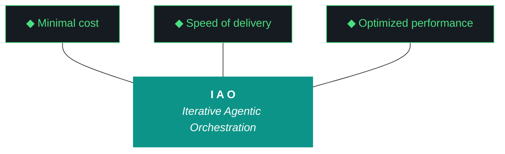

# kjtcom — Design 10.68.0

**Iteration:** 10.68.0 (phase.iteration.run — `.0` = planning draft)
**Phase:** 10 (Harness Externalization + Retrospective)
**Phase focus:** Harvest the kjtcom POC into iao. kjtcom enters archive mode after this iteration.
**Date:** April 08, 2026
**Repo:** SOC-Foundry/kjtcom
**Machine:** NZXTcos (`~/dev/projects/kjtcom`)
**Wall clock target:** ~4-5 hours, no hard cap
**Run mode:** Sequential, bounded, no tmux
**Significance:** **Last kjtcom-authored iteration that matters.** After 10.68.X graduates, kjtcom enters archive mode with minimal maintenance. iao becomes the active artifact moving forward.

---

## 1. The Three-Number Iteration System (NEW 10.68.0)

Starting this iteration, all kjtcom (and future project) artifacts use the format `<phase>.<iteration>.<run>`:

- **Phase** — project phase (10 for kjtcom "Harness Externalization + Retrospective")
- **Iteration** — planned iteration within phase, each with explicit MUST-have deliverables
- **Run** — individual execution attempt. `.0` is the planning draft. `.1`, `.2`, `.3` are subsequent runs, revisions, or parallel executions on different machines.

**Graduation rule:** an iteration graduates to the next iteration number only when **all MUST-have deliverables are met** as verified by the closing Qwen evaluator. Until then, additional runs stay at the same iteration number with incremented run suffix.

**Examples:**
- `10.68.0` — this planning artifact, not yet executed
- `10.68.1` — first execution of the 10.68 plan on NZXT
- `10.68.2` — second run if first didn't meet deliverables (or run on a different machine)
- `10.69.0` — next iteration's planning draft, produced only after 10.68.X graduates

**iao's own counter is separate.** iao uses `<phase>.<iteration>.<run>` too, where Phase 0 is always "project/component setup and build-out." iao's first iteration is `0.0.0` — phase 0, iteration 0, planning draft. Phase 1 begins after bring-up completes.

**Filenames drop the `v` prefix.** All artifacts from 10.68.0 forward use bare version numbers: `kjtcom-design-10.68.0.md`, `kjtcom-plan-10.68.0.md`, etc.

---

## 2. Why 10.68 Exists

kjtcom was a proof-of-concept for the IAO methodology. The POC succeeded: it produced a working harness (iao_middleware, now renaming to iao), a repeatable 10-phase pipeline pattern, an evaluator loop, a script registry, and a gotcha/ADR/pattern archaeology spanning 60+ iterations.

kjtcom the project is ending. **iao the living template is the real product going forward.** 10.68 exists to harvest every reusable piece of kjtcom into iao before kjtcom enters archive mode. Everything that has generalization potential moves up. Only genuinely pipeline-specific kjtcom artifacts (Huell Howser transcripts, CalGold/RickSteves/TripleDB/Bourdain specifics, claw3d rendering) stay behind.

This iteration also:
1. Renames `iao-middleware/` → `iao/` and `iao_middleware` package → `iao` package, eliminating the dash/underscore inconsistency from 10.67
2. Implements the 5-character project code taxonomy (`iaomw` = iao itself, `kjtco` = kjtcom, `intra` = future TachTech intranet middleware)
3. Splits the single `evaluator-harness.md` into `iao/docs/harness/base.md` and `kjtco/docs/harness/project.md` with enforced extension-only semantics
4. Produces `iao-v0.1.0-alpha.zip` as the physical deliverable for P3 bring-up (Phase 0 iteration 0 on P3 starts from this zip)
5. Fixes the inherited G102 iao_logger stale iteration bug as W0 so telemetry is clean from the start
6. Renames the 5th artifact from "context bundle" to just "bundle" (`kjtcom-bundle-10.68.1.md`) and expands it to the 10-item minimum specification
7. Scaffolds `iao push` as a skeleton workflow for the future continuous-improvement feedback loop

---

## 3. The Trident (Locked)



---

## 4. The Ten Pillars of IAO (Verbatim)

1. **Trident** — Cost / Delivery / Performance triangle
2. **Artifact Loop** — design → plan → build → report → bundle
3. **Diligence** — First action: `python3 scripts/query_registry.py "<topic>"`
4. **Pre-Flight Verification**
5. **Agentic Harness Orchestration**
6. **Zero-Intervention Target**
7. **Self-Healing Execution** (max 3 retries)
8. **Phase Graduation** — now formalized via MUST-have deliverables + Qwen graduation analysis
9. **Post-Flight Functional Testing** — Build is a gatekeeper
10. **Continuous Improvement** — formalized via `iao push` loop starting this iteration

---

## 5. Project State Going Into 10.68.0

### Pipelines (frozen, archiving)

| Pipeline | Entities | Status |
|---|---|---|
| calgold | 899 | Production — frozen |
| ricksteves | 4,182 | Production — frozen |
| tripledb | 1,100 | Production — frozen |
| bourdain | 604 | Production — frozen |

**Production total:** 6,785. **Zero pipeline changes in 10.68.** No Bourdain processing, no re-enrichment, no migrations.

### Frontend

- Flutter live: v10.65 (stale, deploy paused)
- claw3d.html live: v10.64 (stale, deploy paused)
- Deploy remains paused via `.iao.json` `deploy_paused: true`

### Middleware state going in (from 10.67.1)

- `iao-middleware/` directory exists (dash)
- `iao_middleware` Python package exists (underscore) inside it
- `pip install -e` completed, `iao` CLI functional
- `doctor.py` unified across pre/post-flight
- Phase B exit criteria all green at 10.67 close
- `iao_middleware` has README, CHANGELOG, VERSION (0.1.0), pyproject.toml, docs/adrs/0001
- 25 ADRs in `docs/evaluator-harness.md` (unsplit)
- ~30 Patterns in harness doc
- 101 gotchas in `data/gotcha_archive.json`
- 67 scripts in registry
- Bundle format: 374KB v10.67 context bundle with §1-§11 sections

### Known debts entering 10.68.0

- **G102:** `iao_logger.py` writes stale `"iteration": "v9.39"` into every event log entry regardless of `IAO_ITERATION` env var (fixed in W0)
- **Evaluator fragility:** Tier 1 Qwen still sensitive to synthesis ratios; Tier 2 Gemini Flash still hallucinates workstream groupings on sub-lettered IDs like W3a/W3b (not fixed in 10.68, flagged for next iteration)
- **Bundle naming:** `kjtcom-context-v10.67.md` should have been `kjtcom-bundle-10.67.1.md` (renamed in W7)
- **Harness is monolithic:** single `docs/evaluator-harness.md` mixes universal pillars with kjtcom-specific ADRs (split in W3)
- **Naming inconsistency:** `iao-middleware/` vs `iao_middleware` dash/underscore leak throughout docs, imports, logs (fixed in W1 rename)

---

## 6. The 5-Character Project Code System (NEW 10.68.0, iaomw-ADR-002)

**Rule:** every project in the iao ecosystem has a globally-unique 5-character lowercase alphanumeric code registered in `iao/projects.json` at the iao repo root.

| Code | Project | Status |
|---|---|---|
| `iaomw` | iao itself (living template) | Phase B+ |
| `kjtco` | kjtcom | Live, archiving after 10.68 |
| `intra` | TachTech intranet GCP middleware | Planned |

**Tag format:** `<code>-<type>-<id>`

- Gotchas: `iaomw-G001`, `kjtco-G045`, `intra-G003`
- ADRs: `iaomw-ADR-001`, `kjtco-ADR-026`
- Patterns: `iaomw-Pattern-01`, `kjtco-Pattern-30`
- Pillars: `iaomw-Pillar-1` through `iaomw-Pillar-10` (the 10 IAO Pillars)

**W5 performs the retroactive retagging pass** across the existing 25 ADRs, ~30 Patterns, and 101 gotchas, producing `docs/classification-10.68.json` for human review before W3 commits to the splits.

**Classification default (important — reflects kjtcom's POC status):** items default to `iaomw-*` (universal) unless they are unambiguously kjtcom-pipeline-specific. In prior planning I had the default flipped the other way; 10.68 flips it because kjtcom is archiving and iao should harvest aggressively.

**Examples of expected classifications:**

| Current | Proposed | Rationale |
|---|---|---|
| ADR-004 "harness is the product" | `iaomw-ADR-001` | Universal methodology principle |
| ADR-014 "context over constraint prompting" | `iaomw-ADR-002` | Universal evaluator pattern |
| ADR-020 "build is a gatekeeper" | `iaomw-ADR-003` | Universal methodology |
| ADR-023 "Phase A externalization" | `kjtco-ADR-023` | kjtcom-specific historical record |
| ADR-028 "dash/underscore convention" | `kjtco-ADR-028` | Historical, resolved by rename |
| Pattern 01 "heredocs break agents" | `iaomw-Pattern-01` | Universal agent gotcha |
| Pattern 30 "claw3d version drift" | `kjtco-Pattern-30` | kjtcom-specific frontend artifact |
| G45 "query editor cursor bug" | `kjtco-G045` | kjtcom Flutter-specific |
| G83 "agent overwrites design/plan" | `iaomw-G083` | Universal agent discipline |
| G97/G98 "evaluator synthesis / hallucination" | `iaomw-G097`/`iaomw-G098` | Universal evaluator pattern |

W2 produces the full classification as JSON for review. W3 applies the splits after review.

---

## 7. The Two-Harness Model with Extension-Only Semantics (NEW 10.68.0, iaomw-ADR-003)

**Locked interpretation: base harness is inviolable. Projects extend only.**

### File layout post-10.68

```
iao/docs/harness/base.md          ← iaomw-Pillars 1-10, iaomw-ADRs, iaomw-Patterns, Trident
kjtco/docs/harness/project.md     ← kjtco-ADRs, kjtco-Patterns (extends base)
```

The original `docs/evaluator-harness.md` at project root is retired. W3 writes a stub pointer at the old location that redirects to the new locations.

### Project harness required header format

```markdown
# kjtco Harness

**Extends:** iaomw v0.1.0
**Base imports (acknowledged):**
- iaomw-Pillar-1..10
- iaomw-ADR-001..012
- iaomw-Pattern-01..15
- iaomw-G001..G050

*Acknowledging base imports means this project has read them and agrees to operate under them. New base entries added after last acknowledgment will be flagged by `iao check harness` until re-acknowledged in the next iteration.*
```

### `iao check harness` enforcement (W4)

1. **Parse base.md** — extract all `iaomw-*` IDs at current version
2. **Parse project.md** — extract local IDs and acknowledged base IDs from header
3. **Rule A (ID collision):** project IDs must have `<code>-` prefix matching project's own code. Bare IDs or wrong-prefix IDs → FAIL
4. **Rule B (base inviolability):** project file MAY NOT contain any `iaomw-*` definitions. It may only reference them. Any `iaomw-*` definition in a project file → FAIL
5. **Rule C (acknowledgment currency):** if base.md grew since last acknowledgment, emit WARN listing new items. Project's next iteration must re-acknowledge or explicitly reject-with-reason.

### Why extension-only (not shadowing like gotchas)

Gotchas and ADRs are experiential knowledge — project experience legitimately overrides universal assumptions. But the evaluator harness is the *rulebook*. If kjtco silently redefines iaomw-Pattern-01, kjtco's evaluator results become incomparable with intra's evaluator results, and the cross-project learning loop collapses. The harness is a shared language; only extensions are project-specific.

---

## 8. The Continuous Improvement Loop (NEW 10.68.0, iaomw-ADR-004)

**The `iao push` workflow** is the CI mechanism. At iteration close, each project's closing sequence runs `iao push` which:

1. Scans for new entries added to `kjtco/docs/harness/project.md` since the last push
2. Filters for entries explicitly tagged with `scope: universal-candidate` in their metadata
3. Generates a single PR draft against `tachtech-engineering/iao` with all candidate entries
4. Hands the PR URL back to the human
5. Human reviews in github UI — accepts (merges to base.md with `origin: <code> <iteration>` metadata footer) or rejects (entry stays project-local permanently)

**One PR per iteration per project.** No per-entry pushes.

**Promoted entries preserve provenance.** When `intra-Pattern-05` gets promoted to `iaomw-Pattern-16`, its metadata includes `origin: intra 0.4.1, promoted to iaomw v0.9`. The universal IDs are renumbered sequentially; the origin is archaeological record.

**Rejected entries stay project-local forever.** No re-promotion attempts without explicit human decision. This prevents accidental re-submission loops.

**v10.68 ships the skeleton only.** `iao push` scaffolds the workflow (CLI command exists, scans for candidates, prints the PR draft to stdout). It does NOT actually push to github in 10.68. github push happens in a later iteration once the workflow is validated locally.

---

## 9. Target Directory Structure Post-10.68

```
~/dev/projects/kjtcom/                              ← dying POC, archiving after 10.68
├── iao/                                            ← renamed from iao-middleware/
│   ├── README.md                                   ← updated from standalone-repo voice
│   ├── CHANGELOG.md                                ← v0.1.0 entry updated
│   ├── VERSION                                     ← 0.1.0
│   ├── .gitignore
│   ├── pyproject.toml                              ← package name → "iao"
│   ├── install.fish                                ← updated paths
│   ├── MANIFEST.json                               ← regenerated
│   ├── COMPATIBILITY.md
│   ├── projects.json                               ← NEW W5, 5-char code registry
│   ├── bin/
│   │   └── iao                                     ← dispatcher updated for new module
│   ├── iao/                                        ← Python package, renamed from iao_middleware
│   │   ├── __init__.py
│   │   ├── paths.py
│   │   ├── registry.py
│   │   ├── bundle.py                               ← renamed from context_bundle.py
│   │   ├── compatibility.py
│   │   ├── doctor.py
│   │   ├── cli.py
│   │   ├── logger.py                               ← G102 FIX in W0
│   │   ├── push.py                                 ← NEW W8, iao push skeleton
│   │   ├── harness.py                              ← NEW W4, iao check harness
│   │   └── postflight/
│   │       └── (7 check modules, unchanged content, updated imports)
│   ├── docs/
│   │   ├── harness/
│   │   │   └── base.md                             ← NEW W3, extracted iaomw-* content
│   │   └── adrs/
│   │       └── 0001-phase-a-externalization.md
│   └── tests/
│       ├── test_paths.py
│       ├── test_doctor.py
│       └── test_harness.py                         ← NEW W4
├── kjtco/                                          ← NEW, kjtcom's own harness location
│   └── docs/
│       └── harness/
│           └── project.md                          ← NEW W3, extracted kjtco-* content
├── scripts/                                        ← shims all updated for new imports
│   ├── query_registry.py
│   ├── build_bundle.py                             ← renamed from build_context_bundle.py
│   ├── pre_flight.py
│   ├── post_flight.py
│   └── ...
├── docs/
│   ├── kjtcom-design-10.68.0.md                    ← this file
│   ├── kjtcom-plan-10.68.0.md
│   ├── kjtcom-build-10.68.1.md                     ← produced at run time
│   ├── kjtcom-report-10.68.1.md
│   ├── kjtcom-bundle-10.68.1.md                    ← RENAMED, 10-item minimum
│   ├── classification-10.68.json                   ← NEW W2, retag audit trail
│   └── evaluator-harness.md                        ← stub pointer after W3
├── .iao.json                                       ← project_code added
└── deliverables/                                   ← NEW W9
    └── iao-v0.1.0-alpha.zip                        ← physical P3 bring-up package
```

---

## 10. Bundle Specification (NEW 10.68.0, iaomw-ADR-005)

The 5th artifact is renamed **bundle** (previously "context bundle"). Filename: `<project>-bundle-<iteration>.md`.

**Minimum required set (10 items) — MUST be in every bundle:**

1. Current iteration design doc
2. Current iteration plan doc
3. Current iteration build log
4. Current iteration report
5. Base harness (`iao/docs/harness/base.md`, full) + project harness (`<project>/docs/harness/project.md`, full) — **counts as one item post-W3**
6. Project README.md (full)
7. Project CHANGELOG.md (full)
8. CLAUDE.md (full)
9. GEMINI.md (full)
10. `.iao.json` (verbatim)

**Iteration-dependent (included when present):**

11. Sidecar files for this iteration (retroactive reports, delta repairs)
12. Relevant ADR documents modified this iteration
13. Gotcha registry (full)
14. Script registry (full)
15. `iao/MANIFEST.json`
16. `iao/install.fish` (full)
17. `iao/COMPATIBILITY.md` (full)
18. `iao/projects.json` (NEW 10.68.0)

**Diagnostic tails:**

19. Event log tail (last ~500 entries)
20. Evaluator log tail (last run)
21. Post-flight log tail (last run)
22. Pre-flight log tail (last run)

**Computed sections:**

23. File inventory with sha256_16
24. Delta state (if available)
25. Pipeline state snapshot
26. Environment snapshot (python, ollama, flutter, gpu, disk)

**Exclusions (never bundle):**

- `~/.config/fish/config.fish` (G-gemini-leak)
- SA credential files
- Firebase CI token
- Any `.env` files
- Raw Firestore exports
- Pipeline data (transcripts, location.json dumps)

**Bundle size target:** 600KB-1MB post-expansion. Larger than 10.67's 340KB but well within planning-chat upload limits.

**Shim for old name:** `scripts/build_context_bundle.py` becomes a thin re-export of `scripts/build_bundle.py` with a deprecation warning printed to stderr. Removed in a future iteration.

---

## 11. Graduation Deliverables (NEW 10.68.0 format)

**Phase 10 Objectives (inherited from phase charter):**
- Harness externalized as `iao` Python package with standalone-repo authoring
- Phase B exit criteria achieved (met at 10.67.1 close)
- kjtcom POC lessons harvested into iao
- iao ready for P3 bring-up delivery

### Iteration 10.68 MUST-Have Deliverables

All of these must be GREEN at the closing Qwen evaluator's analysis for 10.68 to graduate to 10.69.

| # | Deliverable | Evidence | Gating |
|---|---|---|---|
| D1 | G102 iao_logger fix | Event log entries in post-W0 runs show `iteration: 10.68.1` not `v9.39` | W0 |
| D2 | iao rename complete | `iao-middleware/` gone; `iao/` exists; `from iao import X` works; all imports updated | W1 |
| D3 | Classification audit trail | `docs/classification-10.68.json` on disk with all 25 ADRs + ~30 Patterns + 101 gotchas classified | W2 |
| D4 | Harness split shipped | `iao/docs/harness/base.md` and `kjtco/docs/harness/project.md` both on disk with correct tagging | W3 |
| D5 | `iao check harness` alignment tool | Command exists, detects all 3 rule violations, returns exit 0 on clean | W4 |
| D6 | 5-char code retagging applied | Gotcha archive, ADR stream, Pattern stream, script registry all tagged with `iaomw-*` or `kjtco-*` | W5 |
| D7 | Sterilization pass documented | `iao/` contains zero kjtcom-specific references; sterilization log in build doc enumerates removals | W6 |
| D8 | Bundle rename + full spec | `kjtcom-bundle-10.68.1.md` exists; all 10 minimum items present; all applicable 11-26 items included | W7 |
| D9 | `iao push` skeleton | Command exists, scans for universal-candidates, emits PR draft to stdout | W8 |
| D10 | P3 delivery zip | `deliverables/iao-v0.1.0-alpha.zip` exists; `iao-p3-bootstrap.md` handoff doc complete | W9 |
| D11 | Closing evaluator ran | Real Qwen Tier 1 output (not self-eval fallback) in report, with graduation analysis | W10 |

### Graduation Decision Criteria

- **All D1-D11 green** → I produce `10.69.0` planning artifact on Kyle's review + approval
- **Any D1-D11 red** → I produce `10.68.<N+1>` planning artifact with targeted scope to close the gap
- **D11 red specifically (evaluator fell back to self-eval)** → graduation decision deferred to human review of the bundle; evaluator tooling itself becomes next iteration's W1

Qwen's closing analysis (part of D11) explicitly produces a `graduation_assessment` field in its JSON output with values `graduated`, `needs-rerun`, or `blocked-by-evaluator`. This is the machine-checkable graduation signal.

---

## 12. Workstreams

Sequential. No tmux. No parallelism.

| W# | Title | Pri | Est. | Deliverable |
|---|---|---|---|---|
| W0 | G102 iao_logger stale iteration fix | P0 | 15 min | D1 |
| W1 | iao rename (dir, package, imports, manifest, pip reinstall) | P0 | 45 min | D2 |
| W2 | Classification pass → `classification-10.68.json` for human review | P0 | 40 min | D3 |
| W3 | Harness split: `base.md` + `project.md`, retire evaluator-harness.md | P0 | 35 min | D4 |
| W4 | `iao check harness` alignment tool + unit tests | P0 | 25 min | D5 |
| W5 | 5-char code retagging across gotcha archive, ADRs, Patterns, script registry | P0 | 30 min | D6 |
| W6 | Aggressive sterilization pass on `iao/` + sterilization log | P0 | 40 min | D7 |
| W7 | Bundle rename + full spec implementation | P0 | 30 min | D8 |
| W8 | `iao push` skeleton command | P0 | 20 min | D9 |
| W9 | Produce P3 delivery zip + handoff doc | P0 | 25 min | D10 |
| W10 | Closing sequence with Qwen Tier 1 evaluator + graduation analysis | P0 | 20 min | D11 |

**Sum:** ~5h 5min. Slack on the 4-5 hour target but within acceptable bounds.

### W0 — G102 iao_logger Stale Iteration Fix

**Goal:** Every event log entry written during 10.68.1 execution shows the correct iteration, not `v9.39`.

**Root cause hypothesis:** `iao_logger.py` reads iteration from a hardcoded default, cached state file, or stale `.iao.json current_iteration` field, rather than from `IAO_ITERATION` env var.

**Steps:**
1. Read `scripts/utils/iao_logger.py` (or wherever the logger lives post-10.67 rename) to identify iteration source
2. Add precedence: `IAO_ITERATION` env var → `.iao.json current_iteration` → error (no silent default)
3. Update `.iao.json current_iteration` to `10.68.1` as part of pre-flight step zero
4. Write unit test that sets env var and verifies log output
5. Run one test log event, grep log for iteration tag, confirm matches

**Success:** D1 green. Event log entries from here forward have correct iteration.

### W1 — iao Rename

**Goal:** Eliminate the `iao-middleware` / `iao_middleware` dash/underscore inconsistency. Everything becomes `iao`.

**Steps:**
1. `mv iao-middleware iao`
2. `mv iao/iao_middleware iao/iao` (Python package rename)
3. Update `iao/pyproject.toml`: `name = "iao"`, `[project.scripts] iao = "iao.cli:main"`, `packages.find include = ["iao*"]`
4. Update every internal import: `from iao_middleware.X` → `from iao.X` (search and replace across `iao/iao/`, `scripts/`, any tests)
5. Update `iao/bin/iao` dispatcher: `python3 -m iao.cli "$@"`
6. Update `iao/install.fish` path references
7. Update `scripts/` shims to re-export from `iao.X` instead of `iao_middleware.X`
8. `pip uninstall iao-middleware -y --break-system-packages`
9. `pip install -e iao/ --break-system-packages`
10. Verify: `pip show iao` → 0.1.0, `python3 -c "import iao; print(iao.__version__)"` → 0.1.0, `iao --version` → 0.1.0
11. Regenerate `iao/MANIFEST.json`
12. Run `iao check config` → clean

**Failure recovery:** if any import breaks and can't be fixed in 3 retries, revert only the broken file with `git checkout --`, document, continue.

**Success:** D2 green. No more dash/underscore inconsistency. `iao` is the single name.

### W2 — Classification Pass

**Goal:** Classify every existing ADR, Pattern, and gotcha as `iaomw-*` (universal, moves to base.md) or `kjtco-*` (project-specific, stays in project.md).

**Default:** items are `iaomw-*` unless unambiguously kjtcom-specific. kjtcom is archiving, iao harvests aggressively.

**Steps:**
1. Read `docs/evaluator-harness.md` fully — extract all ADRs and Patterns with their full text
2. Read `data/gotcha_archive.json` — extract all 101 gotchas
3. For each item, apply classification heuristic:
   - References kjtcom pipeline names (calgold, ricksteves, tripledb, bourdain, claw3d) → `kjtco-*`
   - References kjtcom tech stack specifics (Firestore schema, Flutter widgets, CanvasKit, specific Riverpod patterns) → `kjtco-*`
   - References methodology (pillars, trident, artifact loop, build gatekeeper) → `iaomw-*`
   - References universal agent patterns (heredocs, command ls, API key leaks, printf) → `iaomw-*`
   - References evaluator mechanics (synthesis ratios, Tier 1/2/3, rich context, Qwen prompting) → `iaomw-*`
   - Ambiguous → `iaomw-*` (default bias)
4. Write `docs/classification-10.68.json`:
   ```json
   {
     "iteration": "10.68.1",
     "generated_at": "2026-04-08T...",
     "summary": {
       "iaomw_count": <N>,
       "kjtco_count": <M>,
       "total": <N+M>
     },
     "adrs": [
       {"original_id": "ADR-004", "new_id": "iaomw-ADR-001", "rationale": "..."},
       {"original_id": "ADR-023", "new_id": "kjtco-ADR-023", "rationale": "..."}
     ],
     "patterns": [...],
     "gotchas": [...]
   }
   ```
5. Print summary to build log
6. **NO writes to base.md or project.md yet — W3 does that after human review signal via the classification JSON being on disk**

**Success:** D3 green. Classification audit trail on disk.

### W3 — Harness Split

**Goal:** Create `iao/docs/harness/base.md` and `kjtco/docs/harness/project.md` using the classification from W2. Retire `docs/evaluator-harness.md`.

**Steps:**
1. Create `iao/docs/harness/` directory
2. Create `kjtco/docs/harness/` directory
3. Read `docs/classification-10.68.json`
4. Write `iao/docs/harness/base.md`:
   - Header section with Trident, 10 Pillars (renumbered as `iaomw-Pillar-1` through `iaomw-Pillar-10`)
   - All `iaomw-ADR-*` entries with full text
   - All `iaomw-Pattern-*` entries with full text
   - Metadata footer: iaomw version, last updated, next expected growth vector
5. Write `kjtco/docs/harness/project.md`:
   - Required header with `Extends: iaomw v0.1.0` and acknowledgment list
   - All `kjtco-ADR-*` entries with full text
   - All `kjtco-Pattern-*` entries with full text
   - Metadata footer: kjtco iteration, status: archiving
6. Retire `docs/evaluator-harness.md` → replace content with stub:
   ```markdown
   # evaluator-harness.md — RETIRED at 10.68.1

   This file has been split into:
   - `iao/docs/harness/base.md` (universal iaomw-* content)
   - `kjtco/docs/harness/project.md` (kjtcom-specific kjtco-* content)

   Split rationale: see `docs/classification-10.68.json`.
   See also: `iaomw-ADR-003` (two-harness extension-only semantics).
   ```
7. Verify line counts: base.md + project.md should approximately equal original evaluator-harness.md (give or take header/footer overhead)

**Success:** D4 green. Split harness on disk. Old harness file is a redirect stub.

### W4 — `iao check harness` Alignment Tool

**Goal:** Implement the enforcement mechanism for the two-harness model.

**Steps:**
1. Create `iao/iao/harness.py` with:
   - `parse_base_harness(path) -> dict` extracting all `iaomw-*` IDs
   - `parse_project_harness(path) -> dict` extracting local IDs and acknowledged base IDs
   - `check_alignment(base, project, project_code) -> list[tuple[severity, message]]`
2. Implement three rules:
   - Rule A: ID collision — every project ID prefix matches project_code
   - Rule B: base inviolability — zero `iaomw-*` definitions in project file (references OK, definitions not)
   - Rule C: acknowledgment currency — base IDs not in project's acknowledgment list → WARN
3. Wire `iao check harness` CLI subcommand in `iao/iao/cli.py`
4. Write `iao/tests/test_harness.py` with:
   - Fixture base harness with 3 ADRs, 3 Patterns
   - Fixture project harness (clean) → should PASS
   - Fixture project harness with collision → should FAIL with rule A message
   - Fixture project harness with base definition → should FAIL with rule B message
   - Fixture project harness with stale acknowledgment → should WARN with rule C message
5. Run against real kjtco harness from W3 → should PASS clean
6. Run `iao check harness` from CLI → exit 0

**Success:** D5 green. Alignment tool works.

### W5 — 5-char Code Retagging Application

**Goal:** Apply the classification from W2 to the actual artifact streams (gotcha JSON, script registry, ADR IDs in files).

**Steps:**
1. Update `data/gotcha_archive.json`: add `code` field to every gotcha, set to `iaomw` or `kjtco` per classification
2. Update `data/script_registry.json`: add `code` field, set based on script location (scripts under `iao/iao/` → `iaomw`, scripts under `scripts/` that are kjtcom-specific → `kjtco`, general scripts → `iaomw`)
3. Create `iao/projects.json`:
   ```json
   {
     "iaomw": {"name": "iao", "path": "self", "status": "phase-B", "registered": "2026-04-08"},
     "kjtco": {"name": "kjtcom", "path": "~/dev/projects/kjtcom", "status": "archiving", "registered": "2026-04-08"},
     "intra": {"name": "tachtech-intranet", "path": null, "status": "planned", "registered": "2026-04-08"}
   }
   ```
4. Update `.iao.json` to add `project_code: "kjtco"` field
5. Verify: `iao check config` → no unclassified entries

**Success:** D6 green. All artifact streams tagged with 5-char codes.

### W6 — Aggressive Sterilization Pass

**Goal:** Every file in `iao/` is kjtcom-agnostic. Someone cloning iao to a fresh machine that has never heard of California's Gold should see zero kjtcom references.

**Steps:**
1. `grep -rn "kjtcom\|calgold\|ricksteves\|tripledb\|bourdain\|claw3d\|kylejeromethompson\|Huell Howser\|CanvasKit\|Firestore" iao/`
2. For each hit:
   - If it's example text → rewrite generically ("your-project" instead of "kjtcom")
   - If it's a hardcoded path → parameterize via `.iao.json`
   - If it's a kjtcom-specific ADR or Pattern that somehow ended up in base.md → move to project.md (recovery from W2/W3 misclassification)
   - If it's a gotcha that's kjtcom-specific → move to project scope
3. Create `iao/docs/sterilization-log-10.68.md` enumerating every change:
   ```markdown
   # Sterilization Log 10.68.1

   ## Removals
   - `iao/install.fish`: removed line 42 "cp kjtcom-specific.fish"
   - `iao/README.md`: rewrote "kjtcom uses iao" → "projects use iao"
   ...
   ```
4. Re-grep → zero hits expected
5. Run all iao tests to confirm sterilization didn't break functionality

**Success:** D7 green. `iao/` is kjtcom-agnostic.

### W7 — Bundle Rename + Full Spec

**Goal:** Bundle is renamed from "context bundle" to just "bundle." `kjtcom-context-*` becomes `kjtcom-bundle-*`. Full 10-item minimum + iteration-dependent + diagnostic sections implemented.

**Steps:**
1. Rename `iao/iao/context_bundle.py` → `iao/iao/bundle.py`
2. Update `scripts/build_context_bundle.py` shim → `scripts/build_bundle.py` + deprecation stub at old name
3. Rewrite `iao/iao/bundle.py` generator to include all 26 bundle spec items (10 minimum + 8 iteration-dependent + 4 diagnostic tails + 4 computed)
4. Implement the exclusion filter (never bundle fish config, SA credentials, etc.)
5. Test-generate `kjtcom-bundle-10.68.1.md` with current project state → verify all minimum items present
6. Target size 600KB-1MB

**Success:** D8 green. New bundle name, new bundle spec live.

### W8 — `iao push` Skeleton

**Goal:** Scaffold the continuous-improvement feedback loop. Command exists and works locally; does NOT actually push to github in 10.68.

**Steps:**
1. Create `iao/iao/push.py` with:
   - `scan_candidates(project_harness_path) -> list[entry]` finding items tagged `scope: universal-candidate`
   - `generate_pr_draft(candidates) -> str` producing markdown PR body with proposed additions
   - `print_or_save_draft(draft, output)` — either stdout or file
2. Wire `iao push` CLI subcommand that:
   - Reads project's harness file
   - Scans for candidates
   - If none → "no universal candidates found, nothing to push"
   - If found → prints PR draft to stdout with note "10.68: github push deferred, draft only"
3. Add test candidate to `kjtco/docs/harness/project.md` (a fake entry tagged universal-candidate) to verify detection works
4. Remove test candidate at end of W8 so the v10.68 bundle doesn't ship with a fake

**Success:** D9 green. `iao push` skeleton exists.

### W9 — P3 Delivery Zip + Handoff Doc

**Goal:** Produce the physical deliverable for P3 bring-up. Kyle copies the zip to P3, extracts, and begins `iao-design-0.0.0.md` on P3.

**Steps:**
1. Create `deliverables/` directory
2. Create `iao-p3-bootstrap.md` handoff doc with:
   - Purpose: P3 bring-up of iao
   - Pre-requisites (fish shell, Python 3.11+, git, sensible terminal)
   - Extract instructions: `unzip iao-v0.1.0-alpha.zip -d ~/iao && cd ~/iao && fish install.fish`
   - First iteration on P3: phase 0, iteration 0, run 0 (`iao-design-0.0.0.md`)
   - Phase 0 objectives: bring-up, validate iao works on a fresh machine, discover sterilization gaps that NZXT missed
   - Link to `iao/docs/harness/base.md` as the rulebook
3. Create the zip:
   ```bash
   cd ~/dev/projects/kjtcom
   # Copy iao/ to a temp dir to avoid including kjtcom context
   cp -r iao /tmp/iao-v0.1.0-alpha
   cp iao-p3-bootstrap.md /tmp/iao-v0.1.0-alpha/
   cd /tmp
   zip -r iao-v0.1.0-alpha.zip iao-v0.1.0-alpha/ -x '*.pyc' -x '__pycache__/*'
   mv iao-v0.1.0-alpha.zip ~/dev/projects/kjtcom/deliverables/
   rm -rf /tmp/iao-v0.1.0-alpha
   ```
4. Verify zip contents: `unzip -l deliverables/iao-v0.1.0-alpha.zip | head -30`
5. Expected size: ~500KB-2MB depending on what's included

**Success:** D10 green. Zip ready for P3 transfer.

### W10 — Closing Sequence with Qwen Tier 1 + Graduation Analysis

**Goal:** Run real evaluator, verify all D1-D11 deliverables, produce graduation decision.

**Steps:**
1. `python3 scripts/iteration_deltas.py --snapshot 10.68.1`
2. `python3 scripts/sync_script_registry.py`
3. `python3 scripts/build_bundle.py --iteration 10.68.1` (via new shim) → `docs/kjtcom-bundle-10.68.1.md`
4. Verify bundle has all 10 minimum items, > 600KB
5. **Run closing evaluator with graduation analysis:**
   ```bash
   python3 scripts/run_evaluator.py \
     --iteration 10.68.1 \
     --rich-context \
     --deliverables docs/kjtcom-design-10.68.0.md:section-11 \
     --graduation-assessment \
     --verbose 2>&1 | tee /tmp/eval-10.68.1.log
   ```
   The `--deliverables` flag points at this design doc §11 so the evaluator knows what to check. The `--graduation-assessment` flag requests an additional output field `graduation_assessment` with values `graduated`, `needs-rerun`, or `blocked-by-evaluator`.
6. Parse evaluator output for `graduation_assessment` field
7. Write `docs/kjtcom-build-10.68.1.md` with D1-D11 verification table
8. Write `docs/kjtcom-report-10.68.1.md` with real evaluator scores (NOT self-eval fallback)
9. Run post-flight: `python3 scripts/post_flight.py 10.68.1` → should PASS (deploy paused flag honored)
10. Verify all 5 artifacts on disk: design, plan, build, report, bundle
11. `git status --short; git log --oneline -5` (read-only)
12. Hand back to Kyle with graduation recommendation

**Graduation output (goes to build log AND stdout at handback):**

```
==============================================
10.68.1 COMPLETE — GRADUATION ASSESSMENT
==============================================

MUST-have Deliverables:
  D1 (G102 logger fix):          [PASS/FAIL]
  D2 (iao rename):                [PASS/FAIL]
  D3 (classification audit):     [PASS/FAIL]
  D4 (harness split):            [PASS/FAIL]
  D5 (iao check harness):        [PASS/FAIL]
  D6 (5-char retagging):         [PASS/FAIL]
  D7 (sterilization):            [PASS/FAIL]
  D8 (bundle rename):            [PASS/FAIL]
  D9 (iao push skeleton):        [PASS/FAIL]
  D10 (P3 delivery zip):         [PASS/FAIL]
  D11 (evaluator ran):           [PASS/FAIL]

Qwen graduation_assessment: <value>

RECOMMENDATION:
  - If all PASS + Qwen "graduated" → ready for 10.69.0 planning
  - If any FAIL → next iteration is 10.68.2 with targeted scope
  - If D11 "blocked-by-evaluator" → 10.69 scope may need to address evaluator tooling

Awaiting human review of bundle at docs/kjtcom-bundle-10.68.1.md.
```

**STOP.** Do not commit. Do not push. Do not graduate automatically. Human reviews the bundle and decides.

**Success:** D11 green. Graduation recommendation in hand. Bundle ready for review.

---

## 13. Gotchas (10.68-relevant)

| ID | Title | Action |
|---|---|---|
| iaomw-G001 (was G1) | Heredocs break agents | `printf` blocks throughout W1-W10 |
| iaomw-G022 (was G22) | `ls` color codes | `command ls` |
| iaomw-G083 (was G83) | Agent overwrites design/plan | Agent MUST NOT edit design/plan during execution |
| **iaomw-G102** | **iao_logger stale iteration** | **Fixed in W0** |
| kjtco-G045 | Query editor cursor bug | Out of scope for 10.68 |
| kjtco-Gemini-leak | Never `cat ~/.config/fish/config.fish` | Enforced in bundle exclusion list (W7) |
| **NEW** | W2 classification error | Human reviews classification-10.68.json; W3 applies |
| **NEW** | W1 import path breakage | 3 retries, revert-and-continue on failure |

---

## 14. Failure Modes

| Failure | Action |
|---|---|
| Pre-flight BLOCKER | Halt with `PRE-FLIGHT BLOCKED: <reason>`. Exit. |
| W0 logger fix breaks logging entirely | Revert logger.py. Mark D1 failed. Continue iteration. |
| W1 iao rename breaks imports | 3 retries per file. Revert broken files individually. Document as tech debt. Mark D2 at risk. |
| W2 classification produces obviously-wrong splits | Log in build doc. Continue. Human reviews classification-10.68.json before graduation decision. |
| W3 harness split loses content | Line count check catches it. Re-run W3 from W2's JSON. |
| W4 `iao check harness` false positives | Tune rules, re-run. If persistent, emit as WARN not FAIL. |
| W5 retagging corrupts gotcha JSON | `git checkout -- data/gotcha_archive.json`. Re-run more carefully. |
| W6 sterilization breaks iao tests | Revert specific sterilization change. Document as NOT sterilized. Mark D7 partial. |
| W7 bundle generator fails | Debug the one broken section, continue. Bundle can ship with one section missing if critical path works. |
| W8 `iao push` scans nothing | Expected in first run. No candidates exist yet. Print "no candidates" and succeed. |
| W9 zip creation fails | Debug path issues. Re-run. Mark D10 failed if unresolvable. |
| W10 evaluator falls back to self-eval AGAIN | Document which tier failed and why. Mark D11 as `blocked-by-evaluator`. Graduation decision deferred to human review. This is the expected failure mode if evaluator fragility from 10.67 persists. |
| Wall clock > 6 hours | Log warning. Triage: W4/W8 can become stubs. W9/W10 MUST run. |
| Any git write attempted | Pillar 0 violation. Halt. |
| Agent wants to skip W10 evaluator | See 10.67.2 plan §2. Not acceptable. Run it. |

---

## 15. Definition of Done

All D1-D11 from §11 verified by W10 closing evaluator.

Additionally:
- All 5 primary artifacts on disk (design 10.68.0, plan 10.68.0, build 10.68.1, report 10.68.1, bundle 10.68.1)
- Sidecars: `classification-10.68.json`, `sterilization-log-10.68.md`
- `deliverables/iao-v0.1.0-alpha.zip` + `iao-p3-bootstrap.md` on disk
- Bundle > 600KB with all 10 minimum items
- Zero git writes
- Graduation recommendation emitted to build log AND stdout at handback

---

## 16. Significance Statement

**This is kjtcom's last meaningful iteration.** After 10.68.X graduates, kjtcom's active development stops. The POC has served its purpose: it proved the IAO methodology works, produced a working harness, and cataloged dozens of gotchas/patterns/ADRs that are about to become iao's foundation.

Every workstream in 10.68 is about harvest. W1 harvests the package name. W2-W5 harvest the knowledge (classification, retagging, split). W6 sterilizes away the kjtcom scaffolding. W7 gives iao its own bundle format. W8 scaffolds iao's future contribution loop. W9 produces the physical artifact that carries iao to P3 for bring-up.

**10.69 is not scoped yet and will not be scoped until Kyle reviews the 10.68.1 bundle.** The two likely shapes:

1. **10.68.2** if any MUST-have deliverable failed — targeted patch, same iteration number, incremented run
2. **10.69.0** if graduation recommended — likely scope is kjtcom post-rename validation and iao-pipeline portability preparation, but this is speculative until review happens

iao begins its own iteration stream at `0.0.0` on P3 when Kyle extracts the zip and runs `iao status` for the first time. That moment is the birth of iao as an independent artifact. kjtcom becomes archaeology.

---

*Design 10.68.0 — April 08, 2026. Authored by the planning chat. First iteration using three-number phase.iteration.run format. Reviewed and approved by Kyle before execution.*
