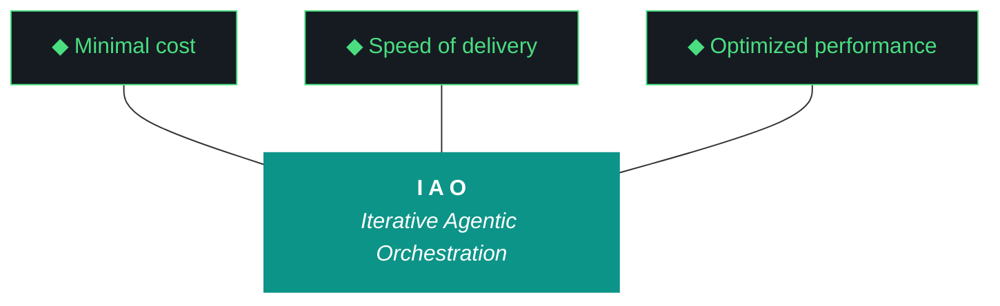

# kjtcom — Design 10.69.0

**Iteration:** 10.69.0 (phase.iteration.run — `.0` = planning draft)
**Phase:** 10 (Harness Externalization + Retrospective)
**Phase position:** Final iteration of Phase 10 — closes the phase
**Date:** April 08, 2026
**Repo:** SOC-Foundry/kjtcom
**Machine:** NZXTcos (`~/dev/projects/kjtcom`)
**Wall clock target:** ~4-6 hours, no hard cap
**Run mode:** Sequential, bounded, no tmux
**Significance:** Final iteration of kjtcom Phase 10. Closes 10.68.1's blocked conditions, retroactively charters Phase 10, transitions kjtcom to steady-state development cadence, and establishes iao authoring environment on NZXT for the parallel iao counter that begins after 10.69.X graduates.

---

## 1. Phase Charter (NEW format — 10.69.0 establishes this as required §1)

**Phase:** 10 — Harness Externalization + Retrospective
**Status:** active (graduating at 10.69.X close)
**Charter author:** iao planning chat (retroactive — Phase 10 was not formally chartered when it began)
**Charter version:** 0.1
**Charter date:** 2026-04-08

### Why This Phase Exists

The IAO methodology was developed inside kjtcom as a working POC. Phase 10 extracts the matured harness from kjtcom into a standalone iao package consumable by other projects and engineers. This phase exists to graduate the methodology from "interesting POC pattern that produces working software" to "consumable product that ships to other engineers and reduces their token spend while improving output quality." Phase 10 ends when iao is ready for first cross-machine consumption (P3) and kjtcom has transitioned from active development lab to steady-state production reference.

### Phase Objectives

1. Extract the working harness from kjtcom into a standalone Python package (`iao`)
2. Establish standalone-repo authoring conventions (README, CHANGELOG, VERSION, pyproject.toml, dedicated docs tree)
3. Harvest reusable kjtcom knowledge into iao base via formal classification taxonomy
4. Establish phase/iteration/run formal numbering for all iao-ecosystem projects
5. Establish 5-character project code system for cross-project provenance tracking
6. Deliver iao to first cross-machine consumer (P3 via zip handoff)
7. Transition kjtcom from active development lab to steady-state production reference
8. Establish iao-the-product as its own authorable project on NZXT with parallel iteration counter

### Phase Entry Criteria (where Phase 10 began)

- kjtcom v10.65 shipped with harness still embedded as `iao-middleware/`
- Evaluator working but fragile (Tier 1 Qwen synthesis sensitivity, Tier 2 Gemini Flash schema issues)
- Single monolithic `docs/evaluator-harness.md` mixing universal pillars with kjtcom-specific ADRs
- No package boundaries — harness was a subdirectory, not an importable module
- No multi-project mental model — everything assumed kjtcom was the only consumer
- No formal phase/iteration framework — iterations were sequential v10.XX numbers without phase context
- 6,785 production entities across 4 pipelines, all stable

### Phase Exit Criteria (Graduation Conditions)

- [x] iao installable as Python package (`pip install -e iao/` works on NZXT) — achieved 10.66
- [x] Standalone-repo voice authoring (README, CHANGELOG, VERSION, pyproject.toml, dedicated docs/adrs) — achieved 10.67
- [x] Phase A duplication eliminated — achieved 10.67
- [x] doctor.py unified across pre/post-flight + iao CLI — achieved 10.67
- [x] iao rename complete (no more dash/underscore inconsistency) — achieved 10.68
- [x] kjtcom knowledge classified and split into base/project harnesses — achieved 10.68
- [x] phase/iteration/run formal numbering adopted — achieved 10.68
- [x] 5-char code taxonomy applied to gotcha archive, script registry, ADR stream — achieved 10.68
- [x] iao delivered to P3 as physical artifact (zip exists) — achieved 10.68
- [ ] Evaluator hardened against `phase.iteration.run` filename layout + Qwen/Gemini Flash failure modes — 10.69 W1
- [ ] Postflight plugin loader refactored to separate iao base checks from project-specific checks — 10.69 W2
- [ ] Build log auto-append hook eliminating retroactive-fill failure mode — 10.69 W3
- [ ] Phase 10 charter retroactively documented and committed to design history — 10.69 W4
- [ ] kjtcom transitioned to steady-state development cadence with documented maintenance mode — 10.69 W5
- [ ] iao authoring environment established on NZXT separate from kjtcom — 10.69 W6
- [ ] Closing Qwen evaluator runs cleanly (real scores, not self-eval fallback) — 10.69 W7

### Iterations Planned in This Phase

| Iteration | Scope | Status |
|---|---|---|
| 10.66 | Phase A scaffold (iao-middleware partial externalization) | graduated |
| 10.67 | Phase A hardening (rename to package, duplication elimination, Phase B exit criteria) | graduated |
| 10.68 | Rename + harvest + classification + harness split + P3 delivery zip | graduated with conditions (D7 PARTIAL, D11 BLOCKED-BY-EVALUATOR) |
| 10.69 | Conditions cleanup + Phase 10 charter retrofit + kjtcom steady-state transition + iao authoring environment setup | planning |

After 10.69.X graduates, Phase 10 closes. **Future kjtcom development continues** at much lower cadence (probably weeks-to-months between iterations rather than the daily-to-weekly cadence of Phase 10) under whatever phase number Kyle assigns when the next development lab need arises. **iao gets its own parallel counter starting at iao 0.1.0** authored on NZXT in a separate project directory.

### Current Iteration Position

**Currently executing:** 10.69.0 (this planning draft)
**Iterations completed in this phase:** 10.66, 10.67, 10.68
**Iterations remaining in Phase 10:** 10.69
**Phase progress:** 3 of 4 planned iterations complete

### Phase Charter Revision History

| Version | Date | Iteration | Change |
|---|---|---|---|
| 0.1 | 2026-04-08 | 10.69.0 | Retroactive charter for Phase 10 (W4 commits this to history) |

---

## 2. Why 10.69 Exists

10.68.1 graduated with conditions. Three concrete debts remain:

1. **Evaluator tooling fragility** (D11 BLOCKED-BY-EVALUATOR in 10.68.1) — Tier 1 Qwen synthesis ratio sensitivity (iaomw-G097) and Tier 2 Gemini Flash schema validation failures (iaomw-G098) prevented real evaluator output for both 10.67 and 10.68. This isn't an iteration problem, it's a tooling problem. The fix is local to the evaluator script.

2. **Postflight plugin coupling** (D7 PARTIAL in 10.68.1) — four kjtcom-specific check modules still live inside `iao/iao/postflight/` despite 10.68's sterilization pass. They reference kjtcom URLs, kjtcom hosting, kjtcom Flutter assets. P3 cannot use these checks. They need to move to `kjtco/postflight/` and iao's postflight needs to become a plugin loader that pulls from project-owned check directories.

3. **Build log retroactive-fill failure mode** — 10.68.1 self-identified that the agent batched build log writes instead of appending per-workstream, causing the first evaluator run to tier-fall-through against an empty narrative. The fix is a workstream-completion hook that appends incrementally.

10.69 closes those three debts in W1-W3.

10.69 also exists to **formalize Phase 10 in retrospect** (W4 writes the Phase 10 charter and commits it to kjtcom's design history) and to **transition kjtcom out of active development** (W5 establishes steady-state mode without ending kjtcom — kjtcom continues as production reference site with minimal maintenance, planned development happens at much lower cadence).

Finally, 10.69 **establishes the iao authoring environment** (W6) so the parallel iao counter has somewhere to live on NZXT post-Phase-10. iao gets its own checkout location, its own `.iao.json`, its own iteration history starting at 0.1.0.

---

## 3. The Trident (Locked, iaomw-Pillar-1)



---

## 4. The Ten Pillars (Locked, iaomw-Pillar-1 through iaomw-Pillar-10)

1. **iaomw-Pillar-1 (Trident)** — Cost / Delivery / Performance triangle
2. **iaomw-Pillar-2 (Artifact Loop)** — design → plan → build → report → bundle
3. **iaomw-Pillar-3 (Diligence)** — First action: `iao registry query "<topic>"`
4. **iaomw-Pillar-4 (Pre-Flight Verification)**
5. **iaomw-Pillar-5 (Agentic Harness Orchestration)**
6. **iaomw-Pillar-6 (Zero-Intervention Target)**
7. **iaomw-Pillar-7 (Self-Healing Execution)** — max 3 retries
8. **iaomw-Pillar-8 (Phase Graduation)** — formalized via MUST-have deliverables + Qwen graduation analysis
9. **iaomw-Pillar-9 (Post-Flight Functional Testing)** — build is a gatekeeper
10. **iaomw-Pillar-10 (Continuous Improvement)** — formalized via `iao push` skeleton (future activation)

---

## 5. Project State Going Into 10.69

### Pipelines (steady, no changes in 10.69)

| Pipeline | Entities | Status |
|---|---|---|
| calgold | 899 | Production — steady |
| ricksteves | 4,182 | Production — steady |
| tripledb | 1,100 | Production — steady |
| bourdain | 604 | Production — steady |

**Production total:** 6,785. **Zero pipeline changes in 10.69.** kjtcom production stays exactly as-is.

### Frontend

- Flutter live: v10.65 (stale, deploy paused — `.iao.json deploy_paused: true`)
- claw3d.html live: v10.64 (stale, deploy paused)
- Deploy stays paused throughout 10.69

### Middleware state going in (from 10.68.1 close)

- `iao/` directory with `iao_middleware` → `iao` rename complete
- `pip install -e iao/` working, `iao --version` returns `0.1.0`
- `iao/docs/harness/base.md` (282 lines, iaomw-* content)
- `kjtco/docs/harness/project.md` (1534 lines, kjtco-* content)
- `iao/projects.json` registered with `iaomw`, `kjtco`, `intra`
- `.iao.json` has `project_code: kjtco` and `current_iteration: 10.68.1` (W0 of 10.69.1 updates this)
- 31 ADRs + 29 Patterns + 60 gotchas classified (W2 of 10.68.1)
- Bundle format: 615KB at 10.68.1 close
- `deliverables/iao-v0.1.0-alpha.zip` (47685 bytes, 45 files) ready for P3 transfer
- `iao push` skeleton exists, doesn't push to github yet

### Known debts entering 10.69

| Debt | Origin | Closes in |
|---|---|---|
| iaomw-G097 Qwen synthesis ratio sensitivity | 10.66 | 10.69 W1 |
| iaomw-G098 Gemini Flash schema validation failures | 10.67 | 10.69 W1 |
| Evaluator filename layout (`.0` vs `.1` vs `.2`) | 10.68 | 10.69 W1 |
| 4 kjtcom-specific postflight modules in `iao/iao/postflight/` | 10.68 W6 PARTIAL | 10.69 W2 |
| `artifacts_present` looks for old `kjtcom-context-*` filename | 10.68 W7 followup | 10.69 W2 |
| `map_tab_renders` doesn't honor `deploy_paused` flag | 10.68 W6 PARTIAL | 10.69 W2 |
| Retroactive build log fill causes empty-narrative evaluator failure | 10.68.1 self-identified | 10.69 W3 |
| Phase 10 has no formal charter | 10.69 W4 retrofit | 10.69 W4 |
| kjtcom is in iteration mode but should be in steady-state mode | 10.69 W5 | 10.69 W5 |
| No iao authoring environment on NZXT | implied since 10.66 | 10.69 W6 |

---

## 6. What 10.69 Is (and Isn't)

### IS

- **W0:** Update `.iao.json current_iteration` to `10.69.1` (now mandatory pre-flight step)
- **W1: Evaluator tooling hardening** — fix Qwen synthesis ratio sensitivity, fix Gemini Flash schema validation, add `phase.iteration.run` filename layout support
- **W2: Postflight plugin loader refactor** — move kjtcom-specific check modules out of iao base, make postflight a plugin loader
- **W3: Build log auto-append hook** — `iao log workstream-complete` command + agent guidance updates
- **W4: Phase 10 charter retrofit** — write the Phase 10 charter (template established by this design doc) and commit it as the canonical Phase 10 history
- **W5: kjtcom steady-state transition** — `.iao.json` mode flag, document kjtcom as production reference site, write the kjtcom maintenance guide
- **W6: iao authoring environment setup** — establish `~/dev/projects/iao/` as the iao authoring location, create iao's own `.iao.json` (`project_code: iaomw`), prepare for iao 0.1.0 first authored iteration
- **W7: Closing sequence with hardened evaluator** — should now work cleanly given W1; produces real Qwen scores; emits graduation recommendation; closes Phase 10

### IS NOT

- New pipeline work (kjtcom production frozen)
- Bridge file implementation (~/.claude/CLAUDE.md global) — that's iao Phase 1 work, NOT 10.69 W-level work. Mentioned in §10 forward context only.
- Actual iao 0.1.0 first iteration authoring (W6 prepares the environment, doesn't execute the first iao iteration)
- P3 work (P3 still hasn't received the zip — out of scope, that's a separate human action)
- iao push to github actual implementation (still skeleton)
- LICENSE for iao (deferred)
- Any kjtcom new feature work
- iao-pipeline portability (deferred until iao is stable enough to extend)
- Riverpod 2→3 upgrade (still its own dedicated future iteration)
- macOS / Windows compatibility for iao
- New 5-char project codes (iaomw, kjtco, intra registered, that's enough for now)

---

## 7. Workstreams

Sequential. No tmux. No parallelism.

| W# | Title | Pri | Est. | Deliverable |
|---|---|---|---|---|
| W0 | Update `.iao.json current_iteration` to 10.69.1 | P0 | 2 min | (pre-flight step) |
| W1 | Evaluator tooling hardening | P0 | 60 min | D1 |
| W2 | Postflight plugin loader refactor | P0 | 50 min | D2 |
| W3 | Build log auto-append hook | P0 | 35 min | D3 |
| W4 | Phase 10 charter retrofit | P0 | 25 min | D4 |
| W5 | kjtcom steady-state transition | P0 | 30 min | D5 |
| W6 | iao authoring environment setup | P0 | 40 min | D6 |
| W7 | Closing sequence with hardened evaluator | P0 | 25 min | D7 |

**Sum:** ~4h 27min estimated. 4-6 hour target. W1 is highest-risk because it touches the evaluator script the agent depends on for its own closing run.

### W1 — Evaluator Tooling Hardening

**Goal:** Make the closing evaluator actually produce real Qwen scores instead of falling back to self-eval. Three concrete fixes.

**Fix 1: Filename layout support for `phase.iteration.run`**

The evaluator script `scripts/run_evaluator.py` looks for design/plan/build/report/bundle files at fixed paths like `docs/kjtcom-design-<iteration>.md`. With the new format, design lives at `<project>-design-<phase>.<iter>.<run>.md` where the design's run suffix is always `.0` (planning) and execution-time artifacts use `.1`, `.2`, etc.

The evaluator needs to:
- Resolve `--iteration 10.69.1` → `kjtcom-design-10.69.0.md` (look for `.0` of the design)
- Resolve `--iteration 10.69.1` → `kjtcom-plan-10.69.0.md` (look for `.0` of the plan)
- Resolve `--iteration 10.69.1` → `kjtcom-build-10.69.1.md` (use the run suffix as-given for build/report/bundle)
- Resolve `--iteration 10.69.1` → `kjtcom-report-10.69.1.md`
- Resolve `--iteration 10.69.1` → `kjtcom-bundle-10.69.1.md`

Add a helper function `resolve_artifact_paths(iteration: str) -> dict[str, Path]` that handles both the legacy `v10.XX` format AND the new `phase.iteration.run` format, falling back to symlink lookup if nothing matches.

**Fix 2: Tier 1 Qwen synthesis ratio sensitivity (iaomw-G097)**

Current behavior: Qwen sees the build log, computes synthesis_ratio, and raises `EvaluatorSynthesisExceeded` when ratio > 0.5 for the first workstream. The 10.66/10.67/10.68 fix flipped the substring matcher to exact-match, but the ratio is still computed against generic improvement language Qwen sees as boilerplate.

Two improvements:
- **Per-workstream synthesis floor:** synthesis_ratio is calculated per workstream, but the threshold check should be a weighted average across all workstreams, not a per-workstream gate. One synthesis-heavy workstream shouldn't tier-fall-through the entire iteration.
- **Boilerplate normalizer:** strip common boilerplate from build log workstream sections before computing synthesis_ratio. Phrases like "Updated MANIFEST.json" or "Verified import" or "Ran tests" are valid evidence but inflate synthesis ratios when they appear in multiple workstream sections. Normalizer maintains a frequency table — phrases appearing in >50% of workstream sections get downweighted.

Add `--synthesis-mode strict|weighted|loose` CLI flag. Default to `weighted`. `strict` is the old behavior. `loose` skips the check entirely (last resort).

**Fix 3: Tier 2 Gemini Flash schema validation (iaomw-G098)**

Current behavior: Gemini Flash gets the same prompt as Qwen, returns JSON, the validator rejects on a single schema error and the entire tier falls through. From the 10.68.1 bundle: "Gemini Flash actually parsed the build log meaningfully on attempt 2 (its raw response begins 'kjtcom's final meaningful iteration successfully harvested the POC into the iao living template...'), so the issue is not lack of evidence but a single schema validation error."

Two improvements:
- **Schema repair pass:** when Gemini Flash returns JSON that fails schema validation, run a repair pass that attempts common fixes (missing required fields filled with sensible defaults, extra fields stripped, type coercion for string-to-number) before declaring tier failure. Repair pass is logged separately so we know when it fires.
- **Workstream ID alias support:** the W3a/W3b grouping issue from 10.67 — Gemini Flash naturally collapsed sub-lettered IDs into "W3", which the design-doc anchor check rejected. Add an alias map so the evaluator accepts both forms (`W3a` and `W3` if `W3a` is the only matching ID) and re-aligns. Alias resolution is logged.

**Steps:**
1. Read `scripts/run_evaluator.py` end-to-end to understand current structure
2. Add `resolve_artifact_paths()` helper, integrate into the existing artifact-loading logic
3. Add `--synthesis-mode` flag with `weighted` default; refactor synthesis_ratio calculation
4. Add boilerplate normalizer with frequency-table downweighting
5. Add Gemini Flash schema repair pass with explicit logging
6. Add workstream ID alias resolution with explicit logging
7. Write unit tests in `iao/tests/test_evaluator.py`:
   - `test_resolve_paths_phase_iteration_run` — verify `.0`/`.1` resolution
   - `test_resolve_paths_legacy` — verify backward compat with `v10.67` style
   - `test_synthesis_weighted_mode` — single high-ratio workstream doesn't trip
   - `test_boilerplate_normalizer` — repeated phrases get downweighted
   - `test_gemini_repair_missing_field` — schema repair pass fills defaults
   - `test_workstream_id_alias` — `W3` resolves to `W3a` when only sub-lettered exists
8. Run `python3 scripts/run_evaluator.py --iteration 10.68.1 --rich-context --verbose 2>&1 | tee /tmp/eval-10.68.1-rerun.log` as a regression test against 10.68.1's actual artifacts. Should now produce real Qwen Tier 1 output.
9. If 10.68.1 rerun still fails — debug, document, may need a 10.69.2 patch run

**Failure recovery:**
- Rerun against 10.68.1 still fails Tier 1 → check if rerun reaches Tier 2 cleanly. If Tier 2 produces real output, that's a partial win.
- Both tiers still fail → mark D1 PARTIAL, document which sub-fixes worked, continue. 10.69's own closing eval (W7) is the real test.
- Unit tests fail → standard 3-retry loop, revert specific fix if unresolvable.

**Success:** D1 green. Closing evaluator at W7 produces real Tier 1 (or Tier 2) output, not self-eval fallback.

### W2 — Postflight Plugin Loader Refactor

**Goal:** iao's postflight system becomes a plugin loader. iao base ships only checks that are universal (build_gatekeeper, artifacts_present-generic, manifest_integrity). Project-specific checks (deployed_flutter_matches, deployed_claw3d_matches, claw3d_version_matches, map_tab_renders) move to `kjtco/postflight/` and iao loads them dynamically based on `.iao.json` configuration.

**Current state (10.68.1 close):**
- `iao/iao/postflight/__init__.py` exposes 7 check modules
- Of those 7, four are kjtcom-specific (`deployed_flutter_matches`, `deployed_claw3d_matches`, `claw3d_version_matches`, `map_tab_renders`)
- `artifacts_present.py` is generic but hardcodes the old `kjtcom-context-*` filename
- `firestore_baseline.py` is kjtcom-specific (Firestore-specific assumptions)

**Target state (10.69.X close):**
- `iao/iao/postflight/` contains only universal checks: `build_gatekeeper`, `artifacts_present`, `manifest_integrity`
- `artifacts_present.py` reads expected artifact filenames from a config (probably `.iao.json`'s `bundle_format` field) instead of hardcoding `kjtcom-context-*`
- `kjtco/postflight/` contains all kjtcom-specific checks
- `iao/iao/postflight/loader.py` dynamically discovers and loads checks from both iao base AND project-specific paths
- `.iao.json` gains a `postflight_checks` field listing which project-specific checks to enable

**Steps:**

1. Create `kjtco/postflight/` directory + `__init__.py`
2. `git mv iao/iao/postflight/deployed_flutter_matches.py kjtco/postflight/`
3. Same for `deployed_claw3d_matches.py`, `claw3d_version_matches.py`, `map_tab_renders.py`, `firestore_baseline.py`
4. Update each moved module's imports to work from new location
5. Fix `iao/iao/postflight/artifacts_present.py`:
   - Remove hardcoded `kjtcom-context-*` filename
   - Read expected artifacts from `.iao.json bundle_format` field
   - For 10.69.1, that field is set to `kjtcom-bundle-{iteration}.md` (the new name from 10.68 W7)
6. Create `iao/iao/postflight/loader.py`:
   - `discover_iao_checks()` — scans `iao/iao/postflight/*.py` for check modules
   - `discover_project_checks(project_code)` — scans `<project_code>/postflight/*.py`
   - `load_all_checks()` — combines both into a unified registry, project takes precedence on name collision
7. Update `iao/iao/doctor.py` to use the loader instead of hardcoded imports
8. Update `.iao.json` to add:
   ```json
   "bundle_format": "kjtcom-bundle-{iteration}.md",
   "postflight_checks": [
     "build_gatekeeper",
     "artifacts_present",
     "deployed_flutter_matches",
     "deployed_claw3d_matches",
     "claw3d_version_matches",
     "map_tab_renders",
     "firestore_baseline"
   ]
   ```
9. Update `map_tab_renders.py` to honor `.iao.json deploy_paused` flag (currently doesn't, that's the second 10.68.1 post-flight failure)
10. Run `python3 scripts/post_flight.py 10.69.1` → all checks should load and execute, deploy-related ones should DEFERRED (deploy paused), build_gatekeeper should pass

**Failure recovery:**
- Plugin loader fails to find a project check → log, fall back to iao base only, mark which project checks didn't load
- Imports break after move → standard 3-retry, revert specific file

**Success:** D2 green. iao postflight is a plugin loader. kjtcom-specific checks live in `kjtco/postflight/`. Both 10.68.1 post-flight failures resolved.

### W3 — Build Log Auto-Append Hook

**Goal:** Eliminate the retroactive build-log-fill failure mode. Build log gets appended to incrementally as each workstream completes, not batched at the end.

**Mechanism:** add a CLI command `iao log workstream-complete <W#> <status> <summary>` that the agent calls at the end of every workstream. The command appends a structured entry to `docs/<project>-build-<iteration>.md` under the "Execution Log" section.

**Why this matters:** 10.68.1's first evaluator run failed because Qwen read an empty build log (the agent was planning to fill it at the end). Tier-fall-through against zero evidence. The agent self-identified and re-ran honestly, but the failure was preventable. This W3 makes it impossible.

**Steps:**

1. Create `iao/iao/log.py` with:
   - `workstream_complete(workstream_id, status, summary, build_log_path=None)` — appends structured entry
   - Auto-detects build log path from `.iao.json current_iteration` if not provided
   - Atomic append (lock + write + unlock) so concurrent calls don't corrupt
2. Wire `iao log workstream-complete` CLI subcommand in `iao/iao/cli.py`
3. Update `CLAUDE.md` and `GEMINI.md` (project-scoped versions in kjtcom and future iao authoring) to require:
   > **MANDATORY:** at the end of each workstream, before incrementing `IAO_WORKSTREAM_ID`, run:
   > ```
   > iao log workstream-complete W<N> <pass|partial|fail> "<one-sentence summary>"
   > ```
4. Add this requirement to plan §3 Execution Rules as rule #16 (existing #15 is "W0 runs first")
5. Add a post-flight check `build_log_complete` that scans the build log for entries matching W0..W<last> and warns if any workstreams are missing entries
6. Write unit test `iao/tests/test_log.py` verifying append behavior, atomicity, and missing-entry detection

**Steps to verify in 10.69.1 execution:**
- Each workstream W1-W7 must call `iao log workstream-complete` at its end
- Final build log will show 8 entries (W0-W7) appended chronologically
- The 10.68.1-class failure mode (empty build log at evaluator time) becomes impossible

**Failure recovery:**
- `iao log` command fails → agent falls back to manual append, logs the failure as a discrepancy. Mark D3 PARTIAL.

**Success:** D3 green. Build log is structurally append-only. Missing-entry warning fires if any workstream skipped logging.

### W4 — Phase 10 Charter Retrofit

**Goal:** Write the Phase 10 charter in the format §1 of this design doc establishes, commit it to kjtcom's design history, establish the format as required §1 for all future iao-ecosystem design docs.

**Steps:**

1. Copy the §1 Phase Charter from this design doc (10.69.0) into a standalone file: `docs/phase-charters/kjtcom-phase-10.md`
2. Mark it as charter version 0.1, retroactive
3. Update the charter to reflect 10.69.X status (status: `active (graduating)` → on completion of W7, append a charter version 0.2 entry marking `status: graduated`)
4. Create `docs/phase-charters/` directory if it doesn't exist
5. Create `docs/phase-charters/README.md` explaining the directory's purpose:
   > Phase charters are the strategic-level documents that frame iterations within a phase. Every iteration's design doc §1 is a Phase Charter section. Charters live here as standalone history. Future engineers reading kjtcom's evolution can trace phases via this directory.
6. Add a phase-charter section template at `iao/templates/phase-charter-template.md` for future projects to copy
7. Update `iao/docs/harness/base.md` to add a new iaomw-Pattern about Phase Charters (something like `iaomw-Pattern-31: Phase Charters as Strategic Layer`)

**Steps for the iaomw-Pattern entry:**

```markdown
### iaomw-Pattern-31: Phase Charters as Strategic Layer

**Context:** Iterations are tactical (what to do this week). Phases are
strategic (what we're trying to accomplish over multiple iterations).
Without explicit phase charters, iteration scopes drift and engineers
lose track of why they're iterating.

**Pattern:** Every project authoring iao-ecosystem design docs includes
a §1 Phase Charter section with: phase name, why-this-phase-exists,
phase objectives, entry criteria, exit criteria, iterations planned,
current position, and revision history. Charter is written at phase
start (or retroactively if retrofit), revised as iterations surface
new realities, and committed to design history as `docs/phase-charters/<project>-phase-<N>.md`.

**Discovered:** kjtcom Phase 10 was authored without a formal charter.
The phase wandered into iao-middleware externalization, classification
taxonomy, dash/underscore renames, and bundle reformatting without
clear strategic framing. Retroactive charter at 10.69 W4 captured the
phase's actual shape. Future phases author charters at start.

**Rationale for extension-only:** Phase charters are forward-looking
strategic documents. They enforce discipline at the multi-iteration
level. Engineers consuming iao learn this pattern from base, write
their own charters, and build their projects with explicit phase
structure from day one.
```

8. The Pattern goes into `iao/docs/harness/base.md` as a NEW iaomw-Pattern entry. Increment whatever Pattern numbering currently exists in base.md.
9. Update `kjtco/docs/harness/project.md` to acknowledge `iaomw-Pattern-31` in its base imports list

**Success:** D4 green. Phase 10 charter on disk. Charter format is now part of iao base. Future projects start with explicit phase structure.

### W5 — kjtcom Steady-State Transition

**Goal:** kjtcom moves from "active development lab" to "steady-state production reference site." NOT shutdown — kjtcom continues running production, getting occasional schema/query/pipeline updates as needed, and remains a reference site for show-browsing. What changes is the **cadence** and the **ceremony**.

**Important framing:** kjtcom is graduating from "development lab where we collaborate intensively" to "production site Kyle maintains at low cadence." Future iterations on kjtcom will happen, just at much lower frequency (weeks-to-months between iterations rather than daily-to-weekly), with a lighter ceremony when they do happen, and probably without the planning chat in the loop for routine maintenance.

**Steps:**

1. Add `mode` field to `.iao.json`:
   ```json
   "mode": "steady-state",
   "mode_since": "2026-04-08",
   "mode_rationale": "kjtcom is the original IAO POC. It graduated from active development at the end of Phase 10. It continues as a production reference site for show browsing, with minimal schema/query/pipeline updates as needed, on a much lower cadence than Phase 10 development."
   ```
2. Document what "steady-state mode" means for iao tooling:
   - Pre-flight tolerates more NOTEs, fewer BLOCKERs (steady-state machines may not have the same toolchain as development machines)
   - Post-flight build_gatekeeper still runs (production deploys still need this)
   - Bundle generation still works but is optional for routine maintenance
   - Iteration ceremony (design + plan + build + report + bundle) is required for any new feature work, but routine maintenance (schema migrations, query updates, dependency bumps) can happen as `kjtcom-maint-<YYYY-MM>.md` notes instead of full iterations
3. Create `docs/kjtcom-maintenance-guide.md` that documents:
   - What kjtcom is now (production reference + show browsing tool)
   - What kinds of updates are expected (schema migrations, query tweaks, occasional new pipeline episodes)
   - When to do a full iteration (new feature, major refactor, harness sync from iao)
   - When to do a maintenance note instead (routine schema/query/dep work)
   - How to write a maintenance note (lightweight format, single markdown file under `docs/maintenance/`)
   - How to sync iao base updates back to kjtcom (when iao iterates and adds new base patterns/ADRs/gotchas, kjtcom acknowledges them in `kjtco/docs/harness/project.md` header on next maintenance touch)
4. Create `docs/maintenance/` directory + `README.md` explaining the maintenance note format
5. Write the first sample maintenance note `docs/maintenance/2026-04-graduation.md` documenting kjtcom's transition to steady state at this iteration as the inaugural maintenance entry
6. Update `README.md` (project root) to reflect kjtcom's new status:
   > kjtcom is the original IAO methodology POC. As of Phase 10 graduation (April 2026), kjtcom has transitioned to steady-state production reference mode. It continues to run as a show-browsing tool and serves as a working example of an IAO-pattern project. Active development lab activity has moved to the iao project at `~/dev/projects/iao/`. For future kjtcom maintenance, see `docs/kjtcom-maintenance-guide.md`.
7. Verify: `iao status` should show `mode: steady-state` for kjtcom

**Success:** D5 green. kjtcom is in steady-state mode. Maintenance guide exists. Production keeps running unchanged, but the iteration cadence and ceremony shifts.

### W6 — iao Authoring Environment Setup

**Goal:** Establish `~/dev/projects/iao/` as the iao authoring location on NZXT, separate from kjtcom. iao gets its own checkout, its own `.iao.json`, its own iteration counter starting at 0.1.0 (NOT 0.0.0 — that's reserved for P3 bring-up).

**Important distinction:** the iao codebase currently lives at `~/dev/projects/kjtcom/iao/`. This W6 does NOT remove that — kjtcom continues to depend on iao for its own steady-state operation. What W6 does is **create a parallel authoring location** where iao iterations are authored and tracked, separate from kjtcom's consumption of iao.

The relationship: `~/dev/projects/iao/` is **the iao project's home** — where iao's design docs, plan docs, build logs, reports, bundles, and iteration history live. The actual iao Python package code lives there too. `~/dev/projects/kjtcom/iao/` becomes a **vendored copy** that kjtcom uses for its steady-state operation, synced from `~/dev/projects/iao/` when iao iterates.

For 10.69.X close, both locations exist. The vendored copy in kjtcom is at iao 0.1.0 (matching the current state). Future iao iterations happen in `~/dev/projects/iao/`, and kjtcom syncs as needed during its own maintenance cycles.

**Steps:**

1. Create `~/dev/projects/iao/` directory
2. Copy current `~/dev/projects/kjtcom/iao/` contents to `~/dev/projects/iao/`:
   ```fish
   cp -r ~/dev/projects/kjtcom/iao/. ~/dev/projects/iao/
   ```
3. Create `~/dev/projects/iao/.iao.json`:
   ```json
   {
     "iao_version": "0.1",
     "name": "iao",
     "project_code": "iaomw",
     "artifact_prefix": "iao",
     "current_iteration": "0.1.0",
     "phase": 0,
     "mode": "active-development",
     "evaluator_default_tier": "qwen",
     "deploy_paused": false,
     "created_at": "2026-04-08T00:00:00+00:00",
     "bundle_format": "iao-bundle-{iteration}.md",
     "postflight_checks": [
       "build_gatekeeper",
       "artifacts_present"
     ]
   }
   ```
4. Initialize `~/dev/projects/iao/` as its own git repository (LOCAL ONLY, no remote):
   ```fish
   cd ~/dev/projects/iao
   git init
   git status  # NOT git add, NOT git commit — leave staging for Kyle's manual first commit
   ```
5. Create iao authoring directory structure:
   ```
   ~/dev/projects/iao/
   ├── .iao.json (NEW)
   ├── iao/                          ← Python package (copied from kjtcom)
   ├── docs/
   │   ├── phase-charters/           ← NEW, empty for now
   │   │   └── README.md
   │   ├── iao-design-0.1.0.md       ← W6 produces this stub
   │   └── README.md
   ├── deliverables/
   │   └── iao-v0.1.0-alpha.zip      ← copy from kjtcom deliverables
   ├── README.md                     ← already present (from kjtcom 10.67 W3b)
   ├── CHANGELOG.md                  ← already present
   ├── VERSION                       ← already present
   ├── pyproject.toml                ← already present
   └── ...
   ```
6. Write a stub `~/dev/projects/iao/docs/iao-design-0.1.0.md` with the Phase 0 charter:
   ```markdown
   # iao — Design 0.1.0
   
   **Iteration:** 0.1.0
   **Phase:** 0 — Project Setup and Build-Out
   **Date:** 2026-04-08
   **Significance:** First iao iteration authored in iao's own project location.
   
   ## Phase Charter
   
   **Phase:** 0 — Project Setup and Build-Out
   **Status:** active
   **Charter author:** iao planning chat
   **Charter version:** 0.1
   
   ### Why This Phase Exists
   
   iao was authored inside kjtcom during kjtcom Phase 10. Phase 0 of iao
   itself is "establish iao as a standalone authorable project with its
   own iteration history, separate from any consumer." This phase exists
   so iao stops being a sub-project of kjtcom and becomes its own thing.
   
   ### Phase Objectives
   
   1. iao authoring lives at `~/dev/projects/iao/` separate from kjtcom
   2. iao iteration history starts at 0.1.0 with this design doc
   3. First non-kjtcom iao iteration scope is defined (will be 0.2.0)
   4. P3 bring-up zip remains synced with iao authoring location
   5. iao's own evaluator runs locally (not from kjtcom's evaluator)
   
   ### Phase Entry Criteria
   
   - iao codebase exists at v0.1.0 with full Phase A externalization complete
   - kjtcom Phase 10 graduating (10.69.X)
   - P3 zip exists in kjtcom deliverables
   - iao runs cleanly via `pip install -e` on NZXT
   
   ### Phase Exit Criteria
   
   - [ ] iao authored at `~/dev/projects/iao/` with own git repo
   - [ ] iao 0.1.0 design + plan + first iteration artifacts on disk
   - [ ] iao's first independent iteration (0.2.0) planned
   - [ ] P3 zip synced from iao authoring location, not from kjtcom
   - [ ] iao authoring environment validated with `iao status` from iao directory
   
   ### Iterations Planned in This Phase
   
   | Iteration | Scope | Status |
   |---|---|---|
   | 0.1.0 | Authoring environment establishment (this iteration) | active |
   | 0.2.0 | Bridge files + Universal Consumer Phase 1 launch | planned |
   
   ### Current Iteration Position
   
   **Currently executing:** 0.1.0 (authoring environment setup, established by kjtcom 10.69 W6)
   **Iterations completed in this phase:** none
   **Iterations remaining:** 0.2.0+ TBD
   
   ## Forward Context
   
   Next iteration (0.2.0) is iao Phase 1 launch — Universal Consumer.
   Bridge files (~/.claude/CLAUDE.md, ~/.gemini/GEMINI.md) installed
   default-on by `iao install --global`. Engineers can override on
   per-session basis. `iao operator run` for Qwen direct invocation.
   See kjtcom 10.69.0 design §10 for full forward context.
   ```
7. Verify iao authoring environment works:
   ```fish
   cd ~/dev/projects/iao
   iao status  # should show project: iao, mode: active-development, iteration: 0.1.0
   iao check config  # should show clean
   iao check harness  # should show clean (uses base.md from package install)
   ```
8. Document the authoring/vendoring relationship in `~/dev/projects/iao/docs/README.md`:
   > iao lives in two places on NZXT:
   > 1. `~/dev/projects/iao/` — authoring location, where iao iterates, owns its own design history
   > 2. `~/dev/projects/kjtcom/iao/` — vendored copy, used by kjtcom for steady-state operation, synced from authoring location when iao iterates
   > 
   > Future iao iterations happen in (1). Sync to (2) is a manual step Kyle performs during kjtcom maintenance cycles.

**Success:** D6 green. iao authoring environment exists at `~/dev/projects/iao/` with iteration 0.1.0 design doc on disk. `iao status` from iao directory works. Future iao iterations have a home.

### W7 — Closing Sequence with Hardened Evaluator

**Goal:** Run the closing evaluator (now hardened by W1), produce real Qwen scores, emit Phase 10 graduation recommendation.

**Critical:** the closing evaluator is non-negotiable. Per CLAUDE.md §3 / GEMINI.md §3 / plan §2, the agent may not skip the attempt. Acceptable failure mode is documented tier fallback (10.67.1 / 10.68.1 pattern). Forbidden failure mode is choosing to skip.

**Steps:**

1. **Set IAO_WORKSTREAM_ID:**
   ```fish
   set -x IAO_WORKSTREAM_ID W7
   ```
2. **Iteration delta snapshot:**
   ```fish
   python3 scripts/iteration_deltas.py --snapshot 10.69.1
   ```
3. **Sync script registry:**
   ```fish
   python3 scripts/sync_script_registry.py
   ```
4. **Build the bundle (note the new `iao-bundle-` prefix doesn't apply here — kjtcom continues to use `kjtcom-bundle-` per the bundle_format field in `.iao.json`):**
   ```fish
   python3 scripts/build_bundle.py --iteration 10.69.1
   command ls -l docs/kjtcom-bundle-10.69.1.md
   # Must exist and be > 600KB
   ```
5. **Run the evaluator with the W1 hardening fixes:**
   ```fish
   python3 scripts/run_evaluator.py \
       --iteration 10.69.1 \
       --rich-context \
       --synthesis-mode weighted \
       --verbose 2>&1 | tee /tmp/eval-10.69.1.log
   ```
   The W1 fixes should resolve the filename layout issue (evaluator finds `kjtcom-design-10.69.0.md` correctly), the synthesis ratio sensitivity (weighted mode default), and the Gemini Flash schema validation (repair pass enabled). Result should be real Qwen Tier 1 output, not self-eval fallback.
6. **Parse evaluator output for graduation_assessment:**
   ```fish
   grep -E "tier used|synthesis_ratio|graduation_assessment|score" /tmp/eval-10.69.1.log
   ```
7. **Run post-flight (now using the plugin loader from W2):**
   ```fish
   python3 scripts/post_flight.py 10.69.1 2>&1 | tee /tmp/postflight-10.69.1.log
   ```
   All checks should load via the W2 plugin loader. Deploy-related checks should DEFERRED (deploy paused). `build_gatekeeper` PASS. `artifacts_present` PASS (now reads bundle_format from .iao.json correctly).
8. **Verify D1-D7 deliverables:**
   ```fish
   # D1 - evaluator works
   grep -E "tier used.*qwen" /tmp/eval-10.69.1.log && echo "D1 PASS" || echo "D1 PARTIAL"
   
   # D2 - postflight plugin loader
   command ls kjtco/postflight/*.py 2>/dev/null && echo "D2 PASS" || echo "D2 FAIL"
   
   # D3 - build log auto-append hook
   iao log workstream-complete W7 pass "Closing eval ran" --dry-run && echo "D3 PASS" || echo "D3 FAIL"
   
   # D4 - Phase 10 charter on disk
   command ls docs/phase-charters/kjtcom-phase-10.md && echo "D4 PASS" || echo "D4 FAIL"
   
   # D5 - kjtcom steady-state mode
   python3 -c "import json; print('D5 PASS' if json.loads(open('.iao.json').read()).get('mode') == 'steady-state' else 'D5 FAIL')"
   
   # D6 - iao authoring environment
   command ls ~/dev/projects/iao/.iao.json && echo "D6 PASS" || echo "D6 FAIL"
   
   # D7 - closing eval ran
   test -f /tmp/eval-10.69.1.log && echo "D7 PASS" || echo "D7 FAIL"
   ```
9. **Write build log W7 section + Phase 10 graduation verification:**
   - Append W7 execution log entry via `iao log workstream-complete W7 pass "Closing sequence complete"`
   - Append Phase 10 Exit Criteria verification table
   - Append Phase 10 charter status update (active → graduated)
10. **Write `docs/kjtcom-report-10.69.1.md`** using real evaluator output (NOT self-eval unless evaluator legitimately failed despite W1 fixes)
11. **Verify all artifacts on disk:**
    ```fish
    command ls docs/kjtcom-design-10.69.0.md \
               docs/kjtcom-plan-10.69.0.md \
               docs/kjtcom-build-10.69.1.md \
               docs/kjtcom-report-10.69.1.md \
               docs/kjtcom-bundle-10.69.1.md \
               docs/phase-charters/kjtcom-phase-10.md \
               docs/kjtcom-maintenance-guide.md \
               ~/dev/projects/iao/docs/iao-design-0.1.0.md
    ```
12. **Read-only git status:**
    ```fish
    git status --short
    git log --oneline -5
    ```
13. **Emit Phase 10 graduation handback:**
    ```
    ==============================================
    10.69.1 COMPLETE — PHASE 10 GRADUATION ASSESSMENT
    ==============================================
    
    Iteration 10.69.1 Deliverables: <N>/7 green
    
      D1 Evaluator hardening:        [PASS/PARTIAL/FAIL]
      D2 Postflight plugin loader:    [PASS/PARTIAL/FAIL]
      D3 Build log auto-append:       [PASS/PARTIAL/FAIL]
      D4 Phase 10 charter retrofit:   [PASS/PARTIAL/FAIL]
      D5 kjtcom steady-state:         [PASS/PARTIAL/FAIL]
      D6 iao authoring environment:   [PASS/PARTIAL/FAIL]
      D7 Closing evaluator ran:       [PASS/PARTIAL/FAIL]
    
    Qwen tier used: <tier>
    Qwen graduation_assessment: <value>
    
    PHASE 10 EXIT CRITERIA:
      [List all from §1 Phase Charter Exit Criteria, mark each]
    
    ITERATION RECOMMENDATION: <GRADUATE 10.69 | RERUN 10.69.2 | BLOCKED>
    PHASE 10 RECOMMENDATION: <GRADUATE PHASE 10 | REQUIRES 10.69.X | BLOCKED>
    
    Next phase context:
      - iao authoring at ~/dev/projects/iao/ (iteration 0.1.0 stub on disk)
      - kjtcom in steady-state mode (mode flag set, maintenance guide written)
      - First iao 0.2.0 candidate scope: bridge files + Universal Consumer launch
    
    Awaiting human review of bundle and dual graduation decision (iteration + phase).
    ```
14. **STOP.** Do not commit. Do not push.

**Failure recovery:**
- W1 fixes don't resolve evaluator → mark D7 as `blocked-by-evaluator-still`, recommend 10.69.2 with deeper evaluator surgery
- Single deliverable failure → standard rerun-as-10.69.2 path
- Post-flight failures from W2 plugin loader → debug, retry, mark D2 partial if unresolvable

**Success:** D7 green. Phase 10 graduation recommendation in hand. Bundle ready for review.

---

## 8. Graduation Deliverables (Iteration-Level)

| # | Deliverable | Evidence | W# |
|---|---|---|---|
| D1 | Evaluator tooling hardening | W1 fixes shipped, 10.68.1 retroactive rerun produces real Qwen output | W1 |
| D2 | Postflight plugin loader refactor | `kjtco/postflight/` exists with moved checks; iao base postflight is loader; both 10.68.1 failures resolved | W2 |
| D3 | Build log auto-append hook | `iao log workstream-complete` command exists; agent docs require its use; post-flight check `build_log_complete` exists | W3 |
| D4 | Phase 10 charter retrofit | `docs/phase-charters/kjtcom-phase-10.md` on disk; `iaomw-Pattern-31` added to base.md; future template at `iao/templates/phase-charter-template.md` | W4 |
| D5 | kjtcom steady-state transition | `.iao.json mode: steady-state`; `docs/kjtcom-maintenance-guide.md` on disk; first maintenance note exists | W5 |
| D6 | iao authoring environment | `~/dev/projects/iao/` exists with own `.iao.json`, iao 0.1.0 design stub on disk, `iao status` from iao dir works | W6 |
| D7 | Closing evaluator ran (real Qwen, not fallback) | `/tmp/eval-10.69.1.log` shows tier qwen with real scores; if fallback, fully documented per CLAUDE.md §3 | W7 |

**All D1-D7 green** → 10.69 iteration graduates.
**Phase 10 exit criteria** (see §1 Phase Charter) **also all green** → Phase 10 graduates.

These are two separate decisions made in the same closing sequence. Iteration graduation is mechanical (deliverables met). Phase graduation is also mechanical (exit criteria met) but at a higher level.

---

## 9. Failure Modes

| Failure | Action |
|---|---|
| Pre-flight BLOCKER | Halt. `PRE-FLIGHT BLOCKED: <reason>`. Exit. |
| W0 .iao.json edit fails | `git checkout -- .iao.json`, retry with python json module |
| W1 evaluator fixes break evaluator further | Revert specific fix that broke things, mark D1 PARTIAL, continue. W7 will tell us if remaining fixes are enough. |
| W1 unit tests fail | Standard 3-retry, revert specific fix |
| W2 import break after move | `git checkout -- <file>`, mark check as not-yet-moved, continue |
| W2 plugin loader can't find a check | Log, fall back to direct import, mark as plugin loader gap |
| W3 `iao log` command fails | Mark D3 PARTIAL, agent uses direct file append for the rest of the iteration, document |
| W4 charter writing fails | Probably a path issue, retry with absolute paths |
| W5 mode flag breaks `iao check config` | Revert flag, document as iao tooling needing mode-awareness, mark D5 PARTIAL |
| W6 cp fails (disk space, permissions) | Investigate, retry. If unresolvable, mark D6 FAIL, but iao authoring location can be set up post-iteration manually |
| W6 `iao status` from iao directory fails | iao config issue, debug, may need to verify pyproject install picked up the new location |
| **W7 evaluator AGAIN falls back to self-eval despite W1 fixes** | This means W1 was insufficient. Mark D7 as `blocked-by-evaluator-still`. Phase 10 graduation deferred. 10.69.2 needs deeper evaluator surgery. |
| W7 post-flight build_gatekeeper FAIL | Real failure, debug. Phase graduation blocked until resolved. |
| Wall clock > 7 hours | Triage: W4/W5 can become stubs (charter retrofit can be lighter, maintenance guide can be one-paragraph). W1/W2/W3/W6/W7 MUST run. |
| **Agent considers skipping W7 evaluator** | Re-read CLAUDE.md §3 / GEMINI.md §3 / this design §7. Not acceptable. Run it. |
| Any git write attempted | Pillar 0 violation. Halt. |

---

## 10. Forward Context — iao Phase 1 (Universal Consumer)

This section is **forward context only**, NOT 10.69 scope. It documents the next phase of iao development so 10.69's design history captures the strategic intent without committing to W-level work.

### iao Phase 1 — Universal Consumer

**Why this phase will exist:** Engineers at TachTech use Claude Code and Gemini CLI dozens of times per day in random folders outside any managed repo — exploring data, writing one-off scripts, debugging deployments, generating reports, ad-hoc work. Today those invocations get only default Claude/Gemini behavior with token spend and quality entirely dependent on the model alone. iao Phase 1 makes iao callable from anywhere on an engineer's machine, integrates with Claude Code and Gemini CLI as their global orchestration layer, operates Qwen for local work, and reduces engineer token spend while improving output quality.

**Architecture intent:**
- **Claude as orchestrator** (planning, decomposition, decisions)
- **Qwen as operator** (local model, no token spend, executes well-defined tasks)
- **iao as harness** (rulebook: pillars, patterns, gotchas, registries)
- **iao evaluator as judge** (scores Claude/Qwen output against the rubric)

**Key components:**

1. **`iao consult` command** — universal entry point for "I'm an LLM, I'm in a folder, what should I know?" Returns project context if in a project (via `find_project_root()`), otherwise global context (via `~/.iao/global.json`), otherwise a graceful empty result. Always returns structured output the LLM can parse.

2. **Bridge files** at `~/.claude/CLAUDE.md` and `~/.gemini/GEMINI.md` — installed **default-on** by `iao install --global`, with engineers able to override per-session by editing their session config or per-project by providing a project-scoped CLAUDE.md/GEMINI.md (which always wins). The bridge files tell Claude/Gemini to:
   - Run `iao consult` from cwd before responding
   - Use returned context (project or global)
   - Delegate small tasks to Qwen via `iao operator run`
   - Run `iao evaluator quick` against output before claiming completion
   - Gracefully proceed without iao if `iao consult` returns non-zero or times out

3. **`iao operator run` command** — direct invocation of Qwen for orchestrator-delegated tasks. Returns structured output Claude can chain on. NOT user-mediated — Claude calls iao directly, gets results, continues.

4. **Token-efficient context delivery** — `iao consult` returns just the relevant subset of harness (matching gotchas, registry entries, applicable patterns) based on cheap local keyword matching, not the full harness. Refined as iao learns query patterns.

5. **Global config at `~/.iao/global.json`** — registered projects, default project, bridge file preferences, evaluator preferences. Created by `iao install --global`. Can be edited or removed.

**Expected first iao iterations to deliver this:**

| Iteration | Scope |
|---|---|
| iao 0.2.0 | Phase 1 launch + `iao consult` command + `~/.iao/global.json` config |
| iao 0.3.0 | Bridge files for Claude Code (`~/.claude/CLAUDE.md`) |
| iao 0.4.0 | Bridge files for Gemini CLI (`~/.gemini/GEMINI.md`) |
| iao 0.5.0 | `iao operator run` for Qwen direct invocation |
| iao 0.6.0 | Token efficiency optimization (relevant subset selection) |
| iao 0.7.0 | First TachTech engineer onboarding (Kyle's first non-Kyle user) |

**Phase 1 exit criteria** (forward-looking, not committed):
- Bridge files installable + working on at least one TachTech engineer machine
- `iao operator run` produces structured Qwen output Claude can chain on
- Measurable token spend reduction in side-by-side test (with vs without iao)
- At least one engineer reporting "iao improved my Claude/Gemini usage"

**This is iao's reason to exist beyond kjtcom.** It's the value prop for engineer adoption. 10.69 doesn't build any of it, but 10.69 establishes the authoring environment (W6) where Phase 1 work will happen.

---

## 11. Definition of Done

1. Pre-flight: BLOCKERS pass, NOTEs logged
2. W0: `.iao.json current_iteration` updated to `10.69.1`
3. W1: Evaluator hardening shipped, retroactive 10.68.1 rerun produces real Qwen output (or documented partial)
4. W2: Postflight plugin loader exists, kjtcom-specific checks moved to `kjtco/postflight/`
5. W3: `iao log workstream-complete` command exists, build log appended incrementally during 10.69.1
6. W4: `docs/phase-charters/kjtcom-phase-10.md` on disk, iaomw-Pattern-31 in base.md
7. W5: `.iao.json mode: steady-state`, maintenance guide on disk, first maintenance note written
8. W6: `~/dev/projects/iao/` exists with own `.iao.json`, iao 0.1.0 design stub on disk
9. W7: Closing evaluator ran (real or documented fallback), Phase 10 exit criteria verified
10. 5 primary artifacts: design 10.69.0, plan 10.69.0, build 10.69.1, report 10.69.1, bundle 10.69.1
11. Sidecars: phase charter standalone, maintenance guide, first maintenance note
12. iao authoring location: design 0.1.0 stub
13. Bundle ≥ 600KB with all 10 minimum items
14. Zero git writes
15. Phase 10 graduation recommendation in build log AND stdout handback

---

## 12. Significance Statement

**10.69.X is the final iteration of kjtcom Phase 10.** It closes 10.68.1's blocked conditions, retroactively documents Phase 10 in the new charter format, transitions kjtcom from active development lab to steady-state production reference, and establishes iao as a standalone authorable project on NZXT.

**kjtcom continues running.** Production stays at 6,785 entities across 4 pipelines. The site at kylejeromethompson.com keeps serving show-browsing requests. Future kjtcom development happens at much lower cadence with lighter ceremony — schema migrations, query updates, occasional pipeline tweaks, possibly new feature work eventually. What changes is the rhythm: from "we're iterating actively" to "we're maintaining a working system with periodic enhancement." kjtcom is graduating from our active collaboration in this planning chat, not graduating from existence.

**iao becomes the active artifact.** After 10.69.X graduates, the next iteration we collaborate on in this chat is probably **iao 0.2.0** — Phase 1 launch, Universal Consumer, bridge files, `iao operator run`. The planning chat continues, but its subject shifts from kjtcom to iao. The methodology you developed in kjtcom is now extracted, hardened, and ready to carry to engineers at TachTech and beyond.

**This is the cleanest possible Phase 10 close.** Three concrete debts resolved (W1-W3), strategic structure formalized (W4 charter), kjtcom transitioned with dignity (W5 steady-state), iao given its own home (W6 authoring environment), and Phase 10 closed honestly with a real evaluator pass (W7). If all 7 deliverables ship green, kjtcom Phase 10 graduates and we move to iao Phase 0/1 work in the next planning session.

If anything blocks, 10.69.2 closes the gap — same iteration number, incremented run, targeted scope. No drama, no scope creep, no lost progress.

---

*Design 10.69.0 — April 08, 2026. Authored by the planning chat. Establishes phase charter as required §1 going forward. Final iteration of kjtcom Phase 10. Forward context for iao Phase 1 in §10.*
