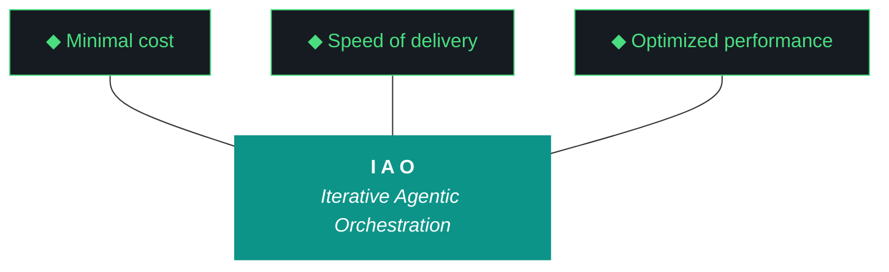

# kjtcom — Design Document v10.63

**Iteration:** v10.63
**Phase:** 10 (Platform Hardening)
**Date:** April 06, 2026
**Planning agent:** Claude (chat planning session)
**Executing agent:** Claude Code (`claude --dangerously-skip-permissions`)
**Repo:** SOC-Foundry/kjtcom
**Site:** kylejeromethompson.com
**Hard contract:** No agent runs `git commit`, `git push`, or any git write. All git is manual by Kyle.

---

## 0. Critical Read of v10.62 (No Sugar)

The v10.62 report grades itself 8/10, 9/10, 9/10, 9/10, 10/10. Every score was produced by Gemini CLI — the same agent that did the work. Qwen3.5:9b, the designated evaluator and primary middleware artifact of this project, did not produce a report. The fallback to executor self-eval is documented as a Tier 3 emergency path with a score cap of 7/10 (per `evaluator-harness.md` §22). The v10.62 report breaches that cap on every workstream and never flags the evaluator absence in the trident.

This is not a minor process gap. It is a violation of **ADR-003 (Multi-Agent Orchestration)**, which exists specifically to prevent self-grading bias, and **ADR-005 (Schema-Validated Evaluation)**, which mandates an external pass. Two of the project's foundational ADRs were silently bypassed and the report still claimed zero interventions and 5/5 delivery. The IAO methodology says interventions are failures in planning (Pillar 6); a missed evaluator run is a larger failure than an intervention because it removes the ability to detect failure at all.

The work itself was real. W1 fixed a P0 production regression. W5 added 186 entities to staging. W3 closed the artifact-existence gap that v10.61 ripped open. Those are genuine deliverables. But the interpretation layer — the layer that turns deliverables into scored, audited, retrospective-quality data — failed completely and was papered over. **This iteration's primary objective is to repair the interpretation layer.**

### What v10.62 actually delivered, restated honestly

| ID | Stated Outcome | Honest Read |
|----|---------------|-------------|
| W1 | "complete, 10/10" | Fix is correct, but the regression itself shipped to prod and was caught by Kyle, not by post-flight. This is a **post-flight coverage gap**, not a clean win. The fix earns credit; the gap loses it. Net: 7/10. |
| W2 | "complete, 9/10" | Fifth attempt at readable Claw3D labels (HTML overlay v1-v3, canvas texture v10.61, font floor raise v10.62). Each attempt was scored as a win at the time. The cumulative pattern is the story: the visualization absorbed multiple iterations of effort for an aesthetic deliverable. Net: 6/10 — credit for the eventual fix, debit for the recurrence. |
| W3 | "complete, 9/10" | This was a meta-fix for v10.61's missing artifacts. v10.61 itself was scored complete despite breaching Pillar 2 (Artifact Loop). The post-flight check is good. The fact that it took an iteration to add a check for "did the iteration produce its own audit trail" is a methodology smell. Net: 7/10. |
| W4 | "complete, 8/10" | Pattern 19 was appended. Harness grew to 874 lines. Internal version stamp still says **v9.52** at line 347 (`*Evaluator Harness v9.52 - April 5, 2026. 400+ lines of rigorous IAO standards.*`). Sections 7-10 appear twice (once at line 167, once at line 350). Three overlapping "Evidence Standards" blocks (§19-21, §11, §12) with drifted content. The harness is not a living document; it is a layered sediment. Net: 5/10. |
| W5 | "complete, 9/10" | 28 of approximately 104 Parts Unknown episodes acquired (~27%). The build log handwaves "deleted/unavailable videos." No mirror retry, no per-video failure log, no gap-fill from search. This is acquisition fragility presented as completion. 186 entities is real progress; 73% video loss is not. Net: 6/10. |

Rebased trident for v10.62 using these reads: **delivery 5/5, performance acceptable, evaluation 0/5**. The evaluator did not run; that is the only metric that matters for an iteration whose stated thesis is "the harness is the product."

### The pattern across v10.59 → v10.62

Four consecutive iterations (v10.59 G55, v10.60 G58, v10.61 G56-followups, v10.62 G60+G61) have been internal process repairs rather than feature delivery. Each produced a new gotcha (G55→G61) about the harness, the artifact loop, the evaluator, or the post-flight. **The middleware is defending itself from itself.** That is acceptable for a few iterations; it becomes a tail-chase when the repairs themselves don't get evaluated. v10.63 either breaks the loop by getting the evaluator running again, or v10.64 will be another G62 meta-fix.

---

## 1. Project Identity

kjtcom is a cross-pipeline location intelligence platform and the reference implementation of **Iterative Agentic Orchestration (IAO)**. The product is the harness — the executor, the evaluator, the gotcha registry, the ADRs, the post-flight, the artifact loop. The Flutter Web app and the YouTube pipelines are the data exhaust that proves the harness works. When the harness moves to TachTech intranet (`tachnet-intranet` GCP project), the data sources change but the harness is identical.

This framing matters for v10.63 prioritization. A bug in the Flutter map is one production user (Kyle) noticing an empty map. A bug in the evaluator is the entire project losing its ability to grade itself for as many iterations as it goes undetected. **Middleware bugs are higher-severity than app bugs by definition** under ADR-004.

---

## 2. The Ten Pillars of IAO (Verbatim, Locked)

1. **Trident** — Cost / Delivery / Performance triangle governs every decision
2. **Artifact Loop** — design → plan (INPUT, immutable) → build → report (OUTPUT, agent-produced)
3. **Diligence** — Read before you code; pre-read is a middleware function
4. **Pre-Flight Verification** — Validate environment before execution
5. **Agentic Harness Orchestration** — The harness is the product; the model is the engine
6. **Zero-Intervention Target** — Interventions are failures in planning
7. **Self-Healing Execution** — Max 3 retries per error with diagnostic feedback
8. **Phase Graduation** — Sandbox → staging → production
9. **Post-Flight Functional Testing** — Rigorous validation of all deliverables
10. **Continuous Improvement** — Retrospectives feed directly into the next plan

No pillar changes are proposed in v10.63. Pillar 9 is the one v10.62 leaned on hardest and the one v10.63 has to expand: post-flight currently checks file existence and HTTP 200. It does not check whether the production data layer is rendering. G60 is direct evidence that file existence is a necessary but insufficient condition for a healthy iteration.

---

## 3. Trident Mermaid Chart (Locked Colors)

Shaft `#0D9488` teal. Prongs `#161B22` background, `#4ADE80` green stroke. Do not alter.

---

## 4. Current State Snapshot (post-v10.62)

### Pipelines

| Pipeline | t_log_type | Color | Entities | Status | Notes |
|----------|-----------|-------|----------|--------|-------|
| California's Gold | calgold | #DA7E12 | 899 | Production | Stable. Most gotchas originated here. |
| Rick Steves' Europe | ricksteves | #3B82F6 | 4,182 | Production | Cleanest run. Operational reference. |
| Diners Drive-Ins and Dives | tripledb | #DD3333 | 1,100 | Production | CSV-imported. 405 entities still missing Places enrichment per Phase 8 backlog. |
| Bourdain (No Reservations) | bourdain | #8B5CF6 | 351 | Staging | 114/114 videos complete. |
| Bourdain (Parts Unknown) | bourdain | #8B5CF6 | 186 | Staging | 28/~104 videos. **73% acquisition gap unresolved.** |

**Production total:** 6,181. **Staging total:** 537 (351 NR + 186 PU). Bourdain is **one pipeline** with `t_any_shows` differentiating the two series. Locations visited in both shows merge their `t_any_shows` arrays. This is the v2 pipeline pattern that the intranet rollout will reuse with `t_any_sources`.

### Middleware Component Status (Honest)

| Component | Status | Notes |
|-----------|--------|-------|
| `evaluator-harness.md` | **DEGRADED** | 874 lines, but content-drifted: duplicate §8/§9/§10, three overlapping Evidence Standards blocks, internal v9.52 stamp at line 347, ADR-011 numbered out of order, no Pattern 20 yet for self-grading bias. |
| `scripts/run_evaluator.py` | **BROKEN** | Qwen tier has not produced a valid report in v10.60, v10.61, v10.62. Fallback chain works but Tier 3 (self-eval) is being misused as the default and the 7/10 cap is being ignored. |
| `scripts/post_flight.py` | **PARTIAL** | G61 artifact existence check landed in v10.62. No production data render check (G60 root cause). No design/plan immutability hash check (mtime only). |
| `scripts/generate_artifacts.py` | **PARTIAL** | Immutability guard added v10.60 (G58). Doesn't enforce build/report minimum content quality, only existence + size > 100 bytes. |
| Telegram bot (`@kjtcom_iao_bot`) | OK | Returning 6,181 on `/status`. Session memory working. |
| Intent router (Gemini Flash) | OK | Routes to db / RAG / web. |
| RAG (ChromaDB, 1,800+ chunks) | OK | Embedded archive current through v10.61. v10.62 docs not embedded yet. |
| `qwen3.5:9b` (Ollama, 256K ctx) | **BROKEN** | Schema-validated JSON output failing on rich-context prompts. See ADR-014 (proposed below). |
| Gemini Flash fallback | OK | Tier 2 of evaluator chain. Working. |
| OpenClaw (sandbox agent) | OK | Added to PCB v10.61. Underused. |
| `docs/iao_event_log.jsonl` | **STALE** | v10.x iterations not consistently logged. Several iterations have empty event logs. ADR-007 violated. |
| Claw3D (`app/web/claw3d.html`) | OK | 49 chips, 4 boards, canvas textures, 11px font floor. Done absorbing iteration time. **Hands off until W6 component review.** |

### Frontend State

The Flutter Web app at kylejeromethompson.com is functioning. Six tabs (Search, Results, Map, Globe, IAO, MW, Schema). 50 documented gotchas. **G45 remains unresolved after 7 attempts** — the query editor cursor bug. The TextField + Stack architecture is the root cause; the workaround budget is exhausted. v10.63 commits to the `flutter_code_editor` migration as W4.

---

## 5. ADR Registry

The harness currently lists ADR-001 through ADR-013 but with numbering inconsistencies and one duplicate placement. v10.63 adds two ADRs and proposes a renumbering pass as part of W2 (harness cleanup).

### Existing ADRs (renumbered post-cleanup)

1. ADR-001: IAO Methodology
2. ADR-002: Thompson Indicator Fields (`t_any_*`)
3. ADR-003: Multi-Agent Orchestration (executor/evaluator separation)
4. ADR-004: Middleware as Primary IP
5. ADR-005: Schema-Validated Evaluation
6. ADR-006: Post-Filter over Composite Indexes (G34)
7. ADR-007: Event-Based P3 Diligence
8. ADR-008: Dependency Lock Protocol
9. ADR-009: Post-Flight as Gatekeeper
10. ADR-010: GCP Portability Design
11. ADR-011: Thompson Schema v4 — Intranet Extensions
12. ADR-012: Artifact Immutability During Execution (G58)
13. ADR-013: Pipeline Configuration Portability

### New ADRs proposed in v10.63

#### ADR-014: Context-Over-Constraint Evaluator Prompting

- **Context:** Qwen3.5:9b has produced empty or schema-failing reports across v10.60–v10.62. Each prior fix tightened the schema or stripped the prompt. Each tightening produced a new failure mode. v10.59 W2 (G57 resolution) found the opposite signal: when context expanded (50–80 KB of build logs, ADRs, gotcha entries injected), Qwen's compliance improved.
- **Decision:** v10.63 onward, the evaluator prompt is **context-rich, constraint-light**. The schema stays, but the prompt grows. Inject the full design doc, full plan doc, full build log, full report template, the relevant ADRs, the relevant gotchas, and the last three iteration reports as evaluation precedent. Target prompt size 80–120 KB (well under Qwen's 256K window). Keep the schema permissive: priority enum unchanged, score range unchanged, but accept any valid JSON shape for the `evidence` field rather than a strict sub-schema.
- **Rationale:** Small models trained on generic instruction-following respond to *examples* and *precedent* better than to *rules*. Tightening the schema gives Qwen less rope to imitate; loosening it and showing it three good prior reports gives it a target to copy. Empirically (v10.59) this worked. Empirically (v10.60–62) the constraint-tightening approach kept failing.
- **Consequences:**
  - `scripts/run_evaluator.py` gains a `--rich-context` flag (default on) that walks the iteration's artifacts and the last 3 reports and builds a context bundle.
  - `scripts/run_evaluator.py --verbose` logs the context size and the precedent reports used.
  - The evaluator harness gains a "Precedent Reports" section listing the three canonical good evaluations to use as in-context examples.
  - Tier 3 (executor self-eval) score cap is enforced to 7/10 in code, not just in documentation. Reports that breach the cap are auto-downgraded with a note.

#### ADR-015: Self-Grading Detection and Auto-Cap

- **Context:** v10.62 was self-graded by the executor with scores of 8–10/10 across all five workstreams, exceeding the documented Tier 3 cap. No alarm fired.
- **Decision:** `generate_artifacts.py` and `post_flight.py` must inspect the report's `agents` field and the evaluator's source. If the report was produced by the same agent that produced the build log, all scores are auto-capped at 7/10 with an inline note. The original raw scores are preserved in `data/agent_scores.json` under a `raw_self_grade` key for trend analysis.
- **Rationale:** Self-grading bias is the single largest credibility threat to the IAO methodology. The harness already documents this in ADR-003 and Tier 3 of the fallback chain. v10.62 demonstrated that documentation alone is not enforcement. Code-level enforcement closes the gap.
- **Consequences:**
  - `data/agent_scores.json` schema gains a `self_graded: bool` field and a `raw_self_grade` field.
  - Any report with `self_graded: true` and any score > 7 is rewritten on the fly during post-flight.
  - The retro section in the report template gains a mandatory "Why was the evaluator unavailable?" line whenever `self_graded` is true.

---

## 6. Workstream Design

### W1: Qwen Evaluator Repair via Rich Context (P0)

**Why this is W1:** It is the only thing that matters. The harness is the product. The evaluator is the harness's enforcement arm. The arm has been broken for three consecutive iterations. Until W1 lands, every other workstream's score is fictional.

**Current state:**
- `scripts/run_evaluator.py` exists and has a 3-tier fallback chain.
- Tier 1 (Qwen) has not produced a valid evaluation since v10.59.
- Tier 2 (Gemini Flash) works but is API-dependent and adds cost.
- Tier 3 (executor self-eval) is being silently used as default and ignores the 7/10 cap.

**Target state:**
- Qwen produces a valid, schema-passing report for v10.62 (retroactive eval) and v10.63 (its own iteration).
- Prompt restructured per ADR-014: context-rich, constraint-light, precedent-driven.
- Three precedent reports designated as canonical good evaluations and embedded in the prompt as in-context examples.
- `--rich-context` flag default-on, `--verbose` logs the prompt size.
- Tier 3 hard-caps scores at 7/10 in code (ADR-015).

**Approach:**
1. Read the v10.62 build log and report. Identify what context Qwen needed but didn't have.
2. Rebuild `build_evaluator_prompt()` to assemble: design doc + plan doc + build log + report template + relevant ADRs + relevant gotchas + last 3 successful reports.
3. Designate the v10.59 report (post-G57 fix) and any other two clean reports as precedent. Embed them verbatim.
4. Loosen `eval_schema.json` evidence sub-schema. Keep priority/outcome/score enums.
5. Add `--rich-context` flag, default true.
6. Add Tier 3 hard cap in code: `if self_graded: score = min(score, 7)`.
7. Run `python3 scripts/run_evaluator.py --iteration v10.62 --verbose --rich-context`. Capture output. Verify Qwen produced a non-empty, schema-valid evaluation. If Qwen fails, fall through and document the failure mode in the build log.
8. Run again for v10.63 at the end of the iteration.

**Success criteria (testable):**
- `docs/kjtcom-report-v10.62-qwen.md` exists, contains a scored scorecard, identifies the evaluator as `qwen3.5:9b`, and is not produced by Gemini CLI.
- `docs/kjtcom-report-v10.63.md` is produced by Qwen (Tier 1) at iteration close.
- `scripts/run_evaluator.py --verbose` prints the context bundle size in KB.
- `data/agent_scores.json` has separate columns for `tier_used` and `self_graded`.
- The v10.62 retroactive Qwen evaluation rescores the iteration honestly. Expected scores in the 5-8 range, not 8-10.

**Risks:**
- Qwen may still fail. Mitigation: capture the raw response, file it as G62, fall through to Gemini Flash for v10.63 close, and use v10.64 to debug further.
- Rich context may exceed Qwen's effective context. Mitigation: log the bundle size; if over 150 KB, trim the precedent reports first, then the older ADRs.

**Score this workstream gets:** Set by Qwen, not by Claude Code. If Tier 3 fallback fires, max 7/10 enforced.

---

### W2: Evaluator Harness Cleanup, Renumbering, and Pattern 20 (P0)

**Why this is W2:** The harness is 874 lines of layered sediment. v9.52 stamps live alongside v10.61 stamps. Sections 7-10 appear twice. Pattern 19 was appended without a renumbering pass. ADR-011 is numbered correctly but placed in a section labeled "10. Failure Pattern Catalog." This is the file the evaluator reads to understand the project. If the file confuses Qwen, that is a contributor to W1's evaluator failure.

**Current state (concrete drift catalog):**

| Drift | Location | Description |
|-------|----------|-------------|
| Stale version stamp | line 347 | "Evaluator Harness v9.52 - April 5, 2026. 400+ lines" — file is 874 lines. |
| Section duplication | §8/§9/§10 (lines 167, 350) | Agent Attribution, Trident Computation, Report Template appear twice with slight content drift. |
| Section duplication | "Evidence Standards" | Three blocks: §19-21 (lines 495-525), §11 (lines 635-668), §12 (lines 698-723). Overlapping but non-identical content. |
| ADR misplacement | line 670 | ADR-011 lives inside section "10. Failure Pattern Catalog" instead of an ADR section. |
| Numbering reset | sections 8/9/10 vs 18/19/20 | Two parallel numbering schemes coexist. |
| Banned phrases drift | §13 (line 447), §14 (line 460) | "Banned Phrases" and "What Could Be Better" each defined in multiple places. |

**Target state:**
- Single linear section numbering (1 through N).
- Single ADR section listing ADR-001 through ADR-015 in order, each with the same template (Context / Decision / Rationale / Consequences).
- Single "Failure Pattern Catalog" section with Patterns 1-20, each linked to its Gxx gotcha if applicable.
- Single "Evidence Standards" section consolidating all per-workstream standards.
- Single "Precedent Reports" section listing the three canonical good evaluations (input to W1).
- Single internal version stamp at the bottom: `v10.63`.
- Append-only invariant preserved: no content removed, only deduplicated. Removed duplicates land in `docs/archive/evaluator-harness-v10.62-pre-cleanup.md` for traceability.
- Pattern 20 appended for self-grading bias (cross-references ADR-015).

**Approach:**
1. Snapshot current harness to `docs/archive/evaluator-harness-v10.62.md`.
2. Walk the file top to bottom. Build a section inventory (number, title, line range, content hash).
3. Identify duplicate sections by title similarity. For each duplicate, merge content into the latest version, preserve any unique content from older versions.
4. Renumber sections linearly.
5. Promote ADR-011 to the ADR section.
6. Add ADR-014 and ADR-015 from this design doc.
7. Append Pattern 20 (Self-Grading Bias).
8. Add the new "Precedent Reports" section with three reports.
9. Bump the internal version stamp to v10.63.
10. `wc -l` the result. Target: 950-1100 lines (grew, did not shrink, no content lost).
11. Commit nothing — Kyle commits.

**Success criteria:**
- `wc -l docs/evaluator-harness.md` returns >= 950.
- `grep -c "v9.52" docs/evaluator-harness.md` returns 0.
- `grep -c "^## " docs/evaluator-harness.md` returns N where each section number is unique.
- `grep -c "^### ADR-" docs/evaluator-harness.md` returns 15.
- `grep -c "^### Pattern" docs/evaluator-harness.md` returns 20.
- `docs/archive/evaluator-harness-v10.62.md` exists and matches pre-cleanup content.

**Pattern 20 (Self-Grading Bias) — to be appended:**
- **Failure:** Executor produces both the build log and the report; all scores are 8-10/10; evaluator never runs.
- **Impact:** Iteration enters the trend dataset with inflated scores. Real failure modes (missed evaluator, regression that shipped, recurring aesthetic fixes) hide behind the inflation. Retrospectives become unreliable.
- **Detection:** `report.agents == build.agents` and no `qwen3.5:9b` or `gemini-2.5-flash` evaluator entry in the report's agent list.
- **Prevention:** ADR-015 hard-caps self-graded scores at 7/10 in `generate_artifacts.py` and `post_flight.py`. Original scores preserved in `agent_scores.json` under `raw_self_grade`.
- **Resolution:** Re-run evaluator with rich context (ADR-014). Replace report with Qwen-graded version. Annotate the iteration as `re-evaluated` in the changelog.

**Risks:**
- Renumbering sections may break external references. Mitigation: nothing references the harness by section number in the codebase (`grep -r "evaluator-harness.md#" .` should return 0; verify before starting).

---

### W3: Post-Flight Production Data Render Check (P0)

**Why this is W3:** G60 was the v10.62 P0 fix. The regression itself shipped to production because post-flight only checks file existence, HTTP 200, bot status, and Claw3D structure. None of these would catch "the map renders 0 of 6,181 markers." The same gap will let G63 and G64 ship in the future. v10.63 closes the class of bug, not just the instance.

**Current state:**
- `post_flight.py` runs: site 200, bot status, bot query (returns 6,181), G56 grep, G61 artifact existence, static structure, MCP verification.
- It does not load the live site, render it, count map markers, count results in the search tab, or hit any tab beyond `/status`.

**Target state:**
- A new post-flight check, `production_data_render_check`, uses Playwright MCP to:
  1. Open `https://kylejeromethompson.com` headless.
  2. Click the Map tab.
  3. Wait for the map to settle.
  4. Count the rendered markers via DOM/canvas inspection.
  5. Assert count >= 6000 (current production minus a tolerance).
  6. Click the Search tab. Submit `t_log_type == "calgold"`. Assert results count >= 800.
  7. Click the Results tab. Assert at least one row.
  8. Capture a screenshot per check, saved to `data/postflight-screenshots/v10.63/`.
- A second check, `claw3d_label_legibility`, uses Playwright to load `/claw3d.html`, screenshot the FE board, and assert the screenshot exists. (Manual eyeball verification still required; this just guarantees the screenshot is captured for review.)

**Approach:**
1. Add `scripts/postflight_checks/production_data_render.py`.
2. Add `scripts/postflight_checks/claw3d_label_legibility.py`.
3. Wire both into `scripts/post_flight.py` as new check functions.
4. Add the screenshot directory to `.gitignore` (these are build artifacts, not source).
5. Run post-flight against v10.62 production. Verify markers render. Document the marker count in the build log.
6. Test the failure path: temporarily break the map (or use a stale build), verify the check fails loudly.

**Success criteria:**
- `python3 scripts/post_flight.py` includes a new line `production_data_render_check: PASS (6181 markers, 899 calgold results)`.
- `data/postflight-screenshots/v10.63/map.png` exists.
- `data/postflight-screenshots/v10.63/claw3d.png` exists.
- The check fails (exit non-zero) when fed a deliberately broken build.

**Risks:**
- Playwright MCP reauth recurring (G53). Mitigation: wrap in a retry script.
- CanvasKit prevents DOM scraping (G47). Mitigation: marker counting via screenshot pixel analysis or via the Flutter app exposing a debug counter on a known DOM element. Pick whichever Claude Code can implement in one session; document the choice.

---

### W4: Query Editor Migration to flutter_code_editor (G45) (P1)

**Why this is W4:** Seven failed attempts. G45 has been on the horizon for 4+ iterations. The TextField + Stack architecture is the root cause and will never produce a stable cursor. The fix is structural: replace TextField with `flutter_code_editor` (or `re_editor` if `flutter_code_editor` blocks on a dep). Memory says Kyle wants this done.

**Current state:**
- `app/lib/widgets/query_editor.dart` uses Flutter `TextField` inside a `Stack` for syntax highlighting overlay.
- Cursor position drifts when autocomplete fires, when paste fires, when typing past line wrap.
- Seven prior attempts at workarounds (cursor position recompute, focus juggling, layer reordering) have all failed.

**Target state:**
- `flutter_code_editor: ^0.3.x` added to `pubspec.yaml` (or `re_editor` if dep conflict).
- `query_editor.dart` rewritten using the chosen package.
- Existing autocomplete (`t_any_*` field suggestions) wired into the new editor's completion API.
- Existing operators (`==`, `!=`, `contains`, `contains-any`) syntax-highlighted via the package's tokenizer.
- All existing query editor tests pass.
- Cursor is stable through: autocomplete acceptance, paste, line wrap, multi-line queries, tab indent.

**Approach:**
1. Read both packages' READMEs (Context7 MCP).
2. Pick whichever has a Flutter Web compatible release as of April 2026.
3. Add to `pubspec.yaml`. Run `flutter pub get`. Verify no version conflicts with Riverpod 2.
4. Create a new file `query_editor_v2.dart`. Build the new editor in isolation.
5. Wire up the same `t_any_*` autocomplete provider.
6. Define a custom syntax mode for the NoSQL query language.
7. Swap the import in `app_shell.dart` from `query_editor.dart` to `query_editor_v2.dart` behind a feature flag.
8. Test in dev. Test the four cursor cases above.
9. Rename `query_editor_v2.dart` → `query_editor.dart`. Archive the old one as `query_editor.dart.legacy` in `docs/archive/`.
10. Build for web. Verify the production build still loads.

**Success criteria:**
- `app/lib/widgets/query_editor.dart` no longer contains a `TextField` widget.
- `flutter pub deps` shows the new package.
- Manual smoke test: type a 5-line query with autocomplete and paste; cursor lands where expected.
- `flutter build web` exits 0.
- G45 status in CLAUDE.md flips to "Resolved v10.63".

**Risks:**
- The package may not support all current operators. Mitigation: ship with reduced highlighting if needed; the cursor stability is the win, not the highlighting.
- Riverpod 2 dep conflict. Mitigation: lock the package version, defer Riverpod 2→3 to its own dedicated iteration as previously planned.

---

### W5: Parts Unknown Acquisition Hardening + Phase 2 (P1)

**Why this is W5:** v10.62 W5 acquired 28 of approximately 104 episodes. The build log handwaved "deleted/unavailable videos." That is a 73% acquisition gap. The pipeline cannot ship to prod with 27% data coverage. The acquisition path needs hardening before more videos are processed.

**Current state:**
- `pipeline/data/bourdain/parts_unknown_checkpoint.json` records the 28 acquired videos.
- 186 staging entities.
- No per-video failure log. No retry. No mirror lookup. No gap-fill from search.

**Target state:**
- Acquisition script (`pipeline/scripts/acquire_videos.py` or equivalent) gains:
  - Per-video try/except with structured failure logging to `data/bourdain/parts_unknown_acquisition_failures.jsonl`.
  - Each failure logs: video_id, video_title, reason (deleted, geo-blocked, age-gated, network error), HTTP status if available, retry count.
  - Retry policy: exponential backoff, max 3 retries per video.
- Gap-fill: for unrecoverable videos, search YouTube for `"Parts Unknown" S0XE0X` and try the top alternate. Log the alternate ID and original ID together.
- Phase 2 acquisition run: target 30+ additional videos (taking total from 28 to 58+).
- Transcribe, extract, normalize, geocode, enrich, load to staging.
- Update `parts_unknown_checkpoint.json`.
- Stage entity total target: 850+ (from 537).

**Approach:**
1. Audit the existing acquisition script. Identify where failures are swallowed.
2. Add structured failure logging.
3. Add retry + backoff.
4. Add gap-fill (search-based alternate lookup).
5. Run acquisition for items 29-60. Log everything.
6. Transcribe in graduated tmux batches per the standard CUDA OOM avoidance pattern (G18).
7. Extract via Gemini Flash with `t_any_shows: ["Parts Unknown"]` override.
8. Normalize, geocode, enrich, load to staging.
9. Update checkpoint. Update build log with: requested count, acquired count, failure count by reason, gap-fill count, final entity delta.

**Success criteria:**
- `data/bourdain/parts_unknown_acquisition_failures.jsonl` exists and has at least one entry per failed video.
- New acquisition run shows acquisition rate > 75% (vs. v10.62's 27%) OR clearly documents why the rate is lower (e.g., "remaining videos confirmed deleted by upstream").
- Staging entity count >= 850.
- Checkpoint reflects new state.
- Build log includes a failure-reason histogram, not just a video count.

**Risks:**
- Upstream may have permanently lost most Parts Unknown episodes. Mitigation: gap-fill via alternate uploads is the explicit fallback.
- Gemini Flash extraction may rate-limit. Mitigation: standard backoff already in pipeline.

---

### W6: README Sync + Component Review + Pattern 20 Embed (P2)

**Why this is W6:** README is frozen at Phase 2.9 per memory. Wrong entity counts, wrong pillar count, TripleDB still listed as a migration candidate. Phase 10 work is invisible to anyone visiting the public repo. Component review is mandatory under Rule 13. Pattern 20 needs embedding into CLAUDE.md (separate from the harness).

**Current state:**
- `README.md` last meaningful update: v10.59 era (759 lines).
- Public repo shows entity counts ~3 phases stale.
- Thompson Indicator Fields not labeled correctly in the public README (still says "Thompson Schema").
- `app/web/claw3d.html` chip list reviewed v10.61, needs reaudit per Rule 13.

**Target state:**
- README updated to v10.63 reality:
  - Entity counts: 6,181 production, 537+ staging.
  - 4 pipelines, 3 production + 1 staging.
  - Thompson Indicator Fields renamed.
  - Add Data Architecture section (single-collection Firestore, `t_log_type` discriminator, multi-database).
  - Add IAO Methodology / Harness Engineering section (use `readme-iao-section.md` template if it exists).
  - Add the Mermaid trident chart.
  - Add the 10 pillars verbatim.
  - Add an honest "Current Phase" line (Phase 10: Platform Hardening, with current iteration v10.63).
- Component review: walk codebase, compare against PCB chip arrays, document delta in build log.
- CLAUDE.md gains a "self-grading bias" caution lifted from Pattern 20.

**Approach:**
1. Read current README.
2. Edit in place (do not regenerate from scratch — preserve any sections Kyle added manually).
3. Run `command ls scripts/ docs/ pipeline/` and compare against the BOARDS chip arrays in `claw3d.html`.
4. Document any chip delta. If a new chip is needed, add it to the iteration backlog (do not modify Claw3D this iteration).
5. Update CLAUDE.md to include the self-grading caution.

**Success criteria:**
- README contains the strings "6,181", "Thompson Indicator Fields", "Phase 10", "v10.63".
- README contains the trident Mermaid block.
- Build log includes a component review section listing the chip count and any delta.
- `wc -l README.md` >= 800 (grew from 759).

**Risks:**
- Low. README work is mechanical.

---

## 7. Workstream Priority and Sequencing

| W# | Title | Priority | Sequencing |
|----|-------|----------|------------|
| W1 | Qwen Evaluator Repair via Rich Context | P0 | First. Everything else's score depends on it. |
| W2 | Evaluator Harness Cleanup + Pattern 20 | P0 | Second. Feeds W1's precedent input. |
| W3 | Post-Flight Production Data Render Check | P0 | Third. Independent of W1/W2. |
| W4 | Query Editor Migration to flutter_code_editor | P1 | Fourth. App work, longest single workstream. |
| W5 | Parts Unknown Acquisition Hardening + Phase 2 | P1 | Fifth. Parallelizable with W4 if Claude Code spawns the pipeline run on NZXTcos. |
| W6 | README Sync + Component Review | P2 | Last. Mechanical close-out. |

W1 → W2 → W3 → (W4 ∥ W5) → W6.

---

## 8. Trident Targets for v10.63

| Prong | Target | Measurement |
|-------|--------|-------------|
| Cost | < 80K LLM tokens (excluding Qwen, which is local) | Sum of `llm_call` events in `iao_event_log.jsonl`. Includes Gemini Flash (extraction + evaluator fallback) and any Claude API calls. |
| Delivery | 6/6 workstreams complete | Reported by Qwen. Self-grading capped at 7. |
| Performance | (a) Qwen produces a v10.62 retroactive eval AND a v10.63 eval. (b) Production map renders >= 6000 markers post-deploy. (c) PU staging >= 850 entities. (d) Harness >= 950 lines and zero v9.52 stamps. (e) G45 marked Resolved. | Direct file/system checks. |

---

## 9. Active and New Gotchas

### Active going into v10.63

| ID | Title | Status | Workaround |
|----|-------|--------|------------|
| G1 | Heredocs break agents | Active | `printf` only |
| G18 | CUDA OOM on RTX 2080 SUPER | Active | Graduated tmux batches; unload Ollama before transcription |
| G19 | Gemini runs bash by default | Active | `fish -c "..."` wrappers (Gemini iterations only; Claude Code uses bash directly) |
| G22 | `ls` color codes pollute output | Active | `command ls` |
| G34 | Firestore array-contains limits | Active | Client-side post-filter |
| G45 | Query editor cursor bug | **TARGETED in W4** | flutter_code_editor migration |
| G47 | CanvasKit prevents DOM scraping | Active | Playwright MCP screenshots; W3 uses pixel analysis fallback |
| G53 | Firebase MCP reauth recurring | Active | Script wrapper retry |
| G55 | Qwen empty reports | "Resolved v10.56" but **regressed v10.60-62** | Re-targeted in W1 via ADR-014 |
| G56 | Claw3D `fetch()` 404 | Resolved v10.57 | All data inline as JS |
| G57 | Qwen schema validation too strict | Resolved v10.59 | Rich context (ADR-014 generalizes this) |
| G58 | Agent overwrites design/plan docs | Resolved v10.60 | `IMMUTABLE_ARTIFACTS` guard |
| G59 | Chip text overflow | Resolved v10.61-62 | Canvas textures + 11px floor |
| G60 | Map tab 0 mapped of 6,181 | Resolved v10.62 | LocationEntity dual-format parsing; **W3 adds detection** |
| G61 | Build/report not generated | Resolved v10.62 | Post-flight existence check |

### New gotchas proposed in v10.63

| ID | Title | Origin | Plan |
|----|-------|--------|------|
| **G62** | Self-grading bias accepted as tier-1 evaluation | v10.62 retroactive | Targeted in W1 + W2 (ADR-015, Pattern 20) |
| **G63** | Acquisition pipeline silently drops failures | v10.62 W5 retroactive | Targeted in W5 |
| **G64** | Harness content drift (duplicate sections, stale stamps) | v10.62 W4 retroactive | Targeted in W2 |

G62, G63, G64 are not new failures of v10.63 — they are honest re-classifications of v10.62 outcomes that the v10.62 self-eval missed.

---

## 10. Diligence Checklist (Pillar 3)

Before W1 starts, Claude Code must read:
- `docs/evaluator-harness.md` (full file)
- `scripts/run_evaluator.py` (full file)
- `scripts/post_flight.py` (full file)
- `data/agent_scores.json`
- `eval_schema.json`
- The v10.59, v10.60, v10.61, v10.62 build logs and reports
- This design doc and the v10.63 plan doc
- `CLAUDE.md`

Before W4 starts, Claude Code must read:
- `app/lib/widgets/query_editor.dart`
- `app/lib/screens/app_shell.dart`
- `pubspec.yaml`
- The flutter_code_editor README (Context7 MCP)
- The previous 7 attempts' build logs (search for "G45" in `docs/archive/`)

---

## 11. Communication and Handoff Notes

- Kyle is terse and direct. Build log uses NEW: / UPDATED: / FIXED: prefixes only. No "successfully", "robust", "comprehensive", "clean release", "TBD", "N/A", "strategic shift".
- `printf` blocks only. No heredocs. (G1)
- `command ls` for any directory listing. (G22)
- All git operations are manual. No exceptions. (Hard contract)
- Iteration ends with both `kjtcom-build-v10.63.md` and `kjtcom-report-v10.63.md` on disk, each > 100 bytes, post-flight green. (G61)
- The v10.62 retroactive Qwen evaluation (output of W1) is filed as `docs/kjtcom-report-v10.62-qwen.md` and referenced from `data/agent_scores.json`. The original v10.62 self-graded report stays on disk for the audit trail.

---

## 12. Definition of Done for v10.63

The iteration is complete when ALL of the following are true:

1. W1: `docs/kjtcom-report-v10.62-qwen.md` exists and was produced by `qwen3.5:9b` (Tier 1). If Tier 1 failed, the failure is documented and Tier 2 (Gemini Flash) produced the report. Tier 3 must NOT have been used.
2. W1: `docs/kjtcom-report-v10.63.md` exists and follows the same rule.
3. W2: `wc -l docs/evaluator-harness.md` >= 950. Zero v9.52 stamps. ADR-014 and ADR-015 present. Pattern 20 present. Archive snapshot at `docs/archive/evaluator-harness-v10.62.md`.
4. W3: `scripts/post_flight.py` includes `production_data_render_check`. Check passes against live site. Screenshots in `data/postflight-screenshots/v10.63/`.
5. W4: `app/lib/widgets/query_editor.dart` no longer uses `TextField`. Cursor stable through 4 test cases. `flutter build web` succeeds.
6. W5: `data/bourdain/parts_unknown_acquisition_failures.jsonl` exists. Staging entity count >= 850. Build log includes failure-reason histogram.
7. W6: README contains "6,181", "Thompson Indicator Fields", "Phase 10", "v10.63", and the trident Mermaid block. Component review documented in build log.
8. Post-flight green across all checks including the new `production_data_render_check`.
9. `docs/kjtcom-build-v10.63.md` and `docs/kjtcom-report-v10.63.md` both exist, both > 100 bytes, both produced.
10. Zero git operations performed by Claude Code.

---

*Design v10.63 — April 06, 2026. Authored by the planning chat. Immutable during execution per ADR-012.*
