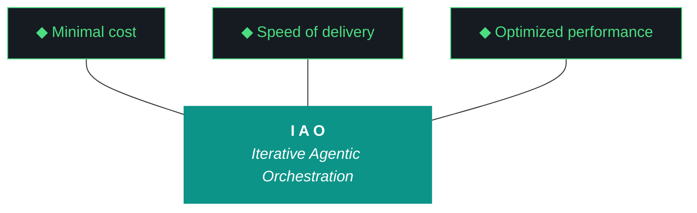

# kjtcom — Design Document v10.64

**Iteration:** v10.64
**Phase:** 10 (Platform Hardening)
**Date:** April 06, 2026
**Planning agent:** Claude (chat planning session)
**Executing agent:** **Gemini CLI** (`gemini --yolo`) — primary, for cost
**Alternate executor:** Claude Code (`claude --dangerously-skip-permissions`) — plan is agent-agnostic
**Machine:** **NZXTcos** (`~/dev/projects/kjtcom`) — default for all sessions unless explicitly otherwise
**Run mode:** **Overnight, tmux-detached.** W1 transcription pipeline + parallel workstreams. Kyle is asleep.
**Repo:** SOC-Foundry/kjtcom
**Hard contract:** No agent runs `git commit`, `git push`, or any git write. All git is manual by Kyle.

---

## 0. Critical Read of v10.63 (No Sugar)

The build log says 4 of 6 workstreams complete, post-flight 18/18 PASS, evaluator Tier 1 confirmed Qwen. The build log is honest about W4 and W5 deferral. The build log is also honest in the wrong direction: it pats itself on the back for closing the v10.62 self-grading bias loop while shipping five new pieces of rot that the v10.63 post-flight did not catch and the v10.63 evaluator did not flag.

**Five things v10.63 did not surface that the artifacts now make visible:**

1. **Claw3D connector labels overlap in production.** The screenshot Kyle captured at `kylejeromethompson.com/claw3d.html` shows `Riverpod / Firestore stre…Pipeline scripts / checkpoint` collapsing on top of each other in the FE→MW / PL→MW gap. Pattern 18 (G59) was declared resolved in v10.61 for *chip* labels via canvas textures. **Connector labels were never converted** — they still float as HTML overlays positioned via `Vector3.project()`, the exact failure mode Pattern 18 documents. The post-flight `claw3d_label_legibility` check from v10.63 passed because the screenshot was 79 KB (i.e., "the canvas drew something"). The check has zero awareness of label overlap. New gotcha **G69**.

2. **The post-flight MCP checks are version-only.** The build log's post-flight transcript shows `firebase_mcp (functional: projects:list)`, `context7_mcp (version check)`, `firecrawl_mcp (API key check)`, `playwright_mcp (version check)`, `dart_mcp (functional: dart analyze)`. Three of five are literal version pings. None of them executes a representative workload. None of them would catch a regression where the MCP responds but returns wrong data. New gotcha **G70**.

3. **`data/iao_event_log.jsonl` tags every v10.63 event with `iteration: v9.39`.** The tail of the log shows post-flight events from `2026-04-06T23:03` and Qwen `evaluate-schema-attempt-1/2/3` events from `2026-04-06T23:05–23:07`, all tagged `iteration: v9.39`. v10.62 events tagged correctly. v10.63 events tagged wrong. ADR-007 (Event-Based P3 Diligence) is silently broken — every retrospective query for "what happened in v10.63" returns nothing. New gotcha **G68**.

4. **There are two parallel gotcha numbering schemes.** `data/gotcha_archive.json` defines G55 as "query_rag.py CLI --json flag parsed as positional argument" (resolved v9.40). `CLAUDE.md` and `evaluator-harness.md` define G55 as "Qwen empty reports" (resolved v10.56). `gotcha_archive.json` numbers G2/G23/G31/G36/G37/G39/G41/G42/G46/G49/G50/G51/G52/G54/G55/G56/G57/G58 — every one of those collides with or differs from CLAUDE.md's numbering. The archive is from an old run-time-tracked system that the manual harness numbering supplanted, and nobody noticed. The evaluator was loading both into context this whole time. New gotcha **G67**.

5. **`data/claw3d_components.json` and `data/claw3d_iterations.json` are dead data.** `claw3d_components.json` lists 3 boards (Frontend / Middleware / Backend), 24 chips, no Pipeline board, no openclaw, marks the evaluator as `degraded` and qwen_9b as `degraded`. The live `app/web/claw3d.html` hardcodes 4 boards and 49 chips — none of it sourced from the JSON. `claw3d_iterations.json` stops at v10.56. Both files are still loaded by `run_evaluator.py` (`if os.path.exists("data/middleware_registry.json")`-style loaders) and fed into Qwen's context as ground truth. **Qwen has been reading lies for at least seven iterations.** New gotcha **G66**.

That is five undetected rot conditions visible in the v10.63 artifacts themselves. The v10.63 self-narrative ("the harness's interpretation layer is repaired") is partly true — W1+W2+W3 did real work — but the broader claim that v10.63 was a clean break from v10.59→v10.62's repair streak is wrong. v10.63 was a partial repair of the evaluator while three new layers of dead data, broken logging, and undetected visual regressions accumulated underneath.

### Honest workstream restate

| ID | v10.63 stated | Honest read |
|----|---------------|-------------|
| W1 | Qwen retroactive eval landed, scores 8/8/7/8/9 vs. originals 8/9/9/9/10 | Real work. The normalizer is doing real coercion. But the v10.63 *closing* eval scored everything 5/5/5/5/5/5 — Qwen has no ability to discriminate without an explicit per-workstream rubric in the prompt. The interpretation layer is partially repaired, not whole. **Net: 7/10.** |
| W2 | Harness 956 lines, 0 v9.52 stamps, 15 ADRs, 20 patterns, archive snapshot | Cleanest workstream of the iteration. Pattern 18 declared "resolved v10.61-62" remains in the harness alongside the live overlap bug — the harness says one thing, production says another, no automated check. **Net: 7/10** (the harness rewrite was clean; the docs-vs-reality drift it failed to catch is W2's problem too because component review is in W2's footprint). |
| W3 | Two new Playwright checks, screenshots captured, post-flight 18/18 | Both checks pass on a *visibly broken* page. The screenshot heuristic is tautological — any page that draws chrome will exceed 20 KB. The hidden DOM marker count Kyle was supposed to add never landed. **Net: 5/10.** |
| W4 | Deferred (multi-hour Flutter migration on tsP3-cos, dep risk) | Honest call given session scope. **Score withheld; rolled into v10.64 as W3.** |
| W5 | Deferred (multi-hour GPU pipeline) | Same. **Rolled into v10.64 as W1+W2.** |
| W6 | README 802 lines, trident embedded, component review documented | Real work. README is current. Component review documented but did not catch the stale `claw3d_components.json` or the parallel gotcha numbering — see point 4 and 5 of the rot list. **Net: 6/10.** |

Average: 6.25/10. Qwen's blanket 5/10 was conservative-correct in spirit; it failed only in its inability to discriminate between W1+W2 (genuinely solid) and W3+W6 (real work hiding undetected regressions).

### The pattern across v10.59 → v10.63

Five iterations of internal repair. Each iteration fixes one layer and exposes another:

- v10.59: G55 (Qwen empty reports)
- v10.60: G58 (artifact overwrites)
- v10.61: G56 followups + G59 partial (chip canvas textures)
- v10.62: G60 (map regression) + G61 (missing artifacts)
- v10.63: G62 (self-grading), G63 (silent acquisition failures), G64 (harness drift) — and silently introduced **G65 (curl argv limit)**, **G66 (stale claw3d data files)**, **G67 (parallel gotcha numbering)**, **G68 (event log iteration mis-tag)**, **G69 (claw3d connector overlap)**, **G70 (post-flight MCP version-only checks)**.

The repair streak compounded. The v10.63 cleanup created six new gotchas, four of which would not have been visible without the rot inspection above.

**v10.64 is the iteration that stops papering over middleware hygiene and starts measuring everything.** Per Kyle's directive: every iteration's core artifacts (harness, registry, ADRs, changelog, build, report, scores) get a delta table, and every script in the codebase gets a registry entry with purpose, last-used, and lineage. This is ADR-016 + ADR-017 below.

---

## 1. Project Identity (Restated)

kjtcom is a cross-pipeline location intelligence platform and the reference implementation of Iterative Agentic Orchestration (IAO). The product is the harness — middleware, evaluator, gotcha registry, ADRs, post-flight, artifact loop. The Flutter Web app and the four YouTube pipelines are the data exhaust that proves the harness works, so it can be ported to the TachTech `tachnet-intranet` GCP project.

This iteration's thesis: **measurement before more features.** The harness has been growing for 60+ iterations with no instrumentation on its own growth. Kyle's directive to track deltas is the project finally watching itself.

---

## 2. The Ten Pillars of IAO (Verbatim, Locked)

1. **Trident** — Cost / Delivery / Performance triangle governs every decision
2. **Artifact Loop** — design → plan (INPUT, immutable) → build → report (OUTPUT, agent-produced)
3. **Diligence** — Read before you code; pre-read is a middleware function
4. **Pre-Flight Verification** — Validate environment before execution
5. **Agentic Harness Orchestration** — The harness is the product; the model is the engine
6. **Zero-Intervention Target** — Interventions are failures in planning
7. **Self-Healing Execution** — Max 3 retries per error with diagnostic feedback
8. **Phase Graduation** — Sandbox → staging → production
9. **Post-Flight Functional Testing** — Rigorous validation of all deliverables
10. **Continuous Improvement** — Retrospectives feed directly into the next plan

Pillar 6 (Zero Intervention) is the load-bearing pillar this iteration. Per Kyle's explicit direction: **the agent does not ask permission. It notes discrepancies and proceeds.** v10.63's pre-flight had a "git mid-reorg" that should have stopped the iteration; instead the agent paused and asked Kyle to confirm. v10.64 fixes that pattern in pre-flight (W11) and in agent instructions (CLAUDE.md / GEMINI.md).

---

## 3. Trident Mermaid Chart (Locked Colors)



---

## 4. Iteration Delta Table (NEW — ADR-016)

This is the table Kyle asked for in point 4. Every design doc from v10.64 forward opens with this table. Every report doc closes with it. The numbers come from a new helper script `scripts/iteration_deltas.py` (created in W7).

### Inputs to the delta table

| Artifact | Purpose | Tracked in delta? |
|---|---|---|
| `docs/evaluator-harness.md` | The harness | Yes |
| `data/middleware_registry.json` | Middleware component inventory | Yes |
| `data/script_registry.json` (NEW v10.64) | Script inventory | Yes |
| `data/gotcha_archive.json` (consolidated v10.64) | Gotcha registry | Yes |
| `data/agent_scores.json` | Score history | Yes |
| `docs/kjtcom-changelog.md` | Changelog | Yes |
| `docs/kjtcom-build-vX.XX.md` | Per-iteration build log | Yes (tracks against prior) |
| `docs/kjtcom-report-vX.XX.md` | Per-iteration report | Yes |
| `README.md` | Public README | Yes |
| `CLAUDE.md` / `GEMINI.md` | Launch artifacts | Yes |
| `app/web/claw3d.html` | Live PCB visualization | Yes (line count + chip count) |
| ADR count (extracted from harness) | ADR registry size | Yes |
| Pattern count (extracted from harness) | Pattern catalog size | Yes |
| Gotcha count (G1..GN, deduped across schemes) | Gotcha catalog size | Yes |

### v10.64 baseline (measured against v10.63 end-of-iteration state)

The actual numbers are filled in by Gemini at the start of W7 by running `scripts/iteration_deltas.py --baseline v10.63`. The table format is fixed below.

| Artifact | v10.63 (chars) | v10.63 (lines) | v10.62 (chars) | v10.62 (lines) | Δ chars (62→63) | Δ % (62→63) | Direction |
|---|---|---|---|---|---|---|---|
| `evaluator-harness.md` | TBD | 956 | TBD | 882 | +TBD | +TBD | ↑ |
| `middleware_registry.json` | TBD | TBD | TBD | TBD | TBD | TBD | TBD |
| `script_registry.json` | 0 | 0 | 0 | 0 | 0 | n/a | new in v10.64 |
| `gotcha_archive.json` | TBD | TBD | TBD | TBD | TBD | TBD | TBD |
| `agent_scores.json` | TBD | 2387 | TBD | TBD | TBD | TBD | ↑ |
| `kjtcom-changelog.md` | TBD | TBD | TBD | TBD | TBD | TBD | ↑ |
| `kjtcom-build-v10.63.md` | ~15744 | 266 | TBD | TBD | TBD | TBD | n/a |
| `kjtcom-report-v10.63.md` | ~4236 | TBD | TBD | TBD | TBD | TBD | n/a |
| `README.md` | TBD | 802 | TBD | 759 | +TBD | +5.7% | ↑ |
| `CLAUDE.md` | TBD | 530 | TBD | TBD | TBD | TBD | ↑ |
| `app/web/claw3d.html` | TBD | TBD | TBD | TBD | TBD | TBD | TBD |
| **ADR count** | 15 | — | 13 | — | +2 | +15.4% | ↑ |
| **Pattern count** | 20 | — | 19 | — | +1 | +5.3% | ↑ |
| **Gotcha count (CLAUDE)** | 18 (G1..G65) | — | 15 | — | +3 | +20% | ↑ |
| **Gotcha count (archive)** | 18 (G2..G58, parallel) | — | 18 | — | 0 | 0% | flat (DEAD) |

**Direction rule (Kyle's intent):** Every row should be `↑` over time. A flat or down row is either a missing measurement or a sign of removal — both are reportable. **The script_registry, claw3d.html chip count, and the deduped gotcha count are the three rows v10.64 expects to most aggressively grow.**

---

## 5. ADR Registry — Going Into v10.64

| # | Title | Status |
|---|---|---|
| ADR-001 | IAO Methodology | Active |
| ADR-002 | Thompson Indicator Fields (`t_any_*`) | Active |
| ADR-003 | Multi-Agent Orchestration | Active |
| ADR-004 | Middleware as Primary IP | Active |
| ADR-005 | Schema-Validated Evaluation | Active |
| ADR-006 | Post-Filter over Composite Indexes (G34) | Active |
| ADR-007 | Event-Based P3 Diligence | **PARTIALLY BROKEN — see G68** |
| ADR-008 | Dependency Lock Protocol | Active |
| ADR-009 | Post-Flight as Gatekeeper | Active |
| ADR-010 | GCP Portability Design | Active |
| ADR-011 | Thompson Schema v4 — Intranet Extensions | Active |
| ADR-012 | Artifact Immutability During Execution | Active |
| ADR-013 | Pipeline Configuration Portability | Active |
| ADR-014 | Context-Over-Constraint Evaluator Prompting | Active (v10.63) |
| ADR-015 | Self-Grading Detection and Auto-Cap | Active (v10.63) |
| **ADR-016** | **Iteration Delta Tracking** | **NEW v10.64** |
| **ADR-017** | **Script Registry as Middleware** | **NEW v10.64** |
| **ADR-018** | **Visual Verification via Baseline Diff** | **NEW v10.64** |

### ADR-016: Iteration Delta Tracking

- **Context:** The harness, registries, and per-iteration artifacts are the project's IP. They have grown for 60+ iterations with no instrumentation on their own growth. Six iterations of "the harness is the product" with no measurement of whether the harness is actually getting bigger, denser, or more useful. Kyle directive: every iteration must show character-count and percentage deltas of the core artifacts in both the design (input) and report (output) docs. Files should be growing over time. A flat or shrinking row is a signal.
- **Decision:** Every design doc and report doc from v10.64 onward includes a Delta Table (§4 above). The table is generated by `scripts/iteration_deltas.py` (W7) which compares the current state of every tracked artifact against the prior iteration's snapshot (stored in `data/iteration_snapshots/vX.XX.json`). Snapshots are created automatically by `generate_artifacts.py` at iteration close.
- **Rationale:** Measurement is the only honest answer to "is the harness still alive?" The current alternative is a self-narrative that says "the harness grew" without numbers. Numbers cannot lie about direction.
- **Consequences:**
  - `scripts/iteration_deltas.py` is created (W7).
  - `data/iteration_snapshots/` directory is created and tracked.
  - Design doc template gains a §4 Delta Table.
  - Report doc template gains a closing Delta Table.
  - Post-flight gains a `delta_snapshot_written` check.
  - Three rows must always increase or the iteration is flagged: harness, gotcha count (deduped), script registry size.

### ADR-017: Script Registry as Middleware

- **Context:** `scripts/` and `pipeline/scripts/` together hold 30+ Python files. Some are actively used in every iteration. Some haven't been touched in months. Some are dead. There is no record of what each script does, when it was created, when it was last used, or which workstream owns it. Kyle directive: every script needs a purpose, function/description, creation date, last-used date, and owner workstream. The middleware should maintain this registry.
- **Decision:** A new file `data/script_registry.json` is the canonical source of truth. Every script under `scripts/` and `pipeline/scripts/` has an entry. The registry is updated by `scripts/sync_script_registry.py` which walks the script directories, reads each file's docstring (or first 20 lines), records `mtime` as last_modified, finds the most recent `iao_event_log.jsonl` reference for last_used, and emits a JSON object per script.
- **Rationale:** The middleware is the product. Scripts are middleware. Untracked middleware is unmaintained middleware. A registry forces the project to know what it has, and forces dead scripts to either be revived or formally archived (matching ADR-013's pipeline portability principle of explicit configuration).
- **Consequences:**
  - `data/script_registry.json` is created (W6).
  - `scripts/sync_script_registry.py` is created (W6).
  - Post-flight runs the sync as a check; failure to sync is a fail.
  - Dead scripts (not referenced in event log for 30+ days, no active workstream owner) are flagged in the report under "What Could Be Better".
  - Schema:
    ```json
    {
      "schema_version": 1,
      "last_synced": "2026-04-07T...",
      "scripts": [
        {
          "path": "scripts/run_evaluator.py",
          "purpose": "Run Qwen Tier 1 / Gemini Tier 2 / self-eval Tier 3 evaluator chain.",
          "function": "Reads design+plan+build+precedent reports, calls Qwen via Ollama, normalizes via ADR-014, validates schema, falls through fallback chain.",
          "created_iteration": "v9.49",
          "last_modified_iteration": "v10.63",
          "last_modified_date": "2026-04-06",
          "last_used_date": "2026-04-06",
          "owner_workstream": "v10.63 W1",
          "lines": 1042,
          "depends_on": ["utils/ollama_config.py", "utils/iao_logger.py", "data/eval_schema.json"],
          "status": "active"
        }
      ]
    }
    ```

### ADR-018: Visual Verification via Baseline Diff

- **Context:** v10.63 W3 added two Playwright post-flight checks. Both passed against a visibly broken Claw3D page (G69, connector label overlap). The checks asserted "screenshot exists and is > 20 KB" — a tautology. There is no automated detection that what was rendered actually matches what was supposed to be rendered.
- **Decision:** Post-flight gains a baseline-diff check. For each tracked URL (`/`, `/claw3d.html`, `/architecture.html`), a "blessed" baseline screenshot lives at `data/postflight-baselines/<page>.png`. The post-flight check captures the current screenshot, computes a perceptual hash (pHash via `imagehash` library), compares to the baseline, and fails if the Hamming distance exceeds a threshold (default: 8). When a UI change is intentional, Kyle re-blesses the baseline by running `python3 scripts/bless_baseline.py <page>`.
- **Rationale:** Pixel diff is too noisy (CanvasKit antialiasing, font hinting). pHash is robust to minor rendering noise but catches structural changes like overlapping text, missing chips, or board layout collapse. The baseline approach also forces an explicit human moment ("yes, this new look is correct") which fits the project's manual-commit posture.
- **Consequences:**
  - `data/postflight-baselines/` directory created.
  - `scripts/postflight_checks/visual_baseline_diff.py` created (W4).
  - `scripts/bless_baseline.py` created (W4) — manual re-blessing tool.
  - `imagehash` and `Pillow` added to Python deps.
  - When Kyle ships intentional visual changes, blessing the baseline is part of the iteration close.

---

## 6. Active Gotchas Going Into v10.64

| ID | Title | Status |
|----|-------|--------|
| G1 | Heredocs break agents | Active |
| G18 | CUDA OOM on RTX 2080 SUPER | Active |
| G19 | Gemini runs bash by default | Active (relevant this iter — Gemini primary) |
| G22 | `ls` color codes pollute output | Active |
| G34 | Firestore array-contains limits | Active |
| G45 | Query editor cursor bug | **TARGETED W3** (rolled from v10.63 W4) |
| G47 | CanvasKit prevents DOM scraping | Active; W4 baseline diff is the structural answer |
| G53 | Firebase MCP reauth recurring | Active |
| G55 (CLAUDE) | Qwen empty reports | "Resolved v10.56" but Qwen still produces blanket 5/10 v10.63 — quality bug |
| G56 | Claw3D `fetch()` 404 | Resolved v10.57 |
| G57 | Qwen schema validation too strict | Resolved v10.59 |
| G58 | Agent overwrites design/plan docs | Resolved v10.60 |
| G59 | Chip text overflow | "Resolved v10.61-62" but **CONNECTOR labels still overflow — see G69** |
| G60 | Map tab 0 mapped of 6,181 | Resolved v10.62 |
| G61 | Build/report not generated | Resolved v10.62 |
| G62 | Self-grading bias accepted as Tier-1 | Resolved v10.63 |
| G63 | Acquisition pipeline silently drops failures | **TARGETED W1** (rolled from v10.63 W5) |
| G64 | Harness content drift | Resolved v10.63 |
| G65 | Rich-context evaluator payload exceeds curl argv limit | Resolved v10.63 |

### NEW gotchas v10.64 (six)

| ID | Title | Origin | Plan |
|----|-------|--------|------|
| **G66** | `claw3d_components.json` and `claw3d_iterations.json` are dead data referenced by evaluator | v10.63 retroactive (this design doc) | W10 — formally archive or revive |
| **G67** | Two parallel gotcha numbering schemes (`gotcha_archive.json` G2..G58 vs CLAUDE.md G1..G65) | v10.63 retroactive | W8 — consolidate to single source of truth |
| **G68** | `iao_event_log.jsonl` mis-tags every v10.63 event as `iteration: v9.39` | v10.63 retroactive | W9 — fix tagger + retroactively fix log |
| **G69** | Claw3D connector labels overflow into each other (Pattern 18 fix never extended from chips to connectors) | v10.63 retroactive (Kyle screenshot) | W14 — apply canvas texture pattern to connector labels |
| **G70** | Post-flight MCP checks are version pings, not functional verifications | v10.63 retroactive | W12 — add functional probes per MCP |
| **G71** | Agent asks for permission instead of proceeding (Pillar 6 violation) | v10.63 build log "Standing by. Per §17, not proceeding..." | CLAUDE.md / GEMINI.md update — note discrepancies, proceed |

---

## 7. Workstream Design (Fourteen Workstreams, Gemini-Primary, Overnight)

Per Kyle: more than double the normal workflow count, prefer Gemini for cost. v10.64 ships **14 workstreams**. Several are mechanical (Gemini's strength). One (W1+W2) is a long overnight tmux job. The session runs unattended; the agent monitors W1 in detached tmux while progressing through W3–W14 in parallel where dependencies allow.

**Sequencing:**

```
START
  ├─ W1 (overnight tmux, detached, returns ~08:00)
  │     └─ W2 (gated on W1 completion)
  ├─ W6 (script registry — independent, fast)
  ├─ W7 (delta tracking — independent, fast)
  ├─ W8 (gotcha consolidation — independent)
  ├─ W9 (event log fix — independent, fast)
  ├─ W10 (stale data cleanup — independent)
  ├─ W11 (pre-flight zero-intervention — independent)
  ├─ W12 (MCP functional probes — independent)
  ├─ W4 (visual baseline diff — depends on W11 only for pre-flight reuse)
  ├─ W14 (claw3d connector label fix — independent)
  ├─ W3 (flutter_code_editor — long, parallel with W1)
  ├─ W5 (parts unknown checkpoint dashboard — depends on W1 final counts)
  ├─ W13 (README sync + harness expansion — runs near close, depends on W4–W14 outputs)
END
  └─ post-flight, evaluator, artifacts, hand back
```

---

### W1: Bourdain Parts Unknown Phase 2 — Acquisition + Transcription (P0)

**Goal:** Acquire and transcribe episodes 29–60 of Parts Unknown overnight in detached tmux. Harden acquisition with structured failure logging (G63).

**Why P0:** Two iterations of deferral. Bourdain has been at 537 staging entities since v10.62. Production load (W2) is gated on Phase 2 completing. The overnight window is the right time.

**Files:**
- `pipeline/scripts/acquire_videos.py` — add structured failure logging, retry, gap-fill
- `pipeline/data/bourdain/parts_unknown_acquisition_failures.jsonl` — NEW
- `pipeline/data/bourdain/parts_unknown_checkpoint.json` — UPDATE
- `pipeline/scripts/transcribe.py` — invoke
- `pipeline/scripts/extract.py` — invoke

**Approach:**
1. Read existing `pipeline/scripts/acquire_videos.py`. Locate yt-dlp error handling.
2. Replace bare `except` with structured logging (full schema in plan §W1).
3. Add retry with exponential backoff (1s, 4s, 16s), max 3 retries per video.
4. Add gap-fill: for unrecoverable videos, search YouTube for `"Parts Unknown" S0XE0X` and try the top alternate result. Log original and alternate IDs together.
5. **`ollama stop` before transcription** (G18). Verify with `nvidia-smi`.
6. Launch acquisition + transcription as a detached tmux session:
   ```fish
   tmux new -s pu_overnight -d
   tmux send-keys -t pu_overnight "fish -c 'python3 pipeline/scripts/run_phase2_overnight.py 2>&1 | tee /tmp/pu_phase2.log'" Enter
   tmux ls
   ```
7. Agent continues with W3–W14. Polls tmux every ~30 minutes via:
   ```fish
   tmux capture-pane -t pu_overnight -p | tail -50
   ```
8. When tmux session shows "PHASE 2 COMPLETE", proceed to W2.

**Success criteria:**
- `parts_unknown_acquisition_failures.jsonl` exists and has at least one entry (or is empty if all videos succeeded — both are valid).
- Acquisition rate > 75% of attempted, OR failure histogram clearly shows upstream loss reasons.
- Transcription complete for all acquired videos, no CUDA OOM events.
- Extraction via Gemini Flash complete with `t_any_shows: ["Parts Unknown"]`.
- Staging entity count >= 850 (target) or documented gap.
- New entries logged to `iao_event_log.jsonl` with **correct iteration tag** (v10.64, depends on W9 landing first or being applied retroactively).

---

### W2: Bourdain Production Load (P0)

**Goal:** Promote Bourdain from staging → default Firestore database. After W1 completes, Bourdain becomes the fourth production pipeline.

**Gate:** W1 must complete with staging count ≥ 850 AND post-flight green against staging.

**Files:**
- `pipeline/scripts/load.py` — invoke with `--source staging --target default`
- `data/agent_scores.json` — entity count update
- `app/lib/screens/...` — no code change; production count auto-updates from Firestore

**Approach:**
1. Verify staging count via `pipeline/scripts/count.py --pipeline bourdain --db staging`.
2. Dry-run merge: `python3 pipeline/scripts/load.py --pipeline bourdain --source staging --target default --dry-run`. Capture stdout.
3. Confirm dedup behavior: locations visited in both NR and PU should land with merged `t_any_shows` arrays per ADR-013 v2 pattern.
4. Real load: `python3 pipeline/scripts/load.py --pipeline bourdain --source staging --target default`.
5. Verify production total: `python3 pipeline/scripts/count.py --db default` should return ~7000+ (was 6,181).
6. Telegram bot `/status` should auto-update.

**Success criteria:**
- Production Firestore default DB has Bourdain entities under `t_log_type == "bourdain"`.
- Telegram bot returns new total.
- Map tab in production renders Bourdain markers (verified by W4 baseline diff).
- Bourdain row in delta table flips from "Staging" to "Production".

---

### W3: Query Editor Migration to flutter_code_editor (G45) (P1)

**Goal:** Replace TextField + Stack architecture with `flutter_code_editor`. Eighth attempt; structural fix. Rolled forward from v10.63 W4.

**Files:**
- `app/pubspec.yaml`
- `app/lib/widgets/query_editor.dart` (574 lines, deeply Riverpod-wired)
- `app/lib/screens/app_shell.dart`
- `docs/archive/query_editor.dart.legacy`

**Approach:** (Identical to v10.63 W4, but executed this iteration. Full procedure in plan §W3.)

**Note for Gemini:** Flutter migrations are mechanical-heavy. The risk is dependency resolution. If `flutter_code_editor` conflicts with Riverpod 3.3.1, **fall back to `re_editor` immediately, do not ask**. Document the choice in the build log.

**Success criteria:**
- `grep -c "TextField" app/lib/widgets/query_editor.dart` returns 0.
- `flutter build web --release` exits 0.
- Cursor stable through 4 manual smoke tests (autocomplete, paste, line wrap, tab).
- G45 marked Resolved in CLAUDE.md / GEMINI.md.

---

### W4: Visual Baseline Diff Post-Flight Check (ADR-018) (P0)

**Goal:** Add baseline-diff check that catches Claw3D connector overlap (G69) and any future visual regression.

**Files:**
- `scripts/postflight_checks/visual_baseline_diff.py` — NEW
- `scripts/bless_baseline.py` — NEW (re-blessing tool for Kyle)
- `data/postflight-baselines/` — NEW directory
- `data/postflight-baselines/index.html.png` — NEW (baseline)
- `data/postflight-baselines/claw3d.html.png` — NEW (baseline, after W14 fix)
- `data/postflight-baselines/architecture.html.png` — NEW (baseline)
- `scripts/post_flight.py` — wire in
- `requirements.txt` (or pip install) — `imagehash`, `Pillow`

**Approach:**
1. Install deps: `pip install --break-system-packages imagehash Pillow`. Record in `docs/install.fish`.
2. Create `scripts/postflight_checks/visual_baseline_diff.py`:
   - For each tracked URL, fetch with Playwright, screenshot to a temp file.
   - Compute pHash (16x16) of both temp and baseline.
   - Compare via `imagehash.phash(...)` Hamming distance.
   - Fail if distance > 8 (configurable).
   - Log distance in any case.
3. Create `scripts/bless_baseline.py` for manual re-blessing.
4. **Bless the post-W14 Claw3D baseline AFTER W14 lands**, not before. The pre-W14 Claw3D is the broken state.
5. Bless `index.html` and `architecture.html` baselines now (assumed correct).
6. Wire into `post_flight.py`.

**Success criteria:**
- `imagehash` + `Pillow` installed.
- Three baseline PNGs in `data/postflight-baselines/`.
- `visual_baseline_diff` check appears in post-flight output with PASS/FAIL per page.
- Failure-path test: temporarily corrupt one baseline by 50 pixels, run check, verify FAIL. Restore.
- Post-flight green against post-W14 Claw3D.

---

### W5: Parts Unknown Checkpoint Dashboard + Failure Histogram (P2)

**Goal:** Surface W1's structured failure data in the IAO tab so Kyle can see at a glance which Bourdain episodes failed and why.

**Files:**
- `pipeline/data/bourdain/parts_unknown_acquisition_failures.jsonl` (input from W1)
- `app/lib/screens/iao_screen.dart` (or wherever the IAO tab lives)
- `assets/bourdain_phase2_summary.json` — NEW small summary file built by W5 step 2

**Approach:**
1. After W1 finishes (poll tmux), read failure JSONL.
2. Build a histogram by reason: deleted / geo-blocked / age-gated / network / unknown.
3. Write `assets/bourdain_phase2_summary.json` with: total_attempted, total_succeeded, total_failed, histogram, alternate_ids_used.
4. Rebuild Flutter app to embed the asset.
5. Add a small panel to the IAO tab showing the summary (read-only display).

**Success criteria:**
- `assets/bourdain_phase2_summary.json` exists and is non-empty.
- IAO tab shows the histogram on the live site.
- W4 baseline check needs re-blessing for the IAO tab if the new panel changes hash distance > 8 — bless if so.

---

### W6: Script Registry Middleware (ADR-017) (P1)

**Goal:** Create `data/script_registry.json` and the sync script that maintains it. Walk every Python file in `scripts/` and `pipeline/scripts/`, extract metadata, write the registry.

**Files:**
- `data/script_registry.json` — NEW
- `scripts/sync_script_registry.py` — NEW (~150 lines)
- `scripts/post_flight.py` — add `script_registry_synced` check

**Approach:**
1. Create `scripts/sync_script_registry.py`:
   - Walk `scripts/` and `pipeline/scripts/` (recursive).
   - For each `*.py` file:
     - `path` (relative)
     - `purpose` (first non-empty line of module docstring, or first comment line)
     - `function` (concatenation of all module-level function names + first line of each docstring)
     - `created_iteration` (parse from git log if possible; fall back to "unknown")
     - `last_modified_iteration` (read from `data/agent_scores.json` cross-reference; fall back to mtime)
     - `last_modified_date` (mtime as ISO date)
     - `last_used_date` (most recent reference in `iao_event_log.jsonl`; "never" if absent)
     - `owner_workstream` (manual annotation field; defaults to "unassigned")
     - `lines` (`wc -l`)
     - `depends_on` (grep for `from X import` and `import X` in the same project tree)
     - `status` ("active" if last_used within 30 days; else "stale"; "dead" if last_used == "never" AND mtime > 90 days)
2. Run sync. Inspect output. Manually annotate `owner_workstream` for the top 10 scripts.
3. Wire into post-flight: re-run sync, verify timestamp updated within last 5 minutes.
4. Build log lists: total scripts found, stale count, dead count, scripts by directory.

**Success criteria:**
- `data/script_registry.json` exists, non-empty, schema-valid.
- ≥ 30 script entries (the actual codebase count).
- At least 5 scripts annotated with `owner_workstream`.
- Post-flight has `script_registry_synced` PASS.
- Build log includes the dead-script callout. Dead scripts are NOT deleted; they're flagged.

---

### W7: Iteration Delta Tracking Script (ADR-016) (P1)

**Goal:** Create `scripts/iteration_deltas.py`. Maintain `data/iteration_snapshots/vX.XX.json`. Generate the delta table that gets pasted into design and report docs.

**Files:**
- `scripts/iteration_deltas.py` — NEW (~200 lines)
- `data/iteration_snapshots/v10.63.json` — NEW (baseline from current state)
- `data/iteration_snapshots/v10.64.json` — NEW (end-of-iteration snapshot)
- `scripts/generate_artifacts.py` — UPDATE: call snapshot writer at iteration close
- `scripts/post_flight.py` — add `delta_snapshot_written` check

**Approach:**
1. Create `scripts/iteration_deltas.py`:
   - `snapshot(iteration)` — measures every artifact in §4 and writes JSON.
   - `delta(iter_a, iter_b)` — produces the markdown delta table.
   - CLI: `python3 scripts/iteration_deltas.py --snapshot v10.64`, `python3 scripts/iteration_deltas.py --delta v10.63 v10.64`, `python3 scripts/iteration_deltas.py --table v10.64` (full table for docs).
2. Take a snapshot of v10.63 state immediately (this is the baseline; one-time backfill).
3. At iteration close, take a snapshot of v10.64.
4. Generate the delta table for inclusion in `kjtcom-report-v10.64.md`.
5. Update `generate_artifacts.py` to call snapshot at the end of every iteration.

**Success criteria:**
- `scripts/iteration_deltas.py` exists and runs.
- `data/iteration_snapshots/v10.63.json` exists with all rows from §4.
- `data/iteration_snapshots/v10.64.json` exists at iteration close.
- The delta table appears in the v10.64 report.
- Three flagged rows (harness, gotcha count, script registry size) all show ↑.

---

### W8: Gotcha Registry Consolidation (G67) (P1)

**Goal:** Merge `data/gotcha_archive.json` (old G2..G58 numbering) with `CLAUDE.md`/`evaluator-harness.md` (G1..G71 after this iteration). Single source of truth.

**Files:**
- `data/gotcha_archive.json` — REWRITE (consolidated)
- `data/archive/gotcha_archive_v10.63.json` — NEW (snapshot of old)
- `docs/evaluator-harness.md` — UPDATE: gotcha cross-reference table
- `CLAUDE.md` / `GEMINI.md` — UPDATE: link to consolidated archive

**Approach:**
1. Snapshot existing `gotcha_archive.json` → `data/archive/gotcha_archive_v10.63.json`.
2. Walk both numbering schemes. Each old archive G-number gets mapped to either:
   - A canonical G-number in the unified scheme (preserving the most-cited definition), OR
   - A new G-number at the end (G72+) if it doesn't collide.
3. Build the consolidated archive with one canonical entry per gotcha:
   ```json
   {
     "id": "G55",
     "title": "Qwen empty reports",
     "aliases": ["G55-old (query_rag CLI bug, became G55a in this consolidation)"],
     "description": "...",
     "status": "resolved",
     "iteration_introduced": "v10.55",
     "iteration_resolved": "v10.56",
     "root_cause": "evaluator",
     "prevention": "..."
   }
   ```
4. Older archive entries that conflict get an `_alias` suffix or get renumbered into G72..G89 range.
5. Add a "Cross-Reference" section to the harness mapping every alias to its canonical ID.

**Success criteria:**
- Single `gotcha_archive.json` with no duplicate IDs.
- Every CLAUDE.md gotcha ID has a matching `gotcha_archive.json` entry.
- Snapshot of pre-merge archive in `data/archive/`.
- Cross-reference section in harness.
- Build log lists the number of gotchas in each scheme pre-merge and the consolidated count.

---

### W9: Event Log Iteration Tag Bug Fix (G68) (P1)

**Goal:** Fix the bug that tags every v10.63 event as `iteration: v9.39`. Retroactively fix the log.

**Files:**
- `scripts/utils/iao_logger.py` — bug fix
- `data/iao_event_log.jsonl` — retroactive correction
- `data/archive/iao_event_log_pre_v10.64_fix.jsonl` — snapshot

**Approach:**
1. Read `scripts/utils/iao_logger.py`. Find where iteration is determined.
2. Hypothesis: a default fallback or a stale env var (`IAO_ITERATION=v9.39`?) is being used. Fix to read from current iteration context (env var with explicit override required, or `pwd`-based detection from a `.iteration` file in the repo root).
3. Snapshot existing log: `cp data/iao_event_log.jsonl data/archive/iao_event_log_pre_v10.64_fix.jsonl`.
4. Retroactive correction: for events between `2026-04-06T22:00` and `2026-04-06T23:30` (the v10.63 execution window) that are tagged `iteration: v9.39`, rewrite to `iteration: v10.63`. Use `jq` or a small Python script.
5. Verify: `grep -c '"iteration": "v10.63"' data/iao_event_log.jsonl` returns nonzero.
6. Going forward: every iteration must `export IAO_ITERATION=v10.64` in pre-flight (added to GEMINI.md / CLAUDE.md).

**Success criteria:**
- `iao_logger.py` accepts and uses the iteration env var correctly.
- v10.63 events in the log are correctly tagged.
- Pre-flight test: log a synthetic event for v10.64, confirm tag.
- Snapshot of pre-fix log preserved.

---

### W10: Stale Data File Cleanup (G66) (P2)

**Goal:** Decide what to do with `data/claw3d_components.json` and `data/claw3d_iterations.json`. Either revive them (parse `app/web/claw3d.html` BOARDS array and write to JSON) or formally archive them.

**Files:**
- `data/claw3d_components.json` — REVIVE or ARCHIVE
- `data/claw3d_iterations.json` — REVIVE or ARCHIVE
- `data/archive/claw3d_components_v10.63.json` — NEW (snapshot)
- `scripts/extract_claw3d_components.py` — NEW if reviving
- `scripts/run_evaluator.py` — UPDATE: stop loading these files OR start loading correctly
- `app/web/claw3d.html` — UPDATE: switch from hardcoded BOARDS to loading from JSON (only if reviving)

**Approach:**

**Option A (preferred): Revive.** Extract the BOARDS array from `claw3d.html`, write to `claw3d_components.json` with proper schema, regenerate on every claw3d.html change. Add a post-flight check that they match.

**Option B (fallback): Archive.** Move both files to `data/archive/` and remove all references from `run_evaluator.py`.

Decide Option A unless a parser-blocking issue arises.

1. Snapshot current files to `data/archive/`.
2. Read `app/web/claw3d.html`. Locate the `const BOARDS = [...]` JS array.
3. Write `scripts/extract_claw3d_components.py` that parses the JS (regex or AST via `esprima` if available; else regex is fine for a known-shape file) and writes a JSON file with: boards, chips per board, connectors, last_extracted_iteration.
4. Run the extractor. Compare to old file. Confirm new file represents the actual 4-board, 49-chip layout.
5. Update `claw3d_iterations.json` to include v10.57 through v10.64 entries (the missing range). For older iterations where the data is unrecoverable, write `["historical"]` as a placeholder.
6. Wire the extractor into post-flight as `claw3d_components_synced`.
7. Remove the silent loaders from `run_evaluator.py`'s context bundle if they're feeding bad data; OR update them to load the new (correct) JSON.

**Success criteria:**
- `claw3d_components.json` reflects 4 boards and 49+ chips.
- `claw3d_iterations.json` extends through v10.64.
- Post-flight verifies sync.
- Snapshots in `data/archive/`.
- `run_evaluator.py` either uses correct data or formally drops these inputs.

---

### W11: Pre-Flight Zero-Intervention Hardening (G71) (P1)

**Goal:** Pre-flight stops asking for permission. Discrepancies are noted and the iteration proceeds. Mid-reorg git state, missing optional files, drifted snapshots — all of these become NOTE-level findings, not blockers.

**Files:**
- `scripts/pre_flight.py` (or wherever pre-flight lives) — UPDATE
- `CLAUDE.md` / `GEMINI.md` — UPDATE (the discrepancy-handling protocol)

**Approach:**
1. Read existing pre-flight script. Categorize each check as `BLOCKER` or `NOTE`.
2. Blockers (still stop the iteration): Ollama down, GPU unavailable when needed, site 500, Python deps missing, *immutable inputs absent (design/plan/CLAUDE/GEMINI doc missing)*.
3. NOTEs (proceed with logged warning): mid-reorg git state, files in `docs/archive/` instead of `docs/`, optional middleware components missing, snapshot drift.
4. Update pre-flight to print a "DISCREPANCIES NOTED" section before "PROCEEDING" — never an interactive prompt.
5. Update GEMINI.md and CLAUDE.md §17 with the new protocol: agent never asks for permission. Discrepancies note and proceed.

**Success criteria:**
- Pre-flight produces a "DISCREPANCIES NOTED" section in this iteration's output (the mid-reorg state from v10.63 should show up if it persists).
- No interactive prompts in either CLAUDE.md or GEMINI.md instructions.
- The agent provably did not stop and ask Kyle anything during v10.64 execution. (Verify by absence of conversational pauses in build log.)

---

### W12: Post-Flight MCP Functional Probes (G70) (P1)

**Goal:** Replace version-only MCP checks with functional probes. Each MCP gets a small representative call.

**Files:**
- `scripts/postflight_checks/mcp_functional.py` — NEW (~150 lines)
- `scripts/post_flight.py` — UPDATE: replace existing MCP version checks

**Approach:**
1. For each MCP, define a representative no-op-but-functional probe:
   - **Firebase MCP:** list projects, assert `kjtcom-c78cd` is in the response.
   - **Context7 MCP:** fetch a known stable doc (e.g., the `flutter` package README), assert response > 1000 chars.
   - **Firecrawl MCP:** fetch `https://example.com`, assert response contains `Example Domain`.
   - **Playwright MCP:** open `https://example.com`, screenshot, assert > 5KB.
   - **Dart MCP:** run `dart analyze` on a known-clean tiny snippet, assert exit 0.
2. Each probe wrapped in try/except with structured failure logging.
3. Wire into post-flight, replacing the existing one-line version checks.
4. Failure path: probe an MCP with a deliberately wrong call (e.g., Firebase list with bad project filter), confirm probe fails.

**Success criteria:**
- All 5 MCPs have functional probes.
- Post-flight prints `mcp_functional_<name>: PASS (probe details)` for each.
- Build log includes the post-flight transcript with MCP probe details.

---

### W13: README Sync + Harness Expansion (P2)

**Goal:** README to v10.64. Harness expansion to include ADR-016, ADR-017, ADR-018, Patterns 21–25, deltas methodology section.

**Files:**
- `README.md`
- `docs/evaluator-harness.md`
- `docs/archive/evaluator-harness-v10.63.md` — NEW snapshot

**Approach:**
1. Snapshot harness.
2. Append ADR-016, ADR-017, ADR-018 to harness ADR section.
3. Append Pattern 21 (Stale dead-data files), Pattern 22 (Parallel gotcha numbering), Pattern 23 (Event log mis-tagging), Pattern 24 (MCP version-only checks), Pattern 25 (Asking-for-permission anti-pattern).
4. Add a new harness section: "How to read the iteration delta table" — the methodology Kyle asked for, codified.
5. Update version stamp to v10.64.
6. Target: harness ≥ 1100 lines.
7. README updates: entity counts (after W2: 7000+), pipeline list (Bourdain to production), v10.64 phase line, delta table.
8. Target README ≥ 850 lines.

**Success criteria:**
- `wc -l docs/evaluator-harness.md` ≥ 1100.
- `grep -c "^### ADR-"` returns 18.
- `grep -c "^### Pattern"` returns 25.
- README contains `7000+` (or actual post-W2 number), `v10.64`, `Phase 10`.

---

### W14: Claw3D Connector Label Canvas Texture Migration (G69) (P0)

**Goal:** Apply the Pattern 18 solution (canvas textures painted onto geometry) to connector labels, not just chip labels. Eliminate the FE→MW / PL→MW connector label overlap visible in production.

**Files:**
- `app/web/claw3d.html`
- `data/postflight-baselines/claw3d.html.png` — re-bless after fix

**Approach:**
1. Read `app/web/claw3d.html`. Find the connector label rendering. Confirm it uses HTML overlays + `Vector3.project()`.
2. Refactor: each connector gets a small `PlaneGeometry` strip in 3D space between its source and target boards. The label is painted onto the strip via `CanvasTexture`, same approach as chip labels in v10.61.
3. The strip's 3D position is locked to the connector path; auto-shrink font with `ctx.measureText()` to fit available width.
4. Build, deploy locally, screenshot for visual check.
5. Bless the new baseline: `python3 scripts/bless_baseline.py claw3d.html`.
6. Run W4's visual baseline diff against the new state, confirm PASS.

**Success criteria:**
- `grep -c "Vector3.project" app/web/claw3d.html` for connector labels returns 0 (chip labels were already migrated; verify they remain canvas textures).
- `grep -c "createConnectorLabelTexture\|connectorLabelMesh"` returns ≥ 1 (or whatever name the new function takes).
- Visual: no overlap between FE→MW and PL→MW labels in `claw3d.html` screenshot.
- Updated baseline blessed.
- W4's visual diff PASSes.

---

## 8. Trident Targets for v10.64

| Prong | Target | Measurement |
|-------|--------|-------------|
| Cost | < 250K LLM tokens (Gemini Flash for extraction; Qwen local for evaluator; Gemini CLI agent free tier) | Sum `llm_call.tokens` from `iao_event_log.jsonl` (after G68 fix). Bourdain extraction is the dominant cost. |
| Delivery | 14/14 workstreams complete | Reported by Qwen Tier 1. Self-grading capped at 7/10 in code (ADR-015). |
| Performance | Six concrete checks. See §10. | Direct file/system inspection. |

---

## 9. New Files Created in v10.64

A list of every file v10.64 creates. The agent can use this as a checklist.

| File | Workstream | Purpose |
|---|---|---|
| `pipeline/data/bourdain/parts_unknown_acquisition_failures.jsonl` | W1 | Failure log |
| `pipeline/scripts/run_phase2_overnight.py` | W1 | Wraps acquire → transcribe → extract → load for tmux |
| `data/script_registry.json` | W6 | Script inventory |
| `scripts/sync_script_registry.py` | W6 | Registry sync |
| `data/iteration_snapshots/v10.63.json` | W7 | Backfill baseline |
| `data/iteration_snapshots/v10.64.json` | W7 | This iteration |
| `scripts/iteration_deltas.py` | W7 | Delta computation |
| `data/archive/gotcha_archive_v10.63.json` | W8 | Pre-merge snapshot |
| `data/archive/iao_event_log_pre_v10.64_fix.jsonl` | W9 | Pre-fix snapshot |
| `data/archive/claw3d_components_v10.63.json` | W10 | Pre-revive snapshot |
| `scripts/extract_claw3d_components.py` | W10 | claw3d.html → JSON parser |
| `scripts/postflight_checks/visual_baseline_diff.py` | W4 | pHash diff |
| `scripts/bless_baseline.py` | W4 | Manual re-bless |
| `data/postflight-baselines/index.html.png` | W4 | Baseline |
| `data/postflight-baselines/claw3d.html.png` | W4/W14 | Baseline (post-W14) |
| `data/postflight-baselines/architecture.html.png` | W4 | Baseline |
| `scripts/postflight_checks/mcp_functional.py` | W12 | Functional MCP probes |
| `assets/bourdain_phase2_summary.json` | W5 | IAO tab data |
| `docs/archive/evaluator-harness-v10.63.md` | W13 | Pre-rewrite snapshot |
| `docs/archive/query_editor.dart.legacy` | W3 | Pre-migration source |

---

## 10. Definition of Done

The iteration is complete when all of the following are true:

1. **W1:** Parts Unknown Phase 2 transcription complete. `parts_unknown_acquisition_failures.jsonl` exists. Staging ≥ 850 entities OR documented gap. Tmux session terminated cleanly.
2. **W2:** Bourdain promoted to production. `count.py --db default` returns ~7000+. Telegram bot reflects new count.
3. **W3:** `query_editor.dart` has no `TextField`. `flutter build web --release` exits 0. G45 marked Resolved.
4. **W4:** `visual_baseline_diff` check live in post-flight. Three baselines blessed. Failure-path test documented.
5. **W5:** `assets/bourdain_phase2_summary.json` exists. IAO tab shows histogram. Re-blessed baseline if needed.
6. **W6:** `data/script_registry.json` ≥ 30 entries. `scripts/sync_script_registry.py` exists and runs. Post-flight check live.
7. **W7:** `scripts/iteration_deltas.py` exists. v10.63 + v10.64 snapshots in `data/iteration_snapshots/`. Delta table appears in v10.64 report.
8. **W8:** `gotcha_archive.json` consolidated. Snapshot in `data/archive/`. Cross-reference table in harness.
9. **W9:** `iao_logger.py` fixed. v10.63 events retroactively corrected. v10.64 events tagged correctly.
10. **W10:** `claw3d_components.json` reflects current 4-board / 49-chip reality. Extractor exists and is wired into post-flight.
11. **W11:** Pre-flight has DISCREPANCIES NOTED section. No interactive prompts. CLAUDE.md / GEMINI.md updated.
12. **W12:** All 5 MCPs have functional probes. Post-flight prints details per probe.
13. **W13:** Harness ≥ 1100 lines. README to v10.64. Three new ADRs and five new patterns appended.
14. **W14:** Claw3D connector labels rendered as canvas textures. Visual diff PASSes.
15. **Post-flight:** Green across all checks (existing + new).
16. **Evaluator:** Qwen Tier 1 produces v10.64 evaluation. Tier 3 self-eval not used (or, if used, ADR-015 cap enforced).
17. **Delta table:** Generated by `iteration_deltas.py` and pasted into both `kjtcom-build-v10.64.md` and `kjtcom-report-v10.64.md`. Three flagged rows show `↑`.
18. **Hard contract:** Zero git operations performed by the executing agent.

---

## 11. Recommended Files for Next Session Upload (Kyle's Point 10)

For maximum signal on v10.65 planning, in addition to the standard set (README, build, report, changelog, evaluator-harness), upload:

| File | Why |
|---|---|
| `scripts/post_flight.py` | I'm planning post-flight checks blind. Need to see what's actually registered, what each check returns, and the wiring pattern for new checks. |
| `scripts/generate_artifacts.py` | I'm extending it (W7 snapshot writer) without seeing the immutability guard implementation. Need to see how it handles existing files. |
| `data/middleware_registry.json` | Referenced by `run_evaluator.py` but never uploaded. If it exists, it duplicates ADR-017's job; if it doesn't exist, that's a finding. Either way I need to know. |
| `data/script_registry.json` | After W6 lands. Lets me verify the registry shape and flag any dead scripts in v10.65 planning. |
| `data/iteration_snapshots/v10.64.json` | After W7 lands. Lets me compute v10.64→v10.65 deltas in the next planning session without running any code. |
| `app/web/claw3d.html` (full) | The hardcoded BOARDS array is the source of truth for the chip count. I'm planning W10 (revive `claw3d_components.json`) without seeing it. Also lets me catch any further drift between the "official" PCB and reality. |
| `pipeline/scripts/acquire_videos.py` (or whatever yt-dlp script exists) | W1 hardening is being designed without sight of the existing error handling. The actual function names and current retry behavior would let me write targeted instructions instead of boilerplate. |
| `pipeline/data/bourdain/parts_unknown_checkpoint.json` | Lets me see exactly which video IDs were acquired in v10.62 and target the gap precisely. |
| `scripts/utils/iao_logger.py` | W9 (event log fix) is being designed without seeing where the bug is. I'd guess at the iteration default; with the file I could pinpoint it. |
| `data/postflight-screenshots/v10.63/claw3d.png` and `data/postflight-screenshots/v10.63/map.png` | Direct visual evidence of v10.63 W3's screenshot heuristic. Helps me size the W4 baseline diff threshold correctly. |
| Output of `tmux capture-pane -t pu_overnight -p` after the W1 overnight run | Phase 2 wall-clock truth. Tells me what to expect for v10.65 if more Bourdain work is needed. |
| Output of `find scripts/ pipeline/scripts/ -name "*.py" \| xargs wc -l` | Pre-W6 baseline of what the script registry should contain. Lets me sanity-check the entry count. |

The upload set you sent for v10.64 (README, build, report, changelog, harness, agent_scores, query_editor.dart, run_evaluator.py, eval_schema.json, claw3d_components.json, claw3d_iterations.json, gotcha_archive.json, production_data_render.py, pubspec.yaml, iao_event_log.jsonl, four screenshots) is excellent — every one of them earned its place in this design. The list above adds the missing pieces I'd need to be more precise rather than templated.

---

## 12. Sudo Steps Kyle May Need to Run (Point 7)

These are between-iteration steps Kyle can run with sudo to unblock the agent. None of them require a re-launch.

| When | Command | Purpose |
|---|---|---|
| Pre-flight, if Ollama is wedged | `sudo systemctl restart ollama` | Reset Qwen connection |
| Pre-flight, if mass storage is full from prior tmux runs | `sudo journalctl --vacuum-time=2d && df -h ~/dev/projects/kjtcom` | Free disk |
| W1 start, ensure sleep is masked | `sudo systemctl mask sleep.target suspend.target hibernate.target hybrid-sleep.target` | Prevent overnight suspend during transcription |
| W2 deploy, if Firebase CLI hangs | `sudo killall firebase-tools 2>/dev/null; rm -f ~/.config/firebase-tools/lock` | Clear stale Firebase lock |
| W4, after pip install | `sudo pacman -S --needed libheif jpeg-turbo` | Pillow image format support if missing |
| W12, if Playwright MCP probe fails | `npx playwright install chromium` (no sudo needed) | Reinstall headless chromium |
| Post-iteration close | `sudo systemctl unmask sleep.target` (only if Kyle wants sleep back) | Restore sleep |

The agent should print "ASKING KYLE TO RUN: <command>" and then proceed without waiting. If the next step depends on the sudo action, the agent waits 60 seconds and re-checks; if still failing, logs as a discrepancy and continues with the next workstream.

---

## 13. Closing Notes

**Why fourteen workstreams?** Kyle asked for "more than double" the normal 5–6. Fourteen lets the iteration cover three categories at once: feature delivery (W1, W2, W3), middleware hygiene (W4, W6, W7, W8, W9, W10, W12), and methodology hardening (W11, W13, W14). The split is intentional. If the agent runs out of overnight time, the priority shedding order is **W5 → W13 (partial) → W3 (defer to v10.65)**. Everything else is mandatory.

**Why Gemini for the executor?** Cost (free tier or near-free), tolerance for long mechanical work, and willingness to grind through 14 workstreams without context exhaustion. The plan is agent-agnostic and can be re-run by Claude Code if Gemini fails partway.

**Why overnight tmux?** W1's transcription pipeline is multi-hour real wall clock. The agent cannot babysit it; it must launch detached and poll. This is the validated split-agent pattern from v3.10–v3.11.

**Why the rot inspection in §0?** Because v10.63 declared victory while shipping six new gotchas and three layers of dead data. The honest pattern over v10.59→v10.63 is that each iteration fixes one layer and hides another. v10.64 catches up.

---

*Design v10.64 — April 06, 2026. Authored by the planning chat. Immutable during execution per ADR-012.*
