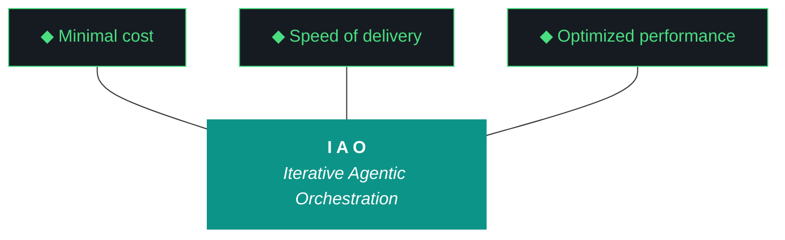

# kjtcom — Design Document v10.66

**Iteration:** v10.66
**Phase:** 10 (Platform Hardening → Harness Externalization Phase A)
**Date:** April 08, 2026
**Planning agent:** Claude (chat planning session, web)
**Executing agent:** Gemini CLI (`gemini --yolo`)
**Companion executor:** Claude Code (`claude --dangerously-skip-permissions`)
**Machine:** NZXTcos (`~/dev/projects/kjtcom`)
**Repo:** SOC-Foundry/kjtcom
**Site:** kylejeromethompson.com
**Hard contract:** No `git commit`, no `git push`, no `git add`, no git writes. Manual git only.
**Run mode:** **Fast iteration, bounded.** Target wall clock: **< 60 minutes**. No Bourdain pipeline work of any kind.

---

## 0. Critical Read of v10.65 (What Landed, What Broke, What Matters)

v10.65 landed 14 of 15 workstreams cleanly across a full workday of unattended execution. The six P0 spines that mattered all shipped: **W1 build gatekeeper** caught a deliberate compile error in self-test and prevented iteration close on breakage; **W2 synthesis audit trail** raised `EvaluatorSynthesisExceeded` for the first time in production with Qwen at ratio 1.17 and forced Tier 2 fall-through; **W3 script registry schema v2** shipped with 60 entries and `query_registry.py` as a working diligence surface; **W4 context bundle** produced a 157 KB artifact (though with cosmetic bugs); **W5 deployed_iteration_matches** correctly identified the v10.64 live site; **W6 Bourdain production migration** moved 604 entities from staging to default, bringing production to 6,785.

Zero interventions across the workday. Telegram bot reflects new counts. CI token gap (G95) detected and documented via `EVENING_DEPLOY_REQUIRED.md`, with the dual-path probe from W9 correctly reporting SA=PASS, CI=FAIL, OAuth=FAIL.

That's real progress. The harness layer works.

But v10.65 also exposed **five new problems** that v10.66 has to address, plus a sixth that only became visible after deployment.

### Problem 1: Pattern 21 round 3 (G98) — Tier 2 Gemini Flash hallucinated W16

The v10.65 closing evaluator fell through from Qwen (Tier 1, synthesis ratio 1.17) to Gemini Flash (Tier 2) exactly as W2 designed. Gemini Flash produced structurally valid JSON but **factually hallucinated content not present in the source**. Specifically:

- It reported **16 workstreams** when the build log has 15
- It invented a **W16** titled "Closing Sequence: Context Bundle, Delta Snapshot, Evaluator Run, Build Gatekeeper, Final Post-Flight" — this is the *design doc's* W15 title, not a real workstream in the build log
- It mangled every workstream title with a leading `— ` dash, treating the em-dash separator in `### W<N>: — <title>` headers as part of the title itself
- It misattributed every workstream to `claude-code` and `qwen3.5:9b` (this is kjtcom's default scaffolding, not what actually ran)
- It reported **13/16 complete, 2 in-progress** for a delivery line of "81%" — the build log's actual Trident is 14/15

This is Pattern 21's third incarnation. v10.62 was Tier 1 fabrication; v10.63 was Tier 1 fabrication with a different mask; v10.64 was Tier 1 + Tier 2 + Tier 3 all padding; v10.65 was Tier 1 raising correctly and Tier 2 confabulating structure. **The cascade moved up one tier but didn't stop.** The audit trail from W2 caught the Tier 1 failure (which is why Tier 2 ran at all) but can't catch Tier 2 hallucination because the model produced "complete" output — just about the wrong thing.

**v10.66 W8 fix:** anchor Tier 2's prompt to the **design doc's literal workstream list**. The prompt must include a ground-truth array of `[W1, W2, ..., W15]` parsed from `### W<N>` headers in the design doc. Tier 2 is instructed: "Score only these workstreams. If the build log does not contain a section for one of them, mark it `missing`. Do not invent workstreams not in this list." If Tier 2 returns a workstream ID not in the ground-truth list, the response is rejected and the cascade continues to Tier 3 (self-eval with auto-cap).

### Problem 2: Synthesis ratio overcounting (G97)

v10.65's build log "What Could Be Better" section flagged this directly: `scripts/run_evaluator.py` overcounts synthesis when `improvements_padded` is present, leading to ratios > 1.0. The bug is a substring match instead of exact field match — `any(cf in f)` matches `improvements_padded` as if it were `improvements`, double-counting.

Concretely: the v10.65 report shows every workstream with synthesis ratio 0.17 or 0.33, even the ones that had legitimate Gemini Flash output. The bug bumped ratios artificially, but it's also what caused Tier 1 Qwen to hit 1.17 (a ratio >1.0 is impossible under exact-match semantics — it means the same field was counted twice).

**v10.66 W7 fix:** 3-line edit in `normalize_llm_output()`. Change `any(cf in f for f in synthesized)` to `any(cf == f for f in synthesized)` or equivalent exact-match construction. Add a unit test: synthesize a fixture with `improvements_padded` but no `improvements`, assert ratio does not count it under the `improvements` bucket.

### Problem 3: claw3d.html version stamp is stale (G101 — NEW)

The live site's Flutter app is correctly stamped v10.65 after Kyle's manual deploy this morning. But `claw3d.html` — the standalone Three.js PCB architecture visualization loaded as an independent HTML file — still reads "kjtcom PCB Architecture v10.64" at the bottom of the page. The iteration dropdown only goes up to v10.64 as well.

Screenshot from Kyle this afternoon: title bar says v10.64, dropdown "Current" entry says v10.64.

**Root cause:** `claw3d.html` has the iteration string hardcoded in two places (the title at the bottom, and the default dropdown entry), and no iteration has updated them since v10.64. v10.65 W14 (README + changelog sync) updated README.md and the changelog but did not touch `claw3d.html`.

**Second-order problem:** v10.65 W5 shipped `deployed_iteration_matches.py` which scrapes `claw3d.html` for the version stamp and compares to `IAO_ITERATION`. This check is fundamentally the wrong proxy — it measures whether `claw3d.html` has been updated, not whether the site deploy landed. These are two different things that happen to usually correlate.

**v10.66 W11 fix** (multi-part):

1. Bump `claw3d.html`'s title string and default dropdown entry to v10.66 (skipping v10.65 since the live site already has v10.65's Flutter app; the claw3d visualization can catch up in one jump)
2. Append entries for v10.65 and v10.66 to the iteration dropdown
3. Rename existing `deployed_iteration_matches.py` → `deployed_claw3d_matches.py` (accurate name for what it measures)
4. Create new `deployed_flutter_matches.py` that checks the Flutter main app's version stamp (exposed via a known DOM element or JS global) — this is the primary deploy-gap detector
5. Both checks run in post-flight. If they disagree (as they did in v10.65), the build log emits a warning
6. Add `claw3d_version_matches.py` post-flight check: asserts `grep "PCB Architecture v<IAO_ITERATION>" app/web/claw3d.html` finds the current iteration — this is the *in-repo* check that runs before deploy, as an early warning

### Problem 4: Context bundle (v10.65 W4) has cosmetic bugs and is not self-sufficient

The v10.65 bundle worked as a proof of concept (157 KB, exceeded the 100 KB target, has the 5 sections ADR-019 specified). But three bugs made it less useful than intended:

1. **ADRs 016/017/018 listed twice** in the ADR registry section — dedup bug in the generator
2. **Delta state section reports "Iteration deltas failed"** — the delta generator expected a `v10.64.json` snapshot in a specific format that didn't match what was on disk
3. **Pipeline state reports "Production count unavailable"** — the Firestore count query ran without `GOOGLE_APPLICATION_CREDENTIALS` set, because the bundle generator was invoked from the closing post-flight script which runs in a subprocess that doesn't inherit the active-project env vars

**The larger problem beyond the bugs:** the v10.65 bundle was designed as a complement to file uploads, not a replacement. It had the design doc verbatim, the build log verbatim, and summaries of platform state. It did NOT have: `GEMINI.md` (the launch brief), `CLAUDE.md`, the evaluator harness, the changelog, the install.fish, the README, the agent_scores.json entries, the firebase-debug.log tail, the iao_event_log.jsonl tail, or any diagnostic capture from post-flight failures.

When Kyle started the v10.66 planning session, he still had to upload ~10 files because the bundle didn't cover them. ADR-019's intent — "one file upload per iteration" — was not met.

**v10.66 W1 fixes all four:**

1. Fix the ADR dedup bug (sort + unique on `adr_id`)
2. Fix the delta state generator to tolerate missing or format-drifted snapshots (fall back to parsing the delta table from the previous build log)
3. Fix the pipeline count query by reading `.iao.json`, extracting `env_prefix`, looking up `${PREFIX}_GOOGLE_APPLICATION_CREDENTIALS`, and setting it on the Firestore client explicitly
4. Expand the bundle to the **§1-§11 spec** (see Section 4 of this design doc)

### Problem 5: Firebase CI token missing (G95 partial — acknowledged, deferred)

v10.65's W9 shipped the dual-path probe which correctly identified that SA credentials work but CI token and OAuth don't. `EVENING_DEPLOY_REQUIRED.md` was written, Kyle ran the deploy manually, and the probe's design validated. But the CI token file itself was never created — Kyle hit a reauth prompt during deploy and resolved it interactively.

**v10.66 handling:** NOT a workstream. Documented in the pre-flight checklist as a one-time manual step: if Kyle wants v10.66's closing sequence to auto-deploy, he runs `firebase login:ci` once before launch and saves the token to `~/.config/firebase-ci-token.txt`. If the token is present at closing, v10.66 auto-deploys. If not, `EVENING_DEPLOY_REQUIRED.md` is written again and Kyle runs manual deploy. This is fine. G95 is not a blocker.

### Problem 6: Path-agnostic is a hard requirement, not a nice-to-have (NEW)

The tsP3-cos machine has kjtcom at `~/Development/Projects/kjtcom` (capital D, capital P, plural). NZXTcos has it at `~/dev/projects/kjtcom` (lowercase). Kyle's junior engineers will clone it to whatever directory their team's convention dictates — could be `~/code/`, `~/src/`, `~/work/`, `/opt/`, wherever.

**v10.66's iao-middleware cannot hardcode any paths.** Not in the install script, not in the shim layer, not in any of the Python modules. Every component must resolve its project root dynamically at runtime.

The resolution mechanism (detailed in Section 5):

1. **Primary:** `IAO_PROJECT_ROOT` environment variable (set by the active-project source file when `iao project switch` is invoked)
2. **Fallback 1:** walk up from `$PWD` looking for `.iao.json`
3. **Fallback 2:** walk up from `__file__` (the script's own location) looking for `.iao.json`
4. **Fail:** clear error message directing the user to run `iao project switch <name>` or `cd` into a project

This is implemented once in a shared helper `iao-middleware/lib/iao_paths.py` and imported by every other module. Single source of truth.

---

## 1. Project Identity (Brief)

kjtcom is a multi-pipeline location intelligence platform ingesting YouTube travel/food content (California's Gold, Rick Steves' Europe, Diners Drive-Ins and Dives, Anthony Bourdain), extracting location entities into a SIEM-style schema (Thompson Indicator Fields, `t_any_*`), enriching via Google Places, and surfacing them through a Flutter Web app at kylejeromethompson.com. The real product is the **harness**: the evaluator, the gotcha registry, the ADRs, the post-flight checks, the artifact loop, the split-agent model, the script registry, the context bundle — all of which are being externalized in v10.66 as a reusable middleware that other projects in the SOC-Foundry org can consume.

v10.66 marks the beginning of **Phase A** of harness externalization: the universal components live inside kjtcom at `kjtcom/iao-middleware/` and ship via an install script that any engineer can run after cloning kjtcom. The reference implementation and the distribution mechanism are the same codebase.

---

## 2. The Ten Pillars of IAO (Verbatim, Locked)

1. **Trident** — Cost / Delivery / Performance triangle governs every decision
2. **Artifact Loop** — design → plan (INPUT, immutable) → build → report → context bundle (5 artifacts)
3. **Diligence** — Read before you code; pre-read is a middleware function. **First action: `iao registry query` or `python3 scripts/query_registry.py`**
4. **Pre-Flight Verification** — Validate environment before execution
5. **Agentic Harness Orchestration** — The harness is the product; the model is the engine
6. **Zero-Intervention Target** — Interventions are failures in planning
7. **Self-Healing Execution** — Max 3 retries per error with diagnostic feedback
8. **Phase Graduation** — Sandbox → staging → production
9. **Post-Flight Functional Testing** — Build is a gatekeeper
10. **Continuous Improvement** — Retrospectives feed directly into the next plan

---

## 3. Trident Mermaid Chart (Locked Colors)



---

## 4. Context Bundle Spec §1-§11 (Expanded from ADR-019)

v10.66 W2 implements the expanded bundle spec. The v10.67 planning session should require **one file upload only** — `kjtcom-context-v10.66.md` — and nothing else (except screenshots, if any visual evidence matters). If the planning chat ever asks for a file not in the bundle, that's a bug the next iteration fixes.

**§1 — Immutable Inputs** (kept from v10.65)
- Design doc verbatim
- Plan doc verbatim

**§2 — Execution Audit** (kept from v10.65)
- Build log verbatim
- Report verbatim (even if broken — the broken report is evidence)

**§3 — Launch Artifacts** (NEW)
- `GEMINI.md` verbatim
- `CLAUDE.md` verbatim

**§4 — Harness State** (NEW)
- `docs/evaluator-harness.md` full content
- `docs/kjtcom-changelog.md` full content (entire history)
- `README.md` full content

**§5 — Platform State** (fixed from v10.65)
- Gotcha registry: **count + last 10 added/modified** (fix the "0 resolved" bug)
- Script registry: count, per-pipeline breakdown, per-workstream `called_by` coverage
- ADR registry: **deduplicated** list (sort + unique on `adr_id`)

**§6 — Delta State** (fixed from v10.65)
- Iteration delta table for v10.66 vs v10.65 (fall back to parsing previous build log if snapshot format drifts)
- Last 5 iterations' Trident metrics side-by-side

**§7 — Pipeline State** (fixed from v10.65)
- Production entity count from Firestore (fix the `GOOGLE_APPLICATION_CREDENTIALS` env var bug)
- Per-pipeline breakdown (calgold / ricksteves / tripledb / bourdain)
- Staging entity count
- Telegram bot last-seen timestamp + status

**§8 — Environment State** (NEW)
- `firebase-debug.log` **tail** (last 50 lines)
- `data/agent_scores.json` **last 5 entries only**
- `data/iao_event_log.jsonl` **tail** (last 200 lines)
- Current date, hostname, `uname -a`, Python version, Flutter version, Ollama status + loaded models list

**§9 — Artifacts Inventory** (NEW)
- `ls -la docs/kjtcom-*-v10.66.md` output with sizes
- SHA256 hash of each of the 5 artifacts

**§10 — Diagnostic Captures** (NEW, conditional)
- Full output of any post-flight check that FAILED during W15
- Contents of `URGENT_BUILD_BREAK.md` if written
- If the evaluator fell through Tier 1: full `EvaluatorSynthesisExceeded` traceback + both Tier 1 and Tier 2 raw responses (not just summaries)

**§11 — install.fish** (NEW)
- `iao-middleware/install.fish` full content (so planning chat can see current state of the install flow without a separate upload)

**Expected bundle size:** 300-500 KB per iteration. v10.65's 157 KB was too thin.

---

## 5. Path Resolution Standard (New)

Every Python module inside `kjtcom/iao-middleware/lib/` MUST use `iao_paths.find_project_root()` to resolve the project root. Hardcoded paths to `~/dev/projects/kjtcom` or `/home/kthompson/...` are forbidden.

**Implementation** (`iao-middleware/lib/iao_paths.py`):

```python
"""iao_paths.py — Shared path resolution for all iao-middleware components.

The project root is resolved in this order:
  1. IAO_PROJECT_ROOT environment variable (set by active-project source file)
  2. Walk up from $PWD looking for .iao.json
  3. Walk up from this file's location looking for .iao.json
  4. Raise IaoProjectNotFound with a clear message
"""

import os
from pathlib import Path


class IaoProjectNotFound(Exception):
    """Raised when the project root cannot be resolved."""
    pass


def find_project_root(start: Path | None = None) -> Path:
    """Resolve the kjtcom (or any IAO-managed) project root dynamically.

    Never hardcodes paths. Works on NZXTcos (~/dev/projects/kjtcom),
    tsP3-cos (~/Development/Projects/kjtcom), and any future engineer's
    clone location.
    """
    # Step 1: Environment variable (primary)
    env_root = os.environ.get("IAO_PROJECT_ROOT")
    if env_root:
        p = Path(env_root).resolve()
        if (p / ".iao.json").exists():
            return p

    # Step 2: Walk up from cwd (or explicit start)
    cur = (start or Path.cwd()).resolve()
    while cur != cur.parent:
        if (cur / ".iao.json").exists():
            return cur
        cur = cur.parent

    # Step 3: Walk up from this file's location
    cur = Path(__file__).resolve().parent
    while cur != cur.parent:
        if (cur / ".iao.json").exists():
            return cur
        cur = cur.parent

    # Step 4: Fail with clear message
    raise IaoProjectNotFound(
        "Could not resolve IAO project root. Either set IAO_PROJECT_ROOT, "
        "run `iao project switch <name>`, or `cd` into a project directory "
        "containing .iao.json."
    )
```

The shim layer (`scripts/query_registry.py`, `scripts/build_context_bundle.py`, etc. after the move) imports from `iao_middleware.lib.iao_paths` and uses it to resolve paths before reading any project files.

**The install script** (`iao-middleware/install.fish`) self-locates via `(dirname (status filename))` and walks up to find the parent `.iao.json`, then copies components to `~/iao-middleware/` (the ONE fixed path — per-engineer, not per-project) and writes fish config entries that reference `~/iao-middleware/bin/iao`. The engineer's project clone location is read dynamically; only the middleware destination is fixed.

---

## 6. Current State Snapshot (post-v10.65)

### Pipelines

| Pipeline | t_log_type | Color | Entities | Status |
|---|---|---|---|---|
| California's Gold | calgold | `#DA7E12` | 899 | Production |
| Rick Steves' Europe | ricksteves | `#3B82F6` | 4,182 | Production |
| Diners Drive-Ins and Dives | tripledb | `#DD3333` | 1,100 | Production |
| Bourdain (NR + PU 1-60) | bourdain | `#8B5CF6` | 604 | **Production (promoted v10.65 W6)** |

**Production total:** 6,785. **Staging:** 0. v10.66 makes **zero changes** to production counts.

### Frontend

- Flutter Web at kylejeromethompson.com — **deployed v10.65 as of Apr 7 evening**
- CanvasKit renderer, 6 tabs (Results/Map/Globe/IAO/MW/Schema)
- `claw3d.html` **STALE at v10.64** — G101, targeted W11
- MW tab shows v9.49 middleware snapshot — NOT targeted in v10.66 (deferred to v10.67)

### Middleware health (post-v10.65)

- **Harness** `docs/evaluator-harness.md` — 1,062 lines, 22 ADRs, Patterns through 27
- **Evaluator** `scripts/run_evaluator.py` — Pattern 21 streak broken at Tier 1, new failure at Tier 2 (G98)
- **Post-flight** `scripts/post_flight.py` — build gatekeeper working, visual baseline diff working, MCP probes functional
- **Script registry** 60 entries, v2 schema with inputs/outputs/pipeline metadata
- **Context bundle generator** 157 KB output, three cosmetic bugs (targeted W1)
- **Firebase MCP** SA credentials work; CI token missing; OAuth requires interactive reauth
- **Telegram bot** healthy, returns 6,785 entities
- **iao-middleware directory** does not yet exist — v10.66 W3 creates it

### Gotcha registry state

Post-v10.65 W8 audit: 60 entries. v10.66 adds G97 (synthesis ratio exact-match), G98 (Tier 2 hallucination), G101 (claw3d version stamp). Net v10.66 count: 63.

---

## 7. ADR Registry

Post-v10.65: 22 ADRs (ADR-001 through ADR-022). v10.66 adds **ADR-023, ADR-024, ADR-025**.

### New ADRs in v10.66

#### ADR-023: Phase A Harness Externalization — iao-middleware as Subdirectory

- **Context:** The IAO methodology, the evaluator, the post-flight, the script registry, the context bundle, and the gotcha registry are all working in kjtcom. Other engineers in the SOC-Foundry org want to use these on their own projects. The universal components need to live somewhere that's both (a) the source of truth and (b) easy to distribute to other machines.
- **Decision:** Create `kjtcom/iao-middleware/` as a subdirectory inside kjtcom containing the project-agnostic components. Engineers clone kjtcom once, run `fish iao-middleware/install.fish`, and the script copies the components to `~/iao-middleware/` on their machine. Kjtcom is the reference implementation AND the distribution mechanism for Phase A. When 2-3 engineers have shipped real projects using this path, Phase B extracts `iao-middleware/` into its own repo.
- **Rationale:** Avoids premature abstraction. The components stay dogfooded against kjtcom. Every harness improvement ships via the kjtcom iteration loop automatically. New engineer onboarding is one clone + one script.
- **Consequences:**
  - New directory tree: `kjtcom/iao-middleware/{bin,lib,prompts,templates,data,docs}/`
  - The Python modules from `scripts/` that are project-agnostic (`query_registry.py`, `build_context_bundle.py`, `utils/iao_logger.py`, `postflight_checks/*.py`) move into `iao-middleware/lib/` with 3-line shims left in `scripts/`
  - The `iao` CLI ships with `project` / `init` / `status` subcommands (evaluator subcommand deferred to v10.67)
  - `install.fish` handles CachyOS+fish only in v10.66 (cross-distro detection deferred)

#### ADR-024: Path-Agnostic Component Resolution

- **Context:** Engineers will clone kjtcom to arbitrary directories. NZXTcos uses `~/dev/projects/kjtcom`. tsP3-cos uses `~/Development/Projects/kjtcom`. Junior engineers may use `~/code/`, `~/src/`, `/opt/`, or anywhere else. Hardcoded paths are a dead end.
- **Decision:** All `iao-middleware/lib/` modules resolve the project root dynamically via `iao_paths.find_project_root()`. The resolution order is: `IAO_PROJECT_ROOT` env var → walk up from `$PWD` looking for `.iao.json` → walk up from `__file__` → fail clearly. The install script self-locates via `(dirname (status filename))`. The ONE fixed path is `~/iao-middleware/` (per-engineer middleware destination, not per-project).
- **Rationale:** Any hardcoded path is a bug waiting for the second user. Dynamic resolution costs ~1ms per script invocation and eliminates an entire class of cross-machine issues before they happen.
- **Consequences:**
  - New shared helper `iao-middleware/lib/iao_paths.py`
  - Every Python module in `iao-middleware/lib/` imports `find_project_root()` and uses it to locate `.iao.json`, `data/`, `docs/`, etc.
  - The `.iao.json` file becomes the canonical sentinel — without it, the middleware cannot operate
  - Kjtcom's existing `.iao.json` (created during v10.66 W3) is the first real-world example

#### ADR-025: Dual Deploy-Gap Detection

- **Context:** v10.65 W5 shipped `deployed_iteration_matches` which scrapes `claw3d.html` for a version stamp. This check assumes claw3d and the main Flutter app ship together. But claw3d has its own hardcoded version string that can drift from the Flutter app's version stamp independently — v10.66 validated this when the v10.65 deploy succeeded for the Flutter app but left claw3d at v10.64 (G101).
- **Decision:** Rename `deployed_iteration_matches.py` → `deployed_claw3d_matches.py`. Add new `deployed_flutter_matches.py` that checks the Flutter main app's version stamp via a known DOM element or JS global. Both run in post-flight. If they disagree, the build log emits a warning and the iteration does not fail (these are detectors, not gates — the build gatekeeper from ADR-020 is the actual gate). Add `claw3d_version_matches.py` as an in-repo check that runs before deploy.
- **Rationale:** Two independent surfaces need two independent checks. Using one as a proxy for the other was the v10.65 W5 mistake. Separation of concerns is cheaper than debugging disagreements later.
- **Consequences:**
  - Three post-flight scripts: `deployed_flutter_matches.py` (primary), `deployed_claw3d_matches.py` (renamed from v10.65), `claw3d_version_matches.py` (in-repo pre-deploy)
  - `claw3d.html` gains a post-flight check that catches stale version stamps before deploy
  - Disagreement between Flutter and claw3d versions is surfaced but not blocking

---

## 8. Workstream Design (11 Workstreams, ~60 min)

v10.66 is **fast, bounded, and focused**. Under 60 minutes wall clock. No Bourdain work. Single-machine iteration on NZXTcos. Zero interventions target.

### W1 — Context Bundle Bug Fixes + §1-§11 Spec Expansion (P0)

**Why first:** Without W1's fixes, v10.66's own closing context bundle will have the same cosmetic bugs v10.65 had. v10.67's planning chat needs a clean bundle as input.

**Files in scope:**
- `scripts/build_context_bundle.py` (existing, v10.65 W4)
- `iao-middleware/lib/build_context_bundle.py` (NEW — gets moved in W3)

**Steps:**
1. Fix ADR dedup: sort the ADR list by `adr_id` and apply `seen = set(); dedup = [a for a in adrs if a.id not in seen and not seen.add(a.id)]`
2. Fix delta state: wrap the snapshot load in try/except; on failure, parse the previous build log's "Iteration Delta Table" section via regex and emit that instead. Log the fallback path in the bundle's §6.
3. Fix pipeline count: read `.iao.json` via `iao_paths.find_project_root()` → extract `env_prefix` → `os.environ.get(f"{env_prefix}_GOOGLE_APPLICATION_CREDENTIALS")`; if set, pass explicitly to the Firestore client. If not set, emit `pipeline_count: env_var_missing` instead of "unavailable" so the failure mode is identifiable.
4. Expand the bundle generator to emit §1-§11 per the spec in Section 4 of this design. New sections: §3 launch artifacts, §4 harness state, §8 environment state, §9 artifacts inventory, §10 diagnostic captures, §11 install.fish full content.
5. Test: run `python3 scripts/build_context_bundle.py --iteration v10.65` retroactively. Verify no ADR duplicates, delta table present, pipeline count numeric (or `env_var_missing`), §1-§11 all present, total size > 300 KB.

**Success criteria:**
- Three v10.65 bugs fixed and verified via retroactive run
- Bundle size > 300 KB (was 157 KB in v10.65)
- All 11 sections present and populated
- Generator does not crash on missing credentials — reports the failure mode explicitly

**Risks:**
- The `.iao.json` file may not exist yet when W1 runs (W3 creates it). Mitigation: W1 tolerates missing `.iao.json` by falling back to `IAO_PROJECT_ROOT` env var or the script's own location.

---

### W2 — `iao-middleware/lib/iao_paths.py` Shared Helper + v10.65 Component Refactor (P0, ADR-024)

**Why second:** Every subsequent workstream that moves a module into `iao-middleware/lib/` needs this helper. Building it first means W3's move-with-shims can use it immediately.

**Files in scope:**
- `iao-middleware/lib/iao_paths.py` (NEW)
- `scripts/query_registry.py` (refactor to use `iao_paths`)
- `scripts/build_context_bundle.py` (refactor)
- `scripts/utils/iao_logger.py` (refactor)
- `scripts/postflight_checks/*.py` (refactor each for dynamic project root resolution)

**Steps:**
1. Create the `iao-middleware/lib/iao_paths.py` file per Section 5 of this design
2. Add `IaoProjectNotFound` exception class
3. Implement `find_project_root(start=None)` with the 4-step resolution
4. Add a unit test fixture: create a tmpdir with `.iao.json`, call `find_project_root(start=tmpdir)`, assert it returns tmpdir
5. Add second test: set `IAO_PROJECT_ROOT` to tmpdir, call from another cwd, assert it returns the env var value
6. Refactor `scripts/query_registry.py` to import `from iao_middleware.lib.iao_paths import find_project_root` and replace any hardcoded path or cwd-relative read with `find_project_root() / "data" / "script_registry.json"`. (This works in v10.66 because `scripts/` and `iao-middleware/` are both inside kjtcom, and Python can import from either via PYTHONPATH or sys.path manipulation.)
7. Same refactor for `scripts/build_context_bundle.py`, `scripts/utils/iao_logger.py`, and every file in `scripts/postflight_checks/`
8. Verify: run each refactored script from `~/` (outside the kjtcom directory) with `IAO_PROJECT_ROOT` set, confirm it still finds the right files

**Success criteria:**
- `iao_paths.py` exists and both unit tests pass
- All 4 refactored Python scripts work when invoked from outside the project directory with `IAO_PROJECT_ROOT` set
- All 4 also work when invoked from inside the project via cwd walk-up
- No hardcoded `/home/kthompson` or `~/dev/projects/kjtcom` references remain in `iao-middleware/lib/`

**Risks:**
- PYTHONPATH resolution between `scripts/` and `iao-middleware/lib/` during the move — Python needs to find `iao_middleware.lib.iao_paths`. Mitigation: add `kjtcom/iao-middleware/` to `sys.path` in the shim layer, or use a conftest/sitecustomize approach. Document the chosen mechanism in the build log.

---

### W3 — `kjtcom/iao-middleware/` Tree Creation + Move-with-Shims (P0, ADR-023)

**Why third:** W1 and W2 shipped; now we physically relocate the components into their new home.

**Files in scope:**
- `kjtcom/iao-middleware/` (NEW directory tree)
- `scripts/query_registry.py` → `iao-middleware/lib/query_registry.py` + shim
- `scripts/build_context_bundle.py` → `iao-middleware/lib/build_context_bundle.py` + shim
- `scripts/utils/iao_logger.py` → `iao-middleware/lib/iao_logger.py` + shim
- `scripts/postflight_checks/*.py` → `iao-middleware/lib/postflight_checks/*.py` + shims
- `.iao.json` (NEW in project root — canonical sentinel for path resolution)

**Steps:**
1. Create directory tree:
   ```
   iao-middleware/
     bin/
     lib/
       postflight_checks/
     prompts/
     templates/
     data/
     docs/
     MANIFEST.json
   ```
2. Create `.iao.json` at project root with:
   ```json
   {
     "iao_version": "0.1",
     "name": "kjtcom",
     "artifact_prefix": "kjtcom",
     "gcp_project": "kjtcom-c78cd",
     "env_prefix": "KJTCOM",
     "current_iteration": "v10.66",
     "phase": 10,
     "evaluator_default_tier": "qwen",
     "created_at": "<ISO timestamp>"
   }
   ```
3. Move each file from `scripts/` to `iao-middleware/lib/` (via `git mv` equivalent — use `mv` since the agent doesn't do git writes, Kyle commits later)
4. Leave a 3-line shim in the original location:
   ```python
   """Shim: moved to iao-middleware/lib/ in v10.66 W3.

   This module is preserved here for backward compatibility with any code
   that imports from scripts/. The real implementation lives at:
     iao-middleware/lib/{module_name}.py
   """
   import sys
   from pathlib import Path

   # Add iao-middleware/lib to path
   _iao_lib = Path(__file__).resolve().parent.parent / "iao-middleware" / "lib"
   if str(_iao_lib) not in sys.path:
       sys.path.insert(0, str(_iao_lib))

   from {module_name} import *  # noqa: F401, F403, E402
   ```
5. Create `iao-middleware/MANIFEST.json` listing every file with its SHA256 hash. This is read by the install script and compatibility checker.
6. Verify: run `python3 scripts/query_registry.py "post-flight"` (via shim), confirm it returns real results. Run `python3 -c "from iao_middleware.lib.query_registry import main; main()"` equivalently — both paths work.
7. Verify: run `python3 scripts/post_flight.py v10.66` (which invokes the relocated postflight_checks), confirm all checks still run and report correctly.

**Success criteria:**
- Directory tree exists with all subdirs
- `.iao.json` exists at project root with kjtcom identity
- All 4+ moved modules work from both the old shim location and the new canonical location
- `MANIFEST.json` lists every file in `iao-middleware/` with SHA256
- `scripts/post_flight.py` still runs green
- No import errors anywhere in the build log

**Risks:**
- Import path fragility during the move. Mitigation: comprehensive import test harness that walks every script in the project and verifies import-time behavior. Run it as the last step of W3.
- `post_flight.py` itself may reference the old paths; the shim catches this but the path resolution inside each post-flight check must use `iao_paths.find_project_root()`, not hardcoded relatives.

---

### W4 — `iao-middleware/install.fish` (P0)

**Why fourth:** Other engineers need a working install script for the v10.67 tsP3-cos validation. The install script is the primary deliverable of Phase A.

**Files in scope:**
- `iao-middleware/install.fish` (NEW)
- `iao-middleware/MANIFEST.json` (read by install script)

**Steps:**
1. Create `iao-middleware/install.fish` with the following shape:
   ```fish
   #!/usr/bin/env fish
   # iao-middleware install script — Linux + fish (Phase A, v10.66)
   #
   # Self-locates via (status filename). Resolves parent project root by
   # walking up looking for .iao.json. Copies components to ~/iao-middleware/.
   # Writes fish config entries for PATH and active-project sourcing.
   # Runs compatibility check against COMPATIBILITY.md and reports.

   set -l SCRIPT_DIR (dirname (realpath (status filename)))
   set -l PROJECT_ROOT $SCRIPT_DIR/..

   # Walk up if .iao.json not in the direct parent (defensive)
   set -l cur $PROJECT_ROOT
   while not test -f $cur/.iao.json
       if test "$cur" = "/"
           echo "ERROR: cannot find .iao.json walking up from $SCRIPT_DIR"
           exit 1
       end
       set cur (dirname $cur)
   end
   set PROJECT_ROOT $cur

   echo "iao-middleware install"
   echo "  source project: $PROJECT_ROOT"
   echo "  source middleware: $SCRIPT_DIR"
   echo "  destination: ~/iao-middleware/"
   echo ""

   # Compatibility check (read COMPATIBILITY.md as data, see W5)
   # ...

   # Copy components
   mkdir -p ~/iao-middleware
   cp -r $SCRIPT_DIR/bin ~/iao-middleware/
   cp -r $SCRIPT_DIR/lib ~/iao-middleware/
   cp -r $SCRIPT_DIR/prompts ~/iao-middleware/
   cp -r $SCRIPT_DIR/templates ~/iao-middleware/
   cp $SCRIPT_DIR/MANIFEST.json ~/iao-middleware/
   chmod +x ~/iao-middleware/bin/iao

   # Write fish config entries (with marker blocks, idempotent)
   # ...
   ```
2. Implement the compatibility check (reads `COMPATIBILITY.md`, see W5 — this step runs after W5 ships the checker)
3. Implement idempotent fish config writing: use marker blocks `# >>> iao-middleware >>>` / `# <<< iao-middleware <<<` so re-running the install script doesn't duplicate entries
4. Add active-project source line to fish config if not already present
5. After install, run `~/iao-middleware/bin/iao --version` to verify the install worked
6. Print a next-steps message: "Run `iao project add kjtcom --gcp-project kjtcom-c78cd --prefix KJTCOM --path $PROJECT_ROOT` to register this project"

**Success criteria:**
- Install script self-locates regardless of where kjtcom is cloned
- Components copy to `~/iao-middleware/` successfully
- Fish config marker block is idempotent across re-runs
- Post-install `iao --version` works from a new shell
- The script is runnable from `/tmp/testclone/kjtcom/iao-middleware/install.fish` as well as from `~/dev/projects/kjtcom/iao-middleware/install.fish` — path-agnostic by design

**Risks:**
- Fish config may not exist for a brand-new engineer. Mitigation: `mkdir -p ~/.config/fish && touch ~/.config/fish/config.fish` before writing
- `realpath` is GNU coreutils on Linux; should be present on CachyOS. Mitigation: fall back to a fish-native resolution if needed

---

### W5 — `iao-middleware/COMPATIBILITY.md` + Checker (P1)

**Why fifth:** The install script reads this checklist as data. Adding new components in v10.67+ means editing the checklist, not the install script.

**Files in scope:**
- `iao-middleware/COMPATIBILITY.md` (NEW — the data-driven checklist)
- `iao-middleware/lib/check_compatibility.py` (NEW — reads the checklist, runs checks, returns pass/fail/skip)

**Steps:**
1. Create `iao-middleware/COMPATIBILITY.md` with a table format:
   ```markdown
   # iao-middleware Compatibility Requirements

   | ID | Requirement | Check Command | Required | Notes |
   |---|---|---|---|---|
   | C1 | Python 3.13+ | `python3 --version` | yes | Min 3.11 |
   | C2 | Ollama running | `curl -s http://localhost:11434/api/tags` | yes | |
   | C3 | qwen3.5:9b pulled | `ollama list \| grep qwen3.5:9b` | yes | For Tier 1 eval |
   | C4 | gemini-cli present | `gemini --version` | no | Executor option |
   | C5 | claude-code present | `claude --version` | no | Executor option |
   | C6 | fish shell | `fish --version` | yes | Minimum for install |
   | C7 | Flutter 3.41+ | `flutter --version` | no | Only if project has Flutter UI |
   | C8 | firebase-tools 15+ | `firebase --version` | no | Only if project deploys to Firebase |
   | C9 | NVIDIA GPU (CUDA) | `nvidia-smi` | no | Only for transcription phases |
   | C10 | jsonschema module | `python3 -c "import jsonschema"` | yes | Evaluator validation |
   | C11 | litellm module | `python3 -c "import litellm"` | yes | Evaluator cloud tiers |
   ```
2. Create `iao-middleware/lib/check_compatibility.py` that parses the markdown table and runs each check, printing PASS/FAIL/SKIP per row
3. The checker exits 0 if all `required=yes` rows PASS, exits 1 otherwise
4. Test: run the checker on NZXTcos, verify it reports expected state (all required checks PASS)

**Success criteria:**
- `COMPATIBILITY.md` exists with at least 11 entries
- `check_compatibility.py` parses it as data and runs all checks
- Exit code reflects required-check status
- Called from `install.fish` W4 before the copy step

**Risks:**
- Markdown table parsing fragility. Mitigation: use a simple line-based parser, not a full markdown library. Require the table to have exactly 5 columns in the exact order.

---

### W6 — `iao` CLI: `project`, `init`, `status` Subcommands (P1)

**Why sixth:** Engineers need the `iao` command to manage projects. Full feature set from the previous planning session's iao-middleware work, minus the `eval` subcommand (deferred to v10.67).

**Files in scope:**
- `iao-middleware/bin/iao` (NEW — POSIX dispatcher)
- `iao-middleware/lib/iao_main.py` (NEW — argparse router)
- `iao-middleware/lib/iao_project.py` (NEW — project add/list/switch/current/remove)
- `iao-middleware/lib/iao_init.py` (NEW — project bootstrap)

**Steps:**
1. Write `iao-middleware/bin/iao` as a POSIX bash script that resolves its own location, finds `iao-middleware/lib/`, and execs `python3 iao_main.py`. Same pattern as the previous planning session's dispatcher.
2. Write `iao-middleware/lib/iao_main.py` with argparse subcommands: `project`, `init`, `status`. Stub for `eval` and `registry` (both print "deferred to v10.67" and exit 2).
3. Write `iao-middleware/lib/iao_project.py` with `add`, `list`, `switch`, `current`, `remove`. Data stored in `~/.config/iao/projects.json`. Active-file generation for `~/.config/iao/active.fish` (zsh and PowerShell stubs can be added in v10.67).
4. Write `iao-middleware/lib/iao_init.py` — bootstrap a project with `.iao.json`, `docs/`, `data/`, `CLAUDE.md`, `GEMINI.md` templates. This is a NEW file compared to W3 — W3 created kjtcom's `.iao.json` by hand; W6's `iao init` is the general case for future projects.
5. Wire `iao status` to show: active project, cwd project (if different), recent build logs, Ollama status.
6. Test: run `iao --version`, `iao project list`, `iao status` and verify clean output.

**Success criteria:**
- `iao` dispatcher executable and resolves its own location
- `iao --version` returns `iao 0.1.0`
- `iao project list` returns empty (no projects registered yet on NZXTcos in a clean state)
- `iao status` reports "no active project" cleanly
- `iao eval` and `iao registry` are stubbed with clear deferral messages

**Risks:**
- The `iao init` module may interact awkwardly with W3's hand-created `.iao.json` for kjtcom. Mitigation: `iao init` uses `--force` to overwrite or refuses if `.iao.json` already exists; kjtcom's already exists so the test case is `iao init --force` to verify the module works.

---

### W7 — G97 Synthesis Ratio Exact-Match Fix (P0)

**Why seventh:** 3-line fix that prevents Tier 2 from firing unnecessarily in v10.66's own closing eval. Ship this before W15's evaluator run.

**Files in scope:**
- `scripts/run_evaluator.py`

**Steps:**
1. Find the synthesis ratio calculation in `normalize_llm_output()` (line ~380 area)
2. The current code is approximately:
   ```python
   for cf in core_fields:
       if any(cf in f for f in synthesized):
           count += 1
   ```
3. Change to exact match:
   ```python
   for cf in core_fields:
       if any(cf == f for f in synthesized):
           count += 1
   ```
4. Add a unit test fixture in a new `tests/test_evaluator.py` (or add to existing if present):
   ```python
   def test_improvements_padded_not_counted_as_improvements():
       synthesized = {"improvements_padded"}  # but NOT "improvements"
       core_fields = ["improvements"]
       count = sum(1 for cf in core_fields if any(cf == f for f in synthesized))
       assert count == 0, "improvements_padded must not count as improvements"
   ```
5. Run the test, verify it passes
6. Run `scripts/run_evaluator.py --iteration v10.65 --dry-run` retroactively against the v10.65 build log; the synthesis ratios should now be strictly < 1.0 for every workstream (no more 1.17 for Qwen)

**Success criteria:**
- Unit test passes
- Retroactive v10.65 eval shows synthesis ratios < 1.0 across the board
- No new regressions in the main eval flow

**Risks:**
- None significant. This is a mechanical fix.

---

### W8 — G98 Tier 2 Design-Doc Anchor Fix (P0)

**Why eighth:** Without this fix, v10.66's own closing eval risks Tier 2 hallucination again (if Tier 1 falls through, which is unlikely after W7 but possible).

**Files in scope:**
- `scripts/run_evaluator.py`

**Steps:**
1. In the Tier 2 Gemini Flash call path (`try_gemini_tier()` or equivalent), load the design doc for the current iteration: `docs/kjtcom-design-v10.66.md`
2. Parse the design doc for `### W<N>` headers (regex: `^###\s+W(\d+)[\s—\-:]`) and build a ground-truth list: `["W1", "W2", ..., "W11"]`
3. Prepend this list to the Tier 2 prompt as an anchor:
   ```
   Ground truth workstream IDs: [W1, W2, W3, W4, W5, W6, W7, W8, W9, W10, W11]

   You MUST score exactly these workstreams. Do not invent workstreams not in
   this list. Do not add a W12, W13, W14, W15, or W16. If the build log does
   not contain a section for one of these IDs, mark it outcome=missing.
   ```
4. After Tier 2 returns, validate the response: every workstream ID must be in the ground-truth list. If any are not, raise `EvaluatorHallucinatedWorkstream(ws_id)` and fall through to Tier 3
5. Test with a synthesized hallucination: feed Tier 2 a build log that has 11 workstreams but instruct the model (via a test harness) to emit 12; verify the validation catches the W12 and raises
6. Retroactive test: run Tier 2 against v10.65's build log with the v10.65 design doc as the anchor; verify it returns exactly 15 workstreams (not 16 as the v10.65 report had)

**Success criteria:**
- Ground-truth list extraction works from any `kjtcom-design-vXX.md`
- Tier 2 prompt includes the anchor
- Response validation catches hallucinated workstream IDs and raises `EvaluatorHallucinatedWorkstream`
- Retroactive v10.65 test produces 15 workstreams, not 16

**Risks:**
- The design doc may not yet exist for v10.66 when the retroactive test runs. Mitigation: use the v10.65 design doc (which exists) for the retroactive test.
- Gemini Flash may produce additional creative output that violates the anchor in subtle ways (e.g., renaming W1). Mitigation: validate only the ID set, not titles or order.

---

### W9 — GEMINI.md + CLAUDE.md Two-Harness Diligence Wiring (P1)

**Why ninth:** The agent needs to know that diligence reads consult `kjtcom/iao-middleware/` first (universal) before `kjtcom/scripts/` and `kjtcom/data/` (project-specific).

**Files in scope:**
- `GEMINI.md`
- `CLAUDE.md`

**Steps:**
1. Add a new section to both files: "Two-Harness Diligence Model"
2. Document the resolution order:
   ```
   Diligence reads consult both harnesses in this order:
   1. Universal harness: iao-middleware/ (Phase A, v10.66+)
   2. Project harness: scripts/, data/, docs/ (kjtcom-specific)

   Use `iao registry query "<topic>"` as the first action of any workstream
   that needs to find a file. The CLI consults both harnesses and returns
   the union, with sources labeled.

   For gotchas: project-specific gotchas in data/gotcha_archive.json take
   precedence over universal gotchas in iao-middleware/data/gotchas.json.
   ```
3. Update the "Diligence Reads" table to reference `iao registry query` for each workstream where applicable
4. Add a bullet under "Execution Rules": "Before running `iao` CLI commands, verify `~/iao-middleware/bin` is on PATH. If not, run `fish iao-middleware/install.fish` first."
5. Update the failure-mode table: add a row for "query_registry returns empty" → fall back to direct file read, log as v10.67 overlay candidate

**Success criteria:**
- Both GEMINI.md and CLAUDE.md have the new "Two-Harness Diligence Model" section
- The diligence table mentions `iao registry query` for at least 5 workstreams
- Install-script-missing is a documented failure mode

**Risks:**
- None significant. This is a documentation change.

---

### W10 — claw3d.html Version Sync + Dual Deploy-Gap Checks (P0, ADR-025, G101)

**Why tenth:** The live site's claw3d.html is stale at v10.64. Every v10.66 visitor sees an out-of-date architecture diagram.

**Files in scope:**
- `app/web/claw3d.html`
- `scripts/postflight_checks/deployed_iteration_matches.py` → rename to `deployed_claw3d_matches.py`
- `scripts/postflight_checks/deployed_flutter_matches.py` (NEW)
- `scripts/postflight_checks/claw3d_version_matches.py` (NEW — in-repo pre-deploy check)
- `scripts/post_flight.py` (wire the three checks)

**Steps:**
1. Edit `app/web/claw3d.html`:
   - Find the title string `kjtcom PCB Architecture v10.64` (likely near the bottom of the HTML body)
   - Change to `kjtcom PCB Architecture v10.66`
   - Find the iteration dropdown `<option>` list
   - Add `<option value="v10.65">v10.65</option>` and `<option value="v10.66" selected>v10.66 (Current)</option>`
   - Remove the `selected` attribute from v10.64 (move it to v10.66)
2. Rename the v10.65 post-flight check file:
   ```
   mv scripts/postflight_checks/deployed_iteration_matches.py \
      scripts/postflight_checks/deployed_claw3d_matches.py
   ```
3. Update internal references in `deployed_claw3d_matches.py`: rename the main function, update log messages to say "claw3d" instead of "iteration"
4. Create `scripts/postflight_checks/deployed_flutter_matches.py`:
   - Headless Playwright or curl+regex against `https://kylejeromethompson.com/`
   - Extract the Flutter app's version stamp (find the element or JS global that exposes `IAO_ITERATION`)
   - Compare against `os.environ["IAO_ITERATION"]`
   - PASS if match, FAIL with clear message if not
5. Create `scripts/postflight_checks/claw3d_version_matches.py`:
   - Open `app/web/claw3d.html`
   - Regex for `PCB Architecture v(\S+)`
   - Compare to `os.environ["IAO_ITERATION"]`
   - PASS if match, FAIL if not
   - This runs BEFORE deploy so it catches stale version strings in the repo
6. Wire all three into `scripts/post_flight.py`:
   ```python
   results["claw3d_version_matches"] = run_claw3d_version_check()  # pre-deploy
   results["deployed_flutter_matches"] = run_deployed_flutter_check()  # post-deploy
   results["deployed_claw3d_matches"] = run_deployed_claw3d_check()  # post-deploy
   if results["deployed_flutter_matches"] != results["deployed_claw3d_matches"]:
       print("WARNING: deployment state mismatch between Flutter and claw3d")
   ```
7. Test: run `claw3d_version_matches.py` against the current repo with `IAO_ITERATION=v10.66`, verify PASS (after the edit in step 1). Run against `IAO_ITERATION=v10.65`, verify FAIL.

**Success criteria:**
- `claw3d.html` title and dropdown reflect v10.66
- Three post-flight check files exist: `claw3d_version_matches.py`, `deployed_flutter_matches.py`, `deployed_claw3d_matches.py`
- All three run during post-flight and report clearly
- The pre-deploy check catches the repo-level staleness that G101 represents
- After v10.66 deploys, both `deployed_*` checks should PASS

**Risks:**
- The Flutter app may not have a scrape-friendly version stamp. Mitigation: check `app/lib/main.dart` or `app/web/index.html` for an existing version string; if none, add one as part of this workstream.
- CanvasKit renders to canvas, not DOM — scraping the version from the running app may require JS execution. Mitigation: expose `window.IAO_ITERATION` as a global in `index.html` before the Flutter bootstrap, then scrape via Playwright's `page.evaluate()`.

---

### W11 — Harness Update (ADRs 023-025, Patterns 28-30) + Closing Sequence Orchestration (P0)

**Why last:** The harness needs to document what v10.66 built. The closing sequence runs everything together and produces the final artifacts.

**Files in scope:**
- `docs/evaluator-harness.md`
- `docs/kjtcom-changelog.md`
- `README.md`

**Steps:**
1. Append ADRs 023, 024, 025 to `docs/evaluator-harness.md` (full bodies from Section 7 of this design)
2. Append Failure Patterns 28-30:
   - Pattern 28: Tier 2 Hallucination When Tier 1 Fails (G98)
   - Pattern 29: Synthesis Substring Match Overcounting (G97)
   - Pattern 30: Version String Drift Between claw3d and Flutter (G101)
3. Add gotchas G97, G98, G101 to the gotcha cross-reference table
4. Update harness line count target: aim for ≥ 1,100 lines post-update
5. Append v10.66 entry to `docs/kjtcom-changelog.md`
6. Update README.md to reflect v10.66: new iao-middleware section, new ADR count (25), current iteration stamp
7. **Closing sequence orchestration:**
   - Run `scripts/iteration_deltas.py --snapshot v10.66`
   - Run `scripts/iteration_deltas.py --table v10.66 > /tmp/delta-table-v10.66.md`
   - Run `python3 scripts/sync_script_registry.py`
   - Run `python3 scripts/run_evaluator.py --iteration v10.66 --rich-context --verbose 2>&1 | tee /tmp/eval-v10.66.log`
   - Verify Trident parity: `grep "Delivery:" docs/kjtcom-build-v10.66.md docs/kjtcom-report-v10.66.md`
   - Run `python3 scripts/build_context_bundle.py --iteration v10.66` (will use the W1-expanded bundle generator)
   - Verify bundle size > 300 KB
   - Run `python3 scripts/post_flight.py v10.66` (includes W1 gatekeeper, W10 deploy-gap checks)
   - If post-flight PASS + Firebase CI token present: auto-deploy
   - If auto-deploy skipped: write `EVENING_DEPLOY_REQUIRED.md`
   - Verify all 5 artifacts on disk
   - Hand back to Kyle

**Success criteria:**
- Harness ≥ 1,100 lines, 25 ADRs, ≥ 30 patterns
- Changelog has v10.66 entry
- README updated to v10.66
- All 5 artifacts exist (design, plan, build, report, context bundle)
- Context bundle > 300 KB
- Build gatekeeper PASS
- Closing eval Trident matches build log Trident exactly (G93 stays fixed)
- `EVENING_DEPLOY_REQUIRED.md` exists OR auto-deploy succeeded

---

## 9. Workstream Sequencing

```
T+0       W1 (context bundle fixes)          ~8 min
T+8       W2 (iao_paths.py + refactor)       ~10 min
T+18      W3 (create iao-middleware/ tree)   ~10 min
T+28      W4 (install.fish)                  ~8 min
T+36      W5 (COMPATIBILITY.md + checker)    ~4 min
T+40      W6 (iao CLI: project/init/status)  ~6 min
T+46      W7 (G97 synthesis fix)             ~3 min
T+49      W8 (G98 Tier 2 anchor)             ~5 min
T+54      W9 (GEMINI.md/CLAUDE.md diligence) ~3 min
T+57      W10 (claw3d + dual deploy checks)  ~5 min
T+62      W11 (harness + closing)            ~5 min
T+67      DONE
```

**Target: ~60 minutes. Realistic: 60-70 minutes.** The difference from v10.65 (22 hours) is dramatic because (a) no Bourdain transcription, (b) no iteration-wide greenfield design — most of the work is file relocation with shims, documentation updates, and small targeted fixes.

**Why this order:**
- W1 and W2 are foundational. W1 fixes the bundle generator so v10.66's own bundle will be good. W2 ships the shared path helper that W3 needs.
- W3 is the move. It benefits from W1 (fixed generator) and W2 (shared helper) being in place.
- W4-W6 build on W3's directory structure and add the install flow + CLI.
- W7-W8 are standalone evaluator fixes that can run any time before W11's closing eval. Scheduled after W6 so the CLI work is done first (CLI needs clean modules to import from).
- W9 is documentation. Low risk, late in the sequence.
- W10 is the claw3d + deploy-gap work. Independent of the harness work; scheduled near the end so it doesn't distract from the core Phase A deliverables.
- W11 is the closing orchestration — runs last by definition.

---

## 10. Trident Targets for v10.66

| Prong | Target | Measurement |
|---|---|---|
| Cost | < 30K total LLM tokens (small iteration, no Bourdain, no retroactive evals) | Sum from event log post-close |
| Delivery | 11/11 workstreams complete | Reported by evaluator with W2/W7/W8 audit trail |
| Performance | (a) Build gatekeeper PASS. (b) Wall clock < 60 minutes. (c) `iao --version` works from a new shell after install. (d) `iao-middleware/` exists with `bin/`, `lib/`, `prompts/`, `templates/`, `data/`, `docs/` subdirs + `MANIFEST.json`. (e) `iao_paths.find_project_root()` works when called from outside the project directory with `IAO_PROJECT_ROOT` set. (f) Context bundle > 300 KB with all §1-§11 sections populated. (g) G97 unit test passes. (h) G98 retroactive test catches hallucinated W16 against v10.65 build log. (i) claw3d.html title reads v10.66. (j) `deployed_flutter_matches` and `deployed_claw3d_matches` both exist. (k) Harness ≥ 1,100 lines. (l) Zero interventions. | Direct file/system inspection |

---

## 11. Active Gotchas (v10.66 Snapshot)

After v10.65 W8: 60 entries. v10.66 adds G97, G98, G101 → 63 entries.

| ID | Title | Status | Action |
|---|---|---|---|
| G1 | Heredocs break agents | Active | `printf` only |
| G18 | CUDA OOM RTX 2080 SUPER | Active | Not relevant in v10.66 (no pipeline work) |
| G19 | Gemini bash by default | Active | `fish -c "..."` |
| G22 | `ls` color codes | Active | `command ls` |
| G45 | Query editor cursor bug | Resolved v10.64 | — |
| G53 | Firebase MCP reauth | Documented v10.65 W9 | Dual-path probe; CI token one-time manual |
| G80 | Qwen empty reports | Pattern 21 round 1-3 | W7/W8 address Tier 1 and Tier 2 |
| G91 | Build-side-effect from late workstreams | Resolved v10.65 W1 | — |
| G92 | Tier 2 evaluator synthesis padding | Partial v10.65 W2 | W7 completes |
| G93 | Closing report Trident mismatch | Resolved v10.65 W2 | — |
| G94 | Gotcha consolidation audit | Resolved v10.65 W8 | — |
| G95 | Firebase OAuth/SA dual-path | Mitigated v10.65 W9 | CI token setup is manual |
| G96 | Magic color constants | Resolved v10.65 W11 | — |
| **G97** | **Synthesis ratio substring overcounting** | **NEW v10.66, TARGETED W7** | Exact-match semantics |
| **G98** | **Tier 2 Gemini Flash workstream hallucination** | **NEW v10.66, TARGETED W8** | Design-doc anchor prompt |
| G99 | Context bundle cosmetic bugs | NEW (retroactive v10.65) | Addressed in W1 |
| G100 | (reserved) | | |
| **G101** | **claw3d.html version stamp drift** | **NEW v10.66, TARGETED W10** | Three post-flight checks |

---

## 12. Pre-Execution Sudo Tasks (Kyle's Morning Ritual)

v10.66 is a fast iteration, but the sudo block still matters because an unattended 60-minute run can still be interrupted by a sleep/suspend event.

```fish
# 1. Mask sleep targets
sudo systemctl mask sleep.target suspend.target hibernate.target hybrid-sleep.target

# 2. Verify masked
systemctl status sleep.target suspend.target hibernate.target hybrid-sleep.target | grep -i "masked\|loaded"

# 3. Cycle Telegram bot (optional — only if you want fresh status)
sudo systemctl restart kjtcom-telegram-bot.service

# 4. Verify Ollama responsive (W15 evaluator needs it)
ollama ps
# If qwen3.5:9b is loaded: ollama stop qwen3.5:9b (free VRAM for eval)

# 5. Confirm GPU clean (not strictly needed — v10.66 has no transcription)
nvidia-smi --query-gpu=memory.used,memory.free --format=csv

# 6. Kill any stale tmux sessions from v10.65
tmux ls 2>&1 | head -5
# If pu_phase3 exists and completed: tmux kill-session -t pu_phase3

# 7. Verify site
curl -s -o /dev/null -w "site: %{http_code}\n" https://kylejeromethompson.com

# 8. OPTIONAL: Create Firebase CI token if you want auto-deploy
# firebase login:ci
# Save output to: ~/.config/firebase-ci-token.txt
```

**Launch:**
```fish
cd ~/dev/projects/kjtcom
gemini --yolo
# At prompt: read gemini and execute 10.66
```

---

## 13. Bounded Execution Plan

**Key property:** v10.66 is a **single-machine, single-session, bounded-duration** iteration. Unlike v10.65's all-day unattended run, v10.66 is something Kyle can launch over lunch and check back on after an hour.

**If wall clock exceeds 90 minutes:** something is wrong. The agent should emit a warning in the build log "WALL CLOCK EXCEEDS TARGET" and Kyle checks in. Most likely cause: an import path issue in W3 causing cascading test failures. Fallback: skip to W11 closing with whatever was shipped.

**If a workstream fails outright:** the agent notes it, documents in "Discrepancies Encountered", and proceeds. v10.67 picks up the failed workstream.

**Definition of Done (abbreviated — full list in plan doc §10):**
1. All 11 workstreams complete or documented as partial
2. 5 artifacts on disk (design, plan, build, report, context bundle)
3. Context bundle > 300 KB with §1-§11 populated
4. `iao-middleware/` directory exists with the full tree
5. `iao --version` returns cleanly from a new shell
6. Build gatekeeper PASS
7. claw3d.html reads v10.66
8. Harness ≥ 1,100 lines with ADRs 023-025
9. Zero git writes by the agent
10. Wall clock < 90 minutes

---

*Design v10.66 — April 08, 2026. Authored by the planning chat. Immutable during execution per ADR-012. Pairs with `kjtcom-plan-v10.66.md`.*
