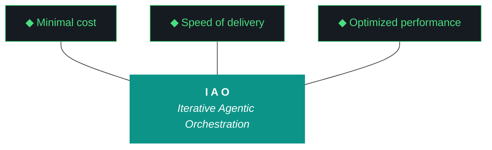

# kjtcom — Design v10.67

**Iteration:** v10.67
**Phase:** 10 (Harness Externalization — Phase A Hardening)
**Date:** April 08, 2026
**Repo:** SOC-Foundry/kjtcom
**Machine:** NZXTcos (`~/dev/projects/kjtcom`)
**Wall clock target:** ~3 hours, no hard cap
**Run mode:** Sequential, bounded, no tmux
**Significance:** **Last iteration where `iao_middleware` lives inside kjtcom.** v10.68 extracts to `SOC-Foundry/iao-middleware` standalone repo. v10.67 authors everything inside `kjtcom/iao-middleware/` as if the standalone repo already exists, so extraction is a clean `git subtree split`.

---

## 1. Why v10.67

v10.66 shipped the *scaffold* of Phase A iao-middleware externalization but not Phase A itself. Three specific debts remain:

1. **Evaluator verification debt.** v10.66 fixed G97 (synthesis ratio overcount) and G98 (Tier 2 hallucination) but skipped running the closing Qwen Tier 1 evaluator. The report is self-eval with straight 9s. No live-data evidence that the fixes work.
2. **Duplication debt.** `iao-middleware/lib/build_context_bundle.py` is a copy, not a shim source. `post_flight.py` still imports from `scripts/postflight_checks/`. Only `query_registry.py` is a real move-with-shim. The "externalization" is half-done.
3. **Bundle §6 DELTA STATE bug.** The v10.66 bundle's §6 emits `ERROR: Snapshot data/iteration_snapshots/v10.66.json not found`. W1's regex fallback didn't fire. G99 is not actually closed.

v10.67 closes all three debts **and** prepares iao_middleware for extraction by authoring it in standalone-repo voice from the inside out.

---

## 2. The Trident



---

## 3. The Ten Pillars of IAO (Verbatim)

1. **Trident** — Cost / Delivery / Performance triangle
2. **Artifact Loop** — design → plan → build → report → context bundle
3. **Diligence** — First action: `python3 scripts/query_registry.py "<topic>"`
4. **Pre-Flight Verification**
5. **Agentic Harness Orchestration**
6. **Zero-Intervention Target**
7. **Self-Healing Execution** (max 3 retries)
8. **Phase Graduation**
9. **Post-Flight Functional Testing** — Build is a gatekeeper
10. **Continuous Improvement**

---

## 4. Project State Going Into v10.67

### Pipelines (frozen for v10.67 — no Bourdain processing)

| Pipeline | Entities | Status |
|---|---|---|
| calgold | 899 | Production |
| ricksteves | 4,182 | Production |
| tripledb | 1,100 | Production |
| bourdain | 604 | Production (frozen) |

**Production total:** 6,785. **Staging:** 0. **v10.67 makes zero pipeline changes.**

### Frontend

- Flutter: **v10.65 deployed** (last manual deploy)
- `claw3d.html` repo: **v10.66**
- `claw3d.html` live: **v10.64**
- **Deploy paused.** `.iao.json` gains `deploy_paused: true` in W6. Deploy gap checks emit DEFERRED not FAIL.

### Harness / middleware health

- Harness doc: 1,111 lines, 25 ADRs (023-025 added in v10.66)
- `iao-middleware/` exists as subdirectory, partial Phase A
- `query_registry.py`: real shim ✓
- `build_context_bundle.py`: duplicated ✗
- `post_flight.py` postflight imports: still point at `scripts/` ✗
- `doctor.py`: does not exist
- Context bundle v10.66: 374 KB, §1–§11 structure present, §6 broken
- v10.66 closing evaluator: **not run** (debt)

### Evaluator gotchas from v10.66

| ID | Title | Fix shipped | Verified |
|---|---|---|---|
| G97 | Synthesis ratio substring overcounting | v10.66 W7 | Unit test only, no live-data run |
| G98 | Tier 2 Gemini Flash workstream hallucination | v10.66 W8 | Retroactive extraction test only |
| G99 | Context bundle cosmetic bugs | v10.66 W1 | Partial — §6 still broken |
| G101 | claw3d.html version stamp drift | v10.66 W10 | Repo only, live site stale |

v10.67 W1 retroactively runs the evaluator on v10.66 to produce the first real verification for G97 and G98.

---

## 5. What v10.67 Is (and Isn't)

### IS

- **v10.66 retroactive Qwen Tier 1 eval** (closes self-eval gap, validates G97/G98 on live data)
- **§6 DELTA STATE sidecar repair** for the v10.66 bundle
- **Package restructure:** `iao-middleware/lib/` → `iao-middleware/iao_middleware/` with file renames dropping redundant `iao_` prefixes
- **Standalone-repo scaffolding** inside `iao-middleware/`: `README.md`, `CHANGELOG.md`, `VERSION`, `.gitignore`, `pyproject.toml`, `docs/adrs/0001-phase-a-externalization.md`
- **`pyproject.toml` + `pip install -e`** so `from iao_middleware import ...` works from any cwd on NZXT
- **`doctor.py` shared module** and wiring into `pre_flight.py` + `post_flight.py` + `iao` CLI
- **`iao check config` subcommand** and extended `iao status`
- **`.iao.json` `deploy_paused: true` flag** with graceful DEFERRED rendering
- **COMPATIBILITY.md locally-testable hardening**
- **Harness ADRs 026, 027, 028** (Phase B extraction criteria, doctor unification, dash/underscore convention)
- **Closing Qwen Tier 1 evaluator run** (non-negotiable — Pillar 10 debt-free exit)

### IS NOT

- Bourdain pipeline work (frozen until further notice)
- Cross-machine install (v10.68 on P3)
- Actual Phase B extraction to standalone repo (v10.68)
- Manual deploy / Firebase CI token setup (paused)
- `iao eval` subcommand (v10.68+)
- Riverpod 2→3 upgrade (dedicated future iteration)
- macOS / Windows compatibility
- LICENSE file (deferred until v10.68 extraction)
- Changes to any kjtcom pipeline data

---

## 6. The Dash/Underscore Convention (ADR-028 Preview)

Python cannot import modules from directories containing dashes. iao_middleware is about to become a Python package consumed by kjtcom today and by TachTech engineers tomorrow. This forces a naming decision.

**Decision:** Repo name stays dash (`iao-middleware`), Python package is underscore (`iao_middleware`). Pattern matches `scikit-learn` (repo) → `sklearn` (package).

| Thing | Name | Rationale |
|---|---|---|
| Repo (v10.68+) | `SOC-Foundry/iao-middleware` | Matches Kyle's stated repo name intent |
| Subdirectory in kjtcom (v10.67-v10.68) | `iao-middleware/` | Mirrors future repo layout |
| Python package inside | `iao_middleware/` | Python-valid import name |
| Import statement | `from iao_middleware.X import Y` | Works with `pip install -e` |
| CLI binary | `iao` | Unchanged |
| Config file at project root | `.iao.json` | Unchanged |

Full ADR in W8.

---

## 7. Target Directory Structure (Authoritative for W3a)

```
iao-middleware/                        ← repo boundary, dash name
├── README.md                          ← W3b, standalone-repo voice
├── CHANGELOG.md                       ← W3b, v0.1.0 first entry
├── VERSION                            ← W3b, "0.1.0"
├── .gitignore                         ← W3b
├── pyproject.toml                     ← W3b, package=iao_middleware, version=0.1.0
├── MANIFEST.json                      ← existing, regenerated by W3a
├── COMPATIBILITY.md                   ← existing, hardened in W7
├── install.fish                       ← existing, updated by W3a
├── bin/
│   └── iao                            ← existing, dispatcher updated for new module path
├── iao_middleware/                    ← Python package, underscore
│   ├── __init__.py                    ← exports find_project_root, __version__
│   ├── paths.py                       ← was lib/iao_paths.py
│   ├── registry.py                    ← was lib/query_registry.py
│   ├── context_bundle.py              ← was lib/build_context_bundle.py (DEDUPED)
│   ├── compatibility.py               ← was lib/check_compatibility.py
│   ├── doctor.py                      ← NEW in W4
│   ├── cli.py                         ← was lib/iao_main.py
│   ├── logger.py                      ← was lib/iao_logger.py
│   └── postflight/
│       ├── __init__.py
│       ├── deployed_flutter_matches.py
│       ├── deployed_claw3d_matches.py
│       ├── claw3d_version_matches.py
│       ├── build_gatekeeper.py
│       ├── artifacts_present.py
│       ├── firestore_baseline.py
│       └── map_tab_renders.py
├── docs/
│   └── adrs/
│       └── 0001-phase-a-externalization.md  ← W3b, iao_middleware's own ADR stream
└── tests/
    └── test_paths.py                  ← was lib/test_iao_paths.py
```

**Shim at project root (W3a):**

```python
# scripts/query_registry.py (post-W3a)
from iao_middleware.registry import main
if __name__ == "__main__":
    main()
```

All four legacy scripts (`query_registry.py`, `build_context_bundle.py`, `check_compatibility.py`, `iao_logger.py`) become re-export shims post-W3a. `post_flight.py` imports become:

```python
from iao_middleware.postflight import (
    deployed_flutter_matches,
    deployed_claw3d_matches,
    claw3d_version_matches,
    build_gatekeeper,
    artifacts_present,
    firestore_baseline,
    map_tab_renders,
)
from iao_middleware.doctor import run_all as doctor_run_all
```

---

## 8. pyproject.toml Minimum Spec (W3b)

```toml
[project]
name = "iao-middleware"
version = "0.1.0"
description = "Iterative Agentic Orchestration middleware"
requires-python = ">=3.11"
dependencies = [
    "litellm",
    "jsonschema",
]

[project.scripts]
iao = "iao_middleware.cli:main"

[build-system]
requires = ["setuptools>=61"]
build-backend = "setuptools.build_meta"

[tool.setuptools.packages.find]
include = ["iao_middleware*"]
```

After `pip install -e kjtcom/iao-middleware/`:
- `from iao_middleware import find_project_root` works anywhere on NZXT
- `iao` CLI resolves via entry point, not just `bin/iao` dispatcher
- W5 wiring becomes `from iao_middleware.doctor import run_all` instead of sys.path hacks
- Extraction to standalone repo in v10.68 is a metadata-free operation — `pyproject.toml` already lives at the future repo root

---

## 9. The doctor.py Shared Module (W4)

One module, three callers, three levels.

```python
# iao_middleware/doctor.py
def run_all(level: str = "quick") -> dict[str, tuple[str, str]]:
    """
    Run health checks at the specified level.

    Returns: {check_name: (status, message)}
             status ∈ {"ok", "warn", "fail", "deferred"}
    """
    checks = {}
    checks.update(_quick_checks())
    if level in ("preflight", "postflight"):
        checks.update(_preflight_checks())
    if level == "postflight":
        checks.update(_postflight_checks())
    return checks
```

**Level → Check set:**

- **quick** (`iao check config`): project_root resolution, .iao.json present, MANIFEST integrity, shim resolution, PATH, fish marker. Sub-second.
- **preflight**: quick + ollama up + qwen loaded + python deps + disk + sleep-masked + Flutter version. What `pre_flight.py` currently does.
- **postflight**: quick + deployed_flutter_matches + deployed_claw3d_matches + claw3d_version_matches + build_gatekeeper + artifacts_present + manifest integrity post-changes + compatibility re-run. What `post_flight.py` currently does plus the doctor core.

**Return shape** is deliberately simple (dict of tuples) per Kyle's call in planning. Richer types come when iao_middleware becomes its own repo and can iterate freely.

**Exit code semantics for `iao check config`:**
- Exit 0: no `fail` status values (warns OK)
- Exit 1: one or more `fail` status values
- `--strict` flag promotes `warn` to `fail`

---

## 10. .iao.json Deploy-Paused Flag (W6)

Current `.iao.json` (from v10.66):

```json
{
  "project": "kjtcom",
  "version": "0.1.0",
  "env_prefix": "KJTCOM",
  "iao_middleware_home": "~/iao-middleware"
}
```

Post-W6:

```json
{
  "project": "kjtcom",
  "version": "0.1.0",
  "env_prefix": "KJTCOM",
  "iao_middleware_home": "~/iao-middleware",
  "deploy_paused": true,
  "deploy_paused_reason": "Focus on iao-middleware Phase A hardening (v10.67) and extraction (v10.68)",
  "deploy_paused_since": "2026-04-08"
}
```

When `doctor.run_all(level="postflight")` runs `deployed_flutter_matches` and `deployed_claw3d_matches` and sees `deploy_paused: true`:
- Status becomes `"deferred"` not `"fail"`
- Message: `"deploy paused since 2026-04-08; repo vX.XX / live vY.YY expected"`
- Post-flight exits clean
- `iao status` shows `deploy gap: ... [DEFERRED - deploy paused]`

Removing the flag re-enables hard checks immediately. No code change needed.

---

## 11. Phase B Exit Criteria (ADR-026)

All five must be green at v10.67 close. Missing any → v10.67.1 patch iteration before v10.68 can extract.

| # | Criterion | Evidence |
|---|---|---|
| 1 | Phase A duplication eliminated | `iao check config` shows 0 duplicate components; all `iao_middleware/` modules are sources, `scripts/` versions are pure re-export shims |
| 2 | `doctor.py` unified | `pre_flight.py`, `post_flight.py`, `iao check config` all call `iao_middleware.doctor.run_all()`; no duplicated check logic |
| 3 | `iao` CLI stable at v0.1.0 | `iao --version` → `0.1.0`; `VERSION` file and `pyproject.toml` agree; no TODO/FIXME in `cli.py` |
| 4 | `install.fish` idempotent | Running twice on NZXT produces no diff; marker block appears exactly once in fish config |
| 5 | MANIFEST + COMPATIBILITY frozen | `MANIFEST.json` regenerated post-W3a with sha256_16 for every file; `COMPATIBILITY.md` entries all pass on NZXT; no stale entries |

v10.67 W9 (closing) validates all five and emits pass/fail per criterion.

---

## 12. Workstreams

Strictly sequential. Full procedure in plan doc §6.

| W# | Title | Pri | Est. |
|---|---|---|---|
| W1 | v10.66 retroactive Qwen Tier 1 eval | P0 | ~5 min |
| W2 | §6 DELTA STATE sidecar repair | P0 | ~5 min |
| W3a | Package restructure + rename + shim fixes | P0 | ~35 min |
| W3b | Standalone-repo scaffolding + pyproject.toml + pip install -e | P0 | ~25 min |
| W4 | doctor.py shared module + iao status + iao check config | P0 | ~20 min |
| W5 | Wire doctor.run_all into pre_flight.py + post_flight.py | P0 | ~15 min |
| W6 | .iao.json deploy_paused flag + doctor DEFERRED handling | P1 | ~8 min |
| W7 | COMPATIBILITY.md locally-testable hardening | P1 | ~10 min |
| W8 | Harness ADRs 026/027/028 + Patterns from W1 findings | P0 | ~15 min |
| W9 | Closing sequence with Qwen Tier 1 evaluator run | P0 | ~15 min |

**Sum:** ~2h 33min estimated. 3-hour target has slack for W3a overrun (most likely risk).

### W1 — v10.66 retroactive Qwen Tier 1 eval

**Goal:** Produce the first real live-data verification of G97 and G98. Score v10.66 honestly with no retroactive framing.

**Steps:**
1. Confirm `docs/kjtcom-{design,plan,build,report}-v10.66.md` all exist
2. Run `python3 scripts/run_evaluator.py --iteration v10.66 --rich-context --verbose 2>&1 | tee /tmp/eval-v10.66-retroactive.log`
3. Capture: synthesis_ratio, tier used (expect Tier 1 if G97 fix works), workstream-level scores, any EvaluatorHallucinatedWorkstream raises
4. Write `docs/kjtcom-report-v10.66-retroactive.md` with the real scores alongside the original self-eval
5. If Tier 1 fires cleanly → G97 validated on live data. If Tier 2 fires and produces valid W-ids → G98 validated. If Tier 1 raises EvaluatorSynthesisExceeded → G97 fix needs follow-up, log and proceed.
6. New findings → candidate Patterns in W8

**Success:** A real evaluator score exists for v10.66 on disk. Not a unit test. Not a self-eval.

### W2 — §6 DELTA STATE sidecar repair

**Goal:** Close G99 tail without mutating the shipped v10.66 bundle.

**Steps:**
1. Diagnose: why did `iteration_deltas.py --snapshot v10.66` in v10.66 W11 not produce `data/iteration_snapshots/v10.66.json`? Check path, check if snapshot was written elsewhere, check script exit code in v10.66 build log
2. Write `docs/kjtcom-context-v10.66-delta-repair.md` sidecar containing:
   - Header noting this is a v10.67-authored repair of v10.66 §6
   - Corrected §6 DELTA STATE content (generated now by re-running iteration_deltas correctly)
   - Root cause analysis
3. Do NOT edit `docs/kjtcom-context-v10.66.md` — shipped artifact stays immutable
4. Bundle generator fix for v10.67 and forward: `context_bundle.py` §6 path check must fall back through three tiers: env-configured path → default `data/iteration_snapshots/` → regex parse of previous build log. All three exhausted → emit `DELTA STATE UNAVAILABLE: <reason>` not `ERROR:`

**Success:** Sidecar on disk. v10.67's own context bundle §6 renders correctly at W9 close.

### W3a — Package restructure + rename + shim fixes

**Goal:** Convert `iao-middleware/lib/` into a proper Python package, eliminate all duplication, make every legacy script path a re-export shim.

**Risk:** Highest-risk workstream in v10.67. Many files touched, many imports updated. Allocate generous time.

**Steps:**
1. **Create new structure:**
   - `mkdir iao-middleware/iao_middleware`
   - `mkdir iao-middleware/iao_middleware/postflight`
   - `mkdir iao-middleware/tests`
2. **Move + rename:**
   - `lib/iao_paths.py` → `iao_middleware/paths.py`
   - `lib/query_registry.py` → `iao_middleware/registry.py`
   - `lib/build_context_bundle.py` → `iao_middleware/context_bundle.py` (dedupe — authoritative copy)
   - `lib/check_compatibility.py` → `iao_middleware/compatibility.py`
   - `lib/iao_main.py` → `iao_middleware/cli.py`
   - `lib/iao_logger.py` → `iao_middleware/logger.py`
   - `lib/postflight_checks/*` → `iao_middleware/postflight/*` (7 files)
   - `lib/test_iao_paths.py` → `tests/test_paths.py`
3. **Create `iao_middleware/__init__.py`:**
   ```python
   from iao_middleware.paths import find_project_root, IaoProjectNotFound
   __version__ = "0.1.0"
   __all__ = ["find_project_root", "IaoProjectNotFound", "__version__"]
   ```
4. **Create `iao_middleware/postflight/__init__.py`** exposing all 7 check modules
5. **Update internal imports** across renamed files (e.g., `registry.py` imports from `.paths` not `.iao_paths`)
6. **Update `bin/iao`** dispatcher to `python3 -m iao_middleware.cli "$@"`
7. **Rewrite shims in `scripts/`:**
   ```python
   # scripts/query_registry.py
   from iao_middleware.registry import main
   if __name__ == "__main__":
       main()
   ```
   Same pattern for `build_context_bundle.py` (was duplicated, now pure shim) and `check_compatibility.py`
8. **Update `scripts/post_flight.py`** imports to `from iao_middleware.postflight import ...`
9. **Update `install.fish`** to copy `iao_middleware/` package tree instead of `lib/`
10. **Regenerate `MANIFEST.json`** with new file list + sha256_16
11. **Delete `iao-middleware/lib/`** once all references migrated
12. **Verification before W3b:**
    - `python3 -c "from iao_middleware import find_project_root; print(find_project_root())"` — must work
    - `python3 scripts/query_registry.py "post-flight"` — shim must work
    - `python3 tests/test_paths.py` via package path — must pass
    - `python3 scripts/post_flight.py --help` — imports must resolve

**Failure mode:** If any import breaks and can't be resolved in 3 retries → log discrepancy, revert only the broken file, continue. Mark as W3a tech debt for W9 closing evaluation.

**Success:** `iao-middleware/lib/` is gone. `iao_middleware/` is the source of truth. All shims work. All imports resolve.

### W3b — Standalone-repo scaffolding + pyproject.toml + pip install -e

**Goal:** Author `iao-middleware/` as if it were already a standalone repo. Run `pip install -e` so `from iao_middleware import ...` works from any cwd on NZXT.

**Steps:**
1. **`iao-middleware/VERSION`:** `0.1.0\n`
2. **`iao-middleware/pyproject.toml`:** per §8 above
3. **`iao-middleware/.gitignore`:**
   ```
   __pycache__/
   *.pyc
   *.egg-info/
   .pytest_cache/
   build/
   dist/
   ```
4. **`iao-middleware/README.md`:** standalone-repo voice, not subdirectory voice. Sections:
   - What is iao_middleware (harness externalization from IAO methodology)
   - Install (`fish install.fish` or `pip install -e .`)
   - Quickstart (`iao status`, `iao check config`)
   - CLI reference (project, init, status, check config)
   - Python API reference (`find_project_root`, `doctor.run_all`)
   - Compatibility (link to COMPATIBILITY.md)
   - Contributing (placeholder for v10.68)
   - License (placeholder, no LICENSE file yet)
5. **`iao-middleware/CHANGELOG.md`:** v0.1.0 first entry per the spec Kyle approved in planning (independent of kjtcom iteration versions)
6. **`iao-middleware/docs/adrs/0001-phase-a-externalization.md`:** first middleware-internal ADR. Scoped to middleware as a product. Covers:
   - Context (why externalize)
   - Decision (subdirectory staging in kjtcom, extract at v10.68)
   - Consequences (dash/underscore convention, pyproject.toml, pip install -e)
   - Status: Accepted
7. **Run `pip install -e kjtcom/iao-middleware/ --break-system-packages`** on NZXT
8. **Verify:**
   - `pip show iao-middleware` → version 0.1.0
   - `python3 -c "import iao_middleware; print(iao_middleware.__version__)"` → 0.1.0
   - `iao --version` via pyproject.toml entry point → `iao 0.1.0`
   - `which iao` shows the pip-installed entry point OR `bin/iao` still works

**Success:** iao-middleware looks like a repo from the inside. `pip install -e` worked. Version string flows through pyproject.toml → VERSION → `__init__.py` → CLI.

### W4 — doctor.py + iao status + iao check config

**Goal:** One shared health-check module, three caller interfaces.

**Steps:**
1. **Create `iao_middleware/doctor.py`** with `run_all(level)` per §9 above
2. **Implement quick checks:**
   - `.iao.json` present and parseable
   - `find_project_root()` agrees across env var, cwd-walk, `__file__`-walk
   - `MANIFEST.json` sha256_16 matches repo vs `~/iao-middleware/` (when installed)
   - `query_registry` shim resolves to package module
   - `build_context_bundle` shim resolves (no duplicate)
   - `post_flight.py` imports from package (not scripts/)
   - PATH contains `~/iao-middleware/bin` OR pyproject entry point resolves
   - fish config marker block present exactly once
3. **Extend `cli.py` `iao status`** to print the columnar output from planning chat: project, iteration, cwd, ollama, middleware, project hooks, deploy gap
4. **Add `iao check config` subcommand** with `--strict` flag; renders doctor.run_all(quick) results, exit 0 on warn-only, exit 1 on fail
5. **Unit test** the doctor module: mock `.iao.json` states, verify each check triggers correctly

**Success:** `iao status` and `iao check config` both work. Doctor is one file, one return shape, three levels.

### W5 — Wire doctor into pre_flight.py + post_flight.py

**Goal:** Kill duplication between pre-flight, post-flight, and doctor. One source of truth.

**Steps:**
1. **`scripts/pre_flight.py`** refactor:
   - Remove inline check logic
   - `from iao_middleware.doctor import run_all`
   - `results = run_all(level="preflight")`
   - Render results, exit 1 on any fail
2. **`scripts/post_flight.py`** refactor:
   - Remove inline check logic for 7 postflight checks
   - Keep orchestration (build gatekeeper ordering, iteration delta hooks)
   - `results = run_all(level="postflight")`
   - Render results, exit 1 on any fail
3. **Verify both scripts still satisfy their v10.66 contracts:**
   - Pre-flight: BLOCKER vs NOTE distinction preserved
   - Post-flight: build gatekeeper still runs first, deployed_* checks still honor deploy_paused flag
4. **Run end-to-end:**
   - `python3 scripts/pre_flight.py` → clean
   - `python3 scripts/post_flight.py v10.67` → clean (mid-iteration, skip artifacts check)

**Failure mode:** If refactor breaks pre/post-flight contracts → revert both scripts, leave doctor.py in place unwired, mark wiring as v10.67.1 debt, continue. Exit criterion 2 fails → Phase B blocked until fixed.

**Success:** No duplicated check logic. doctor.py is the sole source of truth. Pre/post-flight are thin orchestrators.

### W6 — .iao.json deploy_paused flag

**Goal:** Graceful DEFERRED rendering while deploys are paused. No perpetual red post-flight.

**Steps:**
1. Edit `.iao.json` to add `deploy_paused`, `deploy_paused_reason`, `deploy_paused_since` per §10 above
2. Update `iao_middleware/postflight/deployed_flutter_matches.py` and `deployed_claw3d_matches.py` to read `.iao.json`:
   - If `deploy_paused: true` → return `("deferred", "deploy paused since X; repo vY / live vZ expected")`
   - Else → existing behavior
3. Update `doctor.py` quick check for deploy gap to honor the same flag
4. Update `iao status` deploy gap section to show `[DEFERRED - deploy paused]` when flag set
5. **Test:** run `iao status` and `python3 scripts/post_flight.py v10.67` — deployed_* checks should emit deferred not fail

**Success:** Post-flight exits clean with deploy gap present. Removing the flag restores hard checks.

### W7 — COMPATIBILITY.md hardening

**Goal:** Lock compatibility entries to things locally-testable on NZXT. Leave cross-machine surprises for v10.68 discovery on P3.

**Steps:**
1. Review existing 11 entries (C1–C11)
2. For each: verify test command runs clean on NZXT
3. Add any missing locally-testable entries:
   - Python 3.11+ version check
   - `realpath` available (install.fish depends on it)
   - fish ≥ 3.6
   - git config present (for project root detection fallback)
4. Keep CUDA/NVIDIA entries but mark as NZXT-specific (P3 won't have them)
5. Regenerate check script if entries changed
6. Run `python3 iao_middleware/compatibility.py` → 11+/11+ PASS

**Success:** All compatibility entries pass on NZXT. Ready for v10.68 P3 discovery.

### W8 — Harness ADRs 026/027/028 + Patterns from W1

**Goal:** Document v10.67's architectural decisions in the kjtcom harness doc. iao_middleware's own ADR 0001 was already written in W3b.

**ADRs to append to `docs/evaluator-harness.md`:**

- **ADR-026: Phase B Extraction Criteria** — the 5 exit conditions from §11 above. Context, decision, consequences.
- **ADR-027: doctor.py Unification** — one shared module, three callers, dict return shape, level-based scoping. Rationale for collapsing iao doctor into pre/post-flight.
- **ADR-028: Dash Repo Name / Underscore Python Package Convention** — the scikit-learn pattern, why Python import legality forces this, how it affects install.fish and pyproject.toml. Points forward to v10.68 repo extraction.

**Patterns to append (if W1 surfaces them):**
- Any new evaluator failure modes from the retroactive v10.66 run
- Any new gotchas from W3a import path work

**Line count target:** harness grows from 1,111 → ~1,180 lines (3 ADRs ≈ 60 lines + Patterns ≈ 20-30 lines).

**Success:** Harness doc reflects v10.67 reality. ADR numbering continues cleanly. iao_middleware's internal ADR 0001 is separate and lives in `iao-middleware/docs/adrs/`.

### W9 — Closing sequence with Qwen Tier 1 evaluator

**Goal:** Non-negotiable Pillar 10 close. Real evaluator, real score, real debt-free exit.

**Steps:**
1. `python3 scripts/iteration_deltas.py --snapshot v10.67`
2. `python3 scripts/sync_script_registry.py`
3. `python3 scripts/build_context_bundle.py --iteration v10.67` (via shim → `iao_middleware.context_bundle`)
4. **`python3 scripts/run_evaluator.py --iteration v10.67 --rich-context --verbose 2>&1 | tee /tmp/eval-v10.67.log`** — NOT optional, NOT skipped
5. `python3 scripts/post_flight.py v10.67 2>&1 | tee /tmp/postflight-v10.67.log` (via doctor)
6. **Phase B exit criteria verification:** run `iao check config --strict` and capture results against the 5 criteria in §11
7. Write `docs/kjtcom-build-v10.67.md` and `docs/kjtcom-report-v10.67.md` using evaluator scores (not self-eval)
8. Verify 5 artifacts exist and bundle > 300 KB
9. `git status --short; git log --oneline -5` (read-only)
10. Hand back to Kyle

**Auto-deploy:** skipped per deploy_paused flag. No EVENING_DEPLOY_REQUIRED.md written.

**Success:** Evaluator ran. Real scores on disk. 5 Phase B exit criteria verified. v10.67.1 patch decision (yes/no) based on those criteria.

---

## 13. Gotchas (v10.67-relevant)

| ID | Title | Action in v10.67 |
|---|---|---|
| G1 | Heredocs break agents | `printf` blocks throughout W3a/W3b file creation |
| G22 | `ls` color codes | `command ls` in pre/post-flight |
| G31 | Pre-flight schema inspection | N/A for v10.67 (no pipeline changes) |
| G83 | Agent overwrites design/plan | Agent MUST NOT edit `docs/kjtcom-design-v10.67.md` or `docs/kjtcom-plan-v10.67.md` during execution |
| G97 | Synthesis ratio substring (v10.66 fix) | Validated live in W1 |
| G98 | Tier 2 hallucination (v10.66 fix) | Validated live in W1 |
| G99 | Bundle §6 DELTA STATE | Closed via sidecar in W2; forward fix in context_bundle.py |
| G101 | claw3d version drift | Mitigated by deploy_paused flag in W6; real fix is manual deploy (out of scope) |
| **NEW** | **W3a import path breakage** | **Max 3 retries per file, revert-and-continue on failure** |
| **NEW** | **pip install -e side effect** | **Intentional; documented in ADR-028** |

---

## 14. Failure Modes

| Failure | Action |
|---|---|
| W1 evaluator raises EvaluatorSynthesisExceeded | Expected if G97 fix incomplete. Tier 2 fires. If both raise, Tier 3 + auto-cap. Log findings as Pattern candidate for W8. |
| W1 evaluator raises EvaluatorHallucinatedWorkstream | Expected if G98 fix catches a hallucination. Log and proceed. |
| W1 produces scores contradicting v10.66 self-eval 9s | Write honest retroactive report. v10.66 keeps its self-eval artifact untouched (immutability). |
| W2 cannot reproduce v10.66 §6 snapshot root cause | Write sidecar with "root cause: unknown, path mismatch hypothesis"; forward fix still applies |
| W3a import breaks and can't resolve in 3 retries | Revert only the broken file. Continue W3a. Log as v10.67 tech debt. Mark Phase B exit criterion 1 as potentially at risk. |
| W3a `iao-middleware/lib/` references discovered outside scripts/ | Grep project, update, document discoveries |
| W3b `pip install -e` fails | Debug pyproject.toml. If unresolvable in 15 min → skip pip install, keep file on disk for v10.68, note as exit criterion 3 at risk |
| W4 doctor.py quick check fires false positives | Tune check, re-run. If persistent, emit as WARN not FAIL, document in ADR-027 |
| W5 pre/post-flight refactor breaks contracts | Revert both scripts. Leave doctor.py in place unwired. Mark exit criterion 2 failed. v10.67.1 required. |
| W7 CUDA check fails (driver issue) | Mark entry as NZXT-specific, keep in COMPATIBILITY.md |
| W9 closing evaluator skipped for any reason | **NOT ACCEPTABLE.** If agent attempts to skip, refuse. This is the entire point of the iteration. |
| Wall clock > 4 hours | Hard warning. Triage: W8 ADRs minimal, W7 unchanged, ensure W9 runs. |
| Any git write attempted | Pillar 0 violation. Halt. |

---

## 15. Definition of Done

1. Pre-flight: BLOCKERS pass, NOTEs logged
2. W1: v10.66 retroactive evaluator run, real scores on disk at `docs/kjtcom-report-v10.66-retroactive.md`
3. W2: §6 sidecar on disk at `docs/kjtcom-context-v10.66-delta-repair.md`
4. W3a: `iao-middleware/lib/` deleted, `iao_middleware/` package exists, all shims re-export cleanly
5. W3b: `pip install -e` succeeded, `from iao_middleware import __version__` → `"0.1.0"`, README/CHANGELOG/VERSION/pyproject.toml/.gitignore/ADR-0001 on disk
6. W4: `iao check config` and extended `iao status` both work
7. W5: `pre_flight.py` and `post_flight.py` import from `iao_middleware.doctor`, end-to-end runs clean
8. W6: `.iao.json` has `deploy_paused: true`, deployed_* checks emit DEFERRED
9. W7: COMPATIBILITY.md passes 11+/11+ on NZXT
10. W8: Harness ADRs 026/027/028 appended, line count ~1,180
11. **W9: Qwen Tier 1 evaluator ran on v10.67, real scores on disk, Phase B exit criteria verified (all 5 or documented failures)**
12. 5 primary artifacts on disk (design, plan, build, report, context)
13. Plus 2 sidecars: `kjtcom-report-v10.66-retroactive.md`, `kjtcom-context-v10.66-delta-repair.md`
14. Context bundle > 300 KB with §6 rendered correctly
15. Zero git writes
16. Phase B readiness decision documented in build log (ready / v10.67.1 required)

---

## 16. Significance Statement

**v10.67 is the last iteration where iao_middleware lives inside kjtcom.**

If all 5 Phase B exit criteria pass at W9 close, v10.68 extracts `iao-middleware/` to `SOC-Foundry/iao-middleware` as its own repo. Kyle's engineers at TachTech consume it from there. kjtcom becomes the first downstream consumer of the extracted repo, not the author of it.

If any exit criterion fails, v10.67.1 is a focused patch iteration to close the gap before v10.68 can proceed.

Either way, the authoring pattern established in v10.67 — dash repo name, underscore Python package, pyproject.toml, standalone-repo voice in README/CHANGELOG — is the pattern that v10.68 extraction preserves verbatim. No retroactive refactoring.

---

*Design v10.67 — April 08, 2026. Authored by the planning chat, reviewed and approved by Kyle before "go".*
