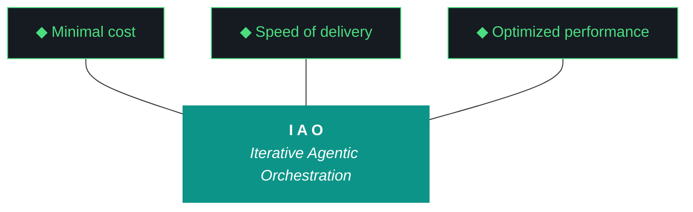

# kjtcom — Plan 10.68.0

**Iteration:** 10.68.0 (phase.iteration.run — `.0` = planning draft)
**Phase:** 10 (Harness Externalization + Retrospective)
**Date:** April 08, 2026
**Repo:** SOC-Foundry/kjtcom
**Machine:** NZXTcos (`~/dev/projects/kjtcom`)
**Wall clock target:** ~4-5 hours, no hard cap
**Executor:** Claude Code (`claude --dangerously-skip-permissions`) OR Gemini CLI (`gemini --yolo`)
**Launch incantation:** **"read claude and execute 10.68"** or **"read gemini and execute 10.68"**
**Input design doc:** `docs/kjtcom-design-10.68.0.md` (immutable per iaomw-G083)
**Input plan doc:** `docs/kjtcom-plan-10.68.0.md` (this file, immutable per iaomw-G083)
**Significance:** Last kjtcom-authored iteration that matters. Harvest everything into iao.

---

## 1. The Hard Rules

### Pillar 0 — No Git Writes
**You never run `git commit`, `git push`, or `git add`.** Read-only git only. `git mv` acceptable for rename tracking. `git checkout --` acceptable for rollback. All commits are manual by Kyle after iteration close.

### Pillar 6 — Zero Intervention
**You never ask Kyle for permission.** Log discrepancies, choose the safest forward path, proceed. Halt only on hard pre-flight BLOCKERS or destructive irreversible operations.

### W10 Closing Evaluator Non-Negotiable
The closing Qwen evaluator with `--graduation-assessment` is mandatory. Wall clock is not a valid reason to skip. If evaluator falls back through all tiers, document which tier failed and why, mark D11 as `blocked-by-evaluator`, but DO NOT skip the attempt.

---

## 2. The v10.66 and v10.67 Failure Modes You Must NOT Repeat

**v10.66's closing evaluator was skipped.** Agent rationalized it with "wall clock" despite having 50 minutes of slack on a 60-minute budget. Self-eval report with straight 9s resulted. This is forbidden.

**v10.67's evaluator ran but fell back to self-eval** because Tier 1 Qwen and Tier 2 Gemini Flash both failed for legitimate reasons (synthesis ratio, workstream grouping). The agent did the right thing — ran the evaluator honestly, documented the failures, produced self-eval with explicit fallback notice. This is acceptable if repeated in 10.68, but document which tier failed and why, and mark D11 as `blocked-by-evaluator` not `graduated`.

**The distinction matters:** skipping is a choice, failing is a circumstance. Never choose to skip.

---

## 3. Execution Rules

1. **`printf` for multi-line file writes** (iaomw-G001)
2. **`command ls`** for directory listings (iaomw-G022)
3. **Bash tool defaults to bash; wrap fish with `fish -c "..."`**
4. **No tmux in 10.68** — all workstreams synchronous
5. **Max 3 retries per error** (Pillar 7)
6. **`query_registry.py` first** for any diligence (iaomw-ADR base)
7. **Update build log as you go** — don't batch
8. **Never edit design or plan docs** (iaomw-G083)
9. **Never run git writes** (Pillar 0)
10. **Set `IAO_ITERATION=10.68.1`** in pre-flight (NOT `v10.68.1` — no `v` prefix post-10.68)
11. **Set `IAO_WORKSTREAM_ID=W<N>`** at start of each workstream
12. **Wall clock awareness** at each workstream boundary
13. **NEVER `cat ~/.config/fish/config.fish`** (Gemini leaks API keys)
14. **`pip install --break-system-packages`** always (no venv)
15. **W0 runs before anything else** — logger must be clean before any other workstream logs events

---

## 4. Pre-Flight Checklist

```fish
# 0. Set iteration env var FIRST (note: no 'v' prefix)
set -x IAO_ITERATION 10.68.1

# 1. Working directory
cd ~/dev/projects/kjtcom

# 2. Immutable inputs (BLOCKER)
command ls docs/kjtcom-design-10.68.0.md docs/kjtcom-plan-10.68.0.md

# 3. 10.67 outputs present (BLOCKER)
command ls docs/kjtcom-design-v10.67.md docs/kjtcom-plan-v10.67.md \
           docs/kjtcom-build-v10.67.md docs/kjtcom-report-v10.67.md \
           docs/kjtcom-context-v10_67.md

# 4. iao-middleware from 10.67 present (BLOCKER — W1 renames it)
command ls iao-middleware/iao_middleware/ iao-middleware/install.fish \
           iao-middleware/pyproject.toml iao-middleware/VERSION .iao.json

# 5. pip install -e verification (BLOCKER)
pip show iao-middleware 2>/dev/null | grep -i "version.*0.1.0" \
    || echo "BLOCKER: iao-middleware not installed from 10.67"

# 6. Current iao CLI works (BLOCKER)
iao --version 2>&1 | grep -q "0.1.0" || echo "BLOCKER: iao CLI broken"

# 7. Git read-only
git status --short
git log --oneline -5

# 8. Ollama + Qwen (BLOCKER — W10)
curl -s http://localhost:11434/api/tags > /dev/null && echo "ollama: ok" || echo "BLOCKER: ollama down"
ollama list | grep -i qwen || echo "BLOCKER: qwen not pulled"

# 9. Python deps (BLOCKER)
python3 -c "import litellm, jsonschema; print('python deps ok')"

# 10. Disk (BLOCKER if < 10G)
df -h ~ | tail -1

# 11. zip command available (BLOCKER for W9)
which zip || echo "BLOCKER: zip command missing, install via pacman"

# 12. Deploy paused flag (should be set from 10.67)
python3 -c "import json; d = json.load(open('.iao.json')); assert d.get('deploy_paused'), 'FAIL'; print('deploy_paused: ok')"

# 13. Snapshot G102 baseline (INFORMATIONAL)
# Capture current logger state to confirm v9.39 bug before W0 fix
grep -c '"iteration": "v9.39"' data/event_log.jsonl 2>/dev/null \
    || echo "event log not at expected path, W0 will investigate"
```

**BLOCKER summary:**
- Immutable inputs present
- 10.67 outputs present
- iao-middleware from 10.67 present
- pip shows iao-middleware 0.1.0
- `iao --version` works
- ollama + qwen
- python deps
- disk > 10G
- zip available

Any BLOCKER → halt with `PRE-FLIGHT BLOCKED: <reason>`, exit.

---

## 5. Build Log Template

Create `docs/kjtcom-build-10.68.1.md` immediately after pre-flight passes:

```markdown
# kjtcom — Build Log 10.68.1

**Iteration:** 10.68.1 (phase 10, iteration 68, run 1 — first execution)
**Agent:** <claude-code|gemini-cli>
**Date:** April 08, 2026
**Machine:** NZXTcos
**Run mode:** Bounded sequential, ~4-5 hour target, no cap
**Significance:** kjtcom's last meaningful iteration — harvest into iao
**Start:** <timestamp>

## Pre-Flight
## Discrepancies Encountered
## Execution Log (W0 - W10 sections)
## Files Changed
## New Files Created
## Files Deleted
## Wall Clock Log
## W2 Classification Summary
## W6 Sterilization Removals
## W10 Closing Evaluator Findings
## Graduation Deliverables Verification (D1-D11)
## Graduation Recommendation
## Files Changed Summary
## What Could Be Better
## Next Iteration Candidates

**End:** <timestamp>
**Total wall clock:** <duration>

---
*Build log 10.68.1 — produced by <agent>, April 08, 2026.*
```

Update continuously as workstreams complete.

---

## 6. Workstream Procedures

### W0 — G102 iao_logger Stale Iteration Fix

**Est:** 15 min
**Pri:** P0
**Deliverable:** D1
**Blocks on:** Pre-flight green

**Why first:** every other workstream logs events. If logger is stale, all 10.68.1 event logs will show the wrong iteration. W0 must run before any other logging occurs.

**Step 1 — Locate the logger:**

```fish
set -x IAO_WORKSTREAM_ID W0
cd ~/dev/projects/kjtcom

# Locate the logger (probably iao-middleware/iao_middleware/logger.py after 10.67 W3a)
find . -name "iao_logger.py" -o -name "logger.py" | grep -i iao 2>/dev/null
grep -rn "v9.39" iao-middleware/iao_middleware/ scripts/utils/ 2>/dev/null
```

**Step 2 — Read the source:**

Use view tool on the logger file. Find where `iteration` field is populated in event log entries. Identify the source of `v9.39`:
- Hardcoded default?
- Read from `.iao.json current_iteration` which is stale?
- Read from a cached state file?
- Not reading `IAO_ITERATION` env var at all?

**Step 3 — Apply fix with proper precedence:**

Logger must resolve iteration in this order:
1. `IAO_ITERATION` environment variable (primary)
2. `.iao.json current_iteration` field (fallback)
3. Raise `IaoLoggerMisconfigured` exception (no silent default)

```python
# Pseudocode for logger fix
import os, json, pathlib

def _resolve_iteration():
    env_val = os.environ.get("IAO_ITERATION")
    if env_val:
        return env_val
    try:
        iao_json = pathlib.Path(".iao.json")
        if iao_json.exists():
            data = json.loads(iao_json.read_text())
            if data.get("current_iteration"):
                return data["current_iteration"]
    except Exception:
        pass
    raise RuntimeError("IAO_ITERATION env var not set and .iao.json has no current_iteration")
```

**Step 4 — Update `.iao.json` current_iteration to 10.68.1:**

```fish
python3 -c "
import json, pathlib
p = pathlib.Path('.iao.json')
d = json.loads(p.read_text())
d['current_iteration'] = '10.68.1'
p.write_text(json.dumps(d, indent=2) + '\n')
print('current_iteration updated to 10.68.1')
"
```

**Step 5 — Write unit test:**

Create `iao-middleware/tests/test_logger.py`:
```python
import os, sys
sys.path.insert(0, '.')
# Test: env var set
os.environ["IAO_ITERATION"] = "test-1.2.3"
from iao_middleware.logger import log_event  # or whatever the entry point is
log_event("test_event", {"k": "v"})
# Read last line of event log, assert it contains "test-1.2.3"
# Unset env and test fallback to .iao.json
```

**Step 6 — Verification:**

```fish
# Write one test event
python3 -c "
import os
os.environ['IAO_ITERATION'] = '10.68.1'
from iao_middleware.logger import log_event
log_event('w0_verification', {'test': True})
"

# Confirm it landed with correct iteration
tail -1 data/event_log.jsonl | grep '"iteration": "10.68.1"' && echo "D1 PASS" || echo "D1 FAIL"
```

**Success:** D1 green. Event log entries from here on show `10.68.1`.

**Failure recovery:** if fix breaks logging entirely, `git checkout --` the logger file, mark D1 FAILED, continue iteration with known-broken telemetry. Graduation blocked but not halted.

---

### W1 — iao Rename

**Est:** 45 min
**Pri:** P0
**Deliverable:** D2
**Blocks on:** W0 complete

**Step 1 — Pre-diligence:**

```fish
set -x IAO_WORKSTREAM_ID W1

# Catalog all references that will need updating
grep -rln "iao-middleware\|iao_middleware" scripts/ iao-middleware/ 2>/dev/null | sort -u > /tmp/iao-refs.txt
wc -l /tmp/iao-refs.txt
```

**Step 2 — Rename the directory:**

```fish
mv iao-middleware iao
command ls iao/
```

**Step 3 — Rename the Python package:**

```fish
mv iao/iao_middleware iao/iao
command ls iao/iao/
```

**Step 4 — Update `pyproject.toml`:**

```fish
python3 -c "
import re, pathlib
p = pathlib.Path('iao/pyproject.toml')
content = p.read_text()
content = content.replace('name = \"iao-middleware\"', 'name = \"iao\"')
content = content.replace('iao_middleware', 'iao')
content = content.replace('iao = \"iao_middleware.cli:main\"', 'iao = \"iao.cli:main\"')
p.write_text(content)
print('pyproject.toml updated')
"
command cat iao/pyproject.toml
```

**Step 5 — Update internal imports (Python package):**

```fish
# Search and replace across all Python files in iao/iao/
find iao/iao -name "*.py" -print0 | while read -0 f
    sed -i 's|from iao_middleware\.|from iao.|g; s|import iao_middleware|import iao|g' $f
end
```

**Step 6 — Update `iao/__init__.py`:**

Verify it exports correctly:
```python
from iao.paths import find_project_root, IaoProjectNotFound
__version__ = "0.1.0"
__all__ = ["find_project_root", "IaoProjectNotFound", "__version__"]
```

**Step 7 — Update `iao/bin/iao` dispatcher:**

```fish
printf '#!/usr/bin/env bash
set -e
SCRIPT="$(readlink -f "${BASH_SOURCE[0]}")"
BIN_DIR="$(dirname "$SCRIPT")"
MIDDLEWARE_ROOT="$(dirname "$BIN_DIR")"
if ! python3 -c "import iao" 2>/dev/null; then
    export PYTHONPATH="$MIDDLEWARE_ROOT:$PYTHONPATH"
fi
exec python3 -m iao.cli "$@"
' > iao/bin/iao
chmod +x iao/bin/iao
```

**Step 8 — Update `iao/install.fish`:**

Search for `iao_middleware` or `iao-middleware` references in the install script, replace with `iao`. Key lines:
- package copy paths
- fish marker block content

**Step 9 — Update shims in `scripts/`:**

```fish
# query_registry shim
printf '#!/usr/bin/env python3
"""Shim for iao.registry."""
from iao.registry import main
if __name__ == "__main__":
    main()
' > scripts/query_registry.py
chmod +x scripts/query_registry.py

# build_context_bundle shim (will be renamed in W7, for now update)
printf '#!/usr/bin/env python3
"""Shim for iao.context_bundle (renamed to iao.bundle in W7)."""
from iao.context_bundle import main
if __name__ == "__main__":
    main()
' > scripts/build_context_bundle.py
chmod +x scripts/build_context_bundle.py
```

**Step 10 — Update `scripts/pre_flight.py` and `scripts/post_flight.py`:**

```fish
sed -i 's|from iao_middleware\.|from iao.|g' scripts/pre_flight.py scripts/post_flight.py
```

**Step 11 — Uninstall old package, install new:**

```fish
pip uninstall iao-middleware -y --break-system-packages 2>&1 | tail -5
pip install -e iao/ --break-system-packages 2>&1 | tail -10
```

**Step 12 — Verification gate:**

```fish
# pip shows new package
pip show iao | grep -i "name\|version"

# Python import works
python3 -c "import iao; print(iao.__version__)"

# CLI works with new name
iao --version
iao status

# Shim works
python3 scripts/query_registry.py "post-flight" | head -5

# Pre/post-flight imports resolve
python3 -c "from iao.doctor import run_all; print('doctor import ok')"
python3 scripts/pre_flight.py 2>&1 | head -20
```

**Step 13 — Regenerate MANIFEST.json:**

```fish
python3 -c "
import hashlib, json, pathlib
root = pathlib.Path('iao')
files = {}
for p in sorted(root.rglob('*')):
    if p.is_file() and '__pycache__' not in str(p) and '.pyc' not in str(p) and '.egg-info' not in str(p):
        rel = str(p.relative_to(root))
        h = hashlib.sha256(p.read_bytes()).hexdigest()[:16]
        files[rel] = h
manifest = {'version': '0.1.0', 'project_code': 'iaomw', 'generated': '2026-04-08', 'files': files}
pathlib.Path('iao/MANIFEST.json').write_text(json.dumps(manifest, indent=2))
print(f'manifest: {len(files)} files')
"
```

**Failure recovery:** if any import breaks and can't be fixed in 3 retries, `git checkout -- <file>` to revert. Continue with remaining files. Log in build doc. Mark D2 at risk.

**Success:** D2 green. `iao-middleware` is gone. `iao` is the only name.

---

### W2 — Classification Pass

**Est:** 40 min
**Pri:** P0
**Deliverable:** D3
**Blocks on:** W1 verification green

**Goal:** Produce `docs/classification-10.68.json` with every ADR, Pattern, and gotcha classified as `iaomw-*` or `kjtco-*`. NO writes to base.md or project.md in W2.

**Step 1 — Extract existing ADRs and Patterns:**

```fish
set -x IAO_WORKSTREAM_ID W2

# Find ADR headings in evaluator-harness.md
grep -nE "^### ADR-[0-9]+" docs/evaluator-harness.md > /tmp/adrs.txt
grep -nE "^### Pattern [0-9]+" docs/evaluator-harness.md > /tmp/patterns.txt
wc -l /tmp/adrs.txt /tmp/patterns.txt
```

**Step 2 — Extract gotchas:**

```fish
python3 -c "
import json
with open('data/gotcha_archive.json') as f:
    gs = json.load(f)
print(f'gotcha count: {len(gs)}')
for g in list(gs)[:5]:
    print(g)
"
```

**Step 3 — Apply classification heuristic:**

For each ADR/Pattern/gotcha, read the content and classify. Heuristic (remember: DEFAULT is `iaomw-*`):

| Classification signal | Tag |
|---|---|
| References `calgold`, `ricksteves`, `tripledb`, `bourdain`, `claw3d` | `kjtco-*` |
| References `Flutter`, `CanvasKit`, `Firestore`, `Huell Howser`, `kylejeromethompson` | `kjtco-*` |
| References kjtcom pipeline phase numbers | `kjtco-*` |
| References Pillars, Trident, IAO methodology | `iaomw-*` |
| References agent gotchas (heredocs, command ls, printf, API leaks) | `iaomw-*` |
| References evaluator mechanics (Qwen, Tier 1/2/3, synthesis ratio, rich context) | `iaomw-*` |
| References post-flight, pre-flight, build gatekeeper | `iaomw-*` |
| References script registry, gotcha registry, ADR stream | `iaomw-*` |
| References context bundle / bundle generation | `iaomw-*` |
| Ambiguous | **`iaomw-*` (default)** |

**Step 4 — Write classification JSON:**

```fish
python3 << 'PYEOF'
import json, pathlib, re

harness_path = pathlib.Path("docs/evaluator-harness.md")
gotcha_path = pathlib.Path("data/gotcha_archive.json")
out_path = pathlib.Path("docs/classification-10.68.json")

harness_text = harness_path.read_text()
gotchas = json.loads(gotcha_path.read_text())

KJTCO_SIGNALS = [
    "calgold", "ricksteves", "tripledb", "bourdain", "claw3d",
    "Flutter", "CanvasKit", "Firestore", "Huell Howser",
    "kylejeromethompson", "Riverpod", "map tab", "query editor",
]

def classify_text(text):
    tl = text.lower()
    for sig in KJTCO_SIGNALS:
        if sig.lower() in tl:
            return "kjtco", f"contains '{sig}'"
    return "iaomw", "default (no kjtcom-specific signal)"

# Extract ADRs
adrs = []
adr_pattern = re.compile(r'^### (ADR-\d+)[:\s]+(.+?)$', re.MULTILINE)
for m in adr_pattern.finditer(harness_text):
    adr_id = m.group(1)
    adr_title = m.group(2).strip()
    # Get the body until next ### or end
    start = m.end()
    next_m = re.search(r'^###\s', harness_text[start:], re.MULTILINE)
    body = harness_text[start:start+next_m.start()] if next_m else harness_text[start:start+2000]
    full_text = f"{adr_title} {body}"
    code, rationale = classify_text(full_text)
    # Extract number
    num = adr_id.replace("ADR-", "")
    new_id = f"{code}-ADR-{num.zfill(3)}"
    adrs.append({
        "original_id": adr_id,
        "original_title": adr_title,
        "new_id": new_id,
        "code": code,
        "rationale": rationale,
    })

# Extract Patterns
patterns = []
pat_pattern = re.compile(r'^### Pattern (\d+)[:\s]+(.+?)$', re.MULTILINE)
for m in pat_pattern.finditer(harness_text):
    num = m.group(1)
    title = m.group(2).strip()
    start = m.end()
    next_m = re.search(r'^###\s', harness_text[start:], re.MULTILINE)
    body = harness_text[start:start+next_m.start()] if next_m else harness_text[start:start+2000]
    full_text = f"{title} {body}"
    code, rationale = classify_text(full_text)
    new_id = f"{code}-Pattern-{num.zfill(2)}"
    patterns.append({
        "original_id": f"Pattern-{num}",
        "original_title": title,
        "new_id": new_id,
        "code": code,
        "rationale": rationale,
    })

# Classify gotchas
classified_gotchas = []
if isinstance(gotchas, list):
    gotcha_iter = gotchas
elif isinstance(gotchas, dict):
    gotcha_iter = gotchas.get("gotchas", [])
else:
    gotcha_iter = []

for g in gotcha_iter:
    gid = g.get("id", "unknown") if isinstance(g, dict) else str(g)
    title = g.get("title", "") if isinstance(g, dict) else ""
    desc = g.get("description", "") if isinstance(g, dict) else ""
    full_text = f"{title} {desc}"
    code, rationale = classify_text(full_text)
    num = re.sub(r'^G', '', gid).zfill(3)
    new_id = f"{code}-G{num}"
    classified_gotchas.append({
        "original_id": gid,
        "original_title": title,
        "new_id": new_id,
        "code": code,
        "rationale": rationale,
    })

summary = {
    "adrs_total": len(adrs),
    "adrs_iaomw": sum(1 for a in adrs if a["code"] == "iaomw"),
    "adrs_kjtco": sum(1 for a in adrs if a["code"] == "kjtco"),
    "patterns_total": len(patterns),
    "patterns_iaomw": sum(1 for p in patterns if p["code"] == "iaomw"),
    "patterns_kjtco": sum(1 for p in patterns if p["code"] == "kjtco"),
    "gotchas_total": len(classified_gotchas),
    "gotchas_iaomw": sum(1 for g in classified_gotchas if g["code"] == "iaomw"),
    "gotchas_kjtco": sum(1 for g in classified_gotchas if g["code"] == "kjtco"),
}

result = {
    "iteration": "10.68.1",
    "generated_at": "2026-04-08",
    "classification_default": "iaomw",
    "classification_note": "Default is iaomw (universal). Only unambiguously kjtcom-specific items classified as kjtco.",
    "summary": summary,
    "adrs": adrs,
    "patterns": patterns,
    "gotchas": classified_gotchas,
}

out_path.write_text(json.dumps(result, indent=2) + "\n")
print(f"Classification written: {out_path}")
print(f"Summary: {json.dumps(summary, indent=2)}")
PYEOF
```

**Step 5 — Log summary to build doc:**

Copy the summary section from stdout into the build log under "W2 Classification Summary."

**Success:** D3 green. `docs/classification-10.68.json` on disk with full classification audit trail.

**Failure mode:** if the regex extraction misses ADRs/Patterns (e.g., the headings have different format), document the miss count in build log, proceed with what was extracted. W3 uses what's in the JSON.

---

### W3 — Harness Split

**Est:** 35 min
**Pri:** P0
**Deliverable:** D4
**Blocks on:** W2 complete, `classification-10.68.json` on disk

**Step 1 — Create target directories:**

```fish
set -x IAO_WORKSTREAM_ID W3
mkdir -p iao/docs/harness
mkdir -p kjtco/docs/harness
```

**Step 2 — Read classification and original harness:**

```fish
test -f docs/classification-10.68.json || echo "BLOCKER: classification missing"
test -f docs/evaluator-harness.md || echo "BLOCKER: evaluator-harness.md missing"
```

**Step 3 — Extract iaomw content to `iao/docs/harness/base.md`:**

```python
# scripts/extract_harness.py (write this, run once, delete after)
import json, pathlib, re

classification = json.loads(pathlib.Path("docs/classification-10.68.json").read_text())
harness_text = pathlib.Path("docs/evaluator-harness.md").read_text()

# Map original IDs to new IDs and codes
adr_map = {a["original_id"]: a for a in classification["adrs"]}
pat_map = {p["original_id"]: p for p in classification["patterns"]}

# Extract sections from harness
def extract_sections(text, pattern, id_extractor):
    sections = []
    matches = list(re.finditer(pattern, text, re.MULTILINE))
    for i, m in enumerate(matches):
        start = m.start()
        end = matches[i+1].start() if i+1 < len(matches) else len(text)
        content = text[start:end].rstrip() + "\n"
        orig_id = id_extractor(m)
        sections.append((orig_id, content))
    return sections

adr_sections = extract_sections(
    harness_text,
    r'^### (ADR-\d+)',
    lambda m: m.group(1)
)
pat_sections = extract_sections(
    harness_text,
    r'^### Pattern (\d+)',
    lambda m: f"Pattern-{m.group(1)}"
)

# Split into base vs project
base_adrs = []
proj_adrs = []
for orig_id, content in adr_sections:
    entry = adr_map.get(orig_id)
    if not entry:
        print(f"WARN: unclassified ADR {orig_id}")
        continue
    # Rewrite heading to include new ID
    new_content = re.sub(
        r'^### ADR-\d+',
        f'### {entry["new_id"]}',
        content,
        count=1,
        flags=re.MULTILINE
    )
    if entry["code"] == "iaomw":
        base_adrs.append(new_content)
    else:
        proj_adrs.append(new_content)

base_pats = []
proj_pats = []
for orig_id, content in pat_sections:
    entry = pat_map.get(orig_id)
    if not entry:
        print(f"WARN: unclassified Pattern {orig_id}")
        continue
    new_content = re.sub(
        r'^### Pattern \d+',
        f'### {entry["new_id"]}',
        content,
        count=1,
        flags=re.MULTILINE
    )
    if entry["code"] == "iaomw":
        base_pats.append(new_content)
    else:
        proj_pats.append(new_content)

# Write base.md
base_md = f"""# iao — Base Harness

**Version:** 0.1.0
**Last updated:** 2026-04-08 (iteration 10.68.1 of kjtco extraction)
**Scope:** Universal iao methodology. Extended by project harnesses.

## The Trident



## The Ten Pillars (iaomw-Pillar-1 through iaomw-Pillar-10)

1. **iaomw-Pillar-1 (Trident)** — Cost / Delivery / Performance triangle
2. **iaomw-Pillar-2 (Artifact Loop)** — design → plan → build → report → bundle
3. **iaomw-Pillar-3 (Diligence)** — First action: query_registry.py
4. **iaomw-Pillar-4 (Pre-Flight Verification)** — Validate environment before execution
5. **iaomw-Pillar-5 (Agentic Harness Orchestration)** — Harness is the product
6. **iaomw-Pillar-6 (Zero-Intervention Target)** — Interventions are planning failures
7. **iaomw-Pillar-7 (Self-Healing Execution)** — Max 3 retries per error
8. **iaomw-Pillar-8 (Phase Graduation)** — MUST-have deliverables gate graduation
9. **iaomw-Pillar-9 (Post-Flight Functional Testing)** — Build is a gatekeeper
10. **iaomw-Pillar-10 (Continuous Improvement)** — iao push feedback loop

---

## ADRs ({len(base_adrs)} universal)

{chr(10).join(base_adrs)}

---

## Patterns ({len(base_pats)} universal)

{chr(10).join(base_pats)}

---

*base.md v0.1.0 — iaomw. Inviolable. Projects extend via <code>/docs/harness/project.md*
"""

pathlib.Path("iao/docs/harness/base.md").write_text(base_md)

# Write project.md
proj_md = f"""# kjtco Harness

**Extends:** iaomw v0.1.0
**Project code:** kjtco
**Status:** archiving after 10.68.X graduation
**Last updated:** 2026-04-08 (iteration 10.68.1)

**Base imports (acknowledged):**
- iaomw-Pillar-1..10
- iaomw-ADR-001..{len(base_adrs):03d}
- iaomw-Pattern-01..{len(base_pats):02d}

*Acknowledging base imports means kjtco has read them and operates under them.*

---

## Project ADRs ({len(proj_adrs)} kjtcom-specific)

{chr(10).join(proj_adrs)}

---

## Project Patterns ({len(proj_pats)} kjtcom-specific)

{chr(10).join(proj_pats)}

---

*project.md for kjtco — extends iaomw v0.1.0. Archiving after 10.68.X.*
"""

pathlib.Path("kjtco/docs/harness/project.md").write_text(proj_md)

print(f"base.md: {len(base_adrs)} ADRs, {len(base_pats)} Patterns")
print(f"project.md: {len(proj_adrs)} ADRs, {len(proj_pats)} Patterns")
```

Save as `/tmp/extract_harness.py` and run:
```fish
python3 /tmp/extract_harness.py
wc -l iao/docs/harness/base.md kjtco/docs/harness/project.md docs/evaluator-harness.md
rm /tmp/extract_harness.py
```

**Step 4 — Retire old harness file:**

```fish
printf '# evaluator-harness.md — RETIRED at 10.68.1

This file has been split into:

- `iao/docs/harness/base.md` (universal iaomw-* content)
- `kjtco/docs/harness/project.md` (kjtco-specific content)

**Split rationale:** see `docs/classification-10.68.json`.

**Enforcement:** see iaomw-ADR-003 (two-harness extension-only semantics) and `iao check harness`.

---

*Retired 2026-04-08. Do not edit this file.*
' > docs/evaluator-harness.md
```

**Step 5 — Verification:**

```fish
command ls iao/docs/harness/base.md kjtco/docs/harness/project.md
wc -l iao/docs/harness/base.md kjtco/docs/harness/project.md
grep -c "iaomw-ADR" iao/docs/harness/base.md
grep -c "kjtco-ADR" kjtco/docs/harness/project.md
```

**Success:** D4 green. Split on disk.

---

### W4 — `iao check harness` Alignment Tool

**Est:** 25 min
**Pri:** P0
**Deliverable:** D5
**Blocks on:** W3 complete

**Step 1 — Create `iao/iao/harness.py`:**

```python
"""iao harness alignment tool — enforces two-harness model."""
import re
import pathlib
from typing import List, Tuple

BASE_ID_PATTERN = re.compile(r'iaomw-(ADR|Pattern|Pillar|G)-?(\d+)')
PROJECT_ID_PATTERN = re.compile(r'([a-z]{5})-(ADR|Pattern|G)-?(\d+)')


class HarnessViolation:
    def __init__(self, rule: str, severity: str, message: str):
        self.rule = rule
        self.severity = severity  # "fail" | "warn"
        self.message = message

    def __repr__(self):
        return f"[{self.severity.upper()}] {self.rule}: {self.message}"


def parse_base_harness(path: pathlib.Path) -> dict:
    """Extract iaomw-* IDs from base.md."""
    if not path.exists():
        return {"ids": set(), "error": f"base.md not found at {path}"}
    text = path.read_text()
    ids = set()
    for m in BASE_ID_PATTERN.finditer(text):
        ids.add(f"iaomw-{m.group(1)}-{m.group(2)}")
    return {"ids": ids, "error": None}


def parse_project_harness(path: pathlib.Path) -> dict:
    """Extract project code, acknowledged base IDs, and local IDs from project.md."""
    if not path.exists():
        return {"code": None, "acknowledged": set(), "local_ids": set(), "error": f"project.md not found at {path}"}
    text = path.read_text()

    # Extract project code from header
    code_match = re.search(r'\*\*Project code:\*\*\s*([a-z]{5})', text)
    code = code_match.group(1) if code_match else None

    # Extract acknowledged base imports
    acknowledged = set()
    ack_match = re.search(r'\*\*Base imports \(acknowledged\):\*\*(.*?)(?=\n\n|\n\*)', text, re.DOTALL)
    if ack_match:
        for m in BASE_ID_PATTERN.finditer(ack_match.group(1)):
            acknowledged.add(f"iaomw-{m.group(1)}-{m.group(2)}")

    # Extract local IDs (should all be <code>-*)
    local_ids = set()
    for m in PROJECT_ID_PATTERN.finditer(text):
        if m.group(1) != "iaomw":  # iaomw references don't count as local definitions
            local_ids.add(f"{m.group(1)}-{m.group(2)}-{m.group(3)}")

    # Check for forbidden iaomw definitions in project file
    # A "definition" is an ID appearing as a heading (### iaomw-*)
    iaomw_definitions = set()
    for m in re.finditer(r'^### (iaomw-[A-Za-z]+-?\d+)', text, re.MULTILINE):
        iaomw_definitions.add(m.group(1))

    return {
        "code": code,
        "acknowledged": acknowledged,
        "local_ids": local_ids,
        "iaomw_definitions": iaomw_definitions,
        "error": None,
    }


def check_alignment(base_path: pathlib.Path, project_path: pathlib.Path) -> List[HarnessViolation]:
    """Run all three alignment rules."""
    violations = []
    base = parse_base_harness(base_path)
    proj = parse_project_harness(project_path)

    if base.get("error"):
        violations.append(HarnessViolation("setup", "fail", base["error"]))
        return violations
    if proj.get("error"):
        violations.append(HarnessViolation("setup", "fail", proj["error"]))
        return violations

    code = proj["code"]
    if not code:
        violations.append(HarnessViolation("A", "fail", "project harness missing **Project code:** header"))
        return violations

    # Rule A: ID collision — every local ID must have matching code prefix
    for lid in proj["local_ids"]:
        prefix = lid.split("-")[0]
        if prefix != code:
            violations.append(HarnessViolation("A", "fail", f"local ID {lid} does not match project code {code}"))

    # Rule B: base inviolability — no iaomw-* definitions in project file
    if proj["iaomw_definitions"]:
        for bad_id in proj["iaomw_definitions"]:
            violations.append(HarnessViolation("B", "fail", f"project defines {bad_id} — only base may define iaomw-* IDs"))

    # Rule C: acknowledgment currency — warn on unacknowledged base IDs
    unacknowledged = base["ids"] - proj["acknowledged"]
    if unacknowledged:
        for uid in sorted(unacknowledged):
            violations.append(HarnessViolation("C", "warn", f"base ID {uid} not in project acknowledgment list"))

    return violations


def cli_main():
    """Entry point for `iao check harness`."""
    import sys
    from iao.paths import find_project_root
    try:
        project_root = find_project_root()
    except Exception as e:
        print(f"[FAIL] cannot find project root: {e}", file=sys.stderr)
        return 1

    base_path = project_root / "iao" / "docs" / "harness" / "base.md"
    # Determine project code from .iao.json
    import json
    iao_json = project_root / ".iao.json"
    if not iao_json.exists():
        print("[FAIL] .iao.json not found", file=sys.stderr)
        return 1
    iao_data = json.loads(iao_json.read_text())
    proj_code = iao_data.get("project_code")
    if not proj_code:
        print("[FAIL] .iao.json missing project_code", file=sys.stderr)
        return 1

    project_path = project_root / proj_code / "docs" / "harness" / "project.md"
    violations = check_alignment(base_path, project_path)

    if not violations:
        print("[ok] harness alignment: clean")
        return 0

    fail_count = 0
    warn_count = 0
    for v in violations:
        print(v)
        if v.severity == "fail":
            fail_count += 1
        else:
            warn_count += 1

    print(f"\nSummary: {fail_count} FAIL, {warn_count} WARN")
    return 1 if fail_count else 0


if __name__ == "__main__":
    import sys
    sys.exit(cli_main())
```

**Step 2 — Wire into CLI:**

Edit `iao/iao/cli.py` to add `check harness` subcommand that calls `harness.cli_main()`.

**Step 3 — Write tests:**

Create `iao/tests/test_harness.py` with fixtures for clean, collision, base-definition-in-project, and stale-acknowledgment cases.

**Step 4 — Run against real harness:**

```fish
iao check harness
```

Should emit either clean or some Rule C warnings about base IDs not yet acknowledged. Zero Rule A/B failures expected.

**Success:** D5 green.

---

### W5 — 5-char Code Retagging Application

**Est:** 30 min
**Pri:** P0
**Deliverable:** D6
**Blocks on:** W4 complete

**Step 1 — Retag gotcha archive:**

```python
import json, pathlib, re

classification = json.loads(pathlib.Path("docs/classification-10.68.json").read_text())
gotcha_map = {g["original_id"]: g for g in classification["gotchas"]}

archive = json.loads(pathlib.Path("data/gotcha_archive.json").read_text())
# Assuming list format, adjust if dict
if isinstance(archive, list):
    for g in archive:
        orig = g.get("id")
        if orig in gotcha_map:
            g["code"] = gotcha_map[orig]["code"]
            g["new_id"] = gotcha_map[orig]["new_id"]
elif isinstance(archive, dict):
    for g in archive.get("gotchas", []):
        orig = g.get("id")
        if orig in gotcha_map:
            g["code"] = gotcha_map[orig]["code"]
            g["new_id"] = gotcha_map[orig]["new_id"]

pathlib.Path("data/gotcha_archive.json").write_text(json.dumps(archive, indent=2) + "\n")
print("gotcha archive retagged")
```

**Step 2 — Retag script registry:**

```python
import json, pathlib
registry = json.loads(pathlib.Path("data/script_registry.json").read_text())
for script in registry.get("scripts", []) if isinstance(registry, dict) else registry:
    path = script.get("path", "")
    if "iao/iao" in path or "iao_middleware" in path:
        script["code"] = "iaomw"
    else:
        # kjtcom-specific scripts (pipeline, app, etc.) → kjtco
        script["code"] = "kjtco"
pathlib.Path("data/script_registry.json").write_text(json.dumps(registry, indent=2) + "\n")
```

**Step 3 — Create `iao/projects.json`:**

```fish
printf '{
  "iaomw": {
    "name": "iao",
    "path": "self",
    "status": "phase-B",
    "registered": "2026-04-08",
    "description": "iao living template itself"
  },
  "kjtco": {
    "name": "kjtcom",
    "path": "~/dev/projects/kjtcom",
    "status": "archiving",
    "registered": "2026-04-08",
    "description": "POC project, archiving after 10.68.X graduation"
  },
  "intra": {
    "name": "tachtech-intranet",
    "path": null,
    "status": "planned",
    "registered": "2026-04-08",
    "description": "TachTech intranet GCP middleware — future iao consumer"
  }
}
' > iao/projects.json
```

**Step 4 — Update `.iao.json`:**

```fish
python3 -c "
import json, pathlib
p = pathlib.Path('.iao.json')
d = json.loads(p.read_text())
d['project_code'] = 'kjtco'
p.write_text(json.dumps(d, indent=2) + '\n')
"
```

**Step 5 — Verify:**

```fish
iao check config
```

**Success:** D6 green.

---

### W6 — Aggressive Sterilization Pass

**Est:** 40 min
**Pri:** P0
**Deliverable:** D7
**Blocks on:** W5 complete

**Step 1 — Baseline grep:**

```fish
set -x IAO_WORKSTREAM_ID W6

# Find every kjtcom-specific reference in iao/
grep -rn "kjtcom\|calgold\|ricksteves\|tripledb\|bourdain\|claw3d\|kylejeromethompson\|Huell Howser\|CanvasKit" iao/ 2>/dev/null > /tmp/sterilization-hits.txt
wc -l /tmp/sterilization-hits.txt
command cat /tmp/sterilization-hits.txt
```

**Step 2 — Create sterilization log:**

```fish
printf '# Sterilization Log 10.68.1

**Purpose:** Document every kjtcom-specific reference removed from iao/ during W6.

**Generated:** 2026-04-08

---

## Baseline hits

<paste /tmp/sterilization-hits.txt contents>

---

## Removals / Rewrites

' > iao/docs/sterilization-log-10.68.md
```

**Step 3 — For each hit, decide and apply:**

Hits typically fall into categories:
- **README examples:** rewrite `"kjtcom uses iao"` → `"your project uses iao"`
- **Install.fish comments:** remove kjtcom-specific cp lines
- **Test fixtures:** replace `"kjtcom"` fixture names with `"testproj"`
- **ADR text in base.md:** if base.md has leaked kjtcom references (W2/W3 misclassification), MOVE the offending ADR to project.md (classification recovery)
- **Example JSON in docs:** replace kjtcom examples with generic `"your-project"`

Log every change to `iao/docs/sterilization-log-10.68.md` with before/after.

**Step 4 — Final grep:**

```fish
grep -rn "kjtcom\|calgold\|ricksteves\|tripledb\|bourdain\|claw3d\|kylejeromethompson\|Huell Howser" iao/ 2>/dev/null
# Should emit nothing
```

**Step 5 — Run iao tests to confirm sterilization didn't break anything:**

```fish
python3 -m pytest iao/tests/ 2>&1 | tail -20
# OR if no pytest:
python3 iao/tests/test_paths.py
python3 iao/tests/test_doctor.py
python3 iao/tests/test_harness.py
```

**Success:** D7 green. Zero kjtcom references in iao/. Sterilization log on disk.

**Partial-success handling:** if any test breaks, document in sterilization log as "could not sterilize X because test Y depends on it — deferred to P3 bring-up sterilization round 2." Mark D7 as PARTIAL, not FAIL.

---

### W7 — Bundle Rename + Full Spec

**Est:** 30 min
**Pri:** P0
**Deliverable:** D8
**Blocks on:** W6 complete

**Step 1 — Rename module:**

```fish
set -x IAO_WORKSTREAM_ID W7
mv iao/iao/context_bundle.py iao/iao/bundle.py
# Update internal import if context_bundle imports itself
sed -i 's|context_bundle|bundle|g' iao/iao/bundle.py
# Update __init__.py if it references context_bundle
sed -i 's|context_bundle|bundle|g' iao/iao/__init__.py 2>/dev/null || true
```

**Step 2 — Update scripts/ shim and create new name:**

```fish
# New name: scripts/build_bundle.py
printf '#!/usr/bin/env python3
"""Shim for iao.bundle."""
from iao.bundle import main
if __name__ == "__main__":
    main()
' > scripts/build_bundle.py
chmod +x scripts/build_bundle.py

# Old name: scripts/build_context_bundle.py becomes deprecation stub
printf '#!/usr/bin/env python3
"""DEPRECATED: use scripts/build_bundle.py instead."""
import sys
print("DEPRECATION: scripts/build_context_bundle.py is deprecated, use scripts/build_bundle.py", file=sys.stderr)
from iao.bundle import main
if __name__ == "__main__":
    main()
' > scripts/build_context_bundle.py
chmod +x scripts/build_context_bundle.py
```

**Step 3 — Rewrite `iao/iao/bundle.py` with full spec:**

The bundle generator needs to produce a bundle with 26 possible items per design §10. Minimum 10 always included. Use view tool to read current context_bundle.py, then rewrite main() to:

1. Collect all 10 minimum items (paths known from .iao.json + project layout)
2. Collect iteration-dependent items (check for existence, include if present)
3. Collect diagnostic tails (event log, evaluator log, pre/post flight logs — last 500/N lines)
4. Collect computed sections (file inventory with sha256_16, delta, pipeline state, environment)
5. Apply exclusion filter (never touch ~/.config/fish/config.fish, SA creds, Firebase tokens, .env, Firestore exports, pipeline data)
6. Write to `docs/<project>-bundle-<iteration>.md`

**Step 4 — Test-generate:**

```fish
python3 scripts/build_bundle.py --iteration 10.68.1
command ls -l docs/kjtcom-bundle-10.68.1.md
# Size check
du -h docs/kjtcom-bundle-10.68.1.md
# Minimum items check
for item in "## §1" "## §2" "## §3" "## §4" "## §5" "## §6" "## §7" "## §8" "## §9" "## §10"
    grep -q "$item" docs/kjtcom-bundle-10.68.1.md && echo "$item: present" || echo "$item: MISSING"
end
```

Target size: 600KB-1MB. Smaller is acceptable if content is complete; larger is fine.

**Step 5 — Verify shim works:**

```fish
python3 scripts/build_context_bundle.py --iteration 10.68.1 2>&1 | head -3
# Should print DEPRECATION warning to stderr, still produce bundle
```

**Success:** D8 green.

---

### W8 — `iao push` Skeleton

**Est:** 20 min
**Pri:** P0
**Deliverable:** D9
**Blocks on:** W7 complete

**Step 1 — Create `iao/iao/push.py`:**

```python
"""iao push — continuous improvement feedback loop skeleton.

v10.68: skeleton only, does not push to github. Emits PR draft to stdout.
"""
import pathlib
import re
import json
from typing import List


def scan_candidates(project_harness_path: pathlib.Path) -> List[dict]:
    """Find entries tagged scope: universal-candidate in project harness."""
    if not project_harness_path.exists():
        return []

    text = project_harness_path.read_text()
    candidates = []

    # Look for entries with "scope: universal-candidate" marker
    # This is tagged in a metadata block after each ADR/Pattern
    pattern = re.compile(
        r'^### ([a-z]{5}-(?:ADR|Pattern)-\d+)[:\s]+(.+?)$(.+?)(?=^###\s|\Z)',
        re.MULTILINE | re.DOTALL
    )

    for m in pattern.finditer(text):
        entry_id = m.group(1)
        title = m.group(2).strip()
        body = m.group(3)
        if "scope: universal-candidate" in body.lower():
            candidates.append({
                "id": entry_id,
                "title": title,
                "body": body.strip(),
            })

    return candidates


def generate_pr_draft(candidates: List[dict], project_code: str, iteration: str) -> str:
    """Produce a PR draft body for github.com/tachtech-engineering/iao."""
    if not candidates:
        return ""

    lines = [
        f"# iao push from {project_code} {iteration}",
        "",
        f"**Project:** {project_code}",
        f"**Iteration:** {iteration}",
        f"**Candidates:** {len(candidates)}",
        "",
        "## Proposed promotions to iaomw",
        "",
    ]

    for c in candidates:
        lines.append(f"### Promote {c['id']} → iaomw-*")
        lines.append(f"**Original title:** {c['title']}")
        lines.append("")
        lines.append(c["body"])
        lines.append("")
        lines.append("**Origin (will be preserved in metadata footer):** "
                     f"`origin: {project_code} {iteration}, promoted to iaomw v<TBD>`")
        lines.append("")
        lines.append("---")
        lines.append("")

    return "\n".join(lines)


def cli_main():
    """Entry point for `iao push`."""
    import sys
    from iao.paths import find_project_root

    try:
        project_root = find_project_root()
    except Exception as e:
        print(f"[FAIL] cannot find project root: {e}", file=sys.stderr)
        return 1

    iao_json = project_root / ".iao.json"
    if not iao_json.exists():
        print("[FAIL] .iao.json not found", file=sys.stderr)
        return 1

    data = json.loads(iao_json.read_text())
    project_code = data.get("project_code")
    iteration = data.get("current_iteration", "unknown")

    if not project_code:
        print("[FAIL] .iao.json missing project_code", file=sys.stderr)
        return 1

    project_harness = project_root / project_code / "docs" / "harness" / "project.md"

    candidates = scan_candidates(project_harness)

    if not candidates:
        print("no universal candidates found, nothing to push")
        return 0

    draft = generate_pr_draft(candidates, project_code, iteration)

    print("=" * 60)
    print("10.68: github push deferred, draft only")
    print("=" * 60)
    print(draft)
    print("=" * 60)
    print(f"\n{len(candidates)} candidate(s) found. Draft above.")
    print("In a future iteration, this draft will be submitted as a PR to")
    print("github.com/tachtech-engineering/iao automatically.")

    return 0


if __name__ == "__main__":
    import sys
    sys.exit(cli_main())
```

**Step 2 — Wire into CLI:**

Add `iao push` subcommand in `iao/iao/cli.py`.

**Step 3 — Add a test candidate temporarily:**

Add to `kjtco/docs/harness/project.md` at the end, inside an existing Pattern section:
```markdown
**Metadata:** scope: universal-candidate
```

**Step 4 — Test:**

```fish
iao push
```

Should print deprecation-style header + PR draft with the one candidate detected.

**Step 5 — Remove test candidate:**

After verification, remove the `scope: universal-candidate` line so 10.68.1's bundle doesn't ship with a fake entry.

```fish
sed -i '/scope: universal-candidate/d' kjtco/docs/harness/project.md
```

**Step 6 — Re-run iao push to confirm zero candidates:**

```fish
iao push
# Should print "no universal candidates found, nothing to push"
```

**Success:** D9 green.

---

### W9 — P3 Delivery Zip + Handoff Doc

**Est:** 25 min
**Pri:** P0
**Deliverable:** D10
**Blocks on:** W8 complete

**Step 1 — Create deliverables directory:**

```fish
set -x IAO_WORKSTREAM_ID W9
mkdir -p deliverables
```

**Step 2 — Create `iao-p3-bootstrap.md`:**

```fish
printf '# iao P3 Bootstrap Guide

**Target machine:** tsP3-cos (ThinkStation P3 Ultra)
**iao version:** 0.1.0-alpha
**Delivered:** 2026-04-08 from kjtcom 10.68.1
**First iteration on P3:** `iao-design-0.0.0.md` (Phase 0 iteration 0 run 0)

---

## What this is

`iao-v0.1.0-alpha.zip` contains the initial iao template extracted from kjtcom.
This is the bring-up package for starting iao as its own project on P3.

This is Phase B of iao externalization. Phase 0 on P3 begins when you extract
this zip and run `iao status` for the first time.

---

## Prerequisites

- fish shell (>= 3.6)
- Python 3.11+
- git
- A terminal emulator (konsole, kitty, alacritty, etc.)
- ~10 GB disk space (iao itself is small; bundle artifacts accumulate)
- No CUDA required (P3 has no GPU; iao base is CPU-only)

---

## Extract

```fish
mkdir -p ~/dev/projects
cd ~/dev/projects
unzip /path/to/iao-v0.1.0-alpha.zip
mv iao-v0.1.0-alpha iao
cd iao
```

---

## Install

```fish
fish install.fish
```

The installer:
1. Copies iao/ package to ~/iao/
2. Adds bin/ to PATH via fish config marker block
3. Runs compatibility checks (expect some NZXT-specific entries to FAIL — acceptable)
4. Runs `iao --version` to confirm installation

---

## Verify

```fish
iao --version   # should print 0.1.0
iao status      # project, middleware, hooks
iao check config  # resolution map
iao check harness  # alignment (should be clean — no project harness yet)
```

---

## First iteration on P3: `iao-design-0.0.0.md`

Phase 0 on P3 = "iao bring-up and validate on non-kjtcom machine."

Your first iteration objectives:
1. Install iao cleanly from this zip
2. Run `iao status` and `iao check config` successfully
3. Discover any sterilization gaps kjtcom missed (things hardcoded for NZXT, assumptions about Flutter, etc.)
4. Initialize iao/ as its own git repo (local only, no remote yet)
5. Create `iao-design-0.0.0.md`, `iao-plan-0.0.0.md` planning artifacts for the next iteration

Produce a bundle at 0.0.1 close that NZXT planning chat can review to decide
next iaomw sterilization rounds.

---

## What stays on NZXT

kjtcom itself stays on NZXT in archive mode. No kjtcom work from P3.

---

## Handoff notes

- The 5-character project code for iao itself is `iaomw`. Registered in
  `iao/projects.json`.
- P3 does NOT yet have a 5-char code because P3 is not a project — it is
  a machine running iao. iao on P3 is iao-the-project.
- If you want P3-specific middleware someday, that would be a different
  5-char code (e.g., `p3mcc` or similar) for a new project consuming iao.

---

## iao push from P3 (not yet)

In 10.68 the iao push command is a skeleton. It does not actually push to
github. Once validated locally on P3 (and after you manually push iao to
github.com/tachtech-engineering/iao as iao v0.2.0), the full loop becomes
live.

Until then: iterate on P3, collect learnings, bundle them, hand bundles
back to NZXT planning chat for review and next-iteration planning.

---

*iao-p3-bootstrap.md — delivered with iao-v0.1.0-alpha.zip from kjtcom 10.68.1.*
' > iao-p3-bootstrap.md
```

**Step 3 — Build the zip:**

```fish
# Stage iao into a temp dir that will become the zip root
rm -rf /tmp/iao-v0.1.0-alpha
mkdir -p /tmp/iao-v0.1.0-alpha

# Copy iao/ contents
cp -r iao/* /tmp/iao-v0.1.0-alpha/
cp iao-p3-bootstrap.md /tmp/iao-v0.1.0-alpha/

# Exclude egg-info and pycache
find /tmp/iao-v0.1.0-alpha -name "__pycache__" -type d -exec rm -rf {} + 2>/dev/null
find /tmp/iao-v0.1.0-alpha -name "*.pyc" -delete 2>/dev/null
find /tmp/iao-v0.1.0-alpha -name "*.egg-info" -type d -exec rm -rf {} + 2>/dev/null

# Zip it
cd /tmp
zip -r iao-v0.1.0-alpha.zip iao-v0.1.0-alpha/ -x '*.pyc' -x '*/__pycache__/*' -x '*.egg-info/*'

# Move to deliverables
mv iao-v0.1.0-alpha.zip ~/dev/projects/kjtcom/deliverables/
rm -rf /tmp/iao-v0.1.0-alpha

cd ~/dev/projects/kjtcom
command ls -la deliverables/
```

**Step 4 — Verify zip contents:**

```fish
unzip -l deliverables/iao-v0.1.0-alpha.zip | head -40
unzip -l deliverables/iao-v0.1.0-alpha.zip | tail -5
# Expected: README.md, CHANGELOG.md, VERSION, pyproject.toml, install.fish, bin/iao, iao/*.py, docs/, iao-p3-bootstrap.md
```

**Step 5 — Move handoff doc:**

```fish
# Keep iao-p3-bootstrap.md at project root for Kyle's reference
command ls iao-p3-bootstrap.md
```

**Success:** D10 green. Zip ready.

---

### W10 — Closing Sequence with Qwen Tier 1 + Graduation Analysis

**Est:** 20 min
**Pri:** P0
**Deliverable:** D11
**Blocks on:** W9 complete

**This is mandatory. Do not skip.**

**Step 1 — Iteration delta snapshot:**

```fish
set -x IAO_WORKSTREAM_ID W10
python3 scripts/iteration_deltas.py --snapshot 10.68.1 2>&1 | tee /tmp/delta-10.68.1.log
```

**Step 2 — Sync script registry:**

```fish
python3 scripts/sync_script_registry.py 2>&1 | tee /tmp/registry-sync-10.68.1.log
```

**Step 3 — Build 10.68.1 bundle:**

```fish
python3 scripts/build_bundle.py --iteration 10.68.1
command ls -l docs/kjtcom-bundle-10.68.1.md
# Must exist and be > 600KB
```

**Step 4 — RUN THE EVALUATOR:**

```fish
python3 scripts/run_evaluator.py \
    --iteration 10.68.1 \
    --rich-context \
    --verbose 2>&1 | tee /tmp/eval-10.68.1.log
```

If the evaluator supports a `--graduation-assessment` flag, use it. If not, parse the output manually for deliverable evidence.

**Step 5 — Parse evaluator output:**

```fish
# Extract tier, synthesis ratio, scores
grep -E "tier used|synthesis_ratio|score|graduation" /tmp/eval-10.68.1.log
```

**Step 6 — Post-flight:**

```fish
python3 scripts/post_flight.py 10.68.1 2>&1 | tee /tmp/postflight-10.68.1.log
# Should exit clean — deploy_paused flag handles deployed_* checks
```

**Step 7 — Write build log W10 section + graduation verification:**

Append to `docs/kjtcom-build-10.68.1.md`:

```markdown
## W10 Closing Evaluator Findings

Tier used: <from log>
Synthesis ratio: <from log>
Overall score: <from log>

## Graduation Deliverables Verification

| # | Deliverable | W# | Status | Evidence |
|---|---|---|---|---|
| D1 | G102 logger fix | W0 | [PASS/FAIL] | <event log tail shows 10.68.1> |
| D2 | iao rename | W1 | [PASS/FAIL] | <pip show iao, iao --version> |
| D3 | Classification audit | W2 | [PASS/FAIL] | <docs/classification-10.68.json size + summary> |
| D4 | Harness split | W3 | [PASS/FAIL] | <base.md + project.md line counts> |
| D5 | iao check harness | W4 | [PASS/FAIL] | <iao check harness output> |
| D6 | 5-char retagging | W5 | [PASS/FAIL] | <gotcha archive has code field> |
| D7 | Sterilization | W6 | [PASS/FAIL] | <zero kjtcom hits in iao/> |
| D8 | Bundle rename + spec | W7 | [PASS/FAIL] | <kjtcom-bundle-10.68.1.md size + sections> |
| D9 | iao push skeleton | W8 | [PASS/FAIL] | <iao push returns clean> |
| D10 | P3 delivery zip | W9 | [PASS/FAIL] | <deliverables/iao-v0.1.0-alpha.zip exists> |
| D11 | Evaluator ran | W10 | [PASS/FAIL] | <eval-10.68.1.log exists, tier documented> |

## Graduation Recommendation

<one of:>
- **GRADUATE TO 10.69.0:** All D1-D11 green. Kyle's review + approval produces 10.69.0 planning.
- **RERUN AS 10.68.2:** D<N> failed. Next iteration is 10.68.2 with targeted scope on failed deliverables.
- **BLOCKED BY EVALUATOR:** D11 fell back to self-eval; graduation decision deferred to human review of bundle.

Bundle awaits review at: docs/kjtcom-bundle-10.68.1.md
```

**Step 8 — Write report:**

`docs/kjtcom-report-10.68.1.md` using real evaluator output (NOT self-eval unless evaluator actually failed and fell back).

**Step 9 — Verify all artifacts on disk:**

```fish
command ls docs/kjtcom-design-10.68.0.md \
           docs/kjtcom-plan-10.68.0.md \
           docs/kjtcom-build-10.68.1.md \
           docs/kjtcom-report-10.68.1.md \
           docs/kjtcom-bundle-10.68.1.md \
           docs/classification-10.68.json \
           iao/docs/sterilization-log-10.68.md \
           deliverables/iao-v0.1.0-alpha.zip
```

**Step 10 — Git read-only:**

```fish
git status --short
git log --oneline -5
```

**Step 11 — Handback stdout:**

```fish
printf '
==============================================
10.68.1 COMPLETE — GRADUATION ASSESSMENT
==============================================

MUST-have Deliverables: <N>/11 green

Qwen tier used: <tier>
Qwen graduation_assessment: <value>

RECOMMENDATION: <GRADUATE | RERUN 10.68.2 | BLOCKED>

Artifacts on disk:
- docs/kjtcom-design-10.68.0.md
- docs/kjtcom-plan-10.68.0.md
- docs/kjtcom-build-10.68.1.md
- docs/kjtcom-report-10.68.1.md
- docs/kjtcom-bundle-10.68.1.md
- docs/classification-10.68.json (sidecar)
- iao/docs/sterilization-log-10.68.md (sidecar)
- deliverables/iao-v0.1.0-alpha.zip

Awaiting human review of bundle and graduation decision.
'
```

**STOP.** Do not commit. Do not push. Do not graduate automatically.

**Success:** D11 green. Graduation recommendation emitted.

---

## 7. Definition of Done

All D1-D11 from design §11 verified at W10 close. Plus:

- 5 primary artifacts on disk (design 10.68.0, plan 10.68.0, build 10.68.1, report 10.68.1, bundle 10.68.1)
- 2 sidecars: classification-10.68.json, sterilization-log-10.68.md
- Deliverables: iao-v0.1.0-alpha.zip + iao-p3-bootstrap.md
- Bundle ≥ 600KB with all 10 minimum items
- Zero git writes
- Graduation recommendation in build log AND stdout handback

---

## 8. Failure Modes Quick Reference

| Failure | Action |
|---|---|
| Pre-flight BLOCKER | Halt. `PRE-FLIGHT BLOCKED: <reason>`. Exit. |
| W0 logger fix breaks logging entirely | `git checkout -- <logger>`. Mark D1 FAIL. Continue. |
| W1 import break after 3 retries | `git checkout -- <file>`. Continue. Log tech debt. Mark D2 at risk. |
| W2 classification produces obviously-wrong splits | Log in build doc. Continue. Human reviews JSON at graduation. |
| W3 harness split loses content (line count mismatch) | Re-run W3 extraction from W2 JSON once. If still broken, document and continue. |
| W4 iao check harness false positives | Tune rules, re-run. If persistent, WARN not FAIL. |
| W5 retagging corrupts JSON | `git checkout --` gotcha archive. Re-run carefully. |
| W6 sterilization breaks iao tests | Revert specific change. Document as partial sterilization. Mark D7 PARTIAL. |
| W7 bundle generator fails on one section | Debug, continue. Ship bundle minus broken section if critical path works. |
| W8 iao push scans nothing | Expected first-run. Print "no candidates" and succeed. |
| W9 zip creation fails | Debug paths. Retry. Mark D10 FAIL if unresolvable. |
| **W10 evaluator falls back to self-eval AGAIN** | **Document which tier failed. Mark D11 as `blocked-by-evaluator`. Do NOT claim graduation. Kyle reviews bundle manually.** |
| Wall clock > 6 hours | Triage. W4/W8 can stub. W9/W10 MUST run. |
| **Agent wants to skip W10 evaluator** | **Re-read §2. Not acceptable. Run it.** |
| Any git write attempted | Pillar 0 violation. Halt. |

---

## 9. Launch

When Kyle says **"read claude and execute 10.68"** or **"read gemini and execute 10.68"**:

1. Acknowledge in one line
2. Read `CLAUDE.md` or `GEMINI.md` end-to-end (whichever matches agent)
3. Read `docs/kjtcom-design-10.68.0.md` end-to-end
4. Read `docs/kjtcom-plan-10.68.0.md` end-to-end (this file)
5. Create `docs/kjtcom-build-10.68.1.md` from §5 template
6. Run pre-flight §4, capture to build log
7. Begin W0 (logger fix — must be first)
8. Progress through W1 → W10 sequentially
9. W10 closing sequence in full (including evaluator)
10. Write build log final sections with graduation verification table
11. Emit handback with graduation recommendation
12. **STOP.** Do not commit.

---

*Plan 10.68.0 — April 08, 2026. Authored by the planning chat. First iteration using phase.iteration.run three-number format.*
