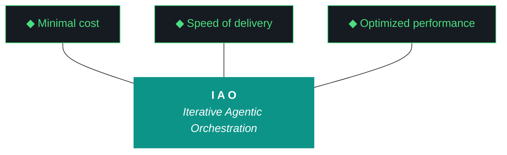

# kjtcom — Iteration Plan v10.63

**Iteration:** v10.63
**Phase:** 10 (Platform Hardening)
**Date:** April 06, 2026
**Executing agent:** Claude Code (`claude --dangerously-skip-permissions`)
**Reads:** `CLAUDE.md` (root) and this plan doc
**Pairs with:** `kjtcom-design-v10.63.md`
**Hard contract:** No `git commit`, no `git push`, no git writes. Manual git only.

This plan is the immutable INPUT artifact (Pillar 2). Do not rewrite it during execution. Produce `kjtcom-build-v10.63.md` and `kjtcom-report-v10.63.md` as OUTPUT artifacts.

---

## 1. Objectives

1. Get the Qwen evaluator producing valid reports again. Three iterations of Tier 3 self-grading is the dataset corruption ceiling. (W1)
2. Repair the evaluator harness from layered sediment back into a coherent operating manual. (W2)
3. Close the post-flight gap that let G60 ship to production. (W3)
4. Resolve G45 with a structural fix, not an eighth workaround. (W4)
5. Harden the Parts Unknown acquisition path and complete Phase 2. (W5)
6. Sync the public README with the actual project state. (W6)

The implicit objective above all of these: stop self-grading. The v10.62 report scored itself 8-10 across the board with no evaluator running. v10.63 is allowed to score lower as long as the scores are real.

---

## 2. Trident Targets

| Prong | Target | How measured |
|-------|--------|--------------|
| Cost | < 80,000 LLM tokens (Qwen excluded; it is local) | Sum `llm_call.tokens` from `data/iao_event_log.jsonl`. |
| Delivery | 6/6 workstreams complete | Qwen scorecard. Self-grading capped at 7/10 in code. |
| Performance | Five concrete checks (see §10 Definition of Done) | Direct file/system inspection. |

---

## 3. Trident Mermaid Chart (Locked Colors)



---

## 4. The Ten Pillars of IAO (Verbatim)

1. **Trident** — Cost / Delivery / Performance triangle governs every decision
2. **Artifact Loop** — design → plan (INPUT, immutable) → build → report (OUTPUT, agent-produced)
3. **Diligence** — Read before you code; pre-read is a middleware function
4. **Pre-Flight Verification** — Validate environment before execution
5. **Agentic Harness Orchestration** — The harness is the product; the model is the engine
6. **Zero-Intervention Target** — Interventions are failures in planning
7. **Self-Healing Execution** — Max 3 retries per error with diagnostic feedback
8. **Phase Graduation** — Sandbox → staging → production
9. **Post-Flight Functional Testing** — Rigorous validation of all deliverables
10. **Continuous Improvement** — Retrospectives feed directly into the next plan

---

## 5. Pre-Flight Checklist (Pillar 4)

Run these BEFORE starting W1. Capture the output in `kjtcom-build-v10.63.md` § Pre-Flight.

```fish
# Working directory
cd ~/Development/Projects/kjtcom    # tsP3-cos
# OR
cd ~/dev/projects/kjtcom            # NZXTcos

# Verify clean working tree (do not modify; just observe)
git status --short

# Confirm immutable artifacts exist
command ls docs/kjtcom-design-v10.63.md docs/kjtcom-plan-v10.63.md CLAUDE.md

# Confirm last iteration's artifacts exist
command ls docs/kjtcom-build-v10.62.md docs/kjtcom-report-v10.62.md

# Ollama running and Qwen available
ollama list | grep -i qwen
curl -s http://localhost:11434/api/tags | head -20

# Python env
python3 --version
python3 -c "import litellm, jsonschema; print('ok')"

# Flutter env (W4)
flutter --version
flutter pub deps --no-dev 2>&1 | head -5

# CUDA available (W5, only on NZXTcos)
nvidia-smi --query-gpu=name,memory.free --format=csv

# Site is currently up
curl -s -o /dev/null -w "%{http_code}\n" https://kylejeromethompson.com

# Bot is currently up
curl -s https://kylejeromethompson.com/bot/status 2>/dev/null || echo "bot status check via tg required"
```

If any of these fail, **stop and report**. Do not proceed with broken pre-flight.

---

## 6. Workflow Execution Order

W1 → W2 → W3 → (W4 ∥ W5) → W6 → post-flight → generate artifacts → run evaluator → close.

---

## 7. Workstream Workflows

### W1: Qwen Evaluator Repair via Rich Context (P0)

**Goal:** Qwen3.5:9b produces a valid, schema-passing evaluation report for v10.62 (retroactive) and v10.63 (this iteration).

**Files in scope:**
- `scripts/run_evaluator.py`
- `scripts/build_evaluator_prompt.py` (create if missing)
- `eval_schema.json`
- `data/agent_scores.json`
- `docs/evaluator-harness.md` (read-only here; modified in W2)
- `docs/kjtcom-report-v10.62-qwen.md` (new output)

**Steps:**

1. Read the existing `scripts/run_evaluator.py` end to end. Identify where the prompt is assembled and where the schema is validated.
2. Pull the v10.59 report (last known good Qwen output) and identify what made it work. That report is your precedent baseline.
3. Create `scripts/build_evaluator_prompt.py` (or refactor inline) to assemble the rich-context bundle:

```
SYSTEM: [identity + role + 10 pillars + ADRs + scoring rules — from harness]
CONTEXT:
  - Design doc (full)
  - Plan doc (full)
  - Build log (full)
  - The 4-tier scoring rubric
  - Last 3 successful evaluation reports (precedent examples)
  - Relevant gotchas (any Gxx referenced in build log)
USER: Evaluate iteration v{X.XX}. Produce a JSON evaluation matching the schema.
```

4. Loosen `eval_schema.json`:
   - Keep priority enum `["P0","P1","P2","P3"]`.
   - Keep outcome enum `["complete","partial","blocked","skipped"]`.
   - Keep score range 0-10.
   - **Loosen** `evidence` field from a strict object schema to `{"type": "string", "minLength": 20}`. Qwen is better at writing short evidence strings than at filling structured sub-objects.
5. Add CLI flags:
   - `--rich-context` (default: True)
   - `--verbose` (default: False; logs prompt size, raw response preview, validation errors)
   - `--iteration <vX.XX>` (required)
   - `--retroactive` (when set, evaluator runs against an older iteration's artifacts)
6. Implement Tier 3 hard cap in code. Pseudocode:
   ```python
   if tier_used == "self-eval":
       for ws in report["workstreams"]:
           if ws["score"] > 7:
               ws["score_raw"] = ws["score"]
               ws["score"] = 7
               ws["score_note"] = "Self-grading cap applied (ADR-015)"
   ```
7. Run the retroactive eval for v10.62:
   ```fish
   python3 scripts/run_evaluator.py --iteration v10.62 --retroactive --rich-context --verbose 2>&1 | tee /tmp/eval-v10.62.log
   ```
8. Verify:
   - `docs/kjtcom-report-v10.62-qwen.md` exists.
   - File is non-empty and contains a scorecard.
   - The agent listed in the report header is `qwen3.5:9b`. If it is `gemini-2.5-flash`, Qwen failed and Tier 2 fired — log this as the new state of G55 and continue.
   - If the file says `self-eval`, **W1 has failed** — file the failure mode, do not re-run with weaker prompts, escalate to plan doc revision in v10.64.
9. At iteration close, run the same evaluator for v10.63:
   ```fish
   python3 scripts/run_evaluator.py --iteration v10.63 --rich-context --verbose 2>&1 | tee /tmp/eval-v10.63.log
   ```

**Success criteria:**
- `docs/kjtcom-report-v10.62-qwen.md` exists, ≥ 100 bytes, evaluator = `qwen3.5:9b` (or `gemini-2.5-flash` with documented fallback reason).
- `docs/kjtcom-report-v10.63.md` exists, same conditions.
- `data/agent_scores.json` updated with `tier_used`, `self_graded` fields for both.
- `--verbose` log shows context bundle size in KB. Target: 80–120 KB.
- No Tier 3 self-eval used. If used, it is documented as a W1 failure.

---

### W2: Evaluator Harness Cleanup, Renumbering, and Pattern 20 (P0)

**Goal:** Single linear section numbering, single ADR section, single evidence-standards block, ADR-014 + ADR-015 added, Pattern 20 added, internal version stamp = v10.63, line count > 950, archive snapshot preserved.

**Files in scope:**
- `docs/evaluator-harness.md`
- `docs/archive/evaluator-harness-v10.62.md` (new)

**Steps:**

1. Snapshot:
   ```fish
   mkdir -p docs/archive
   cp docs/evaluator-harness.md docs/archive/evaluator-harness-v10.62.md
   wc -l docs/archive/evaluator-harness-v10.62.md
   ```
2. Build a section inventory:
   ```fish
   grep -n "^## " docs/evaluator-harness.md > /tmp/harness-sections.txt
   command cat /tmp/harness-sections.txt
   ```
3. Identify duplicates (expected: §8/§9/§10 appear twice; "Evidence Standards" appears 3 times; "Banned Phrases" appears twice). For each duplicate, preserve unique content from each instance, merge into the latest version, drop the earlier instance.
4. Renumber sections linearly. Final structure (target):
   ```
   ## 1. Identity and Role
   ## 2. The Ten Pillars of IAO
   ## 3. Architecture Decision Records (ADR-001 → ADR-015)
   ## 4. Scoring Rules and Calibration
   ## 5. Evidence Standards (consolidated)
   ## 6. MCP Usage Guide
   ## 7. Agent Attribution Guide
   ## 8. Trident Computation Rules
   ## 9. Report Template
   ## 10. Build Log Template
   ## 11. Changelog Template
   ## 12. Banned Phrases
   ## 13. What Could Be Better Mandate
   ## 14. Workstream Fidelity
   ## 15. Failure Pattern Catalog (Pattern 1 → Pattern 20)
   ## 16. Component Review Checklist
   ## 17. Precedent Reports (input to ADR-014)
   ## 18. Living Document Notice
   ```
5. Promote ADR-011 (Thompson Schema v4) into the ADR section if currently misplaced.
6. Append ADR-014 (Context-Over-Constraint Evaluator Prompting) and ADR-015 (Self-Grading Detection and Auto-Cap). Use the full bodies from `docs/kjtcom-design-v10.63.md` § 5.
7. Append Pattern 20 (Self-Grading Bias). Body in design doc § W2.
8. Add the "Precedent Reports" section. Embed the v10.59 Qwen report verbatim (if available) and any other two known-good reports. If only v10.59 is known good, embed it and note that v10.63 will produce two more.
9. Bump the internal version stamp at the bottom of the file from `v9.52` (or whatever it currently says) to `v10.63`. Remove all stale `v9.52`, `v10.56`, etc. footer stamps.
10. Run:
    ```fish
    wc -l docs/evaluator-harness.md
    grep -c "v9.52" docs/evaluator-harness.md
    grep -c "^### ADR-" docs/evaluator-harness.md
    grep -c "^### Pattern" docs/evaluator-harness.md
    grep -c "^## " docs/evaluator-harness.md
    ```
11. Capture all four numbers in the build log.

**Success criteria:**
- `wc -l` ≥ 950.
- `grep -c "v9.52"` returns 0.
- `grep -c "^### ADR-"` returns 15.
- `grep -c "^### Pattern"` returns 20.
- `docs/archive/evaluator-harness-v10.62.md` exists and is identical to the pre-cleanup file.
- No content was deleted that was not duplicated elsewhere. If content had to be merged rather than dropped, the merged result is in the latest section.

---

### W3: Post-Flight Production Data Render Check (P0)

**Goal:** Add a check that would have caught G60 (map renders 0 of 6,181) in v10.61, before it shipped.

**Files in scope:**
- `scripts/post_flight.py`
- `scripts/postflight_checks/production_data_render.py` (new)
- `scripts/postflight_checks/claw3d_label_legibility.py` (new)
- `data/postflight-screenshots/v10.63/` (new directory)
- `.gitignore`

**Steps:**

1. Read `scripts/post_flight.py` and identify the check registration pattern.
2. Create `scripts/postflight_checks/production_data_render.py`:
   - Use Playwright MCP (or direct Playwright if MCP unavailable) to launch chromium headless.
   - Navigate to `https://kylejeromethompson.com`.
   - Wait for app to load (look for the search bar element or a known stable selector).
   - Click the Map tab.
   - Wait 5 seconds for tiles + markers to settle.
   - Screenshot to `data/postflight-screenshots/v10.63/map.png`.
   - Marker count: G47 means CanvasKit prevents DOM scraping. Use one of:
     - **Option A (preferred):** Add a hidden DOM element to the Flutter app that exposes `data-marker-count="6181"` from the Map tab's controller. Read it via `page.get_attribute()`. Requires a small Flutter change.
     - **Option B (fallback):** Use pixel analysis on the screenshot. Count distinct colored marker pixels by clustering. Less precise but no Flutter change.
   - Pick Option A unless it blocks. Document the choice.
   - Assert count >= 6000.
3. Add the search assertion:
   - Click Search tab.
   - Type `t_log_type == "calgold"` into the query editor.
   - Submit.
   - Wait for results to load.
   - Read the results count from a hidden DOM element (`data-result-count`).
   - Assert count >= 800.
4. Create `scripts/postflight_checks/claw3d_label_legibility.py`:
   - Navigate to `https://kylejeromethompson.com/claw3d.html`.
   - Wait for Three.js scene to render.
   - Screenshot to `data/postflight-screenshots/v10.63/claw3d.png`.
   - Assert screenshot file exists and is > 5 KB.
5. Wire both into `scripts/post_flight.py`:
   ```python
   from postflight_checks.production_data_render import run as render_check
   from postflight_checks.claw3d_label_legibility import run as claw3d_check
   # ... add to checks list
   ```
6. Update `.gitignore`:
   ```
   data/postflight-screenshots/
   ```
7. Run post-flight against current production:
   ```fish
   python3 scripts/post_flight.py 2>&1 | tee /tmp/postflight-v10.63.log
   ```
8. Verify all checks pass.
9. Test the failure path:
   - Temporarily edit a local copy of the Flutter app to remove markers, build, deploy to a staging URL (or stub the marker count selector).
   - Run post-flight against the broken version.
   - Verify `production_data_render_check` returns FAIL.
   - Restore.

**Success criteria:**
- Two new check files exist.
- `scripts/post_flight.py` calls both.
- `data/postflight-screenshots/v10.63/map.png` exists, > 5 KB.
- `data/postflight-screenshots/v10.63/claw3d.png` exists, > 5 KB.
- Post-flight green against current prod with new checks active.
- Failure path test documented in build log.

---

### W4: Query Editor Migration to flutter_code_editor (G45) (P1)

**Goal:** Replace the TextField + Stack architecture with a real code editor package. Cursor stable through autocomplete, paste, line wrap, and multi-line queries.

**Files in scope:**
- `app/pubspec.yaml`
- `app/lib/widgets/query_editor.dart`
- `app/lib/widgets/query_editor_v2.dart` (interim)
- `app/lib/screens/app_shell.dart`
- `docs/archive/query_editor.dart.legacy` (new)

**Steps:**

1. Read `app/lib/widgets/query_editor.dart`. Identify all callers and exported symbols.
2. Look up `flutter_code_editor` and `re_editor` package status:
   ```fish
   flutter pub deps
   ```
   Use Context7 MCP to fetch the README of each package. Pick the one with active Flutter Web support and no Riverpod 2 conflict. Default: `flutter_code_editor`.
3. Add to `pubspec.yaml`:
   ```yaml
   dependencies:
     flutter_code_editor: ^0.3.x  # pin to a tested version
   ```
4. Run `flutter pub get`. If a version conflict appears, pin to the highest compatible version and document the choice.
5. Create `app/lib/widgets/query_editor_v2.dart`:
   - Same public API as `query_editor.dart` (same constructor, same callbacks, same exposed methods).
   - Internally uses `CodeField` (or equivalent) instead of `TextField`.
   - Wires the existing `t_any_*` autocomplete provider into the package's completion callback.
   - Defines a custom syntax mode for the NoSQL query language: keywords (`==`, `!=`, `contains`, `contains-any`, `and`, `or`), strings, identifiers.
6. In `app_shell.dart`, swap the import behind a constant:
   ```dart
   const useQueryEditorV2 = true;
   import 'widgets/query_editor.dart' if (useQueryEditorV2) 'widgets/query_editor_v2.dart';
   ```
   (Or simpler: just swap the import, no flag — picked based on Claude Code's reading of how the file is structured.)
7. Run in dev mode:
   ```fish
   cd app && flutter run -d chrome
   ```
8. Manual smoke test (record results in build log):
   - Type a 5-line query with autocomplete acceptance: cursor stable? ✓ / ✗
   - Paste a 10-line query: cursor lands at end of paste? ✓ / ✗
   - Type past line wrap (long line): cursor stable? ✓ / ✗
   - Tab indent: works? ✓ / ✗
9. Once smoke test passes:
   - Move old `query_editor.dart` to `docs/archive/query_editor.dart.legacy`.
   - Rename `query_editor_v2.dart` → `query_editor.dart`.
   - Update imports in `app_shell.dart`.
10. Build for web:
    ```fish
    cd app && flutter build web --release
    ```
11. Spot-check the build output. Do not deploy in this workstream — deployment happens in the standard close-out, not inline.

**Success criteria:**
- `grep -c "TextField" app/lib/widgets/query_editor.dart` returns 0.
- `grep -c "CodeField\|CodeEditor" app/lib/widgets/query_editor.dart` returns ≥ 1.
- `flutter build web --release` exits 0.
- All 4 manual smoke test cases pass.
- `docs/archive/query_editor.dart.legacy` exists.
- G45 status flips to "Resolved v10.63" in CLAUDE.md (after W6).

---

### W5: Parts Unknown Acquisition Hardening + Phase 2 (P1)

**Goal:** Harden the acquisition path so failures are logged with reasons; complete Phase 2 of Parts Unknown ingestion (videos 29 through 60); push staging entity count to ≥ 850.

**Machine:** NZXTcos (RTX 2080 SUPER required for transcription).

**Files in scope:**
- `pipeline/scripts/acquire_videos.py` (or whichever script handles yt-dlp)
- `pipeline/data/bourdain/parts_unknown_acquisition_failures.jsonl` (new)
- `pipeline/data/bourdain/parts_unknown_checkpoint.json` (update)

**Steps:**

1. Read the existing acquisition script. Locate where yt-dlp errors are caught.
2. Replace any bare `except` or silent failure with structured logging:
   ```python
   def log_failure(video_id, title, reason, http_status, retry_count):
       entry = {
           "video_id": video_id,
           "title": title,
           "reason": reason,            # "deleted", "geo-blocked", "age-gated", "network", "unknown"
           "http_status": http_status,
           "retry_count": retry_count,
           "timestamp": datetime.utcnow().isoformat() + "Z",
       }
       with open("pipeline/data/bourdain/parts_unknown_acquisition_failures.jsonl", "a") as f:
           f.write(json.dumps(entry) + "\n")
   ```
3. Add retry with exponential backoff (1s, 4s, 16s), max 3 retries per video. Network errors retry; deleted/geo-blocked do not.
4. Add a gap-fill function:
   ```python
   def gap_fill_search(season, episode):
       q = f'"Anthony Bourdain Parts Unknown" S{season:02}E{episode:02}'
       # yt-dlp search:ytsearch1: query
       ...
   ```
   Log alternate IDs alongside originals.
5. Run acquisition for items 29 through 60 (32 episodes target):
   ```fish
   tmux new -s pu_acq -d
   tmux send-keys -t pu_acq "fish -c 'python3 pipeline/scripts/acquire_videos.py --pipeline bourdain --show parts_unknown --range 29:60'" Enter
   tmux attach -t pu_acq    # observe; detach with Ctrl-b d
   ```
6. Once acquisition completes, transcribe in graduated tmux batches per G18:
   ```fish
   # Make sure Ollama is unloaded (CUDA OOM avoidance)
   ollama stop
   nvidia-smi
   tmux new -s pu_trans -d
   tmux send-keys -t pu_trans "fish -c 'python3 pipeline/scripts/transcribe.py --pipeline bourdain --show parts_unknown --batch 1'" Enter
   ```
   Run batches sequentially. Wait for each to finish before starting the next.
7. Extract via Gemini Flash:
   ```fish
   python3 pipeline/scripts/extract.py --pipeline bourdain --show parts_unknown --override-show "Parts Unknown"
   ```
8. Normalize, geocode, enrich:
   ```fish
   python3 pipeline/scripts/normalize.py --pipeline bourdain
   python3 pipeline/scripts/geocode.py --pipeline bourdain
   python3 pipeline/scripts/enrich.py --pipeline bourdain
   ```
9. Load to staging:
   ```fish
   python3 pipeline/scripts/load.py --pipeline bourdain --target staging
   ```
10. Verify counts:
    ```fish
    python3 pipeline/scripts/count.py --pipeline bourdain --db staging
    ```
11. Update checkpoint manually if the script does not.
12. Build a failure-reason histogram from the JSONL file:
    ```fish
    cat pipeline/data/bourdain/parts_unknown_acquisition_failures.jsonl | jq -r '.reason' | sort | uniq -c
    ```
13. Capture the histogram in the build log.

**Success criteria:**
- `pipeline/data/bourdain/parts_unknown_acquisition_failures.jsonl` exists.
- Failure-reason histogram printed in build log.
- Staging count ≥ 850 (current: 537 + at least 313 new).
- If staging count < 850 because acquisitions genuinely failed, document upstream evidence (e.g., "13 episodes confirmed deleted by upstream uploader") in the build log.

---

### W6: README Sync + Component Review + CLAUDE.md Self-Grading Note (P2)

**Goal:** Public README reflects v10.63 reality. Component review confirms no PCB drift. CLAUDE.md gains a self-grading caution.

**Files in scope:**
- `README.md`
- `app/web/claw3d.html` (read only — do not modify)
- `CLAUDE.md` (one section update)

**Steps:**

1. Read current `README.md`. Note the current version stamp and entity counts.
2. Update entity counts: production 6,181, staging 537+ (after W5: 850+).
3. Update pipeline list to show all 4 pipelines with their statuses and colors.
4. Rename "Thompson Schema" → "Thompson Indicator Fields" everywhere in README.
5. Add a "Data Architecture" section:
   - Single Firestore `locations` collection.
   - `t_log_type` discriminator.
   - Multi-database (`(default)` + `staging`).
6. Add an "IAO Methodology / Harness Engineering" section:
   - The 10 pillars verbatim.
   - The trident Mermaid block.
   - Link to `docs/evaluator-harness.md`.
   - Link to `docs/kjtcom-design-v10.63.md` and `docs/kjtcom-plan-v10.63.md` as the current iteration's authoritative spec.
7. Update the "Current Phase" to "Phase 10: Platform Hardening (v10.63)".
8. Component review:
   ```fish
   # List actual codebase components
   command ls scripts/ | grep -v __pycache__ > /tmp/scripts.txt
   command ls pipeline/scripts/ > /tmp/pipeline-scripts.txt
   command ls docs/ | grep -v archive > /tmp/docs.txt
   # Compare against PCB chip arrays
   grep -A 200 "const BOARDS" app/web/claw3d.html | head -250 > /tmp/pcb-chips.txt
   ```
9. Manually diff. Document any chip not represented and any obsolete chip. Do NOT modify Claw3D this iteration; just record the delta.
10. Update CLAUDE.md to add a "Self-Grading Caution" subsection under the gotchas:
    > Pattern 20: If you produce both the build log and the report, your scores are auto-capped at 7/10 by post-flight per ADR-015. Do not attempt to bypass. The cap is data-quality protection.
11. Bump CLAUDE.md version stamp to v10.63 if not already.

**Success criteria:**
- `grep -c "6,181\|6181" README.md` returns ≥ 1.
- `grep -c "Thompson Indicator Fields" README.md` returns ≥ 1.
- `grep -c "v10.63" README.md` returns ≥ 1.
- `grep -c "Phase 10" README.md` returns ≥ 1.
- README contains the trident Mermaid block.
- `wc -l README.md` >= 800.
- Component review section in build log documents chip count and any delta.
- CLAUDE.md contains "Pattern 20" and "self-grading" reference.

---

## 8. Gotchas Registry (v10.63 snapshot)

| ID | Title | Status | Workaround / Where |
|----|-------|--------|---------------------|
| G1 | Heredocs break agents | Active | `printf` only |
| G18 | CUDA OOM on RTX 2080 SUPER | Active | Graduated tmux batches; `ollama stop` before transcribe |
| G19 | Gemini runs bash by default | Active (Gemini iters only) | `fish -c "..."` wrappers — N/A this iteration (Claude Code) |
| G22 | `ls` color codes pollute output | Active | `command ls` |
| G34 | Firestore array-contains limits | Active | Client-side post-filter |
| G45 | Query editor cursor bug | **TARGETED W4** | flutter_code_editor migration |
| G47 | CanvasKit prevents DOM scraping | Active | W3 uses hidden DOM data attribute |
| G53 | Firebase MCP reauth recurring | Active | Script wrapper retry |
| G55 | Qwen empty reports | **REGRESSED, TARGETED W1** | Rich context (ADR-014) |
| G56 | Claw3D `fetch()` 404 | Resolved v10.57 | All data inline as JS |
| G57 | Qwen schema validation too strict | Resolved v10.59 | Rich context (general principle now ADR-014) |
| G58 | Agent overwrites design/plan docs | Resolved v10.60 | `IMMUTABLE_ARTIFACTS` guard |
| G59 | Chip text overflow | Resolved v10.61-62 | Canvas textures + 11px floor |
| G60 | Map tab 0 mapped of 6,181 | Resolved v10.62; **DETECTION ADDED W3** | `LocationEntity` dual-format parsing + render check |
| G61 | Build/report not generated | Resolved v10.62 | Post-flight existence check |
| **G62** | Self-grading bias accepted as Tier-1 | **NEW v10.63, TARGETED W1+W2** | ADR-015 hard cap + Pattern 20 |
| **G63** | Acquisition pipeline silently drops failures | **NEW v10.63, TARGETED W5** | Structured failure JSONL + retry |
| **G64** | Harness content drift (duplicate sections, stale stamps) | **NEW v10.63, TARGETED W2** | Linear renumbering, archive snapshot |

**Critical Gemini-specific (does not apply this iteration but must remain documented):** Never `cat ~/.config/fish/config.fish` — leaks API keys.

---

## 9. Post-Flight Expectations

After all workstreams, run:

```fish
python3 scripts/post_flight.py 2>&1 | tee /tmp/postflight-final.log
```

Expected checks (all must PASS):

- [x] `site_200`: HTTPS 200 from kylejeromethompson.com
- [x] `bot_status`: Telegram bot reachable
- [x] `bot_query`: Bot returns 6,181 (or higher after staging promo, not in this iteration)
- [x] `g56_no_fetch`: `grep -c "fetch.*\.json" app/web/claw3d.html` == 0
- [x] `g61_artifact_existence`: `kjtcom-build-v10.63.md` and `kjtcom-report-v10.63.md` both > 100 bytes
- [x] `static_structure`: Required dirs exist
- [x] `mcp_verification`: All registered MCPs respond
- [x] **NEW** `production_data_render_check`: Map ≥ 6000 markers, calgold search ≥ 800 results
- [x] **NEW** `claw3d_label_legibility`: Screenshot captured

Post-flight failure blocks iteration close (Pillar 9, ADR-009).

---

## 10. Definition of Done

The iteration is complete when all of the following are true:

1. **W1:** `docs/kjtcom-report-v10.62-qwen.md` exists; evaluator = `qwen3.5:9b` or `gemini-2.5-flash` (not self-eval).
2. **W1:** `docs/kjtcom-report-v10.63.md` exists; same condition.
3. **W2:** `wc -l docs/evaluator-harness.md` ≥ 950; `grep -c "v9.52"` = 0; ADR-014, ADR-015, Pattern 20 present; archive snapshot at `docs/archive/evaluator-harness-v10.62.md`.
4. **W3:** `production_data_render_check` and `claw3d_label_legibility` registered in `post_flight.py`; both pass against live site; screenshots in `data/postflight-screenshots/v10.63/`.
5. **W4:** `query_editor.dart` no longer contains `TextField`; `flutter build web` exits 0; manual cursor smoke tests pass; legacy file archived.
6. **W5:** `parts_unknown_acquisition_failures.jsonl` exists; staging entity count ≥ 850 OR documented upstream-loss explanation.
7. **W6:** README sync verified by greps; component review documented; CLAUDE.md self-grading caution present.
8. **Post-flight:** All checks green including the two new ones.
9. **Artifacts:** `kjtcom-build-v10.63.md` and `kjtcom-report-v10.63.md` both exist, both > 100 bytes.
10. **Hard contract:** Zero git operations performed by Claude Code. `git log --oneline -5` shows no commits authored by `claude` or `claude-code`.

---

## 11. Closing Sequence

After all 6 workstreams pass their success criteria and post-flight is green:

```fish
# 1. Generate build artifact (the one Claude Code writes during execution)
python3 scripts/generate_artifacts.py --iteration v10.63 --build

# 2. Run the evaluator (W1's payoff)
python3 scripts/run_evaluator.py --iteration v10.63 --rich-context --verbose 2>&1 | tee /tmp/eval-v10.63.log

# 3. Verify all 4 artifacts present
command ls docs/kjtcom-design-v10.63.md docs/kjtcom-plan-v10.63.md docs/kjtcom-build-v10.63.md docs/kjtcom-report-v10.63.md

# 4. Final post-flight
python3 scripts/post_flight.py

# 5. Update changelog
# (Manual edit of docs/kjtcom-changelog.md with NEW: / UPDATED: / FIXED: entries — see template in harness §11)

# 6. Print the close summary for Kyle
echo "v10.63 complete. Awaiting human commit."
```

**STOP HERE.** Do not run `git add`, `git commit`, `git push`, or any git write. Hand back to Kyle.

---

*Plan v10.63 — April 06, 2026. Authored by the planning chat. Immutable during execution per ADR-012. Pairs with `kjtcom-design-v10.63.md`.*
