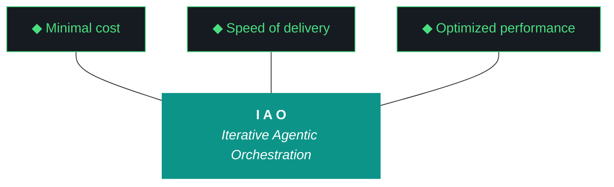

# kjtcom — Iteration Plan v10.64

**Iteration:** v10.64
**Phase:** 10 (Platform Hardening)
**Date:** April 06, 2026
**Primary executing agent:** **Gemini CLI** (`gemini --yolo`) — for cost
**Alternate:** Claude Code (`claude --dangerously-skip-permissions`) — plan is agent-agnostic
**Machine:** **NZXTcos** (`~/dev/projects/kjtcom`) — default unless explicitly otherwise (Kyle's standing direction)
**Run mode:** **Overnight, tmux-detached.** Kyle is asleep. Agent runs unattended.
**Reads:** `GEMINI.md` (or `CLAUDE.md`) at root, this plan doc, and `kjtcom-design-v10.64.md`
**Hard contract:** No `git commit`, no `git push`, no git writes. Manual git only.

This plan is the immutable INPUT artifact (Pillar 2). Do not rewrite during execution. Produce `kjtcom-build-v10.64.md` and `kjtcom-report-v10.64.md` as OUTPUT artifacts.

---

## 1. Objectives

1. Land Bourdain Parts Unknown Phase 2 acquisition + transcription overnight via tmux. Promote Bourdain to production. (W1, W2)
2. Resolve G45 (query editor cursor) with the structural fix that's been deferred for 8 attempts. (W3)
3. Add visual baseline diff to post-flight (ADR-018) so future Claw3D rot is caught automatically. (W4)
4. Stand up the script registry middleware (ADR-017). (W6)
5. Stand up iteration delta tracking (ADR-016) and embed delta tables in design and report docs. (W7)
6. Repair the four undetected layers of rot from v10.63: parallel gotcha numbering (G67/W8), event log iteration mis-tagging (G68/W9), stale Claw3D data files (G66/W10), connector label overlap (G69/W14).
7. Replace post-flight MCP version pings with functional probes (G70/W12).
8. Make pre-flight zero-intervention compliant (G71/W11).
9. Surface the Phase 2 failure histogram in the IAO tab (W5).
10. Sync README and harness (W13).

The implicit objective: stop accumulating undetected rot. Every middleware artifact gets measured (W7), inventoried (W6), or visually verified (W4) — sometimes all three.

---

## 2. Trident Targets

| Prong | Target | Measurement |
|-------|--------|-------------|
| Cost | < 250,000 LLM tokens (Qwen excluded; local) | Sum `llm_call.tokens` from `iao_event_log.jsonl` (after W9 fix). Bourdain extraction is the dominant cost. |
| Delivery | 14/14 workstreams complete | Qwen scorecard. Self-grading capped at 7/10 in code. |
| Performance | Six concrete checks (see §10 Definition of Done) | Direct file/system inspection. |

---

## 3. Trident Mermaid Chart (Locked Colors)



---

## 4. The Ten Pillars of IAO (Verbatim)

1. **Trident** — Cost / Delivery / Performance triangle governs every decision
2. **Artifact Loop** — design → plan (INPUT, immutable) → build → report (OUTPUT, agent-produced)
3. **Diligence** — Read before you code; pre-read is a middleware function
4. **Pre-Flight Verification** — Validate environment before execution
5. **Agentic Harness Orchestration** — The harness is the product; the model is the engine
6. **Zero-Intervention Target** — Interventions are failures in planning. **The agent does not ask permission. It notes discrepancies and proceeds.**
7. **Self-Healing Execution** — Max 3 retries per error with diagnostic feedback
8. **Phase Graduation** — Sandbox → staging → production
9. **Post-Flight Functional Testing** — Rigorous validation of all deliverables
10. **Continuous Improvement** — Retrospectives feed directly into the next plan

---

## 5. Pre-Flight Checklist (Pillar 4)

Run these BEFORE starting W1. **Discrepancies do not block — note them and proceed (Pillar 6).** The only blockers are: Ollama down, GPU unavailable, immutable inputs missing, site 5xx, Python deps unimportable.

```fish
# 0. Set the iteration env var BEFORE anything (W9 prevents the v9.39 mis-tag)
set -x IAO_ITERATION v10.64

# 1. Working directory
cd ~/dev/projects/kjtcom

# 2. Confirm immutable inputs exist (BLOCKER if missing)
command ls docs/kjtcom-design-v10.64.md docs/kjtcom-plan-v10.64.md GEMINI.md CLAUDE.md

# 3. Confirm last iteration's outputs exist (NOTE if missing)
command ls docs/kjtcom-build-v10.63.md docs/kjtcom-report-v10.63.md \
  || echo "DISCREPANCY NOTED: v10.63 artifacts missing or relocated; checking docs/archive/"
command ls docs/archive/kjtcom-build-v10.63.md docs/archive/kjtcom-report-v10.63.md 2>/dev/null

# 4. Git read-only status (NOTE only — never blocks)
git status --short
git log --oneline -5

# 5. Ollama + Qwen (BLOCKER if down)
ollama list | grep -i qwen
curl -s http://localhost:11434/api/tags | python3 -m json.tool | head -30

# 6. Python deps (BLOCKER if missing)
python3 --version
python3 -c "import litellm, jsonschema, playwright; print('python deps ok')"
python3 -c "import imagehash, PIL; print('imagehash ok')" \
  || pip install --break-system-packages imagehash Pillow

# 7. Flutter (NOTE if missing — only W3 needs it)
flutter --version || echo "DISCREPANCY NOTED: Flutter not in PATH; W3 may need fallback"

# 8. CUDA (BLOCKER for W1)
nvidia-smi --query-gpu=name,memory.free --format=csv

# 9. Site is currently up (BLOCKER if 5xx)
curl -s -o /dev/null -w "site: %{http_code}\n" https://kylejeromethompson.com

# 10. Production entity baseline
curl -s https://kylejeromethompson.com/api/status 2>/dev/null \
  || python3 -c "from pipeline.scripts.count import db_total; print(db_total('default'))" 2>/dev/null \
  || echo "DISCREPANCY NOTED: cannot baseline production count; W2 will measure post-load"

# 11. tmux available (BLOCKER for W1)
tmux -V

# 12. Disk space (NOTE if < 20 GB free; transcription needs working space)
df -h ~ | tail -1
```

**ASKING KYLE TO RUN (sudo, optional, while design/plan are being read):**
```fish
sudo systemctl mask sleep.target suspend.target hibernate.target hybrid-sleep.target
```
This prevents overnight suspend during W1 transcription. The agent prints this line at pre-flight start, then **proceeds without waiting**. If suspension does happen, W1 resumes from checkpoint on next session.

---

## 6. Workflow Execution Order

```
T+0          T+5min       T+15min      T+1hr        T+overnight  T+morning
│            │            │            │            │            │
PRE-FLIGHT → W1 launch → W6,W7,W8,W9 → W10,W11,W12 → (W1 still   → W1 done →
             (detached)   parallel,    parallel       running)     W2 → W5
             tmux         independent  cont'd                      (gated)
             │
             └→ W3,W4,W14 parallel     W13 (close)
                                                     ↓
                                                     post-flight,
                                                     evaluator,
                                                     artifacts,
                                                     hand back
```

Concretely: launch W1 in tmux first. While W1 runs detached, work through W6→W7→W8→W9→W10→W11→W12→W4→W14→W3 in that order. W5 and W2 wait on W1. W13 runs near close. The agent polls tmux every 30 minutes (`tmux capture-pane -t pu_overnight -p | tail -50`) but does not block.

---

## 7. Workstream Workflows

### W1: Bourdain Parts Unknown Phase 2 — Acquisition + Transcription (P0)

**Goal:** Acquire and transcribe Parts Unknown episodes 29–60 in detached tmux. Harden acquisition with structured failure logging (G63).

**Files in scope:**
- `pipeline/scripts/acquire_videos.py`
- `pipeline/scripts/run_phase2_overnight.py` — NEW (orchestration wrapper)
- `pipeline/data/bourdain/parts_unknown_acquisition_failures.jsonl` — NEW
- `pipeline/data/bourdain/parts_unknown_checkpoint.json` — UPDATE

**Steps:**

1. Read `pipeline/scripts/acquire_videos.py`. Locate yt-dlp error handling. Identify swallowed failures.
2. Add structured failure logger:
   ```python
   def log_failure(video_id, title, reason, http_status, retry_count):
       entry = {
           "video_id": video_id, "title": title, "reason": reason,
           "http_status": http_status, "retry_count": retry_count,
           "timestamp": datetime.utcnow().isoformat() + "Z",
       }
       path = "pipeline/data/bourdain/parts_unknown_acquisition_failures.jsonl"
       with open(path, "a") as f:
           f.write(json.dumps(entry) + "\n")
   ```
3. Add retry: exponential backoff (1s, 4s, 16s), max 3 retries. Network errors retry; deleted/geo-blocked do not.
4. Add gap-fill: for unrecoverable videos, search YouTube for `"Parts Unknown" S0XE0X` and try the top alternate; log both IDs.
5. Create `pipeline/scripts/run_phase2_overnight.py`:
   ```python
   #!/usr/bin/env python3
   """Overnight wrapper for Parts Unknown Phase 2.

   Runs acquire → transcribe → extract → normalize → geocode → enrich → load,
   each phase logged to /tmp/pu_phase2_<phase>.log. Exits 0 on success,
   non-zero on any phase failure (allows tmux session to terminate cleanly).
   """
   import subprocess, sys, os
   PHASES = [
       ("acquire",   ["python3", "pipeline/scripts/acquire_videos.py", "--pipeline", "bourdain", "--show", "parts_unknown", "--range", "29:60"]),
       ("transcribe",["python3", "pipeline/scripts/transcribe.py",     "--pipeline", "bourdain", "--show", "parts_unknown"]),
       ("extract",   ["python3", "pipeline/scripts/extract.py",        "--pipeline", "bourdain", "--show", "parts_unknown", "--override-show", "Parts Unknown"]),
       ("normalize", ["python3", "pipeline/scripts/normalize.py",      "--pipeline", "bourdain"]),
       ("geocode",   ["python3", "pipeline/scripts/geocode.py",        "--pipeline", "bourdain"]),
       ("enrich",    ["python3", "pipeline/scripts/enrich.py",         "--pipeline", "bourdain"]),
       ("load",      ["python3", "pipeline/scripts/load.py",           "--pipeline", "bourdain", "--target", "staging"]),
   ]
   # ollama stop before transcription (G18)
   subprocess.run(["ollama", "stop"], check=False)
   for name, cmd in PHASES:
       print(f"\n=== PHASE {name.upper()} ===", flush=True)
       r = subprocess.run(cmd)
       if r.returncode != 0:
           print(f"PHASE 2 ABORTED at {name}", flush=True)
           sys.exit(r.returncode)
   print("\nPHASE 2 COMPLETE", flush=True)
   ```
6. Launch in detached tmux:
   ```fish
   set -x IAO_ITERATION v10.64
   tmux new -s pu_overnight -d
   tmux send-keys -t pu_overnight "fish -c 'cd ~/dev/projects/kjtcom && set -x IAO_ITERATION v10.64 && python3 pipeline/scripts/run_phase2_overnight.py 2>&1 | tee /tmp/pu_phase2.log'" Enter
   tmux ls
   ```
7. Continue with W3–W14. Poll every ~30 minutes:
   ```fish
   tmux capture-pane -t pu_overnight -p | tail -80
   ```
8. When the polling output contains `PHASE 2 COMPLETE`, mark W1 done and proceed to W2.
9. If `PHASE 2 ABORTED at <phase>`, log the phase and continue to other workstreams. Document the failure in build log; W2 may be deferred to v10.65 if W1 partially failed.

**Success criteria:**
- `parts_unknown_acquisition_failures.jsonl` exists.
- Tmux session terminates with exit 0 OR a documented `PHASE 2 ABORTED at X`.
- Staging Bourdain count ≥ 850 OR documented gap.
- `iao_event_log.jsonl` has v10.64-tagged events for the W1 phases (depends on W9 landing first).

---

### W2: Bourdain Production Load (P0, gated on W1)

**Goal:** Promote Bourdain from staging → default Firestore. Bourdain becomes the fourth production pipeline.

**Files in scope:**
- `pipeline/scripts/load.py` (invoke)
- `data/agent_scores.json` (entity count update at end)

**Steps:**

1. Verify W1 success: `tmux capture-pane -t pu_overnight -p | grep "PHASE 2 COMPLETE"` returns a line.
2. Verify staging count: `python3 pipeline/scripts/count.py --pipeline bourdain --db staging`. Must be ≥ 850.
3. Dry-run: `python3 pipeline/scripts/load.py --pipeline bourdain --source staging --target default --dry-run > /tmp/load-dry-run.log`. Inspect for dedup behavior.
4. Real load: `python3 pipeline/scripts/load.py --pipeline bourdain --source staging --target default`.
5. Verify production total: `python3 pipeline/scripts/count.py --db default`. Should be ~7000+.
6. Telegram bot smoke test: `curl -s https://kylejeromethompson.com/api/status` (or whatever the bot's HTTP probe is). Verify total reflects new count.
7. Update `data/agent_scores.json` with new production total under v10.64 entry.

**Success criteria:**
- Production total ≥ 7000.
- Bot returns new count.
- W4's Map-tab baseline must be re-blessed after this lands (Bourdain markers will appear; visual diff will fail until baseline updates).

---

### W3: Query Editor Migration to flutter_code_editor (G45) (P1)

**Goal:** Replace TextField + Stack with `flutter_code_editor`. Cursor stable.

**Files in scope:**
- `app/pubspec.yaml`
- `app/lib/widgets/query_editor.dart`
- `app/lib/widgets/query_editor_v2.dart` (interim)
- `app/lib/screens/app_shell.dart`
- `docs/archive/query_editor.dart.legacy`

**Steps:**

1. Read `app/lib/widgets/query_editor.dart` (574 lines per v10.63 build log) and `app/pubspec.yaml`. Confirm Riverpod 3.3.1, Flutter 3.41.6 stable.
2. Add `flutter_code_editor: ^0.3.x` to `pubspec.yaml`. Pin to most recent compatible version. Run `flutter pub get`.
3. **If a Riverpod 3 conflict appears:** fall back to `re_editor` immediately. **Do not ask.** Document the choice. If both conflict: pin `flutter_code_editor` to highest available, document the dep tree, and flag for v10.65.
4. Create `app/lib/widgets/query_editor_v2.dart` mirroring the public API of the old file:
   - Same constructor signature
   - Same callbacks (`onSubmit`, `onChange`)
   - Same exposed methods
   - Internally uses `CodeField` instead of `TextField`
   - Wires existing `t_any_*` autocomplete provider into the package's completion API
   - Custom syntax mode for the NoSQL query language: keywords (`==`, `!=`, `contains`, `contains-any`, `and`, `or`), strings, identifiers
5. Swap import in `app_shell.dart` from `query_editor.dart` to `query_editor_v2.dart`.
6. Run `flutter run -d chrome` in dev mode. Manual smoke test (record results in build log):
   - 5-line query with autocomplete acceptance: cursor stable? ✓ / ✗
   - Paste 10-line query: cursor lands at end of paste? ✓ / ✗
   - Type past line wrap: cursor stable? ✓ / ✗
   - Tab indent: works? ✓ / ✗
7. If all 4 pass: rename `query_editor.dart` → `docs/archive/query_editor.dart.legacy`, rename `query_editor_v2.dart` → `query_editor.dart`, fix imports.
8. `flutter build web --release`. Must exit 0.
9. Mark G45 Resolved in CLAUDE.md / GEMINI.md.

**Success criteria:**
- `grep -c "TextField" app/lib/widgets/query_editor.dart` returns 0.
- `flutter build web --release` exits 0.
- 4/4 cursor smoke tests pass.
- `docs/archive/query_editor.dart.legacy` exists.

---

### W4: Visual Baseline Diff Post-Flight Check (ADR-018) (P0)

**Goal:** Add pHash-based visual diff to post-flight. Blesses three baselines. Catches G69 and future visual rot.

**Files in scope:**
- `scripts/postflight_checks/visual_baseline_diff.py` — NEW
- `scripts/bless_baseline.py` — NEW
- `data/postflight-baselines/{index,claw3d,architecture}.html.png` — NEW
- `scripts/post_flight.py` — wire in
- `docs/install.fish` — record imagehash + Pillow install

**Steps:**

1. Install deps: `pip install --break-system-packages imagehash Pillow`. Append to `docs/install.fish`.
2. Create `scripts/postflight_checks/visual_baseline_diff.py`:
   ```python
   """Visual baseline diff via perceptual hash (pHash).
   ADR-018. Catches structural visual regressions where pixel diff is too noisy.
   """
   import os, sys, time
   from playwright.sync_api import sync_playwright
   import imagehash
   from PIL import Image
   PAGES = ["", "claw3d.html", "architecture.html"]
   BASE_URL = "https://kylejeromethompson.com"
   BASELINE_DIR = "data/postflight-baselines"
   THRESHOLD = 8  # Hamming distance
   def run():
       all_pass = True
       with sync_playwright() as p:
           browser = p.chromium.launch(headless=True)
           ctx = browser.new_context(viewport={"width": 1440, "height": 900})
           for page_path in PAGES:
               url = f"{BASE_URL}/{page_path}".rstrip("/")
               page = ctx.new_page()
               page.goto(url, wait_until="domcontentloaded", timeout=30_000)
               try: page.wait_for_load_state("networkidle", timeout=15_000)
               except: pass
               time.sleep(4)
               tmp = f"/tmp/postflight_current_{page_path or 'index'}.png"
               page.screenshot(path=tmp, full_page=False)
               page.close()
               baseline = os.path.join(BASELINE_DIR, f"{page_path or 'index.html'}.png")
               if not os.path.exists(baseline):
                   print(f"  WARN: visual_baseline_diff (no baseline for {page_path}; bless first)")
                   continue
               h_cur = imagehash.phash(Image.open(tmp), hash_size=16)
               h_base = imagehash.phash(Image.open(baseline), hash_size=16)
               dist = h_cur - h_base
               status = "PASS" if dist <= THRESHOLD else "FAIL"
               print(f"  {status}: visual_baseline_diff ({page_path or 'index'} dist={dist} threshold={THRESHOLD})")
               if dist > THRESHOLD: all_pass = False
           browser.close()
       return all_pass
   if __name__ == "__main__":
       sys.exit(0 if run() else 1)
   ```
3. Create `scripts/bless_baseline.py`:
   ```python
   """Capture a fresh screenshot and save as the new baseline for a given page."""
   import sys, os, time
   from playwright.sync_api import sync_playwright
   page_arg = sys.argv[1] if len(sys.argv) > 1 else ""
   url = f"https://kylejeromethompson.com/{page_arg}".rstrip("/")
   out = f"data/postflight-baselines/{page_arg or 'index.html'}.png"
   os.makedirs(os.path.dirname(out), exist_ok=True)
   with sync_playwright() as p:
       b = p.chromium.launch(headless=True)
       c = b.new_context(viewport={"width": 1440, "height": 900})
       pg = c.new_page()
       pg.goto(url, wait_until="domcontentloaded", timeout=30_000)
       try: pg.wait_for_load_state("networkidle", timeout=15_000)
       except: pass
       time.sleep(4)
       pg.screenshot(path=out, full_page=False)
       b.close()
   print(f"Blessed: {out}")
   ```
4. Bless `index.html` and `architecture.html` baselines now.
5. **Defer Claw3D blessing** until after W14 completes (pre-W14 Claw3D is the broken state).
6. Wire into `post_flight.py`.
7. Failure-path test: copy a baseline to itself with 50 pixels modified, run check, verify FAIL. Restore.

**Success criteria:**
- `imagehash` and `Pillow` installed.
- Three baseline PNGs in `data/postflight-baselines/`.
- `visual_baseline_diff` appears in post-flight output with three lines (one per page).
- After W14: post-W14 Claw3D blessed and check PASSes.
- Failure-path test logged.

---

### W5: Parts Unknown Checkpoint Dashboard (P2, gated on W1)

**Goal:** Surface W1's failure histogram in the IAO tab.

**Files in scope:**
- `pipeline/data/bourdain/parts_unknown_acquisition_failures.jsonl` (input)
- `assets/bourdain_phase2_summary.json` — NEW
- `app/lib/screens/iao_screen.dart` — UPDATE (add panel)

**Steps:**

1. After W1 finishes, parse the failures JSONL.
2. Build summary:
   ```json
   {
     "iteration": "v10.64",
     "total_attempted": 32,
     "total_succeeded": 28,
     "total_failed": 4,
     "histogram": {"deleted": 2, "geo_blocked": 1, "network": 1},
     "alternate_ids_used": 1
   }
   ```
3. Save to `assets/bourdain_phase2_summary.json`. Add to `pubspec.yaml` assets list.
4. Add a small read-only panel to the IAO tab showing the summary.
5. `flutter build web --release` and deploy via Firebase Hosting (if part of the iteration; otherwise note as deploy pending Kyle's commit).
6. After deploy, re-bless the IAO tab if pHash differs > 8 from current baseline (only relevant if `index.html` baseline includes the IAO tab in its viewport).

**Success criteria:**
- `assets/bourdain_phase2_summary.json` exists.
- IAO tab has the histogram panel.
- Re-blessed baseline if needed.

---

### W6: Script Registry Middleware (ADR-017) (P1)

**Goal:** Stand up `data/script_registry.json` as canonical inventory.

**Files in scope:**
- `data/script_registry.json` — NEW
- `scripts/sync_script_registry.py` — NEW (~150 lines)
- `scripts/post_flight.py` — add `script_registry_synced` check

**Steps:**

1. Create `scripts/sync_script_registry.py`:
   ```python
   #!/usr/bin/env python3
   """Sync data/script_registry.json (ADR-017).
   Walks scripts/ and pipeline/scripts/ recursively. Each .py file gets an entry
   with path, purpose (from docstring), function summary, mtime, last_used (from
   iao_event_log.jsonl), lines, and status.
   """
   import os, json, time, ast, subprocess
   from datetime import datetime, timedelta
   ROOTS = ["scripts", "pipeline/scripts"]
   REGISTRY_PATH = "data/script_registry.json"
   EVENT_LOG = "data/iao_event_log.jsonl"

   def docstring_purpose(path):
       try:
           with open(path) as f:
               tree = ast.parse(f.read())
           ds = ast.get_docstring(tree) or ""
           return ds.strip().split("\n")[0][:200] if ds else "(no docstring)"
       except Exception:
           return "(parse failed)"

   def function_names(path):
       try:
           with open(path) as f:
               tree = ast.parse(f.read())
           return [n.name for n in ast.walk(tree) if isinstance(n, ast.FunctionDef)][:20]
       except Exception:
           return []

   def last_used(path):
       basename = os.path.basename(path)
       try:
           with open(EVENT_LOG) as f:
               last = None
               for line in f:
                   if basename in line:
                       try: last = json.loads(line).get("timestamp")
                       except: pass
               return last or "never"
       except FileNotFoundError:
           return "never"

   def status_for(path, last_used_iso):
       if last_used_iso == "never":
           mtime = os.path.getmtime(path)
           if (time.time() - mtime) > 90 * 86400: return "dead"
           return "stale"
       try:
           used = datetime.fromisoformat(last_used_iso.replace("Z", "+00:00"))
           if (datetime.now(used.tzinfo) - used) < timedelta(days=30): return "active"
           return "stale"
       except Exception:
           return "unknown"

   def main():
       entries = []
       for root in ROOTS:
           for dirpath, _, files in os.walk(root):
               for fn in files:
                   if not fn.endswith(".py") or fn == "__init__.py": continue
                   p = os.path.join(dirpath, fn)
                   lu = last_used(p)
                   entries.append({
                       "path": p,
                       "purpose": docstring_purpose(p),
                       "function_names": function_names(p),
                       "created_iteration": "unknown",  # backfill manually over time
                       "last_modified_date": datetime.fromtimestamp(os.path.getmtime(p)).date().isoformat(),
                       "last_used_date": lu,
                       "owner_workstream": "unassigned",
                       "lines": sum(1 for _ in open(p)),
                       "status": status_for(p, lu),
                   })
       registry = {
           "schema_version": 1,
           "last_synced": datetime.utcnow().isoformat() + "Z",
           "scripts": entries,
       }
       with open(REGISTRY_PATH, "w") as f:
           json.dump(registry, f, indent=2)
       print(f"Synced {len(entries)} scripts to {REGISTRY_PATH}")
       dead = [e for e in entries if e["status"] == "dead"]
       stale = [e for e in entries if e["status"] == "stale"]
       active = [e for e in entries if e["status"] == "active"]
       print(f"  Active: {len(active)}, Stale: {len(stale)}, Dead: {len(dead)}")
       if dead:
           print("  DEAD scripts:")
           for d in dead: print(f"    {d['path']} (last modified {d['last_modified_date']})")

   if __name__ == "__main__":
       main()
   ```
2. Run: `python3 scripts/sync_script_registry.py`.
3. Manually edit the JSON: assign `owner_workstream` for the top 10 most-active scripts (`run_evaluator.py` → `v10.63 W1`, `post_flight.py` → `v10.62 W3`, etc.).
4. Wire into post-flight as `script_registry_synced` check (re-runs sync, verifies `last_synced` is within 5 minutes).
5. Build log includes total count + dead/stale callouts.

**Success criteria:**
- `data/script_registry.json` exists, ≥ 30 entries.
- ≥ 5 entries have `owner_workstream != "unassigned"`.
- Post-flight green on `script_registry_synced`.
- Build log lists dead scripts (do not delete them; flag only).

---

### W7: Iteration Delta Tracking Script (ADR-016) (P1)

**Goal:** Stand up `scripts/iteration_deltas.py`. Backfill v10.63 snapshot. Compute v10.63→v10.64 delta. Embed in report.

**Files in scope:**
- `scripts/iteration_deltas.py` — NEW (~200 lines)
- `data/iteration_snapshots/v10.63.json` — NEW (backfill)
- `data/iteration_snapshots/v10.64.json` — NEW (at close)
- `scripts/generate_artifacts.py` — UPDATE (snapshot writer at close)
- `scripts/post_flight.py` — add `delta_snapshot_written` check

**Steps:**

1. Create `scripts/iteration_deltas.py`:
   ```python
   #!/usr/bin/env python3
   """Iteration delta tracking (ADR-016).
   Snapshots core artifacts and computes char/line/percentage deltas
   between iterations. Output is a markdown table for design/report docs.
   """
   import os, json, sys, re
   from datetime import datetime
   TRACKED = [
       ("evaluator-harness.md",       "docs/evaluator-harness.md"),
       ("middleware_registry.json",   "data/middleware_registry.json"),
       ("script_registry.json",       "data/script_registry.json"),
       ("gotcha_archive.json",        "data/gotcha_archive.json"),
       ("agent_scores.json",          "data/agent_scores.json"),
       ("kjtcom-changelog.md",        "docs/kjtcom-changelog.md"),
       ("README.md",                  "README.md"),
       ("CLAUDE.md",                  "CLAUDE.md"),
       ("GEMINI.md",                  "GEMINI.md"),
       ("claw3d.html",                "app/web/claw3d.html"),
   ]
   SNAPSHOT_DIR = "data/iteration_snapshots"

   def measure(path):
       if not os.path.exists(path):
           return {"exists": False, "chars": 0, "lines": 0}
       with open(path) as f:
           content = f.read()
       return {"exists": True, "chars": len(content), "lines": content.count("\n") + 1}

   def count_in_harness(pattern):
       try:
           with open("docs/evaluator-harness.md") as f:
               return len(re.findall(pattern, f.read(), re.MULTILINE))
       except FileNotFoundError:
           return 0

   def count_gotchas_unified():
       n_claude = 0
       for p in ["CLAUDE.md", "docs/evaluator-harness.md"]:
           if os.path.exists(p):
               with open(p) as f:
                   ids = set(re.findall(r"\bG(\d+)\b", f.read()))
                   n_claude = max(n_claude, len(ids))
       return n_claude

   def snapshot(iteration):
       snap = {"iteration": iteration, "timestamp": datetime.utcnow().isoformat() + "Z", "artifacts": {}}
       for name, path in TRACKED:
           snap["artifacts"][name] = measure(path)
       snap["counts"] = {
           "adrs":      count_in_harness(r"^### ADR-\d+"),
           "patterns":  count_in_harness(r"^### Pattern\s+\d+"),
           "gotchas_unified": count_gotchas_unified(),
       }
       os.makedirs(SNAPSHOT_DIR, exist_ok=True)
       out = os.path.join(SNAPSHOT_DIR, f"{iteration}.json")
       with open(out, "w") as f:
           json.dump(snap, f, indent=2)
       print(f"Snapshot written: {out}")
       return snap

   def delta_table(prev_iter, cur_iter):
       prev_path = os.path.join(SNAPSHOT_DIR, f"{prev_iter}.json")
       cur_path  = os.path.join(SNAPSHOT_DIR, f"{cur_iter}.json")
       if not os.path.exists(prev_path):
           return f"(no snapshot for {prev_iter})"
       if not os.path.exists(cur_path):
           snapshot(cur_iter)
       with open(prev_path) as f: prev = json.load(f)
       with open(cur_path)  as f: cur  = json.load(f)
       lines = [f"# Iteration Delta: {prev_iter} → {cur_iter}", ""]
       lines.append("| Artifact | Prev chars | Cur chars | Δ chars | Δ % | Direction |")
       lines.append("|---|---|---|---|---|---|")
       for name, _ in TRACKED:
           p = prev["artifacts"].get(name, {"chars": 0})
           c = cur ["artifacts"].get(name, {"chars": 0})
           dc = c["chars"] - p["chars"]
           dp = (dc / p["chars"] * 100) if p["chars"] else float("inf")
           arrow = "↑" if dc > 0 else ("↓" if dc < 0 else "→")
           lines.append(f"| {name} | {p['chars']} | {c['chars']} | {dc:+d} | {dp:+.1f}% | {arrow} |")
       lines.append("")
       lines.append(f"| Count | Prev | Cur | Δ | Direction |")
       lines.append(f"|---|---|---|---|---|")
       for k in ["adrs", "patterns", "gotchas_unified"]:
           p = prev["counts"].get(k, 0)
           c = cur ["counts"].get(k, 0)
           arrow = "↑" if c > p else ("↓" if c < p else "→")
           lines.append(f"| {k} | {p} | {c} | {c-p:+d} | {arrow} |")
       return "\n".join(lines)

   if __name__ == "__main__":
       if len(sys.argv) >= 3 and sys.argv[1] == "--snapshot":
           snapshot(sys.argv[2])
       elif len(sys.argv) >= 4 and sys.argv[1] == "--delta":
           print(delta_table(sys.argv[2], sys.argv[3]))
       else:
           print("Usage: --snapshot vX.XX | --delta vA.A vB.B")
           sys.exit(2)
   ```
2. Backfill v10.63: `python3 scripts/iteration_deltas.py --snapshot v10.63`.
3. At iteration close: `python3 scripts/iteration_deltas.py --snapshot v10.64`.
4. Generate the delta: `python3 scripts/iteration_deltas.py --delta v10.63 v10.64 > /tmp/delta.md`.
5. Paste delta into both `kjtcom-build-v10.64.md` and `kjtcom-report-v10.64.md`.
6. Add `generate_artifacts.py` post-execution call.

**Success criteria:**
- `scripts/iteration_deltas.py` exists, runs, produces a markdown table.
- Both v10.63 and v10.64 snapshots in `data/iteration_snapshots/`.
- Delta table appears in build log AND report.
- Three flagged rows (harness, gotcha_count, script_registry) all show ↑.

---

### W8: Gotcha Registry Consolidation (G67) (P1)

**Goal:** Merge `data/gotcha_archive.json` (G2..G58 numbering) with CLAUDE.md/harness numbering. Single source of truth.

**Files in scope:**
- `data/gotcha_archive.json` — REWRITE
- `data/archive/gotcha_archive_v10.63.json` — NEW snapshot
- `docs/evaluator-harness.md` — UPDATE: cross-reference table
- `CLAUDE.md` / `GEMINI.md` — UPDATE: link to consolidated archive

**Steps:**

1. Snapshot: `cp data/gotcha_archive.json data/archive/gotcha_archive_v10.63.json`.
2. Read both numbering schemes. Build a mapping table:
   - For each archive ID, decide: matches CLAUDE.md ID semantically? → unify under CLAUDE.md ID, mark archive ID as alias.
   - Conflict (two different gotchas claim the same number)? → keep CLAUDE.md numbering canonical, renumber archive entry into G72+ range, list archive's old ID as alias.
3. Build the consolidated `gotcha_archive.json`:
   ```json
   {
     "schema_version": 2,
     "last_synced": "2026-04-07T...",
     "gotchas": [
       {
         "id": "G2",
         "title": "CUDA LD_LIBRARY_PATH not set in subprocess environment",
         "aliases": ["archive_G2_legacy"],
         "description": "...",
         "status": "resolved",
         "iteration_introduced": "v3.10",
         "iteration_resolved": "v3.10",
         "root_cause": "environment",
         "prevention": "..."
       }
     ]
   }
   ```
4. Walk every CLAUDE.md gotcha (G1..G71). For each, ensure it has a `gotchas[]` entry (create if missing).
5. Walk every old archive entry. Ensure it's either merged or renumbered into the new array.
6. Add a "Cross-Reference" section to the harness (new section §16 or appended to existing gotcha section) that lists every alias and its canonical ID.
7. Build log: "Pre-merge: CLAUDE.md=N, archive=M. Post-merge: unified=K. Aliases recorded: A. Renumbered: R."

**Success criteria:**
- `gotcha_archive.json` has unique `id` values across all entries.
- Every CLAUDE.md G-number has a matching archive entry.
- Snapshot in `data/archive/`.
- Harness has cross-reference section.
- Build log has the count breakdown.

---

### W9: Event Log Iteration Tag Fix (G68) (P1)

**Goal:** Fix the bug that tagged every v10.63 event as `iteration: v9.39`. Retroactively fix the log.

**Files in scope:**
- `scripts/utils/iao_logger.py`
- `data/iao_event_log.jsonl` — retroactive correction
- `data/archive/iao_event_log_pre_v10.64_fix.jsonl` — snapshot

**Steps:**

1. Read `scripts/utils/iao_logger.py`. Find where `iteration` is set on each event.
2. Hypothesis: a default arg `iteration='v9.39'` or a stale env var is being used. Confirm by inspection.
3. Fix:
   - Read `IAO_ITERATION` env var. If unset, raise (do not silently fall back to a hardcoded value).
   - Add a startup print: `print(f"[iao_logger] iteration={os.environ.get('IAO_ITERATION')}", file=sys.stderr)`.
4. Snapshot the log: `cp data/iao_event_log.jsonl data/archive/iao_event_log_pre_v10.64_fix.jsonl`.
5. Retroactively fix v10.63 events. They span `2026-04-06T22:00` to `2026-04-06T23:30` per the log timestamps. Use jq:
   ```fish
   jq -c 'if (.timestamp >= "2026-04-06T22:00:00" and .timestamp <= "2026-04-06T23:30:00" and .iteration == "v9.39") then .iteration = "v10.63" else . end' data/iao_event_log.jsonl > /tmp/log.fixed
   mv /tmp/log.fixed data/iao_event_log.jsonl
   ```
6. Verify: `grep -c '"iteration": "v10.63"' data/iao_event_log.jsonl` returns nonzero.
7. Pre-flight test: log a synthetic event for v10.64, confirm tag.

**Success criteria:**
- `iao_logger.py` reads from env var, no hardcoded fallback.
- v10.63 events in log corrected.
- Pre-flight test logs an event with `"iteration": "v10.64"`.
- Snapshot in `data/archive/`.

---

### W10: Stale Claw3D Data File Cleanup (G66) (P2)

**Goal:** Resolve the stale `claw3d_components.json` and `claw3d_iterations.json`. Either revive (extract from claw3d.html) or formally archive.

**Files in scope:**
- `data/claw3d_components.json` — REVIVE
- `data/claw3d_iterations.json` — REVIVE
- `data/archive/claw3d_components_v10.63.json` — NEW snapshot
- `data/archive/claw3d_iterations_v10.63.json` — NEW snapshot
- `scripts/extract_claw3d_components.py` — NEW
- `scripts/run_evaluator.py` — UPDATE (remove dead loaders OR point at fresh data)

**Steps:**

1. Snapshot both files to `data/archive/`.
2. Read `app/web/claw3d.html`. Locate `const BOARDS = [...]` array (and `CONNECTORS` if present).
3. Create `scripts/extract_claw3d_components.py`:
   - Regex out the BOARDS array contents (start at `const BOARDS = [` and capture to matching `];`).
   - Convert JS object literals to JSON (handle unquoted keys, single quotes, trailing commas via simple regex normalization).
   - Write to `data/claw3d_components.json` with schema:
     ```json
     {
       "schema_version": 2,
       "last_extracted_iteration": "v10.64",
       "boards": [
         {"id": "frontend", "label": "Frontend", "color": "#0D9488", "chips": [...]},
         ...
       ],
       "connectors": [...]
     }
     ```
4. Run extractor. Verify output reflects 4 boards, 49+ chips. Diff against archived snapshot to catch any drift.
5. Update `claw3d_iterations.json` to extend through v10.64. For v10.57–v10.63 where exact data is lost, add `["historical-unrecoverable"]` placeholder rows; for v10.64, add `["ALL"]`.
6. Wire extractor into post-flight as `claw3d_components_synced` (re-extract, compare, fail if regex parse fails).
7. Update `scripts/run_evaluator.py`: keep loading these files (now correct) OR drop the loads if context is already too large.

**Success criteria:**
- `claw3d_components.json` reflects current 4-board / 49-chip reality.
- `claw3d_iterations.json` extends through v10.64.
- Post-flight has `claw3d_components_synced` PASS.
- Snapshots in `data/archive/`.

---

### W11: Pre-Flight Zero-Intervention Hardening (G71) (P1)

**Goal:** Pre-flight stops asking for permission. Discrepancies are notes, not blockers (except the small allowed list).

**Files in scope:**
- `scripts/pre_flight.py` (or wherever pre-flight lives)
- `CLAUDE.md` / `GEMINI.md` — §17 update

**Steps:**

1. Read pre-flight script. Identify every check that currently can produce a "stop and ask Kyle" output.
2. Categorize:
   - **BLOCKER** (still stops): Ollama down, GPU unavailable for W1, immutable inputs missing, site 5xx, Python deps unimportable.
   - **NOTE** (proceed with logged warning): mid-reorg git state, files in `docs/archive/` instead of `docs/`, optional middleware components missing, snapshot drift, Flutter missing if W3 not in scope.
3. Refactor: each check returns `(name, status, message)` where status ∈ `{PASS, NOTE, BLOCK}`. Pre-flight collects all results, prints a `DISCREPANCIES NOTED:` section listing every NOTE, then either prints `PROCEEDING` or exits with BLOCK reasons.
4. Remove every interactive prompt from the pre-flight code path.
5. Update GEMINI.md / CLAUDE.md §17:
   > **Zero Intervention Protocol (Pillar 6):** When you encounter a discrepancy that is not on the BLOCKER list, log it under "DISCREPANCIES NOTED" and proceed. Do not ask Kyle to confirm. Do not pause. Do not wait for input. The only acceptable stops are: a BLOCKER from §11 pre-flight, or completion of the iteration. If you find yourself wanting to ask "should I...?", the answer is "yes, document and proceed".

**Success criteria:**
- Pre-flight produces a "DISCREPANCIES NOTED" section if any NOTE-level check fires.
- No interactive prompts in pre-flight code or in CLAUDE.md / GEMINI.md.
- This iteration's pre-flight transcript shows the protocol in action.

---

### W12: Post-Flight MCP Functional Probes (G70) (P1)

**Goal:** Replace MCP version pings with functional probes.

**Files in scope:**
- `scripts/postflight_checks/mcp_functional.py` — NEW
- `scripts/post_flight.py` — UPDATE

**Steps:**

1. Create `scripts/postflight_checks/mcp_functional.py`. For each MCP, define a probe:
   ```python
   def probe_firebase():
       """Functional: list projects, assert kjtcom-c78cd present."""
       # Use Firebase MCP to list projects and assert kjtcom-c78cd in result
       ...
   def probe_context7():
       """Functional: fetch a stable doc, assert > 1000 chars."""
       ...
   def probe_firecrawl():
       """Functional: fetch example.com, assert 'Example Domain' in body."""
       ...
   def probe_playwright():
       """Functional: open example.com, screenshot, assert > 5KB."""
       ...
   def probe_dart():
       """Functional: dart analyze on a known-clean snippet, assert exit 0."""
       ...
   PROBES = [
       ("firebase",   probe_firebase),
       ("context7",   probe_context7),
       ("firecrawl",  probe_firecrawl),
       ("playwright", probe_playwright),
       ("dart",       probe_dart),
   ]
   def run():
       all_pass = True
       for name, fn in PROBES:
           try:
               result = fn()
               print(f"  PASS: mcp_functional_{name} ({result})")
           except Exception as e:
               print(f"  FAIL: mcp_functional_{name} ({e})")
               all_pass = False
       return all_pass
   ```
2. Replace existing version-only MCP checks in `post_flight.py` with calls to the functional probes.
3. Failure path: deliberately misconfigure one probe (e.g., Firebase with bad project filter), confirm probe fails. Restore.

**Success criteria:**
- All 5 MCPs have functional probes.
- Post-flight prints `mcp_functional_<name>: PASS (probe details)`.
- Build log includes the post-flight transcript.

---

### W13: README + Harness Expansion (P2)

**Goal:** README to v10.64 reality. Harness gains ADR-016/017/018, Patterns 21–25, deltas methodology section.

**Files in scope:**
- `README.md`
- `docs/evaluator-harness.md`
- `docs/archive/evaluator-harness-v10.63.md` — snapshot

**Steps:**

1. Snapshot harness.
2. Append ADR-016, ADR-017, ADR-018 (full bodies from design doc §5).
3. Append Patterns 21–25:
   - Pattern 21: Stale dead-data files referenced as truth (G66)
   - Pattern 22: Parallel gotcha numbering schemes (G67)
   - Pattern 23: Event log iteration mis-tagging (G68)
   - Pattern 24: MCP version-only post-flight checks (G70)
   - Pattern 25: Agent asks for permission instead of proceeding (G71)
4. Add new section: "Iteration Delta Methodology" — explains the table format, the three-must-grow rows, when a flat or down direction is acceptable, when it's a finding.
5. Bump internal version stamp to v10.64.
6. Target: harness ≥ 1100 lines.
7. README updates:
   - Phase line: `Phase 10 v10.64 (ACTIVE)`.
   - Entity counts post-W2: production 7000+, staging 0 (Bourdain promoted).
   - Pipeline list: 4 production pipelines (CalGold, RickSteves, TripleDB, Bourdain).
   - Append a delta section linking to the most recent snapshot.
8. Target README ≥ 850 lines.

**Success criteria:**
- `wc -l docs/evaluator-harness.md` ≥ 1100.
- `grep -c "^### ADR-"` returns 18.
- `grep -c "^### Pattern"` returns 25.
- README contains `v10.64`, `Phase 10`, the post-W2 entity total.

---

### W14: Claw3D Connector Label Canvas Texture Migration (G69) (P0)

**Goal:** Apply Pattern 18's canvas texture solution to connector labels. Eliminate the FE→MW / PL→MW overlap visible in production.

**Files in scope:**
- `app/web/claw3d.html`
- `data/postflight-baselines/claw3d.html.png` — re-bless after fix

**Steps:**

1. Read `app/web/claw3d.html`. Find the connector label rendering. Confirm HTML overlay + `Vector3.project()` pattern.
2. Refactor: each connector gets a small `PlaneGeometry` strip in 3D space along its midpoint, oriented to face the camera. Label painted onto the strip via `CanvasTexture`. Auto-shrink font with `ctx.measureText()` until it fits.
3. Function name suggestion: `createConnectorLabelTexture(text, width, height)` mirroring `createChipTexture` from v10.61.
4. Build locally, deploy to Firebase Hosting (or test locally if Kyle handles deploy).
5. Visual check: open `https://kylejeromethompson.com/claw3d.html` in a headless browser, screenshot, eye-check that FE→MW and PL→MW labels do not overlap.
6. Bless new baseline: `python3 scripts/bless_baseline.py claw3d.html`.
7. Run W4's `visual_baseline_diff` against post-W14 state, confirm PASS.

**Success criteria:**
- `grep -c "Vector3.project" app/web/claw3d.html` for connector labels returns 0 (chip labels can keep their existing canvas implementation).
- A function like `createConnectorLabelTexture` (or equivalent) exists.
- Post-W14 Claw3D screenshot blessed.
- W4 visual diff PASSes against the new baseline.

---

## 8. Gotchas Registry (v10.64 snapshot, going in)

(Full table in design doc §6. Highlights:)

- **G45** Query editor cursor — TARGETED W3
- **G63** Acquisition silent failures — TARGETED W1
- **G66** Stale claw3d data files — TARGETED W10
- **G67** Parallel gotcha numbering — TARGETED W8
- **G68** Event log mis-tag — TARGETED W9
- **G69** Claw3D connector overlap — TARGETED W14
- **G70** MCP version-only checks — TARGETED W12
- **G71** Asking for permission — TARGETED W11

---

## 9. Post-Flight Expectations

After all workstreams, run:

```fish
set -x IAO_ITERATION v10.64
python3 scripts/post_flight.py 2>&1 | tee /tmp/postflight-final.log
```

Expected checks (all must PASS):

- [x] `site_200`
- [x] `bot_status`
- [x] `bot_query` — should now return ~7000+ post-W2
- [x] `g56_no_fetch`
- [x] `g61_artifact_existence` — both v10.64 build + report present
- [x] `static_structure`
- [x] **NEW** `mcp_functional_firebase` (W12)
- [x] **NEW** `mcp_functional_context7` (W12)
- [x] **NEW** `mcp_functional_firecrawl` (W12)
- [x] **NEW** `mcp_functional_playwright` (W12)
- [x] **NEW** `mcp_functional_dart` (W12)
- [x] `production_data_render_check` (v10.63 W3, retained)
- [x] `claw3d_label_legibility` (v10.63 W3, retained)
- [x] **NEW** `visual_baseline_diff_index` (W4)
- [x] **NEW** `visual_baseline_diff_claw3d` (W4, post-W14)
- [x] **NEW** `visual_baseline_diff_architecture` (W4)
- [x] **NEW** `script_registry_synced` (W6)
- [x] **NEW** `delta_snapshot_written` (W7)
- [x] **NEW** `claw3d_components_synced` (W10)

Post-flight failure blocks iteration close (Pillar 9, ADR-009).

---

## 10. Definition of Done

The iteration is complete when ALL of the following are true:

1. **W1:** Tmux exited cleanly. `parts_unknown_acquisition_failures.jsonl` exists. Bourdain staging count ≥ 850 OR documented gap.
2. **W2:** Production count ~7000+. Bot reflects new total.
3. **W3:** `query_editor.dart` has no `TextField`. `flutter build web --release` exits 0. G45 marked Resolved.
4. **W4:** `visual_baseline_diff` live. Three baselines in `data/postflight-baselines/`. Failure-path test logged.
5. **W5:** `assets/bourdain_phase2_summary.json` exists. IAO tab panel deployed (or pending Kyle deploy).
6. **W6:** `data/script_registry.json` ≥ 30 entries. `sync_script_registry.py` exists. Post-flight green.
7. **W7:** `iteration_deltas.py` exists. Both snapshots in `data/iteration_snapshots/`. Delta table in build + report.
8. **W8:** `gotcha_archive.json` consolidated, no duplicate IDs. Snapshot in `data/archive/`. Cross-ref in harness.
9. **W9:** `iao_logger.py` reads env var. v10.63 events corrected. Snapshot in `data/archive/`.
10. **W10:** `claw3d_components.json` reflects 4 boards / 49 chips. Extractor script exists. Post-flight green.
11. **W11:** Pre-flight has DISCREPANCIES NOTED section. Zero interactive prompts in CLAUDE.md / GEMINI.md.
12. **W12:** All 5 MCPs have functional probes. Post-flight prints details.
13. **W13:** Harness ≥ 1100 lines. README to v10.64. ADR-018 pattern.
14. **W14:** Claw3D connector labels migrated to canvas texture. Visual diff PASSes against post-W14 baseline.
15. **Post-flight:** All checks green.
16. **Evaluator:** Qwen Tier 1 produces v10.64 evaluation. If Tier 3 self-eval fires, ADR-015 cap enforced in code.
17. **Delta table:** Pasted in both build and report. Three flagged rows show ↑.
18. **Hard contract:** Zero git operations performed by the agent.
19. **Zero intervention:** Build log shows no agent pause/ask events. Discrepancies were noted and proceeded.

---

## 11. Closing Sequence

After all 14 workstreams pass and post-flight is green:

```fish
# 1. Confirm build log on disk
command ls -l docs/kjtcom-build-v10.64.md

# 2. Snapshot v10.64 state for delta tracking
python3 scripts/iteration_deltas.py --snapshot v10.64

# 3. Generate the v10.63→v10.64 delta table
python3 scripts/iteration_deltas.py --delta v10.63 v10.64 > /tmp/delta-v10.64.md
cat /tmp/delta-v10.64.md

# 4. Append delta table to build log if not already present
# (the build log template includes the delta section)

# 5. Run the evaluator
set -x IAO_ITERATION v10.64
python3 scripts/run_evaluator.py --iteration v10.64 --rich-context --verbose 2>&1 | tee /tmp/eval-v10.64.log

# 6. Verify report produced and is NOT self-eval (or, if self-eval, scores ≤ 7)
command ls -l docs/kjtcom-report-v10.64.md
head -20 docs/kjtcom-report-v10.64.md
grep -E "Score: ([8-9])/10" docs/kjtcom-report-v10.64.md  # should be empty if self-eval

# 7. All 4 artifacts present
command ls docs/kjtcom-design-v10.64.md docs/kjtcom-plan-v10.64.md docs/kjtcom-build-v10.64.md docs/kjtcom-report-v10.64.md

# 8. Final post-flight (must include all new W4/W6/W7/W10/W12 checks)
python3 scripts/post_flight.py 2>&1 | tee /tmp/postflight-final.log

# 9. Update changelog (per harness §11)
# Append v10.64 entries to docs/kjtcom-changelog.md.

# 10. git status read-only — DO NOT WRITE
git status --short
echo ""
echo "v10.64 complete. All artifacts on disk. Awaiting human commit."
```

**STOP.** Do not run `git add`, `git commit`, `git push`. Hand back to Kyle.

---

*Plan v10.64 — April 06, 2026. Authored by the planning chat. Immutable during execution per ADR-012. Pairs with `kjtcom-design-v10.64.md`.*
