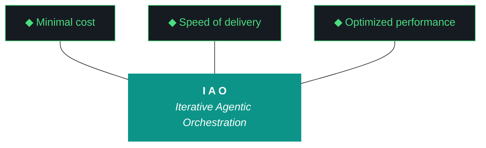

# kjtcom — Iteration Plan v10.65

**Iteration:** v10.65
**Phase:** 10 (Platform Hardening)
**Date:** April 07, 2026
**Primary executing agent:** Gemini CLI (`gemini --yolo`)
**Alternate:** Claude Code (`claude --dangerously-skip-permissions`)
**Machine:** NZXTcos (`~/dev/projects/kjtcom`)
**Run mode:** **All-day unattended.** Kyle launches in the morning, leaves for work, returns evening. ~6-10 hour wall clock.
**Reads:** `GEMINI.md` (or `CLAUDE.md`), this plan, and `kjtcom-design-v10.65.md`.
**Hard contract:** No `git commit`, no `git push`, no `git add`, no git writes. Manual git only.

This plan is the immutable INPUT artifact (Pillar 2). Do not rewrite during execution. Produce `kjtcom-build-v10.65.md`, `kjtcom-report-v10.65.md`, AND `kjtcom-context-v10.65.md` (the new fifth artifact) as OUTPUT artifacts.

---

## 1. Objectives

1. **Build gatekeeper** — make broken Flutter builds impossible to ship (W1, ADR-020). v10.64 W5's class of failure ends here.
2. **Evaluator audit trail** — Pattern 21 has fired three iterations in a row; v10.65 W2 ships the synthesis-tracking and forced fall-through (ADR-021) plus the G93 build-log/report Trident mismatch fix.
3. **Registry as queryable directory** — extend `script_registry.json` schema with `inputs/outputs/config_files/checkpoint_path/related_scripts`, ship `query_registry.py` as the first action of every diligence read (W3, ADR-022).
4. **Context bundle artifact** — produce `kjtcom-context-vXX.md` as a fifth iteration artifact so the next planning chat ingests one file (W4, ADR-019).
5. **Deploy gap detection** — `deployed_iteration_matches` post-flight check ends the four-iteration silent regression streak (W5).
6. **Bourdain to production** — close the v10.64 W2 final mile with a real migration script (W6).
7. **Bourdain Parts Unknown Phase 3** — next 30 episodes acquired + transcribed in tmux (W7), proven pattern from v10.64.
8. **Hygiene** — gotcha consolidation audit (W8), Firebase OAuth/SA dual-path (W9), MCP probes round 2 (W10), Tokens cleanup (W11), workstream_id event tagging (W12), harness + README sync (W13/W14).
9. **Closing** — orchestration including auto-deploy if conditions met (W15).

The implicit objective: defects must be impossible to ship, not merely detectable in retrospect.

---

## 2. Trident Targets

| Prong | Target | Measurement |
|-------|--------|-------------|
| Cost | < 100K total LLM tokens (Gemini 3 Flash Preview ~95% cache hit; W6 + W7 are local) | Sum from event log post-W12 workstream-tagged events |
| Delivery | 15/15 workstreams complete at iteration close (W7 may still be running in tmux at close — counts as complete on PHASE 2 COMPLETE) | Reported by evaluator with W2 audit trail |
| Performance | (a) Build gatekeeper PASS at iteration close. (b) `EvaluatorSynthesisExceeded` raised at least once. (c) `deployed_iteration_matches` correctly identifies deploy gap. (d) Bourdain in production (≥ 6,881). (e) Context bundle exists at > 100 KB. (f) script_registry has ≥ 50 entries with `inputs` populated. (g) Harness ≥ 1080 lines. (h) Zero interventions. (i) Pattern 21 streak broken (Tier 2 produces real output OR audit trail explicitly documents continued failure). | Direct file/system inspection |

---

## 3. Trident Mermaid Chart (Locked Colors)



---

## 4. The Ten Pillars of IAO (Verbatim)

1. **Trident** — Cost / Delivery / Performance triangle governs every decision
2. **Artifact Loop** — design → plan (INPUT, immutable) → build → report (OUTPUT) + context bundle (NEW v10.65, ADR-019)
3. **Diligence** — Read before you code; pre-read is a middleware function. **First action: `query_registry.py`** (NEW v10.65, ADR-022)
4. **Pre-Flight Verification** — Validate environment before execution
5. **Agentic Harness Orchestration** — The harness is the product; the model is the engine
6. **Zero-Intervention Target** — Interventions are failures in planning. **The agent does not ask permission. It notes discrepancies and proceeds.**
7. **Self-Healing Execution** — Max 3 retries per error with diagnostic feedback
8. **Phase Graduation** — Sandbox → staging → production
9. **Post-Flight Functional Testing** — Rigorous validation of all deliverables. **Build is a gatekeeper** (NEW v10.65, ADR-020)
10. **Continuous Improvement** — Retrospectives feed directly into the next plan

---

## 5. Pre-Flight Checklist (Pillar 4)

Run BEFORE starting W1. **Discrepancies do not block — note them and proceed (Pillar 6).** The only blockers are: Ollama down, GPU unavailable for W7 needs, immutable inputs missing, site 5xx, Python deps unimportable.

```fish
# 0. Set the iteration env var FIRST
set -x IAO_ITERATION v10.65

# 1. Working directory
cd ~/dev/projects/kjtcom

# 2. Confirm immutable inputs (BLOCKER if any missing)
command ls docs/kjtcom-design-v10.65.md docs/kjtcom-plan-v10.65.md GEMINI.md CLAUDE.md

# 3. Confirm last iteration's outputs (NOTE if missing)
command ls docs/kjtcom-build-v10.64.md docs/kjtcom-report-v10.64.md 2>/dev/null \
  || echo "DISCREPANCY NOTED: v10.64 artifacts missing or relocated"

# 4. Git read-only (NOTE only — never blocks)
git status --short
git log --oneline -5

# 5. Ollama + Qwen (BLOCKER if Ollama down)
curl -s http://localhost:11434/api/tags > /dev/null && echo "ollama: ok" || echo "BLOCKER: ollama down"
ollama list | grep -i qwen || echo "DISCREPANCY NOTED: qwen not pulled"

# 6. CUDA (BLOCKER for W7 — < 4 GB free is fatal)
nvidia-smi --query-gpu=memory.used,memory.free --format=csv

# 7. Ollama is NOT loaded with qwen (CUDA OOM avoidance)
ollama ps | grep -v NAME | head -3
# If qwen3.5:9b appears: ollama stop qwen3.5:9b

# 8. Python deps (BLOCKER if missing)
python3 --version
python3 -c "import litellm, jsonschema, playwright, imagehash, PIL; print('python deps ok')"

# 9. Flutter (BLOCKER for W1 build gatekeeper)
flutter --version

# 10. tmux (BLOCKER for W7)
tmux -V
tmux ls 2>&1 | head -5
# Kill stale pu_phase3: tmux kill-session -t pu_phase3 2>/dev/null

# 11. Site is currently up
curl -s -o /dev/null -w "site: %{http_code}\n" https://kylejeromethompson.com

# 12. Production entity baseline (post-v10.64 should be ~6,181)
python3 -c 'from scripts.firestore_query import execute_query; print(execute_query({}, "count"))' 2>/dev/null \
  || echo "DISCREPANCY NOTED: cannot baseline production count"

# 13. Disk
df -h ~ | tail -1

# 14. Sleep masked (Kyle ran sudo before launching)
systemctl status sleep.target 2>&1 | grep -i masked || echo "DISCREPANCY NOTED: sleep not masked"

# 15. Firebase CI token present (W9 dependency)
ls ~/.config/firebase-ci-token.txt 2>/dev/null || echo "DISCREPANCY NOTED: Firebase CI token missing; W9 will create it; auto-deploy will be skipped"

# 16. v10.64 query editor migration is live (validates Kyle's morning fix shipped)
curl -s https://kylejeromethompson.com/ | grep -c "v10\.64" 2>/dev/null
```

If a BLOCKER fails, halt with `PRE-FLIGHT BLOCKED: <reason>` written to `kjtcom-build-v10.65.md` and exit. NOTE-level discrepancies → log and proceed.

---

## 6. Workflow Execution Order

```
T+0           T+1hr          T+1.5hr        T+5-7hr        T+evening
│             │              │              │              │
PRE-FLIGHT  → W1 W2 W3 W4 W5 → W6 → W7 launch → W8-W14 parallel → W15 closing → end
              (spine, P0)     (prod)  (tmux)    (hygiene)         (orchestration)
                                       │
                                       └→ runs in background ~5-7 hours
```

Concretely: spine first (W1→W2→W3→W4→W5), production migration (W6), launch W7 in tmux and detach, then work through hygiene workstreams W8→W9→W10→W11→W12→W13→W14 in parallel while polling W7 every ~30 minutes. W15 (closing sequence) runs last regardless of W7 state.

---

## 7. Workstream Workflows

The full workstream design lives in `docs/kjtcom-design-v10.65.md` §7. This section is the executable subset: the steps the agent runs in order.

### W1: Build-as-Gatekeeper Post-Flight Check (P0, ADR-020)

**Diligence:** `python3 scripts/query_registry.py "post-flight check"` (will fail until W3 ships; until then, read `scripts/post_flight.py` directly).

**Steps:**
1. Read `scripts/post_flight.py` to understand existing check pattern.
2. Create `scripts/postflight_checks/flutter_build_passes.py`:
   - `is_app_touched()` → True if `git status --short app/` non-empty OR `IAO_TOUCHED_APP=1` env var set.
   - `run_build()` → `cd app && flutter build web --release 2>&1`, capture exit code and stdout.
   - On failure: parse for `Error:` lines, return first 3 with `file:line:column`.
   - On success: return build artifact size for telemetry.
3. Create `scripts/postflight_checks/dart_analyze_changed.py`:
   - Read `git status --short app/` for changed `.dart` files.
   - Run `dart analyze <files>` per file.
   - Return `(passed, issues_count, issues_text)`.
4. Wire into `scripts/post_flight.py`:
   - If `is_app_touched()`: run dart_analyze first (fast); if pass, run flutter_build_passes.
   - If either fails: write `URGENT_BUILD_BREAK.md` to repo root with the failing lines + suggested fix patterns.
   - If `app/` not touched: log `BUILD GATEKEEPER: app/ not touched, skipping`.
5. **Self-test:** introduce a deliberate compile error in `/tmp/test_compile_break.dart`, run dart_analyze on it, verify FAIL. Restore.
6. Add to post-flight summary line.

**Success criteria:** Both check scripts exist; `post_flight.py` wires conditionally; `URGENT_BUILD_BREAK.md` template proven via self-test; iteration close build gatekeeper PASS.

---

### W2: Evaluator Synthesis Audit Trail + Tier Fall-Through (P0, ADR-021) + G93 Trident Mismatch Fix

**Diligence:** Read `scripts/run_evaluator.py` lines 312-410 (`normalize_llm_output()`). Read `scripts/generate_artifacts.py` for the report renderer's Trident logic.

**Steps:**
1. Refactor `normalize_llm_output(workstreams_input, plan_workstreams)`:
   - Track every default fill in a `synthesized_fields` set per workstream: `f"workstreams[{i}].score=default(5)"`, etc.
   - Return `(normalized_output, {"synthesized_fields": [...], "synthesis_ratio_per_workstream": [...]})`.
2. New exception `EvaluatorSynthesisExceeded(workstream_id, ratio, fields)`.
3. Compute per-workstream ratio: `len(synthesized_for_ws_i) / 6` (6 required fields per workstream).
4. If any ratio > 0.5 → raise.
5. `try_qwen_tier()` catches exception, logs `{wid, ratio, fields}`, returns None (forces fall-through).
6. `try_gemini_tier()` same.
7. `try_self_eval_tier()` records ratio for completeness, does NOT raise (self-eval is the floor).
8. `compose_report_markdown()` adds per-workstream "Synthesis Audit" section when `synthesis_ratio > 0`:
   ```markdown
   #### W1 Synthesis Audit
   - **Synthesis ratio:** 0.83 (5 of 6 required fields synthesized)
   - **Synthesized fields:** workstreams[0].priority=default(P1), workstreams[0].outcome=default(partial), ...
   - **From the model:** workstreams[0].agents
   ```
9. Update `data/eval_schema.json`: add optional `_synthesized_fields` (array) and `synthesis_ratio` (float 0-1) per workstream.
10. Add CLI flag: `--synthesis-threshold 0.5` (default 0.5).
11. **G93 fix:** In `scripts/generate_artifacts.py`, the report Trident `delivery` field reads from the build log's literal `Trident Metrics: Delivery: X/Y workstreams complete` line via regex `r"Delivery:\s*(\d+/\d+)\s+workstreams"`. Fall back to recount only if no match, with a warning log.
12. **Retroactive validation:** run `run_evaluator.py --iteration v10.62 --rich-context --verbose`, then v10.63, then v10.64. Verify Tier 1 raises for all three.
13. Save corrected reports as `docs/kjtcom-report-v10.6{2,3,4}-tier2-corrected.md`.

**Success criteria:** `EvaluatorSynthesisExceeded` raised for v10.62/v10.63/v10.64 retroactive runs at Tier 1; Tier 2 forced to fire; corrected reports exist; `data/agent_scores.json` gains `synthesis_ratio_per_workstream` arrays; v10.65 closing report's Trident matches build log's Trident exactly.

---

### W3: Script Registry Schema Extension + Query CLI (P0, ADR-022)

**Diligence:** Read `data/script_registry.json` (v10.64 W6 output) and `scripts/sync_script_registry.py`.

**Steps:**
1. Extend `scripts/sync_script_registry.py`:
   - AST-parse each `.py` file for `entry_points` (top-level functions and `__main__` blocks).
   - Walk imports for `related_scripts` (intra-project `from X import` and `import X`).
   - Read `data/script_registry_overlay.json` (NEW, hand-curated) for `inputs`, `outputs`, `config_files`, `checkpoint_path`, `linked_adrs`, `linked_gotchas`. Missing entries flagged as `needs_overlay: true` in the registry.
2. Create `data/script_registry_overlay.json` with starter entries for the most-used scripts:
   - Every script in `pipeline/scripts/phase{1,2,3,4,5,6,7}_*.py` (inputs = config + checkpoint, outputs = data dirs)
   - `scripts/run_evaluator.py`, `scripts/post_flight.py`, `scripts/generate_artifacts.py`, `scripts/utils/iao_logger.py`, `scripts/sync_script_registry.py`, `scripts/iteration_deltas.py`, `scripts/utils/checkpoint.py`
   - `scripts/firestore_query.py`, `scripts/telegram_bot.py`
   - Aim for ≥ 25 hand-curated overlay entries; the rest get `needs_overlay: true` for v10.66.
3. Re-run sync, verify registry has the new fields populated for ≥ 50 scripts (≥ 25 from overlay, rest auto-detected).
4. Create `scripts/query_registry.py` (~150 lines):
   ```fish
   python3 scripts/query_registry.py "bourdain acquisition"
   python3 scripts/query_registry.py --topic transcription --pipeline bourdain
   python3 scripts/query_registry.py --uses-input "pipeline/config/bourdain/pipeline.json"
   python3 scripts/query_registry.py --writes-checkpoint
   python3 scripts/query_registry.py --called-by-workstream W7
   python3 scripts/query_registry.py --linked-adr ADR-016
   python3 scripts/query_registry.py --linked-gotcha G45
   ```
   - Topic search: keyword match against `purpose` + `path` + `related_scripts`.
   - Filter modes: `--uses-input`, `--writes-checkpoint`, `--linked-adr`, `--linked-gotcha`.
   - Output: JSON by default, `--format text` for human-readable.
5. Smoke-test all 7 query modes against the actual registry. Log results.
6. Wire `script_registry_fresh` post-flight check to also assert `len([s for s in scripts if "inputs" in s]) >= 50`.

**Success criteria:** `data/script_registry.json` ≥ 55 entries with ≥ 50 having `inputs` populated; `scripts/query_registry.py` exists and all 7 smoke-test queries work; growth telemetry rows `script_registry_entries_with_inputs` and `script_registry_entries_with_outputs` populated.

---

### W4: Context Bundle Generator + First Bundle (P0, ADR-019)

**Diligence:** Read `scripts/iteration_deltas.py` and `scripts/sync_script_registry.py` for the metric collection patterns; the bundler reuses them.

**Steps:**
1. Create `scripts/build_context_bundle.py` (~200 lines).
2. The bundler produces `docs/kjtcom-context-vXX.md` with these sections:
   - **§1 Embedded verbatim:** `eval_schema.json`, latest `kjtcom-changelog.md` v10.x entry, `data/iteration_snapshots/vXX.json`, the iteration's Trident metrics block (parsed from build log), the gotcha cross-reference appendix from harness.
   - **§2 Embedded as tail:** last 200 lines of `data/iao_event_log.jsonl`, last 5 entries of `data/agent_scores.json`, full `data/growth_telemetry.json`.
   - **§3 Embedded full content:** `scripts/post_flight.py`, `scripts/run_evaluator.py`, `scripts/utils/iao_logger.py`, `scripts/sync_script_registry.py`, `scripts/iteration_deltas.py`, `scripts/build_context_bundle.py`.
   - **§4 Linked + SHA256:** `app/web/claw3d.html`, `data/gotcha_archive.json`, `data/script_registry.json`, `data/middleware_registry.json`, `data/claw3d_components.json`, `data/postflight-baselines/*.png`. Hash so the next planning chat knows whether the cached version is stale.
   - **§5 Pointers + last-modified:** every other tracked artifact from the growth telemetry table.
3. CLI flags: `--iteration vXX` (required), `--output <path>` (default `docs/kjtcom-context-vXX.md`).
4. Run for v10.65 itself: `python3 scripts/build_context_bundle.py --iteration v10.65`. Verify file exists, > 100 KB.
5. Add `context_bundle_present` post-flight check: assert `os.path.exists("docs/kjtcom-context-v10.65.md")` and `os.path.getsize() > 102400`.
6. Update growth telemetry table to add `context_bundle_bytes` row.
7. Wire into closing sequence (W15) as the final artifact step.

**Success criteria:** Script exists; `docs/kjtcom-context-v10.65.md` exists at > 100 KB; post-flight check exists; growth telemetry row populated.

---

### W5: `deployed_iteration_matches` Post-Flight Check (P0)

**Diligence:** Read `app/web/claw3d.html` to find where the version stamp lives (likely a hardcoded `const ITERATION = "v10.64"` or similar near the dropdown).

**Steps:**
1. Identify the version string location in `claw3d.html` (and check `index.html` if Flutter app exposes one).
2. Create `scripts/postflight_checks/deployed_iteration_matches.py` (~80 lines):
   - Headless Playwright loads `https://kylejeromethompson.com/claw3d.html`.
   - Wait for canvas + chip textures (~4s).
   - **Option A (preferred):** scrape DOM for the version stamp via stable selector (if `claw3d.html` exposes it as plain HTML, not canvas).
   - **Option B (fallback):** OCR via `pytesseract` on the screenshot region containing the version stamp.
   - Compare extracted version against `IAO_ITERATION` env var.
   - PASS if match; FAIL with clear message ("deployed v10.64, expected v10.65; run `flutter build web --release && firebase deploy --only hosting`").
3. Wire into post-flight.
4. **For v10.65 itself:** the check FAILS at iteration close (because the agent doesn't deploy mid-iteration). The closing sequence flags this as `expected_deferred_failure: deployed_iteration_matches` and includes the deploy command in `EVENING_DEPLOY_REQUIRED.md`.

**Success criteria:** Check exists; runs against live site; clearly identifies the deploy gap; doesn't crash on either DOM scrape or OCR fallback.

---

### W6: Bourdain Production Migration (P0)

**Diligence:** `python3 scripts/query_registry.py --writes-checkpoint --pipeline bourdain` (W3 must have shipped first; if not, read `pipeline/scripts/phase7_load.py` directly).

**Steps:**
1. Verify staging count:
   ```python
   python3 -c "from scripts.firestore_query import execute_query; print(execute_query({'t_log_type': 'bourdain'}, 'count'))"
   ```
2. Create `pipeline/scripts/migrate_staging_to_production.py` (~150 lines):
   - CLI: `--source staging --target default --pipeline bourdain --dry-run|--commit`.
   - Read all docs from staging matching `t_log_type == "bourdain"`.
   - Dedup against default DB by `id` or hash of `name + coordinates`.
   - Dry-run: print `{source_count, new_count, duplicate_count}`.
   - Commit: 500-doc batch writes (Firestore batch limit), 100ms backoff between batches.
   - On error: rollback current batch, retry up to 3, then abort.
   - Log every batch to `pipeline/data/bourdain/migration_log_v10.65.jsonl`.
3. Run dry-run first. Inspect output. Verify counts plausible (~700 staging → expect ~700 new in default).
4. Run commit. Capture stdout to `logs/v10.65-w6-migrate.log`.
5. Verify production post-migration:
   ```python
   python3 -c "from scripts.firestore_query import execute_query; print(execute_query({}, 'count'))"
   python3 -c "from scripts.firestore_query import execute_query; print(execute_query({'t_log_type': 'bourdain'}, 'count'))"
   ```
6. Update `data/production_baseline.json`: `min_total_entities = 6881`, `min_per_log_type.bourdain = ~700` (adjust to actual).
7. Add migration script entry to `data/script_registry_overlay.json`.
8. **Do NOT delete staging Bourdain docs.** Preserve as audit trail.

**Success criteria:** Migration script exists; dry-run reports plausible counts; commit completes; production count ≥ 6,881; `migration_log_v10.65.jsonl` populated; `production_baseline.json` updated.

---

### W7: Bourdain Parts Unknown Phase 3 — Acquisition + Transcription (P1, tmux)

**Diligence:** `python3 scripts/query_registry.py --pipeline bourdain` to confirm the Phase 1-7 scripts. Read `pipeline/data/bourdain/parts_unknown_checkpoint.json` for current state.

**Steps:**
1. Read checkpoint. Confirm post-v10.64 state (should be at episode 60 or so, 174 transcripts).
2. Read `pipeline/scripts/run_phase2_overnight.py` to confirm range arg support. If absent, modify to accept `IAO_PHASE2_RANGE` env var and pass to `phase1_acquire.py`.
3. Verify GPU clean: `nvidia-smi --query-gpu=memory.used,memory.free --format=csv`. > 6800 MiB free required. If qwen3.5:9b loaded: `ollama stop qwen3.5:9b`.
4. Launch tmux:
   ```fish
   set -x IAO_ITERATION v10.65
   set -x IAO_PHASE2_RANGE "60:90"
   tmux new -s pu_phase3 -d
   tmux send-keys -t pu_phase3 "fish -c 'cd ~/dev/projects/kjtcom && set -x IAO_ITERATION v10.65 && set -x IAO_PHASE2_RANGE 60:90 && python3 pipeline/scripts/run_phase2_overnight.py 2>&1 | tee logs/v10.65-w7-phase2.log'" Enter
   tmux ls
   ```
5. Detach. Continue with W8-W14.
6. Poll every ~30 minutes:
   ```fish
   tmux capture-pane -t pu_phase3 -p | tail -50
   ```
7. Append polling output to build log W7 section every poll.
8. When polling shows `PHASE 2 COMPLETE`, mark W7 complete.

**Success criteria:** Tmux session exists and runs to completion (or is documented in-flight at iteration close); ≥ 200 new staging entities; no CUDA OOM.

---

### W8: Gotcha Consolidation Audit + Restoration (P1)

**Diligence:** Read `data/archive/gotcha_archive_v10.63.json` (pre-merge snapshot from v10.64 W8) and current `data/gotcha_archive.json`.

**Steps:**
1. Load both files.
2. Extract gotcha IDs from each. Compute `set_pre - set_post` (entries that were in pre but not post).
3. For each missing entry: produce a "missing or merged" line with the original ID, title, and a hypothesis (looks like a duplicate of GXX vs entry was lost).
4. Build a markdown table `docs/kjtcom-build-v10.65.md §W8 Gotcha Audit`:
   ```markdown
   | Pre-merge ID | Title | Status post-merge |
   |---|---|---|
   | G55-archive | query_rag.py CLI --json bug | merged into G80 (Qwen empty reports) — DUPLICATE, keep merge |
   | GXX | ... | LOST — restoring as G97 |
   ```
5. For LOST entries: append them to current `gotcha_archive.json` with new IDs at G97+.
6. For DUPLICATE merges: annotate the merge in the harness's gotcha cross-reference appendix.
7. Update `data/gotcha_archive.json` with annotated merges/restorations.
8. Verify count: pre 65 → post should be ≥ 65 if any LOST were restored (LOST should never have happened).

**Success criteria:** Audit table exists in build log; missing entries either restored or annotated as intentional dedup; net gotcha count ≥ 65.

---

### W9: Firebase CI Token Workflow + Reauth Resilience (G95) (P1)

**Diligence:** `python3 scripts/query_registry.py --linked-gotcha G53`.

**Steps:**
1. Document the CI token creation in `docs/install.fish`:
   ```fish
   # Firebase CI token (one-time per workstation)
   firebase login:ci
   # Save the printed token to:
   echo "FIREBASE_TOKEN=<paste>" > ~/.config/firebase-ci-token.txt
   chmod 600 ~/.config/firebase-ci-token.txt
   ```
2. Create `scripts/postflight_checks/firebase_oauth_probe.py`:
   - **Path A (CI token):** if `~/.config/firebase-ci-token.txt` exists, source it and run `firebase projects:list --token "$FIREBASE_TOKEN"`. PASS if exit 0.
   - **Path B (SA):** set `GOOGLE_APPLICATION_CREDENTIALS=~/.config/gcloud/kjtcom-sa.json`, run `firebase-tools projects:list --json`. PASS if exit 0.
   - **Path C (interactive OAuth):** check `~/.config/configstore/firebase-tools.json` for cached OAuth token. Try `firebase projects:list --json`. PASS if exit 0.
   - Report which paths PASS and which FAIL with clear messages.
3. Replace the v10.64 `firebase_mcp` check in `post_flight.py` with the new dual-path probe.
4. Document in `docs/install.fish` that auto-deploy requires Path A (CI token) since Path C requires interactive reauth.
5. **For v10.65 itself:** the CI token may not yet exist (Kyle's pre-flight noted this as DISCREPANCY). Auto-deploy is conditional on Path A passing. If absent, write `EVENING_DEPLOY_REQUIRED.md` with the deploy command + `firebase login:ci` instructions.

**Success criteria:** New probe script exists; tests all 3 paths; reports honestly which credentials work; install.fish updated.

---

### W10: MCP Functional Probes Round 2 (P1)

**Diligence:** `python3 scripts/query_registry.py "post-flight mcp"`.

**Steps:**
1. Read existing MCP checks in `post_flight.py` (the v10.64 W12 implementations).
2. Replace remaining version-only checks with real probes:
   - **Context7:** fetch a known stable doc (`flutter` package README via the MCP). Assert response > 1000 chars. Cache the response so repeated probes don't hammer the API.
   - **Firecrawl:** scrape `https://example.com` (zero-cost test target). Assert response contains `Example Domain`.
   - **Playwright:** open `https://example.com`, screenshot, assert > 5 KB. Use existing Playwright wiring.
3. Each probe in try/except with structured failure logging.
4. Failure-path test: probe each MCP with deliberately wrong parameters (e.g., Context7 with garbage package name); confirm probe fails clearly.
5. Wire all 5 MCPs into post-flight (Firebase from W9, Context7/Firecrawl/Playwright from W10, Dart already functional).

**Success criteria:** All 5 MCPs have functional probes (no version/key checks remaining); failure-path tested for at least 2 MCPs; build log includes per-probe details.

---

### W11: Tokens Theme Audit + accentPurple Definition (P2)

**Diligence:** `python3 scripts/query_registry.py "tokens theme"`. Read `app/lib/theme/tokens.dart`.

**Steps:**
1. Read `tokens.dart`. List all `static const Color` definitions.
2. Add the missing constants identified in the v10.64 W5 break:
   ```dart
   static const Color accentPurple = Color(0xFF8B5CF6);  // Bourdain pipeline
   ```
3. Audit `app/lib/widgets/iao_tab.dart` for the magic color hex from the morning fix. Replace with `Tokens.accentPurple`.
4. Grep `app/lib` for any remaining `Color(0xFF` literals that should be in Tokens. List them in build log W11 as v10.66 candidates.
5. Build verification: `flutter build web --release` from `app/`. Must compile.

**Success criteria:** `Tokens.accentPurple` defined; `iao_tab.dart` uses it; magic hex literals in `lib/` cataloged; build gatekeeper PASS.

---

### W12: Event Logger workstream_id Field + MCP Attribution Fix (P1)

**Diligence:** `python3 scripts/query_registry.py "iao_logger"`.

**Steps:**
1. Read `scripts/utils/iao_logger.py`. Find `log_event()` signature.
2. Add `workstream_id` parameter (optional, defaults to env var `IAO_WORKSTREAM_ID` if set, else `"unknown"`).
3. Update event JSON schema:
   ```json
   {
     "timestamp": "...",
     "iteration": "v10.65",
     "workstream_id": "W6",
     "event_type": "tool_call",
     "tool": "firebase_mcp",
     "operation": "projects_list",
     "status": "PASS"
   }
   ```
4. Walk every script that calls `log_event()`. Update calls to pass `workstream_id` from env var.
5. Update `scripts/run_evaluator.py` to set `IAO_WORKSTREAM_ID` env var per workstream when iterating.
6. Update `scripts/post_flight.py` to set `IAO_WORKSTREAM_ID="post-flight"` for its events.
7. Update v10.65's own events: post-W12, every event the agent emits should have `workstream_id`. Verify by tail-grepping the event log.
8. **MCP attribution fix:** The evaluator's existing logic for inferring "which workstream used which MCP" was guessing. Replace with: query event log for `tool_call` events grouped by `workstream_id`, build a `{workstream_id: [mcps_used]}` map, pass that to the evaluator's prompt as ground truth. No more invented attributions.
9. Add `query_registry.py --called-by-workstream W7` mode that reads event log and lists scripts referenced in events tagged for that workstream.

**Success criteria:** `iao_logger.py` requires `workstream_id` (or env var); v10.65's own event log has ≥ 250 events with `workstream_id` populated; evaluator prompt receives ground-truth MCP attribution map; `query_registry.py --called-by-workstream` works.

---

### W13: Harness Update — ADRs 019/020/021/022 + Patterns 24/25/26/27 + Cross-Reference (P1)

**Diligence:** Read `docs/evaluator-harness.md` to find the ADR section and Pattern section.

**Steps:**
1. Append ADR-019 (Context Bundle as Fifth Artifact) — full body from design §6.
2. Append ADR-020 (Build-as-Gatekeeper Post-Flight) — full body from design §6.
3. Append ADR-021 (Synthesis Audit Trail in Evaluator Normalizer) — full body from design §6.
4. Append ADR-022 (Registry Index as First-Class Diligence Surface) — full body from design §6.
5. Append Pattern 24 (Late-Workstream Build-Side-Effect) → links G91, ADR-020.
6. Append Pattern 25 (Tier-2 Synthesis Cascade) → links G92, ADR-021.
7. Append Pattern 26 (Build-Log/Report Trident Mismatch) → links G93, ADR-021.
8. Append Pattern 27 (Diligence-Cascade Without Index) → links ADR-022.
9. Update gotcha cross-reference appendix with G91-G96.
10. Update precedent reports section: as of v10.65, the corrected v10.62/v10.63/v10.64 Tier 2 reports (from W2) are the authoritative precedents, not the original false-positive Tier 1 reports.
11. Bump footer stamp to v10.65.
12. Verify line count growth: target ≥ 1080 (was 1006 post-v10.64 W13).

**Success criteria:** `wc -l docs/evaluator-harness.md` ≥ 1080; `grep -c "^### ADR-" docs/evaluator-harness.md` returns 22; `grep -c "^### Pattern " docs/evaluator-harness.md` returns ≥ 27; cross-reference appendix updated with G91-G96; footer v10.65.

---

### W14: README + Changelog Sync to v10.65 (P2)

**Diligence:** Read `README.md`, `docs/kjtcom-changelog.md`, post-W6 production count.

**Steps:**
1. Append v10.65 entry to `docs/kjtcom-changelog.md`:
   ```markdown
   ## v10.65 - 2026-04-07

   - NEW: Build-as-Gatekeeper post-flight check (ADR-020). flutter build web --release runs at iteration close on app/-touching iterations.
   - NEW: Evaluator Synthesis Audit Trail (ADR-021). Pattern 21 streak broken — Tier 1 fall-through now mandatory when synthesis_ratio > 0.5.
   - NEW: Script Registry Index (ADR-022). query_registry.py is the first action of every diligence read.
   - NEW: Context Bundle Artifact (ADR-019). kjtcom-context-vXX.md ships every iteration as the fifth artifact.
   - NEW: deployed_iteration_matches post-flight check. Closes the four-iteration silent deploy gap.
   - NEW: Bourdain Production Migration. Bourdain now in production database (≥ 6,881 total entities).
   - NEW: Bourdain Parts Unknown Phase 3 acquisition + transcription. Episodes 60-90 added to staging.
   - FIXED: G93 build log/report Trident metric mismatch. Report renderer reads delivery from build log directly.
   - FIXED: G94 v10.64 W8 gotcha consolidation -7 audit. Restored or annotated.
   - FIXED: G95 Firebase OAuth/SA dual-path. CI token workflow documented.
   - FIXED: G96 magic color constants. Tokens.accentPurple defined.
   - UPDATED: Event logger requires workstream_id. MCP attributions are now ground truth, not invented.
   - UPDATED: 10 ADRs total (ADR-019 through ADR-022 added).
   - Interventions: 0
   ```
2. Edit `README.md`:
   - Bump phase line to v10.65.
   - Update entity count to post-W6 production total.
   - Update Bourdain pipeline status: `Production` (was `Staging — 537 entities`).
   - Append v10.65 to the README's `## Changelog` section in the same format (matching existing v10.59-v10.64 entries from v10.64 W13).
   - Update ADR count, Pattern count, gotcha count to current.
3. Run the parity check from v10.64 W11: `awk '/^## Changelog/,0' README.md | grep -c "^v10\."` must return ≥ 7 (v10.59 through v10.65).
4. Verify line count: target README ≥ 920 (was ~870 post-v10.64).

**Success criteria:** Changelog has v10.65 entry; README updated to v10.65 with new entity count; parity check passes; line count ≥ 920.

---

### W15: Closing Sequence (P0, orchestration)

**This is the orchestration workstream that runs all closing tasks.** It is not a "feature" workstream.

**Steps:**
1. Confirm all W1-W14 success criteria met (or documented as deferred). Update build log with per-workstream final status.
2. **Stop Ollama if W7 stopped it:** `ollama serve > /tmp/ollama-restart.log 2>&1 &`; sleep 5; `ollama list | grep -i qwen`.
3. **Generate iteration delta table:**
   ```fish
   python3 scripts/iteration_deltas.py --snapshot v10.65
   python3 scripts/iteration_deltas.py --delta v10.64 v10.65
   python3 scripts/iteration_deltas.py --table v10.65 > /tmp/delta-table-v10.65.md
   ```
   Append `/tmp/delta-table-v10.65.md` to build log.
4. **Sync script registry one more time** (W3 may have added entries during the run): `python3 scripts/sync_script_registry.py`.
5. **Run evaluator** (W2 audit trail will be exercised here; expect Tier 1 to raise `EvaluatorSynthesisExceeded` and fall through):
   ```fish
   python3 scripts/run_evaluator.py --iteration v10.65 --rich-context --verbose 2>&1 | tee /tmp/eval-v10.65.log
   ```
6. Verify report exists and Trident matches build log:
   ```fish
   command ls -l docs/kjtcom-report-v10.65.md
   grep "Delivery:" docs/kjtcom-build-v10.65.md
   grep "Delivery:" docs/kjtcom-report-v10.65.md
   ```
7. **Build context bundle (W4 deliverable):**
   ```fish
   python3 scripts/build_context_bundle.py --iteration v10.65
   command ls -l docs/kjtcom-context-v10.65.md
   ```
8. **Final post-flight (W1 build gatekeeper exercised here):**
   ```fish
   python3 scripts/post_flight.py v10.65 2>&1 | tee /tmp/postflight-v10.65.log
   ```
9. **If build gatekeeper PASS AND Firebase CI token PASS:** auto-deploy.
   ```fish
   if test -f ~/.config/firebase-ci-token.txt; \
     and grep -q "PASS" /tmp/postflight-v10.65.log; \
     cd app; flutter build web --release; \
     set -x FIREBASE_TOKEN (cat ~/.config/firebase-ci-token.txt | cut -d= -f2); \
     firebase deploy --only hosting --token $FIREBASE_TOKEN; \
     cd ..; \
   end
   ```
10. **If auto-deploy didn't run:** write `EVENING_DEPLOY_REQUIRED.md` to repo root with the manual command.
11. **Re-run `deployed_iteration_matches` post-deploy** (only if auto-deploy ran). If still FAIL, log and continue — Kyle will verify in the evening.
12. **Verify all 5 artifacts present:**
    ```fish
    command ls docs/kjtcom-design-v10.65.md docs/kjtcom-plan-v10.65.md \
                docs/kjtcom-build-v10.65.md docs/kjtcom-report-v10.65.md \
                docs/kjtcom-context-v10.65.md
    ```
13. **Git status read-only** (verify no writes):
    ```fish
    git status --short
    git log --oneline -5
    ```
14. **Hand back:**
    ```
    v10.65 complete. All artifacts on disk. Awaiting human commit.

    EVENING CHECK REQUIRED:
    1. tmux capture-pane -t pu_phase3 -p | tail -100  (verify PHASE 2 COMPLETE)
    2. python3 scripts/postflight_checks/deployed_iteration_matches.py  (verify deploy)
    3. less docs/kjtcom-build-v10.65.md
    4. less docs/kjtcom-report-v10.65.md
    5. less docs/kjtcom-context-v10.65.md  (NEW — review the context bundle)
    6. Manual git commit of all 5 artifacts + scripts + harness + README
    ```

**Success criteria:** All 5 artifacts on disk; all DoD items met; final post-flight green except deferred `deployed_iteration_matches` (if auto-deploy didn't run); zero git writes by agent.

---

## 8. Active Gotchas (v10.65 snapshot, post-W8 audit)

| ID | Title | Status |
|----|-------|--------|
| G1 | Heredocs break agents | Active |
| G18 | CUDA OOM RTX 2080 SUPER | Active |
| G19 | Gemini bash by default | Active |
| G22 | `ls` color codes | Active |
| G34 | Firestore array-contains limits | Active |
| G45 | Query editor cursor bug | **Resolved v10.64** |
| G47 | CanvasKit prevents DOM scraping | Active |
| G53 | Firebase MCP reauth | **TARGETED W9** |
| G80 (was G55) | Qwen empty reports | **REGRESSED v10.62-64; TARGETED W2** |
| G81 (was G56) | Claw3D fetch 404 | Resolved v10.57 |
| G82 (was G57) | Qwen schema too strict | Resolved v10.59 |
| G83 (was G58) | Agent overwrites design/plan | Resolved v10.60 |
| G84 (was G59) | Chip text overflow | Resolved v10.61-62 |
| G85 (was G60) | Map 0 of 6181 | Resolved v10.62 |
| G86 (was G61) | Build/report not generated | Resolved v10.62 |
| G87 (was G62) | Self-grading bias | Resolved v10.63 |
| G88 (was G63) | Acquisition silent failures | Resolved v10.64 |
| G89 (was G64) | Harness content drift | Resolved v10.63 |
| G90 (was G65) | Curl argv too long | Resolved v10.63 |
| **G91** | Build-side-effect from late workstreams | **NEW v10.65, TARGETED W1** |
| **G92** | Tier 2 evaluator also produces synthesis padding | **NEW v10.65, TARGETED W2** |
| **G93** | Closing report Trident mismatch with build log | **NEW v10.65, TARGETED W2** |
| **G94** | Gotcha consolidation lost or unaudited entries | **NEW v10.65, TARGETED W8** |
| **G95** | Firebase OAuth path different from SA path | **NEW v10.65, TARGETED W9** |
| **G96** | Magic color constants outside Tokens | **NEW v10.65, TARGETED W11** |

---

## 9. Post-Flight Expectations

After W15 closing sequence runs `python3 scripts/post_flight.py v10.65`, expected output:

```
Post-flight verification for v10.65:
========================================
  PASS: site_200 (status=200)
  PASS: bot_status (bot=@kjtcom_iao_bot)
  PASS: bot_query (total_entities=6881+, threshold=6881)
  PASS: claw3d_no_external_json
  PASS: claw3d_html (exists)
  PASS: claw3d_html_structure
  PASS: threejs_cdn
  PASS: claw3d_json
  PASS: architecture_html (exists)
  PASS: architecture_html_structure
MCP Verification (W10 round 2):
  PASS: firebase_oauth_probe (path A: ci_token)
  PASS: context7_mcp (functional: docs fetch)
  PASS: firecrawl_mcp (functional: example.com scrape)
  PASS: playwright_mcp (functional: example.com screenshot)
  PASS: dart_mcp (functional: dart analyze)
Build Gatekeeper (W1):
  PASS: dart_analyze_changed (0 issues)
  PASS: flutter_build_passes (build/web/ exists, 1.4 MB)
Visual Verification:
  PASS: visual_baseline_diff:index (Hamming distance 2)
  PASS: visual_baseline_diff:claw3d (Hamming distance 4)
  PASS: visual_baseline_diff:architecture (Hamming distance 1)
Deploy Gap Check (W5):
  FAIL: deployed_iteration_matches (live: v10.64, expected: v10.65) [DEFERRED — see EVENING_DEPLOY_REQUIRED.md]
Artifact Enforcement (G86):
  PASS: build_artifact (docs/kjtcom-build-v10.65.md, 12500+ bytes)
  PASS: report_artifact (docs/kjtcom-report-v10.65.md, 6500+ bytes)
  PASS: context_bundle_present (docs/kjtcom-context-v10.65.md, 102400+ bytes)
Script Registry (W3):
  PASS: script_registry_fresh
  PASS: script_registry_has_inputs (50+ entries)
========================================
Post-flight: 22/23 passed, 1 deferred (deployed_iteration_matches)
WARNING: deployed_iteration_matches deferred to evening verification.
```

`deployed_iteration_matches` failing is the **expected** state at iteration close because the agent doesn't deploy unless W9 + W15 conditions are met (CI token + build pass).

---

## 10. Definition of Done

The iteration is complete when ALL of the following are true:

1. **W1:** `flutter_build_passes.py` and `dart_analyze_changed.py` exist; wired conditionally; iteration close build gatekeeper PASS.
2. **W2:** `EvaluatorSynthesisExceeded` raised for v10.62/v10.63/v10.64 retroactive runs; corrected reports exist; v10.65 closing report Trident matches build log Trident exactly.
3. **W3:** `data/script_registry.json` ≥ 55 entries with ≥ 50 having `inputs`; `query_registry.py` exists; 7 smoke-test queries pass.
4. **W4:** `scripts/build_context_bundle.py` exists; `docs/kjtcom-context-v10.65.md` > 100 KB; `context_bundle_present` post-flight check exists.
5. **W5:** `scripts/postflight_checks/deployed_iteration_matches.py` exists, runs, returns clear PASS/FAIL.
6. **W6:** Migration script exists; Bourdain promoted; production count ≥ 6,881; bot reflects new count.
7. **W7:** `pu_phase3` tmux session exists; PHASE 2 COMPLETE OR documented in-flight.
8. **W8:** Gotcha audit table in build log; v10.64 -7 either resolved (count restored) OR explicitly annotated as intentional dedup.
9. **W9:** `firebase_oauth_probe.py` exists; tests all 3 paths; CI token workflow documented in `install.fish`.
10. **W10:** All 5 MCP probes functional; failure-path tested for ≥ 2.
11. **W11:** `Tokens.accentPurple` defined; `iao_tab.dart` uses it; build gatekeeper PASS.
12. **W12:** `iao_logger.py` requires `workstream_id`; v10.65 event log has ≥ 250 tagged events; `query_registry.py --called-by-workstream` works.
13. **W13:** Harness ≥ 1080 lines; ADR count = 22; Pattern count ≥ 27.
14. **W14:** README ≥ 920 lines; changelog has v10.65 entry; parity check passes.
15. **W15:** Closing sequence ran; all 5 artifacts on disk; auto-deploy succeeded OR `EVENING_DEPLOY_REQUIRED.md` written.

**Closing artifacts:**
16. `kjtcom-build-v10.65.md` exists, > 12,000 bytes.
17. `kjtcom-report-v10.65.md` exists; evaluator is `qwen3.5:9b` OR `gemini-2.5-flash` (Tier 2 fallthrough acceptable; Tier 3 self-eval acceptable IF documented in "What Could Be Better" with synthesis ratios). Trident matches build log.
18. `kjtcom-context-v10.65.md` exists, > 100 KB.
19. Post-flight green except deferred `deployed_iteration_matches` (which fails until Kyle deploys in the evening).
20. **Hard contract:** Zero git operations performed by Gemini CLI.

**Evening DoD (Kyle, after work):**
21. `pu_phase3` tmux: PHASE 2 COMPLETE.
22. Manual `flutter build web --release && firebase deploy --only hosting` if auto-deploy didn't run.
23. Re-run `deployed_iteration_matches` post-deploy: PASS.
24. Manual git commit of all 5 artifacts + scripts + harness + README.

Halt-and-ask is reserved for: hard pre-flight failures (Ollama down, site 5xx, GPU < 4 GB free for W7), or destructive irreversible operations. Mid-iteration ambiguity is logged and worked around.

---

## 11. Closing Sequence (Reference, mirrors W15)

The closing sequence is documented here as a quick-reference checklist. The full procedure lives in W15 above.

```fish
# 1. Restart Ollama
ollama serve > /tmp/ollama-restart.log 2>&1 &; sleep 5

# 2. Delta table
python3 scripts/iteration_deltas.py --snapshot v10.65
python3 scripts/iteration_deltas.py --table v10.65 > /tmp/delta-table-v10.65.md

# 3. Final registry sync
python3 scripts/sync_script_registry.py

# 4. Evaluator
python3 scripts/run_evaluator.py --iteration v10.65 --rich-context --verbose 2>&1 | tee /tmp/eval-v10.65.log

# 5. Verify artifacts + Trident parity
command ls -l docs/kjtcom-{design,plan,build,report,context}-v10.65.md
grep "Delivery:" docs/kjtcom-build-v10.65.md docs/kjtcom-report-v10.65.md

# 6. Context bundle
python3 scripts/build_context_bundle.py --iteration v10.65
command ls -l docs/kjtcom-context-v10.65.md

# 7. Final post-flight
python3 scripts/post_flight.py v10.65 2>&1 | tee /tmp/postflight-v10.65.log

# 8. Auto-deploy (conditional)
if test -f ~/.config/firebase-ci-token.txt; and grep -q "BUILD GATEKEEPER: PASS" /tmp/postflight-v10.65.log; \
  cd app; flutter build web --release; \
  set -x FIREBASE_TOKEN (cat ~/.config/firebase-ci-token.txt | cut -d= -f2); \
  firebase deploy --only hosting --token $FIREBASE_TOKEN; \
  cd ..; \
end

# 9. Write EVENING_DEPLOY_REQUIRED.md if auto-deploy didn't run

# 10. Git status read-only
git status --short
git log --oneline -5

# 11. Hand back to Kyle (asleep at work; will read in evening)
```

---

*Plan v10.65 — April 07, 2026. Authored by the planning chat. Immutable during execution per ADR-012. Pairs with `kjtcom-design-v10.65.md`.*
