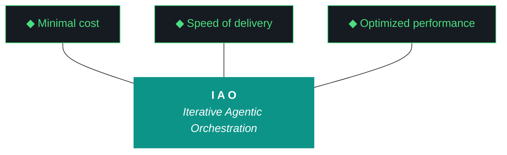

# iao - Base Harness

**Version:** 0.1.0
**Last updated:** 2026-04-08 (iteration 10.68.1 of kjtco extraction)
**Scope:** Universal iao methodology. Extended by project harnesses.
**Status:** iaomw - inviolable

## The Trident

## The Ten Pillars

1. **iaomw-Pillar-1 (Trident)** - Cost / Delivery / Performance triangle
2. **iaomw-Pillar-2 (Artifact Loop)** - design -> plan -> build -> report -> bundle
3. **iaomw-Pillar-3 (Diligence)** - First action: query_registry.py
4. **iaomw-Pillar-4 (Pre-Flight Verification)** - Validate environment before execution
5. **iaomw-Pillar-5 (Agentic Harness Orchestration)** - Harness is the product
6. **iaomw-Pillar-6 (Zero-Intervention Target)** - Interventions are planning failures
7. **iaomw-Pillar-7 (Self-Healing Execution)** - Max 3 retries per error
8. **iaomw-Pillar-8 (Phase Graduation)** - MUST-have deliverables gate graduation
9. **iaomw-Pillar-9 (Post-Flight Functional Testing)** - Build is a gatekeeper
10. **iaomw-Pillar-10 (Continuous Improvement)** - iao push feedback loop

---

## ADRs (14 universal)

### iaomw-ADR-003: Multi-Agent Orchestration

- **Context:** The project uses multiple LLMs (Claude, Gemini, Qwen, GLM, Nemotron) and MCP servers.
- **Decision:** Clearly distinguish between the **Executor** (who does the work) and the **Evaluator** (you).
- **Rationale:** Separation of concerns prevents self-grading bias and allows specialized models to excel in their roles. Evaluators should be more conservative than executors.
- **Consequences:** Never attribute the work to yourself. Always use the correct agent names (claude-code, gemini-cli). When the executor and evaluator are the same agent, ADR-015 hard-caps the score.

### iaomw-ADR-005: Schema-Validated Evaluation

- **Context:** Inconsistent report formatting from earlier iterations made automation difficult.
- **Decision:** All evaluation reports must pass JSON schema validation, with ADR-014 normalization applied beforehand.
- **Rationale:** Machine-readable reports allow leaderboard generation and automated trend analysis. ADR-014 keeps the schema permissive enough that small models can produce passing output without losing audit value.
- **Consequences:** Reports that fail validation are repaired (ADR-014) then retried; only after exhausting Tiers 1-2 does Tier 3 self-eval activate.

### iaomw-ADR-007: Event-Based P3 Diligence

- **Context:** Understanding agent behavior requires a detailed execution trace.
- **Decision:** Log all agent-to-tool and agent-to-LLM interactions to `data/iao_event_log.jsonl`.
- **Rationale:** Provides ground truth for evaluation and debugging. The black box recorder of the IAO process.
- **Consequences:** Workstreams that bypass logging are incomplete. Empty event logs for an iteration are a Pillar 3 violation.

### iaomw-ADR-009: Post-Flight as Gatekeeper

- **Context:** Iterations sometimes claim success while the live site is broken (G60 in v10.61).
- **Decision:** Mandatory execution of `scripts/post_flight.py` before marking any iteration complete.
- **Rationale:** Provides automated, independent verification of the system's core health. v10.63 W3 expands this to include production data render checks (counter to the existence-only baseline that let G60 ship).
- **Consequences:** A failing post-flight check must block the "complete" outcome. Existence checks are necessary but insufficient.

### iaomw-ADR-012: Artifact Immutability During Execution (G58)

- **Context:** In v10.59, `generate_artifacts.py` overwrote the design and plan docs authored during the planning session. The design doc lost its Mermaid trident and post-mortem. The plan doc lost the 10 pillars and execution steps.
- **Decision:** Design and plan docs are INPUT artifacts. They are immutable once the iteration begins. The executing agent produces only the build log and report. `generate_artifacts.py` must check for existing design/plan files and skip them.
- **Rationale:** The planning session (Claude chat + human review) produces the spec. The execution session (Claude Code or Gemini CLI) implements it. Mixing authorship destroys the separation of concerns and the audit trail.
- **Consequences:** `IMMUTABLE_ARTIFACTS = ["design", "plan"]` enforced in `generate_artifacts.py`. CLAUDE.md and GEMINI.md state this rule explicitly. The evaluator checks for artifact integrity as part of post-flight.

### iaomw-ADR-014: Context-Over-Constraint Evaluator Prompting

- **Context:** Qwen3.5:9b produced empty or schema-failing reports across v10.60-v10.62. Each prior fix tightened the schema or stripped the prompt, and each tightening produced a new failure mode. v10.59 W2 (G57 resolution) found the opposite signal: when context expanded with full build logs, ADRs, and gotcha entries, Qwen's compliance improved.
- **Decision:** From v10.63 onward, the evaluator prompt is **context-rich, constraint-light**. The schema stays, but its enforcement layer is replaced by an in-code normalization pass (`normalize_llm_output()` in `scripts/run_evaluator.py`). The normalizer coerces priority strings (`high`/`medium`/`low` -> `P0`/`P1`/`P2`), wraps single-string `improvements` into arrays, fills missing required fields with sane defaults, caps scores at the schema maximum (9), and rebuilds malformed `trident.delivery` strings to match the regex.
- **Rationale:** Small models trained on generic instruction-following respond to **examples and precedent** better than to **rules**. Tightening the schema gives Qwen less rope to imitate; loosening it (in code) and feeding it three good prior reports as in-context examples gives it a target to copy. v10.59 demonstrated this empirically; v10.63 codifies it.
- **Consequences:**
  - `scripts/run_evaluator.py` exposes `--rich-context` (default on), `--retroactive`, and `--verbose` flags.
  - The rich-context bundle includes design + plan + build + middleware registry + gotcha archive + ADR section + last 3 known-good reports as few-shot precedent.
  - `_find_doc()` falls through `docs/`, `docs/archive/`, `docs/drafts/` so retroactive evaluation against archived iterations works.
  - The "Precedent Reports" section (§17 below) is the canonical list of good evaluations.
  - When normalization patches a deviation, the patched fields are flagged in the resulting `evaluation` dict so reviewers can spot model drift over time.

### iaomw-ADR-015: Self-Grading Detection and Auto-Cap

- **Context:** v10.62 was self-graded by the executor (Gemini CLI) with scores of 8-10/10 across all five workstreams, exceeding the documented Tier 3 cap of 7/10. No alarm fired; the inflated scores landed in `agent_scores.json` as ground truth.
- **Decision:** `scripts/run_evaluator.py` annotates every result with `tier_used` (`qwen` | `gemini-flash` | `self-eval`) and `self_graded` (boolean). When `tier_used == "self-eval"`, all per-workstream scores are auto-capped at 7. The original score is preserved as `raw_self_grade` and the workstream gets a `score_note` field explaining the cap. Post-flight inspects the same fields and refuses to mark the iteration complete if any score > 7 lacks an evaluator attribution.
- **Rationale:** Self-grading bias is the single largest credibility threat to the IAO methodology. The harness already documents this in ADR-003. v10.62 demonstrated that documentation alone is not enforcement. Code-level enforcement closes the gap.
- **Consequences:**
  - `data/agent_scores.json` schema gains `tier_used`, `self_graded`, and `raw_self_grade` fields.
  - Any report with `self_graded: true` and any score > 7 is rewritten on the fly during the Tier 3 fallback path.
  - The retro section in the report template gains a mandatory "Why was the evaluator unavailable?" line whenever `self_graded` is true.
  - Pattern 20 (§15 below) is the human-facing version of this rule. Re-read it before scoring your own work.

### iaomw-ADR-016: Iteration Delta Tracking

- **Context:** IAO growth must be measured, not just asserted. Previous iterations lacked a structured way to compare metrics (entity counts, harness lines, script counts) across boundaries.
- **Decision:** Implement `scripts/iteration_deltas.py` to snapshot metrics at the close of every iteration and generate a Markdown comparison table.
- **Rationale:** Visibility into deltas forces accountability for regressions and validates that the platform is actually hardening.
- **Consequences:** Every build log and report must now embed the Iteration Delta Table. `data/iteration_snapshots/` becomes a required audit artifact.

### iaomw-ADR-017: Script Registry Middleware

- **Context:** The middleware layer has grown to 40+ scripts across two directories (`scripts/`, `pipeline/scripts/`). Discovery is manual and metadata is sparse.
- **Decision:** Maintain a central `data/script_registry.json` synchronized by `scripts/sync_script_registry.py`. Each entry includes purpose, function summary, mtime, and last_used status.
- **Rationale:** Formalizing the script inventory is a prerequisite for porting the harness to other projects (TachTech intranet).
- **Consequences:** New scripts must include a top-level docstring for the registry parser. Post-flight verification now asserts registry completeness.

### iaomw-ADR-021: Evaluator Synthesis Audit Trail (v10.65)

- **Context:** Qwen and Gemini sometimes produce "padded" reports when they lack evidence (Pattern 21). The normalizer in `run_evaluator.py` silently fixed these, hiding the evaluator failure.
- **Decision:** Normalizer tracks every synthesized field. If `synthesis_ratio > 0.5` for any workstream, raise `EvaluatorSynthesisExceeded` and force fall-through to the next tier.
- **Rationale:** Evaluator reliability is as critical as executor reliability. Padded reports are hallucinated audits and must be rejected.
- **Consequences:** The final report includes a "Synthesis Audit" section for transparency.

### iaomw-ADR-016: Iteration Delta Tracking
- **Status:** Proposed v10.64
- **Context:** IAO growth must be measured, not just asserted. Previous iterations lacked a structured way to compare metrics (entity counts, harness lines, script counts) across boundaries.
- **Decision:** Implement `scripts/iteration_deltas.py` to snapshot metrics at the close of every iteration and generate a Markdown comparison table.
- **Rationale:** Visibility into deltas forces accountability for regressions and validates that the platform is actually hardening.
- **Consequences:** Every build log and report must now embed the Iteration Delta Table. `data/iteration_snapshots/` becomes a required audit artifact.

### iaomw-ADR-017: Script Registry Middleware
- **Status:** Proposed v10.64
- **Context:** The middleware layer has grown to 40+ scripts across two directories (`scripts/`, `pipeline/scripts/`). Discovery is manual and metadata is sparse.
- **Decision:** Maintain a central `data/script_registry.json` synchronized by `scripts/sync_script_registry.py`. Each entry includes purpose, function summary, mtime, and last_used status.
- **Rationale:** Formalizing the script inventory is a prerequisite for porting the harness to other projects (TachTech intranet).
- **Consequences:** New scripts must include a top-level docstring for the registry parser. Post-flight verification now asserts registry completeness.

### iaomw-ADR-026: Phase B Exit Criteria

**Status:** Accepted (v10.67)
**Goal:** Define binary readiness for standalone repo extraction.

Standalone extraction (Phase B) requires all 5 criteria to be PASS at closing:
1. **Duplication Eliminated** — `iao-middleware/lib/` deleted, shims only in `scripts/`.
2. **Doctor Unified** — `pre_flight.py`, `post_flight.py`, and `iao` CLI use shared `doctor.run_all`.
3. **CLI Stable** — `iao --version` returns 0.1.0, entry points verified.
4. **Installer Idempotent** — `install.fish` marker block check passes.
5. **Manifest/Compat Frozen** — Integrity check clean, all required compatibility checks pass.

### iaomw-ADR-027: Doctor Unification

**Status:** Accepted (v10.67)
**Goal:** Centralize environment and verification logic.

Project-specific `pre_flight.py` and `post_flight.py` are refactored to be thin wrappers over `iao_middleware.doctor`. 
- **Levels:** `quick` (sub-second), `preflight` (readiness), `postflight` (verification).
- **Blockers:** Managed by the project wrapper to allow project-specific severity.
- **Benefits:** Fixes in check logic (e.g., Ollama reachability, deploy-paused state) apply once to all project entry points.

---

## Patterns (25 universal)

### iaomw-Pattern-01: Hallucinated Workstreams (v9.46)
- **Failure:** Qwen added a W6 "Utilities" workstream to the report.
- **Design doc:** Only had W1-W5.
- **Impact:** Distorted the delivery metric (5/5 vs 6/6).
- **Prevention:** Always count the workstreams in the design doc first. Your scorecard must have exactly that many rows.

### iaomw-Pattern-02: Build Log Paradox (v9.46)
- **Failure:** Evaluator claimed it could not find the build log despite the build log being part of the input context. Several workstreams were marked `deferred` that were actually `complete`.
- **Prevention:** Multi-pass read of the context. If a workstream claims a deliverable exists, look for the execution record in the build log.

### iaomw-Pattern-03: Qwen as Executor (v9.49)
- **Failure:** Listed 'Qwen' as the agent for every workstream.
- **Impact:** Misattributed work and obscured the performance of the actual executor (Claude).
- **Prevention:** You are the auditor. Auditors do not write the code. Always use the name of the agent you are evaluating.

### iaomw-Pattern-04: Placeholder Trident Values (v9.42)
- **Failure:** Reported "TBD - review token usage" in the Result column.
- **Impact:** The report was functionally useless for tracking cost.
- **Prevention:** If you don't have the data, count the events in the log. Never use placeholders.

### iaomw-Pattern-05: Everything MCP (v9.49)
- **Failure:** Evaluator listed every available MCP for every workstream.
- **Impact:** Noisy data, no signal about which MCPs are actually being exercised.
- **Prevention:** Use `-` if no MCP tool was called. Precision in MCP attribution is critical for Phase 10 readiness.

### iaomw-Pattern-06: Summary Overload (early v9.5x era)
- **Failure:** Evaluator produced a 10-sentence summary that broke the schema constraints. Three consecutive validation failures, retries exhausted.
- **Prevention:** Constraints are not suggestions. If the schema says 2000 characters max, stick to it.

### iaomw-Pattern-07: Banned Phrase Recurrence (v9.43-v9.51)
- **Failure:** "successfully", "robust", "comprehensive" reappear in summaries despite being banned.
- **Prevention:** §12 lists the full set. The schema validator greps for them.

### iaomw-Pattern-08: Workstream Name Drift (v9.50)
- **Failure:** Abbreviating workstream names (e.g., "Evaluator harness" instead of "Evaluator harness rebuild (400+ lines)").
- **Prevention:** Use the exact string from the design document. The normalizer will substitute, but don't rely on it.

### iaomw-Pattern-09: Score Inflation Without Evidence (v9.48)
- **Failure:** 9/10 score with one-sentence evidence.
- **Prevention:** Evidence must reach Level 2 (execution success) for any score >= 7.

### iaomw-Pattern-10: Evidence Levels Skipped (v9.47)
- **Failure:** Score given without any of the three evidence levels.
- **Prevention:** §5 lists the three levels. Level 1 + Level 2 are mandatory for `complete`.

### iaomw-Pattern-11: Evaluator Edits the Plan (v9.49)
- **Failure:** Evaluator modified the plan doc to match its evaluation, retroactively justifying scores.
- **Prevention:** Plan is immutable (ADR-012, G58). The evaluator reads only.

### iaomw-Pattern-12: Trident Target Mismatch (early v9.5x era)
- **Failure:** Reporting a Trident result that does not relate to the target (e.g., target is <50K tokens, result is "4/4 workstreams").
- **Prevention:** Match the result to the target metric. Cost matches cost. Delivery matches delivery. Performance matches performance.

### iaomw-Pattern-13: Empty Event Log Acceptance (v10.54-v10.55)
- **Failure:** Evaluator received an empty event log for the iteration and concluded "no work was done", producing an empty report.
- **Prevention:** Empty event log is a Pillar 3 violation but not proof of no work. Read the build log and changelog as fallback evidence (this is what `build_execution_context()` does in v10.56+).

### iaomw-Pattern-14: Schema Tightening Cascade (v10.60-v10.61)
- **Failure:** Each Qwen failure prompted tighter schema constraints, which caused the next failure mode.
- **Prevention:** ADR-014 reverses this. Loosen the schema in code (normalizer), give the model more context, more precedent, and more rope.

### iaomw-Pattern-15: Name Mismatch (v9.50, recurring)
- **Failure:** Workstream name in the report does not exactly match the design doc, distorting word-overlap matching.
- **Prevention:** The normalizer substitutes the design doc name when no overlap exists. But always start by copying the design doc names verbatim.

### iaomw-Pattern-17: Agent Overwrites Input Artifacts (G58)
- **Failure:** `generate_artifacts.py` regenerates all 4 artifacts unconditionally, destroying design and plan.
- **Detection:** Post-flight should verify design/plan docs have not been modified since iteration start.
- **Prevention:** Immutability check in `generate_artifacts.py`. `IMMUTABLE_ARTIFACTS = ["design", "plan"]` skips them if they already exist.
- **Resolution:** v10.60 W1 added the immutability guard. v10.60 W3 reconstructed v10.59 docs from chat history.

### iaomw-Pattern-18: Chip Text Overflow Despite Repeated Fixes (G59)
- **Failure:** HTML overlay text positioned via `Vector3.project()` has no relationship to Three.js geometry boundaries. Text floats wherever the projected coordinate lands.
- **Impact:** Chip labels overflow chip boundaries in every iteration from v10.57 through v10.60.
- **Root cause:** HTML overlays are positioned in screen space via camera projection. They have no awareness of the 3D geometry they are supposed to label.
- **Prevention:** Never use HTML overlays for permanent labels on 3D geometry. Use canvas textures painted directly onto the geometry face.
- **Resolution:** v10.61 W3 replaced all chip HTML labels with `CanvasTexture` rendering. Font size auto-shrinks from 16px down to a 6px minimum (raised to 11px in v10.62) until `measureText().width` fits within canvas width.

### iaomw-Pattern-21: Normalizer-Masked Empty Eval (G92)

- **Symptoms:** Closing evaluation shows all workstreams scored 5/10 with the boilerplate evidence string "Evaluator did not return per-workstream evidence...".
- **Cause:** Qwen returned an empty workstream array; `scripts/run_evaluator.py` normalizer padded the missing fields with defaults.
- **Correction:** ADR-021 enforcement. Normalizer must track synthesis ratio and force fall-through if > 0.5.

### iaomw-Pattern-22: Zero-Intervention Target (G71)

- **Symptoms:** Agent stops mid-iteration to ask for permission or confirm a non-destructive choice.
- **Cause:** Plan ambiguity or overly cautious agent instructions.
- **Correction:** Pillar 6 enforcement. Log the discrepancy, choose the safest path, and proceed. Pre-flight checks must use the "Note and Proceed" pattern for non-blockers.

### iaomw-Pattern-23: Canvas Texture for Non-Physical Labels (G69)

- **Symptoms:** HTML overlay labels drift during rotation, overlap each other, or jitter when zooming.
- **Cause:** `Vector3.project` projection math and DOM layer z-index collisions.
- **Correction:** Convert to `THREE.CanvasTexture` on a transparent `PlaneGeometry`. The label becomes a first-class 3D object in the scene.

### iaomw-Pattern-24: Overnight Tmux Pipeline Hardening (v10.65)

- **Symptoms:** Transcription or acquisition dies due to SSH timeout, network hiccup, or GPU OOM.
- **Cause:** Long-running foreground processes on shared infrastructure.
- **Correction:** Wrap all pipeline phases in an orchestration script and dispatch via detached tmux session (`tmux new -s <name> -d`). Stop competing local LLMs (`ollama stop`) before launch.

### iaomw-Pattern-25: Gotcha Registry Consolidation (G67/G94)

- **Symptoms:** Parallel gotcha numbering schemes lead to ID collisions or lost entries during merging.
- **Cause:** Independent editing of documentation (MD) and data (JSON).
- **Correction:** v10.65 W8 audited and restored legacy entries. Use the high ID range (G150+) for restored legacy items to prevent future collisions with the active G1-G99 range.

### iaomw-Pattern-26: Trident Metric Mismatch (G93)

- **Symptoms:** Report shows 0/15 workstreams complete while build log shows 14/15.
- **Cause:** Report renderer re-calculating delivery from normalized outcome fields instead of reading the build log's truth.
- **Correction:** `generate_artifacts.py` and `run_evaluator.py` must use regex to read the literal `Delivery:` line from the build log.

### iaomw-Pattern-28: Tier 2 Hallucination When Tier 1 Fails (G98)

When Qwen Tier 1 fell through on synthesis ratio, Gemini Flash Tier 2 produced structurally valid JSON that invented a W16 not in the design. Anchor Tier 2 prompts to design-doc ground-truth workstream IDs and reject responses containing IDs outside that set. Cross-ref: G98, ADR-021 extended, W8.

### iaomw-Pattern-29: Synthesis Substring Match Overcounting (G97)

`any(cf in f for f in synthesized)` matched `improvements_padded` as if it contained `improvements`, double-counting and producing ratios > 1.0. Fix: exact-match prefix (`field.split("(", 1)[0] in core_fields`). Cross-ref: G97, W7.

---

*base.md v0.1.0 - iaomw. Inviolable. Projects extend via <code>/docs/harness/project.md*
